# 二、在 AWS 中构建无服务器应用

本章将介绍使用 AWS Lambda 作为首选工具的无服务器应用的概念。这将帮助您理解无服务器工具中涉及的概念、直觉和工作组件。它还将解释 Lambda 中涉及的安全性、用户控件和版本控制代码的细微差别。您将通过实践教程和课程了解和学习使用 AWS Lambda。因此，建议您使用笔记本电脑和 AWS 帐户设置，按照本章进行操作，以便轻松执行给定的指令。

本章将涵盖以下主题：

*   AWS Lambda 中的触发器
*   匿名函数
*   作为容器的功能
*   配置功能
*   Lambda 函数的测试
*   Lambda 函数的版本控制
*   创建部署包

# AWS Lambda 中的触发器

无服务器函数是按需计算的概念。因此，必须有一个事件需要触发 Lambda 函数，以便启动整个计算过程。AWS Lambda 有几个事件可以作为触发器。AWS 的几乎所有服务都可以充当 AWS Lambda 的触发器。以下是可用于生成 Lambda 响应事件的服务列表：

*   API 网关
*   AWS 物联网
*   CloudWatch 活动
*   CloudWatch 日志
*   编解码器
*   Cognito 同步触发器
*   发电机
*   运动
*   S3
*   社交网站

AWS Lambda 的触发器页面如下所示：

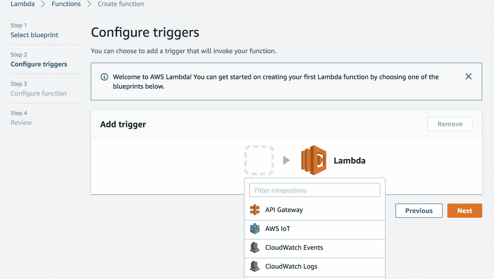

让我们来看看下面一些重要的和广泛使用的触发器，并了解它们如何在无服务器的范例中作为法斯来使用。详情如下:

*   **API 网关**：此触发器可用于创建高效、可扩展且无服务器的 API。无服务器 API 有意义的一个场景是在为 S3 构建查询接口时。让我们假设 S3 存储桶中有一堆文本文件。每当用户使用查询参数（可以是我们希望在 bucket 中的文本文件中搜索的某个单词）点击 API 时，API 网关的触发器将启动一个 Lambda 函数，该函数执行执行查询的计算逻辑和工作负载。我们希望 API 触发的 Lambda 函数可以在 API 创建时指定。触发器将相应地在相应的 Lambda 函数的控制台中创建。这就是它看起来的样子：


*   **CloudWatch**：It 事件主要帮助用户设置 Lambda 的 cron 调度。每当用户希望根据 CloudWatch 日志中的某个关键字执行计算工作负载时，CloudWatch 日志触发器非常有用。但是，CloudWatch 警报无法通过 CloudWatch 触发器直接触发 Lambda。它们必须通过通知系统发送，例如**AWS 简单通知服务**（**AWS SNS**。这就是如何在 AWS Lambda 中创建 cron 执行。在以下屏幕截图中，Lambda 函数设置为每分钟执行一次：


*   **S3**：这是 AWS 的文档库。因此，无论何时添加、删除或更改文件，当作为触发器添加时，都会向 AWS Lambda 发送一个事件。因此，如果您希望在文件上传后立即对文件执行一些计算工作负载，那么这个触发器有助于实现这一点。这就是 S3 的事件结构：

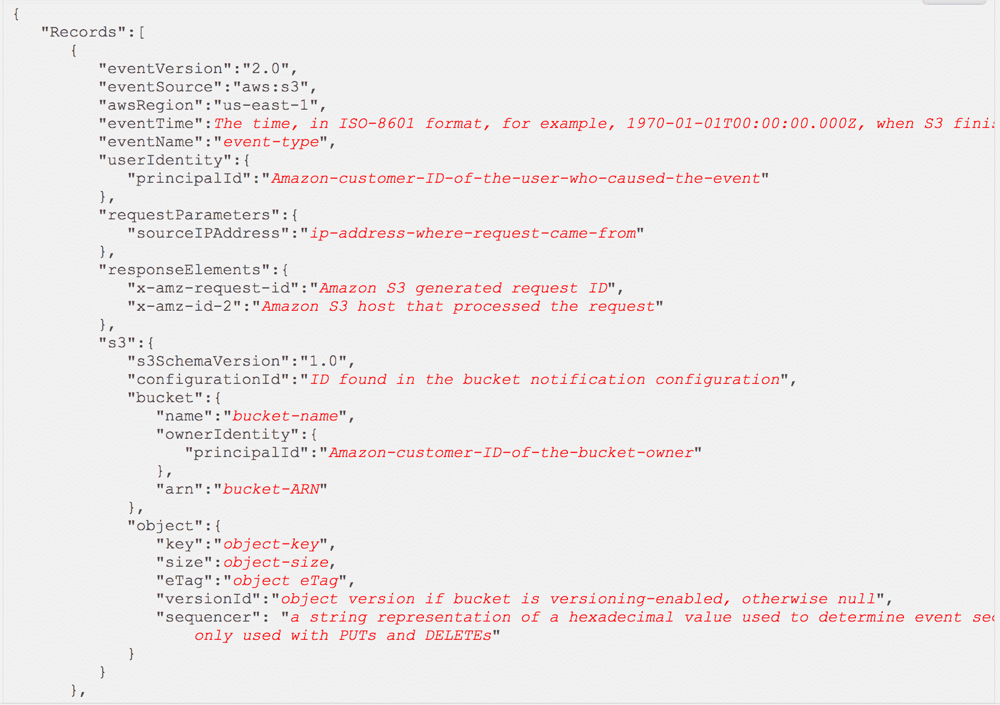

*   **AWS SNS**：AWS 的 SNS 服务帮助用户向其他系统发送通知。此服务还可用于捕获 CloudWatch 警报，并将通知发送到 Lambda 函数以执行计算。这就是示例 SNS 事件的样子：

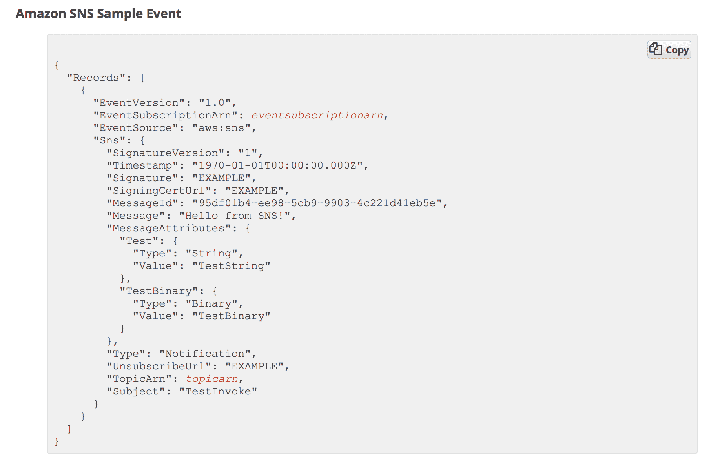

# 匿名函数

**Lambda 函数**是无服务器架构的核心操作部分。它们包含应该执行的代码。只要附加到它的触发器被触发，这些函数就会被执行。在上一节中，我们已经了解了一些最流行的 Lambda 触发器

每当触发 Lambda 函数时，它都会使用用户设置的相应设置创建一个容器。我们将在下一节中进一步了解容器。

容器的旋转需要一些时间，这可能会导致每次新调用 Lambda 函数时出现延迟，因为设置环境和引导用户在“高级设置”选项卡中提到的设置需要时间。因此，为了克服这种延迟，AWS 将容器解冻一段时间，以便在解冻时间内再次调用 Lambda 时重用。因此，使用解冻或现成的 Lambda 函数有助于克服延迟问题。但是，解冻容器的相同全局名称空间也将被重新用于新调用

因此，如果 Lambda 函数中有任何全局变量在函数内部被操作，最好将它们转换为本地名称空间，因为被操作的全局名称空间变量将被重用，从而导致 Lambda 函数的错误执行结果。

用户需要在“高级设置”选项卡中指定 Lambda 功能的技术详细信息，包括以下内容：

*   内存（MB）：这是 Lambda 函数为实现函数需要分配的最大内存。容器的 CPU 将被相应地分配。
*   超时：在容器自动停止之前，函数需要执行的最长时间。
*   DLQ 资源：这是 AWS Lambda 的死信设置。用户可以添加 SQS 队列或 SNS 主题来配置该队列。Lambda 函数在失败时至少异步重试五次。
*   专有网络：这使 Lambda 功能能够访问某些特定专有网络中的组件或服务。Lambda 函数在自己的默认 VPC 中执行。
*   KMS 密钥：如果有任何环境变量随 Lambda 函数一起输入，这有助于我们默认使用**AWS 密钥管理服务**（**KMS**）对其进行加密。

Lambda 函数的高级设置页面如下所示：

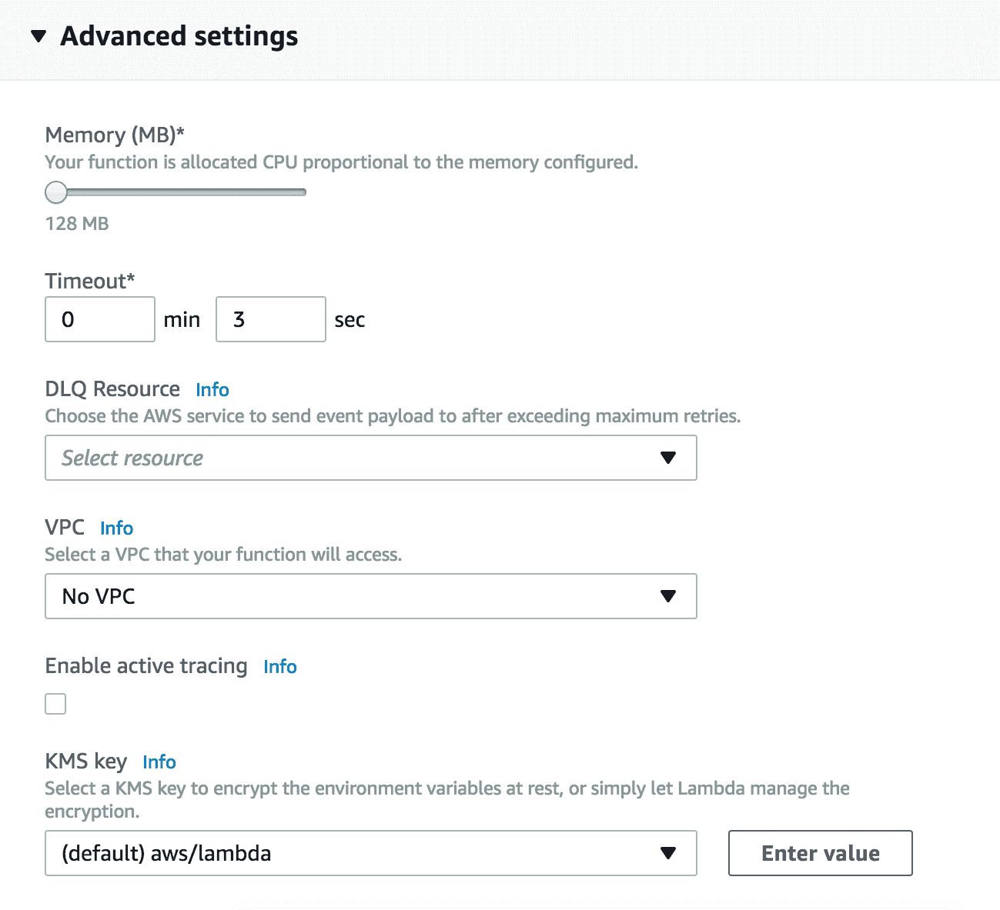

# 作为容器的功能

为了理解作为/在容器内执行的函数的概念，我们需要正确理解容器的概念。引用 Docker 文档中容器的定义（[https://www.docker.com/what-docker](https://www.docker.com/what-docker)

A container image is a lightweight, stand-alone, executable package of a piece of software that includes everything needed to run it: code, runtime, system tools, system libraries, settings.

可用于 Linux 和基于 Windows 的应用的内容；无论环境如何，容器化软件都将始终运行相同的程序。

容器将软件与其周围环境隔离开来（例如，开发环境和登台环境之间的差异），并有助于减少在同一基础设施上运行不同软件的团队之间的冲突。

因此，容器的概念是，它们是自我维持的孤立环境，就像集装箱船上的容器一样，可以承载并在任何主机操作系统上工作，在我们的类比中，主机操作系统就是主机船。类比的比喻性描述如下：


与上述类比类似，AWS Lambda 的函数也在每个函数的唯一容器中启动。因此，让我们逐一更详细地了解这个主题：

1.  Lambda 函数可以是单个代码文件的形式，也可以是**部署包**的形式。部署包是一个压缩文件，包括核心函数文件以及函数将使用的库。我们将在本章的*创建部署包*部分详细学习如何创建部署包。
2.  无论何时触发或启动函数，AWS 都会使用 AWS Linux 操作系统启动一个 EC2 实例来运行该函数。实例的配置取决于用户在 Lambda 函数的“高级设置”选项卡中提供的配置。
3.  函数成功执行的最大时间限制为 300 秒或 5 分钟，之后容器将被销毁。因此，在设计 Lambda 函数和/或部署包时，需要记住这一点。

# 配置功能

在本节中，我们将介绍配置 Lambda 函数的方法，并详细了解所有设置。与上一节一样，我们将了解每个配置及其设置，如下所示：

1.  您可以通过从 AWS 控制台左上角的下拉菜单中选择 AWS Lambda，转到 AWS Lambda 页面。这可以通过以下方式完成：


2.  选择 Lambda 选项后，它会将用户重定向到 AWS Lambda 控制台，如下所示：


3.  要创建函数，需要单击右侧的橙色“创建函数”按钮。这将为函数创建打开一个控制台。这看起来像这样：


4.  为了更好地理解配置，让我们从头开始创建一个函数。为此，请单击右上角的“从头开始编写”按钮。单击后，用户将被引导到 Lambda 的首次运行控制台，该控制台如下所示：


5.  此页面有三种配置供用户选择，即名称、角色和现有角色。名称值是用户可以输入 Lambda 函数名称的位置。角色值是您可以在 AWS 环境中定义权限的方式。角色值的下拉列表将包含以下选项：选择现有角色、从模板创建新角色以及创建自定义角色。具体如下：


“选择现有角色”选项将使我们能够选择具有预配置权限的现有角色。第二个选项帮助用户从预烘焙模板创建角色。“创建自定义角色”选项允许用户从头开始创建具有权限的角色。预烘焙角色列表如下所示：

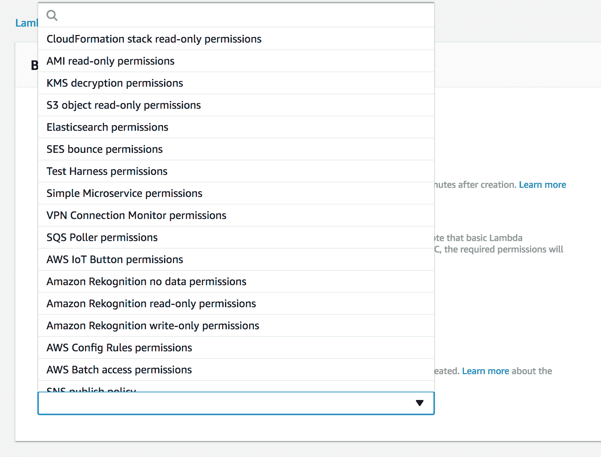

6.  为了学习本教程，请从预烘焙样板中选择一个。按下屏幕右下角的 Create function（创建函数），我们将进入 Lambda 函数的创建页面，该页面类似于以下内容：


7.  上一页表明我们已成功创建 AWS Lambda 函数。现在我们将探讨此功能的高级设置。它们位于同一控制台的下部。它们看起来像这样：


我们现在将尝试详细了解这些部分中的每一部分

8.  展开的环境变量部分包含文本框，用于输入函数将使用的环境变量的键值对。您还可以选择提及我们希望为环境变量设置的加密设置的详细信息。需要通过**AWS KMS**（**密钥管理服务**进行加密。环境变量的展开设置框如下所示：


9.  下一个设置部分是标签。这类似于所有可用 AWS 服务的标记功能，以便于服务发现。因此，与所有 AWS 服务的标记类似，这也只需要一个键和一个值。展开的标记部分如下所示：


10.  The next section that will be visible after the Tags section is the Execution role section, in which the user can set the **Identity Access Management (IAM)** role for the execution of the Lambda function. As we have already discussed what IAM roles are previously in the book, we will not be covering that again here. If the user has not set the role when creating the function itself, they can always set that here. The section will be visible in the Lambda console as follows:

    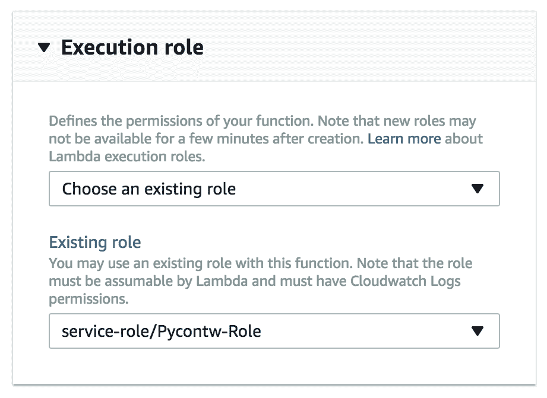

11.  The next section is the Basic settings section, which includes settings such as the memory of the Lambda container, time-out for the container, and the description for the Lambda function. The memory of the container can range from 128 MB to 1,536 MB. The user can choose any value within that range and will be billed accordingly. The time-out can be set from 1 second to 300 seconds, which is 5 minutes. The time-out is the time which the Lambda function and its container would run before being stopped or terminated. The next setting is the Description  value of the Lambda function, which acts as the metadata of a Lambda function. The section looks like this in the console:

    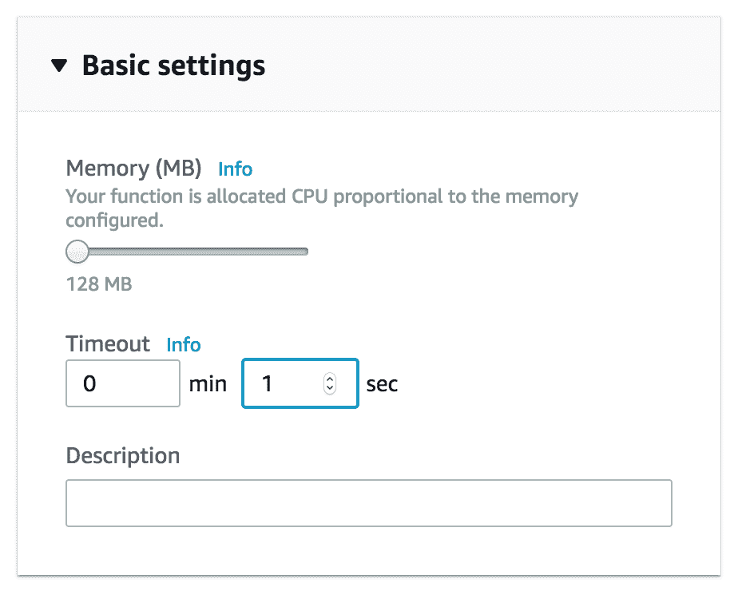

12.  The next section is the Network section, which is also about the network settings of the Lambda function related to **AWS's Virtual Private Cloud** (**VPC**) and related subnets. Even if No VPC is selected as an option, AWS Lambda runs in its own secure VPC. However, if your Lambda function accesses or deals with any other service which is in a particular VPC or in a subnet, the corresponding information needs to be added in this section so that the network allows traffic from the Lambda function's container. This section looks like this in the console:

    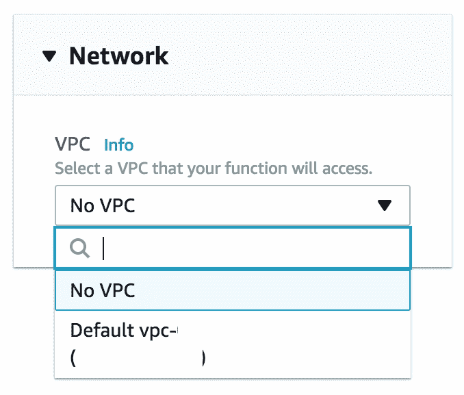

    The sensitive information in the preceding screenshot, such as the IP address and the ID of the VPC, are masked for security purposes.
13.  下一部分是调试和错误处理部分。本节使用户能够设置确保 Lambda 功能的容错和异常处理的措施。这包括**死信队列**（**DLQ**的设置。
14.  Lambda 会自动重试异步调用失败的执行。因此，未处理的有效负载将自动转发到 DLQ 资源。DLQ 设置在 Lambda 控制台中如下所示：

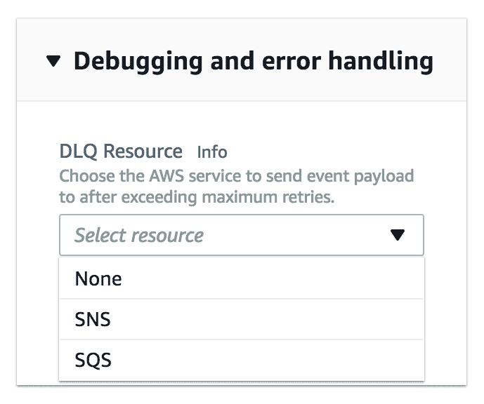

用户还可以为 Lambda 函数启用活动跟踪，这将有助于详细监视 Lambda 容器。Lambda 控制台调试和错误处理部分中的此设置如下所示：

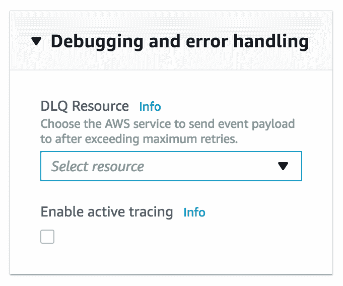

# Lambda 函数的测试

与其他软件系统和编程范例一样，在部署到生产环境之前，对 Lambda 功能和无服务器架构进行适当的测试非常重要。我们将尝试从以下几点了解 Lambda 函数的测试：

1.  在 Lambda 控制台的最顶部栏中，可以看到 Save and test 选项，该选项由一个橙色按钮表示。此按钮保存 Lambda 函数，然后在该函数上运行配置的测试。这在控制台中看起来像这样：

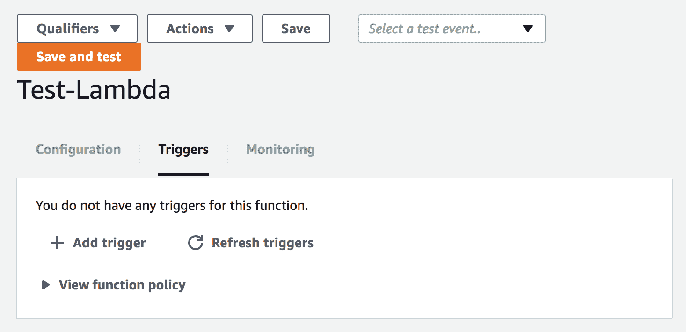

2.  此外，在同一条中，还存在一个下拉菜单，其内容为“选择测试事件…”。其中包含可用于测试 Lambda 函数的测试事件列表。下拉列表如下所示：


3.  现在，为了进一步配置 Lambda 函数的测试事件，用户需要在下拉列表中选择 configuretestevents 选项。这将打开一个带有测试事件菜单的弹出窗口，如下所示：


4.  这将打开基本的 Hello World 模板，该模板有三个预先配置的 JSON 格式测试事件或边缘案例。但是，根据 Lambda 函数的作用，可以选择其他一些测试事件。可在事件模板下拉菜单中查看测试模板的可用列表。下拉列表中的列表如下所示：


5.  例如，让我们假设我们正在构建一个管道，该管道涉及 Lambda 函数，每当图像文件被添加到 S3 存储桶时，该函数就开始运行，该函数执行一些图像处理任务并将其放回某个数据存储。S3 Put 通知的测试事件如下所示：

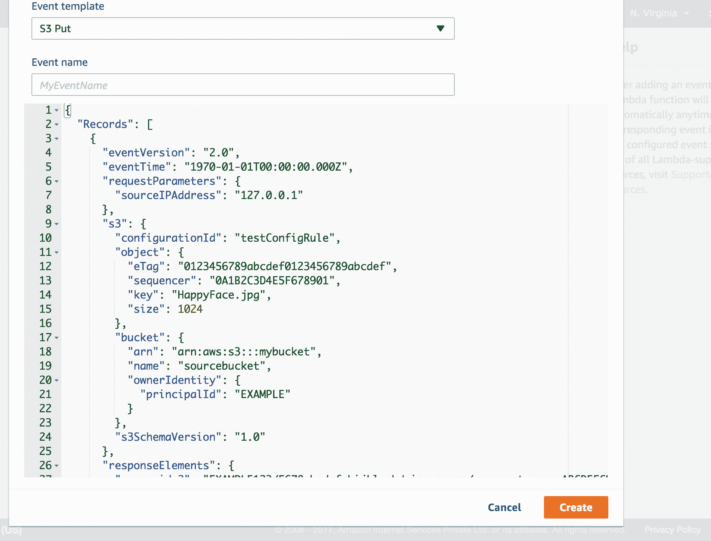

6.  选择或创建测试事件后，用户可以在事件创建控制台的右下角选择创建选项，要求您输入事件名称。输入必要的详细信息后，用户将被重新引导回 Lambda 控制台。现在，当您在 Lambda 控制台中选中 TestEvent 下拉列表时，您可以在列表中看到已保存的测试事件。这可以通过以下方式进行验证：


由于我已将事件命名为**TestEvent**，因此测试在事件下拉菜单中以相同的名称可见。

6.  此外，当我们仔细查看测试事件中 S3 的事件结构时，我们可以观察到 Lambda 函数可用的元细节。事件结构如下所示：

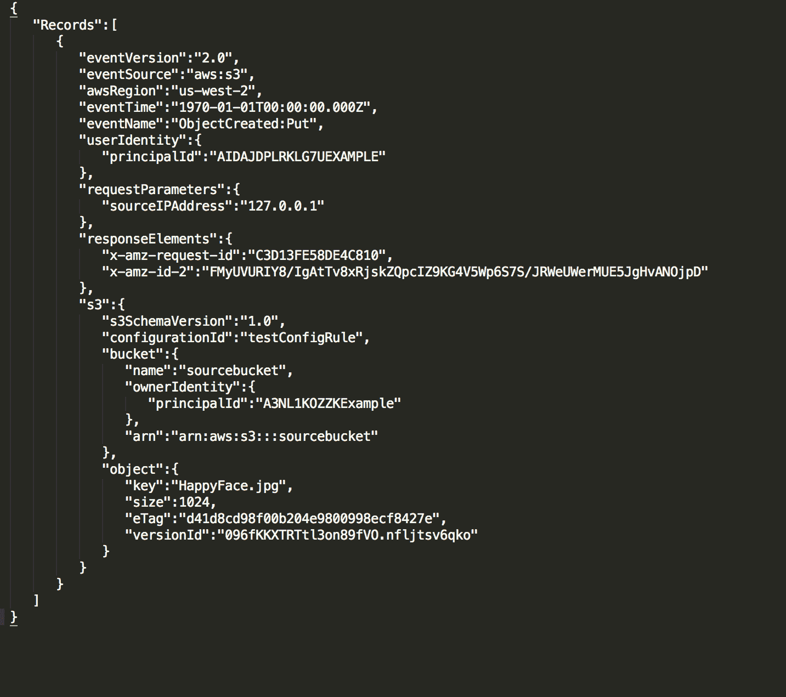

# Lambda 函数的版本控制

**版本控制系统**（**VCS**的概念是控制和管理代码的版本。此功能可直接从 Lambda 主控制台获得。让我们尝试并学习如何对 Lambda 函数进行版本设置：

1.  Lambda 控制台中“操作”下拉列表中的第一个选项是“发布新版本”选项。此选项可在此处看到：


2.  选择“发布新版本”选项后，将在控制台上看到 Lambda 控制台的版本控制弹出窗口。这将询问新版本 Lambda 函数的名称。弹出窗口如下所示：


3.  单击“发布”按钮后，您将被重新定向到主 Lambda 控制台。控制台中成功创建的 Lambda 版本如下所示：


4.  在页面的下半部分，可以注意到以下消息：代码和处理程序编辑仅适用于$LATEST 版本。这意味着只能在名为$LATEST 的版本中编辑代码。Lambda 函数的版本是只读的，无法编辑和操作。当出现问题或用户希望恢复或引用以前的版本时，该版本将覆盖$LATEST 版本，以便进行编辑。消息如下所示：


5.  单击“单击此处转到$LATEST”链接后，用户将被重新定向到该函数的$LATEST 版本，该版本可由用户编辑和操作。$Lambda 函数的最新版本的控制台如下所示：


# 创建部署包

具有外部库作为依赖项的 Lambda 函数可以打包为部署包，并上载到 AWS Lambda 控制台。这与在 Python 中创建虚拟环境非常相似。因此，在本节中，我们将学习并理解创建 Python 部署以用于 Lambda 函数的过程。我们将尝试并详细了解创建部署包的过程，如下所示：

1.  部署包通常采用 ZIP 包的格式。ZIP 包的内容与任何编程语言的普通库完全相同
2.  包结构应确保库文件夹和功能文件位于部署包文件夹结构内的相同目标或相同层次结构中。布局如下所示：


3.  可以使用`pip install <library_name> -t <path_of_the_target_folder>`命令安装 Python 库。这将在目标文件夹中安装程序包。这可以通过以下屏幕截图完成：


4.  现在，当我们准备好整个部署包的文件夹和库文件夹时，我们需要在将 Lambda 函数文件上载到控制台之前压缩所有文件夹，包括 Lambda 函数文件。以下屏幕截图显示了如何按照文件夹层次结构进行压缩：


5.  现在，随着压缩包准备就绪，我们将尝试将包上载到 Lambda 控制台进行处理。为了上传 Lambda 包，我们需要在控制台中选择代码输入类型选项的下拉列表。在 Lambda 控制台中，选择如下所示：


6.  一旦选择 Upload a.ZIP 文件选项，上传程序将变为可见，用户可以直接上传部署包，甚至可以通过 S3 bucket 上传。向导在 Lambda 控制台中的外观如下所示：

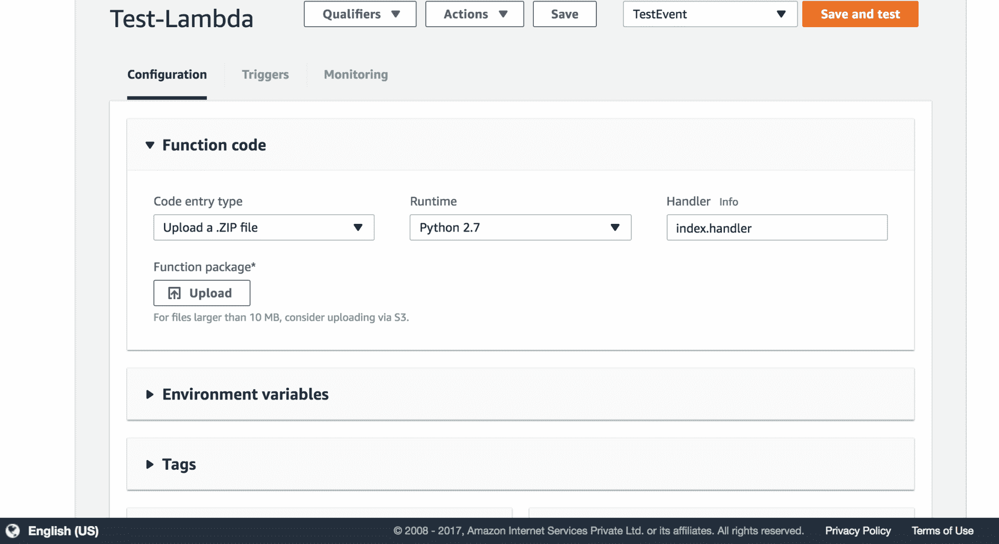

7.  如前所述，用户也可以选择通过 S3 文件位置上传部署包。在 Lambda 控制台中，此向导如下所示：


8.  部署包的命名应与设置的处理程序部分中输入的值一致。部署包的名称和 Lambda 函数文件的名称用点（`.`分隔，并按顺序排列。这可以在以下屏幕截图中清楚地看到：

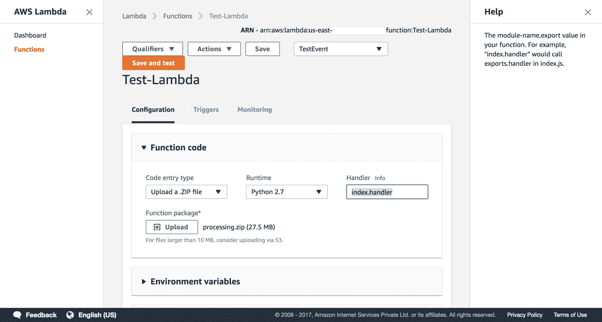

`index`应该是 Lambda 函数的文件名部署包的名称。`handler`函数文件是内部核心函数处理程序的名称，即 Lambda 函数。正如 AWS 文件所述：

The module-name export value in your function". For example, index.handler would call exports.handler in index.py.

# 总结

在本章中，我们学习了 AWS Lambda 的触发器如何工作的概念，以及在 cron 作业触发器的情况下，如何根据问题陈述和时间间隔选择触发器。我们了解了什么是 Lambda 函数，以及它们与内存、专有网络、安全性和容错相关的功能和设置。我们还了解了 AWS Lambda 在引擎盖下进行容器重用的方法。然后，我们介绍了事件驱动函数以及它们是如何在后台实现的，容器的概念，以及它们在软件工程领域中的使用和应用。最重要的是，从我们学习的有关容器的概念中，我们现在可以了解选择用于运行 Lambda 函数的容器的选项。

之后，我们讨论了 AWS Lambda 仪表板中可用的所有配置设置，这些设置是从头到尾构建和运行 Lambda 函数所必需的，不会出现任何与设置相关的问题。我们还了解并理解了 Lambda 内部的安全设置，以便在配置 Lambda 功能时注意必要的 VPC 详细信息和安全密钥设置。然后根据所选触发器的选择测试 Lambda 函数。我们了解了各种 AWS 服务的响应是什么样子的，因为它们是 Lambda 函数的输入。然后，我们学习了如何为定制测试目的编写定制的手工测试。

接下来，我们了解了 AWS Lambda 函数的版本控制过程。我们了解了过去和现在版本之间的差异。我们还了解到，与以前的版本不同，现在的版本是不可变的，并且还了解了如何不费吹灰之力就恢复到以前的版本。我们还学习了如何为依赖于外部包的函数创建部署包，这些外部包不包括在 Python 的标准库中。我们遇到了函数代码命名的细微差别，包括文件名和方法处理程序名，然后是可以上传到 Lambda 控制台的两种方式的部署包；一个是手动上传，另一个来自 S3 文件位置。

在下一章中，我们将详细了解 Lambda 控制台中可用的不同触发器以及如何使用它们。我们还将学习如何在 Python 代码中实现它们。我们将了解事件结构和来自不同 AWS 服务的响应，并使用它们构建 Lambda 函数。我们将了解如何将每个触发器集成到 Lambda 函数中，并在 Python 中执行特定任务。最后，我们还将学习有关如何使用无服务器模式将现有基础架构移动到无服务器的想法和最佳实践。

# 建立无服务器架构

到目前为止，我们已经了解了无服务器模式是什么，以及无服务器系统是如何工作的。我们还了解了 AWS Lambda 的无服务器工具的工作原理。我们还学习了触发器在 AWS Lambda 中如何工作的基础知识，以及用户在 Lambda 环境中可用的系统设置和配置的详细理解。我们还了解了 Lambda 控制台的工作原理，以及如何详细识别和使用 Lambda 控制台的各个部分，包括代码部署、触发器操作、在控制台中部署测试、对 Lambda 函数进行版本控制，以及不同的可用设置

在本章结束时，您将清楚地了解 AWS Lambda 可用的所有重要触发器，以及如何使用它们来建立高效的 Lambda 体系结构。您还将了解什么是事件结构，一些 AWS 资源的事件结构是什么样子，以及如何使用这些知识编写和部署更好的基于触发器的 Lambda 体系结构。

本章将涵盖以下几点：

*   S3 触发器
*   SNS 触发器
*   SQS 触发器
*   CloudWatch 事件和日志触发器

# S3 触发器

S3 是 AWS 对象存储服务，用户可以在其中存储和检索任何类型的对象。在本节中，我们将学习 S3 触发器如何工作，S3 事件的事件结构是什么样的，以及如何在学习构建 Lambda 函数时使用它们。

我们将构建一个 Lambda 函数，该函数执行以下操作：

1.  从 S3 服务接收 PUT 请求事件
2.  打印文件名和其他主要详细信息
3.  将该文件传输到其他存储桶

那么，让我们开始学习如何有效地使用 S3 触发器。我们将逐步开展这项工作，具体如下：

1.  首先，我们需要为任务创建两个 S3 存储桶。一个是用户上传文件的 bucket。另一个是通过 Lambda 函数传输和上载文件的位置。
2.  The S3 console looks like the following screenshot when there are no pre-existing buckets. You can go there by selecting the S3 service from the drop-down Services menu in the top-left of your AWS console:

    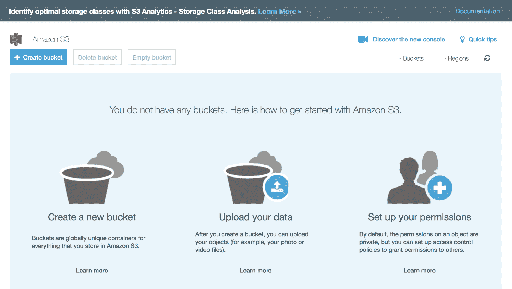

3.  让我们创建两个桶，即`receiver-bucket`和`sender-bucket`。
4.  `sender-bucket`bucket 将用作用户上传文件的 bucket。`receiver-bucket`bucket 是 Lambda 函数上传文件的 bucket。因此，根据我们的问题陈述，每当我们上传文件到`sender-bucket`存储桶时，Lambda 函数就会被触发，文件就会被上传到`receiver-bucket`。
5.  When we click on the  Create bucket button in the S3 console, we get a dialog that looks like this:

    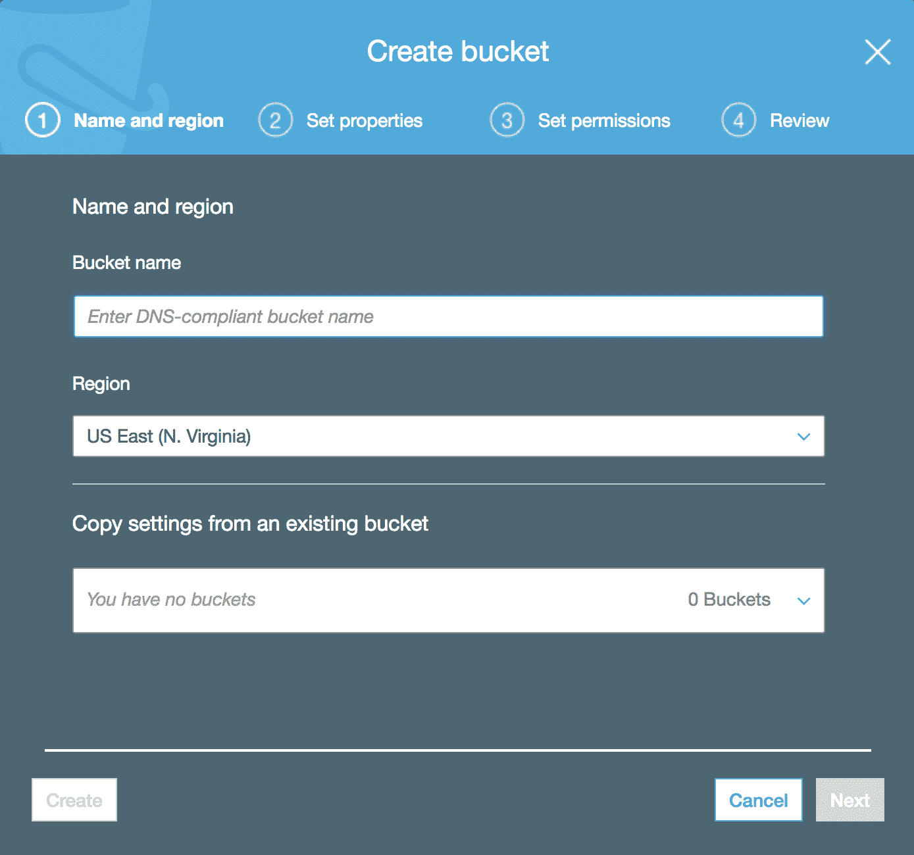

6.  在前面的对话框中，我们需要输入以下设置：
    *   Bucket Name:**顾名思义，我们需要输入我们正在创建的 Bucket 的名称。对于第一个 bucket 的创建，将其命名为`sender-bucket`，将第二个 bucket 命名为`receiver-bucket`。**
    ***   区域：这是我们希望 bucket 驻留的 AWS 区域。您可以为此区域使用默认区域，也可以使用距离您所在位置最近的区域。*   从现有 bucket 复制设置：这指定我们是否也要为此 bucket 在控制台中的其他 bucket 中使用相同的设置。由于控制台中目前没有任何其他存储桶，因此可以将其保留为空来跳过此设置。之后，您可以单击弹出窗口右下角的“下一步”按钮。**
***   单击“下一步”后，我们将重定向到弹出窗口的第二个选项卡，即“设置属性”菜单，如下所示：**

 **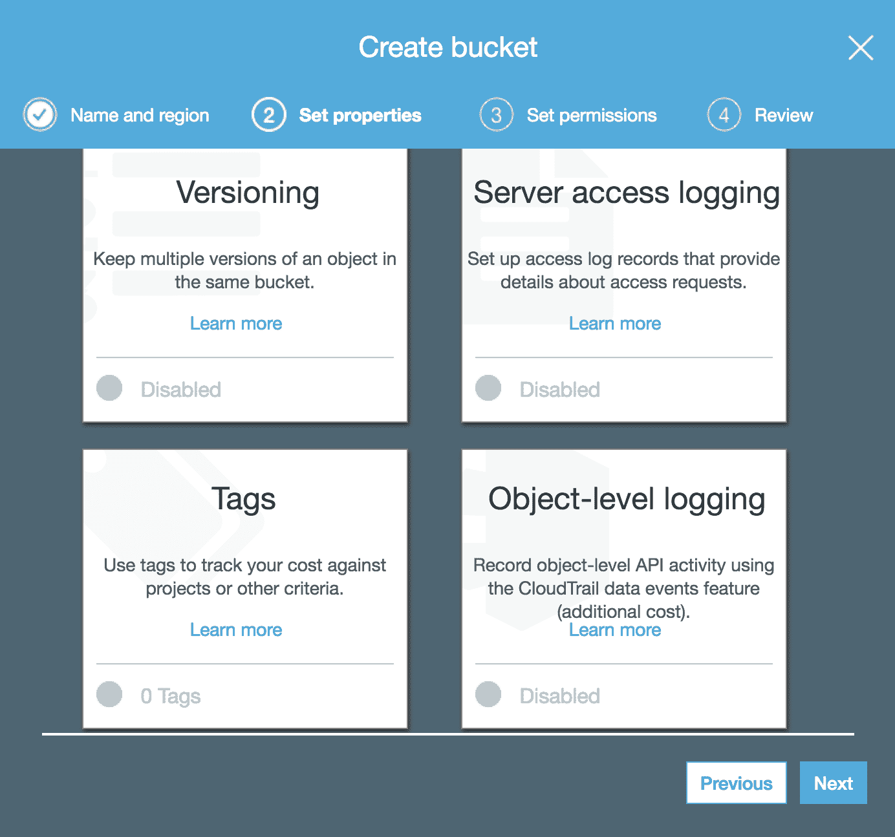

8.  在弹出窗口的这一部分，我们需要决定以下设置：

    *   版本控制：**如果我们想在 S3 存储桶中保留文件的多个版本，这是相关的。当您需要对 S3 存储桶进行 Git 样式的版本控制时，需要此设置。请注意，存储成本将包括在版本化文档的数量中。**
    ***   服务器访问日志：这将记录对 S3 存储桶的所有访问请求。这有助于调试任何安全漏洞并保护 S3 存储桶和文件。*   标记：这将使用*Name:Value*样式标记 bucket，与我们学习的 Lambda 函数的标记样式相同。*   对象级日志记录：这将使用 AWS 的 CloudTrail 服务记录 S3 bucket 上的所有访问请求和其他详细信息及活动。这也将包括 CloudTrail 成本。因此，只有在需要详细日志记录时才使用此功能。我们将跳过在本节中使用此选项。**
***   创建完 bucket 后，S3 控制台将如下所示，其中列出了创建的两个 bucket：**

 **

10.  我们已经成功地为任务创建了 S3 存储桶。现在，我们必须创建一个 Lambda 函数，该函数可以识别`sender-bucket`bucket 中上传的对象，并将该文件发送到`receiver-bucket`bucket。

11.  在创建 Lambda 函数时，这次从列出的可用选项中选择 s3 get object python blueprint：


12.  在下一步中配置 bucket 详细信息。在 Bucket 部分，选择 sender Bucket，并在 Event type 操作中选择 Object Created（所有）选项。这是因为我们希望在`sender-bucket`bucket 中创建对象时向 Lambda 发送通知。本节的完整部分如下所示：

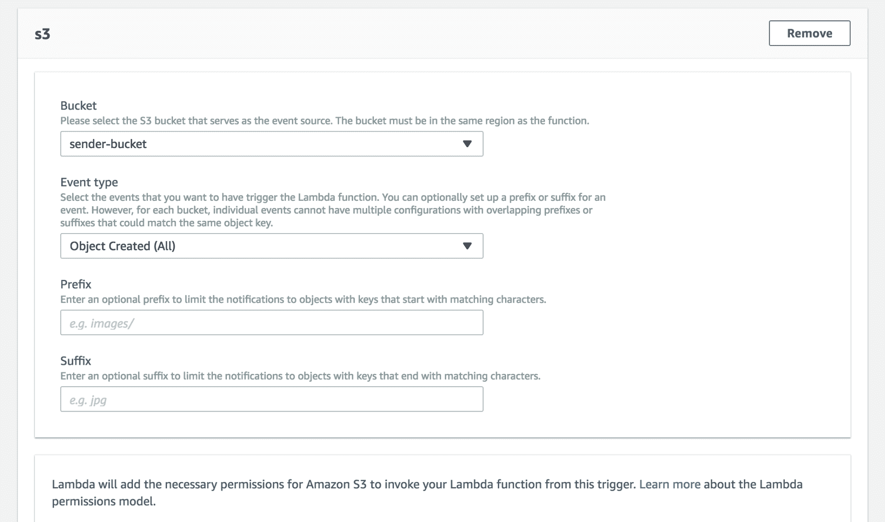

13.  启用触发器后，Lambda 将通过为任务创建样板代码来帮助您。我们需要做的就是编写代码将对象放入`receiver-bucket`桶中。样板代码可以在 Lambda 函数代码部分看到：


14.  完成此步骤并单击 Create function（创建功能）按钮后，您可以看到 Lambda 控制台的触发器部分，它在顶部以绿色显示成功消息：

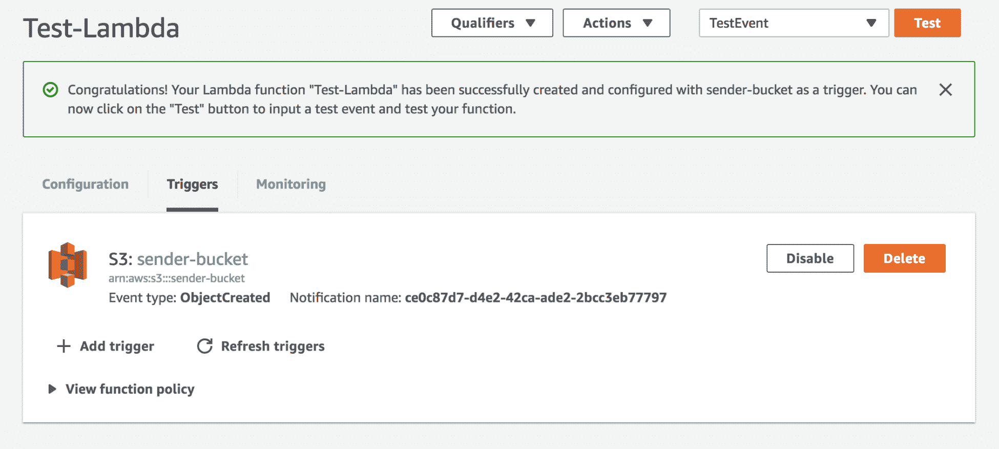

15.  我已经上传了一个小的图像文件到`sender-bucket`桶中。因此，现在发送方存储桶的内容如下所示：

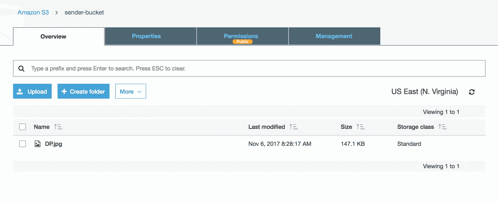

16.  这个文件一上传，Lambda 函数就被触发了。Lambda 函数代码如下所示：

```py
from __future__ import print_function

import json
import urllib
import boto3
from botocore.client import Config

print('Loading function')
sts_client = boto3.client('sts', use_ssl=True)

# Assume a Role for temporary credentials
assumedRoleObject = sts_client.assume_role(
RoleArn="arn:aws:iam::080983167913:role/service-role/Pycontw-Role",
RoleSessionName="AssumeRoleSession1"
)
credentials = assumedRoleObject['Credentials']
region = 'us-east-1'

def lambda_handler(event, context):
    #print("Received event: " + json.dumps(event, indent=2))

    # Get the object from the event and show its content type
    bucket = event['Records'][0]['s3']['bucket']['name']
    key = urllib.unquote_plus(event['Records'][0]['s3']       ['object']['key'].encode('utf8'))
    try:
        # Creates a session
        session = boto3.Session(credentials['AccessKeyId'],      credentials['SecretAccessKey'] ,      aws_session_token=credentials['SessionToken'],      region_name=region)

        #Instantiates an S3 resource
        s3 = session.resource('s3',  config=Config(signature_version='s3v4'), use_ssl=True)

        #Instantiates an S3 client
        client = session.client('s3',   config=Config(signature_version='s3v4'), use_ssl=True)

        # Gets the list of objects of a bucket
        response = client.list_objects(Bucket=bucket)

        destination_bucket = 'receiver-bucket'
        source_bucket = 'sender-bucket'

        # Adding all the file names in the S3 bucket in an  array
        keys = []
        if 'Contents' in response:
            for item in response['Contents']:
                keys.append(item['Key']);

        # Add all the files in the bucket into the receiver bucket
        for key in keys:
            path = source_bucket + '/' + key
            print(key)
        s3.Object(destination_bucket,  key).copy_from(CopySource=path)

    Exception as e:
        print(e)
print('Error getting object {} from bucket {}. Make sure they exist and your bucket is in the same region as this function.'.format(key, bucket))
raise e
```

17.  现在，当您运行 Lambda 函数时，您可以在 receiver bucket 中看到相同的文件：

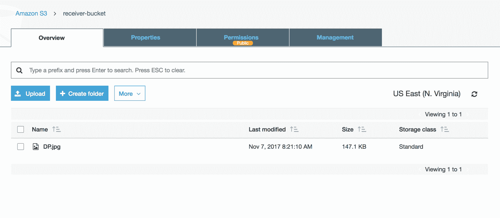

# SNS 触发器

SNS 通知服务可以跨多个用例使用，其中一个涉及触发 Lambda 函数。SNS 触发器通常用作 AWS CloudWatch 服务和 Lambda 之间的接口。

因此，在本节中，我们将执行以下操作：

1.  创建一个 SNS 主题
2.  为我们的`receiver-bucket`bucket 创建一个 CloudWatch 警报，以监控 bucket 中的对象数量
3.  一旦对象数达到 5，警报将设置为警报，相应的通知将发送到我们刚刚创建的 SNS 主题
4.  这个 SNS 主题将触发一个 Lambda 函数，它将为我们打印一条 Hello World 消息

这将帮助您了解如何监控不同的 AWS 服务，并为这些指标的某些阈值设置警报。根据服务的指标是否达到该阈值，Lambda 函数将被触发。

其工艺流程如下：

1.  可以从 SNS 仪表板创建 SNS 主题。单击创建主题选项，您将被重定向到 SNS 的主题创建仪表板。AWS 的 SNS 仪表板如下所示：

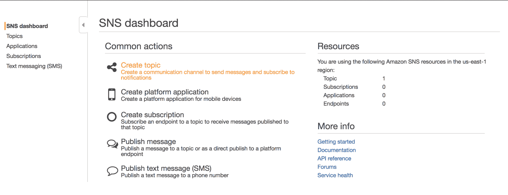

下一步中的 SNS 主题创建向导如下所示：

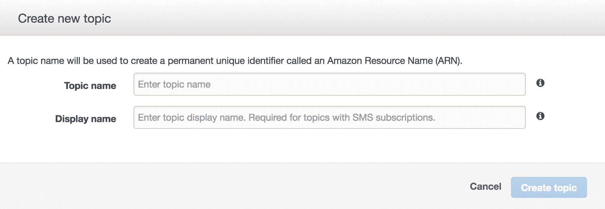

在这个创建向导中，您可以命名您正在创建的 SNS 主题，并添加您想要添加的任何元信息。

2.  创建主题后，您可以在 SNS 仪表板左侧的“主题”菜单中查看该主题。按钮如下所示：

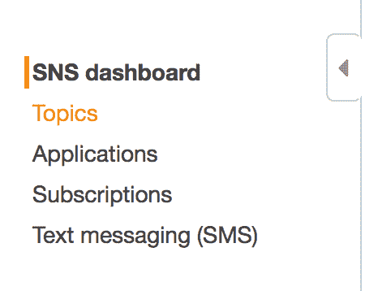

单击“主题”选项卡后，将显示主题列表，如以下屏幕截图所示：


3.  现在我们已经成功创建了一个 SNS 主题，我们将创建一个 CloudWatch 警报来监控 S3 存储桶中的文件。AWS CloudWatch 仪表板如下所示：


4.  现在，我们可以通过单击仪表板左侧列表中的报警按钮转到报警页面。的 AWS 报警页面如下所示：


5.  接下来，单击 Create Alarm（创建报警）以创建报警。这将打开具有多个选项的报警创建向导。该向导如下所示，具体取决于 AWS 生态系统中运行的服务：


6.  当我们打算为 S3 存储桶创建警报时，我们可以转到 S3 度量选项卡并忽略其余可用度量。如果单击 S3 Metrics 类别中的 Storage Metrics（存储度量）选项，您将被重新定向到另一个报警创建向导，该向导如下所示，具体取决于 S3 中存储桶的数量：


7.  如果观察“度量名称”列中的选项，您将看到每个 bucket 有两个可用选项：NumberOfObjects 和 BucketSizeBytes。它们是不言自明的，我们只需要`receiver-bucket`桶的 NumberOfObjects 选项。因此，选择该选项并单击下一步：

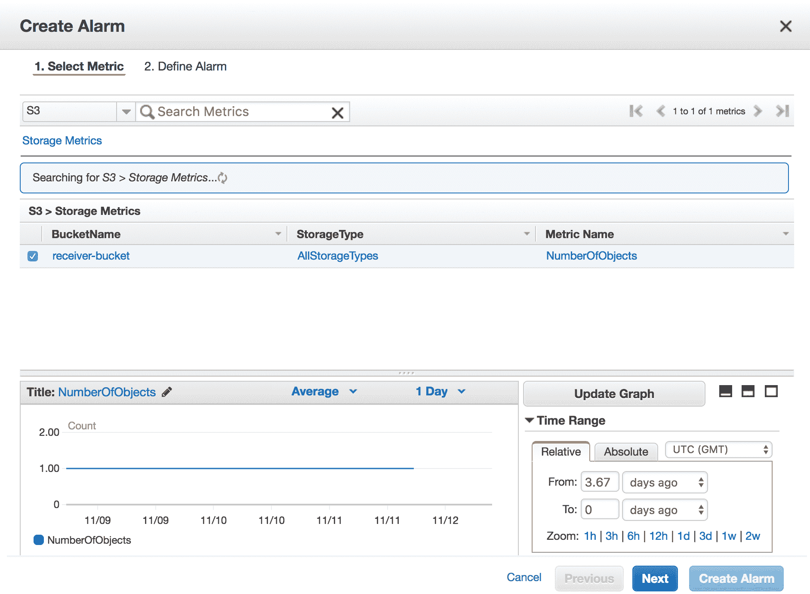

这将带您进入报警定义向导，您需要在其中指定 SNS 主题的详细信息和报警阈值。向导如下所示：

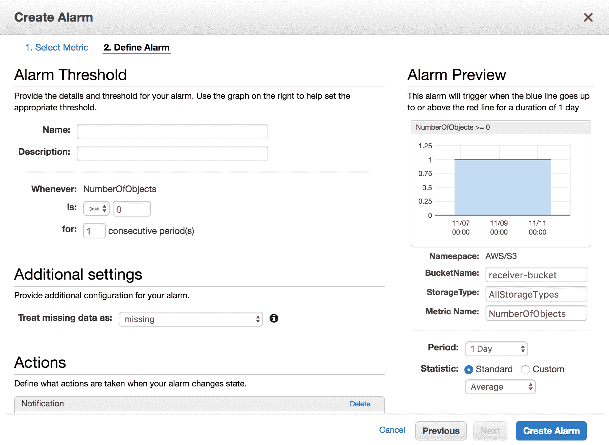

8.  添加阈值和报警名称的详细信息。阈值为五个文件，这意味着当相应存储桶中的文件数量（在我们的例子中为`receiver-bucket`）达到总共五个时，将触发报警。向导如下所示：


9.  在 Actions 选项中，我们可以配置报警，将通知发送到我们刚刚创建的 SNS 主题。您可以从下拉列表中选择主题，如下所示：


10.  一旦我们配置了 SNS 主题，我们可以点击底部的蓝色创建报警按钮。这将创建作为通知管道链接到 SNS 主题的警报。在仪表板上创建的报警如下所示：

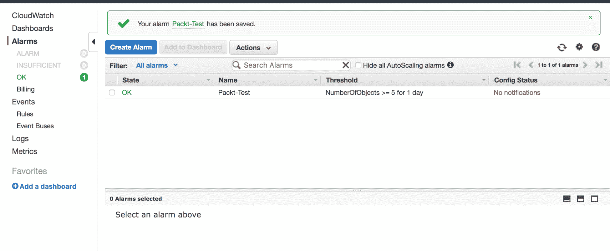

11.  现在，我们可以继续为任务构建 Lambda 函数。对于此特定任务，在创建 Lambda 函数时使用 sns 消息 python 蓝图：

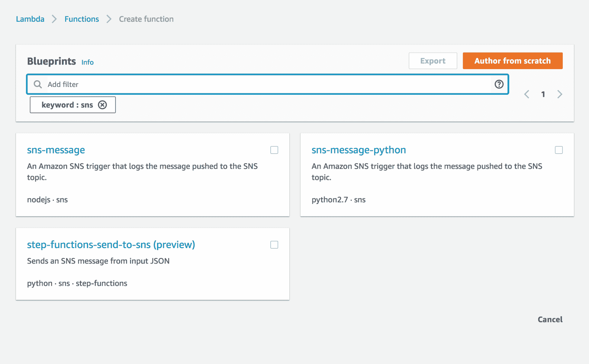

11.  在上一步中，当您选择 blueprint 时，将要求您输入有关 Lambda 函数的一些元信息，就像我们之前在创建 Lambda 函数时所做的那样。在同一向导中，还将要求您提及 SNS 主题的名称。您可以在此处指定它：


12.  既然我们已经正确地选择了 Lambda 函数的所有选项，现在我们可以继续代码了。所需的代码如下所示：


每当触发 Lambda 函数时，上述代码将显示一条`Hello World`消息。至此，我们已完成此任务的设置。

13.  要测试前面的设置，您只需将五个以上的文件上传到`receiver-bucket`存储桶，并检查 Lambda 函数的执行情况。

# SQS 触发器

**AWS 简单队列服务（SQS）**是 AWS 队列服务。此服务类似于软件工程中通常使用的排队机制。这使我们能够在队列中添加、存储和删除消息

我们将学习如何根据 SQS 队列中的消息数量触发 Lambda 函数。此任务将帮助您了解如何构建无服务器批处理数据体系结构，以及如何自己构建。

我们将通过使用 CloudWatch 警报监控 SQS 队列并通过 SNS 主题将信息转发给 Lambda 来实现这一点，就像我们在上一个任务中所做的那样。

因此，在本节中，我们将执行以下操作：

1.  创建一个 SQS 队列
2.  创建一个 SNS 主题
3.  为我们的 SQS 队列创建 CloudWatch 警报，以监视队列中的消息数
4.  一旦消息计数达到 5，警报将设置为警报，相应的通知将发送到我们刚刚创建的 SNS 主题
5.  这个 SNS 主题将触发一个 Lambda 函数，它将为我们打印一条`Hello World`消息

这将帮助您了解如何监控队列并构建高效的无服务器数据体系结构，这些体系结构是批处理的，而不是实时的。

其工艺流程如下：

1.  我们将首先创建一个 AWS SQS 队列。我们需要转到 AWS 帐户的 SQS 仪表板。仪表板如下所示：


2.  单击 Get Started Now 按钮创建 SQS 队列。它会将您重定向到队列创建向导，您需要在该向导中输入诸如名称、队列类型等详细信息。队列创建向导如下所示：


3.  您可以在队列名称中输入队列的名称。您需要什么类型的队列？选项，选择标准队列选项。在底部的选项中，选择蓝色的快速创建队列选项：


配置队列选项用于高级设置。没有必要为此任务调整这些设置。这就是高级设置的外观：


5.  创建队列后，您将进入 SQS 页面，在该页面中，您创建的所有队列的列表与 SNS 列表类似。此页面如下所示：


6.  由于我们在前面的任务中已经创建了一个 SNS 主题，因此我们将使用相同的主题来实现此目的。如果您还没有创建 SNS 主题，可以参考上一个任务，了解如何创建 SNS 主题的说明。SNS 主题列表如下所示：

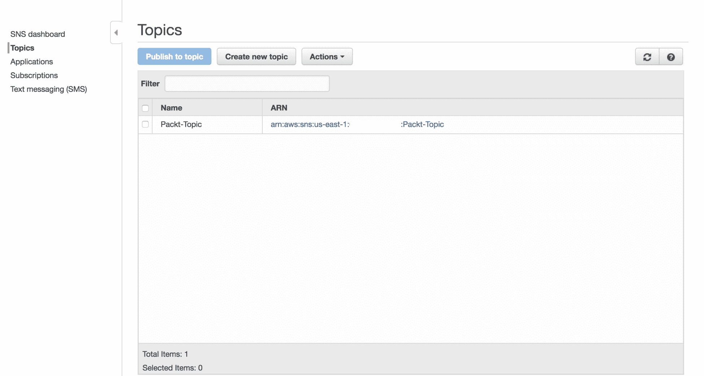

7.  现在，我们将转到 CloudWatch 仪表板创建一个警报来监控我们的 SQS 队列，并通过我们已经创建的 SNS 主题向 Lambda 发送通知。现在，我们可以在报警创建向导中查看 SQS 队列指标：


8.  通过单击 SQS Metrics 下的 Queue Metrics（队列度量）选项，我们将进入列出所有队列度量的页面，我们需要为警报选择其中一个：


9.  这里，我们感兴趣的是 ApproximateEnumberOfMessagesVisible 度量，它给出了队列中的消息数。它表示近似，因为 SQS 是一个分布式队列，消息的数量只能随机确定。

10.  在下一页中，从列表中选择 ApproximateEnumberOfMessagesVisible 度量之后，可以像我们在上一个任务中为 S3 度量所做的那样配置必要的设置。页面应如下所示：

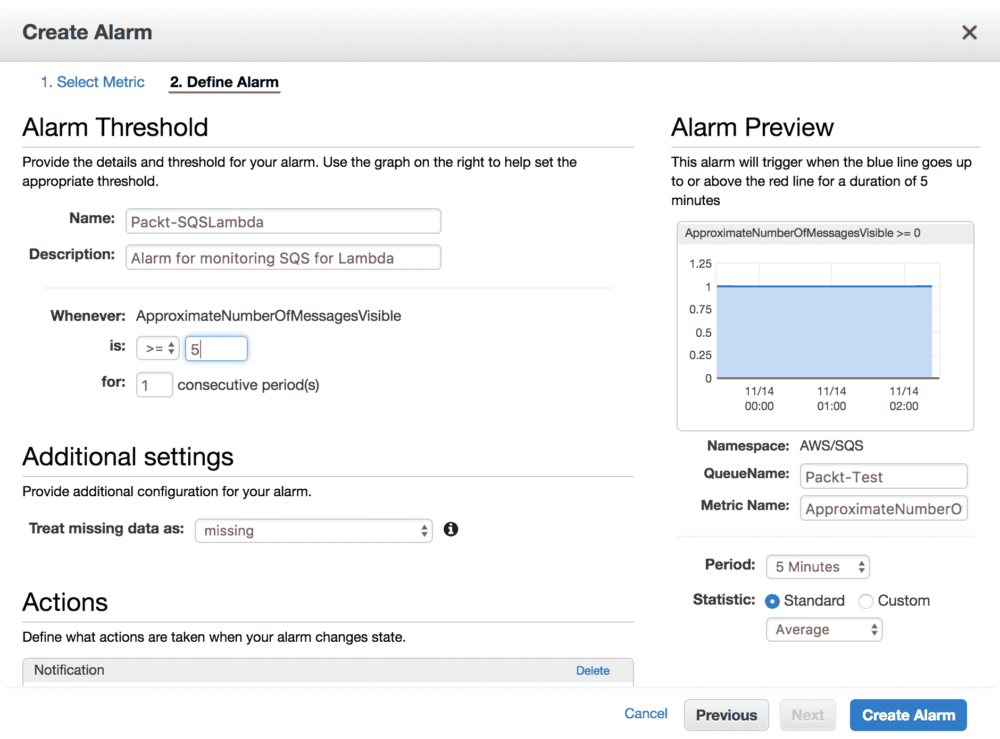

11.  在“操作”部分，配置要向其发送通知的 SNS 主题。此步骤也类似于我们在上一个任务中配置 SNS 主题的方式：

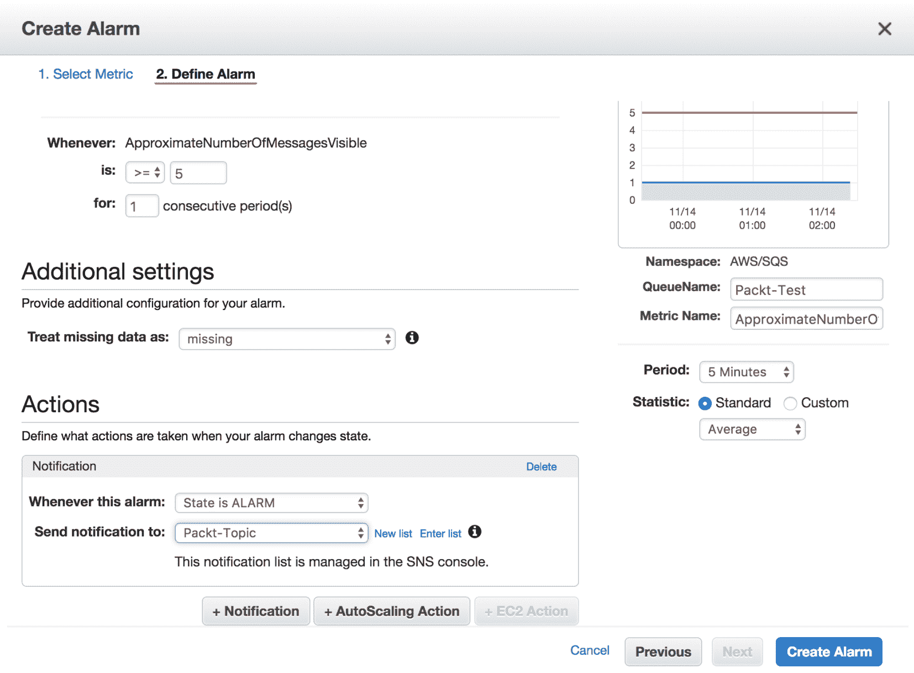

12.  一旦您对元数据和为报警配置的设置感到满意，就可以单击屏幕右下角的蓝色创建报警按钮。这将成功创建一个警报，监视您的 SQS 队列，并向您已配置的 SNS 主题发送通知：


13.  我们可以使用在上一个任务中创建的 Lambda 函数。确保触发器是我们用于配置报警通知系统的 SNS 主题：


14.  此任务的 Lambda 功能代码如下所示：

```py
from __future__ import print_function
import json
print('Loading function')
def lambda_handler(event, context):
    #print("Received event: " + json.dumps(event, indent=2))
    message = event['Records'][0]['Sns']['Message']
    print("From SNS: " + message)
    print('Hello World')
    return message
```

# 云表触发器

**CloudWatch**是 AWS 的日志记录和监控服务，存储和监控大多数服务的日志。在本节中，我们将学习 CloudWatch 触发器是如何工作的，CloudWatch 查询在实践中是如何工作的，在 Lambda 函数中配置它，以及如何利用这些知识构建 Lambda 函数。

因此，在本节中，我们将执行以下操作：

1.  创建 CloudWatch 日志
2.  简要了解 CloudWatch 日志的工作原理
3.  创建一个由 CloudWatch 触发器触发的 Lambda 函数

这将帮助您理解并构建弹性和稳定的无服务器体系结构

其工艺流程如下：

1.  要创建 CloudWatch 日志组，请单击 CloudWatch 控制台左侧的日志选项：

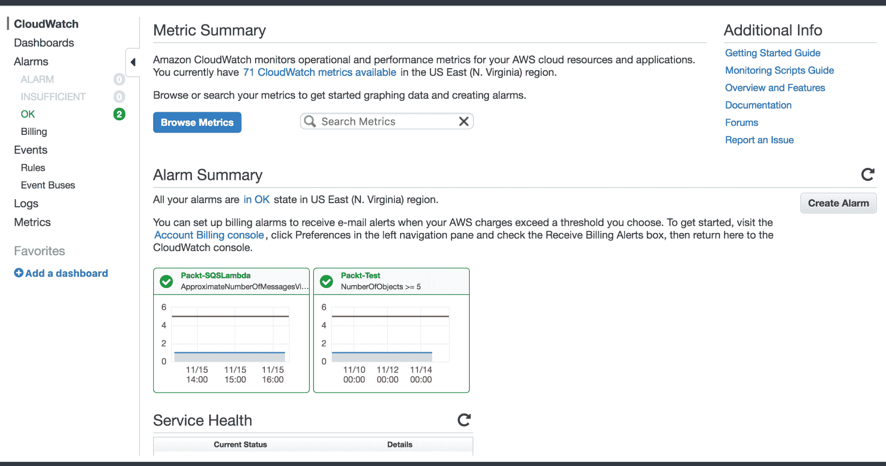

2.  进入 AWS CloudWatch 日志页面后，您将看到已经存在的日志组列表。CloudWatch 日志页面如下所示：


3.  让我们继续创建一个新的 CloudWatch 日志。您可以从顶部的“操作”下拉菜单中看到创建新日志组的选项：

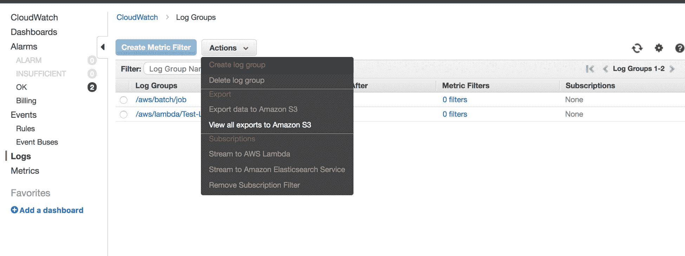

4.  在下一步中，将要求您命名要创建的日志组。继续并输入相关信息，然后单击创建日志组：

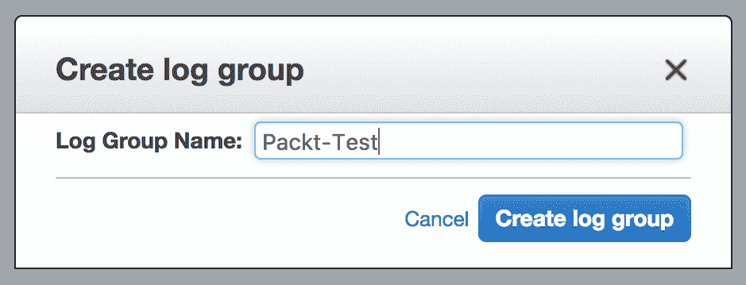

5.  因此，现在我们在 CloudWatch 控制台的日志组列表中列出了一个新的日志组：

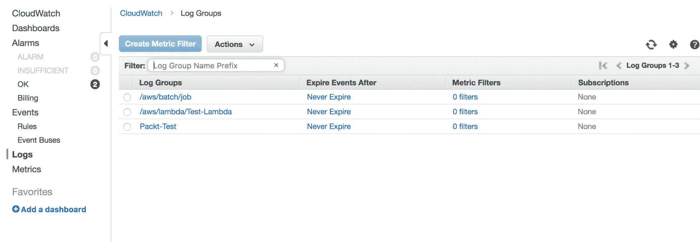

6.  一旦创建了日志组，我们现在就可以开始使用 Lambda 函数了。那么，让我们转到 Lambda 控制台并开始创建一个新函数。
7.  从蓝图中，选择 cloudwatch 日志流程数据蓝图。描述如下：Amazon CloudWatch 日志组接收的日志事件的实时使用者：


8.  选择相应的 blueprint 选项后，会像往常一样重定向到 Lambda 创建向导：

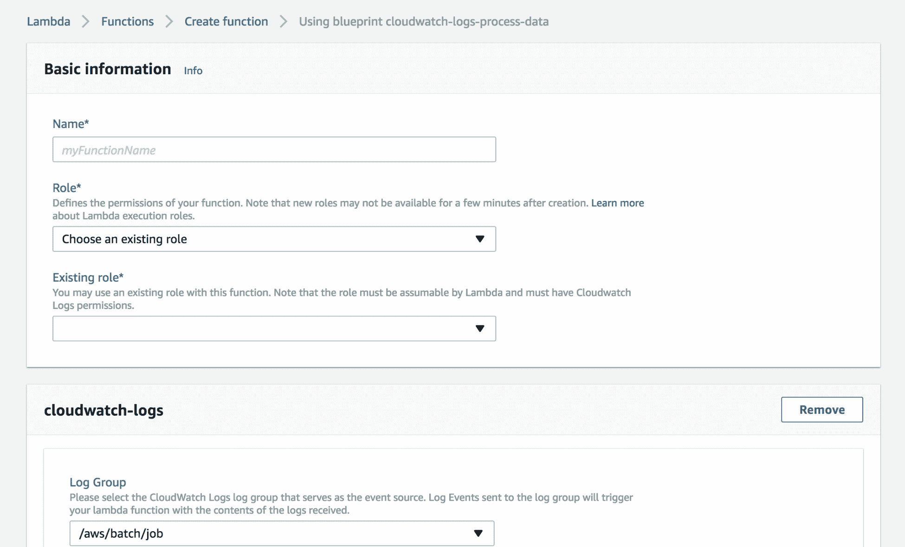

9.  正如我们在上一个任务中所做的那样，我们还将在 Lambda 创建面板的 cloudwatch logs 窗格中输入有关日志名称和其他详细信息的相关信息：


10.  单击 createfunction 之后，我们将被引导到一个触发器页面，其中包含成功消息。

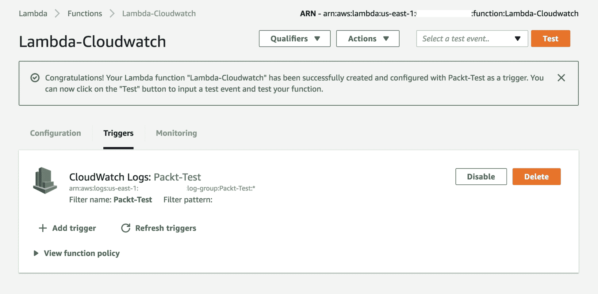

11.  因此，现在我们编写 Lambda 函数代码来标识日志组并打印`Hello World `消息：

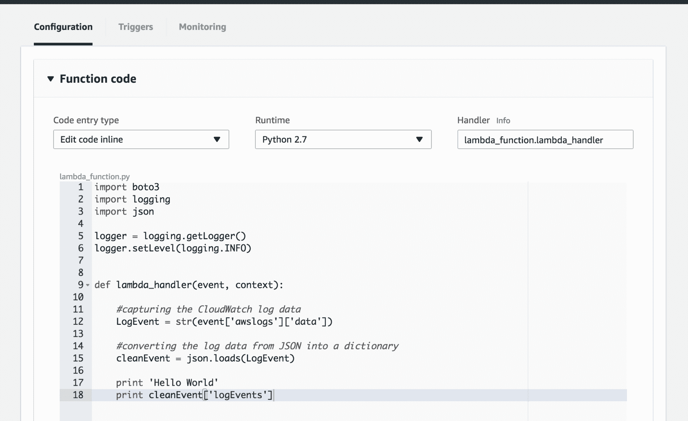

12.  现在，我们已经成功地完成了另一项任务，了解了如何通过 AWS CloudWatch 日志触发 Lambda 函数。此任务的 Lambda 功能代码如下所示：

```py
 import boto3
 import logging
 import json
 logger = logging.getLogger()
 logger.setLevel(logging.INFO)
 def lambda_handler(event, context):
 #capturing the CloudWatch log data
 LogEvent = str(event['awslogs']['data'])
 #converting the log data from JSON into a dictionary
 cleanEvent = json.loads(LogEvent)
 print 'Hello World'
 print cleanEvent['logEvents']
```

# 总结

在本章中，我们了解了很多关于各种 Lambda 触发器的工作原理，以及如何配置它们、设置触发器和编写 Lambda 函数代码来处理来自它们的数据

在第一个任务中，我们学习了 S3 事件是如何工作的，以及如何理解和接收从 S3 服务到 AWS Lambda 的事件。我们已经了解了如何通过 CloudWatch 中的度量来监控 S3 存储桶中的文件详细信息，然后通过 AWS SNS 将该通知发送给 Lambda 函数。

我们还学习了如何创建 SNS 主题，以及如何将它们用作从 CloudWatch 到 AWS Lambda 的 AWS 服务的几个指标之间的中间路线。

我们简要了解了 AWS CloudWatch 的工作原理。我们了解了各种 AWS 服务的度量标准，如 S3、SQS 和 CloudWatch。我们还学习了如何为 CloudWatch 警报设置阈值，以及如何将这些警报连接到通知服务，如 AWS SNS。

我们学习了 AWS CloudWatch 日志如何工作，以及如何连接和使用 Lambda 中的 CloudWatch 触发器，以便在添加/接收新日志事件时触发它。总的来说，我们在本章中成功创建了新的 AWS 服务，如 SQS、CloudWatch 日志、SNS 和 S3 bucket，并成功构建和部署了三个无服务器任务/管道。

在下一章中，我们将学习如何构建无服务器 API，在此基础上，我们将执行一些与本章中相同的任务，并实际了解 API 的工作方式，最重要的是，了解无服务器 API 的工作方式。****