# 八、Microsoft Azure 功能简介

到目前为止，我们已经学习了如何在 AWS 环境中使用 Python 构建无服务器函数和无服务器体系结构。我们还详细了解了 AWS Lambda 工具的设置和环境。现在，我们将从 Microsoft Azure 功能中学习和探索它的对应项。

在本章中，您将了解 Microsoft Azure 函数的工作原理、Microsoft Azure 函数控制台的外观以及如何了解控制台中的设置。本章分为以下几节：

*   Microsoft Azure 功能简介
*   创建第一个 Azure 函数
*   理解触发器
*   了解日志记录和监控
*   编写 Microsoft Azure 函数的最佳实践

# Microsoft Azure 功能简介

Microsoft Azure 功能是 AWS Lambda 服务的 Azure 对应项。在本节中，我们将学习如何定位和导航 Microsoft Azure 功能控制台。因此，让我们从执行以下步骤开始：

1.  通过导航到左侧菜单上的“所有服务”选项卡并键入函数过滤器，您可以找到 Azure Functions 应用。现在，您将注意到 Microsoft Azure 功能的名称为 Function Apps:

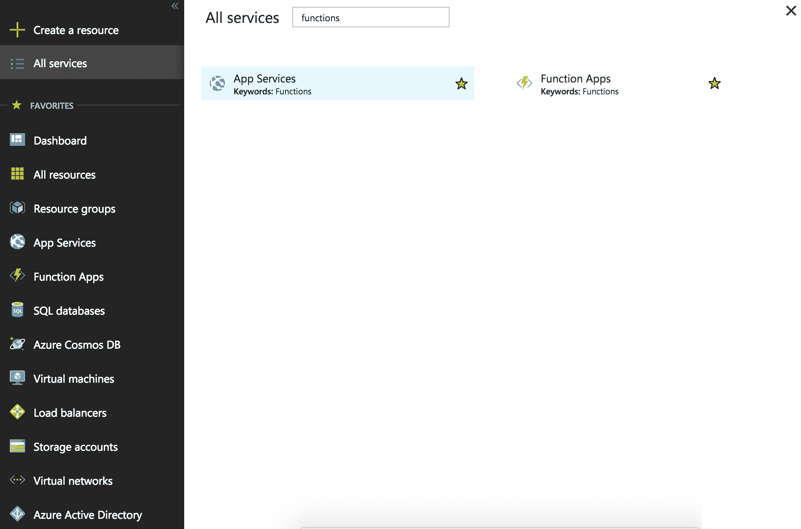

2.  单击该按钮后，您将被重新定向到功能应用控制台。现在，如果您还没有创建任何函数，它将是空的。控制台的外观如下所示：

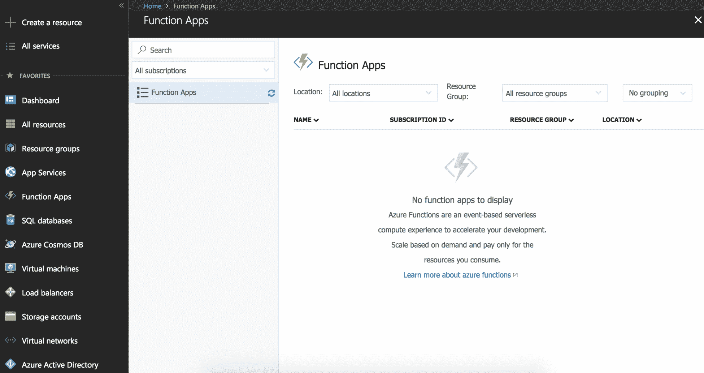

3.  现在，让我们从创建 Azure 函数开始。为此，我们需要单击左侧菜单上的“创建资源”选项，然后单击该列表中的“计算”选项，然后从随后的选项列表中选择“函数应用”选项：

Microsoft Azure 功能位于仪表板上的**计算**资源列表中。在以下部分中，我们将学习如何创建 Microsoft Azure 函数，并了解不同类型的触发器及其工作方式。

# 创建第一个 Azure 函数

在本节中，我们将学习如何创建和部署 Azure 函数。为了了解 Azure 功能的每个部分是如何工作的，我们将逐步完成该过程：

1.  当您单击菜单中的功能应用时，您将被重新定向到功能应用创建向导，如以下屏幕截图所示：

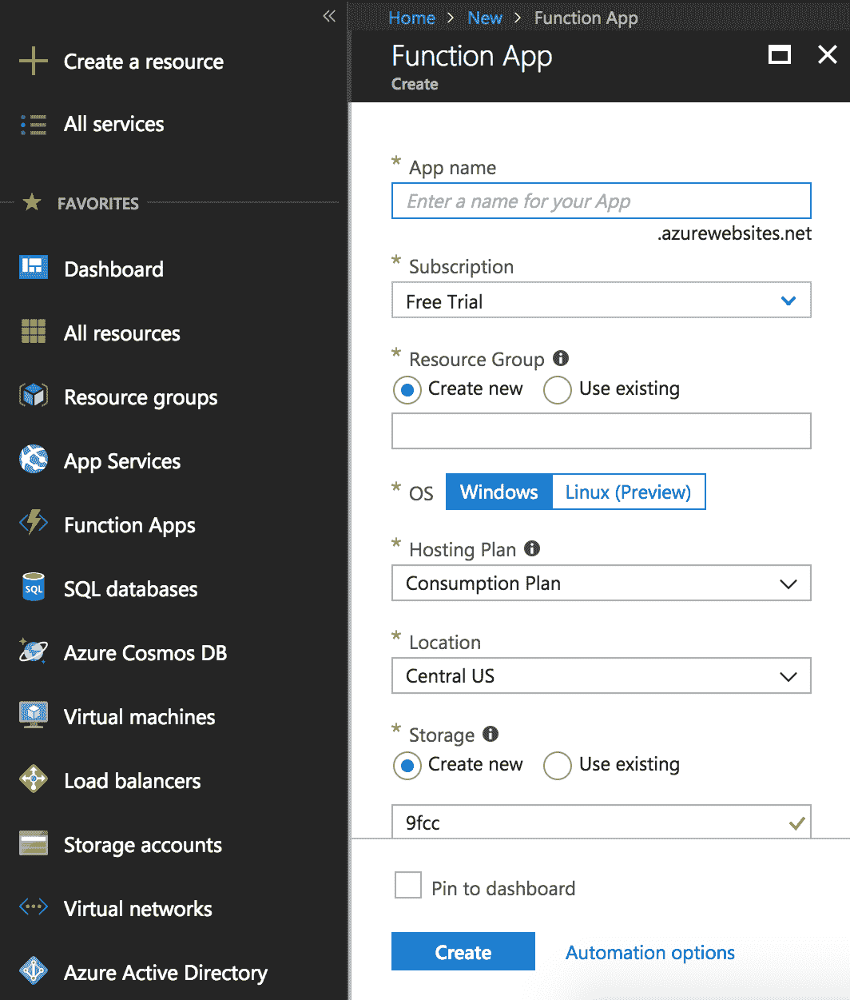

2.  相应地在向导中添加所需信息。选择 Linux（预览版）作为操作系统。然后，单击向导底部的蓝色创建按钮：

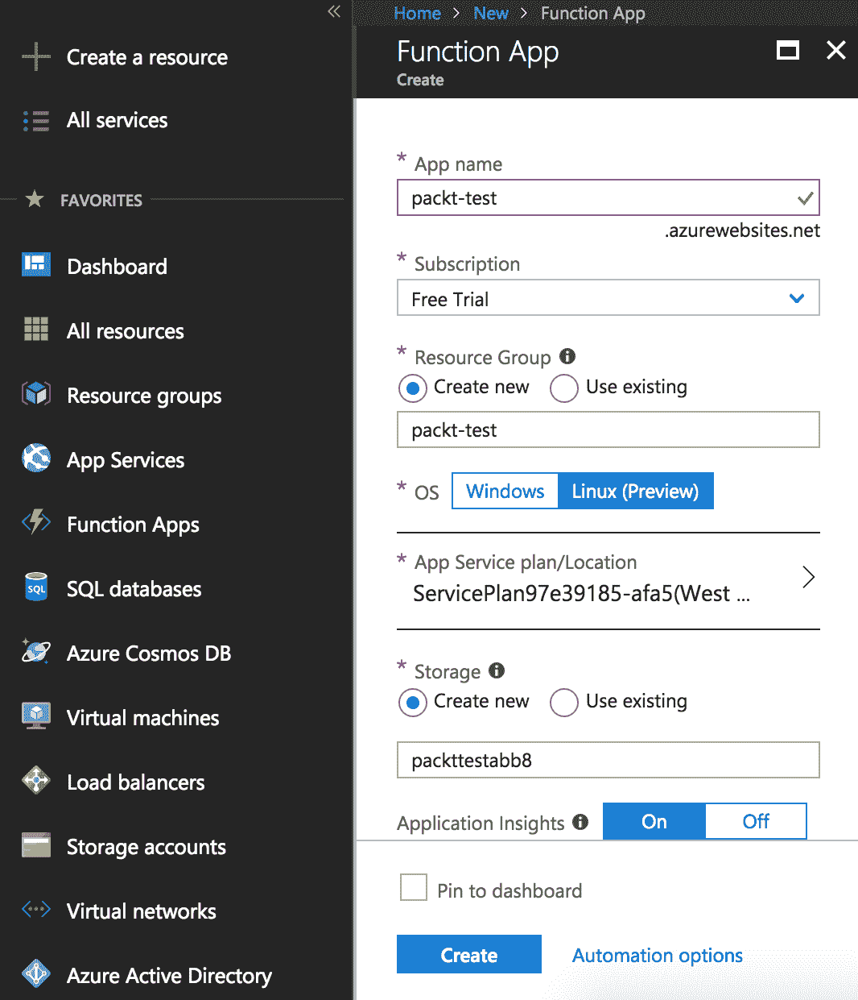

3.  单击底部的自动化选项将打开用于自动化功能部署的验证屏幕。本章不需要这样做。这将简单地验证您的 Azure 功能：

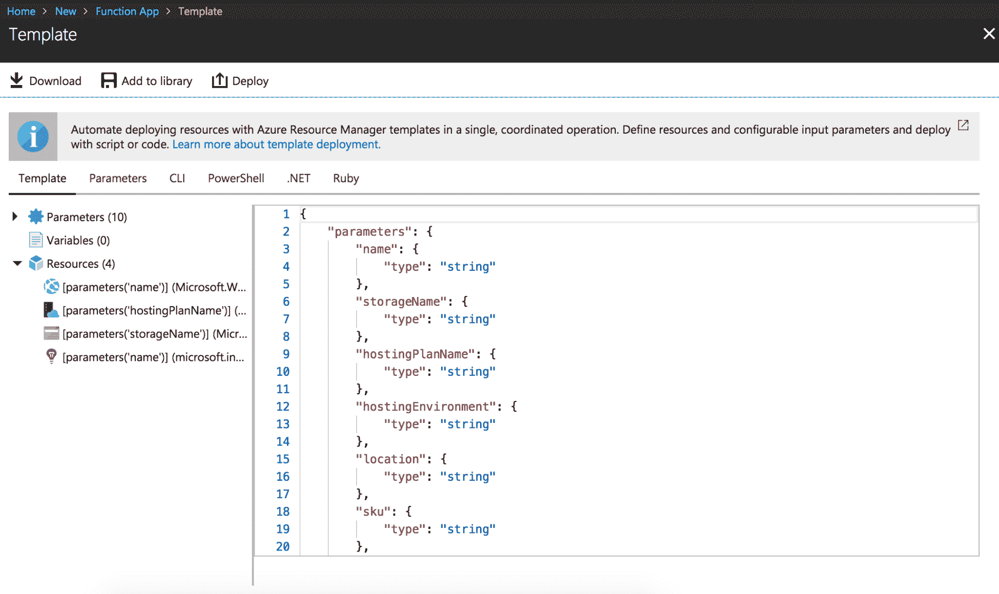

4.  单击“创建”后，您将在“通知”菜单下看到正在进行的部署：

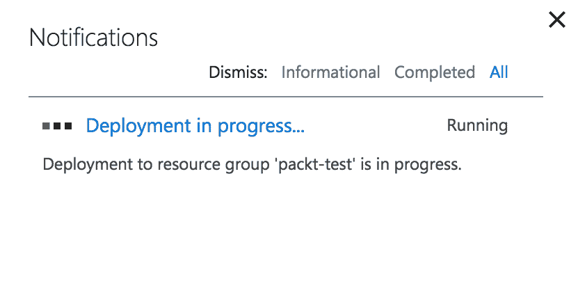

5.  成功创建后，它将以绿色通知反映在您的通知列表中：

6.  单击 Go to resource 将带您进入新创建的 Azure 函数。功能控制台如下所示：

我们已成功创建 Azure 函数。我们将在本章接下来的章节中更详细地介绍触发器、监视和安全性。

# 理解触发器

在本节中，我们将了解触发器如何在 Azures 函数应用中工作。我们还将了解不同类型的触发器及其用途。执行以下步骤：

1.  在左侧菜单中，单击用于添加、删除或编辑触发器的功能选项旁边的（+）符号：

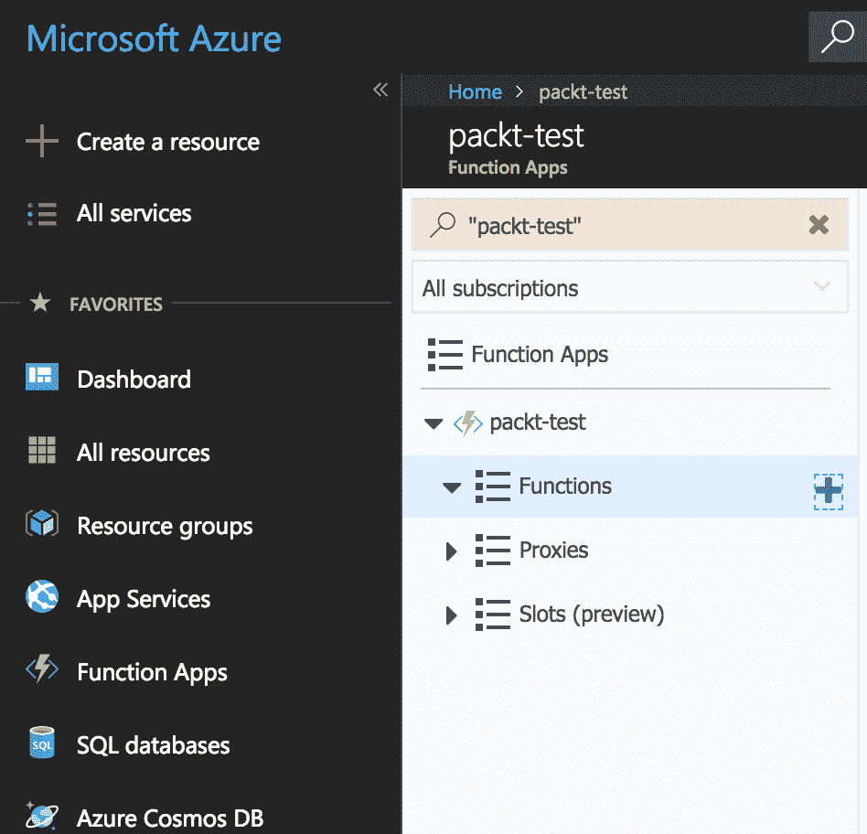

2.  您将进入函数创建控制台，如下所示：

3.  Azure 不太支持 Python。因此，在这个控制台中，让我们选择一个自定义函数。单击底部“自己动手”选项下的“自定义”功能：

4.  在函数创建向导中，启用右菜单中的实验语言选项。现在，您将能够在可用的语言中看到 Python 选项：

5.  Python 语言有两个可用的触发器。一个是 HTTP 触发器，另一个是队列触发器**，如下图所示：**

 **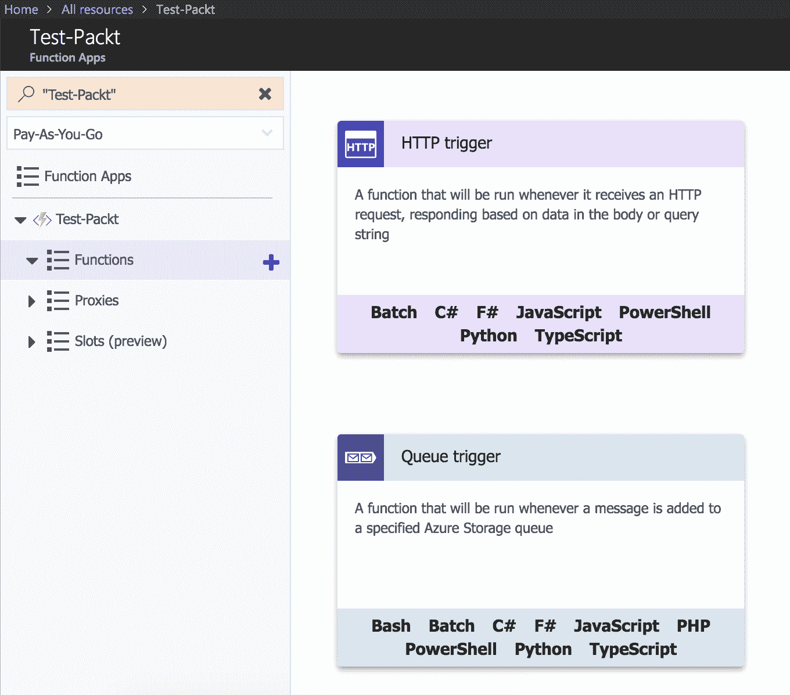

6.  HTTP 触发器将在收到 HTTP 请求时触发函数。单击它时，您会注意到用于添加不同 HTTP 相关设置的选项，例如授权和名称：

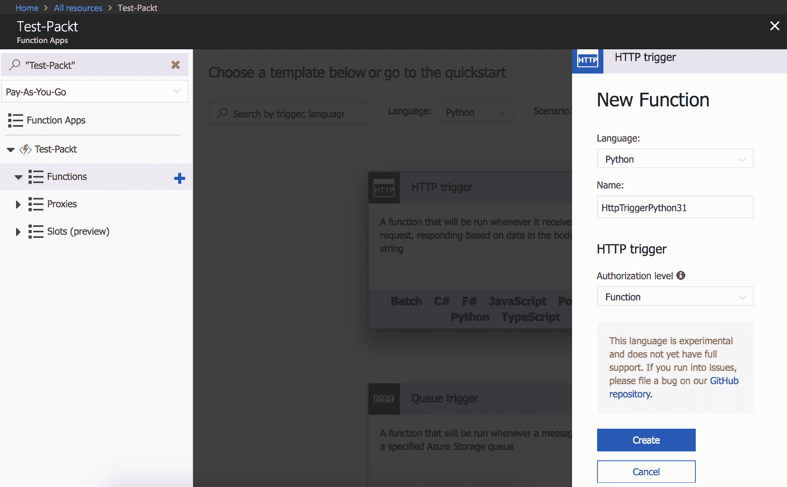

7.  下一个触发器是队列触发器。这将在消息添加到队列时触发该函数。我们在前面的一章中也对 AWS Lambda 进行了同样的操作：

# 了解 Azures 功能中的日志记录和监控

在本节中，我们将学习并理解 Microsoft Azure 功能中用户可用的监视和日志记录机制。执行以下步骤：

1.  通过单击函数下的 Monitor 选项，我们可以访问特定 Azure 函数的监视套件：

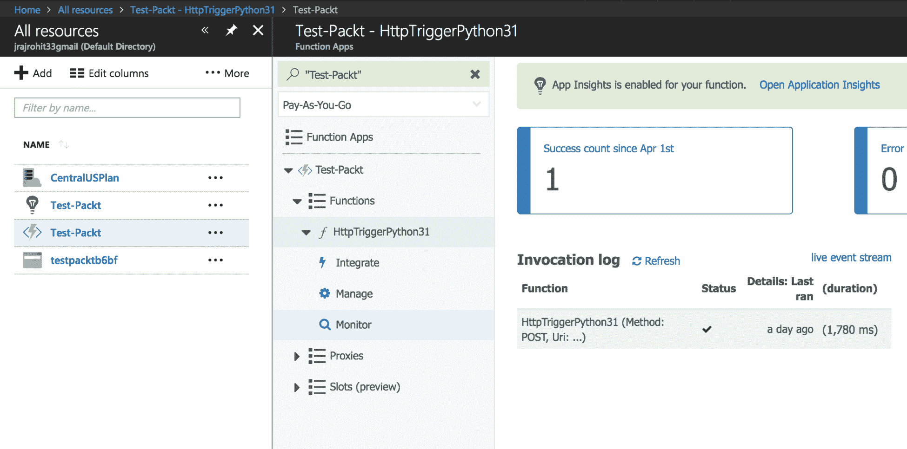

2.  我们创建的函数的监视套件如下所示：

3.  现在，单击菜单顶部的 Open Application Insights 选项。这将带您进入详细监控页面：

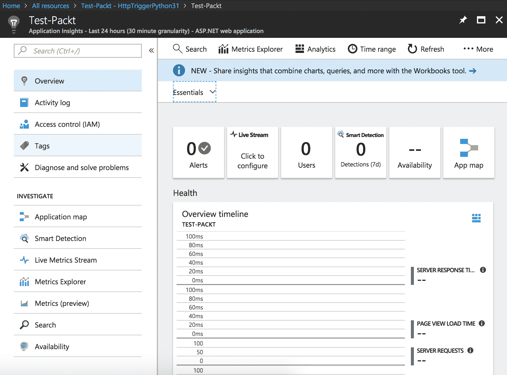

4.  如果向下滚动，您将看到特定于功能的指标，例如服务器响应时间和请求性能。这非常有用，因为这意味着我们不需要单独的仪表盘来监控所有这些统计数据：

现在，我们已经了解了 Microsoft Azure 的日志记录和监视功能，让我们来看看一些最佳实践。

# 编写 Azure 函数的最佳实践

我们已经学习了如何创建、配置和部署 Microsoft Azure 功能。现在，我们将了解使用它们的最佳实践：

*   Microsoft Azure 函数不支持像 AWS Lambda 这样的 Python。它们有一组非常有限的基于 Python 的触发器。因此，您需要为其中大多数编写自定义函数。在决定使用 Microsoft Azure 功能之前，开发人员需要记住这一点。Microsoft Azure 函数支持的语言有 C#、F#和 JavaScript：

*   Microsoft Azure 函数支持的实验性语言有 Bash、Batch、PHP、TypeScript、Python 和 PowerShell：

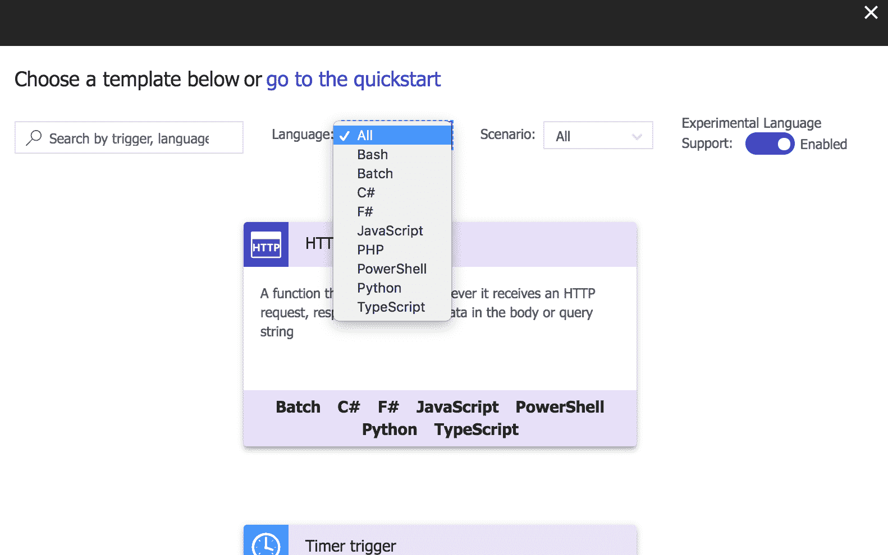

*   确保正确使用安全设置来保护您的功能。您可以在平台功能选项中找到所需的所有设置：

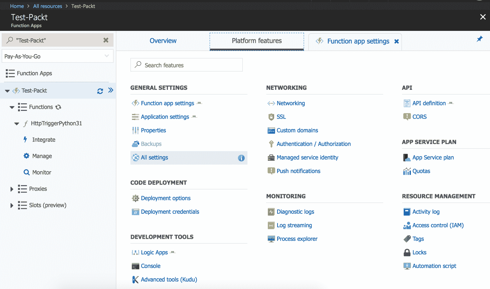

*   最后，尽可能多地使用监视，因为记录和监视无服务器功能至关重要。我们已经查看了监控细节和相应的设置

# 总结

在本章中，我们学习了 Microsoft Azure 函数以及如何构建它们。我们了解了各种可用的功能，以及 Python 运行时可用的触发器。我们还学习并试验了 Microsoft Azure 功能的日志记录和监视功能，以及了解并试验了 Azure 的实验性功能，例如除了它提供的现成标准语言集之外的额外运行时。**