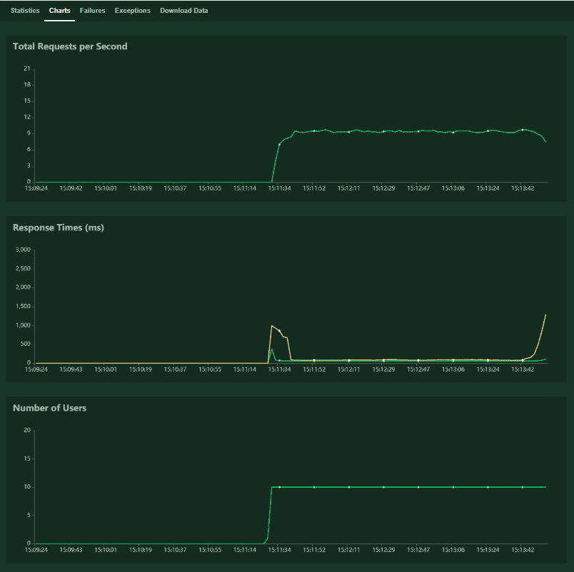
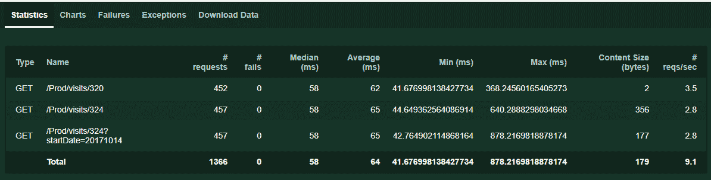
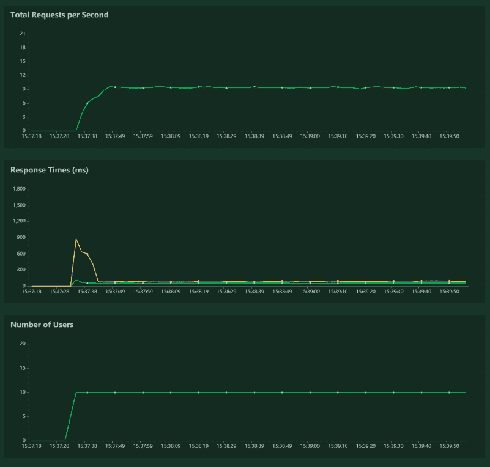

# 四、测试您的无服务器微服务

在上一章中，我们使用 API 网关、Lambda 和 DynamoDB 创建了一个功能齐全的无服务器数据 API，并将其部署到 AWS CLI。我们展示的测试是在 AWS 管理控制台和浏览器中执行的，这对于少量简单代码开发来说是很好的概念证明，但不建议用于开发或生产系统。

对于开发人员来说，首先在本地进行开发和测试要高效得多，而对于连续交付来说，自动化测试是必不可少的。这一章是关于测试的。

测试可以很容易地涵盖整本书，但我们将保持非常实用的内容，重点测试您的无服务器代码和我们在[第 3 章](3.html)、*部署您的无服务器栈*中部署的数据 API。这将包括单元测试、模拟、本地调试、集成测试、在 Docker 容器中本地使用 HTTP 服务器运行 Lambda 或无服务器 API，以及负载测试。

在本章中，我们将介绍以下主题：

*   单元测试 Python Lambda 代码
*   本地运行和调试 AWS Lambda 代码
*   使用真实测试数据的集成测试
*   AWS**无服务器应用模型**（**SAM**CLI
*   按比例加载和端到端测试
*   减少 API 延迟的策略
*   清理

# 单元测试 Python Lambda 代码

在本节中，我们将了解为什么测试很重要，以及我们可以用于测试、单元测试和模拟的示例数据。

# 为什么测试很重要？

想想在不同国家的大型分布式开发团队中发生的**协作和团队合作**，想象一下他们想要在同一个源代码存储库上协作，并在不同的时间检查代码更改。对于这些团队来说，理解代码并能够在本地对其进行测试是非常重要的，以了解它是如何工作的，他们的更改是否会影响现有服务，以及代码是否仍按预期工作。

测试对于确保我们在交付或用户体验中具有**质量**非常重要。通过进行大量测试，您可以尽早识别缺陷并修复它们。例如，如果检测到重大错误，您可以决定不发布最新更新，并在发布之前修复问题。

另一个要点是**可用性**。例如，您的客户机可能有性能或非功能需求。例如，想象一个电子商务网站，在那里你可以添加项目，并且需要等待整整一分钟才能将它们添加到购物篮中。在大多数情况下，这是不可接受的，用户将失去对平台的信任。理想情况下，您应该有一个测试过程，以确保延迟仍然很低，并且网站响应良好。其他需要测试的示例包括无法按预期工作的功能或阻止用户完成其想要完成的任务的用户界面缺陷。

缩短**释放周期**非常重要。使用自动化，您可以自动且一致地运行一千个测试，而无需人工手动测试站点的不同部分、手动测试 API 或在任何发布之前严格检查代码。在每个版本投入生产之前，您都要运行这一千个测试，这使您更加确信一切都按照预期工作，如果您发现了生产中遗漏了这一千个测试的问题，您可以修复它，并为该场景添加一个新的测试。

# 测试类型

测试可以手动完成，就像我们使用 AWS 管理控制台所做的那样，它容易出错并且不可扩展。通常，测试是使用测试套件进行自动化的，测试套件是预先编写的，对于持续集成和持续交付是必不可少的。

软件测试有很多定义和类型；可能需要一整本书才能涵盖所有这些。在这里，我们将重点讨论与无服务器栈相关的三个主要问题：

*   **单元测试：**单独对单个软件模块进行的底层测试，通常由开发人员完成，用于**测试驱动开发**（**TDD**）。这些类型的测试通常执行起来很快。
*   **集成测试**：验证集成后的所有组合服务是否正常工作。由于需要运行许多服务，因此运行这些服务的成本通常更高。
*   **负载测试**：这是一种非功能性测试，用于检查系统在重负载下的性能。有时也称为性能或压力测试，因为它有助于了解平台的可用性和可靠性。

# 单元测试 Lambda Python 代码

在 AWS 管理控制台中调试不容易；更具建设性的做法是在本地调试代码，然后将过程自动化。

从前面的章节中我们知道 Lambda 事件源是一个 API 网关`GET`请求。由于我们只查看数据的一个子集，因此也可以使用几行 Python 代码来模拟完整的 JSON 负载。

# 样本测试数据

这里，我们有一个测试用例，其中一个`setUp()`方法在测试套件开始时运行一次，另一个`tearDown()`方法在测试套件结束时运行。

以下是链接到`serverless-microservice-data-api/test/test_dynamo_get.py`顶部的测试设置和拆卸的内容子集：

```py
import unittest
import json

class TestIndexGetMethod(unittest.TestCase):
    def setUp(self):
        self.validJsonDataNoStartDate = json.loads('{"httpMethod": 
        "GET","path": "/path/to/resource/324","headers": ' \ 'null} ')
        self.validJsonDataStartDate = 
        json.loads('{"queryStringParameters": {"startDate":      
        "20171013"},' \ '"httpMethod": "GET","path": "/path/to/resource
        /324","headers": ' \ 'null} ')
        self.invalidJsonUserIdData =   
        json.loads('{"queryStringParameters": {"startDate": 
        "20171013"},' \ '"httpMethod": "GET","path": "/path/to/resource
        /324f","headers": ' \ 'null} ')
        self.invalidJsonData = "{ invalid JSON request!} "
    def tearDown(self):
        pass
```

我创建了四个不同的 JSON Python 字典：

*   `self.validJsonDataNoStartDate`：无`StartDate`过滤器的有效`GET`请求
*   `self.validJsonDataStartDate`：带`StartDate`过滤器的有效`GET`请求
*   `self.invalidJsonUserIdData`：不是数字的无效`UserId`
*   `self.invalidJsonData`：无法解析的 JSON 无效

# 单元测试

下面是单元测试，可以在 PoT T0 中发现：

```py
    def test_validparameters_parseparameters_pass(self):
        parameters = lambda_query_dynamo.HttpUtils.parse_parameters(
                     self.validJsonDataStartDate)
        assert parameters['parsedParams']['startDate'] == u'20171013'
        assert parameters['parsedParams']['resource_id'] == u'324'     

    def test_emptybody_parsebody_nonebody(self):
        body = lambda_query_dynamo.HttpUtils.parse_body(
               self.validJsonDataStartDate)         
        assert body['body'] is None

    def test_invalidjson_getrecord_notfound404(self):
        result = lambda_query_dynamo.Controller.get_dynamodb_records(
                 self.invalidJsonData)
        assert result['statusCode'] == '404'

    def test_invaliduserid_getrecord_invalididerror(self):            
        result = lambda_query_dynamo.Controller.get_dynamodb_records(
                 self.invalidJsonUserIdData)
        assert result['statusCode'] == '404'
        assert json.loads(result['body'])['message'] == 
             "resource_id not a number" 
```

我使用的前缀是`test`，因此 Python 测试套件可以自动将它们检测为单元测试，并且我对测试方法使用三重单元测试命名约定：方法名称、测试中的状态和预期行为。试验方法如下：

*   `test_validparameters_parseparameters_pass()`：检查参数解析是否正确。
*   `test_emptybody_parsebody_nonebody()`：我们在`GET`方法中没有使用主体，所以我们希望确保在没有提供主体的情况下仍然有效。
*   `test_invalidjson_getrecord_notfound404()`：检查 Lambda 将如何响应无效的 JSON 负载。
*   `test_invaliduserid_getrecord_invalididerror()`：检查 Lambda 对无效非数字`userId`的反应。

前面的语句不查询 DynamoDB 中的记录。如果我们想这样做，我们应该让 DynamoDB 运行，使用新的 DynamoDB 本地（[https://docs.aws.amazon.com/amazondynamodb/latest/developerguide/DynamoDBLocal.html](https://docs.aws.amazon.com/amazondynamodb/latest/developerguide/DynamoDBLocal.html) ），或者我们可以模拟 DynamoDB 调用，这是我们接下来要看的。

# 嘲笑

有一个名为 Moto（[的 Python AWS 模拟框架 http://docs.getmoto.org/en/latest/](http://docs.getmoto.org/en/latest/) ），但我更喜欢使用一个名为`mock`的通用版本，它在 Python 社区中得到了更广泛的支持，Python 标准库中包含了 Python 3.3 中的版本。

在`serverless-microservice-data-api/test/test_dynamo_get.py`底部可以找到以下模拟代码：

```py
from unittest import mock

     mock.patch.object(lambda_query_dynamo.DynamoRepository,
                      "query_by_partition_key",
                       return_value=['item'])
     def test_validid_checkstatus_status200(self, 
         mock_query_by_partition_key):
        result = lambda_query_dynamo.Controller.get_dynamodb_records(
                 self.validJsonDataNoStartDate)
        assert result['statusCode'] == '200'

    @mock.patch.object(lambda_query_dynamo.DynamoRepository,
                       "query_by_partition_key",
                        return_value=['item'])
     def test_validid_getrecord_validparamcall(self, 
         mock_query_by_partition_key):         
lambda_query_dynamo.Controller.get_dynamodb_records(
self.validJsonDataNoStartDate)         mock_query_by_partition_key.assert_called_with(
     partition_key='EventId',                                                                      
     partition_value=u'324')

    @mock.patch.object(lambda_query_dynamo.DynamoRepository,
                       "query_by_partition_and_sort_key",
                        return_value=['item'])
    def test_validid_getrecorddate_validparamcall(self, 
        mock_query_by_partition_and_sort_key):
           lambda_query_dynamo.Controller.get_dynamodb_records(
               self.validJsonDataStartDate)
          mock_query_by_partition_and_sort_key.assert_called_with(partition_key='   
    EventId',                                                                      
    partition_value=u'324',                                                                 
    sort_key='EventDay',                                                                 
    sort_value=20171013)
```

本规范的主要观察结果如下：

*   `@mock.patch.object()`是我们在`DynamoRepository()`类中模仿的`query_by_partition_key()`或`query_by_partition_and_sort_key()`方法的装饰器。
*   `test_validid_checkstatus_status200()`：我们模拟对`query_by_partition_key()`的调用。如果查询有效，我们将返回一个`'200'`状态码。

*   `test_validid_getrecords_validparamcall()`：我们模拟对`query_by_partition_key()`的调用，并检查是否使用正确的参数调用了该方法。注意，不需要检查较低级别的`boto3``self.db_table.query()`方法是否有效。
*   `test_validid_getrecordsdate_validparamcall()`：我们模拟对`query_by_partition_and_sort_key()`的调用，并检查是否使用正确的参数调用了该方法。

You are not here to test existing third-party libraries or Boto3, but your code and integration with them. Mocking allows you to replace parts of the code under test with mock objects and make an assertion about the method or attributes.

# 运行单元测试

现在我们已经有了所有的测试套件，而不是在 IDE 中运行它们，例如 PyCharm，您可以使用以下 bash 命令从根文件夹运行测试：

```py
$ python3 -m unittest discover test 
```

`unittest`自动检测所有测试文件必须是可从项目顶层目录导入的模块或包。在这里，我们只想从以`test_`前缀开头的测试文件夹中运行测试

我已经在`serverless-microservice-data-api/bash/apigateway-lambda-dynamodb/unit-test-lambda.sh`下创建了一个 shell 脚本：

```py
#!/bin/sh (cd ../..; python3 -m unittest discover test) 
```

# 代码覆盖率

我们不会深入讨论它，但代码覆盖率是软件工程中使用的另一个重要度量。代码覆盖率度量测试套件覆盖的代码程度。其主要思想是覆盖率越高，测试覆盖的代码就越多，因此创建未检测到的 bug 的可能性就越小，服务应该按照预期的方式运行。这些报告可以帮助开发人员提出额外的测试或场景，以提高覆盖率。

测试覆盖率相关的 Python 包包括`coverage`、`nose`和最近的`nose2`，它们可以提供覆盖率报告。例如，您可以运行以下操作，以获得带有`nose`或`nose2`的 Lambda 代码的测试覆盖率分析报告：

```py
$ nosetests test/test_dynamo_get.py --with-coverage --cover-package lambda_dynamo_read -v
$ nose2 --with-coverage 
```

当我们开始编写自己的测试时，我们可以选择使用一组额外的工具来完成。这类工具称为代码覆盖工具。Codecov 和工作服就是此类工具的例子。当我们想要分析通过 GitHub 等托管服务编写的代码时，这些工具非常有用，因为它们提供了是否测试代码行的完整分类。

# 本地运行和调试 AWS Lambda 代码

有时，您需要针对 AWS 中托管的远程 DynamoDB 的真实实例，使用本地 Lambda 模拟 API 网关负载。这允许您使用真实数据调试和构建单元测试。此外，我们还将了解如何在以后的集成测试中使用这些工具。

# 将数据批量加载到 DynamoDB 中

我们将首先讨论如何将数据从名为`sample_data/dynamodb-sample-data.txt`的**逗号分隔值**（**CSV**文件）批量加载到 DynamoDB 中。这是一个效率更高的过程，而不是为每个项插入单独的语句，因为数据文件与 Python 代码是解耦的：

```py
EventId,EventDay,EventCount
324,20171010,2
324,20171012,10
324,20171013,10
324,20171014,6
324,20171016,6
324,20171017,2
300,20171011,1
300,20171013,3
300,20171014,30 
```

添加另一个名为`update_dynamo_event_counter()`的方法，该方法使用`DynamoRepository`类更新 DynamoDB 记录。

以下是`serverless-microservice-data-api/aws_dynamo/dynamo_insert_items_from_file.py`Python 脚本的内容：

```py
from boto3 import resource

class DynamoRepository:
    def __init__(self, target_dynamo_table, region='eu-west-1'):
        self.dynamodb = resource(service_name='dynamodb', region_name=region)
        self.target_dynamo_table = target_dynamo_table
        self.table = self.dynamodb.Table(self.target_dynamo_table)     

    def update_dynamo_event_counter(self, event_name, 
        event_datetime, event_count=1):
        response = self.table.update_item(
            Key={
                'EventId': str(event_name),
                'EventDay': int(event_datetime)
            },
            ExpressionAttributeValues={":eventCount": 
                int(event_count)},
            UpdateExpression="ADD EventCount :eventCount")
        return response 
```

在这里，我们有一个`DynamoRepository`类来实例化`__init__()`中与 DynamoDB 的连接，还有一个`update_dynamo_event_counter()`方法来更新 DynamoDB 记录（如果存在），或者如果不使用传入的参数，则添加一个新记录。这是在一个原子动作中完成的。

下面是`serverless-microservice-data-api/aws_dynamo/dynamo_insert_items_from_file.py`Python 脚本的后半部分：

```py
 import csv
table_name = 'user-visits-sam'
input_data_path = '../sample_data/dynamodb-sample-data.txt'
dynamo_repo = DynamoRepository(table_name)
with open(input_data_path, 'r') as sample_file:
    csv_reader = csv.DictReader(sample_file)
    for row in csv_reader:
        response = dynamo_repo.update_dynamo_event_counter(row['EventId'],                                                            row['EventDay'],                                                            row['EventCount'])
        print(response) 
```

此 Python 代码打开 CSV，提取标题行，并在将其写入名为`user-visits-sam`的 DynamoDB 表时解析每一行。

现在我们已经将一些数据行加载到 DynamoDB 表中，我们将通过调试本地 Lambda 函数来查询该表。

# 在本地运行 Lambda

下面是一个完整的示例 API 网关请求`serverless-microservice-data-api/sample_data/request-api-gateway-valid-date.json`，代理 Lambda 函数将作为事件接收该请求。这些可以通过打印真实的 API 网关 JSON 事件生成，Lambda 将其作为事件源获取到 CloudWatch 日志中：

```py
{
  "body": "{\"test\":\"body\"}",
  "resource": "/{proxy+}",
  "requestContext": {
    "resourceId": "123456",
    "apiId": "1234567890",
    "resourcePath": "/{proxy+}",
    "httpMethod": "GET",
    "requestId": "c6af9ac6-7b61-11e6-9a41-93e8deadbeef",
    "accountId": "123456789012",
    "identity": {
      "apiKey": null,
      "userArn": null,
      "cognitoAuthenticationType": null,
      "caller": null,
      "userAgent": "Custom User Agent String",
      "user": null,
      "cognitoIdentityPoolId": null,
      "cognitoIdentityId": null,
      "cognitoAuthenticationProvider": null,
      "sourceIp": "127.0.0.1",
      "accountId": null
    },
    "stage": "prod"
  },
  "queryStringParameters": {
    "foo": "bar"
  },
  "headers": {
    "Via": "1.1 08f323deadbeefa7af34d5feb414ce27.cloudfront.net 
            (CloudFront)",
    "Accept-Language": "en-US,en;q=0.8",
    "CloudFront-Is-Desktop-Viewer": "true",
    "CloudFront-Is-SmartTV-Viewer": "false",
    "CloudFront-Is-Mobile-Viewer": "false", 
    "X-Forwarded-For": "127.0.0.1, 127.0.0.2",
    "CloudFront-Viewer-Country": "US",
    "Accept": "text/html,application/xhtml+xml,application/xml;
               q=0.9,image/webp,*/*;q=0.8",
    "Upgrade-Insecure-Requests": "1",
    "X-Forwarded-Port": "443",
    "Host": "1234567890.execute-api.us-east-1.amazonaws.com",
    "X-Forwarded-Proto": "https",
    "X-Amz-Cf-Id": "cDehVQoZnx43VYQb9j2-nvCh-
                    9z396Uhbp027Y2JvkCPNLmGJHqlaA==",
    "CloudFront-Is-Tablet-Viewer": "false",
    "Cache-Control": "max-age=0",
    "User-Agent": "Custom User Agent String",     
    "CloudFront-Forwarded-Proto": "https",
    "Accept-Encoding": "gzip, deflate, sdch"
  },
  "pathParameters":{
    "proxy": "path/to/resource"
  },
  "httpMethod": "GET",
  "stageVariables": {
    "baz": "qux"
  },
  "path": "/path/to/resource/324"
} 
```

您可以通过 JSON`Dict`事件调用 Lambda 函数，直接调试 Lambda 函数，而不是依赖另一个第三方框架进行本地调试（如 SAM CLI）。这意味着您不需要任何额外的库来运行，它是本机 Python。

`serverless-microservice-data-api/test/run_local_api_gateway_lambda_dynamo.py`的内容是使用 AWS 中的 DynamoDB 等服务在本地调试 Lambda 函数的示例：

```py
import json

from lambda_dynamo_read import lambda_return_dynamo_records as lambda_query_dynamo

with open('../sample_data/request-api-gateway-valid-date.json', 'r') as sample_file:
     event = json.loads(sample_file.read())
print("lambda_query_dynamo\nUsing data: %s" % event)
print(sample_file.name.split('/')[-1]) response = lambda_query_dynamo.lambda_handler(event, None)
print('Response: %s\n' % json.dumps(response)) 
```

我们打开示例`GET`文件，将 JSON 解析为`Dict`，然后将其作为参数传递给`lambda_query_dynamo.lambda_handler()`。由于我们没有模拟 DynamoDB，它将查询在`table_name = 'user-visits-sam'`Lambda 函数中指定的表。然后，它将捕获输出响应，如下所示：

```py
Response: {"statusCode": "200", "body": "[{\"EventCount\": 3, \"EventDay\": 20171001, \"EventId\": \"324\"}, {\"EventCount\": 5, \"EventDay\": 20171002, \"EventId\": \"324\"}, {\"EventCount\": 4, \"EventDay\": 20171010, \"EventId\": \"324\"}, {\"EventCount\": 20, \"EventDay\": 20171012, \"EventId\": \"324\"}, {\"EventCount\": 10, \"EventDay\": 20171013, \"EventId\": \"324\"}, {\"EventCount\": 6, \"EventDay\": 20171014, \"EventId\": \"324\"}, {\"EventCount\": 6, \"EventDay\": 20171016, \"EventId\": \"324\"}, {\"EventCount\": 2, \"EventDay\": 20171017, \"EventId\": \"324\"}]", "headers": {"Content-Type": "application/json", "Access-Control-Allow-Origin": "*"}} 
```

正文与我们在[第 3 章](3.html)*部署无服务器栈*的浏览器中看到的相同。因此，您可以直接使用真实数据调试不同的集成场景，并在使用真实数据逐步完成 Lambda 代码时构建更完整的测试套件。

# 使用真实测试数据的集成测试

现在我们了解了真实的测试数据，我们将看看如何测试已部署的 Lambda 函数。首先，您需要安装和设置 AWS CLI 并配置 AWS 凭据，如[第 1 章](1.html)、*无服务器微服务架构和模式*末尾所示：

```py
$ sudo pip3 sudo install awscli 
$ aws configure 
```

我们将重新部署我们在[第 3 章](3.html)中部署的无服务器微服务栈，*部署您的无服务器栈*，以便测试它。使用以下命令：

```py
$ cd ./serverless-microservice-data-api/bash/apigateway-lambda-dynamodb
$ ./build-package-deploy-lambda-dynamo-data-api.sh
```

如果有任何更改，这将按照代码重新生成 Lambda ZIP 包。然后它将打包并部署代码和 SAM 配置。最后，它将创建 API 网关、Lambda 函数和 DynamoDB 表。

对于测试，我们将使用 AWS CLI，它可以调用所有 AWS 托管服务。这里我们对`<code>lambda</code>`（[感兴趣 https://docs.aws.amazon.com/cli/latest/reference/lambda/index.html](https://docs.aws.amazon.com/cli/latest/reference/lambda/index.html) 和`<code>apigateway</code>`（[https://docs.aws.amazon.com/cli/latest/reference/apigateway/index.html](https://docs.aws.amazon.com/cli/latest/reference/apigateway/index.html) 服务。

# 测试 Lambda 是否已正确部署

要测试已部署的 Lambda，可以运行以下命令：

```py
$ aws lambda invoke --invocation-type Event \
 --function-name lambda-dynamo-data-api-sam  --region eu-west-1 \
 --payload file://../../sample_data/request-api-gateway-get-valid.json \ outputfile.tmp 
```

为了实现自动化，我们可以将以下代码放入 shell 脚本中，`serverless-microservice-data-api/bash/apigateway-lambda-dynamodb/invoke-lambda.sh`：

```py
#!/bin/sh
. ./common-variables.sh
rm outputfile.tmp
status_code=$(aws lambda invoke --invocation-type RequestResponse \
    --function-name ${template}-sam --region ${region} \
    --payload file://../../sample_data/request-api-gateway-get-valid.json \
    outputfile.tmp --profile ${profile})
echo "$status_code"
if echo "$status_code" | grep -q "200";
then
    cat outputfile.tmp
    if grep -q error outputfile.tmp;
    then
        echo "\nerror in response"
        exit 1
    else
        echo "\npass"
        exit 0
    fi
else
    echo "\nerror status not 200"
    exit 1
fi 
```

我们调用 Lambda，但也使用`grep`命令检查`outputfile.tmp`文件中给出的响应。如果检测到错误，我们返回退出代码`1`，否则返回`0`。当涉及其他工具或 CI/CD 步骤时，这允许您链接逻辑。

# 测试 API 网关是否已正确部署

我们还希望能够测试无服务器微服务 API 在部署后是否正常工作。我混合使用 Python 和 bash 来简化它。

首先使用名为`serverless-microservice-data-api/bash/apigateway-lambda-dynamodb/get_apigateway_endpoint.py`的 Python 脚本查询 AWS API Gateway 以获取完整端点，如果成功，则返回代码`0`：

```py
import argparse
import logging

import boto3
logging.getLogger('botocore').setLevel(logging.CRITICAL)

logger = logging.getLogger(__name__)
logging.basicConfig(format='%(asctime)s %(levelname)s %(name)-15s: %(lineno)d %(message)s',
                    level=logging.INFO) logger.setLevel(logging.INFO) 

def get_apigateway_names(endpoint_name):
    client = boto3.client(service_name='apigateway', 
                          region_name='eu-west-1')
    apis = client.get_rest_apis()
    for api in apis['items']:
        if api['name'] == endpoint_name:
            api_id = api['id']
            region = 'eu-west-1'
            stage = 'Prod'
            resource = 'visits/324'
            #return F"https://{api_id}.execute-api.
             {region}.amazonaws.com/{stage}/{resource}"
            return "https://%s.execute-api.%s.amazonaws.com/%s/%s" 
                % (api_id, region, stage, resource)
    return None

def main():
    endpoint_name = "lambda-dynamo-xray"

    parser = argparse.ArgumentParser()
    parser.add_argument("-e", "--endpointname", type=str, 
        required=False, help="Path to the endpoint_name")
    args = parser.parse_args()

    if (args.endpointname is not None): endpoint_name = 
        args.endpointname

    apigateway_endpoint = get_apigateway_names(endpoint_name)
    if apigateway_endpoint is not None:
        print(apigateway_endpoint)
        return 0
    else:
        return 1

if __name__ == '__main__':
    main()
```

然后我们使用一个 shell 脚本来调用 Python 脚本。Python 脚本返回 API 端点，该端点与示例`GET`请求一起在 curl 中使用。然后，我们查看是否获得有效的状态代码。

以下是`serverless-microservice-data-api/bash/apigateway-lambda-dynamodb/curl-api-gateway.sh`的完整脚本：

```py
. ./common-variables.sh
endpoint="$(python get_apigateway_endpoint.py -e ${template})"
echo ${endpoint}
status_code=$(curl -i -H \"Accept: application/json\" -H \"Content-Type: application/json\" -X GET ${endpoint})
echo "$status_code"
if echo "$status_code" | grep -q "HTTP/1.1 200 OK";
then
    echo "pass"
    exit 0
else
    exit 1
fi 
```

以这种方式设置这些脚本可以让我们轻松地自动化这些集成测试。

**作为服务的功能**（**FaaS**）仍然是一个相对较新的领域。关于应该使用的集成测试的类型，仍然有很多讨论。一种观点是，我们应该在不同的 AWS 帐户中进行全套测试，特别是那些将写入或更新数据存储的帐户，例如`POST`或`PUT`请求。

如果你想这样做，我已经包括了`--profile`和`aws_account_id`。此外，使用 API 网关，您可以使用 HTTP 端点周围已经存在的各种测试套件，但是测试其他 AWS 服务与 Lambda 的集成，例如在 S3 中创建的触发 Lambda 的对象，需要更多的工作和思考。在我看来，无服务器集成测试还不够成熟，但我已经展示了如何通过使用 AWS CLI 直接调用 Lambda 函数和使用 JSON 事件源有效负载调用 Lambda 或使用`curl`命令直接调用 API 网关端点来实现这些测试。

接下来，我们将了解 SAM CLI 如何也可用于本地测试。

# AWS 无服务器应用程序模型 CLI

在本节中，我们将通过完整的工作示例介绍 SAM Local 的不同功能。对于本地测试，您可以像我所展示的那样使用 Python 和 bash，也可以使用 SAM CLI（[https://github.com/awslabs/aws-sam-cli](https://github.com/awslabs/aws-sam-cli) ），在撰写本文时仍处于测试阶段。使用 Docker，基于开源`docker-lambda`（[https://github.com/lambci/docker-lambda](https://github.com/lambci/docker-lambda) Docker 图片。如果您使用的是 Windows 10 Home，我建议您升级到 Pro 或 Enterprise，因为 Docker 很难在 Home 版本上工作。还需要注意一些硬件需求，例如虚拟化。我们需要执行以下步骤：

1.  安装 AWS CLI（[https://docs.aws.amazon.com/cli/latest/userguide/installing.html](https://docs.aws.amazon.com/cli/latest/userguide/installing.html) ）。
2.  安装 Docker CE（[https://docs.docker.com/install/](https://docs.docker.com/install/) ）。
3.  安装 AWS SAM CLI（[https://docs.aws.amazon.com/serverless-application-model/latest/developerguide/serverless-sam-cli-install.html](https://docs.aws.amazon.com/serverless-application-model/latest/developerguide/serverless-sam-cli-install.html) ）。
4.  对于 Linux，您可以运行以下操作：

```py
$sudo pip install --user aws-sam-cli 
```

5.  对于 Windows，可以使用 MSI 安装 AWS SAM CLI。

6.  创建一个新的 SAM Python 3.6 项目，`sam-app`和`docker pull`图像（这应该会自动发生，但我需要做`pull`才能让它工作）：

```py
$ sam init --runtime python3.6
$ docker pull lambci/lambda-base:build
$ docker pull lambci/lambda:python3.6 
```

7.  调用以下函数：

```py
$ cd sam-app
$ sam local invoke "HelloWorldFunction" -e event.json --region eu-west-1 
```

您将获得以下信息：

```py
Duration: 8 ms Billed Duration: 100 ms Memory Size: 128 MB Max Memory Used: 19 MB
{"statusCode": 200, "body": "{\"message\": \"hello world\"}"} 
```

这可用于添加自动测试。

8.  启动本地 Lambda 端点：

```py
$ sam local start-lambda --region eu-west-1
# in new shell window
$ aws lambda invoke --function-name "HelloWorldFunction" \
 --endpoint-url "http://127.0.0.1:3001" --no-verify-ssl out.txt 
```

这将启动一个 Docker 容器，该容器在本地使用 HTTP 服务器模拟 AWS Lambda，您可以使用 HTTP 服务器从 AWS CLI 或 Boto3 自动测试 Lambda 函数。

9.  启动 API 并使用以下方法进行测试：

```py
$ sam local start-api --region eu-west-1
# in new shell window
$ curl -i -H \"Accept: application/json\" -H \"Content-Type: application/json\" -X GET http://127.0.0.1:3000/hello 
```

这将在本地启动一个带有 HTTP 服务器的 Docker 容器，您可以使用该容器自动测试可与`curl`、Postman 或 web 浏览器一起使用的 API。

10.  生成示例事件的一种方法是从 Lambda 打印出事件，然后从 CloudWatch 日志复制它（我的首选）。另一种方法是使用`sam local`，它可以生成一些示例事件。例如，可以运行以下操作：

```py
$ sam local generate-event apigateway aws-proxy 
```

就个人而言，我没有广泛使用 SAM CLI，因为它非常新，需要安装 Docker，并且仍处于测试阶段。但它看起来确实很有希望，而且作为测试无服务器栈的另一个工具，它可以在 Docker 容器中模拟一个 Lambda 来公开一个端点，这是非常有用的，我希望将来会添加更多的功能。

也许不太有用，它还将一些现有命令的无服务器包和部署命令包装为 CloudFormation 命令的别名。我认为这样做是为了把它们都放在一个地方。

11.  下面是 SAM CLI`package`和`deploy`命令的示例：

```py
$ sam package \
 --template-file $template.yaml \
 --output-template-file ../../package/$template-output.yaml \
 --s3-bucket
$bucket $ sam deploy \
 --template-file ../../package/$template-output.yaml \
 --stack-name $template \
 --capabilities CAPABILITY_IAM
```

使用 SAM to`package`和`deploy`命令的云形成：

```py
$ aws cloudformation package \
 --template-file $template.yaml \
 --output-template-file ../../package/$template-output.yaml \
 --s3-bucket $bucket \
 --s3-prefix $prefix
$ aws cloudformation deploy \
 --template-file ../../package/$template-output.yaml \
 --stack-name $template \
 --capabilities CAPABILITY_IAM
```

# 按比例加载和端到端测试

接下来，我们将看一看蝗虫，它是一个用于性能和负载测试的 Python 工具。然后我们将讨论减少 API 延迟和提高 API 响应时间的策略，使用 Occast 将向我们展示性能改进。

# 负载测试您的无服务器微服务

首先，您需要有一个无服务器的微服务栈与`./build-package-deploy-lambda-dynamo-data-api.sh`一起运行，并使用`python3 dynamo_insert_items_from_file.py`Python 脚本将数据加载到 DynamoDB 表中。

然后安装蝗虫，如果它尚未与`requirements.txt`中的其他软件包一起安装：

```py
$ sudo pip3 install locustio 
```

蝗虫（[https://docs.locust.io](https://docs.locust.io) 是一个易于使用的负载测试工具，具有 web 度量和监控界面。它允许您使用 Python 代码定义用户行为，并可用于在多台机器上模拟数百万用户。

要使用蝗虫，首先需要创建一个蝗虫 Python 文件，在其中定义蝗虫任务。`HttpLocust`类添加了一个用于发出 HTTP 请求的客户机属性。`TaskSet`类定义了蝗虫用户将执行的一组任务。`@task`装饰者为`TaskSet`声明任务：

```py
import random
from locust import HttpLocust, TaskSet, task

paths = ["/Prod/visits/324?startDate=20171014",
         "/Prod/visits/324",
         "/Prod/visits/320"]

class SimpleLocustTest(TaskSet):

    @task
    def get_something(self):
        index = random.randint(0, len(paths) - 1)
        self.client.get(paths[index])

class LocustTests(HttpLocust):
    task_set = SimpleLocustTest
```

为了用不同的资源和参数测试`GET`方法，我们从路径列表中随机选择三条不同的路径，其中一个 ID 在 DynamoDB 中不存在。其主要思想是，如果我们将它们相应的行从文件加载到 DynamoDB 中，我们可以轻松地扩展它来模拟数百万个不同的查询。Hocust 支持更复杂的行为，包括处理响应、模拟用户登录、排序和事件挂钩，但这个脚本是一个良好的开端。

要运行蝗虫，我们需要获取 API 网关 ID，它看起来像`abcdefgh12`，以创建用于负载测试的完整主机名。在这里，我编写了一个名为`serverless-microservice-data-api/bash/apigateway-lambda-dynamodbget_apigateway_id.py`的 Python 脚本，它可以基于 API 名称执行此操作：

```py
import argparse
import logging

import boto3
logging.getLogger('botocore').setLevel(logging.CRITICAL)

logger = logging.getLogger(__name__)
logging.basicConfig(format='%(asctime)s %(levelname)s %(name)-15s: %(lineno)d %(message)s',
                    level=logging.INFO)
logger.setLevel(logging.INFO)

def get_apigateway_id(endpoint_name):
    client = boto3.client(service_name='apigateway', 
             region_name='eu-west-1')
    apis = client.get_rest_apis()
    for api in apis['items']:
        if api['name'] == endpoint_name:
            return api['id']
    return None

def main():
    endpoint_name = "lambda-dynamo-xray"

    parser = argparse.ArgumentParser()
    parser.add_argument("-e", "--endpointname", type=str, 
                        required=False, help="Path to the endpoint_id")
    args = parser.parse_args()

    if (args.endpointname is not None): endpoint_name = args.endpointname

    apigateway_id = get_apigateway_id(endpoint_name)
    if apigateway_id is not None:
        print(apigateway_id)
        return 0
    else:
        return 1

if __name__ == '__main__':
    main() 
```

运行以下命令以启动蝗虫：

```py
$ . ./common-variables.sh
$ apiid="$(python3 get_apigateway_id.py -e ${template})"
$ locust -f ../../test/locust_test_api.py --host=https://${apiid}.execute-api.${region}.amazonaws.com 
```

或者，我还将此`locust`运行命令作为 shell 脚本，您可以在`test`文件夹`serverless-microservice-data-api/bash/apigateway-lambda-dynamodb/run_locus.sh`下运行：

```py
#!/bin/sh
. ./common-variables.sh
apiid="$(python3 get_apigateway_id.py -e ${template})"
locust -f ../../test/locust_test_api.py --host=https://${apiid}.execute-api.${region}.amazonaws.com 
```

现在，您应该在终端中看到蝗虫开始并执行以下步骤：

1.  在 web 浏览器中导航至`http://localhost:8089/`以访问蝗虫 web 监控和测试界面。
2.  在“启动新蝗虫群”中，输入以下内容：
    *   `10`用于**用户数**模拟
    *   `5`孵化率（用户产卵/秒）
3.  让工具在统计选项卡上运行几分钟。

在“统计信息”选项卡中，您将看到如下内容：


在“图表”选项卡上，您应该可以看到类似以下内容：



在响应时间（ms）图表中，橙色线表示第 95<sup>个</sup>百分位，绿色表示响应时间中值。

以下是对上述图表的一些观察：

*   最大请求时间为 2172 毫秒或约 2.1 秒，非常慢。这与冷启动有关，冷启动是第一次启动 Lambda 的较慢方式。
*   大约一分钟后失败的次数也会增加，这是因为 DynamoDB 在开始限制读取请求之前允许一些突发读取。如果您登录到 AWS 管理控制台并查看 DynamoDB 表度量，您将看到以下情况：


# 减少 API 延迟的策略

有许多减少延迟的策略。我们将看两个，它们都在 SAM 模板中设置：

*   **增加 Lambda RAM 大小**：目前设置为最小 128MB
*   **增加 DynamoDB 读取容量**：目前设置为 1 个单元的最小值

What I really like about DynamoDB is that you can change the capacity per table, and change the write capacity independently of the read capacity. This is very interesting and cost-effective for me in read-heavy use cases, where I can set the read capacity higher than the write capacity. There are even options to have the table autoscale based on the read/write utilization, or have the capacity purely based **on demand**, where you pay per read/write request.

我们首先将表的 DynamoDB 读取容量从 1 个读取单元增加到 500 个读取单元（将写入容量保持在 1 个单元）。成本为每月 0.66 美元，但现在将增加到每月 55.24 美元。

编辑`lambda-dynamo-data-api.yaml`SAM YAML 模板文件，将`ReadCapacityUnits`从`1`增加到`500`：

```py
AWSTemplateFormatVersion: '2010-09-09'
Transform: 'AWS::Serverless-2016-10-31'
Description: >-
  This Lambda is invoked by API Gateway and queries DynamoDB.
Parameters:
    AccountId:
        Type: String

Resources:
  lambdadynamodataapi:
    Type: AWS::Serverless::Function
    Properties:
      Handler: lambda_return_dynamo_records.lambda_handler
      Runtime: python3.6
      CodeUri: ../../package/lambda-dynamo-data-api.zip
      FunctionName: lambda-dynamo-data-api-sam
      Description: >-
        This Lambda is invoked by API Gateway and queries DynamoDB.
      MemorySize: 128
      Timeout: 3
      Role: !Sub 'arn:aws:iam::${AccountId}:role/
                  lambda-dynamo-data-api'
      Environment:
        Variables:
          environment: dev
      Events:
        CatchAll:
          Type: Api
          Properties:
            Path: /visits/{resourceId}
           Method: GET
  DynamoDBTable:
    Type: AWS::DynamoDB::Table 
    Properties:
      TableName: user-visits-sam
      SSESpecification:
        SSEEnabled: True
      AttributeDefinitions:
        - AttributeName: EventId
          AttributeType: S
        - AttributeName: EventDay
          AttributeType: N
      KeySchema:
        - AttributeName: EventId
          KeyType: HASH
        - AttributeName: EventDay
          KeyType: RANGE
      ProvisionedThroughput:
        ReadCapacityUnits: 500
        WriteCapacityUnits: 1
```

运行`./build-package-deploy-lambda-dynamo-data-api.sh`在 DynamoDB 表更改的情况下部署无服务器栈。

现在再次运行 10 个用户的蝗虫，孵化率为 5:



在“图表”选项卡上，您应该可以看到类似以下内容：



以下是对上述图表的一些观察：

*   没有故障
*   平均响应时间为 64 毫秒，这非常好

我们得到这些结果是因为 DynamoDB 表的读取容量增加了，也就是说，请求不再受到限制。

现在增加 Lambda 函数中可用的 RAM：

1.  通过将 MemorySize:128 更改为 MemorySize:1536 来修改`lambda-dynamo-data-api.yaml`SAM YAML 文件。
2.  运行`./build-package-deploy-lambda-dynamo-data-api.sh`部署 Lambda RAM 更改的无服务器栈。

以下是我们进行了上述更改的一些观察结果：

*   没有故障
*   平均响应时间为 60 毫秒，这稍微好一点，特别是考虑到这是 API 网关到 Lambda 到 DynamoDB 的往返

对于 100 个用户，填充率为 10，我们得到以下结果：

*   没有故障
*   平均响应时间为 66 毫秒，负载测试开始时的最大响应时间为 1057 毫秒

对于 250 个用户，填充率为 50，我们得到以下结果：

*   没有故障
*   平均响应时间为 81 毫秒，负载测试开始时的最大响应时间为 1153 毫秒

您还可以使用更多的并发用户（例如 1000 个）进行测试，即使由于其他瓶颈，响应时间会高得多，它仍然可以正常工作。如果你想进一步扩展，我建议你考虑一个不同的架构。在配置文件中只需更改几个参数，就可以轻松地扩展无服务器微服务，这仍然令人印象深刻！

这让您非常清楚如何减少 API 的延迟。

# 清理

使用`./delete-stack.sh`运行以下 shell 脚本以删除无服务器栈：

```py
#!/usr/bin/env bash
. ./common-variables.sh
aws cloudformation delete-stack --stack-name $template --region $region --profile $profile 
```

# 总结

在本章中，我们探讨了许多类型的测试，包括使用 mock 的单元测试、使用 Lambda 和 API 网关的集成测试、在本地调试 Lambda、使本地端点可用以及负载测试。这是我们将在本书其余部分建立的基础。

在下一章中，我们将介绍您可以在组织中应用的无服务器、分布式数据管理模式和架构。