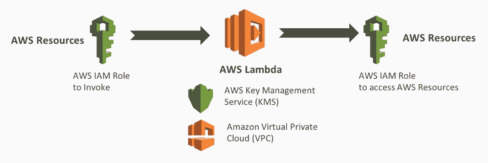
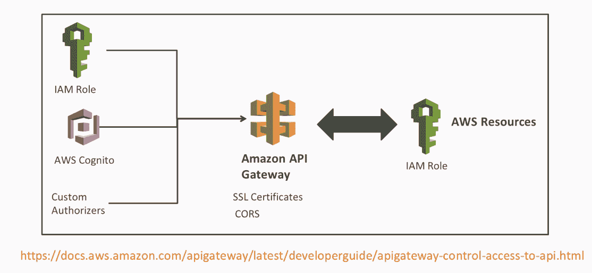

# 五、保护您的微服务

在本章中，我们将简要概述 AWS 中的安全性，以确保您的无服务器微服务是安全的。在创建第一个微服务之前，我们首先需要了解 AWS 安全模型。我们将讨论重要的不同术语以及整个 AWS 安全模型。然后我们将讨论 IAM，它用于访问任何 AWS 资源。最后，我们将研究如何保护您的无服务器微服务。

本章将介绍以下主题：

*   AWS 中的安全性概述
*   AWS 身份和访问管理（IAM）概述
*   保护您的无服务器微服务

# AWS 中的安全性概述

在本节中，我们将概述 AWS 中的安全性。我们将了解为什么安全性很重要，提供一些安全性示例，讨论重要的安全术语类型，并讨论 AWS 共享责任模型。

# 为什么安全很重要？

以下几点讨论了安全的重要性：

*   **遵守法律和标准**：例如，欧盟**通用数据保护条例**（**GDPR**）和**健康保险便携性和责任法案**（**HIPAA**）由美国采纳的法律负责监管所有个人的数据保护和隐私法律。

*   **数据完整性**：不安全的系统可能会剥离或篡改其数据，这意味着您不再信任这些数据。
*   **个人身份信息**：如今隐私是一个主要问题。当然，您应该保护您的用户数据和资产。
*   **数据可用性**：例如，如果审计人员要求您提供特定数据，您需要能够检索该数据。如果自然灾害发生在您的数据中心附近，则该数据需要可用且安全。

让我们看看下面的列表：

在左边，我们有各种系统配置不正确、缺少更新或通信手段不安全。这实际上可能会导致中间部分出现问题，例如系统会被黑客攻击，或者会有勒索软件需求，或者可能会渗透到您的系统中。例如，可能会发起分布式拒绝服务攻击，这将关闭您的电子商务网站，使其不再对客户可用。

在右边，你可以看到一些影响。可能会产生诉讼成本、数据丢失或数据泄漏、组织财务成本以及声誉成本。

# AWS 中的担保条款类型

AWS 中的很多安全性实际上是配置和正确的架构。因此，了解其中一些安全术语非常重要：

*   **安全和传输**：将其视为 HTTPS SSL。如果您考虑使用 web 浏览器，您的浏览器中会有挂锁，以表明通信是安全的，例如，当您访问任何网上银行系统时。
*   **静态安全**：这是在数据库或文件系统中加密的数据。只有具有密钥的用户才能访问数据。
*   **认证**：确认用户或系统是否是他们想要成为的人的过程。
*   **授权**：一旦您通过身份验证，系统将检查授权是否正确。这是为了检查权限和访问控制是否到位，以便您访问特定的 AWS 资源。

# AWS 身份和访问管理（IAM）概述

在本节中，我们将简要讨论 AWS IAM，特别是针对无服务器计算。IAM 是一个中心位置，您可以在其中管理用户和安全凭据，如密码、访问密钥以及控制 AWS 服务和资源访问的权限策略。我们将讨论最相关的 IAM 资源：策略、角色、组和用户。

IAM 策略是定义受影响操作的资源和条件的 JSON 文档。下面是一个 JSON 文档的示例，它将授予对 DynamoDB 表的读取访问权，称为`Books`，仅当请求来自特定 IP 范围时：

还有一个可视化编辑器，允许您创建这些文档，也可以通过编辑 JSON 文档本身手动创建。

# IAM 用户

IAM 用户是用于与 AWS 交互的人员或服务。他们通过密码或多因素身份验证（针对新用户）访问管理控制台，或者他们可能拥有使用命令行界面或 SDK 进行编程访问的访问密钥。如下图所示，您可以将策略附加到用户，以授予他们访问特定 IP 范围内读取 DynamoDB 的资源的权限：

# IAM 组

IAM 组用于更好地模拟组织组中的安全术语。您可以将它们视为 Active Directory 组。例如，在您的组织中，您将有管理员、开发人员和测试人员。

要创建组，可以使用 IAM 添加组下的 AWS 管理控制台、SDK 或 CLI，然后附加策略。创建组后，可以将其附加到用户，也可以创建新组。

# IAM 角色

IAM 角色与用户类似，因为它们可以附加策略，但需要访问受信任实体的任何人都可以附加策略。通过这种方式，您可以将访问权委托给用户、应用程序或服务，而不必给他们一个新的 AWS 密钥，因为他们可以通过这个受信任的实体使用临时安全令牌。例如，您可以在 AWS 环境中授予第三方对 S3 bucket 的读取权限，而无需共享任何密钥，也无需使用以下角色：

# 保护您的无服务器微服务

在本节中，我们将讨论构建第一个微服务所需的安全性。具体来说，我们将研究 Lambda 函数、API 网关和 DynamoDB 的安全性，然后我们将讨论在检测可疑事件时使用监视和警报的方法。

# Lambda 安全

在 lambda security 中，有两种类型的 IAM 角色：

*   **调用 lambda**：这意味着拥有实际调用和运行 lambda 函数的权限。例如，这可能来自 API 网关或其他服务。
*   **授予 lambda 函数对特定 AWS 资源的读写权限**：例如，您可以允许 lambda 函数从 DynamoDB 表中读取。

此外，**密钥管理服务**（**KMS**）是 AWS 管理的密钥服务，允许您对数据库或 NoSQL 数据存储（如 DynamoDB）中的静态数据进行加密和解密。Amazon 虚拟私有云是 Lambda 默认在安全 VPC 内运行的另一个选项。但是，如果您需要访问此专用 VPC 内的资源，例如弹性碰撞群集或 RDS，则您可能希望在您自己的专用 AWS VPC 内运行它。以下是使用 AWS KMS 和 AWS VPC 使用 AWS Lambda 的工作流表示：

对于 API 网关安全性，有三种方法可以控制谁可以调用您的 API 方法。这称为请求授权，如下图所示：

以下是控制谁可以调用您的 API 的不同方法：

*   **IAM 角色和策略**：提供对 API 网关的访问。API 网关将使用这些角色和策略在请求时验证调用方的签名。
*   **Amazon Cognito 用户池**：控制谁可以访问 API。在这种情况下，用户必须登录才能访问 API。
*   **API 网关自定义授权人**：这是一个请求，如承载令牌或 lambda 函数，处理验证并检查客户端是否有权调用 API。

如果从 API 自己的域以外的域收到请求，则必须启用跨源资源共享。此外，API 网关支持 SSL 证书和证书颁发机构。API 网关可能需要通过 IAM 角色进行授权，以调用或调用 AWS 内的特定资源，例如使用 Kinesis 流或调用 Lambda 函数。

# DynamoDB 安全

您可以使用 IAM 用户执行身份验证，也可以使用特定的 IAM 角色。一旦他们通过身份验证，授权将得到控制，IAM 策略将分配给该特定用户或角色。我的建议是，在为 DynamoDB 创建这些策略时，尽可能地将它们锁定，这意味着避免对所有表和 DynamoDB 的读写访问。最好为特定表使用特定名称。

# 监测和警报

监控系统是否存在任何可疑活动并检测任何性能问题非常重要。API 网关、DynamoDB 和 Lambda 函数都支持 CloudTrail、CloudWatch 和 X-Ray 进行监视和警报。讨论内容如下：

*   CloudTrail 允许您监视所有 API 以及任何用户或系统对资源的访问。
*   CloudWatch 允许您收集和跟踪指标，监视日志文件，设置特定警报，并自动响应 AWS 资源中的更改。
*   X-Ray 是一项新的服务，它可以跟踪请求并生成服务映射。

这些免费系统的结合让您能够很好地洞察无服务器系统。

# 总结

阅读本章后，您应该对 AWS 中的安全性有更深入的了解，以及为什么它对您的组织很重要。毕竟，没有人想成为数据泄露的责任人。我们讨论了 IAM，您现在知道，策略是确保对 AWS 资源的访问受到限制的关键文档。我们还研究了保护无服务器微服务的一些安全概念；具体来说，我们了解了 lambda、API 网关和 DynamoDB。