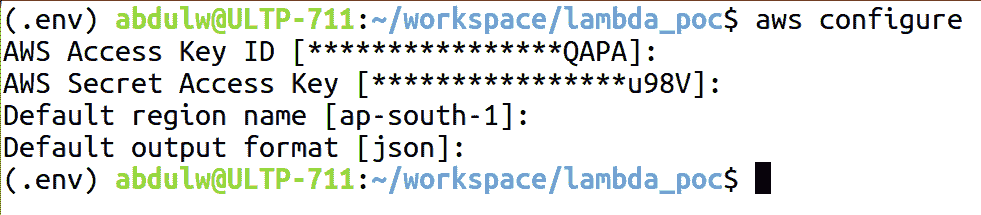
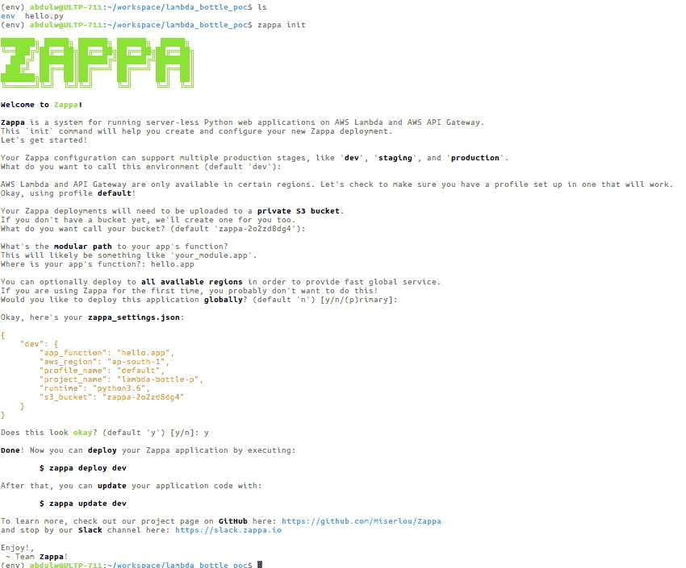
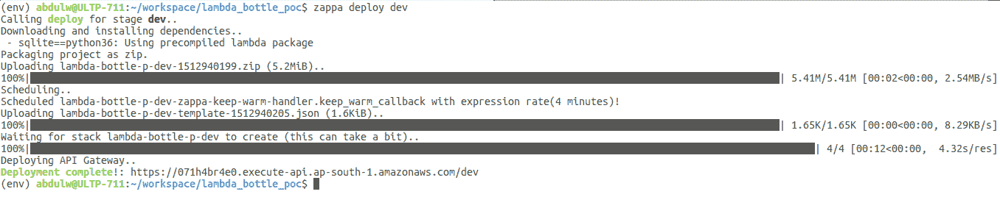

# 二、从 Zappa 开始

之前，我们了解了如何使用 AWS Web 控制台和 AWS CLI 创建无服务器应用。现在，我们将学习 Zappa 以及创建无服务器应用的自动化操作

在本章中，我们将介绍以下主题：

*   Zappa 是什么？
*   安装和配置 Zappa
*   使用 Zappa 构建、测试和部署 Python web 服务
*   Zappa 的用途

# 技术要求

在继续之前，让我们确保满足技术要求。以下小节将介绍本章的硬件和软件要求。

# 硬件

出于演示目的，我们使用了具有以下规格的基本配置机器：

*   内存-16GB
*   处理器-英特尔核心 i5
*   CPU-2.30GHz x 4
*   图形-英特尔高清图形 520

# 软件

以下是软件规范：

*   操作系统-Ubuntu 16.04 LTS
*   操作系统类型-64 位
*   Python 3.6
*   Python 开发包： `build-essential` 、 `python-dev` 和 `python-virtualenv`
*   AWS 凭据和 AWS CLI
*   Zappa

在接下来的章节中，我们将详细介绍如何设置环境。同时，您可以配置基本包，如`python3.6`和`awscli`

# Zappa 是什么？

Zappa 是一个开源工具，由 Gun.io（[的创始人/首席技术官 Rich Jones 开发和设计 https://www.gun.io/](https://www.gun.io/) ）。Zappa 主要设计用于在 AWS Lambda 和 API 网关上构建和部署无服务器 Python 应用。 

Zappa 非常适合部署无服务器的 Python 微服务，其框架包括 Flask 和 Baggle，用于托管大型 web 应用和带有 Django 的 CMSE。您还可以部署任何 Python WSGI 应用。

在上一章中，我们使用 AWS Lambda 和 API 网关实现了基本的 hello world 微服务。Zappa 自动化了所有这些手动过程，并为我们提供了一个方便的工具来构建和部署 Python 应用。

就这么简单：

```py
$ pip install zappa
$ zappa init
$ zappa deploy
```

如前所述，web 托管的传统是服务器需要始终在线，侦听 HTTP 请求并逐个处理请求。如果传入 HTTP 请求的队列增加，则会发生超时错误，因为服务器每秒无法处理这么多请求。

API 网关使用具有自动可伸缩性的虚拟 HTTP 服务器为每个请求提供服务。这就是为什么它可以为数百万个请求提供单一请求而不会失败的原因。因此，我们可以在不违反当前部署成本的情况下实现无限扩展。

现在，我们将进行一个应用演示，但是，在进行此操作之前，让我们在您的机器上配置 Zappa，我们将在下一节中进行介绍。

# 安装和配置 Zappa

安装 Zappa 是一项简单的任务，但在继续之前，我们需要配置先决条件。确保您拥有 Python2.7 或 Python3.6，并且拥有有效的 AWS 帐户。现在，您需要在您的机器上使用`help awscli`配置 AWS 凭据：

```py
$ pip install awscli
```

使用`aws configure`命令配置 AWS 凭证，如以下屏幕截图所示：



AWS 凭据的配置要求您具有 AWS 访问密钥 ID、AWS 秘密访问密钥、默认区域名称和默认输出格式。

您可以从“我的安全凭据”页面获取 AWS 凭据信息，如以下屏幕截图所示：


一旦您配置了 AWS 凭据，我们就可以继续安装 Zappa 了。

Zappa 必须安装在虚拟环境中。强烈建议您在安装 Zappa 之前创建一个虚拟环境并激活它。我更喜欢使用`virtualenv`工具。还有其他工具可用于管理您的虚拟环境：

```py
$ virtualenv env -p python3.6
```

这里，我们正在创建一个名为`env`的虚拟环境，并使用`python3.6`，其中`-p`表示 Python 版本。现在，按如下方式激活虚拟环境：

```py
$ source env/source/bin
```

我们现在就要开始了，所以让我们使用`pip`安装 Zappa：

```py
$ pip install zappa
```

现在，我们准备启动 Zappa。在下面的部分中，我们将创建一个小程序来演示如何使 Zappa 的部署无服务器化。

# 使用 Zappa 构建、测试和部署 Python web 服务

我们将使用 Python 的瓶子框架创建一个简单的 hello world 程序作为微服务。让我们按照一些基本步骤使用瓶子框架配置一个小项目：

1.  首先，我们将创建一个名为`lambda_bottle_poc`：

    ```py
    $ mkdir lambda_bottle_poc
    ```

    的新项目目录
2.  让我们在`lambda_bottle_poc`目录中创建一个虚拟环境：

    ```py
    $ virtualenv env -p python3.6
    ```

3.  下面是使用瓶子框架的基本 hello world 程序：


现在是时候在 AWS Lambda 上将程序部署为无服务器，并通过 API 网关公开`/hello`API 了。在上一章中，我们描述了使用 AWS 控制台和 AWS CLI 手动部署 Python 应用的过程，这是一个非常大的挑战。

但在 Zappa 的帮助下，AWS 控制台和 AWS CLI 的所有手动过程都是自动化的，并提供了在无服务器环境中部署和维护应用的快速过程。

# 构建部署包

让我们使用`zappa init`命令初始化 Zappa。此命令帮助您创建和部署 Python 应用。此命令以用户交互模式运行，需要一些基本问题，以便我们可以设置部署过程。

问卷结束时，Zappa 创建了一个名为`zappa_settings.json.`的 JSON 文件。该文件只是 Zappa 的主干，因为它维护着 Zappa 内部使用的映射信息。

稍后我们将详细讨论 Zappa`init`的命令过程。在此之前，请看下面的屏幕截图，它描述了`zappa init`命令的流程：



如您所见，`zappa init`通过一些问题启动用户交互模式。让我们看看关于每个问题的一些信息。

# 这种环境叫什么？（默认开发人员）

AmazonAPI 网关提供了一种机制来维护托管 API 的不同环境阶段。例如，您可以为开发、暂存和生产创建环境阶段。

借助 Zappa，您可以非常轻松地管理环境阶段。在回答前面的问题时，您可以定义自己的环境阶段名称，或者将其保留为空，以将默认的阶段名称视为 OutT0}。

# 你想叫你的桶什么？（默认 zappa-2o2zd8dg4）

Zappa 部署需要上传到私有 AmazonS3 存储桶。AWS Lambda 需要两种类型的代码输入，例如内联代码和上载 ZIP。如果 zip 文件大小超过 10 MB，那么考虑将 zip 上传到 Amazon S3。这就是为什么 Zappa 在默认情况下创建一个 bucket，用于上载部署 ZIP 文件并引用 AWS Lambda。

您可以按照 Zappa 的建议，提供自己现有的 bucket 名称或选择默认名称。如果 bucket 不存在，Zappa 会自动为您创建一个。

# 应用功能的模块化路径是什么？（默认开发人员）

AWS Lambda 函数需要一个属性，如`lambda_handler`，该属性指向一个函数作为 Lambda 执行的入口点。因此，我们需要提供有关函数名的信息，并提供模块化路径，例如到 Zappa 的`<filename>.<function_name/app_name>`。

在我们的例子中，我们有一个名为`hello.py`的文件和一个应用对象，该对象是使用 Python 瓶子框架的`Bottle`类创建的。因此，这个问题的答案是`hello.app`。

# 是否要全局部署应用？（默认值 n）

AWS 提供了将 Lambda 服务扩展到所有可用区域的功能。如果您希望以更少的延迟在全球范围内提供服务，您应该这样做。Zappa 支持此功能，这将使您能够在所有区域扩展 Lambda 服务，而无需任何手动操作。

最后，您将得到一个`zappa_settings.json`文件，其中包含与部署相关的所有配置。让我们看看下一节中的`zappa_settings.json`文件。

# zappa_settings.json 文件

完成问卷调查后，Zappa 会根据您的输入创建一个基本的`zappa_settings.json`文件。`zappa_settings.json`在为您的项目配置 Zappa 时起着重要作用。如果您在现有项目（`Django/Flask/Pyramid/Bottle`中初始化 Zappa，则 Zappa 会自动检测项目类型并相应地创建`zappa_settings.json`文件。

以下是我们为 hello world 计划新创建的`zappa_settings.json`文件的内容：

```py
{
   "dev": {
       "app_function": "hello.app",
       "aws_region": "ap-south-1",
       "profile_name": "default",
       "project_name": "lambda-bottle-p",
       "runtime": "python3.6",
       "s3_bucket": "zappa-2o2zd8dg4"
   }
}
```

对于 Django 项目，它使用`django_settings`而不是`app_function`。`django_settings`需要使用 Django 设置的路径进行初始化：

```py
{
   "dev": {
       "django_settings": "your_project.settings",
       "aws_region": "ap-south-1",
       "profile_name": "default",
       "project_name": "lambda-bottle-p",
       "runtime": "python3.6",
       "s3_bucket": "zappa-2o2zd8dg4"
   }
}
```

前面的配置足以部署基本的 Python web 应用。接下来，我们将 hello world 部署为一个无服务器应用。

# 部署和测试 hello world

Zappa 部署非常简单，因为您只需运行一个命令即可启动部署：

```py
$ zappa deploy <stage_name>
```

就这样！我们已经完成了部署。现在，让我们部署 hello world 程序。以下屏幕截图描述了部署过程：



一旦部署完成，我们将获得 API URL 端点。让我们通过点击带有`/hello`端点的 API URL 来测试 hello world 应用：

```py
$ curl -l  https://071h4br4e0.execute-api.ap-south-1.amazonaws.com/dev/hello
```

运行上述命令后，您将看到以下输出：

```py
Hello World!
```

能够在几秒钟内配置并部署服务，这真是太神奇了。现在，我们将详细了解它与`zappa_settings.json`文件相关的基本用法。

# 基本用途

Zappa 涵盖了每个部署过程。让我们详细讨论一下 Zappa 的部署流程。

# 初始部署

初始化 Zappa 后，您可以用一个命令将应用部署到`production`阶段，如以下代码段所示：

```py
$ zappa deploy production
.
.
.
Deployment complete ! https://071h4br4e0.execute-api.ap-south-1.amazonaws.com/production
```

当您调用`$ zappa deploy`命令时，Zappa 执行一些任务来完成部署。以下是 Zappa 关于部署的内部流程和流程：

1.  通过使用预编译的 Lambda 包中的版本替换任何依赖项，将本地环境中的应用代码压缩到 ZIP 存档中。
2.  根据应用的类型，使用所需的 WSGI 中间件设置 Lambda`handler`函数。
3.  将前面两个步骤中生成的归档上传到 AmazonS3 存储桶中。
4.  创建和管理必要的 AWS IAM 策略和角色。
5.  参考 AWS S3 存储桶上上载的 ZIP 存档文件创建 AWS Lambda 函数。
6.  根据 Zappa 配置创建 AWS API 网关资源以及不同阶段。
7.  为 API 网关资源创建与 WSGI 兼容的路由。
8.  将 API 网关路由链接到 AWS Lambda 函数。
9.  最后，从 AWS S3 中删除 ZIP 文件。

Note: `lambda-packages` ([https://github.com/Miserlou/lambda-packages](https://github.com/Miserlou/lambda-packages)) is an open source repository that's maintained by the Zappa community. This repository contains the most essential Python libraries as precompiled binaries, which will be compatible with AWS Lambda.

这就是 Zappa 处理部署过程的方式—它自己完成所有这些任务，并使您有幸使用单个命令部署应用。

# 使现代化

如果您已经部署了应用，则只需使用以下命令即可在 AWS Lambda 上更新最新的应用代码：

```py
$ zappa update production
.
.
.
Your updated Zappa deployment is live!: https://071h4br4e0.execute-api.ap-south-1.amazonaws.com/production
```

我们可以将其与使用`zappa deploy`进行比较，后者只更新了一些任务。这里提到：

*   它使用最新的应用代码创建一个存档 ZIP；本地环境是一个预编译的 Lambda 包
*   它将存档的 ZIP 文件上传到 AWS S3
*   它更新了 AWS Lambda

就这样！我们已经完成了现有部署的更新，只花了几秒钟。

# 地位

通过运行以下命令，您只需检查应用部署的状态：

```py
$ zappa status production
```

这将打印有关 AWS Lambda 函数、计划事件和 API 网关的详细信息。

# 尾矿原木

Zappa 提供了一种工具来监视与部署相关的日志。只需使用以下命令即可：

```py
$ zappa tail production
```

这将打印与 HTTP 请求和 AWS 事件相关的所有日志。如果要打印与 HTTP 请求相关的日志，只需传递`--http`参数：

```py
$ zappa tail production --http
```

只需使用以下代码，即可使用非 HTTP 事件和日志消息反转前面的命令：

```py
$ zappa tail production --non-http
```

您还可以使用`--since`参数限制日志的时间：

```py
$ zappa tail production --since 1h # 1 hour
$ zappa tail production --since 1m # 1 minute
$ zappa tail production --since 1mm # 1 month  
```

您还可以使用`--filter`参数过滤日志，例如：

```py
$ zappa tail production --since 1h --http --filter “POST”
```

这将仅显示最后一小时的 HTTP`POST`请求。这使用 AWS CloudWatch 日志过滤器模式（[http://docs.aws.amazon.com/AmazonCloudWatch/latest/logs/FilterAndPatternSyntax.html](http://docs.aws.amazon.com/AmazonCloudWatch/latest/logs/FilterAndPatternSyntax.html) 。

# 回降

AWS Lambda 维护部署的修订版。您可以通过提供修订号回滚到以前部署的版本，如下所示：

```py
$ zappa rollback production -n 3
```

这将简单地用先前上传的存档 ZIP 还原 Lambda 代码。

# 解除部署

如果要完全删除已部署的应用，只需使用以下命令：

```py
$ zappa undeploy production
```

这将删除已发布的 AWS Lambda 和 API 网关。如果希望从 AWS CloudWatch 获得与应用相关的日志，只需将参数与前面的命令一起传递，如下所示：

```py
$ zappa undeploy production --remove-logs
```

这将清除 AWS CloudWatch 中的日志。

# 包裹

Zappa 提供了一个命令，用于在本地生成生成包存档，而无需部署应用：

```py
$ zappa package production
```

运行此命令时，Zappa 会自动将活动虚拟环境打包到与 AWS Lambda 兼容的包中。

在内部，它使用与 AWS Lambda 兼容的预编译版本替换任何本地依赖项。这些依赖项按以下顺序包括：

*   Lambda 兼容本地缓存中的许多 Linux 控制盘
*   Lambda 兼容 PyPi 的许多 Linux 控制盘
*   Lambda 软件包中的 Lambda 特定版本（[https://github.com/Miserlou/lambda-packages](https://github.com/Miserlou/lambda-packages) ）
*   归档活动虚拟环境
*   归档项目目录

在处理、打包和打包时，Zappa 会忽略一些不必要的文件，例如`.pyc`文件。如果它们可用，那么`.py`将被忽略。Zappa 还设置正确的执行权限，配置包设置，并创建唯一的、可审核的包清单文件。

生成的包存档将与 Lambda 兼容。您可以设置一个回调函数，该函数将在创建存档后调用：

```py
{
    "production": {
       "callbacks": {
            "zip": "my_app.zip_callback"
        }
    }
 }
```

这里 production 是您的 stage name，在 callback 下，您可以通过映射到`"zip"`来设置回调方法。这可以帮助您编写自己的自定义部署自动化。

我们已经看到了 Zappa 的基本用途。现在是做一些实际工作的时候了。我们将使用 Zappa 构建一些 Python 应用开发，请继续关注！

# 总结

Zappa 提供了灵活的特性，因此您可以执行部署过程。我们介绍了 Zappa 的基本用途，并了解了打包和部署过程。Zappa 使开发人员能够非常简单地配置应用并将其部署到无服务器环境。

# 问题

1.  Zappa 是什么？
2.  我们如何在 AWS 中保护应用？