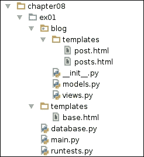

# 八、提示、技巧或 Flask 魔法 101

您能再等一段时间，然后在 Flask 上尝试更高级的主题吗？我当然不能！在本章中，我们将学习使用 Flask 更好、更有效地工作所必需的技术和模块。

花很长时间编写代码的高质量软件或是瞬间交付的低质量软件有什么好处？真正的 Web 开发，即您在月底获得报酬的开发，需要可维护性、生产率和质量才能可行。

正如我们前面讨论的，软件质量与测试密切相关。衡量软件质量的一种方法是验证其功能与预期的功能有多接近。这种测量没有考虑到质量评估的主观方面。一个客户，例如，可能相信他的最新项目的设计是丑陋的，并考虑一个测试良好的，特征粘附的 Web 项目。在这些情况下，您最多可以为设计重构收取一些额外费用。

### 提示

如果这种情况发生在你身上，让你的客户更接近开发过程，以避免这种情况。尝试在 Google 或 DuckDuckGo 中搜索“scrum”。

当谈到**生产率**和**可维护性**时，方法很多！你可以购买一个很好的集成开发环境（IDE），比如 PyCharm 或 WingIDE 来提高你的生产力，或者雇佣第三方服务来帮助你测试你的代码或控制你的开发进度，但这些都可以做很多事情。在大多数项目中，良好的体系结构和任务自动化将是您最好的朋友。在讨论如何组织代码以及哪些模块可以帮助您在这里或那里节省一些输入之前，让我们先讨论过早优化和过度工程，这是焦虑的开发人员/分析师/多管闲事的经理的两个可怕症状。

# 过度工程化

从几个方面来说，制作软件就像制作公寓。在开始之前，你要提前计划好你想要创造的东西，这样浪费就可以保持在最低限度。与公寓相反，在公寓里，在开始之前最好规划整个项目，你不必规划你的软件，因为它很可能会在开发过程中发生变化，很多规划可能会白费。

这种“只做足够的计划”的方法的问题是，你不知道未来会发生什么，这可能会把我们内心的一点点偏执转变成一件大事。最终可能会针对整个系统故障或可能永远不会发生的复杂软件需求场景进行编码。创建 hello world 不需要多层体系结构，包括缓存、数据库集成、信号系统等，创建 Facebook 克隆也不需要少于此结构。

这里要传达的信息是：不要让你的产品变得比你所知道的更健壮或复杂，不要浪费时间去计划那些最有可能永远不会发生的事情。

### 提示

始终规划合理的安全性、复杂性和性能水平。

# 过早优化

你的软件足够快吗？不知道？那你为什么要优化代码，我的朋友？当你花时间优化你不确定是否需要优化的软件时，如果没有人抱怨它太慢，或者你没有注意到它在日常使用中太慢，那么你可能是在浪费时间进行过早的优化。

然后，继续到Flask。

# 蓝图 101

到目前为止，我们的应用程序都是平面的：漂亮的单文件 Web 应用程序（不考虑模板和静态资源）。在某些情况下，这是一个很好的方法；减少了对导入的需求，易于使用简单的编辑器进行维护，除了…

随着应用程序的增长，我们发现需要根据上下文安排代码。Flask 蓝图允许您模块化您的项目，在名为**蓝图**的“类应用程序”对象中分割视图，稍后可由 Flask 应用程序加载和公开。随着代码变得更有条理，大型应用程序从蓝图的使用中受益匪浅。

就功能而言，它还可以帮助您以更统一的方式配置注册视图访问和资源查找。测试、模型、模板和静态资源可以按蓝图进行排序，从而使您的代码更易于维护。如果您熟悉**Django**，请将蓝图视为 Django 应用程序。这样，注册的蓝图可以访问应用程序配置，并且可以使用不同的路由注册。

与 Django 应用程序不同，blueprints 不强制执行特定的结构，就像 Flask 应用程序本身一样。例如，您可以将蓝图结构化为一个模块，这是一种方便的方式，偶尔也可以。

举个例子总是有帮助的，对吗？让我们看一个很好的蓝图示例。首先，我们在虚拟环境中安装了示例所需的库：

```py
# library for parsing and reading our HTML
pip install lxml
# our test-friendly library
pip install flask-testing

```

然后我们定义了我们的测试（因为我们喜欢 TDD！）：

```py
# coding:utf-8
# runtests.py

import lxml.html

from flask.ext.testing import TestCase
from flask import url_for
from main import app_factory
from database import db

class BaseTest(object):
    """
    Base test case. Our test cases should extend this class.
    It handles database creation and clean up.
    """

    def create_app(self):
        app = app_factory()
        app.config['TESTING'] = True
        return app

    def setUp(self):
        self.app.config['SQLALCHEMY_DATABASE_URI'] = 'sqlite:////tmp/ex01_test.sqlite'
        db.create_all()

    def tearDown(self):
        db.session.remove()
        db.drop_all()

class PostDetailTest(BaseTest, TestCase):
    def add_single_post(self):
        from blog import Post

        db.session.add(Post(title='Some text', slug='some-text', content='some content'))
        db.session.commit()

        assert Post.query.count() == 1

    def setUp(self):
        super(PostDetailTest, self).setUp()
        self.add_single_post()

    def test_get_request(self):
        with self.app.test_request_context():
            url = url_for('blog.posts_view', slug='some-text')
            resp = self.client.get(url)
            self.assert200(resp)
            self.assertTemplateUsed('post.html')
            self.assertIn('Some text', resp.data)

class PostListTest(BaseTest, TestCase):
    def add_posts(self):
        from blog import Post

        db.session.add_all([
            Post(title='Some text', slug='some-text', content='some content'),
            Post(title='Some more text', slug='some-more-text', content='some more content'),
            Post(title='Here we go', slug='here-we-go', content='here we go!'),
        ])
        db.session.commit()

        assert Post.query.count() == 3

    def add_multiple_posts(self, count):
        from blog import Post

        db.session.add_all([
            Post(title='%d' % i, slug='%d' % i, content='content %d' % i) for i in range(count)
        ])
        db.session.commit()

        assert Post.query.count() == count

    def test_get_posts(self):
        self.add_posts()

        # as we want to use url_for ...
        with self.app.test_request_context():
            url = url_for('blog.posts_view')
            resp = self.client.get(url)

            self.assert200(resp)
            self.assertIn('Some text', resp.data)
            self.assertIn('Some more text', resp.data)
            self.assertIn('Here we go', resp.data)
            self.assertTemplateUsed('posts.html')

    def test_page_number(self):
        self.add_multiple_posts(15)

        with self.app.test_request_context():
            url = url_for('blog.posts_view')
            resp = self.client.get(url)

            self.assert200(resp)

            # we use lxml to count how many li results were returned
            handle = lxml.html.fromstring(resp.data)
            self.assertEqual(10, len(handle.xpath("//ul/li")))

if __name__ == '__main__':
    import unittest
    unittest.main()
```

在前面的代码中，我们测试了一个视图`blog.posts_view`，它有两个路由，一个用于发布细节，另一个用于发布列表。如果我们的视图收到一个`slug`参数，它应该只返回属性值为 slug 的第一个`Post`；如果不是，它最多返回 10 个结果。

我们现在可以使用满足我们测试的蓝图创建一个视图：

```py
# coding:utf-8
# blog.py

from flask import Blueprint, render_template, request
from database import db

# app is usually a good name for your blueprint instance
app = Blueprint(
    'blog',  # our blueprint name and endpoint prefix
    # template_folder points out to a templates folder in the current module directory
    __name__, template_folder='templates'
)

class Post(db.Model):
    __tablename__ = 'posts'

    id = db.Column(db.Integer, primary_key=True)
    title = db.Column(db.String(100), nullable=False)
    slug = db.Column(db.String(100), nullable=False, unique=True)
    content = db.Column(db.Text(), nullable=False)

    def __unicode__(self):
        return self.title

@app.route("/")
@app.route("/<slug>")
def posts_view(slug=None):
    if slug is not None:
        post = Post.query.filter_by(slug=slug).first()
        return render_template('post.html', post=post)

    # lets paginate our result
    page_number = into(request.args.get('page', 1))
    page = Post.query.paginate(page_number, 10)

    return render_template('posts.html', page=page)
```

创建蓝图非常简单：我们提供蓝图名称，它也用作所有蓝图视图的端点前缀、导入名称（通常为`__name__`，以及我们认为合适的任何额外参数。在本例中，我们将`template_folder`作为参数传递，因为我们希望使用模板。如果您正在编写服务代码，则可以跳过此参数。另一个非常有用的参数是`url_prefix`，它允许我们为所有路径定义默认 URL 前缀。

### 提示

如果我们的蓝图名称是`blog`，并且我们注册了一个方法`index_view`，那么该视图的端点将是`blog.index_view`。端点是视图的“名称引用”，您可以将其转换为 URL 路径。

下一步是将 blueprint 注册到 Flask 应用程序中，以便可以访问我们编写的视图。还创建了一个`database.py`模块来保存我们的 db 实例。

请注意，我们的 Post 模型将被`db.create_all`识别，因为它是在`blog.py`中定义的；因此，在导入模块时，它变得可见。

### 提示

如果您在一个模块中定义了一个模型类，而该模块没有在任何地方导入，那么可能不会创建它的表，因为 SQLAlchemy 不会知道它。避免这种情况的一种方法是让定义蓝图的模块导入所有模型。

```py
# coding:utf-8
# database.py
from flask.ext.sqlalchemy import SQLAlchemy

db = SQLAlchemy()
## database.py END

# coding:utf-8
# main.py
from flask import Flask
from database import db
from blog import app as blog_bp

def app_factory(name=None):
    app = Flask(name or __name__)
    app.config['SQLALCHEMY_DATABASE_URI'] = 'sqlite:////tmp/ex01.db'

    db.init_app(app)

    # let Flask know about blog blueprint
    app.register_blueprint(blog_bp)
    return app

# running or importing?
if __name__ == '__main__':
    app = app_factory()
    app.debug = True

    # make sure our tables are created
    with app.test_request_context():
        db.create_all()

    app.run()
```

我们这里有什么？创建 Flask 应用程序的`app_factory`在`/tmp/`中设置默认数据库，这是一个用于临时文件的通用 Linux 文件夹；启动`database.py`中定义的数据库管理器；并使用`register_blueprint`注册我们的蓝图。

我们设置了一个例程来验证我们是否正在运行或导入给定的模块（对`runtests.py`有用，因为它从`main.py`导入）；如果我们正在运行它，我们将创建一个应用程序，将其设置为调试模式（因为我们正在开发），在临时测试上下文中创建数据库（`create_all`不会在上下文之外运行），然后运行该应用程序。

模板（`post.html`和`posts.html`仍然需要编写。你能写出来让测试通过吗？我把它作为一份工作留给你！

我们当前的示例项目结构应如下所示：


那么我们的项目还是平淡的；所有模块位于同一层，按上下文排列，但平面。让我们尝试将我们的博客蓝图移动到它自己的模块中！我们可能想要这样的东西：



博客模板在博客包的模板文件夹中，我们的模型在`models.py`中，我们的视图在`views.py`中（很像 Django 应用程序，对吧？）。

不费吹灰之力就能做出改变。通常情况下，创建一个`blog`文件夹，并在其中放置一个包含以下内容的`__init__.py`文件：

```py
# coding:utf-8
from views import *
```

将`Post`类定义和 db 导入移动到`models.py`中，并将博客特定模板`post.html`和`posts.html`移动到包内的`templates`文件夹中。由于`template_folder`是相对于当前模块目录的，因此无需更改我们的蓝图实例化。现在，运行您的测试。它们应该不加修改地工作。

啜一口，戴上你的战争头盔，让我们进入下一个主题：日志记录！

# 天哪，请告诉我你有日志…

你永远不会知道日志记录有多重要，直到你面对一个你无法完全理解的神秘问题。理解为什么会发生错误是人们在项目中添加日志记录的首要原因，可能也是主要原因。但是，嘿，什么是日志记录？

日志记录是存储有关事件的记录以供以后进一步分析的行为。关于日志记录的一个重要概念与日志记录级别有关，它允许您对信息类型和相关性进行分类。

Python 标准库附带了一个日志库，它实际上非常强大，允许您通过处理程序和消息来记录流、文件、电子邮件或任何您认为合适的其他解决方案。让我们尝试一些有用的日志示例，好吗？

```py
# coding:utf-8
from flask import Flask
import logging
from logging.handlers import RotatingFileHandler

app = Flask(__name__)

# default flask logging handler pushes messages into the console
# works DEBUG mode only
app.config['LOG_FILENAME'] = '/var/tmp/project_name.log'
# log warning messages or higher
app.config['LOG_LEVEL'] = logging.WARNING
app.config['ADMINS'] = ['you@domain.com']
app.config['ENV'] = 'production'

def configure_file_logger(app, filename, level=logging.DEBUG):
    # special file handler that overwrites logging file after
    file_handler = RotatingFileHandler(
        filename=filename,
        encoding='utf-8',  # cool kids use utf-8
        maxBytes=1024 * 1024 * 32,  # we don't want super huge log files ...
        backupCount=3  # keep up to 3 old log files before rolling over
    )

    # define how our log messages should look like
    formatter = logging.Formatter(u"%(asctime)s %(levelname)s\t: %(message)s")
    file_handler.setFormatter(formatter)
    file_handler.setLevel(level)

    app.logger.addHandler(file_handler)

def configure_mail_logger(app, level=logging.ERROR):
    """
    Notify admins by e-mail in case of error for immediate action
    based on from http://flask.pocoo.org/docs/0.10/errorhandling/#error-mails
    """

    if app.config['ENV'] == 'production':
        from logging.handlers import SMTPHandler

        mail_handler = SMTPHandler(
            '127.0.0.1',
            'server-error@domain.com',
            app.config['ADMINS'], 'YourApplication Failed')

        mail_handler.setLevel(level)
        app.logger.addHandler(mail_handler)

if __name__ == '__main__':
    app.debug = True
    configure_file_logger(app, '/var/tmp/project_name.dev.log')
    configure_mail_logger(app)
    app.run()
```

在我们的示例中，我们创建了两种常见的日志设置：记录到文件和记录到邮件。两者都有各自的用处。在`configure_file_logger`中，我们定义了一个注册`RotatingFileHandler`的函数，用于保存给定级别或更高级别的所有日志消息。在这里，我们不使用常规的`FileHandler`类，因为我们希望保持日志文件的可管理性（也称为：小）。`RotatingFileHandler`允许我们定义日志文件的最大大小，当日志文件大小接近`maxBytes`限制时，处理程序“旋转”到一个全新的日志文件（或覆盖旧的日志文件）。

记录到文件非常简单，主要用于跟踪应用程序中的执行流（主要是信息、调试和警告日志）。基本上，只要您有应该记录但不应该立即读取甚至根本不应该读取的消息，就应该使用文件日志记录（如果发生意外情况，您可能希望读取调试日志，但不是其他情况）。这样，在出现问题的情况下，您只需找出日志文件，看看哪里出了问题。邮件日志还有另一个目标。。。

为了配置邮件记录器，我们定义了一个名为`configure_mail_logger`的函数。它在给定的日志级别创建并向我们的记录器注册一个`SMTPHandler`；这样，无论何时记录具有该日志级别或更高级别的消息，都会向注册管理员发送一封电子邮件。

邮件日志记录有一个主要目的：尽快通知某人（或许多人）发生了重要的事情，例如可能危及应用程序的错误。您可能不希望这种处理程序的日志记录级别低于错误集，因为要跟上的邮件太多了。

作为关于日志记录的最后一条建议，sane 项目具有良好的日志记录能力。通常可以追溯用户问题报告，甚至是邮寄的错误消息。定义好的日志记录策略并遵循它们，构建分析日志的工具，并设置适合项目需要的日志记录循环参数。产生大量日志记录的项目可能需要更大的文件，而没有太多日志记录的项目可以很好地使用高值`backupCount`。总要考虑一下。

# 调试、调试、幸福

在调试模式（`app.debug = True`下运行 Flask 项目时，只要 Flask 检测到您的代码已更改，它就会重新启动应用程序。如果给定的更改破坏了您的应用程序，Flask 将在控制台中显示一条错误消息，这实际上非常容易分析。你开始自下而上阅读，直到找到第一行提到你写的文件；这就是产生错误的地方。现在，从上而下阅读，直到你找到一行确切地告诉你错误是什么。如果这种方法还不够，例如，如果您需要读取一个变量值，为了更好地了解发生了什么，您可以使用标准 Python 调试库`pdb`，如下所示：

```py
# coding:utf-8
from flask import Flask

app = Flask(__name__)

@app.route("/")
def index_view(arg=None):
    import pdb; pdb.set_trace()  # @TODO remove me before commit
    return 'Arg is %s' % arg

if __name__ == '__main__':
    app.debug = True
    app.run()
```

无论何时调用`pdb.set_trace`，都会打开一个类似于 Python 控制台的`pdb`控制台。因此，您可以参考所需的任何值的值，甚至进行代码求值。

使用`pdb`很好，但是，如果您只是想了解示例的请求发生了什么，那么所使用的模板、CPU 时间（这可能会让您抓狂！）、日志消息等可能是您可以使用的非常方便的扩展。

## 工具条

假设您可以直接在呈现的模板中看到请求的 CPU 时间，并且可以验证哪个模板用于呈现该页面，甚至可以动态编辑该页面。那好吗？你想看到它成为现实吗？然后尝试以下示例：

首先，确保已安装扩展：

```py
pip install flask-debugtoolbar

```

还有一些很好的代码：

```py
# coding:utf-8
from flask import Flask, render_template
from flask_debugtoolbar import DebugToolbarExtension

app = Flask(__name__)
# configure your application before initializing any extensions
app.debug = True
app.config['SECRET_KEY'] = 'secret'  # required for session cookies to work
app.config['DEBUG_TB_TEMPLATE_EDITOR_ENABLED'] = True
toolbar = DebugToolbarExtension(app)

@app.route("/")
def index_view():
    # please, make sure templates/index.html exists ; )
    return render_template('index.html')

if __name__ == '__main__':
    app.run()
```

使用工具栏并不神秘。将`debug`设置为`True`，添加`secret_key`，并初始化扩展。当您在浏览器中打开`http://127.0.0.1:5000/`时，您会看到如下内容：


右侧可折叠的面板是调试工具栏在每个 HTML 响应中插入的一点 HTML，它允许您反思您的响应，而无需使用调试器，如`pdb`。在本例中，我们将`DEBUG_TB_TEMPLATE_EDITOR_ENABLED`设置为`True`；此选项告诉 DebugToolbar 我们希望直接从浏览器编辑渲染模板。只需导航到**模板****编辑模板**即可尝试。

# 会话或在请求之间存储用户数据

有时，您的应用程序中会出现这样一种情况，即数据必须在请求之间保留，但不需要将其保留在数据库中，例如身份验证令牌，用于标识已登录的用户或用户添加到其购物车中的项目。在危险时刻，使用Flask会话。

Flask 会话是使用浏览器 cookie 和加密实现的请求之间的临时存储解决方案。Flask 使用密钥值对会话中设置的任何值进行加密，然后再将其设置到 cookie 中；这样，即使恶意用户可以访问受害者的浏览器，也无法读取 cookie 的内容。

### 提示

由于密钥用于加密会话数据，因此为密钥指定一个强值非常重要。`os.urandom(24)`可能会为部署环境创建一个强密钥。

存储在会话中的数据是暂时的，因为不能保证它在任何时候都在那里，因为用户可能会清除浏览器 cookie，或者 cookie 可能刚刚过期，但如果您设置它，它很可能在那里。在开发过程中始终要考虑到这一信息。

Flask会话的一大优点是它的简单性；你把它当作一本普通字典来使用，就像这样：

```py
# coding:utf-8

from flask import Flask, render_template, session, flash
from flask.ext.sqlalchemy import SQLAlchemy

app = Flask(__name__)
# strong secret key!!
app.config['SECRET_KEY'] = '\xa6\xb5\x0e\x7f\xd3}\x0b-\xaa\x03\x03\x82\x10\xbe\x1e0u\x93,{\xd4Z\xa3\x8f'
app.config['SQLALCHEMY_DATABASE_URI'] = 'sqlite:////tmp/ex05.sqlite'
db = SQLAlchemy(app)

class Product(db.Model):
    __tablename__ = 'products'

    id = db.Column(db.Integer, primary_key=True)
    sku = db.Column(db.String(30), unique=True)
    name = db.Column(db.String(255), nullable=False)

    def __unicode__(self):
        return self.name

@app.route("/cart/add/<sku>")
def add_to_cart_view(sku):
    product = Product.query.filter_by(sku=sku).first()

    if product is not None:
        session['cart'] = session.get('cart') or dict()
        item = session['cart'].get(product.sku) or dict()
        item['qty'] = item.get('qty', 0) + 1
        session['cart'][product.sku] = item
        flash(u'%s add to cart. Total: %d' % (product, item['qty']))

    return render_template('cart.html')

def init():
    """
    Initializes and populates the database
    """
    db.create_all()

    if Product.query.count() == 0:
        db.session.add_all([
            Product(sku='010', name='Boots'),
            Product(sku='020', name='Gauntlets'),
            Product(sku='030', name='Helmets'),
        ])
        db.session.commit()

if __name__ == '__main__':
    app.debug = True

    with app.test_request_context():
        init()

    app.run()
# == END
# cart.html
<html><head>
  <title>Cart</title>
</head><body>

  
  <ul>
    
    <li>{{ message }}</li>
    
  
  </ul>

</body></html>
```

在本例中，我们定义了一个非常简单的产品模型，其中包含 ID、名称、sku（用于标识商店中产品的特殊字段）和一个视图，该视图在用户会话中将请求的产品添加到购物车中。正如您所看到的，我们不假设会话中有任何数据，总是出于安全考虑。我们也不需要在更改会话后“保存”会话，因为 Flask 足够聪明，可以注意到您的会话已更改，并自动神奇地保存它…实际上，这里有一个陷阱。Flask sessions 只有在修改其第一级值时才能检测到会话被修改。例子：

```py
session['cart'] = dict()  # new cart
# modified tells me if session knows it was changed
assert session.modified == True
session.modified = False  # we force it to think it was not meddled with
session['cart']['item'] = dict()
# session does not know that one of its children was modified
assert session.modified == False
# we tell it, forcing a update
session.modified =True
# session will be saved, now
```

现在运行您的项目并在浏览器中打开 URL`http://localhost:5000/cart/add/010`。参见每次您重新加载时计数器是如何上升的？好了，这是有效的课程！

# 运动

把我们的知识用在工作上怎么样？尝试制作一个商店 web 应用程序，例如在线宠物商店。它应该有宠物服务，例如洗澡和兽医咨询，还有一个宠物配件小店。这应该很容易（很多工作！但是很容易）。

# 总结

这是一个密集的章节。我们概述了性能和可维护性、生产率和质量等重要概念，并就过早优化和过度工程进行了快速讨论，并将精力集中在学习如何使用 Flask 编写更好的代码上。

蓝图允许您使用 Flask 创建健壮的大型项目，并通过一个完整的示例进行了讨论；我们学习了如何记录到文件和邮件，以及它们的重要性，在 Flask DebugToolbar 上度过了一段愉快的时光（非常方便！），并将默认会话设置和使用牢记在心。

你现在是一个有能力的Flask开发者。我太骄傲了！

当一个人在尝试漂流之前先学会驾驶时，我们将在下一章开始漂流。我们的重点将是利用 Flask 可用的广泛扩展生态系统，以创建令人惊叹的项目。这将是非常有趣的！再见！