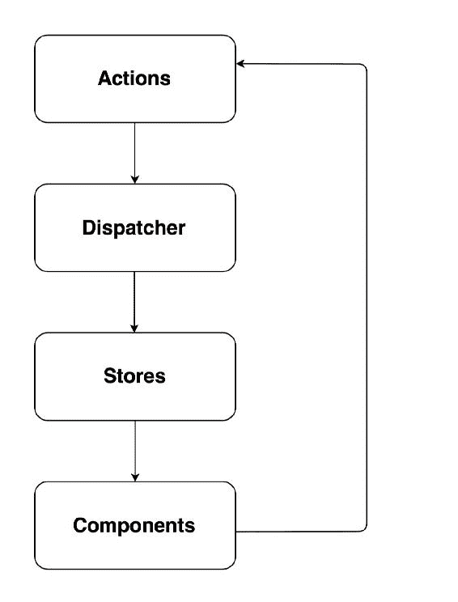
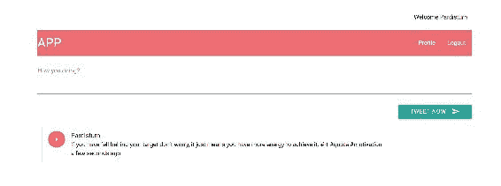
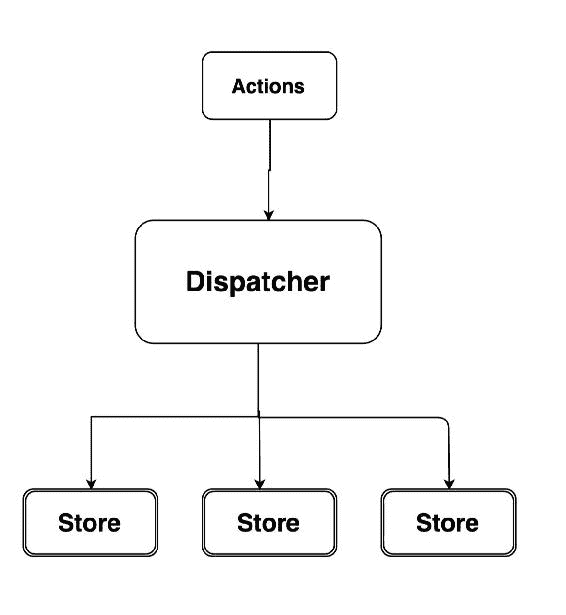
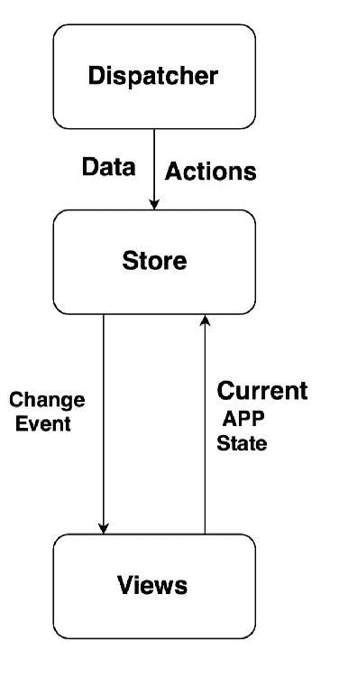
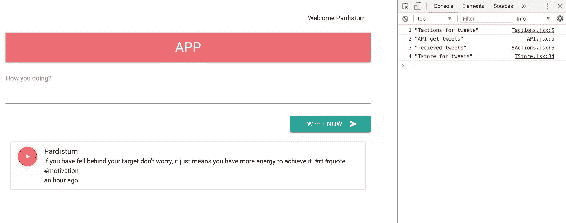
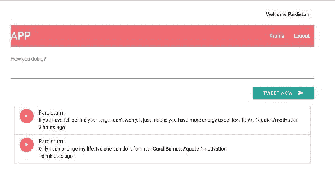
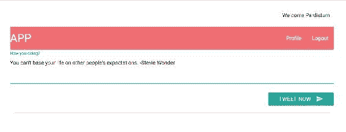

# 六、创建 UI 来使用 Flux 扩容

在上一章中，我们为我们的应用创建了 WebView，还看到了前端和后端应用之间的集成，这对于理解非常重要。

在本章中，我们将重点讨论构建前端。理想情况下，每个模块都应该负责一件事。与我们的主要组件一样，我们在单个模块中运行了太多操作。除了呈现不同的视图外，我们还有代码向端点发出 API 请求，并接收、处理和格式化响应。

在本章中，我们将介绍以下主题：

*   理解Flux
*   在反应器上实现通量

# 理解Flux

**Flux**是 Facebook 创建的一种模式，用于与 React 构建一致且稳定的网络应用。React 不会给您管理数据的能力；相反，它只是通过道具和组件接受数据，并且组件进一步处理数据。

React 库并没有真正告诉您如何获取组件，或者在哪里存储数据，这就是为什么它被称为**视图层**。在 React 中，我们没有一个框架，就像在角度或主干的情况下一样。这就是通量的作用。Flux 不是一个真正的框架，但它是一种让您构建自己视图的模式。

什么是通量模式？我们有你的 React 组件，比如 Tweet 组件等等，这些组件在Flux模式中做两件事——它们要么执行动作，要么监听存储。在我们的用例中，如果用户想要发布 tweet，组件需要执行动作，然后与存储交互，将模式更新到 API，并向组件提供响应。下图将使您更清楚地了解通量：



# 通量概念

以下是继续前进之前需要了解的Flux概念：

*   **动作**：这是组件与 API 端点交互并更新它们的方式。在我们的例子中，我们使用它发布新的推文。动作通过管道将动作传递给调度程序。它可能会创建多个操作。
*   **Dispatcher**：它对传入的每个事件进行调度，并将其发送到每个订阅者，这些订阅者基本上都是存储区。
*   **存储**：这是 Flux 的重要组成部分。组件始终侦听存储中的任何更改。比如说，如果你写了一条新的 tweet，那就是一个动作，无论 tweet 在商店中的什么地方被更新，都会触发一个事件，组件会意识到它必须用最新的数据进行更新。如果您来自 AngularJS 世界，则 store 是一项服务，或者如果您是 Backbone.js，则 store 只不过是一个集合。
*   **组件**：用于存储动作名称。

We will be using the `JSX` file instead of `JS`, as there is not much difference--`JS` is a standard Javascript and `JSX` is an HTML-like syntax that you can use with React to create React components easily and perceptively.

# 向用户界面添加日期

在深入研究Flux之前，我们需要在视图中添加一点日期功能。早些时候，您看到了以**TZ**格式存储在数据库中的 tweet 的计时；然而，理想情况下，应将其与当前计时进行比较，并应参考当前计时进行显示。

为了做到这一点，我们需要更新我们的`main.jsx`文件，以便它能够格式化我们的推文。将以下代码添加到`main.jsx`：

```py
    updatetweets(tweets){ 
        let updatelist = tweets.map(tweet => { 
         tweet.updatedate = moment(tweet.timestamp).fromNow(); 
         return tweet; 
       }); 
   }

```

我们的工作在这里完成了。现在，我们的推文应该是这样的：



# 使用 Flux 构建用户界面

在 Flux 中，我们将定义每个模块的职责，并且它也应该是单一的。React 的职责是在数据更改时重新呈现视图，这对我们很有好处。我们所需要做的就是使用 Flux 之类的工具来监听这些数据事件，它将管理我们的数据。

使用 Flux，您不仅可以分离模块的责任，还可以在应用中实现单向流，这就是 Flux 如此受欢迎的原因。

在通量循环中，对于每个模块，总有一个方向需要通过。这种对Flux的有意约束使Flux应用易于设计、易于增长、易于管理和维护。

下图将使您更清楚地了解 Flux 体系结构：


对于该图，我从 Flux 存储库（[中获取了参考 https://github.com/facebook/flux](https://github.com/facebook/flux) ）。

# 操作和调度程序

从通量开始，我们必须选择一个起点。它可能是任何东西。我发现从行动开始很好。您还必须选择流动方向。你可以顺时针或逆时针走。顺时针方向可能是一个好的起点，所以我们将这样做。

不要忘记使用以下命令直接安装 Flux 库：

```py
$ npm install flux --save

```

请注意，前面的命令应该从我们的应用目录中执行，或者您可以将其添加到`package.json`中并执行`npm install`来安装软件包。

现在，让我们从行动开始，我们将遵循单一责任原则。我们将创建一个与 API 通信的操作库，以及另一个与 dispatcher 通信的操作。

让我们首先在静态目录中创建`actions`文件夹。我们将在此目录中保存所有操作。

因为我们需要执行两个操作——可能是列出 tweets 或添加新 tweets——我们将从列出 tweets 开始。使用`getAllTweets`函数创建一个`Tactions`文件，该文件应该调用 REST API 来获取所有 tweet，如下所示：

```py
   export default{ 
    getAllTweets(){ 
    //API calls to get tweets. 
    } 
   } 

```

我提到基于通量的应用很容易设计，对吗？原因如下。因为我们知道这个 actions 模块对单个流有一个单一的职责——要么在这里提供 API 调用，要么调用一个将对应用进行所有 API 调用的模块。

更新`Tactions.jsx`文件如下：

```py
    import API from "../API" 
     export default{ 
      getAllTweets(){ 
       console.log(1, "Tactions for tweets"); 
        API.getAllTweets(); 
      }, 
    } 

```

如您所见，我们导入了 API 模块，该模块将调用 API 来获取推文。

因此，让我们使用以下代码片段在静态目录中创建`API.jsx`，以从后端服务器获取推文：

```py
    export default{ 
      getAllTweets(){ 
       console.log(2, "API get tweets"); 
       $.getJSON('/api/v2/tweets', function(tweetModels) { 
          var t = tweetModels 
        // We need to push the tweets to Server actions to dispatch 
        further to stores. 
       }); 
      } 

```

在 actions 目录下创建`Sactions`文件，调用调度器并定义`actionType`：

```py
    export default{ 
      receivedTweets(rawTweets){ 
       console.log(3, "received tweets"); 
      //define dispatcher.     
     } 
   } 

```

如您所见，我们仍然需要定义 dispatcher。幸运的是，Facebook 创建了一个与 Flux 包一起提供的 dispatcher。

如前所述，**Dispatcher**是应用的中心集线器，它调度**操作**和注册回调的数据。为了更好地理解数据流，您可以参考下图：



创建一个名为`dispatcher.jsx`的新文件，该文件将创建一个具有以下代码行的 dispatcher 实例：

```py
    import Flux from 'flux'; 

    export default new Flux.Dispatcher();   

```

就这样。现在，您可以在应用中的任何位置导入此 dispatcher。

那么，让我们更新我们的`Sactions.jsx`文件，您将在其中找到`receivedTweets`函数，如下面的代码片段所示：

```py
    import AppDispatcher from '../dispatcher'; 
    receivedTweets(rawTweets){ 
      console.log(3, "received tweets"); 
      AppDispatcher.dispatch({ 
        actionType: "RECEIVED_TWEETS", 
         rawTweets 
      }) 
     } 

```

在`receivedTweets`函数中，有三件事需要描述。首先，`API.jsx`中的`getAllTweets`功能会收到`rawTweets`，我们需要更新如下：

```py
   import SActions from './actions/SActions'; 

   getAllTweets(){ 
     console.log(2, "API get tweets"); 
     $.getJSON('/api/v2/tweets', function(tweetModels) { 
        var t = tweetModels 
        SActions.receivedTweets(t) 
    }); 

```

# 商店

存储通过控制应用中的数据来管理应用状态，这意味着存储管理数据、数据检索方法、dispatcher 回调等。

为了更好地理解，请参阅下图：



现在我们已经定义了 dispatcher，接下来，我们需要为 dispatcher 提供的更改标识订阅者。

在静态目录中的存储中创建一个单独的目录，该目录将包含所有存储定义。

让我们创建一个`TStore`文件，该文件将订阅 dispatcher 发出的任何更改。将以下代码添加到`TStore`文件中，这样做：

```py
    import AppDispatcher from "../dispatcher"; 

    AppDispatcher.register(action =>{ 
     switch (action.actionType) { 
     Case "RECEIVED_TWEETS" : 
    console.log(4, "Tstore for tweets"); 
     break; 
      default: 
    } 
  }); 

```

此时，我们已经启动了 tweet 操作，它向 API 模块发送一条消息以获取所有 tweet。API 做到了这一点，然后调用服务器操作将数据传递给调度程序。然后，调度器标记数据并将其分派。我们还创建了基本上管理数据和从 dispatcher 请求数据的存储。

目前，您的商店未与我们的应用连接。商店应该在发生变化时发出变化，基于此，视图也会发生变化。

因此，我们的主要组件对存储发出的事件的更改感兴趣。现在，让我们导入我们的商店。

在继续之前，让我们看看应用的整个流程是否正常工作。应该是这样的：



It's good practice to keep on checking the user interfaces after you have reached a certain stable state of your application creation.

让我们继续。目前，我们正在发送推文，接下来，我们需要决定我们需要如何处理这些推文。因此，让我们首先接收 tweet，然后相应地对视图进行更改。我们将使用发射器来实现这一点。

**发射器**是我们之前使用`npm`安装的事件库的一部分。因此，我们可以从那里导入它。请注意，它不是默认导出，而是其上的析构函数属性。然后，我们的商店将成为这个 tweet`EventEmitter`类的一个实例。

我们更新`TStore.jsx`文件如下：

```py
    import { EventEmitter } from "events"; 

    let _tweets = [] 
     const CHANGE_EVENT = "CHANGE"; 

     class TweetEventEmitter extends EventEmitter{ 
     getAll(){ 
       let updatelist = _tweets.map(tweet => { 
          tweet.updatedate = moment(tweet.timestamp).fromNow(); 
         return tweet; 
        }); 
     return _tweets; 
     } 
     emitChange(){ 
       this.emit(CHANGE_EVENT); 
     } 

     addChangeListener(callback){ 
      this.on(CHANGE_EVENT, callback); 
     } 
     removeChangeListener(callback){ 
       this.removeListener(CHANGE_EVENT, callback); 
    } 
   } 
   let TStore = new TweetEventEmitter(); 

   AppDispatcher.register(action =>{ 
    switch (action.actionType) { 
      case ActionTypes.RECEIVED_TWEETS: 
        console.log(4, "Tstore for tweets"); 
        _tweets = action.rawTweets; 
        TStore.emitChange(); 
      break; 
     } 
     }); 
    export default TStore; 

```

哇，一次要理解的代码太多了！让我们一部分一部分地理解它，以及代码的流程。

首先，我们将使用以下导入实用程序从事件包导入`EventEmitter`库：

```py
   import { EventEmitter } from "events"; 

```

接下来，我们将在`_tweets`中存储接收到的 tweet，并在`getAll()`功能中更新 tweet，以便在视图中显示 tweet 相对于当前系统时间的计时：

```py
   getAll(){ 
     let updatelist = _tweets.map(tweet => { 
         tweet.updatedate = moment(tweet.timestamp).fromNow(); 
         return tweet; 
       }); 
     return _tweets; 
   }

```

我们还为视图创建了添加和删除更改事件侦听器的函数。这两个函数也只是对`EventEmitter`语法的总结。

这些函数接受将由视图发送的`callback`参数。这些函数基本上是为了添加或删除侦听器，以便视图开始或停止侦听存储中的这些更改。在`TStore.jsx`中添加以下代码：

```py

    addChangeListener(callback){ 
      this.on(CHANGE_EVENT, callback); 
    } 
    removeChangeListener(callback){ 
     this.removeListener(CHANGE_EVENT, callback); 
    } 

```

确保控制台中没有错误以及所有更新的代码。

让我们继续看视图，也就是主组件，我们将在其中创建一个函数，从存储中提取数据，并为组件的状态准备一个对象。

让我们在`main.jsx`中编写`getAppState()`函数，维护 app 的状态，如下代码所示：

```py
    let getAppState = () =>{ 
      return { tweetslist: TStore.getAll()}; 
    } 

```

如前所述，文件扩展名实际上并不重要，无论是`.js`还是`.jsx`。

现在，我们将从`Main`类调用此函数，我们还将使用以下代码块调用在`main.jsx`中创建的添加和删除侦听器函数：

```py
   import TStore from "./stores/TStore"; 

   class Main extends React.Component{ 
     constructor(props){ 
      super(props); 
      this.state= getAppState(); 
      this._onChange = this._onChange.bind(this); 
      //defining the state of component. 
     } 
   // function to pull tweets 
     componentDidMount() { 
     TStore.addChangeListener(this._onChange); 
    } 
   componentWillUnMount() { 
     TStore.removeChangeListener(this._onChange); 
    } 

   _onChange(){ 
    this.setState(getAppState()); 
    } 

```

此外，我们还必须更新`render`函数，以获得要在视图中显示的`Tweetslist`状态，并使用以下代码段完成此操作：

```py
    render(){ 
      return ( 
       <div> 
       <Tweet sendTweet={this.addTweet.bind(this)}/> 
          <TweetList tweet={this.state.tweetslist}/> 
       </div> 
       ); 
      } 

```

太好了，我们现在几乎什么都做了；我们的推文应该毫无问题地显示，如下所示：



令人惊叹的我们的应用运行良好。

如果你看一下 Flux 的架构图，我们已经完成了一次 Flux 的流程，但是我们仍然需要通过创建 API 来添加新的 tweet 来完成这个循环。

让我们通过使用 Flux 发送一个新的 tweet 特性来实现它。我们将在`main.jsx`中进行一些更改。在`render`功能中，`Tweetcall`至`addTweet`功能分为以下几行：

```py
    <Tweet sendTweet={this.addTweet.bind(this)}/> 

```

相反，我们将调用不带参数的`Tweet`组件，如下所示：

```py
    <Tweet /> 

```

此外，在`Tweet`组件中，我们将调用`TActions`模块来添加新的推文。更新`Tweet`组件中的代码如下：

```py
    import TActions from "../actions/Tactions" 
    export default class Tweet extends React.Component { 
     sendTweet(event){ 
      event.preventDefault(); 
      // this.props.sendTweet(this.refs.tweetTextArea.value); 
      TActions.sendTweet(this.refs.tweetTextArea.value); 
      this.refs.tweetTextArea.value = ''; 
     } 

    } 

```

`Tweet`组件中的`Render`功能保持不变。

让我们添加一个新的`sendTweet`函数，该函数将调用对后端应用的端点 URL 的 API 调用，并将其添加到后端数据库。

现在，我们的`Taction.jsx`文件应该是这样的：

```py
   import API from "../API" 

  export default{ 
    getAllTweets(){ 
     console.log(1, "Tactions for tweets"); 
     API.getAllTweets(); 
    }, 
    sendTweet(body){ 
      API.addTweet(body); 
     } 
   } 

```

现在，在`API.jsx`中添加`API.addTweet`函数，该函数将进行 API 调用，并更新 TweetList 的状态。在`API.jsx`文件中添加以下`addTweet`功能：

```py
   addTweet(body){ 
      $.ajax({ 
          url: '/api/v2/tweets', 
          contentType: 'application/json', 
          type: 'POST', 
          data: JSON.stringify({ 
         'username': "Pardisturn", 
         'body': body, 
          }), 
       success: function() { 
            rawTweet => SActions.receivedTweet({ tweetedby:
            "Pardisturn",body: tweet, timestamp: Date.now}) 
        }, 
        error: function() { 
               return console.log("Failed"); 
         } 
      }); 
     } 

```

此外，我们正在将新添加的 tweet 传递给服务器操作，以使它们被调度并可用于商店。

让我们添加一个新函数，`receivedTweet`，它将分派它们。使用以下代码段执行此操作：

```py
    receivedTweet(rawTweet){ 
      AppDispatcher.dispatch({ 
        actionType: ActionTypes.RECEIVED_TWEET, 
        rawTweet 
       }) 
     } 

```

静态目录中的`constants.jsx`中不断定义`ActionTypes`。

现在，让我们在 tweet 存储中定义`RECEIVED_TWEET``actiontype`案例，以便对视图进行更改，以便采取进一步的操作。以下是`TStore.jsx`中定义的更新`Appdispatcher.register`功能：

```py
   AppDispatcher.register(action =>{ 
    switch (action.actionType) { 
         case ActionTypes.RECEIVED_TWEETS: 
         console.log(4, "Tstore for tweets"); 
         _tweets = action.rawTweets; 
         TStore.emitChange(); 
          break; 
        case ActionTypes.RECEIVED_TWEET: 
          _tweets.unshift(action.rawTweet); 
          TStore.emitChange(); 
          break; 
       default: 

      } 
    }); 

```

现在，我们已经使用 Flux 添加了一个新的 tweet 模块，它应该可以正常工作，如下面的屏幕截图所示：



现在，如果我们单击 Tweet Now 按钮，则应添加该 Tweet，并将其投影到以下面板中，如下所示：


# 总结

在本章中，您学习了如何使用 Flux 模式构造应用，我们还了解了 Flux 的不同概念，如 dispatcher、stores 等。Flux 为您提供了在模块之间分配职责的良好模式，这确实需要理解，因为我们正在为云平台开发应用，如 AWS、Azure 等，所以我们的应用应该具有高度的响应能力。这是我们在构建用户界面方面的全部内容，但在下一章中，我们将了解一些重要的概念，例如事件源，以及如何通过使用不同的身份验证方法使应用更加安全。