# 十、将您的服务 Docker 化

既然我们已经从上一章中了解了持续集成和持续交付/部署，现在正是深入研究基于容器的技术（如 Docker）的时候，我们将在那里部署我们的应用。在本章中，我们将了解 Docker 及其特性，并将在 Docker 上部署我们的云原生应用。

本章将涵盖以下主题：

*   了解 Docker 及其与虚拟化的区别
*   在不同的操作系统上安装 Docker 和 Docker Swarm
*   在 Docker 上部署云原生应用
*   使用 Docker 编写

# 理解码头工人

Docker 是一个**集装箱管理系统**（**CMS**），它使您能够将您的应用与基础设施分离，从而使您的应用更易于开发、装运和运行。用于管理**Linux 容器**（**LXC**等）。这使您可以创建图像，还可以对容器执行操作，以及对容器运行命令或操作。

简单地说，Docker 提供了一个平台，可以在一个名为**容器**的隔离环境中打包和运行应用，然后在不同的软件发布环境中发布，如阶段、预生产、生产等。

**Docker**与任何**传统虚拟机**相比都是轻量级的，如下图所示：

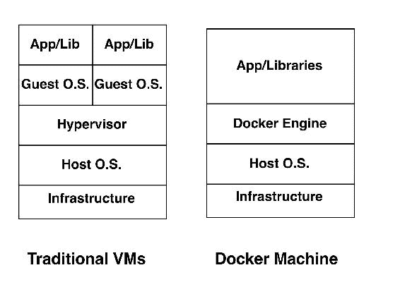

# 关于 Docker 与虚拟化的几个事实

有很多组织仍然在传统虚拟机上成功地工作。话虽如此，仍有一些组织已经将其应用移动到 Docker，或者准备这样做。以下是 Docker 比虚拟机更有潜力的几个原因：

*   在比较 Docker 和虚拟机时，Docker 的系统开销低于虚拟机。
*   其次，Docker 环境中的应用通常比虚拟机具有更高的性能。
*   而虚拟机软件技术名为**Hypervisor**，作为虚拟机环境和底层硬件之间的代理，提供了必要的抽象层；在 Docker 中，我们有 Docker 引擎，它比 Docker 机器提供更多的控制。
*   此外，如上图所示，Docker 在 Docker 环境中共享**主机 O.S.**，而虚拟机需要自己的操作系统来部署应用。与虚拟机相比，这使得 Docker 轻量级、加速并摧毁它们的速度更快。Docker 与在主机操作系统上运行的任何其他进程类似。
*   对于云本地应用，我们需要在每个开发阶段之后快速测试我们的微服务，Docker 将是测试我们的应用的一个很好的平台选项，这是强烈推荐的。

# Docker 引擎-Docker 的主干

Docker Engine 是具有以下组件的客户端服务器应用：

*   **Docker**：这是一个守护进程，在主机操作系统的后台持续运行，以跟踪 Docker 容器属性，如状态（启动/运行/停止）
*   **Rest API**：提供与守护进程交互并对容器执行操作的接口
*   **Docker 命令行**：提供创建和管理 Docker 对象的命令行界面，如图像、容器、网络、卷等

# 设置 Docker 环境

在本节中，我们将了解 Docker 在不同操作系统（如 Debian 和 Windows 等）上的安装过程。

# 在 Ubuntu 上安装 Docker

设置 Docker 非常简单。市场上主要有两个版本的 Docker。

拥有**集装箱化**Docker 产品的 Docker Inc.将 Docker**商业支持的**（**CS**版更名为 Docker**企业版**（**EE**），并将 Docker 引擎转换为 Docker**社区版**（**CE**）。

EE 和 CE 有几个变化；显然，商业支持就是其中之一。然而，在 Docker 企业版中，他们已经围绕容器内容、平台插件以及更多内容构建了一些认证。

在本书中，我们将使用 Docker 社区版，因此我们将首先更新 APT 存储库：

```py
$ apt-get update -y 

```

现在，让我们添加 Docker 官方系统中的 GPG 密钥，如下所示：

```py
$ sudo apt-key adv --keyserver hkp://p80.pool.sks-keyservers.net:80 --recv-keys 58118E89F3A912897C070ADBF76221572C52609D 

```

然后，让我们将 Docker 存储库添加到 Ubuntu 的 APT 源代码列表中：

```py
$ sudo apt-add-repository 'deb https://apt.dockerproject.org/repo ubuntu-xenial main' 

```

Sometimes, in Ubuntu 14.04/16.04, the `apt-add-repository` utility is not found. In order to install the mentioned utility, use the following command to install the `software-properties-common` package: **$ sudo apt-get install software-properties-common -y**.

接下来，更新 APT package manager 以下载最新的 Docker 列表，如下所示：

```py
$ apt-get update -y

```

If you want to download and install the Docker Engine from the Docker repository instead of the default 14.04 repository, use the following command to do so:
**$ apt-cache policy docker-engine**.

您将在终端上看到以下输出：

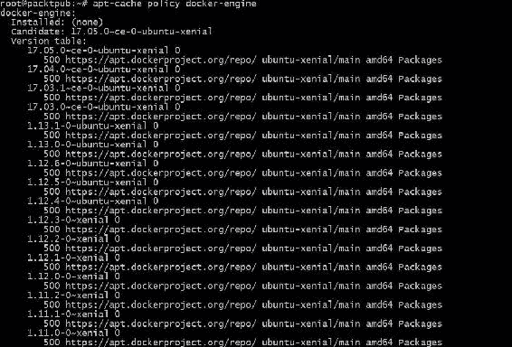

现在，我们已经准备好安装 Docker 引擎，因此让我们启动以下命令来安装它：

```py
$ sudo apt-get install -y docker-engine -y 

```

由于 Docker 依赖于几个系统库，因此可能会遇到与以下屏幕截图中所示类似的错误：


如果捕捉到此类错误，请确保已将这些库与已定义的版本一起安装。

Docker 引擎安装成功后，是时候执行以下命令对其进行验证了：

```py
$ docker -v   
Docker version 17.05.0-ce, build 89658be 

```

如果您看到的版本与前面终端中显示的版本相似，那么我们就可以开始了。

要获取 Docker 的帮助，可以执行以下命令：

```py
$ docker help 

```

If you really want to go with the Docker Enterprise Edition, you can go ahead with the installation steps shown on the official Docker website ([https://docs.docker.com/engine/installation/linux/ubuntu/](https://docs.docker.com/engine/installation/linux/ubuntu/)).

# 在 Windows 上安装

理想情况下，Windows 不适合 Docker，这就是为什么在 Windows 系统上看不到容器技术的原因。话虽如此，我们有几个变通办法。其中一个正在用巧克力。

要使用 Chocolate 在 Windows 系统上安装 Docker，请执行以下步骤：

1.  从他们的官方网站（[上安装巧克力 https://chocolatey.org/install](https://chocolatey.org/install) ）。

在前面的链接中有两种安装巧克力的方法。

2.  安装 Chocolate 后，只需在 cmd 或 PowerShell 中执行以下命令：

```py
 $ choco install docker

```

这将在 Windows 7 和 8 操作系统上安装 Docker。

同样，如果要使用 Docker Enterprise edition，可以按照此链接中显示的步骤操作：

[https://docs.docker.com/docker-ee-for-windows/install/#install-docker ee](https://docs.docker.com/docker-ee-for-windows/install/#install-docker-ee)。

# 建立 Docker Swarm

Docker Swarm 是 Docker 机器池的流行术语。Docker Swarm 对于托管您的网站非常有用，因为它可以用于快速扩展您的基础设施。

在 Docker Swarm 中，我们可以将两台 Docker 机器组合在一起，作为一个单元工作并共享它们的资源，如 CPU、内存等，其中一台机器成为我们称之为 leader 的主机，其余节点作为 worker 工作。


# 设置 Docker 环境

在本节中，我们将通过从 Docker 机器中选择 leader 并将其余机器与 leader 连接来设置 Docker Swarm。

# 假定

以下是 Docker 环境的一些假设：

*   我们将使用两台机器，它们可能是云平台上的 VM 或实例，用于名为 master 和 node1 的演示目的。此外，我们已经按照 Docker 安装部分中描述的步骤在两台机器上安装了 Docker。
*   主节点和节点 1 之间的通信必须打开端口`2377`。
*   确保应打开应用访问所需的端口；对于 nginx，我们需要端口`80`，就像我们的示例中一样。
*   主 Docker 机器可以基于任何类型的操作系统，如 Ubuntu、Windows 等。

现在，让我们从 Docker Swarm 设置开始。

# 初始化 Docker 管理器

此时，我们需要决定哪个节点应该是领导者。让我们选择主节点作为 Docker 管理器。因此，登录到主机器并执行以下命令，将此机器初始化为 Docker Swarm 的领导者：

```py
$ docker swarm init --advertise-addr master_ip_address 

```

此命令将提供的主机设置为主（先导），并为节点生成要连接的令牌。请参阅以下输出以供参考：


需要记住的几个要点：

*   不要与任何人共享您的令牌和 IP 地址
*   其次，在故障切换的情况下，有可能有多个主设备

# 将节点 1 添加到主节点

既然我们选择了领导者，我们需要向集群添加一个新节点来完成设置。登录到 node1 并执行以下命令，该命令在上一个命令输出中指定：

```py
$ docker swarm join     --token SWMTKN-1-
1le69e43paf0vxyvjdslxaluk1a1mvi5lb6ftvxdoldul6k3dl-
1dr9qdmbmni5hnn9y3oh1nfxp    master-ip-address:2377 

```

您可以参考以下屏幕截图获取输出：


这意味着我们的设置是成功的。让我们检查它是否添加到主 Docker 机器中。

执行以下命令对其进行验证：

```py
$ docker node ls 

```

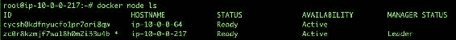

# 测试 Docker Swarm

现在我们已经建立了 Docker Swarm，是时候在它上面运行一些服务了，比如说 nginx 服务。在主 Docker 机器上执行以下命令，在端口`80`上启动 nginx 服务：

```py
$ docker service create  --detach=false -p 80:80 --name webserver
nginx 

```

上述命令的输出应类似于以下屏幕截图：


让我们使用以下 Docker 命令查看服务是否正在运行：

```py
$ docker service ps webserver 

```

前面命令的输出应类似于以下屏幕截图：


要验证的其他几个命令如下所示：

要验证哪些服务正在运行以及在哪个端口上运行，请使用以下命令：

```py
$ docker service ls 

```

如果您看到的输出类似于以下屏幕截图，那么我们很好：

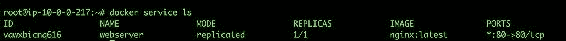

要放大服务的 Docker 实例，请使用以下命令：

```py
$ docker service scale webserver=3 

```


让我们通过访问 nginx 的默认页面来检查 nginx 是否已启动。尝试在浏览器上点击`http://master-ip-address:80/`。如果您看到以下输出，则您的服务已成功部署：

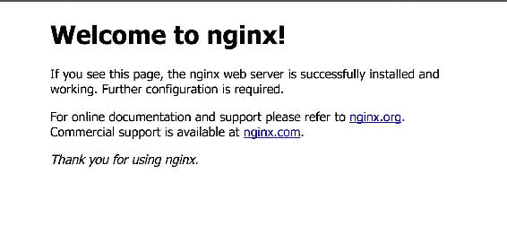

令人惊叹的在下一节中，我们将在 Docker 机器上部署我们的云原生应用。

# 在 Docker 上部署应用

在本节中，我们将部署我们在前几章中开发的云原生应用。但是，在开始创建应用体系结构之前，我们应该了解 Docker 的一些概念，其中一些概念如下：

*   **Docker 镜像**：这些基本上是库和部署在其上的应用的组合。这些图像可以从 Docker Hub 公共存储库下载，也可以创建自定义图像。
*   **Docker 文件**：这是一个用于构建映像的配置文件，可用于以后运行 Docker 机器。
*   **Docker Hub**：这是一个集中的存储库，您可以在其中保存图像，这些图像可以在整个团队中共享。

我们将在应用部署期间使用所有这些概念。此外，我们将继续使用 Docker Swarm 设置来部署我们的应用，因为我们不想耗尽资源。

我们将按照此体系结构部署应用，在单独的 Docker 实例中部署应用和 MongoDB（基本上是应用数据），因为建议始终将应用和数据分开：


# 构建和运行我们的 MongoDB Docker 服务

在本节中，我们将创建 Dockerfile 来构建`MongoDB`，它将包含所有信息，例如基本映像、要公开的端口、如何安装`MongoDB`服务等。

现在，让我们登录到您的 Docker master（leader）帐户，并使用以下内容创建一个名为`Dockerfile`的 Docker 文件：

```py
    # MongoDB Dockerfile 
    # Pull base image. 
    FROM ubuntu 
    MAINTAINER Manish Sethi<manish@sethis.in> 
    # Install MongoDB. 
    RUN \ 
    apt-key adv --keyserver hkp://keyserver.ubuntu.com:80 --recv 
    7F0CEB10 && \ 
    echo 'deb http://downloads-distro.mongodb.org/repo/ubuntu-upstart
    dist 10gen' > /etc/apt/sources.list.d/mongodb.list && \ 
    apt-get update && \ 
    apt-get install -y mongodb-org && \ 
    rm -rf /var/lib/apt/lists/* 

    # Define mountable directories. 
    VOLUME ["/data/db"] 

    # Define working directory. 
    WORKDIR /data 

    # Define default command. 
    CMD ["mongod"] 

    # Expose ports. 
    EXPOSE 27017 
    EXPOSE 28017 

```

保存它，在我们继续之前，让我们了解它的不同部分，如下所示：

```py
    # Pull base image. 
    FROM ubuntu 

```

前面的代码将告诉您从 Docker Hub 中提取 Ubuntu 公共映像，并使其成为需要运行以下命令的基础映像：

```py
    # Install MongoDB 
    RUN \ 
    apt-key adv --keyserver hkp://keyserver.ubuntu.com:80 --recv 
    7F0CEB10 && \ 
    echo 'deb http://downloads-distro.mongodb.org/repo/ubuntu-upstart 
    dist 10gen' > /etc/apt/sources.list.d/mongodb.list && \ 
    apt-get update && \ 
    apt-get install -y mongodb-org && \ 
    rm -rf /var/lib/apt/lists/*

```

前面的代码部分类似于我们为`MongoDB`手动执行这些命令的代码部分；但是，在这种情况下，它会自动由 Docker 处理。

接下来是 volume 部分，它是可选的。它正在创建可装载目录，我们可以在其中存储数据，以确保数据在外部卷中的安全。

```py
    # Define mountable directories. 
    VOLUME ["/data/db"] 

```

下一节将公开用户/客户端与 MongoDB 服务器通信的端口：

```py
    EXPOSE 27017 
    EXPOSE 28017 

```

保存文件后，执行以下命令以生成图像：

```py
$ docker build --tag mongodb:ms-packtpub-mongodb

```

Building an image can take around 4-5 minutes, depending on the internet bandwidth and system performance.

以下屏幕显示 Docker build 命令的输出：


在前面的屏幕截图中，当它显示成功构建时，您现在可以看到要验证的图像列表，无论是否存在具有所述标记名（**ms packtpub mongodb**的图像。

使用以下命令列出图像：

```py
$ docker images

```

以下屏幕列出了可用的 Docker 图像：

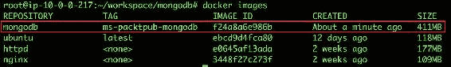

令人惊叹的我们的形象是存在的。现在，让我们使用以下命令在主 Docker 机器上运行`mongodb`服务：

```py
$ docker run -d -p 27017:27017 -p 28017:28017 --name mongodb mongodb:ms-packtpub-mongodb mongod --rest --httpinterface

```

在输出中，您将获得一个随机 Docker ID，如以下屏幕截图所示：


让我们通过执行`docker ps`命令来检查 Docker 容器的状态。其输出应类似于以下屏幕截图：


很少有开发人员和系统管理员知道`mongoDB`服务有一个 HTTP 接口，我们使用端口`28017`公开了该接口。

因此，如果我们尝试在浏览器中访问`http://your-master-ip-address:28017/`，我们将看到一个类似于以下屏幕截图的屏幕：

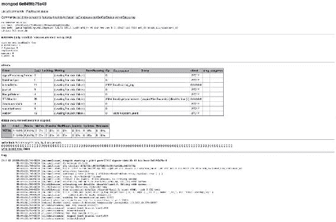

令人惊叹的我们的 MongoDB 现在已经启动并运行！！

在为应用启动容器之前，让我们先了解 Docker Hub 对我们有何用处。

# Docker Hub-它是关于什么的？

根据 Docker Hub 官方文档，Docker Hub 是一种基于云的注册服务，允许您链接到代码存储库、构建图像并测试它们、存储手动推送的图像以及指向 Docker cloud 的链接，以便将图像部署到主机。

简单地说，Docker Hub 是一个图像的集中存储，全球任何人都可以访问这些图像，前提是他们拥有所需的权限，并且可以围绕图像执行操作，以便在其主机上部署和运行其应用。

Docker Hub 的优势如下：

*   Docker Hub 提供了在报告源代码存储库中的任何更改时自动创建构建的功能
*   它提供 WebHook，在成功推送到存储库后触发应用部署
*   它提供了创建用于存储图像的专用工作空间的功能，并且只能在您的组织或团队中访问
*   Docker Hub 与您的版本控制系统集成，如 GitHub、BitBucket 等，这对于持续集成和交付非常有用

现在，让我们看看如何将自定义的`MongoDB`图像推送到我们最近创建的私有存储库中。

首先，您需要在[创建一个账户 https://hub.docker.com](https://hub.docker.com) 并激活它。登录后，您需要根据自己的偏好创建一个私有/公共存储库，如以下屏幕截图所示：


单击“创建”按钮以设置存储库，您将被重定向到以下屏幕：

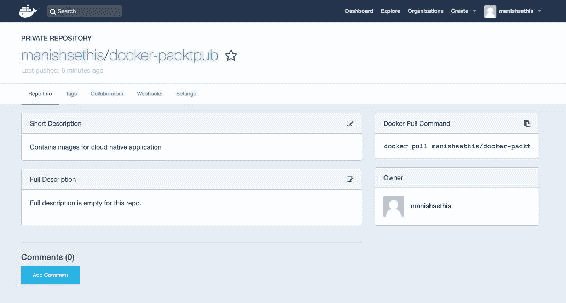

Docker Hub provides only one private repository on a free account.

现在我们已经创建了存储库，让我们回到主 Docker 机器并执行以下命令：

```py
$ docker login

```

这将要求您提供 Docker Hub 帐户的凭据，如以下屏幕截图所示：

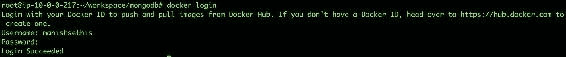

登录成功后，使用以下命令标记要推送到存储库的图像：

```py
$ docker tag mongodb:ms-packtpub-mongodb manishsethis/docker-packtpub

```

If we don't specify the tag, then it will take the latest tag by default.

创建标记后，就可以将标记推送到存储库中。使用以下命令执行此操作：

```py
$ docker push manishsethis/docker-packtpub

```

以下屏幕显示 Docker`push`命令输出：


推送完成后，您将在 Tags 选项卡的 Docker Hub 中看到图像，如下所示：


这意味着您的映像已成功推送。

要拉取此图像，只需使用以下命令：

```py
$ docker pull manishsethis/docker-packtpub

```

哦，哇！它太简单了，只要你有凭证，你就可以从任何地方访问它。

还有其他 Docker 注册表提供程序，如 AWS（EC2 容器注册表）、Azure（Azure 容器注册表）等。

现在，这是我们从 Docker Hub 方面得到的全部。在本章中，我们将继续使用 Docker Hub 来推送图像。

现在，我们已经准备好将我们的云原生应用部署到另一个容器中，但是在此之前，我们需要使用 Dockerfile 为它构建一个映像。因此，让我们创建一个名为`app`的目录，并创建一个包含以下内容的空 Dockerfile：

```py
 FROM ubuntu:14.04 
    MAINTAINER Manish Sethi<manish@sethis.in> 

    # no tty 
    ENV DEBIAN_FRONTEND noninteractive 

    # get up to date 
    RUN apt-get -qq update --fix-missing 

    # Bootstrap the image so that it includes all of our dependencies 
    RUN apt-get -qq install python3  python-dev python-virtualenv
 python3-pip --assume-yes 
    RUN sudo apt-get install build-essential autoconf libtool libssl-
 dev libffi-dev --assume-yes 
 # Setup locale 
    RUN export LC_ALL=en_US.UTF-8 
    RUN export LANG=en_US.UTF-8 
    RUN export LANGUAGE=en_US.UTF-8 

    # copy the contents of the cloud-native-app(i.e. complete
 application) folder into the container at build time 
 COPY cloud-native-app/ /app/ 

    # Create Virtual environment 
    RUN mkdir -p /venv/ 
    RUN virtualenv /venv/ --python=python3 

    # Python dependencies inside the virtualenv 
    RUN /venv/bin/pip3 install -r /app/requirements.txt 

    # expose a port for the flask development server 
    EXPOSE 5000 

    # Running our flask application  
    CMD cd /app/ && /venv/bin/python app.py 

```

我相信我在前面已经解释了 Dockerfile 中的大部分部分，尽管还有一些部分需要解释。

```py
  COPY cloud-native-app/ /app/ 

```

在 Dockerfile 的前一部分中，我们将应用的内容（即代码）从本地计算机复制到 Docker 容器。或者，我们也可以使用 ADD 执行相同的操作。

`CMD`是我们希望在 Docker 容器内执行的命令的缩写，在 Dockerfile 中定义如下：

```py
# Running our flask application  
CMD cd /app/ && /venv/bin/python app.py 

```

现在，保存文件并运行以下命令以生成图像：

```py
$ docker build --tag cloud-native-app:latest .

```

这可能需要一段时间，因为还有很多库需要安装和编译。最好在每次更改后构建一个映像，以确保使用当前配置更新映像。输出将类似于此处所示的输出：


确保构建过程的每个部分都是成功的。

现在我们已经准备好了我们的图像，是时候用最新的图像旋转我们的容器了。

执行以下命令旋转容器，并始终记住公开端口`5000`以访问我们的应用：

```py
$ docker run -d -p 5000:5000  --name=myapp  cloud-native-app:latest

```

现在，运行`docker ps`命令检查容器状态：

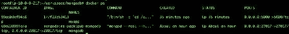

正如您所看到的，`myapp`容器中运行着两个容器：我们将运行我们的应用，而在`mongodb`容器中，您将运行您的`mongodb`服务。

接下来，检查应用 URL（`http://your-master-ip-address:5000/`。如果您看到以下屏幕，这意味着我们的应用已成功部署，并且我们在 Docker 上处于活动状态：


现在我们可以通过创建新用户并登录，然后发布推文来测试我们的应用。我不会再这样做了，因为我们在创建应用时已经这样做了。

根据经验，我知道应用和数据库（即 MongoDB）之间的通信可能会遇到一些挑战，因为应用和数据库都位于不同的容器中，并且可能位于不同的网络中。为了处理此类问题，您可以创建一个网络并将两个容器连接到该网络。

例如，如果我们的集装箱（`myapp`和`mongodb`必须这样做，我们将遵循以下步骤：

1.  使用以下命令创建单独的网络：

```py
      $ docker network create -d bridge --subnet 172.25.0.0/16
      mynetwork

```

2.  现在我们的网络已经创建，我们可以使用以下命令将两个容器添加到此网络：

```py
      $ docker network connect mynetwork  myapp
      $ docker network connect mynetwork  mongodb

```

3.  为了找到分配给这些容器的 IP，我们可以使用以下命令：

```py
      $ docker inspect --format '{{ .NetworkSettings.IPAddress }}'
      $(docker ps -q)

```

This network creation is an alternative way to set up the communication between application and database.

好的，我们已经在 Docker 上部署了我们的应用，并学习了它的不同概念。剩下的唯一概念是 Docker Compose。让我们了解它是什么，它与其他的有多不同。

# Docker Compose

根据 Docker Compose 官方网站（[https://docs.docker.com/compose/overview/](https://docs.docker.com/compose/overview/) ），Compose 是定义和运行多容器 Docker 应用的工具。使用 Compose，您可以使用 Compose 文件来配置应用的服务。

简单地说，它帮助我们以更简单、更快的方式构建和运行应用。

在上一节中，我们部署应用并构建映像时，首先创建了 Dockerfile，然后执行`Docker build`命令来构建它。一旦构建完成，我们通常使用`docker run`命令启动容器，但是，在 Docker Compose 中，我们将定义一个`.yml`文件，其中包含配置细节，例如端口、要执行的命令等。

首先，Docker Compose 是 Docker Engine 的一个独立实用程序，可根据您正在使用的操作系统类型，使用以下链接安装：

`https://docs.docker.com/compose/install/`。

一旦您安装了它，让我们看看如何使用 Docker Compose 来运行容器。假设我们必须使用 Docker Compose 运行云原生应用容器。我们已经为它生成了 Dockerfile，并且应用也位于相同的位置（路径）。

接下来，使用以下内容，我们需要在 Dockerfile 所在的相同位置创建一个`Docker-compose.yml`文件：

```py
    #Compose.yml 
    version: '2' 
    services: 
    web: 
     build: . 
      ports: 
      - "5000:5000" 
      volumes: 
       - /app/ 
     flask: 
      image: "cloud-native-app:latest" 

```

在`docker-compose.yml`中添加配置后，保存并执行`docker-compose up`命令。构建图像后，我们将看到以下输出：

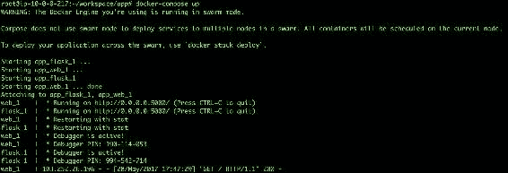

此外，如果您看到容器的状态，您会发现多个容器（在我们的例子中，`app_web-1`和`app_flask_1`按组合旋转，这就是为什么它对需要大规模基础设施的多容器应用有用的原因，因为它创建了一个类似 Docker Swarm 的 Docker 机器集群。以下屏幕显示 Docker 机器的状态：


令人惊叹的我们还通过 Docker compose 部署了我们的应用。现在您可以尝试访问应用的公共 URL（[http://your-ip-address:5000](http://your-ip-address:5000) 确认应用部署成功。

最后，确保将图像推送到 Docker Hub，以将其保存在集中的存储库中。因为我们已经推送了 MongoDB 镜像，所以也可以使用下面的命令推送`cloud-native-app`镜像：

```py
$ docker tag cloud-native-app:latest manishsethis/docker-packtpub:cloud-native-app
$ docker push manishsethis/docker-packtpub:cloud-native-app

```

我们应该看到，Docker`push`命令的类似输出，如图所示：


# 总结

在本章中，我们首先研究了最有趣的技术之一——Docker，它基于容器。我们研究了 Docker 的不同概念，我们已经部署了我们的应用，并研究了通过 Docker 管理应用的方法。我们还探索了使用 Docker Compose 和 Dockerfile 部署应用的多种方法。

在接下来的章节中，事情将变得更加有趣，因为我们最终将进入一个阶段，在这个阶段中，我们将接触到云平台，基于我们的应用在平台上构建我们的基础设施，并尝试部署它。所以，请继续关注下一章！再见。