# 十一、在 AWS 平台上部署

在上一章中，我们看到了应用的一个平台，称为 Docker。它可以隔离您的应用，并可用于响应客户的应用请求。在本章中，我们将向您介绍云平台，特别是 AWS（亚马逊云服务），主要处理 IaaS（基础设施）和**PaaS**（**平台即服务**服务。我们还将研究如何构建基础设施和部署应用。

本章包括以下主题：

*   介绍 AWS 及其服务
*   使用 Terraform/CloudFormation 构建应用基础架构
*   使用 Jenkins**连续部署**

# 开始使用 Amazon Web 服务（AWS）

**亚马逊网络服务****AWS**是一个安全的云平台。它在 IaaS 和 PaaS 中提供了各种产品，包括计算能力、数据库存储和内容交付，这有助于扩展应用，并在全球范围内发展我们的业务。AWS 是一种公共云，根据云计算概念，它以按需交付的方式提供其所有资源，并提供现收现付计划。

有关 AWS 及其服务的更多信息，请访问[https://aws.amazon.com/](https://aws.amazon.com/) 。

正如前面在[第 1 章](01.html#LTSU0-4022ecb0f8ea4b719ffb742bf2a6a072)*介绍云原生架构和微服务*中所述，您需要创建一个 AWS 账户才能开始使用这些服务。您可以使用以下链接创建帐户：

[https://medium.com/appliedcode/setup-aws-account-1727ce89353e](https://medium.com/appliedcode/setup-aws-account-1727ce89353e)

登录后，您将看到以下屏幕，其中显示 AWS 及其类别。一些服务处于测试阶段。我们将使用与**计算**和**联网**相关的一些服务为我们的应用构建基础设施：

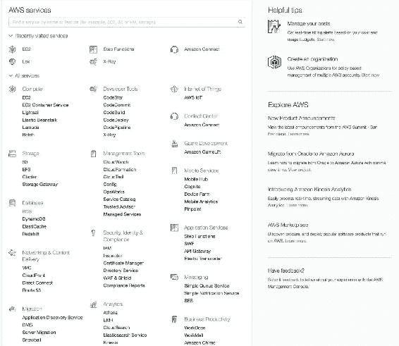

应用中常用的一些 AWS 服务如下：

*   **EC2（弹性计算云）**：这是 AWS 提供的计算产品，简而言之，它提供了一个服务器。
*   **ECS（弹性容器服务）**：类似于公共云上的 Docker 服务，即亚马逊。它只在 EC2 机器上管理 Docker。与在本地创建 Docker 集群不同，您可以在几分钟内轻松地在 Amazon 云中建立它，并且开销更少。
*   **EBS（Elasticbeanstalk）**：这是一款 PaaS 产品，您只需上传代码，并指定需要多少基础设施（基本上是 app server（EC2））。EBS 将负责创建机器，并在机器上部署代码。
*   **S3（简单存储服务）**：这是 AWS 提供的存储服务，我们通常保存我们的应用数据或静态内容，可用于静态网站托管。我们将使用它进行连续部署。
*   **冰川**：这是另一种存储服务，主要用于备份，成本较低，与 S3 相比数据存储和检索速度较慢。
*   **VPC（虚拟专用网络）**：这是一种网络服务，让您可以控制资源的可访问性。我们将使用这项服务来保持我们的基础设施。此服务对于保护我们的应用服务和数据库服务非常有用，并且只向外部世界公开所需的选择性资源。
*   **CloudFront**：这是一项内容交付服务，它将您的内容分发到全球各地的 S3 中，并确保无论请求源位于何处，都可以快速检索。
*   **CloudFormation**：这为开发人员和系统管理员提供了一种简单的方法来创建和管理相关 AWS 资源的集合，例如资源调配，并以代码的形式对其进行更新。我们将使用这项服务来构建我们的基础设施。
*   **CloudWatch**：此服务跟踪您资源的活动。它还以日志的形式跟踪 AWS 帐户上的任何活动，这有助于识别任何可疑活动或帐户泄露。
*   **IAM（身份和访问管理）**：顾名思义，这项服务非常有助于管理 AWS 帐户上的用户，并根据用户的使用情况和需求为用户提供角色/权限。
*   **路由 53**：这是一项高可用、可扩展的云 DNS 云服务。我们可以将我们的域名从任何其他注册商（如 GoDaddy）和其他注册商迁移到 Route 53，或者购买域名 AWS。

AWS 还提供了许多本章无法涵盖的服务。如果您感兴趣并想探索其他服务，您可以浏览 AWS 产品列表（[https://aws.amazon.com/products/](https://aws.amazon.com/products/) ）。

我们将使用上述大多数 AWS 服务。让我们首先根据应用在 AWS 上构建基础设施。

# 在 AWS 上构建应用基础架构

在我们的应用的这个阶段，系统架构师或 DevOps 人员会参与进来，并提出不同的基础设施计划，这些计划足够安全和高效，能够处理应用请求，并且具有成本效益。

就我们的应用而言，我们将构建与下图所示相同的基础设施：

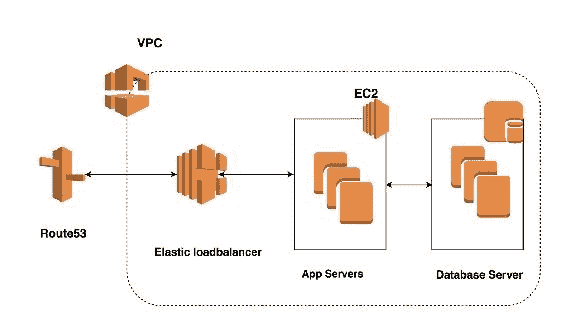

我们将遵循前面的应用架构图，其中包括一些 AWS 服务，如 EC2、VPC、Route 53 等。

您可以通过三种不同的方式在 AWS 云上调配资源，如下所示：

*   **管理控制台**：这是我们已经登录的用户界面，可以用来启动云上资源。（请查看此链接以供参考：[https://console.aws.amazon.com/console/](https://console.aws.amazon.com/console/home?region=us-east-1)
*   **编程**：我们可以使用 Python、Ruby 等多种编程语言来创建资源，AWS 已经为这些资源创建了不同的开发工具，如 Codecom。此外，您还可以使用 SDK 根据首选语言创建资源。您可以查看[https://aws.amazon.com/tools/](https://aws.amazon.com/tools/) 了解更多信息。
*   **AWS CLI（命令行界面）**：它是在 Python SDK 之上构建的开源工具，提供与 AWS 资源交互的命令。您可以在以下位置查看链接：[http://docs.aws.amazon.com/cli/latest/userguide/cli-chap-welcome.html](http://docs.aws.amazon.com/cli/latest/userguide/cli-chap-welcome.html) 了解其工作原理，以及在您的系统上设置此功能的步骤。

创建资源非常简单和直接，因此我们将不讨论这一点，但您可以查看 AWS 文档（[https://aws.amazon.com/documentation/](https://aws.amazon.com/documentation/) ）这样做。

我将向您展示如何使用 Terraform 和一个名为 CloudFormation 的基于 AWS 的服务构建基础设施。

# 生成身份验证密钥

身份验证是任何产品或平台的一项重要功能，用于检查试图访问产品并对其执行操作的用户的真实性，并确保系统安全。因为这里我们将使用 API 访问 AWS 帐户，所以我们需要授权密钥来验证我们的请求。现在，一个重要的 AWS 服务进入图片**IAM**（**身份和访问管理**）。

在 IAM 中，我们定义用户并生成访问/密钥，还根据我们希望使用它访问的资源分配角色。

It is highly recommended NEVER to generate access/secrets keys as the root user, because it will have, by default, full access over your account.

以下是创建用户和生成访问/密钥的步骤：

1.  转到[https://console.aws.amazon.com/iam/home?region=us-east-1#/home](https://console.aws.amazon.com/iam/home?region=us-east-1#/home)；您将看到以下屏幕：

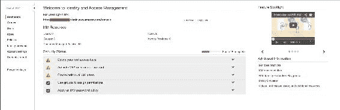

2.  现在，单击左窗格中的第三个选项“命名用户”。如果您的帐户是新的，您将看不到任何用户。现在，让我们创建一个新用户——为此，请单击右窗格中的“添加用户”按钮：


3.  单击“添加用户”按钮后，将加载一个新页面，并要求输入用户名和您希望用户访问帐户的方式。如果您打算使用此用户，例如`manish`，仅用于编程目的，在这种情况下，我建议您取消选中 AWS 管理控制台访问框，以便用户不需要使用 AWS 管理控制台登录。检查以下屏幕截图以供参考：

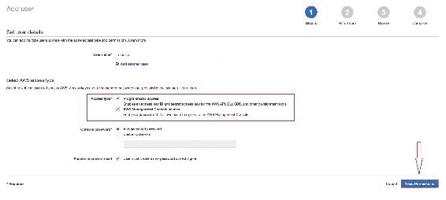

4.  完成后，单击屏幕右下角的“下一步：权限”按钮。接下来，您需要选择要授予此用户的权限，我们称之为 IAM 策略。这意味着现在，用户应该能够根据定义的策略访问资源，以及用户在资源上允许的操作类型。现在，我们将超级用户访问策略添加到此用户。
5.  在内部，超级用户访问将有一个 JSON 格式的策略，如下所示：

```py
     { 
       "Version": "2012-10-17", 
       "Statement": [ 
            { 
              "Effect": "Allow", 
              "NotAction": [ 
                "iam:*", 
                "organizations:*" 
              ], 
              "Resource": "*" 
            }, 
            { 
              "Effect": "Allow", 
                "Action": "organizations:DescribeOrganization", 
                "Resource": "*" 
            } 
          ] 
      } 

```

有关 IAM 政策的更多信息，请阅读以下链接中的文档：[http://docs.aws.amazon.com/IAM/latest/UserGuide/access_policies.html](http://docs.aws.amazon.com/IAM/latest/UserGuide/access_policies.html)

Readers who have been using Microsoft Active Directory can integrate AD with IAM easily using the AD connector. For more info, read the article given at this link: [https://aws.amazon.com/blogs/security/how-to-connect-your-on-premises-active-directory-to-aws-using-ad-connector/](https://aws.amazon.com/blogs/security/how-to-connect-your-on-premises-active-directory-to-aws-using-ad-connector/)

考虑下面的截图：

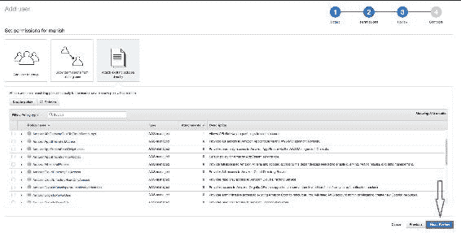

1.  将策略添加到用户后，单击屏幕右下角的“下一步：查看”按钮向前移动。
2.  下一个屏幕将要求您查看它，确定后，您可以单击“创建用户”按钮创建用户：


3.  单击“创建用户”按钮后，将创建用户，并将策略附加到该用户。现在，您将看到以下屏幕，该屏幕自动生成了访问密钥和密钥，您需要确保安全，并且永远不会与任何人共享：


4.  现在，我们的访问/密钥已经生成，是时候在 AWS 上构建我们的应用基础架构了。我们将使用以下工具进行此操作：

*   **Terraform**：这是一个开源工具，用于在不同的云平台上构建基础设施
*   **云信息**：这些是使用 AWS 资源构建应用基础设施的 AWS 服务

# Terraform—一种以代码形式构建基础设施的工具

Terraform 是一种用于在不同云平台（如 AWS、Azure 等）上构建、管理和版本控制基础设施的工具。它可以管理基础架构的底层组件，如计算、存储、网络等。

在 Terraform 中，我们指定了描述应用基础结构的资源规范的配置文件。Terraform 描述了执行计划和要达到的期望状态。然后，它开始按照规范构建资源，并在构建后跟踪基础设施的当前状态，如果配置发生更改，则始终执行增量执行。

以下是 Terraform 的一些特征：

*   Terraform 将您的数据中心描述到一个蓝图上，该蓝图可以进行版本控制，也可以进行代码管理。
*   Terraform 在实际实施之前为您提供执行计划，这有助于您将执行计划与所需结果相匹配。
*   Terraform 帮助您构建所有资源，并使资源创建并行化。它使您能够深入了解对资源的依赖关系，并确保在创建资源之前满足这些依赖关系。
*   凭借其 insight 功能，它可以让开发人员在更少人为错误的情况下，对基础架构上要执行的修订进行更多的控制。

在 Terraform，我们考虑 AWS 中的每一项服务都需要创建的资源，因此我们需要为其创建其强制属性。现在，让我们从创建资源开始：

1.  首先，我们需要创建**VPC**（**虚拟私有云**，我们将在其中启动所有其他资源。

Note: We will need to create all the files with the `.tf` file extension as per convention.

2.  那么，让我们创建一个空的`main.tf`文件。添加以下代码，该代码将设置用于身份验证的服务提供商的访问权限和密钥：

```py
    # Specify the provider and access details 
        provider "aws" { 
          region = "${var.aws_region}" 
          access_key = "${var.aws_access_key}" 
          secret_key = "${var.aws_secret_key}" 
     } 

```

3.  正如您在前面的代码中所看到的，有一个类似于`${var.aws_region}`的值。实际上，将所有值保存在一个名为`variables.tf`的单独文件中是一种惯例，所以我们在这里这样做。让我们用以下内容更改`variables.tf`文件：

```py
     variable "aws_access_key" { 
          description = "AWS access key" 
          default = ""                    # Access key 
      } 

     variable "aws_secret_key" { 
         description = "AWS secret access key" 
         default = ""                          # Secret key 
      } 

      variable "aws_region" { 
          description = "AWS region to launch servers." 
          default = "us-east-1" 
      } 

```

4.  接下来我们需要创建 VPC 资源，我们将此代码添加到`main.tf`中：

```py
      # Create a VPC to launch our instances into 
        resource "aws_vpc" "default" { 
          cidr_block = "${var.vpc_cidr}" 
          enable_dns_hostnames = true 
          tags { 
            Name = "ms-cloud-native-app" 
          } 
      } 

```

5.  我们使用了一个变量，需要在`variables.tf`中定义如下：

```py
       variable "vpc_cidr"{ 
          default = "10.127.0.0/16"             # user defined 
       } 

```

6.  定义 VPC 资源后，我们需要创建一个子网，该子网将与 EC2 机器、弹性负载平衡器或其他资源关联。因此，在`main.tf`中增加以下代码：

```py
        # Create a subnet to launch our instances into 
        resource "aws_subnet" "default" { 
          vpc_id                  = "${aws_vpc.default.id}" 
          cidr_block              = "${var.subnet_cidr}" 
          map_public_ip_on_launch = true 
        } 

      Now, define the variable we have used in above code in 
      variables.tf 
      variable "subnet_cidr"{ 
       default = "10.127.0.0/24" 
      } 

```

7.  因为我们希望我们的资源可以从 internet 访问，所以我们需要创建一个 internet 网关，并将其与我们的子网相关联，以便在其中创建的资源可以通过 internet 访问。

Note: We can create multiple subnets to secure the network of our resources.

8.  将此代码添加到`main.tf`：

```py
     # Create an internet gateway to give our subnet access to the
     outside world 
     resource "aws_internet_gateway" "default" { 
     vpc_id = "${aws_vpc.default.id}" 
      } 

     # Grant the VPC internet access on its main route table 
     resource "aws_route" "internet_access" { 
     route_table_id         = "${aws_vpc.default.main_route_table_id}" 
     destination_cidr_block = "0.0.0.0/0" 
     gateway_id             = "${aws_internet_gateway.default.id}" 

```

9.  接下来，我们需要确保您将要启动 EC2 机器的子网向这些机器提供公共地址。这可以通过在您的`main.tf`旁边添加代码来实现：

```py
     # Create a subnet to launch our instances into 
     resource "aws_subnet" "default" { 
       vpc_id                  = "${aws_vpc.default.id}" 
       cidr_block              = "${var.subnet_cidr}" 
       map_public_ip_on_launch = true 
     } 

```

10.  配置好之后，就可以开始创建应用服务器和 MongoDB 服务器了。
11.  最初，我们需要创建依赖资源，如安全组，没有安全组，EC2 无法启动。
12.  将以下代码添加到`main.tf`以创建安全组资源：

```py
    # the instances over SSH and HTTP 
    resource "aws_security_group" "default" { 
    name        = "cna-sg-ec2" 
    description = "Security group of app servers" 
    vpc_id      = "${aws_vpc.default.id}" 

    # SSH access from anywhere 
    ingress { 
     from_port   = 22 
     to_port     = 22 
     protocol    = "tcp" 
     cidr_blocks = ["0.0.0.0/0"] 
    } 

    # HTTP access from the VPC 
    ingress { 
      from_port   = 5000 
      to_port     = 5000 
      protocol    = "tcp" 
      cidr_blocks = ["${var.vpc_cidr}"] 
     } 

     # outbound internet access 
     egress { 
      from_port   = 0 
      to_port     = 0 
      protocol    = "-1" 
      cidr_blocks = ["0.0.0.0/0"] 
    } 
   } 

```

13.  在这个安全组中，我们打开端口`22`和`5000`只是为了 ssh 和访问我们的应用。
14.  接下来，我们需要添加/创建 ssh 密钥对，您可以在本地计算机上生成并上传到 AWS，也可以从 AWS 控制台生成。在本例中，我使用`ssh-keygen`命令在本地机器上生成了一个 ssh 密钥。现在要在 AWS 中创建 ssh 密钥对资源，请将此代码添加到`main.tf`：

```py
   resource "aws_key_pair" "auth" { 
     key_name   = "${var.key_name}" 
      public_key = "${file(var.public_key_path)}" 
   }   

```

15.  在`variables.tf`中添加以下代码段，为变量提供参数：

```py
    variable "public_key_path" { 
      default = "ms-cna.pub" 
    } 

```

16.  现在我们已经创建了依赖资源，现在是创建应用服务器（即 EC2 机器）的时候了。因此，在`main.tf`中添加以下代码段：

```py
    resource "aws_instance" "web" { 
     # The connection block tells our provisioner how to 
     # communicate with the resource (instance) 
      connection { 
       # The default username for our AMI 
        user = "ubuntu" 
        key_file = "${var.key_file_path}" 
        timeout = "5m" 
      } 
     # Tags for machine 
     tags {Name = "cna-web"} 
     instance_type = "t2.micro" 
     # Number of EC2 to spin up 
      count = "1" 
      ami = "${lookup(var.aws_amis, var.aws_region)}" 
      iam_instance_profile = "CodeDeploy-Instance-Role" 
      # The name of our SSH keypair we created above. 
      key_name = "${aws_key_pair.auth.id}" 

     # Our Security group to allow HTTP and SSH access 
     vpc_security_group_ids = ["${aws_security_group.default.id}"] 
     subnet_id = "${aws_subnet.default.id}" 
    } 

```

17.  我们在 EC2 配置中也使用了几个变量，因此我们需要在`variables.tf`文件中添加变量值：

```py
    variable "key_name" { 
      description = "Desired name of AWS key pair" 
      default = "ms-cna" 
    } 

   variable "key_file_path" { 
      description = "Private Key Location" 
      default = "~/.ssh/ms-cna" 
   } 

    # Ubuntu Precise 12.04 LTS (x64) 
     variable "aws_amis" { 
       default = { 
        eu-west-1 = "ami-b1cf19c6" 
        us-east-1 = "ami-0a92db1d" 
        #us-east-1 = "ami-e881c6ff" 
        us-west-1 = "ami-3f75767a" 
        us-west-2 = "ami-21f78e11" 
     } 
   } 

```

伟大的现在，我们的应用服务器资源配置就绪。现在，我们已经添加了 AppServer 配置，接下来，我们需要为 MongoDB 服务器添加一个类似的设置，这是保存数据所必需的。一旦两者就绪，我们将创建 ELB（这将是用户的应用访问点），然后将应用服务器连接到 ELB。

让我们继续添加 MongoDB 服务器的配置。

# 配置 MongoDB 服务器

在`main.tf`中添加以下代码，用于为 MongoDB 服务器创建安全组：

```py
    resource "aws_security_group" "mongodb" { 
     name        = "cna-sg-mongodb" 
     description = "Security group of mongodb server" 
     vpc_id      = "${aws_vpc.default.id}" 

    # SSH access from anywhere 
    ingress { 
      from_port   = 22 
      to_port     = 22 
      protocol    = "tcp" 
      cidr_blocks = ["0.0.0.0/0"] 
     } 

    # HTTP access from the VPC 
    ingress { 
      from_port   = 27017 
      to_port     = 27017 
      protocol    = "tcp" 
      cidr_blocks = ["${var.vpc_cidr}"] 
     } 
    # HTTP access from the VPC 
     ingress { 
      from_port   = 28017 
      to_port     = 28017 
      protocol    = "tcp" 
      cidr_blocks = ["${var.vpc_cidr}"] 
      } 

    # outbound internet access 
    egress { 
      from_port   = 0 
      to_port     = 0 
      protocol    = "-1" 
      cidr_blocks = ["0.0.0.0/0"] 
     } 
   } 

```

接下来，我们需要添加 MongoDB 服务器的配置。还要注意，在以下配置中，我们在创建 EC2 机器时为服务器提供 MongoDB 安装：

```py
    resource "aws_instance" "mongodb" { 
    # The connection block tells our provisioner how to 
    # communicate with the resource (instance) 
    connection { 
     # The default username for our AMI 
     user = "ubuntu" 
     private_key = "${file(var.key_file_path)}" 
     timeout = "5m" 
     # The connection will use the local SSH agent for authentication. 
     } 
    # Tags for machine 
    tags {Name = "cna-web-mongodb"} 
    instance_type = "t2.micro" 
    # Number of EC2 to spin up 
    count = "1" 
    # Lookup the correct AMI based on the region 
    # we specified 
    ami = "${lookup(var.aws_amis, var.aws_region)}" 
    iam_instance_profile = "CodeDeploy-Instance-Role" 
    # The name of our SSH keypair we created above. 
     key_name = "${aws_key_pair.auth.id}" 

     # Our Security group to allow HTTP and SSH access 
     vpc_security_group_ids = ["${aws_security_group.mongodb.id}"] 

     subnet_id = "${aws_subnet.default.id}" 
     provisioner "remote-exec" { 
      inline = [ 
        "sudo echo -ne '\n' | apt-key adv --keyserver 
         hkp://keyserver.ubuntu.com:80 --recv 7F0CEB10", 
       "echo 'deb http://repo.mongodb.org/apt/ubuntu trusty/mongodb- 
        org/3.2 multiverse' | sudo tee /etc/apt/sources.list.d/mongodb-
         org-3.2.list", 
       "sudo apt-get update -y && sudo apt-get install mongodb-org --
       force-yes -y", 
       ] 
     } 
   } 

```

最后一个仍然需要配置的资源是弹性负载平衡器，它将平衡客户请求以提供高可用性。

# 配置弹性负载平衡器

首先，我们需要为我们的 ELB 创建一个安全组资源，将此代码添加到`main.tf`：

```py
    # A security group for the ELB so it is accessible via the web 
     resource "aws_security_group" "elb" { 
     name        = "cna_sg_elb" 
     description = "Security_group_elb" 
     vpc_id      = "${aws_vpc.default.id}" 

    # HTTP access from anywhere 
    ingress { 
      from_port   = 5000 
      to_port     = 5000 
      protocol    = "tcp" 
      cidr_blocks = ["0.0.0.0/0"] 
     } 

    # outbound internet access 
    egress { 
      from_port   = 0 
      to_port     = 0 
      protocol    = "-1" 
      cidr_blocks = ["0.0.0.0/0"] 
     } 

```

现在，我们需要添加以下配置来创建 ELB 资源，并将 app server 添加到其中：

```py
    resource "aws_elb" "web" { 
    name = "cna-elb" 

     subnets         = ["${aws_subnet.default.id}"] 
     security_groups = ["${aws_security_group.elb.id}"] 
     instances       = ["${aws_instance.web.*.id}"] 
     listener { 
       instance_port = 5000 
       instance_protocol = "http" 
       lb_port = 80 
       lb_protocol = "http" 
      } 
     } 

```

现在，我们都准备好了第一次运行 Terraform 配置。

我们的基础架构配置已准备好部署。使用以下命令理解执行计划是一种良好的做法：

```py
$ terraform plan

```

最后一个命令的输出应类似于以下屏幕截图：

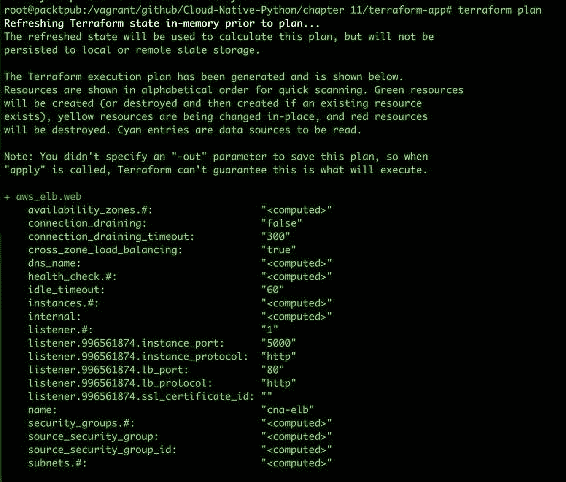

如果没有看到任何错误，可以执行以下命令来实际创建资源：

```py
$ terraform apply

```

输出应如下所示：


目前，我们没有向我们注册域名，但是如果我们在路由 53 中注册和配置了域名，我们需要在`main.tf`中创建一个额外的资源，为我们的应用添加一个条目。我们可以使用以下代码执行此操作：

```py
    resource "aws_route53_record" "www" { 
      zone_id = "${var.zone_id}" 
      name = "www.domain.com" 
      type = "A" 
      alias { 
       name = "${aws_elb.web.dns_name}" 
       zone_id = "${aws_elb.web.zone_id}" 
       evaluate_target_health = true 
      } 
    } 

```

这就是我们需要做的。另外，另一种快速且最关键的提高基础设施可用性的方法是根据服务器指标使用情况（CPU 或内存）创建自动扩展服务。我们提供的条件决定了我们是否需要向上或向下扩展基础架构，以便我们的应用性能能够看到更少的延迟。

In order to do so , you can check the Terraform documentation at [https://www.terraform.io/docs/providers/aws/r/autoscaling_group.html](https://www.terraform.io/docs/providers/aws/r/autoscaling_group.html).

目前，我们的应用尚未部署，我们将使用 CodeDeploy 服务使用持续交付部署我们的应用，我们将在本章后面的部分中讨论。

在此之前，让我们看看如何使用 AWS 提供的云平台服务**CloudFormation**创建相同的设置。

# CloudFormation—一个 AWS 工具，用于使用代码构建基础设施

CloudFormation 是一项 AWS 服务，其工作方式与 Terraform 类似。但是，在 CloudInformation 中，我们不需要访问/密钥。相反，我们需要创建一个 IAM 角色，该角色将具有启动构建应用所需的所有资源所需的访问权限。

您可以使用 YAML 或 JSON 格式编写 CloudFormation 配置。

让我们通过构建 VPC 开始使用 CloudFormation 进行基础设施设置，在这里我们将创建一个 VPC，包括一个公共子网和一个私有子网。

让我们创建一个新文件`vpc.template`，VPC 和子网（公共和私有）配置如下：

```py
"Resources" : { 

   "VPC" : { 
     "Type" : "AWS::EC2::VPC", 
     "Properties" : { 
       "CidrBlock" : "172.31.0.0/16", 
       "Tags" : [ 
         {"Key" : "Application", "Value" : { "Ref" : "AWS::StackName"} }, 
         {"Key" : "Network", "Value" : "Public" } 
       ] 
     } 
   }, 
"PublicSubnet" : { 
     "Type" : "AWS::EC2::Subnet", 
     "Properties" : { 
       "VpcId" : { "Ref" : "VPC" }, 
       "CidrBlock" : "172.31.16.0/20", 
       "AvailabilityZone" : { "Fn::Select": [ "0", {"Fn::GetAZs": {"Ref": "AWS::Region"}} ]}, 
       "Tags" : [ 
         {"Key" : "Application", "Value" : { "Ref" : "AWS::StackName"} }, 
         {"Key" : "Network", "Value" : "Public" } 
       ] 
     } 
   }, 
   "PrivateSubnet" : { 
     "Type" : "AWS::EC2::Subnet", 
     "Properties" : { 
       "VpcId" : { "Ref" : "VPC" }, 
       "CidrBlock" : "172.31.0.0/20", 
       "AvailabilityZone" : { "Fn::Select": [ "0", {"Fn::GetAZs": {"Ref": "AWS::Region"}} ]}, 
       "Tags" : [ 
         {"Key" : "Application", "Value" : { "Ref" : "AWS::StackName"} }, 
         {"Key" : "Network", "Value" : "Public" } 
       ] 
     } 
   }, 

```

前面的配置是以 JSON 格式编写的，目的是让您了解 JSON 配置。此外，我们还需要指定路由表和 internet 网关的配置，如下所示：

```py
"PublicRouteTable" : { 
     "Type" : "AWS::EC2::RouteTable", 
     "Properties" : { 
       "VpcId" : {"Ref" : "VPC"}, 
       "Tags" : [ 
         {"Key" : "Application", "Value" : { "Ref" : "AWS::StackName"} }, 
         {"Key" : "Network", "Value" : "Public" } 
       ] 
     } 
   }, 

   "PublicRoute" : { 
     "Type" : "AWS::EC2::Route", 
     "Properties" : { 
       "RouteTableId" : { "Ref" : "PublicRouteTable" }, 
       "DestinationCidrBlock" : "0.0.0.0/0", 
       "GatewayId" : { "Ref" : "InternetGateway" } 
     } 
   }, 

   "PublicSubnetRouteTableAssociation" : { 
     "Type" : "AWS::EC2::SubnetRouteTableAssociation", 
     "Properties" : { 
       "SubnetId" : { "Ref" : "PublicSubnet" }, 
       "RouteTableId" : { "Ref" : "PublicRouteTable" } 
     } 
   } 
 }, 

```

现在我们有了可用的配置，是时候从 AWS 控制台为 VPC 创建一个堆栈了。

# AWS 上的 VPC 堆栈

执行以下步骤，从 AWS 控制台为 VPC 创建堆栈：

1.  转到[https://console.aws.amazon.com/cloudformation/home?region=us-east-1#/stacks/new](https://console.aws.amazon.com/cloudformation/home?region=us-east-1#/stacks/new)使用 CloudFormation 创建新堆栈。您应该会看到如此屏幕截图所示的屏幕：


提供模板文件的路径，然后单击“下一步”按钮。

2.  在下一个窗口中，我们需要指定堆栈名称，它是堆栈的唯一标识符，如下所示：


提供堆栈名称，然后单击 Next。

3.  下一个屏幕是可选的；如果我们想设置**SNS**（**通知服务**），或者为其添加 IAM 角色，我们需要在这里添加：

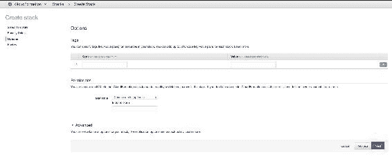

如果要启用通知和 IAM 角色，请添加详细信息，然后单击“下一步”。

4.  下一个屏幕用于查看详细信息，并确保其正确用于创建堆栈：


准备好后，单击 Create 启动堆栈创建。在创建时，您可以检查事件以了解资源创建的状态。

您应该会看到与此类似的屏幕：


在前面的屏幕中，您将能够看到堆栈的进度，如果出现一些错误，您可以使用这些事件来识别它们。

一旦 VPC 堆栈就绪，我们需要在 VPC 中创建 EC2、ELB 和自动缩放资源。我们将使用 YAML 格式概述如何以 YAML 格式编写配置。

您可以在`<path of repository>`找到完整的代码。我们将使用`main.yml`文件，其中包含有关 VPC 和您需要启动实例的子网的详细信息。

5.  要启动堆栈，请转到以下链接：
    [https://console.aws.amazon.com/cloudformation/home?region=us-east-1#/stacks/new](https://console.aws.amazon.com/cloudformation/home?region=us-east-1#/stacks/new)

在启动配置中会有一个更改——我们将在提供详细信息时在 AWS 控制台中指定它，而不是在文件中指定值，如图所示：


6.  请参阅以下屏幕截图，以提供要在其中部署应用的实例详细信息：

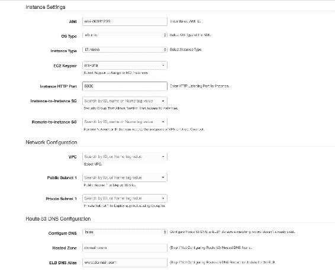

7.  在上一个屏幕中提供所有详细信息后，向下滚动到下一部分，在该部分中，它将询问 ELB 详细信息，如下一个屏幕截图所示：

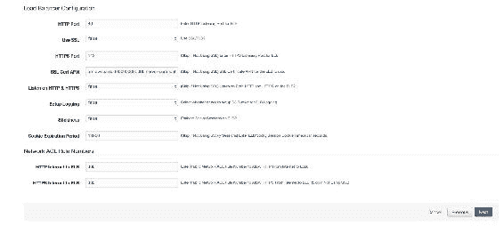

其余步骤与创建 AWS CloudFormation 堆栈的步骤相同。为了添加 MongoDB 服务器，我们需要在`main.yml`中添加 EC2 机器的配置。

Creating the configuration in AWS CloudFormation is straightforward, as AWS provides a couple of templates which we use as a reference to create our template. The following is the link for the templates:
[https://aws.amazon.com/cloudformation/aws-cloudformation-templates/](https://aws.amazon.com/cloudformation/aws-cloudformation-templates/)

这就是我们建设基础设施所拥有的一切；是时候将我们的应用部署到应用服务器上了。

# 云原生应用的连续部署

在上一节中，我们成功地设置了基础架构，但尚未部署应用。此外，我们需要确保使用连续部署来处理进一步的部署。因为我们在本地机器中有我们的开发环境，所以我们不需要设置持续集成周期。然而，对于许多开发人员协同工作的大型公司，我们需要使用 Jenkins 建立一个单独的管道，用于持续集成。在我们的情况下，我们只需要持续部署。我们的持续部署管道如下所示：


# 工作原理

首先，开发人员将新代码推送到版本控制系统的主要分支（在我们的例子中，它是 GitHub）。推送新代码后，Jenkins**GitHub 插件**会根据其定义的作业检测到更改，并触发**Jenkins 作业**将新代码部署到其基础设施中。Jenkins 然后与**代码部署**通信，以将代码触发到 Amazon EC2 机器。因为我们需要确保部署成功，所以我们可以设置一个通知部分，该部分将通知我们部署的状态，以便在需要时可以恢复。

# 持续部署管道的实施

让我们首先从代码部署开始配置 AWS 服务，这将帮助我们在可用的应用服务器上部署应用。

1.  最初，当您切换到代码部署服务时（[https://us-west-1.console.aws.amazon.com/codedeploy/](https://us-west-1.console.aws.amazon.com/codedeploy/) ），您应该看到以下屏幕：


前面的屏幕截图是 CodeDeploy 的介绍页面，展示了它的功能。

2.  单击页面中间的“立即开始”按钮向前移动。

3.  接下来，您应该看到下面的屏幕，它将建议您部署一个示例应用，这对于初始阶段来说是很好的。但是由于我们已经构建了基础设施，在这种情况下，我们需要选择定制部署——这将跳过本演练。因此，选择该选项，然后单击 Next。

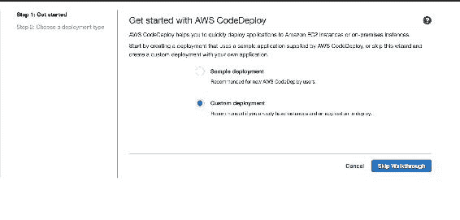

4.  单击“跳过漫游”向前移动。
5.  在下一个向导屏幕中，有几个部分需要查看。

第一部分将要求您创建应用--您需要提供用户定义的应用名称和部署组名称，这是必需的，因为它将成为应用的标识符：

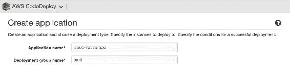

6.  向下滚动到下一节，该节讨论您希望应用的部署类型。有两种方法，其定义如下：

*   **蓝绿部署**：在该类型中，在部署过程中，启动新实例并向其部署新代码，如果其健康检查正常，则替换为旧实例，然后终止旧实例。这建议用于客户无法承受停机时间的生产环境。
*   **就地部署**：在这种部署类型中，新代码直接部署到现有实例中。在此部署中，每个实例都脱机进行更新。

我们将使用**就地部署**，但选择会随着用例和产品所有者的决定而变化。例如，Uber 或 Facebook 等在部署时无法承受停机时间的应用将采用蓝/绿部署，这将为它们提供高可用性。


7.  让我们转到下一节，它将讨论部署应用的基础架构。我们将在此屏幕截图中指定实例和 ELB 详细信息：

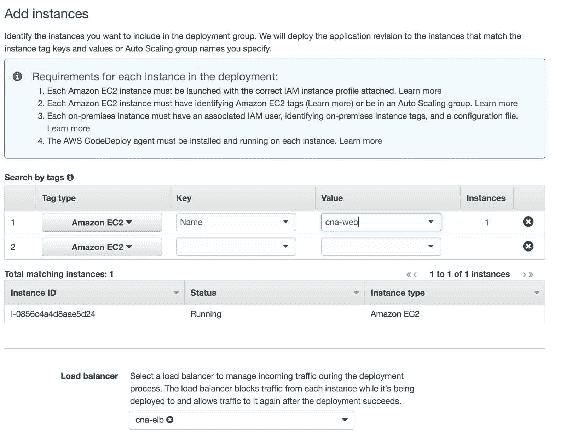

8.  在下一部分中，我们将定义部署应用的方式。例如，假设您有 10 个实例。您可能希望一次在所有这些实例上部署应用，或者一次部署一个实例，或者一次部署一半实例。我们将使用默认选项，即`CodeDeployDefault.OneAtATime`：


在本节中，我们还需要指定一个服务角色，代码部署需要该角色在 AWS 资源上执行操作，更具体地说，在 EC2 和 ELB 上执行操作。

In order to understand more about service role creation, go to the AWS documentation at this link: [http://docs.aws.amazon.com/IAM/latest/UserGuide/id_roles_create.html](http://docs.aws.amazon.com/IAM/latest/UserGuide/id_roles_create.html)

9.  提供所需信息后，单击创建应用。

应用就绪后，您将看到以下屏幕：


现在我们都准备好部署了。我们只需要在 Jenkins 中创建一个作业，并添加一个包含 CodeDeploy 详细信息的后期构建部分。

创造就业机会类似于我们在上一章中所解释的。不过，需要进行以下几项更改：

1.  首先，我们需要确保已经安装了一些 Jenkins 插件，即 AWS CodeDeploy Plugin for Jenkins、Git Plugin、GitHub Plugin 等等。
2.  安装插件后，应在“生成后操作”列表中看到新操作，如以下屏幕截图所示：

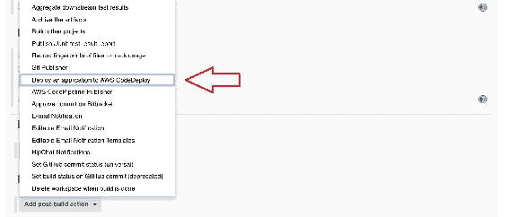

3.  接下来，您需要选择将应用部署到 AWS CodeDeploy 操作。将添加一个新的部分，我们需要提供我们在 AWS 控制台中创建的 CodeDeploy 应用的详细信息，如此屏幕截图所示：

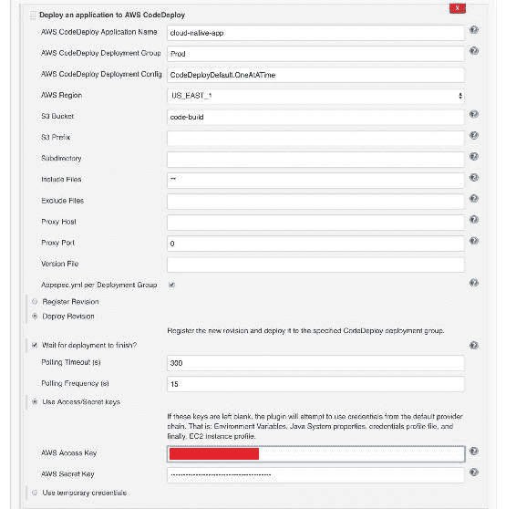

4.  我们还需要提供我们在本章开始时在*生成认证密钥*一节中创建的访问/密钥。这是必需的，因为 Jenkins 在打包应用后，需要将其上载到 S3，并指示 CodeDeploy 从指定的 bucket 部署最新的构建。

这就是我们需要做的。现在，我们的 Jenkins 工作已经准备好部署应用了。试试看，它应该像黄油一样光滑。

# 总结

这一章在很多方面都很有趣。首先，您对 AWS 服务有了基本的了解，以及如何充分利用这些服务。接下来，我们探讨了 AWS 云上应用的体系结构，这将形成您对未来可能创建的不同应用/产品的体系结构设计的看法。我们还使用了 Terraform，这是一个第三方工具，用于在 AWS 上作为代码构建基础设施。最后，我们部署了应用，并使用 Jenkins 创建了一个连续的部署管道。在下一章中，我们将探索微软拥有的另一个云平台——微软 Azure。保持活力，并准备在下一章中探索 Azure。再见！