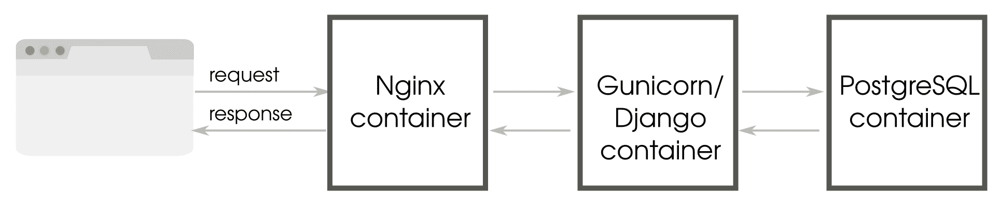

# 十三、生产准备

在本章中，我们将讨论以下主题：

*   选择 web 堆栈
*   托管方法
*   部署工具
*   监测
*   性能提示

因此，您已经在 Django 中开发并测试了一个功能齐全的 web 应用。部署此应用可能涉及多种活动，从选择宿主提供商到执行安装。更具挑战性的任务可能是维护生产站点，使其在不中断的情况下工作，以及处理意外的流量突发。

系统管理的学科非常广泛。因此，本章将涵盖很多方面。但是，由于空间有限，我们将尝试让您熟悉构建生产环境的各个方面。

# 生产环境

尽管我们大多数人直观地理解生产环境是什么，但澄清它的真正含义是值得的。生产环境就是最终用户使用您的应用的环境。它应该是可用的、有弹性的、安全的、响应迅速的，并且必须具有满足当前（和未来）需求的丰富容量。

与开发环境不同，由于生产环境中的任何问题而造成实际业务损害的可能性很高。因此，在转移到生产环境之前，代码被转移到各种测试和验收环境中，以便尽可能多地消除 bug。为了便于跟踪，必须跟踪、记录对生产环境所做的每项更改，并使团队中的每个人都可以访问这些更改。

结果是，不能直接在生产环境上执行开发。事实上，不需要在生产环境中安装开发工具，如编译器或调试器。任何不需要的软件的存在都会增加站点的攻击面，并可能造成安全风险。

大多数 web 应用部署在停机时间极低的站点上，例如，大型数据中心的正常运行时间为 5.9%，即 99.999%。通过针对故障进行设计，即使内部组件出现故障，也有足够的冗余来防止整个系统崩溃。这种避免**故障**（**SPOF**）的**单点的概念可以应用于各个级别、硬件或软件。**

因此，它是您选择在生产环境中运行的软件的重要集合。

# 选择 web 堆栈

到目前为止，我们还没有讨论运行应用的堆栈。尽管我们在本书的最后讨论了它，但最好不要将此类决策推迟到应用生命周期的后期。理想情况下，您的开发环境必须尽可能接近生产环境，以避免*但它在我的机器*上工作。

通过 web 堆栈，我们指的是用于构建 web 应用的一组技术。它通常被描述为一系列组件，如操作系统、数据库和 web 服务器，所有这些组件都堆叠在一起。因此，它被称为堆栈。

我们将主要关注开源解决方案，因为它们被广泛使用。但是，如果各种商业应用更适合您的需要，也可以使用它们。

# 堆栈的组件

生产 Django web 堆栈是使用多种应用（或层，取决于您的术语）构建的。在构建 web 堆栈时，您可能需要做出以下选择：

*   哪个操作系统和发行版？例如，Debian、Red Hat 或 OpenBSD。
*   哪个 WSGI 服务器？例如，Gunicorn 或 uWSGI。
*   哪个 web 服务器？例如，Apache 或 Nginx。
*   哪个数据库？例如，PostgreSQL、MySQL 或 Redis。
*   哪个缓存系统？例如，Memcached 或 Redis。
*   哪个过程控制和监控系统？例如，Upstart、Systemd 或 Supervisord。
*   如何存储静态媒体？例如，AmazonS3 或 CloudFront

可能还有几个，这些选择也不是相互排斥的。有些应用会同时使用其中的几个应用。例如，可以在 Redis 上查找用户名可用性，而主数据库可能是 PostgreSQL。

在选择堆栈时，没有*一刀切的*答案。不同的组成部分有不同的优势和劣势。只有在仔细考虑和测试后才能选择它们。例如，您可能听说 Nginx 是 web 服务器的流行选择，但实际上您可能需要 Apache 丰富的模块或选项生态系统。

有时，堆栈的选择基于各种非技术原因。您的组织可能已经在特定的操作系统上实现了标准化，例如，Debian 为其所有服务器提供了标准化，或者您的云托管提供商可能只支持有限的堆栈集。

因此，如何选择宿主 Django 应用是决定生产设置的关键因素之一。

# 虚拟机还是 Docker

我们大多数人都熟悉在开发或生产中使用虚拟机。它们将应用（来宾计算机）与底层基础结构（主机）隔离开来。Docker 等容器技术正越来越多地用于云部署，以补充或取代虚拟机。

容器是在同一内核上创建多个用户空间实例的一种方法。与虚拟机不同，容器无需启动和运行单独的来宾操作系统。通常，每个容器将应用及其依赖项打包在用户空间实例中，并与其他容器分开。与虚拟机不同，它们没有单独的操作系统实例，这使它们更轻，启动或停止速度更快。

Docker 已成为集装箱技术的首选，拥有大型生态系统和云供应商的广泛支持。Docker 映像是从称为基本映像的二进制映像创建的，或者是从称为 Dockerfile 的脚本自动生成的。这有助于您在生产中为开发或测试目的重新创建相同的环境，从而结束臭名昭著的借口*，但它在我的机器*中起作用。

# 微服务

使用 Docker 最常见的设计模式是将应用和服务分解为*微服务*。其优点是单个微服务可以独立开发和部署，同时在要求苛刻的情况下更具弹性和弹性。因此，像 Docker 这样的容器化技术由于其最小的开销和应用级隔离而自然适合。

以下是使用容器作为微服务实现的 Django web 应用的简单示例：



作为不同容器部署时的 Django 应用流

这个单一的微服务由三个具有独立逻辑组件的容器组成：**Nginx****容器**（web 服务器）、**Gunicorn/Django****容器**（web 应用）和**PostgreSQL 容器**（数据库）。每个容器都是从 Docker 映像实例化的，该映像可以使用 Dockerfile 构建。

Docker 容器具有临时文件系统，因此通过显式创建卷来管理持久数据。卷可用于在容器之间共享数据。在这种情况下，Django 项目的静态文件可以共享到 Nginx 容器以直接为它们服务。

正如您所想象的，大多数真实世界的应用将由多个微服务组成，每个微服务都需要多个容器。如果您在多台服务器上运行它们，您将如何跨它们部署这些容器？如何向上或向下扩展单个微服务？Kubernetes 是管理此类容器集群最广泛推荐的解决方案。

尽管我们在本节中从很高的层次介绍了容器，但还有许多实现细节，例如部署模式，这里无法介绍，因为它们本身就是一本书。容器和编排工具已经成为现代 web 应用开发的重要组成部分，它使应用环境的管理变得非常简单。

# 群众或部队的集合

说到托管，您需要确定是否要使用 Heroku 之类的托管平台。如果您对管理服务器不太了解，或者团队中没有具备这方面知识的人，那么托管平台是一个方便的选择。

# 平台即服务

**平台即服务**（**PaaS**被定义为云服务，解决方案堆栈已经为您提供和管理。Django 托管的流行平台包括 Heroku、Pythonywhere 和 Google 应用引擎。

在大多数情况下，部署 Django 应用应该像选择堆栈中的服务或组件并推出源代码一样简单。您不必自己执行任何系统管理或设置。平台完全由管理。

与大多数云服务一样，基础设施也可以按需扩展。如果您需要额外的数据库服务器或服务器上更多的 RAM，可以通过 web 界面或命令行轻松地进行配置。定价主要基于您的使用情况。

这种托管平台的底线是，它们非常容易设置，非常适合小型项目。随着用户群的增长，它们往往会变得更昂贵。

另一个缺点是，您的应用可能会绑定到平台上，或者变得难以移植。例如，GoogleAppEngine 只支持非关系数据库，这意味着您需要使用 Django 的分支`django-nonrel`。现在，谷歌云 SQL 在一定程度上缓解了这一限制。

# 虚拟专用服务器

**虚拟专用服务器**（**VPS**是托管在共享环境中的虚拟机。从开发人员的角度来看，它看起来像一台预加载了操作系统的专用机器（因此，单词 private）。您将需要自己安装和设置整个堆栈，尽管许多 VPS 提供商（如 Web 派系和 DigitalOcean）提供了更简单的 Django 设置。

如果你是一个初学者，可以抽出一些时间，我强烈推荐这种方法。您将获得根访问权限，您可以自己构建整个堆栈。您不仅可以理解堆栈的各个部分是如何组合在一起的，还可以完全控制微调每个单独的组件。

与 PaaS 相比，VPS 可能更物有所值，尤其是对于高流量站点。您也可以从同一台服务器上运行多个站点。

# 无服务器

想象一下，您需要托管一个不常使用的服务，但支付一个始终处于运行状态的专用服务器的费用被证明是成本高昂或维护效率低下的。无服务器架构可能正是您想要的。serverless 这个名称是一个误称，因为所有客户端请求实际上都是由服务器处理的，而服务器是为请求的生命周期动态配置的。

更合适的术语是**作为服务的函数**（**FaaS**），因为这些平台支持应用逻辑的执行，如小型 Python 函数，但不存储任何状态。构建由这些功能组成的应用与前面讨论的微服务体系结构非常相似。

通常，您只需支付无服务器应用使用的毫秒服务器时间，这使得它比专用服务器便宜得多。缩放是自动处理的，因此不需要额外的努力来处理流量的巨大峰值。最后但并非最不重要的一点是，设置和维护服务器基础设施并不令人头痛。

Django 听起来可能无法在这样的环境中工作，但[Zappa](https://github.com/Miserlou/Zappa)使得在 AWS Lambda 等无服务器平台上部署 Django 应用（事实上，任何与 WSGI 兼容的应用）变得很容易，只需进行很少的更改。这为在使用 Django 的同时享受无服务器的所有优势提供了可能性。

# 其他托管方法

尽管到目前为止，在平台或 VPS 上托管是两种最流行的托管选项，但还有很多其他选项。如果您对性能最大化感兴趣，您可以选择一台裸机服务器，并与提供商进行配置，例如**机架空间**。

在托管范围较轻的一端，您可以通过在 Docker 容器中托管多个应用来节省成本。Docker 是一种将应用和依赖项打包到虚拟容器中的工具。与传统虚拟机相比，Docker 容器启动速度更快，开销最小（因为没有捆绑的操作系统或虚拟机监控程序）。

Docker 是托管基于微服务的应用的理想选择。它正变得像虚拟化一样无处不在，几乎每个 PaaS 和 VPS 提供商都支持它。

它也是一个很好的开发平台，因为 Docker 容器封装了整个应用状态，可以直接部署到生产环境中。

# 部署工具

一旦您专注于托管解决方案，部署过程中可能会有几个步骤，从运行回归测试到生成后台服务。

成功部署过程的关键是自动化。由于部署应用涉及一系列定义良好的步骤，因此可以将其作为编程问题来处理。一旦实现了自动化部署，就不必担心部署会遗漏一个步骤。

事实上，部署应该是无痛的，并且按照需要频繁进行。例如，Facebook 团队可以在一天内多次发布代码投入生产。考虑到 Facebook 庞大的用户群和代码库，这是一项令人印象深刻的壮举，然而，由于需要尽快部署紧急 bug 修复和补丁，这一点变得非常必要。

良好的部署过程也是幂等的。换句话说，即使您意外地运行了部署工具两次，操作也不应该执行两次（或者应该保持相同的状态）。

让我们来看看一些用于部署 Django 应用的流行工具。

# 织物

Fabric 因其简单易用而受到 Python web 开发人员的青睐。它需要一个名为`fabfile.py`的文件来定义项目中的所有操作（用于部署或其他）。每个操作都可以是本地或远程 shell 命令。远程主机通过 SSH 连接。

Fabric 的关键优势在于它能够在一组远程主机上运行命令。例如，您可以定义一个`web`组，其中包含生产中所有 web 服务器的主机名。

通过在命令行上指定 web 组名称，只能对这些 web 服务器运行结构操作。

为了说明使用布料部署站点所涉及的任务，让我们来看一个典型的部署场景。

# 典型部署步骤

假设您在单个 web 服务器上部署了一个中型 web 应用。Git 被选为版本控制和协作工具。以裸 Git 树的形式创建了一个与所有用户共享的中央存储库。

假设您的生产服务器已经完全设置好。当您运行 Fabric 部署命令（例如，`fab deploy`）时，将执行以下脚本化的操作序列：

1.  在本地运行所有测试
2.  将所有本地更改提交到 Git
3.  推送到远程中心 Git 存储库
4.  解决合并冲突（如果有）
5.  收集静态文件（CSS、图像）
6.  将静态文件复制到静态文件服务器
7.  在远程主机上，从中央 Git 存储库提取更改
8.  在远程主机上，运行（数据库）迁移
9.  在远程主机上，点击`app.wsgi`重启 WSGI 服务器

整个过程是自动的，应该在几秒钟内完成。默认情况下，如果任何步骤失败，则部署将中止。虽然没有明确提到，但是会有一些检查来确保进程是幂等的。

Fabric 尚未与 Python3 兼容，尽管开发人员正在对其进行移植。同时，您可以在 Python2.x 虚拟环境中运行 Fabric，或者查看类似的工具，例如 PyInvoke。

# 配置管理

使用 Fabric 很难管理处于不同状态的多台服务器。配置管理工具（如 Chef、Puppet 或 Ansible）尝试将服务器置于特定的期望状态。

与 Fabric 不同，Fabric 要求以命令式方式指定部署过程，这些配置管理工具是声明性的。您只需要定义希望服务器处于的最终状态，它就会知道如何到达该状态。

例如，如果要确保所有 web 服务器上的 Nginx 服务都在启动时运行，则需要定义一个服务器状态，使 Nginx 服务在启动时运行和启动。另一方面，对于 Fabric，您需要指定安装和配置 Nginx 以达到这种状态的确切步骤。

配置管理工具最重要的优点之一是默认情况下它们是幂等的。您的服务器可以从未知状态变为已知状态，从而更易于服务器配置管理和可靠部署。

在配置管理工具中，Chef 和 Puppet 广受欢迎，因为它们是该类别中最早的工具之一。然而，它们在 Ruby 中的根可能使 Python 程序员觉得它们有点陌生。对于这样的人，我们有盐和安赛布尔作为很好的替代品。

与较简单的工具（如 Fabric）相比，配置管理工具具有相当大的学习曲线。但是，它们是创建可靠生产环境的基本工具，当然值得学习。

# 监测

即使是中等规模的网站也可能极其复杂。Django 可能是数百个相互运行和交互的应用和服务之一。正如可以持续监测心跳和其他生命体征以评估人体健康一样，在大多数生产系统中也可以收集、分析和呈现各种指标。

当日志记录跟踪各种事件（如 web 请求或异常的到达）时，监视通常指定期收集关键信息，如内存利用率或网络延迟。但是，例如，在监控数据库查询性能时，差异在应用级别变得模糊，而数据库查询性能很可能是从日志中收集的。

监控也有助于及早发现问题。异常模式，如尖峰或负载逐渐增加，可能是更大的潜在问题的迹象，如内存泄漏。一个好的监控系统可以在问题发生之前提醒网站所有者。

监控工具通常需要一个后端服务（有时称为*代理*）来收集统计数据，并需要前端服务来显示仪表板或生成报告。流行的数据收集后端包括 StatsD 和 Monit。该数据可以传递给前端工具，如**Graphite**。

有几种托管的监视工具，例如 newrelic 和 Status.io，它们更易于设置和使用。

衡量绩效是监测的另一个重要作用。正如我们很快将在后面的一节中看到的，任何建议的优化都必须在实施之前仔细测量和监控。

# 改进性能

性能是一个特性。研究表明，速度慢的网站会对用户产生不利影响，从而影响收入。例如，2007 年在亚马逊进行的测试显示，[Amazon.com](http://amazon.com)的加载时间每增加 100 毫秒，销售额就会下降 1%。

令人欣慰的是，一些高性能的 web 应用，如 Discus 和 Instagram，都是在 Django 上构建的。2013 年，在 DISKS，他们可以处理 150 万并发连接的用户，每秒 45000 个新连接，每秒 165000 条消息，端到端延迟不到 0.2 秒。

提高性能的关键是找到瓶颈所在。与依靠猜测相比，我们始终建议您测量并分析应用，以确定这些性能瓶颈。正如开尔文勋爵所说：

“如果你不能测量它，你就无法改进它。”

在大多数 web 应用中，瓶颈可能出现在浏览器或数据库端，而不是 Django 内部。但是，对于用户来说，整个应用都需要响应。

让我们来看看一些改进 Django 应用性能的方法。由于技术差异很大，这些技巧分为两部分：前端和后端。

# 前端性能

Django 程序员可能很快就会忽略前端性能，因为它涉及了解客户端（通常是浏览器）的工作方式。然而，让我们引用 Steve Souders 对 Alexa 排名前十的网站的研究：

“80-90%的最终用户响应时间花费在前端。从那里开始。”

前端优化的一个很好的起点是使用谷歌页面速度或雅虎来检查你的网站！YSlow（通常用作浏览器插件）。这些工具将对您的站点进行评级，并推荐各种最佳实践，例如最小化 HTTP 请求的数量或 gzip 内容。

作为最佳实践，静态资产（如图像、样式表和 JavaScript 文件）不得通过 Django 提供。与静态文件服务器不同，Amazon S3 等云存储或**内容****交付网络**（**CDN**等）应该为它们提供更好的性能。

即使如此，Django 也可以通过多种方式帮助您提高前端性能：

*   **无限缓存与**`CachedStaticFilesStorage`：加载静态资产的最快方式是利用浏览器缓存。通过设置较长的缓存时间，可以避免重复下载同一资产。然而，挑战在于知道当内容发生变化时何时不使用缓存。
    *   `CachedStaticFilesStorage`类通过将资产的 MD5 哈希附加到其文件名，优雅地解决了这个问题。这样，您可以无限扩展这些文件的缓存 TTL。
    *   要使用此选项，请将名为`staticfiles`的`CACHES`设置设置为`CachedStaticFilesStorage`
        ，或者，如果您有自定义存储，请从`CachedFilesMixin`继承。此外，最好将缓存配置为使用本地内存缓存后端对其哈希名称执行静态文件名查找。
*   **使用静态资产管理器**：资产管理器可以预处理您的静态资产，以缩小、压缩或连接它们，从而减小它们的大小并最小化请求。它还可以对它们进行预处理，使您能够用其他语言编写它们，例如 CoffeeScript 和**语法上很棒的样式表**（**Sass**）。有几个 Django 软件包提供静态资产管理，如`django-pipeline`或`webassets`。

# 后端性能

后端性能改进的范围涵盖了整个服务器端 web 堆栈，包括数据库查询、模板呈现、缓存和后台作业。您将希望从它们中获得最高的性能，因为它完全在您的控制范围内。

对于快速简单的评测需求，`django-debug-toolbar`非常方便。我们还可以使用 Python 评测工具，如`hotshot`模块进行详细分析。在 Django 中，您可以使用几个评测中间件片段之一在浏览器中显示 hotshot 的输出。

最近的实时评测解决方案是`django-silk`。它将所有请求和响应存储在配置的数据库中，允许对整个用户会话进行聚合分析，例如，找到性能最差的视图。它还可以通过添加 decorator 来分析任何一段 Python 代码。

与前面一样，我们将研究一些提高后端性能的方法。然而，考虑到它们本身是一个巨大的主题，它们被分成了几个部分。在前面的章节中已经介绍了其中的许多内容，但为了便于参考，这里对其进行了总结。

# 模板

正如文档所建议的，您应该在生产环境中启用缓存的模板加载程序。这避免了每次需要呈现模板时重新分析和重新编译模板的开销。缓存的模板在第一次需要时进行编译，然后存储在内存中。对同一模板的后续请求将从内存中提供。

如果您发现另一种模板语言（如 Jinja2）呈现页面的速度明显加快，那么替换内置的 Django 模板语言就相当容易了。

# 数据库

有时，Django ORM 会生成低效的 SQL 代码。有几种优化模式可以改善这一点，如下所示：

*   **使用**`select_related`减少数据库命中率：如果您在转发方向上对大量对象使用`OneToOneField`或外键关系，则`select_related()`可以执行 SQL 连接，减少数据库命中率。
*   AUTT3.用 AutoT4A. To.T0.减少数据库命中：为了访问一个 ORT T1 方法，或者一个外键关系，在一个相反的方向上，或者在大量对象中的一个外键关系，考虑使用“Type T2A^”来减少数据库命中的数量。
*   **仅获取有值的所需字段或**`values_list`：您可以通过限制查询以仅返回所需字段并使用`values()`或`values_list()`跳过模型实例化来节省时间和内存使用。
*   **非规范化模型**：选择性非规范化通过减少连接来提高性能，但以牺牲数据一致性为代价。它还可用于将值（如字段总数或活动状态报告）预计算到额外的列中。与在查询中使用带注释的值相比，非规范化字段通常更简单、更快。
*   如果你在查询中搜索了非主键，那么在你的模型定义中考虑将字段的 ToT T0 设置为 AutoT1 损坏。
*   **一次创建、更新、删除多行**：可以通过`bulk_create()`、`update()`、`delete()`三种方法在一个数据库查询中操作多个对象。然而，他们有几个重要的警告，比如跳过该模型上的`save()`方法。因此，使用前请仔细阅读文档。

作为最后的手段，您始终可以使用经验证的数据库性能专家对原始 SQL 语句进行微调。但是，随着时间的推移，维护 SQL 代码可能会很痛苦。

# 缓存

任何花费时间的计算都可以利用缓存并更快地返回预计算结果。然而，问题是陈旧的数据，或者经常被引用为计算机科学中最困难的事情之一，缓存失效。尽管刷新了页面，但 YouTube 视频的浏览量并没有改变，这一点很常见。

Django 有一个灵活的缓存系统，允许您缓存从模板片段到整个站点的任何内容。它允许多种可插拔后端，如基于文件或基于数据的备份存储。

大多数生产系统使用基于内存的缓存系统，如 Redis 或 Memcached。这纯粹是因为易失性存储器比基于磁盘的存储器快很多数量级。

这种缓存存储非常适合存储频繁使用但短暂的数据，如用户会话。

# 缓存会话后端

默认情况下，Django 将其用户会话存储在数据库中。通常会为每个请求检索该文件。为了提高性能，可以通过更改`SESSION_ENGINE`设置将会话数据存储在内存中。例如，在`settings.py`中添加以下内容，将会话数据存储在缓存中：

```py
SESSION_ENGINE = "django.contrib.sessions.backends.cache" 
```

由于某些缓存存储可能会逐出过时数据，导致会话数据丢失，因此最好使用 Redis 或 Memcached 作为会话存储，内存限制足够高，以支持最大数量的活动用户会话。

# 缓存框架

对于基本的缓存策略，使用缓存框架可能更容易。流行的有`django-cache-machine`和`django-cachalot`。它们可以处理常见的场景，例如自动缓存查询结果，以避免每次执行读取操作时数据库被命中。

其中最简单的是 Django cachalot，Johnny Cache 的继任者。它只需要很少的配置。它非常适合具有多个读取和不频繁写入的站点（即绝大多数应用），它以一致的方式缓存所有 Django ORM 读取查询。

# 缓存模式

一旦您的站点开始获得大量流量，您就需要开始在整个堆栈中探索几种缓存策略。使用 Varnish，一个位于用户和 Django 之间的缓存服务器，您的许多请求甚至可能不会命中 Django 服务器。

清漆可以使页面加载速度极快（有时比正常速度快几百倍）。但是，如果使用不当，它可能会为用户提供静态页面。Varnish 可以很容易地配置为识别动态页面或页面的动态部分，如购物车。

在 rails 社区流行的**俄罗斯玩偶缓存**是一种有趣的模板缓存失效模式。设想一个用户的时间轴页面包含一系列帖子，每个帖子都包含一个嵌套的评论列表。事实上，整个页面可以看作是几个嵌套的内容列表。在每个级别，呈现的模板片段都会被缓存。

因此，如果一条新评论被添加到一篇文章中，只有相关的文章和时间线缓存会失效。

我们首先直接在更改的内容之外使缓存内容无效，然后逐步移动，直到到达最外层的内容。需要跟踪模型之间的依赖关系才能使此模式正常工作。

另一种常见的缓存模式是永久缓存。即使在内容更改之后，用户也可能从缓存中获得过时的数据。但是，异步作业（如芹菜作业）也会被触发以更新缓存。您还可以以一定的间隔定期预热缓存以刷新内容。

从本质上讲，成功的缓存策略可以识别站点的静态和动态部分。对于许多站点，动态部分是登录时用户特定的数据。如果将其与通常可用的公共内容分离，那么实现缓存就变得更容易了。

不要将缓存视为站点工作的一部分。即使缓存系统发生故障，站点也必须恢复到较慢但正常工作的状态。

克兰诺斯

当时是早上六点，SHIM 大楼被灰雾包围。在里面的某个地方，一个小会议室被指定为战争室。在过去的三个小时里，SuperBook 团队一直躲在这里，努力执行他们的上线前计划。

来自世界各地的超过 30 名用户登录了 IRC 聊天室#superbookgolive。聊天日志被投射在一个巨大的白板上。当最后一个项目被删除时，埃文瞥了史蒂夫一眼。然后，他按下一个键触发部署过程。

随着脚本输出不断从墙上滚下来，房间里一片寂静。史蒂夫认为，一个错误，仅仅一个错误就可能让他们倒退数小时。几秒钟后，命令提示符再次出现。是现场直播！队员们欣喜若狂。他们从椅子上跳起来，互相击掌。有些人哭着流下幸福的眼泪。在经历了数周的不确定性和艰苦工作后，这一切似乎都是超现实的。

然而，庆祝活动是短暂的。从上面传来的巨大爆炸震动了整座大楼。史蒂夫知道第二次突破已经开始。他对埃文喊道，“在收到我的信息之前不要打开灯塔”，然后冲出房间。

当史蒂夫急忙走上楼梯到达屋顶时，他听到了头顶上的脚步声。是 O 夫人。她打开门，扑了进去。他能听到她尖叫“不！”并在那之后不久听到震耳欲聋的爆炸声。

当他到达屋顶时，他看到 O 夫人背靠着墙坐着。她紧紧抓住左臂，痛苦地抽搐着。史蒂夫慢慢地环视着墙壁。远处，一个高大的秃头男人似乎在两个机器人的帮助下做着什么。

“他看起来像……”史蒂夫打断了他的话，对自己没有信心。

“是的，是哈特。我应该说他现在是克兰诺斯。”

“什么？”

“是的，人格分裂。一个隐藏在哈特心中多年的怪物。我试着帮他控制它。很多年前，我以为我已经阻止了它的回归。然而，所有这些压力给他带来了损失。可怜的家伙，要是我能靠近他就好了。”

可怜的家伙，他真的差点要杀了她。史蒂夫拿出手机，发了一条信息要打开灯塔。他不得不临时凑合。

双手高举，双手交叉着手指，他走了出来。两个机器人立即瞄准了他。克兰诺斯示意他们停下。

“好吧，我们这里有谁？SuperBook 先生本人。史蒂夫，我是不是参加了你的发布会？”

“这是我们的发布会，哈特。”

“别那么叫我，”克兰诺斯咆哮道。“那家伙真是个傻瓜。”。他写了《哨兵密码》，但他从未理解它的潜力。我的意思是，看看哨兵能做什么，解开人类已知的每一个密码算法。当它进入星系间网络时会发生什么？

史蒂夫并没有忘记这个提示。“超级书？”他慢慢地问道。克兰诺斯恶狠狠地咧嘴一笑。在他身后，机器人正忙着连接希姆的核心网络。“当你的超级书用户正忙着玩 SuperVille 时，哨兵的触角将扩展到新的毫无戒备的世界。每个智能物种的关键系统都会被破坏。超级英雄们将不得不向新的星际超级恶棍克兰诺斯低头。”

当克兰诺斯发表这段长篇大论时，史蒂夫注意到他的眼角在动。这是一只超级聪明的松鼠橡子，沿着屋顶的右边缘疾驰。他还发现六角兽在另一边战略性地盘旋。他向他们点头。

赫克萨将一个垃圾桶悬浮起来，朝着机器人扔去。橡子用高亢的口哨分散了他们的注意力。“把他们全都干掉！”！“克兰诺斯烦躁地说。当他转过身来看着入侵者时，史蒂夫掏出手机，拨入 FaceTime 并拿着手机对着克兰诺斯。“向你的老朋友克兰诺斯问好。”史蒂夫说克兰诺斯转过身来面对电话，屏幕上露出了 O 夫人的脸。她带着微笑，低声咕哝道：“塔拉多尔，笨蛋！“

克兰诺斯脸上的表情瞬间改变。愤怒的情绪消失了。他现在看起来像他们曾经认识的人。

“发生了什么事？”哈特困惑地问。

“我们以为我们失去了你，”O 夫人在电话中说。”我不得不用催眠的触发语把你带回来。”

哈特花了一点时间审视了一下周围的场景。然后，他慢慢地微笑着向她点头。

-------------------------------------------------------------------------

一年后

谁能料到橡子会在不到一年的时间里成为银河系的歌手呢？他的最新专辑《橡子不插插头》首次登上公告牌前 20 名排行榜的榜首。他在自己的新白宫举办了一场盛大的派对

# 总结

在最后一章中，我们介绍了使 Django 应用稳定、可靠和快速的各种方法。换言之，要让它做好生产准备。尽管系统管理本身可能是一门完整的学科，但对 web 堆栈的合理了解是必不可少的。我们探讨了几种托管选项，包括 PaaS、VPS 和无服务器。

我们还研究了几个自动化部署工具和一个典型的部署场景。最后，我们介绍了几种提高前端和后端性能的技术。

网站最重要的里程碑是完成并投入生产。然而，这绝不是你发展历程的终点。将有新的功能、修改和重写。

每次重新访问代码时，请利用这个机会后退一步，找到更干净的设计，确定隐藏的模式，或者考虑更好的实现。其他开发者，也许还有你未来的自己，都会为此感谢你。