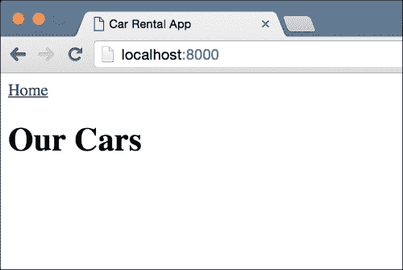
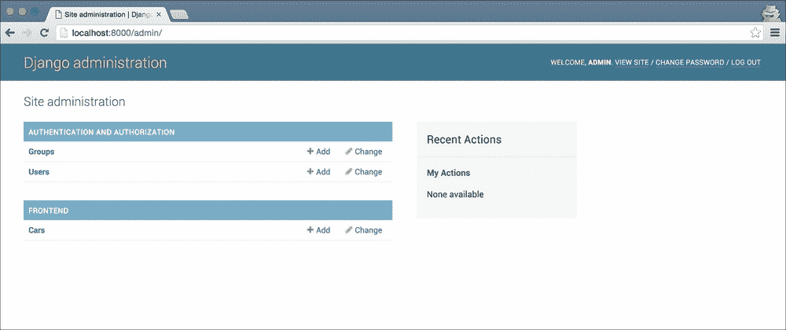
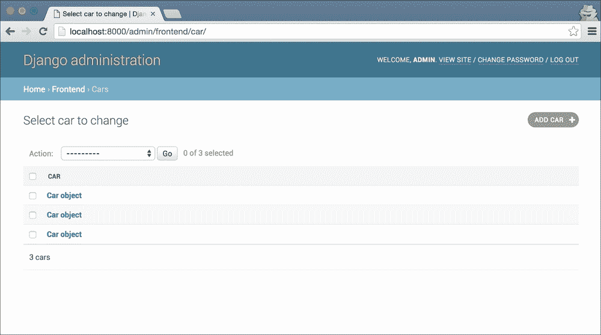
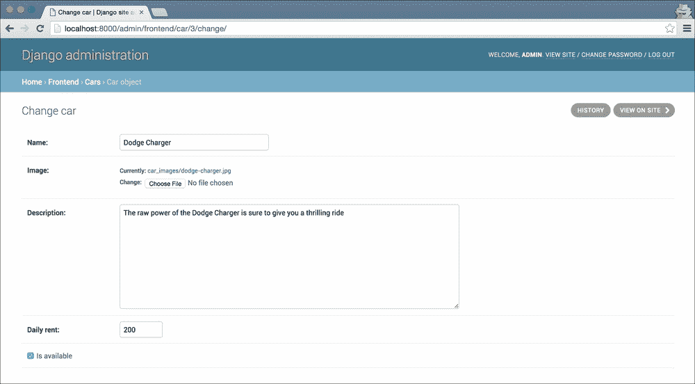
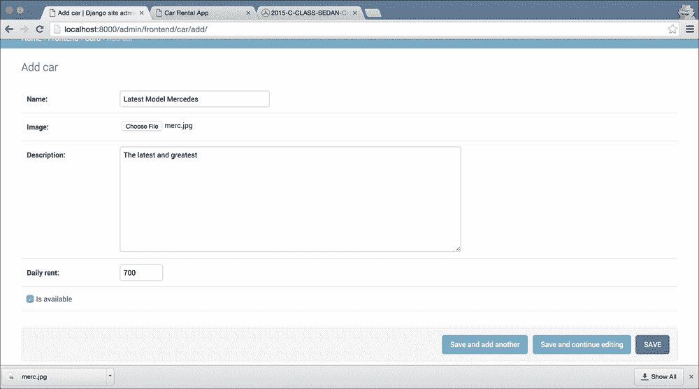
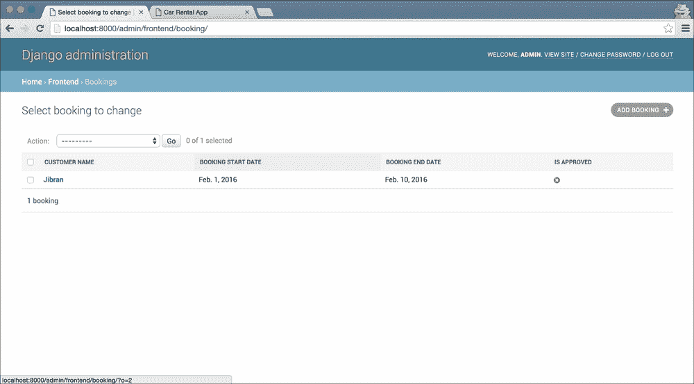
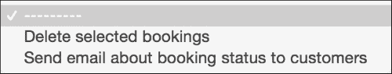

# 四、租车应用

在本章中，我们假设的客户是一家汽车租赁公司。他们希望我们创建一个网站，让他们的客户可以访问，查看可用的汽车库存，并最终预订其中一辆汽车。客户还需要一个管理面板，在那里他们可以管理库存和预订请求。

我们将在（鼓卷）Django 中创建此 web 应用程序！你现在应该对 Django 有足够的信心，web 应用的前端对我们来说不会是一个挑战。本章的重点是定制 Django 内置**管理**应用程序，以满足我们客户的需求。大多数情况下，当您需要为所创建的 web 应用程序设置管理面板时，您可以通过自定义 Django 管理员来完成几乎所有需要的操作。有时需求非常复杂，您需要创建一个自定义的管理面板，但这种情况很少发生。因此，我们在这里获得的知识将证明对您的 web 开发职业非常有用。

本章的主要内容如下：

*   自定义 Django 管理模型表单
*   将自定义筛选器添加到管理对象列表页面
*   重写和自定义 Django 管理模板

# 代码包

正如我所提到的，到目前为止，您应该已经牢牢掌握了创建基本 web 应用程序的组件，包括视图、模板、模型和 URL 配置，因此在本章中我们将不讨论 web 应用程序的这些部分。因此，本章的代码包比前几章要大得多。我已经创建了所有的模型和一些视图、模板和 URL。我们将主要关注如何驯服 Django 管理应用程序以满足我们的需求。

我想不出这个项目的别致的名字，所以我就叫这个项目*carrental*。一如既往，创建一个新的虚拟环境，在此环境中安装 Django，然后运行 migrate 命令初始化数据库。对于这个项目，我们需要再安装一个 Python 包 Pillow，它是 Python 的一个图像处理库。要安装它，请在激活虚拟环境的情况下运行以下命令：

```py
> pip install Pillow

```

这可能需要一分钟左右的时间，因为可能需要进行一些编译。安装枕头有点复杂，因为它依赖于第三方库。如果安装命令失败，请查看[中有关安装枕头的文档 https://pillow.readthedocs.org/en/3.0.x/installation.html](https://pillow.readthedocs.org/en/3.0.x/installation.html) 。本页为每个操作系统提供了分步指南，按照指南，您应该能够轻松安装枕头。请记住，您需要库来运行和处理租车应用程序。

安装 Pillow 后，使用`runserver`命令运行开发服务器，并在`http://127.0.0.1:8000`处打开 web 应用程序。您应该看到以下页面：



# 固定装置

我们的数据库是空的，但是现在我们没有任何视图可以向数据库添加对象。我们可以像上一章那样创建一个管理命令，但是有一个更简单的方法。我在数据库中添加了三个`Car`对象，然后创建了一个可以加载的数据转储。像这样的数据转储称为 fixture。稍后我们将讨论固定装置；现在，让我们看一下如何使用它们在数据库中加载数据。

在命令行上，在激活虚拟环境的情况下，在项目根目录中运行此命令：

```py
> python manage.py loaddata frontend/fixtures/initial.json
Installed 3 object(s) from 1 fixture(s)

```

刷新网页，现在您将看到类似以下内容的网页：


现在我们的数据库中有三辆车。你应该在应用程序周围玩一会儿。每辆车都有一个详细信息页面，允许您从详细信息页面提交预订请求。

### 注

如果您尝试使用预订表单，请注意开始日期和结束日期需要采用 YYYY-MM-DD 格式。例如，2016-12-22 是表格接受的有效日期格式。

要了解更多关于夹具的，请查看[上的 Django 文档 https://docs.djangoproject.com/en/stable/howto/initial-data/](https://docs.djangoproject.com/en/stable/howto/initial-data/) 。fixture 是 Django 的一项功能，它允许您使用多种格式将数据库中的数据转储为简单的文本文件。最常用的格式是 JSON。一旦你有了一个 fixture 文件，你就可以使用它来用数据填充你的数据库，就像我们在这里所做的那样，使用`loaddata`命令。

在我们开始管理定制之前，我想谈谈我在这个应用程序的模型中使用的一些新东西。您应该看看`frontend/models.py`来了解我们的模型是如何配置的，然后阅读下面的信息，这解释了的新概念。

# 图像和文件字段

我想花一分钟时间介绍一下的`ImageField`模型字段。这是我们第一次看到它，使用它与其他模型字段有点不同。以下是我们使用此字段的`Car`模型：

```py
class Car(models.Model):
    name = models.CharField(max_length=100)
    image = models.ImageField(upload_to='car_images')
    description = models.TextField()
    daily_rent = models.IntegerField()

    is_available = models.BooleanField()

    def get_absolute_url(self):
        return reverse('car-details', kwargs={'pk': self.pk})
```

### 注

本节中关于`ImageField`的所有信息也与`FileField`相关。

`ImageField`是一个特殊的字段，不同于我们所看到的所有其他数据库模型字段，原因有几个。首先，它需要枕头图像处理库才能工作，这就是为什么我们必须在本章开始时安装它的原因。如果我们试图在没有安装 Pillow 的情况下运行应用程序，Django 会抱怨，并且永远不会启动开发服务器。

其次，`ImageField`是少数 Django 数据库模型字段之一，它依赖于在使用之前配置一些设置。如果您查看靠近末尾的`carrental/settings.py`文件，您应该会看到我已经设置了`MEDIA_ROOT`和`MEDIA_URL`变量。

最后，您可以看到我们将一个`upload_do`参数传递给`ImageField`并将其设置为`car_images`。`FileField`和`ImageField`数据库模型字段都需要此参数。此参数是相对于配置的`MEDIA_ROOT`文件夹的名称，其中通过图像/文件字段上载到应用程序的任何文件都将被保存。这是一个我花了一些时间才弄明白的概念，所以我将进一步解释它。

您应该看到我已将`MEDIA_ROOT`设置为项目根目录中的`media`文件夹。如果您查看`media`文件夹中的，您应该会看到另一个名为`car_images`的文件夹。此与我们传入的`upload_to`参数同名。这就是我所说的，`upload_to`参数是相对于配置的媒体根目录的文件夹名*。*

### 提示

当我开始使用 Django 时，有一件事我很难理解，`MEDIA_ROOT`和`STATIC_ROOT`之间的区别。简单地说，`MEDIA_ROOT`是网站用户上传的所有文件的所在地。这些文件是使用带有表单的图像/文件字段上载的。

`STATIC_ROOT`是放置与 web 应用程序关联的静态文件的位置。这些文件包括 CSS 文件、JavaScript 文件和任何其他按原样提供的静态文件。这些与 web 应用程序的 Django 部分无关；通常通过网络服务器（如 nginx）将它们按原样交付给用户。

既然您已经配置好了所有内容，那么如何使用`ImageField`上传文件呢？Django 支持两种不同的方法。在我们的代码中，我们将使用`ModelForm`，它为我们处理所有细节。还有其他方法。如果您想了解更多详细信息，应该查看处理文件上载的 Django 文档。它非常全面，列出了处理文件上传的所有不同方式。您可以在[查阅 https://docs.djangoproject.com/en/stable/topics/http/file-uploads/](https://docs.djangoproject.com/en/stable/topics/http/file-uploads/) 。

# 获取绝对 url

在`Car`模型中，我们第一次看到的是`get_absolute_url`。实施没有什么特别之处。它只是一个返回 URL 的类方法，它使用`reverse`函数和对象的主键构建 URL。这不是什么新鲜事。从第一章开始，我们就一直在为细节页面创建这样的 URL。这里值得注意的是，Django 为模型类上的`get_absolute_url` 方法赋予了特殊含义。如果`get_absolute_url`方法存在于模型对象上，Django 会在许多地方自动使用该方法的返回值。例如，`CreateView`通用方法使用它。如果在 view 类上没有提供`success_url`属性和自定义`get_success_url`方法，Django 将尝试获取 URL，以便在 model 类中定义方法的情况下从新创建的对象上的方法`get_absolute_url`方法重定向。

Django 在管理应用程序中也使用此方法，我们将在后面看到。如果您感兴趣，您可以查看相关文档：

[https://docs.djangoproject.com/en/stable/ref/models/instances/#get-绝对 url/](https://docs.djangoproject.com/en/stable/ref/models/instances/#get-absolute-url/)。

# Django 管理应用程序

现在，我们已经了解了代码包中使用了哪些新功能，让我们转到本章的主要主题 Django**admin**应用程序。管理应用程序很可能是 Django 较其他类似 web 框架流行的主要原因之一。这是 Django 的特性所包含的*电池的具体体现。通过最低限度的配置，管理员应用程序提供了一个功能齐全、定制度极高的 CMS，足以与 WordPress 和 Drupal 等大公司竞争。*

在本章中，您将了解配置和自定义管理员以获得 web 应用程序的管理面板中所需的大部分功能是多么容易。让我们先来解决我们虚构的客户，一个汽车租赁企业主最直接的问题，那就是添加和编辑汽车详细信息的能力。

启动新应用程序时，Django 默认在应用程序文件夹中创建一个`admin.py`文件。更改我们项目中的`frontend/admin.py`文件以匹配此内容：

```py
from django.contrib import admin
from frontend.models import Car
admin.site.register(Car)
```

就这样。真正地总共三行，您可以编辑`Car`对象并将其添加到数据库中。这就是 Django 的力量，就在这三行中。让我们测试一下。在您的浏览器中，访问`http://127.0.0.1:8000/admin`，您将看到一个类似于以下页面的页面：


### 提示

如果你的管理员看起来有点不同，不要担心。Django 每隔一段时间就会更新管理员的主题，根据您使用的 Django 版本的不同，您的管理员可能会略有不同。但是，所有的功能都将在那里，并且几乎总是具有相同的界面布局。

哎呀，有一件事我们遗漏了。我们没有创建要登录的用户。这很容易解决。在命令行中，在激活虚拟环境的情况下运行此命令：

```py
> python manage.py createsuperuser

```

只需按照提示创建新用户。创建用户后，使用它登录到管理员。登录后，您应该会看到类似的内容：



在此屏幕中需要注意的几点。首先，Django 将默认添加链接来管理**组**和**用户**。其次，我们配置为显示在管理中的任何模型都按其应用程序名进行分组。因此，管理**汽车**的链接显示在定义型号的应用程序**前端**的标签下。

### 提示

如果您密切关注，您可能会注意到管理员列出了我们`Car`型号的复数名称。它怎么知道复数名？嗯，它只是在我们的型号名称前面加了一个“s”。在很多情况下，这是行不通的，例如，如果我们有一个名为`Bus`的模型。对于这种情况，Django 允许我们为模型配置复数名称。

让我们尝试编辑数据库中的一个汽车对象。点击**Cars**链接，您将看到一个类似于以下屏幕的屏幕：



这张单子看起来没什么用处。我们不知道哪个汽车物体是哪个。我们将在一点时间内解决这个问题。现在，只需单击列表中顶部的 car 对象，您就会看到一个页面，可以在其中编辑该对象的详细信息：



### 注

Django 管理文档将此列表称为变更列表。在本章中，我将称之为列表视图。

让我们换一辆车的名字。我把**道奇充电器**换成了**我的新车名**。更改名称后滚动至页面底部，然后单击保存。为了确保我们所做的更改已实际保存，请在`http://127.0.0.1:8000/`打开我们应用程序的主页，您将看到您编辑的汽车将显示新名称。

让我们试试更复杂的添加新车！点击屏幕右侧的**添加汽车**按钮，按需填写详细信息。只需确保选中`is_available`复选框；否则，新车就不会出现在主页上。我填写了如下截图所示的表格：



我还从 Google Images 下载了汽车的图像，并将其选为**图像**字段。单击保存按钮，然后再次访问主页。您添加的新车应显示在列表的末尾：


正如我在本节开头提到的，Django 管理员的力量是 Django 受欢迎的主要原因之一。现在你应该明白为什么了。在三行中，我们有一个完整的工作内容管理系统，客户可以使用该系统编辑汽车并将其添加到他们的网站，尽管不是很漂亮。

然而，在目前的形式下，管理员看起来像一个快速的黑客工作。客户可能对此不太满意。在编辑页面打开之前，他们甚至看不到要编辑的汽车。让我们先解决这个问题。稍后我们将回到刚才为管理员编写的代码。

# 显示车辆名称

如果您还记得上一章，我们在模型类上研究了`__str__`方法。我还说过，Django 在需要显示模型的字符串表示的任何地方都使用此方法。这正是 Django 管理员在`Car`模型的列表视图中所做的：它显示它的字符串表示。让我们通过将字符串表示形式更改为用户可以理解的形式，使列表更加用户友好。在`frontend/models.py`文件中，将此`__str__`方法添加到`Car`模型类中：

```py
def __str__(self):
    return self.name
```

让我们看看现在的`Car`对象列表是什么样子的：


这是一个更好的用户体验，因为用户现在可以看到他们将要编辑的汽车。

# 预约管理

让我们暂时离开汽车管理部分，转到车型的管理部分。每次网站访问者提交可从汽车详细信息页面访问的**Book Now**表单时，我们都会创建一个新的`Booking`车型记录。我们需要一种方法，允许客户查看这些预订查询，根据一些标准进行筛选，并接受或拒绝它们。让我们看看如何做到这一点。首先，让我们确保`Booking`模型在我们的管理面板中显示为一个项目。为此，请将以下两行添加到您的`frontend/admin.py`文件中：

```py
from frontend.models import Booking
admin.site.register(Booking)
```

如果您现在查看 URL`http://127.0.0.1:8000/admin/`上的管理面板，您应该会看到`Booking`模型已添加为链接。打开链接，你会看到一个列表页面，与我们之前看到的型号`Car`相似。如果您提交了任何预订请求，它们应显示在列表中。这并不漂亮，但至少它能起作用。让我们做得更好。首先，我们需要向管理员提供有关每次预订查询的更多信息。如果我们能显示客户的姓名、预订开始和结束日期以及预订是否已获得批准，那就太好了。

虽然我们可以再次使用`__str__`方法来创建包含所有这些信息的字符串，但一列中的信息太多并不是一个好现象。此外，我们将错过 Django 管理员为每个模型列表页面提供的排序功能。

让我们看看如何在列表视图中显示模型中的多个字段。在此过程中，您还将了解更多有关管理员如何在内部工作的信息。

## 窗帘后的一瞥

如果你花一分钟的时间来思考我们只用几行代码就能实现什么，你可能会惊讶于 Django 管理员的强大功能。这一权力是如何实现的？这个问题的答案很复杂。即使是我也还不完全了解管理应用程序是如何工作的。这是一个非常复杂的编程。

### 注

尽管管理应用程序相当复杂，但它仍然是 Python 代码。如果有一天你觉得很有冒险精神或者很无聊，试着看看管理应用程序的源代码。它在`VIRTUAL_ENV/lib/python3.5/site-packages/django/contrib/admin`文件夹中。将`VIRTUAL_ENV`替换为保存您为项目创建的虚拟环境的文件夹。

`ModelAdmin`类是管理系统的主要组件之一。正如`models.Model` 类允许我们使用非常简单的类定义来定义复杂的数据库模型，`ModelAdmin`类允许我们为模型定制非常详细的管理接口。让我们看看如何使用它在预订查询列表中添加额外字段。更改`frontend/admin.py`文件以匹配以下内容：

```py
from django.contrib import admin

from frontend.models import Car
from frontend.models import Booking

class BookingModelAdmin(admin.ModelAdmin):
    list_display = ['customer_name', 'booking_start_date', 'booking_end_date', 'is_approved']

admin.site.register(Car)
admin.site.register(Booking, BookingModelAdmin)
```

现在，如果您打开`Booking`模型的管理员列表页面，您将看到类似的内容，其中显示了所有重要字段：



这为用户提供了一个非常好的表格视图。客户机现在可以看到所有相关的详细信息，并能够根据需要对表进行排序。Django 也非常有用，可以用一种好的格式显示日期值。让我们看看我们在这里做了什么。

我们首先创建了一个名为`BookingModelAdmin`的`ModelAdmin`子类。然后，我们使用`list_display`属性配置了要在列表页面中显示的字段。最后，我们需要将我们的`ModelAdmin`类与`Booking`模型类相关联，以便管理员可以根据我们的需求进行自定义。我们使用以下方法来实现这一点：

```py
admin.site.register(Booking, BookingModelAdmin)
```

如果你看看我们注册`Car`模型的方式，它看起来与`Booking`模型类似：

```py
admin.site.register(Car)
```

那是因为这是同一件事。如果不提供自定义的`ModelAdmin`子类，Django 将使用默认选项，这就是我们在`Car`模型中看到的。

# 提升用户体验

虽然我们通过在列表页面上显示相关字段，对基本管理界面进行了相当多的改进，但我们可以做更多。让我们看看管理员可能希望对网站收到的预订查询采取的一些操作：

*   仅查看已批准或尚未批准的预订查询
*   按客户名称搜索预订
*   快速批准或不批准预订查询
*   选择多个预订查询对象，并向客户发送关于其批准/不批准的电子邮件

## 过滤对象

对于我们的第一个功能，我们希望允许用户对显示的对象进行过滤。页面上应有一个过滤器，允许他们仅查看已批准或未批准的预订。为此，Django admin 在`ModelAdmin`子类上为您提供一个`list_filter`属性。`list_filter`属性包含可以筛选的字段列表。在我们的`BookingModelAdmin`类中，添加以下`list_filter`属性：

```py
list_filter = ['is_approved']
```

就这样。将此行添加到`BookingModelAdmin`后，打开预订列表页面；在右侧，您应该会看到一个新的侧栏，您可以在其中选择只查看已批准或未批准的预订，或同时查看这两种预订。它应该类似于以下屏幕截图：


## 寻找物体

就像 Django 管理员内置了对过滤器的支持一样，它也提供了一种添加搜索的简单易用方法。我们希望我们的客户能够通过客户姓名字段搜索预订。为此，将`search_fields`属性添加到`BookingModelAdmin`类中：

```py
search_fields = ['customer_name']
```

就这样。添加此属性后，您应该会在“预订对象”列表的顶部看到一个搜索框。输入几个示例查询，看看它是如何工作的。如果您有多个字段需要搜索，您也可以将其添加到`search_fields`列表中。

如果列表中有多个字段名，Django 将执行 OR 搜索。这仅仅意味着对于给定的搜索，将显示至少有一个匹配字段值的所有记录。

## 快速编辑

我们列表中的第三个功能是允许管理员快速将预订标记为已批准/未批准。Django 管理员提供了另一个内置功能，我们可以对其进行配置以获得所需的内容。在`BookingModelAdmin`类中，添加`list_editable`属性：

```py
list_editable = ['is_approved']
```

如果您现在打开预订列表页面，您会注意到，您现在在列表末尾添加了一个复选框和一个**保存**按钮，而不是之前在`is_approved`列中显示的图标。您可以选择要批准的预订的复选框，取消选择要不批准的预订的复选框，然后单击**保存**。Django 将一次性保存对多个对象的更改。

现在，我们的预订列表页面与以下屏幕截图类似：


## 管理行动

功能列表中的最后一点是，用户可以选择多个预订查询对象，并为每个`Booking`对象向`customer_email`发送电子邮件，其中包含预订的批准状态。现在，我们将在控制台上打印电子邮件以测试此功能。我们将在后面的一章中讨论从 Django 发送电子邮件。

到目前为止，我们使用 Django 管理员进行的大多数编辑都是基于每个对象的。选择一个对象，编辑它，然后保存它，然后重新开始。除了最后一个功能（快速编辑），我们一次编辑一个对象。但是，有时您希望能够对多个对象执行公共操作，就像我们的电子邮件功能所需要的那样。为了实现这些特性，Django 管理员提供了**管理操作**。

管理操作是`ModelAdmin`类上的方法，传递给用户选择的对象列表。然后，这些方法可以对这些对象中的每个对象执行一些操作，并再次将用户返回到变更列表页面。

### 注

事实上，我把这个简化了一点。管理操作不需要是`ModelAdmin`上的方法。它们也可以是独立的函数。然而，在使用它们的`ModelAdmin`中声明它们通常是一种很好的编程实践，所以我们将在这里这样做。您可以在[的管理操作文档中找到更多详细信息 https://docs.djangoproject.com/en/stable/ref/contrib/admin/actions/](https://docs.djangoproject.com/en/stable/ref/contrib/admin/actions/) 。

Django 管理员默认提供一个操作：删除。如果您打开预订列表顶部的**操作**下拉列表，您将看到以下菜单：


要定义管理操作，首先需要在`ModelAdmin`类上创建一个方法，然后将该方法的名称添加到该类的`actions`属性中。`actions`属性是一个列表，就像我们迄今为止看到的所有其他属性一样。修改`BookingModelAdmin`以匹配以下代码：

```py
class BookingModelAdmin(admin.ModelAdmin):
    list_display = ['customer_name', 'booking_start_date', 'booking_end_date', 'is_approved']
    list_filter = ['is_approved']
    list_editable = ['is_approved']
    search_fields = ['customer_name']

    actions = ['email_customers']

    def email_customers(self, request, queryset):
        for booking in queryset:
            if booking.is_approved:
                email_body = """Dear {},
    We are pleased to inform you that your booking has been approved.
Thanks
""".format(booking.customer_name)
            else:
                email_body = """Dear {},
    Unfortunately we do not have the capacity right now to accept your booking.
Thanks
""".format(booking.customer_name)

            print(email_body)
```

在研究代码的作用之前，让我们先尝试一下。刷新预订模型的`changelist`页面，查看**动作**下拉列表。它应该有一个新选项，**电子邮件客户**：


要进行测试，请从列表中选择一些预订对象，从下拉菜单中选择**电子邮件客户**操作，然后单击下拉菜单旁边的**Go**按钮。页面加载后，查看控制台。您应该看到类似于此处所示的内容：

```py
Dear Jibran,
    We are pleased to inform you that your booking has been approved.
Thanks

[18/Jan/2016 09:58:05] "POST /admin/frontend/booking/ HTTP/1.1" 302 0
```

让我们看看我们在这里做了什么。如前所述，管理操作只是`ModelAdmin`类上的一个方法，它接受`request`对象和`queryset`作为参数，然后在`queryset`上执行所需的操作。在这里，我们为每个预订对象创建一个电子邮件正文文本，并将其打印到控制台。

## 用户体验改进

虽然系统现在已经足够好让我们的客户使用，但肯定还有改进的余地。首先，用户没有收到任何关于是否执行了**电子邮件客户**操作的反馈。让我们先解决这个问题。将此行添加到`email_customers`方法的末尾：

```py
self.message_user(request, 'Emails were send successfully')
```

请尝试再次使用电子邮件操作。现在，当页面重新加载时，您会看到一条很好的成功消息，向用户保证他们想要的操作已经完成。用户体验方面的一些小改进对于帮助用户导航并成功使用您的产品大有帮助。

其次，让我们看一下动作的命名。对于这一行动，Django 想出了一个很好的名字——**电子邮件客户**。这很简单，切中要害。然而，这并不像应该的那么清楚。它不会向用户传达正在发送的电子邮件。在一个更大的系统中，客户机可能会发送多种类型的电子邮件，我们的操作名称应该清楚地知道我们在谈论哪些电子邮件。

为了更改管理操作的名称，我们需要给该方法一个名为`short_description`的属性。由于方法在 Python 中也是对象，所以这非常简单。更改`BookingModelAdmin`类以匹配以下代码。要添加的新行将高亮显示：

```py
class BookingModelAdmin(admin.ModelAdmin):
    list_display = ['customer_name', 'booking_start_date', 'booking_end_date', 'is_approved']
    list_filter = ['is_approved']
    list_editable = ['is_approved']
    search_fields = ['customer_name']

    actions = ['email_customers']

    def email_customers(self, request, queryset):
        for booking in queryset:
            if booking.is_approved:
                email_body = """Dear {},
    We are pleased to inform you that your booking has been approved.
Thanks
""".format(booking.customer_name)
            else:
                email_body = """Dear {},
    Unfortunately we do not have the capacity right now to accept your booking.
Thanks
""".format(booking.customer_name)

            print(email_body)

        self.message_user(request, 'Emails were send successfully')
    email_customers.short_description = 'Send email about booking status to customers'

```

注意新行（最后一行）不是功能体的一部分。它与函数定义在同一级别缩进，实际上是类的一部分，而不是函数的一部分。刷新列表页面并再次查看操作下拉列表：



# 总结

本章可能是为本书任何章节编写的代码最少的一章。然而，我们在这里构建的功能可能比我们在大多数章节中构建的更复杂。我在本章开始时说过，Django 框架流行的原因之一是管理应用程序。我希望你现在同意我的看法。

用不到 20 行代码，我们就能够创建一个可以与大多数 CMS 系统匹敌的系统，并且更适合我们客户的需求。与大多数 CMS 系统不同，我们不将`Car`和`Booking`对象视为页面或节点。在我们的系统中，它们是一流的对象，每个对象都有自己的字段和单独的功能。然而，就客户机而言，管理员的工作方式与任何 CMS 一样，可能更简单，因为没有像大多数 CMS 解决方案中那样的额外字段。

我们刚刚开始对管理员进行定制。管理员提供了许多功能，以满足管理面板所需的大多数场景。通过更改`ModelAdmin`上的一些设置，可以轻松使用所有这些电源。在我开发的所有 Django 应用程序中，我只需要创建一次自定义管理面板。Django 管理员是如此可定制，您只需将其配置为符合您的需要。

我强烈建议您查看位于[的 Django 管理员文档 https://docs.djangoproject.com/en/stable/ref/contrib/admin/](https://docs.djangoproject.com/en/stable/ref/contrib/admin/) 。如果需要为 web 应用程序创建管理项目，请检查管理员是否提供了所需的功能。通常情况下，这样做可以节省大量的精力。