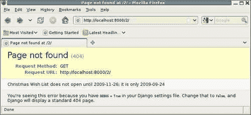
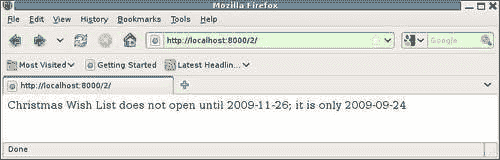
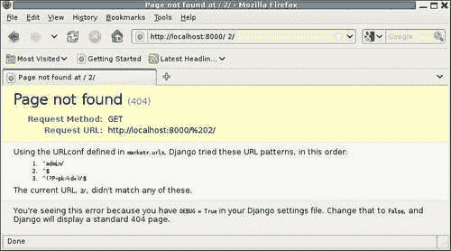

# 六、Django 调试概述

世界上最好的测试套件不会使您免于调试问题。测试只是报告代码是否正常工作。当代码中出现问题时，无论是通过失败的测试还是其他方法发现的，都需要进行调试以找出到底是什么地方出了问题。一个良好的测试套件，定期运行，当然可以帮助调试。来自失败的错误消息的细节、通过哪些测试与失败哪些测试所提供的聚合信息，以及导致问题的代码更改的知识，都可以为调试提供重要线索。有时，这些线索足以找出哪里出了问题以及如何修复，但通常需要执行额外的调试。

本章介绍 Django 的调试支持。它概述了将在后续章节中更深入讨论的主题。具体而言，本章将：

*   列出控制调试信息的收集和显示的 Django 设置，并简要描述启用调试的效果
*   演示在严重代码故障的情况下启用调试运行的结果
*   描述在启用调试的情况下收集的数据库查询历史记录，并说明如何访问它
*   讨论有助于调试的开发服务器功能
*   描述在生产过程中如何处理错误，何时关闭调试，以及如何确保正确报告有关此类错误的信息

# Django 调试设置

Django 有许多设置控制调试信息的收集和显示。第一个名为`DEBUG`；它广泛地控制服务器是在开发模式下运行（如果`DEBUG`是`True`）还是在生产模式下运行。

在开发模式中，最终用户应该是站点开发人员。因此，如果在处理请求期间出现错误，则在发送到 web 浏览器的响应中包含关于该错误的特定技术信息是有用的。这在生产模式中没有用处，因为预期用户只是一般站点用户。

本节介绍三种 Django 设置，它们对开发期间的调试非常有用。在生产过程中使用其他设置来控制应报告哪些错误以及应将错误报告发送到何处。这些附加设置将在生产中处理问题一节中讨论。

## 调试和模板调试设置

`DEBUG`是主要调试设置。将此设置为`True`最明显的效果之一是，Django 将在出现严重代码问题时生成奇特的错误页面响应，例如在处理请求时引发的异常。如果`TEMPLATE_DEBUG`也是`True`，并且引发的异常与模板错误有关，则 fancy error 页面还将包含有关模板中错误发生位置的信息。

这两个设置的默认值都是`False`，但是`manage.py startproject`创建的`settings.py`文件通过在文件顶部包含以下行来启用这两个设置：

```py
DEBUG = True 
TEMPLATE_DEBUG = DEBUG 
```

请注意，当`DEBUG`为`False`时，将`TEMPLATE_DEBUG`设置为`True`没有用处。如果不显示由`DEBUG`设置控制的错误页面，则在`TEMPLATE_DEBUG`打开时收集的附加信息将永远不会显示。同样，当`DEBUG`为`True`时，将`TEMPLATE_DEBUG`设置为`False`也不是很有用。在这种情况下，对于模板错误，奇特的调试页面将缺少有用的信息。因此，如前所示，保持这些设置相互关联是有意义的。

下一节将介绍有关错误页面的详细信息以及生成错误页面的时间。除了生成这些特殊页面外，打开`DEBUG`还有其他一些效果。具体来说，当`DEBUG`开启时：

*   保存发送到数据库的所有查询的记录。有关记录内容和访问方式的详细信息将在后续章节中介绍。
*   对于 MySQL 数据库后端，数据库发出的警告将转换为 Python`Exceptions`。这些 MySQL 警告可能表明存在严重问题，但警告（只会导致打印到`stderr`的消息）可能会被忽略。由于大多数开发都是在打开`DEBUG`的情况下完成的，因此引发 MySQL 警告异常可以确保开发人员知道可能的问题。我们在[第 3 章](03.html "Chapter 3. Testing 1, 2, 3: Basic Unit Testing")*测试 1、2、3：基本单元测试*中遇到了这种行为，当时我们看到`testClosesReset`单元测试根据`DEBUG`设置和 MySQL 服务器配置产生不同的结果。
*   管理员应用程序对所有注册型号的配置执行广泛验证，如果在配置中发现错误，则在首次尝试访问任何管理员页面时引发`ImproperlyConfigured`异常。这种广泛的验证相当昂贵，而且在生产服务器启动期间通常不希望执行这种验证，因为自上次启动以来，管理配置可能没有更改。但是，在启用`DEBUG`的情况下运行时，管理员配置可能已更改，因此，进行显式验证并提供一条特定的错误消息，说明检测到问题时出现了什么问题，这是非常有用的，值得付出代价的。
*   最后，Django 代码中有几个地方在`DEBUG`打开时会发生错误，生成的响应将包含有关错误原因的特定信息，而在`DEBUG`关闭时，生成的响应将是一个通用错误页面。

## 模板字符串如果设置无效

第三个在开发过程中对调试有用的设置是`TEMPLATE_STRING_IF_INVALID`。此设置的默认值为空字符串。此设置用于控制插入到模板中的内容，以代替对无效（例如，模板上下文中不存在）变量的引用。空字符串的默认值不会导致任何可见的内容代替这些无效的引用，这会使它们很难被注意到。将`TEMPLATE_STRING_IF_INVALID`设置为某个值可以更容易地跟踪此类无效引用。

但是，Django 附带的一些代码（特别是管理应用程序）依赖于将无效引用替换为空字符串的默认行为。使用非空`TEMPLATE_STRING_IF_INVALID`设置运行这样的代码可能会产生意外的结果，因此，只有当您特别试图在代码中跟踪拼写错误的模板变量之类的内容时，此设置才有用，因为它始终确保在模板上下文中设置变量，即使是空的变量。

# 调试错误页面

当`DEBUG`打开时，Django 在两种情况下生成奇特的调试错误页面：

*   当引发`django.http.Http404`异常时
*   当引发任何其他异常且常规视图处理代码未处理该异常时

在后一种情况下，调试页面包含大量有关错误、导致错误的请求以及错误发生时的环境的信息。下一章将介绍如何破译此页并充分利用它提供的信息。`Http404`异常的调试页面相当简单，将在这里介绍。

若要查看 AutoT0-调试页的示例，请考虑从 Type T2R 第 4 章 AUTT3:

```py
def survey_detail(request, pk): 
    survey = get_object_or_404(Survey, pk=pk) 
    today = datetime.date.today() 
    if survey.closes < today: 
        return display_completed_survey(request, survey) 
    elif survey.opens > today: 
        raise Http404 
    else: 
        return display_active_survey(request, survey) 
```

有两种情况下，此视图可能引发`Http404`异常：当数据库中未找到请求的调查时，以及当已找到但尚未打开时。因此，我们可以通过尝试访问不存在的调查的调查详细信息（例如调查编号 24）来查看调试 404 页面。结果如下：


No.To.T2:在页面的中间有一条消息，描述了页面未找到响应的原因：Oracle T3。没有调查与给定的查询相匹配。此消息由`get_object_or_404`功能自动生成。相比之下，在调查被发现但尚未打开的情况下，裸露的`raise Http404`看起来没有任何描述性信息。要确认这一点，请添加一个在将来有打开日期的调查，并尝试访问其详细信息页面。结果如下所示：


That 不是一个非常有用的调试页面，因为它缺少关于搜索内容以及为什么无法显示的任何信息。要使此页面更有用，请在引发`Http404`异常时包含一条消息。例如：

```py
        raise Http404("%s does not open until %s; it is only %s" %  
            (survey.title, survey.opens, today)) 
```

那么尝试访问此页面将更有帮助：



注意，与`Http404`异常一起提供的错误消息仅显示在调试 404 页面上；它不会出现在标准的 404 页面上。因此，您可以根据自己的喜好对此类消息进行描述性处理，而不必担心它们会将私人或敏感信息泄露给普通用户。

另一件需要注意的事情是，只有在引发`Http404`异常时才会生成调试 404 页面。如果您手动构造一个带有 404 状态代码的`HttpResponse`，它将被返回，而不是 debug 404 页面。考虑这个代码：

```py
      return HttpResponse("%s does not open until %s; it is only %s" %
          (survey.title, survey.opens, today), status=404) 
```

如果使用该代码代替`raise Http404`变量，则浏览器将仅显示传递的消息：



如果没有突出的**页面未找到**消息和明显的错误页面格式，此页面甚至不明显是错误报告。还请注意，一些浏览器默认情况下会将服务器提供的内容替换为假定的“友好”错误页面，该页面的信息量甚至更少。因此，使用`Http404`异常而不是使用 h 状态代码 404 手动构建`HttpResponse`对象更容易、更有用。

debug 404 页面的一个非常有用的 final 示例是 URL 解析失败时生成的页面。例如，如果我们在 URL 中的调查编号之前添加额外的空格，则生成的调试 404 页面将如下所示：



此页面上的消息包含找出 URL 解析失败原因所需的所有信息。它包括当前 URL、用于解析的基`URLConf`的名称，以及按顺序尝试匹配的所有模式。

如果你做了大量的 Django 应用程序编程，很有可能在某个时候出现这个页面，你会确信其中一个列出的模式应该与给定的 URL 匹配。你错了。不要浪费精力去想 Django 怎么会这么坏。相反，相信错误信息，集中精力找出你认为应该匹配的模式实际上不匹配的原因。仔细查看模式的每个元素，并将其与当前 URL 中的实际元素进行比较：会有不匹配的内容。

在这种情况下，您可能认为第三个列出的模式应该与当前 URL 匹配。模式中的第一个元素是主键值的捕获，而实际的 URL 值确实包含一个可能是主键的数字。但是，捕获是使用模式**\d+**完成的。尝试将其与实际 URL 字符匹配（空格后跟**2**）失败，因为**\d**只匹配数字，空格字符不是数字。总会有这样的事情来解释 URL 解析失败的原因。

下一章将包括更多导致调试页面的常见错误示例，并将深入研究这些页面上的所有可用信息。现在，我们将离开调试页面的主题，学习如何访问`DEBUG`打开时维护的数据库查询历史记录。

# 数据库查询历史记录

当`DEBUG`为`True`时，Django 维护发送到数据库的所有 SQL 命令的历史记录。该历史记录保存在一个名为`queries`的列表中，该列表位于`django.db.connection`模块中。查看此列表中保存的内容的最简单方法是从 shell 会话中检查它：

```py
>>> from django.db import connection 
>>> connection.queries 
[] 
>>> from survey.models import Survey 
>>> Survey.objects.count() 
2 
>>> connection.queries 
[{'time': '0.002', 'sql': u'SELECT COUNT(*) FROM "survey_survey"'}] 
>>> 

```

在这里，我们看到在 shell 会话开始时，`queries`最初是空的。然后我们检索数据库中`Survey`对象数量的计数，返回为**2**。当我们再次显示`queries`的内容时，我们看到`queries`列表中现在有一个查询。列表中的每个元素都是一个包含两个键的字典：`time`和`sql`。`time`的值是执行查询所用的时间（以秒为单位）。`sql`的值是发送到数据库的实际 SQL 查询。

关于`connection.queries`中包含的 SQL，需要注意一点：它不包括引用查询参数。例如，考虑关于 OLE T1 的查询所显示的 SQL，其标题为：

```py
>>> Survey.objects.filter(title__startswith='Christmas') 
[<Survey: Christmas Wish List (opens 2009-11-26, closes 2009-12-31)>] 
>>> print connection.queries[-1]['sql'] 
SELECT "survey_survey"."id", "survey_survey"."title", "survey_survey"."opens", "survey_survey"."closes" FROM "survey_survey" WHERE "survey_survey"."title" LIKE Christmas% ESCAPE '\'  LIMIT 21 
>>>

```

在显示的 SQL 中，需要引用`Christmas%`才能使 SQL 有效。但是，我们在这里看到它在`connection.queries`中存储时没有引用。原因是 Django 实际上并没有以这种形式将查询传递给数据库后端。相反，Django 传递参数化查询。也就是说，传递的查询字符串包含参数占位符，并且单独传递参数值。然后，由数据库后端执行参数替换和正确引用。

对于放置在`connection.queries`中的调试信息，Django 会进行参数替换，但它不会尝试进行引用，因为不同的后端会有所不同。因此，不要担心在`connection.queries`中没有引用参数：这并不意味着参数在实际发送到数据库时没有正确引用。不过，这确实意味着，`connection.queries`中的 SQL 无法成功剪切并直接粘贴到数据库外壳程序中。如果要在数据库 shell 中使用 SQL 表单`connection.queries`，则需要提供缺少的参数引号。

您可能已经注意到并对前面 SQL 中包含的`LIMIT 21`感到好奇。请求的`QuerySet`没有包含限制，那么为什么 SQL 包含限制呢？这是`QuerySet repr`方法的一个特性，pythonshell 调用 ch 来显示`Survey.objects.filter`调用返回的值。

一个`QuerySet`可能有很多元素，例如，显示整个集合（如果它很大的话）在 Python shell 会话中不是特别有用。因此，`QuerySet repr`最多显示 20 项。如果有更多内容，`repr`将在末尾添加省略号，表示显示不完整。因此，对`QuerySet`调用`repr`产生的 SQL 将结果限制为 21 项，这足以确定是否需要省略号来指示打印的结果不完整。

每当您看到数据库查询中包含`LIMIT 21`时，这是一个信号，该查询很可能是调用`repr`的结果。由于应用程序代码中不经常调用`repr`，因此此类查询可能是由其他代码（如此处的 Python shell 或图形调试器变量显示窗口）生成的，这些代码可能会自动显示`QuerySet`变量的值。记住这一点有助于在试图找出`connection.queries`中出现某些查询的原因时减少混淆。

关于`connection.queries`有一个最后一项需要注意：尽管有名称，但不限于 SQL 查询。发送到数据库的所有 SQL 语句，包括更新和插入，都存储在`connection.queries`中。例如，如果我们从 shell 会话创建一个新的`Survey`，我们将看到结果 SQL 插入存储在`connection.queries`中：

```py
>>> import datetime
>>> Survey.objects.create(title='Football Favorites',opens=datetime.date.today()) 
<Survey: Football Favorites (opens 2009-09-24, closes 2009-10-01)> 
>>> print connection.queries[-1]['sql'] 
INSERT INTO "survey_survey" ("title", "opens", "closes") VALUES (Football Favorites, 2009-09-24, 2009-10-01) 
>>> 

```

在这里，我们一直在通过 shell 会话访问`connection.queries`。然而，通常情况下，在处理请求后查看它所包含的内容可能会很有用。也就是说，我们可能想知道在创建页面期间生成了哪些数据库流量。然而，从 Python shell 中重新调用视图函数，然后手动检查`connection.queries`并不是特别方便。因此，Django 提供了一个上下文处理器`django.core.contextprocessors.debug`，它可以方便地从模板访问`connection.queries`中存储的数据。在[第 8 章](08.html "Chapter 8. When Problems Hide: Getting More Information")中*当问题隐藏时：获取更多信息*中，我们将看到如何使用此上下文处理器将`connection.queries`中的信息包含在生成的页面中。

# 开发服务器中的调试支持

我们从[第 3 章](03.html "Chapter 3. Testing 1, 2, 3: Basic Unit Testing")开始使用的 d 开发服务器具有几个有助于调试的特性。首先，它提供了一个控制台，允许在开发过程中轻松报告 Django 应用程序代码中发生的事情。开发服务器本身向控制台报告有关其操作的一般信息。例如，开发服务器的典型输出如下所示：

```py
kmt@lbox:/dj_projects/marketr$ python manage.py runserver 
Validating models... 
0 errors found 

Django version 1.1, using settings 'marketr.settings' 
Development server is running at http://127.0.0.1:8000/ 
Quit the server with CONTROL-C. 
[25/Sep/2009 07:51:24] "GET / HTTP/1.1" 200 480 
[25/Sep/2009 07:51:27] "GET /survey/1/ HTTP/1.1" 200 280 
[25/Sep/2009 07:51:33] "GET /survey/888/ HTTP/1.1" 404 1704 

```

正如你所看到的，开发服务器从显式验证模型开始。如果发现任何错误，它们将在服务器启动期间显著报告，并将阻止服务器进入其请求处理循环。这有助于确保在开发过程中所做的任何错误模型更改都能被迅速注意到。

然后，服务器报告正在运行的 Django 级别、正在使用的设置文件以及它正在侦听的主机地址和端口。当您安装了多个 Django 版本并在它们之间切换时，其中的第一个特别有用。例如，如果您在`site-packages`中安装了最新版本，但也通过显式设置`PYTHONPATH`对当前主干进行了 SVN 签出，则您可以使用开发服务器报告的版本来确认（或不确认）您实际上正在使用您目前打算使用的版本。

最后一条启动消息指出，您可以通过按*Ctrl-C*来终止服务器。然后，服务器进入其请求处理循环，并将继续报告其处理的每个请求的信息。为每个请求打印的信息为：

*   处理请求的日期和时间，放在方括号内
*   请求本身，包括 HTTP 方法（例如 GET 或 POST）、路径和客户端指定的 HTTP 版本，都用引号括起来
*   返回的 HTTP 状态代码
*   返回的响应中的字节数

在前面的示例输出中，我们可以看到服务器响应了三个`GET`请求，所有请求都指定了`1.1`的 HTTP 版本。首先是根 URL`/`，这导致了一个 HTTP`200`（OK）状态代码，带有`480`字节响应。类似地，对`/survey/1/`的请求也得到了成功处理，并产生了`280`字节响应，但`/survey/888/`导致了`404`HTTP 状态和`1704`字节响应。返回了`404`状态，因为数据库中不存在主键为`888`的调查。只要能够准确地看到开发服务器接收到了哪些请求，以及响应返回了哪些请求，通常都会派上用场。

有些由开发服务器处理的请求没有显示在控制台上。首先，不会记录对管理员媒体文件（即 CSS、JavaScript 和图像）的请求。如果你查看管理页面的 HTML 源代码，你会发现它的`<head>`部分确实包含了指向 CSS 文件的链接。例如：

```py
<head> 
<title>Site administration | Django site admin</title> 
<link rel="stylesheet" type="text/css" href="/media/css/base.css" /> 
<link rel="stylesheet" type="text/css" href="/media/css/dashboard.css" /> 
```

接收此文档的 web 浏览器将继续从生成原始页面的同一服务器检索`/media/css/base.css`和`/media/css/dashboard.css`。开发服务器将接收并自动提供这些文件，但不会记录该活动。具体来说，它将服务于但不记录以`ADMIN_MEDIA_PREFIX`设置开头的 URL 请求。（此设置的默认值为`/media/`。

开发服务器不会记录的第二个请求是对`/favicon.ico`的任何请求。这是许多 web 浏览器自动请求的文件，以便将图标与书签页面关联或在地址栏中显示图标。将开发服务器的输出与对该文件的请求混在一起是没有意义的，因此它永远不会被记录。

通常，在调试问题时，开发服务器自动记录的非常基本的信息不足以了解发生了什么。发生这种情况时，可以将日志添加到应用程序代码中。假设您将添加的日志输出路由到`stdout`或`stderr`，它将与正常的开发服务器输出一起出现在开发服务器的控制台上。

请注意，某些生产部署环境不允许向`stdout`发送输出。在这样的环境中，应用程序代码中错误地遗留调试 print 语句可能会导致生产中的服务器故障。为了避免这种情况，请始终将调试打印语句路由到`stderr`而不是`stdout`。

还要注意，开发服务器完成的请求日志记录发生在请求处理的最后。记录的信息包括响应的大小，因此在此行出现之前已完全生成响应。因此，例如，在应用程序视图函数中添加的任何日志记录都将出现在开发服务器记录的单行之前。不要感到困惑，认为来自视图函数的打印是指为服务上面记录的请求所做的工作。更多关于向应用程序代码添加日志的细节将在[第 8 章](08.html "Chapter 8. When Problems Hide: Getting More Information")中讨论。

开发服务器在开发和调试代码时非常有用的第二个特性是，当源代码在磁盘上发生更改时，它会自动通知并重新启动自身，以便始终运行当前代码。您可以知道何时发生这种情况，因为当它重新启动时，它将再次打印启动消息。例如，考虑这个输出：

```py
kmt@lbox:/dj_projects/marketr$ python manage.py runserver 
Validating models... 
0 errors found 

Django version 1.1, using settings 'marketr.settings' 
Development server is running at http://127.0.0.1:8000/ 
Quit the server with CONTROL-C. 
[25/Sep/2009 07:51:24] "GET / HTTP/1.1" 200 480 
[25/Sep/2009 07:51:27] "GET /survey/1/ HTTP/1.1" 200 280 
[25/Sep/2009 07:51:33] "GET /survey/888/ HTTP/1.1" 404 1704 
Validating models... 
0 errors found 

Django version 1.1, using settings 'marketr.settings' 
Development server is running at http://127.0.0.1:8000/ 
Quit the server with CONTROL-C. 
[25/Sep/2009 08:20:15] "GET /admin/ HTTP/1.1" 200 7256 

```

这里进行了一些代码更改，导致开发服务器在处理**GET/survey/888/**和**GET/admin/**请求之间重新启动。

虽然这种自动重启行为很方便，但有时可能会遇到麻烦。在编辑和保存代码时出现错误的频率最高。有时，但并非总是，加载错误的文件会导致开发服务器无法注意到文件中的后续更改。因此，即使注意到并修复了错误，也可能不会自动加载已更正的版本。如果开发服务器似乎没有在应该的时候重新加载，那么最好手动停止并重新启动它。

通过将`--noreload`选项传递给`runserver`，可以关闭开发服务器的自动重新加载功能。在单独运行开发服务器时，您可能不会经常希望指定此选项，但如果在调试器下运行，则可能需要指定此选项，以便正确识别调试器断点。这是开发服务器的最后一个特性，使其对调试非常有用：它很容易在调试器下运行。当您甚至不知道要记录什么时，[第 9 章](09.html "Chapter 9. When You Don't Even Know What to Log: Using Debuggers")、*将详细介绍这一点：使用调试器*。

# 生产中的问题处理

在理想的情况下，所有的代码问题都会在开发过程中发现，当代码在生产中时，不会出现任何问题。然而，尽管尽了最大努力，这一理想在现实中很少实现。我们必须为代码在生产模式下运行时出现严重错误的情况做好准备，并在发生错误时安排做一些明智的事情。

做一些明智的事情需要什么？首先，仍然必须向发送导致错误的请求的客户端返回一些响应。但是响应应该只是一个一般错误指示，没有在`DEBUG`激活时生成的奇特调试错误页面中找到的具体内部细节。在最好的情况下，Django 调试错误页面可能会让普通 web 用户感到困惑，但在最坏的情况下，从中收集的信息可能会被恶意用户用来尝试破坏网站。因此，为导致错误的请求生成的公共响应应该是通用错误页。

但是，此类错误的具体细节仍应提供给站点管理员，以便对问题进行分析和修复。Django 通过将`DEBUG`为`False`时遇到的错误的详细信息通过电子邮件发送到`settings.py`中指定的电子邮件地址列表来实现这一点。电子邮件中包含的信息不如调试页面中的内容广泛，但通常足以开始重新创建和修复问题。

本节讨论处理生产过程中遇到的错误所需的步骤。首先，描述了返回一般错误页面需要做什么，然后讨论了指定向何处发送更详细错误信息所需的设置。

## 创建一般错误页面

与花式错误页面一样，有两种类型的常规错误页面：一种报告站点上不存在页面，另一种报告在处理请求期间发生了某些内部服务器错误。Django 为这些错误情况提供默认处理程序，分别自动加载和呈现名为`404.html`和`500.html`的模板。依赖这些错误的默认处理的项目必须提供具有这些名称的模板，以便加载和呈现。`manage.py startproject`没有为这些文件创建默认值。

当它呈现的`404.html`模板时，会传递一个`RequestContext`，其中名为`request_path`的变量被设置为导致引发`Http404`异常的 URL 路径的值。然后，`404.html`模板可以使用`request_path`值和上下文处理器设置的其他变量来定制生成的特定响应。

另一方面，`500.html`模板使用空上下文呈现。发生内部服务器错误时，服务器代码出现严重错误。试图通过上下文处理器处理`RequestContext`可能会引发另一个异常。为了确保生成的响应不会出现任何进一步的错误，`500.html`模板使用空上下文呈现。这意味着`500.html`模板不能依赖通常由上下文处理器设置的任何上下文变量。

通过为其中一种或两种错误情况提供自定义错误处理程序，可以覆盖默认错误处理。Django 文档提供了如何做到这一点的完整细节；这里不讨论它，因为默认处理程序在绝大多数情况下都可以使用。

## 报告生产错误信息

虽然避免向一般用户提供详细的技术错误信息是好的，但完全丢失这些信息并不好。Django 支持在生产中遇到错误时通知站点管理员。本节将讨论与这些通知相关的设置。[第 11 章](11.html "Chapter 11. When it's Time to Go Live: Moving to Production")、*上线时间：转入生产*对转入生产任务和解决过程中遇到的一些常见问题提供了更多指导。

### 内部服务器错误通知

发生服务器错误时，Django 将发送一封电子邮件，其中包含生成错误的请求的详细信息以及从错误中回溯到`ADMINS`设置中列出的所有电子邮件地址。`ADMINS`是包含名称和电子邮件地址的元组列表。`manage.py startproject`设置的值为：

```py
ADMINS = ( 
    # ('Your Name', 'your_email@domain.com'), 
) 
```

注释行显示了向该设置添加值时应使用的格式。

没有控制是否应发送服务器错误通知的设置：Django 将始终尝试发送这些通知。但是，如果您确实不希望为内部服务器错误生成电子邮件通知，则可以将`ADMINS`设置保留为空。不过，这不是推荐的做法，因为除非您的用户向您投诉，否则您不会知道您的站点遇到了问题。

Django 使用 Python 的 SMTP 支持发送电子邮件。为了使其工作，必须正确配置 Django 以与 SMTP 服务器通信。有几个设置可以控制发送邮件，您可能需要为安装自定义这些设置：

*   `EMAIL_HOST`是运行 SMTP 服务器的主机的名称。此设置的默认值为`localhost`，因此，如果没有 SMTP 服务器与 Django 服务器在同一台计算机上运行，则需要将其设置为运行可用于发送邮件的 SMTP 服务器的主机。
*   `EMAIL_HOST_USER`和`EMAIL_HOST_PASSWORD`一起可用于对 SMTP 服务器进行身份验证。默认情况下，两者都设置为空字符串。如果将其中一个设置为空字符串，则 Django 不会尝试向 SMTP 服务器进行身份验证。如果您使用的服务器需要身份验证，则需要为正在使用的 SMTP 服务器将这些设置为有效值。
*   `EMAIL_USE_TLS`指定是否使用到 SMTP 服务器的安全（传输层安全）连接。默认值为`False`。如果您使用的 SMTP 服务器需要安全连接，则需要将其设置为`True`。
*   `EMAIL_PORT`指定要连接的端口。默认值为默认 SMTP 端口 25。如果您的 SMTP 服务器正在另一个端口上侦听（通常是在`EMAIL_USE_TLS`为`True`时），则必须在此处指定。
*   `SERVER_EMAIL`是将用作已发送邮件的`From`地址的电子邮件地址。默认值为`root@localhost`。一些电子邮件提供商拒绝接受使用此默认`From`地址的邮件，因此最好将其设置为您正在使用的电子邮件服务器的有效`From`地址。
*   `EMAIL_SUBJECT_PREFIX`是一个字符串，将放置在电子邮件的`Subject`开头。默认值为`[Django]`。您可能希望将其自定义为特定于站点的内容，以便支持多个站点的管理员能够通过浏览电子邮件主题来判断哪个站点遇到了错误。

一旦您为正在使用的 SMTP 服务器设置了所有您认为正确的值，最好验证邮件是否成功发送。为此，请将`ADMINS`设置为包含您自己的电子邮件地址。然后设置`DEBUG=False`并执行会导致服务器错误的操作。实现这一点的一个简单方法是将`404.html`模板重命名为其他模板，然后尝试访问服务器，并指定一个 URL，该 URL 将引发`Http404`异常。

例如，尝试访问不存在或将来有打开日期的调查的详细信息页面。此尝试将导致向您发送一封电子邮件。主题将以服务器的`EMAIL_SUBJECT_PREFIX`开头，并将包括生成错误的请求的 URL 路径。电子邮件文本将包含错误的回溯，后跟导致错误的请求的详细信息。

### 未找到页面通知

找不到页面错误的严重程度远远低于服务器错误。事实上，它们可能根本不表示代码中的错误，因为它们可能是用户在浏览器地址栏中错误键入地址造成的。但是，如果它们是用户试图跟随链接的结果，您可能想知道这一点。第二种情况被称为断开链接，通常可以通过请求中存在 HTTP`Referer`[sic]头来与第一种情况进行区分。Django 支持在检测到用户试图通过断开的链接访问不存在的页面时发送电子邮件通知。

与内部服务器错误通知不同，发送断开链接通知是可选的。控制 Django 是否发送断开链接的电子邮件通知的设置为`SEND_BROKEN_LINK_EMAILS`。此设置的默认值为`False`；如果希望 Django 生成这些电子邮件，则需要将其设置为`True`。此外，为了发送断开链接的电子邮件，必须启用公共中间件（`django.middleware.common.CommonMiddleware`。默认情况下启用此中间件。

此设置生成的电子邮件将发送到在`MANAGERS`设置中找到的电子邮件地址。因此，您可以将这些通知发送给与服务器错误电子邮件不同的一组人。但是，如果您想将这些邮件发送给接收服务器错误电子邮件的同一组人，只需在设置了`ADMINS`之后在`settings.py`中设置`MANAGERS = ADMINS`。

除电子邮件收件人外，发送断开链接的电子邮件将使用与服务器错误电子邮件相同的所有电子邮件设置。因此，如果您已验证服务器错误电子邮件已成功发送，断开链接的电子邮件也将成功发送。

断开链接的电子邮件通知只有在合法问题的报告没有淹没在与网络爬虫、机器人和恶意用户的活动相关的大量报告中时才有用。为了帮助确保发送的通知与有效问题相关，可以使用两个附加设置来限制报告为断开链接的 URL 路径。这些是`IGNORABLE_404_STARTS`和`IGNORABLE_404_ENDS`。断开链接的电子邮件仅针对不以`IGNORABLE_404_STARTS`开头且不以`IGNORABLE_404_ENDS`结尾的请求页面发送。

`IGNORABLE_404_STARTS`的默认值为：

```py
('/cgi-bin/', '/_vti_bin', '/_vti_inf')
```

`IGNORABLE_404_ENDS`的默认值为：

```py
('mail.pl', 'mailform.pl', 'mail.cgi', 'mailform.cgi', 'favicon.ico', '.php')
```

您可以根据需要添加这些内容，以确保为断开链接生成的电子邮件报告实际问题。

# 总结

我们现在已经完成了 Django 中调试支持的概述。在本章中，介绍了许多主题，这些主题将在后续章节中更深入地介绍。具体而言，我们有：

*   了解了控制调试信息收集和显示的 Django 设置
*   了解了在启用调试时，如何生成有助于调试问题的特殊错误页
*   了解了启用调试时维护的数据库查询的历史记录，并了解了如何访问它
*   讨论了在调试时有助于开发服务器的几个功能
*   描述了如何在生产中处理错误，以及与确保将有用的调试信息路由到正确人员相关的设置

下一章将继续深入研究 Django 调试页面的细节。