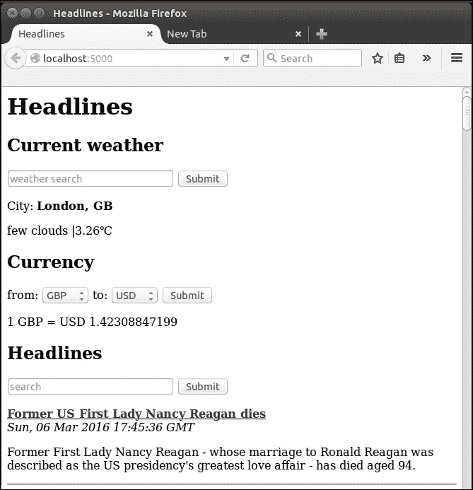
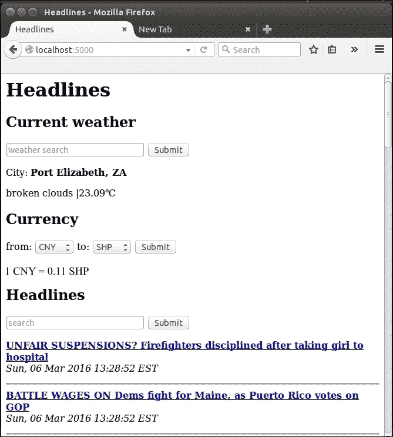
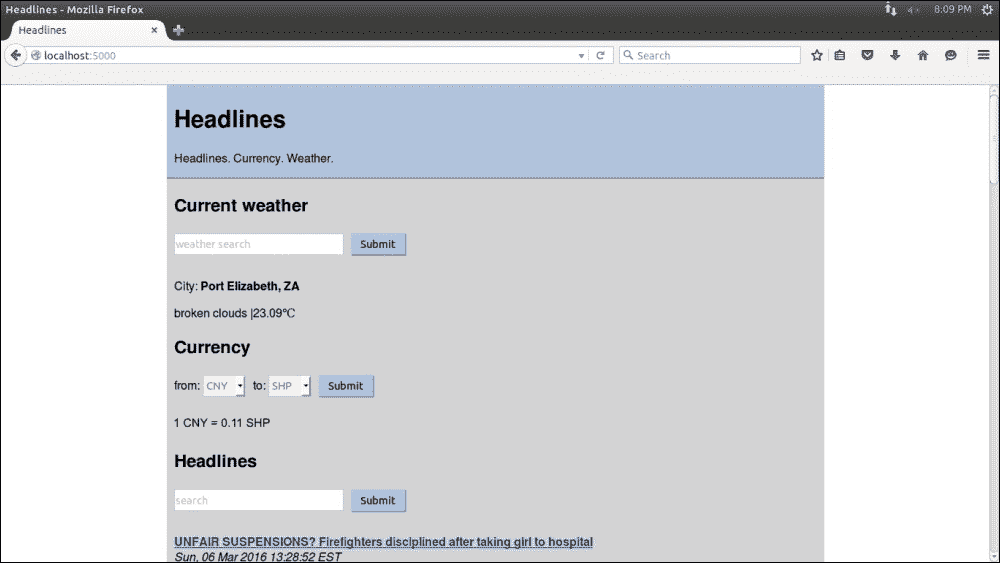

# 五、改善头条项目的用户体验

富有的生意人必须不断给人留下好印象，以维持有利可图的关系，有时他们会雇佣私人助理来研究熟人。然后，在社交活动中，PA 站在富人的身后，对他或她低声说几句好听的话，告诉他或她有人要和他交谈。词语必须简洁但信息丰富，如“保罗·史密斯，一个孩子，吉尔，最近在毛里求斯旅行”。现在，我们的生意人可以假装任何与他接触过的人都是一位亲密的朋友，谈论他的孩子和旅行，而不知道这个人到底是谁。这让其他人觉得自己很重要，也很受欢迎，这可以帮助我们假设中的百万富翁变得更加富有。

为什么这与 web 应用相关？嗯，我们想做完全相同的事情。我们网站上那些觉得自己很重要并被记住的用户更有可能回来，因此我们需要一个数字 PA，让用户觉得我们花了时间和精力记住了他们是谁以及他们喜欢什么。我们可以建立一个用户数据库，存储他们通常计算的货币兑换率以及他们感兴趣的城市天气，然后默认情况下向他们显示这些数据。这种策略的问题是，我们需要他们在每次访问时都表明自己的身份，而大多数用户会发现额外的输入用户名（可能还有密码）的步骤既繁琐又令人讨厌。

输入 HTTP cookies。这些狡猾的小东西会潜伏在我们用户的电脑上，当我们的用户再次访问我们的网站时，它们会充当我们的数字 PAs，给我们提供我们以前已经获得但还没有费心记住的信息。这听起来很卑鄙。有一次，欧盟这样想，并试图监管饼干的使用，但它们无处不在，而且简单实用，监管尝试有点令人失望（请看一下[）http://silktide.com/the-stupid-cookie-law-is-dead-at-last/](http://silktide.com/the-stupid-cookie-law-is-dead-at-last/) 。

在最简单的形式中，cookie 就是我们存储在用户机器上的键值对，并要求他们的浏览器在他们访问我们的网站时自动发送回我们。这样做的好处是，我们不必保留和维护数据库，也不必明确要求用户告诉我们他们是谁。然而，缺点是我们无法控制信息，如果用户更改计算机、web 浏览器，甚至只是删除我们的 cookie，我们将无法识别他或她。因此，Cookies 非常适合我们构建的应用；如果用户必须点击几次才能返回到他或她上次搜索的媒体、货币和天气信息，这并不是世界末日，但是如果我们能够记住以前的选择并自动显示这些信息，那就更好了。

当我们谈到用户体验（或者经常提到的用户体验）时，我们的网站看起来好像是在 20 世纪 80 年代制作的。在后面的章节中，我们将更加关注美学，但现在我们还将研究如何为我们的网站添加一些基本的布局和颜色。当我们专注于功能性和简单性时，它仍然远远不是“现代外观”，但我们将向工具包中添加一些构建块，稍后我们将更仔细地使用这些构建块。我们将使用**级联样式表**（通常称为**CSS**）来实现这一点。CSS 是一个很好的工具，可以进一步分离关注点；我们已经将逻辑（即 Python 脚本）与内容（即 HTML 模板）分离开来。现在，我们来看看 CSS 如何帮助我们将格式（即颜色、字体、布局等）与其他内容（例如模板文件中的静态文本）分离开来。

现在我们已经对 cookie 和 CSS 有了一个概述，我们将开始在 Flask 中实现它们。这是我们第一个项目的最后一章，到最后，我们将有一个包含 cookie 和 CSS 的标题应用。

在本章中，我们将研究以下主题：

*   向我们的应用添加 cookie
*   向标题应用添加 CSS

# 向我们的应用添加 cookie

目前，我们的应用有两个问题。让我们想象一个住在西雅图的用户 Bob。Bob 访问我们的网站，看到 BBC、伦敦的默认值，以及英镑到美元的转换。鲍勃想看看西雅图的天气，所以他在**天气搜索**栏中键入`Seattle`并点击回车键。他瞥了一眼返回的天气，感觉很沮丧，因为天气像往常一样冷，下雨，所以他把目光从页面下方的天气上移开，看到了 BBC 的头条新闻。他更喜欢 CNN 的头条新闻，所以他从下拉菜单中选择这份出版物并点击**提交**。他通读了几条头条，才意识到时事比天气更沉闷、更令人沮丧。因此，他的眼睛再次移回到页面顶部，让自己振作起来。他很困惑；自从改变了他的出版偏好后，天气又回到了伦敦，那里的天气甚至更糟！他关闭了我们的申请，没有回来。如果他回来，一切都会再次显示默认值。

两个紧迫的问题是：

*   即使用户留在我们的网站上，也不记得他们的选择
*   在用户关闭我们的网站并在稍后阶段重新访问后，不记得他们的选择

让我们解决这两个问题。

## 将饼干与烧瓶一起使用

正如前面介绍的，Cookies 可以被认为是键值对，默认情况下，我们可能会从回访者那里收到，也可能不会收到。我们需要更改我们的应用，以便当用户做出选择时，我们创建或更新他们的 cookie 以反映这些更改，当用户请求我们的网站时，我们检查是否存在 cookie，并从中尽可能多地读取未指定的信息。首先，我们将了解如何设置 Cookie 并让用户的浏览器自动记住信息，然后我们将了解如何检索以前使用 Cookie 存储的信息。

### 在烧瓶中放置饼干

烧瓶让处理饼干变得像以前一样容易。首先，我们需要更多的进口产品；我们将使用 Python 中的`datetime`库来设置即将存在的 Cookie 的寿命，并使用 Flask 的`make_response()`函数来创建一个响应对象，我们可以在上设置 Cookie。将以下两行添加到`headlines.py`文件的导入部分：

```py
import datetime
from flask import make_response
```

之前，我们只是使用自定义参数呈现模板，然后将其返回到用户的 web 浏览器。为了设置 cookies，我们需要额外的步骤。首先，我们将使用新的`make_response()`函数创建一个响应对象，然后使用该对象设置 cookie。最后，我们将返回整个响应，其中包括呈现的模板和 cookie。

将`headlines.py`中`home()`函数的最后一行替换为以下几行：

```py
response = make_response(render_template("home.html",
  articles=articles,
  weather=weather,
  currency_from=currency_from,
  currency_to=currency_to,
  rate=rate,
  currencies=sorted(currencies)))
expires = datetime.datetime.now() + datetime.timedelta(days=365)
response.set_cookie("publication", publication, expires=expires)
response.set_cookie("city", city, expires=expires)
response.set_cookie("currency_from",
  currency_from, expires=expires)
response.set_cookie("currency_to", currency_to, expires=expires)
return response
```

这与我们使用的简单 return 语句相比是一个很大的变化，所以让我们将其分解一下。首先，我们将在`render_template()`调用周围包装一个`make_response()`调用，而不是直接返回呈现的模板。这意味着我们的 Jinja 模板将被呈现，所有占位符将被替换为正确的值，但我们不会直接向用户返回响应，而是将其加载到变量中，以便我们可以对其进行更多的添加。一旦我们有了这个响应对象，我们将创建一个`datetime`对象，其值为从今天开始的 365 天。然后，我们将对`response`对象执行一系列`set_cookie()`调用，保存用户的所有选择（或刷新以前的默认值），并将到期时间设置为从使用`datetime`对象设置 cookie 时算起的一年。

最后，我们将返回`response`对象，其中包含呈现模板的 HTML 以及四个 cookie 值。加载页面时，我们的用户浏览器将保存四个 cookie，如果同一用户再次访问我们的应用，我们将能够检索这些值。

### 在烧瓶中取回饼干

如果我们不使用信息做任何事情，记住它就没有多大好处。我们现在将 cookies 设置为向用户发送响应之前的最后一步。但是，当用户向我们发送请求时，我们需要检查保存的 cookie。如果您还记得我们是如何从 Flask 的请求对象获取命名参数的，您可能会猜到如何获取保存的 cookie。以下行将获取名为`publication`的 cookie（如果存在）：

```py
request.cookies.get("publication")
```

这很简单，对吗？唯一棘手的部分是让我们的后备逻辑正确。我们仍然希望明确的请求具有最高优先级；也就是说，如果用户输入文本或从下拉菜单中选择一个值，这将是他或她想要的，而不管我们从以前的访问中期望得到什么。如果没有明确的请求，我们将查看 cookies，检查是否可以从中获取默认值。最后，如果我们仍然什么都没有，我们将使用硬编码的默认值。

#### 写入回退逻辑以检查 Cookie

让我们先为`publication`实现这个逻辑。在`headlines.py`的`home()`功能中为我们的发布逻辑添加一个新的`if`块，使其与以下内容匹配：

```py
# get customised headlines, based on user input or default
publication = request.args.get("publication")
if not publication:
 publication = request.cookies.get("publication")
    if not publication:
        publication = DEFAULTS["publication"]
```

现在，我们将查看 GET 参数，如有必要，对保存的 cookie 进行回退，最后返回默认值。让我们来看看这个工作。打开 web 浏览器并导航至`localhost:5000`。在**出版物**搜索栏中搜索`Fox`，等待页面重新加载福克斯新闻标题。现在，关闭浏览器，重新打开，然后再次加载`localhost:5000`。这一次，你应该看到福克斯的头条新闻，而不必搜索它们，如下面的屏幕截图所示。

请注意，URL 中没有`publication`参数，但标题本身现在来自福克斯新闻。



#### 正在为其他数据检索 cookie

我们的出版物中有基本的 cookies，但我们仍然希望阅读我们可能为天气和货币选项保存的 cookies。我们可以简单地将相同的 if 语句添加到代码的每个部分，用`city`、`currency_from`和`currency_to`替换相关的`publication`，但在代码的许多部分进行相同的更改是我们需要进行重构的强烈信号。

让我们创建一个`get_value_with_fallback()`函数，它在更抽象的层次上实现我们的回退逻辑。将新函数添加到`headlines.py`文件中，并从调用`home()`函数，如下图：

```py
def get_value_with_fallback(key):
    if request.args.get(key):
        return request.args.get(key)
    if request.cookies.get(key):
        return request.cookies.get(key)
    return DEFAULTS[key]

@app.route("/")
def home():
    # get customised headlines, based on user input or default
    publication = get_value_with_fallback("publication")
    articles = get_news(publication)

    # get customised weather based on user input or default
    city = get_value_with_fallback("city")
    weather = get_weather (city)

    # get customised currency based on user input or default
    currency_from = get_value_with_fallback("currency_from")
    currency_to = get_value_with_fallback("currency_to")
    rate, currencies = get_rate(currency_from, currency_to)

    # save cookies and return template
    response = make_response(render_template("home.html", articles=articles, weather=weather, currency_from=currency_from, currency_to=currency_to, rate=rate, currencies=sorted(currencies)))
    expires = datetime.datetime.now() + datetime.timedelta(days=365)
    response.set_cookie("publication", publication, expires=expires)
    response.set_cookie("city", city, expires=expires)
    response.set_cookie("currency_from", currency_from, expires=expires)
    response.set_cookie("currency_to", currency_to, expires=expires)
    return response
```

现在，我们应该能够以任何顺序提交表格，并像我们预期的那样记住所有选项。此外，每当我们访问我们的网站，它将自动配置我们最近使用的选项。试试看！您应该能够搜索货币、天气和标题；然后，关闭浏览器；并重新访问该网站。默认情况下，您最近使用的输入应该出现。

在下面的屏幕截图中，我们可以看到 URL 中没有传递任何参数，但是我们正在显示南非伊丽莎白港的天气数据；从**人民币**（**人民币**）到**圣赫勒拿镑**（**上海医药**的货币数据；以及福克斯新闻的标题。



# 向标题应用添加 CSS

我们的网站仍然是空荡荡的。有很多白色和一些黑色。大多数用户更喜欢颜色、动画、边框、边距等。如前所述，我们现在不打算真正关注美学，但我们将添加一些基本颜色和样式。

## 外部、内部和内联 CSS

有几种方法可以将 CSS 添加到网页中。最好的方法是将其与 HTML 完全分离，并将其保存在外部文件中，该文件包含在 HTML 的`<link>`元素中。这有时被称为*外部 CSS*。最糟糕的方式称为*内联 CSS*。使用内联方法，CSS 是基于每个元素定义的；这被认为是不好的做法，因为对样式的任何更改都需要通过 HTML 查找相关部分。

此外，页面上的许多元素通常具有相同或至少相关的样式，以在整个站点中维护配色方案和样式。因此，使用内联样式通常会导致大量代码重复，我们知道这是可以避免的。

对于这个项目，我们将采取中间立场。我们将在`.html`模板文件中定义 CSS，但我们将在一个地方定义所有 CSS。这是因为我们还没有看到 Flask 是如何按照约定处理文件的，所以现在将所有代码保存在一个地方比较简单。

## 添加我们的第一个 CSS

CSS 非常简单；我们将按类型、ID、类等描述页面的元素，并为这些元素定义一些属性，如颜色、布局、填充、字体等。CSS 被设计为*级联*，也就是说，如果我们不为更具体的元素指定，它将自动继承为更一般的元素定义的属性。我们将很快介绍 CSS 本身，因此，如果您以前从未听说过它，并且希望了解更多有关它的信息，现在是休息一下并浏览一些 CSS 特定资源的适当时机。网上有很多，快速搜索就会发现；如果您喜欢我们前面提到的 W3Schools HTML 教程，您可以在[找到一个类似于的 CSS 教程 http://www.w3schools.com/css/](http://www.w3schools.com/css/) 。或者，用下面的例子和简短的解释深入研究！

首先，让我们为我们的站点添加一个更好的标题。我们将在顶层标题下添加一条标语，并用一个新的`<div>`标记将其环绕，以便我们可以在即将到来的 CSS 中修改整个标题。修改`home.html`模板的开头，如下所示：

```py
<div id="header">
    <h1>Headlines</h1>
 <p>Headlines. Currency. Weather.</p>
 <hr />
</div>

```

`<div>`标签本身没有任何功能，您可以将其视为一个容器。我们可以使用它将逻辑上相关的元素分组到同一个元素中，这对于 CSS 非常有用，因为我们可以一次在`<div>`标记中设置所有元素的样式。

CSS 应该被添加到`<style>`标签中模板的`<head>`部分的。在我们的`home.html`模板中的`<title>`标记下面，添加以下代码：

```py
<style>
html {
    font-family: "Helvetica";
    background: white;
}

body {
    background: lightgrey;
    max-width: 900px;
    margin: 0 auto;
}

#header {
    background: lightsteelblue;
}
</style>
```

我们为三个元素明确定义了样式：外部`<html>`元素、`<body>`元素和任何具有`id="header"`属性的元素。由于我们所有的元素都在我们的`<html>`元素中，字体会自动向下级联到任何地方（尽管它仍然可以被子元素显式覆盖）。我们将 body 元素（包含页面的所有可见项）中的所有内容设置为最大宽度为 900 像素。`margin: 0 auto;`线意味着主体的顶部和底部没有边距，左侧和右侧有自动边距。这会使页面上的所有内容居中。`background: white;`和`background: lightgrey;`线意味着我们将在较大的窗口内有一个以浅灰色背景为中心的主元素，该窗口为白色。最后，我们定义的标题`div`将具有淡蓝色背景。使用添加的样式保存页面并刷新以查看效果。其外观应类似于下图：


让我们来看看下一节如何改进美学。

**浏览器和缓存**

### 提示

浏览器通常缓存本地不经常更改的内容，以便下次访问页面时更快地显示页面。这对于开发来说并不理想，因为您希望在进行更改时看到更改。如果您的样式似乎没有达到预期效果，请清除浏览器缓存，然后重试。在大多数浏览器上，可以通过按*Ctrl*+*Shift*+*ESC*并从弹出的菜单中选择相关选项来完成此操作。

## 为我们的 CSS 添加填充

这比白底黑稍微有趣一点，但还是很难看。一个问题是，文本正好靠在颜色的边缘，没有任何呼吸空间。我们可以使用*CSS 填充*来解决这个问题，它可以将所有内容从顶部、右侧、底部、左侧或任意组合移动指定数量。

我们可以直接在`<body>`标记中添加填充，因为我们希望所有文本都有一个漂亮的左侧缓冲区。如果你尝试一下，你会发现眼前的问题；填充会影响一切，包括我们的`<div>`标题和`<hr>`标签，它将内容与其他内容分开，这意味着会有一条奇怪的灰色条纹，这不是我们想要的。我们将以一种方式解决这个问题，您很快就会使用这种方式处理几乎所有与 CSS 相关的内容—只需添加更多 div！我们需要一个*主*`<div>`标题围绕所有副标题和一个内部标题 div，这样我们就可以在标题中填充文本，而无需填充背景色或分隔符。

### 为我们的 CSS 添加更多样式

将以下部分添加到 CSS 中，以定义主标题和内部标题 div 的左侧填充，并更新`#header`部分以包括一些顶部填充：

```py
#header {
  padding-top: 5;
  background: lightsteelblue;
}
#inner-header {
  padding-left: 10;
}
#main{
  padding-left: 10;
}
```

### 将 div 标签添加到模板文件中

现在，让我们添加div 本身；`home.html`中的模板代码应更新如下：

```py
    <body>
        <div id="header">
            <div id="inner-header">
                <h1>Headlines</h1>
                <p>Headlines. Currency. Weather.</p>
             </div>
           <hr />
        </div>
        <div id="main">
            <h2>Current weather</h2>

... [ rest of the content code here ] ...

            
        </div>
    </body>
```

## 设计我们的输入

这使得布局看起来更令人愉快，因为文本看起来不像是试图从边缘溜走。下一个主要的痛点是我们的输入元素，它们非常无聊。让我们也为它们添加一些样式。在 CSS 的底部，添加以下文本：

```py
input[type="text"], select {
    color: grey;
    border: 1px solid lightsteelblue;
    height: 30px;
    line-height:15px;
    margin: 2px 6px 16px 0px;
}
input[type="submit"] {
    padding: 5px 10px 5px 10px;
    color: black;
    background: lightsteelblue;
    border: none;
    box-shadow: 1px 1px 1px #4C6E91;
}
input[type="submit"]:hover{
    background: steelblue;
}
```

第一部分样式我们的文本输入和选择（即下拉）元素。文本颜色为灰色，它有一个与标题颜色相同的边框，我们将使它们比使用“高度”和“线条高度”之前的默认值稍大一点。我们还需要调整页边距，使文本更自然地适应新的大小（如果您有兴趣，请在第一部分底部省去页边线，然后查看结果）。第二和第三部分是设计我们的**提交**按钮；一个用于定义它们通常的外观，另一个用于定义鼠标在其上移动时它们的外观。同样，保存这些更改并刷新页面以查看它们的外观。您应该会看到类似于以下屏幕截图的内容：



最终的结果仍然不会赢得任何设计奖项，但至少你已经学会了 CSS 的基础知识。网页设计中最令人沮丧的一点是，每个浏览器对 CSS 的解释都略有不同（或者在某些情况下，非常不同）。跨浏览器测试和验证是每个 web 开发人员的死敌，在后面的章节中，我们将介绍一些工具和框架，这些工具和框架可用于缓解由于潜在的一致性缺乏而产生的问题。

# 总结

在本章中，我们让我们的网站更加人性化，无论是在功能方面（通过 cookies 记住用户的选择）还是在美学方面（使用 CSS）。在以后的项目中，我们将回到这两个主题，其中我们将使用 cookies 允许用户登录，并使用一些更高级的 CSS。这是我们的头条新闻项目的结束；我们有一个功能强大的标题应用，可以显示新闻、天气和货币信息。

在下一章中，我们将开始构建一个新项目：交互式犯罪地图。