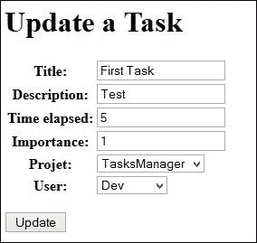

# 八、使用 CBV 提高生产力

**基于类的视图**（**CBV**是从模型生成的视图。简单地说，我们可以说这些类似于模型表单，因为它们简化了视图并适用于常见情况。

CRUD 是指在数据库上执行的四个主要操作时使用的缩写形式：创建、读取、更新和删除。CBV 是创建快速执行这些操作的页面的最佳方式。

创建用于创建和编辑模型或数据库表数据的表单是开发人员工作中非常重复的一部分。他们可能会花费大量时间来正确地执行此操作（验证、预填充字段等）。使用 CBV，Django 允许开发人员在不到 10 分钟的时间内对模型执行 CRUD 操作。他们还有一个重要的优势：如果模型不断发展，CBV 做得很好，更改模型将自动更改网站内的 CRUD 操作。在这种情况下，在模型中添加一行代码可以节省数十行或数百行代码。

CBV 仍然有一个缺点。使用高级功能或未提供的功能进行自定义并不容易。在许多情况下，当您尝试执行具有某些特性的 CRUD 操作时，最好创建一个新视图。

您可能会问，为什么我们不直接研究它们？我们本可以节省很多时间，尤其是在数据库中添加开发人员时。这是因为这些视图是通用的。它们适用于不需要大量更改的简单操作。当我们需要一个复杂的表单时，CBV 将不再有用，甚至会延长编程的持续时间。

我们应该使用 CBV，因为它们允许我们节省大量通常用于在模型上运行 CRUD 操作的时间。

在本章中，我们将充分利用`TasksManager`应用程序。事实上，我们将享受 CBV 提供的时间节省，以快速推进该项目。如果你不能立即了解 CBV 的功能，那没关系。到目前为止，我们在前几章中看到的已经允许我们创建网站。

在本章中，我们将尝试通过涵盖以下主题来提高生产力：

*   我们将使用`CreateView`CBV 快速构建页面以添加项目
*   稍后我们将看到如何显示对象列表和使用分页系统
*   然后我们将使用`DetailView`CBV 显示项目信息
*   然后，我们将学习如何使用`UpdateView`CBV 更改记录中的数据
*   我们将学习如何更改 CBV 生成的表单
*   然后，我们将创建一个页面来删除记录
*   然后，我们将最终创建一个子类`UpdateView`，以便在应用程序中更灵活地使用它

# CreateView CBV

`CreateView`CBV 允许您创建一个视图，该视图将根据模型自动生成表单，并自动将数据保存在此表单中。它可以与 ModelForm 进行比较，只是我们不需要创建视图。事实上，除特殊情况外，所有代码都将放在`urls.py`文件中。

## 极简主义用法的一个例子

我们将创建一个 CBV，它将允许我们创建一个项目。本例旨在说明，与 Django 表单相比，您可以节省更多的时间。我们将能够使用上一章项目中用于创建表单的模板。现在，我们将更改我们的`create_project`URL 如下：

```py
url (r'^create_project$', CreateView.as_view(model=Project, template_name="en/public/create_project.html", success_url = 'index'), name="create_project"),
```

我们将在`urls.py`文件的开头添加以下行：

```py
from django.views.generic import CreateView
from TasksManager.models import Project
```

在我们的新 URL 中，我们使用了以下新的功能：

*   `CreateView.as_view`：我们称 CBV 的方法`as_view``CreateView`。此方法向用户返回完整视图。此外，我们在该方法中返回多个参数。
*   `model`：该定义了将应用 CBV 的模型。
*   `template_name`：定义显示表单的模板。由于 CBV 使用`ModelForm`，我们无需更改`create_project.html`模板。
*   `success_url`：这定义了一旦考虑到变更后，我们将重定向到的 URL。这个参数不是很枯燥，因为我们不能使用 URL 的`name`属性。当我们扩展 CBV 时，我们将看到如何使用要重定向的 URL 的名称。

这就是全部！我们添加到`urls.py`文件中的三行将执行以下操作：

*   生成表单
*   生成将表单发送到模板的视图，无论有无错误
*   数据由用户发送

我们刚刚使用了 Django 最有趣的特性之一。事实上，只有三行代码，如果没有任何框架，我们已经完成了超过一百行代码的工作。我们还将编写允许我们添加任务的 CBV。请查看以下代码：

```py
from TasksManager.models import Project, Task
url (r'^create_task$', CreateView.as_view(model=Task, template_name="en/public/create_task.html", success_url = 'index'), name="create_task"),
```

然后我们需要复制`create_project.html`模板并更改`base.html`模板中的链接。我们的新视图是功能性的，我们使用相同的模板创建项目。这是一种常见的方法，因为它为开发人员节省了大量时间，但还有一种更严格的方法。

为了测试代码，我们可以在`index.htm`l 模板的`article_content`块末尾添加以下链接：

```py
<a href="">Create task</a>
```

# 使用 ListView

`ListView`是一个 CBV，显示给定模型的记录列表。生成视图是为了发送一个模板对象，从中我们可以查看列表。

## 极简主义用法的一个例子

我们将查看一个显示项目列表的示例，并创建一个指向项目详细信息的链接。为此，我们必须在`urls.py`文件中添加以下行：

```py
from TasksManager.models import Project
from django.views.generic.list import ListView
```

将以下 URL 添加到文件中：

```py
url (r'^project_list$', ListView.as_view(model=Project, template_name="en/public/project_list.html"), name="project_list"),
```

扩展`base.html`模板后，我们将在`article_content`块中添加以下行，创建用于以表格形式显示结果的模板：

```py
<table>
<tr>
  <th>Title</th>
  <th>Description</th>
  <th>Client name</th>
</tr>

  <tr>
    <td>{{ project.title }}</td>
    <td>{{ project.description }}</td>
    <td>{{ project.client_name }}</td>
  </tr>

</table>
```

我们创建了与[第 6 章](06.html#page "Chapter 6. Getting a Model's Data with Querysets")*中相同的列表，通过查询集*获取关于查询集的模型数据。优点是我们使用了更少的线，并且没有使用任何视图来创建它。在下一部分中，我们将通过扩展此 CBV 来实现分页。

## 扩展 ListView

可以扩展 ListView CBV 的可能性并对其进行定制。这使我们能够使 CBV 适应网站的需要。我们可以在`as_view`方法的参数中定义相同的元素，但它更具可读性，我们也可以覆盖这些方法。根据 CBV 的类型，传播它们可以让您：

*   更改模型和模板，就像我们在 URL 中所做的那样
*   更改要执行的查询集
*   更改发送到模板的对象的名称
*   指定将重定向用户的 URL

我们将通过修改已经完成的项目列表来扩展我们的第一个 CBV。我们将通过按标题排序和添加分页来对此列表进行两个更改。我们将在`views/cbv`模块中创建`ListView.py`文件。此文件将包含我们定制的`listView`。也可以选择体系结构。例如，我们可以创建一个名为`project.py`的文件来存储与项目相关的所有 CBV。此文件将包含以下代码：

```py
from django.views.generic.list import ListView 
# In this line, we import the ListView class
from TasksManager.models import Project

class Project_list(ListView): 
# In this line, we create a class that extends the ListView class.
  model=Project
  template_name = 'en/public/project_list.html' 
# In this line, we define the template_name the same manner as in the urls.py file.
  paginate_by = 5 
In this line, we define the number of visible projects on a single page.
  def get_queryset(self): 
In this line, we override the get_queryset() method to return our queryset.
    queryset=Project.objects.all().order_by("title")
    return queryset
```

我们还可以通过以下方式设置 queryset：

```py
queryset=Project.objects.all().order_by("title")
```

但是，创建一个可以适应多种情况的类可能很有用。对于要在 URL 中解释的`Project_list`类，我们需要通过添加以下行来更改导入：

```py
from TasksManager.views.cbv.ListView import Project_list
```

然后必须更改 URL。在这个`urls.py`文件中，我们将使用不带任何参数的`Project_list`对象，如下代码片段所示；它们都在`ListView.py`文件中定义：

```py
url (r'^project_list$', Project_list.as_view(), name="project_list"),
```

从现在开始新页面开始运行。如果我们测试它，我们将意识到只显示前五个项目。事实上，在`Project_list`对象中，我们定义了每页五个项目的分页。要浏览列表，我们需要在模板中`article_content`块末尾之前添加以下代码：

```py

  <div class="pagination">
    <span>
    
      <a href="?page={{ page_obj.previous_page_number }}">Previous</a>
    
    <span style="margin-left:15px;margin-right:15px;">
      Page {{ page_obj.number }} of {{ page_obj.paginator.num_pages }}.
    </span>
    
      <a href="?page={{ page_obj.next_page_number }}">Next</a>
    
    </span>
  </div>

```

模板的这一部分允许我们在页面底部创建指向前面和后面页面的链接。在本例中，我们非常快速地创建了分页项目的排序列表。CBV 的扩展非常方便，允许我们适应更复杂的用途。在这个完整的示例之后，我们将创建一个 CBV 来显示开发人员列表。这个列表在本书的后面部分会很有用。导入`ListView`类后必须添加以下 URL：

```py
url (r'^developer_list$', ListView.as_view(model=Developer, template_name="en/public/developer_list.html"), name="developer_list"),
```

然后我们使用继承的模板`base.html`并将以下代码放入`article_content`块中：

```py
<table>
  <tr>
    <td>Name</td>
    <td>Login</td>
    <td>Supervisor</td>
  </tr>
  
    <tr>
      <td><a href="">{{ dev.name }}</a></td>
      <td>{{ dev.login }}</td>
      <td>{{ dev.supervisor }}</td>
    </tr>
  
</table>
```

我们会注意到开发者的名字是一个空链接。当我们创建显示开发人员详细信息的页面时，您应该重新填充它。这就是我们将在下一节中使用`DetailView`所做的。

# 详细视图 CBV

`DetailView`CBV 允许我们显示来自注册模型的信息。这是我们将研究的第一个具有 URL 参数的 CBV。为了查看记录的详细信息，它将向 CBV 发送其 ID。我们将研究一些例子。

## 极简主义用法的一个例子

首先，我们将创建一个显示任务详细信息的页面。为此，我们将通过在`urls.py`文件中添加以下行来创建 URL：

```py
from django.views.generic import DetailView
from TasksManager.models import Task
url (r'^task_detail_(?P<pk>\d+)$', DetailView.as_view(model=Task, template_name="en/public/task_detail.html"), name="task_detail"),
```

在这个 URL 中，我们添加了参数发送方面。在前面的一章中，我们已经讨论过这种类型的 URL，当时我们讨论了 QuerySet。

### 注

这一次，我们确实需要命名参数`pk`；否则，CBV 将无法工作。`pk`表示主键，它将包含您想要查看的记录的 ID。

关于模板，我们将创建模板`en/public/task_detail.html`并在`article_content`块中放置以下代码：

```py
<h4>
  {{ object.title }}
</h4>
<table>
  <tr>
    <td>Project : {{ object.project }}</td>
    <td>Developer : {{ object.app_user }}</td>
  </tr>
  <tr>
    <td>Importence : {{ object.importence }}</td>
    <td>Time elapsed : {{ object.time_elapsed }}</td>
  </tr>
</table>
<p>
  {{ object.description }}
</p>
```

在此代码中，我们引用外键`Developer`和`Project`。在模板中使用此语法，我们调用所讨论模型的`__ unicode__()`。这样可以显示项目的标题。为了测试这段代码，我们需要创建一个指向参数化 URL 的链接。将此行添加到您的`index.html`文件：

```py
<a href="">Detail first view</a><br />
```

此行将允许我们查看第一个任务的详细信息。您可以尝试在表的每一行创建任务列表和指向`DetailView`的链接。这就是我们要做的。

## 扩展细节视图

我们将现在创建一个页面，显示开发人员及其任务的详细信息。为了完成此操作，我们将通过在`views/cbv`模块中创建`DetailView.py`文件来覆盖`DetailView`类，并添加以下代码行：

```py
from django.views.generic import DetailView
from TasksManager.models import Developer, Task

class Developer_detail(DetailView): 
  model=Developer
  template_name = 'en/public/developer_detail.html'
  def get_context_data(self, **kwargs):
    # This overrides the get_context_data() method.
    context = super(Developer_detail, self).get_context_data(**kwargs) 
    # This allows calling the method of the super class. Without this line we would not have the basic context.
    tasks_dev = Task.objects.filter(developer = self.object) 
    # This allows us to retrieve the list of developer tasks. We use self.object, which is a Developer type object already defined by the DetailView class.
    context['tasks_dev'] = tasks_dev 
    # In this line, we add the task list to the context.
    return context
```

我们需要在`urls.py`文件中添加以下代码行：

```py
from TasksManager.views.cbv.DetailView import Developer_detail 
url (r'^developer_detail_(?P<pk>\d+)$', Developer_detail.as_view(), name="developer_detail"),
```

为了查看主要数据和开发任务，我们创建了`developer_detail.html`模板。从`base.html`扩展后，我们必须在`article_content`块中输入以下行：

```py
<h4>
  {{ object.name }}
</h4>
<span>Login : {{ object.login }}</span><br />
<span>Email : {{ object.email }}</span>
<h3>Tasks</h3>
<table>
  
  <tr>
    <td>{{ task.title }}</td>
    <td>{{ task.importence }}</td>
    <td>{{ task.project }}</td>
  </tr>
  
</table>
```

这个示例允许我们了解如何在使用 CBV 时将数据发送到模板。

# 更新查看 CBV

`UpdateView`是易于创建和编辑表单的 CBV。与没有 MVC 模式的开发相比，这种 CBV 节省了更多的时间。与`DetailView`一样，我们必须将记录的登录名发送到 URL。为了解决`UpdateView`，我们将讨论两个示例：

*   更改任务以使主管能够编辑任务
*   减少执行开发任务所花费的时间

## 极简主义用法的一个例子

此示例将展示如何创建允许主管修改任务的页面。与其他 CBV 一样，我们将在`urls.py`文件中添加以下行：

```py
from django.views.generic import UpdateView
url (r'^update_task_(?P<pk>\d+)$', UpdateView.as_view(model=Task, template_name="en/public/update_task.html", success_url="index"), name="update_task"),
```

我们将编写一个与我们用于`CreateView`的模板非常相似的模板。唯一的区别（按钮文本除外）是表单的`action`字段，我们将其定义为`empty`。我们将在本章末尾看到如何填充该字段。现在，我们将利用浏览器在字段为空时将表单提交到当前页面这一事实。它仍然可见，因此用户可以编写包含在我们的`article_content`块中的内容。请查看以下代码：

```py
<form method="post" action="">
   
  <table>
    {{ form.as_table }} 
  </table>
  <p><input type="submit" value="Update" /></p>
</form>
```

这个示例非常简单。如果我们在`success_url`属性中输入 URL 的名称，它可能会更干燥。

## 扩展 UpdateView CBV

在我们的应用程序中，任务的生命周期如下：

*   主管创建任务时没有任何持续时间
*   开发人员完成任务后，他们可以节省工作时间

我们将处理后一点，开发人员只能更改任务的持续时间。在本例中，我们将重写`UpdateView`类。为此，我们将在`views/cbv`模块中创建一个`UpdateView.py`文件。我们需要添加以下内容：

```py
from django.views.generic import UpdateView
from TasksManager.models import Task
from django.forms import ModelForm
from django.core.urlresolvers import reverse

class Form_task_time(ModelForm): 
# In this line, we create a form that extends the ModelForm. The UpdateView and CreateView CBV are based on a ModelForm system.
  class Meta:
    model = Task
    fields = ['time_elapsed'] 
    # This is used to define the fields that appear in the form. Here there will be only one field.

class Task_update_time(UpdateView):
  model = Task
  template_name = 'en/public/update_task_developer.html'
form_class = Form_task_time 
# In this line, we impose your CBV to use the ModelForm we created. When you do not define this line, Django automatically generates a ModelForm.
  success_url = 'public_empty' 
  # This line sets the name of the URL that will be seen once the change has been completed.
  def get_success_url(self): 
  # In this line, when you put the name of a URL in the success_url property, we have to override this method. The reverse() method returns the URL corresponding to a URL name.
    return reverse(self.success_url)
```

我们可以将此 CBV 与以下 URL 一起使用：

```py
from TasksManager.views.cbv.UpdateView import Task_update_time
url (r'^update_task_time_(?P<pk>\d+)$', Task_update_time.as_view(), name = "update_task_time"),
```

对于`update_task_developer.html`模板，我们只需要复制`update_task.html`模板并修改其标题即可。

# 删除视图 CBV

`DeleteView`CBV 可以轻松删除记录。与普通视图相比，它不会节省很多时间，但它不会被不必要的视图所拖累。我们将展示一个任务删除的示例。为此，我们需要在`views/cbv`模块中创建`DeleteView.py`文件。实际上，我们需要覆盖它，因为我们将输入要重定向的 URL 的名称。我们只能将 URL 放在`success_url`中，但我们希望我们的 URL 尽可能干燥。我们将在`DeleteView.py`文件中添加以下代码：

```py
from django.core.urlresolvers import reverse
from django.views.generic import DeleteView
from TasksManager.models import Task

class Task_delete(DeleteView):
  model = Task
  template_name = 'en/public/confirm_delete_task.html'
  success_url = 'public_empty'
  def get_success_url(self):
    return reverse(self.success_url)
```

在前面的代码中，模板将用于确认删除。事实上，`DeleteView`CBV 将在删除之前请求用户确认。我们将在`urls.py`文件中添加以下行以添加删除的 URL：

```py
from TasksManager.views.cbv.DeleteView import Task_delete
url(r'task_delete_(?P<pk>\d+)$', Task_delete.as_view(), name="task_delete"),
```

为了完成我们的任务抑制页面，我们将通过在`article_content`块中使用以下内容扩展`base.html`来创建`confirm_delete_task.html`模板：

```py
<h3>Do you want to delete this object?</h3>
<form method="post" action="">
   
  <table>
    {{ form.as_table }} 
  </table>
  <p><input type="submit" value="Delete" /></p>
</form>
```

# 进一步扩展 CBV

CBV 允许我们通过使用模型执行 CRUD 操作，在页面创建过程中节省大量时间。通过扩展它们，可以使它们适应我们的使用并节省更多的时间。

## 使用自定义类 CBV 更新

在本章中，为了完成我们的抑制页面，我们已经看到 CBV 允许我们不必承受不必要的视图。然而，我们已经创建了许多类似的模板，我们覆盖 CBV 只是为了使用干 URL。我们将修复这些小缺陷。在这一节中，我们将创建一个 CBV 和通用模板将允许我们：

*   直接在`urls.py`文件中使用此 CBV
*   输入用于重定向的`name`属性 URL
*   从这些 CBV 的所有用途的模板中获益

在编写 CBV 之前，我们将修改`models.py`文件，给每个模型一个`verbose_name`属性和`verbose_name_plural`。为此，我们将使用`Meta`类。以为例，`Task`模型将变成如下：

```py
class Task(models.Model):
  # fields
  def __str__(self):
    return self.title
  class Meta:
    verbose_name = "task"
    verbose_name_plural = "tasks"
```

我们将在`views/cbv`文件夹中创建一个`UpdateViewCustom.py`文件，并添加以下代码：

```py
from django.views.generic import UpdateView
from django.core.urlresolvers import reverse

class UpdateViewCustom(UpdateView):
  template_name = 'en/cbv/UpdateViewCustom.html' 
  # In this line, we define the template that will be used for all the CBVs that extend the UpdateViewCustom class. This template_name field can still be changed if we need it.
  url_name="" 
  # This line is used to create the url_name property. This property will help us to define the name of the current URL. In this way, we can add the link in the action attribute of the form.
  def get_success_url(self):
  # In this line, we override the get_success_url() method by default, this method uses the name URLs.
    return reverse(self.success_url)
  def get_context_data(self, **kwargs): 
  # This line is the method we use to send data to the template.
    context = super(UpdateViewCustom, self).get_context_data(**kwargs) 
    # In this line, we perform the super class method to send normal data from the CBV UpdateView.
    model_name = self.model._meta.verbose_name.title() 
    # In this line, we get the verbose_name property of the defined model.
    context['model_name'] = model_name 
    # In this line, we send the verbose_name property to the template.
    context['url_name'] = self.url_name \
    # This line allows us to send the name of our URL to the template.
    return context
```

然后我们需要创建显示表单的模板。为此，我们需要创建`UpdateViewCustom.html`文件并添加以下内容：

```py


  Update a {{ model_name }} 
  <!-- In this line, we show the type of model we want to change here. -->


  Update a {{ model_name }} 


  <form method="post" action=""> <!-- line 2 -->
  <!-- In this line, we use our url_name property to redirect the form to the current page. -->
     
    <table>
      {{ form.as_table }} 
    </table>
    <p><input type="submit" value="Update" /></p>
  </form>

```

为了测试这些新的 CBV，我们将按照以下方式更改`update_task`URL：

```py
url (r'^update_task_(?P<pk>\d+)$', UpdateViewCustom.as_view(model=Task, url_name="update_task", success_url="public_empty"), name="update_task"),
```

以下是显示 CBV 将显示的屏幕截图：



# 总结

在本章中，我们学习了如何使用 Django 最强大的功能之一：CBV。有了它们，开发人员可以运行高效的 CRUD 操作。

我们还学习了如何通过在项目列表上添加分页或在为该用户显示信息的页面上显示开发人员的工作来更改 CBV 以适应我们的使用。

在下一章中，我们将学习如何使用会话变量。我们将用一个实际的例子来探讨这一点。在本例中，我们将修改任务列表以显示上次访问的任务。