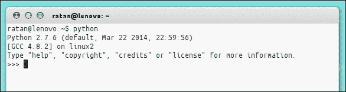
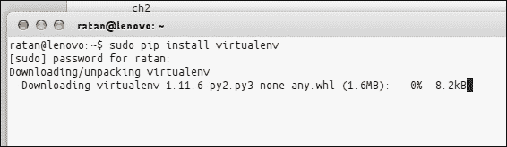
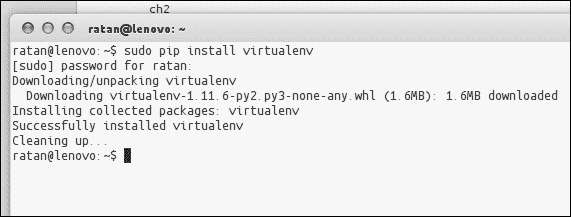
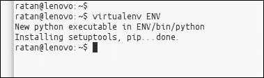
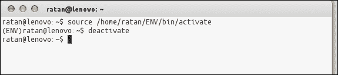

# 二、开始

Python 和 Django 可用于多种平台。在本章中，我们将了解如何在 UNIX/Linux、Windows 和 Mac OS X 上设置开发环境。我们还将了解如何创建第一个项目并将其连接到数据库。

本章将介绍以下主题：

*   安装 Python
*   安装 Django
*   安装数据库系统
*   创建第一个项目
*   设置数据库
*   启动开发服务器

# 安装所需的软件

我们的开发环境由 Python、Django 和一个数据库系统组成。在以下部分中，我们将了解如何安装这些软件包。

## 安装 Python

Django 是用 Python 编写的，因此，设置开发环境的第一步自然是安装 Python。Python 可用于各种操作系统，安装 Python 与安装其他软件包没有什么不同。但是，该过程取决于您的操作系统。

对于安装，您需要确保获得最新版本的 Python。Django 需要 Python 2.7 或更高版本。Python 的最新版本是 3.4.2（适用于 3.x）和 2.7.9（适用于 2.x 版本）。

有关安装说明，请阅读与操作系统相关的部分。

### 在 Windows 上安装 Python

Python 为 Windows 用户提供了一个标准安装程序。只需前往[https://www.python.org/download/](https://www.python.org/download/) 下载最新版本。接下来，双击`.exe`或`.msi`文件，并按照安装说明逐步操作。图形安装程序将指导您完成安装过程，并在“开始”菜单中创建 Python 可执行文件的快捷方式。

完成安装后，我们需要将 Python 目录添加到系统路径，以便在使用命令提示符时访问 Python。为此，请执行以下步骤：

1.  打开控制面板。
2.  Double-click on the **System and Security** icon or text and then look for **System** (as seen in Windows 7), as shown in the following screenshot:

    

3.  点击**高级系统设置**将出现一个弹出窗口。
4.  点击**环境变量**按钮，将打开一个新的对话框。
5.  选择系统变量**路径**并进行编辑。
6.  Append the path to where you installed Python as its value (the default path is usually `c:\PythonXX`, where `XX` is your Python version), as shown in the following screenshot:

    

如果要测试安装，请打开**运行**对话框，键入`python`，然后点击*输入*按钮。Python 交互式 shell 应该打开。

### 注

别忘了用分号（`;`）将新路径与前面的路径分开。

### 在 Unix/Linux 上安装 Python

如果您使用 Linux 或其他风格的 Unix，很可能您已经安装了 Python。要进行检查，请打开一个终端，键入`python`，然后点击*输入*按钮。如果您看到 Python 交互式 shell，那么您已经安装了 Python。在终端中输入`python`后应得到如下输出：

```py
Python 2.7.6 (default, Mar 22 2014, 22:59:56) 
[GCC 4.8.2] on linux2 
Type "help", "copyright", "credits" or "license" for more information.

```



输出的第一行表示系统上安装的版本（此处为 2.7.6）。

如果您收到错误消息而没有看到前面的输出，或者使用了旧版本的 Python，请继续阅读。

建议 Unix/Linux 用户通过系统的包管理器安装和更新 Python。虽然实际的细节因系统而异，但它与安装任何其他软件包没有任何区别。

对于基于 APT 的 Linux 发行版，如**Debian**和**Ubuntu**，打开终端并键入以下内容：

```py
$ sudo apt-get update
$ sudo apt-get install python

```

如果您有**Synaptic 软件包管理器**，只需搜索 Python，将其软件包标记为安装，然后单击**应用**按钮。

其他 Linux 发行版的用户应查看其系统文档，了解如何使用 package manager 安装软件包。

### 在 Mac OS X 上安装 Python

Mac OS X 预装了 Python。然而，由于苹果的发布周期，它通常是一个旧版本。如果您启动 Python interactive shell 并发现版本早于 2.3，请访问[http://www.python.org/download/mac/](http://www.python.org/download/mac/) 并为您的 Mac OS X 版本下载更新的安装程序。

现在 Python 已经启动并运行，我们几乎准备好了。接下来我们将安装**virtualenv**。

## 安装 virtualenv

使用 virtualenv 可以创建一个孤立的 Python 环境。一开始这并不是什么需要，但它是依赖管理的救星（例如，如果您的一个 web 应用需要库的一个版本，而另一个应用由于某些遗留问题或兼容性问题需要同一库的另一个版本，或者如果在一个库或应用中所做的更改破坏了其余应用）。

Virtualenv 可用于避免此类问题情况。它将创建自己的环境，这样就不会干扰您的全局设置。它通常创建自己的目录和共享库，以使 virtualenv 在没有任何外部干扰的情况下工作。如果您有**PIP1.3**或更高版本，请全局安装。您可以使用以下命令安装 virtualenv：

```py
$ [sudo] pip install virtualenv

```



完全下载后，virtualenv 将如下所示：



### 注

如果您尚未安装 pip，可以使用`sudo apt-get install python-pip`安装。

这就是全部！现在您可以使用以下命令创建您的虚拟环境：

```py
$ virtualenv ENV

```



Virtualenv 有非常详细的在线文档，对于使用 Virtualenv 时遇到的任何问题，都必须遵循这些文档。以下几行是该在线文档的摘录：

> *这将创建`ENV/lib/pythonX.X/site-packages`，您安装的任何库都将位于该位置。它还创建了`ENV/bin/python`，这是一个使用此环境的 Python 解释器。无论何时使用该解释器（包括脚本中有`#!/path/to/ENV/bin/python`时），都将使用该环境中的库。*

我们可以在[找到的 virtualenv 在线文档 https://pypi.python.org/pypi/virtualenv/1.8.2](https://pypi.python.org/pypi/virtualenv/1.8.2) 。

一个新的`virtualenv`文件夹还包括 pip 安装程序，因此您可以使用`ENV/bin/pip`命令将其他软件包安装到环境中。

### 注

**激活脚本**：在新创建的虚拟环境中将有一个`bin/activate`shell 脚本。对于 Windows 系统，为**CMD**和**Powershell**提供了激活脚本。

您可以在以下网址阅读更多内容：

[http://virtualenv.readthedocs.org/en/latest/virtualenv.html](http://virtualenv.readthedocs.org/en/latest/virtualenv.html)

在 Unix 系统上，我们可以使用以下命令激活`virtualenv`脚本：

```py
$ source bin/activate

```


在 Windows 上，我们可以使用以下命令在命令提示符下激活`virtualenv`脚本：

```py
: > \path\to\env\Scripts\activate

```

键入`deactivate`以撤销更改，如以下屏幕截图所示：



这将更改您的`$PATH`变量。

要了解有关激活脚本的更多，如您正在使用的环境或是否需要激活脚本，请访问以下链接：

[http://virtualenv.readthedocs.org/en/latest/virtualenv.html](http://virtualenv.readthedocs.org/en/latest/virtualenv.html)

## 安装 Django

安装 Django 非常简单，但这稍微取决于您的操作系统。由于 Python 是一种独立于平台的语言，Django 有一个包，无论您的操作系统如何，它都可以在任何地方工作。

至下载 Django，前往[http://www.djangoproject.com/download/](http://www.djangoproject.com/download/) 并获取最新官方版本。本书中的代码是在 Django 1.7（本文撰写时的最新版本）上开发的，但大部分代码应该在以后的官方版本上运行。接下来，按照与平台相关的说明进行操作。

### Django 与操作系统的兼容性–Windows 与 Linux

当你处理操作系统时，有几点你需要知道。在运行 Django 之前，需要对许多包和设置进行调整，以避免出现任何缺陷。让我们来看看它们：

*   有些 Python 包无法正确安装，或者根本无法在 Windows 中安装；如果可以的话，当你这样做的时候，他们会制造很多麻烦
*   如果您需要部署 Django 应用，那么使用 Unix 风格的系统更有意义，因为 99%的时间，您的部署环境都是相同的
*   如果您的应用很复杂，那么更容易获得所需的依赖项，无论它们是 Linux、库等中的扩展

### 在 Windows 上安装 Django

在下载完 Django 归档文件后，将其解压缩到 C 驱动器并打开命令提示符（从**开始**|**附件**。现在，通过发出以下命令，将当前目录更改为从中提取 Django 的目录：

```py
c:\>cd c:\Django-x.xx

```

这里，`x.xx`是您的 Django 版本。

接下来，通过运行以下命令安装 Django（您需要此命令的管理权限）：

### 注

如果您的系统上没有处理`.tar.gz`文件的程序，我建议您使用**7-Zip**，这是免费的，可以在[上找到 http://www.7-zip.org/](http://www.7-zip.org/) 。

```py
c:\Django-x.xx>python setup.py install

```

如果由于某种原因，前面的说明不起作用，您可以手动将归档中的`django`文件夹复制到 Python 安装目录中的`Lib\site-packages`文件夹中。这将完成运行`setup.py`安装命令的工作。

最后一步是将`django-admin.py`文件从`Django-x.xx\django\bin`复制到系统路径中的某个位置，例如`c:\windows`或安装 Python 的文件夹。

完成后，您可以安全地删除`c:\Django-x.xx`文件夹，因为它不再需要。

就这样！要测试安装，请打开命令提示符并键入以下命令：

```py
c:\>django-admin.py --version

```

如果您看到屏幕上打印的当前版本的 Django，那么一切都设置好了。

### 在 Unix/Linux 和 Mac OS X 上安装 Django

所有 Unix 和 Linux 系统的安装说明相同。您需要在`Django-x.xx.tar.gz`存档所在的目录中运行以下命令。以下命令将为您提取归档文件并安装 Django：

```py
$ tar xfz Django-x.xx.tar.gz
$ cd Django-x.xx
$ sudo python setup.py install

```

上述说明应适用于任何 Unix/Linux 系统以及 Mac OS X。但是，如果 Django 具有适用于 Django 的软件包，则通过系统的软件包管理器安装 Django 可能更容易。Ubuntu 有一个；因此，要在 Ubuntu 上安装 Django，只需在 Synaptic 中查找名为`python-django`的包，或者运行以下命令：

```py
$ sudo apt-get install python-django

```

您可以通过运行以下命令来测试安装：

```py
$ django-admin.py --version

```

如果您看到屏幕上打印的是当前版本的 Django，那么一切都已设置好。

## 安装数据库系统

虽然 Django 不需要数据库来运行，但我们将要开发的应用需要。因此，在软件安装的最后一步，我们将确保我们有一个数据库系统来处理我们的数据。

值得注意的是，Django 支持多种数据库引擎：**MySQL**、**PostgreSQL**、**MS SQL Server**、**Oracle**、SQLite。有趣的是，然而，您只需要学习一个 API 就可以使用这些数据库系统中的任何一个。这是可能的，因为 Django 的数据库层抽象了对数据库系统的访问。我们将在稍后了解这一点，但现在，您只需要知道，无论选择何种数据库系统，您都能够运行本书（或其他地方）中开发的 Django 应用，而无需修改。

如果你有 Python2.7 或更高版本，你不需要安装任何东西。Python2.7 附带 SQLite 数据库管理系统，该系统包含在名为`sqlite3`的模块中。与客户机-服务器数据库系统不同，SQLite 不需要内存中的常驻进程，它将数据库存储在单个文件中，这使它非常适合我们的开发环境。

如果您没有 Python2.7，您可以通过在[下载来手动安装 SQLite 的 Python 模块 http://www.pysqlite.org/](http://www.pysqlite.org/) （Windows 用户）或通过软件包管理器（Unix/Linux）。

另一方面，如果您的系统上已经安装了另一个 Django 支持的数据库服务器，那么您也可以使用它。我们将通过编辑配置文件来告诉 Django 要使用什么数据库系统，我们将在后面的部分中看到。

### 提示

**我不需要 Apache 或其他 web 服务器吗？**

Django 自带了自己的 web 服务器，我们将在开发阶段使用它，因为它是轻量级的，并且是为 Django 预先配置的。然而，Django 确实支持 Apache 和其他流行的 web 服务器，如 light tpd、nginx 等。在本书后面准备部署应用时，我们将看到如何为 Apache 配置 Django。

这同样适用于数据库管理器。在开发阶段，我们将使用 SQLite，因为它易于设置，但在部署应用时，我们将切换到数据库服务器，如 MySQL。

正如我前面所说的，无论我们使用什么组件，我们的代码都将保持不变；Django 为我们处理与 web 和数据库服务器的所有通信。

# 创建您的第一个项目

现在有了我们需要的软件，是时候开始有趣的部分了——创建我们的第一个 Django 项目！

如果您还记得 Django 安装部分，我们使用了一个名为`django-admin.py`的命令来测试我们的安装。此实用程序是 Django 项目管理工具的核心，因为它使用户能够执行一系列项目管理任务，包括：

*   创建新项目
*   创建和管理项目的数据库
*   验证当前项目并测试错误
*   启动开发 web 服务器

我们将在本章的其余部分了解如何使用这些任务。

## 创建一个空项目

要创建第一个 Django 项目，请打开终端（或 Windows 用户的命令提示符，即**启动****运行****cmd**，然后键入以下命令。然后，点击*进入*。

```py
$ django-admin.py startproject django_bookmarks

```

此命令将在当前目录中创建一个名为`django_bookmarks`的文件夹，并在其中创建初始目录结构。让我们看看创建了什么类型的文件：

```py
django_bookmarks/
|-- django_bookmarks
|   |-- __init__.py
|   |-- settings.py
|   |-- urls.py
|   `-- wsgi.py
`-- manage.py
```

以下是这些文件的简要说明：

*   `__init__.py`: Django projects are Python packages, and this file is required to tell Python that this folder is to be treated as a package.

    Python 术语中的包是模块的集合，它们用于将相似的文件分组在一起并防止命名冲突。

*   `manage.py`：这是另一个用于管理我们项目的实用脚本。您可以将其视为`django-admin.py`文件的项目版本。实际上，`django-admin.py`和`manage.py`共享相同的后端代码。
*   `settings.py`：这是您 Django 项目的主配置文件。在其中，您可以指定各种选项，包括数据库设置、站点语言、需要启用哪些 Django 功能等等。在接下来的章节中，我们将在构建应用的过程中解释此文件的各个部分，但在本章中，我们将只了解如何输入数据库设置。
*   `url.py`：这是另一个配置文件。您可以将其视为 URL 和处理 URL 的 Python 函数之间的映射。这个文件是 Django 强大的特性之一，我们将在下一章中看到如何利用它。

当我们开始为我们的应用编写代码时，我们将在项目文件夹中创建新文件；因此，该文件夹还充当代码的容器。

现在您已经对 Django 项目的结构有了大致的了解，让我们来配置我们的数据库系统。

## 建立数据库

在部分中，我们将开始使用各种选项和配置文件设置数据库。

好的，现在我们已经准备好了源代码编辑器，让我们打开项目文件夹中的`settings.py`文件，看看它包含什么：

```py
"""
Django settings for django_bookmarks project.

For more information on this file, see
https://docs.djangoproject.com/en/1.7/topics/settings/

For the full list of settings and their values, see
https://docs.djangoproject.com/en/1.7/ref/settings/
"""

# Build paths inside the project like this: os.path.join(BASE_DIR, ...)
import os
BASE_DIR = os.path.dirname(os.path.dirname(__file__))

# Quick-start development settings - unsuitable for production
# See https://docs.djangoproject.com/en/1.7/howto/deployment/checklist/

# SECURITY WARNING: keep the secret key used in production secret!
SECRET_KEY = ')9c8g--=vo2*rh$9f%=)=e+@%7e%xe8jptgpfe+(90t7uurfy0'

# SECURITY WARNING: don't run with debug turned on in production!
DEBUG = True

TEMPLATE_DEBUG = True

ALLOWED_HOSTS = []

# Application definition

INSTALLED_APPS = (
    'django.contrib.admin',
    'django.contrib.auth',
    'django.contrib.contenttypes',
    'django.contrib.sessions',
    'django.contrib.messages',
    'django.contrib.staticfiles',
)

MIDDLEWARE_CLASSES = (
    'django.contrib.sessions.middleware.SessionMiddleware',
    'django.middleware.common.CommonMiddleware',
    'django.middleware.csrf.CsrfViewMiddleware',
    'django.contrib.auth.middleware.AuthenticationMiddleware',
    'django.contrib.auth.middleware.SessionAuthenticationMiddleware',
    'django.contrib.messages.middleware.MessageMiddleware',
    'django.middleware.clickjacking.XFrameOptionsMiddleware',
)

ROOT_URLCONF = 'django_bookmarks.urls'

WSGI_APPLICATION = 'django_bookmarks.wsgi.application'

# Database
# https://docs.djangoproject.com/en/1.7/ref/settings/#databases

DATABASES = {
    'default': {
        'ENGINE': 'django.db.backends.sqlite3',
        'NAME': os.path.join(BASE_DIR, 'db.sqlite3'),
    }
}

# Internationalization
# https://docs.djangoproject.com/en/1.7/topics/i18n/

LANGUAGE_CODE = 'en-us'

TIME_ZONE = 'UTC'

USE_I18N = True

USE_L10N = True

USE_TZ = True

# Static files (CSS, JavaScript, Images)
# https://docs.djangoproject.com/en/1.7/howto/static-files/

STATIC_URL = '/static/'
```

正如您可能已经注意到的，该文件包含许多控制应用各个方面的变量。为变量输入新值就像执行 Python 赋值语句一样简单。此外，对该文件进行了广泛的注释，注释详细解释了哪些变量可以控制。

我们现在关心的是配置数据库。如前所述，Django 支持多个数据库系统，因此首先，我们必须指定要使用的数据库系统。这由`DATABASE_ENGINE`变量控制。如果已安装 SQLite，请将变量设置为`'sqlite3'`。否则，从变量名旁边的注释中选择与数据库引擎匹配的值。

接下来是数据库名称。保持数据库名称的默认值不变。另一方面，如果使用的是数据库服务器，则需要执行以下操作：

*   输入数据库的相关信息：用户名、密码、主机和端口。（SQLite 不需要任何这些。）
*   在数据库服务器内创建实际的数据库，因为 Django 本身不会这样做。例如，在 MySQL 中，这是通过`mysql`命令行实用程序或 phpMyAdmin 完成的。

最后，我们将告诉 Django 用表填充已配置的数据库。尽管我们还没有为我们的数据创建任何表（并且在下一章之前不会创建），Django 需要数据库中的几个表才能使其某些功能正常运行。创建这些表与发出以下命令一样简单：

```py
$ python manage.py syncdb

```

如果一切正常，状态消息将在屏幕上滚动，表明正在创建表。提示输入超级用户帐户时，请输入您首选的用户名、电子邮件和密码。另一方面，如果数据库配置错误，将打印一条错误消息以帮助您解决问题。

完成后，我们就可以启动我们的应用了。

### 提示

**使用 python manage.py**

当运行以`python manage.py`开头的命令时，请确保您当前位于`manage.py`所在的项目目录中。

## 启动开发服务器

正如前面所讨论的，Django 附带了一个轻量级 web 服务器，用于开发和测试应用。此服务器已预先配置为与 Django 一起使用，更重要的是，每当您修改代码时，它都会重新启动。

要启动服务器，请运行以下命令：

```py
$ python manage.py runserver

```

接下来，打开浏览器并导航到此 URL:`http://localhost:8000/`。您应该会看到一条欢迎消息，如以下屏幕截图所示：


祝贺您已经创建并配置了第一个 Django 项目。这个项目将是基础之上，我们将建立我们的书签应用。在下一章中，我们将开始开发我们的应用，web 服务器显示的页面将被我们自己编写的内容所取代！

### 注

您可能已经注意到，默认情况下，web 服务器在端口 8000 上运行。如果要更改端口，可以使用以下命令在命令行中指定端口：

```py
$ python manage.py runserver <port number>

```

此外，默认情况下，只能从本地计算机访问开发服务器。如果要从网络上的另一台计算机访问开发服务器，请使用以下命令行参数：

```py
$ python manage.py runserver 0.0.0.0:<port number>

```

### 提示

**下载示例代码**

您可以下载您在[账户购买的所有 Packt 书籍的示例代码文件 http://www.packtpub.com](http://www.packtpub.com) 。如果您在其他地方购买了本书，您可以访问[http://www.packtpub.com/support](http://www.packtpub.com/support) 并注册，将文件直接通过电子邮件发送给您。

# 总结

在本章中，我们准备了开发环境，创建了第一个项目，并学习了如何启动 Django 开发服务器。我们学习了如何在 Windows 和 Linux 中安装 Django 和 virtualenv。我们学习了 Django 设置如何工作的基本机制，甚至还学习了如何安装数据库。

我们现在准备开始构建我们的社交书签应用！下一章将介绍 Django 的主要组件，并为书签共享应用开发一个工作原型。这将是一个有趣的章节，有许多新的东西要学习，所以继续阅读！