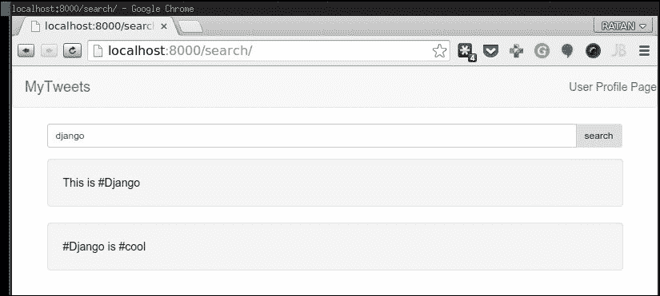

# 六、用 AJAX 增强用户界面

**AJAX**的出现是 Web2.0 历史上的一个重要里程碑。AJAX 是一组技术，使开发人员能够构建交互式、功能丰富的 Web 应用。这些技术中的大多数都比 AJAX 本身早很多年。然而，AJAX 的出现代表了 Web 从静态页面向动态、响应性和交互式用户界面的转变，静态页面需要在数据交换时进行刷新。

由于我们的项目是一个 Web2.0 应用，它应该高度关注用户体验。我们的应用的成功取决于让用户在上面发布和共享内容。因此，应用的用户界面是我们主要关注的问题之一。本章将通过引入 AJAX 特性来改进应用的界面，使其更加用户友好和交互式。

在本章中，您将了解以下主题：

*   AJAX 及其优势
*   在 Django 中使用 AJAX
*   如何使用开源 jQuery 框架
*   实现 tweet 的搜索
*   在不加载单独页面的情况下就地编辑推文
*   提交 tweet 时自动完成 hashtags

# AJAX 及其优势

AJAX 是**异步 JavaScript 和 XML**的缩写，由以下技术组成：

*   HTML 和 CSS 用于结构和样式信息
*   动态访问和操作信息的 JavaScript
*   一个`XMLHttpRequest`对象，它是现代浏览器提供的一个对象，用于在不重新加载当前网页的情况下与服务器交换数据
*   在客户端和服务器之间传输数据的格式

有时会使用 XML，但可以是 HTML、纯文本或基于 JavaScript 的 JSON 格式。

AJAX 技术允许您在后台编写客户端与服务器交换数据的代码，而无需在用户每次发出请求时重新加载整个页面。通过使用 AJAX，Web 开发人员能够提高 Web 页面的交互性和可用性。

AJAX 在正确的位置实现时具有以下优势：

*   **更好的用户体验**：使用 AJAX，用户可以在不刷新页面的情况下做很多事情，从而使 Web 应用更接近常规桌面应用
*   **更好的性能**：通过只与服务器交换所需的数据，AJAX 节省了带宽，提高了应用的速度

有许多使用 AJAX 的 Web 应用示例。谷歌地图和 Gmail 可能是两个最突出的例子。事实上，这两个应用在推广 AJAX 的使用方面发挥了重要作用，因为它们获得了成功。Gmail 区别于其他网络邮件服务的地方在于它的用户界面，它使用户无需等待页面在每次操作后重新加载即可交互管理电子邮件。这创造了更好的用户体验，让 Gmail 感觉像一个响应迅速、功能丰富的应用，而不是一个简单的网站。

本章介绍如何将 AJAX 与 Django 结合使用，从而使我们的应用更具响应性和用户友好性。我们将实现目前 web 应用中最常见的三个 AJAX 特性。然而，在此之前，我们将了解使用 AJAX 框架的好处，而不是使用原始 JavaScript 函数。

# 在 Django 中使用 AJAX 框架

由于已经在我们的项目中使用了 Bootstrap，我们不需要为 AJAX 和 jQuery 单独配置它。

使用 AJAX 框架有许多优点：

*   JavaScript implementations vary from browser to browser. Some browsers provide more complete and feature-rich implementations, whereas others contain implementations that are incomplete or don't adhere to standards.

    如果没有 AJAX 框架，开发人员必须跟踪浏览器对他们正在使用的 JavaScript 功能的支持，并且必须绕过一些浏览器中存在的限制来实现 JavaScript。

    另一方面，当使用 AJAX 框架时，框架会为我们解决这个问题；它抽象了对 JavaScript 实现的访问，并处理了不同浏览器之间 JavaScript 的差异和怪癖。这样，我们就可以专注于开发特性，而不用担心浏览器的差异和限制。

*   The standard set of JavaScript functions and classes is a bit lacking for full-fledged web application development. Various common tasks require many lines of code even though they could be wrapped in simple functions.

    因此，即使您决定不使用 AJAX 框架，您也会发现自己编写了一个函数库，它封装了 JavaScript 工具并使它们更可用。然而，既然已经有很多优秀的开源库可用，为什么还要重新发明轮子呢？

目前市场上可用的 AJAX 框架从提供服务器端和客户端组件的综合解决方案到简化 JavaScript 使用的轻量级客户端库。考虑到我们已经在服务器端使用 Django，我们只需要一个客户端框架。除此之外，该框架应该易于与 Django 集成，而不需要任何额外的依赖项。最后，最好选择一个轻快的框架。有很多优秀的框架可以满足我们的需求，比如**原型**、**雅虎！UI 库**和**jQuery**。

然而，对于我们的应用，我将选择 jQuery，因为它是三个应用中最轻的一个。它还拥有一个非常活跃的开发社区和广泛的插件。如果您已经有了使用其他框架的经验，您可以在本章中继续使用它。的确，您必须根据您的框架调整本章中的 JavaScript 代码，但是无论您选择哪个框架，服务器端的 Django 代码都将保持不变。

### 注

您还需要导入引导和 jQuery。因此，在 Django 项目中使用 AJAX 特性不需要特定的安装或导入。

# 使用开源 jQuery 框架

在我们开始在我们的项目中实现 AJAX 增强之前，让我们快速介绍一下 jQuery 框架。

## jQuery JavaScript 框架

jQuery 是一个 JavaScript 函数库，它促进了与 HTML 文档的交互并对它们进行操作。该库旨在减少编写代码和实现跨浏览器兼容性所花费的时间和精力，同时充分利用 JavaScript 提供的功能构建交互式和响应性强的 web 应用。

使用 jQuery 的一般工作流包括以下两个步骤：

1.  选择要处理的 HTML 元素或一组元素。
2.  将 jQuery 方法应用于所选组。

### 元素选择器

jQuery 提供了一种选择元素的简单方法：它将 CSS 选择器字符串传递给一个名为`$()`的函数。以下是一些示例，说明了此函数的用法：

*   如果要选择页面上的所有锚（`<a>`元素，可以使用`$("a")`函数调用
*   如果要选择具有`.title`CSS 类的锚元素，请使用

    ```py
    $("a.title")
    ```

*   要选择 ID 为`#nav`的元素，可以使用`$("#nav")`
*   要选择`#nav`中的所有列表项（`<li>`元素，请使用`$("#nav li")`

`$()`函数构造并返回一个 jQuery 对象。之后，您可以调用此对象上的方法来与选定的 HTML 元素交互。

### jQuery 方法

jQuery 提供了多种方法来操作 HTML 文档。您可以隐藏或显示元素，将事件处理程序附加到事件，修改 CSS 属性，操纵页面结构，最重要的是，执行 AJAX 请求。

为了调试，我们选择 Chrome 浏览器作为我们选择的浏览器。Chrome 是 Chrome 开发者工具中最先进的 JavaScript 调试器之一。要启动它，请按键盘上的*Ctrl*+*Shift*+*J*键。

要尝试本节中概述的方法，请启动开发服务器并导航到用户配置文件页面（`http://127.0.0.1:8000/user/ratan/`。按*F12*打开 Chrome developer tool（通过按键盘上的*Ctrl*+*Shift*+*J*打开）控制台，尝试选择元素并操作它们。

### 隐藏和显示元素

让我们从简单的事情开始。要隐藏页面上的元素，请在其上调用`hide()`方法。要再次显示，请调用`show()`方法。例如，在应用引导中名为`navbar`的导航菜单上尝试以下操作：

```py
>>> $(".navbar").hide()
>>> $(".navbar").show() 

```

还可以在隐藏和显示元素时设置该元素的动画。尝试使用`fadeOut()`、`fadeIn()`、`slideUp()`或`slideDown()`方法查看其中两种动画效果。

当然，如果您同时选择多个元素，这些方法（与所有其他 jQuery 方法一样）也可以工作。例如，如果打开用户配置文件并在 Chrome developers tools 控制台中输入以下方法调用，所有 tweet 都将消失：

```py
>>> $('.well').slideUp()

```

### 访问 CSS 属性和 HTML 属性

接下来，我们将学习如何更改元素的 CSS 属性。jQuery 提供了一个名为`css()`的方法来执行 CSS 操作。如果使用作为字符串传递的 CSS 属性名称调用此方法，它将返回此属性的值：

```py
>>> $(".navbar").css("display")

```

结果如下：

```py
block

```

如果将第二个参数传递给此方法，它会将选定元素的指定 CSS 属性设置为附加参数：

```py
>>> $(".navbar").css("font-size", "0.8em")

```

结果如下：

```py
<div id="nav" style="font-size: 0.8em;">

```

事实上，您可以操作任何 HTML 属性，而不仅仅是 CSS 属性。为此，请使用`attr()`方法，其工作方式与`css()`方法类似。使用属性名调用它会返回属性值，而使用属性名或值对调用它会将属性设置为传递的值：

```py
>>> $("input").attr("size", "48")

```

其结果如下：

```py
<input type="hidden" name="csrfmiddlewaretoken" value="xxx" size="48">
<input id="id_country" name="country" type="hidden" value="Global" size="48">
<input type="submit" value="post" size="48">

```

这将立即将页面上所有输入元素的大小更改为`48`。

除此之外，还有一些快捷方式可用于获取和设置常用属性，如`val()`，它在无参数调用时返回输入字段的值，并在传递参数时将该值设置为参数。还有一个`html()`方法控制元素中的 HTML 代码。

最后，有两种方法可用于将 CSS 类附加或分离到元素：它们是`addClass()`和`removeClass()`方法。第三种方法用于切换 CSS 类，称为`toggleClass()`方法。所有这些类方法都将要更改的类的名称作为参数。

### 操作 HTML 文档

现在您已经熟悉了 HTML 元素的操作，让我们看看如何添加新元素或删除现有元素。要在元素之前插入 HTML 代码，请使用`before()`方法；要在元素之后插入代码，请使用`after()`方法。请注意 jQuery 方法是如何命名良好且易于记忆的！

让我们通过在用户页面上的标记列表周围插入括号来测试这些方法。

打开用户页面，在 Chrome 开发者工具控制台中输入以下内容：

```py
>>> $(".well span").before("<strong>(</strong>")
>>> $(".well span").after("<strong>)</strong>")

```

您可以传递任何想要传递的字符串，`before()`或`after()`方法。字符串可以包含纯文本、一个 HTML 元素或多个元素。这些方法提供了一种非常灵活的方法，可以将 HTML 元素动态添加到 HTML 文档中。

如果要删除元素，请使用`remove()`方法。例如：

```py
$("#navbar").remove()

```

该方法不仅隐藏了元素，还将其从文档树中完全删除。如果您在使用`remove()`方法后再次尝试选择该元素，您将得到一个空集：

```py
>>> $("#nav")

```

结果如下：

```py
[]

```

当然，这只会从页面的当前实例中删除元素。如果重新加载页面，元素将再次出现。

### 遍历文档树

尽管 CSS 选择器提供了一种非常强大的选择元素的方法，但有时您需要从特定元素开始遍历文档树。

为此，jQuery 提供了几种方法。`parent()`方法返回当前所选元素的父元素。`children()`方法返回所选元素的所有直接子元素。最后，`find()`方法返回当前所选元素的所有后代。所有这些方法都采用可选的 CSS 选择器字符串，将结果限制为与选择器匹配的元素。例如，`$(".column").find("span")`返回类列的所有`<span>`后代。

如果要访问组中的单个元素，请使用`get()`方法，该方法将元素的索引作为参数。例如，`$("span").get(0)`方法返回所选组中的第一个`<span>`元素。

### 事件处理

接下来我们将学习事件处理程序。事件处理程序是一个 JavaScript 函数，当某个特定事件发生时调用，例如，当点击按钮或提交表单时。jQuery 提供了大量方法来将处理程序附加到事件；我们的应用中特别感兴趣的事件是鼠标单击和表单提交。为了处理点击一个元素的事件，我们选择这个元素并调用它的`click()`方法。此方法将事件处理程序函数作为参数。让我们在 Chrome 开发者控制台中试试这个。

打开应用的用户配置文件页面，并在 tweet 后插入一个按钮：

```py
>>> $(".well span").after("<button id=\"test-button\">Click me!</button>")

```

### 注

注意，我们必须转义传递给`after()`方法的字符串中的引号。

如果尝试单击此按钮，则不会发生任何事情，因此让我们将事件处理程序附加到该按钮：

```py
>>> $("#test-button").click(function () { alert("You clicked me!"); })

```

现在，当点击按钮时，会出现一个消息框。这是怎么回事？

我们传递给`click()`方法的参数可能看起来有点复杂，所以让我们再次检查一下：

```py
function () { alert("You clicked me!"); }

```

这似乎是一个函数声明，但没有函数名。实际上，这个构造创建了 JavaScript 术语中所谓的匿名函数，当您需要动态创建函数并将其作为参数传递给另一个函数时，可以使用它。我们本可以避免使用匿名函数，并将事件处理程序声明为常规函数：

```py
>>> function handler() { alert("You clicked me!"); }
>>> $("#test-button").click(handler)

```

前面的代码实现了相同的效果，但第一个代码更简洁紧凑。我强烈建议您习惯 JavaScript 中的匿名函数（如果您还没有习惯的话），因为我相信您会喜欢这个结构，并且在使用一段时间后会发现它更具可读性。

处理表单提交与处理鼠标单击非常相似。首先选择表单，然后对其调用`submit()`方法，然后将处理程序作为参数传递。在后面的部分中，我们将在向项目添加 AJAX 特性时多次使用此方法。

### 发送 AJAX 请求

在我们完成本节之前，让我们先谈谈 AJAX 请求。jQuery 提供了许多向服务器发送 AJAX 请求的方法。例如，`load()`方法获取一个 URL 并将该 URL 处的页面加载到所选元素中。还有一些方法可以发送 GET 或 POST 请求并接收结果。在我们的项目中实现 AJAX 特性时，我们将更深入地研究这些方法。

### 接下来呢？

这就结束了我们对 jQuery 的快速介绍。本节中提供的信息足以继续本章，一旦您完成本章，您将能够自己实现许多有趣的 AJAX 特性。但是，请记住，这个 jQuery 介绍只是冰山一角。如果您想全面了解 jQuery 框架，我强烈建议您阅读 Packt Publishing 的*学习 jQuery*，因为它更详细地介绍了 jQuery。你可以在[找到更多关于这本书的信息 http://www.packtpub.com/jQuery](http://www.packtpub.com/jQuery) 。

# 实现推文搜索

我们将通过实现实时搜索开始在应用中引入 AJAX。此功能背后的想法很简单：当用户在文本字段中键入几个关键字并单击搜索时，一个脚本会在后台提取搜索结果并将其显示在同一页面上。搜索页面不会重新加载，因此节省了带宽，并提供了更好、响应更快的用户体验。

在开始实现之前，在使用 AJAX 时，我们需要记住一条重要规则：编写应用，使其在没有 AJAX 的情况下工作，然后将 AJAX 引入其中。如果您这样做，您将确保每个人都能够使用您的应用，包括未启用 JavaScript 的用户和使用不支持 AJAX 的浏览器的用户。

## 实施搜索

因此，在我们使用 AJAX 之前，让我们编写一个按标题搜索书签的简单视图。首先，我们需要创建一个搜索表单，所以打开`tweets/forms.py`文件并添加以下类：

```py
class SearchForm(forms.Form):
query = forms.CharField(label='Enter a keyword to search for',
widget=forms.TextInput(attrs={'size': 32, 'class':'form-control'}))
```

如您所见，它是一个非常简单的表单类，只有一个文本字段。用户将使用此字段输入搜索关键字。接下来，让我们创建一个视图来执行搜索。打开文件`tweets/views.py`并在其中输入以下代码：

```py
class Search(View):
  """Search all tweets with query /search/?query=<query> URL"""
  def get(self, request):
    form = SearchForm()
    params = dict()
    params["search"] = form
  return render(request, 'search.html', params)

  def post(self, request):
    form = SearchForm(request.POST)
    if form.is_valid():
    query = form.cleaned_data['query']
    tweets = Tweet.objects.filter(text__icontains=query)
    context = Context({"query": query, "tweets": tweets})
    return_str = render_to_string('partials/_tweet_search.html', context)
  return HttpResponse(json.dumps(return_str), content_type="application/json")
  else:
    HttpResponseRedirect("/search")
```

除了几个方法调用之外，视图应该很容易理解。如果您查看`get`请求，它非常简单，因为它准备了搜索表单，然后呈现它。

`post()`方法是所有魔法发生的地方。当我们呈现搜索结果时，它只是一个带有搜索表单的布局呈现，也就是说，如果您查看我们创建的名为`search.html`的新文件，您可以看到以下内容：

```py




<div class="row clearfix">
  <div class="col-md-6 col-md-offset-3 column">
    <form id="search-form" action="" method="post">
      <div class="input-group input-group-sm">
      {{ search.query.errors }}
      {{ search.query }}
        <span class="input-group-btn">
          <button class="btn btn-search" type="submit">search</button>
        </span>
      </div><!-- /input-group -->
    </form>
  </div>
  <div class="col-md-12 column tweets">
  </div>
</div>


  <script src=""></script>

```

如果您仔细查看，您将看到包含一个名为``的新部分。此处使用的概念与``块相同，即此处声明的内容将在`base.html`文件中呈现。进一步看一下修改后的`base.html`文件，我们可以看到以下内容：

```py

  <html>
    <head>
      <link href=""
        rel="stylesheet" media="screen">
        
        
    </head>
    <body>
      <nav class="navbar navbar-default" role="navigation">
        <a class="navbar-brand" href="#">MyTweets</a>
        <p class="navbar-text navbar-right">User Profile Page</p>
      </nav>
      <div class="container">
        
        
      </div>
      <nav class="navbar navbar-default navbar-fixed-bottom" role="navigation">
        <p class="navbar-text navbar-right">Footer </p>
      </nav>
      <script src=""></script>
      <script src=""></script>
      <script src=""></script>
        
        
    </body>
  </html>
```

前面的代码清楚地显示了两个新的内容块，如下所示：

```py

  
  

```

它们用于包含相应的文件类型，并使用基来呈现文件类型，因此使用每页只声明一个 CSS 和 JavaScript 文件的简单规则，维护项目变得更加简单。我们将在本书后面的部分使用称为**资产管道**的概念来实现这一点。

现在，回到我们的 AJAX 搜索特性，您将看到这个`search.html`文件类似于`tweet.html`文件。

对于搜索功能，我们将创建一个新的 URL，我们需要将其附加到以下`urls.py`文件中：

```py
url(r'^search/$', Search.as_view()),
urls.py
from django.conf.urls import patterns, include, url
from django.contrib import admin
from tweet.views import Index, Profile, PostTweet, HashTagCloud, Search

admin.autodiscover()

urlpatterns = patterns('',
url(r'^$', Index.as_view()),
url(r'^user/(\w+)/$', Profile.as_view()),
url(r'^admin/', include(admin.site.urls)),
url(r'^user/(\w+)/post/$', PostTweet.as_view()),
url(r'^hashTag/(\w+)/$', HashTagCloud.as_view()),
url(r'^search/$', Search.as_view()),
)
```

在`search.html`文件中，我们定义了`search.js`方法；让我们创建这个 JavaScript 文件，实际上发出 AJAX 请求：

```py
search.js

$('#search-form').submit(function(e){
$.post('/search/', $(this).serialize(), function(data){
$('.tweets').html(data);
});
e.preventDefault();
});
```

提交表单时会触发此 JavaScript 代码，它使用序列化的表单数据向`/search`用户发出 AJAX post 请求，并获得响应。然后，通过它得到的响应，它将数据附加到具有类 tweets 的元素。

如果我们在浏览器中打开用户搜索，它将显示如下屏幕截图：


现在，等等！提交此表单时会发生什么情况？

AJAX 请求进入 search 类的`post()`方法，如下所示：

```py
def post(self, request):
  form = SearchForm(request.POST)
  if form.is_valid():
    query = form.cleaned_data['query']
    tweets = Tweet.objects.filter(text__icontains=query)
    context = Context({"query": query, "tweets": tweets})
    return_str = render_to_string('partials/_tweet_search.html', context)
  return HttpResponse(json.dumps(return_str), content_type="application/json")
  else:
    HttpResponseRedirect("/search")
```

我们从`request.POST`方法中提取后，正在检查表单验证；如果表单有效，则从表单对象提取查询。

然后，`tweets = Tweet.objects.filter(text__icontains===query)`方法搜索给定查询项的子字符串匹配。

使用`Tweets.objects`模块中名为`filter`的方法进行搜索。您可以将其视为 Django 模型中的`SELECT`语句的等价物。它在其参数中接收搜索条件并返回搜索结果。每个参数的名称必须遵守以下命名约定：

```py
field__operator
```

注意，`field`和`operator`变量由两个下划线分隔：字段，这是我们要搜索的字段的名称，运算符，这是我们要使用的查找方法。以下是常用运算符的列表：

*   `exact`：这是与字段完全匹配的参数的值
*   `contains`：此字段包含参数的值
*   `startswith`：此字段以参数值开头
*   `lt`：此字段小于参数值
*   `gt`：此字段大于参数值

此外，前三个操作符也有不区分大小写的版本：`iexact`、`icontains`和`istartswith`也可以包含在列表中。

我们现在做的一件事完全不同，那就是：

```py
context = Context({"query": query, "tweets": tweets})
return_str = render_to_string('partials/_tweet_search.html', context)
return HttpResponse(json.dumps(return_str), content_type="application/json")
```

我们的目标是在不重新加载或刷新搜索页面的情况下加载搜索结果。如果是这样，我们以前的渲染方法将如何帮助我们？不可能。我们需要一些方法来帮助我们将日期发送到浏览器，而无需重新加载。

我们在 web 开发中广泛使用称为**部分**的概念。它们通常是服务器端生成的 HTML 代码的小片段，呈现为 JSON，然后在 JavaScript 的帮助下附加到现有 DOM 中。

为了实现此方法，我们将首先在现有模板文件夹中创建一个名为 partials 的文件夹，即一个具有以下内容的`_tweet_search.html`文件：

```py

  <div class="well">
    <span>{{ tweet.text }}</span>
  </div>


  <div class="well">
    <span> No Tweet found.</span>
  </div>

```

代码将在井框内呈现整个 tweet 对象，或者，如果未找到 tweet 对象，则将在井框内呈现`No tweet Found`。

前面的概念是在视图中将部分渲染为字符串，如果我们需要为渲染传递任何参数，我们首先需要通过调用从部分生成字符串来传递这些参数。要传递分部的参数，我们需要创建一个上下文对象，然后传递参数：

```py
context = Context({"query": query, "tweets": tweets})
return_str = render_to_string('partials/_tweet_search.html', context)
```

首先，我们将使用`query`（稍后使用）和`tweets`参数创建上下文，并使用`render_to_string()`函数。然后，我们可以使用 JSON 将字符串转储到`HttpResponse()`函数，如下所示：

```py
return HttpResponse(json.dumps(return_str), content_type="application/json")
```

进口货物清单如下：

```py
from django.views.generic import View
from django.shortcuts import render
from user_profile.models import User
from models import Tweet, HashTag
from tweet.forms import TweetForm, SearchForm
from django.http import HttpResponseRedirect
from django.template.loader import render_to_string
from django.template import Context
from django.http import HttpResponse
import json
```

就这样！我们完成了基于 AJAX 的推文搜索。搜索`django`列出了我们创建的两条推文，如下截图所示：



继续玩搜索引擎吧，我相信你会更喜欢 Django。

我们现在有了一个功能性（尽管非常基本）的搜索页面。搜索功能本身将在后面的章节中得到改进，但现在对我们来说重要的是将 AJAX 引入到搜索表单中，以便在后台获取结果，并在不重新加载页面的情况下呈现给用户。多亏了我们的模块化代码，这项任务将变得比看起来简单得多。

# 实现推特实时搜索

正如我们在上一节中进行的简单搜索一样，我们现在将实现实时搜索，这在技术上是相同的，但唯一的区别是搜索表单将在每一次按键时提交，结果将实时加载。

要实现实时搜索，我们需要做以下两件事：

*   我们需要拦截并处理提交搜索表单的事件。这可以使用 jQuery 的`submit()`方法完成。
*   我们需要使用 AJAX 在后台加载搜索结果并将其插入页面。

jQuery 提供了一个名为`load()`的方法，该方法从服务器检索页面并将其内容插入所选元素。在最简单的形式中，该函数将要加载的远程页面的 URL 作为参数。

我们将在 hashtags 上实现实时搜索，也就是说，我们将创建一个与我们刚刚创建的搜索页面相同的新页面，但这将用于 hashtags，我们将使用实时 hashtag 建议（hashtag 的自动完成）。在开始之前，我们同样需要 Twitter`typeahead`JavaScript 库。

从[下载本库的最新版本 http://twitter.github.io/typeahead.js/](http://twitter.github.io/typeahead.js/) 。

在本章中，我们下载了图书馆的 10.05 版。下载并保存到当前的 JavaScript 文件夹中。

首先，让我们稍微修改一下搜索视图，这样当它接收到一个名为 AJAX 的额外 GET 变量时，它只返回搜索结果，而不返回搜索页面的其余部分。我们这样做是为了使客户端的 JavaScript 代码能够轻松检索搜索结果，而无需搜索页面 HTML 格式的其余部分。这可以通过在请求时使用`bookmark_list.html`模板而不是`search.html`模板来完成。

GET 包含关键的 AJAX 参数。打开`bookmarks/views.py`文件，修改`search_page`参数（向末尾），使其变为：

```py
def search_page(request):
  [...]
  variables = RequestContext(request, {
    'form': form,
    'bookmarks': bookmarks,
    'show_results': show_results,
    'show_tags': True,
    'show_user': True
  })
  if request.GET.has_key('AJAX'):):):
    return render_to_response('bookmark_list.html', variables)
  else:
    return render_to_response('search.html', variables)
```

接下来，在`site_media`目录中创建一个名为`search.js`的文件，并将其链接到`templates/search.html`文件，如下所示：

```py

  
    <script type="text/javascript" src="/site_media/search.js">
    </script>
  
Search Bookmarks
Search Bookmarks
[...]
```

现在来看有趣的部分！让我们创建一个函数，加载搜索结果并将其插入相应的`div`标记中。在`site_media/search.js`文件中写入以下代码：

```py
function search_submit() {
  var query = $("#id_query").val();
  $("#search-results").load(
    "/search/?AJAX&query=" + encodeURIComponent(query)
  );
return false;
}
```

让我们一行一行地看一下这个函数：

*   函数首先使用`val()`方法从文本字段获取查询字符串。
*   我们使用`load()`方法从`search_page`视图中获取搜索结果，并将搜索结果插入`#search-results`div。请求 URL 是通过在查询时首先调用`encodeURIComponent`参数构建的，其工作原理与我们在 Django 模板中使用的`urlencode`过滤器完全相同。调用此函数对于确保即使用户在文本字段中输入特殊字符，如`&`，构造的 URL 仍然有效非常重要。在转义查询之后，我们将其与`/search/?AJAX&query=`参数连接起来。此 URL 调用`search_page`视图，并将 GET 变量的 AJAX 参数和查询传递给它。视图返回搜索结果，`load()`方法依次将结果加载到`#search-results`div 中。
*   我们从函数返回`False`，告知浏览器在调用我们的处理程序后不要提交表单。如果我们不在函数中返回`False`，浏览器将一如既往地提交表单，我们不希望这样。

还有一个小细节：您应该在何时何地将`search_submit`参数附加到搜索表单的提交事件？编写 JavaScript 时的一条经验法则是，在文档完成加载之前，我们不能操作文档树中的元素。因此，必须在加载搜索页面后立即调用我们的函数。幸运的是，jQuery 提供了一种在加载 HTML 文档时执行函数的方法。让我们通过在`site_media/search.js`文件中附加以下代码来利用它：

```py
$(document).ready(function () {
  $("#search-form").submit(search_submit);
});
```

`$(document)`功能选择当前页面的文档元素。请注意，`document`变量周围没有引号；它是浏览器提供的变量，而不是字符串。

`ready()`方法接受一个函数，并在所选元素完成加载后立即执行该函数。因此，实际上，我们告诉 jQuery 在加载 HTML 文档后立即执行传递的函数。我们将一个匿名函数传递给`ready()`方法，该函数简单地将`search_submit`参数绑定到`#search-form`表单的提交事件。

就这样。我们已经用不到 15 行代码实现了实时搜索。要测试新功能，请导航至`http://127.0.0.1:8000/search/`，提交查询，并记录结果的显示方式，而无需重新加载页面。

本节介绍的信息可以应用于任何需要在后台处理的表单，而无需重新加载页面。例如，您可以创建一个带有预览按钮的评论表单，该按钮可以在同一页面中加载预览，而无需重新加载。在下一节中，我们将增强用户页面，让用户在不离开用户页面的情况下就地编辑书签。

# 在不加载单独页面的情况下就地编辑推文

编辑发布的内容是网站上一项非常常见的任务。它通常通过在内容旁边提供一个**编辑**链接来实现。点击后，此链接将用户带到位于另一页面的表单，在该页面上可以编辑内容。当用户提交表单时，他们将被重定向回内容页。

另一方面，想象一下，您可以编辑内容而不必离开内容页。当您点击**编辑**按钮时，内容将替换为表单。提交表单时，表单将消失，更新的内容将显示在相应位置。一切都发生在同一页上；编辑表单的呈现和提交是使用 JavaScript 和 AJAX 完成的。这样的工作流程不是更直观、响应更快吗？

前面描述的技术称为**就地编辑**。它现在在 Web 应用中找到了自己的方式，并且变得越来越普遍。我们将在应用中实现这一功能，让用户在用户页面上适当地编辑他们的书签。

由于我们的应用还不支持编辑书签，我们将首先实现这一点，然后修改编辑过程以使其正常工作。

## 实现书签编辑

我们已经有了实现书签编辑所需的大部分部分。如果您还记得上一章，在`bookmarks/views.py`文件中，我们以这样的方式实现了`bookmark_save_page`视图：如果用户多次尝试保存相同的 URL，则相同的书签将被更新，而不是被复制。由于数据模型提供了`get_or_create()`方法，这很容易做到。这个小细节大大简化了书签编辑的实现。以下是我们需要做的：

*   我们将要编辑的书签的 URL 作为名为 URL 的 GET 变量传递给`bookmark_save_page`视图。
*   我们修改了`bookmark_save_page`视图，以便在收到 GET 变量时填充书签表单的字段。表单将填充与传递的 URL 相对应的书签数据。

当提交填充的表单时，书签将被更新，正如我们前面所解释的，因为用户似乎在另一次提交相同的 URL。

在我们实现前面描述的技术之前，让我们通过将保存书签的部分移动到单独的函数来减小`bookmark_save_page`视图的大小。我们将调用此函数`_bookmark_save`。名称开头的下划线告诉 Python 在导入视图模块时不要导入此函数。函数需要一个请求和一个有效的表单对象作为参数；它从表单数据中保存书签并返回此书签。

打开`bookmarks/views.py`文件，创建以下功能；如果您愿意，您可以从`bookmark_save_page`视图中剪切和粘贴代码，因为除了结尾的`return`语句外，我们不会对其进行任何更改：

```py
def _bookmark_save(request, form):
  # Create or get link.
  link, dummy = \
  Link.objects.get_or_create(url=form.clean_data['url'])
  # Create or get bookmark.
  bookmark, created = Bookmark.objects.get_or_create(
    user=request.user,
    link=link
  )
  # Update bookmark title.
  bookmark.title = form.clean_data['title']
  # If the bookmark is being updated, clear old tag list.
  if not created:
    bookmark.tag_set.clear()
    # Create new tag list.
    tag_names = form.clean_data['tags'].split()
    for tag_name in tag_names:
      tag, dummy = Tag.objects.get_or_create(name=tag_name)
      bookmark.tag_set.add(tag)
      # Save bookmark to database and return it.
      bookmark.save()
    return bookmark
    Now in the same file, replace the code that you removed from bookmark_save_page
    with a call to _bookmark_save :
      @login_required
      def bookmark_save_page(request):
        if request.method == 'POST':
          form = BookmarkSaveForm(request.POST)
        if form.is_valid():
          bookmark = _bookmark_save(request, form)
          return HttpResponseRedirect(
            '/user/%s/' % request.user.username
          )
        else:
          form = BookmarkSaveForm()
          variables = RequestContext(request, {
            'form': form
          })
        return render_to_response('bookmark_save.html', variables)
```

`bookmark_save_page`视图中当前的逻辑如下：

[伪代码]

```py
if there is POST data:
  Validate and save bookmark.
  Redirect to user page.
else:
  Create an empty form.
Render page.
```

要实现书签编辑，我们需要稍微修改逻辑，如下所示：

[伪代码]

```py
if there is POST data:
  Validate and save bookmark.
  Redirect to user page.
  else if there is a URL in GET data:
    Create a form an populate it with the URL's bookmark.
  else:
    Create an empty form.
Render page.
```

让我们将前面的伪代码翻译成 Python。修改`bookmarks/views.py`文件中的`bookmark_save_page`视图，使看起来像以下代码（新代码高亮显示）：

```py
from django.core.exceptions import ObjectDoesNotExist
@login_required
def bookmark_save_page(request):
  if request.method == 'POST':
    form = BookmarkSaveForm(request.POST)
      if form.is_valid():
        bookmark = _bookmark_save(request, form)
        return HttpResponseRedirect(
          '/user/%s/' % request.user.username)
        elif request.GET.has_key('url'):):):
          url = request.GET['url']
          title = ''
          tags = ''
        try:
          link = Link.objects.get(url=url)
          bookmark = Bookmark.objects.get(
            link=link,
            user=request.user
          )
        title = bookmark.title
        tags = ' '.join(
          tag.name for tag in bookmark.tag_set.all()
        )
        except ObjectDoesNotExist:
          pass
        form = BookmarkSaveForm({
          'url': url,
          'title': title,
          'tags': tags
        })
        else:
          form = BookmarkSaveForm()
          variables = RequestContext(request, {
            'form': form
          })
        return render_to_response('bookmark_save.html', variables)
```

代码的这个新的部分首先检查是否存在一个名为 URL 的 GET 变量。如果是这种情况，则加载此 URL 对应的`Link`和`Bookmark`对象，并将所有数据绑定到书签保存表单。您可能想知道为什么我们在 try-except 构造中加载`Link`和`Bookmark`对象，该构造会默默地忽略异常。

事实上，如果没有为请求的 URL 找到书签，则引发 HTTP404 异常是完全有效的。但是，在这种情况下，我们的代码选择只填充 URL 字段，而将 title 和 tags 字段留空。

现在，让我们在用户页面中的每个书签旁边添加**编辑**链接。打开`templates/bookmark_list.html`文件并插入突出显示的代码：

```py

  <ul class="bookmarks">
    
      <li>
        <a href="{{ bookmark.link.url }}" class="title">
        {{ bookmark.title|escape }}</a>
        
          <a href="/save/?url={{ bookmark.link.url|urlencode }}"
          class="edit">[edit]</a>
        
      <br />
      
        Tags:
          
            <ul class="tags">
              
                <li><a href="/tag/{{ tag.name|urlencode }}/">
              {{ tag.name|escape }}</a></li>
              
            </ul>
      
        None.
      
      <br />
[...]
```

请注意，我们是如何通过将书签的 URL 附加到`/save/?url= {{ bookmark.link.url|urlencode }}`来构建编辑链接的。

此外，由于我们只希望在用户页面上显示编辑链接，因此模板仅在`show_edit`标志设置为`True`时才会呈现这些链接。否则，让用户编辑其他人的链接就没有意义了。现在打开文件`bookmarks/views.py`并将`show_edit`标志添加到`user_page`标志中的模板变量中：

```py
def user_page(request, username):
  user = get_object_or_404(User, username=username)
  bookmarks = user.bookmark_set.order_by('-id')
  variables = RequestContext(request, {
    'bookmarks': bookmarks,
    'username': username,
    'show_tags': True,
    'show_edit': username == request.user.username,
  })
return render_to_response('user_page.html', variables)
```

只有当用户查看自己的页面时，`username == request.user.username`表达式才计算为`True`，这正是我们想要的。

最后，我建议您稍微减小编辑链接的字体大小。打开`site_media/style.css`文件，并在其末尾附加以下内容：

```py
ul.bookmarks .edit {
  font-size: 70%;
}
```

我们完了！在我们继续之前，请随意导航到您的用户页面并尝试编辑您的书签。

## 实现书签的就地编辑

现在我们已经实现了书签编辑，让我们进入激动人心的部分：使用 AJAX 添加就地编辑！

我们处理这项任务的方法如下：

*   我们将拦截单击编辑链接的事件，并使用 AJAX 从服务器加载书签编辑表单。然后我们将用编辑表单替换页面上的书签。
*   当用户提交编辑表单时，我们将拦截提交事件并使用 AJAX 将更新的书签发送到服务器。
*   服务器保存书签并返回新书签的 HTML 表示形式。然后，我们将用服务器返回的标记替换页面上的编辑表单。

我们将使用非常类似于实时搜索的方法实现前面的过程。首先，我们将修改`bookmark_save_page`视图，以便当一个名为 AJAX 的 GET 变量退出时，它响应 AJAX 请求。接下来，我们将编写 JavaScript 代码从视图中检索编辑表单，当用户提交表单时，该视图将书签数据发回服务器。

因为我们想从`bookmark_save_page`视图将编辑表单的标记返回到 AJAX 脚本，所以让我们稍微重新构造一下模板。在模板中创建名为`bookmark_save_form.html`的文件，并将书签保存表单从`bookmark_save.html`文件移动到此新文件：

```py
<form id="save-form" method="post" action="/save/">
  {{ form.as_p }}
  <input type="submit" value="save" />
</form>
```

请注意，我们还将表单的 action 属性更改为`/save/`，并为其提供了一个 ID。这是表单在用户页面和书签提交页面上工作所必需的。

接下来，在`bookmark_save.html`文件中包含这个新模板：

```py

Save Bookmark
Save Bookmark



```

*好的*，现在我们有了单独模板中的表单。让我们更新`bookmark_save_page`视图来处理普通请求和 AJAX 请求。打开`bookmarks/views.py`文件并更新视图，使其看起来如下所示（使用高亮显示的新行进行修改）：

```py
def bookmark_save_page(request):
  AJAX = request.GET.has_key('AJAX')))
  if request.method == 'POST':
    form = BookmarkSaveForm(request.POST)
    if form.is_valid():
      bookmark = _bookmark_save(form)
        if AJAX:
          variables = RequestContext(request, {
            'bookmarks': [bookmark],
            'show_edit': True,
            'show_tags': True
        })
      return render_to_response('bookmark_list.html', variables)
      else:
        return HttpResponseRedirect(
          '/user/%s/' % request.user.username
        )
      else:
        if AJAX:
          return HttpResponse('failure')
          elif request.GET.has_key('url'):
            url = request.GET['url']
            title = ''
            tags = ''
        try:
          link = Link.objects.get(url=url)
          bookmark = Bookmark.objects.get(link=link, user=request.user)
          title = bookmark.title
          tags = ' '.join(tag.name for tag in bookmark.tag_set.all())
        except:::
          pass
          form = BookmarkSaveForm({
            'url': url,
            'title': title,
            'tags': tags
          })
        else:
          form = BookmarkSaveForm()
          variables = RequestContext(request, {
            'form': form
          })
          if AJAX:
            return render_to_response(
              'bookmark_save_form.html',
              variables
            )
            else:
              return render_to_response(
                'bookmark_save.html',
                variables
              )
```

让我们分别检查每个突出显示的部分：

```py
AJAX = request.GET.has_key('AJAX')
```

在方法的开头，我们将检查名为 AJAX 的 GET 变量是否存在。我们将结果存储在一个名为 AJAX 的变量中。在方法的后面，我们可以使用以下变量检查是否正在处理 AJAX 请求：

```py
if condition:
  if form.is_valid():
    bookmark = _bookmark_save(form)
    if AJAX:
      variables = RequestContext(request, {
        'bookmarks': [bookmark],
         'show_edit': True,
         'show_tags': True
      })
    return render_to_response('bookmark_list.html', variables)
    else:
      return HttpResponseRedirect('/user/%s/' % request.user.username)
    else:
      if AJAX:
        return HttpResponse('failure')
```

如果我们收到 POST 请求，我们会检查提交的表单是否有效。如果有效，我们保存书签。接下来，我们检查这是否是一个 AJAX 请求。如果是，我们使用`bookmark_list.html`模板呈现保存的书签，并将其返回到请求脚本。否则，这是一个正常的表单提交，因此我们将用户重定向到他们的用户页面。另一方面，如果表单无效，我们只会通过返回字符串`'failure'`来充当 AJAX 请求，我们将通过在 JavaScript 中显示错误对话框来响应该字符串。如果是正常请求，我们不需要执行任何操作，因为页面将被重新加载，表单将在输入中显示任何错误：

```py
if AJAX:
  return render_to_response('bookmark_save_form.html', variables)
  else:
    return render_to_response('bookmark_save.html', variables)
```

这将在方法末尾进行检查。如果没有 POST 数据，执行将达到这一点，这意味着我们应该呈现一个表单并返回它。如果是 AJAX 请求，我们使用`bookmark_save_form.html`模板和`bookmark_save`方法，否则将其保存为 HTML 文件。

我们的视图现在可以为 AJAX 请求和普通页面请求提供服务。让我们编写 JavaScript 代码来利用更新后的视图。在`site_media`配置文件中创建一个名为`bookmark_edit.js`的新文件。但是，在我们添加任何代码之前，让我们将`bookmark_edit.js`文件链接到`user_page.html`模板。打开`user_page.html`文件，修改如下：

```py

  
    <script type="text/javascript" src="/site_media/bookmark_edit.js">
    </script>
  
  {{ username }}
  Bookmarks for {{ username }}
  
    
  
```

我们必须在`bookmark_edit.js`文件中写入两个函数：

*   `bookmark_edit`：此功能处理编辑链接的点击。它从服务器加载编辑表单，并用此表单替换书签。
*   `bookmark_save`：此功能处理编辑表单的提交。它将表单数据发送到服务器，并用服务器返回的书签 HTML 替换表单。

让我们从第一个函数开始。打开`site_media/bookmark_edit.js`文件，在其中写入以下代码：

```py
function bookmark_edit() {
  var item = $(this).parent();
  var url = item.find(".title").attr("href");
  item.load("/save/?AJAX&url=" + escape(url), null, function () {
    $("#save-form").submit(bookmark_save);
  });
  return false;
}
```

由于此函数处理编辑链接上的点击事件，`this`变量引用编辑链接本身。将其包装在 jQuery`$()`函数中并调用`parent()`函数将返回编辑链接的父级，即书签的`<li>`元素（请在 Firebug 控制台中尝试查看）。

在检索到对书签的`<li>`元素的引用后，我们获取对书签标题的引用，并使用`attr()`方法从中提取书签的 URL。

接下来，我们使用`load()`方法将编辑表单放置在书签 HTML 文件的位置。这一次，除了 URL 之外，我们使用两个额外的参数调用`load()`方法。`load()`功能有两个可选参数，如下所示：

*   如果我们发送 POST 请求，它将接受一个键或值对的对象。由于我们使用 get 请求从服务器端视图获取编辑表单，因此我们将此参数传递为 null。
*   它接受一个函数，当 jQuery 完成将 URL 加载到所选元素时调用该函数。我们传递的函数将`bookmark_save()`方法（我们将在下面编写）附加到我们刚刚检索到的表单上。

最后，函数返回`False`告诉浏览器不要跟随编辑链接。现在我们需要使用`$(document).ready()`将`bookmark_edit()`功能附加到点击编辑链接的事件：

```py
$(document).ready(function () {
  $("ul.bookmarks .edit").click(bookmark_edit);
});
```

如果您在编写此函数后尝试在用户页面中编辑书签，则会出现一个编辑表单，但您也会在 Firebug 控制台中收到一条 JavaScript 错误消息，因为`bookmark_save()`函数未定义，所以让我们编写它：

```py
function bookmark_save() {
  var item = $(this).parent();
  var data = {
    url: item.find("#id_url").val(),
    title: item.find("#id_title").val(),
    tags: item.find("#id_tags").val()
  };
  $.post("/save/?AJAX", data, function (result) {
    if (result != "failure") {
      item.before($("li", result).get(0));
      item.remove();
      $("ul.bookmarks .edit").click(bookmark_edit);
    }
    else {
      alert("Failed to validate bookmark before saving.");
    }
  });
  return false;
}
```

这里，`this`变量指的是编辑表单，因为我们处理提交表单的事件。函数首先检索对表单父级的引用，这也是书签的`<li>`元素。接下来，函数使用每个表单字段的 ID 和`val()`方法从表单检索更新的数据。

然后使用名为`$.post()`的方法将数据发送回服务器。最后，返回`False`以防止浏览器提交表单。

您可能已经猜到，`$.post()`函数是一种 jQuery 方法，它向服务器发送 POST 请求。它需要三个参数，如下所示：

*   POST 请求的目标的 URL。
*   表示 POST 数据的键/值对对象。
*   请求完成时调用的函数。服务器响应作为字符串参数传递给此函数。

值得一提的是，jQuery 提供了一个名为`$.get()`的方法来向服务器发送 GET 请求。它采用与`$.post()`函数相同的参数类型。我们使用`$.post()`方法将更新后的书签数据发送到`bookmark_save_page`视图。如前几段所述，如果视图成功保存更新书签 HTML，它将返回更新书签 HTML。否则返回`failure`字符串。

因此，我们检查服务器返回的结果是否为`failure`。如果请求成功，我们使用`before()`方法在旧书签之前插入新书签，使用`remove()`方法从 HTML 文档中删除旧书签。另一方面，如果请求失败，我们将显示一个显示失败的警报框。

在我们完成这一部分之前，还有几件小事要做。为什么我们要插入`$("li",result).get(0)`方法而不是结果本身？如果您检查`bookmark_save_page`视图，您将看到它使用`bookmark_list.html`模板来构造书签的 HTML。但是，`bookmark_list.html`模板返回包裹在`<ul>`标记中的 bookmark`<li>`元素。基本上，`$("li", result).get(0)`方法告诉 jQuery 提取结果中的第一个`<li>`元素，这就是我们想要的元素。正如您从前面的代码片段中看到的，您可以使用 jQuery`$()`函数从 HTML 字符串中选择元素，方法是将该字符串作为第二个参数传递给该函数。

`bookmark_submit`模板是从`bookmark_edit`模板中附加到其事件的，因此我们不需要在`$(document).ready()`方法中对其进行任何操作。

最后，在将更新后的书签加载到页面中后，我们再次调用`$("ul.bookmarks.edit").click(bookmark_edit)`方法将`bookmark_edit`模板附加到新加载的编辑链接。如果您不这样做，并尝试编辑书签两次，第二次单击编辑链接将带您进入一个单独的表单页面。

编写完 JavaScript 代码后，打开浏览器并转到用户页面以试验新功能。编辑书签，保存它们，并注意更改如何在不重新加载的情况下立即反映在页面上。

现在，您已经完成了本节，应该对如何实现就地编辑有了很好的了解。在许多其他情况下，此功能可能很有用，例如，它可以用于编辑同一页面上的文章或评论，而无需导航到位于不同 URL 上的表单。

在下一节中，我们将实现第三个常见的 AJAX 功能，帮助用户在提交书签时输入标记。

# 提交推文时自动完成标签

我们将在本章中实现的最后一个 AJAX 增强是标记的自动完成。当谷歌发布他们的建议搜索界面时，自动完成的概念进入了网络应用。建议的工作原理是根据用户迄今为止键入的内容，在搜索输入字段下方显示最流行的搜索查询。它还类似于集成开发环境中的代码编辑器如何根据您键入的内容提供代码完成建议。此功能允许用户键入所需单词的几个字符，然后从列表中选择，而无需完全键入，从而节省了时间。

当用户在提交书签时输入标签时，我们将通过提供建议来实现此功能，但是我们将使用 jQuery 插件来实现此功能，而不是从头开始编写此功能。jQuery 拥有大量不断增长的插件，这些插件提供了各种各样的特性。安装插件与安装 jQuery 本身没有什么不同。下载一个（或多个）文件并将其链接到模板，然后编写几行 JavaScript 代码来激活插件。

您可以导航到[浏览可用 jQuery 插件列表 http://docs.jquery.com/Plugins](http://docs.jquery.com/Plugins) 。在列表中搜索并下载 autocomplete 插件，或者直接从[抓取 http://bassistance.de/jquery-plugins/jquery-plugin-autocomplete/](http://bassistance.de/jquery-plugins/jquery-plugin-autocomplete/) 。

您将得到一个包含许多文件的 zip 存档。将以下文件（可在`jquery/autocomplete/scroll`目录中找到）解压缩到`site_media`目录：

*   **jquery.autocomplete.css**
*   **dimensions.js**
*   **jquery.bgiframe.min.js**
*   **jquery.autocomplete.js**

因为我们想在书签提交页面上提供自动完成功能，所以在`site_media`文件夹中创建一个名为`tag_autocomplete.js`的空文件。然后打开`templates/bookmark_save.html`文件并将前面的所有文件链接到该文件：

```py

  
  <link rel="stylesheet"
  href="/site_media/jquery.autocomplete.css" type="text/css" />
  <script type="text/javascript"
  src="/site_media/dimensions.js"> </script>
  <script type="text/javascript"
  src="/site_media/jquery.bgiframe.min.js"> </script>
  <script type="text/javascript"
  src="/site_media/jquery.autocomplete.js"> </script>
  <script type="text/javascript"
  src="/site_media/tag_autocomplete.js"> </script>
  
  Save Bookmark
  Save Bookmark
[...]
```

我们现在完成了插件的安装。如果你阅读了它的文档，你会发现这个插件是通过在一个选定的输入元素上调用一个名为`autocomplete()`的方法激活的。`autocomplete()`功能采用以下参数：

*   **服务器端 URL**：为此，插件向该 URL 发送一个 GET 请求，其中包含迄今为止键入的内容，并期望服务器返回一组建议。
*   **可用于指定各种选项的对象**：我们感兴趣的选项有多种。此选项有一个布尔变量，告诉插件输入字段用于输入多个值（请记住，我们使用同一文本字段输入所有标记）和多个分隔符，用于告诉插件哪个字符串分隔多个条目。在我们的例子中，它是单个空格字符。

因此，在激活插件之前，我们需要编写一个视图来接收用户输入并返回一组建议。打开`bookmarks/views.py`文件，并在其末尾附加以下内容：

```py
def AJAX_tag_autocomplete(request):
  if request.GET.has_key('q'):):):
    tags = \
    Tag.objects.filter(name__istartswith=request.GET['q'])[:10]
  return HttpResponse('\n'.join(tag.name for tag in tags))
return HttpResponse()
```

`autocomplete()`插件在名为`q`的 GET 变量中发送用户输入。因此，我们可以验证该变量是否存在，并构建一个标签列表，其名称以该变量的值开头。这是通过`filter()`方法和操作符完成的，我们在本章前面已经了解了`istartswith`操作符。我们只考虑前十个结果，以避免建议压倒用户，并降低带宽和性能成本。最后，我们将建议合并成一个由换行符分隔的字符串，将该字符串包装成一个`HttpResponse`对象，然后返回它。

建议视图就绪后，在`urls.py`文件中为插件添加 URL 条目，如下所示：

```py
urlpatterns = patterns('',
  # AJAX
  (r'^AJAX/tag/autocomplete/$', AJAX_tag_autocomplete),
)
```

现在通过在`site_media/tag_autocomplete.js`文件中输入以下代码，激活标签输入字段上的插件：

```py
$(document).ready(function () {
  $("#id_tags").autocomplete(
    '/AJAX/tag/autocomplete/',
    {multiple: true, multipleSeparator: ' '}
  );
});
```

代码将匿名函数传递给`$(document).ready()`方法。此函数调用 tags 输入字段上的`autocomplete()`函数，传递前面提到的参数。

为了实现标记的自动完成，我们只需要这几行代码。要测试新功能，请导航到位于`http://127.0.0.1:8000/save/`的书签提交表单，并尝试在标记字段中输入一两个字符。建议应基于数据库中可用的标记显示。

有了这个特性，我们就完成了这一章。我们涵盖了大量的材料，学习了许多令人兴奋的技术和技巧。阅读本章后，您应该能够考虑并实现对用户界面的许多其他增强功能，例如从用户页面中删除书签的功能，或通过标记实时浏览书签等。

下一章将转移到另一个话题：我们将让用户投票并评论他们最喜欢的书签，的首页不会像现在这样空着！

# 总结

呸！这是一个很长的章节，但希望你从中学到很多！本章首先学习 jQuery 框架以及如何将其集成到 Django 项目中。之后，我们在书签应用中实现了三个激动人心的功能：实时搜索、就地编辑和自动完成。

下一章将是另一个令人兴奋的章节。我们将允许用户在首页提交书签，并投票选出他们最喜欢的书签。我们还将允许用户评论书签。所以，继续读下去！