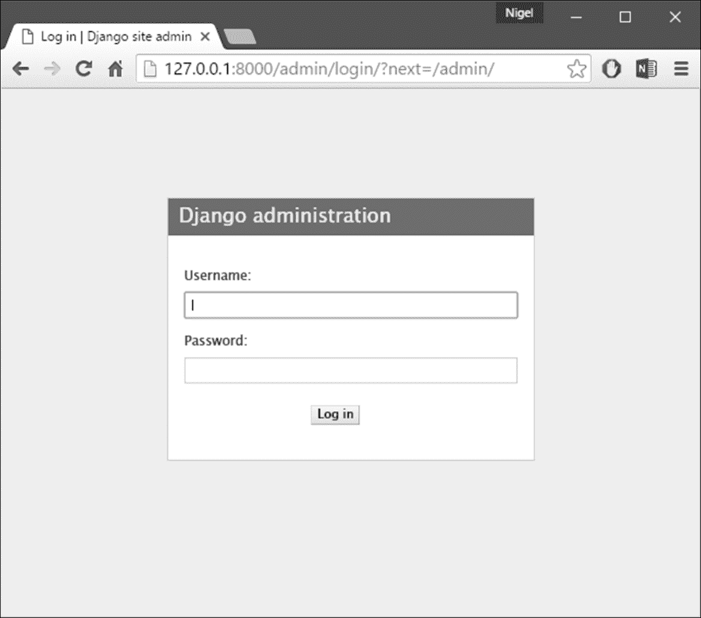
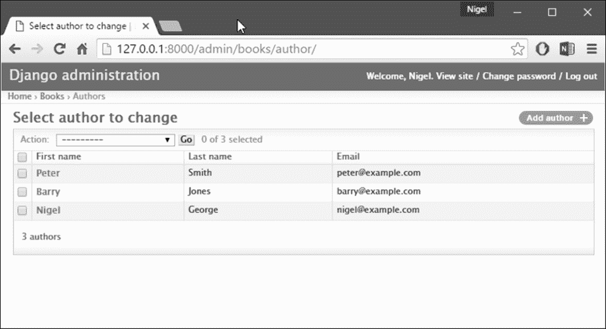
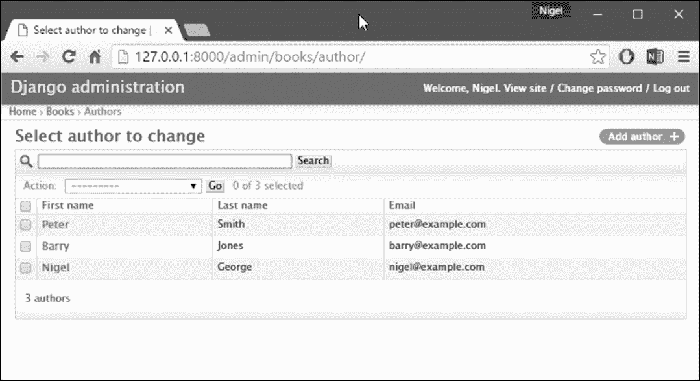
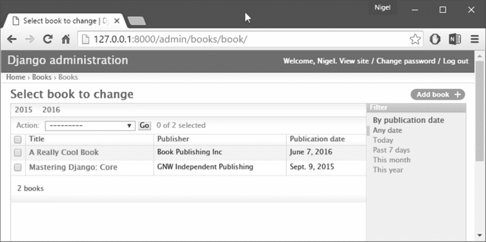
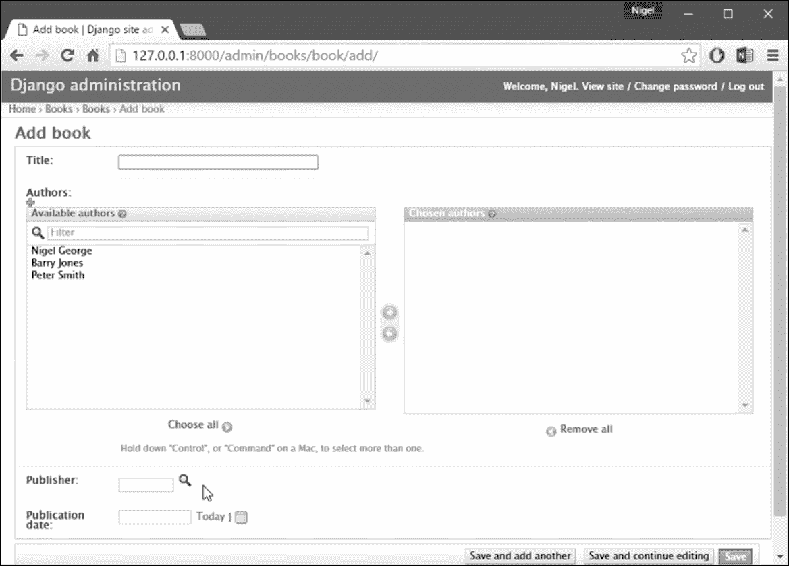

# 五、Django 管理网站

对于大多数现代网站来说，**管理界面**是基础设施的重要组成部分。这是一个基于 web 的界面，仅限于受信任的站点管理员，允许添加、编辑和删除站点内容。一些常见的例子：你用来发布到你的博客的界面，后端网站经理用来缓和用户产生的评论，你的客户用来更新你为他们建立的网站上的新闻稿的工具。

不过，管理界面存在一个问题：构建它们很无聊。当您开发面向公众的功能时，web 开发很有趣，但是构建管理界面总是一样的。您必须对用户进行身份验证、显示和处理表单、验证输入，等等。这很无聊，而且很重复。

那么，Django 是如何处理这些枯燥重复的任务的呢？这一切都是为了你。

使用 Django，构建管理界面是一个已解决的问题。在本章中，我们将探讨 Django 的自动管理界面：查看它如何为我们的模型提供方便的界面，以及我们可以使用它做的其他一些有用的事情。

# 使用管理站点

当您运行[第 1 章](01.html "Chapter 1. Introduction to Django and Getting Started")、*Django 简介和入门*中的`django-admin startproject mysite`时，Django 为您创建并配置了默认的管理站点。您所需要做的就是创建一个管理员用户（超级用户），然后您就可以登录到管理员站点。

### 注

如果您使用的是 Visual Studio，则无需在命令行中完成下一步，只需从 Visual Studio 中的**项目**菜单选项卡添加超级用户即可。

要创建管理员用户，请运行以下命令：

```py
python manage.py createsuperuser

```

输入所需用户名，然后按 Enter 键。

```py
Username: admin

```

然后系统会提示您输入所需的电子邮件地址：

```py
Email address: admin@example.com

```

最后一步是输入您的密码。您将被要求输入密码两次，第二次作为第一次的确认。

```py
Password: **********
Password (again): *********
Superuser created successfully.

```

## 启动开发服务器

在 Django 1.8 中，默认情况下会激活 Django 管理站点。让我们启动开发服务器并进行探索。回想一下前面的章节，您是这样启动开发服务器的：

```py
python manage.py runserver

```

现在，打开一个 web 浏览器，进入本地域的`/admin/`，例如`http://127.0.0.1:8000/admin/`。您应该看到管理员的登录屏幕（*图 5.1*。

由于默认情况下翻译处于打开状态，登录屏幕可能会以您自己的语言显示，具体取决于浏览器的设置以及 Django 是否有此语言的翻译。

## 进入管理站点

现在，尝试使用在上一步中创建的超级用户帐户登录。您应该看到**Django 管理员**索引页面（*图 5.2*。

您应该看到两种类型的可编辑内容：组和用户。它们由 Django 提供的身份验证框架`django.contrib.auth`提供。管理站点是为非技术用户而设计的，因此它应该是不言自明的。不过，我们将为您快速介绍基本功能。



图 5.1:**Django 管理员**登录界面


图 5.2:**Django 管理员**主页

Django 管理站点中的每种类型的数据都有一个更改列表和一个编辑表单。更改列表显示数据库中的所有可用对象，编辑表单允许添加、更改或删除数据库中的特定记录。点击**用户**行中的**变更**链接，加载用户变更列表页面（*图 5.3*。


图 5.3：用户变更列表页面

此页面显示数据库中的所有用户；您可以将其视为`SELECT * FROM auth_user;`SQL 查询的预绑定 web 版本。如果您按照我们正在进行的示例进行操作，您在这里只会看到一个用户，假设您只添加了一个，但是一旦您有了更多的用户，您可能会发现筛选、排序和搜索选项很有用。

过滤选项位于右侧，通过单击列标题可以进行排序，顶部的搜索框允许您按用户名进行搜索。单击您创建的用户的用户名，您将看到该用户的编辑表单（*图 5.4*。

此页面允许您更改用户的属性，如姓名和各种权限。请注意，要更改用户密码，您应该单击密码字段下的**更改密码表**，而不是编辑散列代码。

这里需要注意的另一件事是，不同类型的字段获得不同的小部件，例如，日期/时间字段具有日历控件，布尔字段具有复选框，字符字段具有简单的文本输入字段。


图 5.4：用户编辑表单

您可以通过单击记录编辑表单左下角的删除按钮来删除记录。这将带您进入确认页面，在某些情况下，该页面将显示任何将被删除的从属对象。（例如，如果删除某个出版商，则该出版商的任何书籍也将被删除！）

您可以通过在管理员主页的相应列中单击**添加**来添加记录。这将为您提供一个空版本的编辑页面，供您填写。

您还将注意到，管理界面还为您处理输入验证。尝试将必填字段留空或将无效日期放入日期字段中，您将在尝试保存时看到这些错误，如图 5.5 所示。

编辑现有对象时，会注意到窗口右上角有一个历史链接。通过管理界面所做的每一项更改都会被记录下来，您可以通过点击历史链接来检查此日志（参见*图 5.6*。


图 5.5：显示错误的编辑表单


图 5.6：对象历史页面

### 注

**管理站点如何工作**

在幕后，管理站点是如何工作的？这很简单。当 Django 在服务器启动时加载时，它运行`admin.autodiscover()`功能。在 Django 的早期版本中，您曾经从`urls.py`调用此函数，但现在 Django 自动运行它。此函数迭代您的`INSTALLED_APPS`设置，并在每个已安装的应用程序中查找名为`admin.py`的文件。如果给定应用程序中存在`admin.py`，它将执行该文件中的代码。

在我们`books`应用程序的`admin.py`中，对`admin.site.register()`的每次调用都只是向管理员注册给定的模型。管理员站点将仅显示已明确注册的模型的编辑/更改界面。应用程序`django.contrib.auth`包含自己的`admin.py`，这就是为什么用户和组会自动出现在管理中。其他`django.contrib`应用程序，如`django.contrib.redirects`也会将自己添加到管理员中，就像您可能从 web 下载的许多第三方 Django 应用程序一样。

除此之外，Django 管理站点只是一个 Django 应用程序，具有自己的模型、模板、视图和 URLpatterns。您可以通过将其挂接到 URLconf 中将其添加到应用程序中，就像挂接在自己的视图中一样。您可以通过在 Django 代码库副本的`django/contrib/admin`中翻找来检查其模板、视图和 URLpatterns，但不要直接在其中更改任何内容，因为有很多钩子可供您自定义管理站点的工作方式。

如果您确实决定浏览 Django admin 应用程序，请记住它在读取有关模型的元数据时会做一些相当复杂的事情，因此阅读和理解代码可能需要花费大量的时间。

# 将您的模型添加到管理站点

有一个关键部分我们还没有完成。让我们将自己的模型添加到管理站点，这样我们就可以使用这个漂亮的界面在自定义数据库表中添加、更改和删除对象。我们将继续[第 4 章](04.html "Chapter 4. Models")*模型*中的`books`示例，其中我们定义了三个模型：出版商、作者和书籍。在`books`目录（`mysite/books`中，`startapp`应该已经创建了一个名为`admin.py`的文件，如果没有，只需自己创建一个，然后键入以下代码行：

```py
from django.contrib import admin 
from .models import Publisher, Author, Book 

admin.site.register(Publisher) 
admin.site.register(Author) 
admin.site.register(Book) 

```

这段代码告诉 Django 管理站点为每个模型提供一个接口。完成此操作后，转到 web 浏览器中的管理员主页（`http://127.0.0.1:8000/admin/`，您将看到一个**图书**部分，其中包含作者、图书和出版商的链接。（为了使更改生效，您可能必须停止并启动开发服务器。）现在这三个模型都有了一个功能齐全的管理界面。那很容易！

花一些时间添加和更改记录，用一些数据填充数据库。如果您遵循[第 4 章](04.html "Chapter 4. Models")、*模型*、创建`Publisher`对象的示例（并且您没有删除它们），您将在发布者更改列表页面上看到这些记录。

这里值得一提的一个特性是管理站点对外键和多对多关系的处理，这两者都出现在`Book`模型中。作为提醒，以下是`Book`模型的外观：

```py
class Book(models.Model): 
    title = models.CharField(max_length=100) 
    authors = models.ManyToManyField(Author) 
    publisher = models.ForeignKey(Publisher) 
    publication_date = models.DateField() 

    def __str__(self): 
        return self.title 

```

在 Django 管理网站的**添加书籍**页面（`http://127.0.0.1:8000/admin/books/book/add/`），

发布者（a`ForeignKey`由选择框表示，作者字段（a`ManyToManyField`由多个选择框表示。这两个字段都位于一个绿色加号图标旁边，该图标允许您添加该类型的相关记录。

例如，如果单击**发布者**字段旁边的绿色加号，您将获得一个弹出窗口，可以添加发布者。在弹出窗口中成功创建出版商后，**添加书籍**表单将使用新创建的出版商进行更新。滑溜的

# 使字段可选

在你与管理员网站玩了一段时间后，你可能会注意到编辑表单要求填写每个字段的限制，而在许多情况下，你希望某些字段是可选的。比方说，我们希望我们的`Author`模型的`email`字段是可选的，也就是说，应该允许空白字符串。在现实世界中，您可能没有每个作者的电子邮件地址。

要指定`email`字段是可选的，请编辑`Author`模型（您可以从[第 4 章](04.html "Chapter 4. Models")中回忆起，*模型*位于`mysite/books/models.py`中）。只需将`blank=True`添加到`email`字段，如下所示：

```py
class Author(models.Model): 
    first_name = models.CharField(max_length=30) 
    last_name = models.CharField(max_length=40) 
    email = models.EmailField(blank=True)

```

这告诉 Django，作者的电子邮件地址确实允许空白值。默认情况下，所有字段都有`blank=False`，表示不允许空白。

这里发生了一些有趣的事情。到目前为止，除了`__str__()`方法之外，我们的模型基本上是作为数据库表的定义，SQL`CREATE TABLE`语句的 python 表达式。在添加`blank=True`的过程中，我们已经开始扩展我们的模型，不再只是简单地定义数据库表的外观。

现在，我们的模型类开始成为一个关于`Author`对象是什么以及它们可以做什么的更丰富的知识集合。数据库中的`email`字段不仅由`VARCHAR`列表示；它也是 Django 管理站点等上下文中的可选字段。

一旦您添加了该`blank=True`，重新加载**添加作者**编辑表单（`http://127.0.0.1:8000/admin/books/author/add/`，您将注意到该字段的标签**电子邮件**——不再以粗体显示。这表示它不是必填字段。您现在可以添加作者，而无需提供电子邮件地址；如果提交的字段为空，您将不会再收到红色**此字段为必填**消息。

## 使日期和数字字段可选

与`blank=True`相关的常见问题与日期和数字字段有关，但需要大量的背景解释。SQL 有自己指定空白值的方法——一种称为`NULL`的特殊值。`NULL`可能表示“未知”、“无效”或其他特定于应用程序的含义。在 SQL 中，`NULL`的值不同于空字符串，正如特殊 Python 对象`None`不同于空 Python 字符串（`""`。

这意味着特定字符字段（例如，`VARCHAR`列）可能同时包含`NULL`值和空字符串值。这可能会导致不必要的歧义和混乱：为什么这个记录有一个`NULL`，而另一个记录有一个空字符串？是否存在差异，或者只是输入的数据不一致？和：如何获取所有具有空值的记录我应该同时查找`NULL`记录和空字符串，还是只选择具有空字符串的记录？

为了避免这种歧义，Django 自动生成的`CREATE TABLE`语句（见[第 4 章](04.html "Chapter 4. Models")、*模型*）在每个列定义中添加了明确的`NOT NULL`。例如，这里是我们的`Author`模型的生成语句，来自[第 4 章](04.html "Chapter 4. Models")、*模型*：

```py
CREATE TABLE "books_author" ( 
    "id" serial NOT NULL PRIMARY KEY, 
    "first_name" varchar(30) NOT NULL, 
    "last_name" varchar(40) NOT NULL, 
    "email" varchar(75) NOT NULL 
); 

```

在大多数情况下，此默认行为最适合您的应用程序，并将使您免于数据不一致问题。它与 Django 的其余部分很好地配合，比如 Django 管理站点，当您将字符字段留空时，它会插入一个空字符串（而不是`NULL`值）。

但对于不接受空字符串作为有效值（如日期、时间和数字）的数据库列类型，有一个例外。如果试图在日期或整数列中插入空字符串，则可能会出现数据库错误，具体取决于所使用的数据库。（严格的 PostgreSQL 在这里会引发一个异常；MySQL 可能接受也可能不接受，这取决于您使用的版本、时间和月相。）

在这种情况下，`NULL`是指定空值的唯一方法。在 Django 模型中，您可以通过向字段添加`null=True`来指定允许使用`NULL`。这么说还有很长的路要走：如果您想在日期字段（例如`DateField`、`TimeField`、`DateTimeField`）或数字字段（例如`IntegerField`、`DecimalField`、`FloatField`）中允许空白值，则需要同时使用`null=True`和`blank=True`。

例如，让我们更改`Book`模型以允许空白`publication_date`。以下是修订后的代码：

```py
class Book(models.Model): 
    title = models.CharField(max_length=100) 
    authors = models.ManyToManyField(Author) 
    publisher = models.ForeignKey(Publisher) 
    publication_date = models.DateField(blank=True, null=True)

```

添加`null=True`比添加`blank=True`更复杂，因为`null=True`改变了数据库的语义，也就是说，它改变了`CREATE TABLE`语句，将`NOT NULL`从`publication_date`字段中删除。要完成此更改，我们需要更新数据库。出于多种原因，Django 不会尝试自动更改数据库模式，因此每当您对模型进行此类更改时，您都有责任执行`python manage.py migrate`命令。将此返回到管理站点，现在**添加书籍**编辑表单应该允许空的发布日期值。

# 自定义字段标签

在管理站点的编辑表单上，每个字段的标签都是从其模型字段名生成的。算法很简单：Django 只是将下划线替换为空格，并将第一个字符大写，因此，例如，`Book`模型的`publication_date`字段具有标签**发布日期**。

然而，字段名并不总是适合于好的管理字段标签，所以在某些情况下，您可能需要自定义标签。您可以通过在相应的模型字段中指定`verbose_name`来完成此操作。例如，我们可以使用连字符将`Author.email`字段的标签更改为**电子邮件**：

```py
class Author(models.Model): 
    first_name = models.CharField(max_length=30) 
    last_name = models.CharField(max_length=40) 
 email = models.EmailField(blank=True, verbose_name ='e-mail')

```

进行更改并重新加载服务器，您将在作者编辑表单上看到该字段的新标签。请注意，除非`verbose_name`的首字母总是大写（例如`"USA state"`），否则不应将其大写。Django 将在需要时自动将其大写，并在其他不需要大写的地方使用准确的`verbose_name`值。

# 自定义模型管理类

到目前为止，我们所做的更改-`blank=True`、`null=True`和`verbose_name`-实际上是模型级别的更改，而不是管理级别的更改。也就是说，这些更改基本上是模型的一部分，只是碰巧被管理站点使用；关于他们没有什么特别的。

除此之外，Django 管理站点还提供了丰富的选项，可以让您自定义管理站点如何为特定模型工作。此类选项存在于**ModelAdmin 类**中，这些类包含特定管理站点实例中特定模型的配置。

## 定制变更单

让我们通过指定`Author`模型的更改列表上显示的字段，深入了解管理员定制。默认情况下，更改列表显示每个对象的`__str__()`结果。在[第 4 章](04.html "Chapter 4. Models")、*模型*中，我们定义了`Author`对象同时显示名字和姓氏的`__str__()`方法：

```py
class Author(models.Model): 
    first_name = models.CharField(max_length=30) 
    last_name = models.CharField(max_length=40) 
    email = models.EmailField(blank=True, verbose_name ='e-mail') 

    def __str__(self): 
        return u'%s %s' % (self.first_name, self.last_name) 

```

因此，`Author`对象的变更列表会同时显示彼此的名字和姓氏，如*图 5.7*所示。


图 5.7：作者变更列表页面

我们可以通过向更改列表显示中添加一些其他字段来改进此默认行为。例如，在这个列表中查看每个作者的电子邮件地址会很方便，能够按名字和姓氏排序也会很好。为了实现这一点，我们将为`Author`模型定义一个`ModelAdmin`类。这个类是定制管理的关键，它允许您做的最基本的事情之一就是指定要在更改列表页面上显示的字段列表。编辑`admin.py`以进行以下更改：

```py
from django.contrib import admin 
from mysite.books.models import Publisher, Author, Book 

class AuthorAdmin(admin.ModelAdmin):
 list_display = ('first_name', 'last_name', 'email') 

admin.site.register(Publisher) 
admin.site.register(Author, AuthorAdmin) 
admin.site.register(Book) 

```

以下是我们所做的：

*   我们创建了`AuthorAdmin`类。这个类是`django.contrib.admin.ModelAdmin`的子类，它拥有特定管理模型的自定义配置。我们只指定了一个自定义项-`list_display`，该自定义项被设置为要显示在更改列表页面上的字段名元组。当然，这些字段名必须存在于模型中。
*   我们将`admin.site.register()`调用更改为在`Author`之后添加`AuthorAdmin`。您可以这样理解：使用`AuthorAdmin`选项注册`Author`型号。
*   `admin.site.register()`函数将`ModelAdmin`子类作为可选的第二个参数。如果不指定第二个参数（如`Publisher`和`Book`的情况），Django 将使用该模型的默认管理选项。

调整完成后，重新加载作者更改列表页面，您将看到它现在显示三列：名字、姓氏和电子邮件地址。此外，通过单击列标题可以对这些列中的每一列进行排序。（参见*图 5.8*）



图 5.8`list_display`新增后作者变更列表页面

接下来，让我们添加一个简单的搜索栏。将`search_fields`添加到`AuthorAdmin`中，如下所示：

```py
class AuthorAdmin(admin.ModelAdmin): 
    list_display = ('first_name', 'last_name', 'email') 
 search_fields = ('first_name', 'last_name')

```

在浏览器中重新加载页面，您应该会在顶部看到一个搜索栏。（参见*图 5.9*）我们刚刚告诉管理员变更列表页面包含一个搜索栏，用于搜索`first_name`和`last_name`字段。正如用户可能期望的那样，这是不区分大小写的，并且搜索两个字段，因此搜索字符串`bar`将同时找到名为 Barney 的作者和名为 Hobarson 的作者。



图 5.9`search_fields`新增后作者变更列表页面

接下来，让我们在`Book`车型的变更列表页面中添加一些日期过滤器：

```py
from django.contrib import admin 
from mysite.books.models import Publisher, Author, Book 

class AuthorAdmin(admin.ModelAdmin): 
    list_display = ('first_name', 'last_name', 'email') 
    search_fields = ('first_name', 'last_name') 

class BookAdmin(admin.ModelAdmin):
 list_display = ('title', 'publisher', 'publication_date')
 list_filter = ('publication_date',) 

admin.site.register(Publisher) 
admin.site.register(Author, AuthorAdmin) 
admin.site.register(Book, BookAdmin)

```

在这里，因为我们处理的是一组不同的选项，所以我们创建了一个单独的`ModelAdmin`类—`BookAdmin`。首先，我们定义了一个`list_display`，只是为了让变更列表看起来更好一点。然后，我们使用了`list_filter`，它被设置为一个字段元组，用于沿着变更列表页面的右侧创建过滤器。对于日期字段，Django 提供快捷方式将列表过滤到今天的**、过去 7 天的**、本月的**和今年的**——Django 的开发人员发现的快捷方式符合按日期过滤的常见情况。*图 5.10*显示了它的样子。********

 ******

图 5.10`list_filter`后的书籍变更列表页面

`list_filter`也适用于其他类型的字段，而不仅仅是`DateField`。（例如，用`BooleanField`和`ForeignKey`字段试试。）只要至少有两个值可供选择，过滤器就会显示。提供日期过滤器的另一种方法是使用`date_hierarchy`管理选项，如下所示：

```py
class BookAdmin(admin.ModelAdmin): 
    list_display = ('title', 'publisher','publication_date') 
    list_filter = ('publication_date',) 
 date_hierarchy = 'publication_date'

```

这样，变更列表页面将在列表顶部获得一个日期向下搜索导航栏，如*图 5.11*所示。它从可用年份列表开始，然后深入到月份和单独的天数。



图 5.11:date_ 层次结构之后的书籍更改列表页面

请注意，`date_hierarchy`采用字符串，而不是元组，因为只有一个日期字段可用于建立层次结构。最后，让我们更改默认顺序，以便“更改列表”页面上的书籍总是按出版日期降序排列。默认情况下，变更列表根据`class Meta`（我们在[第 4 章](04.html "Chapter 4. Models")、*模型*中介绍过）内的`ordering`模型对对象进行排序，但您没有指定此`ordering`值，则排序未定义。

```py
class BookAdmin(admin.ModelAdmin): 
    list_display = ('title', 'publisher','publication_date') 
    list_filter = ('publication_date',) 
    date_hierarchy = 'publication_date' 
 ordering = ('-publication_date',)

```

此管理`ordering`选项与模型`class Meta`中的`ordering`完全相同，只是它只使用列表中的第一个字段名。只需传递字段名的列表或元组，并在字段中添加减号即可使用降序排序。重新加载书籍更改列表以查看此操作。请注意，**发布日期**标题现在包含一个小箭头，指示记录的排序方式。（参见*图 5.12*）


图 5.12：订购后的书籍更改列表页面

我们在这里介绍了主要的变更列表选项。使用这些选项，您只需几行代码就可以创建一个功能强大、支持生产的数据编辑界面。

## 定制编辑表单

正如可以自定义更改列表一样，编辑表单也可以通过多种方式进行自定义。首先，让我们自定义字段的排序方式。默认情况下，编辑表单中字段的顺序与它们在模型中定义的顺序相对应。我们可以使用`ModelAdmin`子类中的`fields`选项来更改该选项：

```py
class BookAdmin(admin.ModelAdmin): 
    list_display = ('title', 'publisher', 'publication_date') 
    list_filter = ('publication_date',) 
    date_hierarchy = 'publication_date' 
    ordering = ('-publication_date',) 
 fields = ('title', 'authors', 'publisher', publication_date')

```

更改后，图书编辑表单将使用给定的字段排序。书名后面有作者稍微自然一些。当然，字段顺序应该取决于您的数据输入工作流。每种形式都是不同的。

`fields`选项允许您做的另一件有用的事情是将某些字段完全排除在编辑之外。只需省略要排除的字段。如果您的管理员用户只被信任编辑您的数据的某一部分，或者您的某些字段被某个外部自动过程更改，则可以使用此选项。

例如，在我们的图书数据库中，我们可以隐藏`publication_date`字段，使其不可编辑：

```py
class BookAdmin(admin.ModelAdmin): 
    list_display = ('title', 'publisher','publication_date') 
    list_filter = ('publication_date',) 
    date_hierarchy = 'publication_date' 
    ordering = ('-publication_date',) 
 fields = ('title', 'authors', 'publisher')

```

因此，图书编辑表单不提供指定出版日期的方法。比如说，如果你是一名编辑，希望他的作者不要推迟出版日期，这可能会很有用。（当然，这纯粹是一个假设的例子。）当用户使用这个不完整的表单添加新书时，Django 只需将`publication_date`设置为`None`——因此确保该字段有`null=True`。

另一种常用的编辑表单自定义与多对多字段有关。正如我们在图书编辑表单上所看到的，管理站点将每个`ManyToManyField`表示为多个选择框，这是使用最合理的 HTML 输入小部件，但多个选择框可能很难使用。如果要选择多个项目，必须按住控制键或 Mac 上的命令。

管理员站点很有帮助地插入了一些文本来解释这一点，但是当您的字段包含数百个选项时，它仍然会变得很笨拙。管理站点的解决方案是`filter_horizontal`。让我们把它添加到`BookAdmin`中，看看它有什么作用。

```py
class BookAdmin(admin.ModelAdmin): 
    list_display = ('title', 'publisher','publication_date') 
    list_filter = ('publication_date',) 
    date_hierarchy = 'publication_date' 
    ordering = ('-publication_date',) 
 filter_horizontal = ('authors',)

```

（如果您继续关注，请注意，我们还删除了显示编辑表单中所有字段的`fields`选项。）重新加载图书编辑表单，您将看到**作者**部分现在使用了一个奇特的 JavaScript 过滤器界面，允许您动态搜索选项并从中移动特定作者**可用作者**进入**选定作者**框，反之亦然。


图 5.13：添加过滤器后的图书编辑表单

我强烈建议使用`filter_horizontal`来处理任何超过十项的`ManyToManyField`。它比简单的多选小部件更容易使用。另外，请注意，您可以对多个字段使用`filter_horizontal`，只需指定元组中的每个名称即可。

`ModelAdmin`类还支持`filter_vertical`选项。这与`filter_horizontal`完全相同，但生成的 JavaScript 接口将两个框垂直堆叠，而不是水平堆叠。这是个人品味的问题。

`filter_horizontal`和`filter_vertical`只在`ManyToManyField`字段上工作，不在`ForeignKey`字段上工作。默认情况下，管理站点使用简单的`<select>`框来显示`ForeignKey`字段，但是，对于`ManyToManyField`，有时您不希望产生必须选择所有相关对象才能在下拉列表中显示的开销。

例如，如果我们的图书数据库增长到包含数千家出版商，**添加图书**表单可能需要一段时间才能加载，因为它必须加载每个出版商才能在`<select>`框中显示。

解决此问题的方法是使用名为`raw_id_fields`的选项：

```py
class BookAdmin(admin.ModelAdmin): 
    list_display = ('title', 'publisher','publication_date') 
    list_filter = ('publication_date',) 
    date_hierarchy = 'publication_date' 
    ordering = ('-publication_date',) 
    filter_horizontal = ('authors',) 
 raw_id_fields = ('publisher',)

```

将其设置为一个由`ForeignKey`字段名组成的元组，这些字段将通过一个简单的文本输入框（`<input type="text">`而不是`<select>`显示在管理员中。参见*图 5.14*。



图 5.14：新增`raw_id_fields`后的图书编辑表

您在这个输入框中输入了什么？发布服务器的数据库 ID。考虑到人类通常不会记住数据库 ID，还有一个放大镜图标，您可以单击它弹出一个窗口，从中选择要添加的发布者。

# 用户、组和权限

因为您是以超级用户身份登录的，所以您有权创建、编辑和删除任何对象。当然，不同的环境需要不同的权限系统，不是每个人都可以或应该成为超级用户。Django 的管理站点使用一个权限系统，您可以使用该系统让特定用户只访问他们需要的界面部分。这些用户帐户应该是足够通用的，可以在管理界面之外使用，但我们现在只把它们当作管理用户帐户。

在[第 11 章](11.html "Chapter 11. User Authentication in Django")、*Django*中的用户身份验证中，我们将介绍如何使用 Django 的身份验证系统管理站点范围内的用户（即，不仅仅是管理站点）。与任何其他对象一样，您可以通过管理界面编辑用户和权限。我们在本章前面的部分中看到了这一点，当时我们正在处理管理员的用户和组部分。

用户对象具有您可能期望的标准用户名、密码、电子邮件和实名字段，以及一组定义允许用户在管理界面中执行的操作的字段。首先，有一组三个布尔标志：

*   **active**标志控制用户是否处于活动状态。如果此标志处于关闭状态且用户尝试登录，则即使使用有效密码，也不允许用户登录。
*   **staff**标志控制是否允许该用户登录到管理界面（即，该用户是否被视为组织中的工作人员）。由于同一用户系统可用于控制对公共（即非管理员）站点的访问（参见[第 11 章](11.html "Chapter 11. User Authentication in Django")、*Django 中的用户身份验证*），此标志区分公共用户和管理员。
*   **超级用户**标志允许用户在管理界面中添加、创建和删除任何项目。如果用户设置了此标志，则将忽略该用户的所有常规权限（或缺少该权限）。

**普通**管理员用户，即活动的非超级用户工作人员，通过分配的权限被授予管理员访问权限。通过管理界面可编辑的每个对象（例如书籍、作者、出版商）都有三个权限：创建权限、编辑权限和删除权限。将权限分配给用户将授予用户执行这些权限所描述的操作的权限。当您创建一个用户时，该用户没有任何权限，您可以授予该用户特定的权限。

例如，您可以向用户授予添加和更改发布者的权限，但不授予删除发布者的权限。请注意，这些权限是按模型定义的，而不是按对象定义的，因此它们允许您说*John 可以对任何书籍进行更改，但不允许您说**John 可以对按*发布的任何书籍进行更改。后一种功能，即每对象权限，有点复杂，不在本书的范围之内，但在 Django 文档中有介绍。

### 注

**警告！**

编辑用户和权限的访问也由此权限系统控制。如果您授予某人编辑用户的权限，他们将能够编辑自己的权限，这可能不是您想要的！授予用户编辑用户的权限实质上是将用户转变为超级用户。

您还可以将用户分配给组。组只是应用于该组所有成员的一组权限。组对于向用户子集授予相同的权限非常有用。

# 何时、为何使用管理界面，何时不使用

在读完本章之后，您应该对如何使用 Django 的管理站点有了很好的了解。但我想重点介绍一下您何时、为何要使用它以及何时不使用它。

当非技术用户需要能够输入数据时，Django 的管理站点尤其引人注目；毕竟，这就是该功能背后的目的。在 Django 最初开发的报纸上，开发了一个典型的在线功能，比如，一个关于市政供水水质的特别报告，内容如下：

*   负责该项目的报告员会见了一位开发商，并描述了可用的数据。
*   开发人员设计 Django 模型以适应这些数据，然后向报告者打开管理站点。
*   报告者检查管理站点，指出任何缺失或无关的字段，现在比以后更好。开发人员迭代地更改模型。
*   当模型达成一致时，报告者开始使用管理站点输入数据。同时，程序员可以专注于开发可公开访问的视图/模板（有趣的部分！）。

换句话说，Django 管理界面存在的理由是促进内容制作者和程序员同时工作。但是，除了这些明显的数据输入任务外，管理站点在其他一些情况下也很有用：

*   **检查数据模型**：一旦定义了一些模型，在管理界面中调用它们并输入一些虚拟数据可能非常有用。在某些情况下，这可能会揭示数据建模错误或模型的其他问题。
*   **管理获取的数据**：对于依赖外部数据源（例如用户或网络爬虫）的应用程序，管理站点为您提供了一种检查或编辑这些数据的简便方法。您可以将其视为数据库命令行实用程序的一个功能较弱但更方便的版本。
*   **快速而肮脏的数据管理应用程序**：您可以使用管理网站为自己构建一个非常轻量级的数据管理应用程序，比如，跟踪费用。如果你只是为了你自己的需要而不是为了公众消费而建立一些东西，那么管理网站会让你走很长的路。从这个意义上讲，您可以将其视为电子表格的增强版、关系版。

然而，管理站点并不是一个包罗万象的站点。它不打算成为数据的公共接口，也不打算允许对数据进行复杂的排序和搜索。正如我们在本章前面所说，这是为受信任的站点管理员准备的。记住这个最佳点是有效使用管理站点的关键。

# 下一步是什么？

到目前为止，我们已经创建了一些模型，并为编辑数据配置了一流的界面。在下一章中，我们将继续讨论 web 开发中真正的*肉和土豆*：表单创建和处理。******