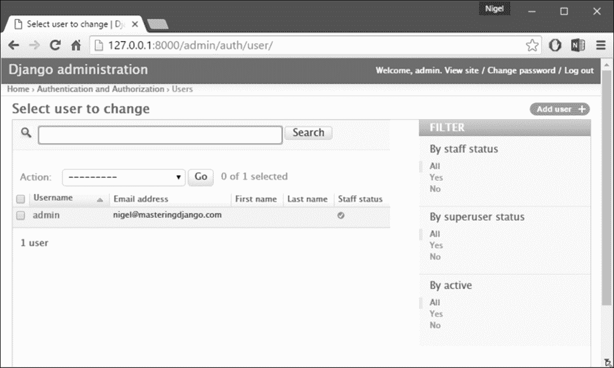
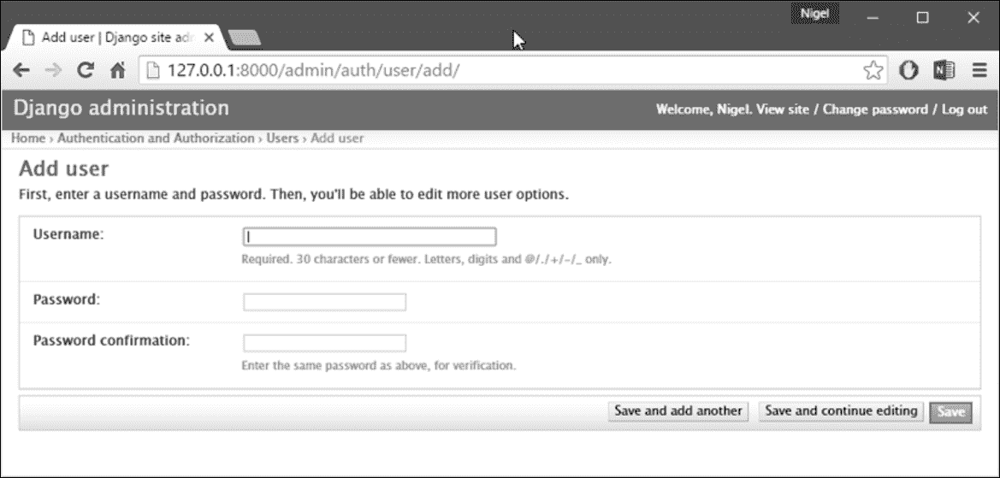
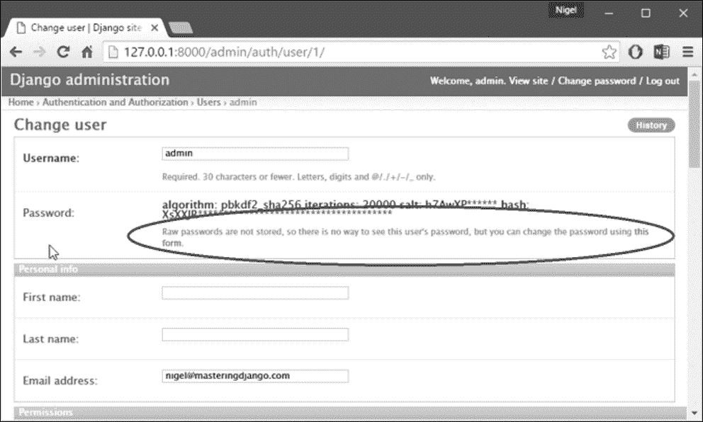
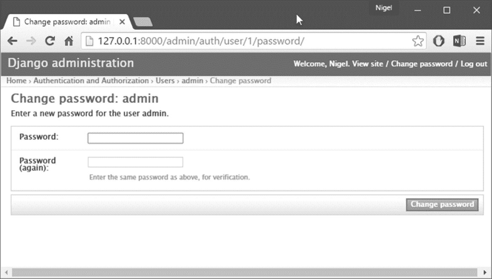

# 十一、Django 中的用户认证

现代交互式网站中有很大一部分允许某种形式的用户交互，从允许在博客上发表简单评论，到对新闻网站上的文章进行全面编辑控制。如果一个网站提供任何形式的电子商务，那么对付费客户的认证和授权是必不可少的。

仅仅管理用户丢失的用户名、忘记的密码以及保持信息的最新可能是一件非常痛苦的事情。作为程序员，编写身份验证系统可能更糟糕。

幸运的是，Django 提供了一个默认实现，用于即时管理用户帐户、组、权限和基于 cookie 的用户会话。

与 Django 中的大多数内容一样，默认实现是完全可扩展和可定制的，以满足项目的需要。让我们直接跳进去。

# 概述

Django 身份验证系统处理身份验证和授权。简单地说，身份验证验证验证用户是他们声称的用户，而授权则确定允许经过身份验证的用户执行的操作。这里，术语身份验证用于指代这两项任务。

认证系统包括：

*   使用者
*   权限：二进制（是/否）标志，指定用户是否可以执行特定任务
*   组：将标签和权限应用于多个用户的通用方法
*   一种可配置的密码哈希系统
*   用于管理用户身份验证和授权的表单。
*   查看用于登录用户或限制内容的工具
*   可插拔的后端系统

Django 中的身份验证系统旨在非常通用，不提供 web 身份验证系统中常见的一些功能。其中一些常见问题的解决方案已在第三方软件包中实施：

*   密码强度检查
*   限制登录尝试
*   针对第三方的身份验证（例如 OAuth）

# 使用 Django 认证系统

Django 的身份验证系统在其默认配置中已发展为满足最常见的项目需求，处理范围相当广泛的任务，并谨慎地实现了密码和权限。对于身份验证需要不同于默认身份验证的项目，Django 还支持身份验证的扩展和定制。

# 用户对象

`User`对象是认证系统的核心。它们通常代表与您的站点交互的人，用于实现诸如限制访问、注册用户配置文件、将内容与创建者关联等功能。Django 的身份验证框架中只存在一类用户，即，`superusers`或 admin`staff`用户只是设置了特殊属性的用户对象，而不是不同类别的用户对象。默认用户的主要属性是：

*   `username`
*   `password`
*   `email`
*   `first_name`
*   `last_name`

## 创建超级用户

使用`createsuperuser`命令创建超级用户：

```py
python manage.py createsuperuser -username=joe -email=joe@example.com 

```

系统将提示您输入密码。输入一个后，将立即创建用户。如果您关闭`-username`或`-email`选项，它将提示您输入这些值。

## 创建用户

创建和管理用户最简单、最不容易出错的方法是通过 Django 管理员。Django 还提供内置视图和表单，允许用户登录和注销并更改自己的密码。在本章稍后的部分，我们将通过 admin 和 generic user forms 查看用户管理，但首先，让我们看看如何直接处理用户身份验证。

创建用户最直接的方式是使用附带的`create_user()`助手功能：

```py
>>> from Django.contrib.auth.models import User 
>>> user = User.objects.create_user('john', 'lennon@thebeatles.com', 'johnpassword') 

# At this point, user is a User object that has already been saved 
# to the database. You can continue to change its attributes 
# if you want to change other fields. 
>>> user.last_name = 'Lennon' 
>>> user.save() 

```

## 更改密码

Django 不在用户模型上存储原始（明文）密码，而只存储哈希。因此，不要试图直接操作用户的密码属性。这就是为什么在创建用户时使用助手函数的原因。要更改用户密码，您有两个选项：

*   `manage.py changepassword username`提供了一种从命令行更改用户密码的方法。它会提示您更改给定用户的密码，您必须输入两次密码。如果两者都匹配，将立即更改新密码。如果未提供用户，该命令将尝试更改用户名与当前系统用户匹配的用户的密码。
*   您还可以使用`set_password()`以编程方式更改密码：

```py
        >>> from Django.contrib.auth.models import User 
        >>> u = User.objects.get(username='john') 
        >>> u.set_password('new password') 
        >>> u.save() 

```

如果启用了`SessionAuthenticationMiddleware`，更改用户密码将注销其所有会话。

# 权限和授权

Django 附带了一个简单的权限系统。它提供了一种将权限分配给特定用户和用户组的方法。Django 管理站点使用它，但是欢迎您在自己的代码中使用它。Django 管理站点使用的权限如下：

*   查看*添加*表单和添加对象的权限仅限于对该类型对象具有*添加*权限的用户。
*   查看更改列表、查看*更改*表单和更改对象的权限仅限于对该类型对象具有*更改*权限的用户。
*   删除对象的权限仅限于对该类型对象具有*删除*权限的用户。

不仅可以按对象类型设置权限，还可以按特定对象实例设置权限。通过使用`ModelAdmin`类提供的`has_add_permission()`、`has_change_permission()`和`has_delete_permission()`方法，可以为同一类型的不同对象实例定制权限。`User`对象有两个多对多字段：`groups`和`user_permissions`。`User`对象可以以与任何其他 Django 模型相同的方式访问其相关对象。

## 默认权限

当`Django.contrib.auth`列在您的`INSTALLED_APPS`设置中时，它将确保为一个已安装的应用程序中定义的每个 Django 模型创建三个默认权限“添加”、“更改”和“删除”。每次运行`manage.py migrate`时，将为所有新型号创建这些权限。

## 组

`Django.contrib.auth.models.Group`模型是一种对用户进行分类的通用方法，因此您可以对这些用户应用权限或其他标签。用户可以属于任意数量的组。组中的用户自动拥有授予该组的权限。例如，如果组`Site editors`具有权限`can_edit_home_page`，则该组中的任何用户都将具有该权限。

除了权限之外，组是对用户进行分类的一种方便方式，为用户提供一些标签或扩展功能。例如，您可以创建一个组`Special users`，您可以编写代码，允许他们访问站点中仅限成员的部分，或者向他们发送仅限成员的电子邮件。

## 以编程方式创建权限

虽然自定义权限可以在模型的`Meta`类中定义，但您也可以直接创建权限。例如，您可以在`books`中为`BookReview`模型创建`can_publish`权限：

```py
from books.models import BookReview 
from Django.contrib.auth.models import Group, Permission 
from Django.contrib.contenttypes.models import ContentType 

content_type = ContentType.objects.get_for_model(BookReview) 
permission = Permission.objects.create(codename='can_publish', 
                                       name='Can Publish Reviews', 
                                       content_type=content_type) 

```

然后可以通过`user_permissions`属性将权限分配给`User`或通过`permissions`属性将权限分配给`Group`。

## 权限缓存

`ModelBackend`在第一次需要获取`User`对象的权限以进行权限检查后，会对其进行缓存。这对于请求-响应周期来说通常是好的，因为添加权限后通常不会立即检查权限（例如，在管理中）。

如果您正在添加权限并随后立即检查它们，例如在测试或视图中，最简单的解决方案是从数据库中重新获取`User`。例如：

```py
from Django.contrib.auth.models import Permission, User 
from Django.shortcuts import get_object_or_404 

def user_gains_perms(request, user_id): 
    user = get_object_or_404(User, pk=user_id) 
    # any permission check will cache the current set of permissions 
    user.has_perm('books.change_bar') 

    permission = Permission.objects.get(codename='change_bar') 
    user.user_permissions.add(permission) 

    # Checking the cached permission set 
    user.has_perm('books.change_bar')  # False 

    # Request new instance of User 
    user = get_object_or_404(User, pk=user_id) 

    # Permission cache is repopulated from the database 
    user.has_perm('books.change_bar')  # True 

    # ... 

```

# web 请求中的身份验证

Django 使用会话和中间件将身份验证系统连接到`request` 对象中。它们为每个代表当前用户的请求提供一个`request.user`属性。如果当前用户未登录，则该属性设置为`AnonymousUser`实例，否则为`User`实例。你可以用`is_authenticated()`来区分它们，就像这样：

```py
if request.user.is_authenticated(): 
    # Do something for authenticated users. 
else: 
    # Do something for anonymous users. 

```

## 用户如何登录

要从视图中登录用户，请使用`login()`。它需要一个`HttpRequest`对象和一个`User`对象。`login()`使用 Django 的会话框架在会话中保存用户 ID。请注意，匿名会话期间的任何数据集都将在用户登录后保留在会话中。此示例显示了如何同时使用`authenticate()`和`login()`：

```py
from Django.contrib.auth import authenticate, login 

def my_view(request): 
    username = request.POST['username'] 
    password = request.POST['password'] 
    user = authenticate(username=username, password=password) 
    if user is not None: 
        if user.is_active: 
            login(request, user) 
            # Redirect to a success page. 
        else: 
            # Return a 'disabled account' error message 
    else: 
        # Return an 'invalid login' error message. 

```

### 注

**先呼叫**`authenticate()`

 **当您手动登录用户时，必须先调用`authenticate()`再调用`login()`。`authenticate()`在`User`上设置一个属性，说明哪个身份验证后端成功验证了该用户，该信息将在稍后的登录过程中使用。如果尝试直接登录从数据库检索的用户对象，则会引发错误。

## 如何注销用户

要注销通过`login()`登录的用户，请在视图中使用`logout()`。它接受一个`HttpRequest`对象，没有返回值。例子：

```py
from Django.contrib.auth import logout 

def logout_view(request): 
    logout(request) 
    # Redirect to a success page. 

```

请注意，如果用户未登录，`logout()`不会抛出任何错误。当您调用`logout()`时，当前请求的会话数据被完全清除。将删除所有现有数据。这是为了防止其他人使用相同的 web 浏览器登录并访问前一用户的会话数据。

如果您想在用户注销后立即将任何内容放入会话，请在调用`logout()`后进行。

## 限制登录用户访问

### 原始方式

限制对页面访问的简单、原始的方法是检查`request.user.is_authenticated()`并重定向到登录页面：

```py
from Django.shortcuts import redirect 

def my_view(request): 
    if not request.user.is_authenticated(): 
        return redirect('/login/?next=%s' % request.path) 
    # ... 

```

... 或显示错误消息：

```py
from Django.shortcuts import render 

def my_view(request): 
    if not request.user.is_authenticated(): 
        return render(request, 'books/login_error.html') 
    # ... 

```

### 登录\u 需要 decorator

作为快捷方式，您可以使用方便的`login_required()`装饰器：

```py
from Django.contrib.auth.decorators import login_required 

@login_required 
def my_view(request): 
    ... 

```

`login_required()`是否执行以下操作：

*   如果用户未登录，则重定向到`LOGIN_URL`，在查询字符串中传递当前绝对路径。示例：`/accounts/login/?next=/reviews/3/`。
*   如果用户已登录，则正常执行视图。查看代码可以自由假设用户已登录。

默认情况下，验证成功后用户应重定向到的路径存储在名为`next`的查询字符串参数中。如果您希望为该参数使用不同的名称，`login_required()`采用可选的`redirect_field_name`参数：

```py
from Django.contrib.auth.decorators import login_required 

@login_required(redirect_field_name='my_redirect_field') 
def my_view(request): 
    ... 

```

请注意，如果您向`redirect_field_name`提供一个值，您很可能还需要自定义登录模板，因为存储重定向路径的模板上下文变量将使用`redirect_field_name`的值作为其键，而不是`next`（默认值）。`login_required()`还采用可选的`login_url`参数。例子：

```py
from Django.contrib.auth.decorators import login_required 

@login_required(login_url='/accounts/login/') 
def my_view(request): 
    ... 

```

请注意，如果没有指定`login_url`参数，则需要确保`LOGIN_URL`和登录视图正确关联。例如，使用默认值，将以下行添加到 URLconf：

```py
from Django.contrib.auth import views as auth_views 

url(r'^accounts/login/$', auth_views.login), 

```

`LOGIN_URL`还接受视图函数名和命名 URL 模式。这允许您在 URLconf 中自由地重新映射登录视图，而无需更新设置。

**注意：**装饰师没有检查用户的`is_active flag`。

### 限制通过测试的登录用户访问

要基于某些权限或其他测试限制访问，您需要执行与上一节中描述的基本相同的操作。简单的方法是直接在视图中的`request.user`上运行测试。例如，此视图检查以确保用户在所需域中有电子邮件：

```py
def my_view(request): 
    if not request.user.email.endswith('@example.com'): 
        return HttpResponse("You can't leave a review for this book.") 
    # ... 

```

作为快捷方式，您可以使用方便的`user_passes_test`装饰器：

```py
from Django.contrib.auth.decorators import user_passes_test 

def email_check(user): 
    return user.email.endswith('@example.com') 

@user_passes_test(email_check) 
def my_view(request): 
    ... 

```

`user_passes_test()`接受一个必需的参数：一个可调用的参数，它接受一个`User`对象，如果允许用户查看页面，则返回`True`。请注意，`user_passes_test()`不会自动检查`User`是否匿名。`user_passes_test()`接受两个可选参数：

*   `login_url`。用于指定未通过测试的用户将重定向到的 URL。它可能是一个登录页面，如果您没有指定，则默认为`LOGIN_URL`。
*   `redirect_field_name`。与`login_required()`相同。将其设置为`None`会将其从 URL 中删除，如果您将未通过测试的用户重定向到没有*下一页*的非登录页面，则可能需要执行此操作。

例如：

```py
@user_passes_test(email_check, login_url='/login/') 
def my_view(request): 
    ... 

```

### 所需的权限（）装饰者

检查用户是否具有特定权限是一项相对常见的任务。因此，Django 为这种情况提供了一个捷径`permission_required()`装饰器：

```py
from Django.contrib.auth.decorators import permission_required 

@permission_required('reviews.can_vote') 
def my_view(request): 
    ... 

```

与`has_perm()`方法一样，权限名称的形式为`<app label>.<permission codename>`（即`reviews`应用程序中模型的权限为`reviews.can_vote`。装饰程序还可以获取权限列表。请注意，`permission_required()`还采用可选的`login_url`参数。例子：

```py
from Django.contrib.auth.decorators import permission_required 

@permission_required('reviews.can_vote', login_url='/loginpage/') 
def my_view(request): 
    ... 

```

与`login_required()`装饰器一样，`login_url`默认为`LOGIN_URL.` ，如果`raise_exception`参数被给定，装饰器将引发`PermissionDenied`，提示 403（HTTP 禁止）视图，而不是重定向到登录页面。

### 密码更改时会话失效

如果您的`AUTH_USER_MODEL`继承自`AbstractBaseUser`或实现了自己的`get_session_auth_hash()`方法，则经过身份验证的会话将包含此函数返回的哈希。在`AbstractBaseUser`情况下，这是密码字段的**散列消息认证码**（**HMAC**。

如果启用了`SessionAuthenticationMiddleware`，Django 将验证随每个请求一起发送的哈希值是否与服务器端计算的哈希值匹配。这允许用户通过更改密码退出所有会话。

Django 中包含的默认密码更改视图`Django.contrib.auth.views.password_change()`和`Django.contrib.auth`管理员中的`user_change_password`视图使用新密码散列更新会话，以便更改自己密码的用户不会注销。如果您有自定义密码更改视图并希望有类似的行为，请使用此功能：

```py
Django.contrib.auth.decorators.update_session_auth_hash (request, user) 

```

此函数获取当前请求和更新的用户对象，新会话哈希将从中派生，并相应地更新会话哈希。用法示例：

```py
from Django.contrib.auth import update_session_auth_hash 

def password_change(request): 
    if request.method == 'POST': 
        form = PasswordChangeForm(user=request.user, data=request.POST) 
        if form.is_valid(): 
            form.save() 
            update_session_auth_hash(request, form.user) 
    else: 
        ... 

```

由于`get_session_auth_hash()`基于`SECRET_KEY`，更新您的站点以使用新的机密将使所有现有会话无效。

# 认证视图

Django 提供了几个视图，可用于处理登录、注销和密码管理。它们使用内置的 auth 表单，但您也可以传递自己的表单。Django 没有为身份验证视图提供默认模板，但是，为每个视图记录了以下模板上下文。

在您的项目中有不同的方法来实现这些视图，但是，最简单和最常见的方法是将`Django.contrib.auth.urls`中提供的 URLconf 包含在您自己的 URLconf 中，例如：

```py
urlpatterns = [url('^', include('Django.contrib.auth.urls'))] 

```

这将使每个视图在默认 URL 上可用（在下一节中详细介绍）。

内置的视图都会返回一个`TemplateResponse`实例，这允许您在渲染之前轻松定制响应数据。大多数内置身份验证视图都提供 URL 名称，以便于参考。

## 登录

让用户登录。

**默认 URL:**`/login/`

**可选参数：**

*   `template_name`：用于用户登录的视图显示的模板名称。默认为`registration/login.html`。
*   `redirect_field_name`：包含登录后要重定向到的 URL 的`GET`字段的名称。默认为`next`。
*   `authentication_form`：用于身份验证的可调用（通常只是一个表单类）。默认为`AuthenticationForm`。
*   `current_app`：指示哪个应用程序包含当前视图的提示。有关更多信息，请参阅命名空间 URL 解析策略。
*   `extra_context`：将添加到传递到模板的默认上下文数据的上下文数据字典。

以下是`login`的作用：

*   如果通过`GET`调用，它将显示一个登录表单，该表单将发布到相同的 URL。更多关于这一点在一点。
*   如果使用用户提交的凭据通过`POST`调用，则会尝试让用户登录。如果登录成功，视图将重定向到`next`中指定的 URL。如果没有提供`next`，则会重定向到`LOGIN_REDIRECT_URL`（默认为`/accounts/profile/`。如果登录不成功，它将重新显示登录表单。

您的责任是为登录模板提供 HTML，默认情况下称为`registration/login.html`。

**模板上下文**

*   `form`：表示`AuthenticationForm`的`Form`对象。
*   `next`：成功登录后要重定向到的 URL。这也可能包含查询字符串。
*   `site`：电流`Site`，根据`SITE_ID`设置。如果您没有安装站点框架，将设置为`RequestSite`实例，该实例从当前`HttpRequest`派生站点名称和域。
*   `site_name`：`site.name`的别名。如果您没有安装站点框架，则该值将设置为`request.META['SERVER_NAME']`。

如果不想调用模板`registration/login.html`，可以通过额外的参数将`template_name`参数传递给 URLconf 中的视图。

## 注销

将用户注销。

**默认 URL:**`/logout/`

**可选参数：**

*   `next_page`：注销后要重定向到的 URL。
*   `template_name`：用户注销后显示的模板全名。如果未提供参数，则默认为`registration/logged_out.html`。
*   `redirect_field_name`：包含要在注销后重定向到的 URL 的`GET`字段的名称。默认为`next`。如果传递了给定的`GET`参数，则重写`next_page`URL。
*   `current_app`：指示哪个应用程序包含当前视图的提示。有关更多信息，请参阅命名空间 URL 解析策略。
*   `extra_context`：将添加到传递到模板的默认上下文数据的上下文数据字典。

**模板上下文：**

*   `title`：字符串*注销*，本地化。
*   `site`：电流`Site`，根据`SITE_ID`设置。如果您没有安装站点框架，将设置为`RequestSite`实例，该实例从当前`HttpRequest`派生站点名称和域。
*   `site_name`：`site.name`的别名。如果您没有安装站点框架，则该值将设置为`request.META['SERVER_NAME']`。
*   `current_app`：指示哪个应用程序包含当前视图的提示。有关更多信息，请参阅命名空间 URL 解析策略。
*   `extra_context`：将添加到传递到模板的默认上下文数据的上下文数据字典。

## 退出，然后登录

注销用户，然后重定向到登录页面。

**默认 URL:**未提供。

**可选参数：**

*   `login_url`：要重定向到的登录页面的 URL。如果未提供，则默认为`LOGIN_URL`。
*   `current_app`：指示哪个应用程序包含当前视图的提示。有关更多信息，请参阅命名空间 URL 解析策略。
*   `extra_context`：将添加到传递到模板的默认上下文数据的上下文数据字典。

## 密码变更

允许用户更改其密码。

**默认 URL:**`/password_change/`

**可选参数：**

*   `template_name`：用于显示密码更改表单的模板的全名。如果未提供，则默认为`registration/password_change_form.html`。
*   `post_change_redirect`：成功更改密码后要重定向到的 URL。
*   `password_change_form`：自定义*更改密码*表单，必须接受`user`关键字参数。表单负责实际更改用户的密码。默认为`PasswordChangeForm`。
*   `current_app`：指示哪个应用程序包含当前视图的提示。有关更多信息，请参阅命名空间 URL 解析策略。
*   `extra_context`：将添加到传递到模板的默认上下文数据的上下文数据字典。

**模板上下文：**

*   `form`：密码变更单（见上表`password_change_form`）。

## 密码更改完成

用户更改密码后显示的页面。

**默认 URL:**`/password_change_done/`

**可选参数：**

*   `template_name`：要使用的模板的全称。如果未提供，则默认为`registration/password_change_done.html`。
*   `current_app`：指示哪个应用程序包含当前视图的提示。有关更多信息，请参阅命名空间 URL 解析策略。
*   `extra_context`：将添加到传递到模板的默认上下文数据的上下文数据字典。

## 密码重置

通过生成可用于重置密码的一次性使用链接，并将该链接发送到用户的注册电子邮件地址，允许用户重置其密码。

如果系统中不存在提供的电子邮件地址，此视图将不会发送电子邮件，但用户也不会收到任何错误消息。这可以防止信息泄漏给潜在的攻击者。如果您想在这种情况下提供错误消息，可以将`PasswordResetForm`子类化并使用`password_reset_form`参数。

当使用外部身份验证源（如 LDAP）时，被标记为不可用密码的用户不允许请求密码重置以防止误用。请注意，他们不会收到任何错误消息，因为这会暴露其帐户的存在，但也不会发送邮件。

**默认 URL:**`/password_reset/`

**可选参数：**

*   `template_name`：用于显示密码重置表单的模板的全称。如果未提供，则默认为`registration/password_reset_form.html`。
*   `email_template_name`：用于生成带有重置密码链接的电子邮件的模板的全称。如果未提供，则默认为`registration/password_reset_email.html`。
*   `subject_template_name`：用于带有重置密码链接的电子邮件主题的模板的全名。如果未提供，则默认为`registration/password_reset_subject.txt`。
*   `password_reset_form`：用于获取用户重置密码的电子邮件的表单。默认为`PasswordResetForm`。
*   `token_generator`：检查一次性链接的类实例。默认为`default_token_generator`，是`Django.contrib.auth.tokens.PasswordResetTokenGenerator`的一个实例。
*   `post_reset_redirect`：成功的密码重置请求后要重定向到的 URL。
*   `from_email`：有效的电子邮件地址。默认情况下，Django 使用`DEFAULT_FROM_EMAIL`。
*   `current_app`：指示哪个应用程序包含当前视图的提示。有关更多信息，请参阅命名空间 URL 解析策略。
*   `extra_context`：将添加到传递到模板的默认上下文数据的上下文数据字典。
*   `html_email_template_name`：用于生成带有密码重置链接的`text/html`多部分电子邮件的模板的全称。默认情况下，不会发送 HTML 电子邮件。

**模板上下文：**

*   `form`：重置用户密码的表单（见`password_reset_form`）。

**邮件模板上下文：**

*   `email`：`user.email`的别名
*   `user`：当前`User`，根据`email`表单字段。只有活动用户才能重置其密码（`User.is_active is True`。
*   `site_name`：`site.name`的别名。如果您没有安装站点框架，则该值将设置为`request.META['SERVER_NAME']`。
*   `domain`：`site.domain`的别名。如果您没有安装站点框架，则该值将设置为`request.get_host()`。
*   `protocol`：http 或 https
*   `uid`：用户的主键编码为 base 64。
*   `token`：用于检查重置链接是否有效的令牌。

样本`registration/password_reset_email.html`（邮件正文模板）：

```py
Someone asked for password reset for email {{ email }}. Follow the link below: 
{{ protocol}}://{{ domain }} 

```

主题模板使用相同的模板上下文。主题必须是单行纯文本字符串。

## 密码重置完成

通过电子邮件向用户发送重置密码的链接后显示的页面。如果`password_reset()`视图没有显式的`post_reset_redirect`URL 设置，则默认情况下会调用此视图。**默认 URL:**`/password_reset_done/`

### 注

如果系统中不存在提供的电子邮件地址、用户处于非活动状态或密码不可用，用户仍将重定向到此视图，但不会发送电子邮件。

**可选参数：**

*   `template_name`：要使用的模板的全称。如果未提供，则默认为`registration/password_reset_done.html`。
*   `current_app`：指示哪个应用程序包含当前视图的提示。有关更多信息，请参阅命名空间 URL 解析策略。
*   `extra_context`：将添加到传递到模板的默认上下文数据的上下文数据字典。

## 密码重置确认

显示用于输入新密码的表单。

**默认 URL:**`/password_reset_confirm/`

**可选参数：**

*   `uidb64`：用户 id 编码为 base 64。默认为`None`。
*   `token`：用于检查密码是否有效的令牌。默认为`None`。
*   `template_name`：显示确认密码视图的模板全名。默认值为`registration/password_reset_confirm.html`。
*   `token_generator`：要检查密码的类的实例。默认为`default_token_generator`，是`Django.contrib.auth.tokens.PasswordResetTokenGenerator`的一个实例。
*   `set_password_form`：用于设置密码的表单。默认为`SetPasswordForm`
*   `post_reset_redirect`：密码重置完成后重定向的 URL。默认为`None`。
*   `current_app`：指示哪个应用程序包含当前视图的提示。有关更多信息，请参阅命名空间 URL 解析策略。
*   `extra_context`：将添加到传递到模板的默认上下文数据的上下文数据字典。

**模板上下文：**

*   `form`：设置新用户密码的表单（见`set_password_form`）。
*   `validlink`：布尔值，如果链接（由`uidb64`和`token`组合而成）有效或未使用，则为 True。

## 密码重置完成

显示一个视图，通知用户密码已成功更改。

**默认 URL:**`/password_reset_complete/`

**可选参数：**

*   `template_name`：显示视图的模板的全名。默认为`registration/password_reset_complete.html`。
*   `current_app`：指示哪个应用程序包含当前视图的提示。有关更多信息，请参阅命名空间 URL 解析策略。
*   `extra_context`：将添加到传递到模板的默认上下文数据的上下文数据字典。

## 重定向至登录助手功能

Django 提供了一个方便的函数`redirect_to_login`，可用于实现自定义访问控制的视图中。它重定向到登录页面，然后在成功登录后返回到另一个 URL。

**所需参数：**

*   `next`：成功登录后要重定向到的 URL。

**可选参数：**

*   `login_url`：要重定向到的登录页面的 URL。如果未提供，则默认为`LOGIN_URL`。
*   `redirect_field_name`：包含要在注销后重定向到的 URL 的`GET`字段的名称。如果给定的`GET`参数通过，则覆盖`next`。

## 内置表单

如果您不想使用内置视图，但希望不必为此功能编写表单，则认证系统会提供位于`Django.contrib.auth.forms`（*表 11-1*中的多个内置表单。

内置的身份验证表单对其使用的用户模型进行了某些假设。如果您使用的是自定义用户模型，则可能需要为身份验证系统定义自己的表单。

<colgroup><col> <col></colgroup> 
| 

表格名称

 | 

描述

 |
| --- | --- |
| `AdminPasswordChangeForm` | 在管理界面中用于更改用户密码的表单。将`user`作为第一个位置参数。 |
| `AuthenticationForm` | 用于用户登录的表单。将`request`作为其第一个位置参数，该参数存储在表单实例中，供子类使用。 |
| `PasswordChangeForm` | 允许用户更改密码的表单。 |
| `PasswordResetForm` | 用于生成和通过电子邮件发送一次性使用链接以重置用户密码的表单。 |
| `SetPasswordForm` | 一种表单，允许用户在不输入旧密码的情况下更改密码。 |
| `UserChangeForm` | 在管理界面中用于更改用户信息和权限的表单。 |
| `UserCreationForm` | 用于创建新用户的表单。 |

表 11.1:Django 的内置身份验证表单

# 验证模板中的数据

当您使用`RequestContext`时，当前登录的用户及其权限在模板上下文中可用。

## 用户

呈现模板`RequestContext`时，当前登录的用户`User`实例或`AnonymousUser`实例存储在模板变量中

`{{ user }}`：

```py
 
    <p>Welcome, {{ user.username }}. Thanks for logging in.</p> 
 
    <p>Welcome, new user. Please log in.</p> 
 

```

如果未使用`RequestContext`，则此模板上下文变量不可用。

## 权限

当前登录用户的权限存储在模板变量中

`{{ perms }}`。这是`Django.contrib.auth.context_processors.PermWrapper`的一个实例，它是一个模板友好的权限代理。在`{{ perms }}`对象中，单属性查找是`User.has_module_perms`的代理。如果登录用户在`foo`应用程序中拥有任何权限，则此示例将显示`True`：

```py
{{ perms.foo }} 

```

两级属性查找是`User.has_perm`的代理。如果登录用户有`foo.can_vote`权限，本例将显示`True`：

```py
{{ perms.foo.can_vote }} 

```

因此，您可以在模板``语句中检查权限：

```py
 
    <p>You have permission to do something in the foo app.</p> 
     
        <p>You can vote!</p> 
     
     
        <p>You can drive!</p> 
     
 
    <p>You don't have permission to do anything in the foo app.</p> 
 

```

也可以通过``语句查找权限。例如：

```py
 
     
        <p>In lookup works, too.</p> 
     
 

```

# 在管理员界面管理用户

当您同时安装了`Django.contrib.admin`和`Django.contrib.auth`时，管理员提供了查看和管理用户、组和权限的便捷方式。用户可以像任何 Django 模型一样创建和删除。可以创建组，并且可以将权限分配给用户或组。还将存储并显示用户在管理员中对模型所做编辑的日志。

## 创建用户

您应该在主管理索引页面的*认证*部分中看到指向*用户*的链接。如果单击此链接，您将看到用户管理屏幕（*图 11.1*。



图 11.1:Django 管理员用户管理屏幕

*添加用户*管理页面与标准管理页面不同，它要求您在编辑用户的其余字段之前选择用户名和密码（*图 11.2*。

### 注

如果您希望用户帐户能够使用 Django 管理站点创建用户，则需要授予他们添加用户和更改用户的权限（即，*添加用户*和*更改用户*权限）。如果帐户具有添加用户但不更改用户的权限，则该帐户将无法添加用户。

为什么？因为如果你有权添加用户，你就有权创建超级用户，而超级用户又可以改变其他用户。因此 Django 需要添加和更改权限作为一种轻微的安全措施。



图 11.2:Django 管理员添加用户屏幕

## 更改密码

用户密码不会显示在管理员中（也不会存储在数据库中），但会显示密码存储详细信息。此信息的显示中包含一个指向密码更改表单的链接，该表单允许管理员更改用户密码（*图 11.3*。



图 11.3：更改密码的链接（圆圈）

单击链接后，您将进入更改密码表单（*图 11.4*。



图 11.4:Django 管理员更改密码表单

# Django 中的密码管理

密码管理通常是不必要的，Django 努力提供一套安全灵活的工具来管理用户密码。本文档介绍 Django 如何存储密码、如何配置存储哈希以及使用哈希密码的一些实用程序。

## Django 如何存储密码

Django 提供灵活的密码存储系统，使用**PBKDF2**（更多信息请访问[http://en.wikipedia.org/wiki/PBKDF2 默认情况下为](http://en.wikipedia.org/wiki/PBKDF2)。`User`对象的`password`属性是以下格式的字符串：

```py
<algorithm>$<iterations>$<salt>$<hash> 

```

这些是用于存储用户密码的组件，由美元符号字符分隔，包括：散列算法、算法迭代次数（工作系数）、随机 salt 和生成的密码散列。

该算法是 Django 可以使用的许多单向散列或密码存储算法之一（请参阅以下代码）。迭代描述算法在哈希上运行的次数。Salt 是使用的随机种子，hash 是单向函数的结果。默认情况下，Django 使用带有 SHA256 哈希的 PBKDF2 算法，这是 NIST 推荐的密码拉伸机制（有关更多信息，请访问[http://csrc.nist.gov/publications/nistpubs/800-132/nist-sp800-132.pdf](http://csrc.nist.gov/publications/nistpubs/800-132/nist-sp800-132.pdf) ）。这对大多数用户来说应该足够了：它相当安全，需要大量的计算时间才能破解。但是，根据您的需求，您可以选择不同的算法，甚至可以使用自定义算法来匹配特定的安全情况。同样，如果您不确定，大多数用户不应该这样做，您可能不确定。

如果您这样做，请继续阅读：Django 通过咨询`PASSWORD_HASHERS`设置来选择要使用的算法。这是 Django 安装支持的哈希算法类的列表。此列表中的第一个条目（即`settings.PASSWORD_HASHERS[0]`）将用于存储密码，而所有其他条目都是可用于检查现有密码的有效哈希器。

这意味着，如果您想使用不同的算法，您需要修改`PASSWORD_HASHERS`以在列表中首先列出您的首选算法。`PASSWORD_HASHERS`的默认值为：

```py
PASSWORD_HASHERS = [
'Django.contrib.auth.hashers.PBKDF2PasswordHasher',
'Django.contrib.auth.hashers.PBKDF2SHA1PasswordHasher',
'Django.contrib.auth.hashers.BCryptSHA256PasswordHasher',
'Django.contrib.auth.hashers.BCryptPasswordHasher',
'Django.contrib.auth.hashers.SHA1PasswordHasher',
'Django.contrib.auth.hashers.MD5PasswordHasher',
'Django.contrib.auth.hashers.CryptPasswordHasher',
]
```

这意味着 Django 将使用 PBKDF2 存储所有密码，但将支持检查使用 PBKDF2SHA1、Bcrypt、SHA1 等存储的密码。接下来的几节将介绍高级用户可能希望修改此设置的几种常见方法。

## 与 Django 一起使用 Bcrypt

Bcrypt（欲了解更多信息，请访问[http://en.wikipedia.org/wiki/Bcrypt](http://en.wikipedia.org/wiki/Bcrypt) 是一种流行的密码存储算法，专门为长期密码存储而设计。它不是 Django 默认使用的，因为它需要使用第三方库，但由于许多人可能想使用它，Django 只需很少的努力就可以支持 Bcrypt。

要使用 Bcrypt 作为默认存储算法，请执行以下操作：

1.  安装`bcrypt`库。这可以通过运行`pip install Django[bcrypt]`或下载库并使用`python setup.py install`安装来完成。
2.  将`PASSWORD_HASHERS`修改为先列出`BCryptSHA256PasswordHasher`。也就是说，在设置文件中，您将：

```py
    PASSWORD_HASHERS = [ 
        'Django.contrib.auth.hashers.BCryptSHA256PasswordHasher', 
        'Django.contrib.auth.hashers.BCryptPasswordHasher', 
        'Django.contrib.auth.hashers.PBKDF2PasswordHasher', 
        'Django.contrib.auth.hashers.PBKDF2SHA1PasswordHasher', 
        'Django.contrib.auth.hashers.SHA1PasswordHasher', 
        'Django.contrib.auth.hashers.MD5PasswordHasher', 
        'Django.contrib.auth.hashers.CryptPasswordHasher', 
] 

```

（您需要保留此列表中的其他条目，否则 Django 将无法升级密码；请参阅以下部分）。

现在，Django 安装将使用 Bcrypt 作为默认存储算法。

### 使用 BCryptPasswordHasher 进行密码截断

Bcrypt 的设计者将所有密码截断为 72 个字符，这意味着`bcrypt(password_with_100_chars) == bcrypt(password_with_100_chars[:72])`。原始`BCryptPasswordHasher`没有任何特殊处理，因此也受此隐藏密码长度限制的约束。`BCryptSHA256PasswordHasher`首先使用 sha256 对密码进行哈希运算，解决了这个问题。这可防止密码截断，因此应优先于`BCryptPasswordHasher`。

这种截短的实际后果是相当边缘的，因为一般用户的密码长度不超过 72 个字符，即使被截短为 72 个字符，在任何有用的时间内对 Bcrypt 进行暴力攻击所需的计算能力仍然是天文数字。尽管如此，我们还是建议您使用`BCryptSHA256PasswordHasher`，因为*比*更安全。

### 其他 Bcrypt 实现

还有其他几个实现允许将 Bcrypt 与 Django 一起使用。Django 的 Bcrypt 支持与这些不直接兼容。要升级，您需要将数据库中的哈希修改为`bcrypt$(raw bcrypt output)`格式。

### 增加工作系数

PBKDF2 和 Bcrypt 算法使用多次迭代或轮次散列。这故意减慢了攻击者的速度，使得对散列密码的攻击更加困难。然而，随着计算能力的增加，迭代次数需要增加。

Django 开发团队已经选择了一个合理的默认值（并且会随着 Django 的每次发布而增加），但是您可能希望根据您的安全需求和可用的处理能力对其进行调整。为此，您将对适当的算法进行子类化，并覆盖`iterations`参数。

例如，要增加默认 PBKDF2 算法使用的迭代次数，请执行以下操作：

1.  创建一个子类`Django.contrib.auth.hashers.PBKDF2PasswordHasher`：

    ```py
        from Django.contrib.auth.hashers
            import PBKDF2PasswordHasher 

        class MyPBKDF2PasswordHasher(PBKDF2PasswordHasher):  
            iterations = PBKDF2PasswordHasher.iterations * 100 

    ```

2.  将其保存在项目中的某个位置。例如，您可以将其放入类似于`myproject/hashers.py`的文件中。
3.  将您的新哈希值添加为`PASSWORD_HASHERS`中的第一个条目：

```py
    PASSWORD_HASHERS = [ 
      'myproject.hashers.MyPBKDF2PasswordHasher', 
      'Django.contrib.auth.hashers.PBKDF2PasswordHasher', 

      # ... # 
      ] 

```

现在，当 Django 安装使用 PBKDF2 存储密码时，它将使用更多的迭代。

## 密码升级

当用户登录时，如果他们的密码存储的不是首选算法，Django 将自动将算法升级到首选算法。这意味着 Django 的旧安装将在用户登录时自动变得更安全，也意味着您可以在新的（更好的）存储算法发明后切换到它们。

然而，Django 只能升级使用`PASSWORD_HASHERS`中提到的算法的密码，因此，当您升级到新系统时，您应该确保永远不要*从此列表中删除*项。如果这样做，使用未提及算法的用户将无法升级。更改 PBKDF2 迭代计数时，将升级密码。

## 手工管理用户密码

`Django.contrib.auth.hashers`模块提供了一组创建和验证哈希密码的函数。您可以独立于`User`型号使用它们。

如果要通过比较数据库中的明文密码和散列密码来手动验证用户，请使用函数`check_password()`。它需要两个参数：要检查的纯文本密码和要检查的数据库中用户`password`字段的完整值，如果匹配，则返回`True`，否则返回`False`。

`make_password()` 以此应用程序使用的格式创建哈希密码。它需要一个强制参数：明文密码。

或者，如果不想使用默认值（第一项`PASSWORD_HASHERS`设置），您可以提供一个 salt 和一个哈希算法来使用。当前支持的算法有：`'pbkdf2_sha256'`、`'pbkdf2_sha1'`、`'bcrypt_sha256'`、`'bcrypt'`、`'sha1'`、`'md5'`、`'unsalted_md5'`（仅用于向后兼容）和`'crypt'`（如果您安装了`crypt`库）。

如果密码参数为`None`，则返回一个不可用的密码（该密码将永远不会被`check_password()`接受）。

`is_password_usable()` 检查给定字符串是否为哈希密码，该密码是否有可能根据`check_password()`进行验证。

# 在 Django 中定制身份验证

Django 附带的身份验证对于大多数常见情况来说已经足够好了，但是您可能需要使用开箱即用的默认值来满足这些需求。要根据项目需要自定义身份验证，需要了解所提供系统的哪些点是可扩展的或可替换的。

身份验证后端提供了一个可扩展的系统，用于当用户模型中存储的用户名和密码需要针对不同于 Django 的默认服务进行身份验证时。您可以为您的模型提供自定义权限，这些权限可以通过 Django 的授权系统进行检查。您可以扩展默认用户模型，或替换完全自定义的模型。

## 其他认证来源

有时您可能需要连接到另一个身份验证源，即用户名和密码或身份验证方法的另一个源。

例如，您的公司可能已经有一个 LDAP 设置，为每个员工存储用户名和密码。如果用户在 LDAP 和基于 Django 的应用程序中有单独的帐户，那么对网络管理员和用户本身来说都会很麻烦。

因此，为了处理这种情况，Django 身份验证系统允许您插入其他身份验证源。您可以覆盖 Django 基于数据库的默认方案，也可以与其他系统一起使用默认系统。

## 指定认证后端

Django 在幕后维护一个身份验证后端列表，用于检查身份验证。当有人调用`authenticate()`-如前一节关于登录 Django 的描述，Django 中的用户会尝试跨其所有身份验证后端进行身份验证。如果第一个身份验证方法失败，Django 将尝试第二个身份验证方法，依此类推，直到尝试了所有后端。

要使用的身份验证后端列表在`AUTHENTICATION_BACKENDS`设置中指定。这应该是一个 Python 路径名列表，指向知道如何进行身份验证的 Python 类。这些类可以位于 Python 路径上的任何位置。默认情况下，`AUTHENTICATION_BACKENDS`设置为：

```py
['Django.contrib.auth.backends.ModelBackend'] 

```

这是检查 Django 用户数据库并查询内置权限的基本身份验证后端。它不通过任何速率限制机制提供针对暴力攻击的保护。您可以在自定义授权后端实现自己的速率限制机制，也可以使用大多数 web 服务器提供的机制。`AUTHENTICATION_BACKENDS`的顺序很重要，因此如果相同的用户名和密码在多个后端中有效，Django 将在第一次正匹配时停止处理。如果后端引发`PermissionDenied`异常，身份验证将立即失败。Django 不会检查后面的后端。

一旦用户通过身份验证，Django 将存储用于在用户会话中对用户进行身份验证的后端，并在该会话期间，只要需要访问当前通过身份验证的用户，就会重新使用相同的后端。这实际上意味着身份验证源是基于每个会话进行缓存的，因此如果您更改`AUTHENTICATION_BACKENDS`，如果您需要强制用户使用不同的方法重新身份验证，则需要清除会话数据。一个简单的方法就是执行`Session.objects.all().delete()`。

## 编写认证后端

身份验证后端是一个类，它实现了两个必需的方法：`get_user(user_id)`和`authenticate(**credentials)`，以及一组可选的与权限相关的授权方法。`get_user`方法采用`user_id`——可以是用户名、数据库 ID 或其他，但必须是`User`对象的主键，并返回`User`对象。`authenticate`方法将凭证作为关键字参数。大多数时候，情况都是这样：

```py
class MyBackend(object): 
    def authenticate(self, username=None, password=None): 
        # Check the username/password and return a User. 
        ... 

```

但它也可以对令牌进行身份验证，如下所示：

```py
class MyBackend(object): 
    def authenticate(self, token=None): 
        # Check the token and return a User. 
        ... 

```

无论哪种方式，`authenticate`都应该检查它获取的凭据，如果凭据有效，它应该返回一个与这些凭据匹配的`User`对象。如果它们无效，则应返回`None`。Django 管理系统与本章开头描述的 Django`User`对象紧密耦合。

目前，处理此问题的最佳方法是为后端存在的每个用户（例如，在 LDAP 目录、外部 SQL 数据库等中）创建一个 Django`User`对象。您可以提前编写脚本来完成此操作，或者您的`authenticate`方法可以在用户首次登录时完成此操作。

下面是一个后端示例，它根据`settings.py`文件中定义的用户名和密码变量进行身份验证，并在用户第一次进行身份验证时创建 Django`User`对象：

```py
from Django.conf import settings 
from Django.contrib.auth.models import User, check_password 

class SettingsBackend(object): 
    """ 
    Authenticate against the settings ADMIN_LOGIN and ADMIN_PASSWORD. 

    Use the login name, and a hash of the password. For example: 

    ADMIN_LOGIN = 'admin' 
    ADMIN_PASSWORD = 'sha1$4e987$afbcf42e21bd417fb71db8c66b321e9fc33051de' 
    """ 

    def authenticate(self, username=None, password=None): 
        login_valid = (settings.ADMIN_LOGIN == username) 
        pwd_valid = check_password(password, settings.ADMIN_PASSWORD) 
        if login_valid and pwd_valid: 
            try: 
                user = User.objects.get(username=username) 
            except User.DoesNotExist: 
                # Create a new user. Note that we can set password 
                # to anything, because it won't be checked; the password 
                # from settings.py will. 
                user = User(username=username, password='password') 
                user.is_staff = True 
                user.is_superuser = True 
                user.save() 
            return user 
        return None 

    def get_user(self, user_id): 
        try: 
            return User.objects.get(pk=user_id) 
        except User.DoesNotExist: 
            return None 

```

## 在定制后端处理授权

自定义授权后端可以提供自己的权限。用户模型将把权限查找功能（`get_group_permissions()`、`get_all_permissions()`、`has_perm()`和`has_module_perms()`委托给实现这些功能的任何认证后端。授予用户的权限将是所有后端返回的所有权限的超集。也就是说，Django 向任何一个后端授予的用户授予权限。

如果后端在`has_perm()`或`has_module_perms()`中引发`PermissionDenied`异常，则授权将立即失败，Django 不会检查随后的后端。前面提到的简单后端可以非常简单地实现管理员权限：

```py
class SettingsBackend(object): 
    ... 
    def has_perm(self, user_obj, perm, obj=None): 
        if user_obj.username == settings.ADMIN_LOGIN: 
            return True 
        else: 
            return False 

```

这将为在上一示例中被授予访问权限的用户提供完全权限。请注意，除了为相关的`User`函数提供相同的参数外，后端授权函数都将用户对象（可能是匿名用户）作为参数。

在`Django/contrib/auth/backends.py`中的`ModelBackend`类中可以找到完整的授权实现，该类是默认的后端，大部分时间查询`auth_permission`表。如果您希望仅为后端 API 的一部分提供自定义行为，则可以利用 Python 继承和子类`ModelBackend`，而不是在自定义后端中实现完整的 API。

## 匿名用户授权

匿名用户是指未经身份验证的用户，即他们未提供有效的身份验证详细信息。然而，这并不一定意味着他们无权做任何事情。在最基本的层面上，大多数网站授权匿名用户浏览网站的大部分内容，许多网站还允许匿名发布评论等。

Django 的权限框架没有存储匿名用户权限的位置。但是，传递到身份验证后端的用户对象可能是`Django.contrib.auth.models.AnonymousUser`对象，允许后端为匿名用户指定自定义授权行为。

这对于可重用应用程序的作者尤其有用，他们可以将所有授权问题委托给 auth 后端，而不需要设置（例如，控制匿名访问）。

## 非活动用户授权

非活动用户是经过身份验证但其属性`is_active`设置为`False`的用户。然而，这并不意味着他们无权做任何事情。例如，他们可以激活自己的帐户。

权限系统中对匿名用户的支持允许匿名用户有权限执行某项操作，而非活动身份验证用户没有权限。不要忘记在您自己的后端权限方法中测试用户的`is_active`属性。

## 处理对象权限

Django 的权限框架为对象权限提供了基础，尽管在内核中没有实现它。这意味着检查对象权限将始终返回`False`或空列表（取决于执行的检查）。身份验证后端将接收每个与对象相关的授权方法的关键字参数`obj`和`user_obj`，并根据需要返回对象级权限。

# 自定义权限

要为给定模型对象创建自定义权限，请使用`permissions`模型元属性。此示例任务模型创建三个自定义权限，即用户可以或不能对任务实例执行的特定于应用程序的操作：

```py
class Task(models.Model): 
    ... 
    class Meta: 
        permissions = ( 
            ("view_task", "Can see available tasks"), 
            ("change_task_status", "Can change the status of tasks"), 
            ("close_task", "Can remove a task by setting its status as   
              closed"), 
        ) 

```

这样做的唯一一件事就是在运行`manage.py migrate`时创建这些额外的权限。当用户试图访问应用程序提供的功能（查看任务、更改任务状态、关闭任务）时，您的代码负责检查这些权限的值。继续前面的示例，以下检查用户是否可以查看任务：

```py
user.has_perm('app.view_task') 

```

# 扩展现有用户模型

有两种方法可以扩展默认的`User`模型而不替换您自己的模型。如果您需要的更改纯粹是行为性的，并且不需要对数据库中存储的内容进行任何更改，那么您可以基于`User`创建一个代理模型。这允许代理模型提供任何功能，包括默认排序、自定义管理器或自定义模型方法。

如果您希望存储与`User`相关的信息，您可以使用与模型的一对一关系，该模型包含用于其他信息的字段。此一对一模型通常称为概要文件模型，因为它可能存储有关站点用户的非身份验证相关信息。例如，您可以创建员工模型：

```py
from Django.contrib.auth.models import User 

class Employee(models.Model): 
    user = models.OneToOneField(User) 
    department = models.CharField(max_length=100) 

```

假设现有员工 Fred Smith 同时拥有用户和员工模型，您可以使用 Django 的标准相关模型约定访问相关信息：

```py
>>> u = User.objects.get(username='fsmith') 
>>> freds_department = u.employee.department 

```

要将配置文件模型的字段添加到管理员中的用户页面，请在应用程序的`admin.py`中定义`InlineModelAdmin`（在本例中，我们将使用`StackedInline`），并将其添加到注册到`User`类的`UserAdmin`类中：

```py
from Django.contrib import admin 
from Django.contrib.auth.admin import UserAdmin 
from Django.contrib.auth.models import User 

from my_user_profile_app.models import Employee 

# Define an inline admin descriptor for Employee model 
# which acts a bit like a singleton 
class EmployeeInline(admin.StackedInline): 
    model = Employee 
    can_delete = False 
    verbose_name_plural = 'employee' 

# Define a new User admin 
class UserAdmin(UserAdmin): 
    inlines = (EmployeeInline, ) 

# Re-register UserAdmin 
admin.site.unregister(User) 
admin.site.register(User, UserAdmin)
```

这些概要文件模型在任何方面都不是特别的，它们只是 Django 模型，碰巧与用户模型有一对一的链接。因此，它们不会在创建用户时自动创建，但可以使用`Django.db.models.signals.post_save`创建或更新相关模型。

请注意，使用相关模型会导致额外的查询或联接来检索相关数据，根据您的需要，替换用户模型并添加相关字段可能是更好的选择。但是，项目应用程序中默认用户模型的现有链接可能会证明额外的数据库负载是合理的。

# 替换自定义用户模型

某些类型的项目可能有身份验证要求，Django 的内置`User`模型并不总是适合这些要求。例如，在某些网站上，使用电子邮件地址作为身份标识而不是用户名更有意义。Django 允许您通过为引用自定义模型的`AUTH_USER_MODEL`设置提供值来覆盖默认用户模型：

```py
AUTH_USER_MODEL = 'books.MyUser' 

```

这对虚线描述了 Django 应用程序的名称（必须在您的`INSTALLED_APPS`中），以及您希望用作用户模型的 Django 模型的名称。

### 注

更改`AUTH_USER_MODEL`对 Django 项目有很大影响，尤其是数据库结构。例如，如果在运行迁移后更改了`AUTH_USER_MODEL`，则必须手动更新数据库，因为这会影响许多数据库表关系的构造。除非有很好的理由，否则您不应更改您的`AUTH_USER_MODEL.`

尽管有前面的警告，Django 确实完全支持自定义用户模型，但是完整的解释超出了本书的范围。Django 项目网站（[上提供了符合管理员要求的定制用户应用程序的完整示例，以及关于定制用户模型的全面文档 https://docs.Djangoproject.com/en/1.8/topics/auth/customizing/](https://docs.Djangoproject.com/en/1.8/topics/auth/customizing/) ）。

# 下一步是什么？

在本章中，我们了解了 Django 中的用户身份验证、内置身份验证工具以及各种可用的定制。在下一章中，我们将讨论创建和维护健壮应用程序自动化测试的最重要工具。**