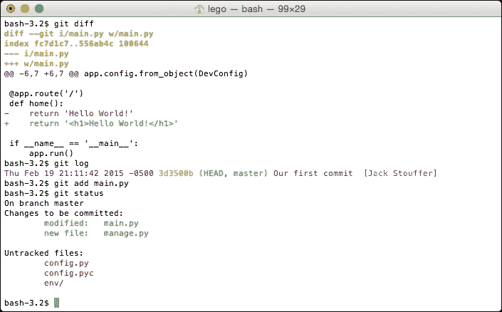

# 一、开始

**Python**是一种灵活的语言，程序员可以自由地构建自己的编程环境。然而，这种自由的一个危险后果是不能从一开始就建立一个新的 Python 项目，以避免将来出现问题。

例如，您可能已经完成了项目的一半，并且意识到您在五天前删除了一个文件或一段代码，您现在需要使用它。请考虑另一个示例，其中两个希望使用的包需要相同版本的基础包的不同版本。除了本章介绍的工具之外，还有很多额外的工作要做，以解决已经存在的问题。一开始做一点额外的工作可以节省未来几天的工作。

为了这个目的，我们将需要安装三个程序：**Git**、**pip**和**virtualenv**。

# 使用 Git 进行版本控制

为了保护我们的项目免受人为错误的影响，我们将使用名为 Git 的版本控制系统。**版本控制**是一种记录文件随时间变化的工具。这允许程序员查看代码是如何从以前的版本更改的，甚至可以将代码恢复到以前的状态。版本控制系统还使协作比以往任何时候都更容易，因为更改可以在许多不同的程序员之间共享，并自动合并到项目的当前版本中，而无需复制和粘贴数百行代码。

简单地说，版本控制就像是代码的备份，只是功能更强大。

## 安装 Git

安装Git非常简单。只需转到[http://www.git-scm.com/downloads](http://www.git-scm.com/downloads) 点击正在运行的**操作系统**（**操作系统**）。将开始下载一个程序，引导您完成基本的安装过程。

### Windows 上的 Git

Git 最初是专门为 Unix 操作系统（例如 Linux、Mac OS X）开发的。因此，在 Windows 上使用Git 不是无缝的。在安装过程中，安装程序将询问您是否希望在正常的 Windows 命令提示符下安装 Git。不要选择此选项。选择默认选项，该选项将在您的系统上安装一个名为**Bash**的新型命令行，该命令行与 Unix 系统使用的命令行相同。Bash 比默认的 Windows 命令行强大得多，本书中的所有示例都将使用它。

### 注

初学者对 Bash 的良好介绍位于[http://linuxcommand.org/learning_the_shell.php#contents](http://linuxcommand.org/learning_the_shell.php#contents) 。

## Git 基础知识

Git 是一个非常复杂的工具；这里只介绍本书所需的基本知识。

### 注

要了解更多信息，请参阅位于[的 Git 文档 http://www.git-scm.com/doc](http://www.git-scm.com/doc) 。

Git 不会自动跟踪您的更改。为了让 Git 正常运行，我们必须提供以下信息：

*   要跟踪哪些文件夹
*   何时保存代码的状态
*   跟踪什么和不跟踪什么

在我们做任何事情之前，我们告诉 Git 在我们的目录中创建一个`git`实例。在项目目录中，在终端中运行以下操作：

```py
$ git init

```

Git 现在将开始跟踪项目中的更改。当`git`跟踪我们的文件时，我们可以通过键入以下命令来查看我们跟踪的文件和任何未跟踪的文件的状态：

```py
$ git status

```

现在我们可以保存我们的first**commit**，这是您运行`commit`命令时代码的快照。

```py
# In Bash, comments are marked with a #, just like Python
# Add any files that have changes and you wish to save in this commit
$ git add main.py
# Commit the changes, add in your commit message with -m
$ git commit -m"Our first commit"

```

在未来的任何时刻，我们都可以在我们的项目中回到这一点。添加要提交的文件在 Git 中称为**暂存**文件。记住，只有在准备提交阶段文件时才添加阶段文件。一旦文件被暂存，任何进一步的更改也不会被暂存。有关更高级 Git 用法的示例，请使用文本编辑器将任何文本添加到`main.py`文件中，然后运行以下操作：

```py
# To see the changes from the last commit
$ git diff
# To see the history of your changes
$ git log
# As an example, we will stage main.py
# and then remove any added files from the stage
$ git add main.py
$ git status
$ git reset HEAD main.py
# After any complicated changes, be sure to run status
# to make sure everything went well
$ git status
# lets delete the changes to main.py, reverting to its state at the last commit
# This can only be run on files that aren't staged
$ git checkout -- main.py

```

您的终端应如下所示：



对于这个简单的介绍，Git系统的`checkout`命令相当高级，但它用于更改 Git 系统的`HEAD`指针的当前状态，即我们的代码在项目历史中的当前位置。这将在下一个示例中显示。

现在，要查看上一次提交中的代码，请首先运行以下命令：

```py
$ git log
Fri Jan 23 19:16:43 2015 -0500 f01d1e2 Our first commit  [Jack Stouffer]

```

提交消息旁边的字符字符串`f01d1e2`称为提交的**散列**。它是该提交的唯一标识符，我们可以使用它返回到保存状态。现在，要将项目恢复到该状态，请运行以下命令：

```py
$ git checkout f01d1e2

```

您的 Git 项目现在处于一种特殊状态，在这种状态下，任何更改或提交都不会被保存，也不会影响您签出后所做的任何提交。此状态仅用于查看旧代码。要返回 Git 的正常模式，请运行以下命令：

```py
$ git checkout master

```

# 使用 pip 进行 Python 包管理

在Python 中，程序员可以从其他程序员那里下载扩展标准 Python 库功能的库。正如您在使用 Flask 时已经知道的那样，Python 的许多功能来自于它大量的社区创建的库。

然而，正确安装第三方库可能是一件非常痛苦的事情。假设您希望安装一个程序包 X。很简单，下载 Zip 文件并运行`setup.py`，对吗？不完全是。程序包 X 依赖于程序包 Y，而程序包 Y 又依赖于 Z 和 Q。程序包 X 的网站上没有列出这些信息，但必须安装这些信息才能使 X 正常工作。然后，您必须逐个找到所有软件包并安装它们，希望您正在安装的软件包本身不需要任何额外的软件包。

为了自动化这个过程，我们使用了**pip**，Python 包管理器。

## 在 Windows 上安装 pip Python 包管理器

如果您在 Windows 上，并且您安装的 Python 是当前版本，那么您已经有了 pip！如果您的 Python 安装不是最新的，那么最简单的方法就是重新安装它。在[下载Python Windows 安装程序 https://www.python.org/downloads/](https://www.python.org/downloads/) 。

在 Windows 中，控制可从命令行访问哪些程序的变量是**路径**。要修改路径以包含 Python 和 pip，我们必须添加`C:\Python27`和`C:\Python27\Tools`。打开 Windows 菜单，右键点击**计算机**并点击**属性**，编辑 Windows 路径。在**高级系统设置**下，点击**环境变量。。。**。向下滚动直到找到**路径**，双击该路径，并在末尾添加`;C:\Python27;C:\Python27\Tools`。

要确保正确修改了路径，请关闭并重新打开终端，然后在命令行中键入以下内容：

```py
pip --help

```

### 提示

**下载示例代码**

您可以从您的账户[下载示例代码文件 http://www.packtpub.com](http://www.packtpub.com) 对于您购买的所有 Packt 出版书籍。如果您在其他地方购买了本书，您可以访问[http://www.packtpub.com/support](http://www.packtpub.com/support) 并注册，将文件直接通过电子邮件发送给您。

`pip`应已打印其使用信息，如以下屏幕截图所示：


## 在 Mac OS X 和 Linux 上安装 pip Python 包管理器

Linux的某些Python 安装不附带 pip，Mac OS X 安装默认情况下也不附带 pip。要安装它，请从[下载`get-pip.py`文件https://raw.githubusercontent.com/pypa/pip/master/contrib/get-pip.py](https://raw.githubusercontent.com/pypa/pip/master/contrib/get-pip.py) 。

下载后，请使用以下提升权限运行它：

```py
$ sudo python get-pip.py

```

然后 pip 将自动安装。

## pip 基础知识

要安装带有`pip`的包，请执行以下简单步骤：

```py
$ pip install [package-name]

```

在 Mac 和 Linux 上，由于您要在用户拥有的文件夹之外安装程序，您可能需要在 install 命令前加上`sudo`。要安装Flask，只需运行以下命令：

```py
$ pip install flask

```

然后，将为您安装Flask的所有要求。

如果要删除不再使用的软件包，请运行以下操作：

```py
$ pip uninstall [package-name]

```

如果您希望探索或找到一个包，但不知道其确切名称，您可以使用搜索命令：

```py
$ pip search [search-term]

```

现在我们已经安装了几个包，在 Python 社区中，创建运行项目所需的包的列表是一种常见的礼貌，这样其他人就可以快速安装所需的所有东西。这还有一个额外的好处，即项目的任何新成员都可以快速运行代码。

通过运行以下命令，可以使用 pip 创建此列表：

```py
$ pip freeze > requirements.txt

```

这个命令到底做了什么？`pip freeze`自行运行打印出安装的软件包及其版本列表，如下所示：

```py
Flask==0.10.1
itsdangerous==0.24
Jinja2==2.7.3
MarkupSafe==0.23
Werkzeug==0.10.4
wheel==0.24.0
```

`>`操作符告诉 Bash 获取最后一个命令打印的所有内容，并将其写入该文件。如果查看项目目录，您将看到名为`requirements.txt`的新文件，其中包含`pip freeze`的输出。

要安装此文件中的所有软件包，新的项目维护人员必须运行以下命令：

```py
$ pip install -r requirements.txt

```

这告诉`pip`阅读`requirements.txt`中列出的所有软件包并安装它们。

# 使用 virtualenv 进行依赖性沙盒

因此，您已经安装了新项目所需的所有软件包。伟大的但是，当我们在一段时间后开发第二个项目时，将使用相同软件包的更新版本，会发生什么呢？如果希望使用的库依赖于为第一个项目安装的库，但它使用的是旧版本，会发生什么情况？当更新版本的软件包包含破坏性的更改时，升级它们将需要在旧项目上进行额外的开发工作，而您可能负担不起这些工作。

谢天谢地，有 virtualenv，一个沙盒 Python 项目的工具。virtualenv 的秘密在于诱使您的计算机在项目目录中查找和安装包，而不是在主 Python 目录中，这样可以使它们完全分开。

现在我们有了 pip，要安装 virtualenv，只需运行以下命令：

```py
$ pip install virtualenv

```

## 虚拟基础

让我们为我们的项目初始化virtualenv，如下所示：

```py
$ virtualenv env

```

额外的`env`告诉`virtualenv`将所有包存储到名为`env`的文件夹中。virtualenv 要求您先启动它，然后再对您的项目进行沙箱：

```py
$ source env/bin/activate
# Your prompt should now look like
(env) $

```

`source`命令告诉 Bash 在当前目录的上下文中运行脚本`env/bin/activate`。让我们在新的沙箱中重新安装Flask，如下所示：

```py
# you won't need sudo anymore
(env) $ pip install flask
# To return to the global Python
(env) $ deactivate

```

然而，跟踪您不拥有的东西违背了 Git 中的最佳实践，因此我们应该避免跟踪第三方软件包中的更改。要忽略我们项目中的特定文件，需要使用`gitignore`文件。

```py
$ touch .gitignore

```

`touch`是创建文件的 Bash 命令，文件开头的点告诉 Bash 不要列出它的存在，除非特别要求显示隐藏文件。现在我们将创建简单的`gitignore`文件：

```py
env/
*.pyc
```

这告诉Git 忽略整个`env`目录，忽略以`.pyc`结尾的所有文件（一个*编译的*Python 文件）。以这种方式使用时，`*`字符被称为**通配符**。

# 我们项目的开始

最后，我们可以进入我们的第一个Flask项目。为了在书的结尾有一个复杂的项目，我们需要一个简单的Flask项目来开始。

在名为`config.py`的文件中，添加以下内容：

```py
class Config(object):
    pass

class ProdConfig(Config):
    pass

class DevConfig(Config):
    DEBUG = True
```

现在，在另一个名为`main.py`的文件中，添加以下内容：

```py
from flask import Flask
from config import DevConfig

app = Flask(__name__)
app.config.from_object(DevConfig)

@app.route('/')
def home():
    return '<h1>Hello World!</h1>'

if __name__ == '__main__':
    app.run()
```

对于熟悉基本 Flask API 的任何人来说，这个程序都是非常基本的。如果我们导航到`http://127.0.0.1:5000/`，它只会在浏览器上显示`Hello World!`。Flask用户可能不熟悉的一点是`config.from_object`，而不是`app.config['DEBUG']`。我们使用`from_object`是因为将来会使用多个配置，当我们需要在配置之间切换时，手动更改每个变量非常繁琐。

记住在 Git 中提交这些更改：

```py
# The --all flag will tell git to stage all changes you have made
# including deletions and new files
$ git add --all
$ git commit -m "created the base application"

```

### 注

何时将更改提交到 Git 将不再提供提醒。当你到达一个停站点时，读者应该养成承诺的习惯。还假设您将在虚拟环境中操作，因此所有命令行提示都不会以`(env)`作为前缀。

## 使用Flask脚本

为了让读者更容易理解接下来的章节，我们将使用许多**Flask扩展**（扩展Flask功能的包）中的第一个，名为**Flask脚本**。Flask 脚本允许程序员创建在 Flask 的**应用上下文**中起作用的命令，即 Flask 中允许修改`Flask`对象的状态。Flask 脚本附带了一些默认命令，用于在应用上下文中运行服务器和 python shell。要使用`pip`安装 Flask 脚本，请运行以下命令：

```py
$ pip install flask-script

```

我们将在[第 10 章](10.html "Chapter 10. Useful Flask Extensions")、*有用的Flask扩展*中介绍Flask脚本的更高级用法；现在，让我们从一个名为`manage.py`的简单脚本开始。首先导入 Flask 脚本的对象和应用，如下所示：

```py
from flask.ext.script import Manager, Server
from main import app
```

然后，将应用传递到`Manager`对象，该对象将初始化 Flask 脚本：

```py
manager = Manager(app)
```

现在我们添加命令。该服务器与通过`main.py`运行的正常开发服务器相同。`make_shell_context`函数将创建一个可以在应用上下文中运行的 Python shell。返回的字典将告诉 Flask 脚本默认情况下要导入的内容：

```py
manager.add_command("server", Server())

@manager.shell
def make_shell_context():
    return dict(app=app)
```

### 注

当Flask扩展仅在创建Flask应用时才会初始化时，通过`manage.py`运行 shell 将成为必要。运行默认的 pythonshell 将导致这些扩展返回错误。

然后，仅当用户运行此文件时，才使用 Python 标准运行方式结束文件：

```py
if __name__ == "__main__":
    manager.run()
```

现在，您可以使用以下设备运行开发服务器：

```py
$ python manage.py server

```

将外壳与以下部件一起使用：

```py
$ python manage.py shell
# Lets check if our app imported correctly
>>> app
<Flask 'main'>

```

# 总结

现在我们已经设置了开发环境，我们可以继续在 Flask 中实现高级应用功能。在我们做任何视觉化的事情之前，我们需要一些东西来展示。在下一章中，您将了解并掌握 Flask 中的数据库。