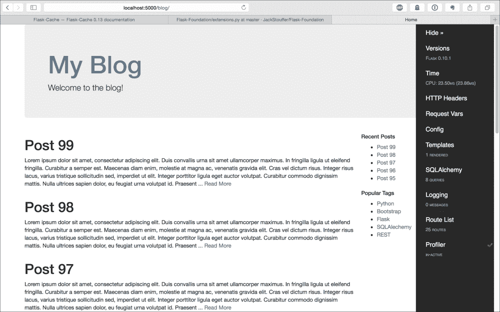

# 十、有用的 Flask 扩展

正如我们在本书中所看到的，Flask 被设计为尽可能小，同时仍然为您提供创建 web 应用所需的灵活性和工具。但是，许多 web 应用都有许多共同的特性，这意味着许多应用将需要编写代码来为每个 web 应用执行相同的任务。为了解决这个问题，人们创建了对 Flask 的扩展以避免重新发明轮子，我们在本书中已经看到了许多 Flask 扩展。本章将重点介绍一些更有用的 Flask 扩展，这些扩展没有足够的内容将它们划分到自己的章节中，但会为您节省大量时间和挫折感。

# Flask脚本

在[第 1 章](01.html "Chapter 1. Getting Started")、*入门*中，我们使用 Flask 扩展 Flask 脚本创建了一个基本的管理脚本，以方便服务器的运行和 shell 的调试。在本章中，我们将介绍基本介绍中未介绍的功能。

在 Flask 脚本中，可以创建要在应用上下文中运行的自定义命令。所需要的只是创建一个命令，用 Flask 脚本提供的 decorator 函数来修饰普通 Python 函数。例如，如果我们想要一个返回字符串“Hello，World！”的任务，我们会在`manage.py`中添加以下内容：

```py
@manager.command
def test():
    print "Hello, World!"
```

从命令行，`test`命令现在可以使用以下命令运行：

```py
$ python manage.py test
Hello, World!

```

删除 test 命令，让我们创建一个简单的命令，通过创建他们的 SQLite 数据库并用测试数据填充它来帮助在我们的应用上设置新的开发人员。此命令部分取自[第 4 章](04.html "Chapter 4. Creating Controllers with Blueprints")中创建的脚本*使用蓝图创建控制器*：

```py
@manager.command
def setup_db():
    db.create_all()

    admin_role = Role()
    admin_role.name = "admin"
    admin_role.description = "admin"
    db.session.add(admin_role)

    default_role = Role()
    default_role.name = "default"
    default_role.description = "default"
    db.session.add(default_role)

    admin = User()
    admin.username = "admin"
    admin.set_password("password")
    admin.roles.append(admin_role)
    admin.roles.append(default_role)
    db.session.add(admin)

    tag_one = Tag('Python')
    tag_two = Tag('Flask')
    tag_three = Tag('SQLAlechemy')
    tag_four = Tag('Jinja')
    tag_list = [tag_one, tag_two, tag_three, tag_four]

    s = "Body text"

    for i in xrange(100):
        new_post = Post("Post {}".format(i))
        new_post.user = admin
        new_post.publish_date = datetime.datetime.now()
        new_post.text = s
        new_post.tags = random.sample(
            tag_list,
            random.randint(1, 3)
        )
        db.session.add(new_post)

    db.session.commit()
```

现在，如果一个新的开发者被分配了这个项目，他们可以从我们的服务器下载`git repo`，安装`pip`库，运行`setup_db`命令，并且能够运行他们需要的所有项目。

Flask 脚本还提供了两个实用功能，可以轻松地添加到我们的项目中。

```py
from flask.ext.script.commands import ShowUrls, Clean
…
manager = Manager(app)
manager.add_command("server", Server())
manager.add_command("show-urls", ShowUrls())
manager.add_command("clean", Clean())
```

`show-urls`命令列出`app`对象上注册的所有路由以及与该路由相关的 URL。这在调试 Flask 扩展时非常有用，因为查看其蓝图的注册是否有效变得非常简单。Clean 命令只是从我们的工作目录中删除了`.pyc`和`.pyo`编译的 Python 文件。

# Flask调试工具栏

Flask Debug Toolbar 是一个 Flask 扩展，通过在应用的 web 视图中添加调试工具来帮助开发。它提供了诸如视图渲染代码中的瓶颈以及渲染视图所需的 SQLAlchemy 查询数等信息。

一如既往，我们将使用`pip`安装Flask调试工具栏：

```py
$ pip install flask-debugtoolbar

```

接下来，我们需要将 Flask Debug 工具栏添加到`extensions.py`文件中。由于我们将在本章中对该文件进行大量修改，因此这里是到目前为止该文件的开头以及初始化 Flask Debug 工具栏的代码：

```py
from flask import flash, redirect, url_for, session
from flask.ext.bcrypt import Bcrypt
from flask.ext.openid import OpenID
from flask_oauth import OAuth
from flask.ext.login import LoginManager
from flask.ext.principal import Principal, Permission, RoleNeed
from flask.ext.restful import Api
from flask.ext.celery import Celery
from flask.ext.debugtoolbar import DebugToolbarExtension

bcrypt = Bcrypt()
oid = OpenID()
oauth = OAuth()
principals = Principal()
celery = Celery()
debug_toolbar = DebugToolbarExtension()
```

现在需要在`__init__.py`中的`create_app`函数中调用初始化函数：

```py
from .extensions import (
    bcrypt,
    oid,
    login_manager,
    principals,
    rest_api,
    celery,
    debug_toolbar,
)

def create_app(object_name):

    debug_toolbar.init_app(app)
```

这就是启动和运行 Flask 调试工具栏所需的全部内容。如果应用的`config`中的`DEBUG`变量设置为*true*，则会出现工具栏。如果`DEBUG`未设置为*true*，则工具栏不会被注入页面。



在屏幕的右侧可以看到工具栏。每个部分都是一个链接，将在页面上显示一个值表。要获取为呈现视图而调用的所有函数的列表，请单击**探查器**旁边的复选标记以启用它，重新加载页面，然后单击**探查器**。通过此视图，您可以轻松地快速诊断应用的哪些部分速度最慢或被称为最慢。

默认情况下，Flask Debug 工具栏拦截`HTTP 302 redirect`请求。要禁用此功能，请将以下内容添加到配置中：

```py
class DevConfig(Config):
    DEBUG = True
    DEBUG_TB_INTERCEPT_REDIRECTS = False
```

此外，如果您使用的是 Flask MongoEngine，则可以通过覆盖呈现的面板并添加 MongoEngine 的自定义面板来查看为呈现页面而进行的所有查询。

```py
class DevConfig(Config):
    DEBUG = True
    DEBUG_TB_PANELS = [
        'flask_debugtoolbar.panels.versions.VersionDebugPanel',
        'flask_debugtoolbar.panels.timer.TimerDebugPanel',
        'flask_debugtoolbar.panels.headers.HeaderDebugPanel',
        'flask_debugtoolbar.panels.request_vars.RequestVarsDebugPanel',
        'flask_debugtoolbar.panels.config_vars.ConfigVarsDebugPanel ',
        'flask_debugtoolbar.panels.template.TemplateDebugPanel',
        'flask_debugtoolbar.panels.logger.LoggingPanel',
        'flask_debugtoolbar.panels.route_list.RouteListDebugPanel'
        'flask_debugtoolbar.panels.profiler.ProfilerDebugPanel',
        'flask.ext.mongoengine.panels.MongoDebugPanel'
    ]
    DEBUG_TB_INTERCEPT_REDIRECTS = False
```

这将在工具栏上添加一个面板，与默认的 SQLAlchemy 面板非常相似。

# Flask缓存

在[第 7 章](07.html "Chapter 7. Using NoSQL with Flask")中*使用 NoSQL with Flask*时，我们了解到页面加载时间是决定您的 web 应用成功与否的最重要因素之一。尽管我们的页面不会经常更改，并且由于新帖子不会经常发布，但每次用户的浏览器请求页面时，我们仍然会呈现模板并查询数据库。

Flask Cache 允许我们存储视图函数的结果并返回存储的结果，而不是再次渲染模板，从而解决了这个问题。首先，我们需要从`pip`安装 Flask 缓存：

```py
$ pip install Flask-Cache

```

接下来，在`extensions.py`中对其进行初始化：

```py
from flask.ext.cache import Cache

cache = Cache()
```

然后，在`__init__.py`的`create_app`功能中，在应用上注册`Cache`对象：

```py
from .extensions import (
    bcrypt,
    oid,
    login_manager,
    principals,
    rest_api,
    celery,
    debug_toolbar,
    cache
)

def create_app(object_name):
    …
    cache.init_app(app)
```

在我们开始缓存我们的视图之前，需要告诉 Flash Cache 我们希望如何存储新函数的结果。

```py
class DevConfig(Config):
    …
    CACHE_TYPE = 'simple'
```

`simple`选项告诉 Flask Cache 将结果存储在 Python 字典中的内存中，这对于绝大多数 Flask 应用来说已经足够了。我们将在本节后面介绍更多类型的缓存后端。

## 缓存视图和功能

为了缓存视图函数的结果，只需向任何函数添加一个装饰器：

```py
@blog_blueprint.route('/')
@blog_blueprint.route('/<int:page>')
@cache.cached(timeout=60)
def home(page=1):
    posts = Post.query.order_by(
        Post.publish_date.desc()
    ).paginate(page, 10)
    recent, top_tags = sidebar_data()

    return render_template(
        'home.html',
        posts=posts,
        recent=recent,
        top_tags=top_tags
    )
```

`timeout`参数指定在再次运行和存储函数之前，缓存结果应持续多少秒。要确认视图实际上正在被缓存，请检查调试工具栏上的 SQLAlchemy 部分。此外，通过激活探查器并比较前后的时间，我们可以看到缓存对页面加载时间的影响。在作者的顶级笔记本电脑上，主博客页面需要 34 毫秒才能呈现，这主要是由于对数据库进行了八种不同的查询。但在缓存被激活后，这将降低到.08 毫秒。这意味着速度提高了 462.5%！

视图函数不是唯一可以缓存的东西。要缓存任何 Python 函数，只需向函数定义中添加一个类似的 decorator，如下所示：

```py
@cache.cached(timeout=7200, key_prefix='sidebar_data')
def sidebar_data():
    recent = Post.query.order_by(
        Post.publish_date.desc()
    ).limit(5).all()

    top_tags = db.session.query(
        Tag, func.count(tags.c.post_id).label('total')
    ).join(
        tags
    ).group_by(
        Tag
    ).order_by('total DESC').limit(5).all()

    return recent, top_tags
```

关键字参数`key_prefix`对于非视图函数是必需的，以便 Flask Cache 正确存储函数的结果。这对于缓存的每个函数都必须是唯一的，否则函数的结果将相互覆盖。另外，请注意，此函数的超时设置为 2 小时，而不是前面示例中的 60 秒。这是因为与视图函数相比，此函数的结果不太可能发生更改，而且如果数据过时，问题也不会太大。

## 带参数的缓存功能

但是，普通的缓存装饰器不考虑函数参数。如果我们使用普通的缓存装饰器缓存了一个接受参数的函数，那么它将为每个参数集返回相同的结果。为了解决这个问题，我们使用了`memoize`函数：

```py
    class User(db.Model):
        …

        @staticmethod
        @cache.memoize(60)
        def verify_auth_token(token):
            s = Serializer(current_app.config['SECRET_KEY'])

            try:
                data = s.loads(token)
            except SignatureExpired:
                return None
            except BadSignature:
                return None

            user = User.query.get(data['id'])
            return user
```

`Memoize`存储传递给函数的参数以及结果。在前面的示例中，`memoize`用于存储`verify_auth_token`方法的结果，该方法被多次调用并每次查询数据库。此方法可以安全地进行记忆，因为如果向其传递相同的令牌，则每次都返回相同的结果。此规则的唯一例外是，如果用户对象在存储函数的 60 秒内被删除，但这种情况不太可能发生。

注意不要`memoize`或缓存依赖于全局范围变量或不断变化的数据的函数。这可能会导致一些非常微妙的错误，在最坏的情况下，会导致数据竞争。记忆的最佳候选对象是所谓的纯函数。纯函数是当相同的参数传递给它们时将产生相同结果的函数。函数运行多少次并不重要。纯函数也没有任何副作用，这意味着它们不会更改全局范围的变量。这也意味着纯函数不能执行任何 IO 操作。虽然`verify_auth_token`函数不是纯粹的函数，因为它执行数据库 IO，但它是可以的，因为正如前面所述，底层数据不太可能改变。

在开发应用时，我们不希望缓存视图函数，因为结果将一直在更改。要解决此问题，请在生产配置中将`CACHE_TYPE`变量设置为 null，并将变量设置为 simple，以便在部署应用时，一切正常：

```py
class ProdConfig(Config):
    …
    CACHE_TYPE = 'simple'

class DevConfig(Config):
    …
    CACHE_TYPE = 'null'
```

## 缓存带查询字符串的路由

有些路由，例如我们的主页和`post`路由，通过 URL 获取参数并返回特定于这些参数的内容。如果缓存像这样的路由，我们会遇到问题，因为不管 URL 参数如何，所有请求都会返回路由的第一次呈现。解决办法相当简单。cache 方法中的`key_prefix`关键字参数可以是字符串，也可以是函数，它将被执行以动态生成密钥。这意味着可以创建一个函数来生成一个绑定到 URL 参数的键，因此，如果以前调用过特定的参数组合，则每个请求仅返回一个缓存页面。在`blog.py`文件中，添加以下内容：

```py
def make_cache_key(*args, **kwargs):
    path = request.path
    args = str(hash(frozenset(request.args.items())))
    lang = get_locale()
    return (path + args + lang).encode('utf-8')

@blog_blueprint.route(
    '/post/<int:post_id>',
    methods=('GET', 'POST')
)
@cache.cached(timeout=600, key_prefix=make_cache_key)
def post(post_id):
    …
```

现在，每个单独的帖子页面将被缓存 10 分钟。

## 使用 Redis 作为缓存后端

如果视图函数的数量或传递给缓存函数的唯一参数的数量对于内存来说太大，您可以使用不同的后端进行缓存。正如[第 7 章](07.html "Chapter 7. Using NoSQL with Flask")中提到的，*使用 NoSQL 和 Flask*，Redis 可以用作缓存的后端。要实现该功能，只需将以下配置变量添加到`ProdConfig`类中，如下所示：

```py
class ProdConfig(Config):
    …
    CACHE_TYPE = 'redis'
    CACHE_REDIS_HOST = 'localhost'
    CACHE_REDIS_PORT = '6379'
    CACHE_REDIS_PASSWORD = 'password'
    CACHE_REDIS_DB = '0'
```

如果您用自己的数据替换变量的值，Flask Cache 将自动创建到`redis`数据库的连接，并使用它存储函数的结果。只需安装 Python`redis`库：

```py
$ pip install redis

```

## 使用 memcached 作为缓存后端

与后端`redis`一样，`memcached`后端提供了另一种存储结果的方式，如果内存选项太有限。与`redis`不同，`memcached`设计用于`cache`对象供以后使用，并减少数据库的负载。`redis`和`memcached`可以达到相同的目的，选择其中一个取决于个人偏好。要使用`memcached`，我们需要安装其 Python 库：

```py
$ pip install memcache

```

连接到您的`memcached`服务器是在配置对象中处理的，就像`redis`设置一样：

```py
class ProdConfig(Config):
    …
    CACHE_TYPE = 'memcached'
    CACHE_KEY_PREFIX = 'flask_cache'
    CACHE_MEMCACHED_SERVERS = ['localhost:11211']
```

# 资产

web 应用中的另一个瓶颈是下载页面的 CSS 和 JavaScript 库所需的 HTTP 请求量。只有在加载和解析页面的 HTML 后，才能下载额外的文件。为了解决这个问题，许多现代浏览器一次下载了许多这样的库，但是浏览器同时发出的请求数量是有限的。

在服务器上可以做一些事情来减少下载这些文件所花费的时间。开发人员使用的主要技术是将所有 JavaScript 库连接到一个文件中，将所有 CSS 库连接到另一个文件中，同时删除结果文件中的所有空格和回车。这减少了多个 HTTP 请求的开销，删除不必要的空格和回车符可以将文件大小减少 30%。另一种技术是告诉浏览器使用专门的 HTTP 头在本地缓存文件，因此文件只有在更改后才会再次加载。手动执行这些操作可能会很乏味，因为它们需要在每次部署到服务器之后执行。

谢天谢地，Flask 资产实现了上述所有技术。Flask Assets 的工作原理是为它提供一个文件列表和连接它们的方法，然后在模板中添加一个特殊的控制块来代替普通的链接和脚本标记。然后，Flask 资产将添加链接或脚本标记，链接到新生成的文件。要开始，需要安装 Flask 资产。我们还需要安装`cssmin`和`jsmin`，它们是处理文件修改的 Python 库：

```py
$ pip install Flask-Assets cssmin jsmin

```

现在，需要创建要连接的文件集合，命名为 bundle。在`extensions.py`中，添加以下内容：

```py
from flask_assets import Environment, Bundle

assets_env = Environment()

main_css = Bundle(
    'css/bootstrap.css',
    filters='cssmin',
    output='css/common.css'
)

main_js = Bundle(
    'js/jquery.js',
    'js/bootstrap.js',
    filters='jsmin',
    output='js/common.js'
)
```

每个`Bundle`对象将无限多个文件作为位置参数来定义要捆绑的文件，一个关键字参数`filters`来定义要发送文件的过滤器，一个`output`来定义要保存结果的`static`文件夹中的文件名。

### 注

`filters`关键字可以是单个值或列表。要获得可用过滤器的完整列表，包括自动 Less 和 CSS 编译器，请参阅[中的文档 http://webassets.readthedocs.org/en/latest/](http://webassets.readthedocs.org/en/latest/) 。

虽然是真的，因为我们的网站是轻量级的样式，CSS 包中只有一个文件。出于两个原因，将文件打包仍然是一个好主意。

在开发过程中，我们可以使用库的未缩小版本，这使得调试更容易。当应用部署到生产环境中时，库会自动缩小。

这些库将与缓存头一起发送到浏览器，而在 HTML 中链接它们通常不会。

在测试 Flask 资产之前，还需要进行三项更改。首先，在`__init__.py`格式中，需要注册扩展和捆绑包：

```py
from .extensions import (
    bcrypt,
    oid,
    login_manager,
    principals,
    rest_api,
    celery,
    debug_toolbar,
    cache,
    assets_env,
    main_js,
    main_css
)

def create_app(object_name):
    …
    assets_env.init_app(app)

    assets_env.register("main_js", main_js)
    assets_env.register("main_css", main_css)
```

接下来，`DevConfig`类需要一个额外的变量来告诉 Flask Assets 在开发过程中不要编译库：

```py
class DevConfig(Config):
    DEBUG = True
    DEBUG_TB_INTERCEPT_REDIRECTS = False

    ASSETS_DEBUG = True
```

最后，两个`base.html`文件中的链接和脚本标记需要替换为 Flask 资产中的控制块。我们有以下几点：

```py
<link rel="stylesheet" href=https://maxcdn.bootstrapcdn.com/bootstrap/3.3.2/css/bootstrap.min.css>
```

将此替换为以下内容：

```py

<link rel="stylesheet" type="text/css" href="{{ ASSET_URL }}" />

```

我们还有以下几点：

```py
<script src="https://ajax.googleapis.com/ajax/libs/jquery/1.11.2/jquery.min.js"></script>
<script src="https://maxcdn.bootstrapcdn.com/bootstrap/3.3.2/js/bootstrap.min.js"></script>
```

将其替换为以下内容：

```py

<script src="{{ ASSET_URL }}"></script>

```

现在，如果重新加载页面，所有 CSS 和 JavaScript 现在都将由 Flask 资产处理。

# Flask管理员

在[第 6 章](06.html "Chapter 6. Securing Your App")*保护您的应用*中，我们创建了一个界面，允许用户创建和编辑博客帖子，而无需使用命令行。这足以说明本章中介绍的安全措施，但仍然无法使用界面删除帖子或为其分配标签。我们也没有办法删除或编辑我们不希望普通用户看到的评论。我们的应用需要一个与 WordPress 界面相同的功能齐全的管理员界面。这是应用的常见要求，因此创建了一个 Flask 扩展名 Flask Admin，以方便创建管理员界面。要开始，请使用`pip`安装 Flask Admin：

```py
$ pip install Flask-Admin

```

通常我们需要在`extensions.py`中创建`extension`对象：

```py
from flask.ext.admin import Admin

admin = Admin()
```

然后，需要在`__init__.py`中的`app`对象上注册该对象：

```py
from .extensions import (
    bcrypt,
    oid,
    login_manager,
    principals,
    rest_api,
    celery,
    debug_toolbar,
    cache,
    assets_env,
    main_js,
    main_css,
    admin
)

def create_app(object_name):
    …
    admin.init_app(app)
```

如果导航到`localhost:5000/admin`，您现在应该会看到空Flask管理界面：


Flask Admin通过在`admin`对象上注册定义一个或多个路由的视图类来工作。Flask Admin 有三种主要的视图类型：`ModelView`、`FileAdmin`和`BaseView`视图。

## 创建基本管理页面

`BaseView`类允许将普通Flask页面添加到您的`admin`界面。这通常是 Flask 管理设置中使用最少的视图类型，但如果您希望使用 JavaScript 图表库包含自定义报告之类的内容，则只需使用基本视图即可。在名为`admin.py`的控制器文件夹中的新文件中，添加以下内容：

```py
from flask.ext.admin import BaseView, expose

class CustomView(BaseView):
    @expose('/')
    def index(self):
        return self.render('admin/custom.html')

    @expose('/second_page')
    def second_page(self):
        return self.render('admin/second_page.html')
```

在`BaseView`的子类中，如果同时定义多个视图，则可以同时注册多个视图。但是，请记住，`BaseView`的每个子类在路径`/`上至少需要一个公开的方法。此外，路径`/`中的方法以外的其他方法将不在管理员界面的导航中，并且必须链接到类中的其他页面。`expose`和`self.render`函数的工作原理与普通 Flask API 中的对应函数完全相同。

要使模板继承 Flask Admin 的默认样式，请在名为`admin`的模板目录中创建一个名为`custom.html`的新文件夹，并添加以下 Jinja 代码：

```py


    This is the custom view!
    <a href="{{ url_for('.second_page') }}">Link</a>

```

要查看此模板，需要在`admin`对象上注册`CustomView`的实例。这将在`create_app`函数而不是`extensions.py`文件中完成，因为我们的一些管理页面需要数据库对象，如果注册在`extensions.py`中，这将导致循环导入。在`__init__.py`中，添加以下代码注册该类：

```py
from webapp.controllers.admin import CustomView
…
def create_app(object_name):
    …
    admin.add_view(CustomView(name='Custom'))
```

`name`关键字参数指定`admin`界面顶部导航栏中使用的标签应为`Custom`。在您向`admin`对象注册`CustomView`之后，您的`admin`界面现在应该在导航栏中有第二个链接，如下所示。


## 创建数据库管理页面

Flask Admin 的主要功能来自这样一个事实，即通过向 Flask Admin 提供 SQLAlchemy 或 MongoEngine 模型，您可以自动为数据创建管理员页面。创建这些页面非常容易；在`admin.py`中，只需添加以下代码：

```py
from flask.ext.admin.contrib.sqla import ModelView
# or, if you use MongoEngine
from flask.ext.admin.contrib.mongoengine import ModelView

class CustomModelView(ModelView):
    pass
```

然后，在`__init__.py`中，使用您想要使用的模型和数据库`session`对象注册该类，如下所示：

```py
from controllers.admin import CustomView, CustomModelView
from .models import db, Reminder, User, Role, Post, Comment, Tag

def create_app(object_name):

    admin.add_view(CustomView(name='Custom'))
    models = [User, Role, Post, Comment, Tag, Reminder]

    for model in models:
       admin.add_view(
           CustomModelView(model, db.session, category='models')
       )
```

`category`关键字告诉 Flask Admin 将具有相同类别值的所有视图放入导航栏上的相同下拉列表中。

如果您现在进入浏览器，您将看到一个新的下拉菜单，标签为**Models**，其中包含指向数据库中所有表的管理页面的链接，如下所示：


为每个模型生成的接口提供了许多功能。可以创建新帖子，并且可以批量删除现有帖子。可以从此界面设置所有字段，包括关系字段，这些字段实现为可搜索的下拉菜单。`date`和`datetime`字段甚至具有带有日历下拉菜单的自定义 JavaScript 输入。总的来说，这是对在[第 6 章](06.html "Chapter 6. Securing Your App")*中创建的手动界面的巨大改进，以保护您的应用*。

## 加强岗位管理

虽然这个接口在质量上有了巨大的提升，但仍有一些功能缺失。我们不再有原始界面中可用的 WYSIWYG 编辑器，并且可以通过启用一些更强大的 Flask 管理功能来改进此页面。

要将所见即所得编辑器添加回`post`创建页面，我们需要一个新的`WTForms`字段，因为 Flask Admin 使用 Flask WTF 构建表单。我们还需要使用此新字段类型覆盖`post`编辑和创建页面中的`textarea`字段。首先需要做的是使用`textarea`字段作为基础，在`forms.py`中创建新的字段类型：

```py
from wtforms import (
    widgets,
    StringField,
    TextAreaField,
    PasswordField,
    BooleanField
)

class CKTextAreaWidget(widgets.TextArea):
    def __call__(self, field, **kwargs):
        kwargs.setdefault('class_', 'ckeditor')
        return super(CKTextAreaWidget, self).__call__(field, **kwargs)

class CKTextAreaField(TextAreaField):
    widget = CKTextAreaWidget()
```

在这段代码中，我们创建了一个新的字段类型`CKTextAreaField`，它向`textarea`添加了一个小部件，小部件所做的就是向 HTML 标记添加一个类。现在，要将此字段添加到`Post`管理页面，`Post`需要自己的`ModelView`：

```py
from webapp.forms import CKTextAreaField

class PostView(CustomModelView):
    form_overrides = dict(text=CKTextAreaField)
    column_searchable_list = ('text', 'title')
    column_filters = ('publish_date',)

    create_template = 'admin/post_edit.html'
    edit_template = 'admin/post_edit.html'
```

这段代码中有几个新东西。首先，`form_overrides`类变量告诉 Flask Admin 用这个新字段类型覆盖名称文本的字段类型。`column_searchable_list`函数定义哪些列可以通过文本进行搜索。添加此选项将允许 Flask Admin 在概览页面上包含一个搜索字段，用于搜索已定义字段的值。接下来，`column_filters`类变量告诉 Flask Admin 在该模型的概览页面上创建一个`filters`接口。`filters`界面允许通过向显示的行添加条件来过滤非文本的列。前面代码的一个示例是创建一个过滤器，该过滤器显示`publish_date`值大于 2015 年 1 月 1 日的所有行。最后，`create_template`和`edit_template`类变量允许您为 Flask 管理员定义自定义模板。对于我们将要使用的自定义模板，我们需要在 admin 文件夹中创建一个新文件`post_edit.html`。在此模板中，我们将包括在[第 6 章](06.html "Chapter 6. Securing Your App")中使用的相同 JavaScript 库*保护您的应用*：

```py


    {{ super() }}
    <script
        src="//cdn.ckeditor.com/4.4.7/standard/ckeditor.js">
    </script>

```

继承模板的尾部块位于文件的末尾。创建模板后，您的`post`编辑和创建页面应如下所示：


## 创建文件系统管理页面

大多数`admin`接口涉及的另一个常见功能是能够从 web 访问服务器的文件系统。谢天谢地，Flask Admin 在`FileAdmin`类中包含了这个特性

```py
class CustomFileAdmin(FileAdmin):
    pass
Now, just import the new class into your __init__.py file and pass in the path that you wish to be accessible from the web:
import os
from controllers.admin import (
    CustomView,
    CustomModelView,
    PostView,
    CustomFileAdmin
)

def create_app(object_name):

    admin.add_view(
        CustomFileAdmin(
            os.path.join(os.path.dirname(__file__), 'static'),
            '/static/',
            name='Static Files'
        )
    )
```

## 固定Flask管理

目前，整个`admin`界面已对外开放；让我们来解决这个问题。`CustomView`中的路线可以像其他任何路线一样安全：

```py
class CustomView(BaseView):
    @expose('/')
    @login_required
    @admin_permission.require(http_exception=403)
    def index(self):
        return self.render('admin/custom.html')

    @expose('/second_page')
    @login_required
    @admin_permission.require(http_exception=403)
    def second_page(self):
        return self.render('admin/second_page.html')
```

为了保护`ModeView`和`FileAdmin`子类，它们需要定义一个名为`is_accessible`的方法，该方法返回*true*或*false*。

```py
class CustomModelView(ModelView):
    def is_accessible(self):
        return current_user.is_authenticated() and\
               admin_permission.can()

class CustomFileAdmin(FileAdmin):
    def is_accessible(self):
        return current_user.is_authenticated() and\
               admin_permission.can()
```

因为我们在[第 6 章](06.html "Chapter 6. Securing Your App")中正确设置了身份验证，*保护您的应用*，所以这个任务很简单。

# 邮件

本章将介绍的最后一个 Flask扩展是 Flask Mail，它允许您通过 Flask 的配置连接和配置 SMTP 客户端。Flask Mail 还有助于简化[第 12 章](12.html "Chapter 12. Testing Flask Apps")、*测试 Flask 应用*中的应用测试。第一步是安装带有`pip`的 Flask Mail：

```py
$ pip install Flask-Mail

```

接下来，需要在`extentions.py`文件中初始化`Mail`对象：

```py
from flask_mail import Mail

mail = Mail()
```

`flask_mail`将通过读取`app`对象中的配置变量连接到我们选择的 SMTP 服务器，因此我们需要将这些值添加到`config`对象中：

```py
class DevConfig(Config):

    MAIL_SERVER = 'localhost'
    MAIL_PORT = 25
    MAIL_USERNAME = 'username'
    MAIL_PASSWORD = 'password'
```

最后，在`__init__.py`中的`app`对象上初始化`mail`对象：

```py
from .extensions import (
    bcrypt,
    oid,
    login_manager,
    principals,
    rest_api,
    celery,
    debug_toolbar,
    cache,
    assets_env,
    main_js,
    main_css,
    admin,
    mail
)

def create_app(object_name):

    mail.init_app(app)
```

为了了解Flask Mail 如何简化我们的电子邮件代码，这是[第 9 章](09.html "Chapter 9. Creating Asynchronous Tasks with Celery")中创建的提醒任务*使用Celery*创建异步任务，但使用 Flask Mail 代替标准库 SMTP 模块：

```py
from flask_mail import Message
from webapp.extensions import celery, mail

@celery.task(
    bind=True,
    ignore_result=True,
    default_retry_delay=300,
    max_retries=5
)
def remind(self, pk):
    reminder = Reminder.query.get(pk)
    msg = MIMEText(reminder.text)
    msg = Message("Your reminder",
                  sender="from@example.com",
                  recipients=[reminder.email])

    msg.body = reminder.text
    mail.send(msg)
```

# 总结

本章大大增加了我们应用的功能。我们现在有一个功能齐全的管理员界面，一个在浏览器中有用的调试工具，两个大大加快页面加载时间的工具，以及一个使发送电子邮件不再那么令人头痛的实用工具。

正如本章开头所述，Flask 是简单的，允许您选择所需的功能。因此，重要的是要记住，没有必要在应用中包含所有这些扩展。如果您是应用的唯一内容创建者，那么可能您只需要命令行界面，因为添加这些功能需要开发时间和维护时间，而这些功能不可避免地会出现故障。本章末尾给出了此警告，因为许多 Flask 应用变得笨拙的主要原因之一是它们包含了太多的扩展，因此测试和维护所有这些应用成为一项非常艰巨的任务。

在下一章中，您将学习扩展的内部工作原理以及如何创建自己的扩展。