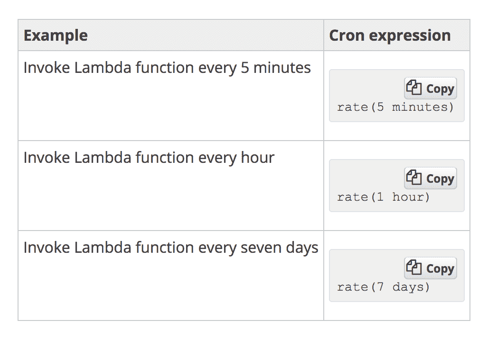

# 一、无服务器模式

很可能，如果您正在阅读本书，您已经听说过无服务器范例以及术语无服务器工程和无服务器架构。如今，由于**基于事件的架构设计**，也称为**无服务器架构**，开发人员部署应用的方式发生了巨大变化，尤其是在数据工程和 web 开发领域。

在服务器工作负载完成或等待下一个工作负载到来后，生产环境中的空闲资源和服务器处于空闲状态的情况并不少见。这在基础设施中引入了一些冗余。如果在没有工作负载的情况下不需要闲置的资源，该怎么办？如果资源可以在必要时创建，并在工作完成后销毁，该怎么办？

在本章的末尾，您将了解无服务器体系结构和服务功能是如何工作的，以及如何将它们构建到现有的软件基础架构中。您还将了解什么是微服务，并决定微服务或无服务器操作是否适合您的体系结构。您还将学习如何在主要云服务提供商上使用 Python 构建无服务器应用，例如**亚马逊 Web 服务**（**AWS**）和**微软 Azure**。

本章将涵盖以下几点：

*   理解无服务器架构
*   理解微服务
*   无服务器架构不必是实时的
*   无服务器体系结构的优缺点

# 理解无服务器架构

无服务器架构或无服务器工程的概念完全围绕着理解功能即服务的概念。互联网上无服务器计算最技术、最准确的定义如下：

"Serverless computing, also known as **function as a service** (**FAAS**), is a cloud computing and code execution model in which the cloud provider fully manages starting and stopping of a function's container **platform as a service** (**PaaS**)."

现在，让我们深入了解该定义的每个部分的细节，以便更好地理解无服务器计算的范例。我们将从术语“作为服务的功能”开始。这意味着每个无服务器模型都有一个在云上执行的功能。这些函数只不过是代码块，根据与函数关联的触发器执行。这是 AWS Lambda 环境中触发器的完整列表：

现在让我们了解是什么管理函数的启动和停止。每当通过这些可用触发器之一触发函数时，云提供程序就会启动一个容器，在其中执行该函数。此外，在函数成功执行后，函数返回了一些内容，或者如果函数已用完时间，则容器将被丢弃或销毁。盖上茅草屋顶，以便在需求量大的情况下以及两次触发之间的时间很短的情况下，容器可以重复使用。现在，我们进入句子的下一部分，函数的容器。这意味着函数是在容器中启动和执行的。这是 Docker 对集装箱的标准定义，Docker 是一家使集装箱概念非常流行的公司：

"A container image is a lightweight, stand-alone, executable package of a piece of software that includes everything needed to run it: code, runtime, system tools, system libraries, settings."

这有助于将函数的代码、运行时环境等打包到单个部署包中，以便无缝执行。**部署包**包含函数的主代码文件，函数执行所需的所有非标准库。部署包的创建过程与 Python 中虚拟环境的创建过程非常相似。

因此，我们可以清楚地看出，在无服务器基础设施的情况下，没有服务器 24 小时运行。这有一个明显的好处，包括没有专门的 Ops 团队成员来监控服务器盒。所以额外的成员，如果有的话，可以专注于更好的事情，比如软件研究，等等。不让服务器整天运行为公司和/或个人节省了大量资金和资源。这一好处在机器学习和数据工程团队中可以非常清楚地看到，他们在日常工作中使用 GPU 实例。因此，运行按需无服务器 GPU 实例可以节省大量资金，而无需开发人员或 Ops 团队 24 小时对其进行维护。

# 理解微服务

与无服务器的概念类似，面向微服务的设计策略最近也非常流行。这种架构设计在无服务器概念出现之前存在了很长一段时间。正如我们试图从互联网上的技术定义来理解无服务器架构一样，我们也将尝试对微服务进行同样的理解。微服务的技术定义是：

"Microservices, also known as the **microservice architecture**, is an architectural style that structures an application as a collection of loosely coupled services, which implement business capabilities."

以微服务的形式规划和设计体系结构有其积极和消极的一面，就像无服务器体系结构一样。了解这两个方面很重要，以便理解在现有体系结构中何时以及何时不利用微服务。让我们先看看这一点，了解微服务体系结构的优点，然后再讨论其缺点。

微服务帮助软件团队保持敏捷，并逐步改进。更简单地说，由于服务彼此分离，因此升级和改进服务非常容易，而不会导致另一个服务下降。例如，在社交网络软件中，如果聊天和订阅源都是微服务，那么当软件团队试图升级或对聊天服务进行小的修复时，订阅源就不必关闭。然而，在大型单片系统中，很难像使用微服务那样轻松地分解事物。因此，即使是对体系结构的一个小组件进行任何修复或升级，都会导致停机，修复所花费的时间比预期的要长。

在任何小故障的情况下，单片体系结构的代码库本身的巨大规模都会阻碍进展。另一方面，微服务通过保持代码库的精简极大地帮助提高了开发人员的生产率，因此它们可以在很少或没有开销和停机的情况下修复和改进服务。通过容器可以更好地利用微服务，容器提供了有效和完整的虚拟操作系统环境、隔离的进程以及对底层硬件资源的专用访问。

然而，微服务也有其自身的一系列缺点和缺点，主要的缺点是必须处理分布式系统。既然每个服务都是独立存在的，那么架构师需要弄清楚每个服务是如何与其他服务交互的，以便生成一个功能齐全的产品。因此，服务之间的适当协调以及关于服务如何在它们之间移动数据的决策是架构师需要做出的一个非常困难的选择。主要的分布式问题，如*共识*、*CAP 定理*、*保持共识的稳定性*、*连接*等，都是工程师在构建微服务时需要处理的一些问题。确保和维护安全性也是分布式系统和微服务中的一个主要问题。您需要为每个微服务确定单独的安全模式和层，以及服务之间发生数据交互所需的安全决策。

# 无服务器架构不必是实时的

无服务器架构通常被用作实时系统，因为它们作为*功能即服务*工作，由一组可用触发器触发。然而，这是一个非常常见的误解，因为无服务器系统可以像实时和批处理体系结构一样很好地利用。了解如何利用无服务器系统作为批处理体系结构的概念将打开许多工程可能性，因为所有工程团队不一定需要或拥有实时系统来运行。

无服务器系统可以通过利用以下功能进行批处理：

*   触发器中的 cron 工具
*   队列的概念

首先，让我们了解触发器中的**cron 工具**的概念。云上的无服务器系统能够设置监视，这使得触发器能够每隔几分钟或几小时触发一次，并且可以设置为正常的 cron 作业。这有助于利用无服务器的概念作为常规的 cron 批处理作业。在 AWS 环境中，可以通过 AWS CloudWatch 将 Lambda 作为 cron 触发，方法是手动输入时间间隔作为输入，并以 cron 格式输入间隔，以设置 cron 的频率：

在构建无服务器批处理体系结构时，还可以利用队列的概念。让我们通过设置一个示例数据管道来理解这一点。假设我们打算构建的系统执行以下任务：

1.  用户或服务将一些数据发送到数据库或更简单的数据存储中，如 AWS 的 S3。
2.  一旦我的数据存储中有 100 多个文件，我们就需要执行一些任务。比如说，对它们进行一些分析，比如计算页面数。

这可以通过队列来实现，这是我们可以考虑的一个简单的无服务器系统。因此，这可以通过以下方式实现：

1.  用户或服务将数据上传或发送到我们选择的数据存储区。
2.  为此任务配置了一个队列。
3.  可以将事件配置为 S3 存储桶或数据存储，这样，一旦数据进入存储，就会向我们前面配置的队列发送消息。
4.  可以设置监视系统来监视队列中的消息数。建议使用您正在使用的云提供商的监控系统，以便系统保持完全无服务器。
5.  可以为监控系统设置报警，为这些报警配置阈值。例如，只要队列中的消息数达到或超过 100，就需要触发警报。
6.  此警报可作为 Lambda 函数的触发器，Lambda 函数通过首先从队列接收消息，然后使用从消息接收的文件名查询数据存储来执行分析。
7.  一旦完成对文件的分析，处理后的文件可以推送到另一个数据存储区进行存储。
8.  整个任务完成后，运行 Lambda 函数的容器或服务器将终止，从而使此管道完全无服务器。

# 无服务器的利弊

随着我们现在了解无服务器体系结构和管道的外观，如何将其应用到现有体系结构中，以及微服务如何帮助保持体系结构精简并提高开发人员的生产效率，我们将详细了解无服务器系统的优缺点，因此，软件开发人员和架构师可以决定何时将无服务器模式应用到现有系统中，何时不应用。

无服务器系统的优点是：

*   **降低基础设施成本**：通过部署无服务器系统，基础设施成本可以大大优化，因为不需要服务器每天 24 小时运行。由于服务器在函数触发时启动，在函数成功执行时停止，因此计费只会在函数运行的短暂时间段内进行。
*   **所需维护较少**：由于上述原因，也不需要对服务器进行持续监控和维护。由于功能和触发器是自动化的，因此无服务器系统几乎不需要维护。
*   **更高的开发效率**：由于开发人员不需要担心停机时间和服务器维护，他们可以专注于更好的软件挑战，如扩展和设计功能。

本书的剩余部分将向您展示无服务器系统如何改变软件的运行方式。因此，由于本章旨在帮助架构师决定无服务器系统是否是其体系结构的良好选择，我们现在将看看无服务器系统的缺点。

无服务器系统的缺点是：

*   **功能的时间限制**：无论是 AWS 的 Lambda 还是 GCP 的云功能，无论是执行还是执行，都有 5 分钟的时间上限。这使得执行繁重的计算变得不可能。但是，这可以通过在 nohup 模式下执行资源调配工具的 playbook 来解决。本章后面将详细介绍这一点。但是，应在 5 分钟的时间限制内完成剧本准备、容器设置和其他任何操作。当超过 5 分钟限制时，容器将自动终止。
*   **无法控制容器环境**：开发人员无法控制为执行功能而创建的容器的环境。操作系统、文件系统等都由云提供商决定。例如，AWS 的 Lambda 函数在运行 Amazon Linux 操作系统的容器中执行。
*   **监控容器**：除了云提供商通过其内部监控工具提供的基本监控功能外，没有机制对正在执行无服务器功能的容器进行详细监控。当扩展无服务器系统以适应分布式系统时，这变得更加困难。
*   **不控制安全**：由于对容器环境的控制非常少，因此无法控制如何确保数据流的安全性。该容器可以在开发人员选择的 VPC 和子网中运行，这有助于克服这一缺点。

然而，无服务器系统可以扩展到分布式系统，用于大规模计算，开发者不必担心时间限制。如前所述，这将在接下来的章节中详细讨论。然而，对于如何选择无服务器系统而不是单片系统进行大规模计算的直觉，让我们了解一些在做出架构决策时需要牢记的重要指针。

在将无服务器系统扩展到分布式系统时，要记住以下几点：

*   要将无服务器系统扩展为无服务器分布式系统，必须了解 nohup 的概念是如何工作的。它是一个**POSIX**命令，允许程序和进程在后台运行。
*   应正确记录 Nohup 进程，包括输出和错误日志。这是流程的唯一信息源。
*   需要利用**Ansible**或**Chef**等供应工具或类似工具来创建一个 master workers 体系结构，该体系结构是通过正在执行无服务器功能的容器中以 nohup 模式运行的 playbook 生成的。
*   确保通过主服务器由配置工具执行的所有任务都得到适当的监视和记录是一种良好的做法，因为一旦整个设置完成执行，就无法检索日志。
*   需要使用云提供商提供的临时凭证设施来确保适当的安全性。
*   应确保系统正确关闭。工作人员和主控人员应在任务管道完成执行后立即自行终止。这是非常重要的，这是使系统无服务器的原因。
*   通常，临时凭据会有一个到期时间，对于大多数环境，该时间为 3600 秒。因此，如果开发人员正在使用临时凭据执行一项任务，而该任务的执行时间本应超过到期时间，则存在凭据过期的危险。
*   调试分布式无服务器系统是一项极其困难的任务，原因如下：
    *   监视和调试 nohup 进程非常困难。每当您想要调试一个进程时，您必须引用该进程创建的日志文件，或者使用进程 ID 终止 nohup 进程，然后手动运行脚本进行调试。
    *   由于任务的完整列表在 provisioning tool 中按顺序执行，因此存在实例可能被终止的危险，因为开发人员在启动调试过程之前忘记了终止 nohup 过程。
    *   由于这是一个分布式系统，不用说，该体系结构应该能够在任何故障或灾难的情况下自我修复。一个示例场景是，其中一个工作人员在对一组文件执行某些操作时停机。所有文件现在都丢失了，并且没有恢复的方法。
    *   另一个高级灾难场景可能是两台工作服务器在对一组文件执行某些操作时停机。在这种情况下，开发人员不知道哪些文件已成功执行，哪些文件未成功执行。
*   一个好的做法是确保所有工作实例都能收到等量的要执行的负载，以便整个分布式系统的负载保持均匀，时间和资源得到很好的优化。

# 总结

在本章中，我们了解了什么是无服务器体系结构。最重要的是，本章帮助架构师确定无服务器是否是其团队和工程的前进方向，以及如何从现有基础架构过渡/迁移到无服务器模式。我们还研究了微服务的范例，以及它们如何帮助构建轻量级和高度敏捷的体系结构。本章还详细介绍了团队何时应该开始考虑微服务，以及何时可以将现有的整体迁移或分解为微服务。

然后，我们学习了在无服务器域中构建批处理体系结构的艺术。最常见的误解之一是，无服务器系统仅用于实时计算目的。然而，我们也学会了如何利用这些系统进行批处理计算，从而使用无服务器模式简化了大量应用。我们研究了无服务器的利弊，以便做出更好的工程决策。

在下一章中，我们将非常详细地了解 AWS Lambda 的工作原理，它是 AWS 云环境中无服务器工程的核心组件。我们将了解触发器如何工作以及 AWS Lambda 函数如何工作。您将了解利用容器执行无服务器函数的概念以及相关的计算工作负载。接下来，我们还将学习如何配置和测试 Lambda 函数，以及在配置和测试 Lambda 函数时了解最佳实践。我们还将介绍 Lambda 函数的版本控制，就像在代码中进行版本控制一样，然后为 AWS Lambda 创建部署包，以便开发人员能够轻松地容纳第三方库以及标准库。