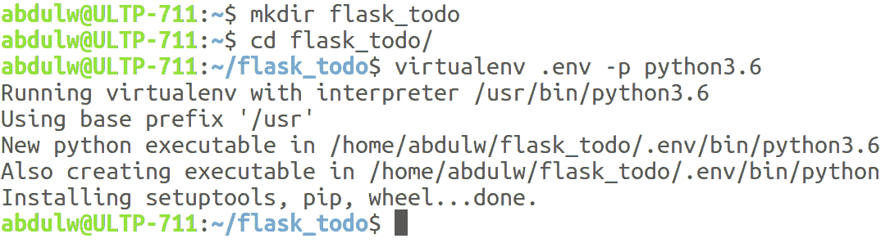
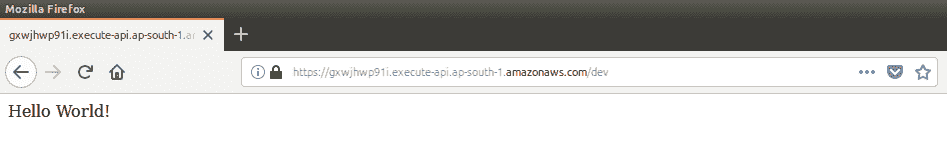
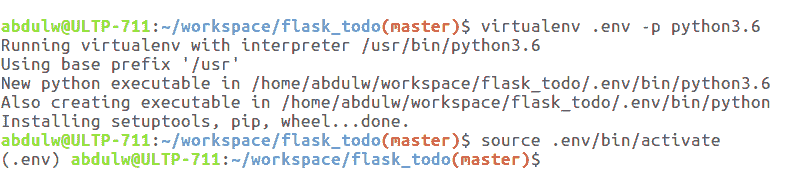
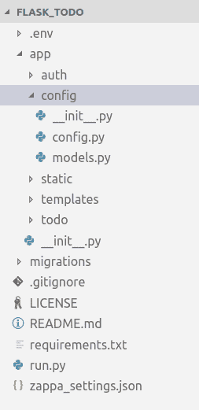
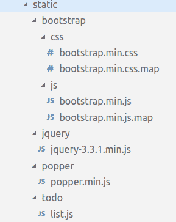
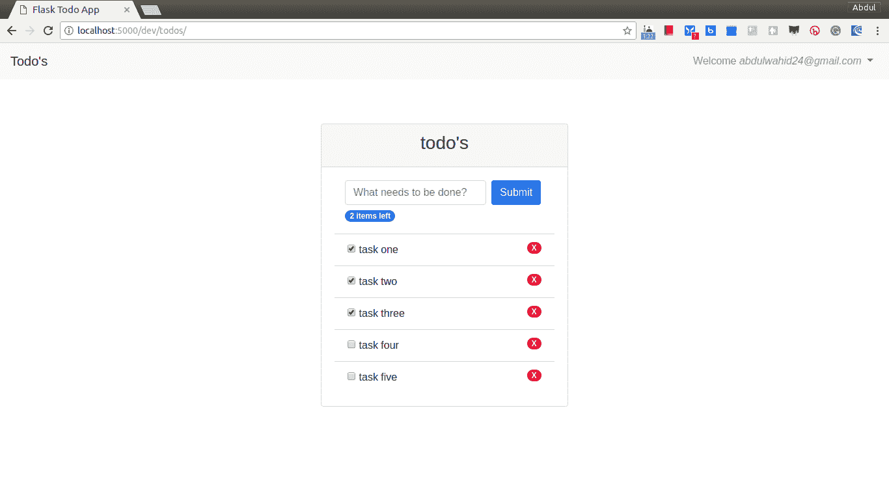
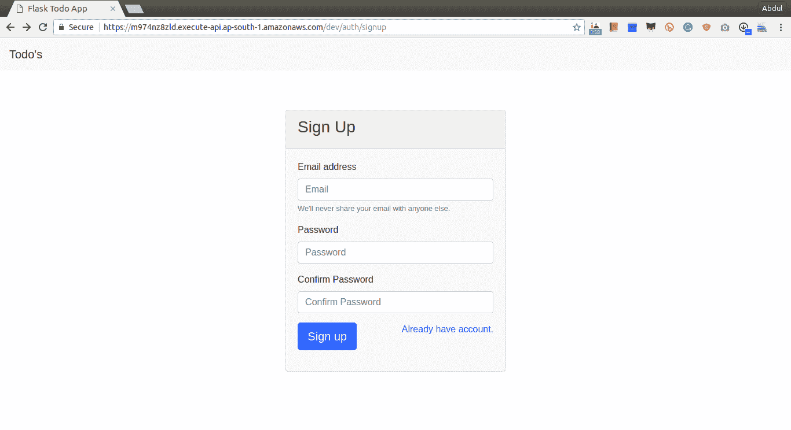

# 使用 Zappa 构建烧瓶应用程序

在上一章中，我们学习了使用 Zappa 自动化部署过程，因为 Zappa 帮助我们在 AWS 无服务器基础设施上部署 Python 应用程序。我们使用它来开发一个使用一些 pythonweb 框架的 Python 应用程序。在本章中，我们将开发一个基于 Flask 的应用程序，作为 AWS Lambda 上的无服务器应用程序。

在上一章中，我们了解了 Zappa 如何用于执行无服务器部署，以及它如何使使用单个命令进行部署变得容易。现在，是时候看看 Zappa 部署的更大的应用程序了，因为了解如何配置应用程序并将其移动到 AWS Lambda 非常重要。

在本章中，我们将介绍以下主题：

*   什么是烧瓶？
*   最小烧瓶应用
*   使用 Zappa 配置
*   在 AWS Lambda 上构建、测试和部署
*   一个完整的 Todo 应用程序

# 技术要求

在取得进展之前，让我们先了解技术需求并配置开发环境。本章对应用程序开发进行了概念性演示。因此，有一些先决条件：

*   Ubuntu 16.04/macOS/Windows
*   Python 3.6
*   Pipenv 工具
*   扎帕
*   瓶子
*   烧瓶加长件

一旦配置了 Python 3.6 并安装了 Pipenv 工具，就可以创建虚拟环境并安装这些软件包。我们将在后面的一节中探讨此功能的安装和配置。让我们继续了解基于 Python 的框架及其相关实现的一些基本概念。

# 什么是烧瓶？

Flask 是 Python 社区中著名的 Python micro web 框架。由于它的可扩展性，它被采用并且更可取。Flask 旨在保持代码简单但可扩展。

默认情况下，Flask 不包括任何数据库抽象层、表单验证或任何其他特定功能。相反，Flask 支持向应用程序添加任何定义良好的功能的扩展。许多扩展可用于提供数据库集成、表单验证、文件上载处理、身份验证等。Flask 核心团队审查扩展并确保它们不会破坏未来的版本。

Flask 允许您根据应用程序需要定义设计。你不必遵守严格的规章制度。您可以在单个文件中或以模块化方式编写应用程序代码。Flask 支持内置的开发服务器和快速调试器、单元测试、RESTful 请求调度、Jinja2 模板和安全 cookie（用于客户端会话），所有这些都是符合 WSGI 1.0 且基于 Unicode 的。

这就是为什么 Python 社区中的许多人喜欢使用 Flask 框架作为他们的首选。让我们继续探索基于 Flask 的应用程序开发过程，并结合实际实现和无服务器方法。

# 安装烧瓶

Flask 主要依赖于两个外部库，如 Werkzeug 和 Jinja2。Werkzeug 提供了 Python 标准**WSGI**（**Web 服务器网关接口**），使 Python 应用程序能够与 HTTP 交互。Jinja2 是一个模板引擎，使您能够使用自己的自定义上下文呈现 HTML 模板。

现在，让我们继续安装烧瓶。其所有依赖项将自动安装；您不需要手动安装依赖项。

建议您使用`virtualenv`安装 Flask，因为`virtualenv`允许您为不同的 Python 项目并行安装 Python 包。

如果您没有`virtualenv`，则只需使用以下代码安装即可：

```py
$ sudo apt-get install python-virtualenv
```

安装`virtualenv`后，您需要为您的 Flask 项目创建一个新环境，如以下屏幕截图所示：



我们将在接下来的章节中使用`virtualenv`。现在，让我们安装 Flask：

```py
$ pip install flask
```

我们已经准备好玩烧瓶了。我们将创建一个最小的 Flask 应用程序来演示 Flask 应用程序工作流。

# 最小烧瓶应用

让我们看看最小烧瓶应用程序是什么样子的：

```py
from flask import Flask
app = Flask(__name__)
@app.route('/')
def index():
  return 'Hello World!'
```

就这样，我们完成了最小烧瓶应用程序。使用 Flask 配置和创建微服务非常简单。

让我们讨论一下前面的代码到底在做什么，以及如何运行程序：

1.  首先，我们导入了一个 Flask 类。
2.  接下来，我们创建了 Flask 类的一个实例。这个实例将是我们的 WSGI 应用程序。第一个参数是模块或包的名称。在这里，我们创建了一个模块，因此我们使用了`__name__`。这是必需的，以便 Flask 知道在哪里查找模板、静态目录和其他目录。
3.  然后，我们使用`app.route`作为装饰器，并使用 URL 名称作为参数。这将定义并映射具有指定功能的路线。
4.  将使用路由装饰器中指定的 URL 对 HTTP 请求调用该函数。

要运行此程序，您可以使用`flask`命令或`python -m flask`，但在此之前，您需要将环境变量设置为`FLASK_APP`，其中包含定义 Flask 实例的模块文件名：

```py
$ export FLASK_APP=hello_world.py
$ flask run
* Serving Flask app "flask_todo.hello_world"
* Running on http://127.0.0.1:5000/ (Press CTRL+C to quit)
```

这将启动一个内置服务器，该服务器足以在本地进行测试和调试。以下是在浏览器中运行的本地主机的屏幕截图：


当然，它不能用于生产，但 Flask 提供了许多部署选项。你可以看看[http://flask.pocoo.org/docs/0.12/deploying/#deployment](http://flask.pocoo.org/docs/0.12/deploying/#deployment) 了解更多信息，但在我们的案例中，我们将使用 Zappa 在 AWS Lambda 和 API 网关上部署到无服务器环境。

# 使用 Zappa 配置

如前一章所述，为了配置 Zappa，需要安装 Zappa。Zappa 提供了`zappa init`命令，该命令启用用户交互模式初始化，以便我们可以配置 Python 应用程序。

我遵循了`zappa init`命令建议的默认配置设置。这将生成`zappa_settings.json`文件，它是使用 Zappa 配置任何 Python 应用程序的主干。

以下是`zappa_settings.json`文件的内容：

```py
{
  "dev": {
      "app_function": "hello_world.app",
      "aws_region": "ap-south-1",
      "profile_name": "default",
      "project_name": "flask-todo",
      "runtime": "python3.6",
      "s3_bucket": "zappa-yrze3w53y"
  }
}
```

现在，在初始化期间，Zappa 能够识别 Python 应用程序的类型并相应地生成 set 属性。在我们的例子中，Zappa 将 Python 程序检测为 Flask 应用程序。因此，它要求提供 Flask 实例路径，我们在`hello_world.py`文件中将其初始化为`app = Flask(__name__)`。

现在，Zappa 配置已经按照我们的基本需求完成，现在是在 AWS Lambda 上部署它的时候了。

# 在 AWS Lambda 上构建、测试和部署

在上一章中，我们用一些基本命令描述了 Zappa 的基本用法。使用这些命令，我们可以构建部署包、部署应用程序以及执行其他基本操作。

一旦有了包含所有有效属性的`zappa_settings.json`文件，就可以使用`zappa deploy <stage_name>`命令启动部署过程。根据我们的`zappa_settings.json`文件，我们有一个阶段定义为`dev`，因此，要开始部署，我们可以运行`deploy`命令，如下代码所示：

```py
$ zappa deploy dev
```

以下屏幕截图描述了部署流程：


一旦 Zappa 部署完成，它将生成一个随机 API 网关端点。Zappa 根据`zappa_settings.json`文件，用 API 网关配置 AWS Lambda。

现在，Flask 应用程序可通过先前生成的 API 获得。让我们测试一下，看看 Hello World！烧瓶应用程序的响应。您可以在浏览器中点击 URL，如以下屏幕截图所示：



现在，让我们转到下一节，看看使用 Flask 框架进行的应用程序开发。

# 一个完整的 Todo 应用程序

正如我们所看到的那样，Zappa 使部署 Flask 应用程序变得非常容易，现在是时候看看我们在开发基于 Flask 的应用程序时可能需要的完整工作流了。我们将开发一个基于 Flask 的模块化应用程序，其中每个功能都是一个独立的模块，例如身份验证、Todo 应用程序等等。

认证模块将负责维护认证和授权机制。它还将包括登录和注册过程的实现。

鉴于`todo`模块将有 todo 操作的基本实现，此操作流将由认证模块授权。在 Flask 扩展的帮助下，我们将管理和配置这些模块。除了这些核心模块之外，我们还将看到与用户界面、数据库配置和静态文件集成相关的实现。

# 先决条件

为了建立开发环境，我们需要执行一些与`virtualenv`和所需包相关的配置。

# 虚拟的

在开始项目之前，让我们创建一个虚拟环境并启用它，如以下屏幕截图所示：



# 烧瓶加长件

Flask 是一个微框架，但它具有可扩展性，您可以根据需要添加更多功能。要开发 Todo 应用程序，我们可能需要一些基本功能，例如数据持久性和用户身份验证机制。因此，在处理烧瓶应用程序时，我们将使用一些烧瓶扩展。

Flask 注册表提供了许多扩展，它们是独立的包，您可以使用 Flask 应用程序实例轻松地配置它们。您可以在以下位置查看烧瓶扩展的完整列表：[http://flask.pocoo.org/extensions/](http://flask.pocoo.org/extensions/) 。

我们将使用以下烧瓶和烧瓶扩展包：

*   `Flask == 0.12.2`
*   `Flask-Login == 0.4.0`
*   `Flask-SQLAlchemy == 2.3.2`
*   `Flask-WTF == 0.14.2`
*   `Flask-Migrate == 2.1.1`

我建议将这些软件包列在一个名为`requirements.txt`的单独文件中，然后一次性安装，如下所示：

```py
pip install -r requirements.txt
```

这将安装列出的所有软件包及其依赖项。

# 脚手架

在从头开始实施任何项目时，您可以自由地设计项目的脚手架。我们将遵循以下屏幕截图中显示的脚手架：



让我们详细了解每个目录及其用途：

*   `.env`：这是我们的`virtualenv`目录，由`virtualenv`命令创建。
*   `auth`：我们将使用`Flask-Login`和`Flask-SqlAlchemy`扩展创建一个独立的通用身份验证模块。
*   `config`：在这里，我们将创建一些其他模块可能需要的配置和通用数据库模型。
*   `static`：将静态内容放在`static`目录下是烧瓶的标准做法。因此，我们将对所有必需的静态内容使用此目录。
*   `templates`：Flask 内置了对 Jinja2 模板引擎的支持，并根据模块名称遵循模板文件的标准布局。稍后，当我们实际使用模板时，我们将看到对此的详细描述。
*   `todo`：这是一个独立的烧瓶模块或包，具有基本的待办事项功能。
*   `__init__.py`：这是 Python 的标准文件，需要在目录下创建 Python 包。我们将在这里编写代码来配置我们的应用程序。
*   `migrations`：此目录由`Flask-Migrate`自动生成。在未来的一节中，我们将看到`Flask-Migrate`是如何工作的。
*   `.gitignore`：包含 Git 版本控制应忽略的文件和目录列表。
*   `LICENSE`：我已经使用 GitHub 创建了一个 Git 存储库，并为我们的`flask_todo`存储库提供了 MIT 许可证。
*   `README.md`：此文件用于描述 GitHub 上的存储库信息。
*   `requirements.txt`：这是我们列出上一节中提到的所有必需包的文件。
*   `run.py`：在这里，我们将创建 Flask 应用程序的最终实例。
*   `zappa_settings.json`：该文件由 Zappa 生成，具有与 Zappa 相关的配置。

在接下来的章节中，我们将详细介绍该代码。

# 配置

在实现任何项目时，我们可能需要一些特定于不同环境的配置，例如在开发环境中切换调试模式，在生产环境中进行监视。

Flask 具有克服配置处理机制的灵活方法。Flask 在其实例上提供一个`config`对象。此`config`对象是通过扩展 Python`dictionary`对象而构建的，但具有一些附加功能，如从文件、对象和默认内置配置加载配置。您可以在[查看`config`机构的详细说明 http://flask.pocoo.org/docs/0.12/config/](http://flask.pocoo.org/docs/0.12/config/) 。

为了维护基于环境的配置，我们将创建一个名为`config/config.py`的文件，其代码如下：

```py
import os
from shutil import copyfile

BASE_DIR = os.path.dirname(os.path.dirname(__file__))

def get_sqlite_uri(db_name):
    src = os.path.join(BASE_DIR, db_name)
    dst = "/tmp/%s" % db_name
    copyfile(src, dst)
    return 'sqlite:///%s' % dst

class Config(object):
    SECRET_KEY = os.environ.get('SECRET_KEY') or os.urandom(24)
    SQLALCHEMY_COMMIT_ON_TEARDOWN = True
    SQLALCHEMY_RECORD_QUERIES = True
    SQLALCHEMY_TRACK_MODIFICATIONS = False

    @staticmethod
    def init_app(app):
        pass

class DevelopmentConfig(Config):
    DEBUG = True
    SQLALCHEMY_DATABASE_URI = get_sqlite_uri('todo-dev.db')

class ProductionConfig(Config):
    SQLALCHEMY_DATABASE_URI = get_sqlite_uri('todo-prod.db')

config = {
    'dev': DevelopmentConfig,
    'production': ProductionConfig,
}
```

在这里，我们创建了一个`Config`对象作为基类，它具有一些通用配置和`Flask-SqlAlchemy`配置。然后，我们用特定于环境的类扩展了基础`Config`类。最后，我们创建了一个映射对象，我们将使用前面提到的键。

# 基本模型

SQLAlchemy 最著名的是它的**对象关系映射器**（**ORM**），这是一个可选组件，提供数据映射器模式，其中类可以以开放的、多种方式映射到数据库，允许对象模型和数据库模式从一开始就以完全解耦的方式开发。我们在这里使用`Flask-SQLAlchemy`扩展，它扩展了 SQLAlchemy 的支持。`Flask-SQLAlchemy`增强了可能需要与烧瓶应用程序集成的功能。

我们将结合使用`Flask-SQLAlchemy`进行交互所需的通用 SQL 操作。因此，我们将创建一个基本模型类，并将该类用于其他模块的模型类。这就是我们把它放在`config`目录下的原因。这是`models.py`文件。

文件-`config/models.py`：

```py
from app import db

class BaseModel:
    """
    Base Model with common operations.
    """

    def delete(self):
        db.session.delete(self)
        db.session.commit()

    def save(self):
        db.session.add(self)
        db.session.commit()
        return self
```

您可以在这里看到，我们对所有模型所需的数据库操作进行了分组。`db`实例是使用`Flask-SQLAlchemy`扩展名在`app/__init__.py`文件中创建的。

在这里，我们实现了`save`和`delete`方法。`db.Model`定义一个泛型模式来创建表示数据库表的模型类。为了保存和删除，我们需要遵循一些预定义的操作，例如`db.session.add()`、`db.session.delete()`、`db.session.commit()`。

因此，我们将泛型操作分组在`save`和`delete`方法下。这些方法将从继承它们的模型类调用。我们将在稍后通过扩展`BaseModel`创建模型类时讨论这一点。

# 认证

为了开发身份验证模块，我们将使用`Flask-Login`扩展。`Flask-Login`扩展提供了用户会话管理机制。它处理管理用户会话的常见任务，例如登录、注销和记住用户。

要集成`Flask-Login`，需要创建实例并定义一些默认参数，如下代码段所述：

```py
from flask_login import LoginManager
app             =                 Flask(        __name__        )
    login_manager             =                 LoginManager()
    login_manager.session_protection             =                 'strong'
    login_manager.login_view             =                 'auth.login'
    login_manager.login_message_category             =                 "info"
    login_manager.init_app(app)
```

我们将创建一个身份验证模块作为`auth`包。`auth`包将具有基本脚手架，如下所示：


# 蓝图

在详细描述每个文件之前，让我们先看看实例化机制。如您所知，我们正在`root`模块下创建一个子模块作为独立模块。Flask 介绍了 blueprint 的概念，用于在公共模式下制作子模块组件。

Flask blueprint 实例与 Flask 实例非常相似，但它不是应用程序对象。相反，它能够构造和扩展父应用程序。借助 blueprint，您可以设计一个模块化的应用程序。

以下是`auth/__init__.py`文件中`Blueprint`实例化的代码片段：

```py
from flask import Blueprint
auth = Blueprint('auth', __name__)
from . import views
```

如您所见，它与`Flask`类具有非常相似的特性，并且遵循类似的模式。现在，我们将在视图中使用`blueprint`的`auth`实例来注册路由。要执行应用程序，我们需要将`blueprint`对象与 Flask 应用程序实例绑定。

下面是`app/__init__.py`文件中的代码片段，我们将在其中创建 Flask 应用程序实例：

```py
from .auth import auth as auth_blueprint
from app.config import config

app = Flask(__name__)
app.config.from_object(config[environment])

app.register_blueprint(auth_blueprint, url_prefix='/auth')
```

借助于`register_blueprint`方法，我们正在注册`auth`模块蓝图，我们还可以添加 URL 前缀。在我们看了`todo`模块说明之后，我们将有这个文件的完整描述。

# 模型

让我们从创建具有基本功能的`User`模型开始。以下是用户模型的代码片段。

文件-`auth/models.py`：

```py
import re
from datetime import datetime

from app.config.models import BaseModel
from flask_login.mixins import UserMixin
from sqlalchemy.orm import synonym
from werkzeug.security import generate_password_hash, check_password_hash
from app import db
from app import login_manager

class User(UserMixin, BaseModel, db.Model):
    __tablename__ = 'user'
    id = db.Column(db.Integer, primary_key=True)
    _email = db.Column('email', db.String(64), unique=True)
    password_hash = db.Column(db.String(128))

    def __init__(self, **kwargs):
        super(User, self).__init__(**kwargs)

    def __repr__(self):
        return '<User {0}>'.format(self.email)

    @property
    def email(self):
        return self._email

    @email.setter
    def email(self, email):
        if not len(email) <= 64 or not bool(re.match(r'^\S+@\S+\.\S+$', email)):
            raise ValueError('{} is not a valid email address'.format(email))
        self._email = email

    email = synonym('_email', descriptor=email)

    @property
    def password(self):
        raise AttributeError('password is not a readable attribute')

    @password.setter
    def password(self, password):
        if not bool(password):
            raise ValueError('no password given')

        hashed_password = generate_password_hash(password)
        if not len(hashed_password) <= 128:
            raise ValueError('not a valid password, hash is too long')
        self.password_hash = hashed_password

    def verify_password(self, password):
        return check_password_hash(self.password_hash, password)

    def to_dict(self):
        return {
            'email': self.email
        }

@login_manager.user_loader
def load_user(user_id):
    return User.query.get(int(user_id))
```

现在，我们已经创建了`User`模型，但它如何与`Flask-Login`扩展关联或映射？答案是`load_user`方法，由`login_manager.user_loader`装饰器包装。Flask 提供了将用户加载到会话中的方法。使用会话中存在的`user_id`调用此方法。

我们可以借助`User`模型将用户数据持久化到数据库中。作为 web 应用程序，用户数据需要通过用户界面（如 HTML）输入。根据我们的要求，我们需要两种类型的 HTML 表单用于登录和注册功能。

让我们继续下一节，学习如何通过 Flask 呈现 HTML 表单。

# 形式

`Flask-WTF`扩展提供了在 Flask 中开发表单并通过 Jinja2 模板呈现表单的能力。`Flask-WTF`扩展了`WTForms`库，该库具有设计表单的标准模式。

我们需要两种形式，例如`SignupForm`和`LoginForm`。下面是创建表单类的代码。

文件-`auth/forms.py`：

```py
from flask_wtf import FlaskForm
from wtforms import StringField, PasswordField, SubmitField
from wtforms.validators import Required, Length, Email, EqualTo

class LoginForm(FlaskForm):
    email = StringField(
        'Email', validators=[Required(), Length(1,64), Email()]
    )
    password = PasswordField(
        'Password', validators=[Required()]
    )
    submit = SubmitField('Log In')

class SignupForm(FlaskForm):
    email = StringField(
        'Email', validators=[Required(), Length(1,64), Email()]
    )
    password = PasswordField(
        'Password', validators=[
            Required(),
            EqualTo('confirm_password', message='Password must match.')]
    )
    confirm_password = PasswordField(
        'Confirm Password', validators=[Required()]
    )
    submit = SubmitField('Sign up')
```

这里，我们通过一些验证来创建表单。现在，我们将在视图部分使用这些表单，在这里我们将呈现模板以及表单上下文。

# 意见

Flask 以一种非常灵活的方式实现了这些视图，您可以随视图一起定义路由。Flask 的通用视图实现受 Django 的通用视图的启发。我们将在下一节中详细介绍方法视图，但在这里，我们将使用简单视图。

以下是视图片段。

文件-`auth/views.py`：

```py
from flask import render_template, redirect, url_for
from flask_login import login_user, login_required, logout_user

from app.auth import auth
from app.auth.forms import LoginForm, SignupForm
from app.auth.models import User

@auth.route('/login', methods=['GET', 'POST'])
def login():
    form = LoginForm()
    if form.validate_on_submit():
        user_by_email = User.query.filter_by(email=form.email.data).first()
        if user_by_email is not None and user_by_email.verify_password(form.password.data):
            login_user(user_by_email)
            return redirect(url_for('todo.list'))
    return render_template('auth/login.html', form=form)

@auth.route('/signup', methods=['GET', 'POST'])
def signup():
    form = SignupForm()
    if form.validate_on_submit():
        if not User.query.filter_by(email=form.email.data).scalar():
            User(
                email = form.email.data,
                password = form.password.data
            ).save()
            return redirect(url_for('auth.login'))
        else:
            form.errors['email'] = 'User already exists.'
            return render_template('auth/signup.html', form=form)
    return render_template('auth/signup.html', form=form)

@auth.route('/logout')
@login_required
def logout():
    logout_user()
    return redirect(url_for('auth.login'))
```

在这里，我们创建了`/login`、`/signup`和`/logout`路由，我们根据 HTTP 请求调用这些路由。我们正在 HTTP`GET`请求上呈现一个空表单实例，并使用`Flask-WTF`方法和`validate_on_submit()`方法处理`POST`请求上的数据。在呈现模板时，我们传递表单实例并根据所需操作重定向。

让我们在下一节中看看模板机制。

# 模板

Flask 内置了对 Jinja2 模板的支持。Jinja2 模板有一个用于呈现 HTML 的标准定义模式。我们可以通过传递上下文参数来放置动态内容。Jinja2 提供了使用一些表达式和条件呈现 HTML 的能力，扩展并包括模板功能。

Flask 遵循标准模板脚手架结构来布置所有模板文件。下面是我们在项目根目录下创建`templates`目录，然后基于其他模块名称创建子目录的步骤：


在这里，我们根据模块创建了模板，并将通用模板放在根目录下。

同样，我们维护了静态文件的脚手架：



我们保存了静态库和模块相关文件。借助于`url_for`方法，我们可以得到任何静态文件和路由的相对路径。因此，在下面的模板中，我们使用`url_for`方法包括所有静态文件，例如`<link rel="stylesheet" href="{{ url_for('static', filename='bootstrap/css/bootstrap.min.css')}}">`。

同样，我们将在基本模板中包含所有静态文件。

文件-`templates/base.html`：

```py
<!DOCTYPE html>
<html lang="en">
<head>
    <meta charset="UTF-8">
    <meta name="viewport" content="width=device-width, initial-scale=1.0">
    <meta http-equiv="X-UA-Compatible" content="ie=edge">
    <meta name="csrf-token" content="{{ csrf_token() }}">
    <meta name="author" content="AbdulWahid AbdulHaque">
    <title>Flask Todo App</title>

    <link rel="stylesheet" href="{{ url_for('static', filename='bootstrap/css/bootstrap.min.css') }}">
    <link rel="stylesheet" href="{{ url_for('static', filename='bootstrap/css/bootstrap.min.css.map') }}">
    

    <script type="text/javascript" src="{{ url_for('static', filename='jquery/jquery-3.3.1.min.js')}}"></script>
    <script type="text/javascript" src="{{ url_for('static', filename='bootstrap/js/bootstrap.min.js')}}"></script>
    <script type="text/javascript" src="{{ url_for('static', filename='popper/popper.min.js')}}"></script>
    
</head>
<body>
    
    
    <script type="text/javascript">
        $('.dropdown-toggle').dropdown();
    </script>
</body>
</html>
```

我们定义了所有其他模板所需的所有通用 HTML。我们还创建了一个基本的引导导航栏，并将其保存在`navbar.html`中，由``包含在`base.html`模板中。如您所见，Jinja2 模板使维护模板和提供标准模式变得非常容易。

下面是`navbar.html`模板的代码片段，我们在其中使用引导 CSS 类创建了一个导航栏。

文件-`templates/navbar.html`：

```py
<nav class="navbar navbar-expand-lg navbar-light bg-light">
    <a class="navbar-brand" href="#">Todo's</a>
    <button class="navbar-toggler" type="button" data-toggle="collapse" data-target="#navbarNavDropdown" aria-controls="navbarNavDropdown" aria-expanded="false" aria-label="Toggle navigation">
      <span class="navbar-toggler-icon"></span>
    </button>
    <div class="collapse navbar-collapse" id="navbarNavDropdown">
        
        <ul class="navbar-nav ml-auto">
            <li class="nav-item dropdown ml-auto">
                <a class="nav-link dropdown-toggle" href="#" id="navbarDropdownMenuLink" data-toggle="dropdown" aria-haspopup="true" aria-expanded="false">
                    Welcome <i>{{ current_user.email }}</i>
                </a>
                <div class="dropdown-menu" aria-labelledby="navbarDropdownMenuLink">
                    <a class="dropdown-item" href="../auth/logout">Logout</a>
                </div>
            </li>
        </ul>
        
    </div>
  </nav>
```

在设计`navbar.html`**时，我们添加了一些条件语句，在用户登录时显示登录用户的信息和注销选项。**

 **让我们转到注册和登录页面。以下是注册页面的代码段。

文件-`templates/auth/signup.html`：

```py



<div class="container align-middle mx-auto" style="width:30%; margin-top:5%">
    <div class="card bg-light mb-3">
        <div class="card-header"><h3>Sign Up</h3></div>
        <div class="card-body">
            <form method="post">
                {{ form.hidden_tag() }}
                
                    
                        <div class="alert alert-danger" role="alert">
                            {{error}}
                        </div>
                    
                  
                <div class="form-group">
                    <label for="exampleInputEmail1">Email address</label>
                    {{ form.email(class_="form-control", id="exampleInputEmail1", placeholder="Email", maxlength=128)}}
                    <small id="emailHelp" class="form-text text-muted">We'll never share your email with anyone else.</small>
                </div>
                <div class="form-group">
                    <label for="exampleInputPassword1">Password</label>
                    {{ form.password(class_="form-control", placeholder="Password") }}
                </div>
                <div class="form-group">
                    <label for="exampleInputPassword">Confirm Password</label>
                    {{ form.confirm_password(class_="form-control", placeholder="Confirm Password") }}
                </div>
                <div class="form-group">
                    {{ form.submit(class_="btn btn-primary btn-lg") }}
                    <a class="float-right" href="login">Already have account.</a>
                </div>
            </form>
        </div>
      </div>
</div>

```

以下是注册页面的输出：


在`auth.signup`视图上的 HTTP`GET`请求中，这将返回一个空表单，并通过`signup.html`模板进行呈现。我们还添加了代码来接收注册视图中 HTTP`POST`请求的注册数据。我们使用`User`模型在注册过程中保存用户数据。

这是登录模板。

文件-`templates/auth/login.html`：

```py



<div class="container align-middle mx-auto" style="width:30%; margin-top:5%">
    <div class="card bg-light mb-3">
        <div class="card-header"><h3>Login</h3></div>
        <div class="card-body">
            <form method="post">
                {{ form.hidden_tag() }}
                
                    <div class="has-error"><strong>Unable to login. Typo?</strong></div>
                  
                <div class="form-group">
                    <label for="exampleInputEmail1">Email address</label>
                    {{ form.email(class_="form-control", id="exampleInputEmail1", placeholder="Email", maxlength=128)}}
                    <small id="emailHelp" class="form-text text-muted">We'll never share your email with anyone else.</small>
                </div>
                <div class="form-group">
                    <label for="exampleInputPassword1">Password</label>
                    {{ form.password(class_="form-control", id="exampleInputPassword1", placeholder="Password") }}
                </div>
                <div class="form-group">
                    {{ form.submit(class_="btn btn-primary btn-lg") }}
                    <a class="float-right" href="signup">New around here? Sign up</a>
                </div>
            </form>
        </div>
      </div>
</div>

```

现在，用户可以继续登录系统，为了登录，我们已经创建了登录表单，并通过`auth.login`视图进行了呈现。以下是登录页面的屏幕截图：


在 HTTP`POST`请求中，我们正在使用`Flask-Login`扩展处理用户登录机制，该扩展提供了一个名为`login_user`的函数并执行登录过程。它创建一个会话并将`user_id`添加到会话中，以记住用户的进一步请求，直到我们将用户从会话中删除或使用`logout_user`方法进行注销，如`auth.logout`视图中所述。

当用户登录成功执行并将用户重定向到其他页面或模板时，身份验证过程在此完成。现在，是时候进入`todo`模块了。

# 待办事项

Todo 程序被认为是一个简单明了的应用程序，它被广泛用于解释 hello world！之后的任何语言或框架！。对于`todo`模块，我们也遵循相同的脚手架结构。

以下是`todo`模块的脚手架截图：


我们来看看`todo`模块中每个文件的详细描述。

# 蓝图

Flask 介绍了 blueprint 的概念，用于在应用程序中或跨多个应用程序开发应用程序组件和命令模式。它通过集中根 Flask 应用程序对象来帮助理解大型应用程序。Blueprint 充当单独的 Flask 应用程序，而不创建实际的 Flask 应用程序对象，并且能够实例化应用程序对象、初始化多个扩展和注册集合。它还提供模板过滤器、静态文件、模板和其他实用程序。

如`auth`模块中所述，我们还将为 Todo 应用程序创建`Blueprint`实例。这将在`app.__init__.py`文件中配置，我们在该文件中创建了 Flask 应用程序实例。

以下是`todo`模块蓝图的代码片段。

文件-`todo/__init__.py`：

```py
from flask import Blueprint

todo = Blueprint('todo', __name__)

from . import views 
```

一旦我们创建了`todo`模块的`blueprint`对象，我们就可以使用它在视图中添加路由，并向 Flask 应用程序实例注册蓝图。

下面是`app/__init__.py`的代码片段，我们将在这里注册`blueprint`：

```py
from .auth import auth as auth_blueprint
from app.config import config

app = Flask(__name__)
app.config.from_object(config[environment])

app.register_blueprint(todo_blueprint, url_prefix='/todos')
```

# 模型

我们将使用`Flask-SQLAlchemy`创建 todo 模型。它将与具有向后引用的`User`模型建立关系，以便我们可以查询与`User`模型相关的`todo`数据。

以下是 todo 模型的代码段。

文件-`todo/models.py`：

```py
from datetime import datetime
from app import db
from app.config.models import BaseModel

class Todo(db.Model, BaseModel):
    __tablename__ = 'todo'
    id = db.Column(db.Integer, primary_key=True)
    title = db.Column(db.String(128))
    is_completed = db.Column(db.Boolean, default=False)
    created_by = db.Column(db.String(64), db.ForeignKey('user.email'))
    user = db.relationship('User', backref=db.backref('todos', lazy=True))

    def __init__(self, title, created_by=None, created_at=None):
        self.title = title
        self.created_by = created_by
        self.created_at = created_at or datetime.utcnow()

    def __repr__(self):
        return '<{0} Todo: {1} by {2}>'.format(
            self.status, self.title, self.created_by or 'None')

    @property
    def status(self):
        return 'finished' if self.is_completed else 'open'

    def finished(self):
        self.is_completed = True
        self.finished_at = datetime.utcnow()
        self.save()

    def reopen(self):
        self.is_completed = False
        self.finished_at = None
        self.save()

    def to_dict(self):
        return {
            'title': self.title,
            'created_by': self.created_by,
            'status': self.status,
        }
```

在这里，我们创建了具有基本功能和验证的 todo 模型。现在，我们将使用此模型来持久化`todo`数据。但是，我们还需要一个用户界面，以便用户输入`todo`数据并执行一些操作。

# 形式

我们将有一个简单的 todo 表单，其中有一个带有提交按钮的文本框。它还应该包含显示 todo 数据的列表视图。

以下是 Todo 表单的代码片段。

文件-`todo/forms.py`：

```py
from flask_wtf import FlaskForm
from wtforms import StringField, SubmitField
from wtforms.validators import Required, Length

class TodoForm(FlaskForm):
    title = StringField(
        'What needs to be done?', validators=[Required(), Length(1, 128)]
    )
    submit = SubmitField('Submit')
```

如您所见，我们的 Todo 表单非常简单，带有一些基本的验证。现在是在视图中使用此表单将其呈现为 HTML 模板的时候了。

# 意见

我们创建了 todo 蓝图的实例，并将使用此实例在视图中创建路由。以下是视图的代码段。

文件-`todo/views.py`：

```py
import json

from flask import render_template, redirect, url_for, jsonify, request
from flask_login import login_required, current_user
from app.todo import todo
from app.todo.forms import TodoForm
from app.todo.models import Todo

@todo.route('/', methods=['GET', 'POST'])
@login_required
def list():
    context = dict()
    form = TodoForm()
    if form.validate_on_submit():
        Todo(form.title.data, created_by=current_user.email).save()
        return redirect(url_for('todo.list'))
    context['form'] = form
    context['todos'] = current_user.todos
    context['items_left'] = len([todo for todo in current_user.todos if not todo.is_completed])
    return render_template('todo/list.html', **context)

@todo.route('/<todo_id>', methods=['DELETE'])
@login_required
def remove(todo_id):
    Todo.query.filter_by(id=int(todo_id)).delete()
    return jsonify({'message': 'Todo removed successfully'})

@todo.route('/<todo_id>', methods=['PATCH'])
@login_required
def update(todo_id):
    data = json.loads([k for k in request.form.keys()][0])
    todo = Todo.query.filter_by(id=int(todo_id)).scalar()
    if data.get('status'):
        todo.finished()
    else:
        todo.reopen()
    return jsonify({'message': 'Todo updated successfully'})
```

我们在这里定义了三条路线。在 Flask 应用程序对象上注册 todo 蓝图时，我们已经使用了`todos`作为前缀。记住这一点，我们决定使用路由 URL。

要持久化 todo 数据，我们需要执行四种类型的操作，即创建 todo 项、列出 todo 项、更新任何特定项和删除任何特定 todo 项。这些操作只不过是**CRUD**（**创建**、**检索**、**更新**、**删除**操作的标准形式。

# 创造

为了创建一个动作，我们决定将 URL 设置为`/`，但如果使用前缀，它将变成`todos/`。在 HTTP`POST`请求中，我们期望用户提供 todo 数据，并基于提交的数据，使用 todo 模型创建 todo 数据，例如`Todo(form.description.data, creator=current_user.email).save()`。

# 检索

在 HTTP`GET`请求中，我们将使用一个上下文呈现模板`todo/list.html`，该上下文将包括表单实例、todo 数据列表和 todo 计数。如前面的代码片段所述，我们获取与用户相关的 todo 数据，如`current_user.todos`，并使用列表补偿过滤数据。然后，我们准备上下文并将其传递给`render_template`方法，以 HTML 格式显示数据。

# 使现代化

为了更新 todo 数据，我们将对路由`todos/<todo_id>`使用 HTTP`PATCH`请求。但是，这一次，我们没有任何表单，需要传递数据，因此我们使用 jQuery 对`PATCH`请求进行 Ajax 查询。

我们定义了一些属性和方法来将 todo 数据标记为已完成，因此基于更新数据，我们将使用这些方法来更新 todo 记录。

# 删去

与从数据库中删除 todo 记录类似，我们需要使用 todo 模型的查询方法，如 `Todo.query.filter_by(id=int(todo_id)).delete()` 。如您所见，布线视图非常简单。现在，让我们看看模板。

# 模板

要完成 todo 工作流，需要做很多工作。定义了`templates/todo/list.html`模板，显示 todo 表单和 todo 记录列表。在上一节中，我们描述了如何呈现和传递上下文数据。

以下是 todo 列表模板的代码段。

文件-`templates/todo/list.html`：

```py


    <script src="{{url_for('static', filename='todo/list.js')}}"></script>


<div class="container align-middle mx-auto" style="width:30%; margin-top:5%">
    <div class="card mb-3">
        <div class="card-header" align="center"><h3>todo's</h3></div>
        <div class="card-body">
            <form method="post" class="form-inline">
                {{ form.hidden_tag() }}
                
                    <div class="has-error"><strong>Invalid task. Typo?</strong></div>
                  
                <div class="form-group ml-3">
                    {{ form.title(class_="form-control", placeholder="What needs to be done?", maxlength=128)}}
                </div>
                <div class="form-group">
                    {{ form.submit(class_="btn btn-primary ml-2") }}
                </div>
            </form>
            <div class="badge badge-pill badge-info ml-3 mt-2">
                {{items_left}} items left
            </div>
            <ul class="list-group list-group-flush mt-3" id="todolist">
                
                <li class="list-group-item" id="{{todo.id}}">
                    <input type="checkbox" aria-label="Checkbox for following text input"  checked >
                    {{todo.title}}
                    <span class="badge badge-danger badge-pill float-right">X</span>
                </li>
                
            </ul>
        </div>
      </div>
</div>

<script>

</script>

```

我们使用上下文数据来显示 todo 表单和记录列表。我们需要为一些操作编写 jQuery 代码，例如基于复选框操作更新 todo，以及基于删除按钮操作删除 todo。

以下是 jQuery 代码片段。

文件-`static/todo/list.js`：

```py
var csrftoken = $('meta[name=csrf-token]').attr('content');
function csrfSafeMethod(method) {
// these HTTP methods do not require CSRF protection
return (/^(GET|HEAD|OPTIONS|TRACE)$/.test(method));
}

$.ajaxSetup({
    beforeSend: function(xhr, settings) {
      if (!csrfSafeMethod(settings.type) && !this.crossDomain) {
        xhr.setRequestHeader("X-CSRFToken", csrftoken);
      }
    }
  });

$(document).ready(function(){

    // Update todo
    $('#todolist li>input[type="checkbox"]').on('click', function(e){
        var todo_id = $(this).parent().closest('li').attr('id');
        $.ajax({
            url : todo_id,
            method : 'PATCH',
            data : JSON.stringify({status: $(this).prop('checked')}),
            success : function(response){
                location.reload();
            },
            error : function(error){
                console.log(error)
            }
        })
    })

    // Remove todo
    $('#todolist li>span').on('click', function(e){
        var todo_id = $(this).parent().closest('li').attr('id');
        $.ajax({
            url : todo_id,
            method : 'DELETE',
            success : function(response){
                location.reload();
            },
            error : function(error){
                console.log(error)
            }
        })
    })
})
```

在发出 Ajax 请求的同时，我们还添加了对 CSRF 的支持。Ajax 请求简单而直接，因为这些请求是通过前面提到的 todo 路由提供的。以下是 todo 列表页面的屏幕截图：



现在，我们已经完成了`todo`模块，现在是时候用 Flask 应用程序对象配置 todo 蓝图了。

# 烧瓶应用程序

在任何 Flask 项目中，我们都会创建 Flask 应用程序对象，并使用`FLASK_APP`参数或环境变量的值引用文件路径。在我们的例子中，我们创建了一个模块化应用程序，它为特定操作定义了单独的模块，但现在我们需要将所有这些模块组合在一个地方。我们已经看到了`blueprint`对象及其集成。在这里，我们将看到结合蓝图和其他所需扩展的实际过程。

下面是 Flask 应用程序对象的代码段。

文件-`app/__init__.py`：

```py
from flask import Flask
from flask_sqlalchemy import SQLAlchemy
from flask_login import LoginManager
from flask_migrate import Migrate
from flask_wtf.csrf import CSRFProtect

from app.config import config

db = SQLAlchemy()
migrate = Migrate()
csrf = CSRFProtect()

login_manager = LoginManager()
login_manager.session_protection = 'strong'
login_manager.login_view = 'auth.login'
login_manager.login_message_category = "info"

def create_app(environment):
    app = Flask(__name__)
    app.config.from_object(config[environment])

    csrf.init_app(app)
    db.init_app(app)
    migrate.init_app(app, db=db)
    login_manager.init_app(app)

    from .auth import auth as auth_blueprint
    app.register_blueprint(auth_blueprint, url_prefix='/auth')

    from .todo import todo as todo_blueprint
    app.register_blueprint(todo_blueprint, url_prefix='/todos')

    return app
```

在这里，我们正在配置扩展和蓝图，但是使用一个名为`create_app`的方法。此方法需要一个参数来设置特定于环境的配置，因此使用此函数并获取特定配置的 Flask 应用程序实例非常好。

下面是`run.py`的代码片段，我们将使用`create_app`方法。

文件-`flask_todo/run.py`：

```py
from app import create_app

app = create_app('dev')
```

这里，我们使用了`dev`环境配置。您可以使用此文件作为您的`FLASK_APP`参数，例如`FLASK_APP=run.py flask run`。

我们已经完成了 todo 应用程序的开发，现在是使用 Zappa 进行部署的时候了。

# 部署

我们将使用 Zappa 启动部署。要配置 Zappa，您需要使用 AWS CLI 安装 Zappa 并使用 AWS 凭据进行配置。一旦安装了 Zappa 并处理了 AWS CLI 配置，我们就可以继续部署 Todo 应用程序了。

以下是`zappa init`命令过程的截图：


当我们运行`zappa init`命令时，Zappa 会自动识别框架类型并建议所需的参数。在本例中，我们将`app_function`名称保留为`run.app`，因为我们是通过`run.py`中的`create_app`方法启动`flask app`对象的。

`zappa init`命令创建`zappa_settings.json`文件，该文件包含所有配置的参数。您可以根据需要自由修改。

现在，是使用`zappa deploy <stage_name>`命令执行部署过程的时候了。最初，我们将使用`zappa deploy`命令。一旦我们的应用程序被部署，我们就不能使用**`zappa deploy`**命令。相反，我们需要使用`zappa update <stage_name>`命令。

以下是`zappa deploy dev`命令的代码：

```py
$ zappa deploy dev
Calling deploy for stage dev..
Creating chapter-3-dev-ZappaLambdaExecutionRole IAM Role..
Creating zappa-permissions policy on chapter-3-dev-ZappaLambdaExecutionRole IAM Role.
Downloading and installing dependencies..
 - sqlite==python36: Using precompiled lambda package
Packaging project as zip.
Uploading chapter-3-dev-1529318192.zip (9.4MiB)..
100%|███████████████████████████████████████████████████████████████████████████████████████████████████████████████████████████████████████████████████████████████████████████████████████| 9.87M/9.87M [00:05<00:00, 1.89MB/s]
Scheduling..
Scheduled chapter-3-dev-zappa-keep-warm-handler.keep_warm_callback with expression rate(4 minutes)!
Uploading chapter-3-dev-template-1529318886.json (1.6KiB)..
100%|███████████████████████████████████████████████████████████████████████████████████████████████████████████████████████████████████████████████████████████████████████████████████████| 1.62K/1.62K [00:00<00:00, 4.87KB/s]
Waiting for stack chapter-3-dev to create (this can take a bit)..
 50%|██████████████████████████████████████████████████████████████████████████████████████████████▌ | 2/4 [00:09<00:10, 5.29s/res]
Deploying API Gateway..
Deployment complete!: https://m974nz8zld.execute-api.ap-south-1.amazonaws.com/dev
```

我们已经完成了部署，并且能够在生成的 URL 上访问 Todo 应用程序，如下面的屏幕截图所示。

以下是访问 URL（[后的输出 https://m974nz8zld.execute-api.ap-south-1.amazonaws.com/dev/auth/signup](https://m974nz8zld.execute-api.ap-south-1.amazonaws.com/dev/auth/signup) ：



我将继续使用`flask_todo`Lambda 函数，以便您可以随时尝试它。我已经创建了一个 GitHub 存储库（[https://github.com/PacktPublishing/Building-Serverless-Python-Web-Services-with-Zappa/tree/master/chapter_3](https://github.com/PacktPublishing/Building-Serverless-Python-Web-Services-with-Zappa/tree/master/chapter_3) ），并将所有代码库推送到它以供将来参考。

# 总结

在本章中，我们介绍了创建基于 Flask 的应用程序并使用 Zappa 在无服务器环境中部署它的工作流。在 Zappa 的帮助下，我们将应用程序移动到 AWS Lambda 并执行操作以维护部署。在部署应用程序时，我们不需要配置传统的服务器软件；相反，我们只是使用一个 JSON 文件来配置具有多个环境的部署。

在下一章中，我们将看到 RESTAPI 的实现。

# 问题

1.  什么是 AmazonAPI 网关？
2.  `zappa_settings.json`中`function_name`的用法是什么？**