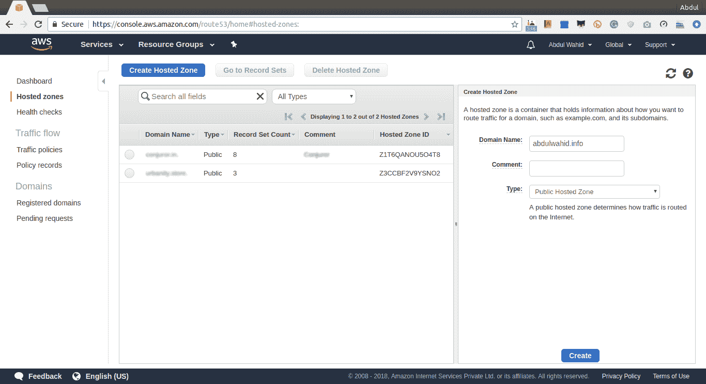
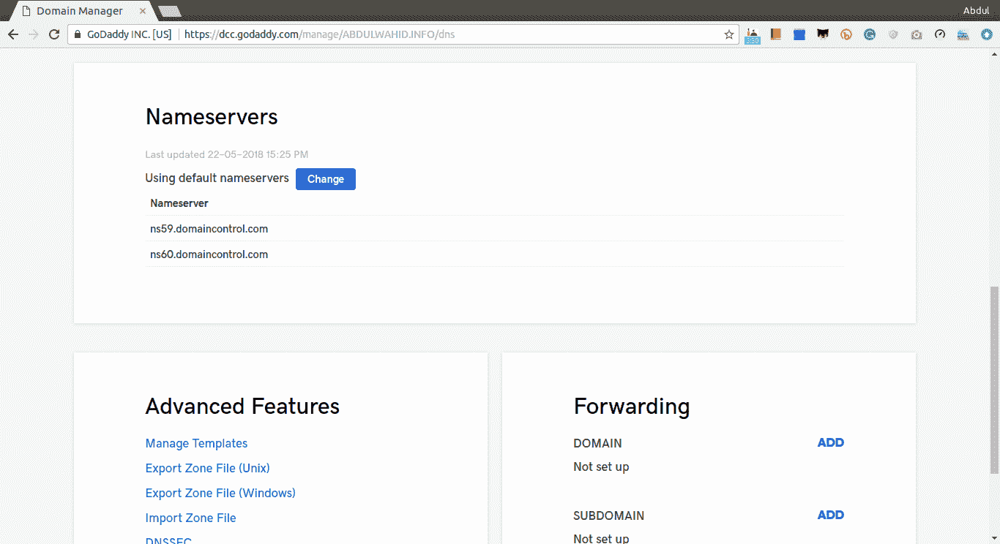
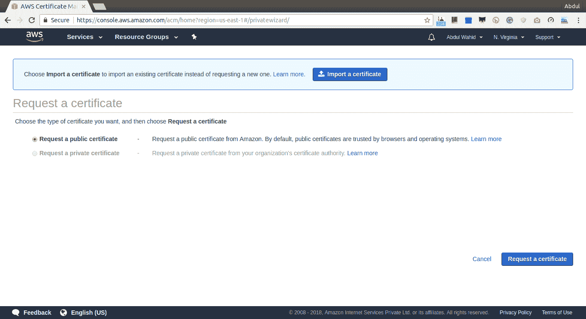
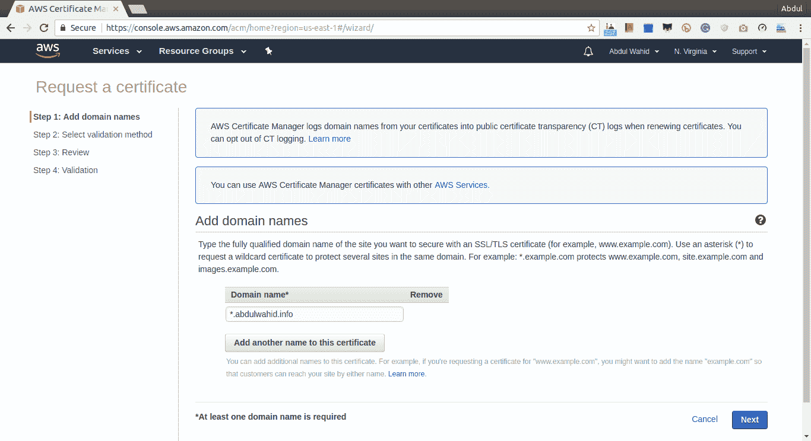
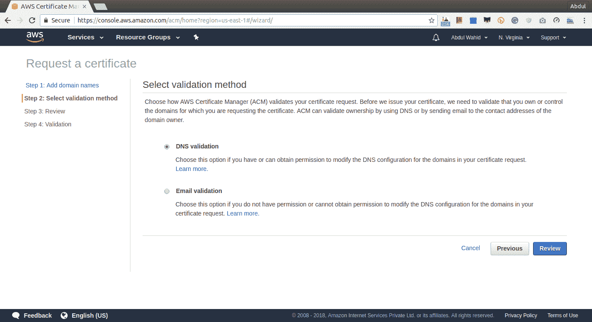
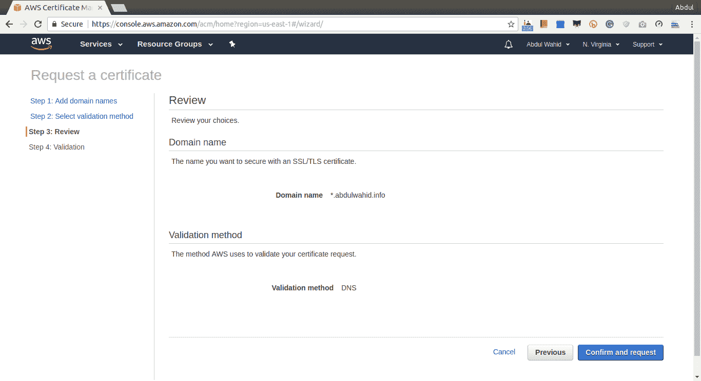
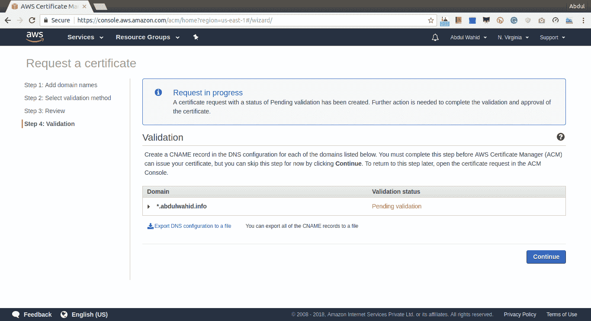
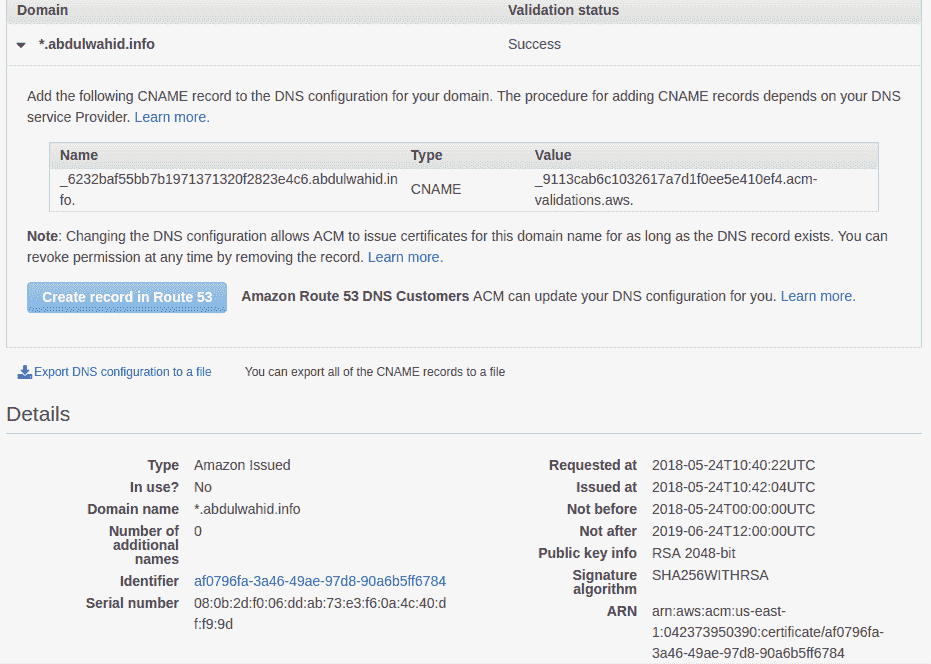

# 使用 SSL 的自定义域

在本章中，我们将为上一章中开发的 quote 应用程序配置一个自定义域。配置自定义域是将应用程序移动到生产环境的一个重要部分，因为它是无服务器的。此过程涉及多个操作，不同于使用 Apache 或 NGINX 进行的传统配置。我们将查看已部署在无服务器基础架构中的 quote 应用程序

本章将介绍的主题包括：

*   使用 AWS Route53 配置自定义域
*   使用 Amazon 证书管理器生成 SSL 证书
*   使用 Zappa 集成自定义域

# 技术要求

在开始本章之前，需要满足一些先决条件。我们将使用一些 AWS 服务和一个真正的域名。因此，您将需要以下内容：

*   Ubuntu 16.04/Windows/macOS
*   Pipenv 工具
*   Zappa 和其他 Python 开发包
*   注册域
*   AWS 帐户

我们将使用一些 Python 包，这些将在后面的部分中提到。除了开发环境之外，您还需要拥有自己的注册域和更新其默认名称服务器的权限。让我们转到下一节，在那里我们将探索使用 AWS Route 53 的域名称服务器配置。

# 使用 AWS 路由 53 配置自定义域

为我们的应用程序创建自定义域需要拥有一个域。域名可以从域名注册商处购买。在我们的案例中，我从**戈达迪**（[购买了一个名为`abdulwahid.info`的域名 https://in.godaddy.com/](https://in.godaddy.com/) ，**域名系统**（**DNS**服务商

每个域都通过 DNS 服务提供商管理的名称服务器在 internet 上提供服务。有许多服务提供商从他们的终端提供管理和托管网站的服务。我们将使用 AWS Route 53 服务

# AWS 53 路是什么？

AWS Route 53 是一个可扩展的云 DNS web 服务。Route 53 在使用任何 AWS 服务配置域时都非常有效。它与运行在 AWS 上以及 AWS 外部的基础设施连接。路由 53 提供多种路由，例如基于延迟的路由、地理 DNS、地理接近性和加权循环。所有这些路由可以结合起来提供低延迟带宽。路由 53 还提供域名注册服务。如果我们在 AWS 路由 53 上注册一个域，那么我们不需要管理 DNS 配置。所有 DNS 配置将自动使用 AWS 服务。

但是我们没有在路由 53 上注册我们的域，所以我们需要用路由 53 替换默认的 GoDaddy 名称服务器。在下一节中，我们将讨论如何更改名称服务器。

# 将名称服务器更改为路由 53

我们将把现有域名的控制权转移到 53 号公路。此过程需要将域`abdulwhaid.info`的默认名称服务器更改为路由 53 创建的新名称服务器。

参考 AWS 官方文件（[https://docs.aws.amazon.com/Route53/latest/DeveloperGuide/CreatingHostedZone.html](https://docs.aws.amazon.com/Route53/latest/DeveloperGuide/CreatingHostedZone.html) ）关于创建托管区域，用于在不同注册器上配置路由 53 和现有域，请执行以下步骤：

1.  登录 AWS 控制台，在[处打开 53 号线控制台 https://console.aws.amazon.com/route53/.](https://console.aws.amazon.com/route53/)
2.  如果您刚刚接触路由 53，请选择 DNS 管理下的“立即开始”**。**
3.  如果您已经在使用 Route 53，请在左侧导航窗格中选择 Hosted zones，如以下屏幕截图所示：


4.  现在，在托管区域页面中，单击创建托管区域和域`abdulwahid.info`，如以下屏幕截图所示：



5.  为域`abdulwahid.info`创建托管区域后，路由 53 将创建两条记录**名称服务器**（**NS**）和**权限启动**（**SOA**），如下图所示：


6.  现在，我们需要使用 NS 记录并替换在域注册器（即 GoDaddy）生成的默认 NS 记录，我们在那里创建了域`abdulwahid.info`。*以下是默认 NS 记录的截图：*

 *

7.  将默认 NS 更改为 Custom，并输入 Route 53 生成的 NS 记录，如以下屏幕截图所示：


8.  点击 Save，我们就完成了。现在，域名注册员需要一些时间来处理。您将从域名注册处收到一封确认电子邮件。

Route 53 manage the route traffic using hosted zones for a specific domain. A hosted zone is like a container that holds information about the domain and knows how to route the traffic on the internet.

收到确认电子邮件后，域`abdulwahid.info`将通过路由 53 进行管理。让我们转到下一节，了解使用 AWS 证书管理器的 SSL 证书配置的更多信息。

# 使用 AWS 证书管理器生成 SSL 证书

SSL 为 web 服务器和应用程序用户提供了安全性。借助 SSL，您可以防止黑客攻击在 web 服务器和浏览器之间通信的数据。在将 SSL 安全性实现到我们的应用程序中之前，让我们了解一些有关 SSL 的基本方法

# 什么是 SSL？

**SSL**（**安全套接字层**）是一种标准的安全协议，用于通过加密数据来保护 web 服务器和浏览器之间的通信。SSL 将确保从浏览器传输到 web 服务器的数据是加密的。为了创建 SSL 连接，我们需要生成 SSL 证书并将 web 服务器配置为在 SSL 层下服务。下一节将讨论 SSL 证书。

# 什么是 SSL 证书？

为了创建 SSL 连接，我们需要 SSL 证书。SSL 证书可以从**证书颁发机构**（**CA**生成。在生成证书之前，我们需要提供有关我们网站和业务详细信息的信息。基于此信息，将生成两个加密密钥：公钥和私钥

现在使用公钥和业务详细信息，我们需要与 CA 一起处理一个**证书签名请求**（**CSR**），CA 成功授权我们的详细信息后，将颁发一个与我们私钥匹配的 SSL 证书

现在，我们已经准备好在应用程序中配置 SSL 证书。这是一个生成 SSL 证书的传统方法。但我们将使用 Amazon 证书管理器生成 SSL 证书。

# 使用 Amazon 证书管理器（ACM）生成 SSL 证书

有几种方法可以生成 SSL 证书。以下是为应用程序获取 SSL/TSL 证书的一些方法：

*   您可以从 SSL 证书颁发机构购买 SSL 证书。
*   您可以使用**让我们加密**（[自行生成免费 SSL/TSL 证书 https://letsencrypt.org/](https://letsencrypt.org/) ）。Let's Encrypt 是一个开放的证书颁发机构，提供免费的 SSL/TSL 证书。
*   您可以使用**AWS 证书管理器**（**ACM**生成 SSL。我们将使用 ACM 为我们的应用程序生成 SSL 证书。

ACM 是一种为基于 AWS 的服务和应用程序管理和创建 SSL/TSL 证书的服务。ACM 证书可用于多个域名和子域。您还可以使用 ACM 创建通配符 SSL

ACM 与**AWS 证书管理器私有证书颁发机构**（**ACM PCA**严格链接。ACM PCA 负责验证域权限并颁发证书。

现在，我们将为我们的域和子域生成一个 ACM 证书。按照以下步骤创建 ACM 证书：

Please note, API Gateway supports ACM certificates from one region only. Hence, we are going to use the **US East **region. You can read more about this at [https://github.com/Miserlou/Zappa/pull/1142](https://github.com/Miserlou/Zappa/pull/1142).

1.  登录 AWS 控制台并在[处打开 ACM 控制台 https://ap-south-1.console.aws.amazon.com/acm](https://ap-south-1.console.aws.amazon.com/acm) 。

2.  如果您是 AWS ACM 新手，请单击“提供证书”下的“入门”，或者如果您已经在使用 AWS ACM，请选择“申请证书”，如以下屏幕截图所示：



在这里，我们将选择请求公共证书

You can read more about public certificate at [https://docs.aws.amazon.com/acm/latest/userguide/gs-acm-request-public.html](https://docs.aws.amazon.com/acm/latest/userguide/gs-acm-request-public.html).

3.  在下一页，您需要提供域名的详细信息。我们将使用星号（*）作为子域名，针对我们的域请求通配符证书。因此，此证书可用于保护同一域下的多个站点。以下是添加域名的屏幕截图：



4.  在下一页中，您需要选择一种验证方法。有两种可用的方法，如下所示：
    *   **DNS 验证：**此方法需要有权限修改您证书中域的 DNS 记录，以便直接使用记录集进行验证。
    *   **邮件验证：**如果您没有修改 DNS 记录的权限，可以使用此方法。因此，您可以使用域注册器记录的注册电子邮件验证域。

我们将使用 DNS 验证方法。这是因为我们拥有路由 53 托管区域中的 DNS 访问权限，因为域注册器中映射了名称服务器。DNS 验证非常简单。请查看以下屏幕截图：



5.  现在，我们准备出发了。单击 Review 将显示所选配置，如以下屏幕截图所示：



6.  单击“审阅”页面中的“确认和请求”后，您需要完成验证过程。以下屏幕截图说明验证状态为挂起，因此我们需要通过展开域部分来执行验证：



7.  展开“域”部分后，您将看到一些完成验证过程的说明。我们选择了 DNS 验证方法。因此，此方法需要将 CNAME 记录添加到 DNS 配置中。根据以下屏幕截图，您可以通过单击在路由 53 中创建记录按钮来执行操作，以使用给定的 CNAME 更新 DNS 配置：


8.  单击 Route 53 中的 Create record（创建记录）后，它将弹出一个带有 CNAME 记录的确认弹出窗口，如以下屏幕截图所示：


9.  单击“创建”按钮后，它会自动使用给定的 CNAME 记录更新路由 53 中的 DNS 配置。您将看到成功消息，如以下屏幕截图所示：


10.  单击 Continue，我们就完成了。您将被重定向到证书仪表板页面，如以下屏幕截图所示：


ACM CA 已针对您的域成功颁发 SSL 证书。如您所见，状态为绿色状态。现在，是时候用我们的应用程序配置域和证书了。在下一节中，我们将使用 quote API 应用程序配置具有已颁发 SSL 证书的子域。

# 使用 Zappa 集成自定义域

Zappa 支持自定义域名和具有 SSL 证书的子域集成。在前面的章节中，我们已经讨论了 SSL/TSL 证书生成的来源。Zappa 可以使用以下 CA 部署域：

*   您自己从证书颁发机构提供商处购买的 SSL
*   让我们加密
*   自动气象站

您可以在以下位置阅读有关使用上述 CA 部署域的更多详细信息：[https://github.com/Miserlou/Zappa#ssl-认证](https://github.com/Miserlou/Zappa#ssl-certification)。

我们将使用 AWS 证书颁发机构 SSL 证书。我们已经在上一节中生成了 ACM 证书。现在是将 ACM 证书与应用程序的子域集成的时候了。

让我们转到下一节，在那里我们将使用子域和 ACM 证书配置 quote API 应用程序。

# 部署到具有 ACM 证书的域

由于我们已经颁发了 ACM 证书，现在让我们将应用程序配置到所需的域并执行部署过程。Zappa 提供了一个`domain`**属性为应用程序配置域名，为 ACM 证书提供了`certificate_arn`**属性。您需要在`zappa_settings.json`中配置这两个属性****

 ****在此之前，我们需要获取`certificate_arn`的值，因为它是 ACM 为我们已颁发证书的域生成的**ARN**（**亚马逊资源名**）。通过展开域部分，可以从 ACM 仪表板获取 ARN 的值，如以下屏幕截图所示：



您可以在屏幕右下角看到 ARN。现在，复制 ARN 属性的值并将其作为`certificate_arn`的值放在`zappa_settings.json`中，如下面来自`zappa_settings.json`的代码片段所示。

文件-`zappa_settings.json`：

```py
{
    "dev": {
        "app_function": "resources.api",
        "aws_region": "ap-south-1",
        "profile_name": "default",
        "project_name": "chapter-8",
        "runtime": "python3.6",
        "s3_bucket": "zappa-0edixmwpd",
        "remote_env": "s3://book-configs/chapter-7-config.json",
        "cache_cluster_enabled": false,
        "cache_cluster_size": 0.5,
        "cache_cluster_ttl": 300,
        "cache_cluster_encrypted": false,
        "events": [{
           "function": "schedulers.set_quote_of_the_day",
           "expression": "cron(0 12 * * ? *)"
       }],
       "domain": "quote.abdulwahid.info",
 "certificate_arn":"arn:aws:acm:us-east-1:042373950390:certificate/af0796fa-3a46-49ae-97d8-90a6b5ff6784"
    }
}
```

这里，我们将域配置为`quote.abdulwahid.info`并设置`certificate_arn`。现在，让我们使用`zappa deploy <stage_name>`命令部署应用程序，因为我们是第一次部署应用程序。请查看以下代码：

```py
$ zappa deploy dev
Important! A new version of Zappa is available!
Upgrade with: pip install zappa --upgrade
Visit the project page on GitHub to see the latest changes: https://github.com/Miserlou/Zappa
Calling deploy for stage dev..
Downloading and installing dependencies..
 - sqlite==python36: Using precompiled lambda package
Packaging project as zip.
Uploading chapter-7-dev-1529679507.zip (5.9MiB)..
100%|███████████████████████████████████████████████████████████████████████████████████████████████████████████████████████████████████████████████████████████████████████████████████████| 6.17M/6.17M [00:02<00:00, 2.27MB/s]
Scheduling..
Scheduled chapter-7-dev-schedulers.set_quote_of_the_day with expression cron(0 12 * * ? *)!
Scheduled chapter-7-dev-zappa-keep-warm-handler.keep_warm_callback with expression rate(4 minutes)!
Uploading chapter-7-dev-template-1529679513.json (1.6KiB)..
100%|███████████████████████████████████████████████████████████████████████████████████████████████████████████████████████████████████████████████████████████████████████████████████████| 1.62K/1.62K [00:00<00:00, 4.76KB/s]
Waiting for stack chapter-7-dev to create (this can take a bit)..
100%|█████████████████████████████████████████████████████████████████████████████████████████████████████████████████████████████████████████████████████████████████████████████████████████████| 4/4 [00:09<00:00, 2.66s/res]
Deploying API Gateway..
Deployment complete!: https://5phr2bp4id.execute-api.ap-south-1.amazonaws.com/dev
```

如您所见，应用程序部署在随机生成的 API 端点上。但是为了配置应用程序，我们需要使用`zappa certify`命令将 API 网关与 ACM 证书相关联，如下面的日志片段所示：

```py
$ zappa certify
Calling certify for stage dev..
Are you sure you want to certify? [y/n] y
Certifying domain quote.abdulwahid.info..
Created a new domain name with supplied certificate. Please note that it can take up to 40 minutes for this domain to be created and propagated through AWS, but it requires no further work on your part.
Certificate updated!
```

运行`zappa certify`命令后，它将创建 API 网关并将其与配置的证书相关联。

现在，让我们使用`zappa update <stage_name>`命令再次更新部署，如下代码所示。

```py
$ zappa update dev
Important! A new version of Zappa is available!
Upgrade with: pip install zappa --upgrade
Visit the project page on GitHub to see the latest changes: https://github.com/Miserlou/Zappa
Calling update for stage dev..
Downloading and installing dependencies..
 - sqlite==python36: Using precompiled lambda package
Packaging project as zip.
Uploading chapter-7-dev-1529679710.zip (5.9MiB)..
100%|████████████████████████████████████████████████████████████████████████████████████████████████████████████████████████████████████████████████████████████████████████████████████████| 6.17M/6.17M [00:03<00:00, 863KB/s]
Updating Lambda function code..
Updating Lambda function configuration..
Uploading chapter-7-dev-template-1529679717.json (1.6KiB)..
100%|███████████████████████████████████████████████████████████████████████████████████████████████████████████████████████████████████████████████████████████████████████████████████████| 1.62K/1.62K [00:00<00:00, 6.97KB/s]
Deploying API Gateway..
Scheduling..
Unscheduled chapter-7-dev-schedulers.set_quote_of_the_day.
Unscheduled chapter-7-dev-zappa-keep-warm-handler.keep_warm_callback.
Scheduled chapter-7-dev-schedulers.set_quote_of_the_day with expression cron(0 12 * * ? *)!
Scheduled chapter-7-dev-zappa-keep-warm-handler.keep_warm_callback with expression rate(4 minutes)!
Your updated Zappa deployment is live!: https://quote.abdulwahid.info (https://5phr2bp4id.execute-api.ap-south-1.amazonaws.com/dev)
```

就这样。如您所见，我们的应用程序在`https://quote.abdulwahid.info`上进行直播。现在，让我们看看下一节中的执行情况。

# 使用配置的域执行应用程序

我们已经在无服务器基础设施上部署和配置了 quote API 应用程序。让我们看看使用 Postman API 客户端执行的 API。

# 每日报价 API

我们设计了此 API（`https://quote.abdulwahid.info/quote?type=daily`）以每天返回报价。我们配置的计划程序将每天更新计划 UTC 时间。请查看以下 cURL 日志片段：

```py
$ curl https://quote.abdulwahid.info/quote?type=daily
{"quote": "Many wealthy people are little more than janitors of their possessions.", "author": "Frank Lloyd Wright", "category": "Famous"}
```

# 随机报价 API

random quote API（`https://quote.abdulwahid.info/quote?type=random`）将在每次请求时返回一个随机报价。请查看以下 cURL 日志片段：

```py
$ curl https://quote.abdulwahid.info/quote?type=random
{"quote": "My mother thanks you. My father thanks you. My sister thanks you. And I thank you.", "author": "Yankee Doodle Dandy", "category": "Movies"}
```

就这样。我们已经成功地在无服务器体系结构上部署了我们的应用程序。我们还使用应用程序配置了自定义域。这将是现场测试目的。

# 总结

在本章中，我们学习了如何创建自定义域并使用路由 53 配置域。使用路由 53，我们管理域 DNS 配置。为了生成 SSL 证书，我们使用了 ACM，它易于使用。稍后，我们使用生成的 ACM 证书的 ARN 为 Zappa 配置了一个域。我希望本章能帮助您理解为应用程序配置自定义域的机制。

现在我们将学习更多关于在 AWS Lambda 上调度任务和异步执行方法的信息。我们将通过移动订阅模型进一步增强 QuoteAPI 应用程序。让我们为下一章做好准备，深入了解使用 AWS Lambda 的异步世界。

# 问题

1.  AWS 53 路是什么？
2.  我们所说的域名服务器是什么意思？
3.  ACM 如何在 AWS Lambda 上保护托管 API？*****