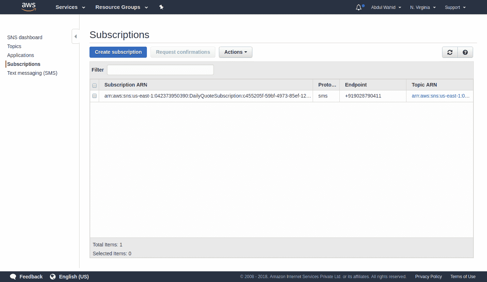
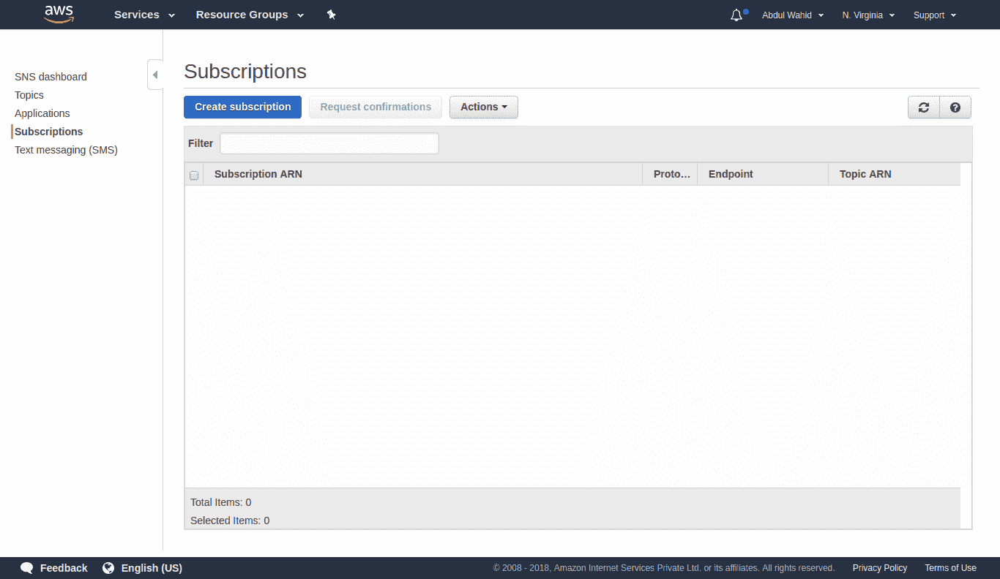

# AWS Lambda 上的异步任务执行

在本章中，我们将介绍 AWS Lambda 上的异步任务执行。AWS Lambda 使得自动缩放和异步执行非常容易实现。Zappa 可以帮助我们配置任务，以便在 AWS Lambda 上以异步方式执行任务。Zappa 实现了管理异步任务响应的功能。

本章将介绍的主题包括：

*   异步执行
*   使用 Zappa 的 AWS Lambda 异步调用
*   使用异步功能配置 Quote API 应用程序
*   使用 Zappa 部署和执行报价 API

# 技术要求

在开始本章之前，请确保满足使用应用程序的先决条件。以下是您需要满足的技术要求：

*   Ubuntu 16.04/Windows/macOS
*   蟒蛇 3.6
*   Pipenv 工具
*   猎鹰框架
*   扎帕
*   注册域
*   AWS 帐户

本章使用 SSL 对[第 8 章](08.html)*自定义域中开发的应用进行了增强。因此，一些需求可以从以前配置的先决条件中使用。让我们继续了解有关 AWS Lambda 中异步执行的更多信息。*

# 异步执行

异步执行在开发高性能和优化的应用程序中起着至关重要的作用。AWS Lambda 支持异步执行。在异步模式下执行 AWS Lambda 函数有不同的方法

# 理解异步执行

**异步执行**是在不阻塞用户干预的情况下执行特定代码块的过程。为了更好地理解它，考虑 JQuery AJAX 机制来向服务器发送异步请求，这样做不会阻塞用户并捕获回调方法中的成功响应或错误响应。查看下图以更好地理解：


现在，正如您所看到的，一旦服务器从客户机获得一个异步请求，服务器就会立即返回一个已确认的响应。请求处理完成后，将返回成功或失败响应；否则，将不会返回任何内容

是否从异步方法返回响应取决于需求。我们可能需要也可能不需要回复。如果我们确实希望返回响应，那么应该有一种机制来处理或捕获客户端的响应。

以类似的方式，AWS Lambda 函数可以以异步方式执行，这样我们就不会阻止用户干预以等待返回响应。有些用例要求我们捕获异步执行的 AWS Lambda 函数的响应。我们将在接下来的部分中讨论捕获响应。

让我们看看 AWS Lambda 是如何异步执行的。

# 使用 Boto3 的异步 AWS Lambda 执行

AWS Lambda 函数只是云中的一个函数（一段代码）。可以同步或异步调用函数。为了在任何编程语言中实现异步执行，我们在单独的线程或进程中执行函数。例如，在 Python 中，有各种库可用于实现异步执行。类似地，AWS Lambda 非常支持异步执行。

让我们看看下面的代码片段：

```py
client = boto3.client('lambda')
response = client.invoke(
    FunctionName='string',
    InvocationType='Event'|'RequestResponse'|'DryRun',
    LogType='None'|'Tail',
    ClientContext='string',
    Payload=b'bytes'|file,
    Qualifier='string'
)
```

我们可以使用 Boto3 库调用 AWS Lambda 函数。前面的代码是 Lambda 客户端的`invoke`方法的语法。您可以在 Boto3 的官方文档中阅读更多关于`invoke`方法机制的信息：[http://boto3.readthedocs.io/en/latest/reference/services/lambda.html#Lambda.Client.invoke](http://boto3.readthedocs.io/en/latest/reference/services/lambda.html#Lambda.Client.invoke)

Boto3 is a well-organized and well-maintained AWS SDK for Python. It helps developers to interact with AWS services using Python. Zappa also uses Boto3 in order to interact with AWS services.

让我们简要介绍一下`InvocationType`，它用于决定是以同步模式还是异步模式执行函数。如果您想在同步模式下调用现有的 AWS Lambda 函数，那么您可以选择`InvocationType`作为`RequestResponse`，对于异步模式，您可以选择`InvocationType`作为`Event`。

以下代码是 Lambda 函数异步执行的示例：

```py
client = boto3.client('lambda')
response = client.invoke(
    FunctionName='MyFunction',
    InvocationType='Event'
)
```

就这样。这将在异步模式下调用 Lambda 函数。在 Boto3 的帮助下，您可以异步执行 AWS Lambda 函数。现在让我们看看如何使用 Zappa 执行异步执行。

# 使用 Zappa 的 AWS Lambda 异步调用

AWS Lambda 函数只不过是部署在 AWS Lambda 容器中的函数。因此，执行它只是调用函数的问题。AWS 提供了多种调用方法。如何集成和配置调用以实现异步执行完全取决于您。在上一节中，我们已经了解了如何使用 Boto3 SDK 进行异步执行。现在，我们将探索 Zappa 提供的各种调用方式。

# 使用任务装饰器的异步 AWS Lambda 调用

Zappa 提供了一种在异步模式下配置 Lambda 执行的超级简单的方法。Zappa 使用名为`zappa.async.task`的装饰器方法实现了异步执行。这个装饰器可以用于我们想要在异步模式下执行的任何函数。以下是 Zappa 官方 GitHub 页面（[中的一个示例 https://github.com/Miserlou/Zappa#asynchronous-任务执行](https://github.com/Miserlou/Zappa#asynchronous-task-execution)：

```py
from flask import Flask
from zappa.async import task
app = Flask(__name__)

@task
def make_pie():
    """ This takes a long time! """
    ingredients = get_ingredients()
    pie = bake(ingredients)
    deliver(pie)

@app.route('/api/order/pie')
def order_pie():
    """ This returns immediately! """
    make_pie()
    return "Your pie is being made!"
```

如您所见，我们在`make_pie`方法上使用了`task`装饰器。现在，当您调用 API 时，它将立即返回响应，并以异步模式执行`make_pie`方法。异步执行`make_pie`无非是在`make_pie`方法执行的上下文中实例化 AWS Lambda 实例。这就是异步执行函数的方式。现在，另一个挑战是从异步执行的函数中收集响应。我们将在下一节中讨论这一点。

# Amazon SNS 作为任务源

**亚马逊简单通知服务**（**SNS**是一种托管的发布/订阅消息服务。它支持各种协议，如 HTTP、HTTPS、电子邮件、电子邮件 JSON、Amazon SQS、应用程序、AWS Lambda 和 SMS。我们可以通过这些协议中的任何一个创建主题和订阅，尽管我们可以使用 AWS SNS 并通过其 web 控制台执行发布/订阅操作。

我们已经通过 API 网关调用了 AWS Lambda，这就是我们所有实现的 API 的工作方式。以类似的方式，我们可以使用特定主题的 Amazon SNS 订阅我们的 AWS Lambda。现在，每当发布关于该主题的任何消息时，它也将调用订阅的 AWS Lambda。

Zappa 提供了一种使用 AWS Lambda 配置 Amazon SNS 的简单方法。在`zappa.async.task_sns`装饰器的帮助下，我们可以配置一个将由 Amazon SNS 事件调用的执行方法。下面是理解`task_sns`装饰器绑定的示例代码片段：

```py
from zappa.asycn import task_sns

@task_sns
def method_to_invoke_from_sns_event():
    pass

```

您还需要更新`zappa_settings.json`文件中的以下设置：

```py
{
  "dev": {
    ..
      "async_source": "sns",
      "async_resources": true,
    ..
    }
}
```

当您调用`zappa schedule`命令时，它会自动创建并订阅 SNS。SNS 主题上的任何消息发布也会创建唯一的消息 ID。因此，您可以使用生成的消息 ID 在 CloudWatch 日志中跟踪消息响应。

此功能使您能够使用 Lambda 调用来执行基于 SNS 事件的操作。您可以使用它开发一个**一次性密码**（**OTP**）生成应用程序，例如，您不需要保存 OTP 数据。相反，它将发布到特定的主题，订阅者将获得该信息。最后，AWS Lambda 和手机号码可以是 AWS SNS 主题的订阅。这将调用 AWS Lambda 方法，并在 SNS 主题上使用已发布的消息上下文。

让我们在下一节中看一下直接调用方法。

# 直接调用

Zappa 提供了另一种机制来执行 Lambda 函数的直接调用。之前，我们一直在使用`task`和`task_sns`修饰符，但现在我们将使用`zappa.async.run`方法来执行直接调用。

以下是所使用的`zappa.async.run`方法的示例代码片段：

```py
from zappa.async import run

# Invoking a method in async mode using Lambda
run(method_name_to_invoke, args, kwargs)

# Invoking a method in async mode using SNS
run(method_name_to_invoke, args, kwargs, service="sns")
```

此功能将帮助您根据需求动态配置`async`调用。Decorator 任务方法在编译时是固定的，但是可以在运行时有条件地调用此方法语句。

# 远程调用

默认情况下，Zappa 在当前 Lambda 实例上执行方法的直接调用。但是，如果希望在不同区域上作为单独的 Lambda 函数执行 Lambda 调用，则可以更新任务装饰器，如以下代码段所示：

```py
@task(remote_aws_lambda_function_name='subscribe-mobile-prod', remote_aws_region='us-east-1')
def subscribe_mobile_number(*args, **kwargs):
   """ This may take a long time! """
   validate(kwargs.get("mobile"))
   add_subscription(mobile=kwargs.get("mobile"))
```

我们使用的是`task`装饰符，但带有附加参数，例如**`remote_aws_lambda_function_name`**和**`remote_aws_region`**。这些参数表示在特定区域执行特定 Lambda 函数。这就是执行**远程调用**的方式。

让我们使用这些不同类型的调用来增强 QuoteAPI 应用程序，以实现异步执行。

# 使用异步功能配置 Quote API 应用程序

在上一章中，我们创建了 QuoteAPI 并配置了自定义域。现在，我们将增强和优化现有的应用程序。我们将向应用程序添加一些新特性，以演示不同类型的调用

我们将把现有的代码库作为一个不同的项目使用，因此最好将现有的代码库复制到一个新的目录中；在本例中，我们将`Chapter08`代码库复制为`Chapter09`；但是，您需要更新`zappa_settings.json`文件。在接下来的部分中，我们将介绍 Zappa 设置的更改。

# 每日报价的亚马逊 SNS 短信订阅

我们将添加 SMS 订阅的新功能，用于每天接收报价。这需要我们使用 Boto3 库配置 Amazon SNS。Boto3 是一个完整的 Python SDK 库，使我们能够以编程方式与 AWS 服务交互。让我们在下一节继续并配置 Amazon SNS。

# 使用 Boto3 配置 Amazon SNS

您需要满足先决条件，并遵循上一章中详细介绍的安装说明，在上一章中，我们使用 Boto3 和其他必需的库配置了环境。假设您已经配置了环境，我现在将继续探索配置。

让我们看一下以下代码片段：

```py
client = boto3.client('sns',
            aws_access_key_id= os.environ['aws_access_key_id'],
            aws_secret_access_key= os.environ['aws_secret_access_key'],
            region_name= 'us-east-1')
```

如您所见，我们正在使用 Boto3 创建 Amazon SNS 的客户机对象。为了以编程方式获得访问权限，我们需要具有访问密钥凭据。

这是连接亚马逊 SNS 的一个重要步骤。成功创建`client`对象后，可以执行各种操作，例如创建主题、使用协议订阅服务以及发布主题消息。

让我们转向使用 Amazon SNS 的 SMS 订阅的实际实现。

# 实现 SMS 订阅功能

为了实现订阅功能，我们需要验证手机号码。因此，我们将在订阅任何手机号码之前实现 OTP 验证功能。我们需要有一个数据库表来保存 OTP 生成的代码以及手机号码的数据。以下是`models.py`类与`OTPModel`类的代码片段：

```py
import os
import datetime
from shutil import copyfile
from peewee import *

# Copy our working DB to /tmp..
db_name = 'quote_database.db'
src = os.path.abspath(db_name)
dst = "/tmp/{}".format(db_name)
copyfile(src, dst)

db = SqliteDatabase(dst)

class QuoteModel(Model):

    class Meta:
        database = db

    id = IntegerField(primary_key= True)
    quote = TextField()
    author = CharField()
    category = CharField()
    created_at = DateTimeField(default= datetime.date.today())

class OTPModel(Model):

    class Meta:
        database = db

    id = IntegerField(primary_key= True)
    mobile_number = CharField()
    otp = IntegerField()
    is_verified = BooleanField(default=False)
    created_at = DateTimeField(default= datetime.date.today())

db.connect()
db.create_tables([QuoteModel, OTPModel])
```

为了拥有完整的短信订阅功能，我们将创建短信订阅的核心类，名为`QuoteSubscription`。此类将具有订阅/取消订阅特定手机号码以获取每日报价消息所需的所有功能。以下是`QuoteSubscription`类的代码片段。

文件-`sns.py`：

```py
import os
import re
import boto3

class QuoteSubscription:

    def __init__(self):
        """
        Class constructor to initialize the boto3 configuration with Amazon SNS.
        """
        self.client = boto3.client(
            'sns',
            aws_access_key_id=os.environ['aws_access_key_id'],
            aws_secret_access_key=os.environ['aws_secret_access_key'],
            region_name='us-east-1')
        topic = self.client.create_topic(Name="DailyQuoteSubscription")
        self.topic_arn = topic['TopicArn']

    def subscribe(self, mobile):
        """
        This method is used to subscribe a mobile number to the Amazon SNS topic.
        Required parameters:
            :param mobile: A mobile number along with country code.
            Syntax - <country_code><mobile_number>
            Example - 919028XXXXXX
        """
        assert(bool(re.match("^(\+\d{1,3}?)?\d{10}$", mobile))), 'Invalid mobile number'
        self.client.subscribe(
            TopicArn=self.topic_arn,
            Protocol='sms',
            Endpoint=mobile,
        )

    def unsubscribe(self, mobile):
        """
        This method is used to unsubscribe a mobile number from the Amazon SNS topic.
        Required parameters:
            :param mobile: A mobile number along with country code.
            Syntax - <country_code><mobile_number>
            Example - 919028XXXXXX
        """
        assert(bool(re.match("^(\+\d{1,3}?)?\d{10}$", mobile))), 'Invalid mobile number'
        try:
            subscriptions = self.client.list_subscriptions_by_topic(TopicArn=self.topic_arn)
            subscription = list(filter(lambda x: x['Endpoint']==mobile, subscriptions['Subscriptions']))[0]
            self.client.unsubscribe(
                SubscriptionArn= subscription['SubscriptionArn']
            )
        except IndexError:
            raise ValueError('Mobile {} is not subscribed.'.format(mobile))

    def publish(self, message):
        """
        This method is used to publish a quote message on Amazon SNS topic.
        Required parameters:
            :param message: string formated data.
        """
        self.client.publish(Message=message, TopicArn=self.topic_arn)

    def send_sms(self, mobile_number, message):
        """
        This method is used to send a SMS to a mobile number.
        Required parameters:
            :param mobile_number: string formated data.
            :param message: string formated data.
        """
        self.client.publish(
            PhoneNumber=mobile_number,
            Message=message
        )
```

此类具有用于执行移动号码订阅功能的方法。为了演示异步执行，我们将显式地编写一些函数，这些函数将使用`QuoteSubscription`特性

让我们用以下代码片段创建一个名为`async.py`的文件：

```py
import random
from zappa.async import task
from sns import QuoteSubscription
from models import OTPModel

@task
def async_subscribe(mobile_number):
    quote_subscription = QuoteSubscription()
    quote_subscription.subscribe(mobile=mobile_number)

@task
def async_unsubscribe(mobile_number):
    quote_subscription = QuoteSubscription()
    quote_subscription.unsubscribe(mobile=mobile_number)

@task
def async_publish(message):
    quote_subscription = QuoteSubscription()
    quote_subscription.publish(message=message)

@task
def async_send_otp(mobile_number):
    otp = None
    quote_subscription = QuoteSubscription()
    data = OTPModel.select().where(OTPModel.mobile_number == mobile_number, OTPModel.is_verified == False)
    if data.exists():
        data = data.get()
        otp = data.otp
    else:
        otp = random.randint(1000,9999)
        OTPModel.create(**{'mobile_number': mobile_number, 'otp': otp})
    message = "One Time Password (OTP) is {} to verify the Daily Quote subscription.".format(otp)
    quote_subscription.send_sms(mobile_number=mobile_number, message=message)
```

如您所见，我们定义了这些方法并添加了`@task`装饰器。在本地环境中，它将以普通方法执行，但在 AWS Lambda 上下文中，它将以异步模式执行。

让我们转到资源 API 实现。我们将稍微修改一下现有的资源。将会有一些与 SMS 订阅相关的新 API。

文件-`resources.py`：

```py
import os
import re
import datetime
import requests
import falcon
import boto3

from models import QuoteModel, OTPModel
from mashape import fetch_quote
from async import async_subscribe, async_unsubscribe, async_send_otp

class DailyQuoteResource:
    def on_get(self, req, resp):
        """Handles GET requests"""
        try:
            data = QuoteModel.select().where(QuoteModel.created_at == datetime.date.today())
            if data.exists():
                data = data.get()
                resp.media = {'quote': data.quote, 'author': data.author, 'category': data.category}
            else:
                quote = fetch_quote()
                QuoteModel.create(**quote)
                resp.media = quote
        except Exception as e:
            raise falcon.HTTPError(falcon.HTTP_500, str(e))

class SubscribeQuoteResource:
    def on_get(self, req, resp):
        """Handles GET requests"""
        try:
            mobile_number = '+{}'.format(req.get_param('mobile'))
            otp = req.get_param('otp')
            otp_data = OTPModel.select().where(OTPModel.mobile_number == mobile_number, OTPModel.otp == otp, OTPModel.is_verified == False)
            if mobile_number and otp_data.exists():
                otp_data = otp_data.get()
                otp_data.is_verified = True
                otp_data.save()
                async_subscribe(mobile_number)
                resp.media = {"message": "Congratulations!!! You have successfully subscribed for daily famous quote."}
            elif mobile_number and not otp_data.exists():
                async_send_otp(mobile_number)
                resp.media = {"message": "An OTP verification has been sent on mobile {0}. To complete the subscription, Use OTP with this URL pattern https://quote-api.abdulwahid.info/subscribe?mobile={0}&otp=xxxx.".format(mobile_number)}
            else:
                raise falcon.HTTPError(falcon.HTTP_500, 'Require a valid mobile number as a query parameter. e.g https://<API_ENDPOINT>/subscribe?mobile=XXXXXXX')
        except Exception as e:
            raise falcon.HTTPError(falcon.HTTP_500, str(e))

class UnSubscribeQuoteResource:
    def on_get(self, req, resp):
        """Handles GET requests"""
        try:
            mobile_number = '+{}'.format(req.get_param('mobile'))
            if mobile_number:
                async_unsubscribe(mobile_number)
                resp.media = {"message": "You have successfully unsubscribed from daily famous quote. See you again."}
        except Exception as e:
            raise falcon.HTTPError(falcon.HTTP_500, str(e))

api = falcon.API()
api.add_route('/daily', DailyQuoteResource())
api.add_route('/subscribe', SubscribeQuoteResource())
api.add_route('/unsubscribe', UnSubscribeQuoteResource())
```

这里，我们使用前面代码片段中提到的资源类创建了一些 API。每个资源类代表一个 API 端点。因此，我们创建了三个 API 端点，每个端点都有自己的工作流执行和使用。

让我们按如下方式探讨每个 API 端点的用法：

*   `/daily`：此 API 端点用于返回每日报价数据。
*   `/subscribe`：此 API 端点设计用于订阅任何手机号码，用于每日报价短信。它在订阅任何手机号码之前执行 OTP 验证。因此，它遵循 URL 模式来执行订阅操作。订阅需要两个步骤，例如生成订阅的 OTP，然后验证 OTP 以确认订阅。为订阅生成 OTP 需要使用带`mobile`查询参数的 API，如`http://localhost:8000/subscribe?mobile=919028XXXX`，为订阅确认需要使用带`mobile`和`otp`参数的 API，如`http://localhost:8000/subscribe?mobile=919028790411&otp=XXXX`。
*   `/unsubscribe`：此 API 端点用于取消订阅现有的已订阅手机号码。

API query parameters has defined pattern, Hence you need to use these pattern for a valid parameter. For mobile parameter, you should send the mobile mobile number in this format `<country_code><mobile_number>`. For `opt` parameter, you should send 4 digits integer numbers.

如前面的代码片段所述，`SubscribeQuoteResource`和`UnSubscribeQuoteResource`类使用异步方法来执行手机号码订阅和取消订阅操作。这一切都将在 AWS Lamda 上以异步模式执行。

现在让我们继续部署应用程序，然后我们将完成它的执行。

# 使用 Zappa 部署和执行报价 API

部署是任何 web 应用程序的重要组成部分。我们有幸拥有 Zappa 和 AWS Lambda，这为我们提供了无服务器的本质。由于我们正在增强上一章中创建的 Quote API 应用程序，因此将根据我们当前的要求进行一些修改

在接下来的部分中，我们将讨论 Zappa 设置中的一些更改。

# 建立虚拟环境

如前所述，我们使用的是`Chapter08`代码库。`zappa_settings.json`文件中有一些需要修改的地方，比如`project_name`需要修改为`Chapter09`，如下代码段所示：

```py
    {
...
"project_name"        :         "chapter-9"
...
}    
```

更改了`project_name`后，需要使用`pipenv install`命令将虚拟环境配置为`pipenv`。这将创建一个新的虚拟环境，其中包含一个已更改的`project_name`。

我们正在使用 Boto3 库与 Amazon SNS 进行交互。因此，我们还需要使用`pipenv install boto3`命令安装 Boto3。

# 设置环境变量

除了虚拟环境之外，我们还需要配置一些环境变量。我们正在使用 Mashape API（第三方 API 市场）和 Boto3 库。因此，我们将使用 Mashape API 密钥和 AWS 访问凭据配置环境变量。

Zappa 为环境变量的配置提供了几种机制。我们将使用`"remote_env"`。这种方法需要在 S3 存储桶上上传 JSON 文件

以下是配置的 JSON 文件的代码片段：

```py
{
    "Mashape_API_Endpoint" : "https://XXXXXXXXXXXXXX",
    "X_Mashape_Key": "XXXXXXXXXXXXXXXXXXXXXXXXX",
    "aws_access_key_id" : "XXXXXXXXXXXXX",
    "aws_secret_access_key" :"XXXXXXXXXXXXXXXXXXXXXXXXXXXx"
}
```

将此文件上载到 S3 bucket 后，可以使用此文件的 S3 路径作为`"remote_env"`的值，如以下代码段所示：

```py
{
...
"remote_env": "s3://book-configs/chapter-9-config.json",
...
}
```

Zappa 将基于此 JSON 文件自动设置环境变量。

AWS and other API credentials are confidential and sensitive data; hence, you must avoid committing that data in public Git repositories. With the help of `remove_env`, you can set the credentials as environment variables on AWS Lambda and keep it all secure on S3.

# 使用 SSL 添加自定义域

是时候为 Quote API 应用程序的增强版本配置特定域了。Zappa 提供了一个名为`domain`的关键字，该关键字将在文件设置中与您的域名一起设置

以下是用于配置域的代码段：

```py
{
    ...
    "domain": "quote-api.abdulwahid.info",
    ...
}
```

配置域后，需要使用 SSL 证书对其进行认证。我们已经使用**亚马逊证书管理器**（**ACM**生成了通配符 SSL 证书。因此，我们将使用相同的 ACM ARN，如以下代码所示：

```py
{
    ...
    "domain": "quote-api.abdulwahid.info",
    "certificate_arn":"arn:aws:acm:us-east-1:042373950390:certificate/af0796fa-3a46-49ae-97d8-90a6b5ff6784"
    ...
}
```

现在您需要运行`zappa certify`命令来创建子域并配置证书。请查看以下日志片段：

```py
$ zappa certify
Calling certify for stage dev..
Are you sure you want to certify? [y/n] y
Certifying domain quote-api.abdulwahid.info..
Created a new domain name with supplied certificate. Please note that it can take up to 40 minutes for this domain to be created and propagated through AWS, but it requires no further work on your part.
Certificate updated!
```

如前面的日志片段所示，创建此域并通过 AWS 传播可能需要 40 分钟，但您无需进一步工作。

让我们转到下一节，在那里我们将配置一个事件，用于向所有移动订阅者发布 quote SMS。

# 计划事件以发布 SMS

我们将每天向所有短信订户发送一条报价短信。短信订阅功能已经通过`QuoteSubscription`类的 Amazon SNS 实现。我们将在下一节中详细解释订阅工作流。但在执行订阅执行之前，我们应该有一个已配置和计划的事件，该事件将在 SNS 主题上发布报价。

我们已经在`QuoteSubscription`构造函数中创建了 SNS 主题。此外，我们还在`async.py`文件中编写了一个`async`方法`async_publish`。现在我们将使用此方法异步发送报价消息。

为了保持模块化的代码库，我们创建了一个`schedulers.py`文件，将所有调度方法保存在一个地方。

让我们看看`schedulers.py`的代码片段：

```py
from models import QuoteModel
from mashape import fetch_quote
from sns import QuoteSubscription
from async import async_publish

def set_quote_of_the_day(event, context):
    QuoteModel.create(**fetch_quote())

def publish_quote_of_the_day(event, context):
    quote = fetch_quote()
    async_publish(message=quote['quote'])
```

由于我们已经创建了一个调度方法`set_quote_of_the_day`，在上一章中，我们现在必须创建一个名为`publish_quote_of_the_day`的方法，该方法负责在 Amazon SNS 主题上发布报价消息。

让我们配置 Zappa 设置以安排事件。以下是`zappa_settings.json`文件的代码片段：

```py
{
    ...
    "events": [
       ...,
       {
 "function": "schedulers.publish_quote_of_the_day",
 "expression": "cron(0 12 * * ? *)"
 }],
    ...
}
```

我们使用`cron`表达式为每天凌晨 2:00**UTC**时间（**协调世界时**）调用调度方法，即上午 7:30**IST**（**印度标准时间**）。因此，印度的所有用户都将在早上收到短信。您可以根据自己的需要安排`cron`表达式。

当我们创建`QuoteSubscription`类的实例时，它会创建一个 SNS 主题，如下图所示：


您的手机可能会启用**请勿打扰**（**DND**）。DND 致力于推广短信。因此，在这种情况下，您可以在文本消息首选项部分更改默认消息类型，如以下屏幕截图所示：


以下代码片段是最终的`zappa_settings.json`文件：

```py
{
    "dev": {
        "app_function": "resources.api",
        "aws_region": "ap-south-1",
        "profile_name": "default",
        "project_name": "chapter-9",
        "runtime": "python3.6",
        "s3_bucket": "zappa-0edixmwpd",
        "remote_env": "s3://book-configs/chapter-9-config.json",
        "cache_cluster_enabled": false,
        "cache_cluster_size": 0.5,
        "cache_cluster_ttl": 300,
        "cache_cluster_encrypted": false,
        "events": [{
           "function": "schedulers.set_quote_of_the_day",
           "expression": "cron(0 12 * * ? *)"
       },
       {
        "function": "schedulers.publish_quote_of_the_day",
        "expression": "cron(0 2 * * ? *)"
        }],
       "domain": "quote-api.abdulwahid.info",
       "certificate_arn":"arn:aws:acm:us-east-1:042373950390:certificate/af0796fa-3a46-49ae-97d8-90a6b5ff6784"
    }
}
```

就这样，我们已经完成了用 QuoteAPI 应用程序配置域的工作！现在我们将使用配置的域来访问 API。

# 部署

Zappa 部署需要生成`zappa init`命令的`zappa_settings.json`文件。但是我们已经有了`zappa_setttings.json`文件，所以我们不需要再次运行此命令。

如果您是第一次部署应用程序，则需要使用 `zappa deploy <stage_name>` ，如果应用程序已经部署，则需要使用`zappa update <stage_name>`

以下是`zappa update`命令的日志片段：

```py
$ zappa update dev
Important! A new version of Zappa is available!
Upgrade with: pip install zappa --upgrade
Visit the project page on GitHub to see the latest changes: https://github.com/Miserlou/Zappa
Calling update for stage dev..
Downloading and installing dependencies..
 - sqlite==python36: Using precompiled lambda package
Packaging project as zip.
Uploading chapter-9-dev-1528709561.zip (5.9MiB)..
100%|███████████████████████████████████████████████████████████████████████████████████████████████████████████████████████████████████████████████████████████████████████████████████████| 6.17M/6.17M [00:02<00:00, 2.21MB/s]
Updating Lambda function code..
Updating Lambda function configuration..
Uploading chapter-9-dev-template-1528709612.json (1.6KiB)..
100%|███████████████████████████████████████████████████████████████████████████████████████████████████████████████████████████████████████████████████████████████████████████████████████| 1.62K/1.62K [00:00<00:00, 17.0KB/s]
Deploying API Gateway..
Scheduling..
Unscheduled chapter-9-dev-schedulers.set_quote_of_the_day.
Unscheduled chapter-9-dev-zappa-keep-warm-handler.keep_warm_callback.
Scheduled chapter-9-dev-schedulers.set_quote_of_the_day with expression cron(0 12 * * ? *)!
Scheduled chapter-9-dev-zappa-keep-warm-handler.keep_warm_callback with expression rate(4 minutes)!
Your updated Zappa deployment is live!: https://quote-api.abdulwahid.info (https://5ldrsesbc4.execute-api.ap-south-1.amazonaws.com/dev)
```

哇！我们成功部署了 QuoteAPI 应用程序！现在，您可以看到配置的域已启动并运行 QuoteAPI 应用程序。

让我们转到下一节，在那里我们将看到 QuoteAPI 应用程序的执行。

# 引用 API 执行

我们将使用`curl`命令行工具（[https://curl.haxx.se/](https://curl.haxx.se/) 。它使得从命令行与任何 HTTP/HTTPS 链接的交互非常容易。（不过，开发人员在编写 Shell 脚本时更倾向于使用它。）让我们看看每个 API 的执行情况。

# 每日报价 API

此 API 将以 JSON 格式的响应返回报价数据。由于我们已经安排了一个事件将报价记录存储到 SQLite 数据库中，现在我们将根据今天的日期返回报价。当在同一天重复调用时，它将返回相同的报价；但一旦日期改变，就需要另一个报价。以下是`curl`命令执行的日志片段：

```py
$ curl https://quote-api.abdulwahid.info/daily
{"quote": "May the Force be with you.", "author": "Star Wars", "category": "Movies"}
```

# 每日报价短信订阅

我们集成了 Amazon SNS 以实现 SMS 订阅功能。我们设计了 API`/subscribe?mobile=<mobile_number>&otp=<otp_code>`来创建订阅，以便在注册手机上获取每日报价消息

以下是显示订阅 API 执行情况的日志片段：

```py
$ curl https://quote-api.abdulwahid.info/subscribe?mobile=919028XXXXXX
{"message": "An OTP verification has been sent on mobile +919028XXXXXX. To complete the subscription, Use OTP with this URL pattern https://quote-api.abdulwahid.info/subscribe?mobile=+919028XXXXXX&otp=XXXX."}

$ curl https://quote-api.abdulwahid.info/subscribe?mobile=919028XXXXXX&otp=XXXX
{"message": "Congratulations!!! You have successfully subscribed for daily famous quote."}
```

就这样！我们已经安排了一个活动，将每日报价消息发布到相关的 SNS 主题，该主题将广播到所有订阅。因此，订户现在每天都会收到报价短信。一旦你点击这个 API，它就会创建一个 SNS 订阅。以下是亚马逊 SNS 网络控制台的屏幕截图：



您可以看到已创建了一条订阅记录。现在，在发布的每封邮件上，此订阅都将收到已发布的邮件。

# 每日报价短信退订

取消订阅 API 将负责删除任何已订阅的手机号码。此 API 的工作流程与`/subscribe`API 类似，使用了非常接近`/subscribe?mobile=<mobile_number>`的内容。

请参见正在执行的`/unsubscribe`API 的以下日志片段：

```py
$ curl https://quote-api.abdulwahid.info/unsubscribe?mobile=919028XXXXxx
{"message": "You have successfully unsubscribed from daily famous quote. See you again."}
```

这将从 Amazon SNS 订阅中删除相关订阅。以下是执行取消订阅 API 后 Amazon SNS web 控制台的屏幕截图：



您可以看到，原来的订阅现在已被删除，因此我们通过异步执行机制实现了 SMS 订阅/取消订阅

# 总结

在本章中，我们学习了异步工作流及其用法。我们还详细探讨了使用 Zappa 异步调用 AWS Lambda 函数。为了演示异步 Lambda 函数的执行，我们实现了 QuoteAPI 应用程序以及 SMS 订阅功能。我希望你喜欢这一章，这对你真的很有好处！

现在，我们将看到一些高级 Zappa 配置，以便利用 Zappa 自动化过程的强大功能来维护应用程序部署。让我们为下一章做好准备，将您的旅程推向新的冒险。

# 问题

1.  什么是 AWS SNS？
2.  AWS Lambda 如何调用 SNS 主题？