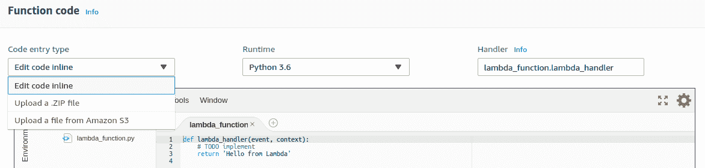

# 高级 Zappa 设置

在本章中，我们将探讨 Zappa 提供的各种设置和配置。这确实可以帮助您高效地部署应用程序。因此，有各种设置来配置应用程序。这些设置与某些 AWS 服务及其特性和功能相关。我们将通过将这些设置应用于我们在[第 9 章](09.html)中开发的现有 Quote API 应用程序*在 AWS Lambda*上异步任务执行来探索这些设置。

在本章中，我们将介绍以下主题：

*   让服务器保持温暖
*   启用 CORS
*   处理更大的项目
*   启用 bash 编译
*   缓存未处理的异常

# 技术要求

在继续前进之前，需要满足一些先决条件。为了满足先决条件，需要满足以下要求：

*   Ubuntu 16.04/Windows/macOS
*   Python 3.6
*   Pipenv 工具
*   扎帕
*   猎鹰 API
*   Python 包
*   注册域
*   AWS 帐户

在[第 9 章](09.html)、*AWS Lambda*异步任务执行中，可以使用之前配置的一些先决条件。这意味着您可以继续使用已配置的域和 AWS 服务。您可能需要更新本章的 Zappa 设置文件。

让我们继续探讨 QuoteAPI 应用程序使用的其他设置。

# 让服务器保持温暖

Zappa 启用一项功能，使 AWS Lambda 保持温暖状态。由于集装箱化，AWS Lambda 具有冷启动，因此 Lambda 要求您设置环境以执行功能。每当 AWS Lambda 收到请求时，它都会实例化 Lambda 函数及其所需的环境，并在完成请求后最终销毁实例。

这就是 AWS Lambda 的工作原理。因此，Zappa 使用 AWS CloudWatch 事件调度功能实现了该机制，以使实例化的 Lambda 实例保持温暖状态。将 Lambda 保持在温暖状态无非是每隔四分钟触发 CloudWatch 事件作为 ping 请求，以防止 Lambda 实例被破坏。

默认情况下启用此功能，但如果要禁用此功能，则可以在 Zappa 设置 JSON 文件中将`keep_warm`标志设置为`false`。

以下代码段用于禁用保温功能：

```py
{
    "dev": {
             ...
             "keep_warm": true/false
             ...
     }
}
```

在本例中，我们希望保持默认设置不变，以便应用程序始终处于温暖状态。让我们转到下一节，在那里我们将探索其他有用的设置。

# 启用 CORS

**跨源资源共享**（**CORS**）是在同一域或不同托管域上服务 API 的重要部分。AWS API 网关提供了启用 CORS 功能的功能。在 API 网关上配置 API 资源后，必须使用 API 网关 web 控制台启用 CORS。通过 API 网关资源启用 CORS 需要使用一些响应头设置`OPTION`方法，例如：

*   访问控制允许方法
*   访问控制允许标头
*   访问控制允许源

您可以查看 AWS 官方文档（[中 API 网关中配置 CORS 的手动过程 https://docs.aws.amazon.com/apigateway/latest/developerguide/how-to-cors.html](https://docs.aws.amazon.com/apigateway/latest/developerguide/how-to-cors.html) ）

Zappa 通过使用名为`cors`的设置属性，自动化了使用 API 网关资源配置 CORS 的过程，如以下代码段中所述：

```py
{
    "dev": {
             ...
             "cors": true/false
             ...
     }
}
```

Zappa 将`cors`的默认值设置为`false`。如果要为 API 资源启用 CORS，则可以将其设置为`true`。它还支持添加响应头

`"cors": true` doesn't work well with `"binary_support": true`. Hence, you can disable the API Gateway-level CORS, or you can add application-level CORS functionality.

如前所述，您还可以使用应用程序级 CORS。有很多库可用于集成 CORS，一些框架有很好的库，例如`django-cors-headers`（[https://github.com/ottoyiu/django-cors-headers](https://github.com/ottoyiu/django-cors-headers) 和烧瓶 CORS（[https://github.com/corydolphin/flask-cors](https://github.com/corydolphin/flask-cors) ）。

这就是配置 CORS 功能的全部内容。我更愿意在应用程序级别启用 CORS，因为您可以更好地控制它的处理。

# 处理大型项目

在本节中，我们将讨论通过 AWS Lamda 处理大型项目的过程。默认情况下，AWS Lambda 支持不同的代码条目类型。现在，我们将更详细地讨论此功能，因为我们将向您展示如何通过 AWS Lambda 控制台和使用 Zappa 库处理此功能。

# 使用 AWS Lambda 控制台处理较大的项目

AWS Lambda 支持三种不同的代码输入类型-内联编辑代码、上载 ZIP 文件和从 Amazon S3 上载文件，如 AWS Lambda 函数 web 控制台的以下屏幕截图所述：



此条目类型允许用户将其代码库放入 AWS Lambda 中。让我们详细说明一下：

*   **内联编辑代码**：**使用此条目类型，您可以直接通过 AWS Lambda 的 web 控制台输入代码，如前一屏幕截图所述。借助其在线编辑器，您可以编写和执行代码。这可以考虑用于一个小的代码库。**
***   **上传 ZIP 文件**：AWS Lambda 支持上传您代码库的`.zip`文件。我们在[第 1 章](01.html)、*Amazon Web Services for Serverless*中讨论了代码库的构建打包。此功能对文件大小有限制，因为它只支持上载大小为 50 MB 的文件，但对于大型项目，它还有另一个选项。*   **从 Amazon S3 上传文件**：此功能允许用户将构建包上传到 Amazon S3 存储，而不考虑大小。这意味着您可以通过 AmazonS3 上的 S3 链接参考上传的构建包。**

 **# 使用 Zappa 处理大型项目

ZAPA 在处理部署时考虑构建包大小。Zappa 只支持两种代码条目类型，即直接在 AWS Lambda 上上载.ZIP 文件和在 AmazonS3 上上载.ZIP 文件。

默认情况下，Zappa 会在 AWS Lambda 上上传构建包，但在部署大型项目的情况下，Zappa 会在 Zappa 的设置文件中提供一个要设置的`"slim_handler"`属性，如`zappa_settings.json`文件的以下代码段所述：

```py
{
    "dev": {
             ...
             "slim_handler": true/false
             ...
     }
}
```

如果项目大小大于 50MB，则将`"slim_handler"`设置为`true`。一旦设置了这个属性，ZAPPA 将自动将构建包上传到 Amazon S3 桶，并将配置 AWS lambda 处理程序函数来考虑来自 Amazon S3 桶的构建包。

# 启用 bash 选项卡编译

Bash 选项卡编译是命令行环境中的一项功能。按下*选项卡*键，将显示自动完成建议列表。Zappa 有很多命令，如果你用 Python`argcomplete`模块注册`Zappa`模块，`zappa`命令将支持选项卡编译特性。

为了获得此功能，您需要安装`argcomplete`（[https://github.com/kislyuk/argcomplete](https://github.com/kislyuk/argcomplete) 模块，无论是在您的系统上还是在虚拟环境中：

*   系统级安装：

```py
$ sudo apt update
$ sudo apt install python-argcomplete
```

*   虚拟环境安装：

```py
$ pip install argcomplete
```

配置模块后，需要在全局级别激活 Python 的`argcomplete`模块。下面是激活全局 Python`argcomplete`模块的命令：

```py
$ activate-global-python-argcomplete
```

为了向`argcomplete`注册`Zappa`模块，您需要在`~/.bashrc`文件中添加以下行：

```py
eval "$(register-python-argcomplete zappa)"
```

通过执行以下命令，在终端的当前上下文中再次对其进行源代码转换以立即生效：

```py
$ source ~/.bashrc
```

现在，一旦您向`argcomplete`注册了`Zappa`模块，Zappa 命令将在编译中可用。以下是 Zappa 命令编译的屏幕截图：


这就是如何使用`argcomplete`执行 Zappa 命令。然而，在部署过程中提高生产力将是有益的。让我们转到下一节，在那里我们将讨论捕获未处理的异常。

# 捕获未处理的异常

Zappa 提供了捕获未处理异常的功能。这将允许您处理未处理的异常，通过电子邮件、SNS 或其他来源发出警报通知。这取决于您的需求，但您可以选择任何来源来发出通知。这将非常有用，这样您就可以跟踪任何已部署环境中出现故障的任何内容。

例如，如果我们希望针对任何部署的环境向所有开发人员和 QA 工程师发送批量电子邮件通知，Zappa 提供了一种简单的方法来配置捕获未处理异常的机制。借助`exception_handler`属性，您可以绑定一个异常处理程序方法，从中可以处理异常以发送批量电子邮件通知。

以下是 Zappa 设置文件的代码片段：

```py
{
    "dev": {
        ...
        "exception_handler": "your_module.unhandled_exceptions",
    },
    ...
}
```

这里，异常处理程序是在模块中定义的方法。因此，我们将现有项目从[第 9 章](09.html)、*AWS Lambda 上的异步任务执行*修改为添加异常处理程序。

我们已经为通知配置了 AWS SNS。因此，我将通过 AWS SNS 向电子邮件发送未处理的异常。以下是我们在[第 9 章](09.html)*异步任务在 AWS Lambda 上执行的引用 API 应用程序中创建的`unhandled_exception`方法的代码片段。*

文件-`notify.py`：

```py
import os
import boto3

def unhandled_exceptions(e, event, context):
    client = boto3.client('sns', aws_access_key_id=os.environ['aws_access_key_id'],
                            aws_secret_access_key=os.environ['aws_secret_access_key'],
                            region_name='us-east-1')
    topic = client.create_topic(Name="UnhandledException")
    client.publish(Message={'exception': e, 'event': event}, TopicArn=topic['TopicArn'])
    return True # Prevent invocation retry
```

在这里，我们将异常和事件数据发布到`"UnhandledException"`主题中的订阅电子邮件中。

我们可以增强订阅以管理开发人员和 QA 工程师的电子邮件订阅列表。这就是此功能在跟踪未处理的异常时真正有用的方式。我们希望这有助于管理您的部署。

# 总结

在本章中，我们了解了 Zappa 的一些附加特性。这些特性使我们能够以非常高效的方式管理 DevOps 操作。我们还探讨了处理大型项目、实现 CORS 和管理未处理的异常。我希望您喜欢本章，并在应用程序中亲身体验这些功能。

# 问题

1.  将 AWS Lambda 保持在温暖状态有什么用？
2.  什么是 CORS？
3.  大型项目的部署流程是什么？**