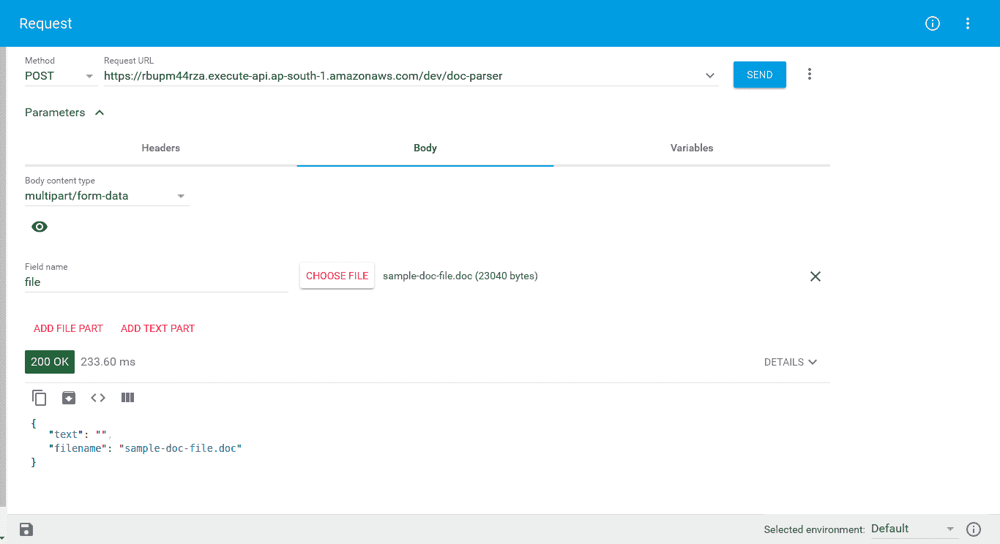
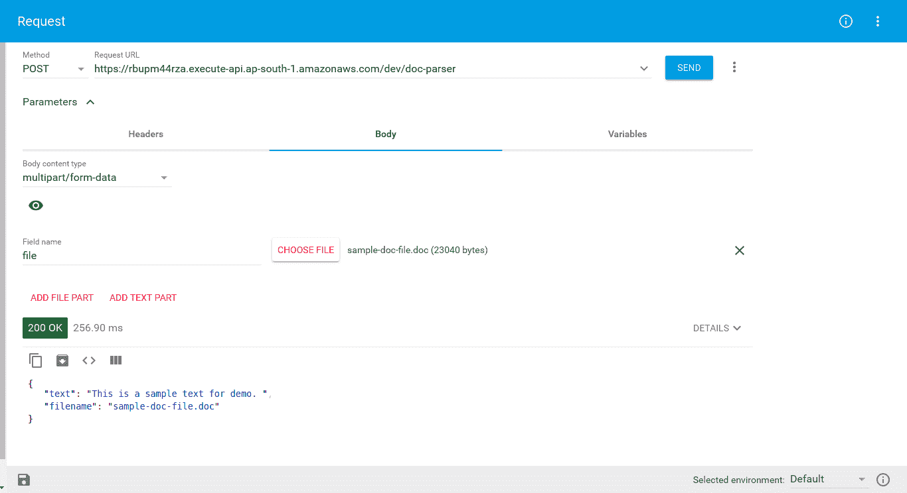

# 扎帕和多克

在本章中，我们将学习如何使用 AWS Lambda 环境或操作系统上下文而不是本地开发环境开发无服务器应用程序。我们将重点关注在不同环境背景下出现的问题，并寻找解决这些问题的有效方法。

本章将介绍的主题包括：

*   理解码头工人
*   问题陈述
*   具有自定义工具依赖项的 API 开发
*   使用 Docker 构建、测试和部署

# 技术要求

在继续之前，让我们配置一些先决条件，例如我们将需要的工具和包，以便设置开发环境。以下是您将需要的软件和软件包的列表：

*   Ubuntu 16.04/macOS/Windows
*   码头工人
*   Python 3.6
*   Pipenv 工具
*   猎鹰
*   猎鹰多部分
*   古尼科恩
*   猫医
*   扎帕

在这里，我们提到了操作系统以及其他必需的工具和软件包。选择这些操作系统中的任何一种，并按照 Docker 官方网站（[上的详细说明安装 Dockerhttps://docs.docker.com/](https://docs.docker.com/) ）。我们将在即将到来的 API 开发部分中看到有关安装特定于 Python 的包的详细信息。让我们转到下一节，在那里我们将了解 Docker 的概念。

# 理解码头工人

**Docker**是一个使用容器开发和部署应用程序的平台，Docker 基于 Docker 映像创建这些容器，Docker 映像包含与 Linux 类似的基本组件和必需组件。Docker 容器只不过是 Docker 映像的一个实例

Docker 容器具有许多支持和运行任何应用程序的功能。Docker 容器是轻量级、灵活、便携、可扩展和可堆叠的。您可以为任何服务创建容器，例如 Python 或 MySQL。Docker 使您能够通过与主机联网来共享数据。在 Docker 容器的帮助下，您可以为应用程序创建一个隔离的环境。

您可以使用堆叠服务和配置创建自己的 Docker 映像。例如，您可以使用基于 Ubuntu 映像的容器，然后在相应地配置容器之前安装 MySQL 服务。然后，我们可以在配置服务的同时构建一个新映像。最后，我们可以将图像推送到 Docker hub 存储库（[https://hub.docker.com/](https://hub.docker.com/) ），这取决于我们的存储库特权，我们是将其保密还是公开。

您可以在 Docker 的官方网站[上详细阅读并了解 Docker 技术的概念 https://docs.docker.com/get-started/#docker-概念](https://docs.docker.com/get-started/#docker-concepts)。我们将重点关注使用依赖于环境的包开发应用程序，并在 AWS Lambda 上部署。让我们转到下一节，在那里我们将讨论在开发级别维护 AWS Lambda 环境的实际情况。

# 问题陈述

尽管 Zappa 负责您已安装的 Python 软件包，并使用预编译的 Lambda 软件包（[在 Lambda 上部署它们 https://github.com/Miserlou/lambda-packages](https://github.com/Miserlou/lambda-packages) ）和虚拟环境中的控制盘，这些包可能因操作系统环境而异。因此，在某些情况下，您可能需要特定于操作系统的工具或自定义包来实现解决方案。这种包上下文可能因操作系统环境而异。因此，它可能无法在 AWS Lambda 环境中工作

为了克服不同的环境上下文问题并基于 AWS Lambda 环境维护已安装的软件包，我们需要有一个类似的开发环境上下文。因此，我们需要一个与 AWS Lambda 具有相似上下文和环境的 Docker 映像。最后，**LambCI**[https://github.com/lambci](https://github.com/lambci) 开发了一款**Docker Lambda**（[https://github.com/lambci/docker-lambda](https://github.com/lambci/docker-lambda) 图像，与 AWS Lambda 具有相同的上下文，包括系统库、文件结构、用户和权限、环境变量、，和其他上下文信息。

# 提议的解决办法

记住这一点，我们将开发一个 API 应用程序，它将具有操作系统级的工具依赖性。因此，我们将开发一个基于 Falcon 的 API 来上传一个扩展名为`.doc`的 MicrosoftOffice2003 文件。上传文件后，我们将检索并解析该文件中的文本数据，并以 JSON 格式返回。**catdoc**[http://www.wagner.pp.ru/~vitus/software/catdoc/](http://www.wagner.pp.ru/~vitus/software/catdoc/)是一个用于打印文本数据的命令实用程序，类似于内置的 Linux cat 工具。下面的代码日志片段演示了`catdoc`命令的执行：

```py
$ catdoc sample-doc-file.doc 
This is a sample text for demo.
```

现在，这个`catdoc`命令安装在操作系统级别。但在我们的 API 中，我们将以编程方式执行此命令，以解析并从`stdout`获取打印文本数据。我们的 API 可以用作解析器服务，从 MicrosoftOffice2003 格式文件中获取文本数据。

# 此解决方案的案例研究

我选择这个问题是因为很少有 Python 库可用于解析 Doc 格式的文件。我在公司开发一个应用程序，需要解析所有类型的文本文件，比如`.pdf`、`.txt`、`.docx`和`.doc`。因此，我遇到了这种情况，我必须使用依赖于操作系统的命令行工具以编程方式获取文本数据。我开发了一个解决方案，它在我本地的 Ubuntu 机器上运行得非常好；但当我尝试部署应用程序时，`catdoc`不在 Lambda 环境中，这对我来说是一个巨大的问题。

我日日夜夜地试图解决这个问题，因为我要么必须按照要求实现它，要么放弃 Zappa 的无服务器实现。放弃 Zappa 对我来说是不可能的，因为我爱上了 Zappa，并且开发了许多使用它的项目。

幸运的是，在 Zappa 的世界里，我并不孤单。我与 Zappa 社区保持联系，并会见了 João Neves 先生——一位真正的绅士，他帮助我解决了这个问题，最后，我以非常有效的方式解决了这个问题。这是 Zappa 在我的组织中的一次重大胜利。我希望大家起立为 Zappa 社区，特别是 João Neves 先生鼓掌。

让我们在下一节中展示 API 的实际实现。

# 具有自定义工具依赖项的 API 开发

我们的第一个目标是开发一个支持文件上传的 API。此 API 仅支持单个文件上载，并对文件扩展名进行验证检查。我们将仅使用`.doc`对 MS Office 文档文件执行操作。因此，此 API 将只允许`.doc`扩展文件。

# 先决条件

如本章*技术要求*部分所述，我们需要用 Python 版本 3.6 配置`pipenv`。我们使用以下命令用 Python 3.6 初始化`pipenv`环境：

```py
$ pipenv --python python3.6
```

现在，使用`pipenv install`命令安装以下软件包：

*   `falcon`
*   `flacon-multipart`
*   `gunicorn`
*   `zappa`

一旦我们安装了这些软件包，`pipenv`将创建一个`Pipfile`，如下所示：

```py
[[source]]

url = "https://pypi.python.org/simple"
verify_ssl = true
name = "pypi"

[dev-packages]

[packages]

falcon = "*"
falcon-multipart = "*"
gunicorn = "*"
zappa = "*"

[requires]

python_version = "3.6"
```

就这样，我们已经完成了安装！现在我们可以使用`pipenv shell`命令进入虚拟环境的外壳，也可以使用`pipenv run `命令在虚拟环境中运行任何命令。让我们继续实现 API。

# 实现/doc 解析器 API

API 实现将非常简单。根据我们的要求，我们只接受一个上传文件的参数。因此，此 API 将只接受 HTTP`POST`请求方法。以下是`/doc-parser`API 的代码片段：

```py
import falcon
from falcon_multipart.middleware import MultipartMiddleware
from parser import doc_to_text

class DocParserResource:
    def on_post(self, req, resp):
        """Handles POST requests"""
        try:
            file_object = req.get_param('file')

            # file validation
            if file_object.type != 'application/msword' or file_object.filename.split('.')[-1] != 'doc':
                raise ValueError('Please provide a valid MS Office 93 -2003 document file.')

            # calling _doc_to_text method from parser.py
            text = doc_to_text(file_object)
            quote = {
                'text': text,
                'file': file_object.filename
            }
            resp.media = quote
        except Exception as e:
            raise falcon.HTTPError(falcon.HTTP_500, str(e))

api = falcon.API(middleware=[MultipartMiddleware()])
api.add_route('/doc-parser', DocParserResource())
```

在这里，我们创建了一个只包含 HTTP`POST`请求的 API 资源。此 API 将接受文件属性作为多部分数据。上传文件后，我们将验证文件类型和扩展名。如果文件为`application/msword`且文件扩展名为`".doc"`，则可以继续；否则，我们将返回一个错误。

如果上传的文件有效，那么我们将继续解析文件中的文本数据，并以 JSON 格式返回数据作为响应。为了解析文件，我们在`parser.py`中编写了`doc_to_text`方法。

让我们探索 `doc_to_text` 方法并了解其工作流程。以下是`parser.py`的代码片段：

```py
import os

def doc_to_text(file_object):
    data = ''
    # save file in tmp
    filepath = os.path.join('/tmp', file_object.filename)
    with open(filepath, 'wb') as tmp_file:
        while True:
            chunk = file_object.file.read(4096)
            tmp_file.write(chunk)
            if not chunk:
                break

    # Parse and return text data
    with os.popen('catdoc -a {0}'.format(filepath), 'r') as proc:
        data = proc.read()
    return data
```

正如您在这里看到的，我们正在执行两个不同的任务。首先，我们将上传的文件存储在`/tmp directory`中，其次，我们通过使用`os.popen`命令以编程方式运行`catdoc`命令来解析文本。在`os.popen`命令的帮助下，我们阅读了`stdout of catdoc`命令。`catdoc`命令有许多选项可用。我使用`catdoc -a <doc-file>`只读取 ASCII 字符。您可以借助`man catdoc`命令来探索`catdoc`。

让我们转到下一节，在那里我们将执行这个 API。

# 在本地环境中执行

API 执行需要一个文件上传过程。因此，我建议使用 RESTAPI 客户端。在我们的例子中，我使用的是高级 REST 客户机。以下是 API 上载过程的屏幕截图：


就这样。我们的 API 正在按预期工作。现在我们有了 JSON 格式的文本数据以及文件名。现在让我们转到下一节，在那里我们将探索使用 Zappa 在 AWS Lambda 上的构建过程。我们还将探讨依赖项工具如何引发异常，以及 Docker 机制如何帮助解决该问题。

# 使用 Docker 构建、测试和部署

为了构建部署，我们需要使用`zappa init`初始化 Zappa。此命令生成交互式问卷以配置应用程序。配置 Zappa 后，它将生成`zappa_settings.json`文件。以下是`zappa_settings.json`文件的代码片段：

```py
{
    "dev": {
        "app_function": "resources.api",
        "aws_region": "ap-south-1",
        "profile_name": "default",
        "project_name": "chapter12",
        "runtime": "python3.6",
        "s3_bucket": "zappa-xl0doooe4"
    }
}
```

让我们继续使用 Zappa 进行构建，而不考虑 Docker 环境。

# 没有码头工人的建筑

在这里，我们将考虑默认生成的 Tyt0.现在使用`Zappa deploy`命令部署应用程序。以下是`zappa deploy <stage_name>`命令的日志片段：

```py
$ zappa deploy dev
Calling deploy for stage dev..
Creating chapter12-dev-ZappaLambdaExecutionRole IAM Role..
Creating zappa-permissions policy on chapter12-dev-ZappaLambdaExecutionRole IAM Role.
Downloading and installing dependencies..
 - sqlite==python36: Using precompiled lambda package
Packaging project as zip.
Uploading chapter12-dev-1531957045.zip (5.7MiB)..
100%|██████████████████████████████████████████████████████████████████████████████████████████████| 5.93M/5.93M [00:12<00:00, 372KB/s]
Scheduling..
Scheduled chapter12-dev-zappa-keep-warm-handler.keep_warm_callback with expression rate(4 minutes)!
Uploading chapter12-dev-template-1531957066.json (1.6KiB)..
100%|█████████████████████████████████████████████████████████████████████████████████████████████| 1.62K/1.62K [00:00<00:00, 3.40KB/s]
Waiting for stack chapter12-dev to create (this can take a bit)..
100%|███████████████████████████████████████████████████████████████████████████████████████████████████| 4/4 [00:09<00:00, 2.66s/res]
Deploying API Gateway..
Deployment complete!: [https://rbupm44rza.execute-api.ap-south-1.amazonaws.com/dev](https://rbupm44rza.execute-api.ap-south-1.amazonaws.com/dev)
```

现在我们已经部署了应用程序，让我们测试一下 API 的执行情况。以下是使用高级 REST 客户端执行 API 的屏幕截图：



在这里，我们试图上传相同的文件，但没有得到内容。即使是返回响应也是可以的。让我们来解决这个问题。这个问题的原因是什么？您可以使用`zappa logs <stage_name>`跟踪 Zappa 日志。

以下是`zappa logs`命令的日志片段：

```py
[1532008716236] /bin/sh: catdoc: command not found
[1532008716237] [INFO] 2018-07-19T13:58:36.237Z d4b00497-8b5b-11e8-8381-9510b412860f 103.19.39.2 - - [19/Jul/2018:13:58:36 +0000] "POST /doc-parser HTTP/1.1" 200 47 "" "" 0/68.15899999999999
```

在这里您可以看到我们得到了一个错误，该错误表示无法找到`catdoc`命令。这是真的，正如预期的那样，因为`catdoc`在 AWS Lambda 环境中不可用，并且无法在 AWS Lambda 上安装此依赖项。但是为什么我们没有得到一个例外呢？这是一个系统级错误，因为我们使用了`os.popen`方法来执行`catdoc`命令。因此，Python 不会捕获这些错误。这就是我们没有得到例外的原因。

那问题呢？我们没有希望了，因为我们不能在 AWS Lambda 上做任何事情，也不能改变 AWS Lambda 环境！

等待有人给了你一个解决方案。LambCI 发布了 Docker 图像（[https://github.com/lambci/docker-lambda](https://github.com/lambci/docker-lambda) ）这是 AWS Lambda 环境的镜像。现在你可以用这个来解决这个问题。让我们转到下一节，在那里我们将配置 Docker 环境以及所需的依赖项。

# 使用 Zappa 配置 Docker

借助 LambCI Docker 映像，我们将获得与 AWS Lambda 兼容的环境。但是，我们仍然需要有与`catdoc`实用程序相关的构建依赖项。现在，我们可以使用这个带有`build-python3.6`标记的 Docker 图像来创建 Docker 容器

以下是显示 Docker 容器创建的代码段：

```py
$ sudo docker run --name doc-parser -v "$PWD":/var/task -v ~/.aws/:/root/.aws/ -e AWS_PROFILE=default -p "8000:8000" -it lambci/lambda:build-python3.6 bash
```

正如您在前面的代码片段中所看到的，我们正在使用`docker run`命令和一些选项。这些选项用于配置容器和设置容器环境。让我们看看这些选项：

*   `run`：**此命令用于根据给定的图像标签创建和启动容器。在我们的例子中，我们使用的是`"lambci/lambda:build-python3.6"`。**
***   `--name`：此选项用于创建 Docker 容器的名称。*   **`-v`**：此选项用于将目录从主机挂载到 Docker 容器。对于多个目录，我们需要重复此选项，因为我们正在装载当前目录以及 AWS 访问凭据的 AWS CLI 目录。*   **`-e`**：此选项用于将环境变量设置到 Docker 容器中。对于多个环境变量，需要重复此选项。*   **`-p`**：此选项用于显示 Docker 容器端口并将其映射到主机。我们正在映射到端口`8000 `，以便在本地环境中测试应用程序。*   `**-it**`：此选项用于在交互模式下启动 Docker 容器，我们可以在其中与 Docker 容器交互。**

 **还有要执行的`bash`命令。此命令将使我们进入 Docker 容器的 Terminal Bash 屏幕。运行该命令后，它将启动 Docker 容器并使用 Bash 屏幕连接控制器。

查看刚才提到的选项的以下日志片段，并检查装载的文件：

```py
$ sudo docker run --name doc-parser -v "$PWD":/var/task -v ~/.aws/:/root/.aws/ -e AWS_PROFILE=default -p "8000:8000" -it lambci/lambda:build-python3.6 bash
bash-4.2# ls
parser.py Pipfile Pipfile.lock __pycache__ resources.py sample-doc-file.doc zappa_settings.json
bash-4.2# pwd
/var/task
```

如您所见，我们当前目录中的所有文件都已按照卷映射装载。现在，这个容器的上下文与 AWS Lambda 的上下文类似。因此，我们可以配置任何库或工具的任何源代码

我们现在来看看`catdoc`配置。如 catdoc 网站（[所述 http://www.wagner.pp.ru/~vitus/software/catdoc/](http://www.wagner.pp.ru/~vitus/software/catdoc/)），您可以下载源代码并通过您的系统进行编译。我们将使用`wget`工具在容器内下载`catdoc`源代码。

在此之前，我们需要在容器中安装`wget`工具，如下代码片段所示：

```py
bash-4.2# yum install wget
Resolving Dependencies
--> Running transaction check
---> Package wget.x86_64 0:1.18-3.27.amzn1 will be installed
--> Finished Dependency Resolution

Dependencies Resolved

=========================================================================================================================================================================
 Package Arch Version Repository Size
=========================================================================================================================================================================
Installing:
 wget x86_64 1.18-3.27.amzn1 amzn-updates 981 k

Transaction Summary
=========================================================================================================================================================================
Install 1 Package

Total download size: 981 k
Installed size: 2.4 M
Is this ok [y/d/N]: y
Downloading packages:
wget-1.18-3.27.amzn1.x86_64.rpm | 981 kB 00:00:01 
Running transaction check
Running transaction test
Transaction test succeeded
Running transaction
  Installing : wget-1.18-3.27.amzn1.x86_64 1/1 
  Verifying : wget-1.18-3.27.amzn1.x86_64 1/1 

Installed:
  wget.x86_64 0:1.18-3.27.amzn1 

Complete!
```

安装`wget`工具后，将`catdoc`源代码下载到文件夹中。在我们的例子中，我们将把它下载到一个`lib`文件夹中。您可以按如下方式创建`lib`和`usr`目录：

```py
bash-4.2# mkdir lib
bash-4.2# mkdir usr
bash-4.2# ls
***lib*** parser.py Pipfile Pipfile.lock __pycache__ resources.py sample-doc-file.doc ***usr*** zappa_settings.json
bash-4.2# 
```

The `lib` and `usr` directories are used by the compiled source code of any library,  hence these directories are required to maintain the binaries of compiled source code for execution.    

现在是从源代码安装`catdoc`库的时候了。您需要按照以下步骤配置库：

1.  下载`catdoc`源代码，如下代码所示：

```py
bash-4.2# wget http://ftp.wagner.pp.ru/pub/catdoc/catdoc-0.95.tar.gz -O lib/catdoc-0.95.tar.gz
--2018-07-19 23:00:39-- http://ftp.wagner.pp.ru/pub/catdoc/catdoc-0.95.tar.gz
Resolving ftp.wagner.pp.ru (ftp.wagner.pp.ru)... 78.46.190.96, 2a01:4f8:c17:2e5b::2
Connecting to ftp.wagner.pp.ru (ftp.wagner.pp.ru)|78.46.190.96|:80... connected.
HTTP request sent, awaiting response... 200 OK
Length: 217779 (213K) [application/x-gzip]
Saving to: ‘lib/catdoc-0.95.tar.gz’

lib/catdoc-0.95.tar.gz 100%[=====================================================================================>] 212.67K --.-KB/s in 0.07s 

2018-07-19 23:00:40 (2.93 MB/s) - ‘lib/catdoc-0.95.tar.gz’ saved [217779/217779]

bash-4.2# 
```

2.  现在使用`tar`命令行实用程序提取压缩文件：

```py
bash-4.2# cd lib/
bash-4.2# ls
catdoc-0.95.tar.gz
bash-4.2# tar -xf catdoc-0.95.tar.gz 
bash-4.2# ls
catdoc-0.95 catdoc-0.95.tar.gz
```

3.  接下来，进入`catdoc`源目录并使用前缀对其进行配置，以将二进制文件保持在应用程序级别，如以下代码段所示：

```py
bash-4.2# ls
catdoc-0.95 catdoc-0.95.tar.gz
bash-4.2# cd catdoc-0.95
bash-4.2# ls
acconfig.h CODING.STD configure COPYING INSTALL install-sh missing NEWS src
charsets compat configure.in doc INSTALL.dos Makefile.in mkinstalldirs README TODO
bash-4.2# ./configure --prefix=/var/task/usr/
```

4.  现在运行`make`和`make install`命令，如下所示：

```py
bash-4.2# make
...
...
...
bash-4.2# make install
```

5.  现在您会发现`catdoc`二进制文件在`/var/task/usr/`目录下可用，如下代码所示：

```py
bash-4.2# ls /var/task/usr/bin/
catdoc catppt wordview xls2csv
bash-4.2# cd /var/task/
bash-4.2# ls
lib parser.py Pipfile Pipfile.lock __pycache__ resources.py sample-doc-file.doc usr zappa_settings.json
```

6.  在`parser.py`中更改以下行，我们只是更改命令路径：

```py
import os

def doc_to_text(file_object):
    data = ''
    # save file in tmp
    filepath = os.path.join('/tmp', file_object.filename)
    with open(filepath, 'wb') as tmp_file:
        while True:
            chunk = file_object.file.read(4096)
            tmp_file.write(chunk)
            if not chunk:
                break

    # Parse and return text data
    with os.popen('./usr/bin/catdoc -a {0}'.format(filepath), 'r') as proc:
        data = proc.read()
    return data
```

就这样！我们现在在应用程序中添加了`catdoc`依赖项。此依赖项已在 Docker 容器中配置，而 Docker 容器和 AWS Lambda 环境具有相同的操作系统上下文。因此，配置的依赖项也将在 AWS Lambda 上工作。

让我们继续从容器本身部署应用程序。在初始化部署之前，我们需要使用`pipenv`安装所有必需的 Python 包：

1.  下面的日志片段显示了`pipenv install`命令：

```py
bash-4.2# pipenv install
Creating a virtualenv for this project...
Pipfile: /var/task/Pipfile
Using /var/lang/bin/python3.6m (3.6.1) to create virtualenv...
Running virtualenv with interpreter /var/lang/bin/python3.6m
Using base prefix '/var/lang'
New python executable in /root/.local/share/virtualenvs/task-rlWbeMzF/bin/python3.6m
Also creating executable in /root/.local/share/virtualenvs/task-rlWbeMzF/bin/python
Installing setuptools, pip, wheel...done.
Setting project for task-rlWbeMzF to /var/task

Virtualenv location: /root/.local/share/virtualenvs/task-rlWbeMzF
Installing dependencies from Pipfile.lock (5f0d9b)...
Ignoring futures: markers 'python_version < "3"' don't match your environment
Looking in indexes: https://pypi.python.org/simple
   ▉▉▉▉▉▉▉▉▉▉▉▉▉▉▉▉▉▉▉▉▉▉▉▉▉▉▉▉▉▉▉▉ 37/37 — 00:00:45
To activate this project's virtualenv, run pipenv shell.
Alternativaly, run a command inside the virtualenv with pipenv run.
bash-4.2# 
```

2.  现在，使用`pipenv shell`命令激活虚拟环境，如下所示：

```py
bash-4.2# pipenv shell
Please ensure that the SHELL environment variable is set before activating shell.
bash-4.2# 
```

哎呀！激活虚拟环境时出错！让我们修复它，然后再次激活虚拟环境：

```py
bash-4.2# export SHELL=/bin/bash pipenv shell
bash-4.2# pipenv shell
Spawning environment shell (/bin/bash). Use 'exit' to leave.
 . /root/.local/share/virtualenvs/task-rlWbeMzF/bin/activate
bash-4.2# . /root/.local/share/virtualenvs/task-rlWbeMzF/bin/activate
(task-rlWbeMzF) bash-4.2# 
```

我们设置了`SHELL`环境变量，然后重新运行 Zappa`shell`命令。因此，虚拟环境已被激活。现在，让我们继续。

Zappa requires an enabled virtual environment, as it builds the deployment package based on the installed packages in the virtual environment.

3.  使用`zappa deploy`命令或`zappa update`命令执行部署。我们已经部署了该应用程序，因此我们将使用`zappa update`：

```py
(task-rlWbeMzF) bash-4.2# zappa update dev
(python-dateutil 2.7.3 (/var/runtime), Requirement.parse('python-dateutil<2.7.0,>=2.6.1'), {'zappa'})
Calling update for stage dev..
Downloading and installing dependencies..
 - sqlite==python36: Using precompiled lambda package
Packaging project as zip.
Uploading chapter12-dev-1532044423.zip (6.5MiB)..
100%|████████████████████████████████████████████████████████████████████████████████████████████████████████████████████████████████| 6.78M/6.78M [00:14<00:00, 286KB/s]
Updating Lambda function code..
Updating Lambda function configuration..
Uploading chapter12-dev-template-1532044458.json (1.6KiB)..
100%|███████████████████████████████████████████████████████████████████████████████████████████████████████████████████████████████| 1.62K/1.62K [00:00<00:00, 5.20KB/s]
Deploying API Gateway..
Scheduling..
Unscheduled chapter12-dev-zappa-keep-warm-handler.keep_warm_callback.
Scheduled chapter12-dev-zappa-keep-warm-handler.keep_warm_callback with expression rate(4 minutes)!
Your updated Zappa deployment is live!: https://rbupm44rza.execute-api.ap-south-1.amazonaws.com/dev
```

4.  现在我们已经完成了部署。让我们转到下一节，探索 API 的执行。

# 在 AWS Lambda 上执行 API

您可以使用任何 REST 客户端来调试和执行 API。我们将使用高级 REST 客户端。以下屏幕截图演示了 API 的执行：



正如您在这里看到的，我们已经上传了 MS Office 文档文件，并收到了 JSON 格式的响应，所有文本数据都显示在上传的文件中。任务完成了。

# 总结

最后，我们实现了用于开发具有自定义依赖项的应用程序的解决方案。在 Docker 容器化的帮助下，我们构建了所需的`catdoc`库的二进制文件，该库是针对 Docker 容器配置的，由于 LambCI 的 Docker 映像和`build-Python3.6`标记，结果与我们预期的 AWS Lambda 类似。这就是我们使用 AWS Lambda 解决自定义依赖性问题的方法

# 问题

1.  Docker 容器是如何工作的？
2.  Docker 图像和 Docker 容器之间有什么区别？**