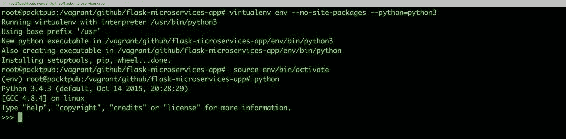
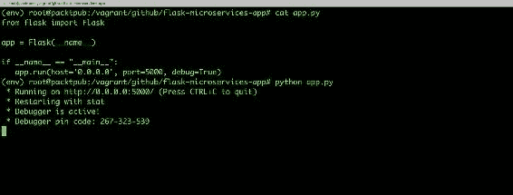
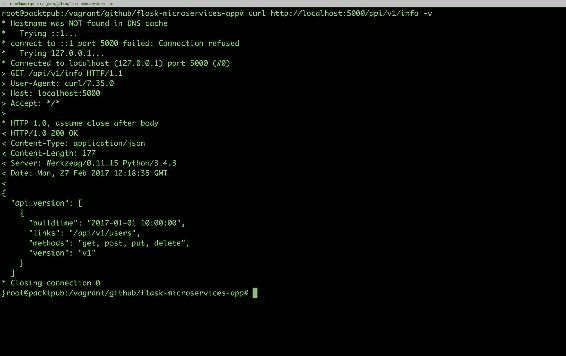
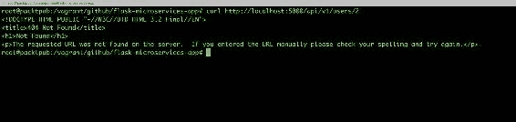
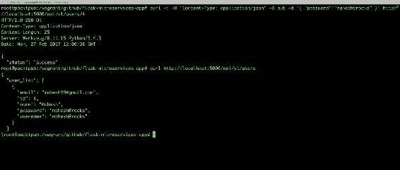
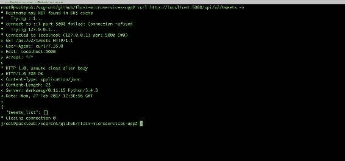
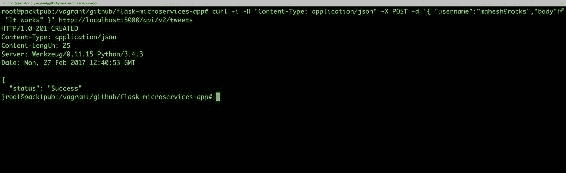
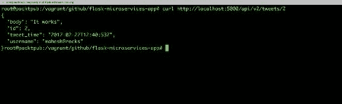

# 用 Python 构建微服务

现在，既然您了解了什么是微服务，并且有希望了解它们的主要好处，我相信您一定很想开始构建它们。在本章中，我们将立即开始编写 RESTAPI，它们作为微服务一起工作。

我们将在本章中介绍的主题如下：

*   构建 restapi
*   测试 API

# Python 概念

让我们首先了解 Python 的一些概念，我们将在本书中使用这些概念。

# 模块

模块基本上允许您以逻辑方式组织编程代码。它类似于任何其他 Python 程序。在我们只需要导入一点代码而不需要导入整个程序的情况下，需要它们。**模块**可以是一个或多个函数类的组合，也可以是多个函数类的组合。我们将使用两个内置函数，它们是 Python 库的一部分。此外，在需要的地方，我们将创建自己的模块。

以下示例代码展示了模块的结构：

```py
    #myprogram.py 
    ### EXAMPLE PYTHON MODULE
    # Define some variables:
    numberone = 1
    age = 78

    # define some functions
    def printhello():
     print "hello"

    def timesfour(input):
     print input * 4

    # define a class
    class house:
     def __init__(self):
         self.type = raw_input("What type of house? ")
         self.height = raw_input("What height (in feet)? ")
         self.price = raw_input("How much did it cost? ")
         self.age = raw_input("How old is it (in years)? ")

     def print_details(self):
         print "This house is a/an " + self.height + " foot",
         print self.type, "house, " + self.age, "years old and costing\
         " + self.price + " dollars." 

```

可以使用以下命令导入前面的模块：

```py
# import myprogram

```

# 功能

函数是一组有组织、自包含的程序，它们执行特定的任务，您可以将这些任务合并到自己的大型程序中。它们的定义如下：

```py
    # function 
    def  functionname(): 
      do something 
      return 

```

有几点需要记住：

*   缩进在 Python 程序中非常重要
*   默认情况下，参数具有位置行为，您需要按照中定义的顺序通知它们

请参见以下代码段示例，其中展示了函数：

```py
    def display ( name ): 
    #This prints a passed string into this function 
      print ("Hello" + name) 
      return;

```

您可以按如下方式调用前面的函数：

```py
    display("Manish") 
    display("Mohit") 

```

下面的屏幕截图显示了前面`display`功能的执行情况：


Note that if you have more than one Python version installed on your system, you need to use Python 3 instead of Python, which uses the default version of Python (generally, 2.7.x).

# 建模微服务

在本书中，我们将开发一个独立工作的成熟的 web 应用程序。

现在，由于我们对 Python 有了基本的了解，让我们开始对微服务进行建模并了解应用程序工作流。

下图显示了 microservices 体系结构和应用程序工作流：


# 构建微服务

在本书中，我们将使用 Flask 作为 web 框架来构建我们的微服务。**Flask**是一个功能强大的 web 框架，易学易用。此外，在 Flask 中，我们需要一些样板代码来启动和运行一个简单的应用程序。

由于我们将使用 12 因素应用程序概念创建应用程序，因此我们将首先确保有一个集中的代码库。现在，您应该知道如何创建 GitHub 存储库。如果没有，请确保您按照[第一章](01.html#LTSU0-4022ecb0f8ea4b719ffb742bf2a6a072)*介绍云本机架构和微服务*中提供的 blogpost 链接创建。我们将定期将代码推送到存储库。

假设您在本书中创建了存储库，我们将使用 GitHub 存储库（[https://github.com/PacktPublishing/Cloud-Native-Python.git](https://github.com/PacktPublishing/Cloud-Native-Python.git) ）。

因此，让我们将本地目录设置为与远程存储库同步。要确保我们位于应用程序目录中，请使用以下命令：

```py
$ mkdir Cloud-Native-Python  # Creating the directory
$ cd Cloud-Native-Python  # Changing the path to working directory
$ git init . # Initialising the local directory
$ echo "Cloud-Native-Python" > README.md  # Adding description of repository
$ git add README.md  # Adding README.md
$ git commit -am "Initial commit"  # Committing the changes
$ git remote add origin https://github.com/PacktPublishing/Cloud-Native-Python.git  # Adding to local repository
$ git push -u origin master  # Pushing changes to remote repository.

```

您将看到以下输出：


我们已成功地将第一次提交推送到远程存储库；我们将以类似的方式继续这样做，直到我们在构建微服务和应用程序方面达到一个里程碑。

现在，我们需要安装一个基于文件的数据库，比如 SQLite 版本 3，它将作为我们的微服务的数据存储。

要安装 SQLite 3，请使用以下命令：

```py
$ apt-get install sqlite3 libsqlite3-dev -y

```

我们现在可以创建并使用（源）一个`virtualenv`环境，将本地应用程序的环境与全球`site-packages`安装隔离开来。如果`virtualenv`未安装，可以使用以下命令进行安装：

```py
$ pip install virtualenv

```

现在创建`virtualenv`如下：

```py
$ virtualenv env --no-site-packages --python=python3
$ source env/bin/activate

```

我们应该看到前面命令的输出，如以下屏幕截图所示：



在`virtualenv`设置之后，目前，我们需要在 VirtualEnvironment 中安装一个依赖项。使用以下命令将一个包依赖项添加到`requirements.txt`：

```py
$ echo "Flask==0.10.1" >>  requirements.txt

```

将来，如果应用程序需要更多的依赖项，它们将进入`requirements.txt`文件中。

让我们使用需求文件将依赖项安装到`virtualenv`环境中，如下所示：

```py
$ pip install -r requirements.txt

```

现在我们已经安装了依赖项，让我们创建一个文件`app.py`，包含以下内容：

```py
    from flask import Flask 

    app = Flask(__name__) 

    if __name__ == "__main__": 
     app.run(host='0.0.0.0', port=5000, debug=True) 

```

前面的代码是使用 Flask 运行应用程序的基本结构。它基本上初始化了`Flask`变量并在端口`5000`上运行，该端口可以从任何地方（`0.0.0.0`访问）。

现在，让我们测试前面的代码，看看是否一切正常。

执行以下命令以运行应用程序：

```py
$ python app.py

```

我们应该看到前面命令的输出，如以下屏幕截图所示：



此时，在开始构建 RESTful API 之前，我们需要决定访问服务的根 URL 是什么，这将进一步决定不同方法的子 URI。考虑下面的例子：

`http://[hostname]/api/v1/`。

因为在我们的例子中，我们将使用本地机器，`hostname`可以是带有端口的`localhost`，默认情况下，对于烧瓶应用程序，`5000`。因此，我们的根 URL 如下所示：

`http://localhost:5000/api/v1/`。

现在，让我们决定将在哪些资源上执行不同的操作，哪些将由该服务公开。在本例中，我们将创建两个资源：用户和 tweet。

我们的用户和信息资源将使用以下 HTTP 方法：

| **HTTP 方式** | **URI** | **动作** |
| `GET` | `http://localhost:5000/api/v1/info` | 这将以版本进行响应 |
| `GET` | `http://localhost:5000/api/v1/users` | 这将使用用户列表进行响应 |
| `GET` | `http://localhost:5000/api/v1/users/[user_id]` | 响应将是指定的`user_id`的用户详细信息 |
| `POST` | `http://localhost:5000/api/v1/users` | 此资源将使用传递的对象的值在后端服务器中创建新用户 |
| `DELETE` | `http://localhost:5000/api/v1/users` | 此资源将删除以 JSON 格式传递指定用户名的用户 |
| `PUT` | `http://localhost:5000/api/v1/users/[user_id]` | 此资源基于作为 API 调用的一部分传递的 JSON 对象更新特定`user_id`的用户信息。 |

使用客户端，我们将对资源执行操作，例如`add`、`remove`、`modify`等等。

在本章的范围内，我们将使用基于文件的数据库，如 SQLite 3，我们在前面已经安装了它。

让我们开始创建我们的第一个资源，即`/api/v1/info`，并显示可用版本及其发布详细信息。

在此之前，我们需要创建一个`apirelease`表模式，如 SQLite 3 中定义的，它将包含有关 API 版本发布的信息。这可以通过以下方式完成：

```py
CREATE TABLE apirelease(
buildtime date,
version varchar(30) primary key,
links varchar2(30), methods varchar2(30));

```

创建后，您可以使用以下命令为我们的第一个版本（`v1`）将记录添加到 SQLite 3 中：

```py
Insert into apirelease values ('2017-01-01 10:00:00', "v1", "/api/v1/users", "get, post, put, delete");

```

让我们在`app.py`中定义路由`/api/v1/info`和函数，它将基本上处理`/api/v1/info`路由上的 RESTful 调用。具体做法如下：

```py
    from flask import jsonify 
    import json 
    import sqlite3 
    @app.route("/api/v1/info") 
    def home_index(): 
      conn = sqlite3.connect('mydb.db') 
      print ("Opened database successfully"); 
      api_list=[] 
      cursor = conn.execute("SELECT buildtime, version,
      methods, links   from apirelease") 
    for row in cursor: 
        a_dict = {} 
        a_dict['version'] = row[0] 
        a_dict['buildtime'] = row[1] 
        a_dict['methods'] = row[2] 
        a_dict['links'] = row[3] 
        api_list.append(a_dict) 
    conn.close() 
    return jsonify({'api_version': api_list}), 200 

```

现在我们已经添加了一个路由和它的句柄，让我们在`http://localhost:5000/api/v1/info`上进行一个 RESTful 调用，如此屏幕截图所示：



令人惊叹的它起作用了！！

让我们转到`/api/v1/users`资源，它将帮助我们对用户的记录执行各种操作。

我们可以将用户定义为具有以下字段：

*   `id`：这是用户的唯一标识符（数字类型）
*   `username`：用户身份验证的唯一标识符或`handler`（字符串类型）
*   `emailid`：这是用户的电子邮件（字符串类型）
*   `password`：用户密码（字符串类型）
*   `full_name`：用户全名（字符串类型）

要在 SQLite 中创建用户的表架构，请使用以下命令：

```py
CREATE TABLE users( 
username varchar2(30), 
emailid varchar2(30), 
password varchar2(30), full_name varchar(30), 
id integer primary key autoincrement); 

```

# 构建资源用户方法

让我们定义用户资源的`GET`方法。

# 获取/api/v1/users

`GET/api/v1/users`方法显示所有用户的列表。

让我们通过在`app.py`中添加以下代码片段来创建`/api/v1/users`路由：

```py
    @app.route('/api/v1/users', methods=['GET']) 
    def get_users(): 
      return list_users() 

```

现在我们已经添加了路由，我们需要定义`list_users()`函数，它将与数据库连接以获得完整的用户列表。将以下代码添加到`app.py`：

```py
    def list_users():
    conn = sqlite3.connect('mydb.db')
    print ("Opened database successfully");
    api_list=[]
    cursor = conn.execute("SELECT username, full_name,
    email, password, id from users")
    for row in cursor:
    a_dict = {}
    a_dict['username'] = row[0]
    a_dict['name'] = row[1]
    a_dict['email'] = row[2]
    a_dict['password'] = row[3]
    a_dict['id'] = row[4]
    api_list.append(a_dict)
    conn.close()
      return jsonify({'user_list': api_list}) 

```

现在我们已经为它添加了路由和句柄，让我们测试检查`http://localhost:5000/api/v1/users`URL，如下所示：


# GET/api/v1/users/[user\u id]

`GET/api/v1/users/[user_id]`方法显示`user_id`定义的用户详细信息。

让我们按照如下方式创建将`GET`请求前置到`app.py`文件的路由：

```py
   @app.route('/api/v1/users/<int:user_id>', methods=['GET']) 
   def get_user(user_id): 
     return list_user(user_id) 

```

正如您在前面的代码中所看到的，我们将`list_user(user_id)`路由调用到`list_user(user)`函数中，该函数在`app.py`中尚未定义。让我们在`app.py`文件中定义它以获取指定用户的详细信息，如下所示：

```py
    def list_user(user_id): 
      conn = sqlite3.connect('mydb.db') 
      print ("Opened database successfully"); 
      api_list=[] 
      cursor=conn.cursor() 
      cursor.execute("SELECT * from users where id=?",(user_id,)) 
      data = cursor.fetchall() 
      if len(data) != 0: 
         user = {} 
               user['username'] = data[0][0] 
         user['name'] = data[0][1] 
         user['email'] = data[0][2] 
         user['password'] = data[0][3] 
         user['id'] = data[0][4] 
            conn.close() 
            return jsonify(a_dict) 

```

现在我们已经添加了`list_user(user_id)`函数，让我们测试一下，看看是否一切正常：



哎呀！似乎 ID 不存在；通常，如果 ID 不存在，Flask 应用程序会以带有`404`错误的 HTML 消息响应。由于这是一个 web 服务应用程序，并且我们得到了其他 API 的 JSON 响应，因此我们需要为`404`错误编写`handler`，这样，它就可以用 JSON 响应，而不是 HTML 响应，即使是错误也是如此。例如，`404`错误处理参见以下代码。现在，服务器将以适当的消息响应，这些消息是代码的一部分，如下所示：

```py
    from flask import make_response 

    @app.errorhandler(404) 
    def resource_not_found(error): 
      return make_response(jsonify({'error':
      'Resource not found!'}),  404) 

```


此外，您还可以从 Flask 中添加`abort`库，它基本上用于调用异常。类似地，您可以为不同的 HTTP 错误代码创建多个错误处理程序。

既然我们的`GET`方法工作正常，我们将继续编写`POST`方法，类似于向用户列表中添加新用户。

有两种方法将数据传递到`POST`方法中，如下所示：

*   **JSON**：在这种方法中，我们以对象的形式传递 JSON 记录，作为请求的一部分。RESTful API 调用如下所示：

```py
curl -i -H "Content-Type: application/json" -X POST -d {"field1":"value"} resource_url 

```

*   **参数化**：在这种方法中，我们将记录的值作为参数传递，如下所示：

```py
curl -i -H "Content-Type: application/json" -X POST resource_url?field1=val1&field2=val2 

```

在 JSON 方法中，我们以`json`的形式提供输入数据，并以相同的方式读取。另一方面，在参数化方法中，我们以 URL 参数的形式提供输入数据（即，`username`等），并以相同的方式读取数据。

还请注意，在后端创建的 API 将随所进行的 API 调用的类型而变化。

# POST/api/v1/users

在这本书中，我们使用第一种方法`POST`方法。那么，让我们在`app.py`中定义`post`方法的路由，并调用函数将用户记录更新到数据库文件中，如下所示：

```py
    @app.route('/api/v1/users', methods=['POST']) 
    def create_user(): 
      if not request.json or not 'username' in request.json or not
      'email' in request.json or not 'password' in request.json: 
        abort(400) 
     user = { 
        'username': request.json['username'], 
        'email': request.json['email'], 
        'name': request.json.get('name',""), 
        'password': request.json['password'] 
     } 
      return jsonify({'status': add_user(user)}), 201 

```

如您所见，在前面的方法中，我们调用了异常，错误代码为`400`；现在让我们编写它的处理程序：

```py
    @app.errorhandler(400) 
    def invalid_request(error): 
       return make_response(jsonify({'error': 'Bad Request'}), 400) 

```

我们仍然需要定义`add_user(user)`函数，它将更新新的用户记录。我们在`app.py`中定义如下：

```py
    def add_user(new_user): 
     conn = sqlite3.connect('mydb.db') 
     print ("Opened database successfully"); 
     api_list=[] 
     cursor=conn.cursor() 
     cursor.execute("SELECT * from users where username=? or
      emailid=?",(new_user['username'],new_user['email'])) 
    data = cursor.fetchall() 
    if len(data) != 0: 
        abort(409) 
    else: 
       cursor.execute("insert into users (username, emailid, password,
   full_name) values(?,?,?,?)",(new_user['username'],new_user['email'],
    new_user['password'], new_user['name'])) 
       conn.commit() 
       return "Success" 
    conn.close() 
    return jsonify(a_dict) 

```

现在我们已经添加了`handler`以及用户的`POST`方法的路由，让我们通过使用以下 API 调用添加一个新用户来测试它：

```py
curl -i -H "Content-Type: application/json" -X POST -d '{
"username":"mahesh@rocks", "email": "mahesh99@gmail.com",
"password": "mahesh123", "name":"Mahesh" }' 
http://localhost:5000/api/v1/users

```

然后，验证用户的列表卷曲`http://localhost:5000/api/v1/users`，如下图所示：


# 删除/api/v1/users

`delete`方法有助于删除由用户名定义的特定记录。我们将`username`作为需要从数据库中删除的 JSON 对象传递。

下面的代码片段将在`app.py`中为用户的`DELETE`方法创建一个新路由：

```py
    @app.route('/api/v1/users', methods=['DELETE']) 
    def delete_user(): 
     if not request.json or not 'username' in request.json: 
        abort(400) 
     user=request.json['username'] 
      return jsonify({'status': del_user(user)}), 200 

```

在下一个代码段中，我们将调用`del_user`，在验证`username`指定的用户记录是否存在后，删除该记录：

```py
    def del_user(del_user): 
      conn = sqlite3.connect('mydb.db') 
      print ("Opened database successfully"); 
      cursor=conn.cursor() 
      cursor.execute("SELECT * from users where username=? ",
      (del_user,)) 
      data = cursor.fetchall() 
      print ("Data" ,data) 
      if len(data) == 0: 
        abort(404) 
      else: 
       cursor.execute("delete from users where username==?",
       (del_user,)) 
       conn.commit() 
         return "Success" 

```

伟大的我们为用户资源的`DELETE`方法增加了路由`/handler`；让我们使用以下`test`API 调用来测试它：

```py
    curl -i -H "Content-Type: application/json" -X delete -d '{ 
"username":"manish123" }' http://localhost:5000/api/v1/users

```

然后，点击用户列表 API（`curl http://localhost:5000/api/v1/users`）查看是否进行了更改：


令人惊叹的用户删除成功。

# PUT/api/v1/users

PUT API 基本上帮助我们更新`user_id`指定的用户记录。

继续使用`PUT`方法创建一条路由，更新`app.py`文件中定义的`user`记录，如下所示：

```py
    @app.route('/api/v1/users/<int:user_id>', methods=['PUT']) 
    def update_user(user_id): 
     user = {} 
     if not request.json: 
         abort(400) 
     user['id']=user_id 
     key_list = request.json.keys() 
     for i in key_list: 
        user[i] = request.json[i] 
     print (user) 
     return jsonify({'status': upd_user(user)}), 200 

```

让我们指定`upd_user(user)`函数的定义，它基本上通过检查用户`id`是否存在来更新数据库中的信息：

```py
    def upd_user(user): 
      conn = sqlite3.connect('mydb.db') 
      print ("Opened database successfully"); 
      cursor=conn.cursor() 
      cursor.execute("SELECT * from users where id=? ",(user['id'],)) 
      data = cursor.fetchall() 
      print (data) 
      if len(data) == 0: 
        abort(404) 
      else: 
        key_list=user.keys() 
        for i in key_list: 
            if i != "id": 
                print (user, i) 
                # cursor.execute("UPDATE users set {0}=? where id=? ",
                 (i, user[i], user['id'])) 
                cursor.execute("""UPDATE users SET {0} = ? WHERE id =
                ?""".format(i), (user[i], user['id'])) 
                conn.commit() 
        return "Success" 

```

现在我们已经为用户资源的`PUT`方法添加了 API 句柄，下面我们测试一下：



我们已经定义了属于版本`v1`的资源。现在，让我们定义下一个版本版本`v2`，它将为我们的微服务添加一个 tweet 资源。允许在用户资源中定义的用户在其 tweet 上执行操作。现在，`/api/info`将显示如下：


我们的推文资源将使用以下`HTTP`方法：

| **HTTP 方式** | **URI** | **动作** |
| `GET` | `http://localhost:5000/api/v2/tweets` | 这将检索 tweets 列表 |
| `GET` | `http://localhost:5000/api/v2/users/[user_id]` | 这将检索给定特定 ID 的 tweet |
| `POST` | `http://localhost:5000/api/v2/tweets` | 此资源将使用作为 API 调用的一部分传递到后端数据库的 JSON 数据注册新 tweet |

我们可以将 tweet 定义为具有以下字段：

*   `id`：这是每条推文的唯一标识符（数字类型）
*   `username`：应该作为用户存在于用户资源中（字符串类型）
*   `body`：这是 tweet 的内容（字符串类型）
*   `Tweet_time`：（指定类型）

您可以在 SQLite 3 中定义前面的 tweets 资源模式，如下所示：

```py
CREATE TABLE tweets( 
id integer primary key autoincrement, 
username varchar2(30), 
body varchar2(30), 
tweet_time date); 

```

伟大的 tweets 资源模式已准备就绪；让我们为 tweets 资源创建`GET`方法。

# 构建资源推文方法

在本节中，我们将使用不同的方法为 tweet 资源创建 api，这将帮助我们在 tweet 的后端数据库上执行不同的操作。

# 获取/api/v2/tweets

此方法列出所有用户的所有 tweet。

将以下代码添加到`app.py`以添加`GET`方法的路由：

```py
    @app.route('/api/v2/tweets', methods=['GET']) 
    def get_tweets(): 
      return list_tweets() 
    Let's define list_tweets() function which connects to database and
    get us all the tweets and respond back with tweets list 

   def list_tweets(): 
     conn = sqlite3.connect('mydb.db') 
     print ("Opened database successfully"); 
     api_list=[] 
     cursor = conn.execute("SELECT username, body, tweet_time, id from 
     tweets") 
    data = cursor.fetchall() 
    if data != 0: 
        for row in cursor: 
            tweets = {} 
            tweets['Tweet By'] = row[0] 
            tweets['Body'] = row[1] 
            tweets['Timestamp'] = row[2] 
    tweets['id'] = row[3] 
            api_list.append(tweets) 
    else: 
        return api_list 
    conn.close() 
    return jsonify({'tweets_list': api_list}) 

```

现在，我们已经添加了一个函数来获取完整的 tweets 列表，让我们通过如下方式进行 RESTful API 调用来测试前面的代码：



目前，我们还没有添加任何 tweet，这就是它返回空集的原因。让我们添加一些 tweet。

# POST/api/v2/tweets

POST 方法添加指定用户的新 tweet。

在`app.py`中添加以下代码，为 tweets 资源的`POST`方法添加路由：

```py
    @app.route('/api/v2/tweets', methods=['POST']) 
    def add_tweets(): 
      user_tweet = {} 
      if not request.json or not 'username' in request.json or not 
     'body' in request.json: 
        abort(400) 
    user_tweet['username'] = request.json['username'] 
    user_tweet['body'] = request.json['body'] 
    user_tweet['created_at']=strftime("%Y-%m-%dT%H:%M:%SZ", gmtime()) 
    print (user_tweet) 
    return  jsonify({'status': add_tweet(user_tweet)}), 200 

```

让我们添加`add_tweet(user_tweet)`的定义来添加指定用户的推文，如下所示：

```py
    def add_tweet(new_tweets): 
      conn = sqlite3.connect('mydb.db') 
      print ("Opened database successfully"); 
      cursor=conn.cursor() 
      cursor.execute("SELECT * from users where username=? ",
   (new_tweets['username'],)) 
    data = cursor.fetchall() 

    if len(data) == 0: 
        abort(404) 
    else: 
       cursor.execute("INSERT into tweets (username, body, tweet_time)
    values(?,?,?)",(new_tweets['username'],new_tweets['body'], 
    new_tweets['created_at'])) 
       conn.commit() 
       return "Success" 

```

现在，我们已经添加了将 tweets 列表添加到数据库的函数，让我们通过如下方式进行 RESTful API 调用来测试前面的代码：

```py
curl -i -H "Content-Type: application/json" -X POST -d '{
"username":"mahesh@rocks","body": "It works" }' 
http://localhost:5000/api/v2/tweets  

```

我们应该看到前面 API 调用的输出类似于以下屏幕截图：



让我们通过检查 tweets 状态来检查 tweets 是否成功添加：

```py
curl http://localhost:5000/api/v2/tweets -v

```


现在我们已经添加了第一条 tweet，如果我们只需要查看具有特定 ID 的 tweet，该怎么办？在这种情况下，我们使用带有`user_id`的`GET`方法。

# GET/api/v2/tweets/[id]

`GET`方法列出指定 ID 发出的推文。

将以下代码添加到`app.py`中，以添加具有指定 ID 的`GET`方法的路由：

```py
    @app.route('/api/v2/tweets/<int:id>', methods=['GET']) 
    def get_tweet(id): 
      return list_tweet(id) 

```

让我们定义`list_tweet()`函数，它连接到数据库，获取具有指定 ID 的 tweet，并用 JSON 数据进行响应。具体做法如下：

```py
     def list_tweet(user_id): 
       print (user_id) 
       conn = sqlite3.connect('mydb.db') 
       print ("Opened database successfully"); 
       api_list=[] 
      cursor=conn.cursor() 
      cursor.execute("SELECT * from tweets  where id=?",(user_id,)) 
      data = cursor.fetchall() 
      print (data) 
      if len(data) == 0: 
        abort(404) 
     else: 

        user = {} 
        user['id'] = data[0][0] 
        user['username'] = data[0][1] 
        user['body'] = data[0][2] 
        user['tweet_time'] = data[0][3] 

    conn.close() 
    return jsonify(user) 

```

现在我们已经添加了获取具有指定 ID 的 tweet 的函数，让我们通过在以下位置进行 RESTful API 调用来测试前面的代码：

```py
curl http://localhost:5000/api/v2/tweets/2

```



通过添加 tweet，我们成功地构建了 restfulapi，它作为访问数据和执行各种操作所需的微服务一起工作。

# 测试 RESTful API

到目前为止，我们一直在构建 RESTful API 并点击根 URL 的 URL 以查看响应，并了解不同的方法在后端是否正常工作。因为它是新代码，所以应该 100%测试所有内容，以确保它在生产环境中正常工作。在本节中，我们将编写测试用例，这些测试用例应该单独工作，也可以作为一个系统工作，以确保完整的后端服务适合于生产。

有不同类型的测试，其定义如下：

*   **功能测试**：主要用于测试组件或系统的功能。我们根据组件的功能规范进行测试。
*   **非功能测试**：这种测试是针对组件的质量特性进行的，包括效率测试、可靠性测试等。
*   **结构测试**：这类测试用于测试系统的结构。为了编写测试用例，测试人员需要了解代码的内部实现。

在本节中，我们将针对我们的应用程序编写测试用例，特别是单元测试用例。我们将编写自动运行的 Python 代码，测试所有 API 调用，并返回测试结果。

# 单元测试

单元测试是测试被测试系统中的工作单元或逻辑单元的一段代码。以下是单元测试用例的特征：

*   **自动**：自动执行
*   **独立**：不应该有依赖关系
*   **一致可重复**：应保持幂等性
*   **可维护**：应该足够容易理解和更新

我们将使用一个名为**nose**的单元测试框架。作为替代方案，我们可以使用 docstest（`https://docs.python.org/2/library/doctest.html`）进行测试。

那么，让我们使用以下命令使用`pip`安装 nose：

```py
$ pip install nose 

```

或者，您可以将其放入`requirement.txt`中，使用以下命令进行安装：

```py
$ pip install -r requirements.txt

```

现在我们已经安装了 nose 测试框架，让我们开始在一个单独的文件中编写初始测试用例，比如说，`flask_test.py`，如下所示：

```py
    from app import app 
    import unittest 

   class FlaskappTests(unittest.TestCase): 
     def setUp(self): 
        # creates a test client 
        self.app = app.test_client() 
        # propagate the exceptions to the test client 
        self.app.testing = True 

```

前面的代码将测试应用程序并用我们的应用程序初始化`self.app`。

让我们编写测试用例来获取`GET``/api/v1/users`的响应代码，并将其添加到我们的 FlaskappTest 类中，如下所示：

```py
    def test_users_status_code(self): 
        # sends HTTP GET request to the application 
        result = self.app.get('/api/v1/users') 
        # assert the status code of the response 
        self.assertEqual(result.status_code, 200) 

```

前面的代码将测试我们在`/api/v1/users`上得到的响应是否为`200`；否则，它将抛出一个错误，我们的测试将失败。如您所见，由于此代码与任何其他代码都没有任何依赖关系，因此我们将其称为单元测试用例。

现在，如何运行此代码？由于我们已经安装了 nose 测试框架，只需从测试用例文件的当前工作目录执行以下命令（在本例中为`flask_test.py`）：

```py
$ nosetests

```

伟大的类似地，让我们为 RESTful API 编写更多的测试用例，用于我们在本章前面创建的资源的不同方法。

*   GET`/api/v2/tweets`测试用例如下：

```py
    def test_tweets_status_code(self): 
        # sends HTTP GET request to the application 
        result = self.app.get('/api/v2/tweets') 
        # assert the status code of the response 
        self.assertEqual(result.status_code, 200) 

```

*   GET`/api/v1/info`测试用例如下：

```py
    def test_tweets_status_code(self): 
        # sends HTTP GET request to the application 
        result = self.app.get('/api/v1/info') 
        # assert the status code of the response 
        self.assertEqual(result.status_code, 200) 

```

*   POST`/api/v1/users`测试用例是这样写的：

```py
    def test_addusers_status_code(self): 
        # sends HTTP POST request to the application 
        result = self.app.post('/api/v1/users', data='{"username":
   "manish21", "email":"manishtest@gmail.com", "password": "test123"}',
   content_type='application/json') 
        print (result) 
        # assert the status code of the response 
        self.assertEquals(result.status_code, 201) 

```

*   PUT`/api/v1/users`测试用例如下：

```py
    def test_updusers_status_code(self): 
        # sends HTTP PUT request to the application 
        # on the specified path 
        result = self.app.put('/api/v1/users/4', data='{"password": 
   "testing123"}', content_type='application/json') 
        # assert the status code of the response 
        self.assertEquals(result.status_code, 200) 

```

*   POST`/api/v1/tweets`测试用例如下：

```py
    def test_addtweets_status_code(self): 
        # sends HTTP GET request to the application 
        # on the specified path 
        result = self.app.post('/api/v2/tweets', data='{"username": 
   "mahesh@rocks", "body":"Wow! Is it working #testing"}', 
   content_type='application/json') 

        # assert the status code of the response 
        self.assertEqual(result.status_code, 201) 

```

*   删除`/api/v1/users`测试用例如下：

```py
    def test_delusers_status_code(self): 
        # sends HTTP Delete request to the application 
        result = self.app.delete('/api/v1/users', data='{"username": 
   "manish21"}', content_type='application/json') 
        # assert the status code of the response 
        self.assertEquals(result.status_code, 200) 

```

类似地，您可以根据自己的想法编写更多的测试用例，以使这些 RESTful API 更加可靠和无 bug。

让我们一起执行所有测试，并检查是否所有测试都已通过。以下屏幕截图显示了`flask_test.py`脚本的测试结果：


令人惊叹的既然我们的所有测试都通过了，我们就可以开始围绕这些 RESTful API 创建 web 页面了。

# 总结

在本章中，我们着重于编写大量代码来构建我们的微服务。我们基本上了解了 RESTful API 的工作原理。我们还了解了如何扩展这些 API，并确保通过这些 API 给出的响应来理解`HTTP`响应。此外，您还学习了如何编写测试用例，这对于确保我们的代码运行良好并适合于生产环境非常重要。