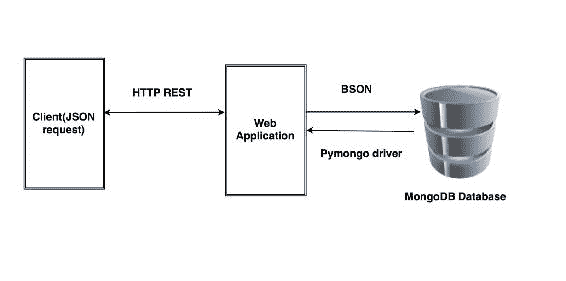
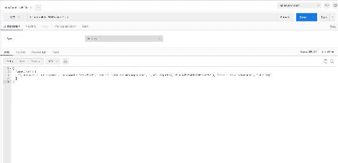
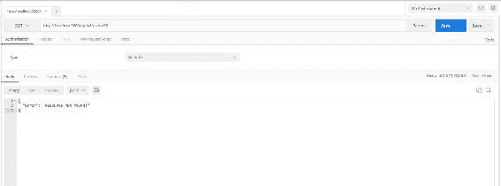
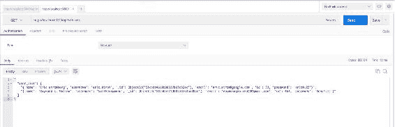
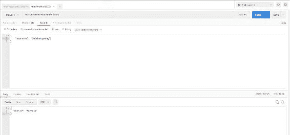
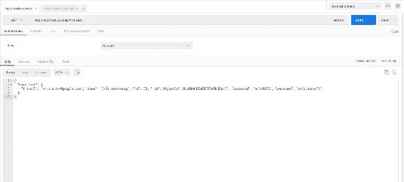
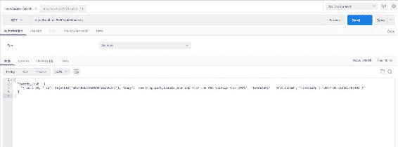
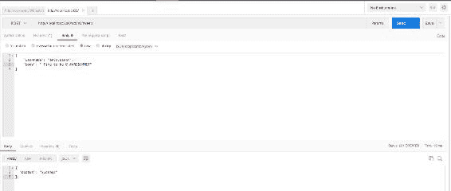

# 交互数据服务

在上一章中，我们使用 JavaScript/HTML 构建了我们的应用程序，并将其与 RESTful API 和 AJAX 集成在一起。您还学习了如何在客户端和服务器上设置 Cookie，为用户提供更好的体验。在本章中，我们将重点介绍如何使用 NoSQL 数据库（如 MongoDB）来改进后端数据库，而不是使用我们目前正在使用的 SQLite 数据库或 MySQL 数据库，并将我们的应用程序与之集成。

我们将在本章中介绍的主题如下：

*   设置 MongoDB 服务
*   将应用程序与 MongoDB 集成

# MongoDB—它的优势是什么，我们为什么要使用它？

在开始安装 MongoDB 之前，让我们先了解一下为什么选择 MongoDB 数据库以及它的用途。

让我们来看看 MangGDB 优于 RDBMS 的优点：

*   **灵活模式**：MongoDB 是一个文档数据库，其中一个集合包含多个文档。我们不需要在插入数据之前定义文档的模式，这意味着 MongoDB 根据插入到文档中的数据定义文档的模式；然而，在 RDBMS 中，我们需要在向表中插入数据之前定义表的模式。
*   **复杂性更低**：MongoDB 中没有复杂的连接，就像我们在 RDBMS（例如 MySQL）数据库中所做的那样。
*   **更容易扩展**：与 RDBMS 相比，MongoDB 更容易扩展。
*   **快速可访问性**：与 RDBMS（即 MySQL 数据库）相比，MongoDB 的数据检索速度更快。
*   **动态查询**：MongoDB 支持文档的动态查询，是一种基于文档的查询语言，相对于其他关系型数据库（可能是 MySQL）具有优势。

以下是我们应该使用 MongoDB 的原因：

*   MongoDB 将数据存储在 JSON 样式的文档中，这使得它易于与应用程序集成
*   我们可以在任何文件和属性上设置索引
*   MongoDB 实现了自动分片，这使得它易于管理，并且速度更快
*   MongoDB 在集群中使用时提供复制和高可用性

使用 MongoDB 有不同的用例。让我们在这里检查一下：

*   大数据
*   用户数据管理
*   内容交付和管理

下图显示了 MongoDB 与 web 应用程序集成的体系结构图：



# MongoDB 术语

让我们看看 MongoDB 的不同术语，下面列出：

*   **数据库**：这与**RDBMS（关系数据库管理系统）中的数据库类似，但在 MongoDB 中，数据库不是表，而是集合的物理容器。MongoDB 可以有多个数据库。**
*   **集合**：这基本上是有自己模式的文档组合。集合对文档的模式没有贡献。它相当于 RDBMS 中的表。
*   **文档**：类似于 RDBMS 中的元组/行。这是一组键值对。它们有一个动态模式，其中每个文档在单个集合中可能有也可能没有相同的模式。他们也可能有不同的领域。

以下代码是供您理解的示例集合：

```py
    {  
       _id : ObjectId(58ccdd1a19b08311417b14ee),  
       body : 'New blog post,Launch your app with the AWS Startup Kit!  
       #AWS', 
       timestamp : "2017-03-11T06:39:40Z", 
       id : 18, 
       tweetedby : "eric.strom" 
   } 

```

MongoDB 以称为**BSON**的二进制编码格式表示 JSON 文档。

# 建立 MongoDB

在当前场景中，我们正在 Ubuntu 工作站上工作，因此让我们在 Ubuntu 上安装 MongoDB，如下所示。

我们将使用 Ubuntu 软件包管理工具，如`apt`，通过使用 GPG 密钥验证发行商签署的软件包，来安装 MongoDB 软件包。

要导入 GPG 密钥，请使用以下命令：

```py
$ sudo apt-key adv --keyserver hkp://keyserver.ubuntu.com:80 --recv EA312927

```

接下来，我们需要设置操作系统的 MongoDB 存储库路径，如下所示：

```py
$ echo "deb http://repo.mongodb.org/apt/ubuntu trusty/mongodb-org/3.2 multiverse" | sudo tee /etc/apt/sources.list.d/mongodb-org-3.2.list

```

添加后，我们需要更新 Ubuntu 存储库，如下所示：

```py
$ sudo apt-get update  

```

现在存储库已经更新，让我们使用以下命令安装最新的稳定 MongoDB 版本：

```py
$ sudo apt-get install -y mongodb-org

```

安装后，MongoDB 服务应在端口`27017`上运行。我们可以使用以下命令检查服务状态：

```py
$ sudo service mongodb status

```

如果服务未运行，您可以通过执行以下命令来启动服务：

```py
$ sudo service mongodb start

```

伟大的现在我们已经在本地机器上安装了 MongoDB。此时，我们只需要一个独立的 MongoDB 实例，但是如果您想要创建一个共享的 MongoDB 集群，那么您可以按照以下链接中定义的步骤进行操作：

[https://docs.mongodb.com/manual/tutorial/deploy-shard-cluster/](https://docs.mongodb.com/manual/tutorial/deploy-shard-cluster/)

因此，现在我们已经在机器上启用了 MongoDB 服务，我们可以在上面创建一个数据库了。

# 初始化 MongoDB 数据库

以前，在 SQLite3 中创建数据库时，我们需要手动创建数据库并定义表的模式。由于 MongoDB 是无模式的，我们将直接添加新文档，集合将自动创建。此外，在本例中，我们将仅使用 Python 初始化数据库。

在向 MongoDB 添加新文档之前，我们需要为其安装 Python 驱动程序，即`pymongo`。

将`pymongo`驱动程序添加到`requirements.txt`中，然后使用`pip`包管理器安装，如下所示：

```py
$echo "pymongo==3.4.0" >> requirements.txt
$ pip install -r requirements.txt

```

一旦安装，我们将通过在`app.py`中添加以下行来导入它：

```py
from pymongo import MongoClient

```

现在我们已经为 Python 导入了 MongoDB 驱动程序，我们将创建一个到 MongoDB 的连接，并在`app.py`中定义一个函数，该函数将使用初始**数据文档**初始化数据库，如下所示：

```py
    connection = MongoClient("mongodb://localhost:27017/") 
    def create_mongodatabase(): 
    try: 
       dbnames = connection.database_names() 
       if 'cloud_native' not in dbnames: 
           db = connection.cloud_native.users 
           db_tweets = connection.cloud_native.tweets 
           db_api = connection.cloud_native.apirelease 

           db.insert({ 
           "email": "eric.strom@google.com", 
           "id": 33, 
           "name": "Eric stromberg", 
           "password": "eric@123", 
           "username": "eric.strom" 
           }) 

           db_tweets.insert({ 
           "body": "New blog post,Launch your app with the AWS Startup
           Kit! #AWS", 
           "id": 18, 
           "timestamp": "2017-03-11T06:39:40Z", 
           "tweetedby": "eric.strom" 
           }) 

           db_api.insert( { 
             "buildtime": "2017-01-01 10:00:00", 
             "links": "/api/v1/users", 
             "methods": "get, post, put, delete", 
             "version": "v1" 
           }) 
           db_api.insert( { 
             "buildtime": "2017-02-11 10:00:00", 
             "links": "api/v2/tweets", 
             "methods": "get, post", 
             "version": "2017-01-10 10:00:00" 
           }) 
           print ("Database Initialize completed!") 
       else: 
           print ("Database already Initialized!")
       except: 
           print ("Database creation failed!!") 

```

建议您使用集合中的一些文档初始化资源集合，以便在开始测试 API 时获得一些响应数据，否则，您可以不初始化集合而继续。

应在启动应用程序之前调用前面的函数；我们的主要功能如下：

```py
   if __name__ == '__main__': 
     create_mongodatabase() 
     app.run(host='0.0.0.0', port=5000, debug=True) 

```

# 将微服务与 MongoDB 集成

既然我们已经初始化了 MongoDB 数据库，现在是时候重写我们的微服务函数来从 MongoDB 而不是 SQLite 3 存储和检索数据了。

之前，我们使用`curl`命令从 API 获取响应；取而代之的是，我们将使用一个名为**邮递员**（[的新工具 https://www.getpostman.com](https://www.getpostman.com) ），该应用程序将帮助您更快地构建、测试和记录 API。

For more information on the workings of POSTMAN, read the documentation at the following link: [https://www.getpostman.com/docs/](https://www.getpostman.com/docs/)

Chrome 和 Firefox 都支持 POSTMAN，因为它可以很容易地集成为一个附加组件。

首先，我们将修改`api_version`info API，从 MongoDB 而不是 SQLite3 收集信息，如下所示：

```py
    @app.route("/api/v1/info") 
    def home_index(): 
     api_list=[] 
     db = connection.cloud_native.apirelease 
     for row in db.find(): 
       api_list.append(str(row)) 
     return jsonify({'api_version': api_list}), 200 

```

现在，如果您使用 POSTMAN 对其进行测试，它应该会给出如下输出：


伟大的它起作用了。现在，让我们更新 microservices 的其他资源。

# 使用用户资源

我们将在`app.py`中针对不同的方法修改我们用户资源的 API 函数，如下所示。

# 获取 api/v1/users

GET API 函数获取用户的完整列表。

为了从 MongoDB 数据库中获取完整的用户列表，我们将重写`list_users()`函数如下：

```py
    def list_users(): 
     api_list=[] 
     db = connection.cloud_native.users 
     for row in db.find(): 
       api_list.append(str(row)) 
     return jsonify({'user_list': api_list}) 

```

让我们在 POSTMAN 上测试它，看看 API 是否按照预期响应：



由于 MongoDB 数据库的用户集合中目前只有一个文档，因此在前面的屏幕截图中，用户列表中只能看到一个用户。

# 获取 api/v1/users/[user\u id]

此 API 函数获取特定用户的详细信息。

要从 MongoDB 数据库中列出特定用户的详细信息，请使用`modify list_user(user_id)`功能，如下所示：

```py
    def list_user(user_id): 
     api_list=[] 
     db = connection.cloud_native.users 
     for i in db.find({'id':user_id}): 
       api_list.append(str(i)) 

     if api_list == []: 
       abort(404) 
     return jsonify({'user_details':api_list} 

```

让我们在 POSTMAN 上测试一下，看看它是否能按预期工作：


此外，我们需要测试不存在用户条目的场景；请尝试此操作，如以下代码所示：



# POST api/v1/users

此 API 函数将新用户添加到用户列表中。

在这段代码中，我们将重写`add_user(new_user)`函数与 MongoDB 交互，向 users 集合中添加一个用户：

```py
    def add_user(new_user): 
     api_list=[] 
     print (new_user) 
     db = connection.cloud_native.users 
     user = db.find({'$or':[{"username":new_user['username']}     ,  
    {"email":new_user['email']}]}) 
     for i in user: 
       print (str(i)) 
       api_list.append(str(i)) 

     if api_list == []: 
       db.insert(new_user) 
       return "Success" 
     else : 
       abort(409) 

```

现在我们已经修改了函数，还需要做一件事——前面，ID 是由 SQLite 3 生成的，但是现在，我们需要通过将其添加到 route 函数中，使用随机模块生成 ID，如下所示：

```py
    def create_user(): 
     if not request.json or not 'username' in request.json or not 
    'email' in request.json or not 'password' in request.json: 
       abort(400) 
     user = { 
       'username': request.json['username'], 
       'email': request.json['email'], 
       'name': request.json.get('name',""), 
       'password': request.json['password'], 
       'id': random.randint(1,1000) 
     } 

```

让我们向用户列表中添加一条记录，以测试它是否按预期工作。

以下屏幕截图显示了在 MongoDB 中使用 POSTMAN 添加新记录的输出状态：


让我们验证它是否也更新了 MongoDB 集合中的属性。

以下屏幕截图验证我们的新记录已成功添加：


# 放置 api/v1/users/[user\u id]

此 API 函数用于更新 MongoDB 用户集合中用户的属性。

为了为特定用户更新 MongoDB 用户集合中的文档，我们需要重写`upd_user(user)`方法，如下所示：

```py
    def upd_user(user): 
     api_list=[] 
     print (user) 
     db_user = connection.cloud_native.users 
     users = db_user.find_one({"id":user['id']}) 
     for i in users: 
       api_list.append(str(i)) 
      if api_list == []: 
       abort(409) 
      else: 
       db_user.update({'id':user['id']},{'$set': user}, upsert=False ) 
       return "Success" 

```

现在我们已经更新了这个方法，让我们在 POSTMAN 上测试它并检查响应。

以下屏幕截图显示了使用 POSTMAN 对更新 API 请求的响应：


让我们验证用户文档以检查字段是否已修改：



# 删除 api/v1/用户

此 API 从用户列表中删除特定用户。

在这种情况下，我们将修改`del_user(del_user)`方法，从 MongoDB 用户集合中删除一个用户，如下所示：

```py
    def del_user(del_user): 
     db = connection.cloud_native.users 
    api_list = [] 
    for i in db.find({'username':del_user}): 
       api_list.append(str(i)) 

     if api_list == []: 
       abort(404) 
    else: 
      db.remove({"username":del_user}) 
      return "Success" 

```

让我们在邮递员身上测试一下，看看反应是否如预期的那样：



现在我们已经删除了一个用户，让我们看看它是否对整个用户列表进行了任何更改：



伟大的我们对用户资源的所有 RESTfulAPI URL 进行了更改，并对其进行了验证。

# 使用 tweets 资源

现在，我们的用户资源 API 可以很好地使用 MongoDB 作为数据库服务，我们也将对 tweets 资源进行同样的操作。

# 获取 api/v2/tweets

此函数用于获取所有用户发送的推文的完整列表。

让我们更新我们的`list_tweets()`方法，开始使用以下代码片段从 MongoDB 的 tweets 集合获取 tweets 列表：

```py
def list_tweets(): 
   api_list=[] 
   db = connection.cloud_native.tweet 
   for row in db.find(): 
       api_list.append(str(row)) 
   return jsonify({'tweets_list': api_list}) 

```

现在我们已经更新了代码，让我们在 POSTMAN 上进行测试。以下屏幕截图列出了使用 POSTMAN 发出 API 请求的所有推文：


# 获取 api/v2/tweets/[user_id]

此函数用于获取特定用户的推文。

为了从 tweets 集合中获取特定用户的 tweets，我们需要修改当前的`list_tweet(user_id)`功能，如下所示：

```py
    def list_tweet(user_id): 
     db = connection.cloud_native.tweets 
     api_list=[] 
     tweet = db.find({'id':user_id}) 
     for i in tweet: 
       api_list.append(str(i)) 
    if api_list == []: 
       abort(404) 
    return jsonify({'tweet': api_list}) 

```

让我们测试一下我们的 API，并验证它是否按预期工作：



# 发布 api/v2/tweets

此函数用于添加来自现有用户的新推文。

在这种情况下，我们需要修改我们的`add_tweet(new_tweet)`方法来与用户交互，并在 MongoDB 中的 tweets 集合中添加新的 tweets，如下所示：

```py
    def add_tweet(new_tweet): 
     api_list=[] 
     print (new_tweet) 
     db_user = connection.cloud_native.users 
     db_tweet = connection.cloud_native.tweets 
     user = db_user.find({"username":new_tweet['tweetedby']}) 
     for i in user: 
       api_list.append(str(i)) 
     if api_list == []: 
      abort(404) 
     else: 
       db_tweet.insert(new_tweet) 
       return "Success" 

```

现在我们已经修改了记录，让我们测试一下。以下屏幕截图显示了`POST`请求使用 POSTMAN 添加新推文的成功状态：



现在，让我们验证新添加的 tweet 是否已在 tweet 列表中更新，如以下屏幕截图所示：


# 总结

在本章中，我们将基于文件的数据库服务（SQLite）迁移到了基于 NoSQL 文档的数据库服务（MongoDB）。您学习了如何将 MongoDB 与 RESTful API 集成，以响应保留数据，并根据客户机的请求进行响应。下一章将更有趣，因为我们将使用 React 构建前端 web 视图。