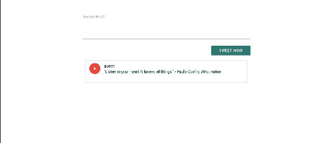
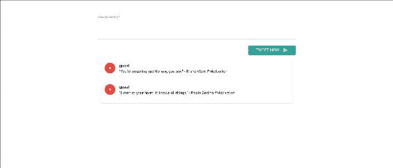
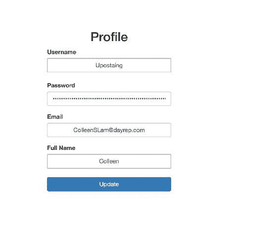

# 五、使用 React 构建 Web 视图

到目前为止，我们一直在构建我们的微服务，并使我们的后端服务更具响应性和效率。此外，我们还尝试了不同的数据库服务，这些服务可以保护和提高数据存储和检索的性能，这在这里至关重要。

在本章中，我们将重点介绍如何使用 React 构建前端页面，并将这些页面与后端集成以形成一个完整的应用。

我们将在本章中介绍的主题如下：

*   建立反应环境
*   创建用户身份验证面板
*   将 react 与后端 api 集成

# 理解反应

简单地说，React 是应用的 UI 层。它是一个 Javascript 库，用于构建快速的用户界面。React 基本上可以帮助您为应用的每个状态创建很棒的 Web 视图。因此，我们将使用 React 实现这一目的。但在此之前，让我们先了解 React 的几个概念/要点，下面列出：

*   **组件**：您所有的 HTML 和 JavaScript 集合都称为**组件**。React 基本上提供了钩子来呈现启用 JavaScript 的 HTML 页面。这里重要的一点是，React 作为一个控制器，为应用的每个状态呈现不同的网页。
*   **React**中静态版本的道具：通常，在 HTML 中，需要大量代码来显示前端的所有数据，而且重复性很强。React 道具可帮助您解决此问题。基本上，道具保持数据的状态，并将值从父对象传递给子对象。
*   **识别最小状态**：要正确构建应用，首先需要考虑应用需要的最小可变状态集。比如，在我们的例子中，我们需要在应用的不同状态期间保持用户的状态始终可用。
*   **识别活动状态**：React 是组件层次结构中的单向数据流。我们需要了解基于该状态呈现某些内容的每个组件。此外，我们还需要了解组件层次结构级别的状态是如何变化的。
*   **React DOM**：React DOM 是 React 和 DOM 的组合。React 包含 web 和移动应用中使用的功能。react dom 功能仅在 web 应用中使用。

# 建立 React 环境

为了运行 React，我们需要设置一个初始环境，其中包括安装两个`node.js`库。

# 安装节点

在开始安装 React 和软件包列表之前，我们需要在系统上安装`node.js`。

在 Linux（基于 Debian 的系统）中，安装过程非常简单。

首先，我们需要使用以下命令从`node.js`官网添加 PPA：

```py
$ sudo apt-get install python-software-properties
$ curl -sL https://deb.nodesource.com/setup_7.x | sudo -E bash -

```

设置完成后，我们可以使用以下命令安装`node.js`：

```py
$ apt-get install nodejs 

```

现在让我们检查一下`node`和`npm`版本，如下所示：

```py
$ npm -v
 4.1.2 
$ node -v
  V7.7.4 

```

在我们的设置中，我们使用前面提到的版本，但是 v7.x 周围的节点版本应该可以，而对于 npm，v4.x 应该可以正常工作。

# 创建 package.json

该文件基本上是应用的元数据，其中包含应用需要安装的完整库/依赖项。另一个现实世界的优势是，它使您的构建具有可复制性，这意味着它更容易与其他开发人员共享。您可以通过不同的方式创建自定义的`package.json`。

以下是`packages.json`中需要提供的最低信息：

```py
    "Name" - lowercase.
    "version"  - in the form of x.x.x

    For example:

    {
      "name": "my-twitter-package",
      "version": "1.0.0"
    } 

```

要创建`package.json`模板，可以使用以下命令：

```py
$ npm init              # in your workspace  

```

它将请求诸如名称、版本、描述、作者、许可证等值；填入值，生成`package.json`。

如果您现在不想填写信息，可以使用`--yes`或`-y`属性使用默认值，如下所示：

```py
$npm init --yes

```

对于我们的应用，我已经生成了`package.json`，它看起来像这样：

```py
    { 
      "name": "twitter", 
      "version": "1.0.0", 
      "description": "Twitter App", 
      "main": "index.js", 
      "dependencies": { 
        "babel-loader": "^6.4.1", 
        "fbjs": "^0.8.11", 
        "object-assign": "^4.1.1", 
        "react": "^15.4.2", 
        "react-dev": "0.0.1", 
        "react-dom": "^0.14.7", 
        "requirejs": "^2.3.3" 
      }, 
     "devDependencies": { 
       "babel-core": "^6.4.5", 
       "babel-loader": "^6.2.1", 
       "babel-preset-es2015": "^6.3.13", 
       "babel-preset-react": "^6.3.13", 
       "webpack": "^1.12.12" 
      }, 
    "scripts": { 
      "test": "echo \"Error: no test specified\" && exit 1" 
     }, 
    "author": "Manish Sethi", 
    "license": "ISC" 
   } 

```

现在，我们已经生成了`package.json`，我们需要使用以下命令在工作站上安装这些依赖项：

```py
$ npm install 

```

请确保在执行上述命令时，`package.json`应该在当前工作目录中。

# 使用 React 构建 Web 视图

首先，我们将创建一个主视图，从中调用 React。那么我们在模板目录中创建`index.html`，它有以下内容：

```py
    <!DOCTYPE html> 
    <html> 
     <head lang="en"> 
      <meta charset="UTF-8"> 
      <title>Flask react</title> 
    </head> 
   <body> 
     <div class="container"> 
       <h1></h1> 
       <br> 
       <div id="react"></div> 

    </div> 

   <!-- scripts --> 
    <script src="https://code.jquery.com/jquery-2.1.1.min.js"></script> 
    <script src="https://cdnjs.cloudflare.com/ajax/libs/
      react/15.1.0/react.min.js"></script> 
    <script src="https://npmcdn.com/react-
      router@2.8.1/umd/ReactRouter.min.js"></script> 
    <script src="https://cdnjs.cloudflare.com/ajax/
      libs/react/15.1.0/react-dom.min.js"></script> 
    <script src="http://cdnjs.cloudflare.com/ajax/libs/
      react/0.13.3/JSXTransformer.js"></script> 

    </body> 
   </html> 

```

正如您在前面的 HTML 页面中所看到的，我们已经定义了`id ="react"`，我们将使用它根据 ID 调用 React main 函数，并执行特定的操作。

那么，让我们创建我们的`main.js`，它将发送一个响应，代码如下：

```py
    import Tweet from "./components/Tweet"; 
    class Main extends React.Component{ 
    render(){ 
      return ( 
      <div> 
        <h1>Welcome to cloud-native-app!</h1> 
      </div> 
      ); 
    } 
   } 

   let documentReady =() =>{ 
    ReactDOM.render( 
    <Main />, 
     document.getElementById('react') 
    ); 
  }; 

  $(documentReady); 

```

现在我们已经定义了 React 响应的基本结构。因为我们正在构建一个具有多个视图的应用，所以我们需要一个构建工具来帮助我们将所有资产（包括 JavaScript、图像、字体和 CSS）放在一个包中，并将其生成到单个文件中。

**Webpack**是帮助我们解决这个问题的工具。

Webpack 应该已经可用，因为我们将 Webpack 包定义为我们之前安装的`package.json`的一部分。

基本上，Webpack 读取单个条目文件，可能是`.js`文件，读取其子组件，然后将其转换为单个`.js`文件。

因为我们已经在`package.json`中定义了它，所以它已经安装好了。

在 Webpack 中，我们需要定义一个配置，帮助它识别条目文件和用于生成单个`.js`文件的加载程序。此外，还需要为生成的代码定义文件名。

我们的网页包配置如下：

```py
    module.exports = { 
      entry: "./static/main.js", 
      output: { 
        path: __dirname + "/static/build/", 
        filename: "bundle.js" 
      }, 
     resolve: { 
       extensions: ['', '.js', '.jsx'] 
     }, 
     module: { 
        loaders: [ 
            { test: /\.js$/, exclude: /node_modules/, loader: "babel-
        loader", query:{presets:['react','es2015']} } 
        ] 
     } 
   }; 

```

您可以根据您的用例扩展前面的配置。有时，开发人员尝试将*.html 作为入口点。在这种情况下，您需要进行适当的更改。

让我们继续使用以下命令构建第一个 webView：

```py
$ webpack -d  

```

最后一个命令中的`-d`属性用于调试；它生成另一个文件`bundle.js.map`，显示 Webpack 的活动。

由于我们将重复构建应用，因此可以使用另一个标志`--watch`或`-w`，它将跟踪`main.js`文件中的更改。

因此，现在我们的 Webpack 命令应该如下所示：

```py
$ webpack -d -w

```

现在我们已经构建了我们的应用。记住在`app.py`中更改您的路线，以便按如下方式导航回家：

```py
    @app.route('/index') 
    def index(): 
     return render_template('index.html') 

```

现在让我们看看我们的主页是什么样子。


您还可以检查在检查模式下是否有 React 和 React dom 在后台运行。

这是理解 React 工作原理的一个非常基本的结构。让我们转到我们的用例，在这里我们创建了 tweet 网络视图，用户也可以查看旧的 tweet。

那么，让我们创建`Tweet.js`，它将具有 tweets 的基本结构，例如内容文本框和发布 tweets 的按钮。将以下代码添加到`Tweet.js`：

```py
    export default class Tweet extends React.Component { 

    render(){ 
     return( 
        <div className="row"> 
                </nav> 
        <form > 
          <div > 
            <textarea ref="tweetTextArea" /> 
            <label>How you doing?</label> 
              <button >Tweet now</button> 
          </div> 
         </form> 
        </div> 
        ); 
      } 
   } 

```

我们从`main.js`调用此函数，通过如下更新`render`函数，将其加载到主页上：

```py
    import Tweet from "./components/Tweet"; 
    render(){ 
      return ( 
      <div> 
        <Tweet /> 
      </div> 
     ); 
    } 

```

如果您现在加载页面，它将非常简单。因为我们想要创建一个 web 应用，它应该是有吸引力的，所以我们将在这里使用一些 CSS 来实现这一点。在我们的例子中，我们使用的是物化 CSS（[http://materializecss.com/getting-started.html](http://materializecss.com/getting-started.html) ）。

在`index.html`中增加以下代码块：

```py
    <link rel="stylesheet"  
      href="https://cdnjs.cloudflare.com/ajax/libs/
      materialize/0.98.1/css/materialize.min.css"> 
   <script src="https://cdnjs.cloudflare.com/ajax/libs/
     materialize/0.98.1/js/materialize.min.js"></script> 

   Also, we need to update Tweet.js as follows 

   render(){ 
    return( 
        <div className="row"> 
         <form > 
          <div className="input-field"> 
            <textarea ref="tweetTextArea" className="materialize-
             textarea" /> 
            <label>How you doing?</label> 
              <button className="btn waves-effect waves-light
               right">Tweet now <i className="material-icons 
               right">send</i></button> 
          </div> 
         </form> 
       </div> 
      ); 
    } 

```

让我们尝试添加 tweet，并将它们与 state 一起发送，以便显示一些 tweet。

在`main.js`的`Main`类中，添加以下构造函数初始化状态：

```py
    constructor(props){ 
     super(props); 
     this.state =  { userId: cookie.load('session') }; 
     this.state={tweets:[{'id': 1, 'name': 'guest', 'body': '"Listen to 
     your heart. It knows all things." - Paulo Coelho #Motivation' }]} 
    } 

```

现在更新`render`功能如下：

```py
    render(){ 
      return ( 
      <div> 
         <TweetList tweets={this.state.tweets}/> 
      </div> 
      ); 
     } 
    } 

```

让我们创建另一个文件`TweetList.js`，它将显示 tweets，代码如下：

```py
    export default class TweetList extends React.Component { 
     render(){ 
        return( 
        <div> 
          <ul className="collection"> 
           <li className="collection-item avatar"> 
           <i className="material-icons circle red">play_arrow</i> 
           <span className="title">{this.props.tweetedby}</span> 
          <p>{this.props.body}</p> 
          <p>{this.props.timestamp}</p> 
          </li> 
         </ul> 
        </div> 
       ); 
      } 
     } 

```

伟大的现在我们已经添加了这个模板。让我们看看我们的主页，看看 CSS 是如何工作的。但在此之前，由于我们使用 Webpack 进行构建，请确保每次都添加以下行以加载`bundle.js`——这将运行`index.html`文件中的 WebView。

```py
    <script type="text/javascript" src="./static/build/bundle.js">
     </script> 

```

令人惊叹的主页应如下所示：



让我们继续发布推文——我们应该能够添加新的推文，并且它们也应该在`TweetList.js`中更新。

让我们更新我们的`Tweet.js`代码，以便它将推文发送到`main.js`进行处理。现在，我们需要将我们的推文发送到`main.js`，为此，我们需要使用以下代码更新我们的`Tweet.js`文件：

```py
    sendTweet(event){ 
      event.preventDefault(); 
      this.props.sendTweet(this.refs.tweetTextArea.value); 
      this.refs.tweetTextArea.value = ''; 
     } 

```

另外，请确保使用`form onSubmit`属性更新`render`函数，如下所示：

```py
    <form onSubmit={this.sendTweet.bind(this)}> 

```

因此，在将内容添加到文本区域后，它也应该提交 tweet。

现在，让我们更新`main.js`的`render`功能，添加新的推文，如下所示：

```py
    <Tweet sendTweet={this.addTweet.bind(this)}/> 

```

我们还需要在`Main`类中添加`addTweet`函数，定义如下：

```py
    addTweet(tweet): 
     let newTweet = this.state.tweets; 
     newTweet.unshift({{'id': Date.now(), 'name': 'guest','body':
      tweet}) 
     this.setState({tweets: newTweet}) 

```

添加新 tweet 后，您的页面应如下所示：



目前，我们正在使用 React 将数据保存在一个数组中。由于我们已经构建了用于保存此类数据的微服务，因此我们应该将 webView 与后端服务集成。

# 将 webView 与微服务集成

为了将我们的微服务与 WebView 集成，我们将使用 AJAX 进行 API 调用。

我们需要在`main.js`中添加以下代码片段来拉取我们的整个 tweet 列表：

```py
    componentDidMount() { 
      var self=this; 
      $.ajax({url: `/api/v2/tweets/`, 
      success: function(data) { 
        self.setState({tweets: data['tweets_list']}); 
        alert(self.state.tweets); 
        return console.log("success"); 
       }, 
     error: function() { 
      return console.log("Failed"); 
      } 
    }); 

```

同样，我们需要修改我们的`main.js`中的`addTweet`函数，如下所示：

```py
   addTweet(tweet){ 
     var self = this; 
     $.ajax({ 
       url: '/api/v2/tweets/', 
       contentType: 'application/json', 
       type: 'POST', 
       data: JSON.stringify({ 
         'username': "Agnsur", 
      'body': tweet, 
       }), 
       success: function(data) { 
            return console.log("success"); 
       }, 
       error: function() { 
         return console.log("Failed"); 
       } 
     }); 
    } 

```

由于将有多条 tweet 需要使用类似的 tweet 模板进行迭代，因此让我们创建另一个名为`templatetweet.js`的组件，代码如下：

```py
    export default class Tweettemplate extends React.Component { 
     render(props){ 
      return( 
      <li className="collection-item avatar"> 
        <i className="material-icons circle red">play_arrow</i> 
        <span className="title">{this.props.tweetedby}</span> 
        <p>{this.props.body}</p> 
        <p>{this.props.timestamp}</p> 
      </li> 

      ); 
     } 
    } 

```

请记住，我们已经根据数据库集合密钥更改了道具字段。

另外，我们需要更新我们的`TweetList.js`以使用前面的模板，添加如下：

```py
    import Tweettemplate from './templatetweet' 

    export default class TweetList extends React.Component { 
    render(){ 
     let tweetlist = this.props.tweets.map(tweet => <Tweettemplate key=
     {tweet.id} {...tweet} />); 
    return( 
        <div> 
          <ul className="collection"> 
            {tweetlist} 
          </ul> 
        </div> 
      ); 
     } 
    } 

```

伟大的您的主页现在应该如下所示：


# 用户身份验证

我们所有的推文都受到保护，并且应该只对我们想要向其展示的观众做出反应。此外，不应允许匿名用户发推特。为此，我们将创建一个数据库和网页，使新用户能够登录到 tweet webView。请记住，我们将使用 Flask 对用户进行身份验证，并将数据发布到后端用户。

# 登录用户

让我们创建登录页面模板，现有用户需要在其中填写用户名和密码以进行身份验证。以下是代码片段：

```py
    <form action="/login" method="POST"> 
     <div class="login"> 
     <div class="login-screen"> 
     <div class="app-title"> 
      <h1>Login</h1> 
     </div> 

     <div class="login-form"> 
     <div class="control-group"> 

      <input type="text" class="login-field" value="" 
       placeholder="username" name="username"> 
      <label class="login-field-icon fui-user" for="login-name">
      </label> 
     </div> 

    <div class="control-group"> 
      <input type="password" class="login-field" value=""
       placeholder="password" name="password"> 
      <label class="login-field-icon fui-lock" for="login-pass">
      </label> 
    </div> 
     <input type="submit" value="Log in" class="btn btn-primary btn-
     large btn-block" ><br> 
     Don't have an account? <a href="{{ url_for('signup') }}">Sign up
     here</a>. 
   </div> 

```

我们将把数据发布到登录页面，我们将在`app.py`文件中定义该页面。

但首先，检查会话是否存在。如果没有，那么您将被重定向到登录页面。将以下代码添加到`app.py`，这将为用户验证会话详细信息：

```py
   @app.route('/') 
   def home(): 
     if not session.get('logged_in'): 
        return render_template('login.html') 
     else: 
        return render_template('index.html', session =   
     session['username']) 

```

让我们为登录创建路由，并验证凭据以验证推特用户的身份。

以下是代码片段：

```py
    @app.route('/login', methods=['POST']) 
    def do_admin_login(): 
      users = mongo.db.users 
      api_list=[] 
      login_user = users.find({'username': request.form['username']}) 
      for i in login_user: 
        api_list.append(i) 
      print (api_list) 
      if api_list != []: 
         if api_list[0]['password'].decode('utf-8') == 
         bcrypt.hashpw(request.form['password'].encode('utf-8'), 
         api_list[0]['password']).decode('utf-8'): 
            session['logged_in'] = api_list[0]['username'] 
            return redirect(url_for('index')) 
        return 'Invalid username/password!' 
      else: 
        flash("Invalid Authentication") 

    return 'Invalid User!' 

```

完成此操作后，您的登录页面将显示在根 URL 上，其外观应如下所示：


如您所见，我们提供了一个链接“立即注册”，用于为新用户创建帐户。

请记住，我们正在使用 API 从数据库中的用户集合对用户进行身份验证。

# 注册用户

让我们继续创建我们的注册页面，帮助注册新用户，这样他们也可以发 tweet。

让我们创建`signup.html`，它将询问用户详细信息。为此检查以下代码段：

```py
     <div class="container"> 
      <div class="row"> 
        <center><h2>Sign up</h2></center> 
          <div class="col-md-4 col-md-offset-4"> 
              <form method=POST action="{{ url_for('signup') }}"> 
                  <div class="form-group"> 
                      <label >Username</label> 
                      <input type="text" class="form-control"
                        name="username" placeholder="Username"> 
                  </div> 
                  <div class="form-group"> 
                      <label >Password</label> 
                      <input type="password" class="form-control" 
                      name="pass" placeholder="Password"> 
                  </div> 
                  <div class="form-group"> 
                      <label >Email</label> 
                      <input type="email" class="form-control" 
                     name="email" placeholder="email"> 
                  </div> 
                  <div class="form-group"> 
                      <label >Full Name</label> 
                      <input type="text" class="form-control" 
                      name="name" placeholder="name"> 
                  </div> 
                  <button type="submit" class="btn btn-primary btn-
                     block">Signup</button> 
               </form> 
               <br> 
            </div> 
          </div> 
      </div> 

```

前面的代码基本上是一个模板，它需要后端 API 将数据提交给用户。

让我们创建一个`signup`路由，它将采用`GET`和`POST`方法读取页面，并将数据提交到后端数据库。以下是需要添加到`app.py`中的代码片段：

```py
    @app.route('/signup', methods=['GET', 'POST']) 
    def signup(): 
      if request.method=='POST': 
        users = mongo.db.users 
        api_list=[] 
        existing_user = users.find({'$or':  
        [{"username":request.form['username']} ,
         {"email":request.form['email']}]}) 
            for i in existing_user: 
              api_list.append(str(i)) 
            if api_list == []: 
              users.insert({ 
              "email": request.form['email'], 
              "id": random.randint(1,1000), 
              "name": request.form['name'], 
              "password": bcrypt.hashpw(request.form['pass'].
                encode('utf-8'), bcrypt.gensalt()), 
              "username": request.form['username'] 
            }) 
            session['username'] = request.form['username'] 
            return redirect(url_for('home')) 

          return 'That user already exists' 
      else : 
        return render_template('signup.html') 

```

一旦用户注册，它将设置会话，并将其重定向到您的主页。

您的注册页面应如下所示：


我们已经对用户进行了身份验证，但是如果他想更新他/她的个人信息呢？让我们创建一个个人资料页面，这将帮助他们这样做。

# 用户配置文件

让我们创建一个配置文件页面（`profile.html`，已经登录到导航面板主页的用户可以访问该页面。

将以下代码添加到`profile.html`：

```py
     <div class="container"> 
      <div class="row"> 
        <center><h2>Profile</h2></center> 
          <div class="col-md-4 col-md-offset-4"> 
              <form method=POST action="{{ url_for('profile') }}"> 
                  <div class="form-group"> 
                      <label >Username</label> 
                      <input type="text" class="form-control"
                       name="username" value='{{username}}'> 
                  </div> 
                  <div class="form-group"> 
                      <label >Password</label> 
                      <input type="password" class="form-control"
                      name="pass" value='{{password}}'> 
                  </div> 
                  <div class="form-group"> 
                      <label >Email</label> 
                      <input type="email" class="form-control" 
                      name="email" value={{email}}> 
                  </div> 
                  <div class="form-group"> 
                      <label >Full Name</label> 
                      <input type="text" class="form-control" 
                      name="name" value={{name}}> 
                  </div> 
                  <button type="submit" class="btn btn-primary btn-
                   block">Update</button> 
                </form> 
              <br> 
           </div> 
       </div> 
     </div> 

```

因为我们已经创建了概要文件，所以我们需要为概要文件创建一个路由，该路由将读取数据库以获取用户详细信息，并将其发回数据库。

以下是来自`app.py`的代码片段：

```py
    def profile(): 
       if request.method=='POST': 
         users = mongo.db.users 
         api_list=[] 
         existing_users = users.find({"username":session['username']}) 
         for i in existing_users: 
            api_list.append(str(i)) 
         user = {} 
         print (api_list) 
         if api_list != []: 
            print (request.form['email']) 
            user['email']=request.form['email'] 
            user['name']= request.form['name'] 
            user['password']=request.form['pass'] 
            users.update({'username':session['username']},{'$set':
          user} ) 
        else: 
            return 'User not found!' 
        return redirect(url_for('index')) 
      if request.method=='GET': 
        users = mongo.db.users 
        user=[] 
        print (session['username']) 
        existing_user = users.find({"username":session['username']}) 
        for i in existing_user: 
            user.append(i) 
        return render_template('profile.html', name=user[0]['name'], 
        username=user[0]['username'], password=user[0]['password'], 
        email=user[0]['email']) 

```

添加这最后一段代码后，您的个人资料页面应如下所示：



另外，我们应该通过添加以下行在导航模板的`Tweet.js`中添加 profile 链接：

```py
      <li><a href="/profile">Profile</a></li> 
      <li><a href="/logout">Logout</a></li> 

```

现在，您的主页将如下所示：


# 注销用户

如您所见，在前面的部分中，我们提供了注销的路由，基本上，它删除了用户会话，并将用户重定向到登录页面。以下是来自`app.py`的代码片段：

```py
    @app.route("/logout") 
    def logout(): 
      session['logged_in'] = False 
      return redirect(url_for('home')) 

```

现在，我们的应用已经完全构建完毕，从用户登录到提交推文，再到注销。

# 测试 React Web 视图

因为我们正在构建 Web 视图，所以我们需要对它们进行测试，以便在它们发生之前捕获一些错误。此外，测试将帮助您构建更好的代码。

有许多 UI 测试框架可以帮助您测试 web 应用。下一节将讨论其中两个。

# 开玩笑

Jest 是一个单元测试框架，由 Facebook 提供用于测试 JavaScript。它用于测试单个组件。它简单、标准且独立。

它基于伪 DOM 实现测试您的组件，并运行不同的测试来检查功能。它会自动解析依赖项。此外，您还可以并行运行所有测试。

您可以参考以下链接，该链接可以帮助您为 React 应用编写测试用例：

[https://facebook.github.io/jest/docs/tutorial-react.html](https://facebook.github.io/jest/docs/tutorial-react.html)

# 硒

Selenium 是一种用于测试 web 应用的开源、便携式自动化软件测试工具。它提供端到端测试，这意味着它是针对真实浏览器执行测试场景的过程，以测试多层应用的整个堆栈。

它有以下不同的组件：

*   **IDE**：帮助您描述测试工作流程。
*   **Selenium WebDriver**：这将自动执行浏览器测试。它直接向浏览器发送命令并接收结果。
*   **Selenium RC**：这个遥控器帮助您创建测试用例。
*   **网格**：它跨不同的浏览器并行运行测试用例。

这是您可以用来测试我们的 web 应用的最佳工具之一，我建议您这样做。

您可以在[上收集更多关于硒的信息 http://www.seleniumhq.org/docs/](http://www.seleniumhq.org/docs/) 。

# 总结

在本章中，我们的重点是创建前端用户网络视图，以及如何改进这些视图以吸引消费者。您还了解了 React 如何帮助我们构建这些 Web 视图并实现与后端服务的交互。在下一章中，事情会变得更加有趣，因为我们将使用前端应用，并将解释如何使用 Flux 扩展它以处理来自 internet 的大量传入请求。