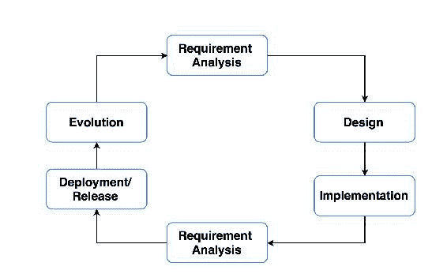
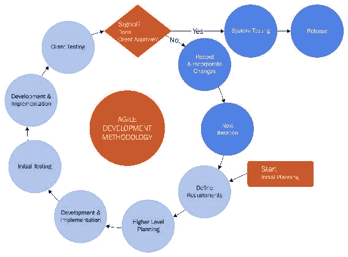
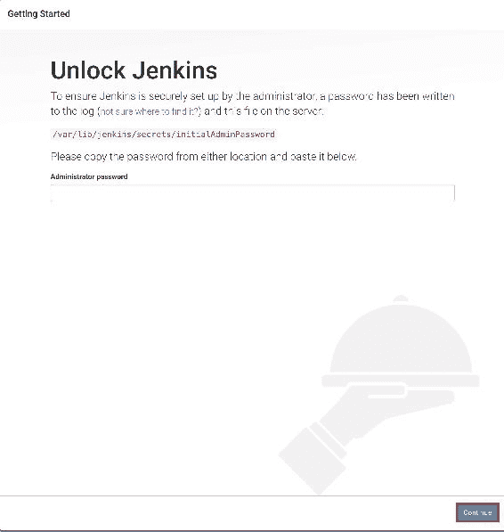
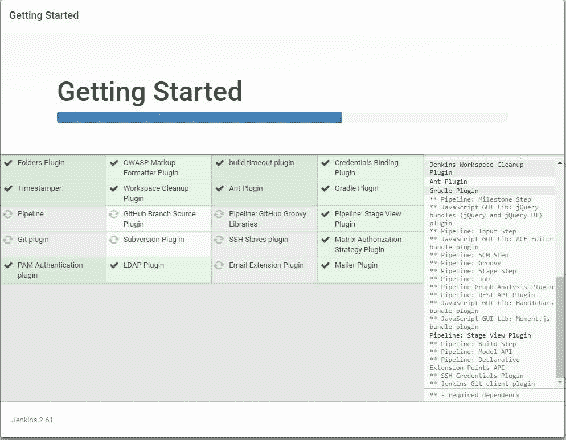
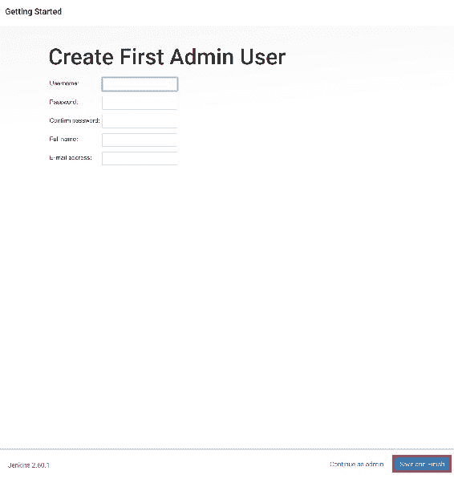
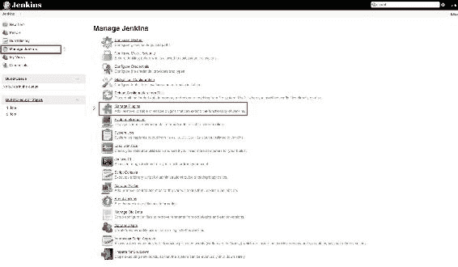
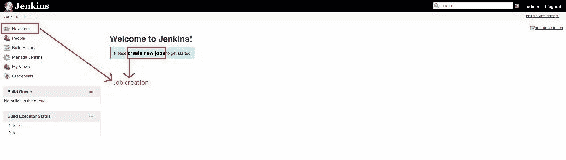
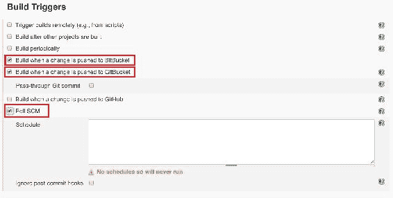
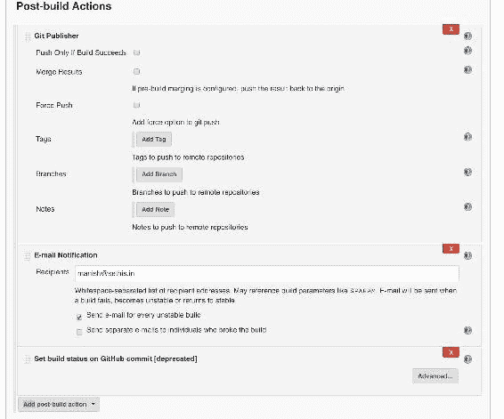
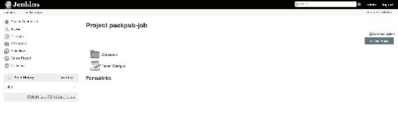

# 连续交付

在前几章中，我们致力于构建应用程序并为云环境做好准备。由于我们的应用程序现在已经稳定，并且已经准备好发布第一个版本，因此我们需要开始考虑平台（即云平台）以及可以帮助我们将应用程序转移到生产环境的工具。

本章讨论以下主题：

*   持续集成和持续交付简介
*   理解与 Jenkins 的持续集成

# 持续集成和持续交付的演变

现在很多人都在谈论**CI**（**持续集成**）和**CD**（**持续交付**），在考察了不同技术专家的观点后，我相信大家对 CI 和 CD 的理解都不尽相同，关于它们仍然有一些困惑。让我们深入研究并理解它们。

为了理解持续集成，您需要首先了解**SDLC**（**系统开发生命周期**）和**敏捷软件开发**过程的背景，这在您的构建和发布过程中会有所帮助。

# 理解 SDLC

SDLC 是规划、开发、测试和部署软件的过程。这个过程由一系列的阶段组成，每个阶段都从上一个阶段的结果中进一步进行。下图描述了 SDLC：



让我们详细了解每个阶段：

*   **需求分析**：这是问题分析的初始阶段，业务分析师进行需求分析，了解业务需求。需求可以是组织内部的，也可以是客户外部的。需求包括问题的范围，可以是改进系统或构建新系统、成本分析和项目目标。
*   **设计**：本阶段编制并批准了软件解决方案功能实现的设计。这包括流程图、文档、布局等。
*   **实施**：本阶段根据设计进行实际实施。通常，开发人员根据设计阶段定义的目标开发代码。
*   **测试**：此阶段由**QA**（**质保**团队在不同场景下对开发的代码进行测试。每个模块都使用单元测试和集成测试进行测试。在测试失败的情况下，开发人员会被告知错误，然后他们需要修复它。
*   **部署**/**发布**：在这个阶段，被测试的特性被转移到生产中供客户审查。
*   **演进**：此阶段获得客户对已开发、测试和发布的升级的审查。

# 敏捷软件开发过程

敏捷软件开发过程是传统软件开发过程的一种替代方法。它更像是一个过程，有助于频繁、高效地发布产品，并将 bug 降至最低。

敏捷过程基于以下原则：

*   在每个阶段持续提供软件升级和客户反馈
*   在开发周期的任何阶段都欢迎其他改进
*   稳定的发布应该是频繁的（在几周内）
*   业务团队和开发人员之间的持续沟通
*   持续改进，追求卓越的技术和良好的设计
*   工作软件是衡量进度的主要标准
*   不断适应不断变化的环境

# 敏捷软件开发过程是如何工作的？

在敏捷软件开发过程中，整个系统被划分为不同的阶段，所有模块或特性都以迭代的方式交付，来自不同领域的跨功能团队（如规划、单元测试、设计、需求分析、编码等）同时工作。因此，每个团队成员都参与了这个过程，没有一个人无所事事，而在传统的 SDLC 中，当软件处于开发阶段时，剩下的团队要么无所事事，要么利用不足。所有这些使得敏捷过程比传统模式更具优势。下图显示了有关敏捷开发流程工作流的信息：



在前面的图中，您将找不到任何需求分析或设计阶段，因为这些阶段是在高级规划中累积的。

以下是敏捷过程中的事件顺序：

1.  我们从初始规划开始，它为我们提供了有关软件功能的详细信息，然后在高级规划中定义了目标。
2.  一旦设定了目标，开发人员就开始为所需的特性编码。一旦软件升级准备就绪，测试团队（QA）就开始执行单元测试和集成测试。
3.  如果发现任何 bug，将立即修复它们，然后将代码交付给客户机测试（即，在后台或预生产环境中）。在这个阶段，代码还没有发布。
4.  如果代码通过了所有基于客户端的测试（可能是基于 UI 的测试），那么代码将被推送到生产环境中；否则，它将再次通过相同的循环进行迭代。

现在我们已经了解了敏捷工作流程，让我们了解一下它相对于传统 SDLC 的优势，如下所示：

*   在敏捷中，每个功能都可以频繁快速地开发和演示。这里的想法是在一周左右的时间内开发出没有 bug 的特性。这可确保客户对附加功能感到满意。
*   没有单独的开发、测试或其他团队。有一个单一的团队，由 8-10 名成员组成（根据需求），每个成员都有能力做任何事情。
*   敏捷促进团队合作。
*   它需要最少的文档。
*   敏捷最适合于并行特性开发。

综上所述，现在公司已经开始在软件开发中采用敏捷 SDLC。

到目前为止，我们一直在研究作为软件开发一部分采用的方法。现在让我们来看一下敏捷过程的一个非常关键的方面，即持续集成，它使我们的开发工作更容易。

# 连续积分

持续集成是将代码协作到主线代码库中的过程。简单地说，持续集成通过在开发和生成测试结果时创建频繁的构建，帮助开发人员在初始阶段测试新代码，如果一切正常，则将代码合并到主线代码中。

这可以通过下图来理解，下图描述了 SDLC 期间发生的问题：


在持续集成过程中，基本上存在以下类型的问题：

*   集成前的构建失败
*   集成失败
*   构建失败（集成后）

为了解决这些问题，开发人员需要修改代码来修复它，并再次重复完整的集成过程，直到成功部署该功能为止。

# Jenkins-持续集成工具

Jenkins 是一个开源工具，用于执行持续集成和构建自动化。它的用途与任何其他持续集成工具（如 Bambol（CirclCI））相同，后者在开发阶段尽早测试代码。

在 Jenkins 中，您定义了在不同的应用程序环境（开发、预生产阶段等）上部署应用程序的指令集。

在继续在 Jenkins 中设置作业（基本上是一个项目）并了解 Jenkins 插件之前，让我们首先设置 Jenkins 并根据我们的需求进行配置。

# 安装詹金斯

Jenkins 的安装在任何环境中都很简单，无论是 Linux（Debian、Red Hat 等）、Windows 还是 macOS。

# 先决条件

确保你的 Ubuntu 系统上安装了 Java8。如果未安装，您可以按照以下链接中给出的说明进行操作：

[https://medium.com/appliedcode/how-to-install-java-8-jdk-8u45-on-ubuntu-linuxmint-via-ppa-1115d64ae325](https://medium.com/appliedcode/how-to-install-java-8-jdk-8u45-on-ubuntu-linuxmint-via-ppa-1115d64ae325) 。

# 在基于 Debian（Ubuntu）的系统上安装

按照下面列出的步骤在基于 Debian 的系统上安装 Jenkins：

1.  我们通过执行以下命令，将 Jenkins 密钥添加到 APT 包列表，开始 Jenkins 安装：

```py
 $ wget -q -O - https://pkg.jenkins.io/debian/jenkins-ci.org.key | sudo apt-key add -

```

2.  接下来，使用需要通信以验证密钥的服务器更新源文件，如下所示：

```py
      $ sudo sh -c 'echo deb http://pkg.jenkins.io/debian-stable binary/ > /etc/apt/sources.list.d/jenkins.list'

```

3.  更新源列表文件后，通过在终端执行以下命令更新 APT 存储库：

```py
      $ sudo apt-get update -y

```

4.  现在我们准备在 Ubuntu 上安装 Jenkins；使用以下命令执行此操作：

```py
      $ sudo apt-get install jenkins  -y 

```

5.  现在安装已经完成，请记住 Jenkins 默认在端口`8080`上运行。但是如果您想在不同的端口上运行它，那么您需要更新 Jenkins 配置文件（`/etc/default/jenkins`中的以下行）：

```py
      HTTP_PORT=8080

```

6.  接下来，使用以下 URL 检查 Jenkins GUI：

*   如果是本地安装，则转到[`http://localhost:8080/`](http://localhost:8080/)
*   如果安装在远程机器上，请转至[`http://ip-address:8080`](http://ip-address:8080)

记住，在本例中，我们安装了 Jenkins 版本（2.61）；前面的步骤和接下来的步骤对 Jenkins 2.x.x 版有效。

如果您看到以下屏幕，则表示您的安装成功：



正如您在上图中所看到的，在安装 Jenkins 的系统中有一个存储默认密码的路径。

这证明 Jenkins 安装成功。

**Installation on Windows** Jenkins installation on Windows is pretty simple. Usually, on a Windows machine, Jenkins is not run as a service. But if you want to enable it as a service (which is optional), you can follow the complete installation Jenkins docs for Windows at the following URL:
[https://wiki.Jenkins-ci.org/display/JENKINS/Installing+Jenkins+as+a+Windows+service#InstallingJenkinsasaWindowsservice-InstallJenkinsasaWindowsservice](https://wiki.Jenkins-ci.org/display/JENKINS/Installing+Jenkins+as+a+Windows+service#InstallingJenkinsasaWindowsservice-InstallJenkinsasaWindowsservice).

# 配置詹金斯

现在是配置 Jenkins 的时候了，因此，让我们从系统中指定的路径（即`/var/lib/Jenkins/secrets/initialAdminPassword`）获取密码，将其粘贴到安装向导中提供的空间中，然后单击“继续”。单击“继续”后，您将看到类似于以下屏幕的屏幕：


在下一个屏幕中，您将看到可以安装插件的屏幕，我们将需要这些插件进行集成。我们现在将使用建议的插件安装选项。注意，我们也可以在初始配置之后安装其他插件。所以，不用担心！

单击“安装建议的插件”后，您将看到以下屏幕，其中显示插件安装的进度：



插件安装可能需要一段时间。所有这些插件都是 Jenkins 建议的，因为在项目相关的工作中您可能需要它们。

插件安装完成后，它将要求您创建一个管理员用户来访问 Jenkins 控制台。注意，为了设置 Jenkins，我们使用了临时凭证。



输入用户详细信息后，单击保存并完成以完成设置。


您的 Jenkins 安装已成功完成。

# 自动化詹金斯

在本节中，我们将介绍 Jenkins 配置的不同部分，并了解如何成功创建第一个作业和构建应用程序。

理想情况下，我们的 Jenkins 主页在成功登录后应如下所示：


# 保护詹金斯

强烈建议设置 Jenkins 安全性以使您的控制台安全，因为我们将向 Jenkins 公开我们的应用程序。

在 Jenkins 主页上，单击 Manage Jenkins 以导航到 Jenkins 的设置部分，然后单击右侧窗格中的配置全局安全以打开安全面板。

在配置全局安全部分，我们可以管理用户授权，如以下屏幕截图所示：


正如您在前面的屏幕截图中所看到的，在这里，您可以根据用户的角色定义访问列表。一般来说，在大型组织中，根据用户的使用情况向不同的人提供用户访问权限，以便维护 Jenkins 的安全性。通常，我们使用基于 Unix 的用户/组数据库或 Jenkins，即自己的用户数据库。

# 插件管理

插件管理非常重要，因为这些插件使我们能够与 Jenkins 集成不同的环境（可能是云平台）或内部资源，还使我们能够管理应用服务器、数据库服务器等资源上的数据。



从 Manage Jenkins 面板中，选择 Manage Plugins 选项以打开 Manage Plugins 面板，该面板如下所示：


在此面板中，您可以安装、卸载和升级系统中的任何特定插件。在同一面板中，您还可以升级 Jenkins。

# 版本控制系统

Jenkins 主要用于构建特定的应用程序代码，或者在任何基础架构平台上部署代码（即，用于连续部署）。

如今，组织将其应用程序代码存储在任何版本控制系统（如 Git）上，在 Git 中，管理员具有中央控制权，并且可以根据用户角色提供所需的访问权限。此外，由于我们谈论的是持续集成，因此建议将应用程序代码存储在具有版本控制的集中位置，以保持代码的完整性。

因此，为了维护版本代码，请确保从 ManagePlugin 面板安装 Git 插件。

要通过 Jenkins 克隆 Git 存储库，您需要输入 Jenkins 系统的电子邮件和用户名。为此，请切换到作业目录，并按如下方式运行 Git config 命令：

```py
# Need to configure the Git email and user for the Jenkins job 

# switch to the job directory 
cd /var/lib/Jenkins/jobs/myjob/workspace 

# setup name and email 
sudo git config user.name "Jenkins" 
sudo git config user.email "test@gmail.com" 

```

这需要进行设置，以便从存储库下载代码，或者在 Git 中合并分支时以及其他情况下进行设置。

# 找詹金斯的工作

现在我们已经准备好开始詹金斯的第一份工作。如前所述，创建每个作业是为了执行某些特定任务，这些任务可以是单独的，也可以是管道中的。

Andrew Phillips 认为，理想情况下，管道将软件交付过程分解为多个阶段。每个阶段都旨在从不同角度验证新功能的质量，以验证新功能，并防止错误影响用户。如果遇到任何错误，将以报告的形式返回反馈，并确保达到所需的软件质量。

为了启动工作创建，在 Jenkins 主页上，单击左侧的新项目，或单击右侧窗格中的创建新工作链接：



单击后，它将打开一个向导，询问您的项目/作业名称以及要创建的作业类型，如以下屏幕截图所示：


该描述已经与项目类型一起提供，为我们概述 Jenkins 中可用的不同选项。需要选择这些类型，因为它们根据类型具有不同的配置。

请注意，由于我们正在使用最新的 Jenkins 版本，因此某些项目类型可能在旧版本中不存在，因此请确保已安装最新的 Jenkins。

现在，我们将选择 Freestyle 项目，指定一个唯一的作业名称，然后单击 OK 继续配置我们的作业。单击“确定”后，您将看到以下页面：


在上一页中，您可以定义作业详细信息，如项目名称、描述、GitHub 项目等。

接下来，单击源代码管理选项卡；您将看到以下屏幕：


在上一节中，您将定义源代码的详细信息。如果之前在配置部分中没有设置 Jenkins 用户凭据，则还需要设置 Jenkins 用户凭据。如果未设置凭据，请单击凭据旁边的添加按钮。它将打开一个弹出窗口，其外观如下：


The user you define here (that is, the admin) needs to have permission in the code repository to access it.

您可以通过多种方式在存储库中为提到的用户设置身份验证，这些方式是以实物形式定义的（下拉菜单）：


需要注意的是，Jenkins 将立即根据提到的存储库 URL 测试凭据。如果失败，它将显示此屏幕截图中显示的错误：


假设凭据与存储库 URL 匹配，让我们继续单击 Build Trigger 选项卡滚动它。以下屏幕显示了可施加在作业上以进行连续部署的生成触发器选项：



这个构建触发器部分非常重要，因为它决定了构建应该运行的频率，以及触发构建的参数。例如，如果您希望在每次 Git 提交后构建应用程序，那么可以在将更改推送到 GitBucket 时选择 build 选项。

因此，只要开发人员在某个分支（通常是主分支）中提交存储库中的任何更改，就会自动触发此作业。它就像是存储库顶部的一个钩子，它跟踪存储库上的活动。或者，如果要构建应用程序或定期运行此作业，则可以在轮询 SCM to schedule 中指定如下条件--`H/15 * * * *`，这意味着此作业将每 15 分钟运行一次。它类似于我们通常在基于 Linux 的系统中设置的 cron 作业。

接下来的两个部分**构建环境**和**构建**是为工作区相关任务定义的。由于我们正在处理一个基于 Python 的应用程序，并且我们已经构建了我们的应用程序，现在我们可以跳过这些部分。但是，如果您有一个用 Java 或.NET 编写的应用程序，您可以使用 ANT 和 Maven 构建工具，并进行分支来构建。或者，如果您想要构建一个基于 Python 的应用程序，那么可以使用诸如 pyBuilder（[之类的工具 http://pybuilder.github.io/](http://pybuilder.github.io/) ）。以下屏幕显示生成选项：


完成后，可以单击下一个选项卡，即生成后操作。这用于定义构建成功后需要执行的操作。由于本节的原因，Jenkins 还可以用作连续部署工具。因此，在这个构建后操作中，您可以指定应用程序需要部署的平台，例如在 AWS EC2 机器上、代码部署、Azure VM 或其他平台上。

在构建后部分，在持续集成的上下文中，我们还可以执行一些操作，例如成功构建后的 Git 合并、在 Git 上发布结果等等。此外，您还可以为您的涉众设置电子邮件通知，通过电子邮件向他们提供有关构建结果的更新。有关更多详细信息，请参见以下屏幕截图：



这就是全部。填写完所需的详细信息后，单击 Save 保存配置。现在，您已经准备好构建应用程序——单击左侧面板中的 build Now 链接，如以下屏幕截图所示：



Note: For first time build execution, you need to trigger it manually if you haven't set the poll SCM or the Build Triggers section.

就创造就业而言，这就是我们从詹金斯那里得到的一切。然而，在接下来的章节中，我们将使用 Jenkins 作为一个持续交付和持续集成工具，我们将在前面章节中创建的 React 应用程序部署到不同的平台上，如 AWS、Azure 或 Docker。我们还将看到 AWS 服务与 Jenkins 的集成，通过一次提交将应用程序交付到 GitHub 存储库。

# 理解持续交付

持续交付是一种软件工程实践，在这种实践中，生产准备就绪的特性被生产并部署到生产中。

持续交付的主要目标是在不考虑平台（可能是大型分布式系统或复杂的生产环境）的情况下执行成功的应用程序部署。

在跨国公司中，我们始终确保应用程序代码处于稳定和可部署状态，即使有许多开发人员同时处理不同的应用程序组件。在持续交付过程中，我们还确保成功执行单元测试和集成测试，从而为生产做好准备。

# 持续交付的需要

有人认为，如果我们尝试更频繁地部署软件，我们应该期望系统的稳定性和可靠性水平更低，但这并不完全正确。持续交付为愿意在竞争激烈的市场中发布稳定可靠软件的组织提供了难以置信的竞争优势。

持续交付的实践为我们带来了以下重要好处：

*   **无风险发布**：软件发布中任何应用程序的主要要求是停机时间最少或为零。毕竟，它始终与业务有关，用户不应该因为频繁发布而受到影响。通过使用 BlueGreenDeployment（[等模式 https://martinfowler.com/bliki/BlueGreenDeployment.html](https://martinfowler.com/bliki/BlueGreenDeployment.html) ），我们可以在部署期间实现零停机。
*   **竞争市场**：在持续交付中，所有团队，如构建和部署团队、测试团队、开发人员和其他团队，共同工作，这使得测试、集成等不同的活动每天都在发生。这使得特性发布过程更快（一到两周），并且我们将经常发布到生产环境中供客户使用。
*   **质量改进**：在持续交付中，开发人员不必担心测试过程，因为测试过程由管道负责，并将结果展示给 QA 团队。这使 QA 团队和开发人员能够更仔细地查看探索性测试、可用性测试以及性能和安全性测试，从而改善客户体验。
*   **更好的产品**：通过在构建、测试、部署和环境设置中使用连续交付，我们降低了在软件中进行和交付增量更改的成本，从而使产品随着时间的推移变得更好。

# 连续交付与连续部署

持续交付和持续部署在其必须构建的阶段、测试和必须部署的软件发布周期方面类似，但在*流程*方面略有不同，您可以从下图中了解到：


在连续部署中，一旦生产就绪代码通过所有测试检查，它就会直接部署到生产环境中，这使得软件发布变得频繁。但在连续交付的情况下，除非手动触发或获得相关机构的批准，否则不会部署生产就绪应用程序代码。

# 总结

在本章中，我们讨论了 CI 和 CD 工具，如 Jenkins，并研究了它们的不同功能。在这个阶段理解这些工具非常重要，因为大多数处理云平台的公司都将这些过程用于软件开发和部署。现在，您已经了解了部署管道，您已经准备好了解我们将在其中部署应用程序的平台。

在下一章中，我们将讨论 Docker（基于容器技术）。我相信你们大多数人以前都听说过 Docker，所以请继续关注 Docker 的深入报道。下一章见！