# 在 Azure 平台上实现

在上一章中，我们看到了用于托管我们的应用程序的云计算平台之一——AWS，它包含了使应用程序具有高可用性和无停机时间的所有功能。在本章中，我们将讨论另一个名为**Microsoft Azure**的云平台。

本章包括以下主题：

*   介绍 Microsoft Azure
*   构建应用程序基础架构 Azure 服务
*   使用 Jenkins 和 Azure 的 CI/CD

# Microsoft Azure 入门

顾名思义，Microsoft Azure 是 Microsoft 拥有的一个公共云平台，它为客户提供不同的 PaaS 和 IaaS 服务。一些流行的服务包括虚拟机、应用程序服务、SQL 数据库、资源管理器等。

Azure 服务主要分为以下两类：

*   **平台服务**：这些服务为客户提供了一个构建、管理和执行其应用程序的环境，同时照顾基础设施本身。以下是按不同类别列出的一些 Azure 服务：
    *   **管理服务**：提供管理门户和市场服务，为 Azure 中的自动化提供图库和工具。
    *   **计算**：这些是结构、功能等服务，帮助开发人员开发和部署高度可扩展的应用程序。
    *   **CDN 和媒体**：分别提供全球范围内安全可靠的内容交付和实时流媒体。
    *   **网络+移动**：这些是与网络应用和 API 应用等应用相关的服务，主要针对网络和移动应用。
    *   **分析**：这些是与大数据相关的服务，可以帮助机器学习开发者进行实时数据处理，让你洞察 HDInsight、机器学习、流分析、机器人服务等数据。
    *   **开发工具**：这些服务用于版本控制、协作等。它还包括 SDK。
    *   **人工智能和认知服务**：这些是基于人工智能的服务，例如用于语音、视觉等。其中一些服务是文本分析 API、认知 API 和其他服务。
*   **基础设施服务**：这些服务由服务提供商负责硬件故障。定制服务器是客户的责任。此外，客户还管理其规格：
    *   **服务器计算和容器**：这些是虚拟机和容器等服务，为客户应用程序提供计算能力。
    *   **存储**：分为 BLOB 和文件存储两种。它具有基于延迟和速度的不同存储功能。
    *   **网络**：提供负载均衡器、虚拟网络等多种网络相关服务，帮助您保护网络安全，提高客户响应效率。

下图将提供对 Azure 平台的更多了解：

您可以通过以下链接详细查看所有 Microsoft Azure 产品选项：

[https://azure.microsoft.com/en-in/services/](https://azure.microsoft.com/en-in/services/)

要开始使用 Microsoft Azure，您必须拥有一个帐户。由于本章涉及在 Azure 上实现我们的应用程序，因此我们将不讨论如何创建帐户。如果您确实需要帮助，您可以阅读以下链接中的文章，这肯定会对您有所帮助：

[https://medium.com/appliedcode/setup-microsoft-azure-account-cbd635ebf14b](https://medium.com/appliedcode/setup-microsoft-azure-account-cbd635ebf14b)

Azure 提供了一些基于 SaaS 的服务，您可以在[查看这些服务 https://azuremarketplace.microsoft.com/en-us](https://azuremarketplace.microsoft.com/en-us) 。

# 关于 Microsoft Azure 基础知识的几点建议

一旦您准备好并登录到 Azure 帐户，您将被重定向到 Azure 门户（[https://portal.azure.com](https://portal.azure.com) ），它将展示 Azure 服务。最初，Azure 提供一个免费帐户，并为您 30 天的使用提供 200 美元的信用值。Microsoft Azure 还支持现收现付模式，当您完成所有免费信用后，您可以切换到付费帐户。

以下是 Azure 的一些基本概念，在继续之前您应该了解这些概念：

*   **Azure 资源管理器**：最初，Azure 基于一个名为**ASM**（**Azure 服务管理器**的部署模型）。Azure 最新版本中采用了**ARM**（**Azure 资源管理器**），提供了更高的可用性和灵活性。
*   **蔚蓝地区**：全球分布约 34 个地区。
*   Azure 区域列表可在[上找到 https://azure.microsoft.com/en-us/regions/](https://azure.microsoft.com/en-us/regions/) 。
*   特定地区的所有服务列表可在[上找到 https://azure.microsoft.com/en-us/regions/services/](https://azure.microsoft.com/en-us/regions/services/) 。
*   **Azure 自动化**：Azure 在不同的基于 Windows 的工具中提供了大量模板，如 Azure PowerShell、Azure CLI 等。您可以在[找到这些模板 https://github.com/Azure](https://github.com/Azure) 。

由于 Azure 归 Microsoft 所有，我们将主要在 Azure 控制台（UI）上工作，并通过它创建资源。Azure 环境对于喜欢在 Windows 系统上部署应用程序的开发人员或 DevOps 专业人员来说非常友好，他们的应用程序是用.NET 或 VB 编写的。它还支持最新的编程语言，如 Python、ROR 等。

Microsoft Azure 是喜欢使用基于 Microsoft 的产品（如 Visual Studio）的人的理想选择。

# 使用 Azure 构建我们的应用程序基础架构

进入 Azure 门户后，您应该会在屏幕上看到以下默认仪表板：

是时候在 MS Azure 上构建我们的应用程序基础架构了。我们将按照下面给出的架构图在 Azure 上创建生产环境：

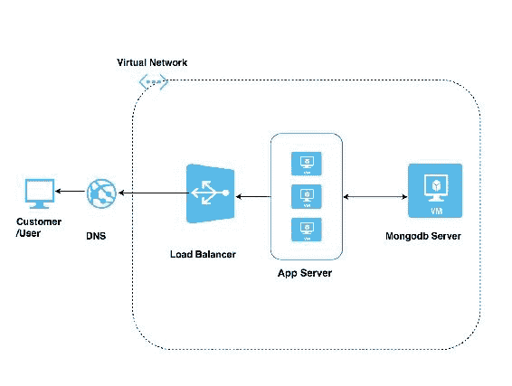

在此架构中，我们将使用两个 Azure 服务，如下所示：

*   **虚拟机**：与 AWS 中的 EC2 机类似。我们将在虚拟机中部署应用程序和 MongoDB 服务器。
*   **虚拟网络**：虚拟网络是 AWS 中专有网络的同义词，需要创建虚拟网络以确保我们的通信网络安全。
*   **存储**：每个虚拟机都有一个存储帐户作为后盾，我们没有明确创建该帐户，因为它是与虚拟机一起创建的，用于存储您的数据。
*   **负载均衡器**：该负载均衡器与 AWS 中的负载均衡器用途相同，但算法略有不同，因为 Azure 主要采用基于哈希的平衡或源 IP 算法，而 AWS 采用循环算法或粘性会话算法。
*   **DNS**：当我们拥有域注册时，DNS 很有用，我们需要从 Azure 管理我们的 DNS。在云平台中，我们称之为**区域**。
*   **子网**：我们将在虚拟网络中创建一个子网，以区分我们的资源是否需要面向互联网。
*   **自动缩放**：我们在图中没有提到这一点，因为这取决于您的应用需求和客户响应。

因此，让我们首先创建应用程序所在的应用程序服务器（即虚拟机）。

正如我前面提到的，Azure 有一个非常用户友好的 UI，它根据您定义的资源在后台创建一个编程代码，并使用资源管理器将其提供给您，这使得 DevOps 的工作更容易。

# 在 Azure 中创建虚拟机

按照下面列出的步骤在 Microsoft Azure 中创建 VM：

1.  转到 Azure 仪表板，并在左侧面板中选择 New 以启动 VM 向导，如以下屏幕截图所示：

2.  现在我们需要选择需要启动的操作系统。我们将在列表中选择**Ubuntu 服务器 16.04 LTS**服务器选项（我们选择此选项，因为我们的应用程序是在 Ubuntu 操作系统上开发的）。

在下面的屏幕中，我们需要选择部署模型。有两种部署模型可用。它们是经典的（它是标准 VM）和资源管理器（高可用性 VM）。选择 Resource manager 模型，如下一个屏幕截图所示，然后单击 Create 按钮继续：

3.  在下一个屏幕上，我们需要提供 VM 的用户名和身份验证方法，如下面的屏幕截图所示；单击“确定”继续：

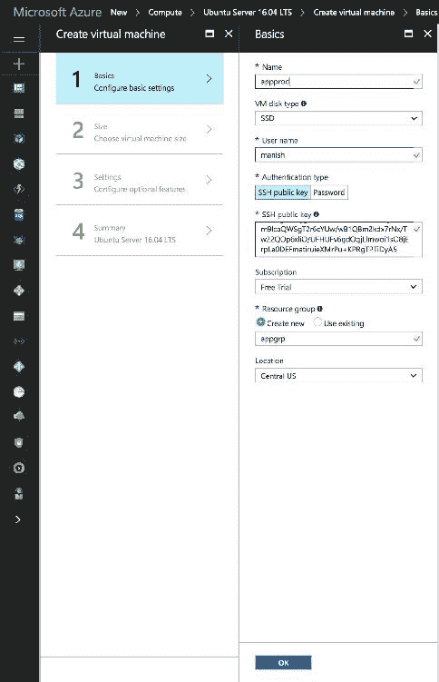

4.  接下来，我们需要根据需求选择 VM 大小。我们将使用 DS1_V2 标准类型。选择它，然后单击页面底部的选择按钮，如下所示：

5.  In the next screen, we will define a couple of the optional details such as Network, Subnet, Public IP address, security group, Monitoring, and others:

    

建议不要每次都创建虚拟网络，而是创建一个虚拟网络，并通过单击虚拟网络来选择它。说到托管磁盘和非托管磁盘，我更喜欢托管磁盘。这是因为在非托管磁盘中，我们选择创建一个存储帐户，并且由于我们是为多个应用程序服务器创建该帐户，因此每个应用程序服务器将有其单独的存储帐户。很可能所有存储帐户都落入单个存储单元中，从而导致单点故障。另一方面，在托管磁盘的情况下，Azure 通过单独存储单元中的每个存储帐户来管理我们的磁盘，这使其具有高可用性。
如果您不提供这些详细信息，将自动设置。

6.  In the next screen, we need to review all the details that we have defined in the wizard, as seen in this screenshot:

    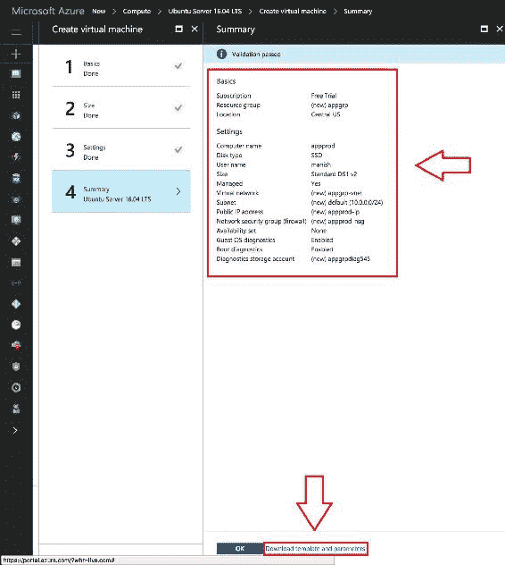

7.  在页面底部，您将找到一个链接，该链接使您能够以模板的形式或以不同语言的代码的形式下载完整的配置。请参阅以下屏幕截图，其中显示了作为我们提供的配置的一部分生成的代码：

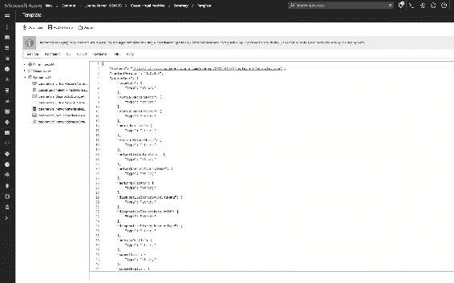

8.  单击 Ok 以开始部署虚拟机。

现在，我们的仪表板应该在一段时间后运行一个 VM，如此屏幕截图所示：

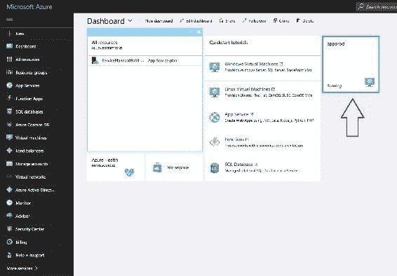

现在您可以访问 VM 了，您需要下载应用程序并像在本地计算机中一样进行部署。

类似地，我们可以为您的应用程序创建多个充当应用程序服务器的 VM 实例。

此外，我们还可以在上面安装 MongoDB 服务器来创建 VM。您需要遵循的安装步骤将类似于我们在[第 4 章](04.html#2KS220-4022ecb0f8ea4b719ffb742bf2a6a072)、*交互数据服务*中定义的步骤。

我们可以通过单击仪表板上的 VM（即 appprod）图标来查看 VM 的性能，该图标应如以下屏幕截图所示：

接下来，我们需要将前面创建的应用服务器添加到负载平衡器中。因此，我们需要使用以下步骤创建负载平衡器：

*   转到[https://portal.azure.com/?whr=live.com#blade/HubsExtension/Resources/resourceType/Microsoft.Network%2FLoadBalancers 在屏幕中间，点击按钮创建负载平衡器，如下屏幕截图所示：](https://portal.azure.com/?whr=live.com#blade/HubsExtension/Resources/resourceType/Microsoft.Network%2FLoadBalancers)
*   在下一个屏幕中，我们需要指定 LB 名称，并提供 LB 用途的类型。我们可以在与您的应用程序服务器相同的组中启动 ELB，如下所示：

单击“创建”按钮以启动 LB 创建。

9.  一旦负载平衡器准备好供我们使用，我们应该能够看到以下屏幕，其中显示了其详细信息：

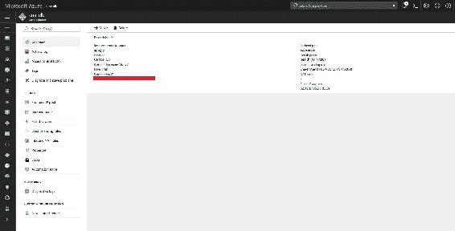

10.  接下来，我们需要添加一个后端池，这是我们的应用服务器，如此屏幕截图所示：

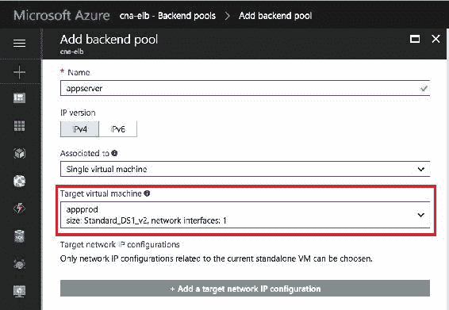

11.  现在我们需要添加 health probe，它是应用程序的运行状况，如下所示：

接下来，我们为应用程序添加前端池，如下所示：

现在，我们都为应用程序设置了负载平衡器。

You can read more about load balancers in the Azure docs at this link: [https://docs.microsoft.com/en-us/azure/load-balancer/load-balancer-overview](https://docs.microsoft.com/en-us/azure/load-balancer/load-balancer-overview)

现在，我们已经按照架构图创建了基础架构。是时候在 Azure 的基础设施上为我们的应用程序部署配置 Jenkins 了。

# 使用 Jenkins 和 Azure 的 CI/CD 管道

首先，我们需要导航到 active directory 服务，您可以在以下屏幕截图中看到：

现在我们需要注册我们的应用程序，因此，选择左窗格中的应用程序注册链接。您将看到一个类似于下一个屏幕的屏幕，其中您需要提供您的应用程序详细信息：

1.  在此之后，您将能够生成访问 Jenkins 作业所需的密钥。
2.  您将看到以下屏幕，其中包含密钥的详细信息，您还将在同一页面上找到其他详细信息，如对象 ID 和应用程序 ID：

现在我们有了在 Jenkins 中配置作业所需的信息。因此，导航到 Jenkins 控制台，转到 manage Jenkins 部分中的管理插件，然后安装插件 Azure VM Agent。

安装插件后，转到 Manage Jenkins，单击 Configure System（配置系统），如下一个屏幕截图所示：

在下一个屏幕中，滚动到名为“云”的底部部分，单击“添加云”按钮，然后选择新的 Microsoft Azure VM 代理选项。这将在同一页上生成一个节。

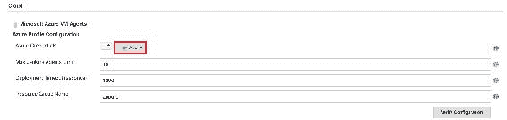

You can read more about the MS Azure VM Agents plugin in its documentation ([https://wiki.jenkins.io/display/JENKINS/Azure+VM+Agents+plugin](https://wiki.jenkins.io/display/JENKINS/Azure+VM+Agents+plugin)).

在最后一个屏幕中，您需要添加我们之前生成的 Azure 凭据。如果单击添加按钮（可在以下屏幕中看到），则可以添加订阅 ID 等值：

在同一部分的下一部分中，您需要提供 VM 详细信息的配置，如模板、VM 类型和其他：

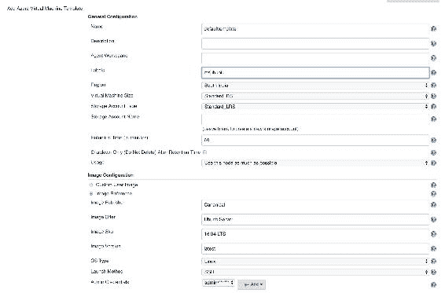

在前面的屏幕截图中，标签是最重要的属性，我们将在 Jenkins jobs 中使用它来标识组。

现在需要提供要执行的操作，也就是说，如果要部署应用程序，可以提供下载代码并运行应用程序的命令。

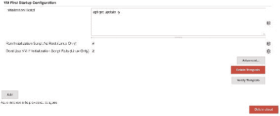

单击“保存”应用设置。

现在，在詹金斯创建一个新工作。另外，在 GitBucket 部分，您通常会提供存储库的详细信息，您会发现一个新的复选框，上面写着“限制此项目可以运行的位置”，并要求您提供标签表达式名称。在我们的例子中，它是`msubuntu`。就这样！

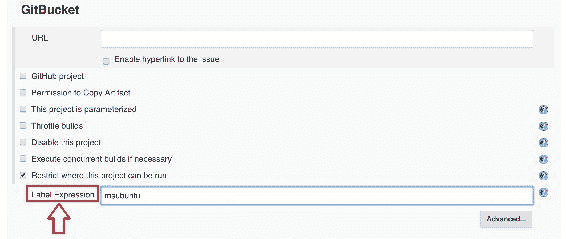

现在，我们都准备运行 Jenkins 作业，在 VM（即应用程序服务器）上部署应用程序。

最后，我们能够在 Azure 平台上部署我们的应用程序。

# 总结

在本章中，我们向您介绍了 Microsoft 提供的 Azure 平台，并在该平台上部署了您的云本机应用程序。我们研究了在 Azure 平台上构建相同基础设施的不同方法。您还看到了 Jenkins 与 Azure CI/CD 平台的集成。在下一章（也是最后一章）中，我们将介绍一些非常有助于管理和解决应用程序相关问题的不同工具，并以更快的方式解决这些问题，以便我们的应用程序能够保持零停机时间。请继续关注有关监控的下一章！