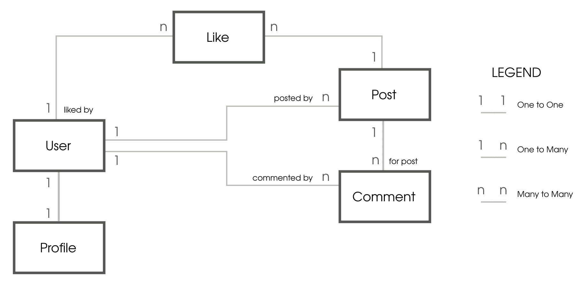

# 三、模型

在本章中，我们将讨论以下主题：

*   模型的重要性
*   类图
*   模型结构模式
*   模型行为模式
*   迁移

一家数据分析初创公司在其早期阶段曾向我咨询。尽管数据检索仅限于最近数据的一个窗口，但页面加载有时需要几秒钟的时间，因此存在性能问题。在分析了他们的架构之后，问题似乎出现在他们的数据模型中。然而，迁移和转换 PB 级的结构化实时数据似乎是不可能的。

“给我看你的流程图，隐藏你的表格，我会继续感到困惑。给我看你的表格，我通常不需要你的流程图；它们会很明显。”

-弗雷德·布鲁克斯，神秘的人类月

传统上，总是建议围绕经过深思熟虑的数据设计代码。但在这个大数据时代，这一建议变得更加重要。如果您的数据模型设计不当，那么数据量最终将导致可伸缩性和维护问题。我建议在如何平衡代码和数据方面使用以下格言：

表示规则：将知识折叠到数据中，使程序逻辑变得愚蠢和健壮。

考虑如何将复杂性从代码转移到数据。与数据相比，代码中的逻辑总是更难理解。UNIX 非常成功地运用了这一理念，它提供了许多简单的工具，可以通过管道对文本数据执行任何类型的操作。

最后，数据比代码更长寿。企业可能会决定重写整个代码库，因为它们不再满足自己的需求，但数据库通常是维护的，甚至是跨应用共享的。

设计良好的数据库与其说是一门科学，不如说是一门艺术。本章将向您介绍一些基本原则，如规范化和组织数据的最佳实践。但在此之前，让我们先看看数据模型在 Django 应用中的位置。

# M 大于 V 和 C

在 Django 中，模型是提供处理数据库的面向对象方法的类。通常，每个类引用一个数据库表，每个属性引用一个数据库列。您可以使用自动生成的 API 对这些表进行查询。

模型可以作为许多其他组件的基础。一旦有了模型，就可以快速派生模型管理员、模型表单和各种通用视图。在每种情况下，您都需要编写一两行代码，这样看起来就不会太神奇了。

此外，模型在比您预期的更多的地方使用。这是因为 Django 可以通过多种方式运行。Django 的一些入口点如下：

*   熟悉的 web 请求-响应流
*   Django 交互式 shell
*   管理命令
*   测试脚本
*   异步任务队列，如芹菜

在几乎所有这些情况下，模型模块都会被导入（作为`django.setup()`的一部分）。因此，最好使您的模型不受任何不必要的依赖关系的影响，或者导入任何其他 Django 组件，例如视图。

简而言之，正确地设计模型是非常重要的。现在，让我们从 SuperBook 模型设计开始。

棕色袋子午餐：

作者注：超级图书项目的进度将出现在这样一个框中。您可以跳过这个框，但是您将错过在 web 应用项目中工作的洞察力、经验和戏剧性。

史蒂夫与他的客户超级英雄情报与监控（简称为 SHIM）在一起的第一周是喜忧参半。办公室是难以置信的未来派，但要完成任何事情都需要 100 个批准和签字。

作为 Django 的首席开发人员，Steve 在两天内完成了一个中型开发服务器的安装，该服务器托管了四台虚拟机。第二天早上，机器本身就不见了。附近一个洗衣机大小的机器人说，由于未经批准的软件安装，它已被带到法医部门。然而，首席技术官哈特帮了大忙。他要求机器在一小时内归还，所有装置都完好无损。他还为 SuperBook 项目发送了预先批准，以避免将来出现任何此类障碍。
那天下午晚些时候，史蒂夫正在和他一起吃一顿棕色的午餐。哈特穿着米色外套和浅蓝色牛仔裤，及时赶到。尽管他比大多数人都高，剃得光头也很干净，但他看起来很酷，平易近人。他问史蒂夫是否查阅了上个世纪 60 年代建立超级英雄数据库的尝试。

“哦，是的，哨兵计划，对吗？”史蒂夫说。“我做了。数据库似乎被设计成实体属性值模型，我认为这是一种反模式。也许他们对那些超级英雄的属性几乎一无所知。”他小声地说：“你说得对，我没有。此外，他们只给了我两天时间来设计整件事。我相信在某个地方确实有一颗核弹在滴答作响。”

史蒂夫的嘴张得大大的，他的三明治在入口处冻住了。哈特笑了。“当然不是我最好的作品。一旦它跨越了 10 亿个条目，我们就花了好几天的时间在那个该死的数据库上运行任何类型的分析。SuperBook 会在几秒钟内快速完成，对吗？”

史蒂夫虚弱地点头。他从来没有想到一开始会有十亿左右的超级英雄。

# 模特狩猎

这是识别 SuperBook 中模型的第一个切入点。作为早期尝试的典型，我们仅以简单类图的形式表示了基本模型及其关系：



SuperBook 类图的早期尝试

让我们暂时忘记模型，然后讨论我们正在建模的对象。每个用户都有一个配置文件。用户可以发表若干评论或若干帖子。Like 可以与单个用户/帖子组合相关。

建议像这样绘制模型的类图。此阶段可能缺少类属性，但您可以稍后对其进行详细说明。一旦整个项目在图表中显示出来，分离应用就更容易了。

以下是创建此表示的一些提示：

*   写作中的名词通常以*实体*结尾。
*   框代表实体，成为*模型*。
*   连接器线是双向的，代表 Django 中三种类型的关系之一：一对一、一对多（使用外键实现）和多对多。
*   表示一对多关系的字段在**实体关系模型**（**ER 模型**上的模型中定义。换句话说，*n*侧是外键被声明的地方。

类图可以映射到以下 Django 代码（将分布在多个应用中）：

```py
class Profile(models.Model): 
    user = models.OneToOneField(User) 

class Post(models.Model): 
    posted_by = models.ForeignKey(User) 

class Comment(models.Model): 
    commented_by = models.ForeignKey(User) 
    for_post = models.ForeignKey(Post) 

class Like(models.Model): 
    liked_by = models.ForeignKey(User) 
    post = models.ForeignKey(Post) 
```

稍后，我们将不直接引用`User`，而是使用更通用的`settings.AUTH_USER_MODEL`。在此阶段，我们也不关心字段属性，例如`on_delete`或`primary_key`。我们很快就会了解这些细节。

# 将 models.py 拆分为多个文件

与 Django 的大多数组件一样，一个大的`models.py`文件可以在一个包中拆分为多个文件。一个包被实现为一个目录，它可以包含多个文件，其中一个文件必须是一个名为`__init__.py`的特殊文件。此文件可以为空，但应该存在。

所有可以在包级别公开的定义都必须在`__init__.py`中定义，并具有全局范围。例如，如果我们将`models.py`拆分为单独的类，在`models`子目录中的相应文件中，例如`postable.py`、`post.py`、`comment.py`，那么目录结构将如下所示：

```py
models/
├── comment.py
├── __init__.py
├── postable.py
└── post.py
```

为确保所有型号均正确导入，`__init__.py`应具有以下行：

```py
from postable import Postable 
from post import Post 
from comment import Comment 
```

现在您可以像以前一样导入`models.Post`。

导入包时，`__init__.py`文件中的任何其他代码都将运行。因此，它是任何包级初始化代码的理想位置。

# 结构模式

本节包含几个设计模式，可以帮助您设计和构造模型。这里提到的结构模式将帮助您更有效地实现模型之间的关系。

# 模式-规范化模型

**问题**：根据设计，模型实例存在重复数据，导致数据不一致。

**解决方案**：通过规范化将您的模型分解为更小的模型。将这些模型与它们之间的逻辑关系连接起来。

# 问题详情

想象一下，如果有人以以下方式设计我们的 post 表（省略某些列）：

| **超级英雄名** | **消息** | **发布在**上 |
| 脾气上尉 | 这个贴了吗？ | 2012/07/07 07:15 |
| 英语教授 | 它应该是没有的。 | 2012/07/07 07:17 |
| 脾气上尉 | 这个贴了吗？ | 2012/07/07 07:18 |
| 脾气上尉 | 这个贴了吗？ | 2012/07/07 07:19 |

我希望你注意到第一栏中那些前后矛盾的超级英雄名字（以及船长一贯缺乏耐心）。

如果我们看第一栏，我们不确定哪一个拼写正确-**船长脾气**或**船长脾气**。我们希望通过规范化消除这种数据冗余。

# 解决方案详细信息

在我们研究完全规范化的解决方案之前，让我们先简单介绍一下 Django 模型上下文中的数据库规范化。

# 正常化的三个步骤

规范化帮助您高效地存储数据。一旦您的模型完全规范化，它们就不会有冗余数据，并且每个模型都应该包含仅在逻辑上与其相关的数据。

举一个简单的例子，如果我们要规范 post 表，以便我们可以明确地引用发布该消息的超级英雄，那么我们需要在单独的表中隔离用户详细信息。默认情况下，Django 已经创建了用户表。因此，您只需参考在第一列中发布消息的用户的 ID，如下表所示：

| **用户 ID** | **消息** | **发布在**上 |
| 12 | 这个贴了吗？ | 2012/07/07 07:15 |
| 8. | 它应该是没有的。 | 2012/07/07 07:17 |
| 12 | 这个贴了吗？ | 2012/07/07 07:18 |
| 12 | 这个贴了吗？ | 2012/07/07 07:19 |

现在，我们不仅可以清楚地看到同一用户发布了三条消息（具有任意用户 ID），而且还可以通过查找用户表找到该用户的正确名称。

通常，您会将模型设计为完全规范化的形式，然后出于性能原因有选择地对其进行非规范化（请参阅下一节关于性能的内容以了解原因）。在数据库中，**范式**是一组可应用于表以确保其规范化的准则。常见的范式有第一范式、第二范式和第三范式，尽管它们可以上升到第五范式。

在下一个示例中，我们将规范化一个表并创建相应的 Django 模型。想象一下，一个名为“目击”的电子表格列出了第一次有人发现超级英雄时使用的超能力。每个条目都提到已知的起源、超级大国和第一次目击的位置，包括纬度和经度：

| **名称** | **来源** | **电源** | **首次使用于（纬度、纬度、国家、时间）** |
| 闪电战 | 外星人 | 冻结航班 | +40.75, -73.99; 美国；2014/07/03 23:12+34.05, -118.24; 美国；2013/03/12 11:30 |
| 六边形 | 科学家 | 遥控航班 | +35.68, +139.73; 日本 2010/02/17 20:15+31.23, +121.45; 中国 2010/02/19 20:30 |
| 旅行者 | 巨富 | 时间旅行 | +43.62，+1.45，法国；2010/11/10 08:20 |

前面的地理数据已从[中提取 http://www.golombek.com/locations.html](http://www.golombek.com/locations.html) 。

# 第一范式（1NF）

要符合第一个标准形式，表格必须具有：

*   没有具有多个值的属性（单元格）
*   定义为单列或一组列的主键（复合键）

让我们尝试将电子表格转换为数据库表。显然，我们的**权力**专栏打破了第一条规则。

这里更新的表满足第一个范式。主键（标记为*****是**名称**和**电源**的组合，每一行都应该是唯一的：

| **名称*** | **来源** | **功率*** | **纬度** | **经度** | **国家** | **时间** |
| 闪电战 | 外星人 | 冻结 | +40.75170 | -73.99420 | 美国 | 2014/07/03 23:12 |
| 闪电战 | 外星人 | 航班 | +40.75170 | -73.99420 | 美国 | 2013/03/12 11:30 |
| 六边形 | 科学家 | 遥控 | +35.68330 | +139.73330 | 日本 | 2010/02/17 20:15 |
| 六边形 | 科学家 | 航班 | +35.68330 | +139.73330 | 日本 | 2010/02/19 20:30 |
| 旅行者 | 巨富 | 时间旅行 | +43.61670 | +1.45000 | 法国 | 2010/11/10 08:20 |

# 第二范式（2NF）

第二范式必须满足第一范式的所有条件。
此外，还必须满足所有非主键列必须依赖于整个主键的条件。

在上表中，请注意**来源**仅取决于超级英雄，即**名称**。我们谈论的是哪种**力量**并不重要。所以，**来源**并不完全依赖于复合主键**名称**和**电源**。

让我们仅将原始信息提取到一个名为**原始**的单独表中，如下所示：

| **名称*** | **来源** |
| 闪电战 | 外星人 |
| 六边形 | 科学家 |
| 旅行者 | 巨富 |

现在，我们的观测表更新为符合第二个标准形式，如下所示：

| **名称*** | **功率*** | **纬度** | **经度** | **国家** | **时间** |
| 闪电战 | 冻结 | +40.75170 | -73.99420 | 美国 | 2014/07/03 23:12 |
| 闪电战 | 航班 | +40.75170 | -73.99420 | 美国 | 2013/03/12 11:30 |
| 六边形 | 遥控 | +35.68330 | +139.73330 | 日本 | 2010/02/17 20:15 |
| 六边形 | 航班 | +35.68330 | +139.73330 | 日本 | 2010/02/19 20:30 |
| 旅行者 | 时间旅行 | +43.61670 | +1.45000 | 法国 | 2010/11/10 08:20 |

# 第三范式（3NF）

在第三范式中，表必须满足第二范式，并且还应满足以下条件：所有非主键列必须直接依赖于整个主键，并且必须相互独立。

想一想**国家**专栏。给定**纬度**和**经度**，您可以轻松推导出**国家**列。即使看到超级大国的国家依赖于名称-实力复合主键，但它只是间接依赖于它们。

因此，让我们将位置详细信息分离到一个单独的国家/地区表中，如下所示：

| **位置 ID** | **纬度*** | **经度*** | **国家** |
| 1. | +40.75170 | -73.99420 | 美国 |
| 2. | +35.68330 | +139.73330 | 日本 |
| 3. | +43.61670 | +1.45000 | 法国 |

现在，我们的第三个正常形式的观测表如下所示：

| **用户 ID*** | **功率*** | **位置 ID** | **时间** |
| --- | --- | --- | --- |
| 2. | 冻结 | 1. | 2014/07/03 23:12 |
| 2. | 航班 | 1. | 2013/03/12 11:30 |
| 4. | 遥控 | 2. | 2010/02/17 20:15 |
| 4. | 航班 | 2. | 2010/02/19 20:30 |
| 7. | 时间旅行 | 3. | 2010/11/10 08:20 |

与前面一样，我们用相应的用户 ID 替换了超级英雄的名字，该 ID 可用于引用用户表。

# Django 模型

我们现在可以看看这些规范化的表如何表示为 Django 模型。Django 中不直接支持复合键。这里使用的解决方案是应用代理键并在`Meta`类中指定`unique_together`属性：

```py
class Origin(models.Model): 
    superhero = models.ForeignKey( 
        settings.AUTH_USER_MODEL, on_delete=models.CASCADE) 
    origin = models.CharField(max_length=100) 

    def __str__(self): 
        return "{}'s orgin: {}".format(self.superhero, self.origin) 

class Location(models.Model): 
    latitude = models.FloatField() 
    longitude = models.FloatField() 
    country = models.CharField(max_length=100) 

    def __str__(self): 
        return "{}: ({}, {})".format(self.country, 
                                     self.latitude, self.longitude) 

    class Meta: 
        unique_together = ("latitude", "longitude") 

class Sighting(models.Model): 
    superhero = models.ForeignKey( 
        settings.AUTH_USER_MODEL, on_delete=models.CASCADE) 
    power = models.CharField(max_length=100) 
    location = models.ForeignKey(Location, on_delete=models.CASCADE) 
    sighted_on = models.DateTimeField() 

    def __str__(self): 
        return "{}'s power {} sighted at: {} on {}".format( 
            self.superhero, 
            self.power, 
            self.location.country, 
            self.sighted_on) 

    class Meta: 
        unique_together = ("superhero", "power") 
```

# 性能与非规范化

规范化可能会对性能产生负面影响。随着模型数量的增加，回答查询所需的联接数量也会增加。例如，要查找美国拥有冻结功能的超级英雄的数量，您需要连接四个表。在标准化之前，可以通过查询单个表找到任何信息。

您应该设计模型以保持数据规范化。这将保持数据的完整性。但是，如果您的站点面临可伸缩性问题，那么您可以有选择地从这些模型派生数据，以创建非规范化数据。

最佳实践：

设计时规范化，优化时反规范化。

例如，如果统计某个国家的目击事件非常常见，那么将其作为一个附加字段添加到`Location`模型中。现在，您可以使用 Django**对象关系映射**（**ORM**）包含其他查询，这与缓存值不同。

但是，每次添加或删除观测时都需要更新此计数。您需要将此计算添加到瞄准的`save`方法中，添加信号处理程序，甚至使用异步作业进行计算。

如果您有一个跨多个表的复杂查询，例如按国家划分的超级大国数量，那么创建一个单独的非规范化表可能会提高性能。通常，此表将位于更快的内存中数据库或缓存中。和以前一样，每次规范化模型中的数据发生变化时（否则就会出现臭名昭著的缓存失效问题），我们都需要更新这个非规范化表。

反规范化在大型网站中非常普遍，因为它是速度和空间之间的折衷。如今，空间很便宜，但速度对用户体验至关重要。因此，如果您的查询花费太长时间无法响应，那么您可能需要考虑它。

# 我们应该经常正常化吗？

太多的正常化不一定是一件好事。有时，它会引入不必要的表，从而使更新和查找变得复杂。

例如，您的用户模型可能有几个字段作为其家庭地址。严格来说，您可以将这些字段规范化为地址模型。但是，在许多情况下，没有必要向数据库中引入额外的表。

而不是针对最规范化的设计，仔细权衡每个机会，以规范化，并考虑权衡之前重构。

# 模式混合

**问题**：不同的模型有相同的字段和/或方法重复，违反了 DRY 原则。

**解决方案**：将常用字段和方法提取到各种可重用的模型混合器中。

# 问题详情

在设计模型时，您可能会发现模型类之间共享某些公共属性或行为。例如，发布和评论模型需要跟踪其创建日期和修改日期。手动复制和粘贴字段及其关联方法不是一种非常枯燥的方法。

由于 Django 模型是类，所以面向对象的方法（如组合和继承）是可能的解决方案。但是，组合（通过具有包含共享类实例的属性）将需要额外的间接级别来访问字段。

继承可能会变得棘手。我们可以为 post 和 comment 使用一个公共基类。然而，Django 中有三种类型的继承：具体继承、抽象继承和代理继承。

**具体继承**的工作原理是从基类派生，就像您通常在 Python 类中那样。然而，在 Django 中，这个基类将被映射到一个单独的表中。每次访问基本字段时，都需要隐式联接。这会导致糟糕的表现。

**代理继承**只能向父类添加新行为。不能添加新字段。因此，在这种情况下，它不是很有用。

最后，留给我们的是抽象继承。

# 解决方案详细信息

抽象继承是一种优雅的解决方案，它使用特殊的抽象基类在模型之间共享数据和行为。当您在 Django 中定义抽象基类（与 Python 中的抽象基类（ABC）不同）时，它不会在数据库中创建任何相应的表。相反，这些字段是在派生的非抽象类中创建的。

访问抽象基类字段不需要`JOIN`语句。生成的表也包含托管字段。由于这些优点，大多数 Django 项目使用抽象基类来实现公共字段或方法。

抽象模型的局限性如下：

*   它们不能具有外键或其他模型的多对多字段
*   它们无法实例化或保存
*   它们不能直接用于查询，因为它没有管理器

以下是如何使用抽象基类初步设计 post 和 comment 类：

```py
class Postable(models.Model): 
    created = models.DateTimeField(auto_now_add=True) 
    modified = models.DateTimeField(auto_now=True) 
    message = models.TextField(max_length=500) 

    class Meta: 
        abstract = True 

class Post(Postable): 
    ... 

class Comment(Postable): 
    ... 
```

要将模型转换为抽象基类，您需要在其内部`Meta`类中提到`abstract = True`。这里，`Postable`是一个抽象基类。但是，它不是非常可重用的。

事实上，如果有一个类只有`created`和`modified`字段，那么我们可以在几乎任何需要时间戳的模型中重用该时间戳功能。在这种情况下，我们通常定义一个模型 mixin。

# 模型混合器

模型混合是可以作为模型的父类添加的抽象类。Python 支持多重继承，这与 Java 等其他语言不同。因此，可以为模型列出任意数量的父类。

混合器应该是正交的，并且易于组合。在基类列表中加入一个 mixin，它们应该可以工作。在这方面，它们在行为上更类似于组合，而不是继承。

较小的混合物更好。每当 MIXIN 变大并且违反单一责任原则时，就把它重构成更小的类。让一个混血儿做一件事，把它做好。

在我们前面的示例中，用于更新`created`和`modified`时间的模型 mixin 可以很容易地分解出来，如下代码所示：

```py
class TimeStampedModel(models.Model): 
    created = models.DateTimeField(auto_now_add=True) 
    modified = models.DateTimeField(auto_now =True) 

    class Meta: 
        abstract = True 

class Postable(TimeStampedModel): 
    message = models.TextField(max_length=500) 
    ...  

    class Meta: 
        abstract = True 

class Post(Postable): 
    ... 

class Comment(Postable): 
    ... 
```

我们现在有两个基类。但是，功能是明确分开的。mixin 可以分离为自己的模块，并在其他上下文中重用。

# 模式-用户配置文件

**问题**：每个网站都存储不同的用户档案详细信息。然而，Django 的内置用户模型用于验证细节。

**解决方案**：创建与用户模型一对一关系的用户档案类。

# 问题详情

开箱即用的 Django 提供了一个相当不错的用户模型。您可以在创建超级用户或登录到管理界面时使用它。它有几个基本字段，如全名、用户名和电子邮件。

然而，大多数现实世界的项目都会保留更多关于用户的信息，比如他们的地址、喜爱的电影或他们的超级能力。从 Django 1.5 开始，可以扩展或替换默认用户模型。然而，官方文件强烈建议只存储认证数据，即使是在自定义用户模型中（毕竟它属于`auth`应用）。

某些项目需要多种类型的用户。例如，超级英雄和非超级英雄都可以使用 SuperBook。根据用户类型，可能有公共字段和一些特殊字段。

# 解决方案详细信息

官方推荐的解决方案是创建用户配置文件模型。它应该与您的用户模型有一对一的关系。所有其他用户信息都存储在此模型中：

```py
class Profile(models.Model): 
    user = models.OneToOneField(settings.AUTH_USER_MODEL, 
                                on_delete=models.CASCADE,
                                primary_key=True)
```

建议将`primary_key`显式设置为`True`，以防止某些数据库后端（如 PostgreSQL）出现并发问题。模型的其余部分可以包含任何其他用户详细信息，例如出生日期、喜爱的颜色等。

设计纵断面模型时，建议所有纵断面详细信息字段必须为空或包含默认值。直观地说，我们可以理解，用户在注册时无法填写所有的个人资料详细信息。此外，我们将确保信号处理程序在创建概要文件实例时也不会传递任何初始参数。

# 信号

理想情况下，每次创建用户模型实例时，也必须创建相应的用户配置文件实例。这通常是通过信号来完成的。

例如，我们可以使用`profiles/signals.py`中的以下信号处理程序监听来自用户模型的`post_save`信号：

```py
from django.db.models.signals import post_save 
from django.dispatch import receiver 
from django.conf import settings  
from . import models 

@receiver(post_save, sender=settings.AUTH_USER_MODEL) 
def create_profile_handler(sender, instance, created, **kwargs): 
    if not created: 
        return 
    # Create the profile object, only if it is newly created 
    profile = models.Profile(user=instance) 
    profile.save() 
```

`profile`模型未通过除`user=instance`之外的其他初始参数。

以前，没有用于初始化信号代码的特定位置。通常，它们是在`models.py`中导入或实现的（这是不可靠的）。但是，在 Django 1.7 中使用应用加载重构时，应用初始化代码的位置定义得很好。

首先，在 profiles app 中将`apps.py`中的`ProfileConfig`方法子类化，并在`ready`方法中设置信号：

```py
# apps.py 
from django.apps import AppConfig 

class ProfilesConfig(AppConfig): 
    name = "profiles" 
    verbose_name = 'User Profiles' 

    def ready(self): 
        from . import signals 
```

接下来，将`INSTALLED_APPS`中提到配置文件的线更改为指向此`AppConfig`的虚线路径。因此，您的设置应如下所示：

```py
INSTALLED_APPS = [
     'profiles.apps.ProfilesConfig',
     'posts',
     ...
```

设置好信号后，访问`user.profile`应该会将`Profile`对象返回给所有用户，即使是新创建的用户。

# 管理

现在，用户的详细信息将在管理员中的两个不同位置：普通用户管理员页面中的身份验证详细信息，以及单独的配置文件管理员页面中同一用户的其他配置文件详细信息。这会变得非常麻烦。

为方便起见，可通过在`profiles/admin.py`中定义自定义`UserAdmin`将配置文件管理员内联到默认用户管理员，如下所示：

```py
from django.contrib import admin 
from django.contrib.auth.admin import UserAdmin 
from .models import Profile 
from django.contrib.auth.models import User 

class UserProfileInline(admin.StackedInline): 
    model = Profile 

class NewUserAdmin(UserAdmin): 
    inlines = [UserProfileInline] 

admin.site.unregister(User) 
admin.site.register(User, NewUserAdmin) 

```

# 多个配置文件类型

假设您的应用中需要几种类型的用户及其相应的配置文件-需要有一个字段来跟踪用户拥有哪种类型的配置文件。`Profile`数据本身需要存储在单独的模型或统一的模型中。

推荐使用聚合`Profile`方法，因为它可以灵活地更改`Profile`类型，而不会丢失`Profile`细节，并将复杂性降至最低。在这种方法中，`Profile`模型包含来自所有`Profile`类型的所有概要文件字段的超集。

例如，SuperBook 将需要超级英雄类型的配置文件和普通（非超级英雄）配置文件。它可以使用单个统一的概要文件模型实现，如下所示：

```py
class BaseProfile(models.Model): 
    USER_TYPES = ( 
        (0, 'Ordinary'), 
        (1, 'SuperHero'), 
    ) 
    user = models.OneToOneField(settings.AUTH_USER_MODEL, 
                                primary_key=True) 
    user_type = models.IntegerField(max_length=1, null=True, 
                                    choices=USER_TYPES) 
    bio = models.CharField(max_length=200, blank=True, null=True) 

    def __str__(self): 
        return "{}: {:.20}". format(self.user, self.bio or "") 

    class Meta: 
        abstract = True 

class SuperHeroProfile(models.Model): 
    origin = models.CharField(max_length=100, blank=True, null=True) 

    class Meta: 
        abstract = True 

class OrdinaryProfile(models.Model): 
    address = models.CharField(max_length=200, blank=True, null=True) 

    class Meta: 
        abstract = True 

class Profile(SuperHeroProfile, OrdinaryProfile, BaseProfile): 
    pass 
```

我们将概要文件细节分组到几个抽象基类中以分离关注点。`BaseProfile`类包含所有公共配置文件详细信息，与用户类型无关。它还有一个`user_type`字段，用于跟踪用户的活动配置文件。

`SuperHeroProfile`类和`OrdinaryProfile`类分别包含针对超级英雄和非英雄用户的`Profile`详细信息。最后，`Profile`类从所有这些基类派生，以创建配置文件细节的超集。

使用此方法时需要注意的一些细节如下：

*   属于该类或其抽象基类的所有`Profile`字段都必须为空或具有默认值。
*   这种方法可能会为每个用户消耗更多的数据库空间，但提供了极大的灵活性。
*   `Profile`类型的活动和非活动字段需要在模型外部进行管理。例如，编辑配置文件的表单必须根据当前活动的用户类型显示相应的字段。

# 模式-服务对象

**问题**：模型可能会变得庞大且难以管理。测试和维护变得越来越困难，因为模型做的不止一件事。

**解决方案**：将一组相关方法重构成一个专门的`Service`对象。

# 问题详情

胖模特，瘦视图是 Django 初学者常说的一句格言。理想情况下，视图不应包含除表示逻辑以外的任何内容。

然而，随着时间的推移，不能放在其他地方的代码片段往往会进入模型中。很快，模型就成了代码的垃圾场。

如果您的模型包含以下代码中的任何一个，请考虑重构出一个 Tyt0o 对象：

1.  与外部服务的交互，例如，检查用户是否有资格通过 web 服务获得`SuperHeroProfile`
2.  不处理数据库的助手任务，例如，为用户生成短 URL 或随机验证码
3.  创建没有数据库状态的短期对象，例如，为 AJAX 调用创建 JSON 响应
4.  跨多个模型实例的功能还不属于任何人
5.  长时间运行的任务，如芹菜任务

Django 中的模型遵循活动记录模式，即每个类实例对应于数据库表中的一行。理想情况下，它们封装了数据库访问和应用（或域）逻辑。但是，保持应用逻辑最小。

在测试时，如果我们发现自己在不使用数据库的同时嘲笑数据库，那么我们需要考虑分解模型类。在这种情况下，建议使用服务对象。

# 解决方案详细信息

服务对象是**普通的老 Python 对象**（**POPOs**），用于封装服务或与系统的交互。它们通常保存在名为`services.py`或`utils.py`的单独文件中。

例如，检查 web 服务有时会转储到模型方法中，如下所示：

```py
class Profile(models.Model): 
    ... 

    def is_superhero(self): 
        url = "http://api.herocheck.com/?q={0}".format( 
              self.user.username) 
        return webclient.get(url) 
```

可以重构此方法以使用服务对象，如下所示：

```py
from .services import SuperHeroWebAPI 

    def is_superhero(self): 
        return SuperHeroWebAPI.is_hero(self.user.username) 
```

服务对象现在可以在`services.py`中定义如下：

```py
API_URL = "http://api.herocheck.com/?q={0}" 

class SuperHeroWebAPI: 
    ... 
    @staticmethod 
    def is_hero(username): 
        url =API_URL.format(username) 
        return webclient.get(url) 
```

在大多数情况下，服务对象的方法是无状态的，也就是说，它们仅基于函数参数执行操作，而不使用任何类属性。因此，最好将它们显式标记为静态方法（正如我们对`is_hero`所做的那样）。

考虑将业务逻辑或域逻辑从模型中重构为服务对象。这样，您也可以在 Django 应用之外使用它们。

想象一下，有一个商业理由根据用户名将某些用户列入黑名单，以免他们成为超级英雄。我们的服务对象可以很容易地修改以支持这一点：

```py
class SuperHeroWebAPI: 
    ... 
    @staticmethod 
    def is_hero(username): 
        blacklist = set(["syndrome", "kcka$$", "superfake"]) 
        url =API_URL.format(username) 
        return username not in blacklist and webclient.get(url) 
```

理想情况下，服务对象是自包含的。这使它们易于测试，而无需模拟（比如）数据库。它们也可以很容易地重复使用。

在 Django 中，使用任务队列（如芹菜）异步执行耗时的服务。通常，服务对象操作作为芹菜任务运行。此类任务可以定期运行，也可以在延迟后运行。

# 检索模式

本节包含处理访问模型属性或对其执行查询的设计模式。这些检索模式可以帮助您设计更好的方法来访问经常需要的信息。

# 模式-属性字段

**问题**：模型具有作为方法实现的派生属性。但是，不应将这些属性持久化到数据库。

**解决方案**：在这些方法上使用物业装饰师。

# 问题详情

模型字段存储每个实例的属性，例如名字、姓氏、生日等。它们也存储在数据库中。但是，我们还需要访问一些派生属性，例如全名或年龄。

它们可以很容易地从数据库字段中计算出来，因此不需要单独存储。在某些情况下，它们可能只是一种有条件的检查，例如根据年龄、会员积分和活动状态获得优惠的资格。

实现这一点的一种简单方法是定义函数，例如类似于以下内容的`get_age`：

```py
class BaseProfile(models.Model): 
    birthdate = models.DateField() 
    #... 
    def get_age(self): 
        today = datetime.date.today() 
        return (today.year - self.birthdate.year) - int( 
            (today.month, today.day) < 
            (self.birthdate.month, self.birthdate.day)) 
```

调用`profile.get_age()`将根据月份和日期（即，如果今年的生日还没有到来）计算调整为 1 的年份差异，返回用户的年龄。

这可以通过函数调用调用。然而，将其称为`profile.age`更具可读性（和 Pythonic）。

# 解决方案详细信息

Python 类可以使用`property`修饰符将函数视为属性。Django 模型也可以使用它。在上一个示例中，将函数定义行替换为以下内容：

```py
    @property 
    def age(self): 
```

现在，我们可以通过`profile.age`访问用户的年龄。请注意，函数的名称也被缩短。

属性的一个重要缺点是它对 ORM 是不可见的，就像模型方法一样。你不能在`QuerySet`对象中使用它。例如，这将不起作用，`Profile.objects.exclude(age__lt=18)`。但是，它对视图或模板可见。

如果您需要在`QuerySet`对象中使用它，您可能需要使用查询表达式。使用`annotate`函数添加查询表达式，以从现有字段派生计算字段。

定义`property`的一个很好的理由是隐藏内部类的细节。这正式称为**德米特定律**（**LoD**。简单地说，法律规定您只能访问您自己的直接成员或*仅使用一个点*。

例如，与其访问`profile.birthdate.year`，不如定义`profile.birthyear`属性。这样可以帮助您隐藏`birthdate`字段的底层结构。

最佳实践
遵循 LoD，访问属性时仅使用一个点。

该法则的一个不希望出现的副作用是，它会导致在模型中创建多个包装器属性。这可能会使模型膨胀，难以维护。使用该法则改进模型的 API，并在有意义的地方减少耦合。

# 缓存属性

每次调用`property`时，我们都在重新计算一个函数。如果这是一个昂贵的计算，我们可能希望缓存结果。这样，下次访问`property`时，返回`cached`值：

```py
from django.utils.functional import cached_property 
    #... 
    @cached_property 
    def full_name(self): 
        # Expensive operation e.g. external service call 
        return "{0} {1}".format(self.firstname, self.lastname) 
```

`cached`值将作为 Python 实例的一部分保存在内存中。只要实例存在，就会返回相同的值。

作为一种故障安全机制，您可能希望强制执行`Expensive operation`，以确保不会返回过时的值。在这种情况下，设置一个关键字参数，如`cached=False`，以防止返回`cached`值。

# 模式-自定义模型管理器

**问题**：在整个代码中，对模型的某些查询被反复定义和访问，这违反了 DRY 原则。

**解决方案**：定义自定义管理器，为常见查询提供有意义的名称。

# 问题详情

每个 Django 模型都有一个名为`objects`的默认管理器。调用`objects.all()`将返回数据库中该模型的所有条目。通常，我们只对所有条目的子集感兴趣。

我们应用各种过滤器来找出我们需要的条目集。选择它们的标准通常是我们的核心业务逻辑。例如，我们可以通过以下代码找到`public`可访问的帖子：

```py
public = Posts.objects.filter(privacy="public") 
```

这个标准将来可能会改变。例如，我们可能还想检查帖子是否标记为编辑。此更改可能如下所示：

```py
public = Posts.objects.filter(privacy=POST_PRIVACY.Public, 
         draft=False) 
```

然而，这种改变需要在任何需要公共职位的地方进行。这会让人非常沮丧。只需要一个地方就可以定义这些常用的查询，而无需*重复自己的*。

# 解决方案详细信息

`QuerySet`是一个非常强大的抽象概念。只有在需要时才对其进行惰性评估。因此，通过方法链接（fluent 接口的一种形式）构建更长的`QuerySet`不会影响性能。

事实上，随着应用更多过滤，结果数据集会缩小。这通常会减少结果的内存消耗。

模型管理器是模型获取其`QuerySet`对象的便捷接口。换句话说，它们帮助您使用 Django 的 ORM 访问底层数据库。事实上，管理器被实现为围绕`QuerySet`对象的非常薄的包装器。请注意相同的界面：

```py
    >>> Post.objects.filter(posted_by__username="a")
    [<Post: a: Hello World>, <Post: a: This is Private!>]

    >>> Post.objects.get_queryset().filter(posted_by__username="a")
    [<Post: a: Hello World>, <Post: a: This is Private!>]
```

Django 创建的默认管理器`objects`有几种方法，例如返回`QuerySet`的`all`、`filter`或`exclude`。但是，它们只构成数据库的低级 API。

自定义管理器用于创建特定于域的更高级别 API。这不仅更具可读性，而且受实现细节的影响更小。因此，您能够在更高的抽象级别上工作，该抽象级别与您的领域密切相关。

我们前面的公共职位示例可以轻松转换为自定义管理器，如下所示：

```py
# managers.py 
from django.db.models.query import QuerySet 

class PostQuerySet(QuerySet): 
    def public_posts(self): 
        return self.filter(privacy="public") 

PostManager = PostQuerySet.as_manager 
```

Django 1.7 中提供了从`QuerySet`对象创建自定义管理器的便捷快捷方式。与之前的其他方法不同，这个`PostManager`对象是可链接的，就像默认的`objects`管理器一样。

有时，将默认的`objects`管理器替换为我们的自定义管理器是有意义的，如下代码所示：

```py
from .managers import PostManager 
class Post(Postable): 
    ... 
    objects = PostManager() 
```

通过这样做，访问`public_posts`我们的代码大大简化为以下内容：

```py
public = Post.objects.public_posts() 
```

由于返回值为`QuerySet`，可以进一步过滤：

```py
public_apology = Post.objects.public_posts().filter( 
                  message_startswith="Sorry") 
```

`QuerySet`有几个有趣的特性。在接下来的几节中，我们可以看看一些涉及组合`QuerySets`的常见模式。

# 在查询集上设置操作

按照他们的名字（或者更确切地说是他们名字的后半部分），`QuerySets`支持很多（数学）集合运算。为了说明，考虑包含用户对象的两个 T1 T1。

```py
    >>> q1 = User.objects.filter(username__in=["a", "b", "c"])
    [<User: a>, <User: b>, <User: c>]
    >>> q2 = User.objects.filter(username__in=["c", "d"])
    [<User: c>, <User: d>]
```

可以对其执行的一些集合操作如下所示：

*   **联合**：合并并删除重复项。使用`q1``q2`获取`[<User: a>`、`<User: b>`、`<User: c>`、`<User: d>]`。
*   **交叉口**：查找常用项目。使用`q1`和`q2`获得`[<User: c>]`。
*   **差异**：从第一个集合中删除第二个集合中的元素。此操作没有逻辑运算符。改为使用`q1.exclude(pk__in=q2)`获取`[<User: a>`、`<User: b>]`。

可以使用`Q`对象对`QuerySets`执行相同的操作：

```py
from django.db.models import Q 

# Union 
>>> User.objects.filter(Q(username__in=["a", "b", "c"]) | Q(username__in=["c", "d"])) 
[<User: a>, <User: b>, <User: c>, <User: d>] 

# Intersection 
>>> User.objects.filter(Q(username__in=["a", "b", "c"]) & Q(username__in=["c", "d"])) 
[<User: c>] 

# Difference 
>>> User.objects.filter(Q(username__in=["a", "b", "c"]) & ~Q(username__in=["c", "d"])) 
[<User: a>, <User: b>] 
```

使用`&`（and）和`~`（否定）实现差异。`Q`对象非常强大，可以用来构建非常复杂的查询。

然而，`Set`类比并不完美。`QuerySets`与数学集合不同，是有序的。因此，它们在这方面更接近 Python 的列表数据结构。

# 链接多个查询集

到目前为止，我们一直在合并属于同一基类的同一类型的`QuerySets`。但是，我们可能需要组合来自不同模型的`QuerySets`并对其执行操作。

例如，用户的活动时间线按相反的时间顺序包含其所有帖子和评论。以前的结合`QuerySets`的方法不起作用。一个天真的解决方案是将它们转换为列表、连接并排序，如下所示：

```py
    >>>recent = list(posts)+list(comments)
    >>>sorted(recent, key=lambda e: e.modified, reverse=True)[:3]
    [<Post: user: Post1>, <Comment: user: Comment1>, <Post: user: Post0>] 
```

不幸的是，此操作已经评估了两个懒惰的`QuerySet`对象。这两个列表的组合内存使用量可能非常大。此外，将大型`QuerySets`转换为列表可能会非常缓慢。

更好的解决方案是使用迭代器来减少内存消耗。使用`itertools.chain`方法组合多个`QuerySets`如下：

```py
    >>> from itertools import chain
    >>> recent = chain(posts, comments)
    >>> sorted(recent, key=lambda e: e.modified, reverse=True)[:3]
```

一旦您评估了一个`QuerySet`，访问数据库的成本可能相当高。
因此，重要的是通过只执行将返回`QuerySets`未评估的操作来尽可能长时间地延迟它。

尽可能长时间保持`QuerySets`未评估。

# 迁移

迁移帮助您自信地对模型进行更改。Django 1.7 中介绍了迁移，迁移对于有条理的开发工作流程至关重要。

新的工作流程基本上如下所示：

1.  第一次定义模型类时，需要运行以下操作：

```py
   python manage.py makemigrations <app_label>
```

2.  这将在`app/migrations`文件夹中创建迁移脚本。

3.  在相同的（开发）环境中运行以下命令：

```py
    python manage.py migrate <app_label>
```

4.  这将对数据库应用模型更改。有时，会询问如何处理默认值、重命名等问题。
5.  将迁移脚本传播到其他环境。通常，您的版本控制工具（例如 Git）会处理这个问题。签出最新的源时，新的迁移脚本也将出现。
6.  在这些环境中运行以下命令以应用模型更改：

```py
    python manage.py migrate <app_label>
```

7.  每当您对模型类进行更改时，重复*步骤 1*到*步骤 5*。

如果您在命令中省略了`app_label`，Django 将在每个应用和`migrate`中找到未应用的更改。

# 总结

模型设计很难正确。然而，这对 Django 的发展至关重要。在本章中，我们研究了使用模型时的几种常见模式。在每种情况下，我们都考虑了提议的解决方案的影响和各种权衡。

在下一章中，我们将研究在使用视图和 URL 配置时遇到的常见设计模式。