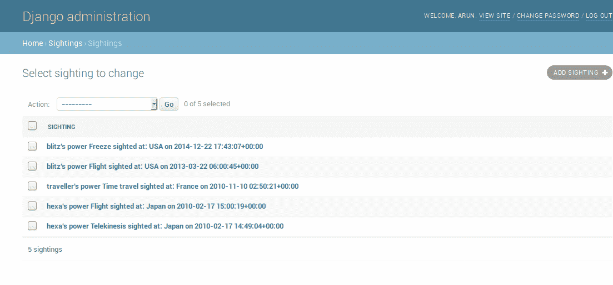

# 管理界面

在本章中，我们将讨论以下主题：

*   定制`admin`
*   增强管理模型
*   `admin`最佳实践
*   功能标志

Django 的突出特点是`admin`接口，这使它在竞争中脱颖而出。它是一个内置的应用程序，可以自动生成用户界面来添加和修改网站内容。对于许多人来说，`admin`是 Django 的杀手级应用程序，它自动化了为项目中的模型创建管理界面的枯燥任务。

`admin`允许您的团队在添加内容的同时继续开发。一旦您的模型准备好并应用了迁移，您只需添加一两行代码即可创建其`admin`接口。让我们看看如何。

# 使用管理界面

在新生成的项目中，`admin`接口默认启用。启动开发服务器后，您将能够在导航到`http://127.0.0.1:8000/admin/`时看到登录页面。

如果您已经配置了超级用户的凭证（或任何员工用户的凭证），则可以登录`admin`界面，如下图所示：


Django 管理层在新项目中的屏幕截图

如果您以前使用过 Django，您会注意到，`admin`界面的外观有所改进，特别是高 DPI 屏幕上的 SVG 图标。它还采用了响应式设计，适用于所有主要的移动浏览器。

但是，除非您在`admin`网站注册了模型，否则您的模型在此将不可见。这是在您的应用程序的`admin.py`中定义的。例如，在`sightings/admin.py`中，我们注册了`Sighting`模型，如下所示：

```py
from django.contrib import admin 
from . import models 

admin.site.register(models.Sighting) 
```

要注册的第一个参数指定要添加到`admin`站点的模型类。这里，要注册的第二个参数`ModelAdmin`类已被省略，因此我们将获得`post`模型的默认`admin`接口。让我们看看如何创建和定制这个`ModelAdmin`类。

灯塔

“在喝咖啡吗？”一个声音从食品储藏室的角落里问道。苏差点把咖啡洒了。一个身穿红色和蓝色紧身服装的高个子男子站着微笑，双手放在臀部。他胸前的标志上写着，大号字体，很明显。

“哦，我的天啊，”苏一边用餐巾擦拭咖啡污渍一边说。

“对不起，我想我吓到你了，”船长说，“什么事很紧急？”

“难道她不知道吗？”一个平静的女声从上方传来。苏抬起头，发现一个模糊的身影慢慢地从敞开的大厅里走下来。她的脸被她那黑色的乱蓬蓬的头发遮住了一部分，头发上有几条灰色的条纹。

很快，他们都在史蒂夫的办公室盯着他的屏幕。

“看，我告诉过你头版没有灯塔，”埃文说。“我们仍在开发该功能。”

“等等，”史蒂夫说。“让我通过一个非工作人员帐户登录。”

几秒钟后，页面刷新，一个动画的红色信标出现在顶部的显著位置。

“这就是我说的灯塔！”显然船长大声说道。“等一下，”史蒂夫说。他调出了当天早些时候部署的新功能的源文件。只要看一眼信标功能分支代码，就可以清楚地看出哪里出了问题：

`if switch_is_active(request, 'beacon') and not request.user.is_staff():`
`    beacon.activate()`

“对不起，各位，”史蒂夫说。“出现了一个逻辑错误。我们没有只为员工打开此功能，而是无意中为员工以外的所有人打开了它。现在它已关闭。对于任何混乱表示歉意。”

“那么，没有紧急情况？”船长失望地问。Hexa 把一只胳膊搭在他的肩膀上说：“恐怕不行，船长。”突然，传来一声巨响，所有人都跑向走廊。一名男子显然是通过一堵从地板到天花板的玻璃墙进入办公室的。他抖掉碎玻璃碎片，站了起来。“对不起，我尽可能快地来了，”他说。“我参加聚会迟到了吗？”

海克萨笑了。“不，布莱茨。我一直在等你加入，”她说。

# 增强管理模型

下面是一个示例，它增强了模型的`admin`，以获得更好的表示和功能。您可以查看以下两个屏幕截图之间的差异，了解几行代码如何产生巨大差异：



目击模型的默认管理员列表视图

在本节中解释的`admin`定制完成后，相同的信息将以更容易访问的方式呈现，如以下屏幕截图所示：


针对目击模型改进的管理列表视图

`admin`应用程序足够智能，可以自动从你的模型中找出很多东西。然而，有时可以改进推断的信息。这通常包括向模型本身（而不是`ModelAdmin`类）添加属性或方法。

以下是增强型`Sightings`模型：

```py
# models.py 
class Sighting(models.Model): 
    superhero = models.ForeignKey( 
        settings.AUTH_USER_MODEL, on_delete=models.CASCADE) 
    power = models.CharField(max_length=100) 
    location = models.ForeignKey(Location, on_delete=models.CASCADE) 
    sighted_on = models.DateTimeField() 

    def __str__(self): 
        return "{}'s power {} sighted at: {} on {}".format( 
            self.superhero, 
            self.power, 
            self.location.country, 
            self.sighted_on) 

    def get_absolute_url(self): 
        from django.urls import reverse 
        return reverse('sighting_details', kwargs={'pk': self.id}) 

    class Meta: 
        unique_together = ("superhero", "power") 
        ordering = ["-sighted_on"] 
        verbose_name = "Sighting & Encounter" 
        verbose_name_plural = "Sightings & Encounters" 
```

让我们看看如何使用所有这些非字段属性：

*   `__str__()`：如果没有这一点，`superhero`条目列表看起来会非常无聊。所有条目都将以`< Sighting: Sighting object>`格式显示。尝试在对象的`str`表示（或 Unicode 表示，在 Python 2.x 代码中）中显示对象的唯一信息，例如其名称或版本。任何有助于`admin`明确识别物体的东西都会有所帮助。
*   `get_absolute_url()`：如果您想在`admin`站点和您（非管理员）网站上对象的相应详细视图之间切换，此方法非常方便。如果定义了此方法，则在`admin.`中对象编辑页面的右上角将出现一个标记为“查看站点”的按钮
*   `ordering`：如果没有这个`Meta`选项，您的条目可以以从数据库返回的任何顺序出现。你可以想象，如果你有大量的物体，这对`admins`来说是没有乐趣的。`admins`通常更喜欢先看到新条目，因此按日期按时间倒序排序（因此减号）很常见。
*   `verbose_name`：如果省略此属性，模型名称将从`CamelCase`转换为驼峰大小写。在这种情况下，它轻率地将`"Sighting"`更改为`"Sighting & Encounter"`。但有时，自动生成的`verbose_name`看起来很尴尬，您可以在此处指定用户可读名称在`admin`界面中的显示方式。
*   `verbose_name_plural`：同样，省略此选项会给您带来有趣的结果。由于 Django 只是在单词前面加上一个*s*，因此生成的复数形式将显示为`"Sighting & Encounters"`（在`admin `首页上，不少于），因此最好在这里正确定义它。

建议您不仅为`admin`接口定义前面的`Meta`属性和方法，还要在 shell、日志文件等中更好地表示。

但是，您可以通过创建自定义的`ModelAdmin`类来使用`admin`的更多功能。在本例中，我们按如下方式对其进行定制：

```py
# admin.py 
class SightingAdmin(admin.ModelAdmin): 
    list_display = ('superhero', 'power', 'location', 'sighted_on') 
    date_hierarchy = 'sighted_on' 
    search_fields = ['superhero'] 
    ordering = ['superhero'] 

admin.site.register(models.Sighting, SightingAdmin) 
```

让我们更仔细地看看这些选项：

*   `list_display`：此选项以表格形式显示模型实例。它不使用模型的`__str__`表示，而是将提到的每个字段显示为一个单独的可排序列。如果您喜欢按模型的多个属性排序，这是理想的。
*   `date_hierarchy`：将模型的任何日期时间字段指定为日期层次结构将显示日期向下搜索（注意搜索框下方的可单击年份）。
*   `search_fields`：此选项显示列表上方的搜索框。输入的任何搜索词都将根据所述字段进行搜索。因此，此处只能提及文本字段，如`CharField`或`TextField`。
*   `ordering`：此选项优先于您模型的默认顺序。如果您希望在`admin`屏幕中使用不同的顺序，这将非常有用，这是我们在此采用的首选项。

我们只提到了最常用的`admin`选项的子集。某些类型的站点大量使用`admin`接口。在这种情况下，强烈建议您阅读并理解 Django 文档的`admin`部分。

# 不是每个人都应该是管理员

由于`admin`接口很容易创建，人们往往会滥用它们。有些人只需打开员工标志，就可以不加区别地为用户提供管理权限。很快，用户开始发出功能请求，将`admin`接口误认为是实际的应用程序接口。

不幸的是，这不是`admin`接口的用途。正如 staff 一词所暗示的那样，它是员工输入内容的内部工具。这是生产准备，但不是真正为您的网站的最终用户。

最好使用`admin`进行简单的数据输入。例如，在我曾经回顾过的一个学校范围内的内联网项目中，每一位教师都被要求申请 Django。这是一个糟糕的决定，因为`admin`界面让老师们感到困惑。

排班的工作流程包括检查其他教师和学生的时间表。使用`admin`界面可以让他们直接查看数据库。管理员对数据的修改方式几乎没有控制权。

因此，尽可能减少具有`admin`访问权限的人员。谨慎地通过`admin`进行更改，除非是简单的数据输入，例如添加文章内容。

最佳实践

不向最终用户授予管理员访问权限。

确保您的所有管理员都了解通过`admin`进行更改可能导致的数据不一致。如果可能，手动记录，或使用应用程序，如[django audit log](http://django-auditlog.readthedocs.io/en/latest/)，可以保存`admin`所做更改的日志，以备将来参考。

在大学的例子中，我们为教师创建了一个单独的界面，比如课程调度器。这些工具包含应用程序代码，可用于远远超出`admin`数据输入功能的目的，例如检测日期冲突。

从本质上讲，纠正`admin`界面的大多数误用包括为某些用户创建更强大的工具。但是，不要轻易（也是错误的）`path`授予他们管理员权限。

# 管理界面自定义

开箱即用的`admin`界面在入门时非常有用。不幸的是，大多数人认为很难改变 Django`admin`并保持原样。事实上，`admin`是非常可定制的，它的外观可以用最小的努力来彻底改变。

# 更改标题

`admin`界面的许多用户可能会被标题 Django administration 难倒。将其更改为定制的内容（例如*MySite Admin*）或酷的内容（例如*SuperBook Secret Area*）可能更有帮助。

做这个改变很容易。只需在站点的`urls.py`中添加以下行：

```py
admin.site.site_header = "SuperBook Secret Area" 
```

# 更改基础和样式表

几乎每个`admin`页面都是从名为`admin/base_site.html`的公共基础模板扩展而来的。这意味着只要稍微了解一下 HTML 和 CSS，就可以进行各种定制，以改变
`admin`界面的外观。

在任何`templates`目录中创建一个名为`admin`的目录。然后，从 Django 源目录复制`base_site.html`文件，并根据需要进行修改。如果不知道模板的位置，只需在 Django shell 中运行以下命令：

```py
>>> from os.path import join 
>>> from django.contrib import admin 
>>> print(join(admin.__path__[0], "templates", "admin")) 
/home/arun/env/sbenv/lib/python3.6/site-packages/django/contrib/admin/templates/admin 
```

最后一行是所有`admin`模板的位置。您可以覆盖或扩展这些模板中的任何一个。

以覆盖`admin`基本模板为例，您可以将整个`admin`界面的字体从 Google Fonts 更改为*Special Elite*，这非常有助于给人一种严肃的感觉。

您需要将`base_site.html`从`admin`模板复制到模板目录中的`admin/base_site.html`。然后，在末尾添加以下行：

```py
 
    <link href='http://fonts.googleapis.com/css?family=Special+Elite' rel='stylesheet' type='text/css'> 
    <style type="text/css"> 
     body, td, th, input { 
       font-family: 'Special Elite', cursive; 
     } 
    </style> 
 
```

这增加了一个额外的`stylesheet`用于覆盖字体相关样式，并将应用于每个`admin`页面。

# 添加用于所见即所得编辑的富文本编辑器

有时，您需要在`admin`接口中包含 JavaScript 代码。一个常见的要求是对文本字段使用 HTML 编辑器，如 CKEditor。

在 Django 中有几种方法可以实现这一点，例如，在`ModelAdmin`类上使用`Media`内部类。然而，我发现扩展`admin``change_form`模板是最方便的方法。

例如，如果您有一个名为 posts 的应用程序，那么您需要在`templates/admin/posts/ directory`中创建一个名为`change_form.html`的文件。如果您需要在此应用程序中为模型的消息字段显示 CKEditor（可以是任何 JavaScript 编辑器，但我更喜欢这个），那么文件的内容可以如下所示：

```py
 

 
  {{ block.super }} 
  <script src="//cdn.ckeditor.com/4.4.4/standard/ckeditor.js"></script> 
  <script> 
   CKEDITOR.replace("id_message", { 
     toolbar: [ 
     [ 'Bold', 'Italic', '-', 'NumberedList', 'BulletedList'],], 
     width: 600, 
   }); 
  </script> 
  <style type="text/css"> 
   .cke { clear: both; } 
  </style> 
 
```

粗体部分是表单元素的自动创建 ID，我们希望将其从普通文本框增强为富文本编辑器。此更改不会影响`admin`站点中的其他文本框或表单字段。这些脚本和样式已添加到页脚块，以便在更改表单元素之前在 DOM 中创建它们。

实现这一点的其他方法可能需要安装应用程序和其他配置更改。如果只更改一个`admin`站点字段，这可能会有点过头。这里的方法还为您提供了选择 JavaScript 编辑器的灵活性。

# 引导主题管理

毫不奇怪，`admin`定制的一个常见要求是它是否可以与引导集成。有几种软件包可以做到这一点，比如`Django-admin-bootstrapped`或 Django 套装。

这些包提供了随时可用的引导主题模板，而不是自己覆盖所有管理模板。它们易于安装和部署。基于 Bootstrap，它们响应迅速，并附带各种小部件和组件。

# 全面检修

已经尝试完全重新构思`admin`接口。[Grappelli](https://django-grappelli.readthedocs.io/)是一款非常流行的皮肤，它通过自动完成查找和可折叠内联线等新功能扩展了 Django`admin`。使用[django 管理工具](https://django-admin-tools.readthedocs.io/)，您可以获得一个可定制的仪表板和菜单栏。

也有人试图完全重写`admin,`，如`django-admin2`和 nexus，但没有获得任何重大采纳。甚至还有一个名为`AdminNext`的官方提议，要改造整个`admin`应用程序。考虑到现有`admin`的规模、复杂性和受欢迎程度，任何此类努力都将花费大量时间。

# 保护管理员

网站的`admin`界面提供了对存储的几乎每一条数据的访问，因此不要让隐喻之门掉以轻心。事实上，有人在运行 Django 的唯一迹象是当你导航到[时 http://example.com/admin/](http://example.com/admin/) 您将看到蓝色的登录屏幕。

在生产中，建议您将此位置更改为不太明显的位置。只需更改根目录中的以下行即可`urls.py:`

```py
    path('secretarea/', admin.site.urls), 
```

一种稍微复杂一点的方法是在默认位置使用一个虚拟的`admin`站点或蜜罐（参见[django admin 蜜罐](http://django-admin-honeypot.readthedocs.io/)包）。然而，最好的选择是对您的`admin`区域（以及其他任何地方）使用 HTTPS，因为普通 HTTP 将通过网络以纯文本形式发送所有数据。

查看您的 web 服务器文档，了解如何为`admin`请求设置 HTTPS（或者，如果您的整个站点都可以使用 HTTPS，则更好）。在 Nginx 上，设置它非常容易。这涉及到指定 SSL 证书位置。最后，将`admin`页面的所有 HTTP 请求重定向到 HTTPS，这样您可以睡得更安稳。

下面的模式并不严格限于`admin`接口，但它仍然包含在本章中，因为它通常在`admin`中控制。

# 模式–特征标志

**问题：**向用户发布新功能应该独立于生产中相应代码的部署。

**解决方案：**在部署后使用功能标志有选择地启用或禁用功能。

# 问题详情

如今，在生产中频繁推出 bug 修复和新功能是很常见的。这些变化中的许多都没有被用户注意到。然而，对可用性或性能有重大影响的新特性应该分阶段推出。换句话说，部署应该与发布分离。

简单的发布过程会在新功能部署后立即激活它们。这可能会带来灾难性的后果，从用户问题（占用您的支持资源）到性能问题（导致停机）。

因此，在大型站点中，将新功能在生产中的部署与其激活解耦是很重要的。即使它们被激活，有时也只能被选定的一组用户看到。此选定组可以是员工，也可以是获得早期预览的有限客户组。

# 解决方案详细信息

许多站点使用功能标志控制新功能的激活。通常，这是在每个环境中控制的交换机。功能翻转器是代码中的一个开关，用于确定某个功能是否应提供给某些客户。但我们将在这里使用通用术语“特征标志”。

一些 Django 软件包提供了功能标志，如[滴水嘴](http://gargoyle.readthedocs.io/)和[Django 华夫饼干](https://waffle.readthedocs.io/)。这些包在数据库中存储站点的功能标志。可通过`admin`界面或管理命令激活或停用。因此，每个环境（生产、测试、开发等）都可以有自己的激活特性集。

功能标志最初记录在 Flickr 中（参见[http://code.flickr.net/2009/12/02/flipping-out/](http://code.flickr.net/2009/12/02/flipping-out/) ）。他们管理一个没有任何分支的代码库，也就是说，所有东西都被签入主线。他们还每天将此代码部署到生产环境中好几次。如果他们发现一个新特性破坏了生产中的任何东西或增加了数据库的负载，那么他们只需通过关闭该特性标志来禁用它。

功能标志可用于各种其他情况（以下示例使用 Django 华夫格）：

*   **试用**：对于某些用户，功能标志也可以有条件地处于活动状态。他们可以是您自己的员工或您可能瞄准的某些早期采用者，如下所示：

```py
    def my_view(request): 
        if flag_is_active(request, 'flag_name'): 
            # Behavior if flag is active. 
```

网站可以并行运行多个这样的试验，因此不同的用户组实际上可能有不同的用户体验。在更广泛的部署之前，从这些受控测试中收集指标和反馈。

*   **A/B 测试**：这与试验非常相似，只是用户是在对照实验中随机选择的。此方法在 web 设计中非常常见，用于确定哪些更改可以提高转换率。以下是如何编写此类视图：

```py
    def my_view(request): 
        if sample_is_active(request, 'new_design'): 
            # Behavior for test sample. 
```

*   **性能测试**：有时很难衡量某个功能对服务器性能的影响。在这种情况下，最好先为一小部分用户激活标志。如果性能在预期限值内，则可以逐渐增加激活百分比。
*   **限制外部性**：我们还可以将功能标志用作反映其服务可用性的站点范围的功能切换。例如，AmazonS3 等外部服务的宕机会导致用户在执行上传照片等操作时面临错误消息。当外部服务长时间停机时，可以停用功能标志，并禁用上载按钮和/或显示有关停机的更有用消息。此简单功能可节省用户的时间并提供更好的用户体验：

```py
    def my_view(request): 
        if switch_is_active('s3_down'): 
            # Disable uploads and show it is downtime 
```

这种方法的主要缺点是代码中充斥着条件检查。但是，这可以通过定期的代码清理来控制，清除对完全接受的特性的检查并删除永久停用的特性。

标志的激活可以通过`admin`站点使用内置的用户身份验证和权限系统进行控制。您也可以从`admin`界面控制样本百分比。

# 总结

在本章中，我们探讨了 Django 的内置`admin`应用程序。我们发现它不仅非常有用，而且还可以进行各种定制以改进其外观和功能。

在下一章中，我们将通过考虑各种模式和常见用例来了解如何在 Django 中更有效地使用表单。