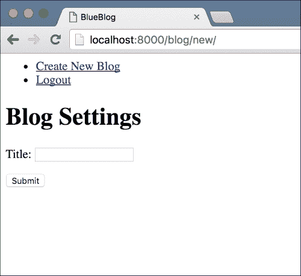
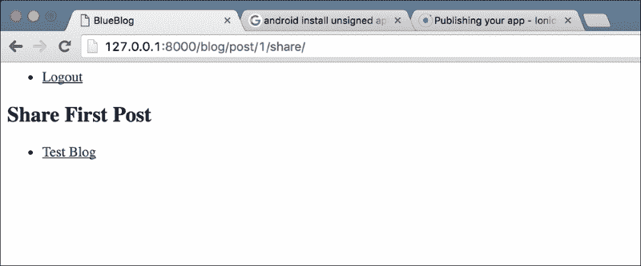

# 一、Blueblog——博客平台

我们将从 Django 的一个简单博客平台开始。近年来，Django 已经成为 web 框架领域的佼佼者之一。当大多数人决定开始使用 web 框架时，他们的搜索会导致他们选择**RubyonRails**（**RoR**）或 Django。两者都是成熟、稳定和广泛使用的。似乎使用其中一种的决定主要取决于您熟悉哪种编程语言。红宝石手和罗，蟒蛇手和德扬戈。就功能而言，两者都可以实现相同的结果，尽管它们有不同的处理方式。

如今最流行的博客平台之一是中型平台，被许多知名博客作者广泛使用。它的流行源于它优雅的主题和简单易用的界面。我将引导您在 Django 中创建一个类似的应用程序，其中包含一些大多数博客平台所没有的令人惊讶的特性。这会让你对即将到来的事情有所了解，并向你展示 Django 的多才多艺。

在开始任何软件开发项目之前，最好对我们想要实现的目标有一个大致的路线图。以下是我们的博客平台将具备的功能列表：

*   用户应该能够注册一个帐户并创建他们的博客
*   用户应该能够调整他们博客的设置
*   应该有一个简单的界面供用户创建和编辑博客文章
*   用户应该能够在平台上的其他博客上共享他们的博客文章

我知道这似乎需要做很多工作，但 Django 附带了几个`contrib`包，大大加快了我们的工作速度。

# contrib 包

`contrib`包是 Django 的一部分，其中包含一些非常有用的应用程序，Django 开发人员认为这些应用程序应该随 Django 一起提供。所包含的应用程序提供了一组令人印象深刻的功能，包括我们将在此应用程序中使用的一些功能：

*   **管理员**是一个功能齐全的 CMS，可用于管理 Django 网站的内容。管理应用程序是 Django 流行的一个重要原因。我们将使用它为站点管理员提供一个界面，以调节和管理应用程序中的数据
*   **认证**提供用户注册和认证，无需我们做任何工作。我们将使用此模块允许用户在我们的应用程序中注册、登录和管理他们的配置文件

### 注

在`contrib`模块中有更多的好东西。我建议您在[处查看完整的列表 https://docs.djangoproject.com/en/stable/ref/contrib/#contrib-套餐](https://docs.djangoproject.com/en/stable/ref/contrib/#contrib-packages)。

我通常在所有 Django 项目中使用至少三个`contrib`包。它们提供了经常需要的功能，如用户注册和管理，并让您自由地参与项目的核心部分，为建立一个坚实的基础提供基础。

# 建立我们的发展环境

在第一章中，我将详细介绍如何设置开发环境。在后面的章节中，我将只提供最低限度的说明。有关我如何设置开发环境以及为什么设置开发环境的更多详细信息，请参阅[附录](8.html "Appendix A. Development Environment Setup Details and Debugging Techniques")、*开发环境设置详细信息和调试技术*。

让我们首先为我们的项目创建目录结构，设置虚拟环境，并配置一些需要在每个项目中设置的基本 Django 设置。让我们称我们的博客平台为 BlueBlog。

### 注

关于您将要看到的步骤的详细说明，请参见[附录](8.html "Appendix A. Development Environment Setup Details and Debugging Techniques")、*开发环境设置细节和调试技术*。如果您不确定我们为什么要做某件事或某个特定命令的作用，请参阅该文档。

要开始一个新项目，首先需要打开终端程序。在 Mac OS X 中，它是内置终端。在 Linux 中，每个发行版的终端都是单独命名的，但您应该不会在查找它时遇到问题；尝试在程序列表中搜索单词 terminal，应该会显示一些相关的内容。在 Windows 中，终端程序称为命令行。您需要根据您的操作系统启动相关程序。

### 注

如果您使用的是 Windows 操作系统，则需要稍微修改本书中显示的命令。详细内容请参见[附录](8.html "Appendix A. Development Environment Setup Details and Debugging Techniques")中的*Windows*部分*开发环境设置及调试技巧*部分。

打开操作系统的相关终端程序，开始为我们的项目创建目录结构；使用如下所示的命令将`cd`（ing）导入根项目目录：

```py
> mkdir –p blueblog
> cd blueblog

```

接下来，让我们创建虚拟环境，安装 Django，并启动我们的项目：

```py
> pyvenv blueblogEnv
> source blueblogEnv/bin/activate
> pip install django
> django-admin.py startproject blueblog src

```

有了这些，我们准备开始开发我们的博客平台。

## 数据库设置

在您喜爱的编辑器中打开在`$PROJECT_DIR/src/blueblog/settings.py`找到的设置，并确保`DATABASES`设置变量与此匹配：

```py
DATABASES = {
    'default': {
        'ENGINE': 'django.db.backends.sqlite3',
        'NAME': os.path.join(BASE_DIR, 'db.sqlite3'),
    }
}
```

为了初始化数据库文件，运行以下命令：

```py
> cd src
> python manage.py migrate

```

## 静态文件设置

设置我们的开发环境的最后一步是配置`staticfiles``contrib`应用程序。staticfiles 应用程序提供了许多特性，可以轻松管理项目的静态文件（css、图像、JavaScript）。虽然我们的使用量很小，但您应该更详细地查看 Django 文档中的静态文件，因为它在大多数真实的 Django 项目中使用得相当多。您可以在[找到文档 https://docs.djangoproject.com/en/stable/howto/static-files/](https://docs.djangoproject.com/en/stable/howto/static-files/) 。

为了设置 staticfiles 应用程序，我们必须在`settings.py`文件中配置一些设置。首先，确保将`django.contrib.staticfiles`添加到`INSTALLED_APPS`中。Django 应该在默认情况下做到这一点。

接下来，将`STATIC_URL`设置为您希望从中提供静态文件的任何 URL。我通常将其保留为默认值`/static/`。当您使用 statictemplate 标记获取静态文件的路径时，Django 将把这个 URL 放在模板中。

## 基础模板

接下来，让我们设置一个基础模板，应用程序中的所有其他模板都将从中继承。我更喜欢将一个项目的多个应用程序使用的模板放在项目源文件夹中名为 templates 的目录中。要进行设置，请将`os.path.join(BASE_DIR, 'templates')`添加到设置文件中`TEMPLATES`配置字典的`DIRS`数组中，然后在`$PROJECT_ROOT/src`中创建一个名为 templates 的目录。接下来，使用您喜爱的文本编辑器，在新文件夹中创建一个名为`base.html`的文件，其中包含以下内容：

```py
<html>
<head>
    <title>BlueBlog</title>
</head>
<body>
    
    
</body>
</html>
```

与从其他类继承的 Python 类非常相似，Django 模板也可以从其他模板继承。就像 Python 类可以用它们的子类覆盖函数一样，Django 模板也可以定义子模板可以覆盖的块。我们的`base.html`模板提供了一个用于继承要覆盖的模板的块，称为**内容**。

使用模板继承的原因是代码重用。我们应该将希望在网站的每个页面上都可见的 HTML，例如页眉、页脚、版权声明、元标记等，放在基本模板中。然后，从它继承的任何模板都将自动获得所有通用 HTML，并且我们只需要覆盖要自定义的块的 HTML 代码。在本书中，您将看到在整个项目中使用的基本模板中创建和重写块的原理。

# 用户账号

数据库设置完成后，让我们开始创建应用程序。如果您还记得，我们功能列表中的第一件事是允许用户在我们的网站上注册帐户。正如我前面提到的，我们将使用 Django contrib 包中的 auth 包来提供用户帐户功能。

为了使用 auth 包，我们需要将其添加到设置文件中的`INSTALLED_APPS`列表中（在`$PROJECT_ROOT/src/blueblog/settings.py`中找到）。在设置文件中，找到定义`INSTALLED_APPS`的行，并确保字符串`django.contrib.auth`是列表的一部分。默认情况下应该是这样，但由于某些原因，如果它不存在，请手动添加它。

您将看到，默认情况下，Django 已将 auth 包和其他几个 contrib 应用程序包括在列表中。新的 Django 项目默认包含这些应用程序，因为几乎所有 Django 项目最终都使用这些应用程序。

### 注

如果需要将 auth 应用程序添加到列表中，请记住在应用程序名称周围使用引号。

我们还需要确保`MIDDLEWARE_CLASSES`列表包含`django.contrib.sessions.middleware.SessionMiddleware`、`django.contrib.auth.middleware.AuthenticationMiddleware`和`django.contrib.auth.middleware.SessionAuthenticationMiddleware`。这些中间件类使我们能够访问视图中的登录用户，并确保如果我更改了帐户的密码，我将从我以前登录的所有其他设备中注销。

当您进一步了解各种 contrib 应用程序及其用途时，您可以开始删除项目中不需要的任何应用程序。现在，让我们添加允许用户向我们的应用程序注册的 URL、视图和模板。

## 用户账户应用程序

为了创建与用户帐户相关的各种视图、URL 和模板，我们将启动一个新应用程序。为此，请在命令行中键入以下命令：

```py
> python manage.py startapp accounts

```

这将在`src`文件夹中创建一个新的`accounts`文件夹。我们将添加处理此文件夹中的文件中的用户帐户的代码。要让 Django 知道我们希望在项目中使用此应用程序，请将应用程序名称（accounts）添加到`INSTALLED_APPS`设置变量中；确保用引号括起来。

## 账户注册

我们将研究的第一个功能是用户注册。让我们从开始，在`accounts/views.py`中为注册视图编写代码。确保`views.py`的内容与此处所示内容相匹配：

```py
from django.contrib.auth.forms import UserCreationForm
from django.core.urlresolvers import reverse
from django.views.generic import CreateView

class UserRegistrationView(CreateView):
    form_class = UserCreationForm
    template_name = 'user_registration.html'

    def get_success_url(self):
        return reverse('home')
```

我将稍微解释一下这段代码的每一行都在做什么。但是首先，我想让你进入一个状态，在那里你可以注册一个新用户，然后自己看看流程是如何工作的。接下来，我们将为此视图创建模板。为了创建模板，首先需要在`accounts`文件夹中创建一个名为`templates`的新文件夹。文件夹的名称很重要，因为 Django 会自动在该名称的文件夹中搜索模板。要创建此文件夹，只需键入以下命令：

```py
> mkdir accounts/templates

```

接下来，在`templates`文件夹中创建一个名为`user_registration.html`的新文件，并键入如下代码：

```py



<h1>Create New User</h1>
<form action="" method="post">
    {{ form.as_p }}
    <input type="submit" value="Create Account" />
</form>

```

最后，删除`blueblog/urls.py`中已有的代码并替换为：

```py
from django.conf.urls import include
from django.conf.urls import url
from django.contrib import admin
from django.views.generic import TemplateView
from accounts.views import UserRegistrationView

urlpatterns = [
    url(r'^admin/', include(admin.site.urls)),
    url(r'^$', TemplateView.as_view(template_name='base.html'), name='home'),
    url(r'^new-user/$', UserRegistrationView.as_view(), name='user_registration'),
]
```

这就是我们在项目中获得用户注册所需的全部代码！让我们快速演示一下。通过键入以下命令来运行开发服务器：

```py
> python manage.py runser
ver

```

在您的浏览器中，访问`http://127.0.0.1:8000/new-user/`，您将看到一张用户注册表。填写该表格，然后单击提交。成功注册后，您将进入空白页。如果出现一些错误，表格将再次显示，并显示相应的错误消息。让我们确认我们的新帐户确实是在数据库中创建的。

下一步，我们需要一个管理员帐户。Django auth contrib 应用程序可以为用户帐户分配权限。拥有最高权限级别的用户称为**超级用户**。超级用户帐户对应用程序拥有自由支配权，可以执行任何管理员操作。要创建超级用户帐户，请运行以下命令：

```py
> python manage.py createsuperuser

```

### 注

由于您的终端中已经运行了`runserver`命令，您需要先在终端中按*Ctrl*+*C*退出命令。然后，您可以在同一终端中运行`createsuperuser`命令。运行`createsuperuser`命令后，您需要再次启动`runserver`命令来浏览站点。

如果您希望保持`runserver`命令运行，并在新的终端窗口中运行`createsuperuser`命令，则需要确保通过运行与我们之前创建新项目时运行的相同源`blueblogEnv/bin/activate`命令来激活此应用程序的虚拟环境。

创建帐户后，请访问`http://127.0.0.1:8000/admin/`并使用管理员帐户登录。您将看到一个名为**用户**的链接。单击该按钮，您将看到在我们的应用程序中注册的用户列表。它将包括您刚刚创建的用户。

恭喜！在大多数其他框架中，使用有效的用户注册功能达到这一点需要付出更多的努力。Django 采用电池供电的方式，使我们能够以最小的努力完成同样的工作。

接下来，我将解释您编写的每行代码的作用。

### 一般视图

下面是用户注册视图的代码：

```py
class UserRegistrationView(CreateView):
    form_class = UserCreationForm
    template_name = 'user_registration.html'

    def get_success_url(self):
        return reverse('home')
```

我们的观点对于做这么多工作的东西来说是相当简短的。这是因为我们没有从头开始编写代码来处理所有的工作，而是使用 Django 最有用的特性之一，泛型视图。泛型视图是 Django 中包含的基类，提供许多 web 应用程序通常需要的功能。通用视图的强大功能来自于轻松定制它们的能力。

### 注

您可以在[上的文档中阅读更多关于 Django 通用视图的 https://docs.djangoproject.com/en/stable/topics/class-based-views/](https://docs.djangoproject.com/en/stable/topics/class-based-views/) 。

这里，我们使用的是`CreateView`通用视图。此通用视图可以使用模板显示`ModelForm`，提交时可以在表单数据无效时重新显示有错误的页面，或者在表单上调用`save`方法并将用户重定向到可配置的 URL。`CreateView`可通过多种方式进行配置。

如果您想从某个 Django 模型自动创建一个`ModelForm`，只需将`model`属性设置为`model`类，表单就会从该模型的字段自动生成。如果希望表单仅显示模型中的某些字段，请使用`fields`属性列出所需字段，就像使用`ModelForm`时一样。

在我们的例子中，不是自动生成一个`ModelForm`，而是提供一个我们自己的；`UserCreationForm`。我们通过在视图上设置`form_class`属性来实现这一点。此表单是 auth contrib 应用程序的一部分，提供了可用于创建新用户的字段和`save`方法。当我们在后面的章节中开始开发更复杂的应用程序时，您将看到，使用 Django 提供的小型可重用部件组合解决方案这一主题是 Django web 应用程序开发中的常见做法，我认为这是该框架的最佳功能之一。

最后，我们定义了一个`get_success_url`函数，该函数执行简单的反向 URL 并返回生成的 URL。`CreateView`调用此函数获取 URL，在有效表单提交保存成功后将用户重定向到。为了快速启动和运行一些东西，我们省略了一个真正的成功页面，只是将用户重定向到一个空白页面。我们稍后会解决这个问题。

### 模板和 URL

模板扩展了我们之前创建的基础模板，它简单地显示了`CreateView`使用`form.as_p`方法传递给它的表单，这可能是您在之前处理过的简单 Django 项目中看到的。

`urls.py`文件更有趣一点。您应该熟悉其中的大部分内容，包括管理站点 URL 和为视图分配 URL 的部分。我想在这里解释的是`TemplateView`的用法。

与`CreateView`一样，`TemplateView`是 Django 提供给我们的另一个通用视图。顾名思义，此视图可以向用户呈现和显示模板。它有许多自定义选项。最重要的一个是`template_name`，它告诉它要呈现和显示给用户的模板。

我们本可以创建另一个视图类，将`TemplateView`子类化，并通过设置属性和覆盖函数对其进行定制，就像我们对注册视图所做的那样。但我想向您展示在 Django 中使用泛型视图的另一种方法。如果只需要自定义通用视图的一些基本参数；在本例中，我们只想设置视图的`template_name`参数，您只需将值作为`key=value`对作为函数关键字参数传递给类的`as_view`方法，将其包含在`urls.py`文件中即可。这里，我们传递当用户访问其 URL 时视图呈现的模板名称。因为我们只需要一个占位符 URL 来重定向用户，所以我们只使用空白的 OT5 T5 模板。

### 提示

这种通过传递键/值对来定制通用视图的技术只有在您对定制非常基本的属性感兴趣时才有意义，就像我们在这里所做的那样。如果您想要更复杂的定制，我建议您对视图进行子类化，否则您将很快得到难以维护的混乱代码。

## 登录和注销

随着注册的进行，让我们编写代码为用户提供登录和注销的能力。为了开始，用户需要某种方式从站点上的任何页面转到登录和注册页面。为此，我们需要向模板添加标题链接。这是演示模板继承如何在模板中产生更干净、更少代码的绝佳机会。

在我们的`base.html`文件中的`body`标记后面添加以下行：

```py

<ul>
    <li><a href="">Login</a></li>
    <li><a href="">Logout</a></li>
    <li><a href="">Register Account</a></li>
</ul>

```

如果您现在打开我们网站的主页（位于`http://127.0.0.1:8000/`，您应该会看到我们现在在以前的空白页面上有三个链接。它应该类似于以下屏幕截图：


点击**注册账号**链接。你会看到我们之前的登记表，还有同样的三个链接。请注意，我们是如何将这些链接添加到`base.html`模板的。但是，由于用户注册模板扩展了基本模板，因此我们无需付出任何努力即可获得这些链接。这就是模板继承真正闪耀的地方。

您可能已经注意到登录/注销链接的`href`为空。让我们从登录部分开始。

### 登录视图

让我们首先定义 URL。在`blueblog/urls.py`中，从 auth app 导入登录视图：

```py
from django.contrib.auth.views import login
```

接下来，将其添加到`urlpatterns`列表中：

```py
url(r'^login/$', login, {'template_name': 'login.html'}, name='login'),
```

然后在`accounts/templates`中创建一个名为`login.html`的新文件。加入以下内容：

```py



<h1>Login</h1>
<form action="" method="post">
    {{ form.as_p }}

    <input type="hidden" name="next" value="{{ next }}" />
    <input type="submit" value="Submit" />
</form>

```

最后，打开`blueblog/settings.py`并在文件末尾添加以下行：

```py
LOGIN_REDIRECT_URL = '/'
```

让我们回顾一下我们在这里所做的事情。首先，请注意，我们没有创建自己的代码来处理登录功能，而是使用了 auth 应用程序提供的视图。我们使用`from django.contrib.auth.views import login`导入它。接下来，我们将其与 login/URL 关联。如果您还记得用户注册部分，我们在`as_view()`函数中将模板名称作为关键字参数传递给主页视图。这种方法用于基于类的视图。对于旧式视图函数，我们可以将字典传递给`url`函数，该函数作为关键字参数传递给视图。这里，我们使用我们在`login.html`中创建的模板。

如果您查看登录视图（[的文档 https://docs.djangoproject.com/en/stable/topics/auth/default/#django.contrib.auth.views.login](https://docs.djangoproject.com/en/stable/topics/auth/default/#django.contrib.auth.views.login) ），您会看到成功登录后，会将用户重定向到`settings.LOGIN_REDIRECT_URL`。默认情况下，此设置的值为`/accounts/profile/`。因为我们没有定义这样的 URL，所以我们将设置改为指向我们的主页 URL。

接下来，让我们定义注销视图。

### 注销视图

在`blueblog/urls.py`中，使用`from django.contrib.auth.views import logout`导入注销视图，并将以下内容添加到`urlpatterns`列表中：

```py
url(r'^logout/$', logout, {'next_page': '/login/'}, name='logout'),
```

就这样。注销视图不需要模板；它只需要配置一个 URL，在用户注销后将重定向到该 URL 即可。我们只是将用户重定向回登录页面。

### 导航链接

在添加了登录/注销视图之后，我们需要使之前在导航菜单中添加的链接将用户带到这些视图。将`templates/base.html`中的链接列表更改为：

```py
<ul>
    
    <li><a href="">Logout</a></li>
    
    <li><a href="">Login</a></li>
    <li><a href="">Register Account</a></li>
    
</ul>
```

这将显示用户尚未登录时的**登录和注册帐户**链接。如果他们登录，我们使用`request.user.is_authenticated`功能检查，他们只显示**注销**链接。你可以自己测试所有这些链接，看看我们网站的主要功能需要多少代码。这一切都是可能的，因为 Django 提供了 contrib 应用程序。

## 博客

随着用户注册的取消，让我们开始应用程序的博客端。我们将为博客创建一个新的应用程序，因此在控制台中键入以下内容：

```py
> python manage.py startapp blog
> mkdir blog/templates

```

将博客应用程序添加到我们`settings.py`文件的`INSTALLED_APPS`列表中。随着应用程序的创建和安装，让我们从我们将要使用的模型开始。

## 型号

在`blog/models.py`中，输入如下代码：

```py
from django.contrib.auth.models import User
from django.db import models

class Blog(models.Model):
    owner = models.ForeignKey(User, editable=False)
    title = models.CharField(max_length=500)

    slug = models.CharField(max_length=500, editable=False)

class BlogPost(models.Model):
    blog = models.ForeignKey(Blog)
    title = models.CharField(max_length=500)
    body = models.TextField()

    is_published = models.BooleanField(default=False)

    slug = models.SlugField(max_length=500, editable=False)
```

在输入此代码后，运行以下命令为这些模型创建数据库表：

```py
> python manage.py makemigrations blog
> python manage.py migrate blog

```

这将创建支持新模型所需的数据库表。这些模型非常基本。您以前可能没有使用过的一种字段类型是**SlugField**。slug 是一段用于唯一标识某物的文本。在我们的例子中，我们使用两个 slug 字段来标识我们的博客和博客文章。由于这些字段是不可编辑的，我们必须自己编写代码来给它们一些值。我们稍后再调查。

## 创建博客视图

让我们创建一个视图，用户可以在其中设置他的博客。让我们制作一个表单，用户将使用该表单创建一个新的博客。创建新文件`blog/forms.py`并输入以下内容：

```py
from django import forms

from blog.models import Blog

class BlogForm(forms.ModelForm):
    class Meta:
        model = Blog

        fields = [
                 'title'
                 ]
```

这将创建一个模型表单，只允许编辑`Blog`模型的**标题**字段。让我们创建一个模板和视图，以便与此表单一起使用。

创建一个名为`blog/templates/blog_settings.html`的文件，并键入以下 HTML 代码：

```py



<h1>Blog Settings</h1>
<form action="" method="post">
    {{ form.as_p }}

    <input type="submit" value="Submit" />
</form>

```

正如您可能已经注意到的，我已经在名为 URL 的博客设置上使用了`url`标记，但尚未创建该 URL 模式。我们将在创建视图后执行此操作，但只需记住名称以备以后使用，并确保我们的 URL 具有相同的名称。

### 注

没有正确的顺序来创建视图、模板和 URL。这取决于你决定哪一个更适合你。

在您的`blog/views.py`文件中，添加以下代码以创建视图：

```py
from django.core.urlresolvers import reverse
from django.http.response import HttpResponseRedirect
from django.utils.text import slugify
from django.views.generic import CreateView

from blog.forms import BlogForm

class NewBlogView(CreateView):
    form_class = BlogForm
    template_name = 'blog_settings.html'

    def form_valid(self, form):
        blog_obj = form.save(commit=False)
        blog_obj.owner = self.request.user
        blog_obj.slug = slugify(blog_obj.title)

        blog_obj.save()
        return HttpResponseRedirect(reverse('home'))
```

修改`blueblog/urls.py`。将其添加到文件`from blog.views import NewBlogView`的顶部，并将其添加到`urlpatterns`列表中：

```py
url(r'^blog/new/$', NewBlogView.as_view(), name='new-blog'),
```

最后一步，我们需要一些方法让用户访问我们的新视图。将`base.html`中的头块更改为如下所示：

```py

<ul>
    
    <li><a href="">Create New Blog</a></li>
    <li><a href="">Logout</a></li>
    
    <li><a href="">Login</a></li>
    <li><a href="">Register Account</a></li>
    
</ul>

```

要测试我们的最新功能，请打开主页`http://127.0.0.1:8000`并单击**创建新博客**链接。它将显示一个表单，您可以在其中输入博客标题并保存新博客。该页面应类似于以下屏幕截图：



我们添加的大部分代码都非常基本。有趣的部分是`NewBlogView`。让我们看看它是如何工作的。首先，请注意，我们从`CreateView`泛型视图中将其子类化。“创建”视图允许我们轻松显示和处理表单，该表单将创建给定模型的新对象。要配置它，我们可以设置视图的`model`和`fields`属性，创建视图将使用该属性生成模型表单，或者我们可以手动创建模型表单并将其分配给视图，就像我们在这里所做的那样。

我们还配置了用于显示表单的模板。然后，我们定义了`form_valid`函数，当表单与有效数据一起提交时，create 视图将调用该函数。在我们的实现中，我们调用模型表单`save`方法，将`commit`关键字参数设置为`False`。这告诉表单使用传递的数据创建模型的新对象，但不将创建的对象保存到数据库中。然后，我们将新 blog 对象的所有者设置为登录用户，并将其 slug 设置为用户输入的标题的 slug 版本。slugify 是 Django 提供的许多实用功能之一。一旦我们根据需要修改了 blog 对象，我们将保存它并从`form_valid`函数返回一个`HttpResponseRedirect`。此响应返回到浏览器，然后浏览器将用户带到主页。

到目前为止，我们只使用了一个空白页面和一个导航栏作为主页。但它有一个严重的问题。按照导航栏中的链接创建一个新博客。成功创建一个新博客后，我们被重定向回主页，在那里我们再次收到创建另一个博客的链接。但这不是我们想要的行为。理想情况下，我们的用户应该被限制在每个帐户一个博客。

让我们来解决这个问题。首先，我们将限制 blog creation 视图，仅允许用户在还没有博客的情况下创建博客。导入`HttpResponseForbidden`和`blog/views.py`中的`Blog`模型：

```py
from django.http.response import HttpResponseForbidden
from blog.models import Blog
```

在`NewBlogView`类中添加`dispatch`方法，代码如下：

```py
def dispatch(self, request, *args, **kwargs):
    user = request.user
    if Blog.objects.filter(owner=user).exists():
        return HttpResponseForbidden ('You can not create more than one blogs per account')
    else:
        return super(NewBlogView, self).dispatch(request, *args, **kwargs)
```

`dispatch`方法是在泛型视图上重写的最有用的方法之一。它是在点击视图 URL 时调用的第一个方法，并根据请求类型决定是否调用视图类上的`get`或`post`方法来处理请求。因此，如果您想要在所有请求类型（GET、POST、HEAD、PUT 等）上运行某些代码，分派是最好的重写方法。

在这种情况下，我们确保用户没有与他们的帐户关联的 blog 对象。如果有，我们使用`HttpResponseForbidden`响应类返回`Not Allowed`响应。试试看。如果您之前已经创建了一个博客，并且应该看到一个错误，那么您现在甚至不能访问新的博客页面。

最后一件事。注销后尝试访问 URL`http://127.0.0.1:8000/blog/new/`。请注意，如何得到一个`AnonymousUser`对象是一个不可忽略的错误。这是因为即使您没有以注册用户身份登录，视图的代码仍然假定您是。此外，如果不先登录，您将无法访问新的博客页面。要解决此问题，首先将这两个导入行放在`blog/views.py`的顶部：

```py
from django.utils.decorators import method_decorator
from django.contrib.auth.decorators import login_required
```

然后更改分派方法的定义行以匹配以下内容：

```py
@method_decorator(login_required)
def dispatch(self, request, *args, **kwargs):
```

如果您现在不先登录就尝试访问该页面，您应该会看到一个`Page not found (404)`Django 错误页面。如果您查看该页面的 URL，您将看到 Django 正在尝试提供`/accounts/login/`URL。这是`login_required`装饰器的默认行为。要解决这个问题，我们需要更改设置文件中`LOGIN_URL`变量的值。将其放入`blueblog/settings.py`：

```py
LOGIN_URL = '/login/'
```

现在尝试访问`http://localhost:8000/blog/new/`，您将被重定向到登录页面。如果您输入了正确的用户名/密码组合，您将登录并进入之前尝试访问的页面，即**创建新博客**页面。此功能免费提供给我们，因为我们使用 Django 的内置登录视图。

我们将在后面的章节中讨论`method_decorator`和`login_required`装饰器。如果您现在想了解更多信息，请查看 Django 文档中的文档。它很好地解释了两者。

您将在[找到`login_required`的文档 https://docs.djangoproject.com/en/stable/topics/auth/default/#the-需要登录的装饰师](https://docs.djangoproject.com/en/stable/topics/auth/default/#the-login-required-decorator)。对于中的`method_decorator`，您可以查看[https://docs.djangoproject.com/en/stable/topics/class-based-views/intro/#decorating-班级](https://docs.djangoproject.com/en/stable/topics/class-based-views/intro/#decorating-the-class)。

## 主页

是时候为我们的用户创建一个合适的主页，而不是显示带有一些导航链接的空白页面了。此外，当出现错误页面时，向用户显示**创建新博客**链接似乎非常不专业。让我们通过创建一个包含一些智能的主页视图来解决所有这些问题。我们将把主页视图的代码放在博客应用程序中。从技术上讲，它可以去任何地方，但我个人喜欢将这些视图放在项目的主应用程序（本例中是博客）中，或者为这些常见视图创建一个新的应用程序。在您的`blog/views.py`文件中，导入`TemplateView`通用视图`from django.views.generic import TemplateView`，并为该视图输入以下代码：

```py
class HomeView(TemplateView):
    template_name = 'home.html'

    def get_context_data(self, **kwargs):
        ctx = super(HomeView, self).get_context_data(**kwargs)

        if self.request.user.is_authenticated():
            ctx['has_blog'] = Blog.objects.filter(owner=self.request.user).exists()

        return ctx
```

通过使用`from blog.views import HomeView`在`blueblog/urls.py`中导入此新视图并将现有根 URL 配置从`url(r'^$', TemplateView.as_view(template_name='base.html'), name='home'),`更改为`url(r'^$', HomeView.as_view(), name='home'),`，将其与主页 URL 绑定。

因为`TemplateView`类不再是必需的，所以您可以将其从导入中删除。你应该已经知道我们在这里做什么了。唯一的新事物是`TemplateView`和`get_context_data`方法。`TemplateView`是 Djangos 内置的另一个通用视图。我们通过提供模板文件名对其进行配置，视图通过将`get_context_data`函数返回的字典作为上下文传递给模板来呈现该模板。这里，如果用户有与其帐户关联的现有博客，我们将`has_blog`上下文变量设置为`True`。

完成视图后，我们需要对`base.html`模板进行一些更改，并添加一个新的`home.html`模板。对于`base.html`模板，更改标题块中的代码以匹配：

```py

<ul>
    
    
    <li><a href="">Logout</a></li>
    
    <li><a href="">Login</a></li>
    <li><a href="">Register Account</a></li>
    
</ul>

```

我们删除了**创建新博客**链接，并将其替换为另一个名为`logged_in_nav`的块。其思想是，从基本模板继承的每个页面都可以在此处添加导航链接，以显示给登录用户。最后，创建一个名为`blog/templates/home.html`的新文件，并添加以下代码：

```py




<li><a href="">Create New Blog</a></li>

<li><a href="">Edit Blog Settings</a></li>


```

就像我们讨论的一样，主页模板覆盖`logged_in_nav`块，以便在用户没有现有博客时添加链接以创建新博客，或者编辑现有博客的设置。您可以通过与一个已经创建了博客的用户以及一个没有博客的新用户一起访问主页来测试我们的所有更改是否有效。只有在用户尚未创建博客时，才会显示创建新博客的链接。

接下来，让我们使用设置视图。

## 博客设置视图

将视图的代码放入`blog/views.py`：

```py
class UpdateBlogView(UpdateView):
    form_class = BlogForm
    template_name = 'blog_settings.html'
    success_url = '/'
    model = Blog

    @method_decorator(login_required)
    def dispatch(self, request, *args, **kwargs):
        return super(UpdateBlogView, self).dispatch(request, *args, **kwargs)
```

您需要从`django.views.generic`导入`UpdateView`。另外，更新同一文件中`HomeView`的`get_context_data`方法以匹配此方法：

```py
def get_context_data(self, **kwargs):
    ctx = super(HomeView, self).get_context_data(**kwargs)

    if self.request.user.is_authenticated():
        if Blog.objects.filter(owner=self.request.user).exists():
            ctx['has_blog'] = True
            ctx['blog'] = Blog.objects.get(owner=self.request.user)
    return ctx
```

将中的`blog/templates/blog_settings.html`更改为如下所示：

```py



<h1>Blog Settings</h1>
<form action="" method="post">
    {{ form.as_p }}

    <input type="submit" value="Submit" />
</form>

```

我们所做的唯一更改是删除之前在表单操作中显式定义的 URL。这样，表单将始终提交到从哪个 URL 提供服务。这很重要，我们稍后将看到。

更新`blog/templates/home.html`如下代码所示：

```py




<li><a href="">Create New Blog</a></li>

<li><a href="">Edit Blog Settings</a></li>


```

最后，导入`blueblog/urls.py`中的`UpdateBlogView`并将以下内容添加到`urlpatterns`中。

```py
url(r'^blog/(?P<pk>\d+)/update/$', UpdateBlogView.as_view(), name='update-blog'),
```

就这样。在上一节中，与您用来创建博客的用户一起访问主页，这次您将看到一个链接来编辑您的博客，而不是创建新的博客。在`UpdateView`子类中可以看到有趣的事情；`UpdateBlogView`。我们只定义了表单类、模板名称、成功 URL 和模型，以获得完整的工作更新视图。配置了这些内容，并设置了 URL，以便将要编辑的对象的主键作为名为`pk`的关键字参数传递给视图，`UpdateView`显示与要编辑的模型实例关联的表单。在主视图中，我们将用户博客添加到上下文中，并在主模板中使用它来生成更新视图的 URL。

在表单中，我们需要更改表单的 action 属性，以便在提交时将其发布到当前页面。因为我们在 create 和 update 视图中使用相同的模板，所以我们需要表单提交到它从中呈现的任何 URL。正如您将在接下来的项目中看到的，在 Django 中使用相同的模板和类似的视图是一种常见的做法。Django 泛型视图的结构使其更容易实现。

## 创建和编辑博客帖子

让我们创建用户可以用来创建和编辑博客帖子的视图。让我们从创建一篇新的博客文章开始。我们已经在前面创建了模型，所以让我们从将要使用的表单和模板开始。在`blog/forms.py`中，创建以下表单：

```py
class BlogPostForm(forms.ModelForm):
    class Meta:
        model = BlogPost

        fields = [
                 'title',
                 'body'
                 ]
```

您还需要导入`BlogPost`模型。对于模板，创建一个新文件`blog/templates/blog_post.html`，并添加以下内容：

```py



<h1>Create New Blog Post</h1>
<form action="" method="post">
    {{ form.as_p }}

    <input type="submit" value="Submit" />
</form>

```

在`blog/views.py`中导入`BlogPostForm`和`BlogPost`模型，然后创建`NewBlogPostView`：

```py
class NewBlogPostView(CreateView):
    form_class = BlogPostForm
    template_name = 'blog_post.html'

    @method_decorator(login_required)
    def dispatch(self, request, *args, **kwargs):
        return super(NewBlogPostView, self).dispatch(request, *args, **kwargs)

    def form_valid(self, form):
        blog_post_obj = form.save(commit=False)
        blog_post_obj.blog = Blog.objects.get(owner=self.request.user)
        blog_post_obj.slug = slugify(blog_post_obj.title)
        blog_post_obj.is_published = True

        blog_post_obj.save()

        return HttpResponseRedirect(reverse('home'))
```

在`blueblog/urls.py`中，导入前面的视图并添加以下 URL 模式：

```py
url(r'blog/post/new/$', NewBlogPostView.as_view(), name='new-blog-post'),
```

最后，更改主页模板`blog/template/home.html`链接到我们的新页面：

```py



    
    <li><a href="">Create New Blog</a></li>
    
    <li><a href="">Edit Blog Settings</a></li>
    <li><a href="">Create New Blog Post</a></li>
    

```

到现在为止，您应该已经非常熟悉所有这些代码了。我们已经使用模型表单和通用视图来获得我们需要的功能，我们所需要做的只是配置一些东西。我们还没有编写一行代码来创建相关表单字段、验证用户输入以及处理各种错误和成功场景。

您可以使用主页导航中的链接**新建博文**来测试我们的新视图。

## 编辑博客帖子

正如我们之前使用`Blog`模型所做的那样，我们将使用与创建视图相同的模板为博客文章创建编辑视图。但首先，我们需要为用户添加一种方式，使其能够查看带有编辑页面链接的博客文章。为了简单起见，让我们将此列表添加到主页视图中。在**HomeView**中，编辑`get_context_data`方法以匹配以下内容：

```py
def get_context_data(self, **kwargs):
    ctx = super(HomeView, self).get_context_data(**kwargs)

    if self.request.user.is_authenticated():
        if Blog.objects.filter(owner=self.request.user).exists():
            ctx['has_blog'] = True
            blog = Blog.objects.get(owner=self.request.user)

            ctx['blog'] = blog
            ctx['blog_posts'] = BlogPost.objects.filter(blog=blog)

    return ctx
```

在`logged_in_nav`块结束后的`blog/templates/home.html;`末尾，添加以下代码覆盖内容块并显示博客帖子：

```py

<h1>Blog Posts</h1>
<ul>
    
    <li>{{ post.title }} | <a href="">Edit Post</a></li>
    
</ul>

```

如果您现在访问主页，您将看到用户发表的帖子列表。让我们创建编辑帖子的功能。在`blog/views.py`中创建以下视图：

```py
class UpdateBlogPostView(UpdateView):
    form_class = BlogPostForm
    template_name = 'blog_post.html'
    success_url = '/'
    model = BlogPost

    @method_decorator(login_required)
    def dispatch(self, request, *args, **kwargs):
        return super(UpdateBlogPostView, self).dispatch(request, *args, **kwargs)
```

将此视图导入您的`blueblog/urls.py`文件并添加以下模式：

```py
url(r'blog/post/(?P<pk>\d+)/update/$', UpdateBlogPostView.as_view(), name='update-blog-post'),
```

编辑我们之前在主页模板中创建的博客帖子列表，以添加用于编辑帖子的 URL：

```py

    <li>{{ post.title }} | <a href="">Edit Post</a></li>

```

如果你现在打开主页，你会看到你可以点击**编辑文章**链接，它会带你进入博客文章的编辑页面。我们需要修复的最后一件事是编辑博客文章页面的标题。你可能已经注意到，即使在编辑时，标题上也写着**创建新的博客帖子**。要解决此问题，请将`blog/templates/blog_post.html`内的`h1`标签更换为以下内容：

```py
<h1>EditCreate Blog Post</h1>
```

`UpdateView`传递给模板的上下文包括一个名为`object`的变量。这是用户当前正在编辑的实例。我们检查模板中是否存在此变量。如果我们找到它，我们就知道我们正在编辑一篇已有的博客文章。如果没有，我们知道这是一个新的博客帖子正在创建。我们检测到这一点并相应地设置标题。

## 查看博客帖子

若要添加视图以显示博客文章，请将以下视图类添加到`blog/views.py`：

```py
class BlogPostDetailsView(DetailView):
    model = BlogPost
    template_name = 'blog_post_details.html'
```

记住从`django.views.generic`导入`DetailView`通用视图。接下来，使用以下代码创建`blog/templates/blog_post_details.html`模板：

```py



<h1>{{ object.title }}</h1>
<p>{{ object.body }}</p>

```

导入 details 视图并将以下 URL 模式添加到`urls.py`文件中：

```py
url(r'blog/post/(?P<pk>\d+)/$', BlogPostDetailsView.as_view(), name='blog-post-details'),
```

最后，将主页模板中的博客文章列表更改为从文章标题链接到文章详细信息页面：

```py

    <li><a href="">{{ post.title }}</a> | <a href="">Edit Post</a></li>

```

在主页上，博客文章标题现在应该链接到详细信息页面。

# 多用户

到目前为止，我们只使用了一个用户帐户，并让我们的网站为这一个用户工作。让我们进入激动人心的部分，将共享帖子添加到其他用户的博客中。然而，一旦多个用户加入到组合中，在继续之前，我们应该先看一件事。

## 安全

为了证明我们的应用程序完全缺乏安全性，让我们创建一个新的用户帐户。使用标题链接注销并注册一个新帐户。接下来，与该用户一起登录。你应该在主页上结束，并且不应该在列表中看到任何博客文章。

现在，输入 URL`http://127.0.0.1:8000/blog/post/1/update/`。您应该在编辑视图中看到我们从第一个用户创建的博客文章。更改博客文章的标题或正文，然后单击保存。您将被重定向回主页，似乎保存已成功。重新登录到第一个帐户，您将看到博客文章的标题已更新。这是一个严重的安全漏洞，必须加以修复，否则，任何用户都可以不受任何限制地为任何其他用户编辑博客文章。

我们能够解决这个问题的简单方法再次证明了 Django 框架的强大性和简单性。将以下方法添加到`UpdateBlogPostView`类中：

```py
def get_queryset(self):
    queryset = super(UpdateBlogPostView, self).get_queryset()
    return queryset.filter(blog__owner=self.request.user)
```

就这样！再次尝试打开`http://127.0.0.1:8000/blog/post/1/update/`。这一次，您将看到一个 404 页面，而不是允许您编辑另一个用户的博客文章。

在了解`UpdateView`通用视图的工作原理后，可以理解这段代码的作用。泛型视图调用许多小方法，每个方法都执行特定的任务。下面是由`UpdateView`类定义的一些方法的列表：

*   `get_object`
*   `get_queryset`
*   `get_context_object_name`
*   `get_context_data`
*   `get_slug_field`

拥有这样的小方法的好处是，为了改变子类的功能，我们只能覆盖其中一个并实现我们的目的，就像我们在这里所做的那样。阅读 Django 文档，了解这些方法以及泛型视图使用的许多其他方法的作用。

在我们的例子中，`get_queryset`方法，顾名思义，获取要编辑的对象在其中搜索的 queryset。我们从 super 方法（只返回一个`self.model.objects.all()`）中获得默认的`queryset`，并返回一个经过进一步过滤的版本，该版本只包含当前登录用户拥有的博客文章。您应该熟悉关系过滤器。如果您不熟悉这些，请阅读 Django 教程，熟悉过滤模型查询集的基础知识。

如果您尝试访问其他人的博客文章，您现在会看到 404 的原因是当`CreateView`尝试获取要编辑的对象时，它会收到一个查询集，其中仅包含当前登录用户拥有的博客文章。因为我们试图编辑其他人的博客文章，所以它不包括在该查询集中。没有找到要编辑的对象，`CreateView`返回 404。

## 分享博客帖子

博客文章共享功能允许用户选择另一个用户的博客，并与之共享博客文章。这将允许用户通过在更受欢迎的作家的博客上分享他们的内容来获得更多的读者，而读者可以在一个地方阅读更多相关内容，而无需发现更多的博客。

使共享成为可能的第一步是在`BlogPost`模型上添加一个字段，以指示与哪些博客共享帖子。将此字段添加到`blog/models.py`中的`BlogPost`模型：

```py
shared_to = models.ManyToManyField(Blog, related_name='shared_posts')
```

我们只是简单地添加了一个基本的 Django 多对多关系字段。如果您想回顾一下多对多字段提供的功能，我建议您再看一次 Django 教程，特别是处理 M2M 关系的部分。

关于新字段需要注意的一点是，我们必须明确指定`related_name`。如您所知，每当您使用任何关系字段（`ForeignKey`、`OneToMany`、`ManyToMany`）将一个模型与另一个模型关联时，Django 会自动向另一个模型添加一个属性，以便轻松访问链接的模型。

在我们添加`shared_to`字段之前，`BlogPost`模型已经有一个`ForeignKey`指向`Blog`模型。如果查看`Blog`模型上可用的属性（使用 shell），您会发现一个`blogpost_set`属性，它是一个允许访问引用该`Blog`的`BlogPost`模型的管理器对象。如果我们尝试添加没有`related_name`的`ManyToMany`字段，Django 会抱怨，因为新关系也会尝试添加反向关系，也称为`blogpost_set`。因此，我们需要给反向关系另一个名称。

在定义了 M2M 关系之后，您现在可以使用`Blog`模型上的`shared_posts`属性`all()`方法访问与博客模型共享的博客文章。稍后我们将看到一个例子。

定义新字段后，运行以下命令迁移数据库以创建新关系：

```py
> python manage.py makemigrations blog
> python manage.py migrate blog

```

接下来，让我们创建一个视图，允许用户选择一个博客来分享他们的文章。**将**添加到`blog/views.py`中：

```py
class ShareBlogPostView(TemplateView):
    template_name = 'share_blog_post.html'

    @method_decorator(login_required)
    def dispatch(self, request, *args, **kwargs):
        return super(ShareBlogPostView, self).dispatch(request, *args, **kwargs)

    def get_context_data(self, pk, **kwargs):
        blog_post = BlogPost.objects.get(pk=pk)
        currently_shared_with = blog_post.shared_to.all()
        currently_shared_with_ids = map(lambda x: x.pk, currently_shared_with)
        exclude_from_can_share_list = [blog_post.blog.pk] + list(currently_shared_with_ids)

        can_be_shared_with = Blog.objects.exclude(pk__in=exclude_from_can_share_list)

        return {
            'post': blog_post,
            'is_shared_with': currently_shared_with,
            'can_be_shared_with': can_be_shared_with
        }
```

此视图是 template 视图的一个子类。到现在为止，你应该已经对它的工作原理有了相当好的了解。这里要看的重要一点是`get_context_data`方法中的代码。首先，我们使用从解析的 URL 模式收集的关键字参数中传递的`id`来获取 blog post 对象。接下来，我们将得到一个列表，其中列出了与本文共享的所有博客对象。我们这样做是因为我们不想让用户因为允许共享到已经共享了文章的博客而感到困惑。

下一行代码在共享文章的博客的 queryset 上使用 Python 内置的`map`方法。`map`是 Python 中处理任何类型的列表（或类似列表的对象）时最有用的方法之一。它的第一个参数是一个函数，该函数接受一个参数并返回一个参数，第二个参数是一个列表。`map`然后对输入列表中的每个元素调用给定函数，并将结果收集到最终返回的列表中。在这里，我们使用一个`lambda`来提取这个帖子已经共享的博客对象的 ID。

最后，我们可以得到这篇文章可以共享的博客对象列表。我们使用`exclude`方法不包括已经与之共享文章的博客对象。我们将其传递给上下文中的模板。接下来，让我们来看看在 Tyl T1 页中需要创建的模板：

```py




<h2>Share {{ post.title }}</h2>
<ul>
    
    <li><a href="">{{ blog.title }}</a></li>
    
</ul>



<h2>Stop sharing with:</h2>
<ul>
    
    <li><a href="">{{ blog.title }}</a></li>
    
</ul>


```

这个模板没有什么特别之处。让我们继续讨论这两个 URL 和视图，因为没有它们，我们无法呈现这个模板。首先，让我们看看`SharepostWithBlog`，您需要在`blog/views.py`中创建它。您还需要将此导入行添加到文件顶部：

```py
from django.views.generic import View
```

视图的代码如下所示：

```py
class SharePostWithBlog(View):
    @method_decorator(login_required)
    def dispatch(self, request, *args, **kwargs):
        return super(SharePostWithBlog, self).dispatch(request, *args, **kwargs)

    def get(self, request, post_pk, blog_pk):
        blog_post = BlogPost.objects.get(pk=post_pk)
        if blog_post.blog.owner != request.user:
            return HttpResponseForbidden('You can only share posts that you created')

        blog = Blog.objects.get(pk=blog_pk)
        blog_post.shared_to.add(blog)

        return HttpResponseRedirect(reverse('home'))
```

将其导入`blueblog/urls.py`并使用以下 URL 模式添加：

```py
url(r'blog/post/(?P<pk>\d+)/share/$', SharePostWithBlog.as_view(), name='share-blog-post-with-blog'),
```

与我们之前的所有视图不同，此视图不适合 Django 提供的任何通用视图。但是 Django 有一个基本的通用视图，它使我们的生活比创建一个处理请求的函数更容易。

当您需要完全定制的东西来处理请求时，就会使用`View`通用视图。与所有通用视图一样，它有一个分派方法，您可以覆盖该方法以在任何进一步处理完成之前拦截请求。在这里，我们确保用户在允许他们继续之前已登录。

在`View`子类中，您可以创建与要处理的请求类型同名的方法。这里，我们创建一个`get`方法，因为我们只关心处理`GET`请求。当客户端使用正确的请求方法时，`View`类负责调用我们的方法。在我们的 get 方法中，我们做了一个基本检查，看看用户是否拥有博客文章。如果他们这样做，我们将博客添加到`BlogPost`模型的`shared_to ManyToMany`关系中。

我们需要创建的最后一个视图是允许用户删除他们已经共享的博客文章。其代码如下所示：

```py
class StopSharingPostWithBlog(View):
    @method_decorator(login_required)
    def dispatch(self, request, *args, **kwargs):
        return super(StopSharingPostWithBlog, self).dispatch(request, *args, **kwargs)

    def get(self, request, post_pk, blog_pk):
        blog_post = BlogPost.objects.get(pk=post_pk)
        if blog_post.blog.owner != request.user:
            return HttpResponseForbidden('You can only stop sharing posts that you created')

        blog = Blog.objects.get(pk=blog_pk)
        blog_post.shared_to.remove(blog)

        return HttpResponseRedirect(reverse('home'))
```

与`SharePostWithBlog`视图一样，这个视图是`View`通用视图的子类。代码与前面的视图几乎完全相同。唯一的区别是，在前面的视图中，我们使用了`blog_post.shared_to.add`，而在这个视图中，我们使用`blog_post.shared_to.remove`方法。

最后，将这两个视图导入`blueblog/urls.py`并添加以下模式：

```py
url(r'blog/post/(?P<post_pk>\d+)/share/to/(?P<blog_pk>\d+)/$', SharePostWithBlog.as_view(), name='share-post-with-blog'),
    url(r'blog/post/(?P<post_pk>\d+)/stop/share/to/(?P<blog_pk>\d+)/$', StopSharingPostWithBlog.as_view(), name='stop-sharing-post-with-blog'),
```

为了显示共享此帖子页面的链接，编辑`home.html`模板，将`content`块中的整个代码更改为：

```py

<h2>Blog Posts</h2>
<ul>
    
    <li>
        <a href="">{{ post.title }}</a> |
        <a href="">Edit Post</a> |
        <a href="">Share Post</a>
    </li>
    
</ul>

```

就这样。现在，当您访问主页时，每个博客帖子旁边都应该有一个**共享帖子**链接。单击它时，您将看到第二个页面，其中包含在其他用户博客上共享博客文章的链接。单击该链接将共享您的帖子，并在同一页面上显示相应的删除链接。当然，为了测试这一点，您应该创建第二个用户帐户，并使用该帐户添加博客。

我们应该做的最后一件事是修改**HomeView**的`get_context_data`方法，将共享帖子也包括在博客帖子列表中：

```py
def get_context_data(self, **kwargs):
    ctx = super(HomeView, self).get_context_data(**kwargs)

    if self.request.user.is_authenticated():
            if Blog.objects.filter(owner=self.request.user).exists():
            ctx['has_blog'] = True
            blog = Blog.objects.get(owner=self.request.user)

            ctx['blog'] = blog
            ctx['blog_posts'] = BlogPost.objects.filter(blog=blog)
            ctx['shared_posts'] = blog.shared_posts.all()

    return ctx
```

将其添加到`blog/templates/home.html`模板内`content`块的底部：

```py

<h2>Shared Blog Posts</h2>
<ul>
    
    <li>
        <a href="">{{ post.title }}</a>
    </li>
    
</ul>


```

就这样，我们的第一个应用程序就完成了！如果您现在打开主页，您应该会在每个博客帖子旁边看到一个**共享帖子**链接。单击此按钮将打开另一个页面，您可以在其中选择与哪个博客共享此文章。为了测试它，您应该使用我们之前在查看应用程序安全性时创建的另一个帐户创建另一个博客。配置了另一个博客后，您的共享博客帖子页面应类似于以下内容：



点击其他博客的标题可以分享文章并将你带回主页。如果您在同一篇文章上再次单击**共享文章**链接，您现在应该会看到一个标题，上面写着**停止与**共享，以及您与之共享此文章的博客的名称。

如果您现在登录到另一个帐户，您应该会看到该帖子现在在那里共享，并在**共享博客帖子**部分下列出。

# 总结

在本章中，我们了解了如何启动应用程序并正确设置它，以便快速开发。我们已经研究了如何使用模板继承来实现代码重用，并为我们的站点提供公共元素，如导航栏。以下是我们到目前为止讨论的主题列表：

*   使用 sqlite3 数据库进行基本项目布局和设置
*   简单 Django 表单和模型表单用法
*   Django contrib 应用程序
*   使用`django.contrib.auth`向应用程序添加用户注册和身份验证
*   模板继承
*   用于编辑和显示数据库对象的常规视图
*   数据库迁移

我们将在本书的其余章节中使用我们在这里学到的经验教训。