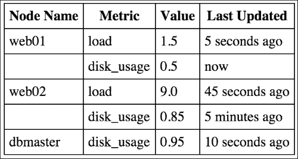
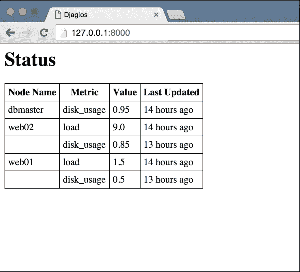
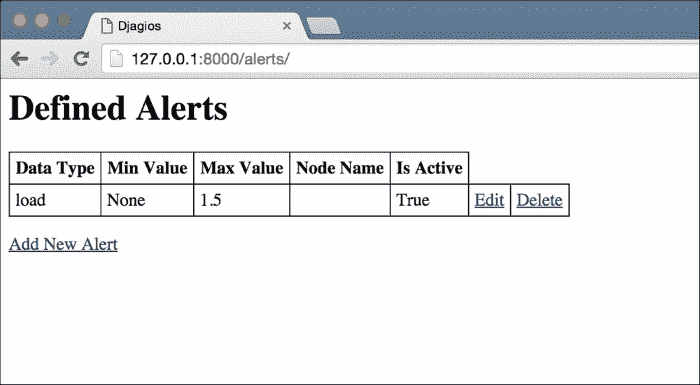
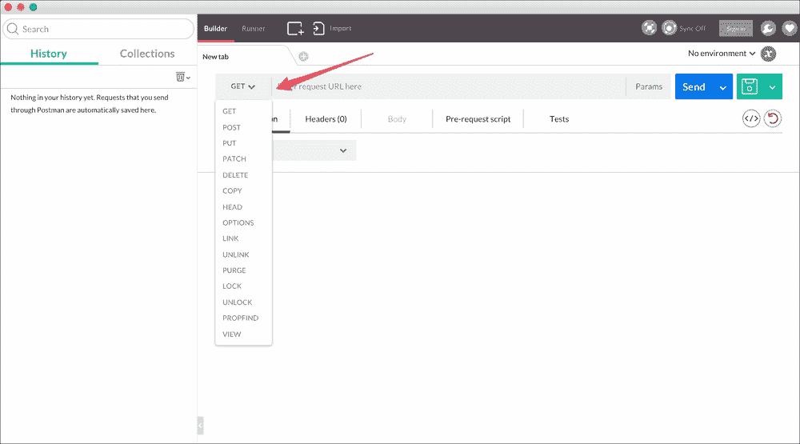
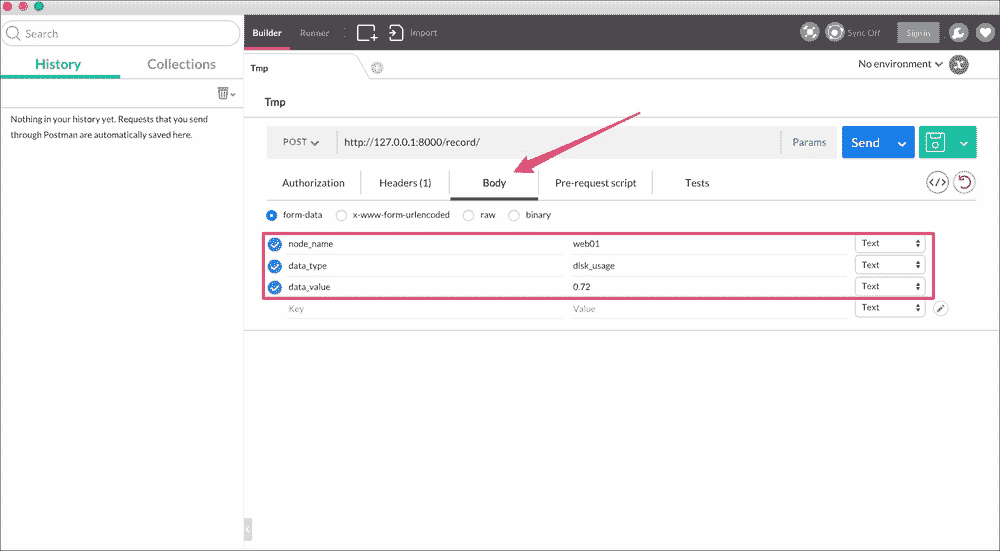
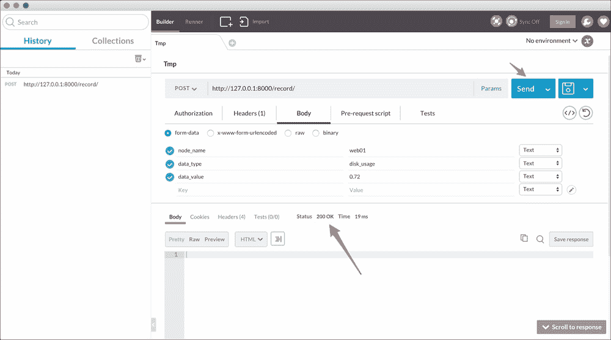

# 三、Djagios——Django 的 Nagios 克隆

在本章中，我们将创建一个类似于**Nagios**的服务器状态监控解决方案。如果您从未听说过 Nagios，这是可以理解的，因为它不是 web 开发人员之间日常对话中提到的东西。简而言之，Nagios 可以在一个屏幕上告诉您服务器的状态（可能有数千个）。您可以根据条件配置警报，例如，如果某个关键服务器变得无响应，这样您就可以在用户开始注意到任何服务降级之前发现问题。Nagios 是一款令人惊叹的软件，全世界数百万个组织都在使用它。

本章中我们的目标是创建类似的内容，尽管非常简单。我们的 Nagios 克隆，创造性地命名为**Djagios，**将允许用户从服务器设置简单统计数据的监控。我们将允许对以下各项进行监控：

*   系统负载
*   磁盘使用

我们还将开发一个网页，其中这些数据将显示在一个很好的表格格式的用户。用户还将看到其服务器运行情况的概述，以及这些系统上是否有任何警报处于活动状态。

以下是我们将在本章中介绍的一些内容：

*   什么是 Django 管理命令以及如何创建自定义命令
*   使用 Django shell 快速测试小块代码
*   Django 模型字段的复杂验证
*   内置通用视图的使用稍微复杂一些
*   创建 API 端点以接受来自外部源的数据
*   使用简单的共享密钥保护这些 API 端点
*   使用简单工具测试 API 端点

# 代码包

本章的代码包有一个基本的 Django 应用程序设置，已经配置了 SQLite 数据库。但是，代码包中没有太多代码，因为本章不需要用户帐户或任何其他预先存在的设置。您可以解压缩代码包，创建新的虚拟环境，激活它，并从代码文件夹中运行以下命令以启动并运行：

```py
> pip install django
> python manage.py migrate

```

# 要求

在开始编写代码之前，让我们先谈谈我们想要从最终产品中得到什么。如前所述，我们希望创建一个服务器监控解决方案。它到底能做什么？我们如何实现所需的功能？

由于我们对 Djagios 的灵感来自 Nagios，让我们看看 Nagios 是如何工作的。虽然 Nagios 是一个庞大的应用程序，其编程复杂程度可以理解，但它最终还是一个客户机-服务器应用程序。服务器只是另一台计算机，包含 Nagios 安装。客户机是您想要监视的系统，它运行小型插件脚本来收集数据并将数据推送到服务器。服务器获取这些数据点，并根据其配置方式在需要时发出警报。它还存储这些数据点，并可以以简单的表格布局显示这些数据点，为您提供基础设施中所有计算机系统的即时概览。

我们将创造类似的东西。我们的服务器将是一个 Django 应用程序，它将使用 HTTP 端点接受数据点。该应用程序还将包括一个网页，其中所有这些数据点都将显示在它们来自的客户端旁边。我们的客户端将是简单的 shell 脚本，用于将数据上传到我们的服务器。

### 注

在本章的其余部分，我将调用 Django 应用程序、**服务器**以及您要监视的系统、**节点**。这些是在您的编程生涯中遇到的许多其他项目中使用的常用术语，它们在这些其他项目中通常意味着类似的事情。

我们将采取渐进的方法，而不是一次开发所有这些东西。我们将首先创建模型来存储数据点。接下来，与直接创建 HTTP 端点以接受数据点和客户端插件脚本不同，我们将采用一种更简单的方法，并提出一种生成一些伪数据以进行测试的方法。最后，我们将创建网页，向用户显示客户端节点的最新状态和触发的警报。

有了假数据进行测试，我们可以确信我们的状态页面和警报系统工作正常。然后我们可以进入下一步，这将是创建 HTTP 端点，以从客户端和客户端插件脚本收集数据点。

在实际项目中，这种构建软件系统的增量方法通常是完成项目的最佳方式。创建简单的功能并对其进行广泛测试，以确保其正常工作。一旦您确信它们的正确性，添加更多功能并重复测试阶段。这种方式类似于高层建筑的建造方式。如果你确信地基很坚固，你可以一次建一层，而不用担心整个物体会掉到你头上。

# 模型

我们应该为数据点记录哪些信息？我们肯定需要发送数据的节点的名称。我们还需要记录获取数据点的时间，以便我们能够了解节点的最新状态。当然，我们需要知道数据点的类型和值。数据点的类型只是我们正在测量的数量的名称，例如 CPU 使用率、内存使用率、正常运行时间等等。

目前，我认为这些都是我们需要衡量的：

*   节点名
*   日期和时间
*   类型
*   价值

在思考模型中需要哪些领域时，我想到了另一种方法。它涉及到为每个数据点类型使用不同的模型，因此我们可以使用名为`SystemLoad`、`MemoryUsage`、`DiskUsage`、`Uptime`等 Django 模型。然而，当我进一步思考它时，我发现这样做会有很大的限制，因为现在每当我们想要测量新的东西时，我们都需要定义一个新的模型。在我们的模型中将数据点的类型作为另一个字段，在记录新类型的信息方面给了我们很大的灵活性。

正如您稍后将看到的，这两种方法都有利弊。

让我们在项目中启动一个新的 Django 应用程序。在命令行中，键入以下命令，确保虚拟环境已激活，并且您位于项目文件夹中：

```py
> python manage.py startapp data_collector

```

将此新应用添加到`djagios/settings.py`中的`INSTALLED_APPS`列表中，然后将我们的数据点模型添加到`data_collector/models.py`：

```py
class DataPoint(models.Model):
    node_name = models.CharField(max_length=250)
    datetime = models.DateTimeField(auto_now_add=True)

    data_type = models.CharField(max_length=100)
    data_value = models.FloatField()
```

保存文件，然后运行迁移将其添加到我们的数据库：

```py
> python manage.py makemigrations data_collector
> python manage.py migrate

```

虽然模型非常简单，但有一件事你应该注意。为了简单起见，我决定只存储数值；因此，`data_value`字段为`FloatField`类型。如果这是一个真实的项目，那么您将有一组需求，这些需求将决定您是否可以做出相同的妥协。您可能还需要记录文本值，例如，您可能正在运行的某些服务的状态。对于 Djagios，我们可以只使用数值，因为我们想要测量的所有统计数据都只是数字。

# 伪数据生成

在进入下一步，即创建状态页面之前，我们应该想出一种方法来生成一些虚假数据。这将有助于我们创建状态页面并调试过程中遇到的任何问题。如果没有任何数据，我们可能会花时间创建完美的状态页面，但在以后添加数据时，我们会发现它的某些方面（如设计或数据布局方案）无法工作。

## Django 管理命令

Django 有一个非常有用的特性，称为管理命令。它允许我们创建 Python 脚本，可以与我们编写的其他 Django 应用程序代码交互，包括我们的模型。

我们不能只编写一个简单的 Python 脚本来导入我们的模型，原因是 Django 和所有 web 框架一样，有很多依赖项，需要复杂的设置来确保在使用其功能之前，每件事情都已正确配置。例如，访问数据库取决于 Django 是否知道设置文件在哪里，因为它包含数据库的配置。如果不知道如何读取数据库，就无法查询模型。

让我们做一个小测试。确保您的虚拟环境已激活，并且您位于项目目录中。接下来，通过键入以下命令启动 Python shell：

```py
> python

```

这将启动一个新的 Python 交互式 shell，您可以在其中键入 Python 语句并立即执行它们。您将知道您在 Python shell 中，因为提示将更改为`>>>`。现在，让我们尝试在这个 shell 中导入我们的`DataPoint`模型：

```py
>>> from data_collector.models import DataPoint

```

按*回车*，您可能会对打印的巨大错误消息感到惊讶。别担心，你不需要全部阅读。最重要的部分是最后一行。它将与此类似（尽管不同的 Django 版本之间可能会略有不同）：

```py
django.core.exceptions.ImproperlyConfigured: Requested setting DEFAULT_INDEX_TABLESPACE, but settings are not configured. You must either define the environment variable DJANGO_SETTINGS_MODULE or call settings.configure() before accessing settings.
```

它看起来很吓人，但让我们来看看它的部分。冒号`:`前面的第一部分是异常名称。在这里，Django 提出了`ImproperlyConfigured`异常。然后有一句话告诉您，请求了一些设置，但尚未配置设置。最后一句话是关于如何解决这个问题的有用信息。

虽然您可以执行错误消息中列出的步骤并让脚本在 Django 之外运行，但使用管理命令几乎总是最好的选择。使用管理命令，您不需要手动设置 Django。在脚本运行之前，它会自动为您完成，您无需担心设置环境变量，如`DJANGO_SETTINGS_MODULE`或调用`settings.configure()`。

要创建新的管理命令，我们首先必须创建两个新的 Python 模块来保存命令脚本。在项目根目录的命令行中键入以下内容：

```py
> mkdir -p data_collector/management/commands
> touch data_collector/management/__init__.py
> touch data_collector/management/commands/__init__.py

```

这些命令的作用是在`data_collector`模块文件夹下创建一个名为`management`的模块，然后在`management`模块中创建另一个名为`commands`的模块。我们首先为模块创建文件夹，然后创建空的`__init__.py`文件，以便 Python 将这些文件夹识别为模块。

接下来，让我们尝试创建一个简单的管理命令，它只打印出数据库中迄今为止的数据点列表。创建一个新的`data_collector/management/commands/sample_data.py`文件，并为其提供以下内容：

```py
from django.core.management import BaseCommand

from data_collector.models import DataPoint

class Command(BaseCommand):
    def handle(self, *args, **options):
        print('All data points:')
        print(DataPoint.objects.all())
```

保存此文件并返回命令提示符。然后运行以下命令：

```py
> python manage.py sample_data

```

您应该看到以下输出：

```py
All data points:
[]
```

就这样。这就是创建 Django 管理命令的全部内容。如您所见，我们能够在命令行上运行的脚本中使用`DataPoint`模型上的方法，而不是作为 HTTP 响应视图的一部分运行。关于Django 管理命令，需要注意以下几点：

*   您的命令与包含该命令的文件名同名。
*   为了成为有效的管理命令，源文件应该始终定义一个`Command`类，它将是`BaseCommand`的基类。
*   Django 将调用`Command`类的`handle`方法。此方法是希望从脚本中提供的任何功能的起点。

接下来，当我们修改`sample_data.py`命令以实际添加样本数据时，我们将查看`*args`和`**options`参数。如果您想了解有关 Django管理命令的更多信息，请参阅[中的文档 https://docs.djangoproject.com/en/stable/howto/custom-management-commands/](https://docs.djangoproject.com/en/stable/howto/custom-management-commands/) 。

让我们修改命令类以添加假数据。以下是修改后的`Command`类代码：

```py
class Command(BaseCommand):
    def add_arguments(self, parser):
        parser.add_argument('node_name', type=str)
        parser.add_argument('data_type', type=str)
        parser.add_argument('data_value', type=float)

    def handle(self, *args, **options):
        node_name = options['node_name']
        data_type = options['data_type']
        data_value = options['data_value']

        new_data_point = DataPoint(node_name=node_name, data_type=data_type, data_value=data_value)
        new_data_point.save()

        print('All data points:')
        print(DataPoint.objects.all())
```

这里有一些新事物。我们先来看看`add_arguments` 方法。大多数管理命令都需要参数来执行有用的操作。当我们向数据库添加示例数据时，我们的命令将需要添加值。这些参数在命令行上以参数的形式提供给命令。如果您在使用命令行方面没有太多经验，那么参数就是您在命令名之后键入的所有内容。例如，让我们来看看在项目中用来创建新的 Django 应用程序的命令：

```py
> python manage.py startapp APP_NAME

```

在这里，我们使用`startapp`Django 管理命令，这是一个内置命令，应用程序名称是应用程序的参数。

我们希望自定义命令接受三个参数：节点名称、数据类型和数据点的值。在`add_arguments`方法中，我们告诉 Django 需要并解析此命令的三个参数。

`handle`方法的`options`参数是一个字典，它保存用户定义并传递给命令的所有参数。在`handle`方法中，我们只需将每个选项的值分配给一个变量。如果用户在调用命令时遗漏或添加了额外的参数，Django 将打印一条错误消息，并通知他们所需的参数是什么。例如，如果我现在在没有任何参数的情况下调用命令，会发生以下情况：

```py
> python manage.py sample_data
usage: manage.py sample_data [-h] [--version] [-v {0,1,2,3}]
                             [--settings SETTINGS] [--pythonpath PYTHONPATH]
                             [--traceback] [--no-color]
                             node_name data_type data_value
manage.py sample_data: error: the following arguments are required: node_name, data_type, data_value
```

如果用户忘记了如何使用管理命令，这是有用的信息。

既然变量中有了参数值，我们就创建一个新的数据点并保存它。最后，我们打印出数据库中的所有数据点。现在让我们试着运行命令，看看得到了什么输出：

```py
> python manage.py sample_data web01 load 5
All data points:
[<DataPoint: DataPoint object>]
```

虽然命令成功创建了一个新的数据点，但输出并没有太大帮助。我们不知道这个数据点包含什么信息。让我们来解决这个问题。

## 更好的模型表示

每当 Django 打印出一个模型实例时，它首先尝试查看是否有为模型类定义的`__str__` 方法。如果它找到这个方法，它将使用它的输出；否则，它会退回到只打印类名的默认实现，正如我们在这里看到的那样。为了使 Django 打印出数据点模型更有用的表示形式，请将此`__str__`方法添加到`DataPoint`模型类中：

```py
def __str__(self):
    return 'DataPoint for {}. {} = {}'.format(self.node_name, self.data_type, self.data_value)
```

现在让我们再次运行`sample_data`命令，看看它的输出是如何变化的：

```py
> python manage.py sample_data web01 load 1.0
All data points:
[<DataPoint: DataPoint for web01\. load = 5.0>, <DataPoint: DataPoint for web01\. load = 1.0]
```

那更好。现在我们看到，我们添加的数据点已正确保存到数据库中。继续创建更多的数据点。使用任意多个不同的节点名称，但尽量将数据类型限制为**加载**或**磁盘使用**中的一种，因为我们稍后将创建特定于这些数据类型的代码。以下是我添加到数据库中供参考的示例数据：

<colgroup><col style="text-align: left"> <col style="text-align: left"> <col style="text-align: left"></colgroup> 
| 

节点名

 | 

数据类型

 | 

数据值

 |
| --- | --- | --- |
| `web01` | `load` | `5.0` |
| `web01` | `load` | `1.0` |
| `web01` | `load` | `1.5` |
| `web01` | `disk_usage` | `0.5` |
| `web02` | `load` | `7.0` |
| `web02` | `load` | `9.0` |
| `web02` | `disk_usage` | `0.85` |
| `dbmaster` | `disk_usage` | `0.8` |
| `dbmaster` | `disk_usage` | `0.95` |

现在我们有了一种添加示例数据的方法，并向数据库中添加了一些示例数据，让我们创建一个状态页面，向用户显示所有这些数据。

# 状态页

我们的状态页面需要在一个视图中向用户显示其完整基础设施的状态。要做到这一点，一张桌子就像是一个合适的设计组件。由于对用户来说最重要的信息将是其服务器的最新状态，我们的状态页面将只需要显示每个节点的一个表行，并且只列出数据库中该节点的每个不同数据类型的最新值。

对于我添加到数据库中的示例数据，理想情况下，我们希望状态页面上有一个类似于此的表：



如您所见，我们只提及每个节点一次，并对不同的数据类型进行分组，以便有关节点的所有信息都显示在一个位置，而用户不必在表中搜索以找到他们要查找的内容。作为奖励，我们还可以很好地显示上次更新的时间，而不仅仅是显示最新数据点的时间。

如果您认为以这样一种友好和整合的方式显示我们的数据点并不简单，恐怕您是对的。我们可以使用`DataPoint.objects.all()`在一个查询中获得数据库中的所有数据点，然后在 Python 代码中对它们进行分组，但一旦数据库中的数据点数量增加，这将是低效的。对于服务器监控解决方案，拥有数百万个数据点并不少见。我们无法在用户每次想要查看状态页面时获取并分组所有百万个数据点。这将使加载页面的速度慢得令人无法忍受。

幸运的是，SQL（用于从数据库查询数据的语言）为我们提供了一些非常强大的结构，我们可以使用这些结构来获取所需的信息，而不必遍历数据点表中的所有数据行。让我们想想我们需要什么。

首先，我们想知道数据库中不同的节点名称。对于每个节点名称，我们还需要知道其可用的数据类型。在我们的示例中，**web01**和**web02**都有**加载**和**磁盘使用**数据类型可用，**dbmaster**节点只有**磁盘使用**数据类型（或度量）的数据。对于这种情况，SQL 语言为我们提供了一个`DISTINCT`查询子句。向查询中添加`DISTINCT`将指示数据库仅返回唯一的行。也就是说，所有重复的行只返回一次。这样，我们就可以获得数据库中所有不同节点和数据类型的列表，而无需查看每个记录。

我们需要进行一些实验，以找出如何将 SQL 查询转换为可用于 Django ORM 的内容。我们可以编写视图代码，然后不断修改，以找到获取所需数据的正确方法，但这非常麻烦。相反，Django 为我们提供了一个非常方便的 shell 来进行这类实验。

如果您还记得，在本章的开头，我向您展示了为什么不能启动 Python shell 并导入模型。Django 抱怨在使用之前没有正确设置。相反，Django 有自己的方式来启动 Python shell，在开始使用 shell 之前，确保满足设置 Django 的所有依赖项。要启动此 shell，请键入以下命令：

```py
> python manage.py shell

```

与前面一样，这将把您放在一个 Python shell 中，您可以通过更改的提示来判断它。现在，让我们尝试导入我们的`DataPoint`模型：

```py
>>> from data_collector.models import DataPoint

```

这次你不应该有任何错误。现在键入以下内容：

```py
>>
> DataPoint.objects.all()
[<DataPoint: DataPoint for web01\. load = 5.0>, <DataPoint: DataPoint for web01\. load = 1.0>, <DataPoint: DataPoint for web01\. load = 1.5>, <DataPoint: DataPoint for web02\. load = 7.0>, <DataPoint: DataPoint for web02\. load = 9.0>, <DataPoint: DataPoint for dbmaster. disk_usage = 0.8>, <DataPoint: DataPoint for dbmaster. disk_usage = 0.95>, <DataPoint: DataPoint for web01\. disk_usage = 0.5>, <DataPoint: DataPoint for web02\. disk_usage = 0.85>]

```

正如您可以看到的，您可以查询模型并立即查看查询的输出。Django shell 是 Django 中最有用的组件之一，在视图中编写最终代码之前，您经常会发现自己在 shell 中进行实验，以找出正确的方法来执行某些操作。

那么，回到我们从数据库中获取不同节点名称和数据类型的问题。如果您在 Django文档中搜索**不同的**关键字，您应该在结果中看到此链接：

[https://docs.djangoproject.com/en/stable/ref/models/querysets/#distinct](https://docs.djangoproject.com/en/stable/ref/models/querysets/#distinct) 。

如果您阅读了文档中的内容，您应该明白这正是我们使用`DISTINCT`条款所需要的。但是我们如何使用它呢？让我们在 shell 中尝试一下：

```py
>>> DataPoint.objects.all().distinct()
[<DataPoint: DataPoint for web01\. load = 5.0>, <DataPoint: DataPoint for web01\. load = 1.0>, <DataPoint: DataPoint for web01\. load = 1.5>, <DataPoint: DataPoint for web02\. load = 7.0>, <DataPoint: DataPoint for web02\. load = 9.0>, <DataPoint: DataPoint for dbmaster. disk_usage = 0.8>, <DataPoint: DataPoint for dbmaster. disk_usage = 0.95>, <DataPoint: DataPoint for web01\. disk_usage = 0.5>, <DataPoint: DataPoint for web02\. disk_usage = 0.85>]

```

隐马尔可夫模型？这没有改变任何事情。为什么不呢？让我们想想这里发生了什么。我们要求 Django 查询数据库中的所有数据点，然后针对每个重复数据只返回一行。如果您熟悉 SQL，distinct 子句通过比较所选数据行中的每个字段来工作。但是，由于默认情况下 Django 在查询模型时选择数据库表中的所有行，因此 SQL 查询看到的数据还包括主键，根据定义，主键对于每一行都是唯一的。这就是为什么我们可以看到所有数据，即使我们使用了 distinct 子句。

为了使用 distinct 子句，我们需要限制请求数据库返回给我们的数据中的字段。对于我们的特定用例，我们只需要知道节点名和数据类型的唯一对。Django ORM 提供了另一种方法`values`，我们可以使用它来限制 Django 选择的字段。让我们先在不使用 distinct 子句的情况下尝试一下，看看它返回了什么数据：

```py
>>> DataPoint.objects.all().values('node_name', 'data_type')
[{'data_type': u'load', 'node_name': u'web01'}, {'data_type': u'load', 'node_name': u'web01'}, {'data_type': u'load', 'node_name': u'web01'}, {'data_type': u'load', 'node_name': u'web02'}, {'data_type': u'load', 'node_name': u'web02'}, {'data_type': u'disk_usage', 'node_name': u'dbmaster'}, {'data_type': u'disk_usage', 'node_name': u'dbmaster'}, {'data_type': u'disk_usage', 'node_name': u'web01'}, {'data_type': u'disk_usage', 'node_name': u'web02'}]

```

这似乎起到了作用。现在，我们的数据只包括我们希望对其运行独特查询的两个字段。让我们也添加 distinct 子句，看看我们得到了什么：

```py
>>> DataPoint.objects.all().values('node_name', 'data_type').distinct()
[{'data_type': u'load', 'node_name': u'web01'}, {'data_type': u'load', 'node_name': u'web02'}, {'data_type': u'disk_usage', 'node_name': u'dbmaster'}, {'data_type': u'disk_usage', 'node_name': u'web01'}, {'data_type': u'disk_usage', 'node_name': u'web02'}]

```

瞧！这似乎成功了。现在，我们的 Django ORM 查询只返回唯一的节点名和数据类型对，这正是我们所需要的。

需要注意的一点是，在我们将`values`方法添加到 ORM 查询之后，返回的数据不再是我们的`DataPoint`模型类。相反，我们要求的是只包含字段值的字典。因此，您在模型上定义的任何函数都无法在这些字典中访问。仔细想想，这是显而易见的，因为没有完整的字段，Django 无法填充模型对象。如果您在`values`方法参数中列出了所有模型字段，这也无关紧要。它仍然只返回字典，而不返回模型对象。

现在我们已经知道了如何以我们想要的格式获取数据，而不必在数据库中的每一行数据上循环，让我们为状态页面创建模板、视图和 URL 配置。从视图代码开始，将`data_collector/views.py`更改为包含以下内容：

```py
from django.views.generic import TemplateView

from data_collector.models import DataPoint

class StatusView(TemplateView):
    template_name = 'status.html'

    def get_context_data(self, **kwargs):
        ctx = super(StatusView, self).get_context_data(**kwargs)

        nodes_and_data_types = DataPoint.objects.all().values('node_name', 'data_type').distinct()

        status_data_dict = dict()
        for node_and_data_type_pair in nodes_and_data_types:
            node_name = node_and_data_type_pair['node_name']
            data_type = node_and_data_type_pair['data_type']

            data_point_map = status_data_dict.setdefault(node_name, dict())
            data_point_map[data_type] = DataPoint.objects.filter(
                node_name=node_name, data_type=data_type
            ).latest('datetime')

        ctx['status_data_dict'] = status_data_dict

        return ctx
```

它有点复杂，所以让我们把它分成几个部分。首先，我们使用之前提出的查询获取节点名和数据类型对的列表。我们存储在`nodes_and_data_types`中的查询结果如下：

```py
[{'data_type': u'load', 'node_name': u'web01'}, {'data_type': u'load', 'node_name': u'web02'}, {'data_type': u'disk_usage', 'node_name': u'dbmaster'}, {
'data_type': u'disk_usage', 'node_name': u'web01'}, {'data_type': u'disk_usage', 'node_name': u'web02'}]
```

如前所述，这是数据库中所有唯一节点名和数据类型对的列表。因此，由于我们的**dbmaster**节点没有**load**数据类型的任何数据，因此在该列表中找不到该对。稍后，我将解释为什么运行 distinct 查询可以帮助我们减少数据库的负载量。

接下来，我们在每一对上循环；这就是您可以在代码中看到的 for 循环。对于每个节点名称和数据类型对，我们运行一个查询以获取最新的数据点。首先，我们只筛选与指定的节点名和数据类型匹配的数据点。然后，我们调用`latest`方法，获取最近更新的数据点。

`latest`方法获取一个字段的名称，使用该字段对查询进行排序，然后根据排序返回最后一行数据。需要注意的是，`latest`可以处理任何可以排序的字段类型，包括数字，而不仅仅是日期时间字段。

我想在这里指出`setdefault`的用法。在字典上调用`setdefault`可确保如果提供的键在字典中不存在，则为该键设置作为第二个参数传递的值。这是一个非常有用的模式，我和许多 Python 程序员在创建字典时都会使用这个模式，其中所有键都需要具有相同类型的值—在本例中为 a 字典。

这允许我们忽略字典中以前不存在密钥的场景。如果不使用`setdefault`，我们首先必须检查密钥是否存在。如果有，我们会修改它。如果没有，我们将创建一个新字典，修改它，然后将其分配给`status_data_dict`。

`setdefault`方法也返回给定键的值，无论是否必须将其设置为默认值。我们将其保存在代码的`data_point_map`变量中。

最后，我们将`status_data_dict`字典添加到上下文中并返回它。我们将在模板中看到如何浏览这些数据并将其显示给用户。我之前说过，我将解释 distinct 查询如何帮助我们减少数据库的负载。让我们看一个示例场景。假设我们的基础架构中有三个与我们在示例数据中看到的相同的节点：**web01**、**web02**和**dbmaster**。假设监视运行了一整天，每分钟收集所有三个节点上的负载和磁盘使用情况的统计数据。做数学题时，我们应该具备以下几点：

节点数 x 数据类型数 x 小时数 x 60：

```py
3 x 2 x 24 x 60 = 8640

```

因此，我们的数据库有 8640 个数据点对象。现在，使用我们视图中的代码，我们只需要从数据库中检索六个数据点对象，就可以向用户显示一个更新的状态页面和一个不同的查询。如果我们必须获得所有的数据点，我们必须从数据库中传输所有 8640 个数据点的数据，然后只使用其中的六个。

对于模板，在`data_collector`目录中创建一个名为`templates`的文件夹。然后，在模板文件夹中创建一个`status.html`文件，并为其提供以下内容：

```py





<h1>Status</h1>

<table>
    <tbody>
        <tr>
            <th>Node Name</th>
            <th>Metric</th>
            <th>Value</th>
            <th>Last Updated</th>
        </tr>

        
            
            <tr>
                <td>{{ node_name }}</td>
                <td>{{ data_type }}</td>
                <td>{{ data_point.data_value }}</td>
                <td>{{ data_point.datetime|naturaltime }}</td>
            </tr>
            
        
    </tbody>
</table>

```

这里不应该有太多惊喜。忽略`load humanize`行，我们的模板只是使用我们之前在视图中生成的数据字典创建一个表。这两个嵌套的`for`循环看起来可能有点复杂，但看看我们正在循环的数据应该可以清楚地看到：

```py
{u'dbmaster': {u'disk_usage': <DataPoint: DataPoint for dbmaster. disk_usage = 0.95>},
 u'web01': {u'disk_usage': <DataPoint: DataPoint for web01\. disk_usage = 0.5>,
            u'load': <DataPoint: DataPoint for web01\. load = 1.5>},
 u'web02': {u'disk_usage': <DataPoint: DataPoint for web02\. disk_usage = 0.85>,
            u'load': <DataPoint: DataPoint for web02\. load = 9.0>}}
```

第一个 for 循环获取将数据类型映射到最新数据点的节点名和字典。然后，内部 for 循环迭代该数据类型和该类型的最新数据点，并生成表行。仅当内部循环第一次运行时，我们才使用`forloop.first`标志打印节点名称。Django 还提供了一些与模板中 for 循环相关的其他有用标志。请参阅[中的文档 https://docs.djangoproject.com/en/stable/ref/templates/builtins/#for](https://docs.djangoproject.com/en/stable/ref/templates/builtins/#for) 。

当我们打印数据点的`datetime`字段时，我们使用`naturaltime`过滤器。这个过滤器是作为 Django 的一部分提供的人性化模板标签的一部分，这就是为什么我们需要在模板的开头使用`load humanize`行。`naturaltime`模板过滤器以人类易于理解的格式输出日期时间值，例如，两秒前、一小时前、20 分钟前等。您需要在`djagios/settings.py`中的`INSTALLED_APPS`列表中添加`django.contrib.humanize`，才能加载`humanize`模板标签。

完成状态页面的最后一步是将其添加到 URL 配置中。由于状态页面是用户最希望从监控系统中看到的，所以让我们将其设置为主页。使`djagios/urls.py`的 URL 配置文件包含以下内容：

```py
from django.conf.urls import url

from data_collector.views import StatusView

urlpatterns = [
    url(r'^$', StatusView.as_view(), name='status'),
]
```

就这样。运行开发服务器：

```py
> python manage.py runserver

```

进入`http://127.0.0.1:8000`的状态页面。如果到目前为止您已经遵循了这些步骤，那么您应该会看到一个类似于下面的状态页面。当然，您的页面将显示数据库中的数据：



# 警报

现在我们已经有了一个基本状态页面并正在运行，让我们来谈谈允许用户配置一些警报条件。现在，我们将通过在状态页面上以红色显示节点的信息来通知用户任何警报条件。

首先，我们需要弄清楚我们希望用户设置何种警报。从那里，我们可以了解技术细节。那么，让我们考虑一下。考虑到我们记录的数据类型都有数值，用户应该能够设置阈值是有意义的。例如，如果任何节点的系统负载超过 1.0 或某个节点的磁盘使用率超过 80%，它们可以设置警报。

此外，我们的用户可能不希望每个节点具有相同的警报条件。数据库节点需要处理大量的系统负载，因此我们的用户可能希望为数据库节点设置单独的警报条件。最后，如果他们在某些节点上进行维护，他们可能希望停止触发某些警报。

综上所述，我们的警报似乎需要包含以下字段：

*   要触发的数据类型
*   要触发的最大值
*   要触发的最小值
*   要触发的节点名称
*   如果警报当前处于活动状态

其中，数据类型和活动状态是必填字段，不应为空。节点名称可以是空字符串，其中将检查每个节点的警报条件。如果节点名称不是空字符串，则将检查其名称与提供的字符串完全匹配的节点。

至于最大值和最小值，则需要其中一个。这样，用户可以仅为最大值设置警报，而不必关心数据点的最小值。这需要在模型中进行手动验证。

## 模型

让我们看看模型。为了简单起见，我们将使用`data_collector`应用程序，而不是为警报创建一个新的应用程序。这是我们`Alert`型号的代码。在`DataPoint`型号代码后放入`data_collector/models.py`：

```py
class Alert(models.Model):
    data_type = models.CharField(max_length=100)
    min_value = models.FloatField(null=True, blank=True)
    max_value = models.FloatField(null=True, blank=True)
    node_name = models.CharField(max_length=250, blank=True)

    is_active = models.BooleanField(default=True)

    def save(self, *args, **kwargs):
        if self.min_value is None and self.max_value is None:
            raise models.exceptions.ValidationError('Both min and max value can not be empty for an alert')

        super(Alert, self).save(*args, **kwargs)
```

由于我们对 min 和 max 字段的特殊要求，我们不得不重写`save`方法。正如您可能知道的，如果未设置最小值和最大值，我们的自定义`save`方法将引发错误。由于无法用正常的 Django 字段配置来表示这种情况，我们必须重写`save`方法并在此处添加自定义逻辑。如果您有一些依赖于多个字段的自定义验证需求，那么这在 Django 中是非常常见的。

还有一点需要注意的是，将`blank=True`参数设置为最小值和最大值`FloatField`。这是必需的，因此根据此模型构造的任何模型表单（稍后我们将用于`create`和`update`视图）都允许这些字段为空值。

进行并运行迁移以将其添加到数据库中。

```py
> python manage.py makemigrations data_collector
> python manage.py migrate data_collector

```

## 管理意见

用户需要一些视图来管理警报。他们需要查看系统中定义的所有警报的页面，创建新警报和编辑现有警报的页面，以及删除不再需要的警报的某种方式。所有这些都可以使用 Django 提供的通用视图和一些模板来实现。让我们开始吧！

首先，让我们先看看列表视图。将此添加到`data_collector/views.py`：

```py
class AlertListView(ListView):
    template_name = 'alerts_list.html'
    model = Alert
```

记住从`django.views.generic` 导入`ListView`和从`data_collector.models`导入`Alert`。接下来，在`data_collector/templates`中创建`alerts_list.html`模板文件，并给出以下内容：

```py



<h1>Defined Alerts</h1>


<table>
    <tr>
        <th>Data Type</th>
        <th>Min Value</th>
        <th>Max Value</th>
        <th>Node Name</th>
        <th>Is Active</th>
    </tr>

    
    <tr>
        <td>{{ alert.data_type }}</td>
        <td>{{ alert.min_value }}</td>
        <td>{{ alert.max_value }}</td>
        <td>{{ alert.node_name }}</td>
        <td>{{ alert.is_active }}</td>
    </tr>
    
</table>

<i>No alerts defined</i>


```

最后，编辑`djagios/urls.py`。导入新视图，然后将其添加到 URL 模式：

```py
url(r'^alerts/$', AlertListView.as_view(), name='alerts-list'),
```

要测试它，请打开`http://127.0.0.1:8000/alerts/`。您应该会看到**未定义警报**消息。列表视图非常基本。`ListVew`通用视图呈现具有指定模型的所有对象的模板，提供`object_list`模板上下文变量中的对象列表。接下来，让我们看看创建新警报的视图。

在`data_collector/view.py`文件中，首先导入以下内容：

```py
from django.core.urlresolvers import reverse
from django.views.generic import CreateView
```

然后添加此视图类：

```py
class NewAlertView(CreateView):
    template_name = 'create_or_update_alert.html'
    model = Alert
    fields = [
        'data_type', 'min_value', 'max_value', 'node_name', 'is_active'
    ]

    def get_success_url(self):
        return reverse('alerts-list')
```

视图代码中没有新内容。模板代码也很简单。将此代码放入`data_collector/templates/create_or_update_alert.html`：

```py




<h1>Update Alert</h1>

<h1>New Alert</h1>


<form action="" method="post">
    {{ form.as_p }}
    <input type="submit" value="UpdateCreate" />
    <a href="">Cancel</a>
</form>

```

与前面的章节一样，我们使用`object`上下文变量来确定此模板是从`CreateView`还是`UpdateView`使用的，并在此基础上更改一些元素。否则，这就相当简单了。我们也来看看`UpdateView`的代码：

```py
class EditAlertView(UpdateView):
    template_name = 'create_or_update_alert.html'
    model = Alert
    fields = [
        'data_type', 'min_value', 'max_value', 'node_name', 'is_active'
    ]

    def get_success_url(self):
        return reverse('alerts-list')
```

它是上一个创建视图的几乎相同的副本。确保已导入`UpdateView`通用视图。我们仍然需要将这两个视图添加到 URL 配置中。在`djagios/urls.py`文件中，导入`NewAlertView`和`EditAlertView`并添加以下模式：

```py
url(r'^alerts/new/$', NewAlertView.as_view(), name='alerts-new'),
url(r'^alerts/(?P<pk>\d+)/edit/$', EditAlertView.as_view(), name='alerts-edit'),
```

在测试这些视图之前，我们应该添加链接以允许用户访问这些视图。修改模板以匹配此代码：

```py



<h1>Defined Alerts</h1>


<table>
    <tr>
        <th>Data Type</th>
        <th>Min Value</th>
        <th>Max Value</th>
        <th>Node Name</th>
        <th>Is Active</th>
    </tr>

    
    <tr>
        <td>{{ alert.data_type }}</td>
        <td>{{ alert.min_value }}</td>
        <td>{{ alert.max_value }}</td>
        <td>{{ alert.node_name }}</td>
        <td>{{ alert.is_active }}</td>
        <td><a href="">Edit</a></td>
    </tr>
    
</table>

<i>No alerts defined</i>

<p><a href="">Add New Alert</a></p>

```

添加了两条高亮显示的新行。现在，让我们看看警报列表页面是什么样子。如前所述，在浏览器中打开`http://127.0.0.1:8000/alerts/`。您应该看到如下页面：


单击**添加新警报**链接，您将看到创建警报的表单。填写一些样本数据，点击**创建**按钮。如果您的表单没有任何错误，您应该返回警报列表视图，您的屏幕现在应该列出新警报，如以下屏幕截图所示：


现在剩下的就是允许用户选择删除警报。为此，创建一个从泛型`DeleteView`中创建子类的视图，记住首先从`django.views.generic`导入`DeleteView`。以下是您应该在`data_collector/view.py`中输入的代码：

```py
class DeleteAlertView(DeleteView):
    template_name = 'delete_alert.html'
    model = Alert

    def get_success_url(self):
        return reverse('alerts-list')
```

创建新的`data_collector/templates/delete_alert.html`模板：

```py



<h1>Delete alert?</h1>
<p>Are you sure you want to delete this alert?</p>
<form action="" method="post">
    {{ form.as_p }}
    <input type="submit" value="Delete" />
    <a href="">Cancel</a>
</form>

```

接下来，在`djagios/urls.py`中导入`DeleteAlertView`并添加此新模式：

```py
url(r'^alerts/(?P<pk>\d+)/delete/$', DeleteAlertView.as_view(), name='alerts-delete'),
```

最后，让我们从警报列表页面添加一个指向删除视图的链接。编辑`alerts_list.html`模板，并在**编辑**链接后添加此行：

```py
<td><a href="">Delete</a></td>
```

现在，当您打开警报列表视图时，您应该会看到一个**删除**链接。您的屏幕应类似于以下屏幕截图：



如果你点击**删除**链接，你会看到一个确认页面。如果确认删除，您将看到您的警报将从列表页面消失。这些是我们需要管理警报的所有视图。让我们继续检测警报条件并在状态页面中显示它们。

# 在状态页面上显示触发的警报

正如我之前所说的，我们希望我们的用户能够看到在状态页面上突出显示警报的任何节点。假设他们定义了一个警报，当任何节点上的磁盘使用量超过`0.85`时，我们为**dbmaster**磁盘使用量提供的最新数据点的值为`0.9`。当用户访问状态页面时，我们希望显示**dbmaster**节点磁盘使用情况的行以红色突出显示，以便用户立即意识到该警报，并能够采取措施纠正该警报。

更改`data_collector/view.py`中的`StatusView`以匹配以下代码。已更改的位将突出显示：

```py
class StatusView(TemplateView):
    template_name = 'status.html'

    def get_context_data(self, **kwargs):
        ctx = super(StatusView, self).get_context_data(**kwargs)

        alerts = Alert.objects.filter(is_active=True)

        nodes_and_data_types = DataPoint.objects.all().values('node_name', 'data_type').distinct()

        status_data_dict = dict()
        for node_and_data_type_pair in nodes_and_data_types:
            node_name = node_and_data_type_pair['node_name']
            data_type = node_and_data_type_pair['data_type']

            latest_data_point = DataPoint.objects.filter(node_name=node_name, data_type=data_type).latest('datetime')
 latest_data_point.has_alert = self.does_have_alert(latest_data_point, alerts)

            data_point_map = status_data_dict.setdefault(node_name, dict())
            data_point_map[data_type] = latest_data_point

        ctx['status_data_dict'] = status_data_dict

        return ctx

    def does_have_alert(self, data_point, alerts):
 for alert in alerts:
 if alert.node_name and data_point.node_name != alert.node_name:
 continue

 if alert.data_type != data_point.data_type:
 continue

 if alert.min_value is not None and data_point.data_value < alert.min_value:
 return True
 if alert.max_value is not None and data_point.data_value > alert.max_value:
 return True

 return False

```

我们在这里所做的是检查，对于我们检索到的每个数据点，它是否触发任何警报。我们通过将每个警报中的最小值和最大值与数据点值进行比较来实现这一点，但前提是数据点数据类型和节点名称与警报中的数据类型和节点名称匹配。如果数据点值超出警报范围，我们将该数据点标记为已触发警报。

这是我在许多项目中经常使用的另一种技术。由于模型只是 Python 对象，您可以动态地向它们附加额外的信息。不需要在`DataPoint`类上定义`has_alert`。只需在需要时将其添加到对象中。不过要小心。这样做不是一个好的编程实践，因为试图理解`DataPoint`类的人不会知道`has_alert`属性事件的存在，除非他们查看 view 类的代码。因为我们只在视图和模板中使用这个属性，所以这对我们来说很好。但是，如果我们传递了`DataPoint`对象，并且更多的代码开始使用这个属性，那么最好在类本身上定义它，这样任何查看类代码的人都会知道它的存在。

我们还需要修改`status.html`模板，以利用我们添加到数据点的`has_alert`属性。将其更改为与以下代码匹配。如前所述，修改部分已突出显示：

```py





<h1>Status</h1>

<table>
    <tbody>
        <tr>
            <th>Node Name</th>
            <th>Metric</th>
            <th>Value</th>
            <th>Last Updated</th>
        </tr>

        
            
            <tr class="has-alert">
                <td>{{ node_name }}</td>
                <td>{{ data_type }}</td>
                <td>{{ data_point.data_value }}</td>
                <td>{{ data_point.datetime|naturaltime }}</td>
            </tr>
            
        
    </tbody>
</table>

<style type="text/css" media="all">
 tr.has-alert td:not(:first-child) {
 color: red;
 }
</style>

```

就这样。为了测试它，您需要在数据库中创建一些由`DataPoints`触发的`Alert`对象。对于我使用的示例数据，我创建了一个`Alert`对象，其数据类型为**disk_usage**，最大值为 0.5。创建警报后，“我的状态”屏幕将突出显示触发警报的节点。您的屏幕将显示类似的内容：


为了测试高亮显示代码是否正常工作，我使用以下命令为**dbmaster**磁盘使用率度量添加了另一个数据点：

```py
> python manage.py sample_data dbmaster disk_usage 0.2

```

刷新状态页面后，**dbmaster**节点的告警条件消失。你应该做一个类似的测试来亲眼看看。

就这样！这是一项艰苦的工作，但我们的监控工具现在开始成形。我们有一个状态页面，显示最新的节点状态，突出显示任何有警报的节点。警报条件解决后，高光将消失。我们也有一个页面来管理我们的警报。总之，我们可以说应用程序面向用户的部分几乎已经完成。一个非常有用的东西是导航栏。在`templates/base.html`中的`body`标记开始后添加：

```py
<ul>
    <li><a href="">Home</a></li>
    <li><a href="">Alerts</a></li>
</ul>
```

刷新状态页面，您将在页面顶部看到一个简单的导航菜单。

# 接受来自远程系统的数据

现在，用户可以查看其基础结构的状态并管理警报，是时候进入下一步了：从真实来源获取数据，而不是使用 Django 管理命令输入样本数据。

为此，我们将创建一个 API**端点**，该端点接受来自远程系统的数据。API 端点只是 Django 视图的一个花哨名称，该视图没有要呈现的模板。来自 API 端点的响应通常只是 200 OK 状态或 JSON 响应。API 端点并不打算由人类用户使用。相反，它们被不同的软件系统用来连接在一起并共享信息。

我们需要创建的 API 端点是一个简单的视图，它接受 POST 请求，并提供创建新的`DataPoint`对象所需的所有信息。为了确保恶意用户不能用随机数据垃圾邮件发送我们的数据库，我们还将向 API 端点添加一个简单的身份验证机制，以便它只接受来自授权来源的数据。

要创建 API 端点，我们将使用`django.view.generic.View`类，只实现 POST 处理程序。为了解析请求数据，我们将动态创建一个模型表单。编辑`data_collector/views.py`并添加以下代码：

```py
from django.forms.models import modelform_factory
from django.http.response import HttpResponse
from django.http.response import HttpResponseBadRequest
from django.http.response import HttpResponseForbidden
from django.views.generic import View

class RecordDataApiView(View):
    def post(self, request, *args, **kwargs):
        # Check if the secret key matches
        if request.META.get('HTTP_AUTH_SECRET') != 'supersecretkey':
            return HttpResponseForbidden('Auth key incorrect')

        form_class = modelform_factory(DataPoint, fields=['node_name', 'data_type', 'data_value'])
        form = form_class(request.POST)
        if form.is_valid():
            form.save()
            return HttpResponse()
        else:
            return HttpResponseBadRequest()
```

这里有两个新事物我们需要研究。首先，我们在请求对象上使用了`META`属性来访问请求。如果您了解 HTTP 协议的工作原理，那么应该熟悉标头。如果不是，可以在[上找到一个很好的解释 https://www.jmarshall.com/easy/http/](https://www.jmarshall.com/easy/http/) 。详细解释标头超出了本书的范围，但简单地说，标头是客户端添加到 HTTP 请求中的额外信息。我们将在下一节测试 API 视图时看到如何添加它们。

Django 自动规范化所有标题名称，并将其添加到`META`字典中。这里，我们使用一个自定义头**Auth Secret**来确保只有拥有我们的密钥的客户端才能使用此视图。

### 注

有关元词典的内容以及如何构建元词典的更多信息，请参见[上的Django 文档 https://docs.djangoproject.com/en/stable/ref/request-response/#django.http.HttpRequest.META](https://docs.djangoproject.com/en/stable/ref/request-response/#django.http.HttpRequest.META) 。

接下来我们需要看的是`modelform_factory` 函数。Django 提供了一个简洁的小函数，它为给定的模型返回一个`ModelForm`子类。可以使用此函数的参数在一定程度上自定义模型表单。在这里，我们限制可以编辑的字段数量。首先为什么要使用模型表单？

我们想要从 API 端点获得的是一种创建新的`DataPoint`模型的方法。模型表单提供了我们所需的功能，并且它们为我们处理数据验证。我们本可以在一个`forms.py`文件中创建一个单独的模型表单类，然后在我们的视图中使用它，就像我们以前所做的那样，但是有两个原因我们没有这样做。

首先，这是我们代码中唯一使用`DataPoint`方法模型表单的地方。如果我们还需要在其他地方使用它，那么在一个地方定义模型表单将是最好的编程实践。然而，正如我们不知道的那样，我们可以在需要的地方动态地定义模型表单。

其次，我们不需要对模型表单类进行任何定制。如果我们想，比如说，像之前一样覆盖`save`方法，我们将被迫定义类而不是使用`modelform_factory`方法。

在获得模型表单类之后，我们像任何模型表单类一样使用它来创建新的数据点或返回一个指示数据验证失败的响应。要通过 URL 使我们的新端点可用，请在`djagios/urls.py`中导入以下内容：

```py
from django.views.decorators.csrf import csrf_exempt
from data_collector.views import RecordDataApiView
```

然后，添加此 URL 模式：

```py
url(r'^record/$', csrf_exempt(RecordDataApiView.as_view()), name='record-data'),
```

之所以使用`csrf_exempt`装饰器，是因为默认情况下，Django 对 POST 请求使用 CSRF 保护。但是，这通常用于 web 表单，而不是 API 端点。所以我们必须禁用它，否则 Django 将不允许我们的 POST 请求成功。现在，让我们看看如何测试我们的新视图。

### 提示

您可以通过[获取更多关于 Django 提供的 CSRF 保护的信息https://docs.djangoproject.com/en/stable/ref/csrf/](https://docs.djangoproject.com/en/stable/ref/csrf/) 。

## 测试 API 端点

您不能在浏览器中简单地测试此 API 端点，因为它是 POST 请求，并且没有可以在浏览器中呈现表单的模板。然而，有很多很好的工具可以用来进行手动 POST 请求。我建议你用的是邮递员。这是一个谷歌 Chrome 应用程序，所以你不需要安装任何依赖项。只要你的机器上安装了谷歌 Chrome，你就可以从[找到邮递员 https://www.getpostman.com/](https://www.getpostman.com/) 。安装好后，启动它，你会看到一个类似于下面的屏幕。如果您的邮递员屏幕不完全相同，请不要担心。可能是您下载的版本较新。邮递员的主要部分应该是相同的。


使用邮递员很简单。我将一步一步地向您介绍整个过程，包括每个步骤的图像，以明确我的意思。在这个过程结束时，我们应该能够使用 API 端点生成新的数据点。

另外，如果您使用的是基于 Linux 或 Unix 的操作系统，如 Ubuntu 或 Mac OS X，并且更习惯于使用命令行，则可以使用`curl`实用程序发出 POST 请求。对于更简单的请求，它通常更快。要使用`curl`发出与我在《邮递员》中演示的相同请求，请在命令提示符下键入：

```py
> c
url http://127.0.0.1:8000/record/ -H 'Auth-Secret: supersecretkey' -d node_name=web01 -d data_type=disk_usage -d data_value=0.2

```

要使用邮递员发出此请求，请执行以下步骤：

1.  Select the request type. We want to make a POST request, so select POST from the drop-down menu:

    

2.  Enter the URL you want to make the request to. In our case, it is `http://127.0.0.1:8000/record/`:

    

3.  Add our custom authentication header. Open up the **Headers** tab and add the **Auth-Secret** header with a value of **supersecretkey**:

    

4.  Finally, add our POST parameters to the **Body** section. The sample data that I used was as follows:
    *   节点名称：`web01`
    *   数据类型：`disk_usage`
    *   数据值：`0.72`

    

就这样。我们的请求现在已设置。点击URL 文本框旁边的**发送**按钮，您应该会在主体参数下方看到一个空响应。要确认请求工作正常，请查看响应的状态代码。应该是**200 OK**：



在`http://127.0.0.1:8000/`和打开我们的应用程序的状态页面，您会看到最新的数据点值显示在那里。就这样，我们完了！

### 注

如本节开头的所述，您还可以使用`curl`等命令行工具将数据上传到 API。使用这些工具，您可以编写 shell 脚本，用计算机系统中的真实数据自动更新 web 应用程序。Nagios 和许多数据监控工具也是这样运行的。服务器具有 API 端点，用于侦听数据，然后简单的脚本从客户端节点收集数据并将其上载到服务器。

# 总结

这是一个要求很高的章节，你学到了很多新信息。

首先，我们研究了 Django 管理命令。它们是 Django 的一个重要特征。您运行的所有 Django 命令，例如`python manage.py startapp`，都是管理命令，因此您应该已经知道它们的功能有多强大。在更大的项目中，您几乎总是有一些管理命令来为您自动化任务。

我们还研究了 Django 如何在模型类上使用`__str__`方法创建模型的字符串表示。它也不仅仅在打印到控制台时使用。每当您尝试将模型对象用作字符串时，即使是在模板中，Django 也会使用这种表示法，因此有一种好的格式可以立即为您提供有关对象的所有重要信息，这一点很重要。

本章还介绍了高级查询方法，特别是`distinct`和`values`方法，它们允许您发出更复杂的 SQL 查询，以从数据库中获得所需格式的数据。然而，这仅仅是开始。在后面的章节中，我们可能需要使用更复杂的查询方法。您可能想在[查看 Django 文档中的`queryset`方法 https://docs.djangoproject.com/en/stable/ref/models/querysets/](https://docs.djangoproject.com/en/stable/ref/models/querysets/) 了解 Django 提供的查询数据库的更多方法。

除了以我们想要的格式从数据库中获取数据外，我们还研究了用数据准备一个有点复杂的数据结构，以便将所有必需的信息传递给模板，然后了解了如何在模板中使用该数据结构。

通常，在将数据保存到数据库之前，需要确保传递复杂的数据验证规则。在本章中，我们讨论了如何通过重写模型类的`save`方法来实现这一点。

最后，您学习了如何创建简单的 API 端点，以及如何使用`curl`或 Postman 测试它们。总的来说，这是一个大章节，介绍了许多新概念，将在后面的章节中使用。