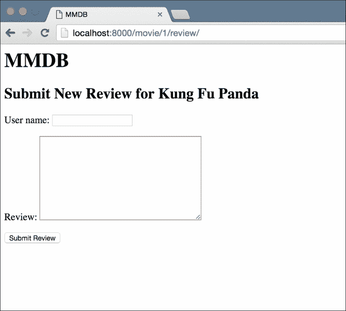
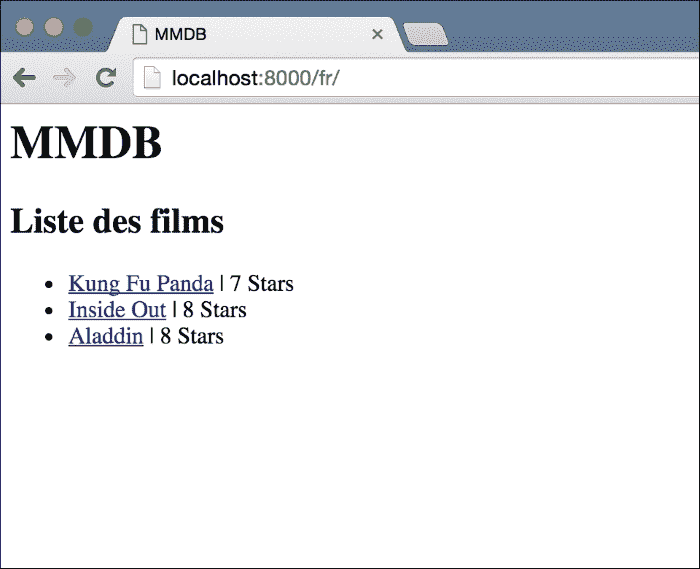
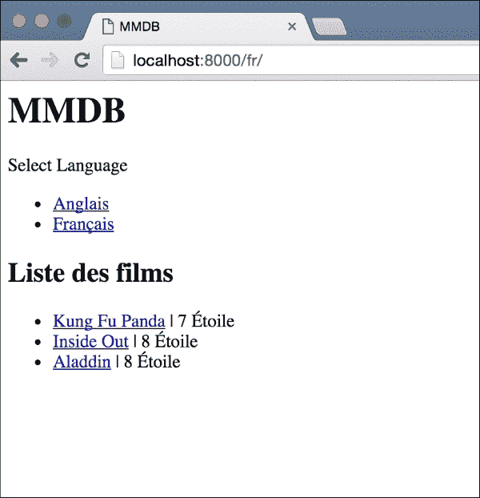
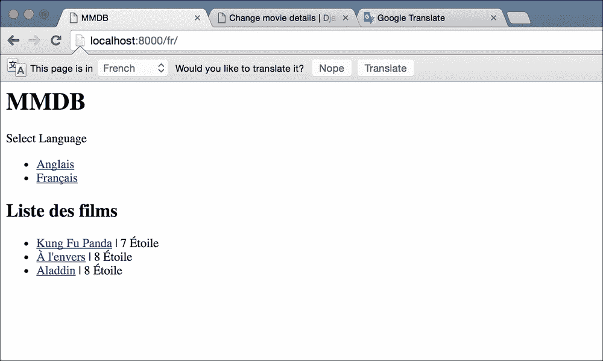

# 五、多语种电影数据库

互联网可能是世界上增长最快的现象。廉价的互联网手机进一步加速了这一增长，据估计，当今世界有 40%的人可以接入互联网。我们开发的任何 web 应用程序都可以真正全球化。然而，英语用户只占互联网人口的 30%左右。如果你的网站只有英文版，你就错过了大量的读者。

为了解决这一问题，近年来已经做出了许多努力，使非英语用户也能访问网站。Django 本身提供了可靠的方法，可以将站点内容翻译成多种语言。

然而，翻译内容只是过程的第一部分。语言并不是世界不同地区唯一不同的东西。货币代码、时区和数字格式只是几个例子。根据用户的位置调整这些内容称为本地化。你会经常看到这个缩写为**l10n**的。这是本地化的第一个`l`，然后是数字`10`，然后是最后一个`n`。`10`表示两者之间的字符数！您也可能会遇到术语国际化（**i18n**。国际化是确保您的应用程序跨多个区域运行而不会出错。例如，确保您从用户处接受的任何输入可以是多种语言，而不仅仅是您开发应用程序时使用的语言。

在本章中，我们将制作一个应用程序，其灵感来自于非常有用的**IMDB**（**互联网电影数据库**网站）。如果您从未听说过，它是一个 web 应用程序，提供了大量关于电影的信息，包括新旧电影。我们将创建一个应用程序，它提供一些与 IMDB 类似的基本功能。由于我们的应用程序是多语言的（顺便说一句，IMDB 也是），我将称之为**多语言电影数据库**（**MMDB**。

本章的代码包包括应用程序的非本地化工作副本。我们的工作是将本地化和国际化添加到 it 中，以便它能很好地为我们在法国的用户服务。

# 要求

让我们来看看本章最后要达到的目标：

*   全面了解 Django 提供的所有功能，以实现本地化
*   将网站内容翻译成法语
*   让用户能够选择使用哪种语言的网站
*   在多次访问中保持用户的语言偏好
*   翻译模型的内容

在我们开始之前，有一件事我想提一提。由于我们是第一次学习这些东西，我们将从一个已经存在的 Django 应用程序开始。然而，与大多数实际项目相比，我们的应用程序非常小。对于较大的应用程序，在完成项目后添加本地化通常比较困难。

在开始项目时考虑本地化需求，然后在第一次开发应用程序时合并这些特性，而不是在开发应用程序的后期阶段这样做，这始终是一个好主意。

# 启动并运行项目

一如往常，一旦您下载了代码，请将其解压缩。然后，为这个项目创建一个新的虚拟环境并安装 Django。最后，激活它并从项目根目录中运行 migrate 命令。这将为项目设置数据库，并使您能够启动应用程序。现在您需要创建一个新的超级用户，以便添加一些测试数据。在项目根目录中（虚拟环境处于活动状态）运行以下命令：

```py
> python manage.py createsuperuser

```

回答这些问题，您将拥有一个新用户。现在，使用`runserver`命令运行应用程序，然后访问`http://127.0.0.1:8000/admin/`，并将一些电影细节对象添加到数据库中。添加一些测试数据后，请访问应用程序的主页，您应该会看到类似于以下屏幕截图的内容：


您应该花一些时间来浏览应用程序。您可以在页面上查看特定电影的详细信息，如以下屏幕截图所示：


最后，您可以点击的**提交新评论**链接，进入下一页，为电影创建新评论，如下图所示：



这就是我们的全部申请。在本章的其余部分中，我们将研究如何将 l10n 和 i18n 添加到此项目中。我们将对核心产品功能进行很少的更改（如果有的话）。

# 翻译我们的静态内容

我们要做的第一件事是翻译我们网站上的所有静态内容。这包括您在前面三个屏幕中看到的所有标题、链接和表单标签。为了翻译模板中使用的字符串，Django 为我们提供了一个`trans`模板标记。让我们先看看如何在简单的上下文中使用它，然后我将详细介绍它是如何工作的。这是一个稍微长的部分，因为我们将在这里做很多事情，这构成了 Django 翻译特征的基础。

### 提示

如果你不明白什么，不要惊慌。只要按照指示去做就行了。我将对每一步进行深入介绍，但首先我想向您展示翻译是如何完成的。

打开`main/templates/movies_list.html`，将`h2`标签中的`Movies List`替换为以下内容：

```py

```

将下面的标记添加到文件的第二行`extends`标记之后：

```py

```

这就是我们现在需要对模板进行的所有更改。我将稍微解释一下这两行代码的作用，但首先我想完成整个翻译过程，这样你就可以看到整个内容，而不仅仅是较小的部分。

接下来，让我们从项目根目录运行以下命令：

```py
> python manage.py makemessages -l fr
CommandError: Unable to find a locale path to store translations for file main/__init__.py

```

如果运行此命令，还应该看到与我相同的错误，即无法找到区域设置路径。我们将在完成演示后解释区域设置路径。现在，在`main`文件夹中创建一个名为`locale`的新文件夹，然后再次运行该命令：

```py
>mkdir main/locale
> python manage.py makemessages -l fr
processing locale fr

```

这次命令成功了。如果查看您创建的区域设置文件夹，您应该会看到它下面创建了一个全新的文件夹层次结构。`makemessages`命令所做的是在`main/locale/fr/ LC_MESSAGES/django.po`文件中创建一个`django.po`。如果打开此文件，您应该能够了解它的用途。文件的最后三行应如下所示：

```py
#: main/templates/movies_list.html:5
msgid "Movies List"
msgstr ""
```

加上这个文件（`locale/fr/LC_MESSAGES/django.po`的路径和这三行，您应该知道这个文件将包含我们前面用`trans`标记的字符串的翻译法语文本。您在`msgstr`旁边加引号的任何内容都将取代网站法文翻译中的原始字符串。

我用谷歌翻译来翻译`Movies List`字符串，它把我翻译成 Liste des films。将此翻译置于`msgstr`旁边的引号中。`django.po`文件的最后三行现在应与以下内容匹配：

```py
#: main/templates/movies_list.html:5
msgid "Movies List"
msgstr "Liste des films"
```

接下来，从项目根目录运行以下命令：

```py
> python manage.py compilemessages -l fr
processing file django.po in /Users/asadjb/Programming/Personal/DjangoBluePrints/mmdb/mmdb/main/locale/fr/LC_MESSAGES

```

如果您现在查看`LC_MESSAGES`文件夹，您应该会看到一个新的`django.mo`文件已经创建。这是我们的`django.po`文件的编译版本，我们将翻译后的字符串放入其中。为了提高性能，Django 翻译要求将文件编译成二进制格式，然后才能获取字符串的翻译。

接下来，打开`mmdb/settings.py`并找到`MIDDLEWARE_CLASSES`列表。编辑它，使`django.middleware.locale.LocaleMiddleware`字符串出现在已安装的`SessionMiddleware`和`CommonMiddleware`之间。这个职位很重要。该列表现在应如下所示：

```py
MIDDLEWARE_CLASSES = [
    'django.middleware.security.SecurityMiddleware',
    'django.contrib.sessions.middleware.SessionMiddleware',
 'django.middleware.locale.LocaleMiddleware',
    'django.middleware.common.CommonMiddleware',
    'django.middleware.csrf.CsrfViewMiddleware',
    'django.contrib.auth.middleware.AuthenticationMiddleware',
    'django.contrib.auth.middleware.SessionAuthenticationMiddleware',
    'django.contrib.messages.middleware.MessageMiddleware',
    'django.middleware.clickjacking.XFrameOptionsMiddleware',
]
```

接下来，在设置文件中添加一个`LANGUAGES`变量，并给它以下值：

```py
LANGUAGES = (
    ('en', 'English'),
    ('fr', 'French')
)
```

默认情况下，Django 支持更长的语言列表。对于我们的项目，我们希望限制用户仅使用这两个选项。这就是`LANGUAGES`列表的作用。

最后一步是修改`mmdb/urls.py`文件。首先，从`django.conf.urls.i18n`导入`i18n_patterns`。接下来，更改`urlpatterns`变量，使`i18n_patterns`函数包装我们所有的 URL 定义，如下代码所示：

```py
urlpatterns = i18n_patterns(
url(r'^$', MoviesListView.as_view(), name='movies-list'),
url(r'^movie/(?P<pk>\d+)/$', MovieDetailsView.as_view(), name='movie-details'),
url(r'^movie/(?P<movie_pk>\d+)/review/$', NewReviewView.as_view(), name='new-review'),

url(r'^admin/', admin.site.urls),
)
```

完成后，让我们测试一下，看看我们的辛勤工作给我们带来了什么。首先，打开`http://127.0.0.1:8000`。您应该看到与之前相同的主页，但是如果您注意地址栏，您会注意到浏览器位于`http://127.0.0.1:8000/en/`而不是我们输入的内容。接下来我们将详细了解为什么会发生这种情况，但简单地说，我们打开主页时没有指定语言，Django 将我们重定向到该站点的默认语言，我们在前面指定为英语。

将 URL 更改为`http://127.0.0.1:8000/fr/`，您将再次看到相同的主页，但这一次，`Movies List`文本应替换为我们所说的法语翻译，如以下屏幕截图所示：



虽然要翻译一个句子，这一切可能都是一项艰巨的工作，但请记住，你只需要做一次。让我们来看看现在基础的翻译是多么简单。让我们把这个单词`Stars`翻译成法语版本`Etoiles`。打开`main/templates/movies_list.html`并将`Stars`替换为以下内容：

```py

```

接下来，运行`makemessages`命令：

```py
> python manage.py makemessages -l fr

```

打开`main/locale/fr/LC_MESSAGES/django.po`文件。您应该看到我们标记为翻译的`Stars`字符串的新部分。添加翻译（`Étoile`并保存文件。最后，运行`compilemessages`命令：

```py
> python manage.py compilemessages

```

通过访问`http://127.0.0.1:8000/fr/`再次打开法语主页。你会发现`Stars`这个词已经被它的法语翻译所取代。所涉及的努力很少。您刚才遵循的工作流：标记一个或多个字符串以进行翻译、生成消息、翻译新字符串，最后运行`compilemessages`是大多数 Django 开发人员在翻译项目时遵循的工作流。准备好站点翻译所涉及的大部分工作都是我们事先所做的工作。让我们仔细看看我们到底做了些什么来让我们的 Web 应用程序可移植。

# 这一切是怎么起作用的？

正如我在上一节开始时所承诺的那样，在看到 Django 翻译的实际应用之后，我们现在将更深入地了解我们为达到这一点而采取的所有步骤，以及每一个步骤都做了些什么。

我们做的第一件事是加载 i18n 模板标签库，它为我们提供了各种模板标签来翻译模板中的内容。最重要的，`trans`标签可能是您使用最多的标签。`trans`标记接受字符串参数，并根据激活的语言输出该字符串的正确翻译。如果找不到翻译，则输出原始字符串。

您在模板中编写的几乎所有字符串最终都会被`trans`标记包装，然后翻译成 web 应用程序可用的各种语言。在某些情况下，`trans`标记不可用。例如，如果必须将某个上下文变量的值添加到翻译后的字符串中，`trans`标记无法完成此操作。对于这些情况，我们需要使用块翻译标记`blocktrans`。我们的应用程序中不需要，但您可以在[的 Django 文档中阅读 https://docs.djangoproject.com/es/stable/topics/i18n/translation/#blocktrans-模板标签](https://docs.djangoproject.com/es/stable/topics/i18n/translation/#blocktrans-template-tag)。

我们的下一步是运行`make messages`命令。我们的第一次尝试没有成功，所以我们必须在我们的`application`文件夹中创建一个`locale`目录。完成后，我们运行了这个命令，它创建了一个扩展名为`.po`的消息文件。该命令的作用是遍历项目中的每个文件，并提取标记为要转换的字符串。标记字符串的一种方法是使用`trans`标记来包装它。还有其他方法，我们将在稍后讨论。

`make messages`命令提取字符串后，需要创建文件并将提取的字符串存储在这些文件中。Django 在确定每个提取的字符串指向哪个文件时遵循一组规则。对于从应用程序文件中提取的字符串，Django 首先尝试在该应用程序的文件夹中找到一个`locale`目录。如果找到该文件夹，它将在其下面创建相应的层次结构（目录`fr/LC_MESSAGES`并将消息文件放在那里。

如果未找到`locale`文件夹，Django 将查看`LOCALE_PATHS`设置变量的值。这应该是目录位置的列表。Django 从这个路径列表中选择第一个目录，并将消息文件放在那里。在我们的例子中，我们没有`LOCALE_PATHS`设置，这就是 Django 在主应用程序文件夹中找不到区域设置目录时出错的原因。

让我们谈谈消息文件的格式。下面是我们的消息文件现在的样子：

```py
# SOME DESCRIPTIVE TITLE.
# Copyright (C) YEAR THE PACKAGE'S COPYRIGHT HOLDER
# This file is distributed under the same license as the PACKAGE package.
# FIRST AUTHOR <EMAIL@ADDRESS>, YEAR.
#
#, fuzzy
msgid ""
msgstr ""
"Project-Id-Version: PACKAGE VERSION\n"
"Report-Msgid-Bugs-To: \n"
"POT-Creation-Date: 2016-02-15 21:25+0000\n"
"PO-Revision-Date: YEAR-MO-DA HO:MI+ZONE\n"
"Last-Translator: FULL NAME <EMAIL@ADDRESS>\n"
"Language-Team: LANGUAGE <LL@li.org>\n"
"Language: \n"
"MIME-Version: 1.0\n"
"Content-Type: text/plain; charset=UTF-8\n"
"Content-Transfer-Encoding: 8bit\n"
"Plural-Forms: nplurals=2; plural=(n > 1);\n"

#: main/templates/movies_list.html:6
msgid "Movies List"
msgstr "Liste des films"

#: main/templates/movies_list.html:10
msgid "Stars"
msgstr "Étoile"
```

以`#`开头的行是注释。然后，有一对空的`msgid`和`msgstr`。接下来是有关此消息文件的一些元数据。在那之后，我们得到了大部分时间。忽略元数据和第一对（前面有模糊注释的那一对）的消息文件只是一个`msgid`和`msgstr`对的列表。`msgid`对是您标记为翻译的字符串，`msgstr`是该字符串的翻译。翻译应用程序的通常方法是首先标记所有要翻译的字符串，然后生成消息文件，最后将其提供给翻译人员。然后，翻译器将文件返回给您，并填写翻译。使用简单文本文件的好处是翻译人员不需要使用任何特殊软件。如果他有权使用一个简单的文本编辑器，他可以翻译消息文件。

翻译完消息文件中的字符串后，我们需要在 Django 能够使用翻译之前运行 compilemessages 命令。如前所述，compile 命令将文本消息文件转换为二进制文件。对于 Django 来说，二进制文件格式的读取速度要快得多，并且在具有数百或数千个可翻译字符串的项目中，这些性能优势会很快累积起来。编译消息文件的输出是与`.po`文件位于同一文件夹中的`.mo`文件。

翻译完成并编译后，我们需要设置一些 Django 配置。我们要做的第一件事是将`LocaleMiddleware`添加到应用程序使用的中间件列表中。`LocaleMiddleware`的工作是允许用户根据几个请求参数选择站点的语言。您可以在[的文档中阅读关于语言如何确定的详细信息 https://docs.djangoproject.com/es/stable/topics/i18n/translation/#how-django 发现语言偏好](https://docs.djangoproject.com/es/stable/topics/i18n/translation/#how-django-discovers-language-preference)。稍后我们将回到它，用一个例子讨论它如何决定语言。

然后我们需要定义两个设置变量，`LANGUAGES`和`LANGUAGE`。代码包中已经定义了`LANGUAGE`，所以我们只设置了`LANGUAGES`变量。`LANGUAGES`是 Django 可以为网站提供翻译的语言选择列表。默认情况下，这是一个庞大的列表，其中包括 Django 可以翻译成的所有语言。但是，对于大多数项目，您希望用户仅能使用几种语言来使用站点。通过为`LANGUAGES`列表提供我们自己的值，我们确保 Django 不会为定义的语言以外的任何语言提供页面。

`LANGAUGE`变量定义要使用的默认语言。如果您还记得，当我们打开没有任何语言代码（`http://127.0.0.1:8000/`的主页时，默认选择了**英语**语言。`LANGUAGE`变量决定站点的默认语言。

使应用程序可翻译的下一部分是修改`url.py`文件。我们将 URL 配置包装在一个`i18n_patterns`函数中，而不是简单的 URL 配置元素列表。此函数允许我们匹配带有语言代码的 URL。对于传入的每个请求，该函数都会在从 URL 路径中删除语言代码后尝试匹配包装在其中的模式。解释起来有点复杂，让我们看一个例子。

假设我们有以下 URL 模式：

```py
url(r'^example/$', View.as_view(), name='example')
```

这将匹配`DOMAIN.COM/example/`，但如果我们尝试`DOMAIN.com/en/example/`，模式将不会导致匹配，因为`/en/`部分不是正则表达式的一部分。然而，一旦我们将其包装在`i18n_patterns`中，它将与第二个示例相匹配。这是因为`i18n_patterns`函数删除了语言代码，然后尝试匹配我们在其中包装的模式。

在某些应用程序中，您不希望所有 URL 都与语言前缀匹配。某些 URL（如 API 端点）不会根据语言而更改。在这些情况下，您可以将`i18n_patterns`和 URL 模式的正常列表相加：

```py
urlpatterns = i18n_patterns(url(r'^example/$', ExampleView.as_view(), name='example')) + [url(r'^api/$', ApiView.as_view(), name='api')]
```

通过这种方式，您可以创建转换视图和非转换视图的混合应用程序。

添加了`i18n_urlpatterns`之后，我们完成了 Django 基本国际化所需的所有配置，我们可以访问法语页面并查看翻译版本。

我最后要解释的是`LocaleMiddleware`。区域设置中间件是 Django 的部分，它允许用户使用 url 中的语言代码来决定使用哪种语言。因此，即使是`i18n_patterns`匹配基于语言代码的模式，也是中间件为每个请求激活正确的语言。除了在 URL 路径中使用语言前缀外，`LocaleMiddleware`还提供了几种选择语言的其他方法：

*   会话变量
*   cookie 值
*   用户浏览器发送的`Accept-Language`头
*   如果所有其他操作都失败，则使用`LANGUAGE`设置变量中的默认语言

这是一个概述，介绍了我们如何调整应用程序以使其可翻译。然而，我们还没有完成。

# 让用户决定使用哪种语言

虽然它不是 Django 的一部分，但几乎所有国际化的项目都使用这种模式；因此，我认为你意识到这一点很重要。大多数具有多种语言选项的网站都会向用户提供一个菜单，供用户选择要查看网站的语言。让我们创造它。修改`templates/base.html`模板以匹配以下内容：

```py


<html>
<head>
<meta http-equiv="content-type" content="text/html; charset=utf-8" />

<title>MMDB</title>
</head>
<body>
<h1>MMDB</h1>
<div>
<span>Select Language</span>
<ul>
 
 
 <li><a href="">{{ lang_name }}</a></li>
 
</ul>
</div>
    
    
</body>
</html>
```

新部件将突出显示。我们首先导入 i18n 模板库。然后，我们创建一个新的`div`元素来保存我们的语言选择列表。接下来，为了将语言选项作为模板的一部分，我们使用`get_available_languages`模板标记并将选项分配给`available_languages`变量。

接下来，我们根据语言选择创建一个链接列表。`get_available_languages`的返回值是我们在`LANGUAGES`变量的设置文件中设置的元组。

在我们的链接列表中，我们需要一些方法来获取每种语言的 URL。Django 再次在这里大放异彩，国际化特性与框架的其余部分实现了深度集成。如果国际化处于活动状态并反转 URL，它会自动获取正确的语言前缀。

但是，我们不能在这里对 URL 进行反向操作，因为这将为当前活动的语言创建 URL。因此，切换语言的链接列表实际上只指向当前语言。相反，我们必须临时切换到要创建链接的语言，然后生成 URL。我们使用`language`标记来实现这一点。在`language`标记之间，我们作为参数传递的语言被激活。因此，我们的反向 URL 结果与我们想要的完全一样。

最后要注意的是我们反转的 URL。对于我们的应用程序，`movies-list`URL 是主页，因此我们将其反转。对于大多数应用程序，您将执行相同的操作，并反转主页 URL，以便切换语言将用户带到指定语言的主页。

### 提示

有一些高级方法可以让用户保持在当前页面上，同时切换语言。一种是在每个页面上生成链接，而不是像我们在这里所做的那样生成`base.html`。这样，正如您知道模板将为哪个 URL 呈现一样，您可以反转相应的 URL。然而，这有一个缺点，就是需要你重复很多次。你可以在谷歌上搜索`Django reverse current URL in another language`并获得一些其他建议。我还没有找到一个好的，但你可以决定，如果你认为其中一个建议的选项适合你的需要。

完成更改后，通过访问`http://127.0.0.1:8000/en/`再次打开电影列表页面，您现在应该可以看到顶部的语言切换链接。请参阅以下屏幕截图：


您可以尝试切换语言，并在页面上的字符串中立即看到更改。

# 坚持用户选择

让我们做一个实验。将语言切换为法语，然后关闭浏览器窗口。再次打开浏览器并访问`http://127.0.0.1:8000/`。请注意，URL 中没有语言前缀。您将被重定向到网站的英语。如果一旦您选择了使用哪种语言，它将在访问中持续使用，这不是很好吗？

Django 提供了这种开箱即用的特性；您只需添加一些代码就可以使用它。如果您还记得`LocaleMiddleware`确定当前请求的语言所采取的步骤列表，那么查看 URL 前缀后的第二步就是查看会话。如果我们可以将语言选择放在会话字典中，Django 将在后续访问中自动为用户选择正确的语言。

将更新会话字典的代码放在什么位置是正确的？如果您仔细想想，每次用户更改其语言选择时，我们都会将其重定向到主页。当他们的语言偏好发生变化时，他们总是会访问主页，所以让我们把代码放在那里。修改`MoviesListView`以匹配以下代码：

```py
class MoviesListView(ListView):
    model = MovieDetails
    template_name = 'movies_list.html'

    def get(self, request, *args, **kwargs):
        current_language = get_language()
        request.session[LANGUAGE_SESSION_KEY] = current_language

        return super(MoviesListView, self).get(request, *args, **kwargs)
```

您还需要导入`get_language`和`LANGUAGE_SESSION_KEY`。把这个放在`main/views.py`的顶部：

```py
from django.utils.translation import LANGUAGE_SESSION_KEY
from django.utils.translation import get_language
```

现在，再次访问该网站并将您的语言更改为法语。接下来，关闭浏览器窗口并再次打开。打开`http://127.0.0.1:8000/`并注意不要将语言前缀放在 URL 中，您应该被重定向到法语页面。

让我们看看这里发生了什么。在 URL 中没有语言代码的情况下，`LocaleMiddleware`查看会话，查看保存语言选择的键是否有任何值。如果是，中间件将其设置为请求的语言。我们将用户的语言选择放在会话中，首先使用`get_language`方法获取当前活动的语言，然后将其放在会话中。中间件使用的密钥名存储在`LANGUAGE_SESSION_KEY`常量中，因此我们使用它来设置语言选择。

会话设置正确后，下次用户访问没有语言前缀的站点时，中间件会在会话中找到他们的选择并使用该语言前缀。

# 翻译我们的模型

我们最不想看到的是如何翻译我们的模型数据。打开网站并更改为法语。您的主页应类似于以下屏幕截图：



您会注意到，即使我们自己放在模板中的静态内容被翻译，电影的动态名称也不会被翻译。虽然这对于某些站点来说是可以接受的，但您的模型数据也应该进行翻译，以便真正实现国际化。默认情况下，Django 没有任何内置方法来实现这一点，但它非常简单。

### 提示

我要展示的是 Django`modeltranslation`图书馆已经提供的东西。我曾在一个大型项目中使用过它，它运行得非常好，所以如果你想跳过这一节，你可以直接使用这个库。不过，有一个关于如何在没有任何外部帮助的情况下实现它的概述是很好的。

您可以在[找到图书馆 https://github.com/deschler/django-modeltranslation](https://github.com/deschler/django-modeltranslation) 。

我们需要的是为模型中的每个文本字段存储一种以上的语言。您可以提出一种方案，使用一些分隔符将字符串的英文和法文翻译存储在同一字段中，然后在显示模型时将两者分开。

实现相同结果的另一种方法是为每种语言添加一个额外字段。对于我们当前的示例，这意味着为每个要转换的字段添加一个额外的字段。

这两种方法各有利弊。第一个很难维护；当您添加多个要翻译的语言时，数据格式将变得难以维护。

第二种方法添加数据库字段，这可能并不总是可能的。此外，它还需要对访问数据的方式进行根本性的改变。但是，如果您有这个选项，我总是建议您使用这个选项，这样可以生成更清晰、更易于理解的代码，在本例中，这意味着为每种语言添加额外的字段。

对于我们的`MovieDetails`模型，这意味着标题和描述字段各有一个额外字段来存储法语翻译。编辑您的`main/models.py`文件，使`MovieDetails`模型与以下代码匹配：

```py
class MovieDetails(models.Model):
    title = models.CharField(max_length=500)
    title_fr = models.CharField(max_length=500)

    description = models.TextField()
    description_fr = models.TextField()

    stars = models.PositiveSmallIntegerField()

    def __str__(self):
        return self.title
```

接下来，创建并运行迁移以将这些新字段添加到数据库：

```py
> python manage.py makemigrations
You are trying to add a non-nullable field 'description_fr' to moviedetails without a default; we can't do that (the database needs something to populate existing rows).
Please select a fix:
 1) Provide a one-off default now (will be set on all existing rows)
 2) Quit, and let me add a default in models.py
Select an option: 1
Please enter the default value now, as valid Python
The datetime and django.utils.timezone modules are available, so you can do e.g. timezone.now()
>>> ''
You are trying to add a non-nullable field 'title_fr' to moviedetails without a default; we can't do that (the database needs something to populate existing rows).
Please select a fix:
 1) Provide a one-off default now (will be set on all existing rows)
 2) Quit, and let me add a default in models.py
Select an option: 1
Please enter the default value now, as valid Python
The datetime and django.utils.timezone modules are available, so you can do e.g. timezone.now()
>>> ''
Migrations for 'main':
 0002_auto_20160216_2300.py:
 - Add field description_fr to moviedetails
 - Add field title_fr to moviedetails
 - Alter field movie on moviereview

```

正如您在前面的 CLI 会话中所看到的，当我创建迁移时，要求我为新字段提供默认值。我刚刚输入了空字符串。我们可以稍后从管理员处修复该值。

最后，运行新的迁移：

```py
> python manage.py migrate
Operations to perform:
 Apply all migrations: admin, contenttypes, main, auth, sessions
Running migrations:
 Rendering model states... DONE
 Applying main.0002_auto_20160216_2300... OK

```

完成此操作后，打开管理员并查看数据库中某个对象的编辑页面。它应该类似于以下屏幕截图：


在前面的屏幕截图中，您可以看到两个新字段已添加到管理员。我使用 Google Translate 翻译了这些字段的英文值，并填写了法语字段值。点击**保存**。现在，我们的模型有法语数据和英语值；但是如何显示它们呢？

您可以在模板代码中设置几个`if/else`条件来决定使用哪个语言字段。然而，这很快就会变得一团糟。现在，我们的模型只有两个被转换的字段，但是想象一个模型有 10 个这样的字段。你有多少条件？我们只讨论支持一种语言。最后，我们只有两个需要修改的模板，列表视图和详细视图。在现实世界中，更复杂的应用程序中，您的模型可以从 100 个不同的地方使用。`if/else`方法变得太难，无法快速维护。

相反，我们要做的是根据当前语言，让我们的模型方法智能地返回字段的正确值。让我们再次修改我们的`main/models.py`文件。首先，导入顶部的`get_language`方法：

```py
from django.utils.translation import get_language
```

接下来，再次修改模型`MovieDetails`并添加这三种新方法（代码中突出显示）：

```py
class MovieDetails(models.Model):
    title = models.CharField(max_length=500)
    title_fr = models.CharField(max_length=500)

    description = models.TextField()
    description_fr = models.TextField()

    stars = models.PositiveSmallIntegerField()

 def get_title(self):
 return self._get_translated_field('title')

 def get_description(self):
 return self._get_translated_field('description')

 def _get_translated_field(self, field_name):
 original_field_name = field_name

 lang_code = get_language()

 if lang_code != 'en':
 field_name = '{}_{}'.format(field_name, lang_code)
 field_value = getattr(self, field_name)

 if field_value:
 return field_value
 else:
 return getattr(self, original_field_name)

    def __str__(self):
        return self.title
```

在新方法中没有 Django 特有的东西。主要的工作是`_get_translated_field`方法。给定一个字段名，它将查看当前语言，如果该语言不是英语，则将语言代码附加到字段名。然后从对象中获取新字段名的值。如果该值为空，因为我们没有翻译该字段，它将遵循 Django 约定，只返回原始未翻译字段的值。

现在修改`main/templates/movies_list.html`使用这些新方法：

```py




<h2></h2>

<ul>
    
<li><a href="">{{ movie.get_title }}</a> | {{ movie.stars }} </li>
    
</ul>

```

这里唯一的变化是我们没有直接使用`movie.title`的值，而是使用`movie.get_title`。这是这种方法的一个主要缺点。现在，在项目中需要`title`或`description`值的任何地方，都必须使用`get_title`和`get_description`方法，而不是直接使用字段值。

### 注

保存字段也是如此。您必须根据活动语言确定要写入哪个字段名。虽然这两项都不复杂，但它们确实给整个过程增加了一些不适。然而，这是你为这种力量付出的代价。

我前面提到的`django-modeltranslation`包很好地解决了这个问题。它使用模型中的代码自动决定在访问任何字段时返回哪种语言。因此，您不需要使用`obj.get_title()`，而是编写`obj.title`并为当前激活的语言获取正确的字段。对于您的项目，您可能希望对此进行研究。在本章中，我没有使用这一点，因为我想为您提供一种使用基本 Django 的方法，并向您展示一种可以自己完成任务的方法，而不是依赖第三方库。

再次打开网站的法文版，你会看到我们翻译的一个对象应该有标题的翻译版本，而其他对象只会显示非翻译版本：



对细节模板执行同样的操作应该很简单，由您自己决定！

# 总结

虽然这是一个有点小的章节，但我们看到的信息将在您的 web 开发生涯中派上用场。虽然不是所有你开发的网站都需要翻译成多种语言，但一些最重要的网站需要翻译成多种语言。当您有机会从事这样的项目时，您将了解如何着手创建真正国际化的 web 应用程序。

我们只触及 Django 国际化和本地化的表面。当你开始一个需要这些的项目时，一定要查看文档。

我们现在只使用简单的 Django 应用程序。在学习了 Django 的基础知识之后，下一章将让我们开发一个更复杂的 web 应用程序，其中包括使用功能强大的 Elasticsearch 进行搜索！