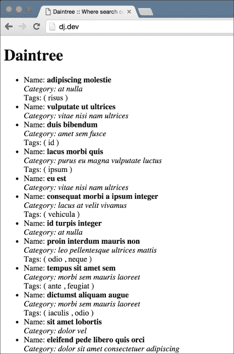
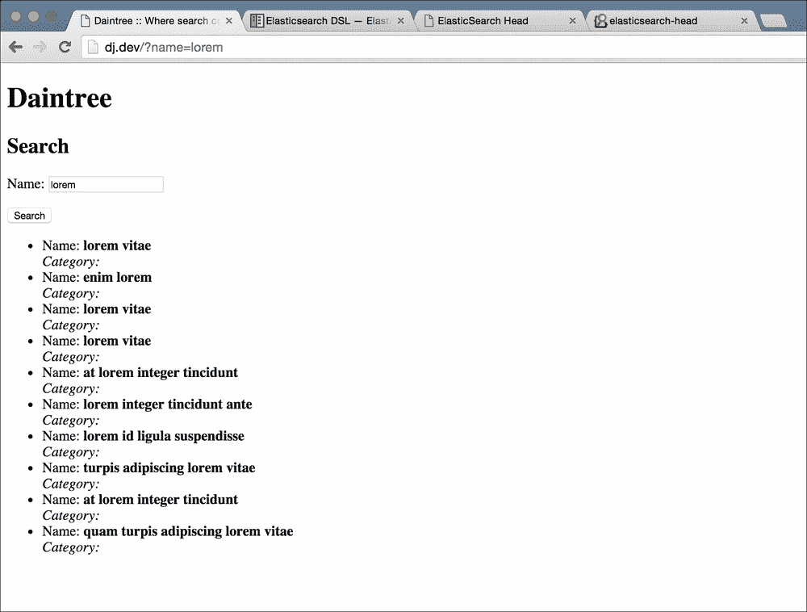
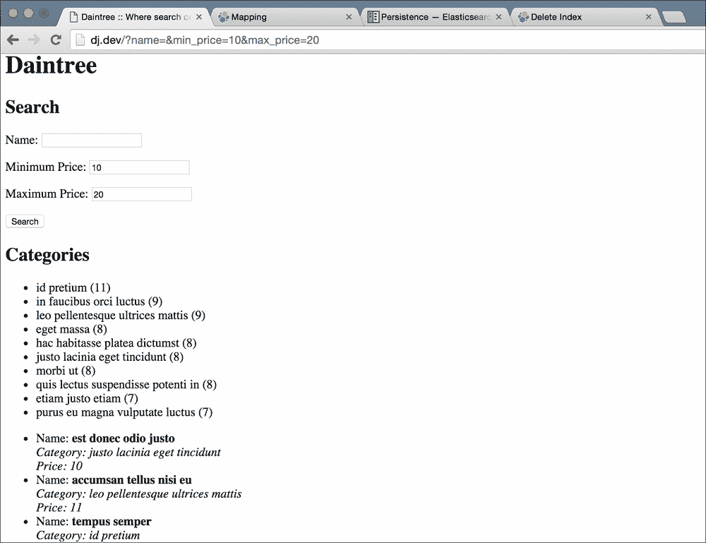
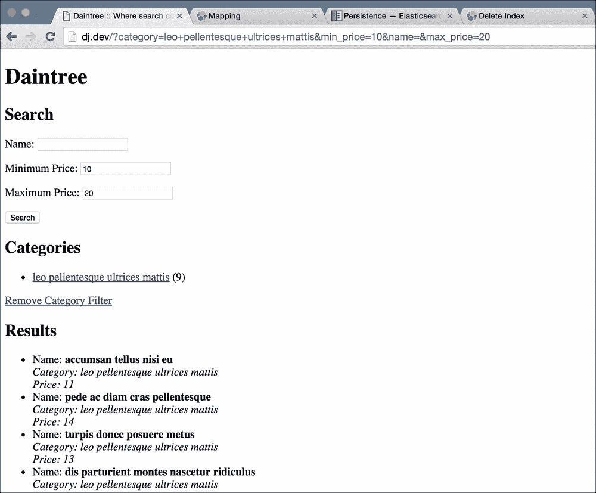

# 第 6 章 Daintree——电子商务网站

在前面的章节中，我们已经创建了一些可靠的 web 应用程序。它们很简单，但有足够的功能用于实际项目。通过一些前端工作，我们的应用程序可以很好地部署在互联网上并解决实际问题。现在是时候看看更复杂的事情了。

我相信你已经使用过，或者至少听说过，一些电子商务领域的大牌，比如亚马逊和阿里巴巴。虽然这些网站非常复杂，但一个基本的电子商务网站是非常简单的。电子商务网站也是许多客户想要创建的东西，因此了解如何创建一个好的网站在你的职业生涯中将非常有用。

一个基本的电子商务网站有一个主要目的：帮助用户从网上商店找到并购买产品。Django 可以单独用于快速构建电子商务站点，使用数据库查询允许跨产品范围进行搜索，但这并不能很好地扩展。数据库的设计目的是快速保存和检索数据行，但它们没有优化以在整个数据集（或子集）中搜索。一旦你的网站流量开始增加，你会看到搜索速度迅速下降。除此之外，还有一些很难用数据库构建的特性。

我们将使用**搜索服务器**。搜索服务器非常类似于数据库。您给它一些要存储的数据，然后您可以稍后检索它。它还具有专门构建的功能，可帮助您将搜索添加到应用程序中。您可能会想，如果搜索服务器可以像存储数据库一样存储我们的数据，那么我们是否可以摆脱数据库呢？我们可以，但通常不推荐。为什么？因为搜索服务器是为不同的用例设计的。虽然数据库可以存储您的数据，但它提供了许多搜索服务器通常无法提供的存储保证。例如，一个好的数据库（如 MySQL 或 PostgreSQL）可以保证，如果您尝试保存某些内容，并且数据库返回了成功的响应，那么在发生崩溃、断电或其他问题时，您的数据不会丢失。这叫做耐久性。搜索服务器不提供这种保证，因为这不是它们的设计目的。通常，将数据保存在数据库中并使用搜索服务器在数据中进行搜索是一个好主意。

对于我们将在本章中开发的应用程序，我们将使用**Elasticsearch**，这是目前最流行且可能易于使用的搜索服务器之一。它也是开源的，免费提供。让我们开始吧。这将是一个激动人心的篇章！

# 代码包

本章的代码包包含一个基本的 web 应用程序，该应用程序具有简单电子商务站点的模型和视图。现在没有搜索，只有一个列出所有可用产品的页面。我还提供了一个包含大约 1000 个产品的数据转储，这样我们的数据库就有了一些数据，我们可以使用它们。像往常一样，下载代码包，创建一个新的虚拟环境，安装 Django，运行 migrate 命令，然后发出`run server`命令来启动开发服务器。你现在应该已经掌握了在没有任何指导的情况下如何做这些事情的诀窍。

要加载测试数据，请在 migrate 命令之后运行以下命令：

```py
> python manage.py loaddata main/fixtures/initial.json

```

这将使您的数据库充满上千个产品样本，并为我们提供足够的数据。

# 探索弹性搜索

在我们开始将 Elasticsearch 与 Django 应用程序集成之前，让我们花点时间来探索 Elasticsearch。我们将研究如何将数据放入其中，并使用搜索功能返回我们想要的结果。我们将在稍后构建应用程序的搜索页面时详细介绍搜索，但我们将对 Elasticsearch 的工作原理以及它如何对我们有用进行基本概述。

首先，从[下载最新版本的 Elasticsearchhttps://www.elastic.co/downloads/elasticsearch](https://www.elastic.co/downloads/elasticsearch) 。您需要在您的系统上安装 Java 才能运行 Elasticsearch，因此，如果您还没有安装，请继续安装它。您可以从[获取 Javahttps://java.com/en/download/](https://java.com/en/download/) 。下载 Elasticsearch 后，将压缩档案中的文件解压缩到一个文件夹中，打开一个新的终端会话，`cd`进入该文件夹。接下来，`cd`进入`bin`文件夹并运行以下命令：

```py
> ./elasticsearch
.
.
.
[2016-03-06 17:53:53,091][INFO ][http                     ] [Marvin Flumm] publish_address {127.0.0.1:9200}, bound_addresses {[fe80::1]:9200}, {[::1]:9200}, {127.0.0.1:9200}
[2016-03-06 17:53:53,092][INFO ][node                     ] [Marvin Flumm] started
[2016-03-06 17:53:53,121][INFO ][gateway                  ] [Marvin Flumm] recovered [0] indices into cluster_state
```

运行 Elasticsearch 二进制文件应该会产生大量的输出，这与我在这里粘贴的内容不同。但是，您仍然应该看到两条消息**在输出结束时启动**并且**将[0]索引恢复到集群 _ 状态**。这意味着 Elasticsearch 现在正在您的系统上运行。那并不难！当然，在生产环境中运行 Elasticsearch 有点不同，Elasticsearch 文档提供了很多关于如何为几个不同的用例部署它的信息。

本章仅介绍 Elasticsearch 的基础知识，因为我们的重点是研究 Django 和 Elasticsearch 之间的集成，但如果您发现自己在某个地方遇到了问题或需要回答一些问题，请务必查看文档，它确实非常广泛和全面。您可以在[找到它 https://www.elastic.co/guide/en/elasticsearch/reference/current/index.html](https://www.elastic.co/guide/en/elasticsearch/reference/current/index.html) 。[上还有一本书式指南 https://www.elastic.co/guide/en/elasticsearch/guide/current/index.html](https://www.elastic.co/guide/en/elasticsearch/guide/current/index.html) 如果你真的想花时间学习 Elasticsearch。

## 弹性搜索的第一步

现在我们已经运行了 Elasticsearch，我们可以用它做什么？首先，您需要知道 Elasticsearch 通过一个简单的 HTTP API 公开其功能。所以你不需要任何特殊的图书馆来与它交流。大多数编程语言，包括 Python，都包含发出 HTTP 请求的方法。然而，有几个库在 HTTP 上提供了另一层抽象，使使用 Elasticsearch 更容易。我们稍后再讨论。

现在，让我们在浏览器中打开此 URL：

```py
http://localhost:9200/?pretty
```

这将为您提供类似以下内容的输出：

```py
{
  "name" : "Marvin Flumm",
  "cluster_name" : "elasticsearch",
  "version" : {
    "number" : "2.2.0",
    "build_hash" : "8ff36d139e16f8720f2947ef62c8167a888992fe",
    "build_timestamp" : "2016-01-27T13:32:39Z",
    "build_snapshot" : false,
    "lucene_version" : "5.4.1"
  },
  "tagline" : "You Know, for Search"
}
```

虽然大多数值会有所不同，但响应的结构应该大致相同。这个简单的测试让我们知道 Elasticsearch 在我们的系统上正常工作。

现在，我们将进行一个快速演练，插入、检索和搜索两个产品。我不会详细介绍，但如果您感兴趣，您应该看看我前面提到的 Elasticsearch 文档。

### 注

要执行本节中的步骤，您需要在计算机上安装 curl 命令行实用程序的工作副本。默认情况下，它应该在 Linux 和 Unix 平台（包括 Mac OS X）上可用。如果您在 Windows 上，您可以从[获取副本 https://curl.haxx.se/download.html](https://curl.haxx.se/download.html) 。

打开一个新的终端窗口，因为当前窗口中运行着 Elasticsearch。接下来，键入以下内容：

```py
> curl -XPUT http://localhost:9200/daintree/products/1 -d '{"name": "Django Blueprints", "category": "Book", "price": 50, "tags": ["django", "python", "web applications"]}'
{"_index":"daintree","_type":"products","_id":"1","_version":1,"_shards":{"total":2,"successful":1,"failed":0},"created":true}      
                                                > curl -XPUT http://localhost:9200/daintree/products/2 -d '{"name": "Elasticsearch Guide", "category": "Book", "price": 100, "tags": ["elasticsearch", "java", "search"]}'
{"_index":"daintree","_type":"products","_id":"2","_version":1,"_shards":{"total":2,"successful":1,"failed":0},"created":true}
```

大多数 ElasticSearchAPI 都接受 JSON 对象。在这里，我们要求 Elasticsearch 将两个文档（IDs1 和 IDs2）放入其存储器中。这可能看起来很复杂，但让我解释一下这里发生了什么。

在数据库服务器中，有数据库、表和行。数据库就像一个命名空间，所有表都位于其中。表定义了要存储的数据的整体形状，每行是该数据的一个单元。Elasticsearch 处理数据的方式略有不同。

Elasticsearch 有一个索引来代替数据库。表称为文档类型，位于索引内部。最后，行或 Elasticsearch 调用的文档存储在文档类型中。在前面的示例中，我们告诉 Elasticsearch 在**产品**文档类型中`PUT`一个 Id 为**1**的文档，该文档位于**daintree**索引中。我们在这里没有做的一件事是定义文档结构。这是因为 Elasticsearch 不需要设置结构。当您插入新文档时，它将动态更新其表的结构（文档类型）。

让我们尝试检索插入的第一个文档。运行以下命令：

```py
> curl -XGET 'http://localhost:9200/daintree/products/1?pretty=true'
{
  "_index" : "daintree",
  "_type" : "products",
  "_id" : "1",
  "_version" : 1,
  "found" : true,
  "_source" : {
    "name" : "Django Blueprints",
    "category" : "Book",
    "price" : 50,
    "tags" : [ "django", "python", "web applications" ]
  }
}
```

正如您可能猜到的，Elasticsearch 的 API 非常简单直观。当我们想要插入文档时，我们使用了`PUT`HTTP 请求。当我们想要检索一个时，我们使用`GET`HTTP 请求类型，并给出插入文档时使用的相同路径。我们得到的信息比我们插入的要多。我们的文档位于`_source`字段中，其余字段是 Elasticsearch 随每个文档存储的元数据。

现在我们来看看这个节目的明星！让我们看看如何简单地搜索标题中有Django 一词的书籍。运行以下命令：

```py
> curl -XGET 'http://localhost:9200/daintree/products/_search?q=name:Django&pretty'
{
  "took" : 4,
  "timed_out" : false,
  "_shards" : {
    "total" : 5,
    "successful" : 5,
    "failed" : 0
  },
  "hits" : {
    "total" : 1,
    "max_score" : 0.19178301,
    "hits" : [ {
      "_index" : "daintree",
      "_type" : "products",
      "_id" : "1",
      "_score" : 0.19178301,
      "_source" : {
        "name" : "Django Blueprints",
        "category" : "Book",
        "price" : 50,
        "tags" : [ "django", "python", "web applications" ]
      }
    } ]
  }
}
```

结果是您在本次搜索中所期望的结果。Elasticsearch 只返回名称中包含 Django 一词的一个文档，并跳过了另一个文档。这称为lite 搜索或查询字符串搜索，因为我们的查询是作为查询字符串参数的一部分发送的。然而，对于具有多个参数的复杂查询，这种方法很快变得难以使用。对于这些查询，Elasticsearch 提供了完整的查询 DSL，它使用 JSON 指定查询。让我们看看如何使用查询 DSL 进行同样的搜索：

```py
> curl -XGET 'http://localhost:9200/daintree/products/_search?pretty' -d '{"query": {"match": {"name": "Django"}}}'
{
  "took" : 3,
  "timed_out" : false,
  "_shards" : {
    "total" : 5,
    "successful" : 5,
    "failed" : 0
  },
  "hits" : {
    "total" : 1,
    "max_score" : 0.19178301,
    "hits" : [ {
      "_index" : "daintree",
      "_type" : "products",
      "_id" : "1",
      "_score" : 0.19178301,
      "_source" : {
        "name" : "Django Blueprints",
        "category" : "Book",
        "price" : 50,
        "tags" : [ "django", "python", "web applications" ]
      }
    } ]
  }
}
```

这次，我们发送一个带有 GET 请求的正文，而不是传递一个查询参数。主体是我们希望执行的 JSON 查询。我不会解释查询 DSL，因为它有很多特性，而且功能非常强大，需要另外一本书来正确解释。事实上，已经有几本书完整地解释了 DSL。然而，对于这样的简单用法，您可以很容易地猜测发生了什么。如果您想了解更多详细信息，我将再次建议您查看 Elasticsearch 文档。

# 从 Python 中搜索

现在我们已经对如何使用 Elasticsearch 在文档上插入和搜索有了基本的了解，让我们看看如何从 Python 中执行同样的操作。我们可以使用 Python 中 Elasticsearch 的 HTTP API 来查询文档，但有更好的方法。有许多库通过 HTTP API 为 Elasticsearch 提供抽象。在底层，他们只是使用 HTTP API，但他们提供的抽象使我们更容易与 Elasticsearch 通信。我们将在这里使用的图书馆是`elasticsearch_dsl`。确保您的虚拟环境已激活，并使用`pip`进行安装：

```py
> pip install elasticsearch_dsl

```

接下来，让我们启动一个 Django shell，这样我们就可以玩一玩并了解如何使用它：

```py
> python manage.py shell
> from elasticsearch_dsl import Search
> from elasticsearch_dsl.connections import connections
> connections.create_connection(hosts=['localhost:9200'])
<Elasticsearch([{u'host': u'localhost', u'port': 9200}])>
> Search(index='daintree').query('match', name='django').execute().to_dict()
{u'_shards': {u'failed': 0, u'successful': 5, u'total': 5},
 u'hits': {u'hits': [{u'_id': u'1',
    u'_index': u'daintree',
    u'_score': 0.19178301,
    u'_source': {u'category': u'Book',
     u'name': u'Django Blueprints',
     u'price': 50,
     u'tags': [u'django', u'python', u'web applications']},
    u'_type': u'products'}],
  u'max_score': 0.19178301,
  u'total': 1},
 u'timed_out': False,
 u'took': 2}
```

让我们来看看每一行。前两行只是导入库。第三条线很重要。它使用`create_connection`方法定义默认连接。这是我们尝试使用此库进行搜索时使用的默认设置的连接。

接下来，我们执行搜索并打印结果。这是重要的一点。这一行代码做了几件事，所以让我们把它分解一下。首先，我们构造一个`Search`对象，为前面创建的`daintree`索引传入索引名。由于我们没有传入自定义 Elasticsearch 连接，因此它使用我们前面定义的默认连接。

接下来，我们在`Search`对象上使用`query`方法。其语法很简单。第一个参数是我们要使用的查询类型的名称。正如我们对`curl`所做的那样，我们使用的是`match`查询类型。查询方法的所有其他参数都必须是关键字参数，这将是查询的元素。在这里，这将生成与前面的示例相同的查询，其中包含`curl`：

```py
{
    "query": {
        "match": {
            "name": "django"
        }
    }
}
```

将查询添加到`Search`对象后，我们需要显式执行它。这是通过`execute`方法完成的。最后，为了查看响应，我们对响应使用 helper`to_dict`方法，它打印出 Elasticsearch 对我们的搜索响应的任何内容；在本例中，它与我们之前使用`curl`时得到的结果类似。

现在我们已经了解了如何搜索，下一步将是了解如何将数据添加到我们的 Elasticsearch 索引中。在此之前，我们需要了解 Elasticsearch 映射。

# 测绘

我前面提到，Elasticsearch 不需要为文档类型定义数据结构。然而，Elasticsearch 在内部计算出我们插入的数据的结构。我们可以手动定义此结构，但不一定需要。当 Elasticsearch 使用自己对数据结构的猜测时，据说它对文档类型使用了动态映射。让我们看看 Elasticsearch 对`product`文档类型的猜测。使用命令行，使用 curl 发出以下请求：

```py
> curl 'http://localhost:9200/daintree/products/_mapping?pretty'
{
  "daintree" : {
    "mappings" : {
      "products" : {
        "properties" : {
          "category" : {
            "type" : "string"
          },
          "name" : {
            "type" : "string"
          },
          "price" : {
            "type" : "long"
          },
          "tags" : {
            "type" : "string"
          }
        }
      }
    }
  }
}
```

Elasticsearch 在猜测文档结构方面做得相当不错。如您所见，它正确地猜测了所有字段的类型。但是，如果您注意到 tags 字段的类型，您将看到它是一个字符串。如果查看我们前面检索到的文档，tags 字段是一个字符串数组。这是怎么回事？

在 Elasticsearch 中，数组没有任何特殊的映射。每个字段可以有一个或多个值；因此，每个字段都可以是一个数组，而不必将其映射为数组。这意味着 Elasticsearch 中的数组只能有一种类型的数据。因此，不能同时包含日期值和字符串的数组。如果您尝试插入类似的内容，Elasticsearch 将继续并将日期存储为字符串。

您可能想知道，如果 Elasticsearch 足够智能，能够找出我们的数据结构，那么我们为什么要关心映射呢？好的，我们用来处理`Elasticsearch`、`elasticsearch_dsl`的库需要定义自定义映射，以便能够将文档插入索引。

明确将插入到索引中的数据类型也是一个好主意。设置自己的映射时，可以设置许多选项，例如将字段定义为整数。这样，即使插入值“123”，Elasticsearch 也会在插入文档之前将其转换为整数，如果不能，则会引发错误。这提供了数据验证。某些类型的数据，例如日期的格式不同于 Elasticsearch 默认使用的格式，只有在设置自定义映射后才能正确索引这些数据。

## 定义映射

为了用 `elasticsearch_dsl`定义映射，我们创建了一个`DocType`子类。这类似于 Django 数据库模型的定义方式。创建一个新的`main/es_docs.py`文件并键入以下代码：

```py
from elasticsearch_dsl import DocType
from elasticsearch_dsl import Long
from elasticsearch_dsl import String

class ESProduct(DocType):
    name = String(required=True)
    description = String()
    price = Long(required=True)

    category = String(required=True)
    tags = String(multi=True)

    class Meta:
        doc_type = 'products'
```

这里不应该有任何意外，因为语法是非常不言自明的。我更喜欢将 ES 添加到文档类型类的开头，以区分 ES 文档类型类与同名的 Django 模型。请注意，我们明确指定了文档类型名称。如果没有的话，`elasticsearch_dsl`会根据类名自动生成一个名称-`ESProduct`。但是，由于我们只是想为现有文档类型定义映射，所以我们在`Meta`类中设置了`doc_type`属性。

请注意，我们的数据类型与之前询问 Elasticsearch 有关映射时看到的数据类型相同。这是有原因的。无法更改现有字段的数据类型。否则，现有文档将具有错误的数据类型，搜索将返回不一致的结果。虽然这个映射已经存在于我们的 Elasticsearch 中，但是让我们看看如何使用这个类来定义一个新的文档类型映射。再次打开 Django shell 并键入以下内容：

```py
> python manage.py shell
> from elasticsearch_dsl.connections import connections
> from main.es_docs import ESProduct
> connections.create_connection()
<Elasticsearch([{}])>
> ESProduct.init(index='daintree')
```

我们使用`ESProduct.init(index='daintree')`方法在 Elasticsearch 中创建映射。因为我们的映射已经存在并且完全相同，所以这个函数没有改变任何东西。然而，如果我们正在创建一个新的映射，这个函数会用新的文档类型配置 Elasticsearch。

请注意，这一次我们没有向`connections.create_connection()`方法传递任何参数，这意味着它使用了默认主机列表，该列表假定在默认端口 9200 上本地运行 Elasticsearch 实例。由于我们的 Elasticsearch 在同一端口上本地运行，因此我们可以将主机的参数跳过为`create_connection()`方法。

# 从 Python 向 Elasticsearch 插入文档

既然已经有了`DocType`子类并且已经了解了如何创建映射，剩下的就是将文档插入 Elasticsearch。本节假设您已经加载了我随代码放置提供的 fixtures 数据。

再次打开 Django shell 并键入以下命令：

```py
> python manage.py shell
> from elasticsearch_dsl.connections import connections
> from main.es_docs import ESProduct
> from main.models import Product
> connections.create_connection()
<Elasticsearch([{}])>
> p = Product.objects.get(pk=200)
> esp = ESProduct(meta={'id':p.pk}, name=p.name, description=p.description, price=p.price, category=p.category.name)
> for tag in p.tags.all():
>     esp.tags.append(tag.name)
>
> esp.save(index='daintree')
True
```

### 注

注意 for 循环体后面的空行。在 shell 中，这个空行用于告诉交互式 shell 循环体已经完成，并且可以继续执行循环。

这应该很正常，直到我们从数据库中获得 ID 为`200`的产品为止。我只是选择了一个随机 ID，因为我知道在您加载我提供的装置后，ID 为`200`的产品将存在于您的数据库中。

接下来，我们创建一个新的`ESProduct`实例，并从 Django 模型中为其赋值。需要使用特殊的 meta 关键字参数为 ID 字段分配一个值，因为它是 Elasticsearch 中文档元数据的一部分，而不是文档正文的一部分。如果我们不提供 ID，Elasticsearch 将自动为我们生成一个随机 ID。我们明确指定它，以便将数据库模型与 Elasticsearch 文档联系起来。

接下来，我们循环遍历`Product`对象中的所有标记，并将其附加到`ESProduct`对象中的`tags`字段。我们不需要将`tags`字段值设置为空数组。定义`tags`字段时，我们将`multi=True` 参数传递给构造函数。对于`elasticsearch_dsl`字段，多字段具有默认的空值，即空列表。因此，在我们的循环中，我们确信`esp.tags`是一个我们可以附加到的列表。

在我们用正确的值设置了`ESProduct`模型实例之后，我们调用 save 方法，传递要插入它的索引名。一旦 save 调用返回，Elasticsearch 将保存我们的新数据。我们可以使用`curl`对其进行测试，以检索此新文档：

```py
> curl 'http://localhost:9200/daintree/products/_search?pretty'

```

在这个命令的输出中，您现在应该看到三个产品，而不是我们最初插入的两个。

## 将所有数据输入 Elasticsearch

我们不能一直从控制台向 Elasticsearch 插入数据。我们需要一种自动化的方式来实现这一点。正如我们之前所看到的，Django 管理命令是创建脚本的完美方式。创建将保存我们的命令文件`main/management/commands`的文件夹，在`main/management`和`main/management/commands`中创建一个空的`__init__.py`文件，并将以下代码添加到`main/management/commands/index_all_data.py`：

```py
import elasticsearch_dsl
import elasticsearch_dsl.connections

from django.core.management import BaseCommand

from main.models import Product
from main.es_docs import ESProduct

class Command(BaseCommand):
    help = "Index all data to Elasticsearch"

    def handle(self, *args, **options):
        elasticsearch_dsl.connections.connections.create_connection()

        for product in Product.objects.all():
            esp = ESProduct(meta={'id': product.pk}, name=product.name, description=product.description,
                            price=product.price, category=product.category.name)
            for tag in product.tags.all():
                esp.tags.append(tag.name)

            esp.save(index='daintree')
```

这里没有什么新东西。我们只需遍历数据库中的所有产品对象，并将它们添加到 Elasticsearch。按如下方式运行：

```py
> python manage.py index_all_data
```

它将在没有任何输出的情况下成功运行，现在您的所有文档都应该在 Elasticsearch 中。为了证实这一点，我们可以从 Elasticsearch 获得`daintree`索引的统计数据。从 shell 运行以下命令：

```py
> curl 'localhost:9200/daintree/_stats?pretty=1'
```

这将输出大量关于`daintree`指数的数据。您需要向上滚动，您将找到文档总数。它应该与此类似：

```py
.
.
.
"total" : {
        "docs" : {
          "count" : 1000,
          "deleted" : 0
        },
.
.
.
```

正如你所看到的，我们所有的数据现在都被索引了。接下来，我们将使用 Elasticsearch 将搜索添加到我们的主页。

# 添加搜索

如果你现在查看我们的主页，它应该是我们数据库中 50 个随机产品的列表。您可以在`http://127.0.0.1:8000`打开它，它的外观应该类似于：



我们要做的是在此页面中添加一个基本搜索表单。表单将只是一个接受搜索词和按钮以执行搜索的字段。搜索词将在我们的产品列表的名称字段上执行搜索。

让我们创建一个简单的 Django 表单并将其添加到我们的页面。创建一个新的`main/forms.py`文件并添加以下代码：

```py
from django import forms

class SearchForm(forms.Form):
    name = forms.CharField(required=False)
```

接下来，我们需要在主页上显示搜索表单。将以下内容添加到`home.html`模板中`content`块的开始标记之后：

```py
<h2>Search</h2>
<form action="" method="get">
    {{ form.as_p }}
    <input type="submit" value="Search" />
</form>
```

最后，我们需要修改我们的`HomeView`，以便它使用用户的查询生成结果列表，而不是从数据库中随机获取 50 个结果。更改`main/view.py`以匹配以下代码：

```py
import random

from django.shortcuts import render
from django.template.response import RequestContext
from django.views.generic import View

from elasticsearch_dsl import Search
from elasticsearch_dsl.connections import connections

from main.forms import SearchForm

class HomeView(View):
    def get(self, request):
        form = SearchForm(request.GET)

        ctx = {
            "form": form
        }

        if form.is_valid():
            connections.create_connection()

            name_query = form.cleaned_data["name"]
            s = Search(index="daintree").query("match", name=name_query)
            result = s.execute()

            ctx["products"] = result.hits

        return render(request, "home.html", ctx)
```

让我们先测试它，然后我将解释这段代码的作用。在字段中输入搜索词，然后按**搜索**按钮。由于我们的示例数据在所有字段中都有通常的`Lorem Ipsum`文本，因此搜索类似`lorem`的术语。您应该看到如下内容：



尝试使用一些不同的搜索词，看看它的反应如何。如果您输入了在我们的产品列表中找不到的内容，您将看到一个空白页面。我们将对其进行更改，以便用户看到一条消息，告诉他们他们的搜索查询没有结果。此外，类别名称已消失。这是因为`product.category.name`模板中使用的属性名称与 Elasticsearch 文档中包含的不同。虽然 Elasticsearch 文档中的大多数字段名与 Django 模型中的字段名相同，但类别名的访问方式需要有所不同，因为它不再是外键，而是简单的字符串。在`main/templates/home.html`中，注意以下行：

```py
<i>Category: {{ product.category.name }}</i> <br />
```

将此更改为以下内容：

```py
<i>Category: {{ product.category }}</i> <br />
```

我们产品的类别名称将重新出现。

如果您尝试一下，您会注意到，如果您将字段留空并单击**搜索**按钮，则不会返回任何结果。这是因为如果给匹配查询一个空字符串进行匹配，它将返回零结果。我们可以通过查询用户是否指定了搜索项来修复此问题。从视图代码中删除此行：

```py
s = Search(index="daintree").query("match", name=name_query)
```

如果出现以下情况，则更换：

```py
if name_query:
    s = Search(index="daintree").query("match", name=name_query)
else:
    s = Search(index="daintree")
```

这样，如果用户没有输入任何查询，我们要求 Elasticsearch 进行搜索，但不指定任何查询，Elasticsearch 只返回它拥有的前十个文档。如果我们使用数据库，这类似于`Product.objects.all()[:10]`。

现在，让我们更改模板，以便在没有结果的情况下，用户可以看到一条很好的消息来解释这一点，而不是用户可能认为在我们的应用程序中是错误的空白页面。更改我们的`main/templates/home.html`模板中的`` 循环，并将其替换为以下内容：

```py
                                             
    
    <li>
        Name: <b>{{ product.name }}</b> <br />
        <i>Category: {{ product.category.name }}</i> <br />
        
            Tags: (
            
                {{ tag.name }}
                
                ,
                
            
            )
        
    </li>
    

    No results found. Please try another search term

```

现在，如果您输入了一个没有任何结果的搜索词，您应该会看到一条消息，而不是一个空白页面。

到现在为止，表单和模板代码应该足够容易理解。视图代码看起来最有趣。让我们来看看在所有魔法发生的情况下的方法：

```py
def get(self, request):
        form = SearchForm(request.GET)

        ctx = {
            "form": form
        }

        if form.is_valid():
            connections.create_connection()

            name_query = form.cleaned_data.get("name")
            if name_query:
                s = Search(index="daintree").query("match", name=name_query)
            else:
                s = Search(index="daintree")
            result = s.execute()

            ctx["products"] = result.hits

        return render(request, "home.html", ctx)
```

前几行只是用请求中的 GET 参数实例化表单。我们还将其添加到上下文词典中，稍后将其传递给模板。然后，我们检查表单是否有效。如果是，我们首先使用`elasticsearch_dsl`库中的`create_connection()`方法。我们需要在这里这样做，因为如果没有它，我们以后将无法进行搜索。

### 注

有些人可能会说，这种在视图代码中配置与 Elasticsearch 的连接的方法感觉像是糟糕的代码。我同意！稍后，我们会解决这个问题，别担心。

在建立了 Elasticsearch 连接之后，我们检查用户是否实际输入了一些搜索词。如果他们这样做了，我们就创建`Search`对象并将我们的查询添加到其中。我们指定我们需要`match`查询类型，并且我们希望获取`name`字段包含用户输入的查询条件的文档。如果用户没有输入任何搜索查询，我们需要将搜索对象`s`设置为默认搜索。如前所述，之所以这样做是因为如果查询项为空，Elasticsearch 将返回一个空的结果列表。

最后，我们执行搜索并将结果存储在`result`变量中。然后，我们从`result`变量的`hits`参数中提取结果，并将其分配给上下文字典中的`products`键。

最后，我们使用我们准备好的上下文词典简单地呈现模板。正如您所看到的，在 Django 中使用 Elasticsearch 并没有什么非常复杂的地方。特别是`elasticsearch_dsl`图书馆使这变得非常简单。

## 配置管理

在前面的代码中，我们使用`connections.create_connection()`方法在视图代码中设置 Elasticsearch 连接。由于以下几个原因，这是一种不好的做法。首先，您必须记住在您想要使用搜索对象的每个视图中初始化连接。我们的示例只有一个视图，所以我们没有遇到这个问题。但是，假设您有三个使用 Elasticsearch 的视图。现在，您的`create_connection()`方法调用必须在这三种方法中，因为您永远不知道用户访问网站的顺序以及首先运行的视图。

其次，也是最重要的一点，如果您需要更改连接的配置方式，可能需要更改 Elasticsearch 服务器的地址或设置一些其他连接参数，那么您需要在初始化连接的所有位置进行更改。

由于这些原因，让代码在一个地方初始化外部连接总是一个好主意。Django 为我们提供了一种使用`AppConfig`对象实现这一点的好方法。

Django启动时，将导入`settings.INSTALLED_APPS`列表中列出的所有应用程序。对于每个应用程序，它将检查应用程序的`__init__.py`是否定义了 `default_app_config`变量。此变量需要是一个字符串，用于保存指向`AppConfig`类的子类的 Python 路径。

如果定义了`default_app_config`变量，Django 将使用指向的子类作为该应用程序的配置选项。如果没有，Django 将创建一个泛型`AppConfig`对象并使用它。

`AppConfig`子类有两个有趣的用途，例如为应用程序设置详细的名称和获取应用程序中定义的模型。对于我们的例子，`AppConfig`子类可以定义一个`ready()`方法，Django 在第一次导入应用程序时将调用该方法一次。我们可以在这里设置 Elasticsearch 连接，然后在整个应用程序中使用`Search`对象，而无需关心连接是否已配置。我们现在就开始吧。

首先，编辑`main/apps.py`文件并更改代码以匹配：

```py
from __future__ import unicode_literals

from django.apps import AppConfig

from elasticsearch_dsl.connections import connections

class MainConfig(AppConfig):
    name = 'main'

    def ready(self):
        connections.create_connection()
```

接下来，打开`main/__init__.py`并添加以下行：

```py
default_app_config = "main.apps.MainConfig"
```

最后，从`main/views.py`中删除导入：

```py
from elasticsearch_dsl.connections import connections
```

从`HomeView`的`get`方法中删除`connections.create_connection()`方法调用。

再次打开主页并进行几次搜索。您将看到，即使在我们的视图中没有`create_connection()`方法调用，搜索也可以正常工作。如果您想了解更多关于`AppConfig`的信息，我建议您查看[中的 Django 文档 https://docs.djangoproject.com/en/stable/ref/applications/](https://docs.djangoproject.com/en/stable/ref/applications/) 。

## 更多搜索选项

虽然我们的基本搜索很有用，但我们的用户肯定也需要某种方式来按价格范围进行搜索。让我们来看看如何把这个添加到我们的搜索表单中。我们将使用`range`Elasticsearch 查询类型来添加此功能。首先，让我们更改`main/forms.py`以添加此最低价格和最高价格所需的两个字段：

```py
from django import forms

class SearchForm(forms.Form):
    name = forms.CharField(required=False)
    min_price = forms.IntegerField(required=False, label="Minimum Price")
    max_price = forms.IntegerField(required=False, label="Maximum Price")
```

接下来，将`HomeView`代码更改为在搜索查询中接受并使用这些新字段：

```py
class HomeView(View):
    def get(self, request):
        form = SearchForm(request.GET)

        ctx = {
            "form": form
        }

        if form.is_valid():
            name_query = form.cleaned_data.get("name")
            if name_query:
                s = Search(index="daintree").query("match", name=name_query)
            else:
                s = Search(index="daintree")

            min_price = form.cleaned_data.get("min_price")
            max_price = form.cleaned_data.get("max_price")
            if min_price is not None or max_price is not None:
                price_query = dict()

                if min_price is not None:
                    price_query["gte"] = min_price

                if max_price is not None:
                    price_query["lte"] = max_price

                s = s.query("range", price=price_query)

            result = s.execute()

            ctx["products"] = result.hits

        return render(request, "home.html", ctx)
```

我们在视图中所做的首先检查用户是否为我们提供了最低价格或最高价格的值。如果用户没有为这两个字段输入任何值，则没有必要添加空查询。

如果用户为两个价格范围字段中的任何一个输入值，我们首先实例化一个空字典（稍后我们将了解为什么需要字典）。然后，根据用户输入数据的两个价格范围字段中的哪一个，我们向字典中添加大于或等于和小于或等于子句。最后，我们添加一个范围查询，传入我们创建的字典作为字段名关键字参数的值，在本例中为`price`。以下是相关代码行：

```py
s = s.query("range", price=price_query)
```

我们在这里而不是在上一个示例中需要字典的原因是，一些 Elasticsearch 查询有不止一个选项。对于范围查询，Elasticsearch 同时支持`gte`和`lte`选项。但是，我们正在使用的库`elasticsearch_dsl`对于任何查询类型只能接受一个参数，在我们的例子中，这个参数需要作为关键字参数传递，字段名为`price`。因此，我们创建一个字典，然后将其传递给范围查询。

您现在应该可以在我们的主页上看到这两个字段，并能够使用它们进行查询。您会注意到，我们没有向用户提供有关产品价格的反馈。它没有在任何地方展示。所以我们无法确认搜索是否真的有效。让我们现在添加它。更改`main/templates/home.html`将此行添加到我们显示产品类别的正下方：

```py
<i>Price: {{ product.price }}</i> <br />
```

现在，如果你看一下主页，它会告诉你每种产品的价格，你会觉得它提供了更好的用户体验。另外，您现在还可以测试最低和最高价格搜索代码。现在，我们的主页如下所示：


到目前为止，我们还没有用 Elasticsearch 做过任何与数据库不一样简单的事情。我们本可以使用 Django ORM 构建所有这些查询，它的工作原理也是一样的。也许我们已经获得了一些性能优势，但在我们的应用程序运行的小范围内，这些优势几乎可以忽略不计。接下来，我们将添加一个仅使用数据库就很难创建的功能，我们将看到Elasticsearch 是如何让它变得如此简单的。

# 聚合和过滤器

如果您曾经使用过亚马逊（或任何其他大型电子商务网站），您可能还记得，在搜索结果的左侧，这些网站提供了一个过滤器列表，用户可以轻松选择和浏览搜索结果。这些过滤器是根据显示的结果动态生成的，选择一个过滤器会进一步缩小搜索结果的范围。用截图更容易表达我的意思。在 Amazon 上，如果执行搜索，您将在屏幕左侧看到类似的内容：


如果选择此处列出的任何选项，您将进一步优化搜索，并看到仅与该选项相关的结果。它们还为用户提供即时反馈，让他们一眼就能知道如果选择其中一个可用选项，他们可以看到多少结果。

我们希望在应用程序中实现类似的功能。Elasticsearch 提供了一个名为聚合的功能来帮助我们做到这一点。让我们先看看聚合是什么。

聚合提供了一种获取搜索结果统计信息的方法。有两种类型的聚合可用于获取有关搜索结果的两种不同类型的数据：bucket 聚合和 metric 聚合。

Bucket 聚合类似于`GROUP BY SQL`查询。他们根据的特定维度将文档收集到组或桶中，并为每个组计算一些度量。最简单的聚合是`terms`聚合。您给它一个字段名称，对于该字段的每个唯一值，Elasticsearch 返回该字段包含该值的文档计数。

例如，假设索引中有五个文档：

```py
{"name": "Book 1", "category": "web"}
{"name": "Book 2", "category": "django"}
{"name": "Book 3", "category": "java"}
{"name": "Book 4", "category": "web"}
{"name": "Book 5", "category": "django"}
```

如果我们基于 category 字段对这些数据运行术语聚合，我们将得到每个类别中的图书数量的结果：两本在 web 中，两本在 Django 中，一本在 Java 中。

首先，我们将为产品列表中的类别添加聚合，并允许用户根据这些类别过滤他们的搜索。

## 类别汇总

第一步是向搜索对象添加聚合，并将聚合结果传递给模板。更改`main/views.py`中的`HomeView`以匹配以下代码：

```py
class HomeView(View):
    def get(self, request):
        form = SearchForm(request.GET)

        ctx = {
            "form": form
        }

        if form.is_valid():
            name_query = form.cleaned_data.get("name")
            if name_query:
                s = Search(index="daintree").query("match", name=name_query)
            else:
                s = Search(index="daintree")

            min_price = form.cleaned_data.get("min_price")
            max_price = form.cleaned_data.get("max_price")
            if min_price is not None or max_price is not None:
                price_query = dict()

                if min_price is not None:
                    price_query["gte"] = min_price

                if max_price is not None:
                    price_query["lte"] = max_price

                s = s.query("range", price=price_query)

            # Add aggregations
 s.aggs.bucket("categories", "terms", field="category")

            result = s.execute()

            ctx["products"] = result.hits
 ctx["aggregations"] = result.aggregations

        return render(request, "home.html", ctx)
```

我已经突出显示了新代码，它只有两行。第一行如下：

```py
s.aggs.bucket("categories", "terms", field="category")
```

此行向搜索对象添加了一个 bucket 类型聚合。在 Elasticsearch 中，每个聚合都需要一个名称，聚合结果在响应中与该名称关联。我们给我们的聚合命名为`categories`。该方法的下一个参数是我们想要的聚合类型。当我们想要计算每个不同类别术语的文档数量时，我们使用`terms`聚合。正如我们稍后将看到的，Elasticsearch 有许多不同的聚合类型，它们提供了您可以想到的几乎所有类型的用例。在第二个参数之后，所有关键字参数都是聚合定义的一部分。每种类型的聚合都需要不同的参数。`terms`聚合只需要要聚合的字段的名称，在我们的文档中是`category`。

下一行如下：

```py
ctx["aggregations"] = result.aggregations
```

这一行将聚合的结果添加到模板上下文中，我们将使用它在模板中进行渲染。聚合结果的格式与此类似：

```py
{
    "categories": {
        "buckets": [
            {
                "key": "CATEGORY 1",
                "doc_count": 10
            },

            {
                "key": "CATEGORY 2",
                "doc_count": 50
            },

            .
            .
            .
        ]
    }
}
```

顶级字典为我们添加的每个聚合包含一个键，其名称与我们添加它时使用的名称相同。在我们的例子中，名称是`categories`。每个键的值都是该聚合的结果。对于 bucket 聚合，如我们使用的`terms`聚合，结果是一个 bucket 列表。每个 bucket 都有一个键，这是一个不同的类别名称，以及具有此类别的文档数。

让我们先在模板中显示这些数据。更改`main/templates/home.html`以匹配以下代码：

```py



<h2>Search</h2>
<form action="" method="get">
    {{ form.as_p }}
    <input type="submit" value="Search" />
</form>


<h2>Categories</h2>
<ul>

 <li>{{ bucket.key }} ({{ bucket.doc_count }})</li>

</ul>


<ul>
    
        
        <li>
            Name: <b>{{ product.name }}</b> <br />
            <i>Category: {{ product.category }}</i> <br />
            <i>Price: {{ product.price }}</i> <br />
            
                Tags: (
                
                    {{ tag.name }}
                    
                    ,
                    
                
                )
            
        </li>
        
    
        No results found. Please try another search term
    
</ul>

```

我再次强调了新代码。看过前面输出的格式后，这段新代码应该简单易懂。我们只是在每个 bucket 项上循环，在这里显示类别名称和拥有该类别的文档数量。

让我们看看结果。在浏览器中打开主页并执行搜索；您应该看到类似的内容：


我们现在有一个类别列表显示。等等，这是什么？如果你仔细观察，你会发现没有一个类别名称是有意义的（除了它们是拉丁语）。我们看到的所有类别都与我们的产品类别不匹配。怎么会？

这里发生的事情是 Elasticsearch 获取了我们的类别列表，将它们分解成单个单词，然后运行聚合。例如，如果三种产品的类别分别为*web 开发*、*django 开发*和*web 应用程序*，那么这一聚合结果如下：

*   网站（2）
*   发展（2）
*   django（1）
*   申请（1）

然而，这对于我们的用例是没有用处的。我们的分类名称应该作为一个整体来对待，而不是被分解成单独的单词。此外，我们在索引数据时从未要求 Elasticsearch 做过这样的事情。发生了什么事？要理解这一点，我们需要了解 Elasticsearch 如何处理文本数据。

## 全文检索与分析

Elasticsearch 基于 Lucene，这是一个非常强大的库，用于创建全文搜索应用程序。全文搜索有点像在自己的文档上使用谷歌。在您的生活中，您必须在文字处理器（如 Microsoft word）或网页上多次使用“查找”功能。这种搜索方法称为精确匹配。以为例，您有这样一段文字摘自《一千零一夜》中*故事的序言：*

> 《一千零一夜》中的女主人公舍赫拉扎德是世界上最伟大的故事讲述者之一，佩内洛普也是编织者之一。拖延是她艺术的基础；因为尽管她完成的任务辉煌而令人难忘，但她成为一个引人注目的人物，与其说是因为她发明的数量，不如说是因为她发明的质量，因为她长期以来所完成的工作本可以在短得多的时间内完成。

如果使用精确匹配搜索术语`memorable quantity`，则不会显示任何结果。这是因为在本文中找不到确切的术语“值得纪念的数量”。

但是，全文搜索会返回此文本，因为即使文本中任何地方都看不到确切的术语`memorable quantity`，文本中也会出现两个词`memorable`和`quantity`。即使您搜索类似于`memorable Django`的内容，此文本仍将返回，因为文字中仍然存在`memorable`，即使`Django`不存在。这就是大多数用户期望搜索在 web 上工作的方式，尤其是在电子商务网站上。

如果您在我们的网站上搜索`Django web development`书籍，而我们没有确切的标题，但我们有一本名为`Django Blueprints`的书，用户将希望在搜索结果中看到这一点。

这就是Elasticsearch 在使用全文搜索时所做的。它将您的搜索词分解为单词，然后使用这些单词查找包含这些单词的搜索结果。然而，要做到这一点，Elasticsearch 还需要在为文档编制索引时分解文档，以便以后可以更快地进行搜索。此过程称为分析文档，默认情况下，所有字符串字段都在索引时进行。

这就是为什么当我们获取类别字段的聚合时，我们会在结果中获取单个单词，而不是完整的类别名称。虽然全文搜索在大多数搜索情况下非常有用，例如，我们使用的名称查询搜索，但在类别名称等情况下，它实际上会给我们意外的结果。

正如我之前提到的，导致 Elasticsearch 崩溃的分析过程（标记化是这方面的技术术语）是在索引时完成的。为了确保不分析我们的类别名称，我们需要更改`ESProduct DocType`子类并重新索引所有数据。

首先，让我们在`main/es_docs.py`中更改`ESProduct`类。请注意以下行：

```py
category = String(required=True)
```

将此更改为如下所示：

```py
category = String(required=True, index="not_analyzed")
```

但是，如果我们现在尝试更新映射，就会遇到问题。Elasticsearch 只能为字段创建映射，不能更新字段。这是因为，如果在索引中有一些数据之后，允许我们更改字段的映射，那么使用新映射时，旧数据可能不再有意义。

要删除现有的 Elasticsearch 索引，请在命令行中运行以下命令：

```py
> curl -XDELETE 'localhost:9200/daintree'
{"acknowledged":true}
```

接下来，我们要创建新的索引并添加`ESProduct`映射。我们可以像以前那样，从 Python shell 创建索引。相反，让我们修改`index_all_data`命令，以便在运行时自动创建索引。更改`main/management/commands/index_all_data.py`中的代码以匹配以下内容：

```py
import elasticsearch_dsl
import elasticsearch_dsl.connections

from django.core.management import BaseCommand

from main.models import Product
from main.es_docs import ESProduct

class Command(BaseCommand):
    help = "Index all data to Elasticsearch"

    def handle(self, *args, **options):
        elasticsearch_dsl.connections.connections.create_connection()
        ESProduct.init(index='daintree')

        for product in Product.objects.all():
            esp = ESProduct(meta={'id': product.pk}, name=product.name, description=product.description,
                            price=product.price, category=product.category.name)
            for tag in product.tags.all():
                esp.tags.append(tag.name)

            esp.save(index='daintree')
```

我已经强调了这一变化，这只是增加了一个新的调用`ESProduct.init`方法的行。最后，让我们运行命令：

```py
> python manage.py index_all_data

```

运行该命令后，让我们确保正确插入了新映射。通过在命令行中运行以下命令，让我们看看 Elasticsearch 现在有什么映射：

```py
> curl "localhost:9200/_mapping?pretty=1"
{
  "daintree" : {
    "mappings" : {
      "products" : {
        "properties" : {
          "category" : {
            "type" : "string",
            "index" : "not_analyzed"
          },
          "description" : {
            "type" : "string"
          },
          "name" : {
            "type" : "string"
          },
          "price" : {
            "type" : "long"
          },
          "tags" : {
            "type" : "string"
          }
        }
      }
    }
  }
}
```

如果您查看中`category`字段的映射，它现在不会被分析。让我们再次尝试最后一次搜索，看看这是否解决了类别聚合问题。您现在应该看到类似的内容：



正如你所看到的，我们不再将我们的分类名称拆分为单个单词。相反，我们得到了一个唯一类别名称的列表，这是我们从一开始就想要的。现在，让我们让我们的用户能够选择其中一个类别，以限制他们的搜索仅限于选定的类别。

# 使用聚合进行搜索

我们想要的用户交互是这样的：用户打开搜索页面或进行搜索并查看类别链接列表。然后，用户单击其中一个链接，只看到这些类别中的产品，并应用用户以前的搜索。因此，如果用户搜索价格介于 100 和 200 之间的产品，然后单击其中一个类别链接，则新搜索应仅显示该类别中的产品，同时仍应用价格过滤。

为了实现这一点，我们需要一种方法来创建类别链接，以便保留当前搜索。我们可以将 category 作为另一个 GET 参数传递给`HomeView`。因此，我们需要获取当前的 GET 参数（构成当前搜索），并将我们的类别名称作为另一个参数添加到它的末尾。

不幸的是，Django 没有实现这一点的内置方法。有许多解决方案。您可以构建一个自定义模板标记，将参数添加到当前 URL 的末尾，或者您可以使用模板中的一些 if 条件将类别名称添加到 URL 的末尾。还有另一种方法，我更喜欢，因为它更干净。我们将在 Python 代码中生成 URL，而不是在模板中生成 URL。在 Python 代码中，我们有很多实用程序来处理 URL GET 参数，只需将类别列表和 URL 一起传递给模板即可显示。

让我们更改`main/views.py`的代码以匹配以下内容：

```py
import random

from django.core.urlresolvers import reverse
from django.shortcuts import render
from django.template.response import RequestContext
from django.views.generic import View
from elasticsearch_dsl import Search
from elasticsearch_dsl.connections import connections

from main.forms import SearchForm

class HomeView(View):
    def get(self, request):
        form = SearchForm(request.GET)

        ctx = {
            "form": form
        }

        if form.is_valid():
            name_query = form.cleaned_data.get("name")
            if name_query:
                s = Search(index="daintree").query("match", name=name_query)
            else:
                s = Search(index="daintree")

            min_price = form.cleaned_data.get("min_price")
            max_price = form.cleaned_data.get("max_price")
            if min_price is not None or max_price is not None:
                price_query = dict()

                if min_price is not None:
                    price_query["gte"] = min_price

                if max_price is not None:
                    price_query["lte"] = max_price

                s = s.query("range", price=price_query)

            # Add aggregations
            s.aggs.bucket("categories", "terms", field="category")

            if request.GET.get("category"):
 s = s.query("match", category=request.GET["category"])

            result = s.execute()

            ctx["products"] = result.hits

            category_aggregations = list()
 for bucket in result.aggregations.categories.buckets:
 category_name = bucket.key
 doc_count = bucket.doc_count

 category_url_params = request.GET.copy()
 category_url_params["category"] = category_name
 category_url = "{}?{}".format(reverse("home"), category_url_params.urlencode())

 category_aggregations.append({
 "name": category_name,
 "doc_count": doc_count,
 "url": category_url
 })

 ctx["category_aggs"] = category_aggregations

        return render(request, "home.html", ctx)
```

我强调了我们添加的新代码。首先，我们从 Django 导入了`reverse`方法。接下来，在进行搜索查询时，我们检查用户是否选择了一个类别（通过查看 category query 参数）。如果用户确实选择了某个内容，我们将其添加到搜索中，作为`match`对类别字段的查询。

接下来是更重要的部分，我们为类别链接构建 URL。我们在聚合结果中得到的每个桶上循环。对于每个 bucket，我们提取类别名称和文档计数。然后，我们复制请求 GET params。我们制作了一个副本，因为我们想通过在其中添加我们的类别名称来修改参数，但是`request.GET dict`是不可变的，不能更改。如果您试图更改`request.GET`中的某些内容，您将得到一个异常。因此，我们制作一个副本，并将当前 bucket 的类别名称添加到其中。

接下来，我们为将使用此类别进行搜索的请求创建一个 URL。此 URL 是通过首先反转主页 URL，然后添加查询参数来创建的，我们通过复制当前请求参数并添加类别名称来创建查询参数。

最后，我们将所有这些信息添加到传递给模板的列表中。我们的模板也需要更改才能使用这种新的数据格式。以下是`main/templates/home.html`的新代码：

```py



<h2>Search</h2>
<form action="" method="get">
    {{ form.as_p }}
    <input type="submit" value="Search" />
</form>


<h2>Categories</h2>
<ul>

 <li>
 <a href="{{ agg.url }}">{{ agg.name }}</a> ({{ agg.doc_count }})
 </li>

</ul>


<h2>Results</h2>
<ul>
    
        
        <li>
            Name: <b>{{ product.name }}</b> <br />
            <i>Category: {{ product.category }}</i> <br />
            <i>Price: {{ product.price }}</i> <br />
            
                Tags: (
                
                    {{ tag.name }}
                    
                    ,
                    
                
                )
            
        </li>
        
    
        No results found. Please try another search term
    
</ul>

```

我已经突出显示了代码更改。考虑到我们现在如何格式化类别过滤器，我们在这里所做的应该是清楚的。一个不相关的小变化是增加了`<h2>``Results </h2>`。这是因为我之前忘记添加它，直到后来才意识到聚合过滤器和结果之间没有分隔符。所以我在这里加了这个。

您应该继续尝试使用类别过滤器。选择一个显示的类别，您应该只看到该类别中的产品。您的屏幕应与此类似：


我想添加的最后一个特性是取消类别过滤器的方法。如果您仔细想想，我们只需要删除 category query param 来取消一个 category filter，这将使我们保留只包含搜索表单 params 的原始查询。这样做很简单；让我们看一看。

在`main/views.py`中，在`get() HomeView`方法中的`render()`调用之前，添加以下代码：

```py
if "category" in request.GET:
    remove_category_search_params = request.GET.copy()
    del remove_category_search_params["category"]
    remove_category_url = "{}?{}".format(reverse("home"), remove_category_search_params.urlencode())
    ctx["remove_category_url"] = remove_category_url
```

在`main/templates/home.html`中，在类别`ul`标签结束后添加：

```py

<a href="{{ remove_category_url }}">Remove Category Filter</a>

```

就这样。现在尝试使用搜索，然后选择一个类别。您应该会看到一个**删除类别过滤器**链接，您可以使用该链接删除任何类别搜索词。它应该类似于这样：



您可能已经注意到，当选择任何类别时，我们不再看到其他类别。这是因为默认情况下，Elasticsearch 聚合的范围是主查询。因此，任何术语聚合将只计算已存在于主查询结果中的文档。当搜索包括类别查询时，我们的类别聚合将只能在所选类别中查找文档。无论用户选择什么，更改此行为并显示所有类别都超出了本书的范围。然而，我将为您指出正确的方向，通过一些工作，您应该能够自己实现这一点。看一看[https://www.elastic.co/guide/en/elasticsearch/guide/current/_scoping_aggregations.html](https://www.elastic.co/guide/en/elasticsearch/guide/current/_scoping_aggregations.html) 。

# 总结

哇！这是一个相当沉重的章节。我们看了很多东西，获得了很多知识。特别是在 Elasticsearch 方面，我们从 0 到 60 的速度非常快，在前 10 页内设置并运行搜索。

不过，我相信，到现在为止，您应该能够轻松地掌握复杂的概念。我们首先研究了如何在本地系统上启动和运行 Elasticsearch。然后我们研究了如何使用 Elaticsearch 的 HTTP API 轻松地与之交互。我们查看了 Elasticsearch 的基本概念，然后在第一个索引中插入了一些文档。

然后，我们使用 HTTPAPI 搜索这些文档并返回结果。一旦我们了解了什么是 Elasticsearch 以及它是如何工作的，我们就开始将它与 Django 应用程序集成。

我们再次看到了使用 Django shell 快速测试库并找出如何处理各种任务的能力，就像我们在使用`elasticsearch_dsl`库索引和搜索文档时所做的那样。然后，我们创建了一个 Django 命令，它实际上只是我们以前在 Django shell 中所做操作的一个副本。

然后我们真的开始研究我们的搜索视图。我们将主页改为使用 Elasticsearch 而不是数据库来显示我们的产品，并为 name 字段添加了基本搜索。接下来，我们研究了如何从中心位置`AppConfig`管理应用程序的配置选项。我们还研究了如何使用`elasticsearch_dsl`进行更复杂的查询，范围查询。

最后，我们研究了什么是 Elasticsearch 聚合，以及如何将它们集成到应用程序中，为用户提供良好的搜索体验。总而言之，这是一个复杂的章节，完成后，您现在应该有信心处理更大、功能更丰富的应用程序。