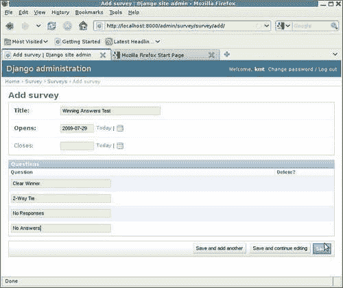
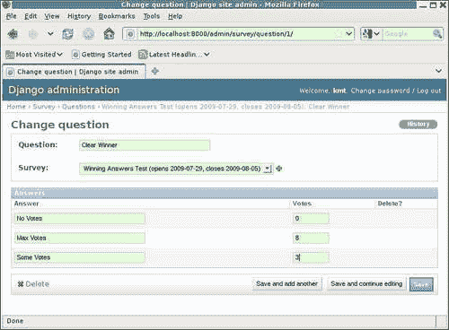
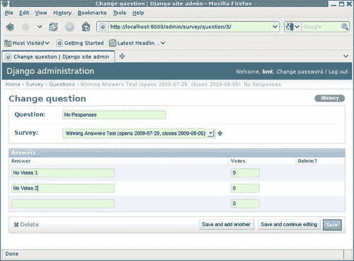

# 三、测试 123：基本单元测试

在上一章中，我们通过为`Survey`模型编写一些 doctest 开始学习测试 Django 应用程序。在这个过程中，我们体验了博士的一些优点和缺点。在讨论一些缺点时，提到单元测试是一种替代测试方法，可以避免一些 doctest 陷阱。在本章中，我们将开始详细了解单元测试。具体而言，我们将：

*   将`Survey`doctests 重新实现为单元测试
*   评估等效单元测试版本与 doctest 在易实现性和易受上一章讨论的 doctest 警告影响方面的比较
*   开始学习单元测试的一些附加功能，扩展现有测试以覆盖附加功能

# 测量保存覆盖方法的单元测试

回想上一章，我们最终对`Survey`保存覆盖功能进行了四次单独测试：

*   对新增功能的直接测试，验证如果在创建`Survey`时未指定`closes`，则自动设置为`opens`后一周
*   如果在创建过程中明确指定了`closes`，则验证不执行此自动设置操作的测试
*   验证`closes`只有在初始创建时，而不是在保存现有实例时，其值丢失时才自动设置的测试
*   验证`save`覆盖功能在创建期间未指定`opens`或`closes`的错误情况下不会引入意外异常的测试

要将这些作为单元测试而不是 doctest 来实现，请在`suvery/tests.py`文件中创建一个`TestCase`，替换样本`SimpleTest`。在新的`TestCase`类中，将每个单独的测试定义为`TestCase`中的单独测试方法，如下所示：

```py
import datetime
from django.test import TestCase 
from django.db import IntegrityError 
from survey.models import Survey 

class SurveySaveTest(TestCase): 
    t = "New Year's Resolutions" 
    sd = datetime.date(2009, 12, 28) 

    def testClosesAutoset(self): 
        s = Survey.objects.create(title=self.t, opens=self.sd) 
        self.assertEqual(s.closes, datetime.date(2010, 1, 4))

    def testClosesHonored(self):
        s = Survey.objects.create(title=self.t, opens=self.sd, closes=self.sd) 
        self.assertEqual(s.closes, self.sd) 

    def testClosesReset(self): 
        s = Survey.objects.create(title=self.t, opens=self.sd) 
        s.closes = None 
        self.assertRaises(IntegrityError, s.save) 

    def testTitleOnly(self): 
        self.assertRaises(IntegrityError, Survey.objects.create, title=self.t) 
```

这比 doctest 版本更难实现，不是吗？不可能直接从 shell 会话中剪切和粘贴，并且有相当数量的代码开销代码没有出现在 shell 会话中需要添加的任何地方。我们仍然可以使用 shell 会话中的剪切和粘贴作为起点，但粘贴后必须编辑代码，以便将粘贴的代码转换为适当的单元测试。虽然不难，但这可能是乏味的。

大部分额外工作包括为单个测试方法选择名称，对剪切和粘贴的代码进行少量编辑以正确引用类变量，如`t`和`sd`，并创建适当的测试断言以验证预期结果。其中第一个需要最多的脑力（选择好名字可能很难），第二个很琐碎，第三个相当机械。例如，在 shell 会话中，我们有：

```py
>>> s.closes 
datetime.date(2010, 1, 4) 
>>> 

```

在单元测试中，我们有一个`assertEqual`：

```py
self.assertEqual(s.closes, datetime.date(2010, 1, 4))
```

预期的异常类似，但使用`assertRaises`。例如，在 shell 会话中，我们有：

```py
>>> s = Survey.objects.create(title=t) 
Traceback (most recent call last): 
 [ traceback details snipped ]
IntegrityError: survey_survey.opens may not be NULL 
>>> 

```

在单元测试中，这是：

```py
self.assertRaises(IntegrityError, Survey.objects.create, title=self.t)
```

注意，我们实际上并没有在单元测试代码中调用`create`例程，而是将其留给`assertRaises`中的代码。传递给`assertRaises`的第一个参数是预期的异常，后面是预期引发异常的可调用参数，后面是调用时需要传递给可调用参数的任何参数。

## 单元测试版本的优点

我们从这些额外的工作中得到了什么？当以最高的详细级别运行时，我们立即从测试运行者那里获得更多的反馈。对于 doctest 版本，`manage.py test survey -v2`的输出为：

```py
Doctest: survey.models.Survey.save ... ok 
```

对于单元测试版本，我们得到每个测试方法的单独结果报告：

```py
testClosesAutoset (survey.tests.SurveySaveTest) ... ok 
testClosesHonored (survey.tests.SurveySaveTest) ... ok 
testClosesReset (survey.tests.SurveySaveTest) ... ok 
testTitleOnly (survey.tests.SurveySaveTest) ... ok 

```

如果我们付出更多的努力，为我们的测试方法提供单行 docstring，我们可以从测试运行程序获得更多的描述性结果。例如，如果我们像这样添加 docstring：

```py
class SurveySaveTest(TestCase): 
    """Tests for the Survey save override method""" 
    t = "New Year's Resolutions" 
    sd = datetime.date(2009, 12, 28) 

    def testClosesAutoset(self): 
        """Verify closes is autoset correctly""" 
        s = Survey.objects.create(title=self.t, opens=self.sd) 
        self.assertEqual(s.closes, datetime.date(2010, 1, 4)) 

    def testClosesHonored(self): 
        """Verify closes is honored if specified""" 
        s = Survey.objects.create(title=self.t, opens=self.sd, closes=self.sd) 
        self.assertEqual(s.closes, self.sd)

    def testClosesReset(self): 
        """Verify closes is only autoset during initial create""" 
        s = Survey.objects.create(title=self.t, opens=self.sd) 
        s.closes = None 
        self.assertRaises(IntegrityError, s.save) 

    def testTitleOnly(self): 
        """Verify correct exception is raised in error case""" 
        self.assertRaises(IntegrityError, Survey.objects.create, title=self.t) 
```

然后，此测试的测试运行程序输出将为：

```py
Verify closes is autoset correctly ... ok 
Verify closes is honored if specified ... ok 
Verify closes is only autoset during initial create ... ok 
Verify correct exception is raised in error case ... ok 

```

当所有测试都通过时，这个额外的描述细节可能不那么重要，但是当它们失败时，它可以非常有助于提示测试试图完成什么。

例如，假设我们已经破坏了`save`覆盖方法，忽略了在`opens`中添加七天，因此如果没有指定`closes`，它将自动设置为与`opens`相同的值。对于 doctest 版本的测试，失败将报告为：

```py
====================================================================== 
FAIL: Doctest: survey.models.Survey.save 
---------------------------------------------------------------------- 
Traceback (most recent call last): 
 File "/usr/lib/python2.5/site-packages/django/test/_doctest.py", line 2180, in runTest 
 raise self.failureException(self.format_failure(new.getvalue())) 
AssertionError: Failed doctest test for survey.models.Survey.save 
 File "/dj_projects/marketr/survey/models.py", line 10, in save 

---------------------------------------------------------------------- 
File "/dj_projects/marketr/survey/models.py", line 19, in survey.models.Survey.save 
Failed example: 
 s.closes 
Expected: 
 datetime.date(2010, 1, 4) 
Got: 
 datetime.date(2009, 12, 28) 

```

这并没有提供太多关于什么地方出了问题的信息，您确实需要阅读完整的测试代码，以查看哪怕是正在测试的内容。单元测试报告的相同故障更具描述性，因为`FAIL`标题包含测试文档字符串，所以我们立即知道问题与`closes`被自动设置有关：

```py
====================================================================== 
FAIL: Verify closes is autoset correctly 
---------------------------------------------------------------------- 
Traceback (most recent call last): 
 File "/dj_projects/marketr/survey/tests.py", line 20, in testClosesAutoset 
 self.assertEqual(s.closes, datetime.date(2010, 1, 4)) 
AssertionError: datetime.date(2009, 12, 28) != datetime.date(2010, 1, 4) 

```

我们可以更进一步，通过在调用`assertEqual`时指定我们自己的错误消息，使错误消息更友好一些：

```py
    def testClosesAutoset(self):
        """Verify closes is autoset correctly"""
        s = Survey.objects.create(title=self.t, opens=self.sd)
        self.assertEqual(s.closes, datetime.date(2010, 1, 4), 
            "closes not autoset to 7 days after opens, expected %s, ""actually %s" % 
            (datetime.date(2010, 1, 4), s.closes))
```

然后，报告的故障将是：

```py
====================================================================== 
FAIL: Verify closes is autoset correctly 
---------------------------------------------------------------------- 
Traceback (most recent call last): 
 File "/dj_projects/marketr/survey/tests.py", line 22, in testClosesAutoset 
 (datetime.date(2010, 1, 4), s.closes)) 
AssertionError: closes not autoset to 7 days after opens, expected 2010-01-04, actually 2009-12-28 

```

在这种情况下，自定义错误消息可能不会比默认错误消息更有用，因为`save`覆盖在这里应该做的事情非常简单。然而，对于更复杂的测试断言来说，这样的定制错误消息可能很有价值，有助于解释测试内容以及预期结果背后的“原因”。

单元测试的另一个好处是，它们允许比 doctest 更具选择性的测试执行。在`manage.py test`命令行上，一个或多个要执行的单元测试可以通过`TestCase`名称来标识。您甚至可以指定只运行`TestCase`中的特定方法。例如：

```py
python manage.py test survey.SurveySaveTest.testClosesAutoset 
```

这里我们指出，我们只希望在`survey`应用程序中找到的`SurveySaveTest`单元测试中运行`testClosesAutoset`测试方法。在开发测试时，能够只运行一个方法或一个测试用例是非常方便的省时方法。

## 单元测试版本的缺点

切换到单元测试有什么损失吗？一点。首先，已经提到了实现的容易性：单元测试比 doctest 需要更多的工作来实现。虽然这项工作通常不难，但也可能很乏味。它也是可能出错的工作，因此需要调试测试代码。这种增加的实现负担可能会阻碍编写全面的测试。

我们也失去了测试代码的优良特性。在上一章中提到，这是将一些 doctest 从 docstring 中移出并放入`tests.py`中的`__test__`字典的一个负面影响。单元测试的效果更糟，因为所有单元测试通常保存在与被测试代码分开的文件中。因此，在代码附近通常看不到测试，这可能会再次阻碍编写测试。对于单元测试，除非采用测试驱动开发之类的方法，否则“看不见，想不到”的效果很容易导致测试写作成为事后思考。

最后，我们丢失了 doctest 版本的内置文档。这不仅仅是从 docstring 自动生成文档的可能性。doctest 通常比单元测试更具可读性，在单元测试中，仅仅是测试开销的无关代码可能会掩盖测试的意图。但是请注意，使用单元测试并不意味着您必须扔掉 doctest；在应用程序中同时使用这两种测试是非常好的。每种测试都有各自的优势，因此对于许多项目来说，最好是将单元测试和博士测试很好地结合起来，而不是依赖于单一类型的测试。

# 重温医生的警告

在上一章中，我们列出了撰写博士论文时要注意的事项。在讨论这些问题时，有时会提到单元测试作为一种不存在相同问题的替代方法。但是，单元测试真的对这些问题免疫吗，还是它们只是使问题更容易避免或解决？在这一节中，我们将重新审视 DOCTREST 的注意事项，并考虑易受影响的单元测试是相同或相似的问题。

## 环境依赖性

讨论的第一个 doctest 警告是环境依赖性：依赖于代码的实现细节，而不是实际被测试的代码。尽管这种依赖性可以通过单元测试发生，但发生的可能性较小。这是因为这种类型的依赖进入 doctest 的一种非常常见的方式是依赖对象的打印表示，因为它们在 pythonshell 会话中显示。单元测试与 Python shell 相去甚远。在单元测试中获得对象的打印表示需要一些编码工作，因此这种形式的环境依赖性很少潜入单元测试。

[第 2 章](02.html "Chapter 2. Does This Code Work? Doctests in Depth")中提到的一种常见的环境依赖形式也影响单元测试，它涉及文件路径名。与 doctest 一样，单元测试也需要注意，当测试在不同于最初编写测试的操作系统上运行时，不同操作系统的文件路径名约定的差异不会导致虚假的测试失败。因此，尽管单元测试不太容易出现环境依赖性的问题，但它们并不能完全免疫。

## 数据库依赖性

数据库依赖是环境依赖的一种特殊形式，Django 应用程序尤其容易遇到这种依赖。在 doctests 中，我们看到测试的初始实现取决于伴随着`IntegrityError`的消息的细节。为了使 doctest 在多个不同的数据库上传递，我们需要修改初始测试以忽略此消息的细节。

单元测试版本没有同样的问题。用于检查预期异常的 AUTT0T 已经不考虑异常消息详细信息。例如：

```py
self.assertRaises(IntegrityError, s.save)
```

这里没有包含任何消息细节，所以我们不需要做任何事情来忽略来自不同数据库实现的消息的差异。

此外，单元测试比消息细节更容易处理更广泛的差异。上一章提到，对于 MySQL 的某些配置，忽略消息细节不足以允许所有测试通过。这里有一个问题的测试是确保在初始模型创建期间仅自动设置`closes`。此测试的单元测试版本为：

```py
def testClosesReset(self): 
    """Verify closes is only autoset during initial create""" 
    s = Survey.objects.create(title=self.t, opens=self.sd) 
    s.closes = None 
    self.assertRaises(IntegrityError, s.save) 
```

如果在以非严格模式运行的 MySQL 服务器上运行，则此测试将失败。在这种模式下，MySQL 不会在试图更新一行以在声明为`NOT NULL`的列中包含`NULL`值时引发`IntegrityError`。而是将该值设置为隐式默认值，并发出警告。因此，当我们在配置为以非严格模式运行的 MySQL 服务器上运行此测试时，我们会看到一个测试错误：

```py
====================================================================== 
ERROR: Verify closes is only autoset during initial create 
---------------------------------------------------------------------- 
Traceback (most recent call last): 
 File "/dj_projects/marketr/survey/tests.py", line 35, in testClosesReset 
 self.assertRaises(IntegrityError, s.save) 
 File "/usr/lib/python2.5/unittest.py", line 320, in failUnlessRaises 
 callableObj(*args, **kwargs) 
 File "/dj_projects/marketr/survey/models.py", line 38, in save 
 super(Survey, self).save(**kwargs) 
 File "/usr/lib/python2.5/site-packages/django/db/models/base.py", line 410, in save 
 self.save_base(force_insert=force_insert, force_update=force_update) 
 File "/usr/lib/python2.5/site-packages/django/db/models/base.py", line 474, in save_base 
 rows = manager.filter(pk=pk_val)._update(values) 
 File "/usr/lib/python2.5/site-packages/django/db/models/query.py", line 444, in _update 
 return query.execute_sql(None) 
 File "/usr/lib/python2.5/site-packages/django/db/models/sql/subqueries.py", line 120, in execute_sql 
 cursor = super(UpdateQuery, self).execute_sql(result_type) 
 File "/usr/lib/python2.5/site-packages/django/db/models/sql/query.py", line 2369, in execute_sql 
 cursor.execute(sql, params) 
 File "/usr/lib/python2.5/site-packages/django/db/backends/mysql/base.py", line 84, in execute 
 return self.cursor.execute(query, args) 
 File "/var/lib/python-support/python2.5/MySQLdb/cursors.py", line 168, in execute 
 if not self._defer_warnings: self._warning_check() 
 File "/var/lib/python-support/python2.5/MySQLdb/cursors.py", line 82, in _warning_check 
 warn(w[-1], self.Warning, 3) 
 File "/usr/lib/python2.5/warnings.py", line 62, in warn 
 globals) 
 File "/usr/lib/python2.5/warnings.py", line 102, in warn_explicit 
 raise message 
Warning: Column 'closes' cannot be null 

```

这里我们看到 MySQL 发出的警告导致一个简单的`Exception`被触发，而不是`IntegrityError`，因此测试报告了一个错误。

这里还需要考虑另外一个问题：当 MySQL 发出警告时，引发 Dyango AutoT1 的设置依赖于提高一个参数 T0。MySQL 警告只有在`DEBUG`为`True`时才会变为引发的`Exceptions`（与之前的运行测试一样）。如果我们在`settings.py`中将`DEBUG`设置为`False`，我们会看到不同形式的测试失败：

```py
====================================================================== 
FAIL: Verify closes is only autoset during initial create 
---------------------------------------------------------------------- 
Traceback (most recent call last): 
 File "/dj_projects/marketr/survey/tests.py", line 35, in testClosesReset 
 self.assertRaises(IntegrityError, s.save) 
AssertionError: IntegrityError not raised 

```

在这种情况下，MySQL 允许保存，并且由于`DEBUG`没有打开，Django 没有将 MySQL 发出的警告转换为`Exception`，因此保存简单有效。

在这一点上，我们可能会严肃地质疑，鉴于观察到的行为大相径庭，在所有这些不同的情况下，让这个测试正常运行是否值得。也许我们应该要求，如果代码在 MySQL 上运行，那么服务器必须配置为在严格模式下运行。然后测试就可以了，因为之前的故障都会表明服务器配置有问题。然而，让我们假设我们确实需要支持在 MySQL 上运行，但是我们不能对 MySQL 强加任何特定的配置要求，并且我们仍然需要验证我们的代码在这个测试中是否正常运行。我们怎么做？

请注意，我们在本测试中试图验证的是，如果在初始创建后将`closes`重置为`None`，我们的代码在保存期间不会自动将`closes`设置为某个值。起初，这似乎是很容易做到的，只要检查一次尝试保存时的`IntegrityError`。然而，我们发现了一个数据库配置，其中没有一个`IntegrityError`。此外，根据`DEBUG`设置，我们可能根本不会报告任何错误，即使我们的代码行为正常，并在尝试保存期间将`closes`设置为`None`。我们是否可以编写测试，以便它报告正确的结果，也就是说，我们的代码在所有这些情况下是否正常工作？

答案是肯定的，只要我们能在测试代码中确定使用了什么数据库，它是如何配置的，以及`DEBUG`设置是什么。然后，我们需要做的就是根据测试运行的环境更改预期结果。事实上，我们可以通过一些工作来测试所有这些东西：

```py
    def testClosesReset(self): 
        """Verify closes is only autoset during initial create""" 
        s = Survey.objects.create(title=self.t, opens=self.sd) 
        s.closes = None 

        strict = True 
        debug = False
        from django.conf import settings 
        if settings.DATABASE_ENGINE == 'mysql': 
            from django.db import connection 
            c = connection.cursor() 
            c.execute('SELECT @@SESSION.sql_mode') 
            mode = c.fetchone()[0] 
            if 'STRICT' not in mode: 
                strict = False; 
                from django.utils import importlib
                debug = importlib.import_module(settings.SETTINGS_MODULE).DEBUG

        if strict: 
            self.assertRaises(IntegrityError, s.save) 
        elif debug: 
            self.assertRaises(Exception, s.save) 
        else: 
            s.save() 
            self.assertEqual(s.closes, None) 
```

测试代码首先假设我们在严格模式下运行的数据库上运行，并将局部变量`strict`设置为`True`。我们还假设`DEBUG`是`False`，并设置一个局部变量来反映这一点。然后，如果使用的数据库是 MySQL（通过检查`settings.DATABASE_ENGINE`的值来确定），我们需要进行进一步的检查，看看它是如何配置的。查阅 MySQL 文档表明，实现这一点的方法是使用`SELECT`会话的`sql_mode`变量。如果返回的值包含字符串`STRICT`，则 MySQL 是在严格模式下运行的，否则不是。我们发出这个查询并使用 Django 对向数据库发送原始 SQL 的支持来获得结果。如果我们确定 MySQL 没有配置为在严格模式下运行，我们将局部变量`strict`更新为`False`。

如果我们将 strict 设置为`False`，也就是设置中的`DEBUG`值变得重要的时候，因为在这种情况下 MySQL 将发出警告，而不是针对我们正在测试的情况发出`IntegrityError`。如果设置文件中的`DEBUG`为`True`，那么 Django 的 MySQL 后端会将 MySQL 发出的警告转换为`Exceptions`。这是由后端使用 Python 的`warnings`模块完成的。加载后端时，如果`DEBUG`为`True`，则发出`warnings.filterwarnings`调用，强制将所有数据库警告转换为`Exceptions`。

不幸的是，在加载数据库后端之后的某个时刻，在我们的测试代码运行之前，测试运行程序将更改内存中的设置，以便将`DEBUG`设置为`False`。这样做是为了使测试代码的行为与生产中发生的情况尽可能匹配。但是，这意味着我们不能在测试期间测试`settings.DEBUG`的值，以查看加载数据库后端时`DEBUG`是否为`True`。相反，我们必须重新加载设置模块并检查新加载版本中的值。我们使用`django.utils.importlib`的`import_module`函数（这是 Python2.7 中的一个函数，Django 1.1 使用了它的后端口）。

最后，我们知道在运行测试代码时要查找什么。如果我们已经确定正在运行严格模式下运行的数据库，那么我们断言，如果试图将`closes`设置为`None`来保存我们的模型实例，则会引发`IntegrityError`。否则，如果我们在非严格模式下运行，但设置文件中的`DEBUG`为`True`，则尝试保存时应引发`Exception`。否则保存应该可以工作，我们通过确保保存模型实例后仍将`closes`设置为`None`来测试代码的正确行为。

对于一个非常小的测试来说，所有这些看起来都是相当麻烦的，但它说明了如何编写单元测试来适应不同环境中预期行为的显著差异。对 doctest 版本执行同样的操作并不是那么简单。因此，虽然单元测试显然不能消除测试中处理数据库依赖性的问题，但它们使编写解释这些差异的测试变得更容易。

## 测试相互依赖性

上一章中遇到的下一个 doctest 警告是测试相互依赖性。在 PostgreSQL 上运行 DOCTEST 时，在第一个故意触发数据库错误的测试之后的测试中遇到了一个错误，因为该错误导致数据库连接进入一种状态，除了终止事务的命令外，它将不再接受其他命令。解决方法是记住在故意触发的错误之后“清理”，在导致此类错误的任何测试步骤之后包括事务回滚。

Django 单元测试不会遇到这个问题。Django 测试用例类`django.test.TestCase`确保在调用每个测试方法之前将数据库重置为干净状态。因此，即使`testClosesReset`方法通过尝试触发`IntegrityError`的模型保存来结束，下一个运行的测试方法也不会出现错误，因为在此期间数据库连接会被`django.test.TestCase`代码重置。也不仅仅是这种错误情况得到了解决。在运行下一个方法之前，测试用例方法添加、删除或修改的任何数据库行都将重置为其原始状态。（注意，在大多数数据库上，测试运行程序可以使用事务回滚调用来非常有效地完成这一任务。）因此，Django 单元测试方法与之前运行的测试可能执行的任何数据库更改完全隔离。

## Unicode

上一章讨论的最后一个 doctest 警告涉及在 doctest 中使用 Unicode 文本。由于 Python 中与 Unicode Docstring 和 Docstring 中的 Unicode 文本相关的潜在开放性问题，观察到这些文件无法正常工作。

单元测试没有这个问题。对`Survey`模型`__unicode__`方法的行为进行简单的单元测试：

```py
class SurveyUnicodeTest(TestCase): 
    def testUnicode(self): 
        t = u'¿Como está usted?' 
        sd = datetime.date(2009, 12, 28) 
        s = Survey.objects.create(title=t, opens=sd) 
        self.assertEqual(unicode(s), u'¿Como está usted? (opens 2009-12-28, closes 2010-01-04)') 
```

请注意，有必要将编码声明添加到`survey/tests.py`的顶部，就像我们在上一章中对`survey/models.py`所做的那样，但不必按照需要在 doctest 版本中对 bytestring 文本进行任何手动解码来构造 Unicode 对象。我们只需要像平常一样设置变量，创建`Survey`实例，并断言在该实例上调用`unicode`的结果产生我们期望的字符串。因此，当使用单元测试时，使用非 ASCII 数据进行测试比使用 doctest 进行测试要简单得多。

# 为单元测试提供数据

除了没有 doctest 的一些缺点之外，单元测试还为 Django 应用程序提供了一些额外的有用特性。这些特性之一是能够在测试运行之前用测试数据加载数据库。有几种不同的方法可以做到这一点；以下各节将详细讨论每种方法。

## 在测试夹具中提供数据

为单元测试提供测试数据的第一种方法是从称为 fixture 的文件中加载它们。我们将首先开发一个示例测试，该测试可以从预加载的测试数据中获益，然后展示如何创建 fixture 文件，最后描述如何确保 fixture 文件作为测试的一部分加载。

### 需要测试数据的示例测试

在开始详细介绍如何使用预加载的数据提供测试之前，有一个可以使用此功能的测试示例会有所帮助。到目前为止，我们的简单测试非常容易通过，只需在测试过程中创建所需的数据。然而，当我们开始测试更高级的功能时，我们很快就会遇到这样的情况，即测试本身必须创建好的测试所需的所有数据，这将成为一项负担。

例如，考虑 ART T0E.模型：

```py
 class Question(models.Model): 
    question = models.CharField(max_length=200) 
    survey = models.ForeignKey(Survey) 

    def __unicode__(self): 
        return u'%s: %s' % (self.survey, self.question) 
```

（请注意，我们在该模型中添加了一个`__unicode__`方法。这将在本章稍后开始使用管理界面创建一些调查应用程序数据时派上用场。）

回想一下，给定`Question`实例的允许答案存储在单独的模型`Answer`中，该模型使用`ForeignKey`链接到`Question`：

```py
class Answer(models.Model): 
    answer = models.CharField(max_length=200) 
    question = models.ForeignKey(Question) 
    votes = models.IntegerField(default=0) 
```

这个`Answer`模型还在`votes`字段中跟踪每个答案被选择的次数。（我们还没有在这个模型中添加`__unicode__`方法，因为考虑到我们在本章后面将配置 admin 的方式，现在还不需要它。）

现在，在分析调查结果时，我们想知道的一件事是，某个给定的`Question`最常被选择的`Answers`。也就是说，`Question`模型需要支持的功能之一是返回`Question`的“获胜答案”。如果我们稍微考虑一下，我们就会意识到可能没有一个单一的胜利答案。多个答案获得相同票数可能会出现平局。因此，这个获胜的答案方法应该足够灵活，可以返回多个答案。类似地，如果没有人回答这个问题，最好是不返回获奖答案，而不是返回一整套被允许的答案，因为所有答案都没有被选中。因为这个方法（我们称之为`winning_answers`可能返回零、一个或多个结果，所以为了保持一致性，最好总是返回类似列表的结果。

在开始实现这个函数之前，我们已经了解了它需要处理的不同情况，以及在开发函数本身和测试函数时，什么样的测试数据是有用的。这一常规的良好测试需要至少三个不同的问题，每个问题都有一套答案：

*   有一个问题的答案中有一个明显的赢家，那就是一个答案的票数比所有其他答案都多，因此`winning_answers`只返回一个答案
*   一个在答案之间有联系的问题，`winning_answers`返回多个答案
*   一个根本得不到回答的问题，因此`winning_answers`不会返回任何答案

此外，我们应该使用一个没有答案的`Question`进行测试。当然，这是一个边缘情况，但我们应该确保`winning_answers`功能正常运行，即使数据似乎还没有完全设置为分析哪个答案最受欢迎。所以，测试数据中应该有四个问题，三个有一组答案，一个没有答案。

### 使用管理应用程序创建测试数据

在一个 shell 会话甚至一个程序中创建四个问题，三个问题有几个答案，这是非常乏味的，所以让我们使用 Django 管理应用程序来代替。在第一章中，我们将`django.contrib.admin`包含在`INSTALLED_APPS`中，因此它已经加载。另外，当我们运行`manage.py syncdb`时，创建了管理所需的表。然而，我们仍然需要在我们的`urls.py`文件中取消对管理相关行的注释。当我们这样做时`urls.py`应该是这样的：

```py
from django.conf.urls.defaults import * 

# Uncomment the next two lines to enable the admin: 
from django.contrib import admin 
admin.autodiscover() 

urlpatterns = patterns('', 
    # Example: 
    # (r'^marketr/', include('marketr.foo.urls')), 

    # Uncomment the admin/doc line below and add # 'django.contrib.admindocs' 
    # to INSTALLED_APPS to enable admin documentation: 
    # (r'^admin/doc/', include('django.contrib.admindocs.urls')), 

    # Uncomment the next line to enable the admin: 
    (r'^admin/', include(admin.site.urls)), 
) 
```

最后，我们需要为我们的调查应用程序模型提供一些管理定义，并将它们注册到管理应用程序中，以便我们可以在管理应用程序中编辑我们的模型。因此，我们需要创建一个如下所示的`survey/admin.py`文件：

```py
from django.contrib import admin 
from survey.models import Survey, Question, Answer 

class QuestionsInline(admin.TabularInline): 
    model = Question 
    extra = 4

class AnswersInline(admin.TabularInline): 
    model = Answer 

class SurveyAdmin(admin.ModelAdmin): 
    inlines = [QuestionsInline] 

class QuestionAdmin(admin.ModelAdmin): 
    inlines = [AnswersInline] 

admin.site.register(Survey, SurveyAdmin) 
admin.site.register(Question, QuestionAdmin) 
```

在这里，我们对所有内容都使用了管理默认值，除了我们定义并指定了一些管理内联类，以便更容易在一个页面上编辑多个内容。我们在这里设置内联线的方式允许我们在与它们所属的`Survey`相同的页面上编辑`Questions`，并且类似地在与它们相关联的`Questions`相同的页面上编辑`Answers`。我们还指定，当它们内联显示时，我们需要四个额外的空`Questions`。这个值的默认值是 3，但是我们知道我们想要设置四个问题，我们也可以设置一些东西，以便一次添加所有四个问题。

现在，我们可以通过在命令提示符下运行`python manage.py runserver`来启动开发服务器，并通过在同一台机器上的浏览器导航到`http://localhost:8000/admin/`来访问管理应用程序。在以我们在第一章中创建的超级用户身份登录之后，我们将看到管理主页面。在那里，我们可以点击链接添加一个`Survey`。**添加调查**页面将允许我们使用四个`Questions`创建调查：



在这里，我们分配了我们的`Question`实例`question`值，这些值与其说是问题，不如说是指示我们将使用每个实例来测试什么。请注意，本页还反映了对`Survey`型号的轻微更改：`blank=True`已添加到`closes`现场规范中。如果没有此更改，管理员将要求在此处为`closes`指定一个值。通过此更改，admin 应用程序允许该字段留空，以便可以使用 save override 方法完成的自动分配。

保存此调查后，我们可以导航到第一个问题**Clear Winner**的更改页面，并添加一些答案：



对于我们，我们将**明确获胜者**问题设置为一个答案（**最大票数**），该答案的票数高于所有其他答案。同样，我们可以设置**双向平局**问题，使两个答案的票数相同：


最后，我们设置了**无响应**的答案，以便我们可以测试 a`Question`的答案没有获得任何投票的情况：



我们不需要对**无答案**问题做任何进一步的处理，因为这一问题将用于测试问题答案集为空的情况，就像第一次创建时一样。

## 编写函数本身

现在我们已经用测试数据建立了数据库，我们可以用实现`winning_answers`功能的最佳方式在 shell 中进行实验。因此，我们可能会得出如下结论：

```py
from django.db.models import Max

class Question(models.Model): 
    question = models.CharField(max_length=200) 
    survey = models.ForeignKey(Survey) 
    def winning_answers(self): 
       rv = [] 
       max_votes = self.answer_set.aggregate(Max('votes')).values()[0] 
       if max_votes and max_votes > 0: 
           rv = self.answer_set.filter(votes=max_votes) 
       return rv 
```

方法首先将局部变量`rv`（返回值）初始化为空列表。然后，它使用聚合`Max`函数检索与该`Question`实例关联的`Answer`实例集中存在的`votes`的最大值。为了得到答案，一行代码做了几件事，因此可能需要更多的解释。要了解其工作原理，请查看在 shell 会话中每个片段依次返回的内容：

```py
>>> from survey.models import Question 
>>> q = Question.objects.get(question='Clear Winner') 
>>> from django.db.models import Max 
>>> q.answer_set.aggregate(Max('votes')) 
{'votes__max': 8} 

```

这里我们看到，将聚合函数`Max`应用于与给定`Question`关联的`answer_set`的`votes`字段，返回一个包含单个键值对的字典。我们只对值感兴趣，所以我们只使用`.values()`从字典中检索值：

```py
>>> q.answer_set.aggregate(Max('votes')).values() 
[8] 

```

但是，`values()`返回一个列表，我们需要列表中的单个项目，因此我们通过请求列表中索引为零的项目来检索它：

```py
>>> q.answer_set.aggregate(Max('votes')).values()[0] 
8 

```

接下来，代码测试`max_votes`是否存在，以及它是否大于零（至少选择了一个答案）。如果是这样，`rv`被重置为只过滤到那些拥有最大投票数的答案集。

但是`max_votes`什么时候不存在，因为它只是在前一行中设置的？这可能发生在没有答案链接到问题的边缘情况下。在这种情况下，聚合`Max`函数将返回`None`的最大票数值，而不是零：

```py
>>> q = Question.objects.get(question='No Answers') 
>>> q.answer_set.aggregate(Max('votes')) 
{'votes__max': None} 

```

因此，在这种边缘情况下，`max_votes`可能被设置为`None`，因此最好对此进行测试，避免试图将`None`与`0`进行比较。虽然在 Python2.x 中，这种比较实际上会起作用并返回一个合理的答案（`None`不大于`0`），但尝试的比较将返回一个以 Python3.0 开头的`TypeError`。现在避免这种比较是明智的，这样可以在需要移植代码以在 Python3 下运行时限制问题。

最后，函数返回`rv`，此时希望设置为正确的值。（是的，这个函数中有一个 bug。偶尔编写捕捉 bug 的测试更有趣。）

### 编写使用测试数据的测试

现在我们已经有了`winning_answers`的实现，以及测试它的数据，我们可以开始编写`winning_answers`方法的测试了。我们可以先在`tests.py`中添加以下测试，测试答案中有明确胜利者的情况：

```py
from survey.models import Question
class QuestionWinningAnswersTest(TestCase): 
    def testClearWinner(self): 
        q = Question.objects.get(question='Clear Winner') 
        wa_qs = q.winning_answers() 
        self.assertEqual(wa_qs.count(), 1) 
        winner = wa_qs[0] 
        self.assertEqual(winner.answer, 'Max Votes') 
```

测试首先检索其`question`值设置为`'Clear Winner'`的`Question`。然后，它在该`Question`实例上调用`winning_answers`来检索获得最多票数的问题的答案查询集。因为这个问题应该只有一个获胜者，所以测试断言返回的查询集中有一个元素。然后，它通过检索获胜答案本身并验证其答案值为`'Max Votes'`来进行进一步检查。如果所有这些都成功了，我们可以非常确定`winning_answers`在答案中只有一个“赢家”的情况下返回正确的结果。

### 从数据库中提取测试数据

现在，我们如何对通过管理应用程序加载到数据库中的测试数据运行该测试？当我们运行测试时，他们不会使用我们的生产数据库，而是创建并使用一个最初为空的测试数据库。这就是固定装置的用途。fixture 只是包含可以加载到数据库中的数据的文件。

然后，第一个任务是将加载到生产数据库中的测试数据提取到夹具文件中。我们可以通过使用`manage.py dumpdata`命令来实现这一点：

```py
python manage.py dumpdata survey --indent 4 >test_winning_answers.json

```

除了`dumpdata`命令本身之外，这里指定的各种内容包括：

*   `survey`：这将转储的数据限制在调查应用程序中。默认情况下，`dumpdata`将输出所有已安装应用程序的数据，但 Wing answers 测试不需要来自除 survey 之外的任何应用程序的数据，因此我们可以将 fixture 文件限制为仅包含 survey 应用程序的数据。
*   `--indent 4`：这使得数据输出更易于阅读和编辑。默认情况下，`dumpdata`将在一行上输出所有数据，如果您需要检查或编辑结果，则很难处理这些数据。指定`indent 4`使`dumpdata`将数据格式化为多行，四个空格缩进使结构层次清晰。（您可以为缩进值指定您喜欢的任何数字，它不必是`4`
*   `>test_winning_answers.json`：将命令的输出重定向到文件。`dumpdata`的默认输出格式是 JSON，因此我们使用`.json`作为文件扩展名，以便在加载夹具时正确解释其格式。

当`dumpdata`完成时，我们将有一个`test_winning_answers.json`文件，其中包含测试数据的序列化版本。除了将其作为测试的一部分加载（将在下面介绍）之外，我们还可以如何处理这个或任何 fixture 文件？

首先，我们可以使用`manage.py loaddata`命令加载夹具。因此`dumpdata`和`loaddata`共同提供了一种将数据从一个数据库移动到另一个数据库的方法。其次，我们可能有或编写程序以某种方式处理序列化数据：有时对平面文件中包含的数据而不是数据库中包含的数据执行分析会更容易。最后，`manage.py testserver`命令支持将 fixture（在命令行上指定）加载到测试数据库中，然后运行开发服务器。如果您希望在给定此测试数据的情况下试验真实服务器的行为，而不是仅限于为使用数据而编写的测试的结果，那么这将非常有用。

### 获取试运行期间加载的测试数据

回到我们手头的任务：我们如何在运行测试时加载刚刚创建的这个装置？一个简单的方法是将其重命名为`initial_data.json`并将其放置在我们的调查应用程序目录的`fixtures`子目录中。如果我们这样做并运行测试，我们将看到 fixture 文件已加载，并且 clear winner 案例的测试成功运行：

```py
kmt@lbox:/dj_projects/marketr$ python manage.py test survey 
Creating test database... 
Creating table auth_permission 
Creating table auth_group 
Creating table auth_user 
Creating table auth_message 
Creating table django_content_type 
Creating table django_session 
Creating table django_site 
Creating table django_admin_log 
Creating table survey_survey 
Creating table survey_question 
Creating table survey_answer 
Installing index for auth.Permission model 
Installing index for auth.Message model 
Installing index for admin.LogEntry model 
Installing index for survey.Question model 
Installing index for survey.Answer model 
Installing json fixture 'initial_data' from '/dj_projects/marketr/survey/fixtures'. 
Installed 13 object(s) from 1 fixture(s) 
......... 
---------------------------------------------------------------------- 
Ran 9 tests in 0.079s 

OK 
Destroying test database... 

```

但是，这并不是加载此特定夹具数据的正确方法。初始数据固定装置用于固定的应用程序数据，这些数据应始终作为应用程序的一部分存在，并且这些数据不属于该类别。相反，它是特定于此特定测试的，并且只需要为此测试加载。为此，请将其与原始名称`test_winning_answers.json`一起放入`survey/fixtures`目录中。然后，通过在测试用例的`fixtures`类属性中包含文件名，更新测试用例代码，以指定应为此测试加载此夹具：

```py
class QuestionWinningAnswersTest(TestCase): 

    fixtures = ['test_winning_answers.json'] 

    def testClearWinner(self): 
        q = Question.objects.get(question='Clear Winner') 
        wa_qs = q.winning_answers() 
        self.assertEqual(wa_qs.count(), 1) 
        winner = wa_qs[0] 
        self.assertEqual(winner.answer, 'Max Votes') 
```

请注意，至少从 Django 1.1 开始，`manage.py test`没有像加载初始数据装置那样，为加载以这种方式指定的测试装置提供太多反馈。在前面的测试输出中，夹具作为初始数据加载，其中有关于加载初始数据夹具和安装 13 个对象的消息。当夹具作为`TestCase`的一部分加载时，没有类似的消息。

此外，如果您在`TestCase fixtures`值中指定了错误的文件名，则不会出现错误指示。例如，如果您错误地将`test_winning_answers`的结尾`s`关闭，则问题的唯一迹象将是测试用例失败：

```py
kmt@lbox:/dj_projects/marketr$ python manage.py test survey 
Creating test database... 
Creating table auth_permission 
Creating table auth_group 
Creating table auth_user 
Creating table auth_message 
Creating table django_content_type 
Creating table django_session 
Creating table django_site 
Creating table django_admin_log 
Creating table survey_survey 
Creating table survey_question 
Creating table survey_answer 
Installing index for auth.Permission model 
Installing index for auth.Message model 
Installing index for admin.LogEntry model 
Installing index for survey.Question model 
Installing index for survey.Answer model 
E........ 
====================================================================== 
ERROR: testClearWinner (survey.tests.QuestionWinningAnswersTest) 
---------------------------------------------------------------------- 
Traceback (most recent call last): 
 File "/dj_projects/marketr/survey/tests.py", line 67, in testClearWinner 
 q = Question.objects.get(question='Clear Winner') 
 File "/usr/lib/python2.5/site-packages/django/db/models/manager.py", line 120, in get 
 return self.get_query_set().get(*args, **kwargs) 
 File "/usr/lib/python2.5/site-packages/django/db/models/query.py", line 305, in get 
 % self.model._meta.object_name) 
DoesNotExist: Question matching query does not exist. 

---------------------------------------------------------------------- 
Ran 9 tests in 0.066s 

FAILED (errors=1) 
Destroying test database... 

```

将来可能会改进针对该错误案例提供的诊断，但同时最好记住，像上面的`DoesNotExist`这样的神秘错误可能是由于未加载适当的测试夹具，而不是测试代码或测试代码中的某些错误。

现在我们已经加载了测试夹具，并且第一个测试方法工作正常，我们可以为另外三种情况添加测试：答案之间存在双向关联的情况、没有收到问题答案的情况，以及没有答案与问题关联的情况。这些可以写成与测试 clear winner 案例的现有方法非常相似：

```py
    def testTwoWayTie(self): 
        q = Question.objects.get(question='2-Way Tie') 
        wa_qs = q.winning_answers() 
        self.assertEqual(wa_qs.count(), 2) 
        for winner in wa_qs: 
            self.assert_(winner.answer.startswith('Max Votes')) 

    def testNoResponses(self): 
        q = Question.objects.get(question='No Responses') 
        wa_qs = q.winning_answers() 
        self.assertEqual(wa_qs.count(), 0) 

    def testNoAnswers(self): 
        q = Question.objects.get(question='No Answers') 
        wa_qs = q.winning_answers() 
        self.assertEqual(wa_qs.count(), 0) 
```

不同之处在于从数据库中检索到的`Questions`的名称，以及具体结果的测试方式。在`2-Way Tie`的情况下，测试验证`winning_answers`返回两个答案，并且两个答案的`answer`值均以`'Max Votes'`开头。在没有响应和答案的情况下，所有测试都必须验证`winning_answers`返回的查询集中没有项目。

如果我们现在运行测试，我们将发现前面提到的 bug，因为我们的前两个测试失败了：

```py
====================================================================== 
ERROR: testNoAnswers (survey.tests.QuestionWinningAnswersTest) 
---------------------------------------------------------------------- 
Traceback (most recent call last): 
 File "/dj_projects/marketr/survey/tests.py", line 88, in testNoAnswers 
 self.assertEqual(wa_qs.count(), 0) 
TypeError: count() takes exactly one argument (0 given) 

====================================================================== 
ERROR: testNoResponses (survey.tests.QuestionWinningAnswersTest) 
---------------------------------------------------------------------- 
Traceback (most recent call last): 
 File "/dj_projects/marketr/survey/tests.py", line 83, in testNoResponses 
 self.assertEqual(wa_qs.count(), 0) 
TypeError: count() takes exactly one argument (0 given) 

```

这里的问题是`winning_answers`返回的内容不一致：

```py
def winning_answers(self): 
    rv = [] 
    max_votes = self.answer_set.aggregate(Max('votes')).values()[0] 
    if max_votes and max_votes > 0: 
        rv = self.answer_set.filter(votes=max_votes) 
    return rv 
```

返回值`rv`初始化为函数第一行中的列表，但当在有收到投票的答案的情况下设置时，它被设置为来自`filter`调用的返回值，该调用返回一个`QuerySet`，而不是列表。由于测试方法使用的是`count()`，没有关于`winning_answers`返回值的参数，因此预期的是`QuerySet`。

`winning_answers`返回哪个更合适：列表还是`QuerySet`？可能是一个`QuerySet`。调用者可能只对集合中的答案计数感兴趣，而不是对特定答案感兴趣，因此可能不需要从数据库中检索实际答案。如果`winning_answers`始终返回列表，则必须强制从数据库中读取答案，以便将其放入列表中。因此，总是返回一个`QuerySet`并让调用者的需求决定最终需要从数据库中读取什么可能更有效。（考虑到我们在这个集合中期望的项目数量很少，这里可能没有什么效率，但在设计接口时，仍然是考虑这些事情的好习惯。）

固定`winning_answers`始终返回`QuerySet`的一种方式是使用`answer_set`应用的`none()`方法，该方法将返回空`QuerySet`：

```py
def winning_answers(self):
    max_votes = self.answer_set.aggregate(Max('votes')).values()[0] 
    if max_votes and max_votes > 0:
        rv = self.answer_set.filter(votes=max_votes)
    else:
        rv = self.answer_set.none()
    return rv
```

完成此更改后，完整的`QuestionWinningAnswersTest TestCase`将成功运行。

## 在测试设置期间创建数据

虽然测试夹具非常方便，但它们有时并不适合此项工作。具体地说，由于 fixture 文件包含所有模型数据的固定硬编码值，因此 fixture 有时对于所有测试都不够灵活。

作为一个例子，让我们返回到 AutoT0-模型，并考虑我们可能希望它支持的一些方法。回想一下，调查同时有`opens`和`closes`日期，因此在任何时间点，特定`Survey`实例都可能被视为“已完成”、“活动”或“即将进行”，具体取决于当前日期与调查的`opens`和`closes`日期的关系。方便地访问这些不同类别的调查将是有益的。Django 中支持这一点的典型方法是为`Survey`创建一个特殊的模型`Manager`，该模型实现返回经过适当过滤的查询集的方法。这样一个`Manager`可能是这样的：

```py
import datetime 
from django.db import models 

class SurveyManager(models.Manager): 
    def completed(self): 
        return self.filter(closes__lt=datetime.date.today()) 
    def active(self): 
        return self.filter(opens__lte=datetime.date.today()).\filter(closes__gte=datetime.date.today()) 
    def upcoming(self): 
        return self.filter(opens__gt=datetime.date.today()) 
```

此管理器实现三种方法：

*   `completed`：返回一个`Survey`的`QuerySet`值，只过滤到比今天更早的`closes`值。这些调查对任何其他答复都是封闭的。
*   `active`：返回一个`Survey`的`QuerySet`值，该值仅过滤为`opens`值早于或等于今天，且`closes`值晚于或等于今天的值。这些都是可以接受答复的调查。
*   `upcoming`：返回一个`Survey`的`QuerySet`值，只过滤到比今天晚的`opens`值。这些调查尚未开放供回应。

要使此自定义管理器成为`Survey`模型的默认值，请将其实例分配给`Survey objects`属性的值：

```py
 class Survey(models.Model):
    title = models.CharField(max_length=60)
    opens = models.DateField()
    closes = models.DateField(blank=True)

    objects = SurveyManager()
```

为什么使用夹具数据测试这些方法会有困难？问题的产生是因为这些方法依赖于今天的移动目标。测试`completed`实际上不是问题，因为我们可以用`closes`日期设置过去调查的测试数据，而这些`closes`日期将继续在过去，无论我们旅行的时间向前推进了多少。

然而，这对于`active`和`upcoming`来说是一个问题，因为最终，即使我们选择`closes`（对于`upcoming`、`opens`）日期在遥远的未来，今天的日期（除非发生大灾难）也会在某个时刻赶上那些遥远的未来日期。当这种情况发生时，测试将开始失败。现在，我们可能认为我们的软件不可能在那个遥远的未来继续运行。（或者我们可能只是希望我们不再负责维护它。）但这并不是一个好办法。最好使用一种不会在测试中产生定时炸弹的技术。

如果我们不想使用带有硬编码日期的测试夹具文件来测试这些例程，那么替代方案是什么？我们所能做的与我们之前所做的非常相似：在测试用例中动态创建数据。如前所述，这可能有点乏味，但请注意，我们不必为每个测试方法重新创建数据。单元测试提供了一个钩子方法`setUp`，我们可以使用它来实现任何常见的预测试初始化。测试机器将确保我们的`setUp`例行程序在我们的每种测试方法之前运行。因此，`setUp`是一个放置代码的好地方，该代码可以为我们的测试动态创建类似夹具的数据。

在对定制`Survey`管理器的测试中，我们可能会有一个如下的`setUp`例程：

```py
class SurveyManagerTest(TestCase): 
    def setUp(self): 
        today = datetime.date.today() 
        oneday = datetime.timedelta(1) 
        yesterday = today - oneday 
        tomorrow = today + oneday
        Survey.objects.all().delete()
        Survey.objects.create(title="Yesterday", opens=yesterday, closes=yesterday) 
        Survey.objects.create(title="Today", opens=today, closes=today) 
        Survey.objects.create(title="Tomorrow", opens=tomorrow, closes=tomorrow) 
```

这个方法创建了三个`Surveys`：一个是昨天打开和关闭的，一个是今天打开和关闭的，还有一个是明天打开和关闭的。在创建这些对象之前，它会删除数据库中的所有`Survey`对象。因此，`SurveyManagerTest`中的每个测试方法都可以依赖于数据库中正好有三个`Surveys`，三个状态中各有一个。

为什么测试首先删除所有`Survey`对象？数据库中应该还没有`Surveys`吧？该调用只是为了防止将来某个时候，测量应用程序获取包含一个或多个`Surveys`的初始数据装置。如果存在这样一个夹具，它将在测试初始化期间加载，并将破坏这些依赖于数据库中正好有三个`Surveys`的测试。因此，这里的`setUp`最安全的做法是确保数据库中唯一的`Surveys`是它创建的。

`Survey`管理器`completed`功能的测试可能是：

```py
    def testCompleted(self): 
        self.assertEqual(Survey.objects.completed().count(), 1) 
        completed_survey = Survey.objects.get(title="Yesterday") 
        self.assertEqual(Survey.objects.completed()[0], completed_survey) 

        today = datetime.date.today() 
        completed_survey.closes = today 
        completed_survey.save() 
        self.assertEqual(Survey.objects.completed().count(), 0) 
```

测试首先断言在输入时数据库中有一个已完成的`Survey`。然后验证`completed`函数返回的`Survey`实际上是它期望完成的实际调查，即标题设置为`"Yesterday"`的调查。然后，测试进一步修改完成的`Survey`，使其`closes`日期不再符合已完成的条件，并将更改保存到数据库中。完成后，测试断言数据库中现在有零个已完成`Surveys`。

使用该例行程序进行的测试验证了测试的有效性，因此活动调查的类似测试可以写成：

```py
    def testActive(self):
        self.assertEqual(Survey.objects.active().count(), 1)
        active_survey = Survey.objects.get(title="Today")
        self.assertEqual(Survey.objects.active()[0], active_survey)
        yesterday = datetime.date.today() - datetime.timedelta(1)
        active_survey.opens = active_survey.closes = yesterday
        active_survey.save()
        self.assertEqual(Survey.objects.active().count(), 0)
```

这与`completed`的测试非常相似。它断言在条目上有一个活动的`Survey`，检索活动的`Survey`并验证它是否是预期活动的`Survey`，修改它使其不再符合活动条件（通过使其符合关闭条件），保存修改，最后验证`active`然后返回没有活动的`Surveys`。

类似地，即将进行的调查的测试可能是：

```py
    def testUpcoming(self):
        self.assertEqual(Survey.objects.upcoming().count(), 1)
        upcoming_survey = Survey.objects.get(title="Tomorrow")
        self.assertEqual(Survey.objects.upcoming()[0], upcoming_survey)
        yesterday = datetime.date.today() - datetime.timedelta(1)
        upcoming_survey.opens = yesterday
        upcoming_survey.save()
        self.assertEqual(Survey.objects.upcoming().count(), 0)
```

但是这些测试不会互相干扰吗？例如，`completed`的测试使`"Yesterday"`调查看起来是活动的，`active`的测试使`"Today"`调查看起来是关闭的。看来，无论哪一个先运行，都会做出一个会干扰另一个测试正确运行的更改。

但事实上，这些测试并不相互干扰，因为数据库被重置，测试用例`setUp`方法在每个测试方法运行之前都会重新运行。因此`setUp`不是按照`TestCase`运行一次，而是按照`TestCase`内的每个测试方法运行一次。运行测试表明，所有这些测试都通过，即使每个测试都会以干扰其他测试的方式更新数据库，但前提是其他人看到了它所做的更改：

```py
testActive (survey.tests.SurveyManagerTest) ... ok
testCompleted (survey.tests.SurveyManagerTest) ... ok
testUpcoming (survey.tests.SurveyManagerTest) ... ok
```

`setUp`有一个配套方法，称为`tearDown`，可用于在试验方法之后执行任何清理。在这种情况下，这是不必要的，因为在测试方法执行之间重置数据库的默认 Django 操作负责取消执行测试方法所做的数据库更改。`tearDown`例程可用于清除测试可能完成的任何非数据库更改（例如，临时文件创建）。

# 总结

我们现在已经介绍了单元测试 Django 应用程序的基础知识。在本章中，我们：

*   将之前为`Survey`模型编写的 doctest 转换为单元测试，这允许我们直接比较每种测试方法的优缺点
*   重温上一章的 doctest 警告，并检查单元测试在多大程度上（如果有的话）容易受到相同问题的影响
*   开始学习单元测试的一些附加特性；特别是与加载测试数据相关的特性

在下一章中，我们将开始研究 Django 单元测试可用的更高级的特性。