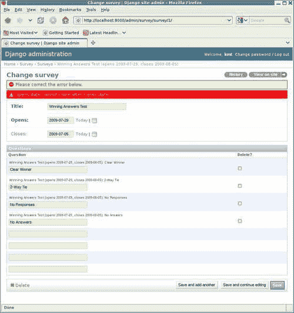

# 四、越来越花哨：Django 单元测试扩展

在上一章中，我们开始学习如何使用单元测试来测试 Django 应用程序。这包括学习一些 Django 特定的支持，例如如何将测试数据从 fixture 文件加载到特定测试的数据库中。不过，到目前为止，我们的测试重点一直放在构成应用程序的小型构建块上。我们还没有开始编写代码来为我们的应用程序提供 web 页面，也没有考虑如何测试这些页面是否得到了正确的服务并包含了正确的内容。Django`TestCase`类提供了对这种更广泛的测试有用的支持，这将是本章的重点。在本章中，我们将：

*   首先，了解如何为 Django 应用程序测试使用测试目录，而不是单个`tests.py`文件。这将允许我们以逻辑方式组织测试，而不是将各种不同的测试混合在一个巨大的文件中。
*   为调查应用程序开发一些网页。对于每一个应用程序，我们都将编写单元测试来验证它们的正确操作，并在此过程中学习对测试 Django 应用程序的`TestCase`支持的细节。
*   尝试在管理应用程序中向`Survey`模型添加自定义验证，并了解如何测试此类自定义。
*   简要讨论 Django 测试支持的一些方面，我们在示例测试中没有遇到这些方面。
*   最后，我们将了解在什么条件下可能需要使用备用单元测试类`TransactionTestCase`。此类的性能不如`TestCase`，但它支持测试`TestCase`无法实现的某些数据库事务行为。

# 组织考试

在我们开始编写代码（和测试）用于从调查应用程序服务 Web 页面之前，让我们考虑到目前为止的测试。如果我们运行`manage.py test survey -v2`并检查输出的尾部，我们可以看到我们已经积累了十几个单独的测试：

```py
No fixtures found. 
testClearWinner (survey.tests.QuestionWinningAnswersTest) ... ok 
testNoAnswers (survey.tests.QuestionWinningAnswersTest) ... ok 
testNoResponses (survey.tests.QuestionWinningAnswersTest) ... ok 
testTwoWayTie (survey.tests.QuestionWinningAnswersTest) ... ok 
testActive (survey.tests.SurveyManagerTest) ... ok 
testCompleted (survey.tests.SurveyManagerTest) ... ok 
testUpcoming (survey.tests.SurveyManagerTest) ... ok 
Verify closes is autoset correctly ... ok 
Verify closes is honored if specified ... ok 
Verify closes is only autoset during initial create ... ok 
Verify correct exception is raised in error case ... ok 
testUnicode (survey.tests.SurveyUnicodeTest) ... ok 
Doctest: survey.models.Survey.__unicode__ ... ok 
Doctest: survey.models.Survey.save ... ok 
Doctest: survey.tests.__test__.survey_save ... ok 

---------------------------------------------------------------------- 
Ran 15 tests in 0.810s 

OK 
Destroying test database... 

```

其中两个，即标签以`survey.models.Survey`开头的两个 doctest，来自`survey/models.py`文件。剩下的 13 个测试都在`survey/tests.py`文件中，该文件已扩展到大约 150 行。这些数字并不是那么大，但是如果你认为我们刚刚开始编写这个应用程序，很明显，继续简单地添加水果挞 T3 将很快导致一个笨重的测试文件。由于我们即将开始从构建和测试调查模型到构建和测试服务于 web 页面的代码，现在正是一个好时机，可以找到一个比单个文件更好的测试组织。

幸运的是，这并不难做到。Django 中的任何内容都不要求所有测试都驻留在单个文件中；它们只需要位于名为`tests`的 Python 模块中。因此，我们可以在`survey`中创建一个名为`tests`的子目录，并将现有的`tests.py`文件移动到其中。由于本文件中的测试重点是测试应用程序的模型，因此我们也将其重命名为`model_tests.py`。我们还应该从`marketr/survey`中删除`tests.pyc`文件，因为在 Python 代码重组后留下散乱的`.pyc`文件通常会导致混乱。最后，我们需要在`tests`目录中创建一个`__init__.py`文件，以便 Python 将其识别为一个模块。

就这些吗？不完全是。Django 使用`unittest.TestLoader.LoadTestsFromModule`查找并自动加载`tests`模块中的所有`TestCase`类。然而，我们现在已经将所有的`TestCase`类移到了一个名为`model_tests`的测试子模块中。为了让`LoadTestsFromModule`找到它们，我们需要使它们在父`tests`模块中可见，我们可以通过在`survey/tests`中的`__init__.py`文件中添加`model_tests`的导入来实现：

```py
from model_tests import *
```

现在我们准备好了吗？几乎如果我们现在运行`manage.py test survey -v2`，我们将看到输出报告运行了 14 个测试，而重组之前的运行报告运行了 15 个测试：

```py
No fixtures found. 
testClearWinner (survey.tests.model_tests.QuestionWinningAnswersTest) ... ok 
testNoAnswers (survey.tests.model_tests.QuestionWinningAnswersTest) ... ok

testNoResponses (survey.tests.model_tests.QuestionWinningAnswersTest) ... ok 
testTwoWayTie (survey.tests.model_tests.QuestionWinningAnswersTest) ... ok

testActive (survey.tests.model_tests.SurveyManagerTest) ... ok 
testCompleted (survey.tests.model_tests.SurveyManagerTest) ... ok 
testUpcoming (survey.tests.model_tests.SurveyManagerTest) ... ok 
Verify closes is autoset correctly ... ok 
Verify closes is honored if specified ... ok 
Verify closes is only autoset during initial create ... ok 
Verify correct exception is raised in error case ... ok 
testUnicode (survey.tests.model_tests.SurveyUnicodeTest) ... ok 
Doctest: survey.models.Survey.__unicode__ ... ok 
Doctest: survey.models.Survey.save ... ok 
---------------------------------------------------------------------- 
Ran 14 tests in 0.760s 

OK 
Destroying test database... 

```

哪项测试缺失？早期运行的最后一个测试，即`__test__`字典中的 doctest，它位于`tests.py`中。因为`__test__`以下划线开头（表示它是私有属性），所以它不是由`from model_tests import *`导入的。Python 没有强制执行命名所隐含的隐私，因此我们可以为`__test__`以及`survey/tests/__init__.py`添加显式导入：

```py
from model_tests import __test__ 
from model_tests import * 
```

如果我们这样做并再次运行测试，我们将看到我们又回到了 15 个测试。然而，这是一个糟糕的解决方案，因为它不能扩展到`tests`目录中的多个文件。如果我们将另一个文件添加到我们的`tests`目录，比如`view_tests.py`，并简单地复制用于`model_tests.py`的导入，我们将有：

```py
from model_tests import __test__ 
from model_tests import * 
from view_tests import __test__
from view_tests import *
```

这不会导致任何错误，但也不太有效。`__test__`的第二次导入完全取代了第一次导入，因此如果我们这样做，`model_tests.py`中包含的 doctest 将丢失。

设计一种可扩展到多个文件的方法很容易，也许可以通过为单个测试文件中定义的 doctest 创建我们自己的命名约定。然后，`__init__.py`中的代码可以通过组合定义 doctest 的各个测试文件中的字典，为整个`tests`模块创建`__test__`字典。但是对于我们将要在这里研究的示例来说，这是不必要的复杂，因为我们将要添加的附加测试都是单元测试，而不是 doctest。

事实上，`model_tests.py`中现在的 doctest 也被重新实现为单元测试，因此它们与测试一样是冗余的，可以安全地删除。然而，如果您决定在自己的项目中放弃单文件`tests.py`方法，它们确实会指出博士测试的一个问题。我们只需将`__test__`字典定义从`model_tests.py`文件移动到`survey/tests/__init__.py`文件，就可以保留现有的 doctest。然后，如果我们认为额外的 doctest（在`models.py`中的 doctest 之外）是有用的，那么我们可以在`survey/tests/__init__.py`中简单地添加到此词典，或者提出一种更复杂的方法，允许将 doctest 以及单元测试拆分为不同的文件。

请注意，没有必要将`tests`目录树限制为单个级别。我们可以为模型测试创建一个子目录，为视图创建一个子目录，并将这些测试进一步细分为单独的文件。使用我们从这里开始的方法，需要做的就是在各种`__init__.py`文件中包含适当的导入，以便在`tests`包的顶层可以看到测试用例。生成树的深度和生成单个测试文件的大小取决于个人偏好。我们现在将坚持单一水平。

最后，请注意，通过在应用程序的`models`和/或`tests`模块中定义`suite()`函数，您可以完全控制构成应用程序测试套件的测试。Django 测试运行程序在每个模块中寻找这样的函数，如果`suite()`存在，则调用它来创建测试套件。如果提供，`suite()`函数必须返回适合作为参数传递给`unittest.TestSuite.addTest`的对象（例如，`unittest.TestSuite`。

# 创建调查应用程序主页

现在是时候将注意力转向为调查应用程序构建一些网页了。第一页要考虑的是主页，这将是一般用户开始做任何调查的起点。最终，我们可能会计划这个页面有许多不同的元素，比如标准的页眉和页脚，也可能有一个或两个用于新闻和反馈的边栏。我们计划开发全面的样式表，使应用程序具有一个漂亮且一致的外观。但所有这些都与我们现在想要关注的重点无关，这是主页的主要内容。

主页的主要功能是提供调查当前状态的快照概述，并在适当情况下提供链接，以允许用户查看单个调查的详细信息。主页将显示分为三类的调查：

*   首先，将有一份目前正在进行的调查清单。此列表中的每个调查都有一个链接，供用户在希望参与调查时使用。
*   第二，将有一份最近完成的调查清单。每一个都会有一个链接，但是这个链接会弹出一个页面，允许用户查看调查结果。
*   第三，不久将有一份调查清单。此列表中的调查将没有链接，因为用户还不能参与，也没有可以看到的结果。

为了构建和测试这个主页，我们需要做四件事：

1.  首先，我们需要定义用于访问主页及其链接到的任何页面的 URL，并在`urls.py`文件中定义这些 URL 应如何映射到为页面提供服务的视图代码。
2.  其次，我们需要实现视图代码，以便为步骤 1 中标识的页面提供服务。
3.  第三，我们需要定义 Django 模板，用于呈现步骤 2 中生成的响应。
4.  最后，我们需要为每个页面编写测试。

以下各节将依次关注这些步骤中的每一步。

## 定义调查应用 URL

从调查主页的描述来看，我们可能需要定义两个或三个不同的 URL。当然还有主页本身，它最自然地位于调查应用程序 URL 树的根。我们可以通过在`survey`目录中创建一个`urls.py`文件来定义：

```py
from django.conf.urls.defaults import * 

urlpatterns = patterns('survey.views', 
    url(r'^$', 'home', name='survey_home'), 
) 
```

这里我们已经指定了空（根）URL 的请求应该由`survey.views`模块中的`home`函数处理。此外，我们将此 URL 命名为`survey_home`，我们可以使用它从其他代码引用此 URL。始终使用命名 URL 是一种很好的做法，因为它允许通过简单地更改`urls.py`文件而无需其他代码来更改实际 URL。

除了主页外，还有从首页链接的页面要考虑。首先是从活动调查列表链接的页面，允许用户参与调查。其次是最近完成的调查列表中的链接页面，用户可以通过这些页面查看调查结果。您可能会问，这些应该由一个或两个 URL 覆盖吗？

虽然听起来这些可能需要不同的 URL，因为页面将显示非常不同的内容，从某种意义上说，它们都显示相同的内容，即特定调查的详细信息。只是调查的当前状态会影响其详细信息页面显示的内容。因此，我们可以选择将用于根据测量状态确定确切显示内容的逻辑放入处理测量细节显示的视图中。然后我们可以用一个 URL 模式覆盖这两种类型的页面。采用这种方法，`survey/urls.py`文件变成：

```py
from django.conf.urls.defaults import * 

urlpatterns = patterns('survey.views', 
    url(r'^$', 'home', name='survey_home'), 
    url(r'^(?P<pk>\d+)/$', 'survey_detail', name='survey_detail'), 
) 
```

在这里，我们采取了将调查的主键放在 URL 中的方法。由包含一个或多个数字（主键）的单路径组件组成的任何 URL 都将映射到`survey.views`模块中的`survey_detail`函数。除了标准请求参数外，此函数还将接收主键路径组件作为参数`pk`。最后，这个 URL 被命名为`survey_detail`。

这两种 URL 模式足以定义到目前为止我们已经考虑过的调查应用程序页面。然而，我们仍然需要将它们连接到项目的整体 URL 配置中。为此，编辑项目的根`urls.py`文件，并为调查 URL 添加一行。`urls.py`中的`urlpatterns`变量的定义如下：

```py
urlpatterns = patterns('', 
    # Example: 
    # (r'^marketr/', include('marketr.foo.urls')), 

    # Uncomment the admin/doc line below and add # 'django.contrib.admindocs' 
    # to INSTALLED_APPS to enable admin documentation: 
    # (r'^admin/doc/', include('django.contrib.admindocs.urls')), 

    # Uncomment the next line to enable the admin: 
    (r'^admin/', include(admin.site.urls)), 
 (r'', include('survey.urls')), 
) 
```

我们在这里添加的最后一行指定了一个空 URL 模式`r''`。所有匹配的 URL 都将根据`survey`模块中包含的`urls.py`文件中的模式进行测试。模式`r''`将匹配每一个 URL，并且当对照`survey/urls.py`中的 URL 模式进行测试时，URL 的任何部分都不会被删除，因此这实际上是将调查`urls.py`文件装载到项目 URL 树的根目录下。

## 开发视图以服务页面

现在我们已经定义了 URL 并指定了应该调用的视图函数来为它们服务，现在是开始编写这些函数的时候了。或者，也许我们应该从这些页面的模板开始？两者都需要完成，而且它们相互依赖。视图返回的数据取决于模板需要什么，而如何编写模板的细节取决于视图提供的数据的命名和结构。因此，很难知道从哪一个开始，有时需要在它们之间交替。

然而，我们必须从某个地方开始，我们将从视图开始。事实上，每当您在`urls.py`文件中添加对视图的引用时，最好立即至少编写该视图的最小实现。例如，对于我们刚刚添加到`survey/urls.py`的两个视图，我们可能会立即在`survey/views.py`中放置以下内容：

```py
from django.http import HttpResponse 

def home(request): 
    return HttpResponse("This is the home page.") 

def survey_detail(request, pk): 
    return HttpResponse("This is the survey detail page for survey, " "with pk=%s" % pk) 
```

这些视图都只是返回一个`HttpResponse`来描述页面应该显示什么。这样创建占位符视图可以确保项目的整体 URL 模式配置仍然有效。保持此配置有效非常重要，因为如果 URL 模式配置的任何部分出现任何错误（例如引用不存在的函数），则任何尝试执行反向 URL 映射（从名称返回到实际 URL）的行为都将导致异常。因此，无效的 URL 配置很容易破坏其他完全无辜的代码。

例如，管理应用程序需要使用反向 URL 映射在其页面上生成链接。因此，无效的 URL 模式配置可能导致在用户尝试访问管理页面时引发异常，即使管理代码本身没有错误。这种异常可能很难调试，因为乍一看，问题似乎是由与实际错误完全不同的代码引起的。因此，即使您更喜欢在视图函数之前编写模板，最好总是立即为添加到 URL 模式配置中的任何视图提供至少最低限度的实现。

不过，至少在主页视图中，我们可以超越最小值。如前所述，主页将显示三个不同的调查列表：活动、最近完成和即将打开。模板不太可能需要以比简单列表（或`QuerySet`）更复杂的方式构造数据，因此主页的视图很容易编写：

```py
import datetime 
from django.shortcuts import render_to_response 
from survey.models import Survey 

def home(request): 
    today = datetime.date.today() 
    active = Survey.objects.active() 
    completed = Survey.objects.completed().filter(closes__gte=today-datetime.timedelta(14)) 
    upcoming = Survey.objects.upcoming().filter(opens__lte=today+datetime.timedelta(7))
    return render_to_response('survey/home.html', 
        {'active_surveys': active, 
         'completed_surveys': completed, 
         'upcoming_surveys': upcoming, 
        })
```

此视图将三个变量设置为`QuerySets`，其中包含数据库中`Surveys`的适当子集。最近完成的一套调查仅限于过去两周内结束的调查，即将开始的一套调查仅限于下周开始的调查。视图然后调用`render_to_response`快捷方式来呈现`survey/home.html`模板，该模板传递一个上下文字典，其中包含`active_surveys`、`completed_surveys`和`upcoming_surveys`上下文变量中的三个`Survey`子集。

此时，我们可以继续用一些实际代码替换占位符`survey_detail`视图实现，也可以开始使用一些模板。但是，编写第二个视图并不能使我们更接近于测试我们编写的第一个视图，因此继续使用模板更好。第二个视图的占位符内容目前还可以。

## 为页面创建模板

要开始编写调查应用程序的模板，首先在`survey`下创建一个`templates`目录，然后在`templates`下创建一个`survey`目录。将模板放置在应用程序目录中的`templates`目录下，可以通过`app_directories`模板加载器自动找到模板，默认情况下，该加载器处于启用状态。此外，将模板放在`templates`下的`survey`目录中，可以最大限度地减少与其他应用程序使用的模板发生名称冲突的可能性。

现在，我们需要创建哪些模板？主视图中命名的是`survey/home.html`。我们可以只创建一个文件，并使其成为一个完整的独立 HTTP 文档。但这是不现实的。Django 提供了一种方便的模板继承机制，允许重用公共页面元素和选择性地重写已定义的块。至少，我们可能希望使用一个公共基础模板来定义整个文档结构和块组件，然后将各个页面模板实现为扩展基础模板的子模板。

以下是我们可以使用的最低限度的`base.html`模板：

```py
<!DOCTYPE html PUBLIC "-//W3C//DTD XHTML 1.0 Strict//EN" "http://www.w3.org/TR/xhtml1/DTD/xhtml1-strict.dtd">
<html >
<head>
<title>Survey Central</title>
</head>
<body>

</body>
</html>
```

本文档提供了整个 HTML 结构标记，只定义了两个块：`title`和`content`。`title`块的默认内容为`Survey Central`，可以被子模板覆盖，也可以保持原样。`content`块最初是空的，因此子模板总是提供一些内容来填充页面主体。

有了这个基本模板，我们可以将`home.html`模板编写为扩展`base.html`并为块`content`提供内容的子模板。我们知道，`home`视图提供了三个上下文变量（`active_surveys`、`completed_surveys`和`upcoming_surveys`，其中包含应该显示的数据。`home.html`模板的初始实现可能如下所示：

```py
 
 
<h1>Welcome to Survey Central</h1> 

 
<p>Take a survey now!</p> 
<ul> 
 
<li><a href="{{ survey.get_absolute_url }}">{{ survey.title }}</a></li> 
 
</ul> 
 

 
<p>See how your opinions compared to those of others!</p> 
<ul> 
 
<li><a href="{{ survey.get_absolute_url }}">{{ survey.title }}</a></li> 
 
</ul> 
 

 
<p>Come back soon to share your opinion!</p> 
<ul> 
 
<li>{{ survey.title }} opens {{ survey.opens }}</li> 
 
</ul> 
 
 
```

这看起来有点吓人，但很简单。模板首先指定扩展`survey/base.html`模板。然后，它继续定义应该放置在`base.html`中定义的块`content`中的内容。第一个元素是一级标题`Welcome to Survey Central`。然后，如果`active_surveys`上下文变量不是空的，则标题后面会有一段邀请人们进行调查的内容，然后是活动调查的列表。列表中的每一项都被指定为一个链接，其中链接目标值是通过调用调查的`get_absolute_url`方法（我们尚未实施）获得的。每个链接的可见文本设置为`Survey`的`title`值。

如果存在`completed_surveys`，则会显示几乎相同的段落和列表。最后，对`upcoming_surveys`进行类似的处理，除非在它们的情况下没有生成链接。相反，调查标题与每次调查的开始日期一起列出。

现在，使用什么`get_absolute_url`方法生成活动和已完成调查的链接？这是我们可以实现的标准模型方法，用于在我们的站点上为模型实例提供 URL。除了在我们自己的代码中使用它之外，如果它是由模型实现的，管理应用程序还使用它在模型实例的更改页面上提供一个**站点视图**链接。

回想一下，在我们的`urls.py`文件中，我们将调查详细信息的 URL 命名为`survey_detail`，该视图使用一个参数`pk`，它是`Survey`实例显示详细信息的主键。知道了这一点，我们可以在`Survey`模型中实施`get_absolute_url`方法：

```py
    def get_absolute_url(self): 
        from django.core.urlresolvers import reverse 
        return reverse('survey_detail', args=(self.pk,)) 
```

此方法使用`django.core.urlresolvers`提供的`reverse`函数构造实际 URL，该 URL 将映射到名为`survey_detail`的 URL，参数值为模型实例的主键值。

或者，我们可以使用方便的`models.permalink`装饰器，避免记住`reverse`函数需要从何处导入：

```py
    @models.permalink
    def get_absolute_url(self):
        return ('survey_detail', (self.pk,))
```

这相当于实现`get_absolute_url`的第一种方式。这种方法简单地隐藏了调用 reverse 函数的细节，正如`models.permalink`代码所做的那样。

现在，我们已经创建了主页视图及其使用的模板，并实现了从这些模板调用的所有模型方法，我们可以实际测试该视图。确保开发服务器正在运行（或使用`manage.py runserver`再次启动），然后从同一台机器上的浏览器转到`http://localhost:8000/`。这应该（假设上一章中的`Winning Answers Test`创建后不到一周）会出现一个页面，列出可以进行的调查：


如果调查开始已经超过一周了，那么它应该出现在一段下面，邀请你**看看你的观点与其他人的观点相比如何！**相反。如果已经超过三周了，调查应该根本不显示，在这种情况下，您可能希望返回到管理应用程序并更改其`closes`日期，使其显示在主页上。

**中奖答案测试**文本是一个链接，可以通过该链接验证`Survey`的`get_absolute_url`方法是否有效，以及我们设置的 URL 配置是否有效。由于我们仍然只有调查详细信息视图的占位符视图实现，单击**获奖答案测试**链接将显示如下页面：


也许不太令人印象深刻，但它确实验证了我们目前所拥有的各种功能正在发挥作用。

当然，因为数据库中只有一个调查，所以我们只验证了视图和模板的一部分。为了进行全面测试，我们还应该验证所有三个类别的调查都正确显示。此外，我们应该验证数据库中不应该出现的调查，因为它们太旧或将来太远，实际上不会出现在主页上。

我们现在可以通过在管理应用程序中手动添加调查，并在进行更改时手动检查主页的内容来完成这一切。然而，我们真正想要学习的是如何编写一个测试来验证我们现在拥有的是正确的，更重要的是，允许我们在继续开发应用程序时验证它是否仍然正确。因此，编写这样的测试是我们下一步的重点。

## 测试调查主页

在我们思考如何编写测试本身的过程中，让我们考虑测试所需要的数据，以及将数据获取到测试中的最佳方法。该测试与前一章中的`SurveyManagerTest`非常相似，因为确定正确的行为将取决于当前日期与测试数据中包含的日期之间的关系。因此，对该数据使用夹具文件不是一个好主意；最好在测试的`setUp`方法中动态添加数据。

然后，我们将开始编写一个`setUp`方法来创建一组适当的数据，用于测试主页。既然我们已经开始测试应用程序的视图，那么让我们把它放在一个新文件`survey/tests/view_tests.py`中。当我们创建该文件时，我们还需要记住在`survey/tests`中的`__init__.py`文件中为新文件（`from view_tests import *`添加一行`import`，以便测试运行者可以找到其中的测试。

以下是我们主页测试的`setUp`方法：

```py
import datetime 
from django.test import TestCase 
from survey.models import Survey 

class SurveyHomeTest(TestCase): 
    def setUp(self): 
        today = datetime.date.today() 
        Survey.objects.all().delete() 
        d = today - datetime.timedelta(15) 
        Survey.objects.create(title="Too Old", opens=d, closes=d) 
        d += datetime.timedelta(1) 
        Survey.objects.create(title="Completed 1", opens=d, closes=d) 
        d = today - datetime.timedelta(1) 
        Survey.objects.create(title="Completed 2", opens=d, closes=d) 
        Survey.objects.create(title="Active 1", opens=d) 
        Survey.objects.create(title="Active 2", opens=today) 
        d = today + datetime.timedelta(1) 
        Survey.objects.create(title="Upcoming 1", opens=d) 
        d += datetime.timedelta(6) 
        Survey.objects.create(title="Upcoming 2", opens=d) 
        d += datetime.timedelta(1) 
        Survey.objects.create(title="Too Far Out", opens=d) 
```

T他的方法首先将今天的日期存储在局部变量`today`中。然后，它删除数据库中所有现有的`Surveys`，以防初始数据装置加载的任何内容会干扰此测试用例中测试方法的正确执行。然后创建八个`Surveys`：三个已完成、两个活动和三个即将到来。

已完成调查的截止日期是专门设置的，以便测试窗口的边界，以便在主页上显示哪些内容。最早的截止日期设置为过去的一天（15 天），无法在主页上列出。另外两个设置为窗口的最边缘，以便在主页上显示为已完成。即将进行的调查的开放日期设置类似，以测试该窗口的限制。一项即将进行的调查在未来的某一天才开始，无法出现在主页上，而另外两项调查则在窗口的极限处开始，以便在主页上显示即将进行的调查。最后，有两个活跃的调查，一个是昨天开始的，另一个是今天开始的，每个调查的默认截止日期都是七天后，所以这两个调查都是开放的。

既然我们有了一个`setUp`例程来创建测试数据，那么我们如何编写一个测试来检查主页的内容呢？Django 提供了一个类`django.test.Client`，在这里提供帮助。这个`Client`类的一个实例就像一个 web 浏览器，可以用来请求页面和检查返回的响应。每个`django.test.TestCase`类自动分配一个`Client`类实例，可使用`self.client`访问该类实例。

要了解如何使用测试`Client`，让我们检查一下调查应用程序主页的测试开始：

```py
    def testHome(self): 
        from django.core.urlresolvers import reverse 
        response = self.client.get(reverse('survey_home')) 
        self.assertEqual(response.status_code, 200) 
```

H在`SurveyHomeTest`中定义`testHome`方法之前。此方法使用测试的`client`类实例的`get`方法检索调查首页（再次使用`reverse`确定正确的 URL，以确保所有 URL 配置信息在`urls.py`中被隔离）。`get`的返回值是被调用以服务于请求页面的视图返回的`django.http.HttpResponse`对象，并用一些附加信息进行注释，以便于测试。测试的最后一行通过确保返回响应的`status_code`属性为`200`（HTTP OK）来验证请求是否成功送达。

请注意，测试`Client`提供的`get`方法支持的不仅仅是我们在这里传递的单个 URL 参数。此外，它还支持两个关键字参数`data`和`follow`，默认分别为空字典和`False`。最后，还可以提供任意数量的`extra`关键字参数。

如果非空，`data`字典用于为请求构造查询字符串。例如，考虑一个 Oracle T1 方法，例如：

```py
response = self.client.get('/survey/', data={'pk': 4, 'type': 'results'})
```

为处理此请求而创建的 URL 将为`/survey/?pk=4&type=results`。

注意：您还可以在传递给`get`的 URL 路径中包含查询字符串。因此，一个等价的调用是：

```py
response = self.client.get('/survey/?pk=4&type=results')
```

如果同时提供了`data`字典和 URL 路径中的查询字符串，则`data`字典用于处理请求，URL 路径中的查询字符串将被忽略。

`get`的`follow`参数可以设置为`True`，以指示测试客户端在响应中遵循重定向。如果这样做，则返回的响应将设置一个`redirect_chain`属性。此属性将是一个列表，描述在重定向链结束之前访问的中间 URL。列表中的每个元素都是一个元组，包含中间 URL 路径和提示检索该路径的状态代码。

最后，可以使用任何`extra`关键字参数在请求中设置任意 HTTP 头值。例如：

```py
response = self.client.get('/', HTTP_USER_AGENT='Tester')
```

此调用将请求中的`HTTP_USER_AGENT`头设置为`Tester`。

R返回到我们自己的测试，它只提供 URL 路径参数，我们现在可以使用`manage.py test survey.SurveyHomeTest`运行它，并验证到目前为止一切正常。我们可以检索主页，响应返回一个成功的状态代码。但是如何测试页面的内容呢？我们希望确保应该出现的各种调查正在出现，并且数据库中不应该出现在页面上的两个调查没有列出。

返回的实际页面内容存储在响应的`content`属性中。我们可以直接检查这一点，但 Django`TestCase`类也提供了两种方法来检查响应中是否出现了某些文本。这些方法被命名为`assertContains`和`assertNotContains`。

使用`assertContains`方法我们传入`response`和我们要查找的文本。我们还可以选择指定文本出现次数的`count`。如果我们指定了`count`，那么文本必须在响应中出现那么多次。如果我们没有指定`count`，则`assertContains`只需检查文本是否至少出现一次。最后，我们可以指定响应应该具有的`status_code`。如果我们没有指定，则`assertContains`验证状态代码为 200。

`assertNotContains`方法采用与`assertContains`相同的参数，但`count`除外。它验证传递的文本是否未出现在响应内容中。

我们可以使用这两种方法来验证主页是否包含`Completed`、`Active`和`Upcoming`各两个实例，并且主页是否不包含`Too Old`或`Too Far Out`。此外，由于这些方法检查状态代码，我们可以从自己的测试代码中删除该检查。因此，试验方法变为：

```py
    def testHome(self):
        from django.core.urlresolvers import reverse
        response = self.client.get(reverse('survey_home'))
        self.assertContains(response, "Completed", count=2)
        self.assertContains(response, "Active", count=2)
        self.assertContains(response, "Upcoming", count=2)
        self.assertNotContains(response, "Too Old")
        self.assertNotContains(response, "Too Far Out")
```

如果我们试着运行这个版本，我们将看到它是有效的。然而，它并不像我们希望的那样具体。也就是说，它无法验证列出的调查是否出现在页面的正确位置。目前的测试将通过**段下列出的所有调查。立即进行调查！比如说**。我们如何验证每个都出现在适当的列表中？

One 方法是手动检查`response.content`，找到每个预期字符串的位置，并确保它们都按预期顺序出现。然而，这将使测试非常依赖于页面的确切布局。我们可能会在将来决定重新排列列表的显示顺序，然后这个测试可能会中断，即使每个调查仍然被列在正确的类别中。

我们真正想做的是验证调查是否包含在传递给模板的适当上下文变量中。事实上，我们可以对此进行测试，因为`client.get`返回的响应是使用用于呈现模板的上下文进行注释的。因此，我们可以检查已完成的调查列表，例如：

```py
        completed = response.context['completed_surveys'] 
        self.assertEqual(len(completed), 2) 
        for survey in completed: 
            self.failUnless(survey.title.startswith("Completed")) 
```

此代码从响应上下文中检索`completed_surveys`上下文变量，验证其中是否有`2`项，并进一步验证每个项是否有一个以字符串`Completed`开头的`title`。如果我们运行该代码，我们将看到它可以用于检查已完成的调查。然后，我们可以将该块再复制两次，并对其进行适当的调整，以检查当前和即将进行的调查，或者我们可以更进一步，编写类似以下内容：

```py
        context_vars = ['completed_surveys', 'active_surveys', 'upcoming_surveys'] 
        title_starts = ['Completed', 'Active', 'Upcoming'] 
        for context_var, title_start in zip(context_vars, title_starts):
            surveys = response.context[context_var] 
            self.assertEqual(len(surveys), 2) 
            for survey in surveys: 
                self.failUnless(survey.title.startswith(title_start))
```

在这里，我们通过构造一个要检查的内容列表，然后在该列表中进行迭代，基本上避免了将同一代码块重复三次，只产生了细微的差异。因此，我们只让代码块出现一次，但它会循环三次，每个要检查的上下文变量一次。这是一种常用技术，用于避免多次重复几乎相同的代码。

请注意，在测试中使用这种技术时，最好在断言检查中包含特定消息。在直接测试完整列表的原始版本代码中，如果存在错误，例如该列表中的调查过多，则测试失败将产生合理的描述性错误报告：

```py
FAIL: testHome (survey.tests.view_tests.SurveyHomeTest) 
---------------------------------------------------------------------- 
Traceback (most recent call last): 
 File "/dj_projects/marketr/survey/tests/view_tests.py", line 29, in testHome 
 self.assertEqual(len(completed), 2) 
AssertionError: 3 != 2 

---------------------------------------------------------------------- 

```

这里失败的代码包括字符串**completed**，因此很清楚哪个列表有问题。使用更通用的代码版本，此报告的帮助将大大减少：

```py
FAIL: testHome (survey.tests.view_tests.SurveyHomeTest) 
---------------------------------------------------------------------- 
Traceback (most recent call last): 
 File "/dj_projects/marketr/survey/tests/view_tests.py", line 35, in testHome 
 self.assertEqual(len(surveys), 2) 
AssertionError: 3 != 2 

---------------------------------------------------------------------- 

```

遇到该故障报告的可怜的程序员将无法知道三个列表中哪一个有太多的项。但是，通过在断言中提供特定的错误消息，可以清楚地说明这一点。因此，带有描述性错误的完整测试方法的更好版本是：

```py
    def testHome(self): 
        from django.core.urlresolvers import reverse 
        response = self.client.get(reverse('survey_home')) 
        self.assertNotContains(response, "Too Old") 
        self.assertNotContains(response, "Too Far Out")          
        context_vars = ['completed_surveys', 'active_surveys', 'upcoming_surveys'] 
        title_starts = ['Completed', 'Active', 'Upcoming'] 
        for context_var, title_start in zip(context_vars, title_starts): 
            surveys = response.context[context_var] 
            self.assertEqual(len(surveys), 2, 
                "Expected 2 %s, found %d instead" % 
                (context_var, len(surveys))) 
            for survey in surveys: 
                self.failUnless(survey.title.startswith(title_start), 
                    "%s title %s does not start with %s" % 
                    (context_var, survey.title, title_start)) 
```

现在，如果在通用代码中的检查过程中出现故障，则错误消息足够具体，以指示问题所在：

```py
FAIL: testHome (survey.tests.view_tests.SurveyHomeTest) 
---------------------------------------------------------------------- 
Traceback (most recent call last): 
 File "/dj_projects/marketr/survey/tests/view_tests.py", line 36, in testHome 
 (context_var, len(surveys))) 
AssertionError: Expected 2 completed_surveys, found 3 instead 

---------------------------------------------------------------------- 

```

我们现在已经为我们的调查主页做了一个相当完整的测试，或者至少和我们到目前为止已经实现的测试一样多。现在是时候将我们的注意力转向调查详情页面了，我们将在下一页介绍。

# 创建调查详情页面

我们添加到项目 URL 配置中的第二个 URL 映射是针对调查详细信息页面的。实现此视图比主页视图稍微复杂一些，因为根据请求调查的状态，需要显示完全不同的数据。如果调查完成，我们需要显示结果。如果调查处于活动状态，我们需要显示允许用户参与调查的表单。如果调查即将进行，我们根本不希望调查可见。

如果一次完成所有这些，而不进行测试来验证我们是否朝着正确的方向前进，那将是自找麻烦。最好将任务分解成更小的部分，并在执行过程中进行测试。我们将在以下几节中朝这个方向迈出第一步。

## 细化测量细节视图

要做的第一件事是用确定请求的调查状态并适当路由请求的视图替换调查详细信息页面的简单占位符视图。例如：

```py
import datetime 
from django.shortcuts import render_to_response, get_object_or_404 
from django.http import Http404 
from survey.models import Survey 
def survey_detail(request, pk): 
    survey = get_object_or_404(Survey, pk=pk) 
    today = datetime.date.today() 
    if survey.closes < today: 
        return display_completed_survey(request, survey) 
    elif survey.opens > today: 
        raise Http404 
    else: 
        return display_active_survey(request, survey) 
```

此`survey_detail`视图使用`get_object_or_404`快捷方式从数据库中检索请求的`Survey`。如果请求的调查不存在，快捷方式将自动引发`Http404`异常，因此以下代码不必考虑这种情况。然后视图检查返回的`Survey`实例上的`closes`日期。如果在今天之前关闭，请求将发送到名为`display_completed_survey`的函数。否则，如果调查尚未打开，则会引发`Http404`异常。最后，如果这两个条件都不成立，则调查必须处于活动状态，以便将请求路由到名为`display_active_survey`的函数。

首先，我们将非常简单地实现这两个新功能。他们不会做案例所需的任何实际工作，但在呈现其响应时，他们将使用不同的模板：

```py
def display_completed_survey(request, survey): 
    return render_to_response('survey/completed_survey.html', {'survey': survey}) 

def display_active_survey(request, survey): 
    return render_to_response('survey/active_survey.html', {'survey': survey}) 
```

只要有这么多代码，我们就可以继续测试不同州的调查是否正确路由。不过，首先，我们需要创建视图代码引入的两个新模板。

## 调查详情页面模板

这两个新模板分别命名为`survey/completed_survey.html`和`survey/active_survey.html`。在`survey/templates`目录下创建它们。首先，它们可能非常简单。例如，`completed_survey.html`可以是：

```py
 
 
<h1>Survey results for {{ survey.title }}</h1> 
 
```

类似地，`active_survey.html`可以是：

```py
 
 
<h1>Survey questions for {{ survey.title }}</h1> 
 
```

其中每一个都扩展了`survey/base.html`模板，并为`content`块提供了最小但描述性的内容。在每种情况下，都将显示一个第一级标题，通过标题标识调查，以及页面是否显示结果或问题。

## 调查详情页面的基本测试

现在考虑一下我们如何测试 PosiT0p 中的路由代码是否正确工作。同样，我们需要的测试数据至少包含三个州中每个州的一项调查。我们在`SurveyHomeTest`的`setUp`方法中创建了测试数据。然而，向主页测试用例中添加实际测试调查细节页面视图的方法会让人感到困惑。复制非常相似的`setUp`代码也不是很吸引人。

幸运的是，我们也不需要这样做。我们可以做的是将现有的`setUp`代码移动到一个更通用的测试用例中，比如`SurveyTest`，然后将`SurveyHomeTest`和我们的新`SurveyDetailTest`都基于这个新的`SurveyTest`。这样，主页测试和详细页面测试都将具有通过基本`SurveyTest setUp`方法在数据库中创建的相同数据。此外，任何需要类似数据的附加测试也可以从`SurveyTest`继承。

既然我们已经准备好了测试数据，我们可以做些什么来测试到目前为止我们已经实现的细节视图？即将进行的调查非常简单，因为它应该只返回一个 HTTP404（NotFound）页面。因此，我们可以在我们的`SurveyDetailTest`中为该情况创建一个方法：

```py
from django.core.urlresolvers import reverse 
class SurveyDetailTest(SurveyTest): 
    def testUpcoming(self): 
        survey = Survey.objects.get(title='Upcoming 1') 
        response = self.client.get(reverse('survey_detail', args=(survey.pk,))) 
        self.assertEqual(response.status_code, 404) 
```

`testUpcoming`方法从数据库中检索即将进行的调查之一，并使用测试`client`请求包含该调查详细信息的页面。我们再次使用`reverse`为详细信息页面构建适当的 URL，将我们请求的调查的主键作为`args`元组中的单个参数传递进来。通过确保响应的`status_code`为 404，测试此请求的正确处理。如果现在运行此测试，我们将看到：

```py
ERROR: testUpcoming (survey.tests.view_tests.SurveyDetailTest)
----------------------------------------------------------------------
Traceback (most recent call last):
 File "/dj_projects/marketr/survey/tests/view_tests.py", line 45, in testUpcoming
 response = self.client.get(reverse('survey_detail', args=(survey.pk,)))
 File "/usr/lib/python2.5/site-packages/django/test/client.py", line 281, in get
 response = self.request(**r)
 File "/usr/lib/python2.5/site-packages/django/core/handlers/base.py", line 119, in get_response
 return callback(request, **param_dict)
 File "/usr/lib/python2.5/site-packages/django/views/defaults.py", line 13, in page_not_found
 t = loader.get_template(template_name) # You need to create a 404.html template.
 File "/usr/lib/python2.5/site-packages/django/template/loader.py", line 81, in get_template
 source, origin = find_template_source(template_name)
 File "/usr/lib/python2.5/site-packages/django/template/loader.py", line 74, in find_template_source
 raise TemplateDoesNotExist, name
TemplateDoesNotExist: 404.html

```

哎呀。为了使`survey_detail`视图成功地引发`Http404`并产生“页面未找到”响应，项目中必须存在`404.html`模板。我们还没有创建一个，所以这个测试会生成一个错误。要解决此问题，我们可以创建一个简单的`survey/templates/404.html`文件，其中包含：

```py


<h1>Page Not Found</h1>
<p>The requested page was not found on this site.</p>

```

同时，我们还应该创建一个`survey/templates/500.html`文件，以避免在遇到服务器错误时出现任何类似的无用错误。现在使用的一个简单的`500.html`文件与此`404.html`文件非常相似，文本更改表示问题是服务器错误，而不是页面未找到的情况。

有了`404.html`模板，我们可以再次尝试运行此测试，这次它将通过。

如何测试页面以获取已完成和活动的调查？我们可以编写测试，检查`response.content`在每个模板中放置的标题文本。然而，当我们在这一点上继续开发时，该文本可能不会保持不变，这只是占位符文本。最好验证是否使用了正确的模板来呈现每个响应。`TestCase`类有一个方法：`assertTemplateUsed`。因此，我们可以为这些情况编写测试，这些情况很可能在长期内继续正常工作，如下所示：

```py
    def testCompleted(self): 
        survey = Survey.objects.get(title='Too Old') 
        response = self.client.get(reverse('survey_detail', args=(survey.pk,))) 
        self.assertTemplateUsed(response, 'survey/completed_survey.html')

    def testActive(self): 
        survey = Survey.objects.get(title='Active 1') 
        response = self.client.get(reverse('survey_detail', args=(survey.pk,))) 
        self.assertTemplateUsed(response, 'survey/active_survey.html') 
```

这些测试方法中的每一种都从适当的类别中检索调查，并请求该调查的详细信息页面。到目前为止，对响应所做的唯一测试是检查预期模板是否用于呈现响应。同样，我们现在可以运行这些测试并验证它们是否通过。

除`assertTemplateUsed`外，还有`TestCase`提供的`assertTemplateNotUsed`方法。它采用与`assertTempalteUsed`相同的参数。正如您所料，它会验证指定的模板是否未用于呈现响应。

此时，我们将从实现`survey`应用程序页面开始休息。下一个单元测试主题是如何测试接受用户输入的页面。我们在 survey 应用程序中还没有这些，但是 Django 管理应用程序有。因此，测试管理员定制的任务提供了一个学习如何测试此类页面的更快途径，因为在开发测试之前，我们需要编写更少的定制代码。除此之外，学习如何测试管理定制本身也很有用。

# 定制管理员添加和更改调查页面

我们已经了解了 Django admin 应用程序如何提供一种方便的方法来检查和操作数据库中的数据。在上一章中，我们通过一些简单的定制设置了管理员，以允许编辑与`Surveys`内联的`Questions`和与`Questions`内联的`Answers`。但是，除了那些内联自定义之外，我们没有对管理默认值进行任何更改。

对管理员进行的另一项更改是确保`Survey opens`和`closes`日期有效。显然，对于这个应用程序来说，`opens`日期晚于`closes`是没有意义的，但是管理员无法知道这一点。在本节中，我们将自定义管理员以强制执行我们对`opens`和`closes`之间关系的应用程序要求。我们还将为此定制开发一个测试。

## 开发定制调查表

实现此管理员定制的第一步是实现一个包含自定义验证的`Survey`表单。例如：

```py
from django import forms
class SurveyForm(forms.ModelForm): 
    class Meta: 
        model = Survey 
    def clean(self): 
        opens = self.cleaned_data.get('opens') 
        closes = self.cleaned_data.get('closes') 
        if opens and closes and opens > closes: 
            raise forms.ValidationError("Opens date cannot come, " "after closes date.") 
        return self.cleaned_data 
```

这是`Survey`车型的标准`ModelForm`。由于我们要执行的验证涉及表单上的多个字段，因此最好将其放在整体表单`clean`方法中。这里的方法从表单的`cleaned_data`字典中检索`opens`和`closes`值。然后，如果两者都已提供，则检查`opens`是否晚于`closes`。如果是，则抛出一个`ValidationError`，否则一切正常，那么现有的`cleaned_data`字典将从`clean`返回，不做修改。

由于我们将为管理员使用此表单，并且目前预计不需要在其他任何地方使用它，因此我们可以将此表单定义放在现有的`survey/admin.py`文件中。

## 配置管理员使用自定义表单

下一步是告诉管理员使用此表单，而不是`Survey`模型的默认`ModelForm`。为此，将`survey/admin.py`中的`SurveyAdmin`定义更改为：

```py
class SurveyAdmin(admin.ModelAdmin):
    form = SurveyForm
    inlines = [QuestionsInline]
```

通过指定`form`属性，我们告诉管理员使用自定义表单来添加和编辑`Survey`实例。我们可以通过使用管理员编辑我们现有的`Winning Answers Test`调查，并尝试将其`closes`日期更改为早于`opens`的日期，从而快速验证该方法是否有效。如果我们这样做，我们将看到错误报告如下：



很好，我们已经能够手动验证我们的定制是否有效，但我们真正想要的是一个自动化测试。这将在下一节讨论。

## 测试管理员定制

H我们如何为这个管理员定制编写测试？在测试管理员页面上按下**保存**按钮的行为时，至少有两件事与我们目前测试的有所不同。首先，我们需要发出一个 HTTPPOST 方法，而不是 GET 来发出请求。测试`Client`为此提供了`post`方法，类似于`get`。但是，对于`post`，我们需要指定请求中包含的表单数据值。我们将其作为键/值对的字典提供，其中键是表单字段的名称。因为我们知道管理员正在使用的`ModelForm`，所以我们知道这里的键值是模型字段的名称。

我们将从编写 AdminAddSurvey 页面的测试开始，因为在这种情况下，我们不需要在数据库中有任何预先存在的数据。让我们在 tests 目录中创建一个名为`admin_tests.py`的新文件，用于测试管理员视图。另外，请记住将`from admin_tests import *`添加到`tests/__init__.py`文件中，以便在运行`tests`时可以找到这些测试。

对管理员应用程序使用我们定制的`Survey`表单进行测试的初始尝试可能如下所示：

```py
import datetime 
from django.test import TestCase 
from django.core.urlresolvers import reverse 

class AdminSurveyTest(TestCase):    
    def testAddSurveyError(self): 
        post_data = { 
            'title': u'Time Traveling', 
            'opens': datetime.date.today(), 
            'closes': datetime.date.today() - datetime.timedelta(1), 
        } 
        response = self.client.post(reverse('admin:survey_survey_add'), post_data) 
        self.assertContains(response, "Opens date cannot come after closes date.") 
```

这里我们有一个测试方法`testAddSurveyError`，它为`Survey ModelForm`创建了一个包含`title`、`opens`和`closes`值的`post_data`字典。我们使用测试`client`到`post`该字典为`survey`应用程序的管理员`Survey`添加页面（在该管理员视图的文档名上使用`reverse`。我们希望返回的`response`应该包含来自我们的自定义`ModelForm`的错误消息，因为我们指定了一个晚于`closes`日期的`opens`日期。我们使用`assertContains`检查在响应中是否找到了预期的错误消息。

N注意，与`get`的情况一样，我们使用`post`的第一个测试仅使用可提供给该方法的参数子集。除了 URL`path`和`data`字典外，`post`还接受一个`content_type`关键字参数。此参数默认为导致客户端发送`mutlipart/form-data`的值。除`content_type`外，`post`还支持与`get`相同的`follow`和`extra`关键字参数，默认值和处理行为相同。

我们第一次尝试管理员定制测试有效吗？很遗憾，没有。如果我们使用`manage.py test survey.AdminSurveyTest`运行它，我们将看到此失败：

```py
FAIL: testAddSurveyError (survey.tests.admin_tests.AdminSurveyTest) 
---------------------------------------------------------------------- 
Traceback (most recent call last): 
 File "/dj_projects/marketr/survey/tests/admin_tests.py", line 13, in testAddSurveyError 
 self.assertContains(response, "Opens date cannot come after closes date.") 
 File "/usr/lib/python2.5/site-packages/django/test/testcases.py", line 345, in assertContains 
 "Couldn't find '%s' in response" % text) 
AssertionError: Couldn't find 'Opens date cannot come after closes date.' in response 

---------------------------------------------------------------------- 

```

可能有什么问题？很难说没有看到返回的响应中实际包含了什么。意识到这一点，我们可能会尝试在错误消息中包含响应的文本。然而，响应往往相当长（因为它们通常是完整的网页），并且将它们包含在测试失败输出中通常会比其他任何东西添加更多的噪声。因此，通常最好临时更改测试用例以打印响应，例如，为了弄清楚可能发生了什么。

如果在本例中这样做，我们将看到返回的响应开始（在一些标准 HTML 样板之后）：

```py
<title>Log in | Django site admin</title> 

```

哦，对了，我们忘了管理员需要登录用户才能访问。我们在测试用例中没有做任何设置和登录用户的操作，因此当测试尝试访问管理页面时，管理代码只返回一个登录页面。

那么，我们的测试首先需要创建一个用户，因为测试数据库最初是空的。该用户将需要适当的权限来访问管理员，并且在尝试对管理员应用程序执行任何操作之前必须登录。这类事情适用于测试`setUp`例行程序：

```py
import datetime
from django.test import TestCase
from django.contrib.auth.models import User
from django.core.urlresolvers import reverse

class AdminSurveyTest(TestCase):
    def setUp(self):
        self.username = 'survey_admin'
        self.pw = 'pwpwpw'
        self.user = User.objects.create_user(self.username, '', self.pw)
        self.user.is_staff= True
        self.user.is_superuser = True
        self.user.save()
        self.assertTrue(self.client.login(username=self.username, password=self.pw),
            "Logging in user %s, pw %s failed." % (self.username, self.pw))
```

在这里，`setUp`例程使用标准`django.contrib.auth User`模型提供的`create_user`方法创建一个名为`survey_admin`的用户。创建用户后，`setUp`将其`is_staff`和`is_superuser`属性设置为`True`，并再次将用户保存到数据库中。这将允许新创建的用户访问管理应用程序中的所有页面。

最后，`setUp`尝试使用测试`Client login`方法登录新用户。如果成功，此方法将返回`True`。在这里，`setUp`声称`login`确实返回`True`。如果没有，断言将提供具体的指示，指出哪里出了问题。如果`login`调用失败，这应该比简单地继续测试更有帮助。

`Client login`方法有一个配套方法`logout`。在`setUp`中使用`login`之后，我们应该在`tearDown`方法中使用它：

```py
    def tearDown(self): 
        self.client.logout() 
```

现在我们的测试工作了吗？不，但它确实走得更远。这次错误报告是：

```py
ERROR: testAddSurveyError (survey.tests.admin_tests.AdminSurveyTest) 
---------------------------------------------------------------------- 
Traceback (most recent call last): 
 File "/dj_projects/marketr/survey/tests/admin_tests.py", line 26, in testAddSurveyError 
 response = self.client.post(reverse('admin:survey_survey_add'), post_data) 
 File "/usr/lib/python2.5/site-packages/django/test/client.py", line 313, in post 
 response = self.request(**r) 
 File "/usr/lib/python2.5/site-packages/django/core/handlers/base.py", line 92, in get_response 
 response = callback(request, *callback_args, **callback_kwargs) 
 File "/usr/lib/python2.5/site-packages/django/contrib/admin/options.py", line 226, in wrapper 
 return self.admin_site.admin_view(view)(*args, **kwargs) 
 File "/usr/lib/python2.5/site-packages/django/views/decorators/cache.py", line 44, in _wrapped_view_func 
 response = view_func(request, *args, **kwargs) 
 File "/usr/lib/python2.5/site-packages/django/contrib/admin/sites.py", line 186, in inner 
 return view(request, *args, **kwargs) 
 File "/usr/lib/python2.5/site-packages/django/db/transaction.py", line 240, in _commit_on_success 
 res = func(*args, **kw) 
 File "/usr/lib/python2.5/site-packages/django/contrib/admin/options.py", line 731, in add_view 
 prefix=prefix) 
 File "/usr/lib/python2.5/site-packages/django/forms/models.py", line 724, in __init__ 
 queryset=qs) 
 File "/usr/lib/python2.5/site-packages/django/forms/models.py", line 459, in __init__ 
 super(BaseModelFormSet, self).__init__(**defaults) 
 File "/usr/lib/python2.5/site-packages/django/forms/formsets.py", line 44, in __init__ 
 self._construct_forms() 
 File "/usr/lib/python2.5/site-packages/django/forms/formsets.py", line 87, in _construct_forms 
 for i in xrange(self.total_form_count()): 
 File "/usr/lib/python2.5/site-packages/django/forms/models.py", line 734, in total_form_count 
 return super(BaseInlineFormSet, self).total_form_count() 
 File "/usr/lib/python2.5/site-packages/django/forms/formsets.py", line 66, in total_form_count 
 return self.management_form.cleaned_data[TOTAL_FORM_COUNT] 
 File "/usr/lib/python2.5/site-packages/django/forms/formsets.py", line 54, in _management_form 
 raise ValidationError('ManagementForm data is missing or has been tampered with') 
ValidationError: [u'ManagementForm data is missing or has been tampered with'] 

---------------------------------------------------------------------- 

```

一开始可能有点混乱，但在 Django 文档中搜索**ManagementForm**很快就会发现，在使用表单集时，它是必需的。因为，作为我们管理定制的一部分，我们指定`Questions`在`Survey`页面内联显示，所以`Survey`的管理页面包含`Questions`的表单集。但是，我们没有在`post_data`字典中提供所需的`ManagementForm`值。对于`question_set`，所需的两个值是`TOTAL_FORMS`和`INITIAL_FORMS`。由于我们不想在这里测试内联线的任何管理处理，我们可以在数据字典中将这些值设置为`0`：

```py
    def testAddSurveyError(self): 
        post_data = { 
            'title': u'Time Traveling', 
            'opens': datetime.date.today(), 
            'closes': datetime.date.today() - datetime.timedelta(1), 
            'question_set-TOTAL_FORMS': u'0', 
            'question_set-INITIAL_FORMS': u'0', 
        } 
        response = self.client.post(reverse('admin:survey_survey_add'), post_data) 
        self.assertContains(response, "Opens date cannot come after closes date.") 
```

现在这个测试有效吗？是的，如果我们运行`manage.py test survey.AdminSurveyTest.testAddSurveyError`，我们将看到测试成功运行。

注意，`TestCase`提供了一个比`assertContains`更具体的断言来检查表单错误，名为`assertFormError`。`assertFormError`的参数包括响应、模板上下文中的表单名称、要检查错误的字段名称（如果错误是非字段错误，则为`None`以及要检查的错误字符串（或错误字符串列表）。但是，在测试管理员页面时不可能使用`assertFormError`，因为管理员没有直接在上下文中提供表单。相反，上下文包含一个包含实际表单的包装器对象。因此，我们不能将此特定测试更改为使用更具体的`assertFormError`方法。

我们已经完成了管理定制的测试了吗？几乎由于相同的表单用于管理中的添加和更改操作，因此也不必测试更改页面。但是，最好添加一个包含有效数据的测试，并确保在这种情况下没有任何错误。

添加一个测试方法非常简单，它可以构建一个包含有效数据的数据字典，并将其发布到 ADMINADD 视图。但作为回应，它应该测试什么呢？管理员代码在成功完成 POST 请求的某些操作后不会返回简单的`200 OK`响应。相反，它会重定向到另一个页面，以便尝试重新加载 POST 请求产生的页面不会导致再次尝试发布相同的数据。在添加对象的情况下，管理员将重定向到添加模型的更改列表页面。`TestCase`提供了一种`assertRedirects`方法来测试这种行为。我们可以这样使用这种方法：

```py
    def testAddSurveyOK(self): 
        post_data = { 
            'title': u'Time Traveling', 
            'opens': datetime.date.today(), 
            'closes': datetime.date.today(), 
            'question_set-TOTAL_FORMS': u'0', 
            'question_set-INITIAL_FORMS': u'0', 
        } 
        response = self.client.post(reverse('admin:survey_survey_add'), post_data) 
        self.assertRedirects(response, reverse('admin:survey_survey_changelist')) 
```

此`testAddSurveyOK`方法为`Survey`建立有效的数据字典，指定`opens`和`closes`日期相同。然后将该数据发布到管理员添加调查页面，并保存响应。最后，它断言响应应该重定向到`Survey`模型的管理调查应用程序更改列表页面。`assertRedirects`的另外两个可选参数是`status_code`和`target_status_code`。这些代码分别默认为`302`和`200`，因此我们不需要在这里指定它们，因为在本例中，这些代码是我们期望的代码。

# 附加测试支持

我们在本章中开发的测试对如何使用 Django 的`TestCase`和`Client`类提供的测试支持提供了相当广泛的概述。然而，这些示例既没有涵盖这些类提供的所有细节，也没有涵盖由`Client`返回的注释`response`对象中可用的附加数据的所有细节。在本节中，我们简要介绍了`TestCase`、`Client`的一些附加功能，以及`response`对象可用的附加数据。我们不会开发使用所有这些特性的示例；这里提到了它们，因此如果您遇到这种类型的支持需求，您将知道它的存在。Django 文档提供了所有这些主题的完整细节。

## 支持额外的 HTTP 方法

我们的示例测试只需要使用 HTTPGET 和 POST 方法。test`Client`类还提供了发出 HTTP 头、选项、PUT 和 DELETE 请求的方法。这些方法分别命名为`head`、`options`、`put`和`delete`。每个都支持与`get`和`post`相同的`follow`和`extra`参数。此外，`put`支持与`post`相同的`content_type`参数。

## 保持持续状态

测试`Client`维护两个在请求/响应周期中保持持久状态的属性：`cookies`和`session`。`cookies`属性是一个 Python`SimpleCookie`对象，其中包含已接收到响应的任何 cookie。`session`属性是一个类似字典的对象，包含会话数据。

## 电子邮件服务

web 应用程序中的某些视图可能会创建和发送邮件。在测试时，我们不希望实际发送此类邮件，但最好能够验证正在测试的代码是否生成并尝试发送邮件。`TestCase`类通过将标准 Python`SMTPConnection`类（仅在运行测试的上下文中）替换为不发送邮件而是将其存储在`django.core.mail.outbox`中的自定义类来支持这一点。因此，测试代码可以检查此`outbox`的内容，以验证被测试代码是否尝试发送预期邮件。

## 提供测试特定的 URL 配置

在本章开发的示例中，我们小心地使测试独立于所使用的 URL 配置的细节，始终使用命名 URL，并使用`reverse`将这些符号名称映射回 URL 路径值。这是一种很好的技术，但在所有情况下可能都不够。

考虑您正在开发一个具有可选视图的可重用应用程序，该应用程序的特定安装可能会或可能不会选择部署。为了测试这样的应用程序，您不能依赖于项目 URL 配置中实际包含的可选视图，但您仍然希望能够包含对它们的测试。为了支持这一点，`TestCase`类允许实例设置`urls`属性。如果设置了此属性，`TestCase`将使用指定模块中包含的 URL 配置，而不是项目的 URL 配置。

## 响应上下文和模板信息

在测试调查主页时，我们使用简单的字典式访问检查了响应`context`属性中的值。例如：

```py
completed = response.context['completed_surveys'] 
```

虽然这是可行的，但它掩盖了考虑用于呈现响应的上下文所涉及的一些复杂性。回想一下，我们将项目设置为具有两级模板层次结构。`base.html`模板由每个单独的页面模板扩展。用于呈现响应的每个模板都有自己的关联上下文，因此响应的`context`属性不是简单的字典，而是用于呈现每个模板的上下文列表。事实上，它是一种叫做`django.test.utils.ContextList`的东西，它包含许多`django.template.context.Context`对象。

此`ContextList`对象支持字典式访问以简化操作，并在其包含的每个上下文中搜索指定的键。我们在本章前面的示例中使用了这种简单的访问方式。但是，如果您需要更具体地了解要签入哪些模板上下文，那么响应`context`属性也支持这一点，因为您还可以通过编号将其索引到`ContextList`中，并检索与特定模板关联的完整上下文。

此外，测试`Client`返回的响应具有`template`属性，该属性是用于呈现响应的模板列表。我们不需要直接使用这个属性，因为我们使用了`TestCase`提供的`assertTemplateUsed`方法。

# 测试交易行为

本章讨论的最后一个主题涉及测试事务行为。如果有必要这样做，那么应该使用另一个测试用例类`TransactionTestCase`，而不是`TestCase`。

**测试交易行为**意味着什么？假设您有一个视图，该视图在单个数据库事务中进行一系列数据库更新。此外，假设您需要测试一个案例，其中至少有一个更新可以工作，但随后出现了一个故障，这将导致整个更新集回滚而不是提交。要测试这种行为，您可以尝试在测试代码中验证在收到响应时，最初工作的某个更新在数据库中不可见。要成功运行此类测试代码，您需要使用`TransactionTestCase`而不是`TestCase`。

原因是`TestCase`在调用测试方法之间，内部使用事务回滚将数据库重置为干净状态。为了使这种在测试方法之间进行清理的回滚方法能够工作，必须不允许被测试代码本身发出任何数据库提交或回滚操作。因此，`TestCase`截取任何此类调用并简单返回，而不实际将它们转发到数据库。那么，您的测试代码将无法验证应该回滚的更新是否已回滚，因为它们在`TestCase`下运行时不会回滚。

`TransactionTestCase`不使用测试方法之间的回滚来重置数据库。而是截断并重新创建所有表。这比回滚方法慢得多，但它确实允许测试代码验证被测试代码预期的任何数据库事务行为是否已成功执行。

# 总结

我们现在结束讨论 Django 支持测试 web 应用程序的单元测试扩展。在本章中，我们：

*   学习了如何将单元测试组织到单独的文件中，而不是将所有内容都放在单个 tests.py 文件中
*   开始为调查应用程序开发视图，并学习了如何使用 Django 的单元测试扩展来测试这些视图
*   了解了如何通过为我们的一个模型提供自定义验证来定制管理界面，并了解了如何测试该管理定制
*   简要讨论了 Django 提供的一些单元测试扩展，这些扩展在我们的任何示例测试中都没有遇到
*   在可能需要使用`TransactionTestCase`而不是`TestCase`进行测试时学习

虽然我们已经在学习如何测试 Django 应用程序方面做了大量的工作，但是测试 web 应用程序还有很多方面我们还没有涉及到。其中一些更适合使用 Django 本身以外的工具进行测试。下一章将探讨这些额外的 web 应用程序测试需求，并展示如何将外部工具与 Django 的测试支持集成，以满足这些需求。