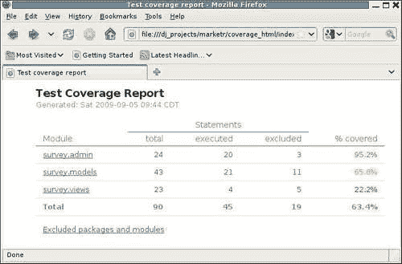

# 第五章填空：集成 Django 和其他测试工具

前几章讨论了 Django 1.1 附带的内置应用程序测试支持。我们首先学习了如何使用 doctest 测试应用程序的构建块，然后介绍了单元测试的基础知识。此外，我们还看到了`django.test.TestCase`和`django.test.Client`提供的函数如何帮助测试 Django 应用程序。通过示例，我们了解了如何使用这些函数来测试应用程序的更完整部分，例如它所服务的页面的内容及其表单处理行为。

然而，Django 本身并不能提供测试支持所需的一切。Django 毕竟是一个 web 应用程序框架，而不是一个测试框架。例如，它不提供任何测试覆盖率信息，这对于开发全面的测试套件至关重要，也不提供任何对测试客户端行为的支持，因为 Django 纯粹是一个服务器端框架。其他工具填补了这些空白，但通常希望将这些其他工具与 Django 集成，而不是使用几个完全不同的工具集来构建完整的应用程序测试套件。

在某些情况下，即使 Django 确实支持某个函数，也可能首选其他工具。例如，如果您已经有过 Python 测试框架的经验，例如`nose`，它提供了非常灵活的测试发现机制和强大的测试插件体系结构，那么您可能会发现 Django 的测试运行程序非常有限。类似地，如果您熟悉`twill`web 测试工具，您可能会发现使用 Django 的测试`Client`来测试表单行为比使用`twill`要麻烦。

在本章中，我们将研究 Django 与其他测试工具的集成。集成有时可以通过使用标准的 Python 单元测试扩展机制来完成，但有时需要更多。本章将介绍这两种情况。具体而言，我们将：

*   讨论集成中涉及的问题，并了解 Django 为将其他工具集成到其测试结构中提供的挂钩。
*   研究如何回答这个问题：我们的测试执行了多少代码？我们将看到如何在不改变 Django 测试设置的情况下，通过使用前面讨论的钩子来回答这个问题。
*   探索`twill`工具，看看如何在我们的 Django 应用程序测试中使用它而不是 Django 测试`Client`。对于这种集成，我们不需要使用任何 Django 钩子进行集成，只需要使用 Python 的单元测试钩子进行测试设置和分解。

# 整合问题

为什么 Django 测试与其他工具的集成是一个问题？考虑使用 AutoT0.测试框架的情况。它提供了自己的命令`nosetests`，用于在项目树中查找和运行测试。但是，尝试在 Django 项目树中运行`nosetests`而不是`manage.py test`，很快就会发现一个问题：

```py
kmt@lbox:/dj_projects/marketr$ nosetests 
E 
====================================================================== 
ERROR: Failure: ImportError (Settings cannot be imported, because environment variable DJANGO_SETTINGS_MODULE is undefined.) 
---------------------------------------------------------------------- 
Traceback (most recent call last): 
 File "/usr/lib/python2.5/site-packages/nose-0.11.1-py2.5.egg/nose/loader.py", line 379, in loadTestsFromName 
 addr.filename, addr.module) 
 File "/usr/lib/python2.5/site-packages/nose-0.11.1-py2.5.egg/nose/importer.py", line 39, in importFromPath 
 return self.importFromDir(dir_path, fqname) 
 File "/usr/lib/python2.5/site-packages/nose-0.11.1-py2.5.egg/nose/importer.py", line 86, in importFromDir 
 mod = load_module(part_fqname, fh, filename, desc) 
 File "/dj_projects/marketr/survey/tests/__init__.py", line 1, in <module> 
 from model_tests import * 
 File "/dj_projects/marketr/survey/tests/model_tests.py", line 2, in <module> 
 from django.test import TestCase 
 File "/usr/lib/python2.5/site-packages/django/test/__init__.py", line 5, in <module> 
 from django.test.client import Client 
 File "/usr/lib/python2.5/site-packages/django/test/client.py", line 24, in <module> 
 from django.db import transaction, close_connection 
 File "/usr/lib/python2.5/site-packages/django/db/__init__.py", line 10, in <module> 
 if not settings.DATABASE_ENGINE: 
 File "/usr/lib/python2.5/site-packages/django/utils/functional.py", line 269, in __getattr__ 
 self._setup() 
 File "/usr/lib/python2.5/site-packages/django/conf/__init__.py", line 38, in _setup 
 raise ImportError("Settings cannot be imported, because environment variable %s is undefined." % ENVIRONMENT_VARIABLE) 
ImportError: Settings cannot be imported, because environment variable DJANGO_SETTINGS_MODULE is undefined. 

---------------------------------------------------------------------- 
Ran 1 test in 0.007s 

FAILED (errors=1) 

```

这里的问题是`manage.py test`所做的一些环境设置缺失。具体来说，设置环境以便在调用 Django 代码时找到适当的设置还没有完成。在运行`nosetests`之前，可以通过设置`DJANGO_SETTINGS_MODULE`环境变量来修复此特定错误，但`nosetests`不会走得更远，因为缺少更多。

接下来将遇到的问题是需要使用数据库的测试。在运行任何测试之前，通过`manage.py test`调用的支持代码创建测试数据库。`nosetests`命令不知道是否需要测试数据库，因此在`nosetests`下运行时，需要数据库的 Django 测试用例将失败，因为数据库不存在。在运行`nosetests`之前，仅设置一个环境变量无法解决此问题。

有两种方法可以用来解决这样的集成问题。首先，如果另一个工具提供了用于添加功能的钩子，那么可以使用它们来执行一些操作，例如在运行测试之前设置环境和创建测试数据库。这种方法将 Django 测试集成到另一个工具中。或者，可以使用 Django 提供的钩子将其他工具集成到 Django 测试中。

第一个选项超出了本书的范围，因此不会详细讨论。然而，对于`nose`的特殊情况，其插件架构当然支持添加必要的功能，以使 Django 测试在`nose`下运行。当从`nosetests`调用 Django 应用程序测试时，可以使用现有的 nose 插件成功运行该测试。如果这是你自己测试的一种方法，你可能想在构建你自己的`nose`插件之前在网上搜索现有的解决方案。

第二个选项是我们将在本节中重点介绍的：Django 提供的挂钩，用于将其他函数拉入 Django 测试的正常路径。这里可以使用两个挂钩。首先，Django 允许指定替代的测试运行程序。将首先描述详细说明、测试运行者的职责以及它必须支持的接口。其次，Django 允许应用程序提供全新的管理命令。因此，可以使用另一个命令来扩充`manage.py test`，该命令可能支持不同的选项，并执行任何必要的操作，将另一个工具集成到测试路径中。我们还将讨论这方面的细节。

## 指定一个替代的测试跑步者

Django 使用`TEST_RUNNER`设置来决定调用什么代码来运行测试。默认情况下，`TEST_RUNNER`的值为`'django.test.simple.run_tests'`。我们可以查看该例程的声明和 docstring，看看它必须支持什么接口：

```py
def run_tests(test_labels, verbosity=1, interactive=True, extra_tests=[]):  
    """ 
    Run the unit tests for all the test labels in the provided list. 
    Labels must be of the form: 
     - app.TestClass.test_method 
        Run a single specific test method 
     - app.TestClass 
        Run all the test methods in a given class 
     - app 
        Search for doctests and unittests in the named application. 

    When looking for tests, the test runner will look in the models and tests modules for the application. 

    A list of 'extra' tests may also be provided; these tests 
    will be added to the test suite. 

    Returns the number of tests that failed. 
    """ 
```

`test_labels`、`verbosity`和`interactive`参数显然直接来自`manage.py test`命令行。`extra_tests`参数有点神秘，因为没有支持的`manage.py test`参数可能与之对应。事实上，当从`manage.py test`调用时，将永远不会指定`extra_tests`。Django 用来运行自己的测试套件的`runtests.py`程序使用了这个参数。除非您要编写一个用于运行 Django 自己的测试的测试运行程序，否则您可能不需要担心`extra_tests`。但是，自定义运行程序应该实现在这些运行中包含`extra_tests`的定义行为。

试跑者到底需要做什么？通过查看现有的`django.test.simple.run_tests`代码并查看它的功能，最容易回答这个问题。简单地说，不需要逐行进行例行检查，它：

*   通过调用`django.test.utils.setup_test_environment`设置测试环境。这是一个文档化的方法，自定义测试运行程序也应该调用它。例如，它会确保测试客户机生成的响应具有上一章中提到的`context`和`templates`属性。
*   将`DEBUG`设置为`False`。
*   生成一个包含在指定的`test_labels`下发现的所有测试的`unittest.TestSuite`。Django 的简单测试运行程序只在`models`和`tests`模块中搜索测试。
*   通过调用`connection.creation.create_test_db`创建测试数据库。这是 Django 测试文档中记录的另一个例程，供替代测试运行者使用。
*   运行测试。
*   通过调用`connection.creation.destroy_test_db`销毁测试数据库。
*   通过调用`django.test.utils.teardown_test_environment`清理测试环境。
*   返回测试失败和错误的总和。

### 注

请注意，Django 1.2 添加了对基于类的方法的支持，以指定替代的测试运行程序。虽然 Django 1.2 继续支持前面使用的和本文描述的基于函数的方法，但将来将不推荐使用基于函数的替代测试运行程序。基于类的方法简化了对测试运行行为进行微小更改的任务。您不需要重新实现（并且经常重复）现有的`django.tests.simple.run_tests`函数，您可以实现一个替代的 test runner 类，该类继承自默认类，并简单地重写实现所需替代行为所需的任何特定方法。

因此，编写测试运行程序相当简单。但是，在仅替换测试运行程序时，我们受到`manage.py test`命令支持的参数和选项的限制。如果我们的运行程序支持`manage.py test`不支持的某个选项，那么没有明显的方法将该选项从命令行传递给我们的测试运行程序。相反，`manage.py`测试将拒绝任何它不知道的选项。

有一种方法可以解决这个问题。Django 使用 Python`optparse`模块解析命令行中的选项。在命令行上放置一个裸的`–`或`–-`会导致`optparse`停止处理命令行，因此在裸的`–`或`–-`之后指定的选项不会被执行解析的常规 Django 代码看到。不过，我们在`sys.argv`中的测试运行程序仍然可以访问它们，因此可以检索它们并将其传递给我们正在集成的任何工具。

这个方法是可行的，但是这些选项的存在对用户来说是隐藏的，因为`test`命令的标准 Django 帮助对它们一无所知。通过使用这种技术，我们扩展了`manage.py test`支持的接口，而没有任何方式公开我们所做的扩展，作为`test`命令内置帮助的一部分。

因此，指定自定义测试运行程序的更好替代方法可能是提供一个全新的管理命令。在创建新命令时，我们可以将其定义为采用我们喜欢的任何选项，并提供当用户请求命令帮助时应为每个新选项显示的帮助文本。下面将讨论这种方法。

## 创建新的管理命令

提供新的管理命令很简单。Django 在每个安装的应用程序目录的`management.commands`包中查找管理命令。在已安装应用程序的`management.commands`包中找到的任何 Python 模块都可以自动指定为`manage.py`的命令。

因此，为了为我们的调查应用程序创建一个自定义测试命令，比如说`survey_test`，我们在调查下创建了一个`management`子目录，在`management`下创建了一个`commands`目录。我们将`__init__.py`文件放在这两个目录中，以便 Python 将它们识别为模块。然后，我们将`survey_test`命令的实现放在一个名为`survey_test.py`的文件中。

在`survey_test.py`中需要什么？从 Django 1.1 开始，关于实现管理命令的文档很少。它只说明文件必须定义一个名为`Command`的类来扩展`django.core.management.base.BaseCommand`。除此之外，它还建议咨询一些现有的管理命令，看看该怎么做。由于我们希望提供一个增强的测试命令，最简单的方法可能是将`test`命令的实现（在`django/core/management/commands/test.py`中找到）复制到我们的`survey_test.py`文件中。

查看该文件，我们看到管理命令实现包含两个主要部分。首先，在必要的导入和类声明之后，为类定义一些属性。这些控件控制它支持的选项以及应为命令显示的帮助：

```py
from django.core.management.base import BaseCommand 
from optparse import make_option 
import sys 

class Command(BaseCommand): 
    option_list = BaseCommand.option_list + ( 
        make_option('--noinput', action='store_false', dest='interactive', default=True, 
            help='Tells Django to NOT prompt the user for ''input of any kind.'), 
    ) 
    help = 'Runs the test suite for the specified applications, or '\ 'the entire site if no apps are specified.' 
    args = '[appname ...]' 

    requires_model_validation = False 
```

请注意，虽然官方 Django 1.1 文档中没有记录`BaseCommand`，但它确实有一个广泛的 docstring，因此可以通过查阅源代码或使用 Python shell 的帮助功能找到这些属性（`option_list`、`help`、`args`、`requires_model_validation`）的确切用途。即使不检查 docstring，我们也可以看到 Python 的标准`optparse`模块用于构建选项字符串，因此扩展`option_list`以包含其他参数是很简单的。例如，如果我们想添加一个`–-cover`选项来打开测试覆盖率数据的生成，我们可以将`option_list`规范更改为：

```py
     option_list = BaseCommand.option_list + (
        make_option('--noinput', action='store_false',
            dest='interactive', default=True,
            help='Tells Django to NOT prompt the user for '
                'input of any kind.'),
        make_option('--cover', action='store_true',
            dest='coverage', default=False,
            help='Tells Django to generate test coverage data.'),
    ) 
```

这里我们增加了对在命令行上指定`–-cover`的支持。如果指定，将导致`coverage`选项的值为`True`。如果未指定，此新选项将默认为`False`。除了添加对该选项的支持外，我们还可以为其添加帮助文本。

`Command`实现的声明部分后面是`handle`函数定义。这是将被调用以实现我们的`survey_test`命令的代码。来自`test`命令的现有代码为：

```py
    def handle(self, *test_labels, **options): 
        from django.conf import settings 
        from django.test.utils import get_runner 

        verbosity = int(options.get('verbosity', 1)) 
        interactive = options.get('interactive', True) 
        test_runner = get_runner(settings) 

        failures = test_runner(test_labels, verbosity=verbosity,  interactive=interactive) 
        if failures: 
            sys.exit(failures) 
```

如您所见，这将对传递的选项执行非常直接的检索，使用实用程序函数查找要调用的正确测试运行程序，并使用传递的选项简单地调用运行程序。当运行程序返回时，如果出现任何故障，程序将退出，系统退出代码设置为故障数。

我们可以用检索新选项并打印出是否已指定的代码替换最后四行：

```py
        coverage = options.get('coverage', False) 
        print 'Here we do our own thing instead of calling the test '\
            'runner.' 
        if coverage: 
            print 'Our new cover option HAS been specified.' 
        else: 
            print 'Our new cover option HAS NOT been specified.' 
```

现在，我们可以试着运行我们的`survey_test`命令来验证它是否被找到并可以接受我们的新选项：

```py
kmt@lbox:/dj_projects/marketr$ python manage.py survey_test --cover 
Here we do our own thing instead of calling the test runner. 
Our new cover option HAS been specified.

```

我们还可以验证，如果我们在命令行上没有通过`--cover`，它默认为`False`：

```py
kmt@lbox:/dj_projects/marketr$ python manage.py survey_test 
Here we do our own thing instead of calling the test runner. 
Our new cover 
option HAS NOT been specified. 

```

最后，我们可以看到，新命令的帮助响应中包含了我们选项的帮助：

```py
kmt@lbox:/dj_projects/marketr$ python manage.py survey_test --help 
Usage: manage.py survey_test [options] [appname ...] 

Runs the test suite for the specified applications, or the entire site if no apps are specified. 

Options: 
 -v VERBOSITY, --verbosity=VERBOSITY 
 Verbosity level; 0=minimal output, 1=normal output, 
 2=all output 
 --settings=SETTINGS   The Python path to a settings module, e.g. 
 "myproject.settings.main". If this isn't provided, the 
 DJANGO_SETTINGS_MODULE environment variable will be used. 
 --pythonpath=PYTHONPATH 
 A directory to add to the Python path, e.g. 
 "/home/djangoprojects/myproject". 
 --traceback           Print traceback on exception 
 --noinput             Tells Django to NOT prompt the user for input of any kind. 
 --cover               Tells Django to generate test coverage data. 
 --version             show program's version number and exit 
 -h, --help            show this help message and exit 

```

请注意，帮助消息中显示的所有其他选项（在我们的`option_list`中未指定）都是从`BaseCommand`继承的。在某些情况下，（例如，`settings`和`pythonpath`参数），在调用它们之前，会为我们对参数进行适当的处理；在其他情况下（例如`verbosity`），我们希望在实现中尊重选项的记录行为。

添加一个新的管理命令很容易！当然，我们实际上并没有实现运行测试和生成覆盖率数据，因为我们还不知道如何做到这一点。现有的软件包提供了这种支持，我们将在下一节中看到如何使用它们来实现这一点。

现在，我们不妨删除这里创建的`survey/management`树。这是一个很有用的练习，可以尝试了解如何添加管理命令。然而，在现实中，如果我们要提供一个定制的测试命令来添加诸如记录覆盖率数据之类的功能，那么将该功能直接绑定到我们的调查应用程序将是一种糟糕的方法。记录覆盖率数据的测试命令最好在独立的应用程序中实现。

# 我们测试了多少代码？

编写测试时，目标是测试所有内容。尽管我们可以试着保持警惕并手动确保我们的每一行代码都有一个测试，但如果没有一些自动化的分析来验证测试执行了哪些代码行，这是一个很难实现的目标。对于 Python 代码，Ned Batchelder 的`coverage`模块是确定正在执行哪些代码行的极好工具。在本节中，我们将了解如何使用`coverage`，首先作为一个独立的实用程序，然后集成到我们的 Django 项目中。

## 使用独立覆盖

在使用`coverage`之前，必须先安装它，因为 Python 和 Django 1.1 都不包含它。如果您使用的是 Linux，您的分发包管理器可能有`coverage`可安装在您的系统上。或者，`coverage`的最新版本可以在其 Python 包索引（PyPI）[的网页上找到 http://pypi.python.org/pypi/coverage](http://pypi.python.org/pypi/coverage) 。这里使用的`coverage`版本是 3.2。

一旦安装，我们可以使用带有`run`子命令的`coverage`命令来运行测试并记录覆盖率数据：

```py
kmt@lbox:/dj_projects/marketr$ coverage run manage.py test survey 
Creating test database... 
Creating table auth_permission 
Creating table auth_group 
Creating table auth_user 
Creating table auth_message 
Creating table django_content_type 
Creating table django_session 
Creating table django_site 
Creating table django_admin_log 
Creating table survey_survey 
Creating table survey_question 
Creating table survey_answer 
Installing index for auth.Permission model 
Installing index for auth.Message model 
Installing index for admin.LogEntry model 
Installing index for survey.Question model 
Installing index for survey.Answer model 
..................... 
---------------------------------------------------------------------- 
Ran 21 tests in 11.361s 

OK 
Destroying test database... 

```

如您所见，测试运行程序的输出看起来完全正常。覆盖模块不影响节目的输出；它只是将覆盖率数据存储在名为`.coverage`的文件中。

`.coverage`中存储的数据可以使用`coverage`的`report`子命令格式化为报表：

```py
kmt@lbox:/dj_projects/marketr$ coverage report
Name                                                 Stmts   Exec  Cover 
------------------------------------------------------------------------- 
/usr/share/pyshared/mod_python/__init__                   2      2   100% 
/usr/share/pyshared/mod_python/util                     330      1     0% 
/usr/share/pyshared/mx/TextTools/Constants/Sets          42     42   100% 
/usr/share/pyshared/mx/TextTools/Constants/TagTables     12     12   100% 
/usr/share/pyshared/mx/TextTools/Constants/__init__      1      1   100% 
/usr/share/pyshared/mx/TextTools/TextTools              259     47    18% 
/usr/share/pyshared/mx/TextTools/__init__                27     18    66% 
/usr/share/pyshared/mx/TextTools/mxTextTools/__init__    12      9    75% 
/usr/share/pyshared/mx/__init__                          2      2   100% 
/usr/share/pyshared/pysqlite2/__init__                  1      1   100% 
/usr/share/pyshared/pysqlite2/dbapi2               41     26    63% 
/usr/share/python-support/python-simplejson/simplejson/__init__      75     20    26% 
/usr/share/python-support/python-simplejson/simplejson/decoder      208    116    55% 
/usr/share/python-support/python-simplejson/simplejson/encoder      215     40    18% 
/usr/share/python-support/python-simplejson/simplejson/scanner       51     46    90% 
__init__                                                1      1   100% 
manage                                                 9      5    55% 
settings                                                 23     23   100% 
survey/__init__                                             1      1   100% 
survey/admin                                                         24     24   100% 
survey/models                                                        38     37    97% 
survey/tests/__init__                                                 4      4   100% 
survey/tests/admin_tests                                             23     23   100% 
survey/tests/model_tests                                             98     86    87% 
survey/tests/view_tests                                              47     47   100% 
survey/urls                                                           2      2   100% 
survey/views                                                         22     22   100% 
urls                                                                  4      4   100% 
------------------------------------------------------------------------------------- 
TOTAL                                                              1575    663    42% 

```

这比我们实际想要的多了一点。我们只关心我们自己代码的覆盖范围，所以首先，位于`/usr`下的模块报告的所有内容都不有趣。`coverage report`的`--omit`选项可用于省略以特定路径开头的模块。此外，`-m`选项可用于让`coverage`报告运行期间未执行（缺失）的行：

```py
kmt@lbox:/dj_projects/marketr$ coverage report --omit /usr -m 
Name                       Stmts   Exec  Cover   Missing 
-------------------------------------------------------- 
__init__                       1      1   100% 
manage                         9      5    55%   5-8 
settings                      23     23   100% 
survey/__init__                1      1   100% 
survey/admin                  24     24   100% 
survey/models                 38     37    97%   66
survey/tests/__init__          4      4   100% 
survey/tests/admin_tests      23     23   100% 
survey/tests/model_tests      98     86    87%   35-42, 47-51 
survey/tests/view_tests       47     47   100% 
survey/urls                    2      2   100% 
survey/views                  23     23   100% 
urls                           4      4   100% 
-------------------------------------------------------- 
TOTAL                        297    280    94% 

```

这更容易管理。毫不奇怪，因为我们一直在为所讨论的每一段代码开发测试，所以几乎所有内容都如本文所述。少了什么？如果您查看`manage.py`的第 5 行到第 8 行，它们处理`settings.py`的`import`引发`ImportError`的情况。由于这段代码没有成功运行，因此它们没有被执行，并且在覆盖率报告中丢失。

类似地，`model_tests`（35 到 42，47 到 51）中提到的行来自`testClosesReset`方法的替代执行路径，该方法包含从第 34 行开始的代码：

```py
        if settings.DATABASE_ENGINE == 'mysql': 
            from django.db import connection 
            c = connection.cursor() 
            c.execute('SELECT @@SESSION.sql_mode') 
            mode = c.fetchone()[0] 
            if 'STRICT' not in mode: 
                strict = False; 
                from django.utils import importlib 
                debug = importlib.import_module(
                    settings.SETTINGS_MODULE).DEBUG 

        if strict: 
            self.assertRaises(IntegrityError, s.save) 
        elif debug: 
            self.assertRaises(Exception, s.save) 
        else: 
            s.save() 
            self.assertEqual(s.closes, None) 
```

没有执行第 35 到 42 行，因为用于此运行的数据库是 SQLite，而不是 MySQL。然后，在任何一次测试运行中，`if strict/elif debug/else`块只有一个分支将执行，因此其他分支将显示为未覆盖。（在本例中，`if strict`腿就是被截取的腿。）

注为缺失的剩余行是`survey/models.py`中的第 66 行。这是`Question`模型的`__unicode__`方法实现，我们忽略了为其编写测试。我们可以把它放在我们的待办事项清单上。

尽管最后一条是缺失测试的有效指示，但无论是`manage.py`中的缺失行还是我们测试代码中的缺失行都不是我们真正关心的事情，因为它们没有报告我们应用程序代码的缺失覆盖率。（事实上，如果我们仔细研究的话，我们可能希望确保使用不同设置运行几次测试代码确实会导致完整的测试代码执行，但假设我们现在只对应用程序代码的覆盖范围感兴趣。）`coverage`模块支持从报告中排除代码的两种不同方式。一种可能性是使用`# pgrama no cover`指令注释源代码行，以告知`coverage`将其排除在`coverage`考虑范围之外。

或者，`coverage`提供了一个 Python API，该 API 支持为应自动排除的代码构造指定正则表达式，还支持限制报告中包含的模块。此 Python API 比通过命令行提供的功能更强大，并且比使用`# pragma`指令手动注释源代码更方便。然后，我们可能会开始研究如何编写一些`coverage`实用程序脚本，以便轻松生成应用程序代码测试的覆盖率报告。

然而，在开始这项任务之前，我们可能想知道是否有人已经做了同样的工作，并提供了一个集成了`coverage`和 Django 测试支持的现成实用程序。网络上的一些搜索显示，答案是肯定的——有几篇博客帖子讨论了这个主题，至少有一个项目打包为 Django 应用程序。下面将讨论此包的使用。

## 将覆盖整合到 Django 项目中

George Song 和 Mikhail Korobov 提供了一个名为`django_coverage`的 Django 应用程序，该应用程序支持将`coverage`集成到 Django 项目的测试中。与基本的`coverage`包一样，`django_coverage`可以在 PyPI 上找到：[http://pypi.python.org/pypi/django-coverage](http://pypi.python.org/pypi/django-coverage) 。这里使用的版本是 1.0.1。

`django_coverage`包使用前面讨论的两种方法提供`coverage`与 Django 的集成。首先，它提供了一个可以在`settings.py`中指定的测试转轮：

```py
TEST_RUNNER = 'django_coverage.coverage_runner.run_tests' 
```

使用此选项，每次运行`manage.py test`时，都会生成覆盖信息。

或者，`django_coverage`可以包含在`INSTALLED_APPS`中。使用此方法时，`django_coverage`应用程序提供一个新的管理命令，名为`test_coverage`。可以使用`test_coverage`命令代替`test`来运行测试并生成覆盖率信息。由于生成覆盖率信息确实会使测试运行得更慢，因此第二个选项是我们将在这里使用的。这样，当我们对快速执行感兴趣而不关心检查覆盖率时，我们可以选择在没有覆盖率数据的情况下运行测试。

除了在`INSTALLED_APPS`中列出`django_coverage`之外，不需要做任何事情来设置`django_coverage`来运行我们的项目。它附带了一个样本`settings.py`文件，其中显示了它支持的设置，所有这些设置都带有默认选项和注释，描述了它们的功能。通过在我们自己的设置文件中指定我们的首选值，我们可以覆盖`django_coverage/settings.py`中提供的任何默认设置。

不过，我们将首先使用提供的所有默认设置值。当我们运行`python manage.py test_coverage survey`时，我们会在测试输出的末尾显示覆盖信息：

```py
---------------------------------------------------------------------- 
Ran 21 tests in 10.040s 

OK 
Destroying test database... 
Name            Stmts   Exec  Cover   Missing 
--------------------------------------------- 
survey.admin       21     21   100% 
survey.models      30     30   100% 
survey.views       18     18   100% 
--------------------------------------------- 
TOTAL              69     69   100% 

The following packages or modules were excluded: survey.__init__ survey.tests survey.urls

There were problems with the following packages or modules: survey.templates survey.fixtures 

```

这有点奇怪。回想一下，`coverage`包在上一节中报告，`survey.models`中的一行代码没有通过`Question`模型的`__unicode__`方法进行测试。然而，这份报告显示`survey.models`的覆盖率为 100%。仔细观察这两个报告，我们可以看到`django_coverage`报告中列出的模块的语句都比`coverage`报告中的语句低。

此差异是由于`django_coverage`使用的`COVERAGE_CODE_EXCLUDES`设置的默认值造成的。此设置的默认值会导致不考虑所有`import`行、所有`__unicode__`方法定义和所有`get_absolute_url`方法定义。这些默认排除说明了这两个报告之间的差异。如果我们不喜欢这种默认行为，我们可以提供自己的备用设置，但现在，我们将保持原样。

此外，`coverage`列出的一些模块在`django_coverage`报告中完全缺失。这些也是默认设置值（在本例中为`COVERAGE_MODULE_EXCLUDES`）的结果，并且输出中有一条消息，指出哪些模块由于该设置而被排除。如您所见，`survey`中的`__init__`、`tests`和`urls`模块都自动排除在覆盖范围之外。

但是，`templates`和`fixtures`在默认情况下不被排除，这导致了一个问题，因为它们实际上不是 Python 模块，所以无法导入。为了消除关于加载这些问题的消息，我们可以在我们自己的`settings.py`文件中为`COVERAGE_MODULE_EXCLUDES`指定一个值，并包括这两个值。将它们添加到默认列表中，我们有：

```py
COVERAGE_MODULE_EXCLUDES = ['tests$', 'settings$', 'urls$',
                            'common.views.test', '__init__', 'django',
                            'migrations', 'fixtures$', 'templates$']
```

如果在进行此更改后再次运行`test_coverage`命令，我们将看到加载某些模块时出现问题的消息消失了。

测试输出中显示的摘要信息很有用，但更好的是 HTML 报告`django_coverage`可以生成。要获得这些，我们必须为`COVERAGE_REPORT_HTML_OUTPUT_DIR`设置指定一个值，默认情况下为`None`。所以我们可以在`/dj_projects/marketr`中创建`coverage_html`目录，并在`settings.py`中指定：

```py
COVERAGE_REPORT_HTML_OUTPUT_DIR = '/dj_projects/marketr/coverage_html'
```

当代码覆盖率达到 100%时，HTML 报告并不特别有趣。因此，为了查看报告的全部有用性，让我们只运行一个测试，比如尝试添加一个`closes`日期早于其`opens`日期的`Survey`的管理测试：

```py
python manage.py test_coverage survey.AdminSurveyTest.testAddSurveyError

```

这一次，由于我们为 HTML 覆盖率报告指定了一个目录，因此我们没有在测试运行结束时获取摘要覆盖率信息，而是看到：

```py
Ran 1 test in 0.337s

OK
Destroying test database...

HTML reports were output to '/dj_projects/marketr/coverage_html'

```

然后，我们可以使用 web 浏览器加载已放置在`coverage_html`目录中的`index.html`文件。它看起来像这样：



因为我们只运行了一个测试，所以我们只得到了代码的部分覆盖。HTML 报告中的**%覆盖**值采用颜色编码，以反映每个模块的覆盖程度。绿色好，黄色一般，红色差。在本例中，因为我们运行了一个管理测试，所以只有**survey.admin**是绿色的，而不是 100%。要查看该模块中遗漏的内容，我们可以点击**survey.admin**链接：


类似这样的报告提供了一种非常方便的方法来确定测试覆盖的应用程序代码部分和未覆盖的部分。未执行的行以红色突出显示。在这里，我们只运行了通过`SurveyFrom clean`方法测试错误路径的测试，因此通过该方法的成功代码路径显示为红色。此外，`import`行的颜色编码表明它们被排除在外。这是由于默认的`COVERAGE_CODE_EXCLUDES`设置。最后，文件中的六个空行被忽略（带有注释的行也将被忽略）。

我们使用`coverage`这样的工具对于确保测试套件完成其工作至关重要。在未来，Django 可能会提供一些集成的代码覆盖率支持。但同时，正如我们所看到的，将`coverage`作为附加组件集成到我们的项目中并不困难。在`django_coverage`的情况下，它提供了使用前面讨论的扩展 Django 的任一方法的选项。我们将讨论的下一个集成任务既不需要，也只需要标准的 Python 钩子进入单元测试设置和分解。

# twill 网页浏览测试工具

`twill`是一个 Python 包，支持与网站的命令行交互，主要用于测试目的。与`coverage`和`django_coverage`包装一样，斜纹布也可以在 PyPI:[上找到 http://pypi.python.org/pypi/twill](http://pypi.python.org/pypi/twill) 。虽然`twill`提供了一个交互使用的命令行工具，但它提供的命令也可以从 Python API 获得，这意味着可以从 Django`TestCase`中使用`twill`。当我们这样做时，我们基本上用一个替代的`twill`实现取代了 Django 测试`Client`的使用。

### 注

请注意，PyPI（撰写本文时为 0.9）上提供的`twill`的最新官方版本已经很旧了。最新的开发版本可在[上获得 http://darcs.idyll.org/~t/projects/twill-latest.tar.gz](http://darcs.idyll.org/~t/projects/twill-latest.tar.gz)。截至 2010 年 1 月的最新开发版本的输出如本节所示。这里包含的代码也在官方的 0.9 版本中进行了测试。所有操作都使用较旧的`twill`代码，但是`twill`的错误输出稍微没有帮助，并且当作为 Django`TestCase`的一部分运行时，有些`twill`输出无法抑制。因此，我推荐最新的开发版本而不是 0.9 版本。

为什么我们要使用`twill`而不是 Django 测试`Client`？为了理解使用`twill`而不是 Django 测试`Client`的动机，让我们回顾上一章中的管理定制测试。回想一下，我们提供了一个用于添加和编辑`Survey`对象的自定义表单。此表单有一个`clean`方法，在任何试图保存`Survey`且`opens`日期晚于`closes`日期的`Survey`时，都会引发`ValidationError`错误。确保`ValidationError`在应提升时提升的测试如下所示：

```py
    def testAddSurveyError(self): 
        post_data = { 
            'title': u'Time Traveling', 
            'opens': datetime.date.today(), 
            'closes': datetime.date.today() - datetime.timedelta(1), 
            'question_set-TOTAL_FORMS': u'0', 
            'question_set-INITIAL_FORMS': u'0', 
        } 
        response = self.client.post(
            reverse('admin:survey_survey_add'), post_data) 
        self.assertContains(response,"Opens date cannot come after closes date.") 
```

请注意，此测试向服务器发送一个 POST，其中包含 POST 数据字典，而没有为页面发出 GET。这首先导致了一个问题：回想一下，我们最初没有在 POST 字典中包含`question_set-TOTAL_FORMS`和`question_set-INITIAL_FORMS`值。我们专注于测试页面上表单的`Survey`部分，没有意识到管理员使用的表单集显示`Questions`与`Surveys`要求的其他值一致。当我们发现需要它们时，我们有点傲慢地将它们的值设置为`0`，并希望这对于我们想要测试的东西是可以接受的。

更好的方法是先`get`添加调查页面。响应将包括一个带有一组初始值的表单，这些初始值可作为字典返回的基础。在发出`post`请求之前，我们将仅更改测试所需的值（`title`、`opens`和`closes`。因此，当我们发出`post`调用时，服务器最初在表单中提供的任何其他表单值都将原封不动地发回。我们不必为我们的测试不打算更改的表单部分补足额外的值。

除了是一个更现实的服务器交互场景外，这种方法还确保服务器正确响应 GET 请求。在这种特殊情况下，测试 GET 路径是不必要的，因为我们添加到 admin 的附加验证不会影响它如何响应页面的 GET。但是，对于我们自己在响应中提供表单的一个视图，我们希望测试对`get`和`post`的响应。

那么为什么我们不这样写测试呢？测试`Client`支持`get`和`post`；我们当然可以从检索包含表单的页面开始。问题是返回的响应是 HTML，Django 测试`Client`没有提供任何实用函数来解析 HTML 表单并将其转换为我们可以轻松操作的内容。Django 没有直接的方法来获取响应，更改表单中的一些值，然后`post`将其返回到服务器。另一方面，`twill`软件包使这一过程变得简单。

在下面的章节中，我们将使用`twill`重新实现`AdminSurveyTest`。首先，我们将了解如何使用它的命令行工具，然后将我们学到的内容转换为 Django`TestCase`。

## 使用 twill 命令行程序

`twill`包包含一个名为`twill-sh`的 shell 脚本，用于进行命令行测试。这是一种方便的方法，可以进行一些初始测试，并确定测试用例代码需要做什么。在 shell 程序中，我们可以使用`go`命令访问页面。一旦我们访问了一个页面，我们就可以使用`showforms`命令查看页面上有哪些表单，以及表单包含哪些字段和初始值。由于我们将使用`twill`重新实现`AdminSurveyTest`，让我们看看访问我们测试服务器的`Survey`添加页面会产生什么：

```py
kmt@lbox:~$ twill-sh 

 -= Welcome to twill! =- 

current page:  *empty page* 
>> go http://localhost:8000/admin/survey/survey/add/ 
==> at http://localhost:8000/admin/survey/survey/add/ 
current page: http://localhost:8000/admin/survey/survey/add/ 
>> showforms 

Form #1 
## ## __Name__________________ __Type___ __ID________ __Value____________
1     username                 text      id_username 
2     password                 password  id_password 
3     this_is_the_login_form   hidden    (None)       1 
4  1  None                     submit    (None)       Log in 

current page: http://localhost:8000/admin/survey/survey/add/ 
>> 

```

显然，我们实际上没有进入调查添加页面。由于我们没有登录，服务器用一个登录页面进行响应。我们可以使用`formvalue`命令填写登录表单：

```py
>> formvalue 1 username kmt 
current page: http://localhost:8000/admin/survey/survey/add/ 
>> formvalue 1 password secret
current page: http://localhost:8000/admin/survey/survey/add/ 
>> 

```

`formvalue`的参数首先是表单编号，然后是字段名，然后是我们要为该字段设置的值。一旦我们在表格中填写了用户名和密码，我们就可以`submit`表格：

```py
>> submit 
Note: submit is using submit button: name="None", value="Log in" 

current page: http://localhost:8000/admin/survey/survey/add/ 

```

注意，`submit`命令也可以选择接受要使用的提交按钮的名称。如果只有一个（如此处所示），或者可以使用表单上的第一个提交按钮，我们可以简单地使用`submit`而不带任何参数。现在我们已经登录，我们可以再次使用`showforms`来查看我们是否真的检索到了`Survey`添加页面：

```py
>> showforms 

Form #1 
## ## __Name__________________ __Type___ __ID________ __Value____________
1     title                    text      id_title 
2     opens                    text      id_opens 
3     closes                   text      id_closes 
4     question_set-TOTAL_FORMS hidden    id_quest ... 4 
5     question_set-INITIAL ... hidden    id_quest ... 0 
6     question_set-0-id        hidden    id_quest ... 
7     question_set-0-survey    hidden    id_quest ... 
8     question_set-0-question  text      id_quest ... 
9     question_set-1-id        hidden    id_quest ... 
10    question_set-1-survey    hidden    id_quest ... 
11    question_set-1-question  text      id_quest ... 
12    question_set-2-id        hidden    id_quest ... 
13    question_set-2-survey    hidden    id_quest ... 
14    question_set-2-question  text      id_quest ... 
15    question_set-3-id        hidden    id_quest ... 
16    question_set-3-survey    hidden    id_quest ... 
17    question_set-3-question  text      id_quest ... 
18 1  _save                    submit    (None)       Save 
19 2  _addanother              submit    (None)       Save and add another 
20 3  _continue                submit    (None)       Save and continue editing 

current page: http://localhost:8000/admin/survey/survey/add/ 
>> 

```

这看起来更像一个`Survey`添加页面。事实上，在我们的第一个测试用例中，我们将`question_set-TOTAL_FORMS`设置为`0`是不现实的，因为服务器实际上提供了一个设置为`4`的表单。但它奏效了。这意味着我们不必为四个内联问题生成值，因此这不是一个致命的缺陷。然而，使用`twill`我们可以采取更现实的方法，即保持所有这些值不变，只更改我们感兴趣的字段，再次使用`formvalue`命令：

```py
>> formvalue 1 title 'Time Traveling' 
current page: http://localhost:8000/admin/survey/survey/add/ 
>> formvalue 1 opens 2009-08-15 
current page: http://localhost:8000/admin/survey/survey/add/ 
>> formvalue 1 closes 2009-08-01 
current page: http://localhost:8000/admin/survey/survey/add/ 

```

当我们提交该表单时，我们希望服务器以重新显示的相同表单和来自我们自定义`clean`方法的`ValidationError`消息文本作出响应。我们可以使用`find`命令验证返回页面上的文本：

```py
>> submit 
Note: submit is using submit button: name="_save", value="Save" 

current page: http://localhost:8000/admin/survey/survey/add/ 
>> find "Opens date cannot come after closes date." 
current page: http://localhost:8000/admin/survey/survey/add/ 
>>

```

对`find`的反应可能不会立即表明它是否有效。让我们看看它对页面上不太可能出现的内容做了什么：

```py
>> find "lalalala I don't hear you" 

ERROR: no match to 'lalalala I don't hear you' 

current page: http://localhost:8000/admin/survey/survey/add/ 
>> 

```

好的，因为`twill`在找不到文本时明显会抱怨，所以第一个`find`必须在页面上成功找到预期的验证错误文本。现在，我们可以再次使用`showforms`来查看服务器是否已将我们提交的表单发回。请注意，初始值是我们提交的值，而不是我们第一次检索页面时的空值：

```py
>> showforms 

Form #1 
## ## __Name__________________ __Type___ __ID________ __Value________________
1     title                    text      id_title     Time Traveling 
2     opens                    text      id_opens     2009-08-15 
3     closes                   text      id_closes    2009-08-01 
4     question_set-TOTAL_FORMS hidden    id_quest ... 4 
5     question_set-INITIAL ... hidden    id_quest ... 0 
6     question_set-0-id        hidden    id_quest ... 
7     question_set-0-survey    hidden    id_quest ... 
8     question_set-0-question  text      id_quest ... 
9     question_set-1-id        hidden    id_quest ... 
10    question_set-1-survey    hidden    id_quest ... 
11    question_set-1-question  text      id_quest ... 
12    question_set-2-id        hidden    id_quest ... 
13    question_set-2-survey    hidden    id_quest ... 
14    question_set-2-question  text      id_quest ... 
15    question_set-3-id        hidden    id_quest ... 
16    question_set-3-survey    hidden    id_quest ... 
17    question_set-3-question  text      id_quest ... 
18 1  _save                    submit    (None)       Save 
19 2  _addanother              submit    (None)     Save and add another 
20 3  _continue                submit    (None)     Save and continue editing 

current page: http://localhost:8000/admin/survey/survey/add/ 
>>

```

此时，我们可以简单地调整其中一个日期，使表单有效，然后再次尝试提交：

```py
>> formvalue 1 opens 2009-07-15 
current page: http://localhost:8000/admin/survey/survey/add/ 
>> submit 
Note: submit is using submit button: name="_save", value="Save" 

current page: http://localhost:8000/admin/survey/survey/ 
>> 

```

注意**当前页面**已更改为调查变更列表页面（URL 路径末尾不再有`add`。这是一条线索，表明`Survey`添加这次起作用了，因为服务器在成功保存时重定向到变更列表页面。有一个`twill`命令显示页面的 HTML 内容，名为`show`。当你有一个可以滚动的显示窗口时，查看返回了哪个页面是很有用的。然而，HTML 页面在纸上复制时不是很有用，所以这里不显示。

`twill`还提供了许多更有用的命令，这些命令超出了我们现在讨论的范围。这里的讨论旨在简单地体验一下`twill`提供了什么，并展示如何在 Django 测试用例中使用它。接下来将介绍第二项任务。

## 在测试用例中使用斜纹布

我们需要做什么才能将我们在`twill-sh`项目中所做的事情转化为`TestCase`？首先，我们需要在测试代码中使用`twill`的 Python API。我们在`twill-sh`中使用的`twill`命令在`twill.commands`模块中提供。此外，`twill`还提供了一个浏览器对象（可通过`twill.get_browser()`访问），该对象可能更适合从 Python 调用。例如，命令的浏览器对象版本可能返回值，而不是在屏幕上打印某些内容。但是，browser 对象并不直接支持`twill.commands`中的所有命令，因此通常混合使用`twill.commands`方法和 browser 方法。混合使用是可以的，因为`twill.commands`中的代码在内部操作从`twill.get_browser()`返回的相同浏览器实例。

其次，出于测试代码的目的，我们希望指示`twill`直接与 Django 服务器应用程序代码交互，而不是向实际的服务器发送请求。使用`twill-sh`代码对正在运行的开发服务器进行测试是可以的，但我们不希望为了通过测试而让服务器运行。Django 测试`Client`自动执行此操作，因为它是专门为从测试代码中使用而编写的。

使用`twill`，我们必须调用其`add_wsgi_intercept`方法，告诉它将特定主机和端口的请求直接路由到 WSGI 应用程序，而不是在网络上发送请求。Django 提供了一个类，该类支持`django.core.handlers.wsgi`中的 WSGI 应用程序接口（名为`WSGIHandler`。因此，在测试中使用`twill`的设置代码中，我们可以包含如下代码：

```py
from django.core.handlers.wsgi import WSGIHandler 
import twill 
TWILL_TEST_HOST = 'twilltest'   
twill.add_wsgi_intercept(TWILL_TEST_HOST, 80, WSGIHandler) 
```

这告诉`twill`应该使用`WSGIHandler`实例来处理在常规 HTTP 端口 80 上绑定到名为`twilltest`的主机的任何请求。此处使用的实际主机名和端口并不重要；它们必须简单地匹配测试代码尝试访问的主机名和端口。

这就引出了我们必须在测试代码中考虑的第三件事。我们在 Django 测试`Client`中使用的 URL 没有主机名或端口组件，因为测试`Client`不会根据这些信息执行任何路由，而是直接将请求发送到我们的应用程序代码。另一方面，`twill`接口确实希望传递给它的 URL 中包含主机（和可选端口）组件。因此，我们需要为`twill`构建正确的 URL，并通过它进行适当的路由。由于我们通常在测试期间使用 Django 的`reverse`来创建 URL，因此一个实用程序函数将获取一个命名 URL 并将其反转结果返回到`twill`将正确处理的表单中，这将非常有用：

```py
def reverse_for_twill(named_url): 
    return 'http://' + TWILL_TEST_HOST + reverse(named_url) 
```

请注意，由于我们在`add_wsgi_intercept`调用中使用了默认 HTTP 端口，因此不需要在 URL 中包含端口号。

关于使用`WSGIHandler`应用程序接口进行测试，需要注意的一点是，默认情况下，该接口会抑制在处理请求期间引发的任何异常。这与`mod_wsgi`模块在 Apache 下运行时使用的接口相同。在这样的环境中，`WSGIHandler`向其调用者公开异常是不可接受的，因此它捕获所有异常并将其转换为服务器错误（HTTP 500）响应。

尽管在生产环境中抑制异常是正确的行为，但它对测试不是很有用。生成的服务器错误响应而不是异常对于确定问题的起因完全没有帮助。因此，在被测代码引发异常的情况下，这种行为可能会使诊断测试失败变得非常困难。

为了解决这个问题，Django 有一个设置`DEBUG_PROPAGATE_EXCEPTIONS`，可以设置为`True`，告诉`WSGIHandler`接口允许异常向上传播。此设置默认为`False`，在生产环境中不应设置为`True`。然而，我们的`twill`测试设置代码应该将其设置为`True`，这样，如果在请求处理过程中引发异常，则在运行测试时可以看到异常，而不是被一般服务器错误响应所取代。

使用 Django 的`WSGIHandler`接口进行测试涉及到的最后一个问题是为单个测试发出的多个网页请求维护单个数据库连接。通常，每个请求（页面的 GET 或 POST）都使用自己新建立的数据库连接。在成功请求的处理结束时，提交数据库连接上任何打开的事务，并关闭数据库连接。

然而，正如在[第 4 章](04.html "Chapter 4. Getting Fancier: Django Unit Test Extensions")末尾所指出的，*变得更花哨了：Django 单元测试扩展*，`TestCase`代码阻止被测试代码发出的任何数据库提交实际到达数据库。因此，在测试数据库时，不会看到在请求结束时通常出现的提交，而是会看到连接关闭。某些数据库，如带有 InnoDB 存储引擎的 PostgreSQL 和 MySQL，在这种情况下会自动回滚打开的事务。这将导致测试出现问题，这些测试需要发出多个请求，并且由早期请求进行的数据库更新可供后续请求访问。例如，任何需要登录的测试都会遇到问题，因为登录信息存储在`django_session`数据库表中。

解决这个问题的一种方法是使用`TransactionTestCase`而不是`TestCase`作为我们所有使用`twill`的测试的基类。使用`TransactionTestCase`，通常在请求处理结束时发生的提交将像往常一样发送到数据库。但是，对于`TransactionTestCase`而言，在每次测试之间将数据库重置为干净状态的过程要比`TestCase`慢得多，因此这种方法可能会大大降低我们的测试速度。

另一种解决方案是防止在请求处理结束时关闭数据库连接。这样就没有什么可以触发数据库在测试中间回滚任何更新。作为测试`setUp`方法的一部分，我们可以通过断开`close_connection`信号处理器与`request_finished`信号的连接来实现这一点。这不是一个非常干净的解决方案，但它值得性能提升（这也是测试`Client`克服相同问题所做的）。

那么，让我们从为`AdminSurveyTest`编写`setUp`方法的`twill`版本开始。上一章的测试`Client`版本为：

```py
class AdminSurveyTest(TestCase):
    def setUp(self):
        self.username = 'survey_admin'
        self.pw = 'pwpwpw'
        self.user = User.objects.create_user(self.username, '', " "self.pw)
        self.user.is_staff= True
        self.user.is_superuser = True
        self.user.save()
        self.assertTrue(self.client.login(username=self.username, password=self.pw),
            "Logging in user %s, pw %s failed." % (self.username, self.pw))
```

`twill`版本将需要执行相同的用户创建步骤，但登录时会有所不同。我们不会复制用户创建代码，而是将其分解为一个通用基类（称为`AdminTest`），用于`AdminSurveyTest`和`twill`版本`AdminSurveyTwillTest`。对于登录`twill`版本，我们可以填写并提交登录表单，如果我们在登录之前尝试进入任何管理页面，将返回该表单。因此，`setUp`的`twill`版本可能如下所示：

```py
from django.db import close_connection
from django.core import signals
from django.core.handlers.wsgi import WSGIHandler 
from django.conf import settings
import twill 

class AdminSurveyTwillTest(AdminTest): 
    def setUp(self): 
        super(AdminSurveyTwillTest, self).setUp() 
        self.old_propagate = settings.DEBUG_PROPAGATE_EXCEPTIONS
        settings.DEBUG_PROPAGATE_EXCEPTIONS = True
        signals.request_finished.disconnect(close_connection)
        twill.add_wsgi_intercept(TWILL_TEST_HOST, 80, WSGIHandler) 
        self.browser = twill.get_browser() 
        self.browser.go(reverse_for_twill('admin:index')) 
        twill.commands.formvalue(1, 'username', self.username) 
        twill.commands.formvalue(1, 'password', self.pw) 
        self.browser.submit() 
        twill.commands.find('Welcome') 
```

此`setUp`首先调用超类`setUp`创建管理员用户，然后保存现有`DEBUG_PROPAGATE_EXCEPTIONS`设置，再将其设置为`True`。然后断开`close_connection`信号处理器与`request_finished`信号的连接。接下来，它调用`twill.add_wsgi_intercept`设置`twill`，将`twilltest`主机的请求路由到 Django 的`WSGIHandler`。为了方便访问，它将`twill`浏览器对象隐藏在`self.browser`中。然后，它使用前面提到的`reverse_for_twill`实用程序函数为管理索引页面创建适当的 URL，并调用浏览器`go`方法检索该页面。

返回的页面应该有一个包含`username`和`password`字段的表单。这些设置为用户使用`formvalue`命令通过超类`setUp`创建的值，并使用浏览器`submit`方法提交表单。如果登录有效，结果应该是管理索引页面。该页面将包含字符串`Welcome`，因此`setUp`例程所做的最后一件事是验证在该页面上是否找到了文本，这样，如果登录失败，将在遇到问题时而不是稍后出现错误。

当我们写`setUp`的时候，我们也应该写下伴随`tearDown`方法来撤销`setUp`的影响：

```py
    def tearDown(self): 
        self.browser.go(reverse_for_twill('admin:logout')) 
        twill.remove_wsgi_intercept(TWILL_TEST_HOST, 80)
        signals.request_finished.connect(close_connection) 
        settings.DEBUG_PROPAGATE_EXCEPTIONS = self.old_propagate 
```

在这里，我们`go`进入管理员注销页面，从管理员站点注销，调用`remove_wsgi_intercept`删除名为`twilltest`的主机的特殊路由，将正常的`close_connection`信号处理器重新连接到`request_finished`信号，最后恢复`DEBUG_PROPAGATE_EXCEPTIONS`的旧值。

检查错误案例`closes`早于`opens`的`twill`版本的测试案例例程将是：

```py
    def testAddSurveyError(self): 
        self.browser.go(reverse_for_twill('admin:survey_survey_add')) 
        twill.commands.formvalue(1, 'title', 'Time Traveling') 
        twill.commands.formvalue(1, 'opens', str(datetime.date.today())) 
         twill.commands.formvalue(1, 'closes',
            str(datetime.date.today()-datetime.timedelta(1)))
        self.browser.submit()
        twill.commands.url(reverse_for_twill(
            'admin:survey_survey_add'))
        twill.commands.find("Opens date cannot come after closes "
            "date.") 
```

与测试`Client`版本不同，我们从访问管理员`Survey`添加页面开始。我们希望响应包含单个表单，并在其中为`title`、`opens`和`closes`设置值。我们不关心表格中的任何其他内容，保持不变。然后我们`submit`填写表格。

我们希望在错误情况下（考虑到我们在`opens`前一天进行了`closes`，应该是这样），管理员将重新显示带有错误消息的同一页面。我们首先使用`twill url`命令来测试当前 URL 是否仍然是`Survey`添加页面 URL。然后，我们还使用`twill find`命令来验证是否在页面上找到了预期的错误消息。（可能只需要执行其中一项检查，但同时执行两项检查并没有什么坏处。因此，为了便于说明，这里包含了这两项检查。）

如果我们现在使用`python manage.py test survey.AdminSurveyTwillTest`运行这个测试，我们将看到它是有效的，但是`twill`有点健谈，即使在使用 Python API 时也是如此。在测试输出结束时，我们将看到：

```py
Installing index for survey.Answer model 
==> at http://twilltest/admin/ 
Note: submit is using submit button: name="None", value="Log in" 

==> at http://twilltest/admin/survey/survey/add/ 
Note: submit is using submit button: name="_save", value="Save" 

==> at http://twilltest/admin/logout/ 
. 
---------------------------------------------------------------------- 
Ran 1 test in 0.845s 

OK 
Destroying test database... 

```

我们不希望`twill`的输出弄乱我们的测试输出，所以我们希望将此输出重定向到其他地方。幸运的是，`twill`为此提供了一个例程，`set_output`。因此，我们可以在`setUp`方法中添加以下内容：

```py
        twill.set_output(StringIO())
```

将其置于打印输出的任何`twill`命令之前，并记住在引用`StringIO`之前在导入中包括`from StringIO import StringIO`。我们也应该在`tearDown`例程中通过调用`twill.commands.reset_output()`来撤销这一点。这将恢复`twill`向屏幕发送输出的默认行为。在进行这些更改之后，如果我们再次运行测试，我们将看到它通过了，`twill`输出不再存在。

最后一个要写的是添加一个日期不触发验证错误的`Survey`的测试用例。可能是这样的：

```py
    def testAddSurveyOK(self): 
        self.browser.go(reverse_for_twill('admin:survey_survey_add')) 
        twill.commands.formvalue(1, 'title', 'Not Time Traveling') 
        twill.commands.formvalue(1, 'opens', str(datetime.date.today())) 
        twill.commands.formvalue(1, 'closes', str(datetime.date.today())) 
        self.browser.submit() 
        twill.commands.url(reverse_for_twill('admin:survey_survey_changelist'))
```

这与前面的测试非常相似，只是我们尝试验证是否在预期的成功提交上重定向到 admin changelist 页面。如果我们运行这个测试，它将通过，但它实际上是不正确的。也就是说，如果管理员实际上重新显示添加页面而不是重定向到变更列表页面，则不会失败。因此，如果我们破坏了某些东西并导致应该成功的提交失败，那么这个测试将无法捕获它。

为此，将此测试用例中的`closes`日期更改为`opens`前一天。这将触发一个错误，就像在`testAddSurveyError`方法中一样。但是，如果我们使用该更改运行测试，它仍然会通过。

原因是`twill url`命令将正则表达式作为其参数。它不是检查传递的参数是否与实际 URL 完全匹配，而是检查实际 URL 是否与传递给`url`命令的正则表达式匹配。我们传递到`url`方法中的变更列表 URL 是：

`http://twilltest/admin/survey/survey/`

提交时出错时将重新显示的添加页面的 URL 为：

`http://twilltest/admin/survey/survey/add/`

尝试将添加页面 URL 与变更列表页面 URL 匹配将成功，因为变更列表 URL 包含在添加页面 URL 中。因此，`twill url`命令不会像我们希望的那样引发错误。为了解决这个问题，我们必须在传递到`url`的正则表达式中指出，我们需要实际 URL 在传递的值结束时结束，方法是在传递的值上包含一个字符串结束标记：

```py
twill.commands.url(reverse_for_twill('admin:survey_survey_changelist') + '$') 
```

我们也可以在开头包含一个字符串标记，但实际上并不需要它来解决这个特定的问题。如果我们进行了更改并保留了不正确的`closes`日期设置，我们将看到，当服务器重新显示添加页面时，该测试用例现在确实失败了，而不是成功处理提交：

```py
====================================================================== 
ERROR: testAddSurveyOK (survey.tests.admin_tests.AdminSurveyTwillTest) 
---------------------------------------------------------------------- 
Traceback (most recent call last): 
 File "/dj_projects/marketr/survey/tests/admin_tests.py", line 91, in testAddSurveyOK 
 twill.commands.url(reverse_for_twill('admin:survey_survey_changelist') + '$') 
 File "/usr/lib/python2.5/site-packages/twill/commands.py", line 178, in url 
 """ % (current_url, should_be,)) 
TwillAssertionError: current url is 'http://twilltest/admin/survey/survey/add/'; 
does not match 'http://twilltest/admin/survey/survey/$' 

---------------------------------------------------------------------- 
Ran 2 tests in 1.349s 

FAILED (errors=1) 
Destroying test database... 

```

一旦我们在服务器没有如我们预期的那样响应的情况下验证测试是否失败，我们就可以将`closes`日期设置恢复为可接受的保存状态，测试将再次通过。这里的一个教训是在使用`twill`提供的`url`命令时要小心。第二个教训是始终尝试验证测试是否会在适当的时候报告失败。当我们专注于编写通过的测试时，我们常常会忘记验证测试在应该失败时是否会正确失败。

我们现在有了基于`twill`的管理定制测试版本。实现这一目标并非易事，例如，对某些`setUp`代码的需求并不一定是显而易见的。然而，一旦到位，它就可以很容易地被需要比我们这里需要的更复杂的表单操作的测试重用。表单操作是 Django 测试框架的一个弱点，在 Django 中通过添加与外部工具中已有的功能重复的功能来解决这个问题的可能性不大。更有可能的是，在未来，Django 将提供与`twill`或其他类似工具更容易的集成。因此，投资于学习如何使用像`twill`这样的工具可能是一个很好的时间利用。

# 总结

这就结束了对 Django 应用程序测试的讨论。在本章中，我们重点讨论了如何通过与其他测试工具集成来填补 Django 中测试函数的任何空白。不可能涵盖与每个工具集成的细节，但我们了解了可用的一般机制，并详细讨论了几个示例。这为理解如何完成任务提供了坚实的基础。

随着 Django 的不断发展，这种差距可能会越来越小，但 Django 不太可能在测试支持方面提供每个人都想要的一切。在某些情况下，Python 的类继承结构和单元测试扩展机制允许将其他测试工具直接集成到 Django 测试用例中。在其他情况下，这是不够的。因此，Django 还提供了用于添加附加功能的钩子，这是很有帮助的。在本章中，我们：

*   了解了 Django 为添加测试函数提供的功能
*   查看了如何使用这些挂钩的示例，特别是在添加代码覆盖率报告的情况下
*   还探讨了一个示例，在将`twill`测试工具的使用集成到 Django 测试用例中时，不需要使用这些挂钩

在下一章中，我们将从测试转向调试，并开始了解 Django 提供了哪些工具来帮助调试 Django 应用程序。