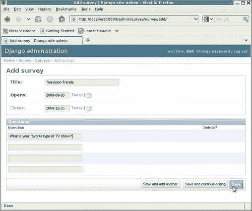
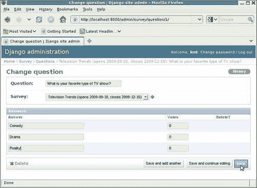
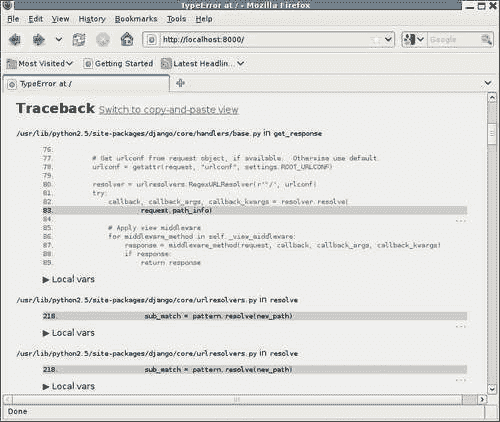
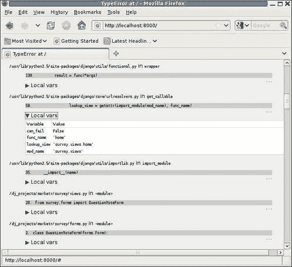
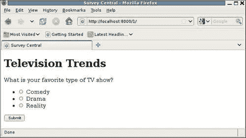
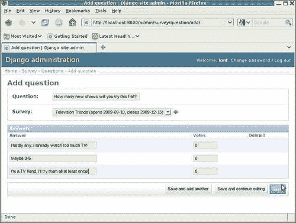
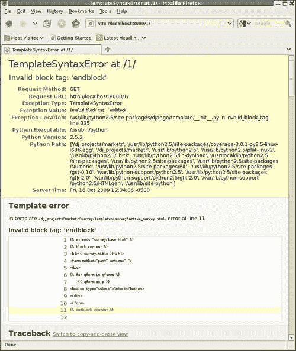
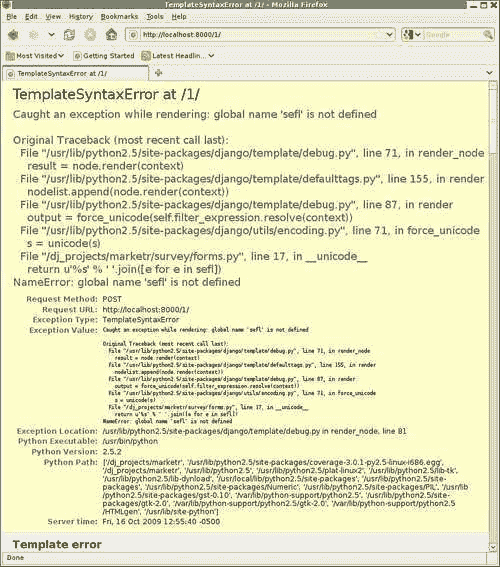
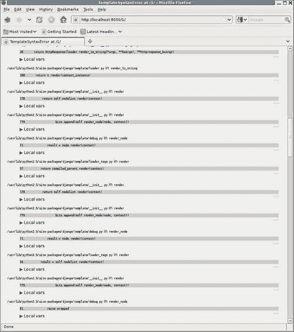
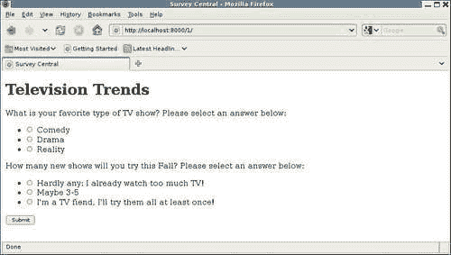

# 第 7 章轮子脱落时：理解 Django 调试页面

当您的代码在生产环境中运行时，您最不希望看到的就是它遇到一个非常严重的错误，因此可以返回给客户端的唯一消息是“很抱歉，服务器遇到错误，请稍后重试”。但是，在开发过程中，这些服务器错误情况是最糟糕的结果之一。它们通常表示出现了例外情况，当出现这种情况时，有大量信息可用于找出哪里出了问题。当`DEBUG`打开时，该信息以 Django 调试页面的形式返回，作为对导致错误的请求的响应。在本章中，我们将学习如何理解和使用 Django 调试页面提供的信息。

具体而言，在本章中，我们将：

*   继续开发示例调查应用程序，在此过程中犯一些典型错误
*   看看这些错误是如何以 Django 调试页面的形式表现出来的
*   了解这些调试页面上提供的信息
*   对于每一个错误，深入到结果调试页面上的可用信息中，查看如何使用它来理解错误并确定如何修复错误

# 开始调查投票实施

在[第 4 章](04.html "Chapter 4. Getting Fancier: Django Unit Test Extensions")*中，我们开始开发代码，为`survey`应用程序提供页面服务。我们实现了主页视图。此视图生成一个页面，列出活动调查和最近关闭的调查，并根据需要提供链接，以获取活动调查或显示已关闭调查的结果。这两种链路路由到相同的查看功能`survey_detail`，该查看功能进一步基于`Survey`的状态路由请求，该`Survey`已请求详细信息：*

```py
def survey_detail(request, pk): 
    survey = get_object_or_404(Survey, pk=pk) 
    today = datetime.date.today() 
    if survey.closes < today: 
        return display_completed_survey(request, survey) 
    elif survey.opens > today: 
        raise Http404("%s does not open until %s; it is only %s" %
            (survey.title, survey.opens, today))
    else: 
        return display_active_survey(request, survey) 
```

然而，我们并没有编写代码来实际显示一个活动的`Survey`或显示一个`Survey`的结果。相反，我们创建了占位符视图和模板，这些视图和模板只是说明页面最终要显示的内容。例如，`display_active_survey`功能被简单地保留为：

```py
def display_active_survey(request, survey): 
    return render_to_response('survey/active_survey.html', {'survey': survey}) 
```

它引用的模板`active_survey.html`包含：

```py
 
 
<h1>Survey questions for {{ survey.title }}</h1> 
 
```

现在，我们将从这里结束的地方开始，并开始用处理显示活动`Survey`的实际代码替换此占位符视图和模板。

这样做涉及到什么？首先，当收到显示活动调查的请求时，我们希望返回一个页面，显示`Survey`中的问题列表，每个问题都有相关的可能答案。此外，我们希望以某种方式呈现这些问题，以便用户可以参与`Survey`，并提交他们选择的问题答案。因此，我们需要以 HTML 形式呈现问答数据，并且在服务器上有代码来处理接收、验证、记录和响应发布的`Survey`响应。

所有这些都是需要立即解决的问题。我们可以首先实现的最小的一个部分是什么，它将允许我们开始试验并验证我们是否朝着正确的方向前进？我们将从一个表单的显示开始，该表单允许用户查看单个问题并从相关答案中进行选择。不过，首先，让我们用一些合理的测试数据来建立开发数据库。

## 创建投票测试数据

由于我们使用这些模型已经有一段时间了，我们可能不再有任何积极的调查。让我们从头开始，运行`manage.py reset survey`。然后，确保开发服务器正在运行，并使用管理应用程序创建新的`Survey`、`Question`和`Answers`。这是将在下面的示例中使用的`Survey`：



本`Survey`中`Question`定义的`Answers`为：



Th这就足够开始了。我们可以稍后回来，根据需要添加更多数据。现在，我们将继续开发用于显示`Question`的表单，并选择其中一个答案。

## 定义用于投票的问题表格

The Django`forms`包为创建、显示、验证和处理 HTML 表单数据提供了方便的框架。在 forms 包中，`ModelForm`类 i通常用于自动构建表示模型的表单。我们最初可能认为使用`ModelForm`可以方便地完成我们的任务，但`ModelForm`不能提供我们所需要的。回想一下，`survey`应用程序`Question`模型包含以下字段：

```py
class Question(models.Model): 
    question = models.CharField(max_length=200) 
    survey = models.ForeignKey(Survey) 
```

此外，`Answer`模型为：

```py
class Answer(models.Model): 
    answer = models.CharField(max_length=200) 
    question = models.ForeignKey(Question) 
    votes = models.IntegerField(default=0) 
```

`ModelForm`包含模型中定义的每个字段的 HTML 输入字段。因此，`Question`模型的`ModelForm`将包括允许用户更改`question`字段内容的文本输入，以及允许用户选择与该`Question`关联的`Survey`实例的选择框。那根本不是我们想要的。也不是我们正在寻找的从`Answer`模型构建的`ModelForm`。

Ra另外，我们需要一个表单，该表单将显示`question`字段的文本（但不允许用户更改该文本），以及与`Question`实例关联的所有`Answer`实例，以允许用户选择所列答案中的一个。这听起来像是一个 HTML 单选输入组，其中单个单选按钮值由与`Question`实例关联的`Answers`集合定义。

我们可以使用 Django 提供的基本表单字段和小部件类创建一个自定义表单来表示这一点。让我们创建一个新文件`survey/forms.py`，并在其中加入实现表单的初步尝试，该表单将用于显示`Question`及其相关答案：

```py
from django import forms
class QuestionVoteForm(forms.Form): 
    answer = forms.ModelChoiceField(widget=forms.RadioSelect) 

    def __init__(self, question, *args, **kwargs): 
        super(QuestionVoteForm, self).__init__(*args, **kwargs) 
        self.fields['answer'].queryset = question.answer_set.all() 
```

此表单名为`QuestionVoteForm`and，只有一个字段`answer`，即 a`ModelChoiceField`。此类字段允许从`QuerySet`定义的一组选项中进行选择，该选项由`queryset`属性指定。由于此字段的正确答案集将取决于构建表单的特定`Question`实例，因此我们省略在字段声明中指定`queryset`，并稍后在`__init__`例程中进行设置。但是，我们确实在字段声明中指定要使用`RadioSelect`小部件 f或 display，而不是默认的`Select`小部件（在 HTML 选择下拉框中显示选项）。

在对单个`answer`字段进行声明之后，表单定义了`__init__`方法的重写。此`__init__`要求在创建表单实例时传入一个`question`参数。在使用可能提供的任何其他参数首次调用`__init__`超类后，传递的`question`用于将`answer`字段的`queryset`属性设置为与此`Question`实例关联的答案集。

为了查看此表单是否按预期显示，我们需要在`display_active_survey`函数 a中创建其中一个表单，并将其传递给模板进行显示。现在，我们不想担心显示问题列表；我们将只选择一个传递给模板。所以我们可以将`display_active_survey`改为：

```py
from survey.forms import QuestionVoteForm 
def display_active_survey(request, survey): 
    qvf = QuestionVoteForm(survey.question_set.all()[0]) 
    return render_to_response('survey/active_survey.html', {'survey': survey, 'qvf': qvf}) 
```

现在，该函数为指定调查的问题集中的第一个问题创建一个`QuestionVoteForm`实例，并将该表单作为上下文变量`qvf`传递给模板进行呈现。

我们还需要修改模板以显示传递的表单。为此，将`active_survey.html`模板更改为：

```py
 
 
<h1>{{ survey.title }}</h1> 
<form method="post" action="."> 
<div> 
{{ qvf.as_p }} 
<button type="submit">Submit</button> 
</div> 
</form> 
 
```

在这里，我们添加了必要的 HTML 元素来包围 Django 表单，使其成为有效的 HTML 表单。我们使用了`as_p`形式方法 f或显示，只是因为它很简单。从长远来看，我们可能会用自定义输出来替换它，但目前在 HTML 段落元素中显示表单就可以了。

现在，我们希望能够测试我们的`QuestionVoteForm`是否显示我们想要的内容。我们下一步会试试。

## 调试页面#1：输入错误/

在中，为了了解到目前为止`QuestionVoteForm`的情况，我们可以首先进入调查主页，从那里我们应该能够点击我们拥有的一个活动调查的链接，并查看问题和答案选项是如何显示的。那效果如何？不太好。随着代码的更改，我们甚至不能再显示主页。相反，尝试访问它会生成一个调试页面：


哎呀，看起来糟透了。在深入了解页面显示内容的细节之前，让我们先了解一下这里发生了什么。我们添加了一个新表单，并更改了用于显示活动调查的视图，以便它创建一个新定义的表单。我们还更改了该视图使用的模板。但我们根本没有改变主页视图。那么它现在怎么会被打破呢？

答案是，主页视图本身并没有被破坏，但其他东西却被破坏了。这使得主页视图甚至无法被调用。请注意，为了调用主页视图，必须正确导入包含它的模块（`survey.views`。因此，`survey.views`本身及其在导入时引用的任何内容都必须是无错误的。即使主页视图中没有任何内容，或者甚至所有的`survey.views`都被破坏，如果由于导入`survey.views`而在导入的任何模块中引入了错误，则在尝试调用主页视图时可能会引发错误。

关键是，在一个地方所做的改变可能会在一个看似完全无关的领域造成最初令人惊讶的破坏。事实上，另一个领域并非完全不相关，而是以某种方式（通常通过一系列进口）与发生变化的领域相联系。在这种情况下，将注意力集中在正确的位置以发现并修复错误是很重要的。

例如，在本例中，茫然地盯着主页视图代码，因为这是我们试图运行的代码，并试图找出它的错误，将是徒劳的。这不是问题所在。相反，我们需要抛开关于出错时可能正在运行的代码的任何先入为主的想法，并使用提供的调试信息来确定实际运行的代码。当我们试图完全运行其他东西时，找出为什么一位代码最终会运行也是很有启发性的，尽管为了解决手头的问题并不总是需要这样做。

# 调试页面的元素

现在让我们把注意力转向我们遇到的调试页面。关于它有很多信息，分为四部分（在屏幕截图中只有第一部分和第二部分的开头可见）。在本节中，我们将重点介绍调试页面的每个部分中通常包含哪些信息，并将在本页面上看到的值作为示例加以说明。在本章后面，我们将看到如何使用此调试页面上提供的特定信息来修复我们所犯的错误。

## 基本错误信息

调试页面的顶部包含基本错误信息。页面标题和页面正文的第一行都说明遇到的异常类型，以及触发异常的请求中包含的 URL 路径。在我们的例子中，异常的类型是**类型错误**，URL 路径是**/**。因此，我们将**TypeError at/**视为页面的第一行。

第二行包含异常值。这通常是错误原因的具体描述。在本例中，我们看到**\uuuuu init\uuuuuuuo（）至少接受 2 个非关键字参数（给定 1 个）**。

异常值后面是九个项目的列表：

*   **请求方式**：请求中指定的 HTTP 方式。本例中为**获取**。
*   **请求 URL**：请求的完整 URL。本例中为**http://localhost:8000/** 。其中的路径部分是第一行报告的路径的重复。
*   **异常类型**：重复第一行包含的异常类型。
*   **异常值**：重复第二行包含的异常值。
*   **异常位置**：发生异常的代码行。在本例中，第 3 行中的问询格式为**/dj_projects/marketr/survey/forms.py。**
*   **Python 可执行文件**：出错时运行的 Python 可执行文件。在本例中，它是**/usr/bin/python**。通常，只有在您使用不同的 Python 版本进行测试时，这些信息才有意义。
*   **Python 版本**：标识正在运行的 Python 版本。同样，除非您使用不同的 Python 版本进行测试，否则这通常是无趣的。但是，如果怀疑问题可能与 Python 版本有关，那么在查看其他人报告的问题时，它可能是非常有用的信息。
*   **Python 路径**：生效的完整 Python 路径。当异常类型与导入错误相关时，这通常非常有用。当一个附加组件包的多个版本安装在不同的地方时，它也可以派上用场。这加上不正确的路径规范，可能会导致使用意外的版本，这可能会导致错误。使用完整的 Python 路径有助于跟踪这种情况下的情况。
*   **服务器时间**：显示异常发生时服务器的日期、时间和时区。这对于返回时间相关结果的任何视图都很有用。

异常类型、异常值和异常位置是在显示调试页面时首先要查看的内容。这三个项目揭示了哪里出了问题、原因以及发生在哪里。通常，这就是解决问题所需要知道的全部内容。但有时，仅凭这些基本信息还不足以理解和修复错误。在这种情况下，了解代码是如何最终陷入麻烦的可能会有所帮助。为此，调试页面的下一部分很有用。

## 回溯

调试页面的回溯部分显示了控制线程如何到达遇到错误的地方。在顶部，它从运行以处理请求的最外层代码开始，显示它调用下一层的位置，然后显示下一个调用的位置，最后以导致异常的代码行结束。因此，最有趣的往往是回溯的最底层（在屏幕截图中不可见），尽管有时代码到达那里的路径是理解和修复错误的关键。

对于回溯中显示的每个调用级别，显示三条信息：首先识别代码行，然后显示代码行，然后是一条带有三角形和文本**Local vars**的行。

例如，此调试页面上回溯中顶层的第一位信息在 get_response 中标识代码行为**/usr/lib/python2.5/site-packages/django/core/handlers/base.py。这将显示包含代码的文件，以及执行代码的文件中的函数（或方法或类）的名称。**

接下来是一条背景较暗的线，显示：**83。请求。路径信息）**。这看起来有点奇怪。左边的数字是文件中的行号，右边是该行的内容。在本例中，call 语句跨越多行，我们只看到调用的最后一行，这不是很有用。我们只能知道，**request.path_info**作为最后一个参数传递给某个对象。在这一行周围看到其他代码行可能会很好，这将使调用的内容更加清晰。事实上，我们可以做到这一点，只需单击以下行：



啊哈！现在，我们可以看到名为**resolver.resolve**的东西正在被调用并传递**request.path\u info**。显然，这个级别的代码是从请求的路径开始的，并试图确定应该调用什么代码来处理当前请求。

Clicking 再次在显示的代码中的任何位置将周围代码上下文的显示切换回隐藏状态，因此仅显示一行。通常，不需要在回溯中看到周围的代码，这就是为什么它最初是隐藏的。但是，当看到更多内容很有帮助时，只需点击一下就可以看到更多的上下文。

局部变量包含在为每个回溯级别显示的第三个信息块中。它们最初也是隐藏的，因为如果显示它们，它们会占用大量空间并使页面混乱，很难一目了然地看到控制流是什么。点击任何**局部变量**行，展开该块，以显示该级别的局部变量列表以及每个变量的值。例如：



我们不需要完全理解这里运行的 Django 代码，就可以根据所示变量的名称和值猜测代码是否试图查找处理显示主页的视图。再次点击**局部变量**行，将块切换回隐藏状态。

调试页面的回溯部分还有最后一个非常有用的功能。在**回溯**标题旁边有一个链接：**切换到复制粘贴视图**。单击该链接会将回溯显示更改为可以有效复制并粘贴到其他位置的显示。例如，在此页面上，单击该链接将生成一个文本框，其中包含：

```py
Environment:

Request Method: GET
Request URL: http://localhost:8000/
Django Version: 1.1
Python Version: 2.5.2
Installed Applications:
['django.contrib.auth',
 'django.contrib.contenttypes',
 'django.contrib.sessions',
 'django.contrib.sites',
 'django.contrib.admin',
 'survey',
 'django_coverage']
Installed Middleware:
('django.middleware.common.CommonMiddleware',
 'django.contrib.sessions.middleware.SessionMiddleware',
 'django.contrib.auth.middleware.AuthenticationMiddleware')

Traceback:
File "/usr/lib/python2.5/site-packages/django/core/handlers/base.py" in get_response
 83\.                     request.path_info)
File "/usr/lib/python2.5/site-packages/django/core/urlresolvers.py" in resolve
 218\.                     sub_match = pattern.resolve(new_path)
File "/usr/lib/python2.5/site-packages/django/core/urlresolvers.py" in resolve
 218\.                     sub_match = pattern.resolve(new_path)
File "/usr/lib/python2.5/site-packages/django/core/urlresolvers.py" in resolve
 125\.             return self.callback, args, kwargs
File "/usr/lib/python2.5/site-packages/django/core/urlresolvers.py" in _get_callback
 131\.             self._callback = get_callable(self._callback_str)
File "/usr/lib/python2.5/site-packages/django/utils/functional.py" in wrapper
 130\.         result = func(*args)
File "/usr/lib/python2.5/site-packages/django/core/urlresolvers.py" in get_callable
 58\.                 lookup_view = getattr(import_module(mod_name), func_name)
File "/usr/lib/python2.5/site-packages/django/utils/importlib.py" in import_module
 35\.     __import__(name)
File "/dj_projects/marketr/survey/views.py" in <module>
 24\. from survey.forms import QuestionVoteForm
File "/dj_projects/marketr/survey/forms.py" in <module>
 2\. class QuestionVoteForm(forms.Form):
File "/dj_projects/marketr/survey/forms.py" in QuestionVoteForm
 3\.     answer = forms.ModelChoiceField(widget=forms.RadioSelect)

Exception Type: TypeError at /
Exception Value: __init__() takes at least 2 non-keyword arguments (1 given)

```

如您所见，此信息块包含基本的回溯以及从调试页面的其他部分提取的一些其他有用信息。它远不如完整的调试页面上的内容完整，但在解决问题时，它通常足以从其他人那里获得帮助。如果您发现自己无法解决问题，并希望向其他人寻求帮助，您希望向其他人提供的是这些信息，而不是调试页面的屏幕截图。

事实上，剪切粘贴视图本身在底部有一个按钮：**在公共网站**上共享此回溯。如果您按下该按钮，回溯信息的剪切粘贴版本将发布到[dpaste.com](http://dpaste.com)网站，您将被带到该网站，在那里您可以记录指定的 URL 以供参考或删除条目。

显然，只有当您的计算机连接到 Internet 并且可以访问[dpaste.com](http://dpaste.com)时，此按钮才会起作用。如果您尝试了，但没有连接到该站点，您将收到浏览器报告的错误，即无法连接到[dpaste.com](http://dpaste.com)。按下后退按钮将返回调试页面。[第 10 章](10.html "Chapter 10. When All Else Fails: Getting Outside Help")、*当所有其他方法都失败时：寻求外部帮助*将更详细地介绍在棘手问题上获得额外帮助的技巧。

点击后，**切换到复制粘贴视图**链接会被另一个链接自动替换：**切换回交互视图**。因此，很容易在两种形式的回溯信息之间切换。

## 请求信息

调试页面上的回溯信息部分后面是详细的请求信息。通常，您根本不需要查看这一部分，但当被处理的请求的某些奇怪特征触发错误时，这一部分可能是非常宝贵的。它分为五个小节，每个小节如下所述。

### 得到

本节包含`request.GET`字典中所有键及其值的列表。或者，如果请求没有 GET 数据，则显示字符串**no GET data**。

### 岗位

本节包含`request.POST`字典中所有键及其值的列表。或者，如果请求没有 POST 数据，则显示字符串**无 POST 数据**。

### 文件

本节包含`request.FILES`字典中所有键及其值的列表。请注意，此处显示的信息只是上载的文件名，而不是实际的文件数据（可能很大）。或者，如果请求中未上载任何文件数据，则显示字符串**无文件数据**。

### 饼干

本节包含浏览器随请求发送的任何 cookie。例如，如果`contrib.sessions`应用程序列在`INSTALLED_APPS`中，您将看到它使用的`sessionid`cookie 列在这里。或者，如果浏览器未在请求中包含任何 cookie，则会显示字符串**无 cookies 数据**。

### 元

本节包含`request.META`字典中所有键及其值的列表。此字典包含所有 HTTP 请求头，以及与 HTTP 无关的其他变量。

例如，如果查看运行开发服务器时报告的本节内容，您将看到它列出了在运行开发服务器的命令提示符环境中导出的所有环境变量。这是因为该字典最初设置为 Python`os.environ`字典的值，然后添加其他值。因此，这里可能会列出许多无关的信息，但是如果您需要检查 HTTP 头的值，例如，您可以在这里找到它。

## 设置

调试页面的最后一部分是错误发生时有效设置的详尽列表。这是另一个你可能很少需要看的部分，但是当你看的时候，把它列出来是非常有帮助的。

本节中的两项：已安装的应用程序和已安装的中间件，包含在前面提到的调试信息的剪切粘贴版本中，因为在分析他人发布的问题时，了解它们通常很有帮助。

如果浏览调试页面的这一部分，您可能会注意到某些设置的值实际上没有报告，而是列出了一系列星号。这是一种隐藏信息的方法，这些信息不应随意暴露给任何可能看到调试页面的用户。隐藏技术应用于名称中包含字符串`PASSWORD`或`SECRET`的任何设置。

请注意，此隐藏技术仅应用于调试页面的“设置”部分中报告的值。这并不意味着在为生产站点启用`DEBUG`的情况下运行是安全的。仍然可以从调试页面检索敏感信息。例如，如果密码设置的值存储在一个局部变量中，则会出现这种情况，这在用于建立与数据库或邮件服务器的连接时是典型的。如果在连接尝试期间引发异常，则可以从页面的回溯部分的局部变量信息中检索密码值。

现在，我们已经完成了调试页面上可用信息的一般描述。接下来，我们将看到如何使用我们遇到的页面上的特定信息来跟踪和修复代码中的错误。

# 理解并纠正打字错误

导致我们在这里遇到调试页面的错误是什么？在这种情况下，基本错误信息足以识别和修复问题。我们报告了一个**类型错误**，异常值为**\uuuu init\uuuu（）至少接受 2 个非关键字参数（1 个给定）**。此外，导致错误的代码位置是问号 VOTEFORM 第 3 行中的**/dj_projects/marketr/survey/forms.py。看看这条线，我们看到：**

```py
    answer = forms.ModelChoiceField(widget=forms.RadioSelect) 
```

我们尚未指定创建`ModelChoiceField`所需的所有参数。如果您是 Python 新手，那么错误消息的细节可能会有点混乱，因为这行代码既没有引用任何名为`__init__`的内容，也没有传递任何非关键字参数，但消息说已经给出了一个参数。对此的解释是，`__init__`是 Python 在创建对象时调用的方法，它与所有对象实例方法一样，自动接收对自身的引用作为其第一个位置参数。

因此，提供的一个非关键字参数是`self`。少了什么？检查文档，我们发现`queryset`是`ModelChoiceField`的必需参数。我们省略了它，因为在声明字段时不知道正确的值，而只有在创建包含字段的表单实例时才知道正确的值。但是我们不能忽略它，所以我们需要在声明字段时指定一些东西作为`queryset`值。应该是什么？因为一旦创建了表单的任何实例，它就会被重置，`None`可能会这样做。那么，让我们尝试将该行更改为：

```py
    answer = forms.ModelChoiceField(widget=forms.RadioSelect, queryset=None) 
```

这样行吗？是的，如果单击“浏览器重新加载页面”按钮，现在将显示调查主页：


同样，如果您是 Python 新手，那么修复工作的事实可能看起来有点混乱。错误消息说至少需要两个非关键字参数，但我们没有添加带有修复的非关键字参数。该消息听起来似乎唯一正确的修复方法可能是将`queryset`值作为非关键字参数提供：

```py
    answer = forms.ModelChoiceField(None, widget=forms.RadioSelect) 
```

C显然情况并非如此，因为上面显示的替代修复确实有效。对此的解释是，消息并不是指调用方指定了多少非关键字参数，而是指在目标方法的声明中指定了多少参数（在本例中是`ModelChoiceField`的`__init__`方法）。调用者可以自由地使用关键字语法传递参数，即使它们在方法声明中没有作为关键字参数列出，Python 解释器也会正确地匹配它们。因此，第一个修复很好。

现在我们的主页又开始工作了，我们可以回去看看我们是否能够创建和显示新的`QuestionVoteForm`。为此，点击**电视趋势**调查的链接。结果将是：


虽然没有调试页面很好，但这并不是我们想要的。这里有一些问题。

First，答案列表的标题是**答案**，但我们希望这是问题文本。此处显示的值是分配给`ModelChoiceField`的标签。任何表单字段的默认标签都是字段名称，大写，后面带有冒号。我们在声明`ModelChoiceField`答案时没有覆盖该默认值，因此我们看到**答案**显示。修复方法是手动设置字段的`label`属性。与`queryset`属性类似，只有在创建表单时才知道特定表单实例的正确值，因此我们通过将此行添加到表单的`__init__`方法来实现这一点：

```py
        self.fields['answer'].label = question.question 
```

其次，答案列表包含一个空的第一选择，显示为破折号列表。此默认行为有助于选择下拉框，以确保强制用户选择有效值。但是，当使用单选输入组时，这是不必要的，因为对于单选输入，我们不需要在显示表单时最初选择任何单选按钮。因此，我们不需要空的选择。我们可以通过在`ModelChoiceField`声明中指定`empty_label=None`来消除它。

第三，列出的所有选项显示为**答案对象**，而不是实际答案文本。默认情况下，此处显示的值是模型实例的`__unicode__`方法返回的值。由于我们还没有为`Answer`模型实现`__unicode__`方法，我们只需显示**应答对象**。一个修复方法是在`Answer`中实现一个返回`answer`字段值的`__unicode__`方法：

```py
class Answer(models.Model): 
    answer = models.CharField(max_length=200) 
    question = models.ForeignKey(Question) 
    votes = models.IntegerField(default=0) 

    def __unicode__(self): 
        return self.answer 
```

请注意，如果我们想让`Answer`模型的`__unicode__`方法返回 else，我们也可以接受。这样做的方法是将`ModelChoiceField`子类化，并为`label_from_instance`方法提供重写。This 是调用的方法，用于显示列表中选项的值，默认实现使用实例的文本表示。因此，如果我们需要在选择列表中显示模型的默认文本表示以外的内容，我们可以采用这种方法，但出于我们的目的，简单地让`Answer`模型的`__unicode__`方法返回答案文本就可以了。

第四，答案选项显示为无序列表，列表中显示的是项目符号，这有点难看。有多种方法可以通过添加 CSS 样式规范或更改选项列表的呈现方式来解决此问题。然而，这些项目符号并不是一个功能性问题，去除它们并不能进一步提高我们学习 Django 调试页面的任务，所以现在我们就让它们去吧。

之前对`QuestionVoteForm`所做的修复会产生如下代码：

```py
class QuestionVoteForm(forms.Form): 
    answer = forms.ModelChoiceField(widget=forms.RadioSelect, queryset=None, empty_label=None) 

    def __init__(self, question, *args, **kwargs): 
        super(QuestionVoteForm, self).__init__(*args, **kwargs) 
        self.fields['answer'].queryset = question.answer_set.all() 
        self.fields['answer'].label = question.question 
```

使用该表单，并在`Answer`模型中实现`__unicode__`方法，重新加载我们的调查详细信息页面会产生一个看起来更好的结果：



我们现在已经有了一个显示良好的表单，并准备进入下一步实施调查投票。

# 处理多个调查问题

我们有一个单一的问题表格在工作，还有什么要做？首先，我们需要处理与调查相关的问题的显示，而不仅仅是一个问题。其次，我们需要处理结果的接收、验证和处理。我们将重点关注本节中的第一项任务。

## 为多个问题创建数据

在编写处理多个问题的代码之前，让我们在测试调查中添加另一个问题，以便我们能够看到新代码的工作情况。下面的示例将显示此附加问题：



## 多题编码支持

下一步，更改视图以创建`QuestionVoteForms`的列表，并在模板上下文中传递该列表：

```py
def display_active_survey(request, survey): 
    qforms = [] 
    for i, q in enumerate(survey.question_set.all()): 
        if q.answer_set.count() > 1: 
            qforms.append(QuestionVoteForm(q, prefix=i)) 
    return render_to_response('survey/active_survey.html', {'survey': survey, 'qforms': qforms})
```

这里我们从一个名为`qforms`的空列表开始。然后，我们循环遍历集合中与通过的`survey`相关联的所有问题，并为每个问题创建一个表单，该表单包含多个与之相关联的答案。（答案少于两个的`Question`可能是一个设置错误。由于最好避免向普通用户提出他们实际上无法选择答案的问题，因此我们选择在此处将此类问题保留在活动`Survey`的显示之外。）

注意ce，我们添加了一个关于表单创建的`prefix`参数，并将该值设置为当前问题在整个调查问题集中的位置。这为每个表单实例提供了一个唯一的`prefix`值。如果表单中存在`prefix`值，则在为 HTML 表单元素生成`id`和`name`属性时使用。当一个页面上有多个相同类型的表单时，必须指定一个唯一的`prefix`来确保生成的 HTML 是有效的，就像我们在这里实现的情况一样。

最后，创建的每个`QuestionVoteForm`都会附加到`qforms`列表中，并且在函数末尾，将`qforms`列表传递到要在模板中呈现的上下文中。

最后一步是更改模板以支持显示多个问题，而不是仅显示一个问题。为此，我们可以将`active_survey.html`模板更改为：

```py
 
 
<h1>{{ survey.title }}</h1> 
<form method="post" action="."> 
<div> 
 
    {{ qform.as_p }} 
<button type="submit">Submit</button> 
</div> 
</form> 
 
```

与上一版本相比，唯一的变化是将显示单个表单的`{{ qvf.as_p }}`替换为在`qforms`上下文变量中循环表单列表的``块。每个表单依次显示，仍然使用`as_p`方便方法。

## 调试页面#2:TemplateSyntaxError at/1/

效果如何？不太好。如果我们尝试重新加载显示此调查问题的页面，我们将看到：



我们犯了一个错误，触发了一个稍微不同的调试页面。我们看到的是一个**模板错误**部分，而不是紧跟在追溯部分后面的基本异常信息。当`TEMPLATE_DEBUG`为`True`时，本节适用于`TemplateSyntaxError`类型的例外情况。它显示导致异常的模板中的某些上下文，并突出显示标识为导致错误的行。通常对于`TemplateSyntaxError`来说，问题出现在模板本身，而不是试图呈现模板的代码（这将在回溯部分中显示），因此调试页面突出显示模板内容是有帮助的。

## 了解并修复模板语法错误

在这种情况下，被识别为导致错误的线路可能有些令人费解。``行自模板的上一个工作版本以来没有更改；它当然不是无效的块标记。为什么模板引擎现在报告它无效？答案是，模板语法错误，就像编程语言中报告的许多语法错误一样，在试图指出错误所在时，有时会产生误导。识别为错误的点实际上是识别错误的位置，而事实上错误可能发生得更早。

这种误导性识别通常发生在遗漏了所需内容的情况下。解析器继续处理输入，但最终达到了给定当前状态下不允许的状态。在这一点上，丢失位的位置可能在几行之外。这就是这里发生的事情。假设模板有一个仍然打开的``标记，则``被报告为无效，因为它是不允许的。

在修改模板以支持多个问题时，我们添加了一个``标记，但忽略了关闭它。Django 模板语言不是 Python，它不考虑缩进显著性。因此，它不考虑通过返回到前一个缩进级别来终止胡特 T1。相反，我们必须用一个``明确关闭新的``区块：

```py
 
 
<h1>{{ survey.title }}</h1> 
<form method="post" action="."> 
<div> 
 
    {{ qform.as_p }} 
 
<button type="submit">Submit</button> 
</div> 
</form> 
 
```

进行更改后，我们可以重新加载页面，并看到页面上显示了多个问题：


W通过显示多个问题，我们可以继续添加代码来处理提交的回答。

# 记录调查响应

W我们已经有了测试数据，可以用来练习处理调查响应，因此我们不需要在下一步的开发数据库中添加任何数据。此外，模板中无需任何更改即可支持提交响应。它已经在 HTML 表单中包含了一个 submit 按钮，并指定表单数据在提交表单时应作为 HTTP POST 提交。此时，**提交**按钮将起作用，因为它可以被按下，不会发生错误，但唯一的结果是重新显示页面。这是因为视图代码不试图区分 GET 和 POST，而只是将所有请求当作 GET 请求来处理。因此，我们需要更改视图代码，以添加对处理 POST 请求和 GET 请求的支持。

## 记录调查响应的编码支持

然后，视图代码需要更改以检查请求中指定的方法。GET 请求的处理应该保持不变。但是，如果请求是 POST，则应使用提交的 POST 数据构造`QuestionVoteForms`。然后可以验证这些结果，如果所有回答都有效（在本例中，这意味着用户为每个问题选择了一个选项），则可以记录投票并向用户发送适当的回答。如果存在任何验证错误，则应重新显示构造的表单，并显示错误消息。这方面的初步实施是：

```py
def display_active_survey(request, survey): 
    if request.method == 'POST': 
        data = request.POST 
    else: 
        data = None 

    qforms = []
    for i, q in enumerate(survey.question_set.all()): 
        if q.answer_set.count() > 1: 
            qforms.append(QuestionVoteForm(q, prefix=i, data=data)) 

    if request.method == 'POST': 
        chosen_answers = [] 
        for qf in qforms: 
            if not qf.is_valid(): 
                break; 
            chosen_answers.append(qf.cleaned_data['answer']) 
        else: 
            from django.http import HttpResponse
            response = "" 
            for answer in chosen_answers: 
                answer.votes += 1 
                response += "Votes for %s is now %d<br/>" % (answer.answer, answer.votes) 
                answer.save() 
            return HttpResponse(response) 

    return render_to_response('survey/active_survey.html', {'survey': survey, 'qforms': qforms})
```

在这里，我们首先将局部变量`data`设置为`request.POST`字典（如果请求方法为`POST`或`None`。我们将在表单构造过程中使用它，它必须是`None`（不是空字典）才能创建未绑定表单，这是用户获取页面时初始显示所需的。

然后我们像以前一样构建`qforms`的列表。这里唯一的区别是我们传入了`data`参数，这样在请求是 POST 的情况下，创建的表单将绑定到发布的数据。将数据绑定到表单允许我们稍后检查提交的数据是否有效。

We 然后有一个新的代码块来处理请求是 POST 的情况。我们创建一个空列表来保存所选答案，然后循环检查表单是否有效。如果没有，我们立即跳出`for`循环。这将具有跳过与循环相关联的`else`子句的效果（因为只有在`for`循环中的项目列表用尽时才会执行该子句）。因此，一旦遇到无效表单，此例程将跳到`return render_to_response`行，这将导致页面重新显示，并在无效表单上添加错误注释。

但是等一下，一旦发现第一个无效表单，我们就会跳出`for`循环。如果有多个无效表单，我们不想在所有表单上显示错误，而不仅仅是第一个表单吗？答案是肯定的，但我们不需要在视图中显式调用`is_valid`来实现这一点。在模板中呈现表单时，如果表单已绑定且尚未验证，则在呈现其值之前将调用`is_valid`。因此，无论视图代码是否显式调用了`is_valid`，模板中都会显示任何表单中的错误。

如果所有表单都有效，`for`循环将耗尽其列表，`for`循环上的`else`子句将运行。在这里，我们希望记录投票并向用户返回适当的响应。我们已经完成了第一步，通过增加每个选择答案实例的投票计数。不过，对于第二个问题，我们已经实现了一个开发版本，它构建了一个响应，指示所有问题的当前投票值。这不是我们希望普通用户看到的，但我们可以使用它快速验证应答记录代码是否符合我们的预期。

如果我们现在选择**戏剧**和**几乎没有：我已经看太多电视了！**作为答案和提交表格，我们看到：


这看起来不错：没有调试页面，投票值对于所选内容是正确的，因此投票记录代码可以正常工作。现在，我们可以将生成的响应的开发版本替换为适合一般用户的版本。

响应成功的 POST 请求的最佳实践是重定向到其他页面，以便用户按下浏览器的重新加载按钮不会导致重新提交和处理发布的数据。为此，我们可以将 else 块更改为：

```py
        else: 
            from django.http import HttpResponseRedirect 
            from django.core.urlresolvers import reverse 
            for answer in chosen_answers:
                answer.votes += 1
                answer.save()
            return HttpResponseRedirect(reverse('survey_thanks', args=(survey.pk,)))
```

注：此处包含的导入仅用于显示需要导入的内容；通常情况下，这些将被放置在文件的顶部，而不是嵌套在像这样的函数的深处。这段代码不再构建一个记录所有新答案投票值的响应，而是发送一个 HTTP 重定向。和往常一样，为了避免在实际的`urls.py`文件之外的任何地方硬编码 URL 配置，我们在这里使用 reverse 来生成对应于新命名 URL 模式`survey_thanks`的 URL 路径。我们将调查的主键值作为参数传递，以便生成的响应页面可以定制以反映提交的调查。

在`reverse`调用开始工作之前，我们需要在`survey/urls.py`文件中添加一个名为`survey_thanks`的新模式。我们可以这样添加，`survey/urls.py`中的完整`urlpatterns`是：

```py
urlpatterns = patterns('survey.views', 
    url(r'^$', 'home', name='survey_home'), 
    url(r'^(?P<pk>\d+)/$', 'survey_detail', name='survey_detail'),
    url(r'^thanks/(?P<pk>\d+/)$', 'survey_thanks', name='survey_thanks'),
) 
```

添加的`survey_thanks`模式与`survey_detail`模式非常相似，只是关联的 URL 路径在包含调查主键值的段之前有字符串`thanks`。

另外，我们需要在`survey/views.py`中增加`survey_thanks`查看功能：

```py
def survey_thanks(request, pk): 
    survey = get_object_or_404(Survey, pk=pk) 
    return render_to_response('survey/thanks.html', {'survey': survey}) 

```

此视图使用`get_object_or_404`查找指定的测量。如果不存在匹配的调查，则会引发`Http404`错误，并返回“未找到页面”响应。如果发现调查结果，则将使用新模板`survey/thanks.html`进行回复。调查在上下文中传递给模板，允许定制的响应反映提交的调查。

## 调试页面#3:NoReverseMatch at/1/

在编写新模板之前，让我们检查一下重定向是否有效，因为它只需要对`survey/urls.py`和视图实现进行更改。如果我们在`views.py`中提交带有新重定向代码的响应，会发生什么？不是我们所希望的：


`NoReverseMatch`异常可能是需要调试的最令人沮丧的异常之一。与前向匹配失败时不同，调试页面不提供尝试的模式列表以及尝试匹配的顺序。这有时可能会让我们认为，甚至没有考虑正确的模式。请放心，是的。问题不是没有考虑应用程序的合适模式，而是它不匹配。

## 理解并修复 NoReverseMatch 异常

您如何理解预期匹配的模式为何不匹配？猜测什么可能是错误的，并根据这些猜测进行更改有可能奏效，但也可能使事情变得更糟。更好的方法是有条不紊地逐一检查，这通常会导致发现问题的根源。下面是一系列需要检查的事情。我们将通过这个序列，并考虑它如何应用于我们的模式，其中，T0 T0 意外地失败：

```py
    url(r'^thanks/(?P<pk>\d+/)$', 'survey_thanks', name='survey_thanks'), 
```

首先，验证异常中标识的名称是否与 URL 模式规范中的名称匹配。在本例中，异常引用了`survey_thanks`，并且我们希望匹配的 URL 模式已经指定了`name='survey_thanks'`，因此这些模式匹配。

注意，如果 URL 模式省略了`name`参数，并且`patterns`调用它是指定视图`prefix`的参数，那么`reverse`的调用方在指定要反转的名称时还必须包括视图`prefix`。在这种情况下，例如，如果我们没有为`survey_thanks`视图指定名称，那么成功的`reverse`调用将需要指定`survey.views.survey_thanks`作为要反转的名称，因为`survey/urls.py`中将`survey.views`指定为`patterns prefix`。

其次，确保异常消息中列出的参数数量与 URL 模式中正则表达式组的数量匹配。在本例中，异常`1L`和正则表达式组`(?P<pk>\d+/)`列出了一个参数，因此数字匹配。

第三，如果异常显示指定了关键字参数，请验证正则表达式组是否命名。此外，请验证组的名称是否与关键字参数的名称匹配。在本例中，`reverse`调用中未指定关键字参数，因此此步骤无需检查。

请注意，在异常中显示位置参数时，不必确保在 URL 模式中使用非命名组，因为位置参数可以与 URL 模式中的命名组匹配。因此，当 URL 模式使用命名组而`reverse`调用者指定位置参数时，就没有问题了，就像我们的例子一样。

第四，对于每个参数，验证异常中列出的实际参数值的字符串表示形式是否与 URL 模式中关联的正则表达式组匹配。请注意，异常中显示的值是对参数调用`repr`的结果，因此它们可能与参数的字符串表示形式不完全匹配。例如，在这里，异常将参数值报告为`1L`，表示 Python 长整型值（该值是长整型值，因为在本例中使用的数据库 MySQL 总是返回整型值）。`L`后缀用于使`repr`中的类型清晰，但它不会出现在值的字符串表示形式中，即简单的`1`。

Thus 对于我们的示例，异常消息中显示的参数的字符串表示为`1`。这与 URL 模式中关联的正则表达式组匹配吗？回想一下，该组是`(?P<pk>\d+/)`。圆括号表示它是一个组。`?P<pk>`为该组分配名称`pk`。剩下的，`\d+/`就是我们试图与`1`匹配的正则表达式。这些不匹配。正则表达式指定了一个或多个后跟斜杠的数字，但实际值是一个数字，后面没有斜杠。我们在这里输入了一个拼写错误，并将斜杠包含在组中，而不是跟随它。我们新的`survey_thanks`视图的正确规格是：

```py
    url(r'^thanks/(?P<pk>\d+)/$', 'survey_thanks', name='survey_thanks'), 
```

像这样的输入错误很容易潜入 URL 模式规范，因为模式规范往往很长，并且充满了具有特殊含义的标点符号。将它们分解为多个组件并验证每个组件是否正确将为您节省大量的麻烦。然而，如果这不起作用，并且你到达了一个点，所有的位看起来都是正确的，但是你仍然得到了一个`NoReverseMatch`异常，那么也许是时候从另一个方向解决这个问题了。

从整体模式的最简单部分开始，验证`reverse`是否有效。例如，您可以删除反向调用中的所有参数和 URL 模式规范中的所有组，并验证您是否可以按名称`reverse`URL。然后在 URL 规范中添加一个参数及其关联的模式组，并验证其是否有效。继续，直到遇到错误。然后改回尝试除导致错误的参数之外的最简单版本。如果这是可行的，那么将该论点与整体模式中的其他论点相结合就存在一些问题，这是一个线索，因此您可以开始调查可能导致该论点的原因。

这种方法是一种通用的调试技术，每当您在一组复杂的代码中遇到神秘的问题时，都可以应用它。首先，回到一个非常简单的可行的方法。然后一个接一个地把事情加回去，直到事情再次失败。现在，您已经确定了故障涉及的一个部件，您可以开始调查该部件是否单独存在问题，或者它是否单独工作，但仅在与其他部件组合时才导致问题。

## 调试页面#4:TemplateDoesNotExist 位于/Thank/1/

对于现在，让我们回到我们的示例。现在我们已经解决了`reverse`问题，重定向到我们的调查感谢页面是否有效？不完全是。如果我们再次尝试提交调查结果，我们会看到：


这个是不言自明的；在跟踪`NoReverseMatch`错误时，我们忘记了我们仍然没有为新视图编写模板。修复将很容易，但首先需要注意这个调试页面：标题为**模板加载程序后期处理**的部分。这是另一个可选部分，如`TemplateSyntaxError`调试页面中包含的**模板错误**部分，它提供了有助于确定错误确切原因的其他信息。

**模板加载程序验尸**部分具体列出了尝试定位模板的所有模板加载程序。对于每个加载程序，它将列出该加载程序搜索的完整文件名以及结果。

在这个页面上，我们可以看到，`filesystem`模板加载器首先被调用。但没有列出该加载程序尝试的文件。`filesystem`加载器包含在我们的`settings.py`文件中，因为它是`django-admin.py startproject`生成的`settings.py`文件中`TEMPLATE_LOADERS`中列出的第一个加载器，我们没有更改该设置。它在设置`TEMPLATE_DIRS`值中指定的所有目录中查找。但是，`TEMPLATE_DIRS`默认为空，并且我们也没有更改该设置，因此`filesystem`加载程序没有地方查找以尝试查找`survey/thanks.html`。

第二个尝试的装载机是`app_directories`装载机。到目前为止，我们一直依靠它来加载调查应用程序的模板。它从每个应用程序目录下的`templates`目录加载模板。调试页面显示它试图先在`admin`应用程序的`templates`目录下找到`survey/thanks.html`文件，然后在`survey`应用程序的`templates`目录下找到。搜索指定文件的结果放在文件名后的括号中；在这两种情况下，我们看到**文件不存在**，这并不奇怪。

有时此消息会声明**文件存在**，这可能会有点混乱。如果文件存在，并且加载程序可以看到它存在，为什么加载程序不加载它？在 Apache 等 web 服务器下运行时经常会发生这种情况，问题是 web 服务器进程没有读取文件所需的权限。这种情况下的修复方法是使 web 服务器进程能够读取文件。在[第 11 章](11.html "Chapter 11. When it's Time to Go Live: Moving to Production")、*中，将更详细地讨论此类生产时间问题，即何时开始生产：开始生产*。

## 理解和固定模板无纺织师

本例中的修复非常简单，我们甚至不需要仔细查看错误消息来了解需要做什么，但请注意，本节给出了跟踪`TemplateDoesNotExist`错误所需的一切。您将知道加载模板所依赖的加载程序。如果在**模板加载程序后期**中未显示该加载程序，则问题可能是`settings.py`中的`TEMPLATE_LOADERS`设置不正确。

如果列出了加载程序，但没有列出尝试加载预期文件的列表，那么下一步就是找出原因。这一步取决于加载程序，因为每个加载程序都有自己的规则来查找模板文件。例如，`app_directories`加载程序在`templates`目录下查找`INSTALLED_APPS`中列出的每个应用程序。因此，当`app_directories`加载程序未按预期搜索文件时，确保应用程序位于`INSTALLED_APPS`中并具有`templates`目录是需要检查的两件事。

如果加载程序被列出并且预期的文件被列为已尝试，那么问题将由加载程序列出的文件状态提示。**文件不存在**状态清晰，易于修复。如果**文件不存在**意外出现，请双击并三次检查文件名。从调试页面剪切并粘贴到命令提示符中，并尝试显示文件在此处可能很有用，因为这可能有助于澄清加载程序尝试加载的文件名与实际存在的文件名之间的区别。其他状态消息，如**文件存在**，可能没有那么直接，但仍然提示问题的性质，并指向解决问题的方向。

对于我们的示例，修复方法很简单：创建我们之前忘记创建的`survey/thanks.html`模板文件。此模板返回一个基本页面，其中包含一条消息，感谢用户参与调查：

```py
 
 
<h1>Thanks</h1> 
<p>Thanks for completing our {{ survey.title }} survey.  Come back soon and check out the full results!</p> 
 
```

有了`survey/templates`目录下的此模板，我们现在可以无误地提交调查。相反，我们看到：


好的我们现在是否完成了显示调查和处理结果的工作？不完全是。我们还没有测试如果提交了无效的调查响应会发生什么。我们下一步会试试。

# 处理无效的调查报告

W我们已经对处理调查提交的视图进行了编码，以便在提交的表单中发现任何错误时，重新显示有错误的页面，而不是处理结果。在显示端，由于我们使用`as_p`方便的方法来显示表单，因此它将负责显示表单中的任何错误。因此，我们不应该对代码或模板进行任何更改，以查看提交无效调查时会发生什么。

什么会使调查提交无效？我们的`QuestionVoteForm`唯一可能的错误情况是没有选择答案。那么，如果我们试图提交一份缺少答案的调查，会发生什么？如果我们尝试一下，我们会发现结果并不理想：


这里至少有两个问题。首先，调查问题上方错误信息的位置令人困惑。很难知道页面上的第一条错误消息指的是什么，第二条错误看起来与第一个问题有关。最好将错误消息移到更接近实际进行选择的位置，例如在问题和答案选择列表之间。

Se其次，对于这种特殊形式，错误消息的文本不是很好。从技术上讲，答案选择列表是一个单一的表单字段，但对于一般用户来说，选项列表中的**字段**听起来很奇怪。接下来我们将纠正这两个错误。

## 编码自定义错误消息和位置

更改错误消息很容易，因为 Django 为此提供了一个钩子。若要覆盖未提供必需字段时发出的错误消息的值，我们可以指定想要的消息作为作为在字段声明中作为参数传递的`error_messages`字典中的`required`键的值。因此，`QuestionVoteForm`中`answer`字段的新定义将错误消息更改为`Please select an answer below`：

```py
class QuestionVoteForm(forms.Form): 
    answer = forms.ModelChoiceField(widget=forms.RadioSelect, 
        queryset=None, 
        empty_label=None, 
        error_messages={'required': 'Please select an answer below:'}) 
```

Ch更改错误消息的位置需要更改模板。我们将尝试显示答案字段的标签、答案字段的错误，然后显示答案字段本身，从而显示选项，而不是使用`as_p`便利方法。在`survey/active_survey.html`模板中显示调查表格的``块将变为：

```py
 
    {{ qform.answer.label }} 
    {{ qform.answer.errors }} 
    {{ qform.answer }} 
 
```

这是怎么回事？比以前好多了。如果我们现在尝试提交无效表单，我们会看到：


虽然错误消息本身得到了改进，位置也更好，但显示的确切形式并不理想。默认情况下，错误显示为 HTML 无序列表。我们可以使用 CSS 样式来删除出现的项目符号（我们最终将对选项列表执行此操作），但是 Django 还提供了一种实现自定义错误显示的简单方法，因此我们可以尝试这样做。

为了覆盖错误消息显示，我们可以为r`QuestionVoteForm`指定一个备用`error_class`属性，并在该类中实现一个`__unicode__`方法，该方法返回具有我们所需格式的错误消息。此更改为`QuestionVoteForm`的初始实现和新类可能是：

```py
class QuestionVoteForm(forms.Form): 
    answer = forms.ModelChoiceField(widget=forms.RadioSelect, 
        queryset=None,                            
        empty_label=None,                            
        error_messages={'required': 'Please select an answer below:'}) 

    def __init__(self, question, *args, **kwargs): 
        super(QuestionVoteForm, self).__init__(*args, **kwargs) 
        self.fields['answer'].queryset = question.answer_set.all() 
        self.fields['answer'].label = question.question 
        self.error_class = PlainErrorList 

from django.forms.util import ErrorList 
class PlainErrorList(ErrorList): 
    def __unicode__(self): 
        return u'%s' % ' '.join([e for e in sefl]) 
```

对`QuestionVoteForm`的唯一更改是在其`__init__`方法中增加了将其`error_class`属性设置为`PlainErrorList`。`PlainErrorList`类基于`django.form.util.ErrorList`类，简单地重写`__unicode__`方法，以字符串形式返回错误，而不使用特殊的 HTML 格式。这里的实现利用了基本`ErrorList`类从`list`继承的事实，因此迭代实例本身会依次返回单个错误。然后，这些字符串之间用空格连接在一起，并返回整个字符串。

并不是说我们只期望这里会有一个错误，但万一我们在这个假设中出错了，为存在的多个错误编写代码是最安全的。虽然我们的假设在这种情况下可能永远不会出错，但我们可能会决定在单个可能的错误预期不成立的其他情况下重新使用此自定义错误类。如果我们按照我们的假设编写代码并简单地返回列表中的第一个错误，这可能会在存在多个错误的某些情况下导致错误显示混乱，因为我们将阻止报告除第一个错误以外的所有错误。如果我们说到这一点，我们还可能会发现，仅使用空格来格式化错误列表不是一个好的表示方式，但我们可以稍后再处理。首先，我们想简单地验证是否使用了错误列表显示的定制。

## 调试页面#5：另一个模板语法错误

既然我们已经指定了自定义错误类，那么如果我们尝试提交无效的调查，会发生什么？提交无效调查的尝试现在返回：



哎呀，我们又犯了一个错误。第二行显示的异常值清楚地表明，我们将`self`误输入为`sefl`，并且由于我们刚才所做的代码更改总共只影响了五行，因此我们不需要太多的时间来查找输入错误。但让我们仔细看看这个页面，因为它看起来有点不同于我们遇到的其他 Ty2 T2。

与另一个`TemplateSyntaxError`页面相比有什么不同？实际上，在结构上没有什么不同；它包含具有相同内容的所有相同部分。显著的区别在于异常值不是单行，而是包含**原始回溯**的多行消息。那是什么？如果我们看一下调试页面的 traceback 部分，就会发现它相当长，重复性很强，而且没有信息。末端部分通常是回溯中最有趣的部分，它是：



回溯中引用的每一行代码都是 Django 代码，而不是我们的应用程序代码。然而，我们可以非常肯定，这里的问题不是由 Django 模板处理代码引起的，而是由我们刚刚对`QuestionVoteForm`所做的更改引起的。发生什么事？

这里发生的情况是，在呈现模板期间引发了异常。渲染过程中的异常被捕获并转化为`TemplateSyntaxErrors`。对于解决问题而言，异常的堆栈跟踪的大部分可能不感兴趣或没有帮助。更具信息性的是原始异常的堆栈跟踪，在它被捕获并转化为`TemplateSyntaxError`之前。此堆栈跟踪作为最终引发的`TemplateSyntaxError`异常值的**原始回溯**部分可用。

这种行为的一个重要方面是，在调试页面的顶部突出显示了可能是非常长的回溯的重要部分。一个不幸的方面是，回溯的重要部分在回溯部分本身中不再可用，因此调试页面的回溯部分的特殊功能对它不可用。无法围绕原始回溯中标识的行展开上下文，也无法查看原始回溯每个级别的局部变量。这些限制不会给解决这一特定问题带来任何困难，但对于更模糊的错误来说可能会很烦人。

### 注

请注意，Python 2.6 引入了对基础`Exception`类的更改，这导致在`TemplateSyntaxError`异常值的显示中忽略了此处提到的**原始回溯**信息。因此，如果您使用的是 Python 2.6 和 Django 1.1.1，那么您将不会看到调试页面上包含的**原始回溯**。这可能会在较新版本的 Django 中得到纠正，因为在**原始回溯**中丢失信息会使调试错误变得非常困难。此问题的修复还可能解决之前提到的一些烦恼，这些烦恼与`TemplateSyntaxErrors`包装其他异常有关。

## 修复第二个模板语法错误

修正这第二个`TemplateSyntaxError`很简单：只需修正原始回溯中记录的行上的`sefl`打字错误。当我们这样做并再次尝试提交无效调查时，我们会看到以下回应：



我不是一个调试页面，所以这很好。此外，错误消息不再以 HTML 无序列表的形式出现，这是我们进行此更改的目标，因此这很好。它们的确切位置可能并不完全是我们想要的，我们可能想添加一些 CSS 样式，使它们更突出，但现在它们可以做到。

# 总结

我们现在已经完成了调查投票的实现，并深入报道了 Django 调试页面。在本章中，我们：

*   设置以替换占位符视图和模板，以便使用实际实现显示活动测量
*   在实现过程中犯了一些典型的错误，这导致我们看到五个不同的 Django 调试页面
*   在遇到第一个调试页面时，了解了调试页面的所有不同部分以及每个部分包含的信息
*   对于遇到的每个调试页面，使用提供的信息查找并更正编码错误

在下一章中，我们将继续学习收集调试信息的技术，即使代码没有导致显示调试页面。