# 第八章问题隐藏时：获取更多信息

有时代码不会触发要显示的调试页面，但也不会生成正确的结果。事实上，即使代码看起来工作正常，至少就浏览器中显示的可见结果而言，它在幕后可能会做一些意外的事情，这可能会导致以后的麻烦。例如，如果一个页面需要许多（或非常耗时的）SQL 查询，那么它在开发过程中似乎工作正常，但很快就会导致生产环境中的服务器过载。

因此，养成检查代码行为的习惯是很好的做法，即使外部结果没有显示任何问题。首先，这种做法可以揭示隐藏的问题，而这些问题最早是众所周知的。第二，当问题出现时，了解正常的代码路径是非常有价值的。

本章重点介绍如何获得有关 Django 应用程序代码的更多信息。具体而言，在本章中，我们将：

*   开发模板代码，该代码可用于包含有关在页面本身中呈现页面所需的所有 SQL 查询的信息
*   了解如何使用 Django 调试工具栏收集类似信息，以及更多信息
*   讨论向 Django 应用程序代码添加日志记录的技术

# 跟踪请求的 SQL 查询

对于典型的 Django 应用程序，数据库交互至关重要。确保所进行的数据库查询是正确的有助于确保应用程序结果是正确的。此外，确保为应用程序生成的数据库查询有效有助于确保应用程序能够支持所需数量的并发用户。

Django 通过使数据库查询历史记录可供检查来提供这方面的支持。[第 6 章](06.html "Chapter 6. Django Debugging Overview")、*Django 调试概述*介绍了这段历史，并展示了如何从 Python shell 会话访问它。这种类型的访问有助于查看由于调用特定模型方法而发出的 SQL。但是，这对于了解在处理特定请求过程中所进行的 SQL 查询的整体情况是没有帮助的。

本节将展示如何在页面本身中包含生成页面所需的 SQL 查询信息。我们将修改现有的测量应用程序模板以包含查询信息，并检查一些现有测量应用程序视图的查询历史记录。尽管我们不知道现有视图存在任何问题，但在验证它们是否发出我们期望的查询的过程中，我们可能会学到一些东西。

## 模板中查询历史的访问设置

在可以从模板访问查询历史记录之前，我们需要确保正确配置了一些必需的设置。要使 SQL 查询信息在模板中可用，需要三个设置。首先，调试上下文处理器`django.core.context_processors.debug`必须包含在`TEMPLATE_CONTEXT_PROCESSORS`设置中。此上下文处理器包含在`TEMPLATE_CONTEXT_PROCESSORS`的默认值中。我们没有改变这种设置；因此，我们不需要做任何事情来在我们的项目中启用这个上下文处理器。

第二，`INTERNAL_IPS`设置中必须列出发送请求的机器的 IP 地址。这不是我们以前使用过的设置，默认为空，所以我们需要将其添加到设置文件中。当使用与开发服务器运行的机器相同的机器进行测试时，将`INTERNAL_IPS`设置为包含环回地址就足够了：

```py
# Addresses for internal machines that can see potentially sensitive
# information such as the query history for a request.
INTERNAL_IPS = ('127.0.0.1', ) 
```

如果您还从其他计算机进行测试，则还需要在此设置中包括它们的 IP 地址。

第三点也是最后一点，`DEBUG`必须是`True`，以便 SQL 查询历史记录在模板中可用。

当满足这三个设置条件时，可以通过名为`sql_queries`的模板变量在模板中使用 SQL 查询历史记录。此变量包含字典列表。每本字典包含两个键：`sql`和`time`。`sql`的值是 SQL 查询本身，`time`的值是执行查询所用的秒数。

注意，`sql_queries`上下文变量是由调试上下文处理器设置的。仅当使用`RequestContext`呈现模板时，才会在模板呈现期间调用上下文处理器。到目前为止，我们还没有在调查应用程序视图中使用`RequestContexts`，因为到目前为止代码中不需要它们。但是为了从模板访问查询历史，我们需要开始使用`RequestContexts`。因此，除了修改模板外，我们还需要稍微更改视图代码，以便在为调查应用程序生成的页面中包含查询历史记录。

## 主页的 SQL 查询

让我们先看看为了生成`survey`应用程序主页而发出了哪些查询。回想一下，主页视图代码是：

```py
def home(request):
    today = datetime.date.today()
    active = Survey.objects.active()
    completed = Survey.objects.completed().filter(closes__gte=today-
                    datetime.timedelta(14))
    upcoming = Survey.objects.upcoming().filter(
                    opens__lte=today+datetime.timedelta(7))
    return render_to_response('survey/home.html',
        {'active_surveys': active,
        'completed_surveys': completed,
        'upcoming_surveys': upcoming,
        }) 
```

模板中呈现了三个`QuerySets`，因此我们希望看到该视图生成三个 SQL 查询。为了检查这一点，我们必须首先将视图更改为使用`RequestContext`：

```py
from django.template import RequestContext 
def home(request): 
    today = datetime.date.today() 
    active = Survey.objects.active() 
    completed = Survey.objects.completed().filter(closes__gte=today-datetime.timedelta(14)) 
    upcoming = Survey.objects.upcoming().filter(opens__lte=today+datetime.timedelta(7)) 
    return render_to_response('survey/home.html', 
        {'active_surveys': active, 
         'completed_surveys': completed, 
         'upcoming_surveys': upcoming,}, 
        RequestContext(request)) 
```

这里唯一的变化是在文件前面为`render_to_response`添加了`import`之后，将`RequestContext(request)`作为第三个参数添加到`render_to_response`。当我们进行此更改时，我们也可以将其他视图的`render_to_response`行更改为使用`RequestContexts`。这样，当我们检查每个查询的 SQL 查询时，我们就不会因为忘记做这个小更改而绊倒。

其次，我们需要在`survey/home.html`模板的某个地方显示`sql_queries`中的信息。但是在哪里呢？我们不一定希望这些信息与真实的应用程序数据一起显示在浏览器中，因为这可能会让人困惑。将其包含在响应中但不使其在浏览器页面上自动可见的一种方法是将其放入 HTML 注释中。然后浏览器将不会在页面上显示它，但可以通过查看所显示页面的 HTML 源代码来查看它。

作为实现此功能的第一次尝试，我们可能会将`survey/home.html`的顶部更改为如下所示：

```py
 
 
<!-- 
{{ sql_queries|length }} queries 
 
{{ qdict.sql }} ({{ qdict.time }} seconds) 
 
--> 
```

此模板代码在`survey/home.html`提供的`content`块的最开始处打印出 HTML 注释中的`sql_queries`内容。首先，通过`length`过滤器过滤列表，记录查询数量。然后代码遍历`sql_queries`列表中的每一个字典，并显示`sql`，后面是括号中关于每个查询的`time`的注释。

那效果如何？如果我们通过检索调查主页（在确保开发服务器正在运行之后）进行尝试，并使用浏览器的菜单项查看页面的 HTML 源代码，我们可能会看到注释块包含如下内容：

```py
<!--
1 queries

SELECT `django_session`.`session_key`, `django_session`.`session_data`, `django_session`.`expire_date` FROM `django_session` WHERE (`django_session`.`session_key` = d538f13c423c2fe1e7f8d8147b0f6887  AND `django_session`.`expire_date` &gt; 2009-10-24 17:24:49 ) (0.001 seconds)

--> 

```

### 注

请注意，此处显示的查询的确切数量将取决于您正在运行的 Django 版本。这个结果来自 Django 1.1.1；Django 的更高版本可能不会显示此处显示的任何查询。此外，浏览器与站点交互的历史记录将影响发出的查询。此结果来自用于访问管理应用程序的浏览器，与管理应用程序的最后一次交互是注销。如果浏览器已用于访问管理应用程序，但用户尚未注销，您可能会看到其他查询。最后，正在使用的数据库也会影响发出的特定查询及其确切格式。此结果来自 MySQL 数据库。

那不完全是我们所期望的。首先，一个小烦恼，但是`1 queries`是错误的，它应该是`1 query`。也许这不会让你烦恼，尤其是在内部或调试信息方面，但它会让我烦恼。我将更改显示查询计数的模板代码，以使用正确的复数：

```py
 
{{ qcount }} quer{{ qcount|pluralize:"y,ies" }} 
 
```

这里，由于模板需要多次使用`length`结果，所以首先使用``块将其缓存在`qcount`变量中。然后显示，并将其用作`pluralize`过滤器的变量输入，该过滤器将根据`qcount`值将正确的字母置于`quer`的末尾。现在注释块将显示`0 queries`、`1 query`、`2 queries`等。

有了这个小麻烦，我们可以专注于下一个更大的问题，即显示的查询不是我们期望的查询。此外，我们所期望的三个查询，即检索已完成的、正在进行的和即将进行的调查的列表，都不见踪影。发生什么事？我们将依次处理这些问题。

显示的查询正在访问`django_session`表。此表由`django.contrib.sessions`应用程序使用。即使调查应用程序不使用此应用程序，但它也列在我们的`INSTALLED_APPS`中，因为它包含在`startproject`生成的`settings.py`文件中。此外，`sessions`应用程序使用的中间件在`MIDDLEWARE_CLASSES`中列出。

`sessions`应用程序将会话标识符存储在 cookie 中，默认情况下命名为`sessionid`，一旦任何应用程序使用会话，该 cookie 就会发送到浏览器。浏览器会将所有请求中的 cookie 返回到同一服务器。如果请求中存在 cookie，会话中间件将使用它来检索会话数据。这是我们前面列出的查询：会话中间件正在检索由浏览器发送的会话 cookie 标识的会话数据。

但是调查应用程序不使用会话，那么浏览器首先是如何获得会话 cookie 的呢？答案是管理应用程序使用会话，而此浏览器以前用于访问管理应用程序。当时，响应中设置了`sessionid`cookie，浏览器会在所有后续请求中忠实地返回它。因此，这个`django_session`表查询很可能是由于`sessionid`cookie 集被设置为使用管理应用程序的副作用。

我们能确认一下吗？如果我们从浏览器中找到并删除 cookie 并重新加载页面，我们将看到此 SQL 查询不再列出。如果请求中没有 cookie，则触发对会话数据访问的任何代码都不会有任何可查找的内容。而且，由于调查应用程序不使用会话，因此其任何响应都不应包含新的会话 cookie，这将导致后续请求包含会话查找。这个推理正确吗？如果我们尝试，我们将看到注释块更改为：

```py
<!--

0 queries

--> 

```

因此，在某种程度上，我们似乎已经确认了在处理调查应用程序响应期间导致`django_session`表查询的原因。我们没有追踪到底是什么代码访问了 cookie 标识的会话——它可能是中间件或上下文处理器，但我们可能不需要知道细节。请记住，除了我们正在处理的应用程序之外，我们的项目中还运行着其他应用程序，它们可能导致独立于我们自己的代码的数据库交互。如果我们观察到的行为看起来可能会给我们的代码带来问题，我们可以进一步调查，但对于这种特殊情况，我们现在将避免使用管理应用程序，因为我们希望将注意力集中在我们自己的代码生成的查询上。

现在我们了解了列出的查询，那么预期的未列出的查询呢？缺少的查询是由于`QuerySets`的惰性评估属性和列出`sql_queries`内容的`comment`块的精确位置的组合。我们将`comment`块放在主页中`content`块的顶部，以便在查看页面源代码时轻松找到 SQL 查询信息。该模板是在视图创建了三个`QuerySets`之后呈现的，因此放在顶部的注释似乎应该显示三个`QuerySets`的 SQL 查询。

然而，`QuerySets`是懒惰的；简单地创建一个`QuerySet`不会立即引起与数据库的交互。相反，将 SQL 发送到数据库被延迟，直到实际访问了`QuerySet`结果。对于调查主页，只有在呈现循环通过每个`QuerySet`的模板部分时，才会出现这种情况。这些部分都在我们放置`sql_queries`信息的下面，因此相应的 SQL 查询尚未发出。解决方法是将`comment`块的位置移动到`content`块的最底部。

当我们这样做时，我们还应该解决查询显示的另外两个问题。首先，请注意，上面显示的查询显示的是`&gt;`，而不是发送到数据库的查询中的`>`符号。此外，如果正在使用的数据库（如 PostgreSQL）使用直接引号而不是反引号进行引用，则查询中的所有反引号将显示为`&quot;`。这是因为 Django 自动转义 HTML 标记字符。这在我们的 HTML 注释中是不必要的，而且很难读取，因此我们可以通过`safe`过滤器发送`sql`查询值来抑制它。

第二，查询很长。为了避免需要向右滚动才能看到整个查询，我们还可以通过`wordwrap`过滤`sql`值，引入一些换行符，使输出更具可读性。

要进行这些更改，请从`survey/home.html`模板中`content`块的顶部移除添加的注释块，并将此模板的底部更改为：

```py
 
<!-- 
 
{{ qcount }} quer{{ qcount|pluralize:"y,ies" }} 
 
 
{{ qdict.sql|safe|wordwrap:60 }} ({{ qdict.time }} seconds) 
 
--> 
 
```

现在，如果我们再次重新加载调查主页并查看返回页面的来源，我们将看到底部注释中列出的查询：

```py
<!--

3 queries

SELECT `survey_survey`.`id`, `survey_survey`.`title`,
`survey_survey`.`opens`, `survey_survey`.`closes` FROM
`survey_survey` WHERE (`survey_survey`.`opens` <= 2009-10-25
 AND `survey_survey`.`closes` >= 2009-10-25 ) (0.000 seconds)

SELECT `survey_survey`.`id`, `survey_survey`.`title`,
`survey_survey`.`opens`, `survey_survey`.`closes` FROM
`survey_survey` WHERE (`survey_survey`.`closes` < 2009-10-25
 AND `survey_survey`.`closes` >= 2009-10-11 ) (0.000 seconds)

SELECT `survey_survey`.`id`, `survey_survey`.`title`,
`survey_survey`.`opens`, `survey_survey`.`closes` FROM
`survey_survey` WHERE (`survey_survey`.`opens` > 2009-10-25 
AND `survey_survey`.`opens` <= 2009-11-01 ) (0.000 seconds)

--> 

```

这很好，这些看起来正是我们期望在主页查询中看到的。现在，我们似乎有一些工作模板代码来显示查询，我们将考虑打包这个片段，以便它可以很容易地在别处重用。

## 将模板查询显示打包复用

我们现在有了一小段模板代码，可以放入任何模板中，以便轻松查看生成页面所需的 SQL 查询。然而，它并不是很小，只要它能派上用场，就可以很容易地重新键入。因此，最好将其打包成一种形式，以便在需要时随时随地方便地将其包括在内。Django 模板``标记使得这一点很容易做到。

代码片段应该放在哪里？请注意，此模板片段是完全通用的，并且与调查应用程序没有任何关联。虽然简单地将其包含在调查模板中很容易，但将其放在模板中会使其更难在未来的项目中重用。更好的方法是将其放在独立的应用程序中。

仅为这一个片段创建一个全新的应用程序似乎有点极端。但是，在开发过程中，通常会创建不属于主应用程序的小实用程序函数或模板片段。因此，在实际项目的开发过程中，很可能会有其他类似的东西在逻辑上应该放在主应用程序之外的某个地方。另外找个地方放它们很有帮助。

那么，让我们创建一个新的 Django 应用程序来保存逻辑上不属于 survey 应用程序的任何通用实用程序代码：

```py
kmt@lbox:/dj_projects/marketr$ python manage.py startapp gen_utils 

```

由于其目的是保存通用实用程序代码，因此我们将新应用程序命名为`gen_utils`。它可以作为放置任何非特定于调查的代码的地方，这些代码看起来可能在其他地方重复使用。请注意，随着时间的推移，像这样的应用程序中积累了越来越多的内容，很明显，它的某些子集可以打包到自己的独立、自包含的应用程序中，并使用比`gen_utils`更具描述性的名称。但就目前而言，从一个地方开始放置实用程序代码就足够了，该代码实际上与调查应用程序没有关联。

接下来，我们可以在`gen_utils`中创建一个`templates`目录，在`templates`下创建一个`gen_utils`目录，并创建一个文件`showqueries.html`来保存模板片段：

```py
<!-- 
 
{{ qcount }} quer{{ qcount|pluralize:"y,ies" }} 
 
 
{{ qdict.sql|safe|wordwrap:60 }} ({{ qdict.time }} seconds) 
--> 
```

我们在这里对之前直接放在`survey/home.html`模板中的代码做了一个更改，即将整个 HTML`comment`块放在``块中。如果模板上下文中没有包含`sql_queries`变量，则根本没有理由生成注释。

作为打包代码以供重用的一部分，再次检查并确保代码是真正可重用的，并且在给定意外或不寻常的输入时不会以奇怪的方式失败，这也是一种很好的做法。看看这段代码，在任意的`sql_queries`输入中是否有任何可能导致问题的东西？

答案是肯定的。如果 SQL 查询值包含 HTML 注释结束分隔符，则注释块将提前终止。这可能会导致浏览器呈现预期作为向用户显示的页面内容的一部分的注释。要了解这一点，我们可以尝试在主页视图代码中插入一个模型`filter`调用，该调用包含 HTML 注释结束分隔符，并查看浏览器显示的内容。

但是什么是 HTML 注释结束分隔符？你可能会猜到它是`-->`，但实际上它只是一行中的两个破折号。从技术上讲，`<!`和`>`被定义为标记声明的开始和结束，而破折号标记注释的开始和结束。因此，一行中包含两个破折号的查询应该触发我们在这里担心的行为。要测试这一点，请将这行代码添加到`home`视图中：

```py
    Survey.objects.filter(title__contains='--').count() 
```

注：不必对通话结果进行任何处理；添加的代码必须确保包含两个破折号的查询实际发送到数据库。这一行通过检索与包含两个破折号的模式匹配的结果计数来实现这一点。在`home`视图中添加这一行后，Firefox 将显示调查主页，如下所示：


SQL 查询值中一行中的两个破折号导致 Firefox 提前终止注释块，并且我们原本打算留在注释中的数据已经出现在浏览器页面中。为了避免这种情况，我们需要确保注释块中包含的 SQL 查询值中不会出现一行中的两个破折号。

快速浏览一下内置的 Django 过滤器并没有发现任何可以用来用其他东西替换一串两个破折号的东西。可以使用`cut`过滤器删除它们，但简单地删除它们会使`sql`值产生误导，因为没有迹象表明字符已从字符串中删除。因此，我们似乎需要为此开发一个自定义过滤器。

我们将把定制过滤器放入`gen_utils`应用程序中。过滤器和模板标签必须放在应用程序的`templatetags`模块中，因此我们必须首先创建`templatetags`目录。然后，我们可以将`replace_dashes`过滤器的实现放入`gen_utils/templatetags`中名为`gentags.py`的文件中：

```py
from django import template 

register = template.Library() 

@register.filter 
def replace_dashes(value): 
    return value.replace('--','~~double-dash~~') 
replace_dashes.is_safe = True 
```

此代码的大部分是注册功能所需的标准样板文件`import`、`register`赋值和`@register.filter`装饰，以便将其用作过滤器。函数本身只是用`~~double-dash~~`替换字符串中出现的任何一对破折号。由于无法转义破折号，因此它们将不会被解释为注释的结尾，但仍然显示为破折号，因此我们将它们替换为描述出现的内容的字符串。最后一行将`replace_dashes`过滤器标记为安全的，这意味着它不会引入任何需要在其输出中转义的 HTML 标记字符。

我们还需要更改`gen_utils/showqueries.html`中的模板片段，以加载并使用此过滤器显示 SQL 查询值：

```py
<!-- 
 
{{ qcount }} quer{{ qcount|pluralize:"y,ies" }} 
 
 
 
{{ qdict.sql|safe|replace_dashes|wordwrap:60 }} ({{ qdict.time }} seconds) 
 
--> 
```

这里唯一的变化是在应用于`qdict.sql`的过滤器序列中增加了``行和`replace_dashes`。

最后，我们可以从`survey/home.html`模板中删除注释片段。相反，我们将把新的通用代码段放在`survey/base.html`模板中，这样就变成：

```py
<!DOCTYPE html PUBLIC "-//W3C//DTD XHTML 1.0 Strict//EN" "http://www.w3.org/TR/xhtml1/DTD/xhtml1-strict.dtd"> 
<html > 
<head> 
<title>Survey Central</title> 
</head> 
<body> 

</body> 
 
</html> 
```

在基本模板中放置``将导致从基本模板继承的每个模板自动添加注释块，前提是满足`DEBUG`被打开、请求 IP 地址被列在`INTERNAL_IPS`中以及响应以`RequestContext`呈现的其他条件。在将应用程序放入生产环境之前，我们可能希望删除此选项，但在开发过程中，可以方便地自动访问用于生成任何页面的 SQL 查询。

## 测试重新打包的模板代码

重新打包版本的代码工作得如何？如果我们现在尝试重新加载调查主页，我们会发现我们忘记了一些事情。第一次尝试将显示 Django 调试页面：

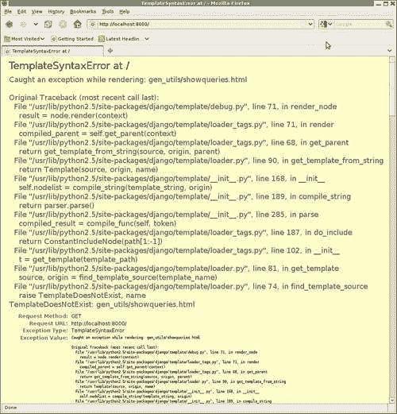

这是上一章中提到的一个特殊调试页面的实例。它是一个`TemplateSyntaxError`，由渲染期间引发的异常导致。捕获原始异常并将其转换为`TemplateSyntaxError`，原始回溯显示为异常值的一部分。我们可以看到，最初的例外是`TemplateDoesNotExist`。由于某种原因，模板加载器找不到`gen_utils/showqueries.html`模板文件。

在这里接收到的调试页面上进一步向下翻页，我们将了解为什么在`TemplateSyntaxError`中包装原始异常的模板引擎行为有时会变得更严重。因为最终引发的异常是一个`TemplateSyntaxError`，而不是`TemplateDoesNotExist`，所以此调试页面没有模板加载器后期检查，该检查将详细说明尝试了哪些模板加载器，以及在搜索`gen_utils/showqueries.html`时尝试加载哪些文件。因此，由于`TemplateSyntaxError`异常用于包装其他异常的方式，我们丢失了一些有用的调试信息。

如果需要，我们可以通过尝试直接从一个视图渲染该模板文件，而不是通过将其包含在另一个模板中，来强制生成该模板文件的模板加载程序。因此，我们只需做一点工作，就可以获得不幸没有包含在这个特定调试页面中的信息。

但在这种情况下，这是没有必要的，因为异常的原因并不特别模糊：我们没有做任何事情来确保在新的`gen_utils`应用程序中找到模板。我们没有在`INSTALLED_APPS`中包含`gen_utils`以便应用程序模板加载程序搜索其`templates`目录，也没有将`gen_utils templates`目录的路径放入`TEMPLATE_DIRS`设置中。为了找到新的模板文件，我们需要执行以下操作之一。由于`gen_utils`现在也有一个过滤器，为了加载该过滤器`gen_utils`需要在`INSTALLED_APPS`中，我们将通过在`INSTALLED_APPS`中包含`gen_utils`来修复`TemplateDoesNotExist`异常。

一旦我们做出了改变，新的代码会起作用吗？不完全是。尝试重新加载页面时，现在会显示另一个调试页面：

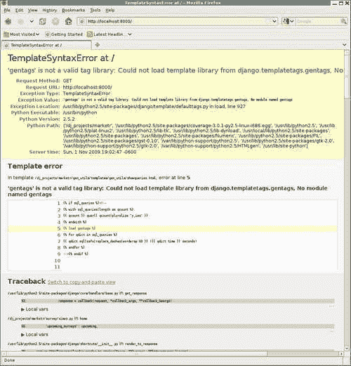

这个有点神秘。显示的模板是`gen_utils/showqueries.html`，因此我们比前一个案例走得更远。但由于某种原因，尝试``的尝试失败了。错误消息指出：

**“gentags”不是有效的标记库：无法从 django.templatetags.gentags 加载模板库，没有名为 gentags**的模块。

这是一种罕见的情况，您不想完全相信错误消息似乎在说什么。似乎暗示问题在于`django.templatetags`中没有`gentags.py`文件。下一个自然的想法可能是，需要在 Django 自己的源代码树中放置自定义模板标记和过滤器库。然而，这将是一个非常奇怪的要求，文档显然与此相矛盾，因为它指出定制标记和过滤器应该放在应用程序的`templatetags`目录中。我们是否应该使用普通的``标记以外的其他东西来强制 Django 在自己的`templatetags`目录之外搜索标记库？

不，在这种情况下，错误只是误导。虽然`django.templatetags`是错误消息中命名的唯一模块，但实际上 Django 代码试图从`INSTALLED_APPS`中列出的每个应用程序下的`templatetags`目录加载`gentags`。因此，问题不是 Django 为什么没有在`gen_utils/templatetags`目录下查找`gentags`，而是为什么尝试从`genutils.templatetags`加载`gentags`失败？

我们可以尝试通过在 Python shell 会话中尝试 Django 在``期间运行的相同代码来回答这个问题：

```py
kmt@lbox:/dj_projects/marketr$ python manage.py shell 
Python 2.5.2 (r252:60911, Oct  5 2008, 19:24:49) 
[GCC 4.3.2] on linux2 
Type "help", "copyright", "credits" or "license" for more information. 
(InteractiveConsole) 
>>> from gen_utils.templatetags import gentags 
Traceback (most recent call last): 
 File "<console>", line 1, in <module> 
ImportError: No module named templatetags 
>>> 

```

果然，从`gen_utils.templatetags`导入`gentags`的尝试失败了。Python 声称`templatetags`模块不存在。但是目录确实存在，而且`gentags.py`也存在，那么缺少什么呢？答案是该目录中的一个`__init__.py`文件，以使 Python 将其识别为一个模块。创建该文件并重新尝试从 shell 导入表明导入现在可以工作。

但是，尝试在浏览器中简单地重新加载页面会导致重新显示相同的调试页面。这也是极少数需要手动停止并重新启动开发服务器以使其能够接收所做更改的情况之一。完成后，我们终于可以重新加载调查主页并查看：

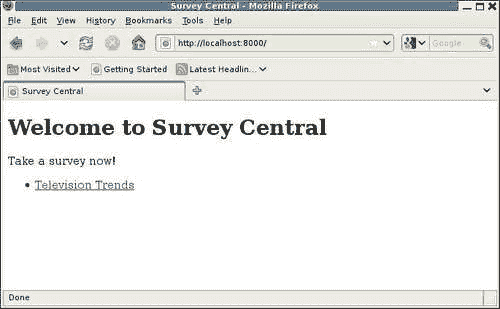

我们回到了被服务的页面，没有引发异常，HTML 注释中不再包含来自`sql_queries`的错误调试信息。如果我们进一步查看页面的 HTML 源代码，我们将在底部看到如下内容：

```py
<!--

4 queries

SELECT COUNT(*) FROM `survey_survey` WHERE
`survey_survey`.`title` LIKE BINARY %~~double-dash~~%  (0.015 seconds)

SELECT `survey_survey`.`id`, `survey_survey`.`title`,
`survey_survey`.`opens`, `survey_survey`.`closes` FROM
`survey_survey` WHERE (`survey_survey`.`opens` <= 2009-11-01
 AND `survey_survey`.`closes` >= 2009-11-01 ) (0.001 seconds)

SELECT `survey_survey`.`id`, `survey_survey`.`title`,
`survey_survey`.`opens`, `survey_survey`.`closes` FROM
`survey_survey` WHERE (`survey_survey`.`closes` < 2009-11-01
 AND `survey_survey`.`closes` >= 2009-10-18 ) (0.000 seconds)

SELECT `survey_survey`.`id`, `survey_survey`.`title`,
`survey_survey`.`opens`, `survey_survey`.`closes` FROM
`survey_survey` WHERE (`survey_survey`.`opens` > 2009-11-01 
AND `survey_survey`.`opens` <= 2009-11-08 ) (0.000 seconds)

--> 

```

看起来不错。`replace_dashes`过滤器成功地去除了一行中的两个破折号，因此浏览器不再认为注释块在预期终止之前已经终止。现在我们可以继续检查生成其他调查页面所需的 SQL 查询。

## 对活动调查表单显示页面的 SQL 查询

单击指向“一个活动调查”的链接，将打开该调查的“活动调查”页面：

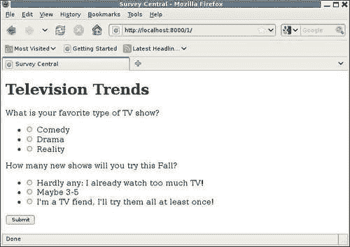

查看此页面的源代码，我们发现需要六个 SQL 查询来生成它：

```py
<!--

6 queries

SELECT `survey_survey`.`id`, `survey_survey`.`title`,
`survey_survey`.`opens`, `survey_survey`.`closes` FROM
`survey_survey` WHERE `survey_survey`.`id` = 1  (0.000 seconds)

SELECT `survey_question`.`id`, `survey_question`.`question`,
`survey_question`.`survey_id` FROM `survey_question` WHERE
`survey_question`.`survey_id` = 1  (0.000 seconds)

SELECT COUNT(*) FROM `survey_answer` WHERE
`survey_answer`.`question_id` = 1  (0.001 seconds)

SELECT COUNT(*) FROM `survey_answer` WHERE
`survey_answer`.`question_id` = 2  (0.001 seconds)

SELECT `survey_answer`.`id`, `survey_answer`.`answer`,
`survey_answer`.`question_id`, `survey_answer`.`votes` FROM
`survey_answer` WHERE `survey_answer`.`question_id` = 1  (0.024 seconds)

SELECT `survey_answer`.`id`, `survey_answer`.`answer`,
`survey_answer`.`question_id`, `survey_answer`.`votes` FROM
`survey_answer` WHERE `survey_answer`.`question_id` = 2  (0.001 seconds)

-->

```

我们可以将这些查询与用于生成页面的代码进行匹配吗？是的，在这种情况下，很容易看到每个查询来自何处。第一个查询根据其主键查找调查，对应于`survey_detail`视图第一行中的`get_object_or_404`调用：

```py
def survey_detail(request, pk): 
    survey = get_object_or_404(Survey, pk=pk) 
```

由于这是一个活动的调查，控制线程随后进入`display_active_survey`函数，该函数包含以下代码来构建页面的表单：

```py
    qforms = [] 
    for i, q in enumerate(survey.question_set.all()): 
        if q.answer_set.count() > 1: 
            qforms.append(QuestionVoteForm(q, prefix=i, data=data)) 
```

对`enumerate(survey.question_set.all())`的调用负责此页面的第二个 SQL 查询，该查询检索所显示调查的所有问题。在`for`循环中调用`q.answer_set.count()`解释了第三个和第四个 SQL 查询，它们检索调查中每个问题的答案计数。

然后，最后两个查询检索调查中每个问题的答案集。我们可能首先认为这些查询是在为调查中的每个问题创建`QuestionVoteForm`时发出的。`QuestionVoteForm`的`__init__`例程包含此行，用于初始化问题的答案集：

```py
        self.fields['answer'].queryset = question.answer_set.all() 
```

但是，这行代码不会导致对数据库的调用。它只是将表单的`answer`字段的`queryset`属性设置为`QuerySet`值。由于`QuerySets`是惰性的，因此不会导致数据库命中。这一点可以通过以下事实得到证实：请求`COUNT(*)`的两个查询都是在检索实际答案信息的查询之前发出的。如果`QuestionVoteForm`的创建导致了答案信息的检索，那么最后两个查询将不是最后一个，而是与`COUNT(*)`查询交错。然后，发出检索答案信息的查询的触发器是在`survey/active_survey.html`模板中呈现答案值。

如果我们专注于优化，此时我们可能会尝试减少此页面所需的查询数量。与简单地检索答案信息并根据返回的信息导出计数相比，在两个单独的查询中检索答案计数以及答案信息本身似乎效率低下。看起来我们可以用四个查询而不是六个查询生成这个页面。

但是，由于我们的重点是理解当前行为作为调试的辅助，因此我们不打算在这里转移到优化讨论中。即使我们正在开发一个真正的项目，在开发的这一点上，也不是进行此类优化的好时机。这里的低效率并没有被称为 bug 那么糟糕，因此最好在将来确定应用程序整体性能的全貌时，将其作为一个可能的问题加以注意。在这一点上，最昂贵的低效率是值得花时间研究改进的。

## 用于发布调查答案的 SQL 查询

如果我们现在为调查问题选择一些答案并按下**提交**按钮，我们将得到**感谢**页面的响应：


查看此页面的源代码，我们发现一个 SQL 查询，用于检索给定主键的`survey`：

```py
<!--

1 query

SELECT `survey_survey`.`id`, `survey_survey`.`title`,
`survey_survey`.`opens`, `survey_survey`.`closes` FROM
`survey_survey` WHERE `survey_survey`.`id` = 1  (0.001 seconds)

-->

```

与该查询关联的代码行很明显；它是`survey_thanks`视图中的`get_object_or_404`：

```py
def survey_thanks(request, pk): 
    survey = get_object_or_404(Survey, pk=pk) 
    return render_to_response('survey/thanks.html', 
        {'survey': survey }, 
        RequestContext(request)) 
```

但是，当表单数据被提交时，处理表单数据所涉及的所有 SQL 查询又如何呢？在调用`survey_thanks`视图之前很久，`display_active_survey`必须已经运行，才能接收已发布的表单数据并更新所选答案的数据库。然而，在为感谢页面显示的查询中，我们没有看到任何需要的 SQL 查询。

这是因为在表单处理成功且数据库更新的情况下，`display_active_survey`函数不会直接呈现模板，而是返回一个`HttpResponseRedirect`。web 浏览器在收到 HTTP 重定向响应时，会自动获取重定向中标识的位置。

因此，在按下浏览器上的**提交**按钮和看到出现感谢页面之间，有两个完整的请求/响应周期。感谢页面本身可以显示在其（第二个）请求/响应周期中执行的 SQL 查询，但不能显示在第一个请求/响应周期中发生的任何查询。

那太令人失望了。在这一点上，我们在开发一开始看起来很简单的实用程序代码时遇到了很多麻烦。现在，我们发现它不适用于应用程序中一些最有趣的视图，即实际更新数据库的视图。我们该怎么办？

我们当然不想放弃查看成功处理发布数据的页面的 SQL 查询。但是我们也不想在这个实用程序代码上花费更多的开发工作。虽然我们在这一过程中学到了一些东西，但我们已经开始偏离我们的主要应用程序太多了。幸运的是，我们不需要做这两件事。相反，我们可以简单地安装并开始使用已经为 Django 应用程序开发的通用调试工具，即 Django 调试工具栏。此工具是下一节的重点。

# Django 调试工具栏

Rob Hudson 的 Django 调试工具栏是 Django 应用程序非常有用的通用调试工具。与本章前面开发的代码一样，它允许您查看生成页面所需的 SQL 查询。但是，正如我们将看到的，它还远远超出了这一范围，提供了对更多有关 SQL 查询和请求处理的其他方面的信息的轻松访问。此外，调试工具栏显示信息的方式比简单地将信息嵌入 HTML 注释要先进得多。这些功能最好通过示例来展示，因此我们将立即继续安装工具栏。

## 安装 Django 调试工具栏

工具栏可在 Python 包索引站点上找到：[http://pypi.python.org/pypi/django-debug-toolbar](http://pypi.python.org/pypi/django-debug-toolbar) 。安装后，只需添加几个设置即可激活 Django 项目中的调试工具栏。

首先，调试工具栏中间件`debug_toolbar.middleware.DebugToolbarMiddleware`必须添加到`MIDDLEWARE_CLASSES`设置中。工具栏的文档指出，它应该放在对响应内容进行编码的任何其他中间件之后，因此最好将其放在中间件序列的最后。

第二，`debug_toolbar`应用需要添加到`INSTALLED_APPS`中。`debug_toolbar`应用程序使用 Django 模板呈现其信息，因此需要将其列在`INSTALLED_APPS`中，以便应用程序模板加载器找到其模板。

第三，调试工具栏要求在`INTERNAL_IPS`中列出请求的 IP 地址。由于我们在本章前面已经更改了此设置，因此现在无需为此执行任何操作。

最后，调试工具栏仅在`DEBUG`为`True`时显示。我们一直在启用调试的情况下运行，所以这里也不需要做任何更改。还请注意，“调试”工具栏允许您自定义在什么条件下显示“调试”工具栏。因此，可以设置工具栏，以便在`INTERNAL_IPS`中或调试未打开时显示请求 IP 地址的工具栏，但出于我们的目的，默认配置很好，因此我们不会更改任何内容。

一件不需要的事情是应用程序本身使用`RequestContext`，以便在工具栏中提供 SQL 查询信息等信息。调试工具栏作为中间件运行，因此不依赖于使用`RequestContext`的应用程序来生成其信息。因此，如果我们首先使用 Django Debug 工具栏，就不需要对勘测视图进行更改，以便在`render_to_response`调用中指定`RequestContexts`。

## 调试工具栏外观

将调试工具栏添加到中间件和已安装的应用程序设置后，我们只需访问调查应用程序中的任何页面即可看到它的外观。让我们从主页开始。返回的页面现在应该如下所示：


注意：此屏幕截图显示了调试工具栏的 0.8.0 版本的外观。早期版本看起来有很大的不同，所以如果您的结果不是这样，那么您可能使用的是与 0.8.0 不同的版本。您拥有的版本很可能比编写此版本时可用的版本更新，并且可能还有其他工具栏面板或功能未在此处介绍。

如您所见，调试工具栏显示在浏览器窗口的右侧。它由一系列面板组成，可以通过更改工具栏配置来单独启用或禁用这些面板。这里显示的是默认启用的。

在仔细查看一些单独的面板之前，请注意工具栏包含一个选项，可将其隐藏在顶部。如果选择了**隐藏**，工具栏将自身缩小为一个小的选项卡状指示，以显示它的存在：

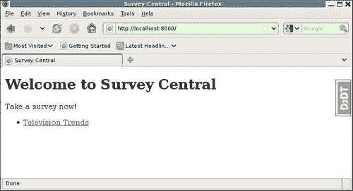

这对于工具栏的扩展版本使页面上的应用程序内容变得模糊的情况非常有用。再次点击**DjDT**页签后，仍然可以访问工具栏提供的所有信息；这只是暂时的。

大多数面板在单击时将提供详细信息。一些还可以在主工具栏显示中提供摘要信息。从调试工具栏版本 0.8.0 开始，列出的第一个面板**Django 版本**仅提供摘要信息。点击它就没有更详细的信息了。正如您在屏幕截图中看到的，Django 1.1.1 是这里使用的版本。

请注意，与 0.8.0 版本相比，调试工具栏的最新源代码版本已经为此面板提供了更多信息。从 0.8.0 开始，该面板已重命名为**版本**，可以点击提供更多详细信息。这些附加详细信息包括工具栏本身以及提供版本信息的任何其他已安装 Django 应用程序的版本信息。

显示摘要信息的其他三个面板是**时间**、**SQL**和**日志**面板。因此，我们可以从页面的第一次出现中一目了然地看到，生成此页面使用了 60 毫秒的 CPU 时间（总运行时间为 111 毫秒），该页面需要四次查询，耗时 1.95 毫秒，并且在请求期间记录了零条消息。

在以下部分中，我们将深入了解单击每个面板时提供的信息。我们将首先从 SQL 面板开始，因为它是最有趣的面板之一，并且提供了与我们在本章前面工作过的相同的信息（除了更多信息之外），以便我们自己访问。

## SQL 面板

如果我们点击调试工具栏的**SQL**部分，页面将变为：


乍一看，这是一个非常好的显示 SQL 查询的页面比我们之前提出的。查询本身会突出显示，以便突出显示 SQL 关键字，使它们更易于阅读。此外，由于它们没有嵌入 HTML 注释中，因此它们的内容不需要以任何方式进行更改。没有必要更改包含双破折号的查询的内容，以避免它导致显示问题。（在我们忘记添加查询的原因之前，现在可能是删除添加的查询的好时机。）

还请注意，为每个查询列出的时间比 Django 的默认查询历史记录中的时间更具体。调试工具栏用自己的查询记录替换 Django 的查询记录，并以毫秒而不是秒为单位提供计时。

该显示还包括一个图形表示，以水平条的形式显示每个查询所用的时间。当有一个或多个查询比其他查询昂贵得多时，这种表示方式可以很容易地看到。事实上，如果一个查询花费的时间过长，它的条会被涂成红色。在本例中，查询时间没有太大差异，并且没有一个需要特别长的时间，因此所有的条都具有相似的长度，并且都是灰色的。

更深入地挖掘，我们在本章前面必须手动了解的一些信息只需点击一下这个 SQL 查询显示。具体地说，我们的代码的哪一行触发了要发出的特定 SQL 查询这一问题的答案。显示的每个查询都有一个**切换堆栈跟踪**选项，单击该选项将显示与查询关联的堆栈跟踪：

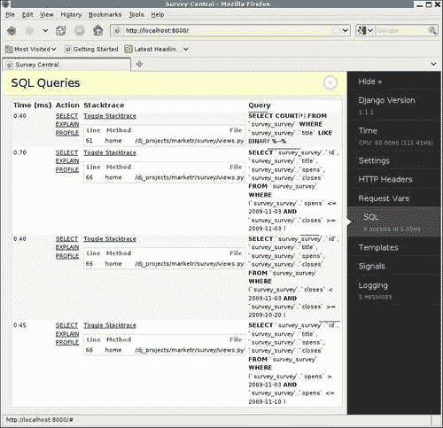

在这里我们可以看到，所有的查询都是通过调查`views.py`文件中的`home`方法进行的。请注意，工具栏会过滤掉 Django 自身内堆栈跟踪中的级别，这解释了为什么每个级别只显示一个级别。第一个查询由**行 61**触发，其中包含添加的`filter`调用，用于测试记录一行中包含两个破折号的查询时会发生什么。其余的查询都归于**行**，这是`home`视图中`render_to_response`调用的最后一行。正如我们前面所指出的，这些查询都是在呈现模板的过程中进行的。（行号可能与此处显示的行号不同，具体取决于文件中各种函数的位置。）

最后，这个 SQL 查询显示提供了我们还没有得到想要的信息。在**动作**栏下有**选择**、**解释**和**配置文件**的链接。点击**选择**链接，显示实际执行查询时数据库返回的内容。例如：

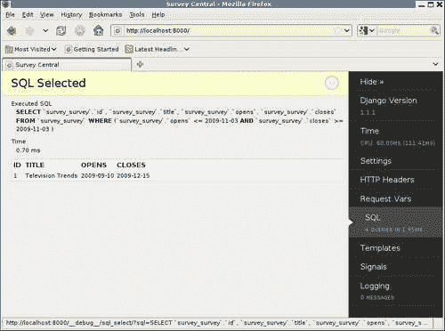

类似地，单击**解释**和**配置文件**分别显示当要求解释或配置所选查询时数据库报告的内容。确切的显示以及如何解释结果，将因数据库而异。（事实上，并非所有数据库都支持**PROFILE**选项，这里使用的数据库 MySQL 正好支持该选项。）解释**EXPLAIN**和**PROFILE**的结果超出了本文的范围，但是，如果您需要深入研究查询的性能特征，那么知道“调试”工具栏可以让您轻松地完成这项工作是非常有用的。

我们现在已经深入到 SQL 查询显示中了几页。我们如何回到实际的应用程序页面？点击主页面显示右上角带圆圈的**>>**将返回上一个 SQL 查询页面，带圆圈的**>>**将变为带圆圈的**X**。单击任何面板详细信息页面上带圆圈的**X**将关闭详细信息并返回显示应用程序数据。或者，对于当前显示的面板，再次单击工具栏上的面板区域将具有与单击显示区域中的圆圈符号相同的效果。最后，如果您更喜欢使用键盘而不是鼠标，则按*Esc*与单击圆圈符号具有相同的效果。

现在我们已经完全探索了 SQL 面板，让我们简单地看看调试工具栏提供的其他面板。

## 时间面板

点击**时间**面板，会显示页面制作过程中所花费时间的详细信息

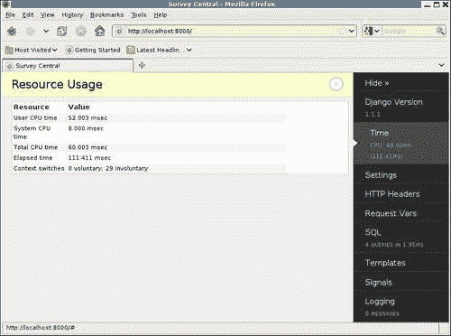

CPU 总时间分为用户时间和系统时间，列出总运行时间（挂钟），并显示自愿和非自愿上下文切换的数量。对于一个花费太长时间生成的页面，这些关于花费时间的额外细节有助于找到原因。

请注意，此面板提供的详细信息来自 Python`resource`模块。这是一个特定于 Unix 的 Python 模块，在非 Unix 类型的系统上不可用。因此，例如，在 Windows 上，“调试”工具栏“时间”面板将仅显示摘要信息，而不提供进一步的详细信息。

## 设置面板

点击**设置**可滚动显示所有有效设置。用于创建此显示的代码与用于在 Django 调试页面上显示设置的代码相同，因此此处的显示将与您在调试页面上看到的相同。

## HTTP 头面板

点击**HTTP 头**显示请求的所有 HTTP 头：

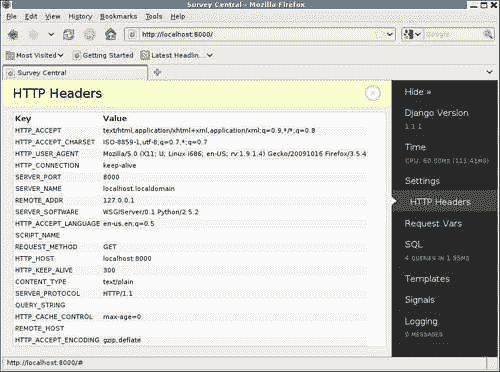

这是调试页面的**元**部分中可用信息的子集。如前一章所述，`request.META`字典除了包含与请求无关的其他信息外，还包含请求的所有 HTTP 头，因为`request.META`最初是从`os.environ`字典复制的。调试工具栏已选择过滤显示的信息，以仅包括与 HTTP 请求相关的信息，如屏幕截图所示。

## 请求 Vars 面板

点击**请求变量**显示请求的 cookie、会话变量、GET 变量和 POST 数据。由于调查应用程序主页没有任何信息可供显示，因此，**请求变量**的显示并不十分有趣。相反，这里是管理应用程序的一个示例，它确实使用了一个会话，因此它实际上有一些东西要显示：


在这里，您可以看到作为使用`django.contrib.sessions`应用程序的管理应用程序的结果而设置的`sessionid`cookie，您还可以看到会话中设置的各个会话变量。

## 模板面板

点击**模板**将显示关于请求模板处理的信息。返回调查主页作为示例：


**模板路径**部分列出了`TEMPLATE_DIRS`设置中指定的路径；因为我们没有向该设置添加任何内容，所以它是空的。

**模板**部分显示为响应提供的所有模板。将列出每个模板，其中显示应用程序为首先渲染而指定的名称。单击此名称将显示实际的模板文件内容。在应用程序指定的名称下是模板的完整文件路径。最后，每个模板还有一个**切换上下文**链接，可用于查看每个渲染模板使用的上下文的详细信息。

**上下文处理器**部分显示所有已安装的上下文处理器。每个下都有一个**切换上下文**链接，单击该链接将显示关联上下文处理器添加到上下文中的上下文变量。

请注意，无论应用程序是否使用`RequestContext`呈现响应，都会列出上下文处理器。因此，他们在本页上列出并不意味着他们设置的变量已添加到该特定响应的上下文中。

## 信号面板

点击**信号**显示信号配置：


列出了所有定义的 Django 信号。对于每一个，提供的参数与已连接到信号的接收器一起显示。

请注意，此显示并不表示在生成当前页面期间实际触发了哪些信号。它只是显示了信号是如何配置的。

## 记录面板

最后，**日志记录**面板显示在请求处理过程中通过 Python 的`logging`模块发送的任何消息。由于我们还没有研究在 survey 应用程序中使用日志记录，而且从 Django 1.1 开始，Django 本身也没有使用 Python 日志记录模块，因此我们在这个面板上还没有看到任何内容。

## 调试工具栏重定向处理

现在回想一下我们开始研究调试工具栏的原因：我们发现跟踪页面 SQL 查询的原始方法不适用于返回 HTTP 重定向而不是呈现模板的页面。调试工具栏如何更好地处理这个问题？点击主页上的**电视趋势**链接，选择两个问题的答案，然后按**提交**。结果将是：

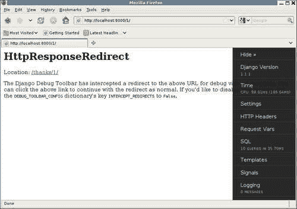

本页举例说明了为什么有时需要使用工具栏上的**隐藏**选项，因为工具栏本身掩盖了页面上的部分消息。隐藏工具栏将显示完整消息：

**Django 调试工具栏已截获指向上述 URL 的重定向，用于调试查看。您可以单击上面的链接继续正常重定向。如果要禁用此功能，请将调试\工具栏\配置字典的密钥拦截\重定向设置为 False。**

调试工具栏在这里所做的是截取重定向请求，并将其替换为包含指向原始重定向中指定位置的链接的呈现响应。工具栏本身仍然存在，可用于调查我们可能希望看到的有关生成重定向的请求处理的任何信息。例如，我们可以点击**SQL**部分，查看：

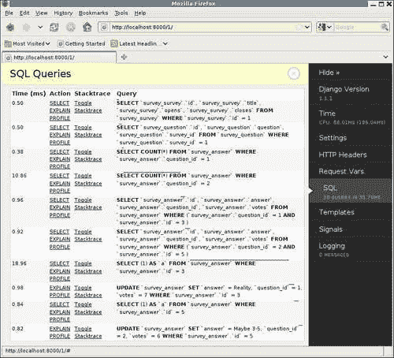

这些是处理入站投递表单所需的 SQL 查询。毫不奇怪，前四个与我们在最初生成表单时看到的完全相同，因为 GET 和 POST 请求最初都遵循相同的代码路径。

只有在发出这些查询之后，`display_active_survey`视图才具有 GET 和 POST 的不同代码路径。具体而言，对于 POST，代码为：

```py
    if request.method == 'POST': 
        chosen_answers = [] 
        for qf in qforms: 
            if not qf.is_valid(): 
                break; 
            chosen_answers.append(qf.cleaned_data['answer']) 
        else: 
            for answer in chosen_answers: 
                answer.votes += 1 
                answer.save() 
           return HttpResponseRedirect(reverse('survey_thanks', args=(survey.pk,))) 
```

此页面上列出的第五个和第六个查询正在检索提交表单上选择的特定答案实例。与 GET 不同，GET 在第五次和第六次查询中检索给定问题的所有答案，这些查询在 SQLWHERE 子句中指定答案`id`以及问题`id`。在 POST 案例中，不需要检索问题的所有答案；仅检索所选的一个就足够了。

切换这些查询的堆栈跟踪显示它们是由`if not qf.is_valid()`行代码生成的。这是有意义的，因为除了验证输入之外，`is_valid`方法在将发布的数据放入表单的`cleaned_data`属性之前，还会对其进行规范化。在`ModelChoiceField`的情况下，规范化值是选择的模型对象实例，因此验证代码需要从数据库中检索选择的对象。

在发现两个提交的表单都有效后，此代码的`else`段将运行。在这里，每个选择答案的投票计数都会增加，更新的`answer`实例会保存到数据库中。因此，该代码必须负责前面显示的最后四个查询。这可以通过检查这四个查询的堆栈跟踪来确认：所有查询都指向代码的`answer.save()`行。

但是，为什么需要四条 SQL 语句，两条 SELECT 语句和两条 UPDATE 语句来将两个答案保存到数据库中？UPDATE 语句是自解释的，但是它们前面的 SELECT 语句有点奇怪。在每种情况下，从`survey_answer`表中选择常数 1，其中 WHERE 子句指定与正在保存的`survey`匹配的主键值。这个查询的目的是什么？

Django 代码在这里所做的是试图确定正在保存的`answer`是否已经存在于数据库中，或者它是否是新的。Django 可以通过 SELECT 是否返回任何结果来判断在将模型实例保存到数据库时是否需要使用更新或插入。当所需的唯一信息是结果是否存在时，选择常量值比实际检索结果更有效。

您可能认为 Django 代码应该知道，仅仅基于已经为模型实例设置了主键值这一事实，该实例反映了数据库中已经存在的数据。但是，Django 模型可以使用手动分配的主键值，因此主键值已经分配的事实并不保证模型已经保存到数据库中。因此，在保存数据之前，有一个额外的选择来确定模型状态。

不过，调查应用程序代码肯定知道，它在处理调查响应时保存的所有`answer`实例都已保存在数据库中。保存时，调查代码可以通过在保存调用中指定`force_update`来指示实例必须通过更新而不是插入来保存：

```py
                answer.save(force_update=True) 
```

如果我们进行了更改并尝试提交另一项调查，我们会发现已从本案例的处理中删除了 SELECT 查询，从而将所需的查询总数从 10 个减少到 8 个：


（是的，我意识到我之前说过现在不是进行优化的时候，但现在我继续做了一个。这个太容易放弃了。）

现在我们已经介绍了 Django 调试工具栏默认显示的所有面板，并了解了它对返回重定向的默认处理如何允许调查导致重定向的处理。它是一个非常灵活的工具：它支持添加面板、更改显示的面板、更改工具栏的显示时间以及配置各种其他选项。讨论所有这些都超出了本文讨论的范围。希望所涵盖的内容能让您体验到该工具的强大功能。如果您有兴趣了解有关如何配置它的更多详细信息，从其主页链接的自述文件是一个很好的起点。

现在，我们将离开 Django 调试工具栏，继续讨论如何通过日志跟踪应用程序代码的内部状态。为此，我们希望首先看到日志记录在没有工具栏的情况下是如何显示的，因此此时我们应该在`settings.py`中注释掉工具栏中间件。（注意，不需要从`INSTALLED_APPS`中删除`debug_toolbar`列表，因为这只是应用程序模板加载程序查找中间件指定的模板所必需的。）

# 跟踪内部代码状态

有时，即使是 Django Debug 工具栏之类的工具提供的所有信息也不足以找出在处理请求期间产生错误结果的原因。问题可能出在应用程序代码的某个地方，但通过目视检查，我们无法找出问题所在。为了解决这个问题，我们需要获得更多关于应用程序代码内部状态的信息。也许我们需要看看通过应用程序中的函数的控制流是什么，或者看看为一些最终导致代码走上错误路径的中间结果计算了哪些值。

我们如何获得这类信息？一种方法是在调试器下运行代码，并逐行逐行检查代码以查看它在做什么。下一章将详细介绍这种方法。它非常强大，但可能非常耗时，并且并非在所有情况下都实用。例如，它很难用于仅在生产过程中出现的问题。

另一种方法是让代码报告或记录它正在做的事情。这是本节将介绍的方法。这种方法不提供对调试器下可用的全部信息的访问，但通过对记录内容的良好选择，它可以提供足够的线索来解决许多问题。与在调试器下运行的方法相比，它还可以更容易地用于仅用于生产的问题。

## 抑制喷洒印花的冲动

在开发服务器下运行时，`print`的输出会出现在控制台上，因此很容易访问。因此，当遇到一些 Django 应用程序代码在开发过程中出现错误时，很容易在关键点添加特别的`print`语句，试图找出代码内部的情况。虽然很诱人，但这通常是个坏主意。

为什么这是个坏主意？首先，只有一两条`print`语句，问题很少变得明显。乍一看，如果我们只知道代码是在这里还是在那里，一切都会变得清晰。但事实并非如此，我们最终添加了越来越多的`print`语句，可能会打印出变量的值，代码本身和开发服务器控制台都变成了一堆临时调试信息。

然后，一旦问题得到解决，所有这些`print`语句都需要删除。我们通常不希望他们在输出时把代码或控制台弄得乱七八糟。将它们全部删除是一件麻烦事，但却是必要的，因为某些生产环境不允许访问`sys.stdout`。因此，开发调试留下的杂散`print`可能会在生产过程中导致服务器错误。

然后，当相同或类似的问题再次出现时，过去通过“Spready`print`”方法解决了，实际上之前完成的所有工作可能都需要重新完成，以便找出这次的错误。以前的经验可能会让我们更好地了解`print`语句要放在哪里，但如果我们在解决第一个问题后已经删除了它们，那么对于出现的问题的下一个变体，重新做本质上相同的事情可能会涉及相当多的工作。这是浪费精力。

这一顺序突出了“Spready`print`”开发调试方法的几个主要问题。首先，开发者需要在`print`被添加的地方，决定在什么条件下应该产生它，以及输出应该去哪里。可以将添加的`print`语句与`if settings.DEBUG`等条件括在一起，这可能会使添加的调试支持长期保留在代码中，但这是一个麻烦，会给代码增加混乱，因此通常不会这样做。也可以在`print`中指定输出应该路由到除默认的`sys.stdout`之外的其他地方，但同样地，这是更多的工作，而且往往不会完成。

这些问题导致出现零星的`print`语句，当问题解决时，这些语句会立即被删除，使代码处于默认情况下不报告其操作的状态。然后，当下一个问题发生时，开发人员必须重新开始，添加调试信息的报告。

一种更好的方法是在整个开发过程中使用一些严格的日志记录，这样在默认情况下，至少当`DEBUG`打开时，代码会报告它正在做的事情。如果这样做了，那么很可能不需要收集额外的调试信息来解决突然出现的问题。此外，使用日志记录功能允许配置在什么条件下应该输出消息，以及消息应该去哪里，以便与实际的日志记录语句分离。

## 用于开发的简单日志配置

因此，对于调试而言，`print`语句的首选替代方法是使用 python`logging`模块。实际的日志调用与`print`一样容易进行。例如，跟踪呼叫到`display_active_survey`的`print`可能如下所示：

```py
def display_active_survey(request, survey): 
    print 'display_active_survey called for a %s of survey '\'with pk %s' % (request.method, survey.pk) 
```

此处，打印报告已调用的函数；随着`request.method`和调查主键的通过。在 development server 控制台上，获取活动调查页面的输出为：

```py
Django version 1.1.1, using settings 'marketr.settings' 
Development server is running at http://0.0.0.0:8000/ 
Quit the server with CONTROL-C. 
display_active_survey called for a GET of survey with pk 1 
[04/Nov/2009 19:14:10] "GET /1/ HTTP/1.1" 200 2197 

```

仅使用 Python`logging`的等效调用可能是：

```py
import logging 
def display_active_survey(request, survey): 
    logging.debug('display_active_survey called for a %s of ''survey with pk %s', request.method, survey.pk) 
```

这里，`logging.debug`调用用于指定传递的字符串是调试级消息。级别的概念允许调用代码为消息分配重要性度量，而无需实际决定在当前情况下是否应输出消息。相反，该决定是由日志记录设施根据当前设置的日志记录阈值做出的。

Python`logging`模块提供了一组方便的方法，用于使用默认定义的级别记录消息。它们是，按照级别的递增顺序：`debug`、`info`、`warning`、`error`和`critical`。因此，仅当`logging`模块的级别阈值设置为包含调试级别消息时，才会输出此`logging.debug`消息。

使用此`logging.debug`语句代替`print`的唯一问题是，默认情况下，日志模块级别阈值设置为`warning`。因此，默认情况下仅输出`warning`、`error`和`critical`消息。我们需要将`logging`模块配置为输出调试级语句，以便此消息显示在控制台上。一个简单的方法是在`settings.py`文件中添加对`logging.basicConfig`的调用。我们可以根据`DEBUG`的开启情况进行呼叫：

```py
import logging
if DEBUG: 
    logging.basicConfig(level=logging.DEBUG)
```

将该代码添加到`settings.py`中，并在`display_active_survey`函数中调用`logging.debug`，开发控制台现在将在输入`display_active_survey`函数时显示消息：

```py
Django version 1.1.1, using settings 'marketr.settings' 
Development server is running at http://0.0.0.0:8000/ 
Quit the server with CONTROL-C. 
DEBUG:root:display_active_survey called for a GET of survey with pk 1 
[04/Nov/2009 19:24:14] "GET /1/ HTTP/1.1" 200 2197 

```

请注意，消息上的`DEBUG:root:`前缀是应用于已记录消息的默认格式的结果。`DEBUG`表示与消息相关的级别，`root`标识用于记录消息的记录器。由于`logging.debug`调用未指定任何特定记录器，因此使用了默认值`root`。

`logging.basicConfig`的其他参数可用于更改消息的格式，但 Python 日志的所有功能的全面覆盖超出了我们在此需要介绍的范围。出于我们的目的，默认格式是可以的。

另一件可以在日志配置中指定的事情是消息应该路由到哪里。我们在这里没有这样做，因为默认的`sys.stderr`对于开发调试来说已经足够了。

## 决定记录什么

通过从`print`切换到`logging`，我们不再需要开发人员添加日志来决定在什么条件下应该生成日志信息，以及日志信息应该放在哪里。开发人员只需确定与消息相关的重要性级别，然后日志记录工具本身将决定如何处理记录的信息。那么，下一个问题是应该记录什么？

一般来说，编写代码时很难知道哪些信息最有用。作为开发人员，我们可能会做一些猜测，但在我们获得代码实际运行的经验之前，很难确定。然而，正如前面所提到的，对于代码来说，有一些关于它正在做什么的基本信息的内置报告是非常有帮助的。因此，在最初编写代码时，最好有一些日志记录指南，默认情况下应该包括这些指南。

其中一条准则可能是记录所有“重要”函数的进入和退出。进入日志消息应包括任何关键参数的值，退出日志消息应给出函数返回内容的一些指示。通过这种类型的进入和退出日志记录（假设代码被合理地分割成可管理的函数），我们将能够非常清楚地了解通过代码的控制流。

然而，手动添加进入和退出日志记录是一个麻烦。它也会给代码增加混乱。实际上，不太可能愉快地遵循记录所有重要函数入口和出口的指南，除非这比将之前记录的记录消息类型添加到`display_active_survey`中容易得多。

幸运的是，Python 提供了一些工具，使我们能够轻松地完成我们在这里想要的工作。函数可以包装在其他函数中，允许包装函数使用参数和返回信息执行诸如日志输入和退出之类的操作。此外，Python decorator 语法允许以最少的代码混乱完成这种包装。在下一节中，我们将开发一些简单的日志包装器，用于现有的调查应用程序代码。

## 装饰器记录函数进入和退出

使用通用包装器而不是在函数本身中嵌入入口/出口日志记录的一个缺点是，它使得对记录的参数和返回信息进行细粒度控制变得更加困难。编写一个记录所有参数或不记录任何参数的通用包装器很容易，但编写一个记录某些参数子集的包装器却很难。

为什么不记录所有参数？问题是 Django 应用程序中经常使用的一些参数，例如请求对象，具有非常详细的表示形式。记录它们的完整值会产生太多的输出。最好从一个不记录任何参数值的通用包装记录器开始，另外可能还有一个或多个专用记录器，可用于具有可预测参数的函数，以记录这些参数中的键信息。

例如，一个用于记录进入和退出以查看函数的专用包装器可能是值得的。视图总是获取一个`HttpRequest`对象作为其第一个参数。虽然记录完整对象没有帮助，但记录请求方法既短又有用。此外，由于 view 函数的其他参数来自请求的 URL，因此它们可能也不会太详细而无法记录。

应该记录返回值吗？对于 Django 应用程序来说，通常情况下可能不是这样，因为它通常具有返回`HttpResponse`对象的函数。它们通常太大，在记录时不会有帮助。但是，至少记录一些有关返回值的信息（例如返回值的类型）通常很有用。

那么，我们首先想到了两种包装材料。第一个将被命名为`log_call`，它将记录函数的进入和退出。`log_call`不会记录任何输入参数信息，但会记录返回的结果类型。第二个包装器将更加专用，并将用于包装视图函数。这个将被命名为`log_view`。它将记录请求方法和传递给包装视图的任何附加参数，以及其返回值的类型。

这个代码应该放在哪里？同样，它与调查应用程序没有任何联系，因此将其放在`gen_utils`中是有意义的。我们将在`gen_utils`中创建一个名为`logutils.py`的文件，该文件可以保存任何通用日志记录实用程序代码。我们将从前面描述的`log_call`包装器的实现开始：

```py
import logging 

class LoggingDecorator(object): 
    def __init__(self, f): 
        self.f = f 

class log_call(LoggingDecorator): 
    def __call__(self, *args, **kwargs): 
       f = self.f 
       logging.debug("%s called", f.__name__) 
       rv = f(*args, **kwargs) 
       logging.debug("%s returned type %s", f.__name__, type(rv)) 
       return rv 
```

此实现使用基于类的编写包装函数的风格。使用这种样式，包装器被定义为实现`__init__`和`__call__`方法的类。创建包装时调用`__init__`方法，并将其传递给正在包装的函数。实际调用包装函数时调用`__call__`方法。`__call__`实现负责执行包装函数所需的任何操作，调用包装函数并返回其结果。

在这里，实现分为两类：实现`__init__`的基`LoggingDecorator`，然后是继承`LoggingDecorator`和`__call__`的`__init__`的`log_call`。拆分的原因是，我们可以共享多个日志包装器的通用`__init__`。`__init__`所做的只是保存对包装函数的引用，以便在调用`__call__`时使用。

然后，`log_call __call__`实现首先记录调用该函数的消息。包装函数的名称可以在其`__name__`属性中找到。然后调用包装函数，其返回值保存在`rv`中。记录第二条消息，说明被调用函数返回的类型。最后，返回包装函数返回的值。

`log_view`包装器与`log_call`非常相似，只是在记录内容的细节上有所不同：

```py
class log_view(LoggingDecorator): 
    def __call__(self, *args, **kwargs): 
        f = self.f 
        logging.debug("%s called with method %s, kwargs %s", 
            f.__name__, args[0].method, kwargs) 
        rv = f(*args, **kwargs) 
        logging.debug("%s returned type %s", f.__name__, type(rv)) 
        return rv 
```

这里，除了包装函数的名称之外，第一条记录的消息还包括第一个位置参数的`method`属性和传递给包装函数的关键字参数。此包装器用于包装视图函数，因此假定第一个位置参数是一个具有`method`属性的`HttpRequest`对象。

此外，此代码假定所有其他参数都将作为关键字参数传递。我们知道调查应用程序代码就是这样，因为所有调查 URL 模式都指定了命名组。如果要支持 URL 模式配置中使用的非命名组，则更通用的视图包装器还需要记录`args`（第一个除外，一个`HttpRequest`对象）。对于 survey 应用程序，这只会导致日志信息始终相同，因此这里省略了它。

## 将装饰师应用于调查代码

现在，让我们将这些装饰器添加到 survey view 函数中，看看浏览的一些典型输出是什么样子的。添加装饰器很容易。首先，在`views.py`中，在文件顶部附近添加装饰器的导入：

```py
from gen_utils.logutils import log_view, log_call 
```

然后，对于所有实际为视图的函数，在函数定义上方添加`@log_view`。（此语法假定使用的 Python 版本为 2.4 或更高版本。）例如，对于主页，视图定义变为：

```py
@log_view 
def home(request): 
```

对`survey_detail`和`survey_thanks`执行相同的操作。对于实用功能`display_active_survey`和`display_completed_survey`，请使用`@log_call`。例如：

```py
@log_call 
def display_active_survey(request, survey): 
```

现在，当我们浏览调查站点时，控制台上会记录一些消息，这些消息跟踪有关调用代码的基本信息。例如，我们可能会看到：

```py
DEBUG:root:home called with method GET, kwargs {} 
DEBUG:root:home returned type <class 'django.http.HttpResponse'> 
[05/Nov/2009 10:46:48] "GET / HTTP/1.1" 200 1184 

```

这表明调用了主页视图，并返回了一个`HttpResponse`。在调查应用程序的日志消息之后，我们看到了来自开发服务器的正常打印输出，注意到`/`的`GET`返回了代码为`200`（HTTP OK）且包含`1184`字节的响应。接下来，我们可能会看到：

```py
DEBUG:root:survey_detail called with method GET, kwargs {'pk': u'1'} 
DEBUG:root:display_active_survey called 
DEBUG:root:display_active_survey returned type <class 'django.http.
HttpResponse'> 
DEBUG:root:survey_detail returned type <class 'django.http.HttpResponse'> 
[05/Nov/2009 10:46:49] "GET /1/ HTTP/1.1" 200 2197 

```

这显示了使用`GET`调用的`survey_detail`视图，很可能来自上一个响应返回的主页上的链接。此外，我们可以看到请求的特定调查的主键为`1`。下一条日志消息显示这一定是一个活动调查，因为调用了`display_active_survey`。它返回一个`HttpResponse`，`survey_detail`视图也是如此，最后一条调查日志消息后面是 Django 自己的打印输出，总结了请求及其结果。

接下来，我们可能会看到：

```py
DEBUG:root:survey_detail called with method POST, kwargs {'pk': u'1'} 
DEBUG:root:display_active_survey called 
DEBUG:root:display_active_survey returned type <class 'django.http.HttpResponse'> 
DEBUG:root:survey_detail returned type <class 'django.http.HttpResponse'> 
[05/Nov/2009 10:46:52] "POST /1/ HTTP/1.1" 200 2466 

```

同样，这看起来像是前一个回复的自然进展：前一个请求检索到的同一个调查的`POST`。`POST`表示用户正在提交调查响应。但是，记录的返回类型`HttpResponse`表明提交存在一些问题。（我们知道只有在`display_active_survey`中发现表单无效时，才会向帖子发送`HttpResponse`。）

这可能是一个我们希望在进入/退出信息之外添加额外日志记录的地方，以跟踪已发布表单被视为无效的具体原因。在它当前的形式中，我们所能知道的只是返回的响应，因为它比原始响应稍大（`2466`字节对`2197`字节），可能包含一个错误注释，指出需要在表单上修复什么才能使其有效。

接下来，我们可能会看到：

```py
DEBUG:root:survey_detail called with method POST, kwargs {'pk': u'1'} 
DEBUG:root:display_active_survey called 
DEBUG:root:display_active_survey returned type <class 'django.http.HttpResponseRedirect'> 
DEBUG:root:survey_detail returned type <class 'django.http.HttpResponseRedirect'> 
[05/Nov/2009 10:46:56] "POST /1/ HTTP/1.1" 302 0 

```

这开始是对上一个请求的重复，即使用主键`1`对`survey_detail`视图执行`POST`操作。然而，这一次返回了一个`HttpResponseRedirect`，表示用户必须已经纠正了第一次提交中存在的任何问题。

在此之后，我们可能会看到：

```py
DEBUG:root:survey_thanks called with method GET, kwargs {'pk': u'1'} 
DEBUG:root:survey_thanks returned type <class 'django.http.HttpResponse'> 
[05/Nov/2009 10:46:56] "GET /thanks/1/ HTTP/1.1" 200 544 

```

这显示了浏览器在收到前一个请求返回的重定向时将自动发出的请求。我们看到`survey_thanks`视图记录了一个`GET`用于与之前所有请求相同的调查，并且返回了一个`HttpResponse`。

因此，我们可以看到如何通过我们的 Django 应用程序代码添加一些基本日志，从而提供控制流的一般概述。注意，这里定义的日志修饰符并不完美。例如，它们不支持方法而不是函数的修饰，即使不需要日志记录，它们也会带来一些开销，并且由于将函数转换为类而产生一些副作用。

所有这些缺点都可以在包装器的开发过程中小心克服。然而，这方面的细节超出了我们在这里所能涵盖的范围。这里介绍的方法的优点是相当简单易懂，并且功能足够强大，有希望证明使用一个简单的内置日志机制来通过代码查看控制流以及一些关键参数的有用性。

## 在调试工具栏中登录

回想一下，我们跳过了调试工具栏的日志面板的任何检查，因为我们在调查应用程序代码中没有日志记录。现在让我们回到调试工具栏，看看添加的日志如何显示在那里。

不过，首先，让我们添加一条额外的日志消息，以说明是什么导致活动调查的 POST 请求失败。如前一节所述，了解这一点可能很有用。因此，在`display_active_survey`函数中，在发现表单无效后添加一个日志调用：

```py
        for qf in qforms: 
            if not qf.is_valid(): 
                logging.debug("form failed validation: %r", qf.errors) 
                break; 
```

（注意，在使用`logging`之前，还需要添加一个`import logging`。）通过该额外的日志消息，我们应该能够获得特定调查提交被视为无效的具体信息。

现在，通过在`settings.py`中取消注释其中间件来重新激活调试工具栏，浏览到活动的调查页面，并尝试通过提交不完整的调查来强制生成该日志消息。当返回响应时，点击工具栏的**日志**面板将弹出如下页面：


在这个页面上，我们可以看到，除了消息本身和它们指定的级别之外，工具栏还报告了它们被记录的日期和时间，以及它们在代码中生成的位置。由于大多数日志消息来自包装函数，因此此处的位置信息不是特别有用。但是，新添加的日志消息与代码中显示的位置正确匹配。事实上，记录的消息清楚地表明，表单的问题是缺少答案选择。

# 总结

现在，我们已经讨论了获取有关 Django 应用程序代码如何运行的更多信息的技术。在本章中，我们：

*   开发了一些模板实用程序代码来跟踪在生成页面期间发出的 SQL 请求
*   了解到创建可重用的通用实用程序代码可能会比最初看起来需要的工作量更多
*   了解了如何使用 Django 调试工具栏，除了获得更多信息之外，还可以获得与我们自己开发的代码中相同的信息，而所需的工作量要小得多
*   讨论了在代码开发过程中应用通用日志框架的有用性，而不是依赖于调试问题的特殊“Spready`print`”方法

通过使用这些工具和技术，我们能够收集大量有关代码工作的信息。对代码正常工作时的行为有很好的理解，可以更容易地在出现问题时进行调试。此外，即使从外观上看，代码工作正常，检查代码到底在做什么可能会发现隐藏的问题，这些问题可能会随着代码从开发转移到生产而成为大问题。

然而，有时，即使使用这些技术获得的所有信息也不足以解决手头的问题。在这些情况下，下一步可能是在调试器下运行代码。这是下一章的主题。