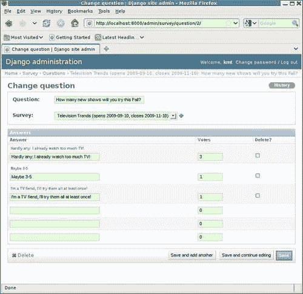

# 九、当你甚至不知道记录什么时：使用调试器

对于开发过程中遇到的许多问题，调试器是最有效的工具，可以用来帮助了解发生了什么。调试器可以让您准确地看到代码在做什么，如果需要，可以一步一步地查看。它可以让您看到并更改变量的值。使用调试器，您甚至可以在更改源代码之前测试潜在的代码修复。

本章重点介绍在 Django 应用程序开发过程中使用调试器帮助调试。具体而言，在本章中，我们将：

*   继续开发 survey 应用程序，了解如何使用 Python 调试器 pdb 来帮助解决出现的任何问题
*   了解如何使用调试器验证受多进程争用条件约束的代码的正确操作
*   简要讨论使用图形调试器调试 Django 应用程序

# 实施调查结果显示

“调查”应用程序还有一个主要部分有待实现：显示已完成调查的结果。这个展示应该采取什么形式？对于调查中每个问题的每个答案，只写一份文本投票记录是很容易的，但并不善于传达结果。结果的图形表示，如饼图，在传达选票细目方面会更有效。

在本章中，我们将探讨几种不同的方法来实现“调查结果”视图，该视图采用饼图来显示投票分布。在此过程中，我们将遇到一些困难，并了解如何使用 Python 调试器来帮助找出问题所在。

在开始实现显示调查结果的代码之前，让我们先设置一些测试数据，以便在测试结果时使用。我们可以使用现有的**电视趋势**调查，简单地调整其数据以反映我们想要测试的内容。首先，我们需要将其`closes`日期更改为最后两周，以便将其显示为已完成的调查，而不是活动的调查。

第二，我们需要设置问题答案的`votes`计数，以确保我们测试我们想要涵盖的任何特殊情况。这个`Survey`有两个问题，因此我们可以用它来测试答案中只有一个明确的赢家的情况和平局的情况。

我们可以使用 admin 应用程序为第一个问题的获胜者打成平局：


在这里，我们将**喜剧**和**戏剧**设定为获胜答案的双向平局。为了简单起见，投票总数（5）一直保持在较低水平。当楔形块应该包含总量的五分之一和五分之二时，很容易验证饼图看起来是否正确。

对于第二个问题，我们可以设置数据，以便有一个明确的赢家：



对于这个问题，我们的结果显示应该只列出**几乎没有：我已经看太多电视了！**作为唯一的获奖答案。

# 使用 pygooglechart 显示结果

一旦我们决定要创建饼图，下一个问题是：我们怎么做？图表创建没有内置到 Python 语言中。但是，有几个附加库提供此功能。我们将首先尝试一种最简单的替代方法，`pygooglechart`，它是围绕 Google 图表 API 的 Python 包装。

`pygooglechart`包在 Python 包索引站点[上提供 http://pypi.python.org/pypi/pygooglechart](http://pypi.python.org/pypi/pygooglechart) 。有关基础谷歌图表 API 的信息，请访问[http://code.google.com/apis/chart/](http://code.google.com/apis/chart/) 。本章使用的`pygooglechart`版本为 0.2.0。

对于 web 应用程序来说，使用`pygooglechart`的一个原因非常简单，那就是构造图表的结果只是一个可以用来获取图表图像的 URL。不需要从我们的应用程序生成或提供图像文件。相反，所有的工作都可以推到 GoogleChartAPI 上，我们的应用程序只包含引用 Google 提供的图像的 HTML`img`标记。

那么，让我们从显示调查结果的模板开始。此模板的当前实现`survey/completed_survey.html`只不过是打印一个标题，注明调查的标题：

```py
 
 
<h1>Survey results for {{ survey.title }}</h1> 
 
```

我们现在想要改变这一点，并添加模板代码来循环调查中的问题，并打印每个问题的结果。回想一下，`Question`模型有一种方法（在[第 3 章](03.html "Chapter 3. Testing 1, 2, 3: Basic Unit Testing")、*测试 1、2、3：基本单元测试*中实现）返回获胜答案：

```py
class Question(models.Model): 
    question = models.CharField(max_length=200) 
    survey = models.ForeignKey(Survey) 

    def winning_answers(self): 
        max_votes = self.answer_set.aggregate(Max('votes')).values()[0]
        if max_votes and max_votes > 0: 
            rv = self.answer_set.filter(votes=max_votes) 
        else: 
            rv = self.answer_set.none() 
        return rv 
```

然后，在模板中，我们可以使用此方法访问获胜答案（或者在平局的情况下访问答案）。对于`Survey`中的每个`Question`，我们将打印问题文本、获奖答案列表以及显示每个`Answer`投票明细的饼图。执行此操作的模板代码是：

```py
 
 
<h1>Survey results for {{ survey.title }}</h1> 
 
 
 
<h2>{{ q.question }}</h2> 
<p>Winner{{ winners|length|pluralize }}:</p> 
<ul> 
 
<li>{{ answer.answer }}</li> 
 
</ul> 
<p></p> 
 
 
 
 
```

在这里我们添加了一个``块，用于循环通过调查中的问题。对于每一个，使用`winning_answers`方法检索获胜答案列表，并缓存在`winners`模板变量中。然后，如果`winners`中有任何内容，则显示以下项目：

*   问题文本，作为第二级标题。
*   获奖者名单的标题段落，根据`winners`的长度适当地用复数表示。
*   获奖答案的文本列表，格式为无序列表。
*   一个嵌入式图像，将是答案投票的饼图细分。使用需要在`Question`模型`get_piechart_url`上实现的例程检索此图像的 URL。

请注意，整个项目列表的显示由一个``块保护，以防止尝试显示未收到答案的`Question`的结果的边缘情况。这可能不太可能，但最好不要向用户显示边缘案例的可能奇怪的输出，因此在这里的模板级别，我们完全避免在这种情况下显示任何内容。

Next，我们需要对`Question`模型执行`get_piechart_url`方法。在阅读了`pygooglechart`API 之后，最初的实现可能是：

```py
    def get_piechart_url(self): 
        from pygooglechart import PieChart3D 
        answer_set = self.answer_set.all() 
        chart = PieChart3D(500, 230) 
        chart.set_data([a.votes for a in answer_set]) 
        chart.set_pie_labels([a.answer for a in answer_set]) 
        return chart.get_url() 
```

此代码检索与`Question`关联的答案集，并将其缓存在局部变量`answer_set`中。（之所以这样做，是因为在下面的代码中，集合被多次迭代，并将其缓存在局部变量中，以确保数据只从数据库中获取一次。）然后，调用`pygooglechart`API 来创建一个三维饼图`chart`，其宽度为 500 像素，高度为 230 像素。然后，为饼图按钮设置数据值：这些数据值是集合中每个答案的`votes`计数。接下来，将每个楔块的标签设置为`answer`值。最后，该方法使用`get_url`方法返回构建的图表的 URL。

这有多好？当我们导航到调查应用程序主页时，**电视趋势**调查现在应该（因为其`closes`日期已设置为已过）列在标题下，表明我们可以看到其结果：


点击**电视趋势**链接，现在将打开一个完整的调查结果页面：


这是不太正确。虽然获胜答案列表的文本显示看起来不错，但饼图没有出现。相反，浏览器显示的是为图像定义的备选文本**饼图**，这意味着检索指定图像时出错。

查看页面的 HTML 源代码，我们看到包含图像标记的两个段落如下所示：

```py
<p></p>
```

不知怎的，`get_piechart_url`方法返回了一个空字符串，而不是一个值。我们可能首先在`get_piechart_url`中添加一些日志记录，试图找出原因：

```py
    def get_piechart_url(self): 
        from pygooglechart import PieChart3D 
        import logging 
        logging.debug('get_piechart_url called for pk=%d', self.pk) 
        answer_set = self.answer_set.all() 
        chart = PieChart3D(500, 230) 
        chart.set_data([a.votes for a in answer_set]) 
        chart.set_pie_labels([a.answer for a in answer_set]) 
        logging.debug('get_piechart_url returning: %s', chart.get_url()) 
        return chart.get_url() 
```

我们在 entry 上添加了一条 log 语句，记录了`Question`实例的主键，在 exit 之前添加了一条 log 语句，记录该方法将返回的内容。但是，重新加载包含日志记录的页面会在服务器控制台上产生混乱的输出：

```py
DEBUG:root:survey_detail called with method GET, kwargs {'pk': u'1'} 
DEBUG:root:display_completed_survey called 
DEBUG:root:get_piechart_url called for pk=1 
DEBUG:root:get_piechart_url called for pk=2 
DEBUG:root:display_completed_survey returned type <class 'django.http.HttpResponse'> 
DEBUG:root:survey_detail returned type <class 'django.http.HttpResponse'> 
[14/Nov/2009 11:29:08] "GET /1/ HTTP/1.1" 200 2573 

```

我们可以看到，`survey_detail`调用了`display_completed_survey`并且`get_piechart_url`被调用了两次，但是没有消息显示它在返回什么。怎么搞的？两个`logging.debug`调用之间的代码中没有分支，因此如何执行一个调用而跳过另一个调用？

我们可以尝试在每行代码之间添加更多日志调用。然而，尽管这可能会揭示出在意外离开之前，执行在方法中进行了多远，但它不会提供任何线索来解释为什么执行会停止到下一行。在每行代码之后添加日志记录也是一件麻烦事，即使对于像这样小的方法也是如此。对于像这样的问题，调试器是一种更有效的方法来找出发生了什么。

# 调试器入门

debugger 是一个强大的开发工具，它允许我们在代码运行时查看代码在做什么。当程序在调试器的控制下运行时，用户可以暂停执行、检查和更改变量值、灵活地继续执行到下一行或其他显式设置的“断点”，等等。Python 有一个名为 pdb 的内置调试器，它提供了一个用户界面，本质上是一个增强的 Python shell。除了普通的 shell 命令外，pdb 还支持各种特定于调试器的命令，在调试调查结果显示代码时，我们将在本章中对其中许多命令进行实验。

那么，我们如何使用 pdb 来帮助了解这里发生了什么？我们希望进入调试器并逐步完成代码以查看发生了什么。第一个任务，进入调试器，可以通过在我们希望调试器控制的任何地方添加`import pdb; pdb.set_trace()`来完成。`set_trace()`调用在我们的程序中设置了一个显式断点，执行将在调试器控制下暂停，以便我们可以调查当前状态并控制代码如何进行。因此，我们可以像这样更改`get_piechart_url`方法，以便在输入时调用调试器：

```py
    def get_piechart_url(self): 
        from pygooglechart import PieChart3D 
        import logging 
        import pdb; pdb.set_trace() 
        logging.debug('get_piechart_url called for pk=%d', self.pk) 
        answer_set = self.answer_set.all() 
        chart = PieChart3D(500, 230) 
        chart.set_data([a.votes for a in answer_set]) 
        chart.set_pie_labels([a.answer for a in answer_set]) 
        logging.debug('get_piechart_url returning: %s', chart.get_url()) 
        return chart.get_url() 
```

现在，当我们重新加载“调查结果”页面时，浏览器在尝试加载页面时将显示为挂起：


当我们切换到包含`runserver`控制台的窗口时，我们会看到：

```py
DEBUG:root:survey_detail called with method GET, kwargs {'pk': u'1'} 
DEBUG:root:display_completed_survey called 
> /dj_projects/marketr/survey/models.py(71)get_piechart_url() 
-> logging.debug('get_piechart_url called for pk=%d', self.pk) 
(Pdb) 

```

在这里，我们看到对`survey_detail`视图进行了另一次调用，该调用将请求转发给`display_completed_survey`函数。然后，由于`get_piechart_url`中的`pdb.set_trace()`调用，调试器被输入。在输入时，调试器打印出两行代码，标识要执行的下一行代码的位置以及该行的内容。所以我们可以看到，我们在`survey/models.py`文件的第 71 行，在`get_piechart_url`方法中，即将向该方法发出对 log entry 的调用。在记录了执行停止位置的两行代码之后，调试器打印其提示符`(Pdb)`，并等待用户输入。

在继续逐步阅读代码并查看代码运行时发生的情况之前，让我们先看看我们可以了解到的关于我们所在位置和当前状态的信息。Pdb 支持许多命令，这里不介绍所有命令，只介绍最常用的命令。我们将从一些有助于获取代码所在位置的上下文、代码是如何到达那里的以及向当前函数传递了哪些参数的内容开始。

## 使用list 命令

对于示例，如果在调试器条目上提供的一行上下文不够，则可以使用`list`命令查看更多的周围代码。与大多数 pdb 命令一样，此命令可以缩写为其首字母。在这里使用它，我们可以看到：

```py
(Pdb
) l
 66
 67         def get_piechart_url(self):
 68             from pygooglechart import PieChart3D
 69             import logging
 70             import pdb; pdb.set_trace()
 71  ->         logging.debug('get_piechart_url called for pk=%d', self.pk)
 72             answer_set = self.answer_set.all()
 73             chart = PieChart3D(500, 230)
 74             chart.set_data([a.votes for a in answer_set])
 75             chart.set_pie_labels([a.answer for a in answer_set])
 76             logging.debug('get_piechart_url returning: %s', 
(Pdb)
 77                chart.get_url())
 78             return chart.get_url()
 79
 80     class Answer(models.Model):
 81         answer = models.CharField(max_length=200)
 82         question = models.ForeignKey(Question)
 83         votes = models.IntegerField(default=0)
 84
 85         def __unicode__(self):
 86             return self.answer
 87
(Pdb)

```

在这里我们看到对`list`命令的响应首先显示当前执行行上方的五行，然后是当前执行行（以`->`前缀表示），然后是当前行之后的五行。在`(Pdb)`提示下，然后输入一个空行，这导致重复上次输入的命令。在`list`的情况下，重复该命令会在显示的最后一行之后显示 11 行。

参数可以传递给`list`来精确指定要显示的行，例如`l 1,5`将显示当前文件中的前五行：

```py
(Pdb) l 1,5
 1     # -*- encoding: utf-8 -*-
 2
 3     import datetime
 4     from django.db import models
 5     from django.db.models import Max
(Pdb)

```

不过，`list`命令对于查看当前停止执行的代码行非常有用。如果需要更多的上下文，我发现在单独的窗口中的编辑器中打开文件比使用带参数的`list`获取文件的更完整图片更容易。

## where 命令

`w``here`命令可对`w`短路，打印当前堆栈轨迹。在本例中，关于代码是如何到达其所在位置的，并没有什么特别的神秘之处，但检查细节仍然有一定的指导意义。

模板渲染过程中调用了`get_piechart_url`方法，这意味着由于模板节点的递归渲染方式，它将有一个较长的堆栈跟踪。一开始，响应的长度和打印出来的内容的密度可能看起来很高，但是通过忽略很多细节，只关注文件和函数的名称，您可以很好地了解整个代码流。例如，在响应开始时，这里的`where`命令是：

```py
(Pdb) w 
 /usr/lib/python2.5/site-packages/django/core/management/commands/runserver.py(60)inner_run() 
-> run(addr, int(port), handler) 
 /usr/lib/python2.5/site-packages/django/core/servers/basehttp.py(698)run() 
-> httpd.serve_forever() 
 /usr/lib/python2.5/SocketServer.py(201)serve_forever() 
-> self.handle_request() 
 /usr/lib/python2.5/SocketServer.py(222)handle_request() 
-> self.process_request(request, client_address) 
 /usr/lib/python2.5/SocketServer.py(241)process_request() 
-> self.finish_request(request, client_address) 
 /usr/lib/python2.5/SocketServer.py(254)finish_request() 
-> self.RequestHandlerClass(request, client_address, self) 
 /usr/lib/python2.5/site-packages/django/core/servers/basehttp.py(560)__init__() 
-> BaseHTTPRequestHandler.__init__(self, *args, **kwargs) 
 /usr/lib/python2.5/SocketServer.py(522)__init__() 
-> self.handle() 
 /usr/lib/python2.5/site-packages/django/core/servers/basehttp.py(605)handle() 
-> handler.run(self.server.get_app()) 
 /usr/lib/python2.5/site-packages/django/core/servers/basehttp.py(279)run() 
-> self.result = application(self.environ, self.start_response) 
 /usr/lib/python2.5/site-packages/django/core/servers/basehttp.py(651)__call__() 
-> return self.application(environ, start_response) 
 /usr/lib/python2.5/site-packages/django/core/handlers/wsgi.py(241)__call__() 
-> response = self.get_response(request) 
 /usr/lib/python2.5/site-packages/django/core/handlers/base.py(92)get_response() 
-> response = callback(request, *callback_args, **callback_kwargs) 

```

我们不能完全确定所有这些代码都在做什么，但是有了像`serve_forever()`、`handle_request()`、`process_request()`、`finish_request()`和`get_response()`这样的名称，似乎这都是标准服务器请求处理循环的一部分。特别是，`get_response()`听起来好像代码正在接近为请求生成响应的实际工作完成的点。接下来，我们看到：

```py
 /dj_projects/marketr/gen_utils/logutils.py(21)__call__() 
-> rv = f(*args, **kwargs) 
 /dj_projects/marketr/survey/views.py(30)survey_detail() 
-> return display_completed_survey(request, survey) 
 /dj_projects/marketr/gen_utils/logutils.py(11)__call__() 
-> rv = f(*args, **kwargs) 
 /dj_projects/marketr/survey/views.py(40)display_completed_survey() 
-> RequestContext(request)) 

```

实际上，在`get_response`函数中，在调用`callback()`时，代码从 Django 代码（在`/usr/lib/python2.5/site-packages/django`中的文件）转换到`/dj_projects`中我们自己的代码。然后我们看到，我们已经将自己的噪声引入了带有日志包装函数的回溯中，这些函数引用了`logutils.py`中的`__call__`。

除了记录正在进行的函数调用之外，这些函数不会传递太多信息。但是忽略噪声，我们仍然可以看到调用了`survey_detail`，它又调用了`display_completed_survey`，运行到它即将返回的点（最后显示的行是对`display_completed_survey`中`render_to_response`的多行调用的结束）。对`render_to_response`的调用转换回 Django 代码：

```py
 /usr/lib/python2.5/site-packages/django/shortcuts/__init__.py(20)render_to_response() 
-> return HttpResponse(loader.render_to_string(*args, **kwargs), **httpresponse_kwargs) 
 /usr/lib/python2.5/site-packages/django/template/loader.py(108)render_to_string() 
-> return t.render(context_instance) 
 /usr/lib/python2.5/site-packages/django/template/__init__.py(178)render() 
-> return self.nodelist.render(context) 
 /usr/lib/python2.5/site-packages/django/template/__init__.py(779)render() 
-> bits.append(self.render_node(node, context)) 
 /usr/lib/python2.5/site-packages/django/template/debug.py(71)render_node() 
-> result = node.render(context) 
 /usr/lib/python2.5/site-packages/django/template/loader_tags.py(97)render() 
-> return compiled_parent.render(context) 

```

我们可以从这里以及下面的`render()`和`render_node()`调用中了解到，Django 代码正在通过呈现模板进行处理。最终，一些稍有不同的电话开始出现：

```py
 /usr/lib/python2.5/site-packages/django/template/debug.py(87)render() 
-> output = force_unicode(self.filter_expression.resolve(context)) 
 /usr/lib/python2.5/site-packages/django/template/__init__.py(546)resolve() 
-> obj = self.var.resolve(context) 
 /usr/lib/python2.5/site-packages/django/template/__init__.py(687)resolve() 
-> value = self._resolve_lookup(context) 
 /usr/lib/python2.5/site-packages/django/template/__init__.py(722)_resolve_lookup() 
-> current = current() 
> /dj_projects/marketr/survey/models.py(71)get_piechart_url() 
-> logging.debug('get_piechart_url called for pk=%d', self.pk) 
(Pdb) 

```

在渲染过程中，代码最终到达了需要在模板中渲染`{{ q.get_piechart_url }}`值的位置。最终，这被路由到对`Question`模型的`get_piechart_url`方法的调用，我们在那里调用进入调试器，这就是我们现在所处的位置。

## args 命令

`args`命令，缩写为`a`，可用于查看传递给当前执行函数的参数值：

```py
(Pdb) a 
self = Television Trends (opens 2009-09-10, closes 2009-11-10): What is your favorite type of TV show? 
(Pdb) 

```

## whatis 命令

`whatis`命令显示其参数的类型。例如：

```py
(Pdb) whatis self 
<class 'survey.models.Question'> 
(Pdb) 

```

Recall pdb 的行为也类似于 Python shell 会话，因此通过使用`self`的`type`可以获得相同的结果：

```py
(Pdb) type(self) 
<class 'survey.models.Question'> 
(Pdb) 

```

我们还可以询问变量的各个属性，这可能会有所帮助。此处为`args`命令显示的`self`值包括该模型的所有单独属性，主键值除外。我们可以找到它是什么：

```py
(Pdb) self.pk 
1L 
(Pdb) 

```

## 打印和 pp 命令

`print`命令缩写为`p`，用于打印变量的表示：

```py
(Pdb) p self 
<Question: Television Trends (opens 2009-09-10, closes 2009-11-10): What is your favorite type of TV show?> 
(Pdb)

```

对于大型数据结构，`print`的输出可能很难读取，如果它最终溢出行边界。可选的`pp`命令使用 Python`pprint`模块打印输出。这可以使输出更易于读取。例如：

```py
(Pdb) p locals() 
{'PieChart3D': <class 'pygooglechart.PieChart3D'>, 'self': <Question: Television Trends (opens 2009-09-10, closes 2009-11-10): What is your favorite type of TV show?>, 'logging': <module 'logging' from '/usr/lib/python2.5/logging/__init__.pyc'>, 'pdb': <module 'pdb' from '/usr/lib/python2.5/pdb.pyc'>} 

```

将该`print`输出与`pp`输出进行对比：

```py
(Pdb) pp locals() 
{'PieChart3D': <class 'pygooglechart.PieChart3D'>, 
 'logging': <module 'logging' from '/usr/lib/python2.5/logging/__init__.pyc'>, 
 'pdb': <module 'pdb' from '/usr/lib/python2.5/pdb.pyc'>, 
 'self': <Question: Television Trends (opens 2009-09-10, closes 2009-11-10): What is your favorite type of TV show?>} 
(Pdb) 

```

# 调试 pygooglechart 结果显示

此时我们知道代码在`get_piechart_url`方法中处于处理的开始阶段，`self`的当前值表示我们被调用的`Question`实例是询问**您最喜欢的电视节目类型的问题？**知道这一点很好，但我们真正想了解的是，随着执行的继续，会发生什么。

## 步骤和下一步命令

我们现在要做的是指示调试器继续执行，但保持调试器处于活动状态。这里通常使用两个命令：`step`（缩写为`s`）和`next`（缩写为`n`）。

`step`命令开始执行当前行，并在第一个可用的时机返回调试器。`next`命令也开始执行当前行，但在当前函数的下一行即将执行之前，它不会返回到调试器。因此，如果当前行包含函数或方法调用，`step`用于单步进入该函数并对其进行跟踪，而`next`用于完整执行被调用的函数，并仅在完成后返回调试器。

对于我们现在所处的位置，`next`是我们想要使用的命令，因为我们并不特别想进入日志代码并跟踪它的功能：

```py
(Pdb) n 
DEBUG:root:get_piechart_url called for pk=1 
> /dj_projects/marketr/survey/models.py(72)get_piechart_url() 
-> answer_set = self.answer_set.all() 
(Pdb) 

```

这里，`next`导致执行`logging.debug`调用，导致记录的消息打印到控制台。然后，调试器在当前函数的下一行执行之前再次停止。不输入任何内容将导致再次执行`next`命令，导致`answer_set`被分配`self.answer_set.all()`的值。我们可以使用`print`命令查看结果

```py
(Pdb) 
> /dj_projects/marketr/survey/models.py(73)get_piechart_url() 
-> chart = PieChart3D(500, 230) 
(Pdb) p answer_set 
[<Answer: Comedy>, <Answer: Drama>, <Answer: Reality>] 
(Pdb) 

```

到目前为止，一切正常，因此我们继续：

```py
(Pdb) n
> /dj_projects/marketr/survey/models.py(74)get_piechart_url() 
-> chart.set_data([a.votes for a in answer_set]) 
(Pdb) 
AttributeError: "'PieChart3D' object has no attribute 'set_data'" 
> /dj_projects/marketr/survey/models.py(74)get_piechart_url() 
-> chart.set_data([a.votes for a in answer_set]) 
(Pdb) 

```

有一个问题：`chart`上对`set_data`的调用引发了一个属性错误，并显示一条消息，表明图表没有此类属性。我们在执行这一例行程序时犯了一个错误。虽然许多`pygooglechart`方法以`set_`开头，但为图表设置数据的调用实际上被命名为`add_data`。因此，为图表指定数据的尝试失败。但是为什么我们没有看到这个错误反映为一个返回的调试页面，而不仅仅是一个从`get_piechart_url`返回的空字符串？我们可以通过在代码运行时继续跟踪代码来获得该问题的答案：

```py
(Pdb) 
--Return-- 
> /dj_projects/marketr/survey/models.py(74)get_piechart_url()->None 
-> chart.set_data([a.votes for a in answer_set]) 

```

这表明`get_piechart_url`方法在代码中引发`AttributeError`的点返回`None`。由于我们没有将`get_piechart_url`中的代码封装在`try/except`块中，因此错误正在向上传播到调用堆栈中。

```py
(Pdb) 
AttributeError: "'PieChart3D' object has no attribute 'set_data'" 
> /usr/lib/python2.5/site-packages/django/template/__init__.py(722)_resolve_lookup() 
-> current = current() 
(Pdb) 
> /usr/lib/python2.5/site-packages/django/template/__init__.py(723)_resolve_lookup() 
-> except TypeError: # arguments *were* required 
(Pdb) 
> /usr/lib/python2.5/site-packages/django/template/__init__.py(727)_resolve_lookup() 
-> except Exception, e: 

```

在这里，我们看到名为`get_piechart_url`的代码被封装在`try/except`块中，`except`子句正在测试是否与实际引发的异常匹配。第一个条款`except TypeError`与`AttributeError`不匹配。第二个`except Exception`不匹配，因为`AttributeError`是从基`Exception`类派生的。因此，代码应该继续运行此 except 子句中的任何代码。记住，我们可以使用`list`命令来查看这是什么：

```py
(Pdb) l
722                          current = current()
723                      except TypeError: # arguments *were* required
724                          # GOTCHA: This will also catch any TypeError
725                          # raised in the function itself.
726 
current = settings.TEMPLATE_STRING_IF_INVALID #
 invalid method call
727  ->                  except Exception, e:
728                          if getattr(e, 'silent_variable_failure', False
):
729 
current = settings.TEMPLATE_STRING_IF_INVALID
730                          else:
731                             raise
732                      except (TypeError, AttributeError):

```

这些`except`条款似乎是针对特殊情况进行的测试，其中引发的异常将被抑制，并且生成的结果将设置为`settings.TEMPLATE_STRING_IF_INVALID`的值。这暗示了该异常最终如何不会反映在调试页面中，尽管它可能不会立即发生在即将执行的`except`子句中：

```py
(Pdb) n
> /usr/lib/python2.5/site-packages/django/template/__init__.py(728)_resolve_lookup() 
-> if getattr(e, 'silent_variable_failure', False): 
(Pdb) 
> /usr/lib/python2.5/site-packages/django/template/__init__.py(731)_resolve_lookup() 
-> raise 

```

事实上，在这一点上，代码正在继续重新引发异常，但却立即再次捕获它：

```py
(Pdb) n
> /usr/lib/python2.5/site-packages/django/template/__init__.py(732)_resolve_lookup() 
-> except (TypeError, AttributeError): 

```

此时的`list`命令显示了`except`子句的作用：

```py
(Pdb) l
727                                 except Exception, e:
728                                     if getattr(e, 'silent_variable_failure', False):
729                                         current = settings.TEMPLATE_STRING_IF_INVALID
730                                     else:
731                                         raise
732  ->                 except (TypeError, AttributeError):
733                         try: # list-index lookup
734                             current = current[int(bit)]
735                         except (IndexError, # list index out of range
736                                 ValueError, # invalid literal for int()
737                                 KeyError,   # current is a dict without `int(bit)` key
(Pdb)
738                                 TypeError,  # unsubscriptable object
739                                 ):
740                             raise VariableDoesNotExist("Failed lookup for key [%s] in %r", (bit, current)) # missing attribute
741                     except Exception, e:
742                         if getattr(e, 'silent_variable_failure', False):
743                             current = settings.TEMPLATE_STRING_IF_INVALID
744                         else:
745                             raise
746
747             return current
748
(Pdb)

```

在这里，它有助于准确回忆在模板呈现期间如何处理构造，例如`{{ q.get_piechart_url }}`。Django 模板处理尝试使用以下四种方法解析点右侧的值，顺序如下：

*   查字典
*   属性查找
*   方法调用
*   列表索引查找

在前两个选项失败后，我们在方法调用尝试中间进入调试器。尝试方法调用的代码不区分由不存在的方法产生的`AttributeError`和被调用方法引发的`AttributeError`，因此下一步将尝试列表索引查找。这也会失败：

```py
(Pdb) n
> /usr/lib/python2.5/site-packages/django/template/__init__.py(733)_resolve_lookup() 
-> try: # list-index lookup 
(Pdb) 
> /usr/lib/python2.5/site-packages/django/template/__init__.py(734)_resolve_lookup() 
-> current = current[int(bit)] 
(Pdb) 
ValueError: "invalid literal for int() with base 10: 'get_piechart_url'" 
> /usr/lib/python2.5/site-packages/django/template/__init__.py(734)_resolve_lookup() 
-> current = current[int(bit)] 

```

具体来说，列表索引查找尝试引发了一个`ValueError`，我们可以从前面的代码中看到，它将被特殊处理，并转化为`VariableDoesNotExist`异常。我们可以继续跟踪代码，但现在很清楚会发生什么。无效变量被转换为分配给`TEMPLATE_STRING_IF_INVALID`设置的任何变量。由于调查项目将此设置设置为空字符串的默认值，因此空字符串是呈现`{{ q.get_piechart_url }}`的最终结果。

## 继续命令

此时，我们知道问题是什么，问题是如何导致模板中出现空字符串而不是调试页面的，我们已经准备好修复代码。我们可以使用`continue`命令，缩写为`c`，告诉调试器退出，让程序正常执行。当我们在这里这样做时，我们看到：

```py
(Pdb) c 
> /dj_projects/marketr/survey/models.py(71)get_piechart_url() 
-> logging.debug('get_piechart_url called for pk=%d', self.pk) 
(Pdb)

```

怎么搞的？我们又回到了起点。这是因为调查中有两个问题，模板会在上面循环。每个问题调用一次`get_piechart_url`方法。当我们弄清楚第一个问题发生了什么后退出调试器时，模板处理继续进行，很快它再次调用了`get_piechart_url`，再次调用`pdb.set_trace()`导致调试器进入。我们可以通过`self`现在提到调查中的第二个问题来证实这一点：

```py
(Pdb) self 
<Question: Television Trends (opens 2009-09-10, closes 2009-11-10): How many new shows will you try this Fall?> 
(Pdb) 

```

我们可以再次`continue`继续修复 Python 源文件，但这实际上提供了一个机会来使用一些额外的调试器命令，所以我们将这样做。

## 跳转指令

首先，使用`next`进入将在`chart`上调用错误方法的代码行：

```py
(Pdb) n 
DEBUG:root:get_piechart_url called for pk=2 
> /dj_projects/marketr/survey/models.py(72)get_piechart_url() 
-> answer_set = self.answer_set.all() 
(Pdb) n 
> /dj_projects/marketr/survey/models.py(73)get_piechart_url() 
-> chart = PieChart3D(700, 230) 
(Pdb) n 
> /dj_projects/marketr/survey/models.py(74)get_piechart_url() 
-> chart.set_data([a.votes for a in answer_set]) 
(Pdb) 

```

现在，手动发出应该在那里的呼叫，`chart.add_data`

```py
(Pdb) chart.add_data([a.votes for a in answer_set]) 
0 
(Pdb) 

```

该调用返回了`0`，这比引发属性错误要好得多。现在我们想跳过错误的代码行。我们可以看到`set_data`呼叫在`models.py`的`74`线上；我们想跳过第`74`行，直接转到第`75`行。我们通过`jump`命令来实现，该命令可以缩短为`j`：

```py
(Pdb) j 75 
> /dj_projects/marketr/survey/models.py(75)get_piechart_url() 
-> chart.set_pie_labels([a.answer for a in answer_set]) 
(Pdb)

```

这似乎奏效了。我们可以继续执行`next`以确认代码中没有错误：

```py
(Pdb) n 
> /dj_projects/marketr/survey/models.py(75)get_piechart_url() 
-> chart.set_pie_labels([a.answer for a in answer_set]) 
(Pdb) n 
> /dj_projects/marketr/survey/models.py(75)get_piechart_url() 
-> chart.set_pie_labels([a.answer for a in answer_set]) 
(Pdb)

```

除了我们似乎没有前进，我们似乎被困在一条线上。但我们不是。请注意，该行包含一个列表：`[a.answer for a in answer_set]`。`next`命令将避免通过调用的函数进行跟踪，但对于列表理解，它不会这样做。包含理解的行对于理解添加到列表中的每个项目都将执行一次。这可能会变得单调乏味，尤其是对于长列表。在本例中，列表只有三个元素长，因为集合中只有三个答案，所以我们可以轻松地继续按 enter 键以通过它。然而，也有一种方法可以解决这个问题，我们不妨在下一步学习。

## 中断命令

`break`命令可缩短为`b`，在指定行设置断点。由于`next`没有像我们希望的那样让我们尽快通过第 75 行，我们可以在第 76 行设置一个断点，并使用`continue`一步完成第 75 行的列表理解：

```py
(Pdb) b 76 
Breakpoint 1 at /dj_projects/marketr/survey/models.py:76 
(Pdb) c 
> /dj_projects/marketr/survey/models.py(76)get_piechart_url() 
-> logging.debug('get_piechart_url returning: %s', chart.get_url()) 
(Pdb) 

```

这对于超越列表理解之外的其他循环构造，或者当您到达一个不需要跟踪每一行的点时，代码快速前进，但是您确实想停下来看一看事情的状态，都是很方便的。

不带参数发出的`break`命令打印出当前设置的断点列表，以及它们被命中的次数：

```py
(Pdb) b
Num Type         Disp Enb   Where
1   breakpoint   keep yes   at /dj_projects/marketr/survey/models.py:76
 breakpoint already hit 1 time
(Pdb)

```

请注意，`pdb.set_trace()`产生的断点不包括在这里，此显示仅显示通过`break`命令设置的断点。

`break`命令除了简单的行号外，还支持其他参数。可以在另一个文件中指定函数名或行。此外，还可以指定触发断点必须满足的条件。这里没有详细介绍这些更高级的选项。然而，Python 文档提供了完整的细节。

## 明确的命令

设置断点后，可能会有一段时间需要清除断点。这是通过`clear`命令完成的，该命令可以短接到`cl`（而不是`c`，因为它是`continue`：

```py
(Pdb) cl 1 
Deleted breakpoint 1 
(Pdb) 

```

现在调试器将不再在`models.py`的第 76 行停止。此时，我们可能已经看到了足够多的各种调试器命令，只需输入`c`即可让代码继续：

```py
(Pdb) c 
DEBUG:root:get_piechart_url returning: http://chart.apis.google.com/chart?cht=p3&chs=700x230&chd=s:9UU&chl=Hardly%20any%3A%20I%20already%20watch%20too%20much%20TV%21|Maybe%203-5|I%27m%20a%20TV%20fiend%2C%20I%27ll%20try%20them%20all%20at%20least%20once%21 
DEBUG:root:display_completed_survey returned type <class 'django.http.HttpResponse'> 
DEBUG:root:survey_detail returned type <class 'django.http.HttpResponse'> 
[14/Nov/2009 18:03:38] "GET /1/ HTTP/1.1" 200 2989 

```

在那里我们看到代码继续处理，记录来自`get_piechart_url`的返回值，并从`display_completed_survey`和`survey_detail`退出。最终，针对该请求返回了一个`2989`字节响应。切换回 web 浏览器窗口，我们看到浏览器一直在等待响应。此外，我们手动调用正确的方法并跳过错误的方法确实有效。浏览器显示它能够成功检索第二个问题的饼图：


U幸运的是，尽管生成的图形没有错误，但标签太长，无法正确安装，这有点问题。要解决这个问题，我们可以尝试使用图例而不是标签。我们将这样做，并在下一步将`set_data`替换为`add_data`。

# 修复 pygooglechart 结果显示

We 似乎接近于有一个饼图的工作实现来显示我们的结果。我们可以将`get_piechart_url`方法更新如下：

```py
    def get_piechart_url(self): 
        import pdb; pdb.set_trace() 
        answer_set = self.answer_set.all() 
        chart = PieChart3D(500, 230) 
        chart.add_data([a.votes for a in answer_set]) 
        chart.set_legend([a.answer for a in answer_set]) 
        return chart.get_url() 
```

与前一个版本相比的变化是首先删除日志调用（因为它们没有特别的帮助），然后删除日志的导入。`PieChart3D`的导入已与其他导入一起移动到文件顶部。对`chart.set_data`的错误调用已替换为正确的`chart.add_data`。最后，对`chart.set_pie_labels`的呼叫已被`chart.set_legend`所取代，希望当答案被安排为图例时，它们能够在不溢出边缘的情况下适合图表。

那效果如何？如果我们重新加载浏览器页面，浏览器再次显示为挂起，因为`get_piechart_url`方法仍然有`pdb.set_trace()`调用 t帽子进入调试器。我们可能已经将其与其他更改一起删除，满怀希望地相信新版本的代码肯定会起作用，但这种希望常常破灭，我们发现自己不得不重新添加调用，以找出下一步出了什么问题。在本例中，还有一些调试器命令需要试验，我们将在下一步进行试验。

## 上下指令

当我们切换到`runserver`控制台窗口时，我们再次发现代码位于`get_piechart_url`的开头：

```py
DEBUG:root:survey_detail called with method GET, kwargs {'pk': u'1'} 
DEBUG:root:display_completed_survey called 
> /dj_projects/marketr/survey/models.py(71)get_piechart_url() 
-> answer_set = self.answer_set.all() 
(Pdb) 

```

我们可以继续，看看新代码是如何运行的，但是有一些调试器命令我们还没有尝试过，所以让我们先做一下。一个是前面提到的`step`命令，但从未使用过，因为我们专门使用`next`单步执行代码。如果我们在这里尝试`step`几次，我们会看到：

```py
(Pdb) s 
--Call-- 
> /usr/lib/python2.5/site-packages/django/db/models/fields/related.py(319)__get__() 
-> def __get__(self, instance, instance_type=None): 
(Pdb) 
> /usr/lib/python2.5/site-packages/django/db/models/fields/related.py(320)__get__() 
-> if instance is None: 
(Pdb) 
> /usr/lib/python2.5/site-packages/django/db/models/fields/related.py(323)__get__() 
-> return self.create_manager(instance, 
(Pdb) 
> /usr/lib/python2.5/site-packages/django/db/models/fields/related.py(324)__get__() 
-> self.related.model._default_manager.__class__) 
(Pdb) 
--Call-- 
> /usr/lib/python2.5/site-packages/django/db/models/fields/related.py(346)create_manager() 
-> def create_manager(self, instance, superclass): 
(Pdb) 
> /usr/lib/python2.5/site-packages/django/db/models/fields/related.py(350)create_manager() 
-> rel_field = self.related.field 
(Pdb) 

```

H在此之前，我们有六次单步执行，因此现在在 Django 代码中嵌套了两个调用级别。我们是故意这么做的，这通常是了解 Django（或其他支持库）代码如何工作的有用方法。但是，当调试错误地开始单步执行支持库代码时，我们实际上只想单步执行我们自己的代码，这也是很常见的。然后，我们突然发现自己嵌套在完全不熟悉的代码中，可能有几层，我们希望回到我们正在开发的代码中。

O实现这一点的唯一方法是使用`up`命令，该命令可以缩短为`u`。`up`命令将当前堆栈帧在调用链中上移一级：

```py
(Pdb) u 
> /usr/lib/python2.5/site-packages/django/db/models/fields/related.py(324)__get__() 
-> self.related.model._default_manager.__class__) 
(Pdb) u 
> /dj_projects/marketr/survey/models.py(71)get_piechart_url() 
-> answer_set = self.answer_set.all() 
(Pdb) u 
> /usr/lib/python2.5/site-packages/django/template/__init__.py(722)_resolve_lookup() 
-> current = current() 
(Pdb) 

```

在这里，我们提升了三个层次。原始的当前堆栈帧是用于调用`create_manager`的帧。第一个`up`命令将当前堆栈帧切换到`__get__`的堆栈帧，下一个切换到`get_piechart_url`，第三个返回到`get_piechart_url`的调用者`_resolve_lookup`。切换当前堆栈帧不会执行任何代码，它只是更改命令的上下文。例如，现在当`_resolve_lookup`的当前堆栈帧为当前时，我们可以检查该帧中存在的变量：

```py

(Pdb) whatis current 
Function get_piechart_url 
(Pdb) 

```

另外，`list`现在将向我们显示与当前堆栈帧相关的代码：

```py
(Pdb) l
717                         if callable(current):
718 
if getattr(current, 'alters_data', False):
719                                 current = settings.TEMPLATE_STRING_IF_INVALID
720                             else:
721                                 try: # method call (assuming no args required)
722  ->                                 current = current()
723                                 except TypeError: # arguments *were* required
724                                     # GOTCHA: This will also catch any TypeError
725                                     # raised in the function itself.
726                                     current = settings.TEMPLATE_STRING_IF_INVALID # invalid method call
727                                 except Exception, e:
(Pdb)

```

如果我们切换了堆栈帧，并且想知道当前堆栈帧相对于当前执行点的位置，那么`where`命令会显示这一点。在这种情况下，`where`命令输出的结尾如下所示：

```py
 /usr/lib/python2.5/site-packages/django/template/__init__.py(687)resolve() 
-> value = self._resolve_lookup(context) 
> /usr/lib/python2.5/site-packages/django/template/__init__.py(722)_resolve_lookup() 
-> current = current() 
 /dj_projects/marketr/survey/models.py(71)get_piechart_url() 
-> answer_set = self.answer_set.all() 
 /usr/lib/python2.5/site-packages/django/db/models/fields/related.py(324)__get__() 
-> self.related.model._default_manager.__class__) 
 /usr/lib/python2.5/site-packages/django/db/models/fields/related.py(350)create_manager() 
-> rel_field = self.related.field 
(Pdb) 

```

列出的最后一行始终是当前执行点，而当前堆栈帧由第一列中的`>`表示。这里表示当前堆栈帧是`_resolve_lookup`的堆栈帧。

在本例中，我们向上移动了一个堆栈帧，超出了我们真正想要的范围。为了回到我们自己的代码，我们需要向下移动一个级别。这是通过使用`down`命令完成的（可以缩短为`d`：

```py

(Pdb) d 
> /dj_projects/marketr/survey/models.py(71)get_piechart_url() 
-> answer_set = self.answer_set.all() 
(Pdb) 

```

现在，如果我们想从这里继续运行到下一行，我们可以使用`next`命令：

```py
(Pdb) n 
> /dj_projects/marketr/survey/models.py(72)get_piechart_url() 
-> chart = PieChart3D(500, 230) 
(Pdb) 

```

现在我们回到了熟悉的领域，可以继续调试我们自己的代码了。

## 返回命令

第二种方法是使用`return`命令，可以将缩短为`r`。此命令继续执行，直到当前函数返回，然后再次输入调试器。要看到它的作用，让我们进入`PieChart3D`呼叫：

```py
(Pdb) s 
--Call-- 
> /var/lib/python-support/python2.5/pygooglechart.py(820)__init__() 
-> def __init__(self, *args, **kwargs): 
(Pdb) 
> /var/lib/python-support/python2.5/pygooglechart.py(821)__init__() 
-> assert(type(self) != PieChart)  # This is an abstract class 
(Pdb) 
> /var/lib/python-support/python2.5/pygooglechart.py(822)__init__() 
-> Chart.__init__(self, *args, **kwargs) 
(Pdb) 

```

我们已经对该方法进行了几个步骤，但只进行了一次调用，因此一个`return`应该可以让我们回到调查代码：

```py
(Pdb) r 
--Return-- 
> /var/lib/python-support/python2.5/pygooglechart.py(823)__init__()->None 
-> self.pie_labels = [] 
(Pdb) 

```

此方法显然没有显式返回行，因此显示的代码行是该方法中的最后一行。输出中的`->None`显示方法返回的内容。如果我们从这里开始：

```py
(Pdb) s 
> /dj_projects/marketr/survey/models.py(73)get_piechart_url() 
-> chart.add_data([a.votes for a in answer_set]) 
(Pdb) 

```

We 现在返回到调用创建饼图后的下一行代码。从这里，我们可以使用 return 来查看`get_piechart_url`方法将返回什么：

```py
(Pdb) r 
--Return-- 
> /dj_projects/marketr/survey/models.py(75)get_piechart_url()->'http://chart...Drama|Reality' 
-> return chart.get_url() 
(Pdb) 

```

T帽子看起来不错；函数运行完成并返回一个值。此外，如果返回值很长，pdb 似乎会缩短显示的返回值，因为显示的值看起来不太正确。我们可以通过`print`命令中的任何一个来确认这一点，这表明实际值要长一点：

```py
(Pdb) pp chart.get_url() 
'http://chart.apis.google.com/chart?cht=p3&chs=500x230&chd=s:99f&chdl=Comedy|Drama|Reality' 
(Pdb)

```

此时，看起来一切正常，我们不妨使用`continue`让程序继续运行，然后在第二个饼图中输入调试器时再次使用`continue`：

```py
(Pdb) c 
> /dj_projects/marketr/survey/models.py(71)get_piechart_url() 
-> answer_set = self.answer_set.all() 
(Pdb) c 
DEBUG:root:display_completed_survey returned type <class 'django.http.HttpResponse'> 
DEBUG:root:survey_detail returned type <class 'django.http.HttpResponse'> 
[15/Nov/2009 11:48:07] "GET /1/ HTTP/1.1" 200 3280 

```

这帽子看起来都不错。浏览器显示什么？切换到其窗口，我们可以看到以下内容：


比以前好多了。从标签切换到图例解决了答案文本从图形中溢出的问题。然而，饼图本身的大小因答案的长度而不同，这有点令人不安。此外，如果饼图楔块可以标记为每个楔块所代表的总百分比，这可能会很好。

R在谷歌图表 API 上搜索更多内容并没有揭示任何控制图例位置的方法，以保持饼图大小不变，也没有揭示如何使用诸如占总数百分比之类的信息注释楔形。虽然使用起来相当简单和直接，但该 API 在定制生成的图表方面并没有提供很多功能。因此，我们可能希望研究生成图表的其他替代方案，我们将在下一步进行。

不过，我们将保留`get_piechart_url`的当前实现，因为此时我们不知道是否真的要切换到另一种实现。在继续下一步之前，删除该函数中的导入`pdb; pdb.set_trace()`是有意义的。该例程现在正在工作，如果我们稍后再使用它，那么如果它在没有用户干预的情况下运行到完成，而不是中断调试器，效果会更好。

# 使用 matplotlib 显示结果

`matplotlib`库为从 Python 生成图表提供了另一种选择。可以在 Python 包索引站点[上找到它 http://pypi.python.org/pypi/matplotlib](http://pypi.python.org/pypi/matplotlib) 。本章使用的`matplotlib`版本为 0.98.3。

使用`matplotlib`，我们的应用程序不能简单地构造 URL，并将生成和服务图像数据的任务推送到另一台主机。相反，我们需要编写一个视图来生成和服务图像数据。在对`matplotlib`API 进行一些调查之后，（在`survey/views.py`中）的初始实现可能是：

```py
from django.http import HttpResponse 
from survey.models import Question 
from matplotlib.figure import Figure 
from matplotlib.backends.backend_agg import FigureCanvasAgg as \FigureCanvas 

@log_view 
def answer_piechart(request, pk): 
    q = get_object_or_404(Question, pk=pk) 
    answer_set = q.answer_set.all() 
    x = [a.votes for a in answer_set] 
    labels = [a.answer for a in answer_set] 

    fig = Figure() 
    axes = fig.add_subplot(1, 1, 1) 
    patches, texts, autotexts = axes.pie(x, autopct="%.0f%%") 
    legend = fig.legend(patches, labels, 'lower left') 

    canvas = FigureCanvas(fig) 
    response = HttpResponse(content_type='image/png') 
    canvas.print_png(response) 
    return response 
```

那个比`pygooglechart`版本要复杂一点。首先，我们需要从`matplotlib`导入两个内容：基本`Figure`类和一个可用于渲染图形的适当后端。在这里，我们选择了`agg`（反粒度几何体）后端，因为它支持渲染为 PNG 格式。

在`answer_piechart`视图中，前四行非常简单。`Question`实例从传递给视图的主键值中检索。该问题的答案集缓存在局部变量`answer_set`中。然后从答案集创建两个数据数组：`x`包含每个答案的计票值，`labels`包含答案文本值。

接下来，创建一个基本的`matplotlib Figure`。`matplotlib Figure`支持包含多个子批次。对于`Figure`保存单个绘图的简单情况，仍然需要调用`add_sublot`来创建子绘图，并返回一个可用于绘制绘图的`Axes`实例。`add_subplot`的参数是子地块网格中的行数和列数，然后是添加到`Figure`的地块数。这里的参数`1, 1, 1`表示 1 x 1 网格中的单个子地块。

然后在返回的子批次`axes`上调用`pie`方法以生成饼图。第一个参数`x`是饼图楔块的数据值数组。`autopct`关键字参数用于指定一个格式字符串，用于注释每个饼图楔块及其占总数的百分比。值`%.0f%%`指定浮点百分比值的格式应为小数点后的零位，后跟百分号。

The`pie`方法返回三个数据序列。其中的第一个`patches`描述了饼图楔块，需要传递给图的`legend`方法，以创建图例，使楔块与其相关的答案值相匹配。在这里，我们指定图例应放置在图的左下角。

`pie`返回的另外两个序列描述了楔形块的文本标签（此处为空，因为调用`pie`时未指定`labels`和`autopct`注释。这里的代码不需要将这些序列用于任何事情。

图例就位后，图形即完成。使用之前导入的`agg`后端`FigureCanvas`为其创建`canvas`。创建内容类型为`image/png`的`HttpResponse`，并使用`print_png`方法将图像以 PNG 格式写入响应。最后，`answer_piechart`视图返回此响应。

完成视图代码后，我们需要更新`survey/urls.py`文件，以包含将请求路由到该视图的映射：

```py
urlpatterns = patterns('survey.views', 
    url(r'^$', 'home', name='survey_home'), 
    url(r'^(?P<pk>\d+)/$', 'survey_detail', name='survey_detail'), 
    url(r'^thanks/(?P<pk>\d+)/$', 'survey_thanks', name='survey_thanks'),
    url(r'^piechart/(?P<pk>\d+)\.png/$', 'answer_piechart', name='survey_answer_piechart'), 
) 
```

这里我们添加了最后一个图案。此模式匹配以`piechart/`开头，后跟一个或多个数字（主键），以`.png`结尾的 URL 路径。这些 URL 被路由到`survey.views.answer_piechart`视图，并将捕获的主键值作为参数传递。模式名为`survey_answer_piechart`。

切换到使用`matplotlib`而不是`pygooglechart`所需的最后一个步骤是更新`survey/completed_survey.html`模板以使用此模式生成 URL。唯一需要的更改是更新包含`img`标记的行：

```py
<p></p> 
```

在这里，我们用引用刚刚添加的新模式的`url`模板标记替换了对问题的`get_piechart_url`方法的调用。

这是怎么回事？还算不错。我们没有为数字指定大小，`matplotlib`中的默认大小比我们为`pygooglechart`指定的大一点，因此如果不滚动，我们无法看到整个页面。然而，每个单独的数字看起来都很好。例如，第一个选项如下所示：


第二个看起来像这样：


`matplotlib`API 支持的定制比我们在这里使用的多得多。图形的大小可以更改，饼图的位置、楔形块的颜色以及文本的字体属性也可以更改。获胜答案的楔形饼可以通过将其从饼的其余部分分解出来来强调。然而，所有这些项目都是装饰性的，超出了我们将在这里介绍的范围。为了回到调试的主题，我们将在下一节中把注意力转向删除一些由于切换到`matplotlib`而引入的浪费性重复处理。

# 改进 matplotlib 方法

考虑一下当浏览器完成一个完整的调查页面时会发生什么。对于调查中的每个问题，返回的已完成调查页面都有一个嵌入式图像，当获取该图像时，将触发对`answer_piechart`视图的调用。该视图动态生成一个图像，计算成本很高。事实上，根据您的硬件，如果您尝试单步通过该视图，您可能会在跨过某些`matplotlib`调用时观察到明显的暂停。

现在考虑当许多不同的用户请求相同的完整的调查页面时会发生什么。这将触发许多对计算昂贵的`answer_piechart`视图的调用。Ul由于在调查结束前不会显示结果，因此用于创建饼图的基本计票数不会改变，因此，所有用户将获得完全相同的数据。然而`answer_piechart`将被反复调用，重新做同样大量的工作，以产生完全相同的结果。这是对我们服务器容量的浪费。

我们如何消除这种浪费？有（至少）三种可能的方法：

*   引入缓存，缓存`answer_piechart`视图的结果。
*   设置一些外部流程，在调查关闭时预先计算调查的所有饼图，并将其保存在磁盘上的某个位置。更改已完成调查响应模板中的`img`标记，以引用这些静态文件，而不是动态生成图像的视图。
*   在收到第一个调查请求时，动态生成已完成调查的饼图，并将其保存到某个磁盘上。这与第二种方法基本相同，因为完成的调查响应中的`img`标记现在将引用静态文件，但图表的计算将从一些外部进程移动到 web 服务器。

这些方法各有利弊。我们要追求的是最后一个，因为它提供了学习一些新事物的最多机会。具体地说，在实现第三种方法时，我们将看到如何设置开发服务器来服务静态文件，以及如何使用 pdb 来确保代码在多进程竞争条件下正常运行。

## 设置静态文件服务

到目前为止，在调查应用程序的开发中，我们完全专注于为动态内容提供服务。虽然动态内容当然是 Django 应用程序的重点，但实际上，即使是最动态的应用程序也会有一些需要从文件中提供的数据。在这里，使用 survey 应用程序，我们遇到了希望从磁盘提供图像文件的情况。大多数应用程序还将具有 CSS 和可能的 JavaScript 文件，这些文件最好直接从磁盘提供，而不是通过 Django 视图代码。

Django 是一个提供动态内容的框架。尽管它不直接支持从文件中提供数据，但有两种设置有助于将一些静态文件合并到项目中。这些是`MEDIA_ROOT`和`MEDIA_URL`。

`MEDIA_ROOT`是一个文件系统路径—保存项目静态文件的目录路径。Django 在内部使用它作为基本路径，用于保存上传到包含`FileField`的模型的文件。对于 survey 应用程序，我们将使用它作为保存动态生成的饼图图像文件的基本路径。

此设置的默认值为空字符串，因此我们需要将其设置为其他值，以便使用：

```py
MEDIA_ROOT = '/dj_projects/marketr/site_media/'
```

在这里，我们将`MEDIA_ROOT`设置为指向主`marketr`项目目录下的`site_media`目录（我们必须创建该目录）。

`MEDIA_URL`也是默认的空字符串，是引用静态文件的基本 URL 路径。Django 在内部使用它来泛化由`FileField`模型引用的文件的`url`属性。

此外，`django.core.context_processors.media`上下文处理器通过在模板上下文中设置`MEDIA_URL`使该设置的值在模板中可用。默认情况下，此上下文处理器处于启用状态，因此使用`RequestContext`呈现的任何模板都可以访问`MEDIA_URL`。

我们在`settings.py`中设置`MEDIA_URL`如下：

```py
MEDIA_URL = '/site_media/' 
```

请注意，`MEDIA_URL`中不应使用的一个值是`'/media/'`。这是`ADMIN_MEDIA_PREFIX`的默认设置，它定义管理员使用的静态文件的根 URL。试图将两个不同的静态文件树放在 URL 层次结构中的同一位置是行不通的，通过将`MEDIA_URL`设置为`'/media/'`以外的内容，最容易避免这种情况。

请注意，尽管这些设置是根据建立从 URL 路径到磁盘上文件的映射来定义的，但 Django 中的任何内容都不会基于该映射自动为文件提供服务。在 URL 解析过程中，Django 不会测试请求的 URL 是否以`MEDIA_URL`开头，如果是，则提供在`MEDIA_ROOT`下找到的相应文件。相反，Django 假设引用磁盘上静态文件的 URL 将由 web 服务器直接提供，而不是通过 Django 代码路由。

然而，到目前为止，在开发过程中，除了 Django 自己的开发服务器之外，我们还没有使用任何 web 服务器。如果我们想继续使用开发服务器，我们需要以某种方式让它为调查应用程序创建的图像文件服务。我们怎么做？

Django 确实提供了静态文件服务功能，专门用于开发期间。要使用它，我们需要更新项目的`urls.py`文件，将以`'site_media/'`开头的 URL 请求路由到 Django 的静态文件服务视图。因此，我们需要将`urls.py`文件更改为包含：

```py
from django.conf.urls.defaults import * 

# Uncomment the next two lines to enable the admin: 
from django.contrib import admin 
admin.autodiscover() 

from django.conf import settings 

urlpatterns = patterns('', 
    # Example: 
    # (r'^marketr/', include('marketr.foo.urls')), 

    # Uncomment the admin/doc line below and add # 'django.contrib.admindocs' 
    # to INSTALLED_APPS to enable admin documentation: 
    # (r'^admin/doc/', include('django.contrib.admindocs.urls')), 

    # Uncomment the next line to enable the admin: 
    (r'^admin/', include(admin.site.urls)), 
    (r'^site_media/(.*)$', 'django.views.static.serve', 
        {'document_root': settings.MEDIA_ROOT, 'show_indexes': True}), 
    (r'', include('survey.urls')), 
) 
```

与上一版本相比，这里的第一个变化是从`django.conf`中增加了`settings`的`import`。第二个是添加了指向以`site_media/`开头的 URL 的模式。这些 URL 被路由到`django.views.static.serve`。将两个参数传递到此视图：`document_root`和`show_indexes`。对于`document_root`，指定了`MEDIA_ROOT`设置，这意味着静态服务器将在`MEDIA_ROOT`下查找请求的文件。为`show_indexes`指定了`True`，这意味着当请求的 URL 引用目录而不是文件时，静态服务器将返回文件列表。

## 动态生成图像文件

不w 我们已经为从磁盘提供图像文件做好了一切准备，我们可以开始为此方法进行必要的代码更改。首先，我们应该从`survey/urls.py`文件中删除`piechart`模式，因为它不再需要了。

其次，我们可以更新`views.py`中的`display_completed_survey`函数，以包含代码，确保在返回已完成的调查响应之前，已生成调查中每个问题的饼图图像文件：

```py
@log_call 
def display_completed_survey(request, survey): 
    for q in survey.question_set.all(): 
        q.check_piechart() 
    return render_to_response('survey/completed_survey.html', {'survey': survey}, 
        RequestContext(request)) 
```

在这里，我们添加了一个`for`循环，该循环遍历了调查中的所有问题。对于每一个问题，它都会调用一个新的方法，`check_piechart`。此例程将负责确保饼图文件存在，并在必要时创建它。

接下来，我们可以转到`survey/models.py`文件并更新`Question`模型，以包括`check_piechart`的实现以及支持新方法可能需要的任何其他内容。还需要什么？对于从模板中引用饼图 URL，如果`Question`模型支持返回饼图文件相对于`MEDIA_URL`的路径，则比较方便。因此，我们在`Question`模型中需要两种新方法：

```py
from survey import pie_utils
class Question(models.Model): 
    [… other code unchanged ...]

    @property 
    def piechart_path(self): 
        if self.pk and self.survey.closes < datetime.date.today():
            return pie_utils.PIE_PATH + '%d.png' % self.pk 
        else: 
            raise AttributeError 

    def check_piechart(self): 
        pie_utils.make_pie_if_necessary(self.piechart_path, self.answer_set.all())
```

在这里，我们选择不在`survey/models.py`中直接包含大量的文件检查和创建代码，而是在`survey/pie_utils.py`中将这些工作考虑到一个新的独立模块中。因此，这里实现的两个例程可以保持非常简单。

`piechart_path`作为只读属性实现，返回饼图的路径。此值可与`MEDIA_URL`设置组合创建 URL 路径，或与`MEDIA_ROOT`设置组合创建文件系统路径。因为从长远来看，我们希望在树中有更多的文件，而不仅仅是饼图图像，所以将饼图放在树的根中是不合适的。因此，`pie_utils.PIE_PATH`值用于在静态文件树中划出一个子树来保存饼图。

请注意，如果模型实例尚未保存到数据库中，或者如果它引用了尚未关闭的调查，则实现此例程是为了引发一个`AttributeError`。在这些情况下，饼图文件不应该存在，因此任何引用它的尝试都会触发错误。

实现 The`check_piechart`方法将调用转发给`pie_utils make_pie_if_necessary`函数。此函数接受两个参数：饼图的路径和问题的答案集。

在我们继续实现`pie_utils`模块之前，我们可以对`survey/completed_survey.html`模板进行简单的更新。创建引用饼图图像的 URL 时，需要更改包含`img`标记的行，以使用`Question`模型的`piechart_path`：

```py
<p></p> 
```

这里，`piechart_path`与`MEDIA_URL`结合（模板中提供，因为`display_completed_survey`在调用`render_to_response`时指定了一个`RequestContext`来构建图像的完整 URL。

最后，我们需要实现`survey/pie_utils.py`代码。此模块必须为`PIE_PATH`定义一个值，并实现`make_pie_if_necessary`功能。第一项任务很琐碎，可以通过以下方式完成：

```py
import os
from django.conf import settings 
PIE_PATH = 'piecharts/' 
if not os.path.exists(settings.MEDIA_ROOT + PIE_PATH): 
    os.mkdir(settings.MEDIA_ROOT + PIE_PATH)    
```

此代码为`PIE_PATH`定义一个值，并确保项目`MEDIA_ROOT`下的结果子目录存在，必要时创建它。使用此代码和前面提到的`MEDIA_ROOT`设置，测量应用程序的饼图图像文件将放置在`/dj_projects/marketr/site-media/piecharts/`中。

完成`pie_utils`模块所需的第二部分是`make_pie_if_necessary`功能的实现，乍一看可能也很简单。如果文件已经存在，`make_pie_if_necessary`不需要做任何事情，否则需要创建文件。但是，当您认为此代码的部署环境最终将是一个潜在的多进程多线程 Web 服务器时，情况会变得更加复杂。这介绍了比赛条件的机会，我们将在下面讨论。

## 处理比赛条件

`make_pie_if_necessary`模块的天真实现可能是：

```py
def make_pie_if_necessary(rel_path, answer_set): 
    fname = settings.MEDIA_ROOT + rel_path 
    if not os.path.exists(fname): 
        create_piechart(fname, answer_set) 
```

此处`make_pie_if_necessary`通过将传递的相对路径与设置`MEDIA_ROOT`值相结合来创建完整的文件路径。然后，如果该文件不存在，它调用`create_piechart`，传递文件名和答案集，以创建饼图文件。此例程可以这样实现：

```py
from matplotlib.figure import Figure 
from matplotlib.backends.backend_agg import FigureCanvasAgg as \FigureCanvas 

def create_piechart(f, answer_set): 
    x = [a.votes for a in answer_set] 
    labels = [a.answer for a in answer_set] 

    fig = Figure() 
    axes = fig.add_subplot(1, 1, 1) 
    patches, texts, autotexts = axes.pie(x, autopct="%.0f%%") 
    legend = fig.legend(patches, labels, 'lower left') 

    canvas = FigureCanvas(fig) 
    canvas.print_png(f) 
```

这段代码本质上是`answer_piechart`视图中原始`matplotlib`实现中的代码，经过修改以说明答案集已被直接传递的事实，以及图像数据应写入的文件。

当使用开发服务器进行测试时，`make_pie_if_necessary`的这种实现将运行良好。它甚至可能在负载较轻的生产环境中工作得很好。但是，如果考虑重载的生产环境，在多进程 Web 服务器上，对于同一页面的请求可能几乎同时到达，出现了一个潜在的问题。没有什么可以阻止对`make_pie_if_necessary`的多个几乎同时的调用导致对`canvas.print_png`的多个几乎同时的调用来创建同一个文件。

这在多处理器机器上是如何发生的是很清楚的，因为很容易看出两个同时的请求如何被分派到不同的处理器，并导致相同的代码在每个处理器上同时运行。这两个进程都检查文件是否存在，都发现它不存在，并且都开始创建它。

即使在单处理器机器上，通过操作系统的抢占式调度，也可能发生同样的情况。一个进程可能会检查文件是否存在，发现文件不存在，然后开始创建文件。然而，在这段代码真正开始创建文件之前，操作系统的抢占式调度程序会暂停它，并让处理第二个几乎同时发生的请求的进程运行。此过程在检查时也无法找到文件，并且还会沿着创建文件的路径开始。

如果发生这种情况，最终结果会是什么？有那么糟糕吗？也许不是。可能一个进程将完成其创建和写入文件的工作，然后第二个进程将完成其工作，覆盖第一个进程的结果。本来会有一些重复的工作完成，但最终的结果可能会很好：磁盘上的一个文件包含饼图的 PNG 图像。

However，有没有保证两个几乎同时进行的调用的工作会像那样序列化？否。`matplotlib`API 不提供任何此类保证。如果不深入研究实现，就很难确定，但是写入图像文件的任务可能会被分成几个不同的单独写入调用。这为来自引用同一文件的不同进程的调用的随机交错提供了充分的机会，从而导致最终写入磁盘的损坏映像文件。

为了防止出现这种情况，我们需要将`make_pie_if_necessary`函数更改为使用原子方法检查文件是否存在，并在必要时创建它：

```py
import errno
def make_pie_if_necessary(rel_path, answer_set): 
    fname = settings.MEDIA_ROOT + rel_path 
    try: 
        fd = os.open(fname, os.O_WRONLY | os.O_CREAT | os.O_EXCL) 
        try: 
            f = os.fdopen(fd, 'wb') 
            create_piechart(f, answer_set) 
        finally: 
            f.close() 
    except OSError, e: 
        if e.errno == errno.EEXIST: 
            pass 
        else: 
            raise 
```

此代码使用传递给`os.open`例程的标志组合以原子方式创建文件。`os.O_WRONLY`指定该文件仅为写入而打开，`os.O_CREAT`指定如果该文件不存在，则应创建该文件，`os.O_EXCL`与`os.O_CREAT`一起指定如果该文件存在，则应引发错误。即使多个进程同时发出这个`os.open`调用，底层实现也保证只有一个会成功，而其他进程则会出错。因此，只有一个进程将继续执行创建饼图的代码。

请注意，在 Windows 上运行时，`os.O_BINARY`还需要包含在传递到`os.open`的标志集中。如果没有该标志，Python 会将文件数据视为文本，并在写入文件的数据中遇到换行符时自动插入回车符。此行为将导致无法显示损坏的 PNG 图像文件。

O此更改引入的一个问题是`os.open`返回的文件描述符不能作为 PNG 数据的目标文件传递给`matplotlib`。`matplotlib`库接受文件名或类似 Python 文件的对象，但不支持`os.open`返回的文件描述符。因此，这里的代码使用`os.fdopen`将文件描述符转换为 Python 文件对象，并将返回的文件传递给`create_piechart`例程。

在`os.open`调用引发`OSError`的情况下，将根据`errno.EEXIST`测试异常的`errno`属性。这是当文件已经存在时将引发的特定错误，不应反映为错误，而应忽略。任何其他错误都会反映给`make_pie_if_necessary`的调用者。

这些更改可确保仅创建一次图像文件，这很好。然而，还有一个潜在的问题。考虑多个同时请求会发生什么。只有一个将沿着创建文件的路径继续。所有其他人将看到该文件已经存在，只需继续发送引用它的响应。

但是请注意，文件的存在并不保证图像数据已经写入其中：在将图像写入文件之前，首先要进行大量的处理来创建图像。是否有任何保证，该处理将在收到和处理任何文件请求之前完成？否。根据客户端的速度和图像生成的速度，在图像数据实际写入文件之前，文件请求可能到达并被处理。

这有可能发生吗？可能不会。如果这样做会有什么影响？可能没什么可怕的。浏览器可能会显示部分图像或图像的**饼图**备选文本。用户可能会尝试重新加载页面，以查看第二次是否工作得更好，然后图像文件可能会得到正确的服务。

鉴于出现这种情况的可能性似乎很小，而且影响也很小，我们可能选择不解决这一特定问题。但是，在某些情况下，可能需要确保文件不仅存在，而且还包含数据。可能值得研究修复此潜在问题。一种方法是修改`make_pie_if_necessary`如下：

```py
import fcntl
def make_pie_if_necessary(rel_path, answer_set): 
    fname = settings.MEDIA_ROOT + rel_path 
    try: 
        fd = os.open(fname, os.O_WRONLY | os.O_CREAT | os.O_EXCL) 
        try: 
            f = os.fdopen(fd, 'wb') 
            fcntl.flock(f, fcntl.LOCK_EX) 
            create_piechart(f, answer_set) 
        finally: 
            fcntl.flock(f, fcntl.LOCK_UN) 
            f.close() 
    except OSError, e: 
        if e.errno == errno.EEXIST: 
            wait_for_data(fname) 
        else: 
            raise 
```

这里的第一个更改是在调用`create_piechart`之前使用`fcntl.flock`获得文件的独占锁。（请注意，`fcntl`是一个仅限 Unix 的 Python 模块。因此，此代码在 Windows 上不起作用。Windows 中有附加程序包可以获得文件锁定功能，但使用其中任何一个的细节都超出了本文的范围。）其次，此文件锁定在`create_piechart`返回后关闭文件之前释放。第三，如果发现文件已经存在，则不会立即返回，而是调用一个新的`wait_for_data`函数。`wait_for_data`的实施是：

```py
import time
def wait_for_data(fname): 
    try: 
        fd = os.open(fname, os.O_RDONLY) 
        empty = True 
        while empty: 
            fcntl.flock(fd, fcntl.LOCK_SH) 
            st = os.fstat(fd) 
            if st.st_size > 0: 
                empty = False 
            fcntl.flock(fd, fcntl.LOCK_UN) 
            if empty: 
                time.sleep(.5) 
    finally: 
        if fd: 
            os.close(fd) 
```

给定文件名，此代码首先打开文件进行读取。然后，它假定文件为空，并进入一个循环，只要文件保持为空，循环就会继续。在循环中，代码获取文件的共享锁，然后调用`os.fstat`确定文件的大小。如果返回的大小不为零，则将`emtpy`设置为`False`，这将在本次迭代结束时终止循环。然而，在此之前，文件锁被释放，如果文件实际上是空的，那么代码在继续循环的下一次迭代之前会休眠半秒钟。睡眠是为了给另一个进程（可能正忙于创建和写入数据）时间来完成其工作。在返回之前，文件将关闭（如果曾经成功打开）。

这一切看起来都很好，当我们在浏览器中测试它时，它似乎工作得很好。然而，仅仅基于对这样的代码的目视检查，很难确定它是否完全正确。在这里使用调试器来人为地创建我们试图防止的竞争条件，可能会有所帮助。我们下一步做这个。

## 使用调试器强制竞争情况

单独使用开发服务器无法强制竞争条件：它是单线程和单进程的。但是，我们可以将开发服务器与`manage.py shell`会话结合使用，使用调试器断点和单步执行，强制执行我们想要测试的多进程交错执行的任何组合。

例如，我们可以在`make_pie_if_necessary`函数顶部附近插入断点：

```py
def make_pie_if_necessary(rel_path, answer_set): 
    fname = settings.MEDIA_ROOT + rel_path 
    try: 
        import pdb; pdb.set_trace()
        fd = os.open(fname, os.O_WRONLY | os.O_CREAT | os.O_EXCL) 
```

现在，我们需要从磁盘中删除任何已生成的图像文件，以便首次输入此函数时，它将沿着尝试创建文件的路径：

```py
rm /dj_projects/marketr/site_media/piecharts/*

```

接下来，我们确保开发服务器正在运行，并从浏览器重新加载**电视趋势**调查的结果页面。浏览器将显示为挂起，在 development server 控制台中，我们将看到调试器输入：

```py
> /dj_projects/marketr/survey/pie_utils.py(13)make_pie_if_necessary() 
-> fd = os.open(fname, os.O_WRONLY | os.O_CREAT | os.O_EXCL) 
(Pdb) 

```

如果我们使用`next`跳过此呼叫，我们将看到：

```py
(Pdb) n 
> /dj_projects/marketr/survey/pie_utils.py(14)make_pie_if_necessary() 
-> try: 
(Pdb) 

```

执行继续到下一行代码，因此`os.open`调用成功。该线程现在在创建文件时被冻结，但没有数据写入。我们希望验证调用同一函数的另一个进程在继续之前是否正确地继续等待写入文件数据。为了测试这一点，我们可以在单独的窗口中启动`manage.py shell`，手动检索相应的问题，并调用其`check_piechart`方法：

```py
kmt@lbox:/dj_projects/marketr$ python manage.py shell 
Python 2.5.2 (r252:60911, Oct  5 2008, 19:24:49) 
[GCC 4.3.2] on linux2 
Type "help", "copyright", "credits" or "license" for more information. 
(InteractiveConsole) 
>>> from survey.models import Question 
>>> q = Question.objects.get(pk=1) 
>>> q.check_piechart() 
> /dj_projects/marketr/survey/pie_utils.py(13)make_pie_if_necessary() 
-> fd = os.open(fname, os.O_WRONLY | os.O_CREAT | os.O_EXCL) 
(Pdb) 

```

`make_pie_if_necessary`中的断点在调用打开文件之前再次停止执行。在这种情况下，当我们使用“下一步”跳过调用时，我们应该看到代码采用了不同的路径，因为文件已经存在：

```py
(Pdb) n 
OSError: (17, 'File exists', '/dj_projects/marketr/site_media/piecharts/1.png') 
> /dj_projects/marketr/survey/pie_utils.py(13)make_pie_if_necessary() 
-> fd = os.open(fname, os.O_WRONLY | os.O_CREAT | os.O_EXCL) 
(Pdb) n 
> /dj_projects/marketr/survey/pie_utils.py(21)make_pie_if_necessary() 
-> except OSError, e: 
(Pdb) n 
> /dj_projects/marketr/survey/pie_utils.py(22)make_pie_if_necessary() 
-> if e.errno == errno.EEXIST: 
(Pdb) n 
> /dj_projects/marketr/survey/pie_utils.py(23)make_pie_if_necessary() 
-> wait_for_data(fname) 
(Pdb) 

```

看起来不错。在代码中，我们看到`os.open`像预期的那样，提出了一个具有`errno`属性`errno.EEXIST`的`OSError`。然后，shell 线程将继续等待文件包含数据。如果我们进入这个程序，我们可以看到它是否按照我们的预期运行：

```py
(Pdb) s 
--Call-- 
> /dj_projects/marketr/survey/pie_utils.py(43)wait_for_data() 
-> def wait_for_data(fname): 
(Pdb) n 
> /dj_projects/marketr/survey/pie_utils.py(44)wait_for_data() 
-> try: 
(Pdb) n 
> /dj_projects/marketr/survey/pie_utils.py(45)wait_for_data() 
-> fd = os.open(fname, os.O_RDONLY) 
(Pdb) n 
> /dj_projects/marketr/survey/pie_utils.py(46)wait_for_data() 
-> empty = True 
(Pdb) 

```

现在，我们已经在这个例程中完成了初步处理。文件现在已打开，`empty`已初始化为`True`。我们已经准备好进入循环的第一次迭代。该怎么办？由于控制的另一个线程在获得文件的独占锁之前仍然被阻塞，因此该线程应该能够获得文件的共享锁，测试文件大小，并且由于文件是空的，因此最终睡眠半秒钟。通过这一步，我们看到确实发生了这样的事情：

```py
(Pdb) n 
> /dj_projects/marketr/survey/pie_utils.py(47)wait_for_data() 
-> while empty: 
(Pdb) n 
> /dj_projects/marketr/survey/pie_utils.py(48)wait_for_data() 
-> fcntl.flock(fd, fcntl.LOCK_SH) 
(Pdb) n 
> /dj_projects/marketr/survey/pie_utils.py(49)wait_for_data() 
-> st = os.fstat(fd) 
(Pdb) n 
> /dj_projects/marketr/survey/pie_utils.py(50)wait_for_data() 
-> if st.st_size > 0: 
(Pdb) n 
> /dj_projects/marketr/survey/pie_utils.py(52)wait_for_data() 
-> fcntl.flock(fd, fcntl.LOCK_UN) 
(Pdb) n 
> /dj_projects/marketr/survey/pie_utils.py(53)wait_for_data() 
-> if empty: 
(Pdb) n 
> /dj_projects/marketr/survey/pie_utils.py(54)wait_for_data() 
-> time.sleep(.5) 
(Pdb) n 
> /dj_projects/marketr/survey/pie_utils.py(47)wait_for_data() 
-> while empty: 
(Pdb) 

```

由于文件尚未被另一个线程锁定，因此立即返回用于锁定文件的`fcntl.flock`。这段代码发现文件大小为零，继续休眠半秒，现在开始循环的第二次迭代。让我们将其向前推进，直到它再次获得文件的共享锁：

```py
> /dj_projects/marketr/survey/pie_utils.py(48)wait_for_data() 
-> fcntl.flock(fd, fcntl.LOCK_SH) 
(Pdb) n 
> /dj_projects/marketr/survey/pie_utils.py(49)wait_for_data() 
-> st = os.fstat(fd) 
(Pdb) 

```

现在，我们将在此处冻结此线程，返回到开发服务器线程，并尝试在其中继续前进：

```py
(Pdb) n 
> /dj_projects/marketr/survey/pie_utils.py(15)make_pie_if_necessary() 
-> f = os.fdopen(fd, 'wb') 
(Pdb) n 
> /dj_projects/marketr/survey/pie_utils.py(16)make_pie_if_necessary() 
-> fcntl.flock(f, fcntl.LOCK_EX) 
(Pdb) n 

```

此代码无法执行很远的操作。它确实将文件描述符转换为 Python 文件对象，但下一个调用是获取文件的独占锁，并且该调用已被阻止。没有响应最后一个`n`命令的`(Pdb)`提示，因此执行已在调用内部某处停止。这很好，因为在另一个线程释放其锁之前，获取独占锁的调用不应该返回。

我们可以切换回该线程并将其向前移动到释放锁的点：

```py
(Pdb) n 
> /dj_projects/marketr/survey/pie_utils.py(50)wait_for_data() 
-> if st.st_size > 0: 
(Pdb) n 
> /dj_projects/marketr/survey/pie_utils.py(52)wait_for_data() 
-> fcntl.flock(fd, fcntl.LOCK_UN) 
(Pdb) n 
> /dj_projects/marketr/survey/pie_utils.py(53)wait_for_data() 
-> if empty: 
(Pdb) 

```

当我们跨过释放锁的调用时，开发服务器控制台立即返回到`(Pdb)`提示符：

```py
> /dj_projects/marketr/survey/pie_utils.py(17)make_pie_if_necessary() 
-> create_piechart(f, answer_set) 
(Pdb) 

```

这个线程现在对文件有一个独占锁，如果我们在此时将其冻结，我们应该看到另一个线程在下一次尝试获取共享锁时将被阻止：

```py
(Pdb) n 
> /dj_projects/marketr/survey/pie_utils.py(54)wait_for_data() 
-> time.sleep(.5) 
(Pdb) n 
> /dj_projects/marketr/survey/pie_utils.py(47)wait_for_data() 
-> while empty: 
(Pdb) n 
> /dj_projects/marketr/survey/pie_utils.py(48)wait_for_data() 
-> fcntl.flock(fd, fcntl.LOCK_SH) 
(Pdb) n 

```

看起来不错，该线程已被阻止。在开发服务器线程释放锁之前，它现在应该无法获得锁，此时文件将具有数据。让我们向前移动开发服务器线程：

```py
(Pdb) n 
> /dj_projects/marketr/survey/pie_utils.py(19)make_pie_if_necessary() 
-> fcntl.flock(f, fcntl.LOCK_UN) 
(Pdb) n 
> /dj_projects/marketr/survey/pie_utils.py(20)make_pie_if_necessary() 
-> f.close() 
(Pdb) 

```

在这里，我们跨越了创建饼图的调用和解锁文件的调用。此时，shell 线程停止阻塞：

```py
> /dj_projects/marketr/survey/pie_utils.py(49)wait_for_data() 
-> st = os.fstat(fd) 
(Pdb) 

```

此线程现在应该可以看到该文件包含以下数据：

```py
(Pdb) n 
> /dj_projects/marketr/survey/pie_utils.py(50)wait_for_data() 
-> if st.st_size > 0: 
(Pdb) n 
> /dj_projects/marketr/survey/pie_utils.py(51)wait_for_data() 
-> empty = False 
(Pdb) 

```

看起来不错；代码将`empty`设置为`False`，一旦释放共享锁的任务完成，将触发循环结束：

```py
(Pdb) n 
> /dj_projects/marketr/survey/pie_utils.py(52)wait_for_data() 
-> fcntl.flock(fd, fcntl.LOCK_UN) 
(Pdb) n 
> /dj_projects/marketr/survey/pie_utils.py(53)wait_for_data() 
-> if empty: 
(Pdb) n 
> /dj_projects/marketr/survey/pie_utils.py(47)wait_for_data() 
-> while empty: 
(Pdb) n 
> /dj_projects/marketr/survey/pie_utils.py(56)wait_for_data() 
-> if fd: 
(Pdb) n 
> /dj_projects/marketr/survey/pie_utils.py(57)wait_for_data() 
-> os.close(fd) 
(Pdb) n 
--Return-- 
> /dj_projects/marketr/survey/pie_utils.py(57)wait_for_data()->None 
-> os.close(fd) 
(Pdb) 

```

实际上，代码继续退出循环，关闭文件，然后返回。我们可以进入`c`继续，并返回常规 shell 提示。此时，我们还可以让开发服务器继续，它将重新进入调试器以处理第二个饼图：

```py
(Pdb) c 
> /dj_projects/marketr/survey/pie_utils.py(13)make_pie_if_necessary() 
-> fd = os.open(fname, os.O_WRONLY | os.O_CREAT | os.O_EXCL) 
(Pdb)

```

我们是否已经完成了，或者是否还有其他需要测试的内容？所有这些看起来都不错，但是您可能已经注意到，通过代码跟踪，在第一个线程实际关闭文件之前，等待文件数据的第二个线程被允许继续。这可能是个问题吗？在没有显式调用将数据刷新到磁盘的情况下，数据可能被缓冲在内存中，并且在文件关闭之前实际上不会被写入。根据所需时间的长短，假设文件现在已全部设置为读取的另一个线程可能会遇到问题，因为事实上，磁盘上并非所有数据都可由单独的线程读取。

我们能测试一下这种情况吗？是的，我们可以使用开发服务器的第二个请求来查看是否存在问题。在本例中，我们在调用创建文件之前阻止开发服务器，并从 shell 会话中继续检索第二个问题并调用其`check_piechart`方法：

```py
>>> q = Question.objects.get(pk=2) 
>>> q.check_piechart() 
> /dj_projects/marketr/survey/pie_utils.py(13)make_pie_if_necessary() 
-> fd = os.open(fname, os.O_WRONLY | os.O_CREAT | os.O_EXCL) 
(Pdb) n 
> /dj_projects/marketr/survey/pie_utils.py(14)make_pie_if_necessary() 
-> try: 
(Pdb) n 
> /dj_projects/marketr/survey/pie_utils.py(15)make_pie_if_necessary() 
-> f = os.fdopen(fd, 'wb') 
(Pdb) n 
> /dj_projects/marketr/survey/pie_utils.py(16)make_pie_if_necessary() 
-> fcntl.flock(f, fcntl.LOCK_EX) 
(Pdb) n 
> /dj_projects/marketr/survey/pie_utils.py(17)make_pie_if_necessary() 
-> create_piechart(f, answer_set) 
(Pdb) n 
> /dj_projects/marketr/survey/pie_utils.py(19)make_pie_if_necessary() 
-> fcntl.flock(f, fcntl.LOCK_UN) 
(Pdb) n 
> /dj_projects/marketr/survey/pie_utils.py(20)make_pie_if_necessary() 
-> f.close() 
(Pdb) 

```

在这里，我们在 shell 会话中一直在锁定文件、创建饼图和解锁文件。我们还没有关闭该文件。现在，如果我们在开发服务器中继续前进，它将看到该文件存在并包含以下数据：

```py
(Pdb) n 
OSError: (17, 'File exists', '/dj_projects/marketr/site_media/piecharts/2.png') 
> /dj_projects/marketr/survey/pie_utils.py(13)make_pie_if_necessary() 
-> fd = os.open(fname, os.O_WRONLY | os.O_CREAT | os.O_EXCL) 
(Pdb) n 
> /dj_projects/marketr/survey/pie_utils.py(21)make_pie_if_necessary() 
-> except OSError, e: 
(Pdb) n 
> /dj_projects/marketr/survey/pie_utils.py(22)make_pie_if_necessary() 
-> if e.errno == errno.EEXIST: 
(Pdb) n 
> /dj_projects/marketr/survey/pie_utils.py(23)make_pie_if_necessary() 
-> wait_for_data(fname) 
(Pdb) n 
--Return-- 
> /dj_projects/marketr/survey/pie_utils.py(23)make_pie_if_necessary()->None 
-> wait_for_data(fname) 
(Pdb) n 
--Return-- 
(Pdb)

```

看起来不错；本例中的代码采用了正确的路径。但是，如果我们从这里继续，仍然不给 shell 线程关闭文件的机会，那么浏览器对该图像文件的后续请求是否会成功送达？我们可以在这里输入`c`并检查浏览器为第二个饼图显示的内容来测试它。看来我们确实有问题：


E是我们破坏了生成饼图的代码，还是因为提供了尚未完全写入磁盘的图像文件。后者似乎更有可能。我们如何解决这个问题？我们可以更改`make_pie_if_necessary`功能在释放独占锁之前将数据刷新到磁盘：

```py
def make_pie_if_necessary(rel_path, answer_set): 
    fname = settings.MEDIA_ROOT + rel_path 
    try: 
        import pdb; pdb.set_trace() 
        fd = os.open(fname, os.O_WRONLY | os.O_CREAT | os.O_EXCL) 
        try: 
            f = os.fdopen(fd, 'wb') 
            fcntl.flock(f, fcntl.LOCK_EX) 
            create_piechart(f, answer_set) 
        finally: 
            f.flush() 
            os.fsync(f.fileno()) 
            fcntl.flock(f, fcntl.LOCK_UN) 
            f.close() 
    except OSError, e: 
       if e.errno == errno.EEXIST: 
            wait_for_data(fname) 
       else: 
            raise 
```

C在使用 Python 文档时，会显示文件的`flush`和对`os.fsync`的调用，因为需要确保所有文件数据都实际写入磁盘，所以我们在调用解锁文件之前添加了这两个选项。

这样行吗？测试它意味着再次删除图像文件，并再次强制执行我们希望执行的竞争条件。这里不包括详细的输出，但实际上，如果我们强制一个新的 shell 会话作为创建第二个图像文件的线程，在关闭该文件之前将其停止，并让开发服务器线程继续发送完成的调查响应页，然后提供图像文件，我们将在浏览器中看到完整的第二个图像。因此，将调用添加到`flush`和`os.fsync`似乎可以解决问题。

本练习演示了编写正确处理竞争条件的代码有多难。不幸的是，这种竞争条件在 web 应用程序中通常无法避免，这些应用程序通常部署在多线程、多进程 web 服务器中。调试器是一个有价值的工具，用于确保为处理这些条件而编写的代码按预期工作。

# 使用图形调试器的注意事项

在本章中，我们专门关注 Python 命令行调试器 pdb 的使用。Eclipse、NetBeans 和 Komodo 等图形化集成开发环境还提供了可用于 Django 应用程序代码的调试器（尽管有些环境需要安装特定插件以支持 Python 代码的开发）。设置和使用这些环境中的任何一个的细节都超出了本文讨论的范围，但是接下来将包括一些关于在 Django 应用程序中使用图形调试器的一般说明。

首先，使用图形调试器有一些明显的优势。通常，图形调试器会提供单独的窗口窗格，显示当前正在执行的源代码、程序堆栈跟踪、局部变量和程序输出。这样可以很容易地快速了解程序的整体状态。在 pdb 中实现这一点往往比较困难，在 pdb 中，您必须运行单个命令以获得相同的信息，并且能够在结果从屏幕上滚下后将其牢记在心。

图形调试器的第二个优点是，通常只需在调试器中选择代码行并选择菜单项即可设置断点。因此，您可以轻松地进行调试，而无需更改源以在调试器中包含显式中断。

然而，图形调试器中断点工作的一个要求是，用于在调试器中启动开发服务器的`runserver`命令必须指定`--noreload`选项。如果没有此选项，开发服务器在检测到磁盘上运行的代码已更改时会自动重新加载自身。此重新加载机制会干扰图形调试器触发断点激活调试器的方法，因此在运行服务器时必须通过指定`--noreload`来禁用此机制。

当然，这样做的一个缺点是，在集成开发环境中运行的开发服务器在代码更改时不会自动重新加载。如果您已经习惯了从简单的命令行运行时的自动重新加载功能，那么很难记住在更改代码后手动重新启动服务器的必要性。

使用图形调试器时要注意的另一件事是调试器本身触发意外行为。例如，为了显示局部变量，调试器必须查询它们的值。对于`QuerySets`的局部变量，这可能意味着调试器导致应用程序本身永远不会启动的数据库交互。因此，调试器在试图显示局部变量的值时，可以在应用程序本身不显示的点触发对`QuerySets`的求值。

`QuerySets`只是调试器如何注入意外行为的一个示例。本质上，调试器可能需要在幕后运行大量代码才能完成其工作，而幕后工作可能会产生副作用。这些副作用可能会也可能不会干扰调试应用程序代码的任务。如果是这样的话（通常只有在调试器下运行时才会出现意外结果），那么切换到不同的调试技术可能会比试图弄清楚调试器在幕后到底发生了什么更有效率。

# 总结

这就结束了在开发 Django 应用程序代码时调试器的使用。在本章中，我们：

*   使用`pygooglechart`创建饼图，实现了调查结果的显示。当我们在过程中遇到一些麻烦时，我们看到了如何使用 Python 调试器 pdb 来帮助找出哪里出了问题。我们尝试了许多最有用的 pdb 命令。我们学习了用于查看正在运行的代码上下文、检查和更改变量值以及在调试器中灵活控制代码执行的命令。
*   使用`matplotlib`库重新实现调查结果的显示。对于这个替代实现，我们最终需要编写易受多进程竞争条件影响的代码。在这里，我们看到了如何使用 pdb 来帮助验证这类代码的正确行为，因为它允许我们强制出现有问题的竞态条件，然后验证代码在这种情况下的行为是否正确。
*   最后，讨论了在 Django 应用程序代码中使用图形调试器的一些优缺点。

在下一章中，我们将学习当我们在开发过程中遇到迄今为止讨论的调试技术似乎都无法解决的问题时该怎么办。