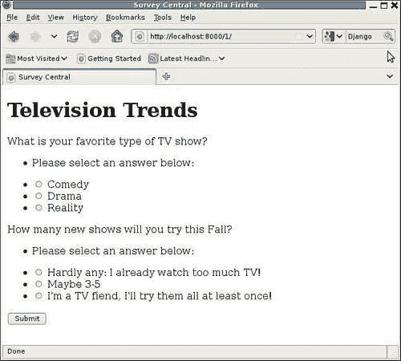
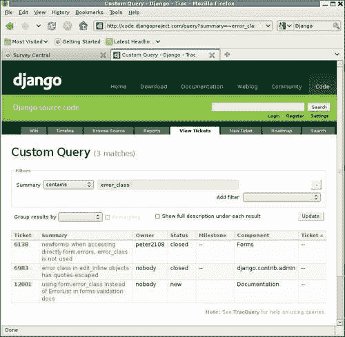
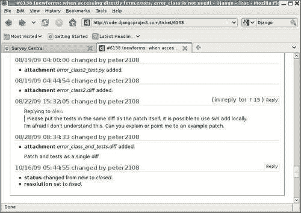
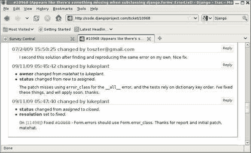
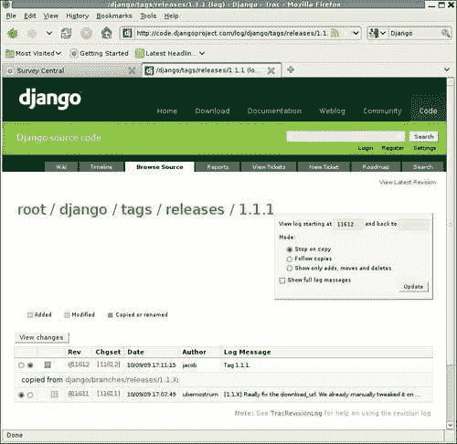
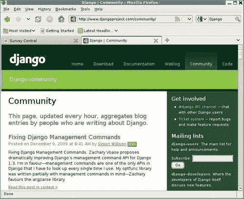

# 十、当一切都失败时：寻求外部帮助

有时，我们遇到的问题似乎不是由我们自己的代码引起的。尽管尽我们所知遵循文档，但我们得到的结果与我们预期的不符。基于 Django 这样的开放源代码进行构建的好处之一是，我们可以深入研究它的代码，准确地找出哪里出了问题。然而，这可能不是对我们时间的最佳利用。

通常情况下，追踪此类问题的更好的第一步是咨询社区资源。也许其他人已经遇到了我们所面临的问题，并找到了解决方法。如果是这样的话，我们可以利用他们的经验，而不是自己寻找问题的解决方案，从而节省大量时间。

本章介绍 Django 社区资源，并说明如何使用它们。具体来说，在本章中，我们将：

*   逐步了解 Django 1.1 版本中存在的一个 bug，该 bug 导致一些调查应用程序代码出现问题
*   了解如何使用 Django 网站上的可用资源来研究这个问题
*   根据研究结果，讨论针对该问题和一般问题的最佳方法
*   了解其他获得帮助的途径，以及如何最好地利用这些途径

# 在 Django 追踪一个问题

这本书是在编写时使用最新的 Django 版本编写的。早期是 Django 1.1。然后，在编写过程中，Django 1.1.1 被发布，发布日期之后编写的所有内容都使用 Django 1.1.1。该版本号中的三个 1 分别是主版本号、次版本号和微版本号。（Django 1.1 中缺少的微编号是一个隐含的 0。）Django 1.1.1，因为它有一个显式的微编号，所以称为微版本。微版本中唯一的更改是 bug 修复，因此微版本与以前的版本完全向后兼容。虽然主要版本号或次要版本号的更改可能涉及一些向后不兼容的更改，需要对代码进行调整，但在更新到新的微版本时，您将看到的唯一区别是更少的 bug。因此，始终建议为您正在使用的 major.minor 版本运行最新的 micro 版本。

尽管有这样的建议和兼容性保证，有时还是很容易不升级到最新的可用版本。升级需要一些工作量（可能很小，但不是零）。此外，还有一条常识公理：如果它没有坏，就不要修理它。如果您实际上没有遇到任何问题，为什么要升级？

当 Django 1.1.1 发布时，我就有了这些想法。该版本恰好发生在撰写[第 7 章](07.html "Chapter 7. When the Wheels Fall Off: Understanding a Django Debug Page")*的过程中，当轮子脱落时*：理解 Django 调试页面，这一章充满了屏幕截图和控制台显示，显示了包括 Django 代码的回溯。如果我改变了 Django 代码基点，就在写这篇文章的中间，即使只是一个微版本，谁知道什么样的细微差别可能在早期被引入，相比于后期章节追踪？这种差异可能会让目光敏锐的读者感到困惑。

如果我确实升级了中间章节，那么从一开始就重新做所有示例以确保它们是一致的将是最安全的。这是一个没有吸引力的选择，因为它既需要大量的工作，又容易出错。因此，当 Django 1.1.1 发布时，我最初的倾向是将升级推迟到至少下一个章节。

但是，最后，我发现我必须在章节的中间升级，因为我遇到了一个 D1.Go bug，它被 1.1.1 版本所修复。以下各节描述了遇到该错误的情况，并说明如何将其跟踪到 Django 1.1.1 中已修复的问题。

## 重温第七章投票表

回想一下在[第 7 章](07.html "Chapter 7. When the Wheels Fall Off: Understanding a Django Debug Page")中，我们实现了显示活动调查的代码。这包括一个表单，允许用户为调查中的每个问题选择答案。对表单代码所做的最后更改之一涉及自定义错误格式。`QuestionVoteForm`的最终代码如下所示：

```py
class QuestionVoteForm(forms.Form): 
    answer = forms.ModelChoiceField(widget=forms.RadioSelect, 
        queryset=None,                            
        empty_label=None,                            
        error_messages={'required': 'Please select an answer below:'})

    def __init__(self, question, *args, **kwargs): 
        super(QuestionVoteForm, self).__init__(*args, **kwargs) 
        self.fields['answer'].queryset = question.answer_set.all() 
        self.fields['answer'].label = question.question 
        self.error_class = PlainErrorList 

from django.forms.util import ErrorList 
class PlainErrorList(ErrorList): 
    def __unicode__(self): 
        return u'%s' % ' '.join([e for e in self]) 
```

包含`PlainErrorList`类，并在`__init__`期间设置表单实例的`error_class`属性，旨在将问题的错误显示从 HTML 无序列表（默认行为）更改为简单字符串。但是，在 Django 1.1 下运行此代码，并通过尝试提交两个问题都未回答的调查来强制执行错误情况时，显示的结果是：



两条错误消息左边的项目符号显示错误列表仍被格式化为 HTML 无序列表。也可以通过检查页面的 HTML 源代码来确认这一点，其中包括每个错误消息的以下代码段：

```py
<ul class="errorlist"><li>Please select an answer below:</li></ul> 

```

似乎设置`error_class`属性没有任何效果。我们怎样才能最好地解决这样的问题？

## 正确的代码是否实际运行？

首先，我们需要确保正在运行的代码实际上就是我们认为正在运行的代码。在本例中，当我遇到问题时，我可以看到开发服务器在代码更改后重新启动，添加了`PlainErrorList`类和`error_class`属性的设置，因此我非常确定正确的代码正在运行。尽管如此，在`error_class`任务之前插入`import pdb; pdb.set_trace()`允许我确认代码在那里，并执行我预期的操作：

```py
> /dj_projects/marketr/survey/forms.py(14)__init__() 
-> self.error_class = PlainErrorList 
(Pdb) self.error_class 
<class 'django.forms.util.ErrorList'> 
(Pdb) s 
--Return-- 
> /dj_projects/marketr/survey/forms.py(14)__init__()->None 
-> self.error_class = PlainErrorList 
(Pdb) self.error_class 
<class 'survey.forms.PlainErrorList'> 
(Pdb) c 

```

在这里我们可以看到，在进入调试器时，在我们将`PlainErrorList`赋值给`error_class`之前，该属性的值为`django.forms.util.ErrorList`。单步执行分配显示`__init__`方法即将返回，再次检查`error_class`属性的值表明该值确实已更改为我们定制的`PlainErrorList`。一切看起来都很好。在表单创建代码的最后，`error_class`属性被设置为定制类。为什么它没有被使用？

## 根据文件，代码是否正确？

T下一步（删除添加的断点后）是再次检查文档。虽然看起来不太可能，但使用自定义错误类可能还需要其他东西？在重新检查文档后，似乎没有发现任何问题。有关自定义错误类的完整文档如下：


所提供的示例与`QuestionVoteForm`所做的有一些细微的区别。首先，提供的示例将 error 类作为表单创建的参数传递，因此它被传递给表单的超类`__init__`。另一方面，`QuestionVoteForm`在超类`__init__`运行后手动设置`error_class`。

这似乎不太可能是问题的原因，因为在子类`__init__`例程中过度使用值，就像我们在`QuestoinVoteForm`中所做的那样，是一种非常常见的习惯用法。不过，我们可以通过尝试演示自定义`error_class`设置（如 Python shell 中的文档所示）对`QuestionVoteForm`的使用来检查这一细微差异是否会导致问题：

```py
kmt@lbox:/dj_projects/marketr$ python manage.py shell 
Python 2.5.2 (r252:60911, Oct  5 2008, 19:24:49) 
[GCC 4.3.2] on linux2 
Type "help", "copyright", "credits" or "license" for more information. 
(InteractiveConsole) 
>>> from survey.forms import QuestionVoteForm 
>>> from survey.models import Question 
>>> qvf = QuestionVoteForm(Question.objects.get(pk=1), data={}) 

```

这里我们为数据库中主键为`1`的问题创建了一个表单实例`qvf`。通过传入一个空的`data`字典，我们强制了一个提交的表单的错误条件，该表单没有`answer`值。文档显示，使用表单的`as_p`方法显示此表单时，应显示使用表单的自定义错误类格式化的错误。我们可以检查`QuestionVoteForm`是否发生这种情况：

```py
>>> qvf.as_p() 
u'Please select an answer below:\n<p><label for="id_answer_0">What is your favorite type of TV show?</label> <ul>\n<li><label for="id_answer_0"><input type="radio" id="id_answer_0" value="1" name="answer" /> Comedy</label></li>\n<li><label for="id_answer_1"><input type="radio" id="id_answer_1" value="2" name="answer" /> Drama</label></li>\n<li><label for="id_answer_2"><input type="radio" id="id_answer_2" value="3" name="answer" /> Reality</label></li>\n</ul></p>' 
>>> 

```

在之前，我们看到`as_p`方法确实使用了自定义错误类：错误消息周围没有 HTML 无序列表。因此，正在设置错误类，并在使用类似于`as_p`的例程显示表单时使用。

这导致了文档显示的内容与调查应用程序代码实际执行的内容之间的第二个差异。`survey/active_survey.html`模板不使用`as_p`显示表单。相反，它单独打印答案字段的标签、答案字段的错误，然后打印答案字段本身：

```py
 
 
<h1>{{ survey.title }}</h1> 
<form method="post" action="."> 
<div> 
 
    {{ qform.answer.label }} 
    {{ qform.answer.errors }} 
    {{ qform.answer }} 
 
<button type="submit">Submit</button> 
</div> 
</form> 
 
```

这是否会导致自定义错误类不用于显示？你不会这么想的。尽管文档仅显示了与`as_p`一起使用的自定义错误类，但没有提到自定义错误类仅由`as_p`等方便的显示方法使用。这样的限制将是非常有限的，因为便利表单显示方法通常不适合于非平凡表单。

显然，`error_class`属性的目的是覆盖错误显示，而不管表单以何种方式输出，但它似乎不起作用。在这一点上，我们可能会开始强烈怀疑 Django 中存在错误，而不是应用程序代码中的一些错误或误解。

## 正在搜索匹配的问题报告

下一步是访问 Django 网站，查看是否有人使用`error_class`报告了问题。从 Django 项目主页面（页面顶部最右侧的链接）选择**代码**链接，将打开 Django 代码跟踪器的主页面：


Django 项目使用 Trac，它提供了一个易于使用的基于 web 的界面，用于跟踪 bug 和功能请求。使用 Trac，缺陷和功能请求会在记录单中报告和跟踪。Django 项目配置 Trac 的具体方式，以及各种票证属性值的含义，可以在“贡献”的 Django 文档页面中找到。具体来说，此处的图表和说明：[http://docs.djangoproject.com/en/dev/internals/contributing/#ticket-分类](http://docs.djangoproject.com/en/dev/internals/contributing/#ticket-triage)对于理解与票据相关的所有信息非常有帮助。

我们现在要做的是搜索 Django 项目票证，查找使用`error_class`时报告的问题。一种方法是选择**查看票证**选项卡并构建适当的搜索。当第一次选择**查看票证**时，默认情况下会显示一个页面，列出所有未关闭的票证。例如：


用于生成报告的条件显示在标有**过滤器**的框中。在这里，我们看到报告包括所有具有任何状态的票据，这些状态不是**关闭**，因为这是唯一未检查的**状态**选择。为了得到对我们正在研究的内容更有用的报告，我们需要修改**过滤器**框中的搜索条件。

首先，我们可以取消对票证状态的限制。我们对所有与`error_class`相关的报告感兴趣，无论票证状态如何。我们可以通过单击包含约束的行最右侧带有减号的框来删除现有的状态约束。

其次，我们需要为要应用的搜索约束添加一个过滤器。为此，我们从**添加过滤器**下拉框中选择适当的选项。此下拉框包含我们可以搜索的票证属性的完整列表，例如**报告者**、**所有者**、**状态**和**组件**。这些属性中的大多数与我们当前感兴趣的搜索无关。列表中最有可能找到我们想要的是**摘要**。

票据摘要是对问题的简要描述。我们希望这个摘要将包含字符串`error_class`，用于我们在使用它时遇到的任何问题的报告。因此，在**摘要**中添加一个包含字符串`error_class`的规范的单个筛选器将有望找到任何相关票据。根据新标准，点击**更新**按钮刷新搜索结果，然后显示以下内容：



已经打开了三张票子，在摘要中包含`error_class`（或`error class`）。两个已经关闭，一个仍然打开（状态**新**。根据显示的摘要，在这三个问题中，最上面的一个听起来可能是我们在`error_class`中看到的问题，而其他两个听起来并不特别相关。

通过单击票号或摘要，我们可以获得有关所列问题的更多详细信息，这两个都是查看完整票号详细信息的链接。查看完整的细节将允许我们验证它是否与我们所看到的完全相同，并了解关闭它的时间和原因的更多细节。在这种情况下，我们可以看到以下内容：


从开张到最后一次活动之间的两年时间里，这个 ticket 有着相当长的历史。复制问题的简短指南确实使它听起来与我们在`error_class`中看到的问题完全相同。在靠近顶部的票号后面列出的**修复**的解决方案听起来令人鼓舞，但不幸的是，这张票子没有关于代码更改的细节，以及何时修复问题。一直向下滚动到添加到票证历史记录的各种注释的末尾，我们可以看到最后几次更新如下：



在 2009 年 8 月日，用户**Peter218**有兴趣通过提供补丁（包括测试）来帮助移动票据，以解决问题（通读完整的历史记录，最初提供的补丁中缺少测试是该票据长期开放的原因之一）。然后，在 2009 年 10 月 16 日，**peter2108**以**固定**的决议关闭了票据。

一开始可能并不明显，但这种关闭票据的方式对于需要更改 Django 代码的票据来说并不常见。通常，当代码更改提交到 Django SVN 存储库时，记录单编号将包含在提交消息中，并且相应的记录单将自动更新为包含提交消息和更改集链接的注释。此自动过程还以固定分辨率关闭票据。这使得很容易准确地看到修改了哪些代码来修复问题，以及何时进行了代码更改。

有时，自动进程无法正常运行，通常会有人注意到这种情况，并手动关闭票据，注意哪个代码更新修复了问题。但这里也不是这样。更确切地说，它看起来像是**Peter218**，他对修复错误感兴趣，只是注意到问题在某个时候消失了，并关闭了已修复的票据。

我们可以猜测，根据 8 月对修复问题感兴趣的同一用户在 10 月关闭了 10 月修复的票据这一事实，修复在 8 月 28 日至 10 月 16 日之间的某个时间进入了代码库。不过，我们想知道的是修复的确切时间，这样我们就可以确定是否应该在我们正在运行的代码中包含它，或者更新到最新版本是否可以修复问题，或者修复是否仅在直接从 SVN 存储库提取的代码版本中可用。

回顾在总结中提到`error_class`的另外两张票据，它们都没有帮助确定`error_class`的问题何时得到解决，因为它们完全描述了不同的问题。那么，我们如何定位我们遇到的问题何时得到解决的信息呢？在本例中，**查看票证**类型的搜索不够广泛，无法获取我们正在寻找的信息。幸运的是，有另一种搜索 Django 跟踪器的方法，我们可以使用它来查找丢失的信息。

## 另一种搜索匹配问题报告的方法

通过点击**搜索**选项卡而不是**查看票证**选项卡，可以找到此替代搜索方式。这将打开一个页面，其中有一个文本输入框和三个复选框来控制搜索位置：**票证**、**变更集**和**维基**。

此页面提供了一种更广泛、目标更少的搜索方式。除了搜索票证数据外，默认情况下还搜索变更集和 Wiki 文章。即使关闭了这些选项，单凭票证搜索的范围也比**查看票证**下的范围更广。此页面的票证搜索包括所有票证评论和更新，无法在**查看票证**下搜索。

使用此页面进行搜索的另一个好处是，它可能会找到使用**查看票证**搜索无法找到的相关结果。使用此页面进行搜索的一个缺点是，它可能会发现大量不相关的结果，具体取决于文本框中输入的搜索词。如果出现这种情况，您可以通过在文本框中输入更多必须匹配的单词来进一步限制显示的结果，这会有所帮助。不过，在这种情况下，搜索像`error_class`这样不常见的字符串不太可能产生大量的结果。

要进行eed，然后在文本框中输入`error_class`并点击**搜索**按钮，将导致以下结果：


T他的搜索结果确实比**查看票证**搜索结果多 12 个，而不是 3 个。列出的第一个结果，票证**#12001**，与上次搜索发现的仍然打开的票证相同。上一次搜索的其他结果也包含在完整列表中，仅在更下方。但首先我们可以看到一个结果，它是一个变更集**【11498】**，它在提交消息中提到`error_class`，以及它的相关票据**。此票证没有出现在我们尝试的原始搜索中，因为尽管它在完整描述中包含对`error_class`的引用，但字符串`error_class`不在票证摘要中。**

 **点击到票证**#10968**的详细信息显示，这是我们遇到的同一问题的重复报告，我们在发现的另一张票证**#6138**中报告了该问题。通常，当这样的重复项被打开时，它们会作为重复项快速关闭，并引用描述问题的现有记录单。

但是，如果没有人意识到一个新的记录单是重复的，那么当修复被检入代码库时，重复的记录单可能就是引用的记录单。很明显，这件事就是这样发生的。我们可以在对该新票据的上次更新中看到在修复提交到 SVN 存储库时自动生成的注释：



该注释中的变更集编号是指向变更集详细说明的链接。单击它，我们会看到以下内容：


她e 我们可以看到与此代码更改相关的所有详细信息：更改时间、更改人、提交消息、更改（或添加或删除）的文件、更改的文件中的特定行以及这些更改是什么。对于我们现在正在研究的问题，这些信息中的大部分都超出了我们真正需要知道的范围，但有时它们会派上用场。对于这个问题，我们想知道的是：什么版本的代码包含这个修复？我们下次再考虑这个问题。

## 确定包含修复的版本

对于我们正在研究的特定案例，我们可以简单地根据日期判断，包含补丁的第一个版本应该是 Django 1.1.1。快速查看 Django 项目主页上的 web 日志显示，Django 1.1 于 2009 年 7 月 29 日发布，Django 1.1.1 于 2009 年 10 月 9 日发布。在这些日期之间进行的所有 bug 修复都应该包含在 1.1.1 版本中，因此 2009 年 9 月 11 日进行的修复应该包含在 Django 1.1.1 中。

有时候事情可能不那么清楚。例如，我们可能不确定在发布的同一天进行的代码更改是否包含在发布中，或者是否发生在发布之后。或者，我们可能不确定更改是否被归类为 bug 修复或新功能。对于这种情况，我们可以检查版本号，并将其与我们感兴趣的版本进行比较。

Django 使用标准的 subversion 实践来标记发布版本；标记的发布版本可在`root/django/tags/releases`下找到。我们可以通过先选择**浏览代码**选项卡，然后依次选择每个路径组件，沿着此路径导航。以这种方式导航到 1.1.1 版本，并单击右上角的**修订日志**将显示以下页面：



此显示 1.1.1 标记的发布版本是通过复制 1.1.X 发布分支创建的。创建标记的变更集是**【11612】**，高于我们感兴趣的变更集（11498），因此我们希望 1.1.X 版本中会出现我们关注的修复。

但是等一下。查看变更集 11498 的详细信息，更改的文件位于主干（例如`django/trunk/django/forms/forms.py`），而不是 1.1.X 发布分支`django/branches/releases/1.1.X`。如果该版本是通过复制 1.1.X 分支创建的，但只对主干进行了修复，那么它真的包含在 1.1.1 版本中吗？

答案是肯定的。点击本页面上的链接，点击 1.1.X 版本分支，为其选择**修订日志**，向下滚动至底部，显示 1.1.X 版本分支是在 11500 版本创建的 trunk 副本，两个版本超过了我们感兴趣的 11498 版本。因此，在最初创建 1.1.X 分支时，它包含了我们正在寻找的修复程序。

你可能想知道为什么 1.1.X 分支直到 2009 年 9 月 11 日 1.1 版本在 7 月底发布后才被创建。原因是，一旦创建了发布分支，就必须在两个不同的地方应用错误修复：主干和最新发布分支。这比只在一个地方（行李箱）应用它们要稍微多一些。因此，发布分支的创建通常会在发布后延迟一段时间，以便更容易地修复 bug。

延迟创建发布分支意味着在它不存在的时候，不能对主干进行与新功能相关的更改，因为发布分支必须只包含 bug 修复，而不包含新功能。不过，这通常不是问题，因为在发布之后，几乎没有做什么特性工作。参与的每个人通常都需要一些时间休息一下，然后首先决定下一个版本中可能包含哪些功能。一旦下一个版本的某些功能工作接近需要签入的程度，则会创建上一个版本的发布分支。从那时起，特性工作将签入主干，而错误修复将签入主干和发布分支。

## 如果修复程序尚未发布怎么办？

在这里我们很幸运地遇到了一个已经修复的问题，并且该修复已经在正式发布的版本中提供。在任何情况下遇到这样的问题，它应该是一个简单的选择，只需更新到最新的微版本，以获得修复。如前所述，始终建议为正在使用的特定 major.minor 版本安装最新的 micro 版本。

但是，如果我们想要的修复是在最新版本发布后的某个时间进行的呢？那我们该怎么办？简单的技术回答是，只需检查包含修复程序的主干或发布分支的最新级别，并使用该代码运行。特别是，如果使用了发布分支，就不必担心会出现任何代码不稳定的情况，因为进入发布分支的唯一更改是 bug 修复。

然而，这个简单的技术答案可能与当地关于只运行“发布级别”代码的政策相冲突。如果您正在使用此类策略的环境中工作，则可能需要克服一些额外的障碍，以便使用尚未在正式版本中提供的修复程序。采取的最佳方法可能取决于一些因素，如您正在处理的确切策略、遇到的问题的严重性以及在您自己的代码中找到解决方法的能力。

## 如果修复尚未提交怎么办？

在研究问题时，有时结果会显示问题已报告，但尚未修复。如何最好地继续下去可能取决于您对参与 Django 并为 Django 做出贡献的兴趣，以及匹配问题报告的修复距离有多近。关于如何参与 Django 贡献的详细信息超出了本文讨论的范围，但本节将根据您的兴趣水平提供一些广泛的指导方针。如果您有兴趣投稿，Django 网站提供了如何投稿的详细信息，网址为：[http://docs.djangoproject.com/en/dev/internals/contributing/](http://docs.djangoproject.com/en/dev/internals/contributing/) 。

如果您对试验尚未提交到代码库的代码不感兴趣，那么除了等待提交修复之外，您可能没有什么可以做的。这一点的例外情况是对于未被很好理解的问题。在这种情况下，您可以提供遇到问题的具体细节，以帮助其他人更好地理解问题并制定解决方案。

如果您愿意使用未提交的代码进行实验，您很可能能够更快地找到解决所遇到问题的可行解决方案。在最好的情况下，您可能会发现与您遇到的问题相匹配的票证已经附加了一个工作补丁。这是可能的，您所需要做的就是下载它并将其应用到 Django 代码的副本以解决问题。

然后，您必须决定是否能够使用应用了一些“自定义”修复程序的 Django 版本部署您的应用程序。如果没有，您可能希望帮助将工作补丁签入代码库，方法是在签入修复之前查看是否缺少任何需要包含的内容（例如测试），如果是，则提供缺少的位。不过，在某些情况下，没有什么遗漏，所需要的只是修复程序进入代码库的时间。

如果您找到了一个与您尝试的修补程序匹配的票证，但它不能解决您遇到的问题，那么这是有价值的信息，可以将其发布到票证中。不过，您可能首先要确定，您的问题与您发现的问题是相同的。如果这真的是一个稍微不同的问题，那么为这个稍微不同的问题打开一张新的罚单可能更合适。

当您有疑问时，您可以随时在您认为匹配的票证中发布有关您看到的问题以及现有修补程序似乎无法解决问题的信息。随后，其他人可能会提供反馈，说明您的问题是否相同，现有补丁是否确实不完全正确，或者您是否真正在处理不同的问题。

在最坏的情况下，您可能会发现一个通知单报告与您遇到的问题相同，但没有附加的修补程序可供尝试。这对你没有多大帮助，但为你提供了最大的机会做出贡献。如果您有时间并且非常愿意，您可以深入研究 Django 代码，看看是否可以想出一个补丁，将其发布到 ticket 中以帮助解决问题。

## 如果一张票在没有修复的情况下关闭了怎么办？

有时，在研究某个问题时，结果会出现一个匹配的报告（或多个报告），该报告在未进行任何修复的情况下已关闭。在这种情况下，可能会使用三种不同的解决方案：invalid、worksforme 和 wontfix。如何最好地继续将取决于问题报告的细节以及用于关闭匹配问题单的解决方案。

首先，无效决议相当广泛。由于多种原因，票证可能被视为无效关闭，包括：

*   他描述的问题根本不是问题，而是记者代码中的错误或对某些功能应该如何工作的误解。
*   所描述的问题太模糊了。例如，如果打开的票证只提供错误回溯，但没有关于如何触发回溯的信息，那么任何人都无法帮助跟踪和修复问题，因此它很可能会被视为无效而关闭。
*   所描述的问题确实是一个问题，但根本原因是 Django 以外的一些代码。如果在 Django 代码中无法解决问题，则该票据可能会被视为无效而关闭。

如果您发现匹配的票证已作为无效票证关闭，则应阅读票证关闭时的注释。如果由于缺少有关问题的信息而关闭了记录单，并且您可以提供在解决问题方面取得进展所需的一些缺失数据，则可能需要重新打开记录单。否则，如果您不理解关闭的解释，或者不同意关闭的原因，最好在其中一个邮件列表上开始讨论（在下一节中讨论），以获得更多关于如何最好地解决遇到的问题的反馈。

工作表单的解析非常简单；这表明关闭记录单的人员无法重现报告的问题。它与 invalid 一样，可以在原始问题报告没有包含足够的信息来重新创建问题时使用。缺少的信息可能是导致问题的代码的细节，也可能是发生问题的环境的细节（操作系统、Python 版本、部署细节）。如果您能够重新创建已关闭的问题 WorkForme，并且可以提供缺失的详细信息，以便其他人也可以这样做，则您可以随时重新打开记录单并提供该信息。

wontfix 解决方案也很简单。通常只有核心提交者才会关闭 wontfix，这表明核心团队已经决定不修复该特定问题（通常是功能请求，而不是 bug）。如果您不同意 wontfix 的决定，或者认为在做出决定时没有考虑到所有适当的信息，您将不会通过简单地重新开票来改变任何人的想法。相反，您需要在 django 开发者的邮件列表中提出这个问题，看看您是否能够从更广泛的开发社区中获得足够的共识，从而推翻 wontfix 的决定。

# 追踪未报告的问题

有时在研究问题时，不会出现匹配的报告。如何最好地继续下去可能取决于您是否确信您遇到的问题是 Django 中的一个 bug。如果你真的确定问题出在 Django 身上，你可以直接打开一张新的票证来报告。如果你不太确定，最好先从社区获得一些反馈。以下各节将介绍在何处提问、提出好问题的一些技巧，以及如何打开新罚单。

## 我们什么时候开始提问

在任何 Django 网站页面上点击**社区**链接上的会显示以下内容：



这个页面的左侧提供了博客中讨论 Django 的人撰写的文章的链接。虽然阅读这些条目是了解使用 Django 的社区的一个好方法，但我们现在感兴趣的正是本页的右侧。这里我们看到了与 Django 社区其他成员直接互动的链接。

列表中的第一个是指向**#django IRC 频道**的链接。（**IRC**代表**互联网中继聊天**）此选项提供聊天类型界面，与其他 Django 用户交互聊天。这是一个很好的选择，当你想对任何你想问或讨论的问题快速反馈时。不过，在聊天界面中进行详细的编码讨论可能很困难。对于这种情况，其中一个邮件列表可能是更好的选择。

有两个邮件列表，如下所示：**django 用户**和**django 开发者**。第一个是关于使用 Django 的讨论，第二个是关于开发 Django 本身的讨论。如果您遇到了一个您认为但不确定是 Django 中的问题，Django 用户是发布有关该问题的问题的正确位置。Django 核心开发团队的成员阅读并回答用户列表上的问题，并将提供反馈，说明该问题是否应作为一张罚单打开或提交给开发人员列表进行进一步讨论。

这两个邮件列表都作为谷歌群组托管。前面显示的每个组名实际上都是一个链接，您可以单击该链接直接转到该组的 Google 组页面。从那里你可以看到小组中最近讨论的列表，并阅读可能感兴趣的任何主题。谷歌群组也提供了搜索功能，但不幸的是，该功能并不总是正常工作，因此从群组页面在群组中搜索可能不会产生有用的结果。

如果您决定要发布到其中一个组，则首先需要加入该组。这有助于减少发送到群组的垃圾邮件，因为潜在的垃圾邮件发送者必须首先加入。然而，有很多潜在的垃圾邮件发送者加入并试图将垃圾邮件发送到列表中。因此，还有一个额外的反垃圾邮件措施：新成员发送的帖子通过适度发送。

此反垃圾邮件措施意味着，您发送到这些列表中任何一个的第一篇帖子可能需要一些时间才能出现，因为它必须由一位志愿者版主手动批准。通常这不会花费很长时间，但可能需要几个小时。通常，一旦从用户那里收到第一篇明显合法的帖子，他们的状态就会更新，以表明他们的帖子不需要被审核，因此随后的帖子将立即出现在组中。

## 提出能得到好答案的问题的技巧

一旦你决定发布一个问题，下一个任务将是以最有可能产生一些有用答案的方式撰写一个问题。本节介绍了有关如何做到这一点的一些指导。

首先，明确你在做什么。如果您有一些代码的行为与预期不符，请逐字记录代码，而不是以散文形式描述代码的功能。通常，理解问题的关键在于实际使用的代码的详细细节，而这些细节很容易在代码的散文描述中丢失。

但是，如果代码太长或太宽，无法在自动换行的电子邮件界面中轻松阅读，则最好不要将其包含在帖子中。理想情况下，在这种情况下，您可以将重新创建问题所需的代码缩减到可管理的大小，以便在电子邮件中轻松阅读，然后发布。

请注意，如果您这样做，最好首先验证代码的精简版本是否正确（例如，没有任何语法错误）并显示您所询问的问题。否则，您得到的唯一响应可能只是报告发布的代码要么根本不工作，要么没有显示您描述的行为。

如果您无法将必要的代码缩减到可管理的大小，或者是因为您没有时间，或者是因为缩减代码会使问题消失，那么您可以尝试将代码发布到 dpaste.com 之类的地方，并在问题中添加指向它的链接。不过，让演示问题所需的代码尽可能短，这确实符合您的最佳利益。随着您发布或指向的代码越来越长，邮件列表上的人会越来越少，他们会花时间尝试理解问题并帮助您找到解决方案。

除了要具体说明您正在使用的代码之外，还要具体说明您正在做什么来触发错误行为。当您访问自己的应用程序 URL 时，是否发现问题？当您在管理应用程序中执行某些操作时？当你试着从贝壳里拿东西的时候？这对你来说可能是显而易见的，但如果你清楚地说出你在做什么，这确实有助于其他人重现问题。

第二，具体说明发生了什么，以及你期望发生什么。“它不起作用”并不具体。也不是“它死了”，也不是“它给了我一个错误信息”。给出“不起作用”的具体情况。当您期望 Y 时显示 X 的浏览器页面？表示 XYZ 的错误消息？追踪？在最后一种情况下，请务必在问题中包含完整的回溯，因为这为可能试图提供帮助的人提供了有价值的调试线索。

第三，如果您在问题中提到您的预期行为是基于文档所说的内容，请具体说明您所指的文档。Django 拥有丰富的文档，包括指南和参考信息。有人阅读你的问题并在文档中搜索你所引用的内容，可能很容易找到一个完全不同的部分，并且很难理解你所说的内容。如果您提供了相关文档的特定链接，则不太可能发生误解。

正如您可能已经注意到的，贯穿所有这些技巧的一个共同主题是：要具体。是的，提供细节需要更多的工作。但是一个具体的问题比一个不精确和模糊的问题更有可能得到有用的答案。如果你漏掉了细节，偶尔有人会发布一个答案来引导你找到解决方案。然而，更可能的情况是，一个模糊的问题要么得不到回答，要么得不到要求细节的回答，要么因为回答者完全误解了这个问题而让你走上一条完全错误的道路。

## 打开新记录单报告问题

如果在 Django 代码中遇到一个似乎是未报告和未修复的 bug 的问题，那么下一步就是为它打开一张罚单。当您在 Django 主页点击**代码**后选择**新票证**选项卡时，此过程非常简单：


P请仔细阅读**先阅读**列表。该列表中的大部分信息已在本章前面介绍，但并非全部。特别是，最后一项说明了如何标记提交的代码片段或回溯，以便正确格式化它们。该注释包括一种最常被忽略的标记类型，还指出了有关如何对文本进行特殊格式化的完整文档。请注意，您可以通过选择底部的**预览**按钮来检查格式设置。在按下**提交**之前，尝试预览提交内容总是一个好主意。

N请注意，Django Trac 安装允许匿名提交和更新票证。但是，它也使用 Akismet 垃圾邮件过滤服务，该服务有时会拒绝非垃圾邮件提交。如黄色大框所示，避免这种情况的最简单方法是**注册一个账户**（页面上的文本是指向您可以注册的页面的链接）。

打开一张新票时要填写的两个最重要的部分是简短的摘要和完整的描述。在简短的总结中，尽量包含一些关键术语，这些术语将使遇到相同问题的人在可能的搜索中发现新的问题。在完整描述中，上一节关于具体化的所有建议再次适用。如果您是在对其中一个邮件列表的讨论得出一个结论，即一张票是一个好主意之后打开一张票，那么在问题中包含一个指向该讨论的链接是很有帮助的。但是，在记录单描述中包含有关问题的基本信息也很好。

在**票证属性**中的信息中，除了**版本**（如果您使用的是显示版本以外的版本）和**有补丁**（如果您要附加修复问题的补丁），您可能不需要更改任何默认值。您可以尝试从列表中猜出正确的**组件**，并包含一些合适的**关键字**，但这不是必需的。

类似地，您可以将**里程碑**设置为下一个版本，尽管这并不意味着有人更快地解决问题。该字段通常只在发布的最后一刻被密切关注，以注意在发布之前必须修复哪些 bug。

提交票证后，如果您使用了包含电子邮件地址的登录名，或在标有**您的电子邮件或用户名**的字段中指定了电子邮件地址，则票证更新将自动通过电子邮件发送到指定的电子邮件地址。因此，如果有人在票据中添加注释，您将收到通知。一个恼人的例外是，提交到代码库时会自动生成更新：这不会生成发送给 ticket reporter 的电子邮件。因此，当票证关闭为固定状态时，您不一定会收到通知，而是必须手动从网站上检查其状态。

# 总结

当前面介绍的其他调试技术都不能成功解决某些问题时，我们现在结束了关于如何做的讨论。在本章中，我们：

*   遇到 Django 1.1 中存在的错误，导致一些调查应用程序代码的行为不符合要求
*   通过验证过程，将问题跟踪到 Django，而不是调查代码
*   看到了在 Django 代码跟踪器中的搜索如何揭示问题是 Django 1.1.1 中修复的一个 bug，它为问题提供了一个简单的解决方案
*   讨论了当问题被追踪到 bug 时，如何继续进行的选项，修复程序尚未提供或在正式版本中不可用
*   描述了各种社区资源，这些资源用于询问有关行为的问题，这些行为似乎令人费解，但似乎没有被报告为 bug
*   讨论了写问题的技巧，以便他们得到想要的有用答案
*   描述了在 Django 代码中打开新票证以报告问题的过程

在下一章中，我们将进入开发 Django 应用程序的最后阶段：转入生产。**