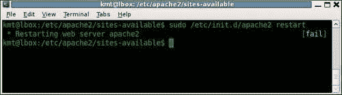
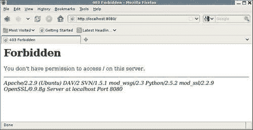
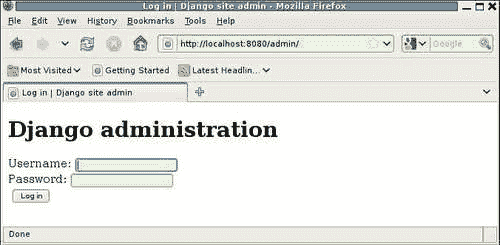
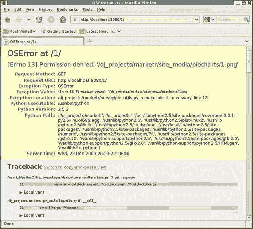
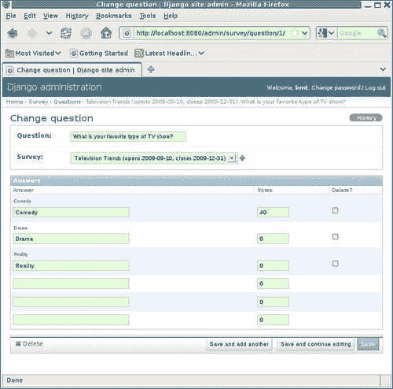
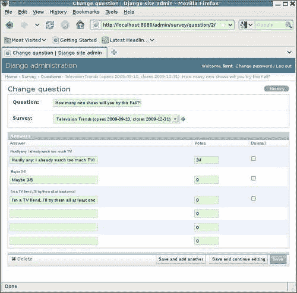

# 十一、何时上线：转入生产

关于 Django 应用程序的测试和调试，我们将讨论的最后一个主题是产品化。当应用程序代码全部编写完毕、经过全面测试和调试后，就应该建立一个生产 web 服务器，让真正的用户能够访问应用程序。由于应用程序已经在开发过程中进行了充分的测试和调试，所以这应该很简单，对吗？不幸的是，并非总是如此。生产 web 服务器环境和 Django 开发服务器环境之间存在许多差异。这些差异可能会在转入生产过程中造成问题。在本章中，我们将看到这些差异是什么，它们会导致什么类型的问题，以及如何克服它们。具体而言，我们将：

*   使用`mod_wsgi`配置 Apache web 服务器以运行示例`marketr`项目。
*   在开发 Apache 配置过程中遇到许多问题。对于每个问题，我们将看到如何诊断和解决问题。
*   对在 Apache 下运行的应用程序执行功能压力测试，以确保它在负载下正确运行。
*   修复功能压力测试显示的任何代码错误。
*   讨论在开发过程中与`mod_wsgi`一起使用 Apache 的可能性。

# 开发 Apache/mod_wsgi 配置

通常，向生产转移将涉及在机器上运行代码，而不是在开发代码的机器上运行代码。生产服务器可能是从主机提供商处获得的专用硬件或资源。在这两种情况下，它通常与开发人员在编写代码时使用的机器完全分离。生产服务器需要安装任何必备的软件包（例如，对于我们的示例项目，Django 和 matplotlib）。此外，通常从版本控制系统提取的应用程序项目代码的副本需要放在生产服务器上。

不过，为了本章的简单起见，我们将在开发代码的同一台机器上配置生产 web 服务器。这将允许我们跳过实际生产迁移过程中涉及的一些复杂性，同时仍然会遇到生产部署过程中可能出现的许多问题。在大多数情况下，我们将跳过的问题不是 Django 特有的，而是在将任何类型的应用程序从开发转移到生产时需要处理的常见问题。我们将遇到的问题往往更具体。

将要开发的示例部署环境是带有`mod_wsgi`的 Apache，这是当前推荐用于部署 Django 应用程序的环境。**WSGI**代表**Web 服务器网关接口**。WSGI 是一个 Python 标准规范，它定义了 web 服务器（例如 Apache）和用 Python 编写的 web 应用程序或框架（例如 Django）之间的接口。

基本 Apache web 服务器不支持 WSGI。然而，Apache 的模块化结构允许通过插件模块提供这种支持。因此，对 WSGI 的 web 服务器端支持由`mod_wsgi`提供，这是一个由 Graham Dumpleton 编写并积极维护的 Apache 模块。Django 本身实现 WSGI 规范的应用程序端。因此，`mod_wsgi`和 Django 之间不需要任何额外的适配器模块。

### 注

在开发`mod_wsgi`之前，Apache 的`mod_python`模块是 Django 推荐的部署环境。尽管`mod_python`仍然可用，甚至仍在广泛使用，但其最新版本是在三年前发布的。当前的源代码需要一个补丁才能使用最新的 Apache2.2.X 版本进行编译。展望未来，由于 Apache API 的更改，需要进行更广泛的更改，但是没有活跃的`mod_python`开发人员进行此类更改。考虑到目前`mod_python`开发的垂死状态，我认为它现在对于 Django 应用程序部署来说是一个糟糕的选择。因此，这里不包括配置它的细节。如果出于某种原因您必须使用`mod_python`，那么本章中`mod_wsgi`遇到的许多问题也适用于`mod_python`，并且配置`mod_python`的细节仍包含在 Django 文档中。

Apache 和`mod_wsgi`都很容易获得，并且很容易安装在各种不同的平台上。这些设备的安装细节将不包括在内。作为一般指南，使用计算机的常规软件包管理服务安装这些软件包可能是最简单的方法。如果不可能，下载和安装 Apache 的详细信息可在网站上找到[http://httpd.apache.org/](http://httpd.apache.org/) 和`mod_wsgi`的相同信息可在[中找到 http://code.google.com/p/modwsgi/](http://code.google.com/p/modwsgi/) 。

用于开发本章所示示例配置的机器运行的是 Ubuntu，这是基于 Debian 的 Linux 版本。这种风格的 Linux 为 Apache 配置开发了一种特殊的结构，这种结构可能与您自己的机器上使用的结构不匹配。然而，配置结构并不重要。更重要的是配置中包含的 Apache 指令。如果您的机器不遵循 Debian 结构，您可以简单地将此处显示的指令放在主 Apache 配置文件中，通常命名为`httpd.conf`。

在 Apache 下运行的 WSGI 客户端应用程序的配置有两个部分，分别为`mod_wsgi`。首先，有一个 Python WSGI 脚本，它为处理请求的 WSGI 客户机应用程序设置环境并标识该应用程序。第二，Apache 配置指令控制`mod_wsgi`的操作，并将特定 URL 路径的请求直接发送到`mod_wsgi`。接下来将讨论如何为 Django`marketr`项目创建这些项目。

## 为 marketr 项目创建 WSGI 脚本

Django 项目的 WSGI 脚本有三个职责。首先，它必须将 Python 路径设置为包含 Django 项目所需但不在常规系统路径上的任何路径。在我们的例子中，`martketr`项目本身的路径需要添加到 Python 路径中。项目使用的所有其他必备代码都已安装，因此可以在 pythonsite-packages 目录下自动找到。

其次，WSGI 脚本必须在环境中设置`DJANGO_SETTINGS_MODULE`变量以指向适当的设置模块。在本例中，需要将其设置为指向`/dj_projects/marketr`中的`settings.py`文件。

第三，WSGI 脚本必须将变量`application`设置为实现 WSGI 接口的可调用对象的实例。对于 Django，该接口由`django.core.handlers.wsgi.WSGIHandler`提供，因此`marketr`项目的脚本可以简单地将`application`设置为该类的实例。这里没有任何特定于`marketr`项目的内容。这段 WSGI 脚本对于所有 Django 项目都是相同的。

这个脚本应该放在哪里？将其与`settings.py`和`urls.py`文件一起直接放在`/dj_projects/marketr`中似乎很自然，因为它们都是项目级文件。然而，正如`mod_wsgi`文档中提到的，这将是一个糟糕的选择。Apache 需要配置为允许访问包含 WSGI 脚本的目录中的文件。因此，最好将 WSGI 脚本保存在与网站用户不应访问的任何代码文件分开的目录中。（尤其是包含`settings.py`的目录，不应配置为网站客户端可以访问，因为它可能包含数据库密码等敏感信息。）

因此，我们将在`/dj_projects/marketr`中创建一个名为`apache`的新目录，以保存所有与在 Apache 下运行项目相关的文件。在`apache`目录下，我们将创建一个`wsgi`目录来保存`marketr`项目的 WSGI 脚本，我们将其命名为`marketr.wsgi`。基于之前为本脚本指出的三项职责，实施本`/dj_projects/marketr/apache/wsgi/marketr.wsgi`脚本的第一步可能是：

```py
import os, sys 

sys.path = ['/dj_projects/marketr', ] + sys.path 
os.environ['DJANGO_SETTINGS_MODULE'] = 'marketr.settings' 

import django.core.handlers.wsgi 
application = django.core.handlers.wsgi.WSGIHandler() 
```

这段代码在 Python 系统路径的前面添加了`marketr`项目目录，将`DJANGO_SETTINGS_MODULE`环境变量设置为`marketr.settings`，并将`application`设置为 Django 提供的实现 WSGI 应用程序接口的可调用的实例。当调用`mod_wsgi`以响应已映射到此脚本的 URL 路径时，它将调用适当的 Django 代码，并正确设置环境，以便 Django 能够处理该请求。然后，下一步是开发 Apache 配置，该配置将适当地将请求路由到`mod_wsgi`和该脚本。

## 为 marketr 项目创建 Apache VirtualHost

为了将 Django 项目与您可能已经在使用 Apache 的任何其他项目隔离开来，我们将使用绑定到端口 8080 的 Apache`VirtualHost`来进行 Django 配置。以下指令指示 Apache 侦听端口 8080 上的请求，并定义一个虚拟主机来处理这些请求：

```py
Listen 8080
<VirtualHost *:8080>
    WSGIScriptAlias / /dj_projects/marketr/apache/wsgi/marketr.wsgi
    WSGIDaemonProcess marketr
    WSGIProcessGroup marketr

    # Possible values include: debug, info, notice, warn, error, crit,
    # alert, emerg.
    LogLevel debug

    ErrorLog /dj_projects/marketr/apache/logs/error.log
    CustomLog /dj_projects/marketr/apache/logs/access.log combined
</VirtualHost>
```

请注意，这绝不是一个完整的 Apache 配置，而是需要添加到现有（或附带的示例）配置中，以支持处理指向 8080 端口的`marketr`项目请求。`VirtualHost`容器中有三条指令控制`mod_wsgi`的行为，还有三条指令将影响此虚拟主机的日志处理方式。

第一条指令`WSGIScriptAlias`非常简单。它将匹配其第一个参数`/`的所有请求映射到其第二个参数`/dj_projects/marketr/apache/wsgi/marketr.wsgi`中指定的 WSGI 脚本。此指令的作用是将此虚拟主机的所有请求路由到上一节中定义的`marketr`WSGI 脚本。

接下来的两条指令`WSGIDaemonProcess`和`WSGIProcessGroup`指示`mod_wsgi`将此虚拟主机的请求路由到一组独立的进程，这与用于服务请求的正常 Apache 子进程不同。这称为在守护进程模式下运行`mod_wsgi`。相比之下，`mod_wsgi`使用正常的 Apache 子进程被称为在嵌入式模式下运行。

一般来说，在守护进程模式下运行更可取（有关原因的详细信息，请参阅`mod_wsgi`文档），但在 Windows 上运行 Apache 时不支持此模式。因此，如果您在 Apache 服务器上使用 Windows 机器，则需要从配置中省略这两条指令。

在所示的指令中，`WSGIDaemonProcess`指令定义了一个名为`marketr`的过程组。此指令支持多个可用于控制的附加参数，例如，组中的进程数、每个进程中的线程数以及进程的用户和组。此处未指定任何参数，因此`mod_wsgi`将使用其默认值。`WSGIProcessGroup`指令将先前定义的`marketr`组命名为用于处理此虚拟主机请求的组。

下一个指令`LogLevel debug`将日志记录设置为最详细的设置。更典型的生产设置是`warn`，但在刚开始设置时，尽可能多地记录代码日志信息通常很有用，因此我们将在这里使用`debug`。

最后两条指令`ErrorLog`和`CustomLog`定义了此虚拟主机的错误和访问日志，与主要 Apache 错误和访问日志不同。这可以方便地将与新项目相关的日志信息与 Apache 可能处理的任何其他通信隔离开来。在本例中，我们已指示 Apache 将日志放在`/dj_projects/marketr/apache`目录下的`logs`目录中。

## 激活新的 Apache 配置

上一节中的配置指令应该放在哪里？如前所述，答案取决于在您的机器上如何配置 Apache 的细节。对于包含单个`httpd.conf`文件的 Apache 配置，可以简单地将指令放在该文件的末尾。尽管这也适用于更结构化的配置，但最好避免混淆并使用提供的结构。因此，本节将描述如何将前面列出的定义集成到基于 Debian 的配置中，因为这是示例项目所使用的机器类型。

对于基于 Debian 的 Apache 配置，`Listen`指令应该放在`/etc/apache2/ports.conf`中。`VirtualHost`指令及其包含的所有内容应放在`/etc/apache2/sites-available`下的文件中。不过，在本例中，虚拟主机配置已放置在文件`/dj_projects/marketr/apache/conf/marketr`中，以便`/dj_projects`目录可以包含项目的完整配置信息。我们可以通过为该文件创建符号链接，使其也出现在`sites-available`目录中：

```py
kmt@lbox:/etc/apache2/sites-available$ sudo ln -s /dj_projects/marketr/apache/conf/marketr 

```

请注意，一般用户无法在`/etc/apache2/sites-available`下创建或修改文件，因此需要使用`sudo`命令作为超级用户执行请求的命令。这对于修改 Apache 配置或控制其操作的所有命令都是必需的。

一旦包含虚拟主机配置的文件在`sites-available`中就位，`a2ensite`命令可用于启用新站点：

```py
kmt@lbox:/etc/apache2/sites-available$ sudo a2ensite marketr 
Enabling site marketr. 
Run '/etc/init.d/apache2 reload' to activate new configuration! 

```

`a2ensite`命令在`/etc/apache2/sites-enabled`目录中创建指向`sites-available`目录中指定文件的符号链接。有一个伴随命令`a2dissite`、，它通过删除`sites-enabled`中的站点符号链接来禁用站点。（请注意，如果愿意，也可以手动管理符号链接，而不使用这些命令。）

正如`a2ensite`的输出所指出的，需要重新加载 Apache 才能使新的站点配置生效。在这种情况下，由于添加了`Listen`指令，因此需要完全重新启动 Apache。这是通过运行`/etc/init.d/apache2`命令并指定`restart`作为参数来完成的。当我们尝试这样做时，反应如下：



T 屏幕右侧的**【失败】**看起来不太好。重启过程中出现了一些明显的问题，但是什么？在用于重新启动 Apache 的命令的输出中找不到答案，该命令只报告成功或失败。相反，Apache 错误日志包含失败原因的详细信息。此外，对于与服务器启动相关的故障，可能是包含详细信息的主 Apache 错误日志，而不是特定于站点的错误日志。在这台机器上，主要的 Apache 错误日志文件是`/var/log/apache2/error.log`。查看该文件的结尾，我们发现以下内容：

```py
(2)No such file or directory: apache2: could not open error log file /dj_projects/marketr/apache/logs/error.log. 
Unable to open logs 

```

问题是，新的虚拟主机配置为错误日志文件指定了一个不存在的目录。Apache 不会自动创建指定的目录，因此我们需要手动创建它。这样做并再次尝试重新启动 Apache 会产生更好的结果：


**【OK】**肯定比**【失败】**好看；显然，这次 Apache 能够成功启动。现在我们已经有了一个有效的 Apache 配置，但是要获得一个有效的配置，可能还有一些工作要做，我们将在下面看到。

## 调试新的 Apache 配置

下一个测试是查看 Apache 是否会成功处理指向新虚拟主机端口的请求。为此，让我们尝试从 web 浏览器检索项目根（主页）页面。结果看起来不太好：



现在可能有什么不对？在本例中，主 Apache 错误日志不显示错误原因。相反，为`marketr`虚拟站点配置的错误日志提供了问题指示。检查该文件，我们看到`/dj_projects/marketr/apache/logs/error.log`的全部内容现在是：

```py
[Mon Dec 21 17:59:01 2009] [info] mod_wsgi (pid=18106): Attach interpreter ''. 
[Mon Dec 21 17:59:01 2009] [info] mod_wsgi (pid=18106): Enable monitor thread in process 'marketr'. 
[Mon Dec 21 17:59:01 2009] [debug] mod_wsgi.c(8301): mod_wsgi (pid=18106): Deadlock timeout is 300\. 
[Mon Dec 21 17:59:01 2009] [debug] mod_wsgi.c(8304): mod_wsgi (pid=18106): Inactivity timeout is 0\. 
[Mon Dec 21 17:59:01 2009] [info] mod_wsgi (pid=18106): Enable deadlock thread in process 'marketr'. 
[Mon Dec 21 17:59:01 2009] [debug] mod_wsgi.c(8449): mod_wsgi (pid=18106): Starting 15 threads in daemon process 'marketr'. 
[Mon Dec 21 17:59:01 2009] [debug] mod_wsgi.c(8455): mod_wsgi (pid=18106): Starting thread 1 in daemon process 'marketr'. 
[Mon Dec 21 17:59:01 2009] [debug] mod_wsgi.c(8455): mod_wsgi (pid=18106): Starting thread 2 in daemon process 'marketr'. 

[… identical messages for threads 3 through 13 deleted …]

(pid=18106): Starting thread 14 in daemon process 'marketr'. 
[Mon Dec 21 17:59:01 2009] [debug] mod_wsgi.c(8455): mod_wsgi (pid=18106): Starting thread 15 in daemon process 'marketr'. 
[Mon Dec 21 17:59:45 2009] [error] [client 127.0.0.1] client denied by server configuration: /dj_projects/marketr/apache/wsgi/marketr.wsgi 

```

除了最后一条消息外，这些消息都不表示有问题。相反，它们是`mod_wsgi`根据虚拟主机配置中`LogLevel debug`设置的请求记录的信息性和调试级消息。这些消息显示`mod_wsgi`报告它正在使用的各种值（死锁超时、非活动超时），并显示`mod_wsgi`在守护进程`marketr`中启动了 15 个线程。直到最后一行，这是一条错误级别的消息，所有这些看起来都很好。

最后一条消息的具体内容并不比 web 浏览器显示的赤裸裸的**禁止**有用多少。该消息确实表明涉及到`marketr.wsgi`脚本，并且服务器配置拒绝了该请求**。在这种情况下，问题不是文件不存在，而是服务器已配置为不允许访问它。**

这个特定问题的原因在这台机器上的 Apache 配置的其他地方，根据您的总体 Apache 配置，您可能会遇到这个问题，也可能不会遇到这个问题。问题是，这台机器的 Apache 配置已设置为拒绝访问所有目录中的文件，但明确允许访问的目录除外。从安全的角度来看，这种类型的配置是好的，但它确实使配置变得有点乏味。在这种情况下，需要一个`Directory`块，允许访问包含`marketr.wsgi`脚本的目录中的文件：

```py
    <Directory /dj_projects/marketr/apache/wsgi> 
        Order allow,deny 
        Allow from all 
    </Directory> 
```

Apache 的三通道访问控制系统的细节超出了本书的范围；如果您感兴趣，Apache 文档将详细描述该过程。出于我们的目的，需要注意的是，此`Directory`块允许所有客户端访问`/dj_projets/marketr/apache/wsgi`中的文件，这应该是可以接受的，并且足以通过浏览器最初为`marketr`项目主页返回的**禁止的**。

`Directory`块应放置在`marketr`项目的`VirtualHost`块内。更改配置需要重新启动 Apache，之后我们可以再次尝试访问项目主页。这一次我们看到了以下情况：


好消息是我们通过了**禁止的**错误。坏消息是我们没有走得更远。同样，返回到浏览器的页面在调试问题时用处不大，而站点的错误日志是记录问题详细信息的地方。这次在文件末尾，我们发现：

```py
[Mon Dec 21 18:05:43 2009] [debug] mod_wsgi.c(8455): mod_wsgi (pid=18441): Starting thread 15 in daemon process 'marketr'. 
[Mon Dec 21 18:05:49 2009] [info] mod_wsgi (pid=18441): Create interpreter 'localhost.localdomain:8080|'. 
[Mon Dec 21 18:05:49 2009] [info] [client 127.0.0.1] mod_wsgi (pid=18441, process='marketr', application='localhost.localdomain:8080|'): Loading WSGI script '/dj_projects/marketr/apache/wsgi/marketr.wsgi'. 
[Mon Dec 21 18:05:49 2009] [error] [client 127.0.0.1] mod_wsgi (pid=18441): Exception occurred processing WSGI script '/dj_projects/marketr/apache/wsgi/marketr.wsgi'. 
[Mon Dec 21 18:05:49 2009] [error] [client 127.0.0.1] Traceback (most recent call last): 
[Mon Dec 21 18:05:49 2009] [error] [client 127.0.0.1]   File "/usr/lib/python2.5/site-packages/django/core/handlers/wsgi.py", line 230, in __call__ 
[Mon Dec 21 18:05:49 2009] [error] [client 127.0.0.1]     self.load_middleware() 
[Mon Dec 21 18:05:49 2009] [error] [client 127.0.0.1]   File "/usr/lib/python2.5/site-packages/django/core/handlers/base.py", line 33, in load_middleware 
[Mon Dec 21 18:05:49 2009] [error] [client 127.0.0.1]     for middleware_path in settings.MIDDLEWARE_CLASSES: 
[Mon Dec 21 18:05:49 2009] [error] [client 127.0.0.1]   File "/usr/lib/python2.5/site-packages/django/utils/functional.py", line 269, in __getattr__ 
[Mon Dec 21 18:05:49 2009] [error] [client 127.0.0.1]     self._setup() 
[Mon Dec 21 18:05:49 2009] [error] [client 127.0.0.1]   File "/usr/lib/python2.5/site-packages/django/conf/__init__.py", line 40, in _setup 
[Mon Dec 21 18:05:49 2009] [error] [client 127.0.0.1]     self._wrapped = Settings(settings_module) 
[Mon Dec 21 18:05:49 2009] [error] [client 127.0.0.1]   File "/usr/lib/python2.5/site-packages/django/conf/__init__.py", line 75, in __init__ 
[Mon Dec 21 18:05:49 2009] [error] [client 127.0.0.1]     raise ImportError, "Could not import settings '%s' (Is it on sys.path? Does it have syntax errors?): %s" % (self.SETTINGS_MODULE, e) 
[Mon Dec 21 18:05:49 2009] [error] [client 127.0.0.1] ImportError: Could not import settings 'marketr.settings' (Is it on sys.path? Does it have syntax errors?): No module named marketr.settings 

```

显然，`marketr.wsgi`脚本这次确实被使用了，因为回溯显示 Django 代码已经被调用。但环境设置不完全正确，因为 Django 无法导入指定的`marketr.settings`设置模块。这是一个经常遇到的错误，几乎总是由于以下两种原因之一：Python 路径未正确设置，或者 Apache 进程运行时的用户没有对设置文件（以及包含该文件的目录）的读取权限。

I 在这种情况下，快速检查`/dj_projects/marketr`目录及其文件上的权限表明所有人都可以读取它们：

```py
kmt@lbox:/dj_projects/marketr$ ls -la 
total 56 
drwxr-xr-x 7 kmt kmt 4096 2009-12-21 18:42 . 
drwxr-Sr-x 3 kmt kmt 4096 2009-12-20 09:46 .. 
drwxr-xr-x 5 kmt kmt 4096 2009-12-21 17:58 apache 
drwxr-xr-x 2 kmt kmt 4096 2009-11-22 11:40 coverage_html 
drwxr-xr-x 4 kmt kmt 4096 2009-12-20 09:50 gen_utils 
-rw-r--r-- 1 kmt kmt    0 2009-11-22 11:40 __init__.py 
-rw-r--r-- 1 kmt kmt  130 2009-12-20 09:49 __init__.pyc 
-rwxr-xr-x 1 kmt kmt  546 2009-11-22 11:40 manage.py 
-rwxr--r-- 1 kmt kmt 5800 2009-12-20 09:50 settings.py 
-rw-r--r-- 1 kmt kmt 2675 2009-12-20 09:50 settings.pyc 
drwxr-xr-x 3 kmt kmt 4096 2009-12-20 09:50 site_media 
drwxr-xr-x 5 kmt kmt 4096 2009-12-20 19:42 survey 
-rwxr--r-- 1 kmt kmt  734 2009-11-22 11:40 urls.py 
-rw-r--r-- 1 kmt kmt  619 2009-12-20 09:50 urls.pyc 

```

因此，问题似乎不太可能与 web 服务器进程访问`settings.py`文件的能力有关。但是，请注意，如果您运行的 Linux 版本使用安全增强型内核（SELinux 内核），则`ls -l`显示的权限信息可能会误导您。这个内核有一个复杂的文件访问控制结构，需要额外的配置（超出本书的范围），以便允许 web 服务器进程访问其指定区域之外的文件。

但是，在这种情况下，机器没有运行 SELinux 内核，权限信息显示任何进程都可以读取`settings.py`文件。那么，问题可能出在路径设置上。回想一下，`marketr.wsgi`脚本中的路径和设置规范是：

```py
sys.path = ['/dj_projects/marketr', ] + sys.path 
os.environ['DJANGO_SETTINGS_MODULE'] = 'marketr.settings' 
```

该路径无法导入指定为`marketr.settings`的设置文件，因为`marketr`部分已在路径和模块规范中重复。Python 在尝试查找模块并使用路径上的第一个元素时，将尝试查找名为`/dj_projects/marketr/marketr/settings.py`的文件。此操作将失败，因为实际文件为`/dj_projects/marketr/settings.py`。除非`/dj_projects`单独开启`sys.path`，否则 Python 将无法加载`marketr.settings`。

那么，一个解决方案是在路径设置中包括`/dj_projects`：

```py
sys.path = ['/dj_projects/marketr', '/dj_projects', ] + sys.path 
```

但是，我似乎有点奇怪，需要为单个项目的路径添加两个不同的项。这两个都是必要的吗？第一个是必需的，因为在整个调查应用程序代码中，例如，我们使用了表单的导入：

```py
from survey.models import Survey 
from survey.forms import QuestionVoteForm 
```

因为`marketr`不包含在这些导入中，所以它必须包含在 Python 路径的元素中。在运行开发服务器时，`/dj_projects/marketr`目录是当前路径，它自动包含在 Python 路径中，因此这些导入可以工作。在 Apache 下运行时，`/dj_projects/marketr`必须包含在路径中，这些导入才能工作。

或者，我们可以将`survey`和`gen_utils`应用程序中的所有导入更改为使用以下格式：

```py
from marketr.survey.models import Survey 
from marketr.survey.forms import QuestionVoteForm 
```

然而，这种方法将这些应用程序与`marketr`项目紧密地联系在一起，使得在一个项目之外重用它们变得更加困难。我觉得让应用程序独立，并且在其导入中不包含包含项目的名称是更好的做法。

那么`/dj_projects`呢？这真的需要包含在路径中吗？我们是否可以通过将设置模块简单地指定为`settings`而不是`marketr.settings`来消除将其放在路径中的需要？是的，这将使我们克服这个特定的错误，但当处理设置文件中的`ROOT_URLCONF`值时，我们会很快遇到另一个类似的错误。`ROOT_URLCONF`在其说明书中还包括`marketr`：

```py
ROOT_URLCONF = 'marketr.urls' 
```

我们也可以改变这一点，希望这是最后一个，但在 web 服务器下运行时，只在路径中包含`/dj_projects`可能更容易。

您可能想知道，在开发服务器下运行时，`/dj_projects`是如何包含在路径中的，因为当前目录的父目录通常不会像当前目录那样包含在 Python 路径中。答案是开发服务器的设置代码将项目目录的父目录放在 Python 路径中。这对刚接触 Python 的人在开始工作时是有帮助的，但从长远来看，这常常会引起混乱，因为这对任何不是 Python 新手的人来说都有点令人惊讶。

然而，从这一点出发，我们将只在 Python 路径中包括`/dj_projects`和`/dj_projects/marketr`，如前所示。请注意，在守护进程模式下运行`mod_wsgi`时，无需重新加载或重新启动 Apache 来获取对 WSGI 脚本的更改。更改 WSGI 脚本本身足以导致`mod_wsgi`自动重新启动其守护进程。Thus，我们需要做的就是保存修改后的文件，然后再次尝试访问项目主页。这一次我们看到了以下情况：


艾恩，我们有好消息和坏消息。我们当然走得更远了，Django 代码运行良好，足以返回调试页面，这是令人鼓舞的，比在 Apache 错误日志中搜索问题更容易处理。不幸的是，我们得到的是一个调试页面，而不是项目主页，这意味着在 web 服务器下运行时，环境中还有更多不太正确的地方。

这次异常信息表明`matplotlib`代码需要对其配置数据的目录进行写访问。它显然试图创建一个名为`/var/www/.matplotlib`的目录，但失败了。该消息表明，如果将名为`MPLCONFIGDIR`的环境变量设置为指向可写目录，我们可能会解决此问题。我们当然可以在`marketr.wsgi`脚本中设置这个环境变量，就像设置`DJANGO_SETTINGS_MODULE`环境变量一样：

```py
os.environ['DJANGO_SETTINGS_MODULE'] = 'marketr.settings' 
os.environ['MPLCONFIGDIR'] = '/dj_projects/marketr/apache/.matplotlib' 
```

我们还需要创建其中指定的目录，并使其可由 web 服务器进程写入。最简单的方法是简单地将目录的所有者更改为 web 服务器进程运行时的用户，这台机器上的用户是`www-data`：

```py
kmt@lbox:/dj_projects/marketr/apache$ mkdir .matplotlib 
kmt@lbox:/dj_projects/marketr/apache$ sudo chown www-data .matplotlib/

```

或者，可以更改虚拟主机配置中的`WSGIDaemonProcess`指令，以指定不同的用户。但默认情况下，唯一对`/dj_projects`下的目录具有写访问权限的用户是我自己的用户`kmt`，我不希望 web 服务器进程以对我自己所有文件的写访问权限运行。因此，简单地让 web 服务器继续作为`www-data`运行，并在必要时显式地授予其访问目录的权限更容易。请注意，如果使用 SQLite 作为数据库，还需要设置数据库文件的权限，以便 Apache 进程可以读取和写入该文件。

我们已经解决了最后一个问题了吗？保存更改的`marketr.wsgi`文件并重试项目主页会出现以下情况：


算是成功了。主页上没有显示调查，因为已经过了足够长的时间，我们一直合作的`survey`已经关闭太久，无法列出。因此，在主页上没有太多的兴趣可看。测试的下一个自然步骤是转到 admin 应用程序并更改调查中的`closes`日期，以便将其显示在主页上。尝试这样做会显示一些我们尚未设置的配置，下面将讨论这些配置。

## Co 配置 Apache 以服务静态文件

尝试访问在 Apache 下运行的管理应用程序时，我们得到：



看起来很像我们的示例项目页面，没有任何自定义样式。但是，与我们的示例项目不同，管理应用程序确实使用了样式表，在开发服务器下运行时正确加载了样式表。这是由开发服务器中的专用代码完成的。在 Apache 下运行时，我们需要将其（或其他 web 服务器）配置为服务于管理应用程序的静态文件。

我们怎么做？所有管理员的静态文件都将使用相同的前缀引用，由`settings.py`中的`ADMIN_MEDIA_PREFIX`指定。此设置的默认值为`/media/`。因此，我们需要指示 Apache 直接从管理员的媒体目录树提供带有此前缀的文件，而不是将请求路由到`mod_wsgi`和我们的 Django 项目代码。

实现这一点的 Apache 指令是（请注意，尽管由于页面宽度限制，下面的`Alias`和`Directory`行被拆分，但它们需要放在 Apache 配置文件中的单行上）：

```py
Alias /media /usr/lib/python2.5/site-packages/django/contrib/admin/media/ 
<Directory /usr/lib/python2.5/site-packages/django/contrib/admin/media> 
    Order allow,deny 
    Allow from all 
</Directory> 
```

第一条指令`Alias`设置了从以`/media`开头的 URL 路径到位于`/usr/lib/python2.5/site-packages/django/contrib/admin/media/`下的实际文件的映射。下面的`Directory`块指示 Apache 允许所有客户端访问管理介质所在目录中的文件。与`marketr.wsgi`脚本的`Directory`块类似，只有在 Apache 配置设置为默认情况下拒绝访问所有目录时，才需要使用该块。

对于`marketr`项目虚拟主机，这些 e 指令应该放在`VirtualHost`块中。然后需要重新加载 Apache 以识别配置更改。在浏览器中重新加载“管理”页面，然后会显示具有正确自定义样式的页面：


不过请注意，拥有静态文件的不仅仅是管理员。在[第 9 章](09.html "Chapter 9. When You Don't Even Know What to Log: Using Debuggers")*中，当您甚至不知道要记录什么时：使用调试器*，我们在`marketr`项目中添加了一些静态文件的使用。具体而言，matplotlib 生成的用于显示测量结果的图像文件将用作静态文件。与管理媒体文件不同，这些文件不是由开发服务器自动提供的，因此我们必须在`marketr`项目`urls.py`文件中为它们添加一个条目，具体说明由 Django 静态服务器视图提供服务：

```py
    (r'^site_media/(.*)$', 'django.views.static.serve', 
        {'document_root': settings.MEDIA_ROOT, 'show_indexes': True}),

```

此配置仍然可以为 Apache 下的文件提供服务，但不建议在生产环境中使用静态服务器。除了作为一种非常低效的静态文件服务方式之外，静态服务器代码还没有经过安全性审计。因此，对于生产，应该从`urls.py`文件中删除此 URL 模式，并且应该将 Apache（或其他服务器）配置为直接为这些文件提供服务。

让 Apache 为这些文件提供服务的指令如下：

```py
    Alias /site_media /dj_projects/marketr/site_media 
    <Directory /dj_projects/marketr/site_media> 
        Order allow,deny 
        Allow from all 
    </Directory> 
```

这些指令与管理媒体文件所需的指令几乎相同，只是修改为指定用于站点媒体文件的 URL 路径前缀以及这些文件的实际位置。

就这些吗？不完全是。与管理媒体文件不同，`marketr`项目使用的图像文件实际上是由`marketr`项目代码按需生成的。如果删除现有图像文件并尝试访问已完成调查的详细信息页面，则当 web 服务器进程尝试创建其中一个图像文件时，将出现错误，如下所示：



要解决此问题，web 服务器代码需要对包含文件的目录进行写访问。这可以通过将目录`/dj_projects/marketr/site_media /piecharts`的所有者更改为`www-data`来实现，就像对 matplotlib 配置目录所做的那样。进行更改后，尝试重新加载“调查详细信息”页面表明 web 服务器现在可以创建图像文件，如下所示：


我们已经在 Apache 下启动并运行了该项目。接下来，我们将考虑由于开发和生产 Web 服务器环境之间的差异，是否会遇到其他潜在的问题。

# 测试多线程行为

在前面的部分中，我们遇到了在开发服务器下运行和在 Apache 下运行之间的一些环境差异。其中一些（例如，文件权限和 Python 路径差异）导致了必须克服的问题，然后才能在 Apache 下使项目正常运行。我们观察到的一个差异是多线程，但还没有遇到问题。

当我们检查上一节中的错误日志时，我们可以看到`mod_wsgi`已经启动了一个包含 15 个线程的进程，每个线程都准备好处理传入的请求。然后，几乎同时到达服务器的多个请求将被分派到不同的线程进行处理，并且它们的执行步骤可以实时任意交错。这在开发服务器上永远不会发生，它是严格的单线程，确保在开始处理下一个请求之前完全处理每个请求。前五章中介绍的任何测试工具都不会出现这种情况，因为它们也都是以单线程方式进行测试的。

在第 9 章第 9 节中，我们已经注意到需要记住潜在的多线程问题。在那一章中，我们编写了生成用于显示调查结果的图像文件的代码。当调查结束后收到第一个显示调查的请求时，会按需生成图像。生成图像并将其写入磁盘需要相当长的时间，很明显，代码需要正确处理收到第二个调查结果请求，但第一个请求的处理尚未完成的情况。

在那一章中，我们学习了如何在调试器中使用断点强制多个线程按特定顺序执行。通过这种方式，我们了解了如何进行测试，以确保代码在多线程环境中可能出现的任何最坏情况下的交错执行场景中都能正常运行。

但我们需要关注的不仅仅是需要花费大量时间的操作，例如生成图像或写入文件。在多线程环境中，当请求负载很大时，即使是处理通常相当快的请求，也可能会被中断，并与同时处理的其他请求的处理交织在一起。在多处理器机器上，甚至不需要中断一个请求：第二个请求可以真正同时在第二个处理器上运行。

`marketr`项目中是否有可能在多线程环境中无法正常运行的代码？可能地通常，考虑潜在的多线程问题的第一个代码是更新数据的任何代码。对于`survey`应用程序，有一个视图可以更新服务器上的数据：接收并记录发布的调查结果。

我们是否确定调查结果记录代码在多线程环境中运行时能够正常工作，其中多个副本可能同时运行？因为我们还没有测试过，不，我们不能确定。但是现在我们已经有了在多线程环境中运行的代码，我们可以尝试测试它并查看结果。

## 有围发电负荷

让代码在多线程环境中进行测试只是有效测试多线程行为所需的一半。另一半是生成多个同时请求以供服务器处理的方法。有许多不同的工具可用于此目的。我们将在这里使用的工具名为`siege`，这是一个由 Jeffrey Fulmer 编写的免费命令行工具。有关下载和安装`siege`的信息，请访问[http://www.joedog.org/index/siege-home](http://www.joedog.org/index/siege-home) 。

一旦安装，`siege`就非常容易使用。调用它的最简单方法是在命令行上传递 URL。它将启动多个线程并持续请求传递的 URL。当它运行时，它会显示它正在做什么，以及有关它正在接收的响应的关键信息。例如：

```py
kmt@lbox:/dj_projects/marketr$ siege http://localhost:8080/ 
** SIEGE 2.66 
** Preparing 15 concurrent users for battle. 
The server is now under siege... 
HTTP/1.1 200   0.06 secs:     986 bytes ==> / 
HTTP/1.1 200   0.04 secs:     986 bytes ==> / 
HTTP/1.1 200   0.04 secs:     986 bytes ==> / 
HTTP/1.1 200   0.02 secs:     986 bytes ==> / 
HTTP/1.1 200   0.03 secs:     986 bytes ==> / 
HTTP/1.1 200   0.03 secs:     986 bytes ==> / 
HTTP/1.1 200   0.03 secs:     986 bytes ==> / 
HTTP/1.1 200   0.03 secs:     986 bytes ==> / 
HTTP/1.1 200   0.04 secs:     986 bytes ==> / 

```

这里我们看到`siege`被调用来不断请求项目主页。在启动过程中，它报告它的版本，并打印出它将用于同时发出请求的线程数。如图所示，默认值为 15；`-c`（用于并发）命令行开关可用于改变这一点。`Siege`然后打印出它发送的每个请求的相关信息。对于每一个，它都会打印所使用的协议（这里是所有的`HTTP/1.1`）、接收到的响应代码（`200`）、响应到达所需的时间（介于`.02`和`.06`秒之间）、响应中的字节数（`986`），最后是请求的 URL 路径。

默认情况下，`siege`将一直运行，直到被*Ctrl-C*中断。当中断时，它将停止生成负载并报告结果的统计信息。例如：

```py
HTTP/1.1 200   0.11 secs:     986 bytes ==> /
HTTP/1.1 200   0.47 secs:     986 bytes ==> /
^C
Lifting the server siege...      done.
Transactions:                    719 hits
Availability:                 100.00 %
Elapsed time:                  35.02 secs
Data transferred:               0.68 MB
Response time:                  0.21 secs
Transaction rate:              20.53 trans/sec
Throughput:                     0.02 MB/sec
Concurrency:                    4.24
Successful transactions:         719
Failed transactions:               0
Longest transaction:            0.79
Shortest transaction:           0.02

```

该工具发出了略多于 700 个请求和所有收到的响应，报告显示 100%可用性和 0 个失败事务。报告的性能数字很有趣，但由于我们目前运行的是一台仍然打开调试的开发机器，所以现在阅读性能数字还为时过早。我们真正想要检查的是，在重载的多线程环境中调用处理调查响应的代码时，其行为是否正确。我们将考虑下一步怎么做。

## 负载测试结果记录代码

我们如何使用`siege`测试记录调查答案的代码？首先，我们需要在数据库中进行一项调查，该调查仍处于开放状态，因此将接受已发布的回复。最简单的方法是使用 admin 应用程序，将现有的**电视趋势**调查的`closes`日期更改为未来某个时间。同时，我们可以将调查中所有答案的答案计数更改为 0，这将很容易判断我们使用`siege`生成的所有答案是否都正确处理。

接下来，我们需要确定指定到`siege`的 URL，以使其发布调查表单的有效数据。最简单的方法是在浏览器中打开显示调查表单的页面，检查 HTML 源代码，查看表单字段的名称以及每个字段的有效值。在这种情况下，我们检索`http://localhost:8080/1/`时显示的表单的源 HTML 是：

```py
<form method="post" action="."> 
<div> 

 What is your favorite type of TV show? 

 <ul>
<li><label for="id_answer_0"><input type="radio" id="id_answer_0" value="1" name="answer" /> Comedy</label></li>
<li><label for="id_answer_1"><input type="radio" id="id_answer_1" value="2" name="answer" /> Drama</label></li>
<li><label for="id_answer_2"><input type="radio" id="id_answer_2" value="3" name="answer" /> Reality</label></li>
</ul> 

 How many new shows will you try this Fall? 

 <ul>
<li><label for="id_1-answer_0"><input type="radio" id="id_1-answer_0" value="4" name="1-answer" /> Hardly any: I already watch too much TV!</label></li>
<li><label for="id_1-answer_1"><input type="radio" id="id_1-answer_1" value="5" name="1-answer" /> Maybe 3-5</label></li>
<li><label for="id_1-answer_2"><input type="radio" id="id_1-answer_2" value="6" name="1-answer" /> I'm a TV fiend, I'll try them all at least once!</label></li>
</ul> 

<button type="submit">Submit</button> 
</div> 
</form>

```

该表单有两个无线组输入，一个名为`answer`和一个名为`1-answer`。`answer`的有效选项为`1`、`2`和`3`。`1-answer`的有效选项为`4`、`5`和`6`。因此，我们希望指示`siege`将`answer`介于`1`和`3`之间的值以及`1-answer`介于`4`和`6`之间的值发布到`http://localhost:8080/1/`。这样做的方法是，任意选择两个问题的第一个选项，将 URL 指定为`"http://localhost:8080/1/ POST answer=1&1-answer=4"`。请注意，由于 URL 中有空格和`&`，因此在命令行上将其作为参数传递时，需要使用此 URL 周围的引号。

为了获得可预测的生成请求数量，我们可以指定`-r`命令行开关，指定测试重复次数。如果我们将并发线程的默认数目保留为 15，并指定 5 次重复，那么在测试结束时，我们应该看到所选的两个答案各有 5*15 或 75 票。让我们试试看：

```py
kmt@lbox:/dj_projects/marketr$ siege -r 5 "http://localhost:8080/1/ POST answer=1&1-answer=4" 
** SIEGE 2.66 
** Preparing 15 concurrent users for battle. 
The server is now under siege... 
HTTP/1.1 302   0.12 secs:       0 bytes ==> /1/ 
HTTP/1.1 302   0.19 secs:       0 bytes ==> /1/ 
HTTP/1.1 200   0.02 secs:     543 bytes ==> /thanks/1/ 
HTTP/1.1 302   0.15 secs:       0 bytes ==> /1/ 
HTTP/1.1 302   0.19 secs:       0 bytes ==> /1/ 
HTTP/1.1 302   0.37 secs:       0 bytes ==> /1/ 
HTTP/1.1 200   0.02 secs:     543 bytes ==> /thanks/1/ 
HTTP/1.1 302   0.30 secs:       0 bytes ==> /1/ 

```

这里的输出与第一个示例略有不同。`survey`应用程序对成功发布调查响应的响应是 HTTP 重定向（状态 302）。`siege`工具与浏览器一样，通过请求重定向响应中指定的位置来响应接收到的重定向。然后，前面的输出显示 POST 请求成功，随后重定向到调查感谢页面也成功。

此测试运行的输出结尾为：

```py
HTTP/1.1 302   0.03 secs:       0 bytes ==> /1/
HTTP/1.1 200   0.02 secs:     543 bytes ==> /thanks/1/
HTTP/1.1 200   0.01 secs:     543 bytes ==> /thanks/1/
done.
Transactions:                    150 hits
Availability:                 100.00 %
Elapsed time:                   9.04 secs
Data transferred:               0.04 MB
Response time:                  0.11 secs
Transaction rate:              16.59 trans/sec
Throughput:                     0.00 MB/sec
Concurrency:                    1.85
Successful transactions:         150
Failed transactions:               0
Longest transaction:            0.56
Shortest transaction:           0.01

```

看起来不错。事务总数是请求的 POST 数的两倍，这表示所有 POST 请求都返回了重定向，因此它们都已成功处理。然后，从客户端看，测试似乎已成功运行。

但是服务器上的投票数是否符合我们的预期？答案 1（**喜剧**）和答案 4（**几乎没有：我已经看太多电视了！**）都发布了 75 次，所以我们预计他们每个都有 75 票，而其他所有答案都没有。检查 admin 应用程序中第一个问题的计票情况，我们可以看到以下内容：



同样地，检查第二个问题，我们看到以下内容：



这不太好。虽然本应为 0 的`votes`值实际上都是**0**，但本应为 75 的两个`votes`值却是**40**和**34**。根据发送到客户端的结果，服务器似乎成功地处理了所有请求。然而，很明显，许多选票实际上并没有被记录下来。那是怎么发生的？答案在于试图记录已发布的调查响应的代码，我们将在下一步进行检查。

## 修复结果记录代码

重新调用`survey/views.py`中`display_active_survey`函数中记录已发布调查答案的代码。这段代码处理 GET 和 POST 请求。对于 POST，验证和记录提交值的代码为：

```py
    if request.method == 'POST': 
        chosen_answers = [] 
        for qf in qforms: 
            if not qf.is_valid(): 
                logging.debug("form failed validation: %r", qf.errors)
                break; 
            chosen_answers.append(qf.cleaned_data['answer']) 
        else: 
            for answer in chosen_answers: 
                answer.votes += 1 
                answer.save(force_update=True) 
            return HttpResponseRedirect(reverse('survey_thanks', args=(survey.pk,))) 
```

当单个线程一次通过该代码时，该代码运行良好，行为正常。但是，如果多个线程（来自相同或不同的进程）同时运行，所有线程都试图为相同的答案增加`votes`值，则此代码可能会丢失投票。问题在于，检索当前`votes`值、增加它并保存新值并不是原子性的。相反，它是在三个不同的步骤中完成的，这些步骤可能与另一个线程同时完成的相同步骤交错。

考虑两个并发运行的线程，都尝试用主键值 1 记录损坏的 Ty0 T0。（为了简单起见，我们假设调查中只有一个问题。）第一个线程输入此代码并通过`for qf in qforms`循环验证表单。在这个循环中，将从数据库中读取所选答案的当前`votes`值。假设第一个线程为主键为 1 的应答读取的`votes`值为 5。

现在，在第一个线程能够完成其工作并将`votes`字段的递增值 6 保存到数据库之前，第二个线程（通过抢占式调度或多处理器执行）进入`for qf in qforms`循环。第二个线程正在处理的已发布表单数据还指定对主键为 1 的答案的投票。第二个线程还读取该答案的`votes`值的当前值 5。现在我们有一个问题：两个线程，都打算为相同的答案增加`votes`值，都读取相同的现有值，都将增加该值并保存结果。这两个线程加在一起只会导致`votes`计数增加 1：其中一张选票实际上会丢失。

我们要解决这个问题吗？对于增加（或对）数据库中现有字段值的这种简单情况，避免该问题相当容易。我们可以稍微更改`for answer in chosen_answers`循环中的代码，使用 Django`F`表达式来描述`votes`的期望结果，而不是给出一个明确的数值。更改后的代码如下所示：

```py
            for answer in chosen_answers: 
                from django.db.models import F
                answer.votes = F('votes') + 1 
                answer.save(force_update=True) 
```

在`votes`的值中使用`F`表达式将导致 Django 构造一个如下形式的`UPDATE`SQL 语句：

```py
UPDATE `survey_answer` SET `answer` = Comedy, `question_id` = 1, `votes` = `survey_answer`.`votes` + 1 WHERE `survey_answer`.`id` = 1

```

这种类型的`UPDATE`语句将确保增量操作是原子操作的责任推到数据库服务器上。这通常是您希望承担此类责任的地方，因为这正是数据库服务器应该正确且高效地完成的任务。

如果我们现在将此更改保存到代码中，将所有投票计数重置为 0，然后重新运行`siege`测试，那么问题有望解决。只是它不是！运行测试后再次检查`votes`值显示出相同的行为：对于两个应为 75 的答案，一个值为 43，另一个值为 39。为什么代码更改没有解决问题？

T 本例中的问题是运行的 web 服务器进程没有看到代码更改。当使用`mod_wsgi`在 Apache 下运行时，对 Django 应用程序代码的更改不会自动导致重新加载处理请求的进程。因此，现有正在运行的进程将继续使用旧代码。在守护进程模式下运行时，触摸 WSGI 脚本将在收到下一个请求时触发重新加载。或者，重新启动 Apache 将确保加载新代码。正如我们将在本章后面看到的，还可以编写 WSGI 脚本，以便在检测到代码更改时自动重新启动守护进程。

目前，由于现有的 WSGI 脚本不监视源代码更改，而且我们在守护程序模式下运行，因此触摸 WSGI 脚本是加载应用程序代码更改的最简单方法。如果我们这样做，再次使用 admin 应用程序将投票计数重置为 0，然后再次尝试`siege`测试，我们会发现当测试完成时，所选两个答案的投票确实是正确的值，75。

## 附加负载测试注释

ile 我们已经成功地发现并修复了接收和记录调查结果的代码的多线程问题，但我们没有进行足够的测试，以确保应用程序的其余部分在典型的生产环境中正常运行。完整测试将涉及对所有视图进行负载测试，包括隔离测试和相互组合测试，并确保服务器正确响应。构建这样一个测试超出了本书的范围，但是这里包含了一些关于这个过程的注释。

首先，对于这个问题，我们确实发现我们很幸运，一个非常简单的代码更改，即使用`F`表达式，可以轻松地使数据库更新原子化。对于其他情况，Django 可能会也可能不会提供一个简单的 API 来帮助确保更新的原子性。例如，对于创建对象，Django 确实有一个原子`get_or_create`函数。对于更复杂的情况，例如涉及更新不同对象中的多个值的情况，可能没有简单的 Django API 来确保原子性。

在这些情况下，有必要使用数据库支持来维护数据一致性。一些数据库提供事务来帮助实现这一点，Django 反过来提供了一个 API，允许应用程序控制事务行为。其他数据库不支持事务，但提供较低级别的支持，例如锁定表的能力。Django 不提供用于表锁定的 API，但它允许应用程序构造和执行任意（原始）SQL，因此应用程序仍然可以使用此类函数。使用原始 SQL API 的缺点是，应用程序通常无法移植到不同的数据库。

在开始创建新应用程序时，应仔细考虑应用程序需要执行的数据库更新类型。如果可能的话，最好对数据进行结构化，以便可以将简单的原子 API 用于所有更新。如果不可能，则可能需要使用数据库事务或较低级别的锁定支持。可用选项的范围可能受到使用中的数据库的限制（如果预先确定），同样，用于确保数据一致性的特定技术的选择可能会限制应用程序最终能够正确运行的数据库。

第二，虽然仔细考虑和编码将有助于确保不会出现像我们发现的一个 bug 那样的多线程意外，但对此类问题进行显式测试是一个好主意。不幸的是，前五章中介绍的测试工具并不支持这一点，它们都集中于验证正确的单线程行为。因此，通常需要进行一些额外的工作，以通过额外的测试来增强单元测试套件，以确保在负载下的生产环境中的正确行为（以及可能的最低性能水平）。期望单个开发人员定期运行这些附加测试可能不太实际，但从长远来看，让这些测试可用，并在将任何代码更新放入生产环境之前运行这些测试，将节省麻烦。

# 在开发过程中使用 Apache/mod_wsgi

正如本章中的所述，从使用 Django 开发服务器切换到使用`mod_wsgi`的 Apache 等生产服务器可能会遇到各种障碍。有些很容易克服，有些则需要更多的努力。在开发周期后期遇到这样的困难通常是不方便的，因为通常很少有时间进行代码更改。使转换更平滑的一种方法是在开发期间使用生产服务器配置。这是一个值得认真考虑的想法。

在开发过程中使用生产服务器（即带有`mod_wsgi`的 Apache）的一个可能的反对意见是安装和正确配置 Apache 很困难。要求个别开发人员这样做对他们要求太多了。然而，安装通常并不困难，今天的大多数开发机器都能够轻松地运行 Apache，而不会对其他活动造成任何性能影响。

配置 Apache 确实是令人畏惧的，因为有许多配置指令和可选的模块要考虑。但是，为了成功地采用附带的默认配置并修改它以支持运行 Django 应用程序，不必成为 Apache 配置方面的专家。在重负载下，可能无法对结果进行微调以获得更好的性能，但在开发测试期间使用配置时不需要进行此类调优。

在开发过程中使用 Apache 的第二个反对意见可能是，与开发服务器相比，它相对不方便。开发服务器的控制台提供了一种简单的方法来检查正在发生的事情；相比之下，需要查阅 Apache 日志文件有点麻烦。这是真的，但带来的不便很小。

更严重的不便是需要确保重新启动正在运行的 web 服务器进程，以便在开发过程中获取代码更改。很容易习惯于开发服务器的自动重启，并且忘记了需要做些什么（即使它像触摸 WSGI 脚本文件一样简单）来确保 web 服务器使用最新的代码。

然而，实际上可以为 Django 项目设置 WSGI 脚本，使其与开发服务器的行为方式相同。也就是说，WSGI 脚本可以启动一个代码监视线程，该线程检查更改的 Python 源文件，并在必要时触发自动重新加载。有关详细信息，请参见[http://code.google.com/p/modwsgi/wiki/ReloadingSourceCode](http://code.google.com/p/modwsgi/wiki/ReloadingSourceCode) 。使用该页面包含的代码，具有`mod_wsgi`配置的 Apache 几乎可以像 Django 开发服务器一样方便开发。

开发服务器还有一个尚未涉及的便利之处，那就是能够轻松地在代码中放置断点并将其放入 Python 调试器中。即使在 Apache 下运行时，这也是可能的，但对于这种情况，Apache 确实需要从控制台会话以特殊模式启动，以便它有一个控制台，允许调试器与用户交互。有关此操作的详细信息，请参见[http://code.google.com/p/modwsgi/wiki/DebuggingTechniques](http://code.google.com/p/modwsgi/wiki/DebuggingTechniques) 。

总之，从 Apache/`mod_wsgi`设置中几乎可以获得 Django 开发服务器的所有便利。在开发过程中使用这样的配置有助于简化最终的生产转换，并且非常值得在开发机器上安装和配置 Apache with`mod_wsgi`。

# 总结

我们现在已经讨论了 Django 应用程序的生产转移。在本章中，我们：

*   开发了一个配置来支持在 Apache 下使用`mod_wsgi`运行`marketr`项目。
*   在 Apache 下运行项目时遇到许多问题。对于每一个问题，我们都看到了如何诊断和解决问题。
*   考虑到新环境能够同时运行多个线程，可以在新环境中进行哪些额外的测试。
*   为记录发布的调查响应的代码开发了一个测试，并观察到代码在生产环境中的重负载下无法正确运行。
*   修复了结果记录代码中发现的问题，并讨论了修复更复杂的多线程问题可能需要的其他技术。
*   讨论了在开发过程中使用 Apache 和`mod_wsgi`的可能性。这种配置对于开发来说几乎和 Django 开发服务器一样方便，在开发过程中使用生产设置有助于减少最终转入生产过程中遇到的问题数量。