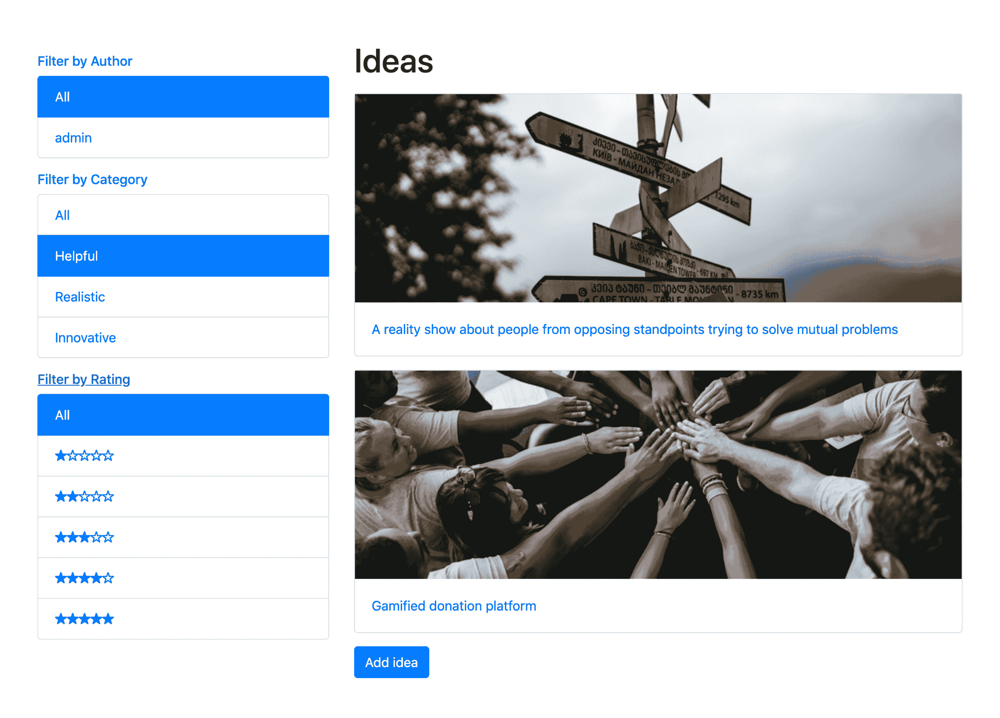
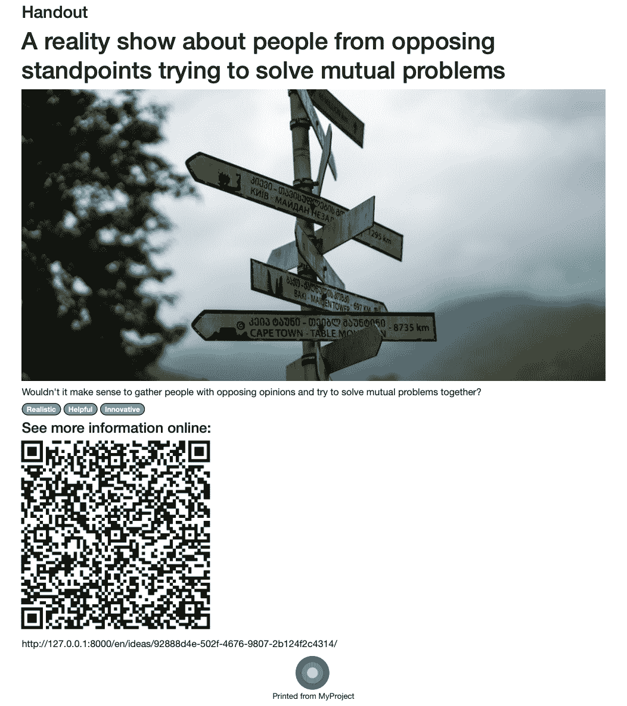
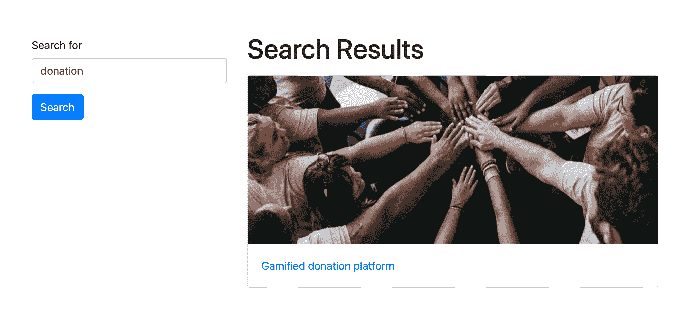

# 形式和观点

在本章中，我们将介绍以下主题：

*   创建具有 CRUDL 功能的应用程序
*   保存模型实例的作者
*   上传图像
*   使用自定义模板创建表单布局
*   使用 django crispy 表单创建表单布局
*   使用表单集
*   筛选对象列表
*   管理分页列表
*   组合基于类的视图
*   提供开放图形和 Twitter 卡数据
*   提供 schema.org 词汇表
*   生成 PDF 文档
*   用 Haystack 和 Whoosh 实现多语言搜索
*   使用 Elasticsearch DSL 实现多语言搜索

# 介绍

虽然在模型中定义了数据库结构，但视图提供了向用户显示内容或允许用户输入新的和更新的数据所需的端点。在本章中，我们将重点介绍用于管理表单的视图、列表视图以及生成 HTML 替代输出的视图。在最简单的例子中，我们将把 URL 规则和模板的创建留给您。

# 技术要求

如前所述，要使用本章的代码，您需要 Python、MySQL 或 PostgreSQL 数据库的最新稳定版本，以及带有虚拟环境的 Django 项目。有些配方需要特定的 Python 依赖项。此外，要生成 PDF 文档，您将需要`cairo`、`pango`、`gdk-pixbuf`和`libffi`库。对于搜索，您需要一个 Elasticsearch 服务器。稍后，您将在相应的食谱中获得有关它们的更多详细信息。

本章中的大多数模板将使用 Bootstrap4CSS 框架，以获得更好的外观和感觉。

您可以在 GitHub 存储库的`ch03`目录中找到本章的所有代码，网址为：[https://github.com/PacktPublishing/Django-3-Web-Development-Cookbook-Fourth-Edition](https://github.com/PacktPublishing/Django-3-Web-Development-Cookbook-Fourth-Edition) 。

# 创建具有 CRUDL 功能的应用程序

在计算机科学中，**CRUDL**首字母缩写代表**创建**、**读取**、**更新**、**删除**和**列表**功能。许多具有交互功能的 Django 项目将需要您实现所有这些功能来管理网站上的数据。在这个食谱中，我们将看到如何为这些基本函数创建 URL 和视图。

# 准备

让我们创建一个名为`ideas`的新应用程序，并将其放入设置中的`INSTALLED_APPS`。创建以下`Idea`模型和`IdeaTranslations`模型，用于该应用程序内部的翻译：

```py
# myproject/apps/idea/models.py import uuid

from django.db import models
from django.urls import reverse
from django.conf import settings
from django.utils.translation import gettext_lazy as _

from myproject.apps.core.model_fields import TranslatedField
from myproject.apps.core.models import (
    CreationModificationDateBase, UrlBase
)

RATING_CHOICES = (
    (1, "★☆☆☆☆"), 
    (2, "★★☆☆☆"), 
    (3, "★★★☆☆"), 
    (4, "★★★★☆"),
    (5, "★★★★★"),
)

class Idea(CreationModificationDateBase, UrlBase):
    uuid = models.UUIDField(
        primary_key=True, default=uuid.uuid4, editable=False
    )
    author = models.ForeignKey(
        settings.AUTH_USER_MODEL,
        verbose_name=_("Author"),
        on_delete=models.SET_NULL,
        blank=True,
        null=True,
        related_name="authored_ideas",
    )
    title = models.CharField(_("Title"), max_length=200)
    content = models.TextField(_("Content"))

    categories = models.ManyToManyField(
        "categories.Category",
        verbose_name=_("Categories"),
        related_name="category_ideas",
    )
    rating = models.PositiveIntegerField(
        _("Rating"), choices=RATING_CHOICES, blank=True, null=True
    )
    translated_title = TranslatedField("title")
    translated_content = TranslatedField("content")

    class Meta:
        verbose_name = _("Idea")
        verbose_name_plural = _("Ideas")

    def __str__(self):
        return self.title

    def get_url_path(self):
        return reverse("ideas:idea_detail", kwargs={"pk": self.pk})

class IdeaTranslations(models.Model):
    idea = models.ForeignKey(
        Idea,
        verbose_name=_("Idea"),
        on_delete=models.CASCADE,
        related_name="translations",
    )
    language = models.CharField(_("Language"), max_length=7)

    title = models.CharField(_("Title"), max_length=200)
    content = models.TextField(_("Content"))

    class Meta:
        verbose_name = _("Idea Translations")
        verbose_name_plural = _("Idea Translations")
        ordering = ["language"]
        unique_together = [["idea", "language"]]

    def __str__(self):
        return self.title
```

我们在这里使用了上一章中的几个概念：我们从模型混合继承并使用模型转换表。在*使用模型混合*和*使用模型转换表*配方中了解更多信息。我们将使用`ideas`应用程序和这些模型来制作本章中的所有配方。

此外，使用`Category`和`CategoryTranslations`模型创建一个类似的`categories`应用程序：

```py
# myproject/apps/categories/models.py
from django.db import models
from django.utils.translation import gettext_lazy as _

from myproject.apps.core.model_fields import TranslatedField

class Category(models.Model):
    title = models.CharField(_("Title"), max_length=200)

    translated_title = TranslatedField("title")

    class Meta:
        verbose_name = _("Category")
        verbose_name_plural = _("Categories")

    def __str__(self):
        return self.title

class CategoryTranslations(models.Model):
    category = models.ForeignKey(
        Category,
        verbose_name=_("Category"),
        on_delete=models.CASCADE,
        related_name="translations",
    )
    language = models.CharField(_("Language"), max_length=7)

    title = models.CharField(_("Title"), max_length=200)

    class Meta:
        verbose_name = _("Category Translations")
        verbose_name_plural = _("Category Translations")
        ordering = ["language"]
        unique_together = [["category", "language"]]

    def __str__(self):
        return self.title
```

# 怎么做。。。

Django 中的 CRUDL 功能由表单、视图和 URL 规则组成。让我们创建它们：

1.  使用模型表单向`ideas`应用程序添加新的`forms.py`文件，用于添加和更改您的`Idea`模型的实例：

```py
# myprojects/apps/ideas/forms.py from django import forms
from .models import Idea

class IdeaForm(forms.ModelForm):
    class Meta:
        model = Idea
        fields = "__all__"
```

2.  在`ideas`应用程序中添加一个新的`views.py`文件，其中包含用于操作`Idea`模型的视图：

```py
# myproject/apps/ideas/views.py from django.contrib.auth.decorators import login_required
from django.shortcuts import render, redirect, get_object_or_404
from django.views.generic import ListView, DetailView

from .forms import IdeaForm
from .models import Idea

class IdeaList(ListView):
    model = Idea

class IdeaDetail(DetailView):
    model = Idea
    context_object_name = "idea"

@login_required
def add_or_change_idea(request, pk=None):
    idea = None
    if pk:
        idea = get_object_or_404(Idea, pk=pk)

    if request.method == "POST":
        form = IdeaForm(
            data=request.POST, 
            files=request.FILES, 
            instance=idea
        )

        if form.is_valid():
            idea = form.save()
            return redirect("ideas:idea_detail", pk=idea.pk)
    else:
        form = IdeaForm(instance=idea)

    context = {"idea": idea, "form": form}
    return render(request, "ideas/idea_form.html", context)

@login_required
def delete_idea(request, pk):
    idea = get_object_or_404(Idea, pk=pk)
    if request.method == "POST":
        idea.delete()
        return redirect("ideas:idea_list")
    context = {"idea": idea}
    return render(request, "ideas/idea_deleting_confirmation.html", context)
```

3.  使用 URL 规则在`ideas`应用程序中创建`urls.py`文件：

```py
# myproject/apps/ideas/urls.py from django.urls import path

from .views import (
    IdeaList,
    IdeaDetail,
    add_or_change_idea,
    delete_idea,
)

urlpatterns = [
    path("", IdeaList.as_view(), name="idea_list"),
    path("add/", add_or_change_idea, name="add_idea"),
    path("<uuid:pk>/", IdeaDetail.as_view(), name="idea_detail"),
    path("<uuid:pk>/change/", add_or_change_idea,  
     name="change_idea"),
    path("<uuid:pk>/delete/", delete_idea, name="delete_idea"),
]
```

4.  现在，让我们将这些 URL 规则插入到项目的 URL 配置中。我们还将包括来自 Django 贡献的`auth`应用程序的帐户 URL 规则，以便我们的`@login_required`装饰程序能够正常工作：

```py
# myproject/urls.py from django.contrib import admin
from django.conf.urls.i18n import i18n_patterns
from django.urls import include, path
from django.conf import settings
from django.conf.urls.static import static
from django.shortcuts import redirect

urlpatterns = i18n_patterns(
    path("", lambda request: redirect("ideas:idea_list")),
    path("admin/", admin.site.urls),
    path("accounts/", include("django.contrib.auth.urls")),
 path("ideas/", include(("myproject.apps.ideas.urls", "ideas"), 
     namespace="ideas")),
)
urlpatterns += static(settings.STATIC_URL, document_root=settings.STATIC_ROOT)
urlpatterns += static("/media/", document_root=settings.MEDIA_ROOT)
```

5.  现在，您应该能够创建以下模板：

*   `registration/login.html`带表单登录
*   `ideas/idea_list.html`有一系列想法
*   `ideas/idea_detail.html`关于一个想法的细节
*   `ideas/idea_form.html`用表格添加或更改想法
*   `ideas/idea_deleting_confirmation.html`用空表确认创意删除

在模板中，您可以通过名称空间和路径名对`ideas`应用程序的 URL 进行寻址，如下所示：

```py

<a href=""></a>
<a href=""></a>
```

如果您遇到困难或想节省时间，请查看本书代码文件中相应的模板，您可以在[找到 https://github.com/PacktPublishing/Django-3-Web-Development-Cookbook-Fourth-Edition/tree/master/ch03/myproject_virtualenv/src/django-myproject/myproject/templates/ideas](https://github.com/PacktPublishing/Django-3-Web-Development-Cookbook-Fourth-Edition/tree/master/ch03/myproject_virtualenv/src/django-myproject/myproject/templates/ideas) 。

# 它是如何工作的。。。

在本例中，我们使用 UUID 字段作为`Idea`模型的主键。有了这个 ID，每个想法都有一个不可猜测的唯一 URL。或者，您可以为 URL 使用 slug 字段，但是您必须确保每个 slug 都已填充并且在整个网站中是唯一的。

出于安全原因，不建议对 URL 使用默认的增量 ID：用户可以计算出数据库中有多少项，并尝试访问下一项或上一项，尽管他们可能没有这样做的权限。

在我们的示例中，我们使用基于类的通用视图来列出和阅读想法，使用基于函数的视图来创建、更新和删除想法。更改数据库中记录的视图需要使用`@login_required`装饰器对用户进行身份验证。对所有 CRUDL 函数使用基于类的视图或基于函数的视图也很好。

成功添加或更改想法后，用户将重定向到详细视图。删除想法后，用户将重定向到列表视图。

# 还有更多。。。

此外，您可以使用 Django messages 框架在每次成功添加、更改或删除后在页面顶部显示成功消息。

您可以在官方文件[中阅读相关信息 https://docs.djangoproject.com/en/2.2/ref/contrib/messages/](https://docs.djangoproject.com/en/2.2/ref/contrib/messages/) 。

# 另见

*   [第 2 章](02.html)*中*使用模型混合*配方，模型和数据库结构*
*   [第 2 章](02.html)*中的*处理模型翻译表*配方，模型和数据库结构*
*   *保存模型实例*配方的作者
*   *在[第 4 章](04.html)*中安排 base.html 模板*配方，模板和 JavaScript*

# 保存模型实例的作者

每个 Django 视图的第一个参数是`HttpRequest`对象，按照惯例，它被命名为`request`。它包含有关从浏览器或其他客户端发送的请求的元数据，包括当前语言代码、用户数据、cookie 和会话等项。默认情况下，视图使用的表单接受 GET 或 POST 数据、文件、初始数据和其他参数；但是，它们本身没有访问`HttpRequest`对象的权限。在某些情况下，将`HttpRequest`额外传递给表单非常有用，尤其是当您希望根据其他请求数据筛选出表单字段的选择，或者处理在表单中保存诸如当前用户或 IP 之类的内容时。

在此配方中，我们将看到一个表单示例，其中，对于添加或更改的想法，当前用户保存为作者。

# 准备

我们将以前面配方中的示例为基础。

# 怎么做。。。

要完成此配方，请执行以下两个步骤：

1.  修改`IdeaForm`模型表格如下：

```py
# myprojects/apps/ideas/forms.py from django import forms
from .models import Idea

class IdeaForm(forms.ModelForm):
    class Meta:
        model = Idea
        exclude = ["author"]

 def __init__(self, request, *args, **kwargs):
 self.request = request
 super().__init__(*args, **kwargs)

 def save(self, commit=True):
 instance = super().save(commit=False)
 instance.author = self.request.user
 if commit:
 instance.save()
            self.save_m2m()
 return instance
```

2.  修改视图以添加或更改想法：

```py
# myproject/apps/ideas/views.py from django.contrib.auth.decorators import login_required
from django.shortcuts import render, redirect, get_object_or_404

from .forms import IdeaForm
from .models import Idea

@login_required
def add_or_change_idea(request, pk=None):
    idea = None
    if pk:
        idea = get_object_or_404(Idea, pk=pk)

    if request.method == "POST":
        form = IdeaForm(request, data=request.POST, 
         files=request.FILES, instance=idea)

        if form.is_valid():
            idea = form.save()
            return redirect("ideas:idea_detail", pk=idea.pk)
    else:
        form = IdeaForm(request, instance=idea)

    context = {"idea": idea, "form": form}
    return render(request, "ideas/idea_form.html", context)
```

# 它是如何工作的。。。

让我们看一下表格。首先，我们从表单中排除`author`字段，因为我们希望以编程方式处理它。我们覆盖`__init__()`方法，接受`HttpRequest`作为第一个参数，并将其存储在表单中。模型表单的`save()`方法处理模型的保存。`commit`参数告诉模型表单立即保存实例，或者以其他方式创建并填充实例，但尚未保存。在本例中，我们获取实例而不保存它，然后从当前用户分配作者。最后，如果`commit`为`True`，则保存实例。我们将调用表单的动态添加`save_m2m()`方法来保存多对多关系，例如，类别。

在视图中，我们只是将`request`变量作为第一个参数传递给表单。

# 另见

*   *创建具有 CRUDL 功能的应用*配方
*   *上传图片*配方

# 上传图像

在本食谱中，我们将了解处理图像上传的最简单方法。我们将在`Idea`模型中添加一个`picture`字段，我们将为不同的目的创建不同维度的图像版本。

# 准备

对于具有图像版本的图像，我们需要`Pillow`和`django-imagekit`库。让我们将它们与`pip`一起安装到您的虚拟环境中（并将它们包含在`requirements/_base.txt`中）：

```py
(env)$ pip install Pillow
(env)$ pip install django-imagekit==4.0.2
```

然后，在设置中将`"imagekit"`添加到`INSTALLED_APPS`。

# 怎么做。。。

执行以下步骤以完成配方：

1.  修改`Idea`模型，增加`picture`字段和图像版本规格：

```py
# myproject/apps/ideas/models.py
import contextlib
import os

from imagekit.models import ImageSpecField
from pilkit.processors import ResizeToFill

from django.db import models
from django.utils.translation import gettext_lazy as _
from django.utils.timezone import now as timezone_now

from myproject.apps.core.models import (CreationModificationDateBase, UrlBase)

def upload_to(instance, filename):
 now = timezone_now()
 base, extension = os.path.splitext(filename)
 extension = extension.lower()
 return f"ideas/{now:%Y/%m}/{instance.pk}{extension}"

class Idea(CreationModificationDateBase, UrlBase):
    # attributes and fields…
    picture = models.ImageField(
        _("Picture"), upload_to=upload_to
    )
    picture_social = ImageSpecField(
        source="picture",
        processors=[ResizeToFill(1024, 512)],
        format="JPEG",
        options={"quality": 100},
    )
    picture_large = ImageSpecField(
        source="picture", 
        processors=[ResizeToFill(800, 400)], 
        format="PNG"
    )
    picture_thumbnail = ImageSpecField(
        source="picture", 
        processors=[ResizeToFill(728, 250)], 
        format="PNG"
    )
    # other fields, properties, and  methods…

 def delete(self, *args, **kwargs):
 from django.core.files.storage import default_storage
 if self.picture:
 with contextlib.suppress(FileNotFoundError):
 default_storage.delete(
 self.picture_social.path
 )
 default_storage.delete(
 self.picture_large.path
 )
 default_storage.delete(
 self.picture_thumbnail.path
 )
 self.picture.delete()
 super().delete(*args, **kwargs)
```

2.  为`forms.py`中的`Idea`模型创建一个模型表单`IdeaForm`，就像我们在前面的食谱中所做的那样。
3.  在添加或更改想法的视图中，请确保将`request.POST`旁边的`request.FILES`张贴到表单中：

```py
# myproject/apps/ideas/views.py from django.contrib.auth.decorators import login_required
from django.shortcuts import (render, redirect, get_object_or_404)
from django.conf import settings

from .forms import IdeaForm
from .models import Idea

@login_required
def add_or_change_idea(request, pk=None):
    idea = None
    if pk:
        idea = get_object_or_404(Idea, pk=pk)
    if request.method == "POST":
        form = IdeaForm(
            request, 
 data=request.POST, 
 files=request.FILES, 
            instance=idea,
        )

        if form.is_valid():
            idea = form.save()
            return redirect("ideas:idea_detail", pk=idea.pk)
    else:
        form = IdeaForm(request, instance=idea)

    context = {"idea": idea, "form": form}
    return render(request, "ideas/idea_form.html", context)
```

4.  在模板中，确保编码类型设置为`"multipart/form-data"`，如下所示：

```py
<form action="{{ request.path }}" method="post" enctype="multipart/form-data">
{{ form.as_p }}
<button type="submit"></button>
</form>
```

如果您正在使用*使用 django crispy forms*配方创建表单布局中所述的`django-crispy-form`，则`enctype`属性将自动添加到表单中。

# 它是如何工作的。。。

Django 模型表单是从模型动态创建的。它们提供了模型中指定的字段，因此您不需要在表单中手动重新定义它们。在前面的示例中，我们为`Idea`模型创建了一个模型表单。当我们保存表单时，表单知道如何保存数据库中的每个字段，以及如何上传文件并将其保存在媒体目录中。

我们示例中的`upload_to()`函数用于将图像保存到特定目录，并定义其名称，这样它就不会与其他模型实例的文件名冲突。每个文件将保存在一个路径下，如`ideas/2020/01/0422c6fe-b725-4576-8703-e2a9d9270986.jpg`，该路径由上传的年份和月份以及`Idea`实例的主键组成。

某些文件系统（如 FAT32 和 NTFS）每个目录的可用文件数量有限；因此，根据上传日期、字母表或其他标准将它们划分为目录是一种很好的做法。

我们正在使用 django imagekit 中的`ImageSpecField`创建三个图像版本：

*   `picture_social`用于社交分享。
*   `picture_large`用于局部视图。
*   `picture_thumbnail`用于列表视图。

图像版本不会链接到数据库中，只是保存在默认文件存储中的文件路径下，如`CACHE/img/ideas/2020/01/0422c6fe-b725-4576-8703-e2a9d9270986/`。

在模板中，可以使用原始图像版本或特定图像版本，如下所示：

```py


```

在`Idea`模型定义的最后，我们覆盖`delete()`方法，在删除`Idea`自身的实例之前，从磁盘中删除图像版本和图片。

# 另见

*   *使用 django crispy forms*配方创建表单布局
*   *在[第 4 章](04.html)*中安排 base.html 模板*配方，模板和 JavaScript*
*   [第 4 章](04.html)*中的*提供响应图像*配方、模板和 JavaScript*

# 使用自定义模板创建表单布局

在 Django 的早期版本中，所有表单呈现都是用 Python 代码专门处理的，但自 Django 1.11 以来，已经引入了基于模板的表单小部件呈现。在这个配方中，我们将研究如何为表单小部件使用自定义模板。我们将使用 Django 管理表单来说明定制小部件模板如何提高字段的可用性。

# 准备

让我们为`Idea`模型及其翻译创建默认的 Django 管理：

```py
# myproject/apps/ideas/admin.py from django import forms
from django.contrib import admin
from django.utils.translation import gettext_lazy as _

from myproject.apps.core.admin import LanguageChoicesForm

from .models import Idea, IdeaTranslations

class IdeaTranslationsForm(LanguageChoicesForm):
    class Meta:
        model = IdeaTranslations
        fields = "__all__"

class IdeaTranslationsInline(admin.StackedInline):
    form = IdeaTranslationsForm
    model = IdeaTranslations
    extra = 0

@admin.register(Idea)
class IdeaAdmin(admin.ModelAdmin):
 inlines = [IdeaTranslationsInline]

 fieldsets = [
 (_("Author and Category"), {"fields": ["author", "categories"]}),
```

```py
 (_("Title and Content"), {"fields": ["title", "content", 
         "picture"]}),
 (_("Ratings"), {"fields": ["rating"]}),
 ]
```

如果您访问创意管理表单，它将如下所示：


# 怎么做。。。

要完成配方，请执行以下步骤：

1.  通过在`INSTALLED_APPS`中添加`"django.forms"`，确保模板系统能够找到定制的模板，包括模板配置中的`APP_DIRS`标志为`True`，并使用`"TemplatesSetting"`表单呈现器：

```py
# myproject/settings/_base.py
INSTALLED_APPS = [
    "django.contrib.admin",
    "django.contrib.auth",
    "django.contrib.contenttypes",
    "django.contrib.sessions",
    "django.contrib.messages",
    "django.contrib.staticfiles",
 "django.forms",
    # other apps…
]

TEMPLATES = [
    {
        "BACKEND": 
        "django.template.backends.django.DjangoTemplates",
        "DIRS": [os.path.join(BASE_DIR, "myproject", "templates")],
 "APP_DIRS": True,
        "OPTIONS": {
            "context_processors": [
                "django.template.context_processors.debug",
                "django.template.context_processors.request",
                "django.contrib.auth.context_processors.auth",

                "django.contrib.messages.context_processors
                 .messages",
                "django.template.context_processors.media",
                "django.template.context_processors.static",
                "myproject.apps.core.context_processors
                .website_url",
            ]
        },
    }
]

FORM_RENDERER = "django.forms.renderers.TemplatesSetting"
```

2.  编辑`admin.py`文件如下：

```py
# myproject/apps/ideas/admin.py from django import forms
from django.contrib import admin
from django.utils.translation import gettext_lazy as _

from myproject.apps.core.admin import LanguageChoicesForm

from myproject.apps.categories.models import Category
from .models import Idea, IdeaTranslations

class IdeaTranslationsForm(LanguageChoicesForm):
    class Meta:
        model = IdeaTranslations
        fields = "__all__"

class IdeaTranslationsInline(admin.StackedInline):
    form = IdeaTranslationsForm
    model = IdeaTranslations
    extra = 0

class IdeaForm(forms.ModelForm):
 categories = forms.ModelMultipleChoiceField(
 label=_("Categories"),
 queryset=Category.objects.all(),
 widget=forms.CheckboxSelectMultiple(),
 required=True,
 )

 class Meta:
 model = Idea
 fields = "__all__"

    def __init__(self, *args, **kwargs):
 super().__init__(*args, **kwargs)

 self.fields[
 "picture"
        ].widget.template_name = "core/widgets/image.html"

@admin.register(Idea)
class IdeaAdmin(admin.ModelAdmin):
 form = IdeaForm
    inlines = [IdeaTranslationsInline]

    fieldsets = [
        (_("Author and Category"), {"fields": ["author", 
         "categories"]}),
        (_("Title and Content"), {"fields": ["title", "content", 
         "picture"]}),
        (_("Ratings"), {"fields": ["rating"]}),
    ]
```

3.  最后，为图片字段创建模板：

```py
{# core/widgets/image.html #} 

<div style="margin-left: 160px; padding-left: 10px;">
    
        <a href="{{ widget.value.url }}">
 
 </a>
        <br />
            {{ widget.clear_checkbox_label }}:
            <input type="checkbox" name="{{ widget.checkbox_name 
             }}" id="{{ widget.checkbox_id }}">
        <br />
        {{ widget.input_text }}:
    
    <input type="{{ widget.type }}" name="{{ widget.name }}">
</div>
<div class="help">
 
 
</div>
```

# 它是如何工作的。。。

如果您现在查看管理表单以了解想法，您将看到如下内容：


这里有两个变化：

*   类别选择现在使用带有多个复选框的小部件。
*   图片字段现在使用特定模板呈现，显示图像预览和带有首选文件类型和尺寸的帮助文本。

我们在这里所做的是，我们重写了想法的模型表单，并修改了类别的小部件和图片字段的模板。

Django 中的默认表单呈现器是`"django.forms.renderers.DjangoTemplates"`，它只搜索应用程序目录中的模板。我们将其更改为`"django.forms.renderers.TemplatesSetting"`以查看`DIRS`路径下的模板。

# 另见

*   [第 2 章](02.html)*中的*处理模型翻译表*配方，模型和数据库结构*
*   *上传图片*配方
*   *使用 django crispy forms*配方创建表单布局

# 使用 django crispy 表单创建表单布局

Deango 应用程序允许使用以下 CSS 框架之一构建、定制和重用表单：UNI 窗体、Bootstrap 3、Bootstrap 4 或基础。`django-crispy-forms`的使用在某种程度上类似于 Django 贡献的管理中的字段集；然而，它更先进，更可定制。您可以在 Python 代码中定义表单布局，不必担心每个字段在 HTML 中的显示方式。此外，如果您需要添加特定的 HTML 属性或包装，您也可以轻松地做到这一点。`django-crispy-forms`使用的所有标记都位于模板中，可以根据特定需要进行覆盖。

在此配方中，我们将为前端表单创建一个良好的布局，以便使用 Bootstrap 4（开发响应性、移动优先 web 项目的流行前端框架）添加或编辑想法。

# 准备

我们将从本章中创建的`ideas`应用程序开始。接下来，我们将逐一执行以下任务：

1.  确保你已经为你的网站创建了一个`base.html`模板。在[第 4 章](04.html)*中的*安排 base.html 模板*配方、模板和 JavaScript*中了解更多信息。
2.  集成来自[的 Bootstrap 4 前端框架 CSS 和 JS 文件
    https://getbootstrap.com/docs/4.3/getting-started/introduction/](https://getbootstrap.com/docs/4.3/getting-started/introduction/) 进入`base.html`模板。
3.  使用`pip`在您的虚拟环境中安装`django-crispy-forms`（并将其包含在`requirements/_base.txt`中）：

```py
(env)$ pip install django-crispy-forms
```

4.  确认【设置】中`INSTALLED_APPS`增加了`"crispy_forms"`，然后将`"bootstrap4"`设置为本项目使用的模板包：

```py
# myproject/settings/_base.py
INSTALLED_APPS = (
    # ...
    "crispy_forms",
    "ideas",
)
# ...
CRISPY_TEMPLATE_PACK = "bootstrap4"
```

# 怎么做。。。

遵循以下步骤：

1.  让我们修改想法的模型表单：

```py
# myproject/apps/ideas/forms.py from django import forms
from django.utils.translation import ugettext_lazy as _
from django.conf import settings
from django.db import models

from crispy_forms import bootstrap, helper, layout

from .models import Idea

class IdeaForm(forms.ModelForm):
    class Meta:
        model = Idea
        exclude = ["author"]

    def __init__(self, request, *args, **kwargs):
        self.request = request
        super().__init__(*args, **kwargs)

 self.fields["categories"].widget = 
         forms.CheckboxSelectMultiple()

 title_field = layout.Field(
            "title", css_class="input-block-level"
        )
 content_field = layout.Field(
            "content", css_class="input-block-level", rows="3"
        )
 main_fieldset = layout.Fieldset(
            _("Main data"), title_field, content_field
        )

 picture_field = layout.Field(
            "picture", css_class="input-block-level"
        )
 format_html = layout.HTML(
 """"""
        )

 picture_fieldset = layout.Fieldset(
 _("Picture"),
 picture_field,
 format_html,
 title=_("Image upload"),
 css_id="picture_fieldset",
 )

 categories_field = layout.Field(
            "categories", css_class="input-block-level"
        )
 categories_fieldset = layout.Fieldset(
 _("Categories"), categories_field,
            css_id="categories_fieldset"
        )

 submit_button = layout.Submit("save", _("Save"))
 actions = bootstrap.FormActions(submit_button)

 self.helper = helper.FormHelper()
 self.helper.form_action = self.request.path
 self.helper.form_method = "POST"
        self.helper.layout = layout.Layout(
 main_fieldset,
 picture_fieldset,
 categories_fieldset,
 actions,
 )

    def save(self, commit=True):
        instance = super().save(commit=False)
        instance.author = self.request.user
        if commit:
            instance.save()
            self.save_m2m()
        return instance
```

2.  然后，让我们创建具有以下内容的`picture_guidelines.html`模板：

```py
{# ideas/includes/picture_guidelines.html #} 
<p class="form-text text-muted">
    
    
</p>
```

3.  最后，让我们更新创意形式的模板：

```py
{# ideas/idea_form.html #} 



    <a href=""></a>
    <h1>
        
            
                Change Idea "{{ title }}
            
        
            
        
```

```py
    </h1>
    

```

# 它是如何工作的。。。

在 ideas 的模型表单中，我们创建了一个表单帮助器，其布局由主字段集、图片字段集、类别字段集和提交按钮组成。每个字段集由字段组成。任何字段集、字段或按钮都可以具有成为字段属性的附加参数，例如，`rows="3"`或`placeholder=_("Please enter a title")`。对于 HTML`class`和`id`属性，有具体的参数`css_class`和`css_id`。

带有 idea 表单的页面将类似于以下内容：


与前面的配方一样，我们修改了 categories 字段的小部件，并为 picture 字段添加了额外的帮助文本。

# 还有更多。。。

对于基本用法，给出的示例是非常必要的。但是，如果您需要项目中表单的特定标记，您仍然可以覆盖和修改`django-crispy-forms`应用程序的模板，因为 Python 文件中没有硬编码的标记，而是通过模板呈现所有生成的标记。只需将模板从`django-crispy-forms`应用程序复制到项目的模板目录中，并根据需要进行更改。

# 另见

*   *创建具有 CRUDL 功能的应用*配方
*   *使用自定义模板创建表单布局*配方
*   *过滤对象列出*配方
*   *管理分页列表*配方
*   *组合基于类的视图*配方
*   *在[第 4 章](04.html)*中安排 base.html 模板*配方，模板和 JavaScript*

# 使用表单集

除了普通表单或模型表单之外，Django 还有表单集的概念。这些是同一类型的表单集，允许我们一次创建或更改多个实例。Django 表单集可以使用 JavaScript 进行丰富，这允许我们动态地将它们添加到页面中。这正是我们将在本食谱中研究的内容。我们将扩展想法的形式，允许在同一页面上添加不同语言的翻译。

# 准备

让我们继续学习上一个食谱中的`IdeaForm`，*使用 django crispy 表单*创建表单布局。

# 怎么做。。。

遵循以下步骤：

1.  让我们修改`IdeaForm`的表单布局：

```py
# myproject/apps/ideas/forms.py from django import forms
from django.utils.translation import ugettext_lazy as _
from django.conf import settings
from django.db import models

from crispy_forms import bootstrap, helper, layout

from .models import Idea, IdeaTranslations

class IdeaForm(forms.ModelForm):
    class Meta:
        model = Idea
        exclude = ["author"]

    def __init__(self, request, *args, **kwargs):
        self.request = request
        super().__init__(*args, **kwargs)

        self.fields["categories"].widget = 
         forms.CheckboxSelectMultiple()

        title_field = layout.Field(
            "title", css_class="input-block-level"
        )
        content_field = layout.Field(
            "content", css_class="input-block-level", rows="3"
        )
        main_fieldset = layout.Fieldset(
            _("Main data"), title_field, content_field
        )

        picture_field = layout.Field(
            "picture", css_class="input-block-level"
        )
        format_html = layout.HTML(
            """"""
        )

        picture_fieldset = layout.Fieldset(
            _("Picture"),
            picture_field,
            format_html,
            title=_("Image upload"),
            css_id="picture_fieldset",
        )

        categories_field = layout.Field(
            "categories", css_class="input-block-level"
        )
        categories_fieldset = layout.Fieldset(
            _("Categories"), categories_field,
            css_id="categories_fieldset"
        )

        inline_translations = layout.HTML(
 """"""
        )

        submit_button = layout.Submit("save", _("Save"))
        actions = bootstrap.FormActions(submit_button)

        self.helper = helper.FormHelper()
        self.helper.form_action = self.request.path
        self.helper.form_method = "POST"
        self.helper.layout = layout.Layout(
            main_fieldset,
            inline_translations,
            picture_fieldset,
            categories_fieldset,
            actions,
        )

    def save(self, commit=True):
        instance = super().save(commit=False)
        instance.author = self.request.user
        if commit:
            instance.save()
            self.save_m2m()
        return instance
```

2.  然后，让我们在同一个文件的末尾添加`IdeaTranslationsForm`：

```py
class IdeaTranslationsForm(forms.ModelForm):
 language = forms.ChoiceField(
 label=_("Language"),
 choices=settings.LANGUAGES_EXCEPT_THE_DEFAULT,
 required=True,
 )

 class Meta:
 model = IdeaTranslations
 exclude = ["idea"]

 def __init__(self, request, *args, **kwargs):
 self.request = request
 super().__init__(*args, **kwargs)

 id_field = layout.Field("id")
 language_field = layout.Field(
            "language", css_class="input-block-level"
        )
 title_field = layout.Field(
            "title", css_class="input-block-level"
        )
 content_field = layout.Field(
            "content", css_class="input-block-level", rows="3"
        )
 delete_field = layout.Field("DELETE")
 main_fieldset = layout.Fieldset(
 _("Main data"),
 id_field,
 language_field,
 title_field,
 content_field,
 delete_field,
 )

 self.helper = helper.FormHelper()
 self.helper.form_tag = False
        self.helper.disable_csrf = True
        self.helper.layout = layout.Layout(main_fieldset)
```

3.  修改视图以添加或更改想法，如下所示：

```py
# myproject/apps/ideas/views.py from django.contrib.auth.decorators import login_required
from django.shortcuts import render, redirect, get_object_or_404
from django.forms import modelformset_factory
from django.conf import settings

from .forms import IdeaForm, IdeaTranslationsForm
from .models import Idea, IdeaTranslations

@login_required
def add_or_change_idea(request, pk=None):
    idea = None
    if pk:
        idea = get_object_or_404(Idea, pk=pk)
    IdeaTranslationsFormSet = modelformset_factory(
 IdeaTranslations, form=IdeaTranslationsForm, 
 extra=0, can_delete=True
    )
    if request.method == "POST":
        form = IdeaForm(request, data=request.POST, 
         files=request.FILES, instance=idea)
        translations_formset = IdeaTranslationsFormSet(
 queryset=IdeaTranslations.objects.filter(idea=idea),
 data=request.POST,
 files=request.FILES,
 prefix="translations",
 form_kwargs={"request": request},
 )
        if form.is_valid() and translations_formset.is_valid():
            idea = form.save()
 translations = translations_formset.save(
 commit=False
            )
 for translation in translations:
 translation.idea = idea
 translation.save()
 translations_formset.save_m2m()
 for translation in 
             translations_formset.deleted_objects:
 translation.delete()
            return redirect("ideas:idea_detail", pk=idea.pk)
    else:
        form = IdeaForm(request, instance=idea)
 translations_formset = IdeaTranslationsFormSet(
 queryset=IdeaTranslations.objects.filter(idea=idea),
 prefix="translations",
 form_kwargs={"request": request},
 )

    context = {
        "idea": idea, 
        "form": form, 
 "translations_formset": translations_formset
    }
    return render(request, "ideas/idea_form.html", context)
```

4.  然后，我们编辑`idea_form.html`模板，并在末尾添加对`inlines.js`脚本文件的引用：

```py
{# ideas/idea_form.html #}




    <a href=""></a>
    <h1>
        
            
                Change Idea "{{ title }}"
            
        
            
        
    </h1>
    



 <script src=""></script>

```

5.  为翻译表单集创建模板：

```py
{# ideas/forms/translations.html #} 
<section id="translations_section" class="formset my-3">
    {{ translations_formset.management_form }}
    <h3></h3>
    <div class="formset-forms">
        
            <div class="formset-form">
                
            </div>
        
    </div>
    <button type="button" class="btn btn-primary btn-sm 
     add-inline-form"></button>
    <div class="empty-form d-none">
        
    </div>
</section>
```

6.  最后，添加 JavaScript 以操作表单集：

```py
/* site/js/inlines.js */ window.WIDGET_INIT_REGISTER = window.WIDGET_INIT_REGISTER || [];

$(function () {
    function reinit_widgets($formset_form) {
        $(window.WIDGET_INIT_REGISTER).each(function (index, func) 
        {
            func($formset_form);
        });
    }

    function set_index_for_fields($formset_form, index) {
        $formset_form.find(':input').each(function () {
            var $field = $(this);
            if ($field.attr("id")) {
                $field.attr(
                    "id",
                    $field.attr("id").replace(/-__prefix__-/, 
                     "-" + index + "-")
                );
            }
            if ($field.attr("name")) {
                $field.attr(
                    "name",
                    $field.attr("name").replace(
                        /-__prefix__-/, "-" + index + "-"
                    )
                );
            }
        });
        $formset_form.find('label').each(function () {
            var $field = $(this);
            if ($field.attr("for")) {
                $field.attr(
                    "for",
                    $field.attr("for").replace(
                        /-__prefix__-/, "-" + index + "-"
                    )
                );
            }
        });
        $formset_form.find('div').each(function () {
            var $field = $(this);
            if ($field.attr("id")) {
                $field.attr(
                    "id",
                    $field.attr("id").replace(
                        /-__prefix__-/, "-" + index + "-"
                    )
                );
            }
        });
    }

    function add_delete_button($formset_form) {
        $formset_form.find('input:checkbox[id$=DELETE]')
         .each(function () {
            var $checkbox = $(this);
            var $deleteLink = $(
                '<button class="delete btn btn-sm 
                  btn-danger mb-3">Remove</button>'
            );
            $formset_form.append($deleteLink);
            $checkbox.closest('.form-group').hide();
        });

    }

    $('.add-inline-form').click(function (e) {
        e.preventDefault();
        var $formset = $(this).closest('.formset');
        var $total_forms = $formset.find('[id$="TOTAL_FORMS"]');
        var $new_form = $formset.find('.empty-form')
        .clone(true).attr("id", null);
        $new_form.removeClass('empty-form d-none')
        .addClass('formset-form');
        set_index_for_fields($new_form, 
         parseInt($total_forms.val(), 10));
        $formset.find('.formset-forms').append($new_form);
        add_delete_button($new_form);
        $total_forms.val(parseInt($total_forms.val(), 10) + 1);
        reinit_widgets($new_form);
    });
    $('.formset-form').each(function () {
        $formset_form = $(this);
        add_delete_button($formset_form);
        reinit_widgets($formset_form);
    });
    $(document).on('click', '.delete', function (e) {
        e.preventDefault();
        var $formset = $(this).closest('.formset-form');
        var $checkbox = 
        $formset.find('input:checkbox[id$=DELETE]');
        $checkbox.attr("checked", "checked");
        $formset.hide();
    });
});
```

# 它是如何工作的。。。

您可能从 Django 模型管理中了解表单集。表单集用于具有父模型外键的子模型的内联线机制。

在此配方中，我们使用`django-crispy-forms`将表单集添加到 idea 表单中。结果如下所示：


正如您所看到的，我们可以在表单的末尾插入表单集，但不一定要插入表单集，而是插入表单集之间有意义的任何位置。在我们的示例中，在可翻译字段之后列出翻译是有意义的。

翻译表单的表单布局具有与`IdeaForm`布局相同的主字段集，但除此之外，它还具有识别每个模型实例所需的`id`和`DELETE`字段，以及从列表中删除这些字段的可能性。`DELETE`字段实际上是一个复选框，如果选中，将从数据库中删除相应的项。此外，用于翻译的表单帮助器有`form_tag=False`，它不生成`<form>`标记，还有`disable_csrf=True`，它不包含 CSRF 标记，因为我们已经在父表单`IdeaForm`中定义了这些标记。

在视图中，如果请求是通过 POST 方法发送的，并且表单和表单集都有效，那么我们保存表单并创建相应的翻译实例，而不首先保存它们。这是通过`commit=False`属性完成的。对于每个翻译实例，我们分配想法，然后将翻译保存到数据库中。最后，我们检查表单集中是否有任何表单被标记为删除，并将其从数据库中删除。

在`translations.html`模板中，我们在表单集中呈现每个表单，然后添加一个额外的隐藏空表单，JavaScript 将使用该表单生成要动态添加的表单集的新表单。

每个表单集表单都有所有字段的前缀。例如，第一个表单集表单的`title`字段将具有 HTML 字段名`"translations-0-title"`，而同一表单集表单的`DELETE`字段将具有 HTML 字段名`"translations-0-DELETE"`。空表单有一个单词`"__prefix__"`，而不是索引，例如`"translations-__prefix__-title"`。这是在 Django 级别抽象的，但需要知道如何使用 JavaScript 操作表单集表单。

`inlines.js`JavaScript 做了一些事情：

*   对于每个现有的表单集表单，它都会初始化其 JavaScript 支持的小部件（您可以使用工具提示、日期或颜色选择器、地图等），并创建一个删除按钮，该按钮将显示，而不是`DELETE`复选框。
*   单击删除按钮时，它选中`DELETE`复选框并向用户隐藏表单集表单。
*   单击 add 按钮时，它克隆空表单并用下一个可用索引替换`"__prefix__"`，将新表单添加到列表中，并启动支持 JavaScript 的小部件。

# 还有更多。。。

JavaScript 使用一个数组`window.WIDGET_INIT_REGISTER`，其中包含一些函数，应该调用这些函数来启动具有给定表单集表单的小部件。要在另一个 JavaScript 文件中注册新函数，可以执行以下操作：

```py
/* site/js/main.js */ function apply_tooltips($formset_form) {
    $formset_form.find('[data-toggle="tooltip"]').tooltip();
}

/* register widget initialization for a formset form */
window.WIDGET_INIT_REGISTER = window.WIDGET_INIT_REGISTER || [];
window.WIDGET_INIT_REGISTER.push(apply_tooltips);
```

这将为 formset 表单中的所有引用应用工具提示功能，其中标记中的标记具有`data-toggle="tooltip"`和`title`属性，如本例所示：

```py
<button data-toggle="tooltip" title=""></button>
```

# 另见

*   *使用 django crispy forms*配方创建表单布局
*   *在[第 4 章](04.html)*中安排 base.html 模板*配方，模板和 JavaScript*

# 筛选对象列表

在 web 开发中，除了带有表单的视图外，通常还有对象列表视图和详细视图。列表视图可以简单地列出按字母顺序或按创建日期排序的对象；然而，对于大量数据来说，这并不是非常方便用户的。为了获得最佳的可访问性和便利性，您应该能够按所有可能的类别筛选内容。在这个配方中，我们将看到用于按任意类别过滤列表视图的模式。

我们将创建一个想法列表视图，可以按作者、类别或评级进行筛选。应用引导程序 4 后，其外观将类似于以下内容：



# 准备

对于过滤示例，我们将使用与作者和类别相关的`Idea`模型进行过滤。它还可以根据评级进行过滤，即`PositiveIntegerField`选项。让我们将 ideas 应用程序与我们在前面的配方中创建的模型一起使用。

# 怎么做。。。

要完成配方，请执行以下步骤：

1.  使用所有可能的类别创建`IdeaFilterForm`以进行筛选：

```py
# myproject/apps/ideas/forms.py from django import forms
from django.utils.translation import ugettext_lazy as _
from django.db import models
from django.contrib.auth import get_user_model

from myproject.apps.categories.models import Category

from .models import RATING_CHOICES

User = get_user_model()

class IdeaFilterForm(forms.Form):
    author = forms.ModelChoiceField(
        label=_("Author"),
        required=False,
        queryset=User.objects.annotate(
            idea_count=models.Count("authored_ideas")
        ).filter(idea_count__gt=0),
    )
    category = forms.ModelChoiceField(
        label=_("Category"),
        required=False,
        queryset=Category.objects.annotate(
            idea_count=models.Count("category_ideas")
        ).filter(idea_count__gt=0),
    )
    rating = forms.ChoiceField(
        label=_("Rating"), required=False, choices=RATING_CHOICES
    )
```

2.  创建`idea_list`视图以列出过滤的想法：

```py
# myproject/apps/ideas/views.py
from django.shortcuts import render, redirect, get_object_or_404
from django.conf import settings

from .forms import IdeaFilterForm
from .models import Idea, RATING_CHOICES

PAGE_SIZE = getattr(settings, "PAGE_SIZE", 24)

def idea_list(request):
    qs = Idea.objects.order_by("title")
    form = IdeaFilterForm(data=request.GET)

    facets = {
        "selected": {},
        "categories": {
            "authors": form.fields["author"].queryset,
            "categories": form.fields["category"].queryset,
            "ratings": RATING_CHOICES,
        },
    }

    if form.is_valid():
        filters = (
            # query parameter, filter parameter
            ("author", "author"),
            ("category", "categories"),
            ("rating", "rating"),
        )
        qs = filter_facets(facets, qs, form, filters)

    context = {"form": form, "facets": facets, "object_list": qs}
    return render(request, "ideas/idea_list.html", context)
```

3.  在同一文件中，添加助手函数`filter_facets()`：

```py
def filter_facets(facets, qs, form, filters):
    for query_param, filter_param in filters:
        value = form.cleaned_data[query_param]
        if value:
            selected_value = value
            if query_param == "rating":
                rating = int(value)
                selected_value = (rating, 
                 dict(RATING_CHOICES)[rating])
            facets["selected"][query_param] = selected_value
            filter_args = {filter_param: value}
            qs = qs.filter(**filter_args).distinct()
    return qs
```

4.  如果您还没有这样做，请创建一个`base.html`模板。您可以根据[第 4 章](04.html)*中的*排列 base.html 模板*配方、模板和 JavaScript*中提供的示例进行操作。

5.  创建具有以下内容的`idea_list.html`模板：

```py
{# ideas/idea_list.html #}




    



    <h1></h1>
    
        
            <a href="{{ idea.get_url_path }}" class="d-block my-3">
                <div class="card">
                  
                  <div class="card-body">
                    <p class="card-text">{{ idea.translated_title 
                     }}</p>
                  </div>
                </div>
            </a>
        
    
        <p></p>
    
    <a href="" class="btn btn-primary">
     </a>

```

6.  然后，让我们为过滤器创建模板。此模板使用[第 5 章](05.html)*、自定义模板过滤器和标签*中的*创建模板标签修改请求查询参数*配方中描述的``模板标签，为过滤器生成 URL：

```py
{# ideas/includes/filters.html #} 
<div class="filters panel-group" id="accordion">
    
        <div class="panel panel-default my-3">
            
            <div id="collapse-{{ title|slugify }}"
                 class="panel-collapse 
                  collapse">
                <div class="panel-body"><div class="list-group">
                    
                    
                        <a class="list-group-item
                          
                          active"
                           href="">
                            {{ cat }}</a>
                    
                </div></div>
            </div>
        </div>
    
    
        <div class="panel panel-default my-3">
            
            <div id="collapse-{{ title|slugify }}"
                 class="panel-collapse 
                  collapse">
                <div class="panel-body"><div class="list-group">
                    
                    
                        <a class="list-group-item
                          
                          active"
                           href="">
                            {{ cat }}</a>
                    
                </div></div>
            </div>
        </div>
    
    
        <div class="panel panel-default my-3">
            
            <div id="collapse-{{ title|slugify }}"
                 class="panel-collapse 
                  collapse">
                <div class="panel-body"><div class="list-group">
                    
                    
                        <a class="list-group-item
                          
                          active"
                           href="">
                            {{ r_display }}</a>
                    
                </div></div>
            </div>
        </div>
    
</div>
```

7.  每个类别都将遵循过滤器侧栏中的公共模式，因此我们可以创建并包含带有公共部分的模板。首先，我们有过滤器标题，对应于`misc/includes/filter_heading.html`，如下所示：

```py
{# misc/includes/filter_heading.html #} 
<div class="panel-heading">
    <h6 class="panel-title">
        <a data-toggle="collapse" data-parent="#accordion"
           href="#collapse-{{ title|slugify }}">
            
                Filter by {{ title }}
            
        </a>
    </h6>
</div>
```

8.  然后每个过滤器将包含一个链接，用于重置该类别的过滤，在这里用`misc/includes/filter_all.html`表示。此模板还使用``模板标签，如[第 5 章](05.html)*中*创建模板标签中所述，修改请求查询参数*配方，自定义模板过滤器和标签*：

```py
{# misc/includes/filter_all.html #} 
<a class="list-group-item active"
   href="">
    
</a>
```

9.  需要将创意列表添加到`ideas`应用程序的 URL 中：

```py
# myproject/apps/ideas/urls.py from django.urls import path

from .views import idea_list

urlpatterns = [
    path("", idea_list, name="idea_list"),
    # other paths…
]
```

# 它是如何工作的。。。

我们正在使用传递到模板上下文的`facets`字典来了解我们拥有哪些过滤器以及选择了哪些过滤器。更深入地看，`facets`字典由两部分组成：`categories`字典和`selected`字典。`categories`字典包含所有可过滤类别的查询集或选项。`selected`字典包含每个类别当前选择的值。在`IdeaFilterForm`中，我们确保只列出至少有一个想法的类别和作者。

在视图中，我们检查表单中的查询参数是否有效，然后根据所选类别过滤对象的查询集。此外，我们将所选值设置到`facets`字典，该字典将被传递到模板。

在模板中，对于`facets`字典中的每个分类，我们列出所有类别，并将当前选择的类别标记为活动类别。如果没有为给定类别选择任何内容，我们将默认的“全部”链接标记为活动链接。

# 另见

*   *管理分页列表*配方
*   *组合基于类的视图*配方
*   *在[第 4 章](04.html)*中安排 base.html 模板*配方，模板和 JavaScript*
*   *创建模板标签修改[第 5 章](05.html)*中的请求查询参数*配方，自定义模板过滤器和标签*

# 管理分页列表

如果您有动态变化的对象列表，或者它们的计数大于 24 左右，则可能需要分页以提供良好的用户体验。分页不是完整的查询集，而是在数据集中提供特定数量的项，这些项对应于一个页面的适当大小。我们还显示链接，允许用户访问构成完整数据集的其他页面。Django 有管理分页数据的类，我们将在本配方中看到如何使用它们。

# 准备

让我们从*过滤对象列表*配方中`ideas`应用程序的模型、表单和视图开始。

# 怎么做。。。

要将分页添加到想法的列表视图，请执行以下步骤：

1.  将必要的分页类从 Django 导入到`views.py`文件中。过滤后，我们将在`idea_list`视图中添加分页管理。另外，我们将通过将`page`分配给`object_list`键来稍微修改上下文字典：

```py
# myproject/apps/ideas/views.py
from django.shortcuts import render, redirect, get_object_or_404
from django.conf import settings
from django.core.paginator import (EmptyPage, PageNotAnInteger, Paginator)

from .forms import IdeaFilterForm
from .models import Idea, RATING_CHOICES

PAGE_SIZE = getattr(settings, "PAGE_SIZE", 24)

def idea_list(request):
    qs = Idea.objects.order_by("title")
    form = IdeaFilterForm(data=request.GET)

    facets = {
        "selected": {},
        "categories": {
            "authors": form.fields["author"].queryset,
            "categories": form.fields["category"].queryset,
            "ratings": RATING_CHOICES,
        },
    }

    if form.is_valid():
        filters = (
            # query parameter, filter parameter
            ("author", "author"),
            ("category", "categories"),
            ("rating", "rating"),
        )
        qs = filter_facets(facets, qs, form, filters)

 paginator = Paginator(qs, PAGE_SIZE)
 page_number = request.GET.get("page")
 try:
 page = paginator.page(page_number)
 except PageNotAnInteger:
 # If page is not an integer, show first page.
 page = paginator.page(1)
 except EmptyPage:
 # If page is out of range, show last existing page.
 page = paginator.page(paginator.num_pages)

    context = {
        "form": form,
        "facets": facets, 
        "object_list": page,
    }
    return render(request, "ideas/idea_list.html", context)
```

2.  修改`idea_list.html`模板如下：

```py
{# ideas/idea_list.html #}




    



    <h1></h1>
    
        
            <a href="{{ idea.get_url_path }}" class="d-block my-3">
                <div class="card">
                  
                  <div class="card-body">
                    <p class="card-text">{{ idea.translated_title 
                     }}</p>
                  </div>
                </div>
            </a>
        
        
    
        <p></p>
    
    <a href="" class="btn btn-primary">
     </a>

```

3.  创建分页小部件模板：

```py
{# misc/includes/pagination.html #} 

    <nav aria-label="">

        <ul class="pagination">
            
                <li class="page-item"><a class="page-link" href="">
                    </a></li>
            
                <li class="page-item disabled"><span class="page-
                 link"></span></li>
            

            
                
                    <li class="page-item active">
                        <span class="page-link">{{ page_number }}
                            <span class="sr-only"></span>
                        </span>
                    </li>
                
                    <li class="page-item">
                        <a class="page-link" href="">
                            {{ page_number }}</a>
                    </li>
                
            

            
                <li class="page-item"><a class="page-link" href="">
                    </a></li>
            
                <li class="page-item disabled"><span class="page-
                 link"></span></li>
            
        </ul>
    </nav>

```

# 它是如何工作的。。。

在浏览器中查看结果时，您将看到分页控件，类似于以下内容：


我们如何做到这一点？当 QuerySet 被过滤掉时，我们将创建一个 paginator 对象来传递 QuerySet 和我们希望每页显示的最大项数，这里是 24。然后，我们将从查询参数`page`中读取当前页码。下一步是从分页器检索当前页面对象。如果页码不是整数，我们得到第一页。如果数量超过可能的页数，则检索最后一页。页面对象具有前面屏幕截图中显示的分页小部件所需的方法和属性。此外，page 对象的行为类似于 QuerySet，因此我们可以对其进行迭代，并从页面的部分中获取项目。

模板中标记的代码段为 Bootstrap 4 前端框架创建了一个带有标记的分页小部件。仅当页面数大于当前页面数时，才会显示分页控件。我们有上一页和下一页的链接，以及小部件中所有页码的列表。当前页码标记为活动。为了生成链接的 URL，我们使用``模板标签，这将在[第 5 章](05.html)*中的*创建模板标签中描述，以修改请求查询参数*配方、自定义模板过滤器和标签*。

# 另见

*   *过滤对象列出*配方
*   *组合基于类的视图*配方
*   *创建模板标签修改[第 5 章](05.html)*中的请求查询参数*配方，自定义模板过滤器和标签*

# 组合基于类的视图

Django 视图是接受请求并返回响应的可调用对象。除了基于函数的视图之外，Django 还提供了一种将视图定义为类的替代方法。当您想要创建可重用的模块化视图或组合通用混合视图时，这种方法非常有用。在这个配方中，我们将把前面显示的基于函数的`idea_list`视图转换为基于类的`IdeaListView`视图。

# 准备

创建与前面的配方类似的模型、表单和模板，*过滤对象列表*和*管理分页列表*。

# 怎么做。。。

按照以下步骤执行配方：

1.  我们基于类的视图`IdeaListView`将继承 Django`View`类并覆盖`get()`方法：

```py
# myproject/apps/ideas/views.py
from django.shortcuts import render, redirect, get_object_or_404
from django.conf import settings
from django.core.paginator import (EmptyPage, PageNotAnInteger, Paginator)
from django.views.generic import View

from .forms import IdeaFilterForm
from .models import Idea, RATING_CHOICES

PAGE_SIZE = getattr(settings, "PAGE_SIZE", 24)

class IdeaListView(View):
    form_class = IdeaFilterForm
    template_name = "ideas/idea_list.html"

    def get(self, request, *args, **kwargs):
        form = self.form_class(data=request.GET)
        qs, facets = self.get_queryset_and_facets(form)
        page = self.get_page(request, qs)
        context = {"form": form, "facets": facets, 
         "object_list": page}
        return render(request, self.template_name, context)

    def get_queryset_and_facets(self, form):
        qs = Idea.objects.order_by("title")
        facets = {
            "selected": {},
            "categories": {
                "authors": form.fields["author"].queryset,
                "categories": form.fields["category"].queryset,
                "ratings": RATING_CHOICES,
            },
        }
        if form.is_valid():
            filters = (
                # query parameter, filter parameter
                ("author", "author"),
                ("category", "categories"),
                ("rating", "rating"),
            )
            qs = self.filter_facets(facets, qs, form, filters)
        return qs, facets

    @staticmethod
    def filter_facets(facets, qs, form, filters):
        for query_param, filter_param in filters:
            value = form.cleaned_data[query_param]
            if value:
                selected_value = value
                if query_param == "rating":
                    rating = int(value)
                    selected_value = (rating,  
                     dict(RATING_CHOICES)[rating])
                facets["selected"][query_param] = selected_value
                filter_args = {filter_param: value}
                qs = qs.filter(**filter_args).distinct()
        return qs

    def get_page(self, request, qs):
        paginator = Paginator(qs, PAGE_SIZE)
        page_number = request.GET.get("page")
        try:
            page = paginator.page(page_number)
        except PageNotAnInteger:
            page = paginator.page(1)
        except EmptyPage:
            page = paginator.page(paginator.num_pages)
        return page
```

2.  我们需要使用基于类的视图在 URL 配置中创建 URL 规则。您之前可能已经为基于函数的`idea_list`视图添加了一条规则，这与此类似。要在 URL 规则中包含基于类的视图，请使用以下`as_view()`方法：

```py
# myproject/apps/ideas/urls.py from django.urls import path

from .views import IdeaListView

urlpatterns = [
path("", IdeaListView.as_view(), name="idea_list"),
    # other paths…
]
```

# 它是如何工作的。。。

下面是在`get()`方法中发生的事情，该方法是为 HTTP GET 请求调用的：

*   首先，我们创建`form`对象，将类似于`request.GET`字典的对象传递给它。`request.GET`对象包含使用 GET 方法传递的所有查询变量。
*   然后，`form`对象被传递给`get_queryset_and_facets()`方法，该方法通过包含两个元素的元组返回相关值：QuerySet 和`facets`字典。
*   当前请求对象和检索到的 QuerySet 被传递给`get_page()`方法，该方法返回当前页面对象。
*   最后，我们创建一个`context`字典并呈现响应。

如果我们需要支持它，我们还可以提供一个`post()`方法，该方法用于 HTTP POST 请求。

# 还有更多。。。

如您所见，`get()`和`get_page()`方法基本上是泛型的，因此我们可以在`core`应用程序中使用这些方法创建泛型`FilterableListView`类。然后，在任何需要可过滤列表的应用程序中，我们可以创建一个基于类的视图，扩展`FilterableListView`以处理此类场景。这个扩展类将只定义`form_class`和`template_name`属性以及`get_queryset_and_facets()`方法。这种模块化和可扩展性代表了基于类的视图如何工作的两个关键好处。

# 另见

*   *过滤对象列出*配方
*   *管理分页列表*配方

# 提供开放图形和 Twitter 卡数据

如果你想在社交网络上共享你网站的内容，你至少应该实现 OpenGraph 和 Twitter 卡元标记。这些元标记定义了网页在 Facebook 或 Twitter 提要中的表示方式：显示什么标题和描述、设置什么图像以及 URL 是关于什么的。在本食谱中，我们将准备社交分享的`idea_detail.html`模板。

# 准备

让我们继续使用之前食谱中的`ideas`应用程序。

# 怎么做。。。

按照以下步骤完成配方：

1.  确保使用图片字段和图片版本规格创建了`Idea`模型。更多信息请参见*创建具有 CRUDL 功能的应用*和*上传图像*配方。
2.  确保有一个详细的意见准备好。请参阅*创建具有 CRUDL 功能的应用程序*配方，了解如何实现此目的。

3.  将详细信息视图插入 URL 配置。如何做到这一点在*创建具有 CRUDL 功能的应用*配方中进行了描述。
4.  在特定环境的设置中，将`WEBSITE_URL`和`MEDIA_URL`定义为媒体文件的完整 URL，如本例所示：

```py
# myproject/settings/dev.py from ._base import *

DEBUG = True
WEBSITE_URL = "http://127.0.0.1:8000" # without trailing slash
MEDIA_URL = f"{WEBSITE_URL}/media/"

```

5.  在`core`应用程序中，创建一个上下文处理器，从设置返回`WEBSITE_URL`变量：

```py
# myproject/apps/core/context_processors.py from django.conf import settings

def website_url(request):
    return {
        "WEBSITE_URL": settings.WEBSITE_URL,
    }
```

6.  在设置中插入上下文处理器：

```py
# myproject/settings/_base.py
TEMPLATES = [
    {
        "BACKEND": 
        "django.template.backends.django.DjangoTemplates",
        "DIRS": [os.path.join(BASE_DIR, "myproject", "templates")],
        "APP_DIRS": True,
        "OPTIONS": {
            "context_processors": [
                "django.template.context_processors.debug",
                "django.template.context_processors.request",
                "django.contrib.auth.context_processors.auth",
                "django.contrib.messages.context_processors
                 .messages",
                "django.template.context_processors.media",
                "django.template.context_processors.static",
                "myproject.apps.core.context_processors
                .website_url",
            ]
        },
    }
]
```

7.  创建具有以下内容的`idea_detail.html`模板：

```py
{# ideas/idea_detail.html #} 



 <meta property="og:type" content="website" />
 <meta property="og:url" content="{{ WEBSITE_URL }}
     {{ request.path }}" />
 <meta property="og:title" content="{{ idea.translated_title }}" 
     />
 
 <meta property="og:image" content=
         "{{ idea.picture_social.url }}" />
 <!-- Next tags are optional but recommended -->
        <meta property="og:image:width" content=
         "{{ idea.picture_social.width }}" />
 <meta property="og:image:height" content=
         "{{ idea.picture_social.height }}" />
 
 <meta property="og:description" content=
     "{{ idea.translated_content }}" />
 <meta property="og:site_name" content="MyProject" />
 <meta property="og:locale" content="{{ LANGUAGE_CODE }}" />

 <meta name="twitter:card" content="summary_large_image">
 <meta name="twitter:site" content="@DjangoTricks">
 <meta name="twitter:creator" content="@archatas">
 <meta name="twitter:url" content="{{ WEBSITE_URL }}
     {{ request.path }}">
 <meta name="twitter:title" content=
     "{{ idea.translated_title }}">
 <meta name="twitter:description" content=
     "{{ idea.translated_content }}">
 
 <meta name="twitter:image" content=
         "{{ idea.picture_social.url }}">
 



    <a href="">
     </a>
    <h1>
        
            Idea "{{ title }}"
        
    </h1>
    
    {{ idea.translated_content|linebreaks|urlize }}
    <p>
        
            <span class="badge badge-pill badge-info">
             {{ category.translated_title }}</span>
        
    </p>
    <a href="" 
     class="btn btn-primary"></a>
    <a href="" 
     class="btn btn-danger"></a>
 
```

# 它是如何工作的。。。

Open Graph 标签是以`og:`开头的特殊名称的元标签，Twitter 卡片标签是以`twitter:`开头的特殊名称的元标签。这些元标记定义当前页面的 URL、标题、描述和图像、站点名称、作者和区域设置。在那里提供完整的 URL 是很重要的；光靠这条路是不够的。

我们使用`picture_social`图像版本，它具有社交网络的最佳维度：1024×512 px。

您可以在[处验证开放图实现 https://developers.facebook.com/tools/debug/sharing/](https://developers.facebook.com/tools/debug/sharing/) 。

推特卡实施可在[进行验证 https://cards-dev.twitter.com/validator](https://cards-dev.twitter.com/validator) 。

# 另见

*   *创建具有 CRUDL 功能的应用*配方
*   *上传图片*配方
*   *提供 schema.org 词汇表*配方

# 提供 schema.org 词汇表

为**搜索引擎优化**（**SEO**提供语义标记非常重要。但为了进一步提高搜索引擎排名，根据 schema.org 词汇表提供结构化数据是有益的。来自 Google、Microsoft、Pinterest、Yandex 和其他公司的许多应用程序都使用 schema.org 结构来创建丰富的可扩展体验，例如在事件、电影、作者等的搜索结果中使用外观一致的特殊卡片。

有几种编码，包括 RDFa、Microdata 和 JSON-LD，可用于创建 schema.org 词汇表。在这个配方中，我们将为`Idea`模型准备 JSON-LD 格式的结构化数据，这是谷歌首选和推荐的格式。

# 准备

让我们将`django-json-ld`包安装到项目的虚拟环境中（并将其包含在`requirements/_base.txt`中）：

```py
(env)$ pip install django-json-ld==0.0.4
```

将`"django_json_ld"`置于`INSTALLED_APPS`下的设置：

```py
# myproject/settings/_base.py
INSTALLED_APPS = [
    # other apps…
 "django_json_ld",
]
```

# 怎么做。。。

按照以下步骤完成配方：

1.  将具有以下内容的`structured_data`属性添加到`Idea`模型中：

```py
# myproject/apps/ideas/models.py
from django.db import models
from django.utils.translation import gettext_lazy as _

from myproject.apps.core.models import ( CreationModificationDateBase, UrlBase )

class Idea(CreationModificationDateBase, UrlBase):
    # attributes, fields, properties, and methods…

 @property
    def structured_data(self):
 from django.utils.translation import get_language

 lang_code = get_language()
 data = {
 "@type": "CreativeWork",
 "name": self.translated_title,
 "description": self.translated_content,
 "inLanguage": lang_code,
 }
 if self.author:
 data["author"] = {
 "@type": "Person",
 "name": self.author.get_full_name() or 
                 self.author.username,
 }
 if self.picture:
 data["image"] = self.picture_social.url
 return data
```

2.  修改`idea_detail.html`模板：

```py
{# ideas/idea_detail.html #} 



    {# Open Graph and Twitter Card meta tags here… #}

    



    <a href="">
     </a>
    <h1>
        
            Idea "{{ title }}"
        
    </h1>
    
    {{ idea.translated_content|linebreaks|urlize }}
    <p>
        
            <span class="badge badge-pill badge-info">
             {{ category.translated_title }}</span>
        
    </p>
    <a href="" 
     class="btn btn-primary"></a>
    <a href="" 
     class="btn btn-danger"></a>

```

# 它是如何工作的。。。

``模板标记将使脚本标记类似于以下内容：

```py
<script type=application/ld+json>{"@type": "CreativeWork", "author": {"@type": "Person", "name": "admin"}, "description": "Lots of African countries have not enough water. Dig a water channel throughout Africa to provide water to people who have no access to it.", "image": "http://127.0.0.1:8000/media/CACHE/img/ideas/2019/09/b919eec5-c077-41f0-afb4-35f221ab550c_bOFBDgv/9caa5e61fc832f65ff6382f3d482807a.jpg", "inLanguage": "en", "name": "Dig a water channel throughout Africa"}</script>
```

`structured_data`属性根据 schema.org 词汇表返回一个嵌套字典，大多数流行搜索引擎都能很好地理解这些词汇表。

您可以通过查看[上的官方文档来决定将哪些词汇表应用于您的模型 https://schema.org/docs/schemas.html](https://schema.org/docs/schemas.html) 。

# 另见

*   *创建模型 mixin 来处理[第 2 章](02.html)*中的元标签*配方、模型和数据库结构*
*   *创建具有 CRUDL 功能的应用*配方
*   *上传图片*配方
*   *提供开放图形和推特卡片数据*配方

# 生成 PDF 文档

Django 视图允许您创建的不仅仅是 HTML 页面。您可以创建任何类型的文件。例如，在[第 4 章](04.html)*【模板】和 JavaScript*中的*JavaScript*配方中公开设置，我们的视图将其输出作为 JavaScript 文件而不是 HTML。您还可以为发票、票据、收据、预订确认等创建 PDF 文档。在本食谱中，我们将向您展示如何从数据库中为每个想法生成要打印的讲义。我们将使用**WeasyPrint**库用 HTML 模板制作 PDF 文档。

# 准备

WeasyPrint 依赖于您需要在计算机上安装的几个库。在 macOS 上，您可以使用以下命令使用自制软件安装它们：

```py
$ brew install python3 cairo pango gdk-pixbuf libffi
```

然后，您可以在项目的虚拟环境中安装 WeasyPrint 本身。同时，将其包括在`requirements/_base.txt`中：

```py
(env)$ pip install WeasyPrint==48
```

对于其他操作系统，请查看[处的安装说明 https://weasyprint.readthedocs.io/en/latest/install.html](https://weasyprint.readthedocs.io/en/latest/install.html) 。

此外，我们将使用`django-qr-code`生成**二维码**链接回网站，以便快速访问。我们也将其安装在虚拟环境中（并将其包含在`requirements/_base.txt`：

```py
(env)$ pip install django-qr-code==1.0.0
```

在设置中将`"qr_code"`添加到`INSTALLED_APPS`：

```py
# myproject/settings/_base.py
INSTALLED_APPS = [    
    # Django apps…
    "qr_code",
]
```

# 怎么做。。。

按照以下步骤完成配方：

1.  创建将生成 PDF 文档的视图：

```py
# myproject/apps/ideas/views.py
from django.shortcuts import get_object_or_404
from .models import Idea

def idea_handout_pdf(request, pk):
    from django.template.loader import render_to_string
    from django.utils.timezone import now as timezone_now
    from django.utils.text import slugify
    from django.http import HttpResponse

    from weasyprint import HTML
    from weasyprint.fonts import FontConfiguration

    idea = get_object_or_404(Idea, pk=pk)
    context = {"idea": idea}
    html = render_to_string(
        "ideas/idea_handout_pdf.html", context
    )

    response = HttpResponse(content_type="application/pdf")
    response[
        "Content-Disposition"
    ] = "inline; filename={date}-{name}-handout.pdf".format(
        date=timezone_now().strftime("%Y-%m-%d"),
        name=slugify(idea.translated_title),
    )

    font_config = FontConfiguration()
    HTML(string=html).write_pdf(
        response, font_config=font_config
    )

    return response
```

2.  将此视图插入 URL 配置：

```py
# myproject/apps/ideas/urls.py from django.urls import path

from .views import idea_handout_pdf

urlpatterns = [
    # URL configurations…
    path(
 "<uuid:pk>/handout/",
 idea_handout_pdf,
 name="idea_handout",
 ),
]
```

3.  为 PDF 文档创建模板：

```py
{# ideas/idea_handout_pdf.html #} 



    <h1 class="h3"></h1>
    <h2 class="h1">{{ idea.translated_title }}</h2>
    
    <div class="my-3">{{ idea.translated_content|linebreaks|
     urlize }}</div>
    <p>
        
            <span class="badge badge-pill badge-info">
             {{ category.translated_title }}</span>
        
    </p>
    <h4></h4>
    
    
    <p class="mt-3 text-break">{{ idea.get_url }}</p>

```

4.  另外，创建`base_pdf.html`模板：

```py
{# base_pdf.html #} <!doctype html>

<html lang="en">
<head>
    <!-- Required meta tags -->
    <meta charset="utf-8">
    <meta name="viewport" content="width=device-width, 
     initial-scale=1, shrink-to-fit=no">

    <!-- Bootstrap CSS -->
    <link rel="stylesheet"      
     href="https://stackpath.bootstrapcdn.com
      /bootstrap/4.3.1/css/bootstrap.min.css"
          integrity="sha384-
           ggOyR0iXCbMQv3Xipma34MD+dH/1fQ784/j6cY
           /iJTQUOhcWr7x9JvoRxT2MZw1T" crossorigin="anonymous">

    <title></title>

    <style>
    @page {
        size: "A4";
        margin: 2.5cm 1.5cm 3.5cm 1.5cm;
    }
    footer {
        position: fixed;
        bottom: -2.5cm;
        width: 100%;
        text-align: center;
        font-size: 10pt;
    }
    footer img {
        height: 1.5cm;
    }
    </style>

    
</head>
<body>
    <main class="container">
        
        
    </main>
    <footer>
        
        <br />
        
    </footer>
</body>
</html>
```

# 它是如何工作的。。。

WeasyPrint 生成可随时打印、像素完美的文档。我们可以在演示文稿中向观众分发讲义的示例如下所示：



文档的布局在标记和 CSS 中定义。WeasyPrint 有自己的渲染引擎。有关支持的功能的更多信息，请访问官方文档：[https://weasyprint.readthedocs.io/en/latest/features.html](https://weasyprint.readthedocs.io/en/latest/features.html) 。

您可以使用 SVG 图像，它将保存为矢量图形，而不是位图，因此在打印输出中会更清晰。内联 SVG 还不受支持，但您可以将``标记与数据源或外部 URL 一起使用。在我们的示例中，我们将 SVG 图像用于二维码和页脚中的徽标。

让我们看一下视图的代码。我们将带有所选想法的`idea_handout_pdf.html`模板呈现为`html`字符串。然后，我们创建一个 PDF 内容类型的`HttpResponse`对象，其文件名由当前日期和标题组成。然后，我们用 HTML 内容创建 WeasyPrint 的 HTML 对象，并将其写入响应，就像写入文件一样。此外，我们使用`FontConfiguration`对象，它允许我们在布局中附加和使用 CSS 配置中的 web 字体。最后，我们返回响应对象。

# 另见

*   *创建具有 CRUDL 功能的应用*配方
*   *上传图片*配方
*   [第 4 章](04.html)*中的*JavaScript*配方中的曝光设置、模板和 JavaScript*

# 用 Haystack 和 Whoosh 实现多语言搜索

内容驱动网站的主要功能之一是全文搜索。Haystack 是一个模块化的搜索 API，支持 Solr、Elasticsearch、Whoosh 和 Xapian 搜索引擎。对于项目中必须在搜索中查找的每个模型，您需要定义一个索引，该索引将从模型中读取文本信息并将其放入后端。在本教程中，您将学习如何使用 Haystack 和基于 Python 的 Whoosh 搜索引擎为多语言网站设置搜索。

# 准备

我们将使用之前定义的`categories`和`ideas`应用程序。

确保您已在虚拟环境中安装了`django-haystack`和`Whoosh`（并将它们包含在`requirements/_base.txt`中）：

```py
(env)$ pip install django-haystack==2.8.1
(env)$ pip install Whoosh==2.7.4
```

# 怎么做。。。

让我们通过执行以下步骤，使用 Haystack 和 Whoosh 设置多语言搜索：

1.  创建一个包含`MultilingualWhooshEngine`的`search`应用程序，并为我们的想法搜索索引。搜索引擎将驻留在`multilingual_whoosh_backend.py`文件中：

```py
# myproject/apps/search/multilingual_whoosh_backend.py from django.conf import settings
from django.utils import translation
from haystack.backends.whoosh_backend import (
    WhooshSearchBackend,
    WhooshSearchQuery,
    WhooshEngine,
)
from haystack import connections
from haystack.constants import DEFAULT_ALIAS

class MultilingualWhooshSearchBackend(WhooshSearchBackend):
    def update(self, index, iterable, commit=True, 
     language_specific=False):
        if not language_specific and self.connection_alias == 
         "default":
            current_language = (translation.get_language() or 
             settings.LANGUAGE_CODE)[
                :2
            ]
            for lang_code, lang_name in settings.LANGUAGES:
                lang_code_underscored = lang_code.replace("-", "_")
                using = f"default_{lang_code_underscored}"
                translation.activate(lang_code)
                backend = connections[using].get_backend()
                backend.update(index, iterable, commit, 
                 language_specific=True)
            translation.activate(current_language)
        elif language_specific:
            super().update(index, iterable, commit)

class MultilingualWhooshSearchQuery(WhooshSearchQuery):
    def __init__(self, using=DEFAULT_ALIAS):
        lang_code_underscored =   
        translation.get_language().replace("-", "_")
        using = f"default_{lang_code_underscored}"
        super().__init__(using=using)

class MultilingualWhooshEngine(WhooshEngine):
    backend = MultilingualWhooshSearchBackend
    query = MultilingualWhooshSearchQuery
```

2.  让我们创建搜索索引，如下所示：

```py
# myproject/apps/search/search_indexes.py from haystack import indexes

from myproject.apps.ideas.models import Idea

class IdeaIndex(indexes.SearchIndex, indexes.Indexable):
    text = indexes.CharField(document=True)

    def get_model(self):
        return Idea

    def index_queryset(self, using=None):
        """
        Used when the entire index for model is updated.
        """
        return self.get_model().objects.all()

    def prepare_text(self, idea):
        """
        Called for each language / backend
        """
        fields = [
            idea.translated_title, idea.translated_content
        ]
        fields += [
            category.translated_title 
            for category in idea.categories.all()
        ]
        return "\n".join(fields)
```

3.  将设置配置为使用`MultilingualWhooshEngine`：

```py
# myproject/settings/_base.py import os
BASE_DIR = os.path.dirname(os.path.dirname(os.path.dirname(
    os.path.abspath(__file__)
)))

#…

INSTALLED_APPS = [
    # contributed
    # …
    # third-party
    # …
    "haystack",
    # local
    "myproject.apps.core",
    "myproject.apps.categories",
    "myproject.apps.ideas",
    "myproject.apps.search",
]

LANGUAGE_CODE = "en"

# All official languages of European Union
LANGUAGES = [
    ("bg", "Bulgarian"),
    ("hr", "Croatian"),
    ("cs", "Czech"),
    ("da", "Danish"),
    ("nl", "Dutch"),
    ("en", "English"),
    ("et", "Estonian"),
    ("fi", "Finnish"),
    ("fr", "French"),
    ("de", "German"),
    ("el", "Greek"),
    ("hu", "Hungarian"),
    ("ga", "Irish"),
    ("it", "Italian"),
    ("lv", "Latvian"),
    ("lt", "Lithuanian"),
    ("mt", "Maltese"),
    ("pl", "Polish"),
    ("pt", "Portuguese"),
    ("ro", "Romanian"),
    ("sk", "Slovak"),
    ("sl", "Slovene"),
    ("es", "Spanish"),
    ("sv", "Swedish"),
]

HAYSTACK_CONNECTIONS = {}
for lang_code, lang_name in LANGUAGES:
 lang_code_underscored = lang_code.replace("-", "_")
 HAYSTACK_CONNECTIONS[f"default_{lang_code_underscored}"] = {
 "ENGINE":   
 "myproject.apps.search.multilingual_whoosh_backend
  .MultilingualWhooshEngine",
 "PATH": os.path.join(BASE_DIR, "tmp", 
  f"whoosh_index_{lang_code_underscored}"),
 }
 lang_code_underscored = LANGUAGE_CODE.replace("-", "_")
 HAYSTACK_CONNECTIONS["default"] = HAYSTACK_CONNECTIONS[
 f"default_{lang_code_underscored}"
]
```

4.  向 URL 规则添加路径：

```py
# myproject/urls.py from django.contrib import admin
from django.conf.urls.i18n import i18n_patterns
from django.urls import include, path
from django.conf import settings
from django.conf.urls.static import static
from django.shortcuts import redirect

urlpatterns = i18n_patterns(
    path("", lambda request: redirect("ideas:idea_list")),
    path("admin/", admin.site.urls),
    path("accounts/", include("django.contrib.auth.urls")),
    path("ideas/", include(("myproject.apps.ideas.urls", "ideas"), 
    namespace="ideas")),
    path("search/", include("haystack.urls")),
)
urlpatterns += static(settings.STATIC_URL, document_root=settings.STATIC_ROOT)
urlpatterns += static("/media/", document_root=settings.MEDIA_ROOT)
```

5.  我们需要搜索表单和搜索结果的模板，如下所示：

```py
{# search/search.html #}




    <form method="get" action="{{ request.path }}">
        <div class="well clearfix">
            {{ form.as_p }}
            <p class="pull-right">
                <button type="submit" class="btn btn-primary">
                 </button>
            </p>
        </div>
    </form>



    
        <h1></h1>

        
            
                <a href="{{ idea.get_url_path }}" 
                 class="d-block my-3">
                    <div class="card">
                      
                      <div class="card-body">
                        <p class="card-text">
                         {{ idea.translated_title }}</p>
                      </div>
                    </div>
                </a>
            
        
            <p></p>
        

        
    

```

6.  在`misc/includes/pagination.html`添加分页模板，就像*管理分页列表*配方一样。
7.  调用`rebuild_index`管理命令对数据库数据进行索引，并准备要使用的全文搜索：

```py
(env)$ python manage.py rebuild_index --noinput
```

# 它是如何工作的。。。

`MultilingualWhooshEngine`指定两个自定义属性：

*   `backend`指向`MultilingualWhooshSearchBackend`，这确保项目将针对`LANGUAGES`设置中给出的每种语言进行索引，并放在`HAYSTACK_CONNECTIONS`中定义的相关草垛索引位置下。
*   `query`引用`MultilingualWhooshSearchQuery`，其职责是确保在搜索关键字时，将使用特定于当前语言的 Haystack 连接。

每个索引都有一个`text`字段，其中将存储来自模型特定语言的全文。索引的模型由`get_model()`方法确定，`index_queryset()`方法定义要索引的 QuerySet，而要在其中搜索的内容在`prepare_text()`方法中定义为换行分隔的字符串。

对于模板，我们使用表单的开箱即用呈现功能合并了 Bootstrap4 的一些元素。这可以通过使用本章前面的*使用 django crispy forms*配方创建表单布局中所述的方法来增强。

最终搜索页面将在侧栏中显示表单，在主列中显示搜索结果，并与以下内容类似：


定期更新搜索索引的最简单方法是调用`rebuild_index`管理命令，可能是每晚通过 cron 作业。要了解它，请查看[第 13 章](13.html)*、维护*中的*为常规任务设置 cron 作业*配方。

# 另见

*   *使用 django crispy forms*配方创建表单布局
*   *管理分页列表*配方
*   [第 13 章](13.html)*中的*为常规任务*设置 cron 作业*配方，维护

# 使用 Elasticsearch DSL 实现多语言搜索

带有 Whoosh 的 Haystack 是一种很好的稳定搜索机制，只需要一些 Python 模块，但是为了获得更好的性能，我们建议使用 Elasticsearch。在本食谱中，我们将向您展示如何使用它进行多语言搜索。

# 准备

首先，让我们安装 Elasticsearch 服务器。在 macOS 上，您可以使用自制软件：

```py
$ brew install elasticsearch
```

在撰写本文时，家酿上 Elasticsearch 的最新稳定版本是 6.8.2。

在您的虚拟环境中安装`django-elasticsearch-dsl`（并将其包含在`requirements/_base.txt`中）：

```py
(env)$ pip install django-elasticsearch-dsl==6.4.1
```

请注意，安装匹配的`django-elasticsearch-dsl`版本非常重要。否则，您将在尝试连接到 Elasticsearch 服务器或构建索引时出错。您可以在[中看到版本兼容性表 https://github.com/sabricot/django-elasticsearch-dsl](https://github.com/sabricot/django-elasticsearch-dsl) 。

# 怎么做。。。

让我们通过执行以下步骤，使用 Elasticsearch DSL 设置多语言搜索：

1.  修改设置文件，将`"django_elasticsearch_dsl"`添加到`INSTALLED_APPS`中，并将`ELASTICSEARCH_DSL`设置如下：

```py
# myproject/settings/_base.py 
INSTALLED_APPS = [
    # other apps…
    "django_elasticsearch_dsl",
]

ELASTICSEARCH_DSL={
 'default': {
 'hosts': 'localhost:9200'
    },
}
```

2.  在`ideas`应用程序中，为 idea 搜索索引创建一个带有`IdeaDocument`的`documents.py`文件，如下所示：

```py
# myproject/apps/ideas/documents.py
from django.conf import settings
from django.utils.translation import get_language, activate
from django.db import models

from django_elasticsearch_dsl import fields
from django_elasticsearch_dsl.documents import (
    Document,
    model_field_class_to_field_class,
)
from django_elasticsearch_dsl.registries import registry

from myproject.apps.categories.models import Category
from .models import Idea

def _get_url_path(instance, language):
    current_language = get_language()
    activate(language)
    url_path = instance.get_url_path()
    activate(current_language)
    return url_path

@registry.register_document
class IdeaDocument(Document):
    author = fields.NestedField(
        properties={
            "first_name": fields.StringField(),
            "last_name": fields.StringField(),
            "username": fields.StringField(),
            "pk": fields.IntegerField(),
        },
        include_in_root=True,
    )
    title_bg = fields.StringField()
    title_hr = fields.StringField()
    # other title_* fields for each language in the LANGUAGES 
      setting…
    content_bg = fields.StringField()
    content_hr = fields.StringField()
    # other content_* fields for each language in the LANGUAGES 
      setting…

    picture_thumbnail_url = fields.StringField()

    categories = fields.NestedField(
        properties=dict(
            pk=fields.IntegerField(),
            title_bg=fields.StringField(),
            title_hr=fields.StringField(),
            # other title_* definitions for each language in the 
              LANGUAGES setting…
        ),
        include_in_root=True,
    )

    url_path_bg = fields.StringField()
    url_path_hr = fields.StringField()
    # other url_path_* fields for each language in the LANGUAGES 
      setting…

    class Index:
        name = "ideas"
        settings = {"number_of_shards": 1, "number_of_replicas": 0}

    class Django:
        model = Idea
        # The fields of the model you want to be indexed in 
          Elasticsearch
        fields = ["uuid", "rating"]
        related_models = [Category]

    def get_instances_from_related(self, related_instance):
        if isinstance(related_instance, Category):
            category = related_instance
            return category.category_ideas.all()
```

3.  在`IdeaDocument`中增加`prepare_*`方法，为索引准备数据：

```py
    def prepare(self, instance):
        lang_code_underscored = settings.LANGUAGE_CODE.replace
         ("-", "_")
        setattr(instance, f"title_{lang_code_underscored}", 
         instance.title)
        setattr(instance, f"content_{lang_code_underscored}", 
         instance.content)
        setattr(
            instance,
            f"url_path_{lang_code_underscored}",
            _get_url_path(instance=instance, 
              language=settings.LANGUAGE_CODE),
        )
        for lang_code, lang_name in 
         settings.LANGUAGES_EXCEPT_THE_DEFAULT:
            lang_code_underscored = lang_code.replace("-", "_")
            setattr(instance, f"title_{lang_code_underscored}", 
             "")
            setattr(instance, f"content_{lang_code_underscored}", 
             "")
            translations = instance.translations.filter(language=
             lang_code).first()
            if translations:
                setattr(instance, f"title_{lang_code_underscored}", 
                 translations.title)
                setattr(
                    instance, f"content_{lang_code_underscored}", 
                     translations.content
                )
            setattr(
                instance,
                f"url_path_{lang_code_underscored}",
                _get_url_path(instance=instance, 
                  language=lang_code),
            )
        data = super().prepare(instance=instance)
        return data

    def prepare_picture_thumbnail_url(self, instance):
        if not instance.picture:
            return ""
        return instance.picture_thumbnail.url

    def prepare_author(self, instance):
        author = instance.author
        if not author:
            return []
        author_dict = {
            "pk": author.pk,
            "first_name": author.first_name,
            "last_name": author.last_name,
            "username": author.username,
        }
        return [author_dict]

    def prepare_categories(self, instance):
        categories = []
        for category in instance.categories.all():
            category_dict = {"pk": category.pk}
            lang_code_underscored = 
             settings.LANGUAGE_CODE.replace("-", "_")
            category_dict[f"title_{lang_code_underscored}"] = 
             category.title
            for lang_code, lang_name in 
             settings.LANGUAGES_EXCEPT_THE_DEFAULT:
                lang_code_underscored = lang_code.replace("-", "_")
                category_dict[f"title_{lang_code_underscored}"] = 
                 ""
                translations = 
                 category.translations.filter(language=
                  lang_code).first()
                if translations:
                    category_dict[f"title_{lang_code_underscored}"] 
                   = translations.title
            categories.append(category_dict)
        return categories
```

4.  在`IdeaDocument`中添加一些属性和方法，以返回索引文档中的翻译内容：

```py
    @property
    def translated_title(self):
        lang_code_underscored = get_language().replace("-", "_")
        return getattr(self, f"title_{lang_code_underscored}", "")

    @property
    def translated_content(self):
        lang_code_underscored = get_language().replace("-", "_")
        return getattr(self, f"content_{lang_code_underscored}", 
         "")

    def get_url_path(self):
        lang_code_underscored = get_language().replace("-", "_")
        return getattr(self, f"url_path_{lang_code_underscored}", 
         "")

    def get_categories(self):
        lang_code_underscored = get_language().replace("-", "_")
        return [
            dict(
                translated_title=category_dict[f"title_{lang_
                 code_underscored}"],
                **category_dict,
            )
            for category_dict in self.categories
        ] 
```

5.  在`documents.py`文件中还要做的另一件事是对`UUIDField`映射进行修补，因为默认情况下，Django Elasticsearch DSL 还不支持它。为此，请在“导入”部分的后面插入此行：

```py
model_field_class_to_field_class[models.UUIDField] = fields.TextField
```

6.  在`ideas`应用程序的`forms.py`下创建`IdeaSearchForm`：

```py
# myproject/apps/ideas/forms.py from django import forms
from django.utils.translation import ugettext_lazy as _

from crispy_forms import helper, layout

class IdeaSearchForm(forms.Form):
    q = forms.CharField(label=_("Search for"), required=False)

    def __init__(self, request, *args, **kwargs):
        self.request = request
        super().__init__(*args, **kwargs)

        self.helper = helper.FormHelper()
        self.helper.form_action = self.request.path
        self.helper.form_method = "GET"
        self.helper.layout = layout.Layout(
            layout.Field("q", css_class="input-block-level"),
            layout.Submit("search", _("Search")),
        )
```

7.  添加用于使用 Elasticsearch 进行搜索的视图：

```py
# myproject/apps/ideas/views.py from django.shortcuts import render
from django.conf import settings
from django.core.paginator import EmptyPage, PageNotAnInteger, Paginator
from django.utils.functional import LazyObject

from .forms import IdeaSearchForm

PAGE_SIZE = getattr(settings, "PAGE_SIZE", 24)

class SearchResults(LazyObject):
    def __init__(self, search_object):
        self._wrapped = search_object

    def __len__(self):
        return self._wrapped.count()

    def __getitem__(self, index):
        search_results = self._wrapped[index]
        if isinstance(index, slice):
            search_results = list(search_results)
        return search_results

def search_with_elasticsearch(request):
    from .documents import IdeaDocument
    from elasticsearch_dsl.query import Q

    form = IdeaSearchForm(request, data=request.GET)

    search = IdeaDocument.search()

    if form.is_valid():
        value = form.cleaned_data["q"]
        lang_code_underscored = request.LANGUAGE_CODE.replace("-", 
          "_")
        search = search.query(
            Q("match_phrase", **{f"title_{
             lang_code_underscored}": 
             value})
            | Q("match_phrase", **{f"content_{
               lang_code_underscored}": value})
            | Q(
                "nested",
                path="categories",
                query=Q(
                    "match_phrase",
                    **{f"categories__title_{
                     lang_code_underscored}": value},
                ),
            )
        )
    search_results = SearchResults(search)

    paginator = Paginator(search_results, PAGE_SIZE)
    page_number = request.GET.get("page")
    try:
        page = paginator.page(page_number)
    except PageNotAnInteger:
        # If page is not an integer, show first page.
        page = paginator.page(1)
    except EmptyPage:
        # If page is out of range, show last existing page.
        page = paginator.page(paginator.num_pages)

    context = {"form": form, "object_list": page}
    return render(request, "ideas/idea_search.html", context)
```

8.  为搜索表单和搜索结果创建一个`idea_search.html`模板：

```py
{# ideas/idea_search.html #}




    



    <h1></h1>
    
        
            <a href="{{ idea.get_url_path }}" class="d-block my-3">
                <div class="card">
                  
                  <div class="card-body">
                    <p class="card-text">{{ idea.translated_title 
                      }}</p>
                  </div>
                </div>
            </a>
        
        
    
        <p></p>
    

```

9.  在`misc/includes/pagination.html`添加分页模板，就像*管理分页列表*配方一样。
10.  调用`search_index --rebuild`管理命令对数据库数据进行索引，并准备要使用的全文搜索：

```py
(env)$ python manage.py search_index --rebuild
```

# 它是如何工作的。。。

Django Elasticsearch DSL 文档与模型表单类似。在这里，您可以定义模型的哪些字段要保存到稍后将用于搜索查询的索引中。在我们的`IdeaDocument`示例中，我们以所有语言保存 UUID、评级、作者、类别、标题、内容和 URL 路径，并保存图片缩略图 URL。`Index`类定义此文档的 Elasticsearch 索引的设置。`Django`类定义从何处填充索引字段。有一个`related_models`设置，告诉您在哪个型号更改后也会更新此索引。在我们的例子中，它是一个`Category`模型。请注意，使用`django-elasticsearch-dsl`，每当保存模型时，索引将自动更新。这是通过信号实现的。

`get_instances_from_related()`方法说明当`Category`实例发生变化时如何检索`Idea`模型实例。

`IdeaDocument`的`prepare()`和`prepare_*()`方法告诉我们从哪里获取数据，以及如何保存特定字段的数据。例如，我们正在从`IdeaTranslations`模型的`title`字段读取`title_lt`的数据，其中`language`字段等于`"lt"`。

`IdeaDocument`的最后一个属性和方法用于从当前活动语言的索引中检索信息。

然后，我们有了一个带有搜索表单的视图。表单中有一个名为`q`的查询字段。提交时，我们将在当前语言的标题、内容或类别的标题字段中搜索查询的单词。然后，我们用一个延迟评估的`SearchResults`类包装搜索结果，这样我们就可以将它与默认的 Django paginator 一起使用。

视图的模板将在侧栏中显示搜索表单，在主列中显示搜索结果，其外观如下：



# 另见

*   *创建具有 CRUDL 功能的应用*配方
*   *使用 Haystack 和嗖嗖*配方实现多语言搜索
*   *使用 django crispy forms*配方创建表单布局
*   *管理分页列表*配方