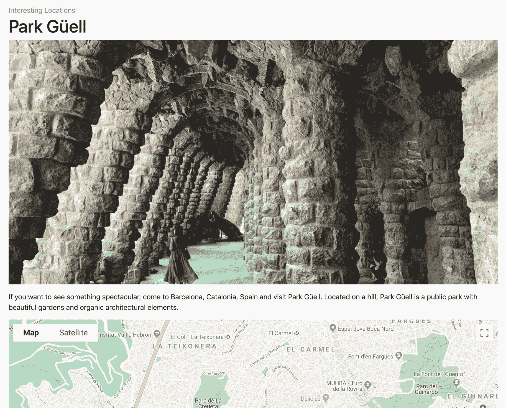
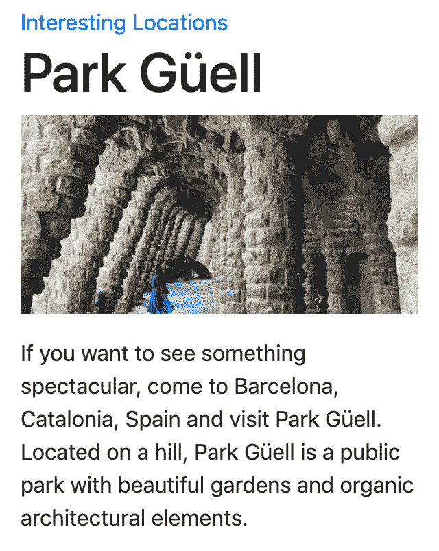
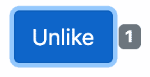
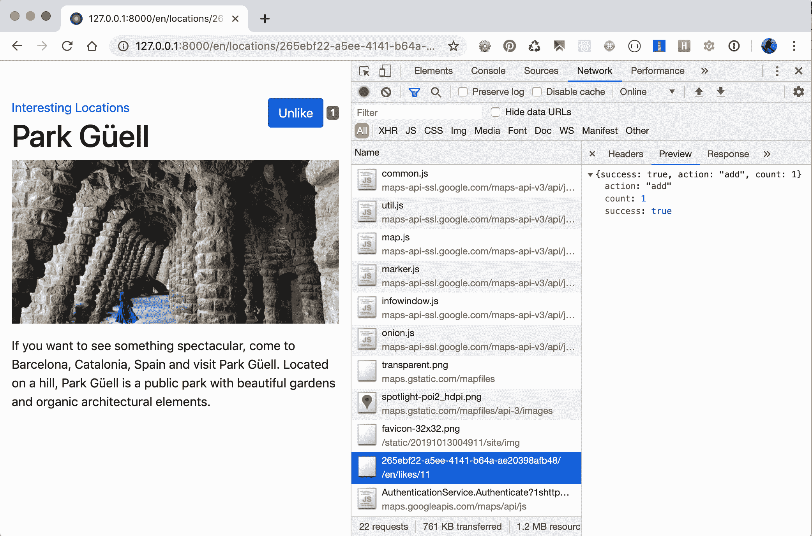

# 模板和 JavaScript

在本章中，我们将介绍以下主题：

*   排列 base.html 模板
*   使用 Django Sekizai
*   在 JavaScript 中公开设置
*   使用 HTML5 数据属性
*   提供响应性图像（env）$python manage.py
*   实现连续滚动
*   在模式对话框中打开对象详细信息
*   实现 Like 小部件
*   通过 Ajax 上传图像

# 介绍

静态网站对于静态内容非常有用，例如传统文档、在线书籍和教程；然而，今天，大多数交互式 web 应用程序和平台如果想要脱颖而出并为访问者提供最佳用户体验，就必须具有动态组件。在本章中，您将学习如何将 JavaScript 和 CSS 与 Django 模板一起使用。我们将使用 Bootstrap4 前端框架进行响应性布局，使用 jQueryJavaScript 框架进行生产性脚本编写。

# 技术要求

与前面一样，要使用本章的代码，您需要 Python、MySQL 或 PostgreSQL 数据库的最新稳定版本，以及带有虚拟环境的 Django 项目。有些配方需要特定的 Python 依赖项。其中一些需要额外的 JavaScript 库。您将在本章后面看到每个配方的要求。

您可以在 GitHub 存储库的[目录中找到本章的所有代码 https://github.com/PacktPublishing/Django-3-Web-Development-Cookbook-Fourth-Edition](https://github.com/PacktPublishing/Django-3-Web-Development-Cookbook-Fourth-Edition) 。

# 排列 base.html 模板

当您开始使用模板时，首先要做的事情之一是创建`base.html`样板，该样板将被项目中的大多数页面模板扩展。在本食谱中，我们将演示如何为多语言 HTML5 网站创建这样一个模板，并考虑响应性。

响应式网站是指那些为所有设备提供相同基本内容的网站，无论访问者使用的是桌面浏览器、平板电脑还是手机，其样式都与视口相适应。这与自适应网站不同，在自适应网站中，服务器尝试根据用户代理确定设备类型，然后根据用户代理的分类方式提供完全不同的内容、标记甚至功能。

# 准备

在项目中创建`templates`目录，并在设置中设置模板目录以包含它，如下所示：

```py
# myproject/settings/_base.py TEMPLATES = [
    {
        "BACKEND": "django.template.backends.django.DjangoTemplates",
        "DIRS": [os.path.join(BASE_DIR, "myproject", "templates")],
        "APP_DIRS": True,
        "OPTIONS": {
            "context_processors": [
                "django.template.context_processors.debug",
                "django.template.context_processors.request",
                "django.contrib.auth.context_processors.auth",
                "django.contrib.messages.context_processors.messages",
                "django.template.context_processors.media",
                "django.template.context_processors.static",
            ]
        },
    }
]
```

# 怎么做。。。

请执行以下步骤：

1.  在模板的根目录中，创建一个包含以下内容的`base.html`文件：

```py
{# base.html #}
<!doctype html>

<html lang="en">
<head>
    <meta charset="utf-8" />
    <meta name="viewport" content="width=device-width, initial-
     scale=1, shrink-to-fit=no" />
    <title></title>
    
 

    <link rel="stylesheet"
          href="https://stackpath.bootstrapcdn.com/bootstrap
           /4.3.1/css/bootstrap.min.css"
          integrity="sha384-ggOyR0iXCbMQv3Xipma34MD+dH/1fQ784
           /j6cY/iJTQUOhcWr7x9JvoRxT2MZw1T"
          crossorigin="anonymous" />
    <link rel="stylesheet"
          href=""
          crossorigin="anonymous" />

    
    
</head>
<body>
    
    <div class="container my-5">
 
 <div class="row">
 <div class="col-lg-4">
                 </div>
 <div class="col-lg-8">
                 </div>
 </div>
 
 </div>
    
    <script src="https://code.jquery.com/jquery-3.4.1.min.js"
            crossorigin="anonymous"></script>
    <script src="https://cdnjs.cloudflare.com/ajax/libs/popper.js
     /1.14.7/umd/popper.min.js"
            integrity="sha384-UO2eT0CpHqdSJQ6hJty5KVphtPhzWj
             9WO1clHTMGa3JDZwrnQq4sF86dIHNDz0W1"
            crossorigin="anonymous"></script>
    <script src="https://stackpath.bootstrapcdn.com/bootstrap
     /4.3.1/js/bootstrap.min.js"
            integrity="sha384-JjSmVgyd0p3pXB1rRibZUAYoIIy6OrQ6Vrj
             IEaFf/nJGzIxFDsf4x0xIM+B07jRM"
            crossorigin="anonymous"></script>
    
    
</body>
</html>
```

2.  在`misc/includes`下，创建一个包含 favicon 所有版本的模板：

```py
{# misc/includes/favicon.html #}

<link rel="icon" type="image/png" href="" sizes="32x32"/>
<link rel="icon" type="image/png" href="" sizes="16x16"/>
```

favicon 是一个小图像，我们通常在浏览器选项卡、最近访问的网站的平铺以及桌面上的快捷方式中看到。您可以使用其中一个在线生成器根据不同用例、浏览器和平台的徽标生成不同版本的 favicon。我们最喜欢的 favicon 发电机是[https://favicomatic.com/](https://favicomatic.com/) 和[https://realfavicongenerator.net/](https://realfavicongenerator.net/) 。

3.  创建带有网站页眉和页脚的模板`misc/includes/header.html`和`misc/includes/footer.html`。现在，您可以在那里创建空文件。

# 它是如何工作的。。。

基本模板包含 HTML 文档的`<head>`和`<body>`部分，以及网站每个页面上重复使用的所有细节。根据 web 设计要求，您可以为不同的布局使用其他基础模板。例如，我们可以添加`base_simple.html`文件，该文件具有相同的 HTML`<head>`部分和非常简约的`<body>`部分，这可以用于登录屏幕、密码重置或其他简单页面。您也可以为其他布局使用单独的基础模板，例如单列、两列和三列布局，其中每个模板都扩展了`base.html`并根据需要覆盖块。

让我们来看看前面定义的`base.html`模板的细节。以下是`<head>`部分的详细信息：

*   我们将 UTF-8 定义为支持多语言内容的默认编码。
*   然后，我们有了视口定义，它将在浏览器中缩放网站以使用全宽。这对于使用引导前端框架创建特定屏幕布局的小屏幕设备是必要的。
*   当然，在搜索引擎的浏览器选项卡和搜索结果中使用了一个可自定义的网站标题。
*   然后我们有一个元标记块，可以用于**搜索引擎优化**（**搜索引擎优化**）、Open Graph 和 Twitter 卡。
*   然后我们包括不同格式和大小的 favicon。
*   我们包括默认引导和自定义网站样式。我们加载引导 CSS，因为我们希望有响应性的布局，这也将规范化所有元素的基本样式，以实现跨浏览器的一致性。
*   最后，我们为元标记、样式表和`<head>`部分可能需要的任何其他内容提供了可扩展的块。

以下是`<body>`部分的详细信息：

*   首先，我们包括网站的标题。在那里你可以放置你的徽标、网站标题和主导航。
*   然后，我们有一个包含内容块占位符的主容器，它将通过扩展模板来填充。
*   容器内有`content`块，包含`sidebar`和`main`块。在子模板中，当我们需要带有侧边栏的布局时。我们将覆盖`sidebar`和`main`块，但是，当我们需要全宽内容时，我们将覆盖`content`块。
*   然后，我们包括网站的页脚。在这里，您可以获得版权信息和重要元页面的链接，如隐私政策、使用条款、联系方式等。
*   然后加载 jQuery 和引导脚本。可扩展 JavaScript 块包含在`<body>`末尾，遵循页面加载性能的最佳实践，非常类似于`<head>`中包含的样式表。
*   最后，我们还有用于额外 JavaScript 和额外 HTML 的块，例如用于 JavaScript 或隐藏模式对话框的 HTML 模板，我们将在本章后面探讨。

我们创建的基本模板决不是静态的不可更改的模板。您可以修改标记结构，或向其中添加所需的元素，例如，主体属性的模板块、Google 分析代码片段、通用 JavaScript 文件、iPhone 书签的 Apple touch 图标、Open Graph meta 标记、Twitter 卡标记、schema.org 属性等。您可能还希望根据项目的要求定义其他块，甚至可能包装正文的整个内容，以便可以在子模板中覆盖它。

# 另见

*   *使用 Django Sekizai*配方
*   JavaScript 配方中的*公开设置*

# 使用 Django Sekizai

在 Django 模板中，通常使用模板继承覆盖父模板中的块，以将样式或脚本包含到 HTML 文档中。这意味着每个视图的每个主模板都应该知道其中的所有内容；但是，有时让包含的模板决定加载什么样式和脚本要方便得多。用 Django Sekizai 可以做到这一点，我们将在本食谱中使用它。

# 准备

在开始制作配方之前，请按照以下步骤进行准备：

1.  将`django-classy-tags`和`django-sekizai`安装到您的虚拟环境中（并将它们添加到`requirements/_base.txt`：

```py
(env)$ pip install -e git+https://github.com/divio/django-classy-tags.git@4c94d0354eca1600ad2ead9c3c151ad57af398a4#egg=django-classy-tags
(env)$ pip install django-sekizai==1.0.0
```

2.  然后将`sekizai`添加到设置中已安装的应用程序：

```py
# myproject/settings/_base.py
INSTALLED_APPS = [
    # …
    "sekizai",
    # …
]
```

3.  接下来，将`sekizai`上下文处理器添加到设置中的模板配置中：

```py
# myproject/settings/_base.py
TEMPLATES = [
    {
        "BACKEND": 
        "django.template.backends.django.DjangoTemplates",
        "DIRS": [os.path.join(BASE_DIR, "myproject", "templates")],
        "APP_DIRS": True,
        "OPTIONS": {
            "context_processors": [
                "django.template.context_processors.debug",
                "django.template.context_processors.request",
                "django.contrib.auth.context_processors.auth",
                "django.contrib.messages.context_processors
                 .messages",
                "django.template.context_processors.media",
                "django.template.context_processors.static",
 "sekizai.context_processors.sekizai",
            ]
        },
    }
]
```

# 怎么做。。。

按照以下步骤完成配方：

1.  在`base.html`模板的开头，加载`sekizai_tags`库：

```py
{# base.html #}
<!doctype html>

```

2.  在同一个文件中，在`<head>`部分末尾添加模板标签``，如下所示：

```py
    
    
    
</head>
```

3.  然后，在`<body>`部分的末尾，添加模板标签``，如下所示：

```py
    
    
    
</body>
```

4.  现在，在任何包含的模板中，当您想要添加一些样式或 JavaScript 时，请按如下方式使用``模板标记：

```py


<div>Sample widget</div>
 
<link rel="stylesheet" href=""/>



<script src=""></script>

```

# 它是如何工作的。。。

Django Sekizai 使用``模板标记中包含的模板、使用模板呈现的自定义模板标记或表单小部件的模板。``模板标记定义了我们想要添加 HTML 内容的 Sekizai 块。

当您向 Sekizai 块添加某个内容时，`django-sekizai`只会在其中包含一次。这意味着您可以包含多个相同类型的小部件，但它们的 CSS 和 JavaScript 将只加载和执行一次。

# 另见

*   *实现类似小部件*的配方
*   *通过 Ajax*上传图片

# 在 JavaScript 中公开设置

Django 项目在设置文件中设置了它们的配置，例如`myproject/settings/dev.py`用于开发环境；我们在[第一章](01.html)*【Django 3.0 入门】中的*开发、测试、登台和生产环境的配置设置*配方中对此进行了描述。其中一些配置值可能对浏览器中的功能也很有用，因此它们也需要在 JavaScript 中设置。我们需要一个位置来定义我们的项目设置，因此，在这个配方中，我们将看到如何将一些配置值从 Django 服务器传递到浏览器。*

# 准备

确保`TEMPLATES['OPTIONS']['context_processors']`设置中包含`request`上下文处理器，如下所示：

```py
# myproject/settings/_base.py
TEMPLATES = [
    {
        "BACKEND": "django.template.backends.django.DjangoTemplates",
        "DIRS": [os.path.join(BASE_DIR, "myproject", "templates")],
        "APP_DIRS": True,
        "OPTIONS": {
            "context_processors": [
                "django.template.context_processors.debug",
"django.template.context_processors.request",
                "django.contrib.auth.context_processors.auth",
                "django.contrib.messages.context_processors.messages",
                "django.template.context_processors.media",
                "django.template.context_processors.static",
                "sekizai.context_processors.sekizai",
            ]
        },
    }
]
```

如果您还没有创建`core`应用程序，您还应该创建该应用程序，并将其放置在设置中的`INSTALLED_APPS`下：

```py
INSTALLED_APPS = [
    # …
    "myproject.apps.core",
    # …
]
```

# 怎么做。。。

按照以下步骤创建并包含 JavaScript 设置：

1.  在`core`应用程序的`views.py`中，创建一个返回 JavaScript 内容类型响应的`js_settings()`视图，如下代码所示：

```py
# myproject/apps/core/views.py import json
from django.http import HttpResponse
from django.template import Template, Context
from django.views.decorators.cache import cache_page
from django.conf import settings

JS_SETTINGS_TEMPLATE = """
window.settings = JSON.parse('{{ json_data|escapejs }}');
"""

@cache_page(60 * 15)
def js_settings(request):
    data = {
        "MEDIA_URL": settings.MEDIA_URL,
        "STATIC_URL": settings.STATIC_URL,
        "DEBUG": settings.DEBUG,
        "LANGUAGES": settings.LANGUAGES,
        "DEFAULT_LANGUAGE_CODE": settings.LANGUAGE_CODE,
        "CURRENT_LANGUAGE_CODE": request.LANGUAGE_CODE,
    }
    json_data = json.dumps(data)
    template = Template(JS_SETTINGS_TEMPLATE)
    context = Context({"json_data": json_data})
    response = HttpResponse(
        content=template.render(context),
        content_type="application/javascript; charset=UTF-8",
    )
    return response
```

2.  将此视图插入 URL 配置：

```py
# myproject/urls.py from django.conf.urls.i18n import i18n_patterns
from django.urls import include, path
from django.conf import settings
from django.conf.urls.static import static

from myproject.apps.core import views as core_views

urlpatterns = i18n_patterns(
    # other URL configuration rules…
 path("js-settings/", core_views.js_settings, 
     name="js_settings"),
)

urlpatterns += static(settings.STATIC_URL, document_root=settings.STATIC_ROOT)
urlpatterns += static("/media/", document_root=settings.MEDIA_ROOT)
```

3.  通过将基于 JavaScript 的视图添加到`base.html`模板的末尾，在前端加载该视图：

```py
{# base.html #}    

    {# … #}

    <script src=""></script>
    
    
    
</body>
</html>
```

4.  现在，我们可以访问任意 JavaScript 文件中的指定设置，如下所示：

```py
if (window.settings.DEBUG) {
    console.warn('The website is running in DEBUG mode!');
}
```

# 它是如何工作的。。。

在`js_settings`视图中，我们构建了一个要传递给浏览器的设置字典，将字典转换为 JSON，并呈现了一个 JavaScript 文件模板，该文件解析 JSON 并将结果分配给`window.settings`变量。通过将字典转换为 JSON 字符串并在 JavaScript 文件中对其进行解析，我们可以确保在 Python 中允许但在 JavaScript 中无效的最后一个元素后面加逗号不会有任何问题。

呈现的 JavaScript 文件如下所示：

```py
# http://127.0.0.1:8000/en/js-settings/
window.settings = JSON.parse('{\u0022MEDIA_URL\u0022: \u0022http://127.0.0.1:8000/media/\u0022, \u0022STATIC_URL\u0022: \u0022/static/20191001004640/\u0022, \u0022DEBUG\u0022: true, \u0022LANGUAGES\u0022: [[\u0022bg\u0022, \u0022Bulgarian\u0022], [\u0022hr\u0022, \u0022Croatian\u0022], [\u0022cs\u0022, \u0022Czech\u0022], [\u0022da\u0022, \u0022Danish\u0022], [\u0022nl\u0022, \u0022Dutch\u0022], [\u0022en\u0022, \u0022English\u0022], [\u0022et\u0022, \u0022Estonian\u0022], [\u0022fi\u0022, \u0022Finnish\u0022], [\u0022fr\u0022, \u0022French\u0022], [\u0022de\u0022, \u0022German\u0022], [\u0022el\u0022, \u0022Greek\u0022], [\u0022hu\u0022, \u0022Hungarian\u0022], [\u0022ga\u0022, \u0022Irish\u0022], [\u0022it\u0022, \u0022Italian\u0022], [\u0022lv\u0022, \u0022Latvian\u0022], [\u0022lt\u0022, \u0022Lithuanian\u0022], [\u0022mt\u0022, \u0022Maltese\u0022], [\u0022pl\u0022, \u0022Polish\u0022], [\u0022pt\u0022, \u0022Portuguese\u0022], [\u0022ro\u0022, \u0022Romanian\u0022], [\u0022sk\u0022, \u0022Slovak\u0022], [\u0022sl\u0022, \u0022Slovene\u0022], [\u0022es\u0022, \u0022Spanish\u0022], [\u0022sv\u0022, \u0022Swedish\u0022]], \u0022DEFAULT_LANGUAGE_CODE\u0022: \u0022en\u0022, \u0022CURRENT_LANGUAGE_CODE\u0022: \u0022en\u0022}');
```

# 另见

*   [第一章](01.html)*中的*为开发、测试、登台和生产环境配置设置*配方，Django 3.0*入门
*   *整理 base.html 模板*配方
*   使用 HTML5 数据属性的*配方*

# 使用 HTML5 数据属性

HTML5 引入了`data-*`属性，用于将特定 HTML 元素的数据从 Web 服务器传递到 JavaScript 和 CSS。在这个配方中，我们将看到一种有效地将数据从 Django 附加到自定义 HTML5 数据属性的方法，然后用一个实际示例描述如何从 JavaScript 读取数据：我们将在指定的地理位置呈现一个带有标记的 Google 地图；单击标记时，我们将在信息窗口中显示地址。

# 准备

要做好准备，请执行以下步骤：

1.  本章和以下章节使用带有 PostGIS 扩展的 PostgreSQL 数据库。要了解如何安装 PostGIS 扩展，请参阅[中的官方文档 https://docs.djangoproject.com/en/2.2/ref/contrib/gis/install/postgis/](https://docs.djangoproject.com/en/2.2/ref/contrib/gis/install/postgis/) 。
2.  确保为 Django 项目使用`postgis`数据库后端：

```py
# myproject/settings/_base.py
DATABASES = {
    "default": {
 "ENGINE": "django.contrib.gis.db.backends.postgis",
        "NAME": get_secret("DATABASE_NAME"),
        "USER": get_secret("DATABASE_USER"),
        "PASSWORD": get_secret("DATABASE_PASSWORD"),
        "HOST": "localhost",
        "PORT": "5432",
    }
}
```

3.  创建具有`Location`模型的`locations`应用程序。它将包含 UUID 主键、名称、街道地址、城市、国家和邮政编码的字符字段、PostGIS 相关的`Geoposition`字段和`Description`文本字段：

```py
# myproject/apps/locations/models.py import uuid
from collections import namedtuple
from django.contrib.gis.db import models
from django.urls import reverse
from django.conf import settings
from django.utils.translation import gettext_lazy as _
from myproject.apps.core.models import (
    CreationModificationDateBase, UrlBase
)

COUNTRY_CHOICES = getattr(settings, "COUNTRY_CHOICES", [])

Geoposition = namedtuple("Geoposition", ["longitude", "latitude"])

class Location(CreationModificationDateBase, UrlBase):
    uuid = models.UUIDField(primary_key=True, default=None, 
     editable=False)
    name = models.CharField(_("Name"), max_length=200)
    description = models.TextField(_("Description"))
    street_address = models.CharField(_("Street address"), 
     max_length=255, blank=True)
    street_address2 = models.CharField(
        _("Street address (2nd line)"), max_length=255, blank=True
    )
    postal_code = models.CharField(_("Postal code"), 
     max_length=255, blank=True)
    city = models.CharField(_("City"), max_length=255, 
     blank=True)
    country = models.CharField(
        _("Country"), choices=COUNTRY_CHOICES, max_length=255, 
           blank=True
    )
    geoposition = models.PointField(blank=True, null=True)

    class Meta:
        verbose_name = _("Location")
        verbose_name_plural = _("Locations")

    def __str__(self):
        return self.name

    def get_url_path(self):
        return reverse("locations:location_detail", kwargs={"pk": 
         self.pk})
```

4.  在创建位置时覆盖`save()`方法以生成唯一的 UUID 字段值：

```py
def save(self, *args, **kwargs):
        if self.pk is None:
            self.pk = uuid.uuid4()
        super().save(*args, **kwargs)
```

5.  创建方法以在一个字符串中获取位置的完整地址：

```py
 def get_field_value(self, field_name):
        if isinstance(field_name, str):
            value = getattr(self, field_name)
            if callable(value):
                value = value()
            return value
        elif isinstance(field_name, (list, tuple)):
            field_names = field_name
            values = []
            for field_name in field_names:
                value = self.get_field_value(field_name)
                if value:
                    values.append(value)
            return " ".join(values)
        return ""

    def get_full_address(self):
        field_names = [
            "name",
            "street_address",
            "street_address",
            ("postal_code", "city"),
            "get_country_display",
        ]
        full_address = []
        for field_name in field_names:
            value = self.get_field_value(field_name)
            if value:
                full_address.append(value)
        return ", ".join(full_address)
```

6.  通过`latitude`和`longitude`创建获取或设置地理位置的函数-在数据库中，`geoposition`保存为`Point`字段。我们可以在 Django shell、表单、管理命令、数据迁移和其他地方使用这些功能：

```py
 def get_geoposition(self):
        if not self.geoposition:
            return None
        return Geoposition(
            self.geoposition.coords[0], self.geoposition.coords[1]
        )

    def set_geoposition(self, longitude, latitude): from django.contrib.gis.geos import Point
        self.geoposition = Point(longitude, latitude, srid=4326)
```

7.  请记住在更新模型后为应用程序进行迁移并运行迁移。
8.  创建模型管理以添加和更改位置。我们将使用`gis`应用程序中的`OSMGeoAdmin`，而不是标准`ModelAdmin`。它将使用`OpenStreetMap`呈现一张地图来设置`geoposition`，可以在[找到 https://www.openstreetmap.org](https://www.openstreetmap.org) ：

```py
# myproject/apps/locations/admin.py from django.contrib.gis import admin
from .models import Location

@admin.register(Location)
class LocationAdmin(admin.OSMGeoAdmin):
    pass
```

9.  在管理中添加一些位置以供进一步使用。

我们也将在进一步的食谱中使用和发展这个`locations`应用程序。

# 怎么做。。。

请执行以下步骤：

1.  注册谷歌地图 API 密钥。您可以在[的谷歌开发者文档中了解如何以及在何处执行此操作 https://developers.google.com/maps/documentation/javascript/get-api-key](https://developers.google.com/maps/documentation/javascript/get-api-key) 。

2.  将 Google Maps API 密钥添加到机密中，然后在设置中读取：

```py
# myproject/settings/_base.py # …GOOGLE_MAPS_API_KEY = get_secret("GOOGLE_MAPS_API_KEY")
```

3.  在核心应用程序中，创建一个上下文处理器以向模板公开`GOOGLE_MAPS_API_KEY`：

```py
# myproject/apps/core/context_processors.py from django.conf import settings

def google_maps(request):
    return {
        "GOOGLE_MAPS_API_KEY": settings.GOOGLE_MAPS_API_KEY,
    }
```

4.  请参阅模板设置中的此上下文处理器：

```py
# myproject/settings/_base.py
TEMPLATES = [
    {
        "BACKEND": 
        "django.template.backends.django.DjangoTemplates",
        "DIRS": [os.path.join(BASE_DIR, "myproject", "templates")],
        "APP_DIRS": True,
        "OPTIONS": {
            "context_processors": [
                "django.template.context_processors.debug",
                "django.template.context_processors.request",
                "django.contrib.auth.context_processors.auth",
                "django.contrib.messages.context_processors
                 .messages",
                "django.template.context_processors.media",
                "django.template.context_processors.static",
                "sekizai.context_processors.sekizai",
 "myproject.apps.core.context_processors
                 .google_maps",
            ]
        },
    }
]
```

5.  为以下位置创建列表和详图视图：

```py
# myproject/apps/locations/views.py from django.views.generic import ListView, DetailView
from .models import Location

class LocationList(ListView):
    model = Location
    paginate_by = 10

class LocationDetail(DetailView):
    model = Location
    context_object_name = "location"
```

6.  为`locations`应用程序创建 URL 配置：

```py
# myproject/apps/locations/urls.py from django.urls import path
from .views import LocationList, LocationDetail

urlpatterns = [
    path("", LocationList.as_view(), name="location_list"),
    path("<uuid:pk>/", LocationDetail.as_view(), 
     name="location_detail"),
]
```

7.  在项目的 URL 配置中包括位置的 URL：

```py
# myproject/urls.py from django.contrib import admin
from django.conf.urls.i18n import i18n_patterns
from django.urls import include, path
from django.conf import settings
from django.conf.urls.static import static
from django.shortcuts import redirect

from myproject.apps.core import views as core_views

urlpatterns = i18n_patterns(
    path("", lambda request: redirect("locations:location_list")),
    path("admin/", admin.site.urls),
    path("accounts/", include("django.contrib.auth.urls")),
    path("locations/", include(("myproject.apps.locations.urls", 
    "locations"), namespace="locations")),
    path("js-settings/", core_views.js_settings, 
     name="js_settings"),
)
urlpatterns += static(settings.STATIC_URL, document_root=settings.STATIC_ROOT)
urlpatterns += static("/media/", document_root=settings.MEDIA_ROOT)
```

8.  现在是为位置列表和位置详细视图创建模板的时候了。目前位置列表将尽可能简单；我们只需要它能够浏览位置并获得位置详细视图。

```py
{# locations/location_list.html #} 



    <h1></h1>
    
        <ul>
            
                <li><a href="{{ location.get_url_path }}">
                    {{ location.name }}
 </a></li>
            
        </ul>
    
        <p></p>
    

```

9.  接下来，我们通过扩展`base.html`并覆盖`content`块来创建位置详细信息模板：

```py
{# locations/location_detail.html #} 



    <a href=""></a>
    <h1 class="map-title">{{ location.name }}</h1>
    <div class="my-3">
        {{ location.description|linebreaks|urlize }}
    </div>
    
 <div id="map" class="mb-3"
 data-latitude="{{ geoposition.latitude|stringformat:"f" }}"
 data-longitude="{{ geoposition.longitude|stringformat:"f" }}"
 data-address="{{ location.get_full_address }}"></div>
 

```

10.  同样在同一模板中，覆盖`js`块：

```py

 <script src=""></script>
 <script async defer src="https://maps-api-
  ssl.google.com/maps/api/js?key={{ GOOGLE_MAPS_API_KEY }}&callback=Location.init"></script>

```

11.  除了模板之外，我们还需要一个 JavaScript 文件，该文件将读取 HTML5 数据属性，并使用它们渲染带有标记的地图：

```py
/* site_static/site/js/location_detail.js */ (function(window) {
    "use strict";

    function Location() {
        this.case = document.getElementById("map");
        if (this.case) {
            this.getCoordinates();
            this.getAddress();
            this.getMap();
            this.getMarker();
            this.getInfoWindow();
        }
    }

    Location.prototype.getCoordinates = function() {
        this.coords = {
            lat: parseFloat(this.case.getAttribute("data-
             latitude")),
            lng: parseFloat(this.case.getAttribute("data-
             longitude"))
        };
    };

    Location.prototype.getAddress = function() {
        this.address = this.case.getAttribute("data-address");
    };

    Location.prototype.getMap = function() {
        this.map = new google.maps.Map(this.case, {
            zoom: 15,
            center: this.coords
        });
    };

    Location.prototype.getMarker = function() {
        this.marker = new google.maps.Marker({
            position: this.coords,
            map: this.map
        });
    };

    Location.prototype.getInfoWindow = function() {
        var self = this;
        var wrap = this.case.parentNode;
        var title = wrap.querySelector(".map-title").textContent;

        this.infoWindow = new google.maps.InfoWindow({
            content: "<h3>"+title+"</h3><p>"+this.address+"</p>"
        });

        this.marker.addListener("click", function() {
            self.infoWindow.open(self.map, self.marker);
        });
    };

    var instance;
    Location.init = function() {
        // called by Google Maps service automatically once loaded
        // but is designed so that Location is a singleton
        if (!instance) {
            instance = new Location();
        }
    };

    // expose in the global namespace
    window.Location = Location;
}(window));
```

12.  为了更好地显示地图，我们需要设置一些 CSS，如以下代码所示：

```py
/* site_static/site/css/style.css */ #map {
    box-sizing: padding-box;
    height: 0;
    padding-bottom: calc(9 / 16 * 100%); /* 16:9 aspect ratio */
    width: 100%;
}
@media screen and (max-width: 480px) {
    #map {
        display: none; /* hide on mobile devices (esp. portrait) */
    }
}
```

# 它是如何工作的。。。

如果运行本地开发服务器并浏览到某个位置的详细信息视图，则将导航到带有地图和标记的页面。单击标记时，将打开一个带有地址信息的弹出窗口。这将如下所示：


由于在移动设备上滚动地图可能会因滚动内滚动问题而出现问题，因此我们选择在小屏幕上隐藏地图（小于或等于 480 px 宽度），以便在向下调整屏幕大小时，地图最终变得不可见，如下所示：


让我们看一下代码。在最初的几个步骤中，我们添加了 GoogleMapsAPI 键，并将其公开给所有模板。然后我们创建视图来浏览位置，并将它们插入 URL 配置。然后我们创建了列表和详细信息模板。

`DetailView`的`template_name`默认值来自模型名称的小写版本，加上`detail`；因此我们的模板名为`location_detail.html`。如果我们想使用不同的模板，我们可以为视图指定一个`template_name`属性。同样地，`ListView`的`template_name`默认值来自模型名称的小写版本，加上`list`，因此命名为`location_list.html`。

在详细信息模板中，我们有位置标题和描述，后面是一个带有`id="map"`的`<div>`元素，以及`data-latitude`、`data-longitude`和`data-address`自定义属性。这些构成了`content`块元素。在`<body>`末尾的`js`块中添加了两个`<script>`标记—一个是下面描述的`location_detail.js`，另一个是 Google Maps API 脚本，我们已将 Maps API 键和 API 加载时要调用的回调名称传递给该脚本。

在 JavaScript 文件中，我们使用原型函数创建了一个`Location`类。这个函数有一个静态的`init()`方法，作为对 Google Maps API 的回调。调用`init()`时，调用构造函数创建一个新的单例`Location`实例。在构造函数中，将采取一系列步骤来设置地图及其功能：

1.  首先，映射大小写（容器）是通过其 ID 找到的。只有找到该元素，我们才能继续。
2.  接下来，我们使用`data-latitude`和`data-longitude`属性查找地理坐标，并将它们作为位置的`coords`存储在字典中。此对象的形式为 Google Maps API 所理解，稍后将使用。
3.  接下来读取`data-address`并直接存储为该位置的 address 属性。
4.  从这里，我们开始建造东西，从地图开始。为了确保位置可见，我们使用前面从数据属性中提取的`coords`设置中心。
5.  标记使位置在地图上清晰可见，使用相同的`coords`定位。
6.  最后，我们建立了一个信息窗口，它是一种弹出式气泡，可以使用 API 直接显示在地图上。除了前面检索到的地址之外，我们还根据模板中给出的`.map-title`类查找位置标题。这是作为一个`<h1>`标题添加到窗口中，然后是作为`<p>`段落的地址。为了允许显示窗口，我们向将打开窗口的标记添加了一个 click 事件侦听器。

# 另见

*   JavaScript 配方中的*公开设置*
*   *整理 base.html 模板*配方
*   *提供响应图像*配方
*   模式对话框配方中的*打开对象详细信息*
*   [第 6 章](06.html)*中*将地图插入变更单*配方，模型管理*

# 提供快速响应的图像

随着响应式网站成为常态，在为移动设备和台式计算机提供相同内容时，出现了许多性能问题。减少小型设备上响应站点的加载时间的一个非常简单的方法是提供较小的图像。这就是响应图像的关键组件`srcset`和`sizes`属性发挥作用的地方。

# 准备

让我们从前面配方中使用的`locations`应用程序开始。

# 怎么做。。。

按照以下步骤添加响应图像：

1.  首先，让我们将`django-imagekit`安装到您的虚拟环境中，并将其添加到`requirements/_base.txt`中。我们将使用它将原始图像调整为特定大小：

```py
(env)$ pip install django-imagekit==4.0.2

```

2.  将设置中的`"imagekit"`放入`INSTALLED_APPS`：

```py
# myproject/settings/_base.py INSTALLED_APPS = [
    # …
    "imagekit",
    # …
]
```

3.  在`models.py`文件的开头，让我们导入一些用于图像版本的库，并定义一个负责图片文件的目录和文件名的函数：

```py
# myproject/apps/locations/models.py import contextlib
import os
# …
from imagekit.models import ImageSpecField
from pilkit.processors import ResizeToFill
# …

def upload_to(instance, filename):
    now = timezone_now()
    base, extension = os.path.splitext(filename)
    extension = extension.lower()
    return f"locations/{now:%Y/%m}/{instance.pk}{extension}"
```

4.  现在，让我们在同一个文件中的`Location`模型中添加一个`picture`字段以及图像版本定义：

```py
class Location(CreationModificationDateBase, UrlBase):
    # …
    picture = models.ImageField(_("Picture"), upload_to=upload_to)
    picture_desktop = ImageSpecField(
        source="picture",
        processors=[ResizeToFill(1200, 600)],
        format="JPEG",
        options={"quality": 100},
    )
    picture_tablet = ImageSpecField(
        source="picture", processors=[ResizeToFill(768, 384)], 
         format="PNG"
    )
    picture_mobile = ImageSpecField(
        source="picture", processors=[ResizeToFill(640, 320)], 
         format="PNG"
    )
```

5.  然后，在删除模型实例时，覆盖`Location`模型的`delete()`方法，删除生成的版本：

```py
def delete(self, *args, **kwargs):
    from django.core.files.storage import default_storage

    if self.picture:
        with contextlib.suppress(FileNotFoundError):
            default_storage.delete(self.picture_desktop.path)
            default_storage.delete(self.picture_tablet.path)
            default_storage.delete(self.picture_mobile.path)
        self.picture.delete()

    super().delete(*args, **kwargs)
```

6.  进行并运行迁移，将新的`picture`字段添加到数据库架构中。
7.  更新位置详细信息模板以包括图像：

```py
{# locations/location_detail.html #}




    <a href=""></a>
    <h1 class="map-title">{{ location.name }}</h1>
 
 <picture class="img-fluid">
 <source
                media="(max-width: 480px)"
                srcset="{{ location.picture_mobile.url }}" />
 <source
                media="(max-width: 768px)"
                srcset="{{ location.picture_tablet.url }}" />
 
 </picture>
     {# … #}



    {# … #}

```

8.  最后，为管理中的位置添加一些图像。

# 它是如何工作的。。。

响应图像功能强大，其基本功能是根据媒体规则提供不同的图像，这些媒体规则指示每个图像将显示的显示器的功能。我们在这里做的第一件事就是添加了`django-imagekit`应用程序，这使我们能够动态生成所需的不同图像。

显然，我们还需要原始图像源，因此在我们的`Location`模型中，我们添加了一个名为`picture`的图像字段。在`upload_to()`函数中，我们构建了当年和当月的上传路径和文件名、位置的 UUID 以及与上传文件相同的文件扩展名。我们还将图像版本规范定义如下：

*   `picture_desktop`尺寸为 1200 x 600，用于桌面布局
*   `picture_tablet`尺寸为 768 x 384，用于片剂
*   `picture_mobile`尺寸为 640 x 320，用于智能手机

在位置的`delete()`方法中，我们检查`picture`字段是否有任何值，然后在删除位置之前尝试删除它及其图像版本。如果在磁盘上找不到文件，我们使用`contextlib.suppress(FileNotFoundError)`以静默方式忽略任何错误。

最有趣的工作发生在模板中。当一张位置图存在时，我们构造我们的`<picture>`元素。从表面上看，这基本上是一个容器。事实上，除了模板末尾出现的默认``标记之外，它里面可能什么都没有，尽管这不是很有用。除了默认图像之外，我们还为其他宽度生成缩略图——480 像素和 768 像素，然后这些缩略图用于构建额外的`<source>`元素。每个`<source>`元素都有`media`规则，其中包含从`srcset`属性值中选择图像的条件。在我们的例子中，我们只为每个`<source>`提供一个图像。“位置详细信息”页面现在将包括地图上方的图像，其外观如下所示：



浏览器加载此标记时，将按照一系列步骤确定要加载的图像：

*   依次检查每个`<source>`的`media`规则，查看其中是否有一个与当前视口
    匹配
*   当规则匹配时，读取`srcset`并加载和显示相应的图像 URL
*   如果没有规则匹配，则加载最终默认图像的`src`

因此，较小的图像将加载到较小的视口中。例如，在这里，我们可以看到最小的图像仅为 375 px 宽的视口加载：



对于根本无法理解`<picture>`和`<source>`标记的浏览器，默认图像仍然可以加载，因为它只不过是一个普通的``标记。

# 还有更多。。。

您可以使用响应图像不仅提供目标图像大小，还可以区分像素密度，并提供在任何给定视口大小下为设计明确策划的图像。这就是所谓的艺术指导。如果您有兴趣了解更多信息，**Mozilla 开发者网络**（**MDN**）在[上有一篇关于该主题的详尽文章 https://developer.mozilla.org/en-US/docs/Learn/HTML/Multimedia_and_embedding/Responsive_images](https://developer.mozilla.org/en-US/docs/Learn/HTML/Multimedia_and_embedding/Responsive_images) 。

# 另见

*   *整理 base.html 模板*配方
*   使用 HTML5 数据属性的*配方*
*   模式对话框配方中的*打开对象详细信息*
*   [第 6 章](06.html)*中*将地图插入变更单*配方，模型管理*

# 实现连续滚动

社交网站通常有一个称为连续滚动的功能，也称为无限滚动，作为分页的替代。这里没有单独查看附加项目集的链接，而是有很长的项目列表，当您向下滚动页面时，新项目会自动加载并附加到底部。在这个配方中，我们将看到如何使用 Django 和 jScroll jQuery 插件实现这种效果。

您可以从[下载 jScroll 脚本，还可以找到关于该插件的大量文档 https://jscroll.com/](https://jscroll.com/) 。

# 准备

我们将重用我们在前面的配方中创建的`locations`应用程序。

为了在列表视图中显示一些更有趣的数据，我们将`ratings`字段添加到`Location`模型中，如下所示：

```py
# myproject/apps/locations/models.py # …
RATING_CHOICES = ((1, "★☆☆☆☆"), (2, "★★☆☆☆"), (3, "★★★☆☆"), (4, "★★★★☆"), (5, "★★★★★"))

class Location(CreationModificationDateBase, UrlBase):
    # …

    rating = models.PositiveIntegerField(
        _("Rating"), choices=RATING_CHOICES, blank=True, null=True
    )

    # …

    def get_rating_percentage(self):
 return self.rating * 20 if self.rating is not None else None

```

有必要使用`get_rating_percentage()`方法将评级作为代表的百分比返回。

不要忘记进行并运行迁移，然后在管理中为位置添加一些评级。

# 怎么做。。。

按照以下步骤创建连续滚动页面：

1.  首先，在管理中添加足够的位置。正如您可以从使用 HTML5 数据属性的*配方中看到的，我们将按每页 10 个项目对`LocationList`视图进行分页，因此我们需要至少 11 个位置来查看连续滚动是否如预期的那样工作。*
2.  修改位置列表视图的模板，如下所示：

```py
{# locations/location_list.html #} 



    <div class="row">
        <div class="col-lg-8">
            <h1></h1>
            
                <div class="item-list">
 
                        <a href="{{ location.get_url_path }}"
                           class="item d-block my-3">
                            <div class="card">
                                <div class="card-body">
                                    <div class="float-right">
                                        <div class="rating" aria-
                                          label="
                                           {{ stars }} of 5 stars
                                            ">
                                            <span style="width:{{ 
                                           location.get_rating
                                        _percentage }}%"></span>
                                        </div>
                                    </div>
                                    <p class="card-text">{{ 
                                        location.name }}<br/>
                                        <small>{{ location.city }},

                                         {{location.get_country
                                          _display }}</small>
                                    </p>
                                </div>
                            </div>
                        </a>
 
 
 <div class="text-center">
 <div class="loading-indicator"></div>
 </div>
 <p class="pagination">
 <a class="next-page"
 href="">
 </a>
 </p>
 
                </div>
            
                <p></p>
            
        </div>
        <div class="col-lg-4">
            
        </div>
    </div>

```

3.  在同一模板中，用以下标记覆盖`css`和`js`块：

```py

    <link rel="stylesheet" type="text/css"
          href="">



    <script src="https://cdnjs.cloudflare.com/ajax
     /libs/jscroll/2.3.9/jquery.jscroll.min.js"></script>
    <script src=""></script>

```

4.  作为此模板的最后一步，使用加载指示器的 JavaScript 模板覆盖`extra_body`块：

```py

    <script type="text/template" class="loader">
        <div class="text-center">
            <div class="loading-indicator"></div>
        </div>
    </script>

```

5.  在`locations/includes/navigation.html`处创建页面导航。现在，您可以在那里创建一个空文件。
6.  下一步是通过连续滚动小部件的初始化添加 JavaScript：

```py
/* site_static/site/js/list.js */ jQuery(function ($) {
    var $list = $('.item-list');
    var $loader = $('script[type="text/template"].loader');
    $list.jscroll({
        loadingHtml: $loader.html(),
        padding: 100,
        pagingSelector: '.pagination',
        nextSelector: 'a.next-page:last',
        contentSelector: '.item,.pagination'
    });
});
```

7.  最后，我们将添加一些 CSS，这样就可以使用用户友好的星星来显示评级，而不仅仅是数字：

```py
/* site_static/site/css/rating.css */ .rating {
  color: #c90;
  display: block;
  position: relative;
  margin: 0;
  padding: 0;
  white-space: nowrap;
}

.rating span {
  color: #fc0;
  display: block;
  position: absolute;
  overflow: hidden;
  top: 0;
  left: 0;
  bottom: 0;
  white-space: nowrap;
}

.rating span:before,
.rating span:after {
  display: block;
  position: absolute;
  overflow: hidden;
  left: 0;
  top: 0;
  bottom: 0;
}

.rating:before {
  content: "☆☆☆☆☆";
}

.rating span:after {
  content: "★★★★★";
}
```

8.  在主网站样式的主文件中，为加载指示器添加样式：

```py
/* site_static/site/css/style.css */ /* … */
.loading-indicator {
  display: inline-block;
  width: 45px;
  height: 45px;
}
.loading-indicator:after {
  content: "";
  display: block;
  width: 40px;
  height: 40px;
  border-radius: 50%;
  border: 5px solid rgba(0,0,0,.25);
  border-color: rgba(0,0,0,.25) transparent rgba(0,0,0,.25) 
   transparent;
  animation: dual-ring 1.2s linear infinite;
}
@keyframes dual-ring {
  0% {
    transform: rotate(0deg);
  }
  100% {
    transform: rotate(360deg);
  }
}
```

# 它是如何工作的。。。

当您在浏览器中打开位置列表视图时，页面上将显示视图中设置为`paginate_by`的预定义项目数（即 10 个）。向下滚动时，将自动加载一个附加页面的项目和下一个分页链接，并将其附加到项目容器中。分页链接使用*创建模板标签中的``自定义模板标签修改[第 5 章](05.html)*中的请求查询参数*配方，自定义模板过滤器和标签*根据当前 URL 生成调整后的 URL，但指向正确的下一个页码。如果您的连接速度较慢，则当您滚动到页面底部时，您将看到如下页面，直到下一页的项目加载并附加到列表：


进一步向下滚动，项目的第二页、第三页和以后的页面将加载并附着在底部。这将一直持续到没有更多的页面要加载，这表示最后一个组中没有任何进一步加载的分页链接。

我们在这里使用 Cloudflare CDN URL 加载 jScroll 插件，但是，如果您选择以静态文件的形式在本地下载副本，则使用``查找将脚本添加到模板中。

在初始页面加载时，带有`item-list`CSS 类的元素（包含项目和分页链接）将通过`list.js`中的代码成为 jScroll 对象。事实上，这个实现非常通用，可以使用它来支持按照类似标记结构的任何列表显示的连续滚动。

提供以下选项来定义其功能：

*   `loadingHtml`：设置 JSCROL 在加载新的项目页面时将在列表末尾注入的标记。在我们的例子中，它是一个动画加载指示器，直接从标记中的`<script type="text/template" />`标记中包含的 HTML 中提取。通过赋予这个`type`属性，浏览器将不会像执行普通 JavaScript 那样尝试执行它，并且其中的内容对于用户来说仍然是不可见的。
*   `padding`：当页面的滚动位置在滚动区域末端的该距离内时，应加载新页面。这里，我们将其设置为 100 像素。
*   `pagingSelector`：一个 CSS 选择器，指示`object_list`中的哪些 HTML 元素是分页链接。这些页面将隐藏在浏览器中，jScroll 插件将激活，这样连续滚动就可以接管额外页面的加载，但其他浏览器中的用户仍然可以通过正常单击分页来导航。
*   `nextSelector`：此 CSS 选择器查找要从中读取下一页 URL 的 HTML 元素。
*   `contentSelector`：另一个 CSS 选择器。这指定应从 Ajax 加载的内容中提取哪些 HTML 元素并添加到容器中。

`rating.css`插入 Unicode 星形字符，并将轮廓与填充版本重叠，以创建评级效果。使用与评级值的最大百分比（本例中为 5）相等的宽度，填充的星星在空心星星的顶部覆盖了适当的空间，允许十进制评级。在标记中，有一个`aria-label`属性，其中包含使用屏幕阅读器的用户的评级信息。

最后，`style.css`文件中的 CSS 使用 CSS 动画创建旋转加载指示器。

# 还有更多。。。

侧边栏中有一个用于导航的占位符。请注意，在连续滚动的情况下，项目列表之后的所有辅助导航都应该放在侧栏中，而不是页脚中，因为访问者可能永远不会到达页面的末尾。

# 另见

*   *过滤对象列出[第 3 章](03.html)*中的*配方、表单和视图*
*   [第 3 章](03.html)*中的*管理分页列表*配方，表单和视图*
*   [第 3 章](03.html)*中的*基于类的视图*配方，表单和视图*
*   JavaScript 配方中的*公开设置*
*   *在[第 5 章](05.html)*中创建模板标签修改请求查询参数*配方，定制模板过滤器和标签*

# 在模式对话框中打开对象详细信息

在此配方中，我们将创建指向位置的链接列表，单击该列表后，将打开一个引导模式对话框，其中包含有关位置的一些信息和“了解更多信息…”链接，从而进入位置详细信息页面：


对话框的内容将由 Ajax 加载。对于没有 JavaScript 的访问者，详细信息页面将立即打开，无需此中间步骤。

# 准备

让我们从我们在前面的食谱中创建的`locations`应用程序开始。

确保您有视图、URL 配置以及位置列表和位置详细信息的模板，就像我们之前定义的那样。

# 怎么做。。。

逐个执行这些步骤，将模态对话框添加为列表视图和详图视图之间的中间步骤：

1.  首先，在`locations`app 的 URL 配置中，为模态对话框的响应添加一条规则：

```py
# myproject/apps/locations/urls.py from django.urls import path
from .views import LocationList, LocationDetail

urlpatterns = [
    path("", LocationList.as_view(), name="location_list"),
    path("add/", add_or_change_location, name="add_location"),
    path("<uuid:pk>/", LocationDetail.as_view(), 
     name="location_detail"),
    path(
 "<uuid:pk>/modal/",
 LocationDetail.as_view(template_name=
         "locations/location_detail_modal.html"),
 name="location_detail_modal",
 ),
]
```

2.  为模式对话框创建模板：

```py
{# locations/location_detail_modal.html #}

<p class="text-center">
    
        <picture class="img-fluid">
            <source media="(max-width: 480px)"
                    srcset="{{ location.picture_mobile.url }}"/>
            <source media="(max-width: 768px)"
                    srcset="{{ location.picture_tablet.url }}"/>
            
        </picture>
    
</p>
<div class="modal-footer text-right">
    <a href="" 
     class="btn btn-primary pull-right">
        
    </a>
</div>
```

3.  在位置列表的模板中，通过添加自定义数据属性更新到位置详细信息的链接：

```py
{# locations/location_list.html #} {# … #}
<a href="{{ location.get_url_path }}"
   data-modal-title="{{ location.get_full_address }}"
   data-modal-url=""
   class="item d-block my-3">
    {# … #}
</a>
{# … #}
```

4.  在同一文件中，用模态对话框的标记覆盖`extra_body`内容：

```py

    {# … #}
 <div id="modal" class="modal fade" tabindex="-1" role="dialog"
         aria-hidden="true" aria-labelledby="modal_title">
 <div class="modal-dialog modal-dialog-centered"
             role="document">
 <div class="modal-content">
 <div class="modal-header">
 <h4 id="modal_title"
                        class="modal-title"></h4>
 <button type="button" class="close"
                            data-dismiss="modal"
                            aria-label="">
 <span aria-hidden="true">&times;</span>
 </button>
 </div>
 <div class="modal-body"></div>
 </div>
 </div>
 </div>

```

5.  最后，通过添加脚本来修改`list.js`文件，以处理模态对话框的打开和关闭：

```py
/* site_static/js/list.js */ /* … */
jQuery(function ($) {
    var $list = $('.item-list');
    var $modal = $('#modal');
    $modal.on('click', '.close', function (event) {
        $modal.modal('hide');
        // do something when dialog is closed…
    });
    $list.on('click', 'a.item', function (event) {
        var $link = $(this);
        var url = $link.data('modal-url');
        var title = $link.data('modal-title');
        if (url && title) {
            event.preventDefault();
            $('.modal-title', $modal).text(title);
            $('.modal-body', $modal).load(url, function () {
                $modal.on('shown.bs.modal', function () {
                    // do something when dialog is shown…
                }).modal('show');
            });
        }
    });
});
```

# 它是如何工作的。。。

如果我们在浏览器中转到该位置的列表视图并单击其中一个位置，我们将看到类似于以下内容的模式对话框：


让我们来看看这一切是如何结合在一起的。名为`location_detail_modal`的 URL 路径指向相同的位置详细视图，但使用不同的模板。提到的模板只是有一个响应图像和一个带有链接“了解更多信息”的模式对话框页脚…指向该位置的正常详细信息页面。在列表视图中，我们更改了列表项的链接，以包括稍后由 JavaScript 引用的`data-modal-title`和`data-modal-url`属性。第一个属性规定完整地址应用作标题。第二个属性规定了模态对话框主体的 HTML 应该从哪个位置获取。在列表视图的末尾，我们有 bootstrap4 模式对话框的标记。该对话框包含带有“关闭”按钮和标题的标题，以及用于显示主要详细信息的内容区域。JavaScript 应该通过`js`块添加。

在 JavaScript 文件中，我们使用 jQuery 框架来利用更短的语法和统一的跨浏览器功能。加载页面时，我们为`.item-list`元素分配一个事件处理程序`on('click')`。当点击任何`a.item`时，该事件被委托给该处理程序，该处理程序读取并存储自定义数据属性为`url`和`title`。成功提取这些内容后，我们将阻止原始的单击操作（导航到完整的详细信息页面），然后设置显示模式。我们为隐藏对话框设置新标题，并通过 Ajax 将模态对话框的内容加载到`.modal-body`元素。最后，使用 Bootstrap 4`modal()`jQuery 插件向访问者显示该模式。

如果 JavaScript 文件无法从自定义属性处理模式对话框的 URL，或者更糟糕的是，如果`list.js`中的 JavaScript 未能完全加载或执行，则单击位置链接会像往常一样将用户带到详细信息页面。我们已经实现了我们的模式作为一个渐进的增强，以便用户体验是正确的，即使在面对失败时也是如此。

# 另见

*   使用 HTML5 数据属性的*配方*
*   *提供响应图像*配方
*   *实现连续滚动*配方
*   *实现类似小部件*的配方

# 实现 Like 小部件

一般的网站，最常见的是那些有社交成分的网站，通常都集成了 Facebook、Twitter 和 Google+小部件来喜欢和共享内容。在本食谱中，我们将指导您构建类似的 Django 功能，每当用户喜欢某样东西时，该功能将在您的数据库中保存信息。您将能够根据人们在您的网站上喜欢的内容创建特定视图。同样，我们将创建一个 Like 小部件，带有两个状态按钮和显示总 Like 数的徽章。

以下屏幕截图显示了非活动状态，您可以单击按钮将其激活：


以下屏幕截图显示了活动状态，您可以单击按钮将其停用：



小部件状态的更改将由 Ajax 调用处理。

# 准备

首先，创建一个`likes`应用程序并将其添加到您的`INSTALLED_APPS`。然后，建立一个`Like`模型，该模型与喜欢某样东西的用户有外键关系，与数据库中的任何对象有通用关系。我们将使用`object_relation_base_factory`，我们在[第 2 章](02.html)*中*创建模型混合中定义的`object_relation_base_factory`来处理泛型关系*配方、模型和数据库结构*。如果不想使用 mixin，还可以自己在以下模型中定义泛型关系：

```py
# myproject/apps/likes/models.py from django.db import models
from django.utils.translation import ugettext_lazy as _
from django.conf import settings

from myproject.apps.core.models import (
    CreationModificationDateBase,
    object_relation_base_factory,
)

LikeableObject = object_relation_base_factory(is_required=True)

class Like(CreationModificationDateBase, LikeableObject):
    class Meta:
        verbose_name = _("Like")
        verbose_name_plural = _("Likes")
        ordering = ("-created",)

    user = models.ForeignKey(settings.AUTH_USER_MODEL, 
     on_delete=models.CASCADE)

    def __str__(self):
        return _("{user} likes {obj}").format(user=self.user, 
         obj=self.content_object)
```

还要确保在设置中设置了`request`上下文处理器。我们还需要将当前登录用户附加到请求的设置中的身份验证中间件：

```py
# myproject/settings/_base.py # …
MIDDLEWARE = [
    # …
    "django.contrib.auth.middleware.AuthenticationMiddleware",
    # …
]

TEMPLATES = [
    {
        # …
        "OPTIONS": {
            "context_processors": [
                "django.template.context_processors.request",
                # …
            ]
        },
    }
]
```

记住创建并运行迁移，为新的`Like`模型相应地设置数据库。

# 怎么做。。。

逐个执行以下步骤：

1.  在`likes`应用程序中，创建一个包含空`__init__.py`文件的`templatetags`目录，使其成为 Python 模块。然后，添加`likes_tags.py`文件，我们将在其中定义``模板标签，如下所示：

```py
# myproject/apps/likes/templatetags/likes_tags.py from django import template
from django.contrib.contenttypes.models import ContentType
from django.template.loader import render_to_string

from ..models import Like

register = template.Library()

# TAGS

class ObjectLikeWidget(template.Node):
    def __init__(self, var):
        self.var = var

    def render(self, context):
        liked_object = self.var.resolve(context)
        ct = ContentType.objects.get_for_model(liked_object)
        user = context["request"].user

        if not user.is_authenticated:
            return ""

        context.push(object=liked_object, content_type_id=ct.pk)
        output = render_to_string("likes/includes/widget.html", 
         context.flatten())
        context.pop()
        return output

@register.tag
def like_widget(parser, token):
    try:
        tag_name, for_str, var_name = token.split_contents()
    except ValueError:
        tag_name = "%r" % token.contents.split()[0]
        raise template.TemplateSyntaxError(
            f"{tag_name} tag requires a following syntax: "
            f"{}"
        )
    var = template.Variable(var_name)
    return ObjectLikeWidget(var)

```

2.  我们还将在同一文件中添加过滤器，以获取用户的相似状态以及指定对象的相似总数：

```py
# myproject/apps/likes/templatetags/likes_tags.py # …
# FILTERS

@register.filter
def liked_by(obj, user):
    ct = ContentType.objects.get_for_model(obj)
    liked = Like.objects.filter(user=user, content_type=ct, object_id=obj.pk)
    return liked.count() > 0

@register.filter
def liked_count(obj):
    ct = ContentType.objects.get_for_model(obj)
    likes = Like.objects.filter(content_type=ct, object_id=obj.pk)
    return likes.count()
```

3.  在 URL 规则中，我们需要一个视图规则，该规则将使用 Ajax 处理喜欢和不喜欢的内容：

```py
# myproject/apps/likes/urls.py from django.urls import path
from .views import json_set_like

urlpatterns = [
    path("<int:content_type_id>/<str:object_id>/",
         json_set_like,
         name="json_set_like")
]
```

4.  确保将 URL 映射到项目：

```py
# myproject/urls.py from django.conf.urls.i18n import i18n_patterns
from django.urls import include, path

urlpatterns = i18n_patterns(
    # …
 path("likes/", include(("myproject.apps.likes.urls", "likes"), 
     namespace="likes")),
)
```

5.  然后我们需要定义视图，如以下代码所示：

```py
# myproject/apps/likes/views.py from django.contrib.contenttypes.models import ContentType
from django.http import JsonResponse
from django.views.decorators.cache import never_cache
from django.views.decorators.csrf import csrf_exempt

from .models import Like
from .templatetags.likes_tags import liked_count

@never_cache
@csrf_exempt
def json_set_like(request, content_type_id, object_id):
    """
    Sets the object as a favorite for the current user
    """
    result = {
        "success": False,
    }
    if request.user.is_authenticated and request.method == "POST":
        content_type = ContentType.objects.get(id=content_type_id)
        obj = content_type.get_object_for_this_type(pk=object_id)

        like, is_created = Like.objects.get_or_create(
            content_type=ContentType.objects.get_for_model(obj),
            object_id=obj.pk,
            user=request.user)
        if not is_created:
            like.delete()

        result = {
            "success": True,
            "action": "add" if is_created else "remove",
            "count": liked_count(obj),
        }

    return JsonResponse(result)
```

6.  在任何对象的列表或详细视图的模板中，我们可以为小部件添加模板标记。让我们将小部件添加到我们在前面的配方中创建的位置详细信息中，如下所示：

```py
{# locations/location_detail.html #} 



    <a href=""></a>
    <div class="float-right">
 
 
 
    </div>
    <h1 class="map-title">{{ location.name }}</h1>
    {# … #}

```

7.  然后，我们需要小部件的模板，如以下代码所示：

```py
{# likes/includes/widget.html #}

<p class="like-widget">
    <button type="button"
            class="like-button btn btn-primary active"
            data-href=""
            data-remove-label=""
            data-add-label="">
        
            
        
            
        
    </button>
    <span class="like-badge badge badge-secondary">
        {{ object|liked_count }}</span>
</p>

<script src=""></script>

```

8.  最后，我们创建 JavaScript 来处理浏览器中的 liking 和 unliking 操作，如下所示：

```py
/* myproject/apps/likes/static/likes/js/widget.js */
(function($) {
    $(document).on("click", ".like-button", function() {
        var $button = $(this);
        var $widget = $button.closest(".like-widget");
        var $badge = $widget.find(".like-badge");

        $.post($button.data("href"), function(data) {
            if (data.success) {
                var action = data.action; // "add" or "remove"
                var label = $button.data(action + "-label");

                $button[action + "Class"]("active");
                $button.html(label);

                $badge.html(data.count);
            }
        }, "json");
    });
}(jQuery));

```

# 它是如何工作的。。。

您现在可以对网站中的任何对象使用``模板标记。它生成一个小部件，根据当前登录用户是否响应对象以及如何响应对象来显示类似的状态。

Like 按钮有三个自定义 HTML5 数据属性：

*   `data-href`提供一个唯一的、特定于对象的 URL 来更改小部件的当前状态
*   `data-add-text`是添加`Like`关联时显示的翻译文本（`Unlike`
*   `data-remove-text`同样是删除`Like`关联时的翻译文本（`Like`

使用`django-sekizai`，我们将`<script src=""></script>`添加到页面中。请注意，如果页面上有多个`Like`小部件，我们只需包含一次 JavaScript。而且，如果页面上没有`Like`小部件，那么 JavaScript 就根本不包括在页面中。

在 JavaScript 文件中，`Like`按钮由`like-button`CSS 类识别。附加到文档的事件侦听器监视页面中任何此类按钮的点击事件，然后向`data-href`属性指定的 URL 发布 Ajax 调用。

指定的视图`json_set_like`接受两个参数：内容类型 ID 和喜欢对象的主键。视图检查指定对象是否存在`Like`，如果存在，视图将删除它；否则，添加`Like`对象。结果，视图返回一个 JSON 响应，其中包含`success`状态、对`Like`对象采取的操作（添加或删除）以及所有用户对该对象的赞总数。根据返回的操作，JavaScript 将为按钮显示适当的状态。

您可以在浏览器的开发人员工具中调试 Ajax 响应，通常在网络选项卡中。如果您在开发过程中出现任何服务器错误，并且您在设置中启用了`DEBUG`，您将在响应预览中看到错误回溯；否则，您将看到返回的 JSON，如以下屏幕截图所示：



# 另见

*   *使用 Django Sekizai*配方
*   模式对话框配方中的*打开对象详细信息*
*   *实现连续滚动*配方
*   *通过 Ajax 上传图像*配方
*   [第 2 章](02.html)**模型和数据库结构*中的*创建模型 mixin 来处理泛型关系*配方*
**   [第 5 章](05.html)*，定制模板过滤器和标签**

 *# 通过 Ajax 上传图像

使用默认的文件输入字段，很快就会发现我们可以做很多事情来改善用户体验：

*   首先，字段中只显示所选文件的路径，而用户希望在选择文件后立即查看所选内容。
*   其次，文件输入本身通常太窄，无法显示从左端选择和读取的大部分路径。因此，文件名在字段中很少可见。
*   最后，如果表单有验证错误，没有人希望再次选择文件；仍应在存在验证错误的表单中选择该文件。

在这个配方中，我们将看到如何改进文件上传。

# 准备

让我们从我们在前面的食谱中创建的`locations`应用程序开始。

我们自己的 JavaScript 文件将依赖于外部库——jQuery 文件上传。您可以从[下载并解压缩文件 https://github.com/blueimp/jQuery-File-Upload/tree/v10.2.0](https://github.com/blueimp/jQuery-File-Upload/tree/v10.2.0) 并将其放置在`site_static/site/vendor/jQuery-File-Upload-10.2.0`中。此实用程序还需要依次使用`jquery.ui.widget.js`，它与其他文件一起位于`vendor/`子目录中。有了这些，我们就可以开始了。

# 怎么做。。。

让我们定义位置的表单，以便它可以使用以下步骤支持 Ajax 上传：

1.  让我们为不需要的`picture`字段、隐藏的`picture_path`字段以及`geoposition`的`latitude`和`longitude`字段的位置创建一个模型表单：

```py
# myproject/apps/locations/forms.py import os
from django import forms
from django.urls import reverse
from django.utils.translation import ugettext_lazy as _
from django.core.files.storage import default_storage
from crispy_forms import bootstrap, helper, layout
from .models import Location

class LocationForm(forms.ModelForm):
    picture = forms.ImageField(
        label=_("Picture"), max_length=255, 
         widget=forms.FileInput(), required=False
    )
    picture_path = forms.CharField(
        max_length=255, widget=forms.HiddenInput(), required=False
    )
    latitude = forms.FloatField(
        label=_("Latitude"),
        help_text=_("Latitude (Lat.) is the angle between any point 
        and the equator (north pole is at 90; south pole is at 
        -90)."),
        required=False,
    )
    longitude = forms.FloatField(
        label=_("Longitude"),
        help_text=_("Longitude (Long.) is the angle east or west 
        of an arbitrary point on Earth from Greenwich (UK), 
        which is the international zero-longitude point 
        (longitude=0 degrees). The anti-meridian of Greenwich is 
        both 180 (direction to east) and -180 (direction to 
        west)."),
        required=False,
    )
    class Meta:
        model = Location
        exclude = ["geoposition", "rating"]
```

2.  在本表单的`__init__()`方法中，我们将从模型实例中读出地理位置，然后定义表单的`django-crispy-forms`布局：

```py
def __init__(self, request, *args, **kwargs):
    self.request = request
    super().__init__(*args, **kwargs)
    geoposition = self.instance.get_geoposition()
 if geoposition:
 self.fields["latitude"].initial = geoposition.latitude
 self.fields["longitude"].initial = geoposition.longitude

    name_field = layout.Field("name", css_class="input-block-
     level")
    description_field = layout.Field(
        "description", css_class="input-block-level", rows="3"
    )
    main_fieldset = layout.Fieldset(_("Main data"), name_field, 
     description_field)

 picture_field = layout.Field(
 "picture",
 data_url=reverse("upload_file"),
 template="core/includes/file_upload_field.html",
 )
 picture_path_field = layout.Field("picture_path")

 picture_fieldset = layout.Fieldset(
 _("Picture"),
 picture_field,
 picture_path_field,
 title=_("Picture upload"),
 css_id="picture_fieldset",
 )

    street_address_field = layout.Field(
        "street_address", css_class="input-block-level"
    )
    street_address2_field = layout.Field(
        "street_address2", css_class="input-block-level"
    )
    postal_code_field = layout.Field("postal_code", 
     css_class="input-block-level")
    city_field = layout.Field("city", css_class="input-block-
     level")
    country_field = layout.Field("country", css_class="input-
     block-level")
    latitude_field = layout.Field("latitude", css_class="input-
     block-level")
    longitude_field = layout.Field("longitude", css_class="input-
     block-level")
    address_fieldset = layout.Fieldset(
        _("Address"),
        street_address_field,
        street_address2_field,
        postal_code_field,
        city_field,
        country_field,
        latitude_field,
        longitude_field,
    )

    submit_button = layout.Submit("save", _("Save"))
    actions = bootstrap.FormActions(layout.Div(submit_button, 
      css_class="col"))

    self.helper = helper.FormHelper()
    self.helper.form_action = self.request.path
    self.helper.form_method = "POST"
    self.helper.attrs = {"noValidate": "noValidate"}
    self.helper.layout = layout.Layout(main_fieldset, 
     picture_fieldset, address_fieldset, actions) 
```

3.  然后我们需要将`picture`和`picture_path`字段的验证添加到相同的表单中：

```py
def clean(self):
    cleaned_data = super().clean()
    picture_path = cleaned_data["picture_path"]
    if not self.instance.pk and not self.files.get("picture") 
     and not picture_path:
        raise forms.ValidationError(_("Please choose an image."))
```

4.  最后，我们在此表单中添加了保存方法，该方法将负责图像和地理位置的保存：

```py
def save(self, commit=True):
    instance = super().save(commit=False)
    picture_path = self.cleaned_data["picture_path"]
    if picture_path:
        temporary_image_path = os.path.join("temporary-uploads", 
         picture_path)
        file_obj = default_storage.open(temporary_image_path)
        instance.picture.save(picture_path, file_obj, save=False)
        default_storage.delete(temporary_image_path)
    latitude = self.cleaned_data["latitude"]
    longitude = self.cleaned_data["longitude"]
    if latitude is not None and longitude is not None:
        instance.set_geoposition(longitude=longitude, 
         latitude=latitude)
    if commit:
        instance.save()
        self.save_m2m()
    return instance
```

5.  除了之前在`locations`应用中定义的视图外，我们还将添加一个`add_or_change_location`视图，如下代码所示：

```py
# myproject/apps/locations/views.py from django.contrib.auth.decorators import login_required
from django.shortcuts import render, redirect, get_object_or_404

from .forms import LocationForm
from .models import Location

# …

@login_required
def add_or_change_location(request, pk=None):
    location = None
    if pk:
        location = get_object_or_404(Location, pk=pk)
    if request.method == "POST":
        form = LocationForm(request, data=request.POST, 
         files=request.FILES, instance=location)
        if form.is_valid():
            location = form.save()
            return redirect("locations:location_detail", 
             pk=location.pk)
    else:
        form = LocationForm(request, instance=location)

    context = {"location": location, "form": form}
    return render(request, "locations/location_form.html", context)
```

6.  让我们将此视图添加到 URL 配置：

```py
# myproject/apps/locations/urls.py
from django.urls import path
from .views import add_or_change_location

urlpatterns = [
    # …
    path("<uuid:pk>/change/", add_or_change_location, 
     name="add_or_change_location"),
]
```

7.  在`core`应用的视图中，我们将添加一个通用的`upload_file`功能来上传图片，这些图片可以被其他具有`picture`字段的应用重用：

```py
# myproject/apps/core/views.py import os
from django.core.files.base import ContentFile
from django.core.files.storage import default_storage
from django.http import JsonResponse
from django.core.exceptions import SuspiciousOperation
from django.urls import reverse
from django.views.decorators.csrf import csrf_protect
from django.utils.translation import gettext_lazy as _
from django.conf import settings
# …

@csrf_protect
def upload_file(request):
    status_code = 400
    data = {"files": [], "error": _("Bad request")}
    if request.method == "POST" and request.is_ajax() and "picture" 
     in request.FILES:
        file_types = [f"image/{x}" for x in ["gif", "jpg", "jpeg", 
         "png"]]
        file = request.FILES.get("picture")
        if file.content_type not in file_types:
            status_code = 405
            data["error"] = _("Invalid file format")
        else:
            upload_to = os.path.join("temporary-uploads", 
             file.name)
            name = default_storage.save(upload_to, 
             ContentFile(file.read()))
            file = default_storage.open(name)
            status_code = 200
            del data["error"]
            absolute_uploads_dir = os.path.join(
                settings.MEDIA_ROOT, "temporary-uploads"
            )
            file.filename = os.path.basename(file.name)
            data["files"].append(
                {
                    "name": file.filename,
                    "size": file.size,
                    "deleteType": "DELETE",
                    "deleteUrl": (
                        reverse("delete_file") + 
                         f"?filename={file.filename}"
                    ),
                    "path": file.name[len(absolute_uploads_dir) 
                      + 1 :],
                }
            )

    return JsonResponse(data, status=status_code)
```

8.  我们为新上传视图设置 URL 规则如下：

```py
# myproject/urls.py from django.urls import path
from myproject.apps.core import views as core_views

# …

urlpatterns += [
    path(
        "upload-file/",
        core_views.upload_file,
        name="upload_file",
    ),
]
```

9.  现在，让我们为位置表单创建一个模板，如下所示：

```py
{# locations/location_form.html #}




    <div class="row">
        <div class="col-lg-8">
            <a href=""></a>
            <h1>
                
                    
                        Change Location "{{ name }}"
                    
                
                    
                
            </h1>
            
        </div>
    </div>

```

10.  我们需要更多的模板。为文件上载字段创建自定义模板，该模板将包括必要的 CSS 和 JavaScript：

```py
{# core/includes/file_upload_field.html #}



<{{ tag }}div id="div_{{ field.auto_id }}"
class="form-group row {{ wrapper_class }} {{ field.css_classes }}">
  
    <label for="{{ field.id_for_label }}"
           class="col-form-label {{ label_class }} requiredField">
      {{ field.label|safe }}<span 
       class="asteriskField">*</span>
    </label>
  

 <div class="{{ field_class }}">
 <span class="btn btn-success fileinput-button">
 <span></span>
 
 </span>
 
 <p class="form-text text-muted">
 
 
 </p>
 </div>
</{{ tag }}div>


<link rel="stylesheet" href=""/>
<link rel="stylesheet" href=""/>



<script src=""></script>
<script src=""></script>
<script src=""></script>
<script src=""></script>

```

11.  接下来，让我们为图片预览创建一个模板：

```py
{# core/includes/picture_preview.html #} <div id="picture_preview">
  
    
  
</div>
<div id="progress" class="progress" style="visibility: hidden">
  <div class="progress-bar progress-bar-striped 
   progress-bar-animated"
       role="progressbar"
       aria-valuenow="0"
       aria-valuemin="0"
       aria-valuemax="100"
       style="width: 0%"></div>
</div>
```

12.  最后，让我们添加处理图片上传和预览的 JavaScript：

```py
/* site_static/site/js/picture_upload.js */ $(function() {
  $("#id_picture_path").each(function() {
    $picture_path = $(this);
    if ($picture_path.val()) {
      $("#picture_preview").html(
        ''
      );
    }
  });
  $("#id_picture").fileupload({
    dataType: "json",
    add: function(e, data) {
      $("#progress").css("visibility", "visible");
      data.submit();
    },
    progressall: function(e, data) {
      var progress = parseInt((data.loaded / data.total) * 100, 
       10);
      $("#progress .progress-bar")
        .attr("aria-valuenow", progress)
        .css("width", progress + "%");
    },
    done: function(e, data) {
      $.each(data.result.files, function(index, file) {
        $("#picture_preview").html(
          ''
        );
        $("#id_picture_path").val(file.name);
      });
      $("#progress").css("visibility", "hidden");
    }
  });
});
```

# 它是如何工作的。。。

如果 JavaScript 无法执行，那么表单仍然完全可用，但是当 JavaScript 正常运行时，我们会得到一个增强的表单，其中文件字段被一个简单的按钮替换，如下所示：


单击“上载文件…”按钮选择图像后，浏览器中的结果将类似于以下屏幕截图：


点击上传文件…该按钮触发一个文件对话框，要求您选择一个文件，选择后，它立即启动 Ajax 上传过程。然后，我们会看到已附加图像的预览。预览图片上传到临时目录，文件名保存在`picture_path`隐藏字段。当您提交表单时，表单会从这个临时位置或从`picture`字段保存图片。如果表单是在没有 JavaScript 的情况下提交的，或者未能加载 JavaScript，`picture`字段将有一个值。如果重新加载页面后其他字段存在任何验证错误，则加载的预览图像基于`picture_path`。

让我们通过这些步骤来深入了解这个过程，看看它是如何工作的。

在`Location`模型的模型表单中，我们将`picture`字段设为非必需字段，尽管它在模型级别是必需的。此外，我们在那里添加了`picture_path`字段，然后我们希望这些字段中的任何一个都会提交到表单中。在`crispy-forms`布局中，我们为`picture`字段`file_upload_field.html`定义了一个自定义模板。在那个里，我们设置了一个预览图像，上传进度条，并使用允许的文件格式和最小尺寸自定义帮助文本。在同一个模板中，我们还附加了来自 jQuery 文件上载库的 CSS 和 JavaScript 文件以及自定义脚本`picture_upload.js`。CSS 文件将文件上载字段呈现为一个漂亮的按钮。JavaScript 文件负责基于 Ajax 的文件上传。

`picture_upload.js`将所选文件发送到`upload_file`视图。此视图检查文件是否为图像类型，然后尝试将其保存在项目的`MEDIA_ROOT`下的`temporary-uploads/`目录下。视图返回了一个 JSON，其中包含成功或不成功文件上载的详细信息。

选择上传图片并提交表单后，调用`LocationForm`的`save()`方法。如果`picture_path`字段值存在，将从临时目录中获取一个文件并复制到`Location`模型的`picture`字段中。然后临时目录中的图片被删除，`Location`实例被保存。

# 还有更多。。。

我们从模型表单中排除了`geoposition`字段，而是为地理位置数据渲染`latitude`和`longitude`字段。默认地理位置的`PointField`被渲染为`Leaflet.js`地图，无法对其进行自定义。有了两个`latitude`和`longitude`字段，我们可以灵活地使用谷歌地图 API、Bing 地图 API 或`Leaflet.js`在地图中显示、手动输入或从填写的位置地址对其进行地理编码。

为了方便起见，我们使用了两种助手方法，`get_geoposition()`和`set_geoposition()`，这是我们在前面的*中使用 HTML5 数据属性*配方定义的。

# 另见

*   使用 HTML5 数据属性的*配方*
*   [第三章](03.html)*中的*上传图片*配方，表单和视图*
*   模式对话框配方中的*打开对象详细信息*
*   *实现连续滚动*配方
*   *实现类似小部件*的配方
*   [第 7 章](07.html)*中的*制作表单防止跨站点请求伪造（CSRF）*配方，安全与性能**