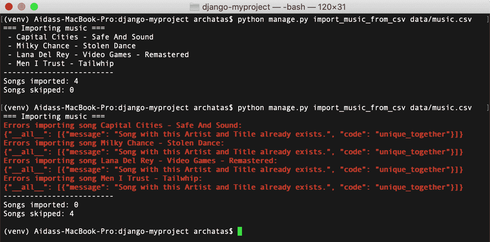
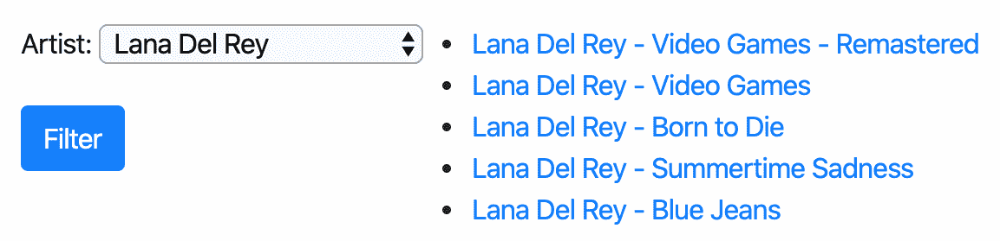
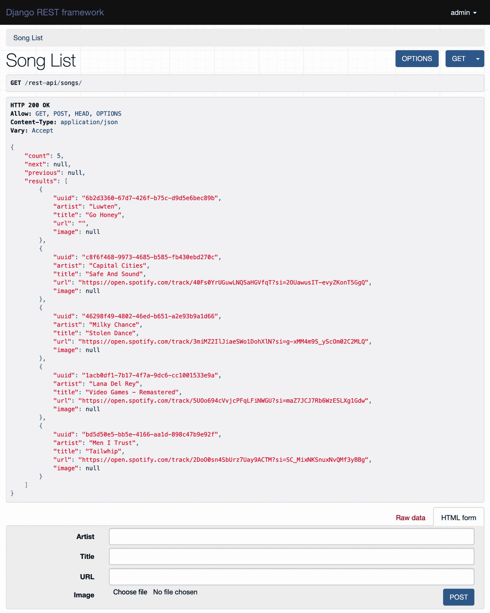

# 导入和导出数据

在本章中，我们将介绍以下主题：

*   从本地 CSV 文件导入数据
*   从本地 Excel 文件导入数据
*   从外部 JSON 文件导入数据
*   从外部 XML 文件导入数据
*   为搜索引擎准备分页的站点地图
*   创建可过滤的 RSS 源
*   使用 Django REST 框架创建 API

# 介绍

有时，您的数据需要从本地格式传输到数据库、从外部资源导入或提供给第三方。在本章中，我们将看一些如何编写管理命令和 API 来实现这一点的实际示例。

# 技术要求

为了使用本章的代码，您将需要最新稳定版本的 Python、MySQL 或 PostgreSQL 数据库以及带有虚拟环境的 Django 项目。另外，确保将 Django、Pillow 和数据库绑定安装到虚拟环境中。

您可以在 GitHub 存储库的`ch09`目录中找到本章的所有代码：[https://github.com/PacktPublishing/Django-3-Web-Development-Cookbook-Fourth-Edition](https://github.com/PacktPublishing/Django-3-Web-Development-Cookbook-Fourth-Edition) 。

# 从本地 CSV 文件导入数据

**逗号分隔值**（**CSV**格式）可能是在文本文件中存储表格数据的最简单方式。在此配方中，我们将创建一个管理命令，将数据从 CSV 文件导入 Django 数据库。我们需要一个 CSV 歌曲列表。您可以使用 Excel、Calc 或其他电子表格应用程序轻松创建此类文件。

# 准备

让我们创建一个`music`应用程序，我们将在本章中使用它：

1.  创建`music`应用程序本身，并将其置于`INSTALLED_APPS`设置下：

```py
# myproject/settings/_base.py
INSTALLED_APPS = [
    # …
    "myproject.apps.core",
    "myproject.apps.music",
]
```

2.  那里的`Song`模型应该包含`uuid`、`artist`、`title`、`url`和`image`字段。我们还将扩展`CreationModificationDateBase`以添加创建和修改时间戳，以及`UrlBase`以添加处理模型详细 URL 的方法：

```py
# myproject/apps/music/models.py
import os
import uuid
from django.urls import reverse
from django.utils.translation import ugettext_lazy as _
from django.db import models
from django.utils.text import slugify
from myproject.apps.core.models import CreationModificationDateBase, UrlBase

def upload_to(instance, filename):
    filename_base, filename_ext = os.path.splitext(filename)
    artist = slugify(instance.artist)
    title = slugify(instance.title)
    return f"music/{artist}--{title}{filename_ext.lower()}"

class Song(CreationModificationDateBase, UrlBase):
    uuid = models.UUIDField(primary_key=True, default=None, 
     editable=False)
    artist = models.CharField(_("Artist"), max_length=250)
    title = models.CharField(_("Title"), max_length=250)
    url = models.URLField(_("URL"), blank=True)
    image = models.ImageField(_("Image"), upload_to=upload_to, 
     blank=True, null=True)

    class Meta:
        verbose_name = _("Song")
        verbose_name_plural = _("Songs")
        unique_together = ["artist", "title"]

    def __str__(self):
        return f"{self.artist} - {self.title}"

    def get_url_path(self):
        return reverse("music:song_detail", kwargs={"pk": self.pk})

    def save(self, *args, **kwargs):
        if self.pk is None:
            self.pk = uuid.uuid4()
        super().save(*args, **kwargs)
```

3.  使用以下命令进行并运行迁移：

```py
(env)$ python manage.py makemigrations
(env)$ python manage.py migrate
```

4.  然后，让我们为`Song`模型添加一个简单的管理：

```py
# myproject/apps/music/admin.py
from django.contrib import admin
from .models import Song

@admin.register(Song)
class SongAdmin(admin.ModelAdmin):
    list_display = ["title", "artist", "url"]
    list_filter = ["artist"]
    search_fields = ["title", "artist"]
```

5.  此外，我们还需要一个表单，用于在导入脚本中验证和创建`Song`模型。这是最简单的模型形式，如下所示：

```py
# myproject/apps/music/forms.py
from django import forms
from django.utils.translation import ugettext_lazy as _
from .models import Song

class SongForm(forms.ModelForm):
    class Meta:
        model = Song
        fields = "__all__" 
```

# 怎么做。。。

按照以下步骤创建并使用从本地 CSV 文件导入歌曲的管理命令：

1.  创建一个 CSV 文件，列名称为`artist`、`title`和`url`，位于第一行。在与列匹配的下一行中添加一些歌曲数据。例如，它可能是一个包含如下内容的`data/music.csv`文件：

```py
artist,title,url
Capital Cities,Safe And Sound,https://open.spotify.com/track/40Fs0YrUGuwLNQSaHGVfqT?si=2OUawusIT-evyZKonT5GgQ
Milky Chance,Stolen Dance,https://open.spotify.com/track/3miMZ2IlJiaeSWo1DohXlN?si=g-xMM4m9S_yScOm02C2MLQ
Lana Del Rey,Video Games - Remastered,https://open.spotify.com/track/5UOo694cVvjcPFqLFiNWGU?si=maZ7JCJ7Rb6WzESLXg1Gdw
Men I Trust,Tailwhip,https://open.spotify.com/track/2DoO0sn4SbUrz7Uay9ACTM?si=SC_MixNKSnuxNvQMf3yBBg
```

2.  在`music`应用中，创建一个`management`目录，然后在新的`management`目录中创建一个`commands`目录。将空的`__init__.py`文件放在两个新目录中，使它们成为 Python 包。

3.  在此添加一个`import_music_from_csv.py`文件，内容如下：

```py
# myproject/apps/music/management/commands/import_music_from_csv.py
from django.core.management.base import BaseCommand

class Command(BaseCommand):
    help = (
        "Imports music from a local CSV file. "
        "Expects columns: artist, title, url"
    )
    SILENT, NORMAL, VERBOSE, VERY_VERBOSE = 0, 1, 2, 3

    def add_arguments(self, parser):
        # Positional arguments
        parser.add_argument("file_path", nargs=1, type=str)

    def handle(self, *args, **options):
        self.verbosity = options.get("verbosity", self.NORMAL)
        self.file_path = options["file_path"][0]
        self.prepare()
        self.main()
        self.finalize()
```

4.  然后，在`Command`类的同一个文件中，创建一个`prepare()`方法：

```py
    def prepare(self):
        self.imported_counter = 0
        self.skipped_counter = 0
```

5.  然后，我们应该创建`main()`方法：

```py
    def main(self):
        import csv
        from ...forms import SongForm

        if self.verbosity >= self.NORMAL:
            self.stdout.write("=== Importing music ===")

        with open(self.file_path, mode="r") as f:
            reader = csv.DictReader(f)
            for index, row_dict in enumerate(reader):
                form = SongForm(data=row_dict)
                if form.is_valid():
                    song = form.save()
                    if self.verbosity >= self.NORMAL:
                        self.stdout.write(f" - {song}\n")
                    self.imported_counter += 1
                else:
                    if self.verbosity >= self.NORMAL:
                        self.stderr.write(
                            f"Errors importing song "
                            f"{row_dict['artist']} - 
                             {row_dict['title']}:\n"
                        )
                        self.stderr.write(f"{form.errors.as_json()}\n")
                    self.skipped_counter += 1
```

6.  我们将使用`finalize()`方法完成本课程：

```py
    def finalize(self)
        if self.verbosity >= self.NORMAL:
            self.stdout.write(f"-------------------------\n")
            self.stdout.write(f"Songs imported:         
             {self.imported_counter}\n")
            self.stdout.write(f"Songs skipped: 
             {self.skipped_counter}\n\n")
```

7.  要运行导入，请在命令行中调用以下命令：

```py
(env)$ python manage.py import_music_from_csv data/music.csv
```

# 它是如何工作的。。。

Django 管理命令是带有`Command`类的脚本，这些类派生自`BaseCommand`并覆盖`add_arguments()`和`handle()`方法。`help`属性定义管理命令的帮助文本。在命令行中键入以下内容时可以看到：

```py
(env)$ python manage.py help import_music_from_csv
```

Django 管理命令使用内置的`argparse`模块来解析传递的参数。`add_arguments()`方法定义应该传递给管理命令的位置参数或命名参数。在本例中，我们将添加一个 Unicode 类型的位置`file_path`参数。通过将`nargs`变量设置为`1`属性，我们只允许一个值。

要了解您可以定义的其他参数以及如何定义，请参阅[中的官方`argparse`文档 https://docs.python.org/3/library/argparse.html#adding-论点](https://docs.python.org/3/library/argparse.html#adding-arguments)。

在`handle()`方法的开头，检查`verbosity`参数。详细性定义命令应提供的终端输出量，从 0（不提供任何日志记录）到 3（提供大量日志记录）。可以按如下方式将此命名参数传递给命令：

```py
(env)$ python manage.py import_music_from_csv data/music.csv --verbosity=0
```

我们还希望文件名作为第一个位置参数。`options["file_path"]`返回长度在`nargs`中定义的值列表。在我们的例子中，`nargs`等于一；因此，`options["file_path"]`将等于一个元素的列表。

将管理命令的逻辑拆分为多个较小的方法是一种很好的做法，例如，我们在本脚本中使用了`prepare()`、`main()`和`finalize()`：

*   `prepare()`方法将导入计数器设置为零。它还可以用于脚本所需的任何其他设置。
*   在`main()`方法中，我们执行管理命令的主要逻辑。首先，我们打开给定的文件进行读取，并将其指针传递到`csv.DictReader`。假定文件中的第一行包含每个列的标题。`DictReader`将它们用作每行词典的键。当我们遍历行时，我们将字典传递给模型表单并尝试验证它。如果验证通过，则保存一首歌曲并增加`imported_counter`。如果由于太长的值、缺少必需的值、错误的类型或其他验证错误而导致验证失败，`skipped_counter`将递增。如果详细程度等于或大于`NORMAL`（数字 1），则每个导入或跳过的歌曲也会与可能的验证错误一起打印出来。

*   `finalize()`方法打印出导入了多少首歌曲，以及由于验证错误跳过了多少首歌曲。

如果要在开发管理命令时调试该命令的错误，请将`--traceback`参数传递给它。发生错误时，您将看到问题的完整堆栈跟踪。

假设我们使用`--verbosity=1`或更高版本调用了两次命令，我们可以预期的输出可能如下所示：



如您所见，第二次导入歌曲时，它没有通过`unique_together`约束，因此被跳过。

# 另见

*   *从本地 Excel 文件*导入数据
*   *从外部 JSON 文件*导入数据的方法
*   *从外部 XML 文件*导入数据

# 从本地 Excel 文件导入数据

另一种存储表格数据的流行格式是 Excel 电子表格。在此配方中，我们将从这种格式的文件导入歌曲。

# 准备

让我们从上一个配方中创建的`music`应用程序开始。要读取 Excel 文件，您需要安装`openpyxl`软件包，如下所示：

```py
(env)$ pip install openpyxl==3.0.2

```

# 怎么做。。。

按照以下步骤创建并使用从本地 XLSX 文件导入歌曲的管理命令：

1.  创建一个 XLSX 文件，第一行包含列名称、艺术家、标题和 URL。在与列匹配的下一行中添加一些歌曲数据。您可以在电子表格应用程序中执行此操作，方法是将上一配方中的 CSV 文件保存为 XLSX 文件`data/music.xlsx`。以下是一个例子：


2.  如果您没有这样做，请在`music`应用程序中创建一个`management`目录，然后在其下创建一个`commands`子目录。在两个新目录中添加空的`__init__.py`文件，使其成为 Python 包。
3.  添加一个包含以下内容的`import_music_from_xlsx.py`文件：

```py
# myproject/apps/music/management/commands
# /import_music_from_xlsx.py
from django.core.management.base import BaseCommand

class Command(BaseCommand):
    help = (
        "Imports music from a local XLSX file. "
        "Expects columns: Artist, Title, URL"
    )
    SILENT, NORMAL, VERBOSE, VERY_VERBOSE = 0, 1, 2, 3

    def add_arguments(self, parser):
        # Positional arguments
        parser.add_argument("file_path",
                            nargs=1,
                            type=str)

    def handle(self, *args, **options):
        self.verbosity = options.get("verbosity", self.NORMAL)
        self.file_path = options["file_path"][0]
        self.prepare()
        self.main()
        self.finalize()
```

4.  然后，在`Command`类的同一个文件中，创建一个`prepare()`方法：

```py
    def prepare(self):
        self.imported_counter = 0
        self.skipped_counter = 0

```

5.  然后，在那里创建`main()`方法：

```py
    def main(self):
        from openpyxl import load_workbook
        from ...forms import SongForm

        wb = load_workbook(filename=self.file_path)
        ws = wb.worksheets[0]

        if self.verbosity >= self.NORMAL:
            self.stdout.write("=== Importing music ===")

        columns = ["artist", "title", "url"]
        rows = ws.iter_rows(min_row=2)  # skip the column captions
        for index, row in enumerate(rows, start=1):
            row_values = [cell.value for cell in row]
            row_dict = dict(zip(columns, row_values))
            form = SongForm(data=row_dict)
            if form.is_valid():
                song = form.save()
                if self.verbosity >= self.NORMAL:
                    self.stdout.write(f" - {song}\n")
                self.imported_counter += 1
            else:
                if self.verbosity >= self.NORMAL:
                    self.stderr.write(
                        f"Errors importing song "
                        f"{row_dict['artist']} - 
                         {row_dict['title']}:\n"
                    )
                    self.stderr.write(f"{form.errors.as_json()}\n")
                self.skipped_counter += 1
```

6.  我们将用`finalize()`方法完成这门课：

```py
    def finalize(self):
        if self.verbosity >= self.NORMAL:
            self.stdout.write(f"-------------------------\n")
            self.stdout.write(f"Songs imported: 
             {self.imported_counter}\n")
            self.stdout.write(f"Songs skipped: 
             {self.skipped_counter}\n\n")
```

7.  要运行导入，请在命令行中调用以下命令：

```py
(env)$ python manage.py import_music_from_xlsx data/music.xlsx
```

# 它是如何工作的。。。

从 XLSX 文件导入的原理与 CSV 相同。我们打开文件，逐行读取，形成数据字典，通过模型表单验证它们，并根据提供的数据创建`Song`对象。

我们再次使用`prepare()`、`main()`和`finalize()`方法将逻辑拆分为更多的原子部分。

以下是`main()`方法的详细说明，因为它可能是管理命令的唯一不同部分：

*   Excel 文件是包含作为不同选项卡的工作表的工作簿。
*   我们正在使用`openpyxl`库打开一个作为位置参数传递给命令的文件。然后，我们阅读工作簿中的第一页。
*   第一行包含列标题。我们跳过它。
*   之后，我们将一行一行地读取值列表，使用`zip()`函数创建字典，将它们传递到模型表单，验证并从中创建`Song`对象。
*   如果存在任何验证错误，且详细程度大于或等于`NORMAL`，则输出验证错误。
*   管理命令会再次将导入的歌曲打印到控制台，除非您设置了`--verbosity=0`。

如果我们使用`--verbosity=1`或更高版本运行两次命令，输出如下：


您可以在[了解有关如何使用 Excel 文件的更多信息 http://www.python-excel.org/](http://www.python-excel.org/) 。

# 另见

*   *从本地 CSV 文件*导入数据
*   *从外部 JSON 文件*导入数据的方法
*   *从外部 XML 文件*导入数据

# 从外部 JSON 文件导入数据

[Last.fm](http://last.fm)音乐网站在[下有一个 APIhttps://ws.audioscrobbler.com/](https://ws.audioscrobbler.com/) 可用于阅读相册、艺术家、曲目、事件等的域。API 允许您使用 JSON 或 XML 格式。在此配方中，我们将使用 JSON 格式导入标记为`indie`的顶部曲目。

# 准备

按照以下步骤从`Last.fm`导入 JSON 格式的数据：

1.  让我们从*中创建的`music`应用程序开始，该应用程序从本地 CSV 文件*配方导入数据。
2.  要使用[Last.fm](http://last.fm)，您需要注册并获取 API 密钥。API 密钥可以在[创建
    https://www.last.fm/api/account/create](https://www.last.fm/api/account/create) 。
3.  API 密钥必须在设置中设置为`LAST_FM_API_KEY`。我们建议
    从机密文件或环境变量中提供，并将其绘制到您的设置中，如下所示：

```py
# myproject/settings/_base.py
LAST_FM_API_KEY = get_secret("LAST_FM_API_KEY")
```

4.  另外，使用以下命令在虚拟环境中安装`requests`库：

```py
(env)$ pip install requests==2.22.0
```

5.  让我们检查一下 JSON 端点的结构，看看最上面的独立音轨（`https://ws.audioscrobbler.com/2.0/?method=tag.gettoptracks&tag=indie&api_key=YOUR_API_KEY&format=json`，应该是这样的：

```py
{
  "tracks": {
    "track": [
      {
        "name": "Mr. Brightside",
        "duration": "224",
        "mbid": "37d516ab-d61f-4bcb-9316-7a0b3eb845a8",
        "url": "https://www.last.fm/music
         /The+Killers/_/Mr.+Brightside",
        "streamable": {
          "#text": "0",
          "fulltrack": "0"
        },
        "artist": {
          "name": "The Killers",
          "mbid": "95e1ead9-4d31-4808-a7ac-32c3614c116b",
          "url": "https://www.last.fm/music/The+Killers"
        },
        "image": [
          {
            "#text": 
            "https://lastfm.freetls.fastly.net/i/u/34s
             /2a96cbd8b46e442fc41c2b86b821562f.png",
            "size": "small"
          },
          {
            "#text":  
           "https://lastfm.freetls.fastly.net/i/u/64s
            /2a96cbd8b46e442fc41c2b86b821562f.png",
            "size": "medium"
          },
          {
            "#text": 
            "https://lastfm.freetls.fastly.net/i/u/174s
             /2a96cbd8b46e442fc41c2b86b821562f.png",
            "size": "large"
          },
          {
            "#text": 
            "https://lastfm.freetls.fastly.net/i/u/300x300
             /2a96cbd8b46e442fc41c2b86b821562f.png",
            "size": "extralarge"
          }
        ],
        "@attr": {
          "rank": "1"
        }
      },
      ...
    ],
    "@attr": {
      "tag": "indie",
      "page": "1",
      "perPage": "50",
      "totalPages": "4475",
      "total": "223728"
    }
  }
}
```

我们想要阅读曲目`name`、`artist`、`URL`和中等大小的图像。此外，我们感兴趣的是总共存在多少页面，这些页面在 JSON 文件末尾作为元信息提供。

# 怎么做。。。

按照以下步骤创建一个`Song`模型和一个管理命令，将[Last.fm](http://last.fm)中的顶层曲目以 JSON 格式导入数据库：

1.  如果您没有这样做，请在`music`应用程序中创建一个`management`目录，然后在其下方创建一个`commands`子目录。在两个新目录中添加空的`__init__.py`文件，使其成为 Python 包。
2.  添加一个包含以下内容的`import_music_from_lastfm_json.py`文件：

```py
# myproject/apps/music/management/commands
# /import_music_from_lastfm_json.py
from django.core.management.base import BaseCommand

class Command(BaseCommand):
    help = "Imports top songs from last.fm as JSON."
    SILENT, NORMAL, VERBOSE, VERY_VERBOSE = 0, 1, 2, 3
    API_URL = "https://ws.audioscrobbler.com/2.0/"

    def add_arguments(self, parser):
        # Named (optional) arguments
        parser.add_argument("--max_pages", type=int, default=0)

    def handle(self, *args, **options):
        self.verbosity = options.get("verbosity", self.NORMAL)
        self.max_pages = options["max_pages"]
        self.prepare()
        self.main()
        self.finalize()
```

3.  然后，在`Command`类的同一个文件中，创建一个`prepare()`方法：

```py
    def prepare(self):
        from django.conf import settings

        self.imported_counter = 0
        self.skipped_counter = 0
        self.params = {
            "method": "tag.gettoptracks",
            "tag": "indie",
            "api_key": settings.LAST_FM_API_KEY,
            "format": "json",
            "page": 1,
        }
```

4.  然后，在那里创建`main()`方法：

```py
    def main(self):
        import requests

        response = requests.get(self.API_URL, params=self.params)
        if response.status_code != requests.codes.ok:
            self.stderr.write(f"Error connecting to 
             {response.url}")
            return
        response_dict = response.json()
        pages = int(
            response_dict.get("tracks", {})
            .get("@attr", {}).get("totalPages", 1)
        )

        if self.max_pages > 0:
            pages = min(pages, self.max_pages)

        if self.verbosity >= self.NORMAL:
            self.stdout.write(f"=== Importing {pages} page(s) 
             of tracks ===")

        self.save_page(response_dict)

        for page_number in range(2, pages + 1):
            self.params["page"] = page_number
            response = requests.get(self.API_URL, 
            params=self.params)
            if response.status_code != requests.codes.ok:
                self.stderr.write(f"Error connecting to 
                 {response.url}")
                return
            response_dict = response.json()
            self.save_page(response_dict)
```

5.  分页提要中的每一页都将通过我们应该创建的`save_page()`方法保存，如下所示：

```py
    def save_page(self, data):
        import os
        import requests
        from io import BytesIO
        from django.core.files import File
        from ...forms import SongForm

        for track_dict in data.get("tracks", {}).get("track"):
            if not track_dict:
                continue

            song_dict = {
                "artist": track_dict.get("artist", {}).get("name", ""),
                "title": track_dict.get("name", ""),
                "url": track_dict.get("url", ""),
            }
            form = SongForm(data=song_dict)
            if form.is_valid():
                song = form.save()

                image_dict = track_dict.get("image", None)
                if image_dict:
                    image_url = image_dict[1]["#text"]
                    image_response = requests.get(image_url)
                    song.image.save(
 os.path.basename(image_url),
 File(BytesIO(image_response.content)),
 )

                if self.verbosity >= self.NORMAL:
                    self.stdout.write(f" - {song}\n")
                self.imported_counter += 1
            else:
                if self.verbosity >= self.NORMAL:
                    self.stderr.write(
                        f"Errors importing song "
                        f"{song_dict['artist']} - 
                         {song_dict['title']}:\n"
                    )
                    self.stderr.write(f"{form.errors.as_json()}\n")
                self.skipped_counter += 1
```

6.  我们将用`finalize()`方法完成这门课：

```py
    def finalize(self):
        if self.verbosity >= self.NORMAL:
            self.stdout.write(f"-------------------------\n")
            self.stdout.write(f"Songs imported: 
             {self.imported_counter}\n")
            self.stdout.write(f"Songs skipped: 
             {self.skipped_counter}\n\n")
```

7.  要运行导入，请在命令行中调用以下命令：

```py
(env)$ python manage.py import_music_from_lastfm_json --max_pages=3
```

# 它是如何工作的。。。

如前所述，如果脚本只列出一系列字符串，则脚本的参数可以是**位置**，如果脚本的参数以`--`和变量名开头，则脚本的参数可以是**名为**。命名的`--max_pages`参数将导入的数据限制为三页。如果您想下载所有可用的热门曲目，只需跳过它，或者显式地传递 0（零）。

请注意，`totalPages`值中详细说明的页面大约有 4500 页，这将需要很长时间和大量处理。

我们的脚本的结构与以前的导入脚本类似：

*   `prepare()`方法用于设置
*   `main()`方法处理请求并处理响应
*   `save_page()`方法从单个分页页面保存歌曲
*   `finalize()`方法打印出进口统计数据

在`main()`方法中，我们使用`requests.get()`从[Last.fm](http://last.fm)读取数据，传递`params`查询参数。响应对象有一个名为`json()`的内置方法，该方法将 JSON 字符串转换为已解析的字典对象。从第一个请求开始，我们了解页面总数，然后读取每个页面，并调用`save_page()`方法解析信息并保存歌曲。

在`save_page()`方法中，我们从轨迹中读取值，并构建模型表单所需的字典。我们验证表单。如果数据有效，则创建`Song`对象。

导入的一个有趣部分是下载并保存图像。在这里，我们也使用`requests.get()`来检索图像数据，然后通过`BytesIO`将其传递给`File`，相应地在`image.save()`方法中使用。`image.save()`的第一个参数是一个文件名，该文件名将被`upload_to`函数的值覆盖，并且仅对文件扩展名是必需的。

如果使用`--verbosity=1`或更高版本调用该命令，我们将看到有关导入的详细信息，就像前面的配方一样。

您可以在[了解更多有关如何使用](https://www.last.fm/api/)[Last.fm](http://last.fm)的信息 https://www.last.fm/api/ 。

# 另见

*   *从本地 CSV 文件*导入数据
*   *从本地 Excel 文件*导入数据
*   *从外部 XML 文件*导入数据

# 从外部 XML 文件导入数据

正如我们在前面的配方中展示了如何使用 JSON 一样，[Last.fm](http://last.fm)文件也允许您以 XML 格式从其服务获取数据。在本食谱中，我们将向您展示如何做到这一点。

# 准备

按照以下步骤从[Last.fm](http://last.fm)导入 XML 格式的数据：

1.  让我们从*中创建的`music`应用程序开始，该应用程序从本地 CSV 文件*配方导入数据。
2.  要使用[Last.fm](http://last.fm)，您需要注册并获取 API 密钥。API 密钥可以在[创建
    https://www.last.fm/api/account/create](https://www.last.fm/api/account/create) 。
3.  API 密钥必须在设置中设置为`LAST_FM_API_KEY`。我们建议
    从机密文件或环境变量中提供，并将其绘制到您的设置中，如下所示：

```py
# myproject/settings/_base.py
LAST_FM_API_KEY = get_secret("LAST_FM_API_KEY")
```

4.  另外，使用以下命令在虚拟环境中安装`requests`和`defusedxml`库：

```py
(env)$ pip install requests==2.22.0
(env)$ pip install defusedxml==0.6.0

```

5.  让我们检查一下 JSON 端点的结构，看看最上面的独立音轨（`https://ws.audioscrobbler.com/2.0/?method=tag.gettoptracks&tag=indie&api_key=YOUR_API_KEY&format=xml`，应该是这样的：

```py
<?xml version="1.0" encoding="UTF-8" ?>
<lfm status="ok">
    <tracks tag="indie" page="1" perPage="50" 
 totalPages="4475" total="223728">
        <track rank="1">
            <name>Mr. Brightside</name>
            <duration>224</duration>
            <mbid>37d516ab-d61f-4bcb-9316-7a0b3eb845a8</mbid>
            <url>https://www.last.fm/music
            /The+Killers/_/Mr.+Brightside</url>
            <streamable fulltrack="0">0</streamable>
            <artist>
                <name>The Killers</name>
                <mbid>95e1ead9-4d31-4808-a7ac-32c3614c116b</mbid>
                <url>https://www.last.fm/music/The+Killers</url>
            </artist>
            <image size="small">https://lastfm.freetls.fastly.net/i
             /u/34s/2a96cbd8b46e442fc41c2b86b821562f.png</image>
            <image size="medium">
            https://lastfm.freetls.fastly.net/i
            /u/64s/2a96cbd8b46e442fc41c2b86b821562f.png</image>
            <image size="large">https://lastfm.freetls.fastly.net/i
            /u/174s/2a96cbd8b46e442fc41c2b86b821562f.png</image>
            <image size="extralarge">
                https://lastfm.freetls.fastly.net/i/u/300x300
                /2a96cbd8b46e442fc41c2b86b821562f.png
            </image>
        </track>
        ...
    </tracks>
</lfm>
```

# 怎么做。。。

按照以下步骤创建`Song`模型和管理命令，将[Last.fm](http://last.fm)的顶层曲目以 XML 格式导入数据库：

1.  如果您没有这样做，请在`music`应用程序中创建一个`management`目录，然后在其下创建一个`commands`子目录。在两个新目录中添加空的`__init__.py`文件，使其成为 Python 包。
2.  添加一个包含以下内容的`import_music_from_lastfm_xml.py`文件：

```py
# myproject/apps/music/management/commands
# /import_music_from_lastfm_xml.py
from django.core.management.base import BaseCommand

class Command(BaseCommand):
    help = "Imports top songs from last.fm as XML."
    SILENT, NORMAL, VERBOSE, VERY_VERBOSE = 0, 1, 2, 3
    API_URL = "https://ws.audioscrobbler.com/2.0/"

    def add_arguments(self, parser):
        # Named (optional) arguments
        parser.add_argument("--max_pages", type=int, default=0)

    def handle(self, *args, **options):
        self.verbosity = options.get("verbosity", self.NORMAL)
        self.max_pages = options["max_pages"]
        self.prepare()
        self.main()
        self.finalize()
```

3.  然后，在`Command`类的同一个文件中，创建一个`prepare()`方法：

```py
    def prepare(self):
        from django.conf import settings

        self.imported_counter = 0
        self.skipped_counter = 0
        self.params = {
            "method": "tag.gettoptracks",
            "tag": "indie",
            "api_key": settings.LAST_FM_API_KEY,
            "format": "xml",
            "page": 1,
        }
```

4.  然后，在那里创建`main()`方法：

```py
    def main(self):
        import requests
        from defusedxml import ElementTree

        response = requests.get(self.API_URL, params=self.params)
        if response.status_code != requests.codes.ok:
            self.stderr.write(f"Error connecting to {response.url}")
            return
        root = ElementTree.fromstring(response.content)

        pages = int(root.find("tracks").attrib.get("totalPages", 1))
        if self.max_pages > 0:
            pages = min(pages, self.max_pages)

        if self.verbosity >= self.NORMAL:
            self.stdout.write(f"=== Importing {pages} page(s) 
             of songs ===")

        self.save_page(root)

        for page_number in range(2, pages + 1):
            self.params["page"] = page_number
            response = requests.get(self.API_URL, params=self.params)
            if response.status_code != requests.codes.ok:
                self.stderr.write(f"Error connecting to {response.url}")
                return
            root = ElementTree.fromstring(response.content)
            self.save_page(root)
```

5.  分页提要中的每一页都将通过我们应该创建的`save_page()`方法保存，如下所示：

```py
    def save_page(self, root):
        import os
        import requests
        from io import BytesIO
        from django.core.files import File
        from ...forms import SongForm

        for track_node in root.findall("tracks/track"):
            if not track_node:
                continue

            song_dict = {
                "artist": track_node.find("artist/name").text,
                "title": track_node.find("name").text,
                "url": track_node.find("url").text,
            }
            form = SongForm(data=song_dict)
            if form.is_valid():
                song = form.save()

                image_node = track_node.find("image[@size='medium']")
                if image_node is not None:
                    image_url = image_node.text
                    image_response = requests.get(image_url)
                    song.image.save(
 os.path.basename(image_url),
 File(BytesIO(image_response.content)),
 )

                if self.verbosity >= self.NORMAL:
                    self.stdout.write(f" - {song}\n")
                self.imported_counter += 1
            else:
                if self.verbosity >= self.NORMAL:
                    self.stderr.write(
                        f"Errors importing song "
                        f"{song_dict['artist']} - {song_dict['title']}:\n"
                    )
                    self.stderr.write(f"{form.errors.as_json()}\n")
                self.skipped_counter += 1
```

6.  我们将使用`finalize()`方法完成本课程：

```py
    def finalize(self):
        if self.verbosity >= self.NORMAL:
            self.stdout.write(f"-------------------------\n")
            self.stdout.write(f"Songs imported: {self.imported_counter}\n")
            self.stdout.write(f"Songs skipped: {self.skipped_counter}\n\n")
```

7.  要运行导入，请在命令行中调用以下命令：

```py
(env)$ python manage.py import_music_from_lastfm_xml --max_pages=3
```

# 它是如何工作的。。。

该过程类似于 JSON 方法。我们使用`requests.get()`方法从[Last.fm](http://last.fm)读取数据，将查询参数传递为`params`。响应的 XML 内容从`defusedxml`模块传递到`ElementTree`解析器，返回`root`节点。

`defusedxml`模块是`xml`模块更安全的替代品。它可以防止 XML 炸弹——这是一个允许攻击者使用几百字节的 XML 数据来占用千兆字节内存的漏洞。

`ElementTree`节点有`find()`和`findall()`方法，您可以通过`XPath`查询过滤出特定的子节点。

以下是`ElementTree`支持的可用 XPath 语法表：

| **XPath 语法组件** | **意思是** |
| `tag` | 这将选择具有给定标记的所有子元素。 |
| `*` | 这将选择所有子元素。 |
| `.` | 这将选择当前节点。 |
| `//` | 这将选择当前元素下所有级别上的所有子元素。 |
| `..` | 这将选择父元素。 |
| `[@attrib]` | 这将选择具有给定属性的所有元素。 |
| `[@attrib='value']` | 这将选择给定属性具有给定值的所有元素。 |
| `[tag]` | 这将选择具有名为 tag 的子元素的所有元素。只支持直系子女。 |
| `[position]` | 这将选择位于给定位置的所有图元。位置可以是整数（`1`是第一个位置）、`last()`表达式（对于最后一个位置）或相对于最后一个位置的位置（例如，`last()-1`。 |

因此，在`main()`方法中，我们使用`root.find("tracks").attrib.get("totalPages", 1)`读取总页数，如果数据不知何故丢失，则默认为 1。我们将保存第一页，然后逐个浏览其他页面并保存它们。

在`save_page()`方法中，`root.findall("tracks/track")`通过`<tracks>`节点下的`<track>`节点返回迭代器。通过`track_node.find("image[@size='medium']")`，我们可以得到中等大小的图像。同样，`Song`创建通过用于验证传入数据的模型表单进行。

如果我们使用`--verbosity=1`或更高的值调用命令，我们将看到有关导入歌曲的详细信息，就像前面的食谱一样。

# 还有更多。。。

您可以从以下链接了解更多信息：

*   在[阅读如何使用](https://www.last.fm/api/)[Last.fm](http://last.fm)https://www.last.fm/api/ 。
*   阅读[中的 XPathhttps://en.wikipedia.org/wiki/XPath](https://en.wikipedia.org/wiki/XPath) 。
*   `ElementTree`的完整文档可在 [找到 https://docs.python.org/3/library/xml.etree.elementtree.html](https://docs.python.org/3/library/xml.etree.elementtree.html) 。

# 另见

*   *从本地 CSV 文件*导入数据
*   *从本地 Excel 文件*导入数据
*   *从外部 JSON 文件*导入数据的方法

# 为搜索引擎准备分页的站点地图

**站点地图**协议告诉搜索引擎关于您网站上所有不同页面的信息。通常，它是一个单独的`sitemap.xml`文件，通知可以索引的内容和频率。如果您的网站上有很多不同的页面，还可以拆分 XML 文件并对其分页，以更快地呈现每个资源列表。

在本食谱中，我们将向您展示如何创建分页的站点地图，以便在 Django 网站中使用。

# 准备

对于此配方和其他配方，我们需要扩展`music`应用程序，并在其中添加列表和详细视图：

1.  创建具有以下内容的`views.py`文件：

```py
# myproject/apps/music/views.py
from django.views.generic import ListView, DetailView
from django.utils.translation import ugettext_lazy as _
from .models import Song

class SongList(ListView):
    model = Song

class SongDetail(DetailView):
    model = Song
```

2.  创建具有以下内容的`urls.py`文件：

```py
# myproject/apps/music/urls.py
from django.urls import path
from .views import SongList, SongDetail

app_name = "music"

urlpatterns = [
    path("", SongList.as_view(), name="song_list"),
    path("<uuid:pk>/", SongDetail.as_view(), name="song_detail"),
]
```

3.  将该 URL 配置包括到项目的 URL 配置中：

```py
# myproject/urls.py
from django.conf.urls.i18n import i18n_patterns
from django.urls import include, path

urlpatterns = i18n_patterns(
    # …
 path("songs/", include("myproject.apps.music.urls", 
     namespace="music")),
)
```

4.  为歌曲列表视图创建模板：

```py
{# music/song_list.html #}




    <ul>
        
            <li><a href="{{ song.get_url_path }}">
             {{ song }}</a></li>
        
    </ul>

```

5.  然后，为歌曲详细视图创建一个：

```py
{# music/song_detail.html #}




    
        <h1>{{ song }}</h1>
        
            
        
        
            <a href="{{ song.url }}" target="_blank" 
             rel="noreferrer noopener">
                
            </a>
        
    

```

# 怎么做。。。

要添加分页的站点地图，请执行以下步骤：

1.  在设置中包括`INSTALLED_APPS`中的`django.contrib.sitemaps`：

```py
# myproject/settings/_base.py
INSTALLED_APPS = [
    # …
    "django.contrib.sitemaps",
    # …
]
```

2.  修改项目的`urls.py`如下：

```py
# myproject/urls.py
from django.conf.urls.i18n import i18n_patterns
from django.urls import include, path
from django.contrib.sitemaps import views as sitemaps_views
from django.contrib.sitemaps import GenericSitemap
from myproject.apps.music.models import Song

class MySitemap(GenericSitemap):
 limit = 50

 def location(self, obj):
 return obj.get_url_path()

song_info_dict = {
 "queryset": Song.objects.all(), 
 "date_field": "modified",
}
sitemaps = {"music": MySitemap(song_info_dict, priority=1.0)}

urlpatterns = [
 path("sitemap.xml", sitemaps_views.index, 
     {"sitemaps": sitemaps}),
 path("sitemap-<str:section>.xml", sitemaps_views.sitemap, 
     {"sitemaps": sitemaps},
 name="django.contrib.sitemaps.views.sitemap"
    ),
]

urlpatterns += i18n_patterns(
    # …
    path("songs/", include("myproject.apps.music.urls", 
     namespace="music")),
)
```

# 它是如何工作的。。。

如果您查看`http://127.0.0.1:8000/sitemap.xml`，您将看到带有分页站点地图的索引：

```py
<?xml version="1.0" encoding="UTF-8"?>
<sitemapindex >
    <sitemap>
        <loc>http://127.0.0.1:8000/sitemap-music.xml</loc>
    </sitemap>
    <sitemap>
        <loc>http://127.0.0.1:8000/sitemap-music.xml?p=2</loc>
    </sitemap>
    <sitemap>
        <loc>http://127.0.0.1:8000/sitemap-music.xml?p=3</loc>
    </sitemap>
</sitemapindex>

```

在这里，每个页面将显示多达 50 个条目，其中包含 URL、上次修改和优先级：

```py
<?xml version="1.0" encoding="UTF-8"?>
<urlset >
    <url>
        <loc>http://127.0.0.1:8000/en/songs/b2d3627b-dbc7
         -4c11-a13e-03d86f32a719/</loc>
        <lastmod>2019-12-15</lastmod>
        <priority>1.0</priority>
    </url>
    <url>
        <loc>http://127.0.0.1:8000/en/songs/f5c386fd-1952
         -4ace-9848-717d27186fa9/</loc>
        <lastmod>2019-12-15</lastmod>
        <priority>1.0</priority>
    </url>
    <url>
        <loc>http://127.0.0.1:8000/en/songs/a59cbb5a-16e8
         -46dd-9498-d86e24e277a5/</loc>
        <lastmod>2019-12-15</lastmod>
        <priority>1.0</priority>
    </url>
    ...
</urlset>
```

当您的站点准备就绪并发布到生产环境时，您可以使用 sitemap 框架提供的`ping_google`管理命令将您的页面通知**谷歌搜索引擎**。在生产服务器上执行此命令，如下所示：

```py
(env)$ python manage.py ping_google --settings=myproject.settings.production
```

# 还有更多。。。

您可以从以下链接了解更多信息：

*   在[阅读站点地图协议 https://www.sitemaps.org/](https://www.sitemaps.org/)
*   更多关于 Django 站点地图框架的信息，请访问
    [https://docs.djangoproject.com/en/3.0/ref/contrib/sitemaps/](https://docs.djangoproject.com/en/3.0/ref/contrib/sitemaps/)

# 另见

*   *创建可过滤 RSS 提要*配方

# 创建可过滤的 RSS 源

Django 提供了一个**联合提要框架**，允许您创建**非常简单的联合**（**RSS**和**Atom**提要。RSS 和 Atom 提要是具有特定语义的 XML 文档。它们可以订阅 RSS 阅读器，如 Feedly，也可以在其他网站、移动应用程序或桌面应用程序中聚合。在这个食谱中，我们将创建一个 RSS 提要，提供有关歌曲的信息。此外，结果可以通过 URL 查询参数进行过滤。

# 准备

首先从*创建`music`应用程序，从本地 CSV 文件*导入数据，并*为搜索引擎*配方准备分页的站点地图。具体来说，按照*准备*部分中的步骤设置模型、表单、视图、URL 配置和模板。

对于列出歌曲的视图，我们将添加艺术家过滤，稍后 RSS 提要也将使用：

1.  在`forms.py`中添加一个过滤表单。它将有`artist`选择字段，所有艺术家姓名按字母顺序排序，忽略字母大小写：

```py
# myproject/apps/music/forms.py
from django import forms
from django.utils.translation import ugettext_lazy as _
from .models import Song

# …

class SongFilterForm(forms.Form):
    def __init__(self, *args, **kwargs):
        super().__init__(*args, **kwargs)
        artist_choices = [
            (artist, artist)
            for artist in sorted(
                Song.objects.values_list("artist", 
                 flat=True).distinct(),
                key=str.casefold
            )
        ]
        self.fields["artist"] = forms.ChoiceField(
 label=_("Artist"),
 choices=artist_choices,
 required=False,
 )
```

2.  使用管理过滤的方法增强`SongList`视图：`get()`方法将处理过滤并显示结果，`get_form_kwargs()`方法将为过滤表单准备关键字参数，`get_queryset()`方法将按艺术家过滤歌曲：

```py
# myproject/apps/music/views.py
from django.http import Http404
from django.views.generic import ListView, DetailView, FormView
from django.utils.translation import ugettext_lazy as _
from .models import Song
from .forms import SongFilterForm

class SongList(ListView, FormView):
    form_class = SongFilterForm
    model = Song

    def get(self, request, *args, **kwargs):
        form_class = self.get_form_class()
        self.form = self.get_form(form_class)

        self.object_list = self.get_queryset()
        allow_empty = self.get_allow_empty()
        if not allow_empty and len(self.object_list) == 0:
            raise Http404(_(u"Empty list and '%(class_name)s
             .allow_empty' is False.")
                          % {'class_name': 
                           self.__class__.__name__})

        context = self.get_context_data(object_list=
         self.object_list, form=self.form)
        return self.render_to_response(context)

    def get_form_kwargs(self):
        kwargs = {
            'initial': self.get_initial(),
            'prefix': self.get_prefix(),
        }
        if self.request.method == 'GET':
            kwargs.update({
                'data': self.request.GET,
            })
        return kwargs

    def get_queryset(self):
        queryset = super().get_queryset()
        if self.form.is_valid():
            artist = self.form.cleaned_data.get("artist")
            if artist:
                queryset = queryset.filter(artist=artist)
        return queryset
```

3.  修改歌曲列表模板以添加用于筛选的表单：

```py
{# music/song_list.html #}




 <form action="" method="get">
 {{ form.errors }}
 {{ form.as_p }}
 <button type="submit" class="btn btn-primary">
         </button>
 </form>



    <ul>
        
            <li><a href="{{ song.get_url_path }}">
             {{ song }}</a></li>
        
    </ul>

```

如果您现在在浏览器中检查歌曲列表视图，并按 Lana Del Rey 过滤歌曲，您将看到如下结果：



过滤后歌曲列表的 URL 将为`http://127.0.0.1:8000/en/songs/?artist=Lana+Del+Rey`。

# 怎么做。。。

现在，我们将向音乐应用程序添加 RSS 源：

1.  在`music`应用中，创建`feeds.py`文件并添加以下内容：

```py
# myproject/apps/music/feeds.py
from django.contrib.syndication.views import Feed
from django.urls import reverse

from .models import Song
from .forms import SongFilterForm

class SongFeed(Feed):
    description_template = "music/feeds/song_description.html"

    def get_object(self, request, *args, **kwargs):
        form = SongFilterForm(data=request.GET)
        obj = {}
        if form.is_valid():
            obj = {"query_string": request.META["QUERY_STRING"]}
            for field in ["artist"]:
                value = form.cleaned_data[field]
                obj[field] = value
        return obj

    def title(self, obj):
        the_title = "Music"
        artist = obj.get("artist")
        if artist:
            the_title = f"Music by {artist}"
        return the_title

    def link(self, obj):
        return self.get_named_url("music:song_list", obj)

    def feed_url(self, obj):
        return self.get_named_url("music:song_rss", obj)

    @staticmethod
    def get_named_url(name, obj):
        url = reverse(name)
        qs = obj.get("query_string", False)
        if qs:
            url = f"{url}?{qs}"
        return url

    def items(self, obj):
        queryset = Song.objects.order_by("-created")

        artist = obj.get("artist")
        if artist:
            queryset = queryset.filter(artist=artist)

        return queryset[:30]

    def item_pubdate(self, item):
        return item.created
```

2.  为 RSS 源中的歌曲描述创建模板：

```py
{# music/feeds/song_description.html #}


    
        
    
    
        <a href="{{ song.url }}" target="_blank" 
         rel="noreferrer noopener">
            
        </a>
    

```

3.  在应用程序的 URL 配置中插入 RSS 源：

```py
# myproject/apps/music/urls.py
from django.urls import path

from .feeds import SongFeed
from .views import SongList, SongDetail

app_name = "music"

urlpatterns = [
    path("", SongList.as_view(), name="song_list"),
    path("<uuid:pk>/", SongDetail.as_view(), name="song_detail"),
 path("rss/", SongFeed(), name="song_rss"),
]
```

4.  在歌曲列表视图的模板中，添加指向 RSS 源的链接：

```py
{# music/song_list.html #} 

<p>
    <a href="{{ songs_rss_url }}?{{ request.META.QUERY_STRING }}">
        
    </a>
</p> 
```

# 它是如何工作的。。。

如果您在`http://127.0.0.1:8000/en/songs/?artist=Lana+Del+Rey`刷新过滤列表视图，您将看到指向`http://127.0.0.1:8000/en/songs/rss/?artist=Lana+Del+Rey`的订阅 RSS 提要链接。这将是由艺术家过滤的多达 30 首歌曲的 RSS 提要。

`SongFeed`类负责为 RSS 提要自动生成 XML 标记。我们在此指定了以下方法：

*   `get_object()`方法为`Feed`类定义上下文字典，其他方法将使用该上下文字典。
*   `title()`方法根据是否过滤结果来定义提要的标题。
*   `link()`方法返回列表视图的 URL，`feed_url()`返回提要的 URL。他们都使用一个助手方法`get_named_url()`，该方法通过路径名和查询参数形成一个 URL。
*   `items()`方法返回歌曲的`queryset`，可选择由艺术家过滤。
*   `item_pubdate()`方法返回歌曲的创建日期。

要查看我们正在扩展的`Feed`类的所有可用方法和属性，请参阅[中的以下文档 https://docs.djangoproject.com/en/3.0/ref/contrib/syndication/#feed-类别参考](https://docs.djangoproject.com/en/3.0/ref/contrib/syndication/#feed-class-reference)。

# 另见

*   *从本地 CSV 文件*导入数据
*   *为搜索引擎准备分页网站地图*配方

# 使用 Django REST 框架创建 API

当您需要为您的模型创建一个 RESTful API 来向第三方和从第三方传输数据时，**Django REST framework**可能是您可以使用的最佳工具。该框架有大量的文档和以 Django 为中心的实现，有助于使其更易于维护。在本教程中，您将学习如何使用 Django REST 框架来允许您的项目合作伙伴、移动客户端或基于 Ajax 的网站访问您网站上的数据，以便根据需要创建、读取、更新和删除内容。

# 准备

首先，使用以下命令在虚拟环境中安装 Django REST 框架：

```py
(env)$ pip install djangorestframework==3.11.0
```

在设置中将`"rest_framework"`添加到`INSTALLED_APPS`。

然后，增强我们在从本地 CSV 文件配方导入数据的*中定义的`music`应用程序。您还需要收集 Django REST 框架提供的静态文件，以使其提供的页面具有尽可能好的样式：*

```py
(env)$ python manage.py collectstatic
```

# 怎么做。。。

要在我们的`music`应用程序中集成新的 RESTful API，请执行以下步骤：

1.  将 Django REST 框架的配置添加到设置中，如下所示：

```py
# myproject/settings/_base.py
REST_FRAMEWORK = {
    "DEFAULT_PERMISSION_CLASSES": [ "rest_framework.permissions
         .DjangoModelPermissionsOrAnonReadOnly"
    ],
    "DEFAULT_PAGINATION_CLASS": 
    "rest_framework.pagination.LimitOffsetPagination",
    "PAGE_SIZE": 50,
}
```

2.  在`music`应用中，创建包含以下内容的`serializers.py`文件：

```py
from rest_framework import serializers
from .models import Song

class SongSerializer(serializers.ModelSerializer):
    class Meta:
        model = Song
        fields = ["uuid", "artist", "title", "url", "image"]
```

3.  在`music`应用程序的`views.py`文件中添加两个新的基于类的视图：

```py
from rest_framework import generics

from .serializers import SongSerializer
from .models import Song

# …

class RESTSongList(generics.ListCreateAPIView):
    queryset = Song.objects.all()
    serializer_class = SongSerializer

    def get_view_name(self):
        return "Song List"

class RESTSongDetail(generics.RetrieveUpdateDestroyAPIView):
    queryset = Song.objects.all()
    serializer_class = SongSerializer

    def get_view_name(self):
        return "Song Detail"
```

4.  最后，将新视图插入到项目 URL 配置中：

```py
# myproject/urls.py
from django.urls import include, path
from myproject.apps.music.views import RESTSongList, RESTSongDetail

urlpatterns = [
    path("api-auth/", include("rest_framework.urls", 
     namespace="rest_framework")),
    path("rest-api/songs/", RESTSongList.as_view(), 
     name="rest_song_list"),
    path(
        "rest-api/songs/<uuid:pk>/", RESTSongDetail.as_view(), 
          name="rest_song_detail"
    ),
    # …
]
```

# 它是如何工作的。。。

我们在这里创建的是一个音乐 API，您可以在其中读取分页的歌曲列表，创建新歌，并通过 ID 读取、更改或删除单个歌曲。无需验证即可读取，但您必须拥有具有适当权限的用户帐户才能添加、更改或删除歌曲。Django REST 框架为您提供了基于 web 的 API 文档，当您通过`GET`在浏览器中访问 API 端点时会显示这些文档。如果不登录，框架将显示如下内容：


以下是如何处理创建的 API：

| **URL** | **HTTP 方式** | **说明** |
| `/rest-api/songs/` | `GET` | 列出按 50 分页的歌曲。 |
| `/rest-api/songs/` | `POST` | 如果请求用户经过身份验证并获得创建歌曲的授权，则创建新歌曲。 |
| `/rest-api/songs/b328109b-``5ec0-4124-b6a9-e963c62d212c/` | `GET` | 获取一首 ID 为`b328109b-5ec0-4124-b6a9-e963c62d212c`的歌曲。 |
| `/rest-api/songs/b328109b-``5ec0-4124-b6a9-e963c62d212c/` | `PUT` | 如果用户经过身份验证并有权更改歌曲，则使用 ID`b328109b-5ec0-4124-b6a9-e963c62d212c`更新歌曲。 |
| `/rest-api/songs/b328109b-``5ec0-4124-b6a9-e963c62d212c/` | `DELETE` | 如果用户经过身份验证并有权删除歌曲，则删除 ID 为`b328109b-5ec0-4124-b6a9-e963c62d212c`的歌曲。 |

您可能会问如何实际使用 API。例如，我们可以使用`requests`库从 Python 脚本创建一首新歌，如下所示：

```py
import requests

response = requests.post(
    url="http://127.0.0.1:8000/rest-api/songs/",
    data={
        "artist": "Luwten",
        "title": "Go Honey",
    },
    auth=("admin", "<YOUR_ADMIN_PASSWORD>"),
)
assert(response.status_code == requests.codes.CREATED)
```

同样可以通过**邮递员**应用程序完成，该应用程序为提交请求提供了一个用户友好的界面，如下所示：


您还可以在登录时通过框架生成的 API 文档下的集成表单试用 API，如以下屏幕截图所示：



让我们来看看我们编写的代码是如何工作的。在设置中，我们将访问权限设置为依赖于 Django 系统的权限。对于匿名请求，只允许读取。其他访问选项包括允许对所有人具有任何权限、仅对经过身份验证的用户具有任何权限、对员工用户具有任何权限，等等。完整列表可在[找到 https://www.django-rest-framework.org/api-guide/permissions/](https://www.django-rest-framework.org/api-guide/permissions/) 。

然后，在设置中设置分页。当前选项是使用 SQL 查询中的 limit 和 offset 参数。其他选项包括：对于静态内容，按页码分页；对于实时数据，按光标分页。我们将默认分页设置为每页 50 项。

稍后，我们为歌曲定义一个序列化程序。它控制将在输出中显示的数据，并验证输入。Django REST 框架中有多种序列化关系的方法，我们在示例中选择了最详细的方法。

有关如何序列化关系的更多信息，请参阅[中的文档 https://www.django-rest-framework.org/api-guide/relations/](https://www.django-rest-framework.org/api-guide/relations/) 。

定义序列化程序后，我们创建了两个基于类的视图来处理 API 端点，并将它们插入 URL 配置。在 URL 配置中，我们还有一个用于可浏览 API 页面、登录和注销的规则（`/api-auth/`。

# 另见

*   *为搜索引擎准备分页网站地图*配方
*   *创建可过滤 RSS 提要*配方
*   *测试使用[第 11 章](11.html)*中的 Django REST 框架*配方创建的 API，测试*