# 华丽的点缀

在本章中，我们将介绍以下主题：

*   使用 Django shell
*   使用数据库查询表达式
*   猴子补丁`slugify()`功能，更好的国际化支持
*   切换调试工具栏
*   使用 ThreadLocalMiddleware
*   使用信号通知管理员有关新条目的信息
*   检查缺少的设置

# 介绍

在本章中，我们将介绍几个重要的部分，这些部分将帮助您更好地理解和使用 Django。在将代码写入文件之前，我们将概述如何使用 Django shell 对代码进行实验。我们将向您介绍 monkey 补丁，也称为 guerrilla 补丁，它是动态语言（如 Python 和 Ruby）的一个强大功能。我们还将讨论全文搜索功能，您将学习如何调试代码并检查其性能。然后，您将了解如何从任何模块访问当前登录的用户（和其他请求参数）。您还将学习如何处理信号和创建系统检查。为有趣的编程体验做好准备！

# 技术要求

要使用本章的代码，您需要 Python、MySQL 或 PostgreSQL 数据库的最新稳定版本，以及带有虚拟环境的 Django 项目。

您可以在 GitHub 存储库的[目录中找到本章的所有代码 https://github.com/PacktPublishing/Django-3-Web-Development-Cookbook-Fourth-Edition](https://github.com/PacktPublishing/Django-3-Web-Development-Cookbook-Fourth-Edition) 。

# 使用 Django shell

激活虚拟环境并选择项目目录作为当前目录后，在命令行工具中输入以下命令：

```py
(env)$ python manage.py shell
```

通过执行前面的命令，您将进入一个为 Django 项目配置的交互式 Pythonshell，在这里您可以随意使用代码、检查类、尝试方法或动态执行脚本。在本教程中，我们将介绍使用 Django shell 所需了解的最重要的函数。

# 准备

您可以安装**IPython**或**bpython**为 Python shell 提供额外的接口选项，或者如果您需要选择，也可以同时安装这两个选项。这些将突出显示 Django shell 输出的语法，并添加一些其他帮助程序。对于虚拟环境，请使用以下命令安装它们：

```py
(env)$ pip install ipython
(env)$ pip install bpython
```

# 怎么做。。。

按照以下说明学习使用 Django shell 的基础知识：

*   通过键入以下命令来运行 Django shell：

```py
(env)$ python manage.py shell
```

如果您已经安装了`IPython`或**`bpython`，那么无论您安装了哪一个，都会在您进入外壳时自动成为默认界面。您还可以通过在前面的命令中添加`-i <interface>`选项来使用特定的接口。提示将根据您使用的界面而更改。以下屏幕截图显示了`IPython`外壳的外观，以`In [1]:`作为提示：**

 **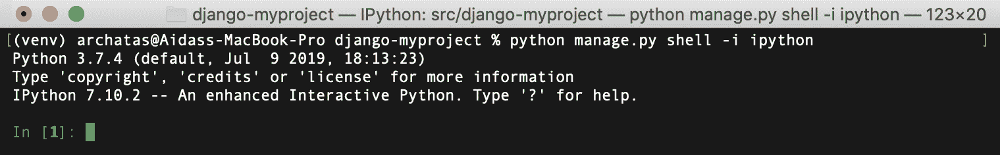

如果您使用`bpython`，shell 将显示`>>>`提示，并在您键入时突出显示代码和文本自动完成，如下所示：

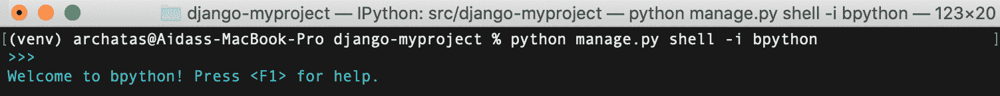

**默认 Python 接口**shell 如下所示，也使用`>>>`提示符，但带有提供系统信息的序言：

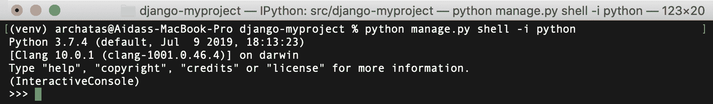

现在您可以导入类、函数或变量，并使用它们。例如，要查看已安装模块的版本，您可以导入该模块，然后尝试读取其`__version__`、`VERSION`或`version`属性（使用`bpython`显示，还将显示其高亮显示和自动完成功能），如下所示：

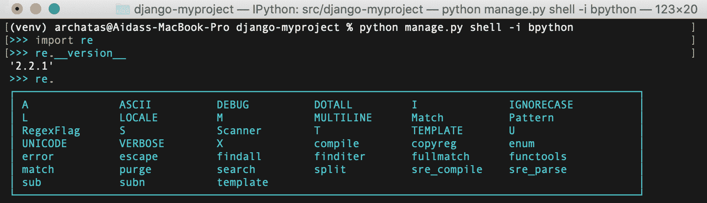

*   要获得模块、类、函数、方法、关键字或文档主题的全面描述，请使用`help()`函数。可以传递带有特定实体路径的字符串，也可以传递实体本身，如下所示：

```py
>>> help("django.forms")
```

这将打开`django.forms`模块的帮助页面。使用箭头键上下滚动页面。按`Q`返回外壳。如果您在没有参数的情况下运行`help()`，它将打开一个交互式帮助页面。在那里，您可以输入模块、类、函数等的任何路径，并获取有关其功能和使用方法的信息。要退出交互式帮助，请按`Ctrl + D`。

*   下面是如何使用 IPython 将实体传递给`help()`函数的示例：

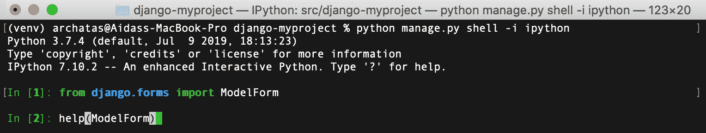

这样做将打开`ModelForm`类的帮助页面，如下所示：

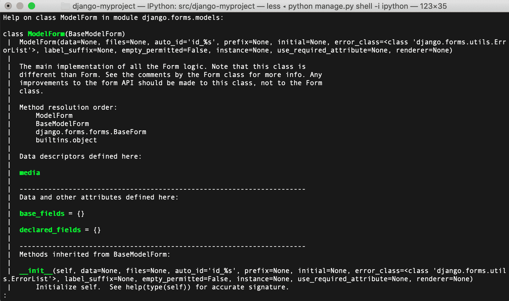

要快速查看模型实例的可用字段和值，请使用`__dict__`属性。您可以使用`pprint()`功能以更可读的格式打印字典（而不仅仅是一行），如下面的屏幕截图所示。注意，当我们使用`__dict__`时，我们不会得到多对多的关系；但是，这可能足以快速概述字段和值：


*   要获取对象的所有可用属性和方法，可以使用`dir()`函数，如下所示：

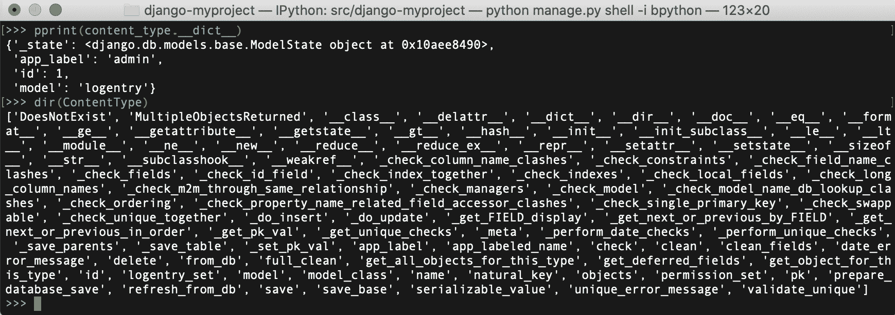

*   要每行打印一个属性，可以使用以下屏幕截图中显示的代码：

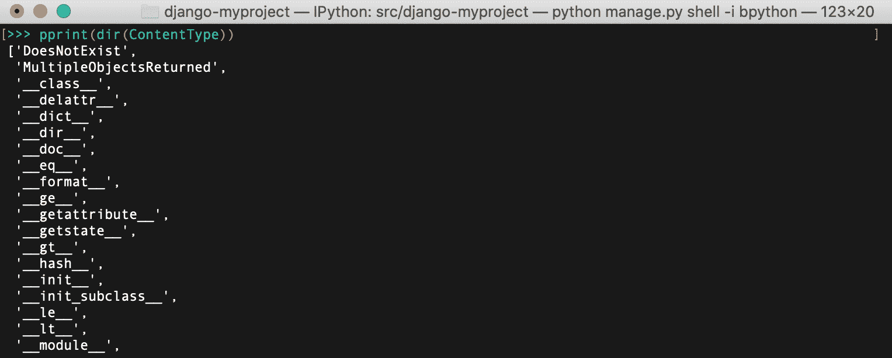

*   Django shell 对于在将`QuerySets`或正则表达式放入模型方法、视图或管理命令之前对其进行试验非常有用。例如，要检查电子邮件验证正则表达式，可以在 Django shell 中键入以下内容：

```py
>>> import re
>>> email_pattern = re.compile(r"[^@]+@[^@]+\.[^@]+")
>>> email_pattern.match("aidas@bendoraitis.lt")
<_sre.SRE_Match object at 0x1075681d0>
```

*   如果您想尝试不同的`QuerySets`，请使用以下代码：

```py
>>> from django.contrib.auth.models import User 
>>> User.objects.filter(groups__name="Editors")
[<User: admin>]
```

*   要退出 Django shell，请按*Ctrl*+*D*或键入以下命令：

```py
>>> exit()
```

# 它是如何工作的。。。

普通 Python shell 和 Django shell 之间的区别在于，当运行 Django shell 时，`manage.py`设置`DJANGO_SETTINGS_MODULE`环境变量，使其指向项目的`settings.py`路径，然后 Django shell 中的所有代码都在项目上下文中处理。通过使用第三方 IPython 或 bpython 接口，我们可以进一步增强默认的 pythonshell，包括语法高亮显示、自动完成等。

# 另见

*使用数据库查询表达式*配方

*猴子修补 slugify（）函数以获得更好的国际化支持*配方

# 使用数据库查询表达式

**Django 对象关系映射（ORM）**带有特殊的抽象结构，可用于构建复杂的数据库查询。它们被称为**查询表达式**，允许您过滤数据、排序数据、注释新列和聚合关系。在本食谱中，您将看到如何在实践中使用这些方法。我们将创建一个应用程序，显示病毒性视频，并统计匿名或登录用户看到每个视频的次数。

# 准备

首先，创建一个具有`ViralVideo`模型的`viral_videos`应用程序，并设置系统，使其默认登录到日志文件：

创建`viral_videos`应用并将其添加到`INSTALLED_APPS`下的设置：

```py
# myproject/settings/_base.py
INSTALLED_APPS = [
    # …
    "myproject.apps.core",
    "myproject.apps.viral_videos",
]
```

接下来，创建一个病毒视频模型，以**通用唯一标识符**（**UUID**为主键，以及创建和修改时间戳、标题、嵌入代码、匿名用户的印象和认证用户的印象，如下所示：

```py
# myproject/apps/viral_videos/models.py import uuid
from django.db import models
from django.utils.translation import ugettext_lazy as _

from myproject.apps.core.models import (
 CreationModificationDateBase,
 UrlBase,
)

class ViralVideo(CreationModificationDateBase, UrlBase):
    uuid = models.UUIDField(primary_key=True, default=None, 
     editable=False)
    title = models.CharField(_("Title"), max_length=200, blank=True)
    embed_code = models.TextField(_("YouTube embed code"), blank=True)
    anonymous_views = models.PositiveIntegerField(_("Anonymous 
     impressions"), default=0)
    authenticated_views = models.PositiveIntegerField(
        _("Authenticated impressions"), default=0
    )

    class Meta:
        verbose_name = _("Viral video")
        verbose_name_plural = _("Viral videos")

    def __str__(self):
        return self.title

    def get_url_path(self):
        from django.urls import reverse

        return reverse("viral_videos:viral_video_detail", 
         kwargs={"pk": self.pk})

    def save(self, *args, **kwargs):
        if self.pk is None:
            self.pk = uuid.uuid4()
        super().save(*args, **kwargs)
```

为新应用进行迁移并运行迁移，以便您的数据库准备就绪：

```py
(env)$ python manage.py makemigrations
(env)$ python manage.py migrate
```

将日志记录配置添加到设置：

```py
LOGGING = {
    "version": 1,
    "disable_existing_loggers": False,
    "handlers": {
        "file": {
            "level": "DEBUG",
            "class": "logging.FileHandler",
            "filename": os.path.join(BASE_DIR, "tmp", "debug.log"),
        }
    },
    "loggers": {"django": {"handlers": ["file"], "level": "DEBUG", 
     "propagate": True}},
}
```

这将把调试信息记录到名为`tmp/debug.log`的临时文件中。

# 怎么做。。。

为了演示查询表达式，让我们创建病毒视频详细视图并将其插入 URL 配置，如下所示：

1.  在`views.py`中创建病毒式视频列表和详细视图，如下所示：

```py
# myproject/apps/viral_videos/views.py
import logging

from django.conf import settings
from django.db import models
from django.utils.timezone import now, timedelta
from django.shortcuts import render, get_object_or_404
from django.views.generic import ListView

from .models import ViralVideo

POPULAR_FROM = getattr(settings, "VIRAL_VIDEOS_POPULAR_FROM", 500)

logger = logging.getLogger(__name__)

class ViralVideoList(ListView):
    template_name = "viral_videos/viral_video_list.html"
    model = ViralVideo

def viral_video_detail(request, pk):
    yesterday = now() - timedelta(days=1)

    qs = ViralVideo.objects.annotate(
        total_views=models.F("authenticated_views") + 
         models.F("anonymous_views"),
        label=models.Case(
            models.When(total_views__gt=POPULAR_FROM, 
             then=models.Value("popular")),
            models.When(created__gt=yesterday, 
             then=models.Value("new")),
            default=models.Value("cool"),
            output_field=models.CharField(),
        ),
    )

    # DEBUG: check the SQL query that Django ORM generates
    logger.debug(f"Query: {qs.query}")

    qs = qs.filter(pk=pk)
    if request.user.is_authenticated:
        qs.update(authenticated_views=models
         .F("authenticated_views") + 1)
    else:
        qs.update(anonymous_views=models.F("anonymous_views") + 1)

    video = get_object_or_404(qs)

    return render(request, "viral_videos/viral_video_detail.html", 
     {"video": video})
```

2.  定义应用的 URL 配置如下：

```py
# myproject/apps/viral_videos/urls.py
from django.urls import path

from .views import ViralVideoList, viral_video_detail

app_name = "viral_videos"

urlpatterns = [
    path("", ViralVideoList.as_view(), name="viral_video_list"),
    path("<uuid:pk>/", viral_video_detail, 
     name="viral_video_detail"),
]
```

3.  将应用的 URL 配置包括在项目的根 URL 配置中，如下所示：

```py
# myproject/urls.py
from django.conf.urls.i18n import i18n_patterns
from django.urls import include, path

urlpatterns = i18n_patterns(
path("viral-videos/", include("myproject.apps.viral_videos.urls", namespace="viral_videos")),
)
```

4.  为病毒视频列表视图创建模板，如下所示：

```py
{# viral_videos/viral_video_list.html #}




    <h1></h1>
    <ul>
        
            <li><a href="{{ video.get_url_path }}">
             {{ video.title }}</a></li>
        
    </ul>

```

5.  为病毒视频详细视图创建模板，如下所示：

```py
{# viral_videos/viral_video_detail.html #}




    <h1>{{ video.title }}
        <span class="badge">{{ video.label }}</span>
    </h1>
    <div>{{ video.embed_code|safe }}</div>
    <div>
        <h2></h2>
        <ul>
            <li>:
                {{ video.authenticated_views }}
            </li>
            <li>:
                {{ video.anonymous_views }}
            </li>
            <li>:
                {{ video.total_views }}
            </li>
        </ul>
    </div>

```

6.  按如下方式设置`viral_videos`应用程序的管理，完成后向数据库添加一些视频：

```py
# myproject/apps/viral_videos/admin.py
from django.contrib import admin
from .models import ViralVideo

@admin.register(ViralVideo)
class ViralVideoAdmin(admin.ModelAdmin):
    list_display = ["title", "created", "modified"]
```

# 它是如何工作的。。。

您可能已经注意到视图中的`logger.debug()`语句。如果您在`DEBUG`模式下运行服务器并在浏览器中访问视频（例如，在本地开发中的`http://127.0.0.1:8000/en/viral-videos/2b14ffd3-d1f1-4699-a07b-1328421d8312/`，您将在日志（`tmp/debug.log`中）中看到如下 SQL 查询：

```py
SELECT "viral_videos_viralvideo"."created", "viral_videos_viralvideo"."modified", "viral_videos_viralvideo"."uuid", "viral_videos_viralvideo"."title", "viral_videos_viralvideo"."embed_code", "viral_videos_viralvideo"."anonymous_views", "viral_videos_viralvideo"."authenticated_views", ("viral_videos_viralvideo"."authenticated_views" + "viral_videos_viralvideo"."anonymous_views") AS "total_views", CASE WHEN ("viral_videos_viralvideo"."authenticated_views" + "viral_videos_viralvideo"."anonymous_views") > 500 THEN 'popular' WHEN "viral_videos_viralvideo"."created" > '2019-12-21T05:01:58.775441+00:00'::timestamptz THEN 'new' ELSE 'cool' END 
 AS "label" FROM "viral_videos_viralvideo" WHERE "viral_videos_viralvideo"."uuid" = '2b14ffd3-d1f1-4699-a07b-1328421d8312'::uuid LIMIT 21; args=(500, 'popular', datetime.datetime(2019, 12, 21, 5, 1, 58, 775441, tzinfo=<UTC>), 'new', 'cool', UUID('2b14ffd3-d1f1-4699-a07b-1328421d8312'))
```

然后，在浏览器中，您将看到一个简单的页面，显示以下内容：

*   视频的标题
*   视频的标签
*   嵌入式视频
*   来自已验证用户和匿名用户的视图数，以及总视图数

它将类似于下图：


Django`QuerySets`中的`annotate()`方法允许您向`SELECT`SQL 语句添加额外的列，以及为从`QuerySets`检索到的对象动态创建的属性。通过`models.F()`，我们可以从所选数据库表中引用不同的字段值。在本例中，我们将创建`total_views`属性，它是来自已验证用户和匿名用户的视图的总和。

使用`models.Case()`和`models.When()`，我们可以根据不同的条件返回值。为了标记这些值，我们使用了`models.Value()`。在我们的示例中，我们将为 SQL 查询创建`label`列，并为`QuerySet`返回的对象创建属性。如果它有超过 500 个印象，它将被设置为流行，如果它是在过去的 24 小时内创建的，它将被设置为新，否则将被设置为酷。

在视图的末尾，我们调用了`qs.update()`方法。它们增加当前视频的`authenticated_views`或`anonymous_views`，这取决于观看视频的用户是否已登录。增量不是在 Python 级别进行的，而是在 SQL 级别进行的。这解决了所谓的竞争条件问题，即两个或多个访问者同时访问视图，试图同时增加视图数量。

# 另见

*   *使用 Django shell*配方
*   在[第 2 章](02.html)*中*使用 URL 相关方法*创建模型 mixin，模型和数据库结构*
*   在[第二章](02.html)*中*创建模型 mixin 来处理创建和修改日期*配方，模型和数据库结构*

# Monkey 修补 slugify（）函数以获得更好的国际化支持

monkey 补丁（或 guerrilla 补丁）是在运行时扩展或修改另一段代码的代码。不建议您经常使用猴子贴片；但是，有时，它们是修复复杂第三方模块中的 bug 的唯一可能方法，而无需创建模块的单独分支。此外，猴子补丁可以用于准备功能或单元测试，而无需使用复杂和耗时的数据库或文件操作。

在本教程中，您将学习如何将默认的`slugify()`函数与第三方`transliterate`软件包中的函数交换，该软件包更智能地处理 Unicode 字符到 ASCII 等效字符的转换，并包括许多语言包，可根据需要提供更具体的转换。作为一个快速提醒，我们使用`slugify()`实用程序创建对象标题或上传文件名的 URL 友好版本。处理时，该函数会去除所有前导和尾随空格，将文本转换为小写，删除非字母数字字符，并将空格转换为连字符。

# 准备

让我们从以下几个小步骤开始：

1.  在您的虚拟环境中安装`transliterate`如下：

```py
(env)$ pip install transliterate==1.10.2
```

2.  然后，在项目中创建一个`guerrilla_patches`应用程序，并将其置于设置中的`INSTALLED_APPS`下。

# 怎么做。。。

在`guerrilla_patches`app 的`models.py`文件中，用`transliterate`包中的`slugify`函数覆盖`django.utils.text`中的`slugify`函数：

```py
# myproject/apps/guerrilla_patches/models.py from django.utils import text
from transliterate import slugify

text.slugify = slugify
```

# 它是如何工作的。。。

默认的 Django`slugify()`函数不正确地处理德语变音符号。为了让自己明白这一点，试着用所有德语发音符号拼凑一个很长的德语单词。首先，在 Django shell 中运行以下代码，不使用 monkey 补丁：

```py
(env)$ python manage.py shell
>>> from django.utils.text import slugify
>>> slugify("Heizölrückstoßabdämpfung")
'heizolruckstoabdampfung'
```

这在德语中是不正确的，因为字母`ß`被完全删除，而不是替换为`ss`，字母`ä`、`ö`和`ü`被更改为`a`、`o`和`u`，它们本应被`ae`、`oe`和`ue`替换。

我们创建的 monkey 补丁在初始化时加载`django.utils.text`模块，并重新分配`transliteration.slugify`以代替核心`slugify()`功能。现在，如果在 Django shell 中运行相同的代码，您将获得正确的结果，如下所示：

```py
(env)$ python manage.py shell
>>> from django.utils.text import slugify
>>> slugify("Heizölrückstoßabdämpfung")
'heizoelrueckstossabdaempfung'
```

有关如何使用`transliterate`模块的更多信息，请参阅[https://pypi.org/project/transliterate](https://pypi.org/project/transliterate/) 。

# 还有更多。。。

在创建 monkey 补丁之前，我们需要完全了解要修改的代码是如何工作的。这可以通过分析现有代码和检查不同变量的值来实现。为此，有一个有用的内置 Python 调试器模块**pdb**，可以临时添加到 Django 代码（或任何第三方模块）中，以在任何断点停止开发服务器的执行。使用以下代码调试 Python 模块中不清楚的部分：

```py
breakpoint()
```

这将启动交互式 shell，您可以在其中键入变量以查看其值。如果您键入`c`或`continue`，代码将继续执行，直到下一个断点。如果您键入`q`或`quit`，管理命令将被中止。

您可以在[了解更多 Python 调试器命令以及如何检查代码的回溯 https://docs.python.org/3/library/pdb.html](https://docs.python.org/3/library/pdb.html) 。

查看开发服务器中变量值的另一种快速方法是以消息形式发出警告，如下所示：

```py
raise Warning, some_variable

```

当您处于`DEBUG`模式时，Django 记录器将为您提供回溯和其他局部变量。

在将工作提交到存储库之前，不要忘记删除调试代码。

如果您使用的是 PyCharm 交互式开发环境，则可以在那里直观地设置断点和调试变量，而无需修改源代码。

# 另见

*   *使用 Django shell*配方

# 切换调试工具栏

在使用 Django 开发时，您可能希望检查请求头和参数，检查当前模板上下文，或者测量 SQL 查询的性能。使用**Django 调试工具栏**可以实现所有这些以及更多功能。它是一组可配置的面板，显示有关当前请求和响应的各种调试信息。在这个配方中，我们将指导您如何切换调试工具栏的可见性，这取决于一个 cookie，它的值可以由 bookmarklet 设置。bookmarklet 是带有一小段 JavaScript 代码的书签，您可以在浏览器的任何页面上运行它。

# 准备

要开始切换调试工具栏的可见性，请执行以下步骤：

1.  在虚拟环境中安装 Django 调试工具栏：

```py
(env)$ pip install django-debug-toolbar==2.1

```

2.  在【设置】中`INSTALLED_APPS`下增加`"debug_toolbar"`：

```py
# myproject/settings/_base.py
INSTALLED_APPS = [
    # …
    "debug_toolbar",
]
```

# 怎么做。。。

按照以下步骤设置 Django 调试工具栏，可以使用浏览器中的 bookmarklet 打开或关闭该工具栏：

1.  添加以下项目设置：

```py
# myproject/settings/_base.py
DEBUG_TOOLBAR_CONFIG = {
    "DISABLE_PANELS": [],
    "SHOW_TOOLBAR_CALLBACK": 
    "myproject.apps.core.misc.custom_show_toolbar",
    "SHOW_TEMPLATE_CONTEXT": True,
}

DEBUG_TOOLBAR_PANELS = [
    "debug_toolbar.panels.versions.VersionsPanel",
    "debug_toolbar.panels.timer.TimerPanel",
    "debug_toolbar.panels.settings.SettingsPanel",
    "debug_toolbar.panels.headers.HeadersPanel",
    "debug_toolbar.panels.request.RequestPanel",
    "debug_toolbar.panels.sql.SQLPanel",
    "debug_toolbar.panels.templates.TemplatesPanel",
    "debug_toolbar.panels.staticfiles.StaticFilesPanel",
    "debug_toolbar.panels.cache.CachePanel",
    "debug_toolbar.panels.signals.SignalsPanel",
    "debug_toolbar.panels.logging.LoggingPanel",
    "debug_toolbar.panels.redirects.RedirectsPanel",
]
```

2.  在`core`应用中，创建一个具有`custom_show_toolbar()`功能的`misc.py`文件，如下所示：

```py
# myproject/apps/core/misc.py
def custom_show_toolbar(request):
    return "1" == request.COOKIES.get("DebugToolbar", False)
```

3.  在项目的`urls.py`中，增加以下配置规则：

```py
# myproject/urls.py
from django.conf.urls.i18n import i18n_patterns
from django.urls import include, path
from django.conf import settings
import debug_toolbar

urlpatterns = i18n_patterns(
    # …
)

urlpatterns = [
    path('__debug__/', include(debug_toolbar.urls)),
] + urlpatterns
```

4.  打开 Chrome 或 Firefox 浏览器并转到书签管理器。然后，创建两个包含 JavaScript 的新书签。第一个链接将显示工具栏，其外观类似于以下内容：

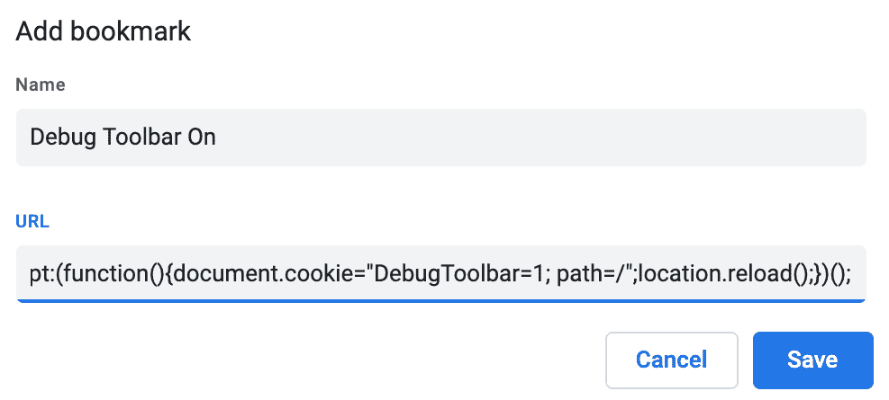

JavaScript 代码如下：

```py
javascript:(function(){document.cookie="DebugToolbar=1; path=/";location.reload();})();
```

5.  第二个 JavaScript 链接将隐藏工具栏，看起来类似于以下内容：


这是完整的 JavaScript 代码：

```py
javascript:(function(){document.cookie="DebugToolbar=0; path=/";location.reload();})();
```

# 它是如何工作的。。。

`DEBUG_TOOLBAR_PANELS`设置定义要在工具栏中显示的面板。`DEBUG_TOOLBAR_CONFIG`字典定义了工具栏的配置，包括用于检查是否显示工具栏的功能的路径。

默认情况下，当您浏览项目时，Django 调试工具栏将不会显示；但是，当您单击 bookmarklet，Debug Toolbar on 时，`DebugToolbar`cookie 将被设置为`1`，页面将被刷新，您将看到带有调试面板的工具栏。例如，您将能够检查 SQL 语句的性能以进行优化，如以下屏幕截图所示：

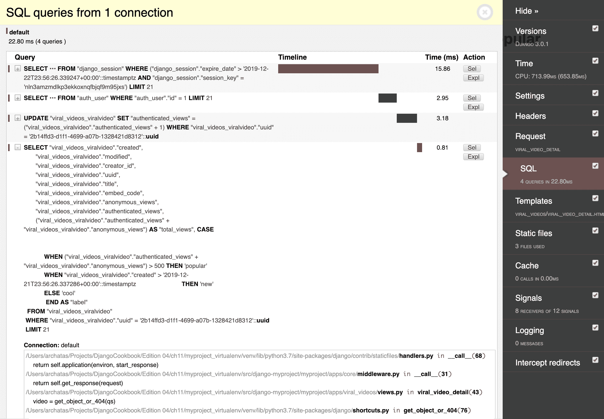

您还可以检查当前视图的模板上下文变量，如以下屏幕截图所示：

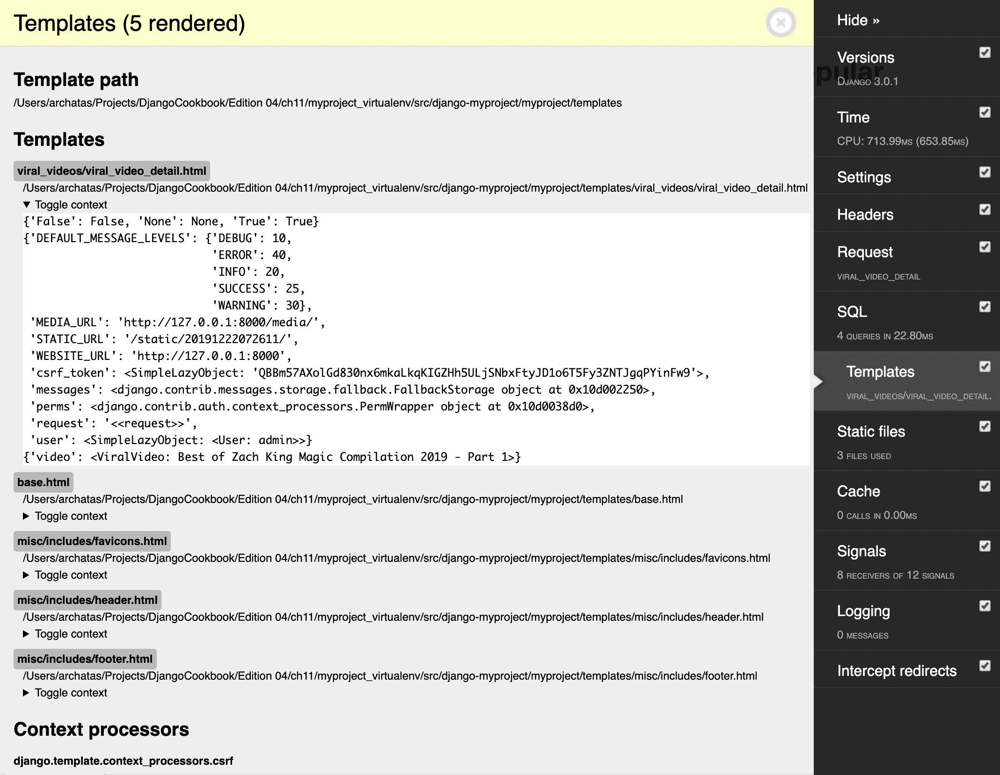

单击第二个 bookmarklet，Debug Toolbar Off，同样会将`DebugToolbar`cookie 设置为`0`，并刷新页面，再次隐藏工具栏。

# 另见

*   [第 13 章](13.html)*维护中的*通过电子邮件*获取详细的错误报告*

 *# 使用 ThreadLocalMiddleware

`HttpRequest`对象包含有关当前用户、语言、服务器变量、cookie、会话等的有用信息。事实上，`HttpRequest`是在视图和中间件中提供的，您可以将其（或其属性值）传递给表单、模型方法、模型管理器、模板等。为了简化操作，您可以使用所谓的`ThreadLocalMiddleware`将当前`HttpRequest`对象存储在全局可访问的 Python 线程中。因此，您可以从模型方法、表单、信号处理程序和以前没有直接访问`HttpRequest`对象的其他地方访问它。在这个配方中，我们将定义这个中间件。

# 准备

创建`core`应用程序并将其置于设置中的`INSTALLED_APPS`下（如果您尚未这样做）。

# 怎么做。。。

执行以下两个步骤设置`ThreadLocalMiddleware`，可用于获取项目代码中任何功能或方法的当前`HttpRequest`或用户：

1.  在`core`app 中添加一个`middleware.py`文件，内容如下：

```py
# myproject/apps/core/middleware.py
from threading import local

_thread_locals = local()

def get_current_request():
    """
    :returns the HttpRequest object for this thread
    """
    return getattr(_thread_locals, "request", None)

def get_current_user():
    """
    :returns the current user if it exists or None otherwise """
    request = get_current_request()
    if request:
        return getattr(request, "user", None)

class ThreadLocalMiddleware(object):
    """
    Middleware to add the HttpRequest to thread local storage
    """

    def __init__(self, get_response):
        self.get_response = get_response

    def __call__(self, request):
        _thread_locals.request = request
        return self.get_response(request)
```

2.  将此中间件添加到
    设置中的`MIDDLEWARE`

```py
# myproject/settings/_base.py
MIDDLEWARE = [
    "django.middleware.security.SecurityMiddleware",
    "django.contrib.sessions.middleware.SessionMiddleware",
    "django.middleware.common.CommonMiddleware",
    "django.middleware.csrf.CsrfViewMiddleware",
    "django.contrib.auth.middleware.AuthenticationMiddleware",
    "django.contrib.messages.middleware.MessageMiddleware",
    "django.middleware.clickjacking.XFrameOptionsMiddleware",
    "django.middleware.locale.LocaleMiddleware",
    "debug_toolbar.middleware.DebugToolbarMiddleware",
 "myproject.apps.core.middleware.ThreadLocalMiddleware",
]
```

# 它是如何工作的。。。

`ThreadLocalMiddleware`处理每个请求，并将当前`HttpRequest`对象存储在当前线程中。Django 中的每个请求-响应周期都是单线程的。我们创建了两个函数：`get_current_request()`和`get_current_user()`。这些功能可以在任何地方使用，分别抓取当前`HttpRequest`对象或当前用户。

例如，您可以使用该中间件开发和使用`CreatorMixin`，将当前用户保存为新模型对象的创建者，如下所示：

```py
# myproject/apps/core/models.py
from django.conf import settings
from django.db import models
from django.utils.translation import gettext_lazy as _

class CreatorBase(models.Model):
    """
    Abstract base class with a creator
    """

    creator = models.ForeignKey(
        settings.AUTH_USER_MODEL,
        verbose_name=_("creator"),
        editable=False,
        blank=True,
        null=True,
        on_delete=models.SET_NULL,
    )

    class Meta:
        abstract = True

    def save(self, *args, **kwargs):
        from .middleware import get_current_user

        if not self.creator:
 self.creator = get_current_user()
        super().save(*args, **kwargs)

    save.alters_data = True
```

# 另见

*   在[第 2 章](02.html)*中*使用 URL 相关方法*配方创建模型 mixin，模型与数据库**结构*
*   [第 2 章](02.html)*中*创建模型 mixin 来处理创建和修改日期*配方，模型和数据库结构*
*   *创建模型 mixin 来处理[第 2 章](02.html)*中的元标签*配方、模型和数据库结构*
*   [第 2 章](02.html)*中*创建模型 mixin 来处理泛型关系*配方，模型和数据库结构*

# 使用信号通知管理员有关新条目的信息

Django 框架包含了**信号**的概念，类似于 JavaScript 中的事件。有一些内置信号。您可以使用它们在初始化模型、保存或删除实例、迁移数据库架构、处理请求等之前和之后触发操作。此外，您可以在可重用的应用程序中创建自己的信号，并在其他应用程序中处理这些信号。在本食谱中，您将学习如何在保存特定模型时使用信号向管理员发送电子邮件。

# 准备

让我们从使用数据库查询表达式配方在*中创建的`viral_videos`应用程序开始。*

# 怎么做。。。

按照以下步骤为管理员创建通知：

1.  创建一个包含以下内容的`signals.py`文件：

```py
# myproject/apps/viral_videos/signals.py
from django.db.models.signals import post_save
from django.dispatch import receiver
from django.template.loader import render_to_string

from .models import ViralVideo

@receiver(post_save, sender=ViralVideo)
def inform_administrators(sender, **kwargs):
    from django.core.mail import mail_admins

    instance = kwargs["instance"]
    created = kwargs["created"]

    if created:
        context = {"title": instance.title, "link": 
         instance.get_url()}
        subject = render_to_string(
            "viral_videos/email/administrator/subject.txt", context
        )
        plain_text_message = render_to_string(
            "viral_videos/email/administrator/message.txt", context
        )
        html_message = render_to_string(
            "viral_videos/email/administrator/message.html", 
              context
        )

        mail_admins(
            subject=subject.strip(),
            message=plain_text_message,
            html_message=html_message,
            fail_silently=True,
        )
```

2.  然后我们需要创建一些模板。从电子邮件主题的模板开始：

```py
{# viral_videos/email/administrator/subject.txt #}
New Viral Video Added
```

3.  然后为纯文本消息创建一个模板，如下所示：

```py
{# viral_videos/email/administrator/message.txt #}
A new viral video called "{{ title }}" has been created.
You can preview it at {{ link }}.
```

4.  然后为 HTML 消息创建一个模板，如下所示：

```py
{# viral_videos/email/administrator/message.html #}
<p>A new viral video called "{{ title }}" has been created.</p>
<p>You can <a href="{{ link }}">preview it here</a>.</p>
```

5.  创建具有以下内容的`apps.py`文件：

```py
# myproject/apps/viral_videos/apps.py
from django.apps import AppConfig
from django.utils.translation import ugettext_lazy as _

class ViralVideosAppConfig(AppConfig):
    name = "myproject.apps.viral_videos"
    verbose_name = _("Viral Videos")

    def ready(self):
        from .signals import inform_administrators
```

6.  用以下内容更新`__init__.py`文件：

```py
# myproject/apps/viral_videos/__init__.py
default_app_config = "myproject.apps.viral_videos.apps.ViralVideosAppConfig"
```

确保在项目设置中设置了与以下类似的`ADMINS`：

```py
# myproject/settings/_base.py
ADMINS = [("Administrator", "admin@example.com")]
```

# 它是如何工作的。。。

`ViralVideosAppConfig`app 配置类有`ready()`方法，当项目的所有模型加载到内存中时会调用该方法。根据 Django 文档，信号允许某些发送者通知一组接收者某个动作已经发生。因此，在`ready()`方法中，我们导入`inform_administrators()`函数。

通过`@receiver`装饰器，`inform_administrators()`注册`post_save`信号，我们将其限制为只处理`ViralVideo`型号为`sender`的信号。因此，每当我们保存一个`ViralVideo`对象时，就会调用`receiver`函数。`inform_administrators()`功能检查视频是否是新创建的。如果是，则向设置中的`ADMINS`中列出的系统管理员发送电子邮件。

我们使用模板生成`subject`、`plain_text_message`和`html_message`的内容，这样我们就可以在我们的应用程序中为这些内容定义默认模板。如果我们公开发布我们的`viral_videos`应用程序，那么那些将其应用到自己项目中的人就可以根据需要定制模板，或许可以将其包装在公司电子邮件模板包装器中。

有关 Django 信号的更多信息，请访问官方文档[https://docs.djangoproject.com/en/3.0/topics/signals/](https://docs.djangoproject.com/en/3.0/topics/signals/) 。

# 另见

*   [第一章](01.html)*中的*创建应用配置*配方，Django 3.0*入门
*   *使用数据库查询表达式*配方
*   *检查缺少的设置*配方

# 检查缺少的设置

从 Django 1.7 开始，您可以使用可扩展的**系统检查框架**，它取代了旧的`validate`管理命令。在本配方中，您将学习如何在设置了`ADMINS`设置后创建检查。类似地，您将能够检查是否为正在使用的 API 设置了不同的密钥或访问令牌。

# 准备

让我们从`viral_videos`应用程序开始，该应用程序是在*中使用数据库查询表达式*配方创建的，并在前面的配方中进行了扩展。

# 怎么做。。。

要使用系统检查框架，请执行以下步骤：

1.  创建具有以下内容的`checks.py`文件：

```py
# myproject/apps/viral_videos/checks.py
from textwrap import dedent

from django.core.checks import Warning, register, Tags

@register(Tags.compatibility)
def settings_check(app_configs, **kwargs):
    from django.conf import settings

    errors = []

    if not settings.ADMINS:
        errors.append(
            Warning(
                dedent("""
                    The system admins are not set in the project 
                     settings
                """),
                obj=settings,
                hint=dedent("""
                    In order to receive notifications when new 
                     videos are created, define system admins 
                     in your settings, like:

                    ADMINS = (
                        ("Admin", "administrator@example.com"),
                    )
                """),
                id="viral_videos.W001",
            )
        )

    return errors
```

2.  在 app 配置的`ready()`方法中导入检查，如下所示：

```py
# myproject/apps/viral_videos/apps.py
from django.apps import AppConfig
from django.utils.translation import ugettext_lazy as _

class ViralVideosAppConfig(AppConfig):
    name = "myproject.apps.viral_videos"
    verbose_name = _("Viral Videos")

    def ready(self):
        from .signals import inform_administrators
        from .checks import settings_check
```

3.  要尝试检查您刚刚创建的内容，请删除或注释掉`ADMINS`设置，然后在您的虚拟环境中运行`check`管理命令：

```py
(env)$ python manage.py check
System check identified some issues:

WARNINGS:
<Settings "myproject.settings.dev">: (viral_videos.W001)
The system admins are not set in the project settings

HINT:
In order to receive notifications when new videos are
created, define system admins in your settings, like:

ADMINS = (
    ("Admin", "administrator@example.com"),
)

System check identified 1 issue (0 silenced).
```

# 它是如何工作的。。。

系统检查框架在模型、字段、数据库、管理身份验证配置、内容类型和安全设置中有一系列检查，如果项目中的某些内容设置不正确，则会引发错误或警告。此外，您可以创建自己的检查，类似于我们在本配方中所做的。

我们已经注册了`settings_check()`函数，如果没有为项目定义`ADMINS`设置，则返回一个带有`Warning`的列表。

除了`django.core.checks`模块中的`Warning`实例外，返回列表中还可以包含`Debug`、`Info`、`Error`、`Critical`内置类的实例或继承自`django.core.checks.CheckMessage`的任何其他类的实例。在调试、信息和警告级别的日志记录将自动失败，而在错误和关键级别的日志记录将阻止项目运行。

在本例中，该检查通过传递给`@register`装饰器的`Tags.compatibility`参数标记为兼容性检查。`Tags`中提供的其他选项包括：

*   `admin`用于与管理站点相关的检查
*   `caches`用于与服务器缓存相关的检查
*   `database`用于与数据库配置相关的检查
*   `models`用于与模型、模型字段和管理器相关的检查
*   `security`用于安全相关检查
*   `signals`用于与信号声明和处理程序相关的检查
*   `staticfiles`用于静态文件检查
*   `templates`用于模板相关检查
*   `translation`用于与字符串翻译相关的检查
*   `url`用于与 URL 配置相关的检查

在[的官方文档中了解更多关于系统检查框架的信息 https://docs.djangoproject.com/en/3.0/topics/checks/](https://docs.djangoproject.com/en/3.0/topics/checks/) ​.

# 另见

*   [第一章](01.html)*中的*创建应用配置*配方，Django 3.0*入门
*   *使用数据库查询表达式*配方
*   *使用信号通知管理员新条目*配方***